# `comic-translate\app\ui\dayu_widgets\drawer.py` 详细设计文档

MDrawer是一个基于PySide6的侧边栏抽屉组件，支持从屏幕四边（左、右、上、下）滑入滑出，带有位置和透明度动画效果，可配置的标题栏、关闭按钮和内容区域，适用于实现侧边面板、设置抽屉等UI场景。

## 整体流程

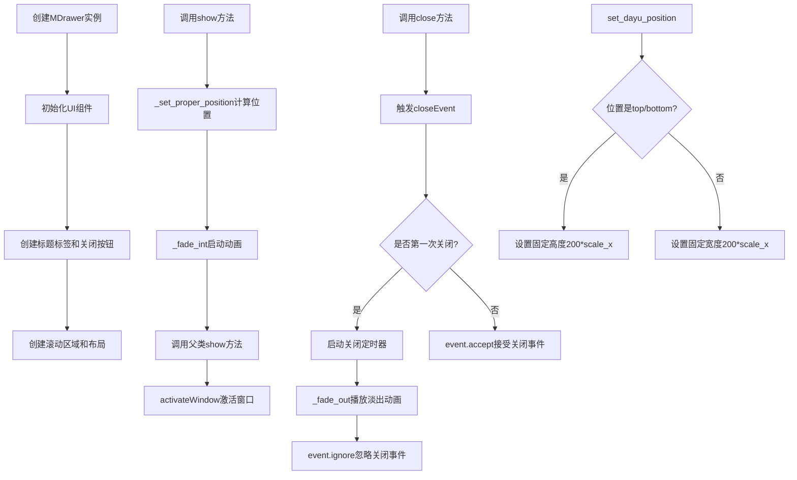

## 类结构

```
QtWidgets.QWidget
└── MDrawer (自定义抽屉组件)
```

## 全局变量及字段


### `LeftPos`
    
左边位置常量

类型：`str`
    


### `RightPos`
    
右边位置常量

类型：`str`
    


### `TopPos`
    
顶部位置常量

类型：`str`
    


### `BottomPos`
    
底部位置常量

类型：`str`
    


### `sig_closed`
    
关闭信号

类型：`QtCore.Signal`
    


### `MDrawer._title_label`
    
标题标签组件

类型：`MLabel`
    


### `MDrawer._close_button`
    
关闭按钮组件

类型：`MToolButton`
    


### `MDrawer._title_extra_lay`
    
标题额外区域水平布局

类型：`QtWidgets.QHBoxLayout`
    


### `MDrawer._bottom_lay`
    
底部区域水平布局

类型：`QtWidgets.QHBoxLayout`
    


### `MDrawer._scroll_area`
    
内容滚动区域

类型：`QtWidgets.QScrollArea`
    


### `MDrawer._main_lay`
    
主垂直布局

类型：`QtWidgets.QVBoxLayout`
    


### `MDrawer._position`
    
抽屉位置(left/right/top/bottom)

类型：`str`
    


### `MDrawer._close_timer`
    
关闭定时器

类型：`QtCore.QTimer`
    


### `MDrawer._is_first_close`
    
是否第一次关闭的标志

类型：`bool`
    


### `MDrawer._pos_ani`
    
位置动画

类型：`QtCore.QPropertyAnimation`
    


### `MDrawer._opacity_ani`
    
透明度动画

类型：`QtCore.QPropertyAnimation`
    
    

## 全局函数及方法


### MDrawer.__init__

初始化抽屉组件，创建一个从屏幕边缘滑入的面板，支持左、右、上、下四个位置，并可配置是否显示关闭按钮。

参数：

- `title`：`str`，抽屉面板的标题文本
- `position`：`str`，抽屉滑出的位置，可选值为 "left"、"right"、"top"、"bottom"，默认为 "right"
- `closable`：`bool`，是否显示关闭按钮，默认为 True
- `parent`：`QtWidgets.QWidget`，父窗口部件，默认为 None

返回值：`None`，`__init__` 方法不返回值，用于初始化对象状态

#### 流程图

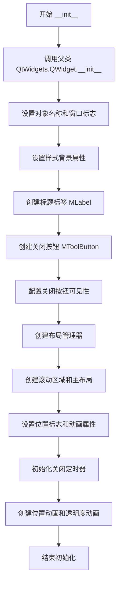

#### 带注释源码

```python
def __init__(self, title, position="right", closable=True, parent=None):
    # 调用父类的初始化方法，设置父窗口部件
    super(MDrawer, self).__init__(parent)
    
    # 设置对象名称，用于样式和调试
    self.setObjectName("message")
    
    # 设置窗口标志为弹出式窗口
    self.setWindowFlags(QtCore.Qt.Popup)
    # 注释：也可以设置为无边框窗口和半透明背景（当前被注释）
    # self.setWindowFlags(
    #     Qt.FramelessWindowHint | Qt.Popup | Qt.WA_TranslucentBackground)
    
    # 设置属性以支持样式化背景
    self.setAttribute(QtCore.Qt.WA_StyledBackground)

    # 创建标题标签，设置为h4样式
    self._title_label = MLabel(parent=self).h4()
    # 注释：设置标题文本，可选省略模式（当前被注释）
    self._title_label.setText(title)
    # self._title_label.set_elide_mode(Qt.ElideRight)

    # 创建关闭按钮，设置为仅显示图标、小尺寸、close_line.svg图标
    self._close_button = MToolButton(parent=self).icon_only().svg("close_line.svg").small()
    # 连接关闭按钮的点击信号到close方法
    self._close_button.clicked.connect(self.close)
    # 根据closable参数设置关闭按钮是否可见
    self._close_button.setVisible(closable or False)

    # 创建标题区域的额外布局和主标题布局
    self._title_extra_lay = QtWidgets.QHBoxLayout()
    _title_lay = QtWidgets.QHBoxLayout()
    # 将标题标签添加到标题布局
    _title_lay.addWidget(self._title_label)
    # 添加弹性空间
    _title_lay.addStretch()
    # 将额外布局添加到标题布局
    _title_lay.addLayout(self._title_extra_lay)
    # 将关闭按钮添加到标题布局
    _title_lay.addWidget(self._close_button)
    
    # 创建底部布局并添加弹性空间
    self._bottom_lay = QtWidgets.QHBoxLayout()
    self._bottom_lay.addStretch()

    # 创建滚动区域，设置可调整大小
    self._scroll_area = QtWidgets.QScrollArea()
    self._scroll_area.setWidgetResizable(True)
    
    # 创建主垂直布局
    self._main_lay = QtWidgets.QVBoxLayout()
    # 添加标题布局
    self._main_lay.addLayout(_title_lay)
    # 添加分隔线
    self._main_lay.addWidget(MDivider())
    # 添加滚动区域
    self._main_lay.addWidget(self._scroll_area)
    # 添加分隔线
    self._main_lay.addWidget(MDivider())
    # 添加底部布局
    self._main_lay.addLayout(self._bottom_lay)
    # 设置主布局
    self.setLayout(self._main_lay)

    # 保存位置参数
    self._position = position

    # 创建单次触发的关闭定时器
    self._close_timer = QtCore.QTimer(self)
    self._close_timer.setSingleShot(True)
    # 定时器超时时执行close和sig_closed信号
    self._close_timer.timeout.connect(self.close)
    self._close_timer.timeout.connect(self.sig_closed)
    # 设置定时器间隔为300毫秒
    self._close_timer.setInterval(300)
    # 标记是否为首次关闭
    self._is_first_close = True

    # 创建位置属性动画
    self._pos_ani = QtCore.QPropertyAnimation(self)
    self._pos_ani.setTargetObject(self)
    # 设置缓动曲线为OutCubic
    self._pos_ani.setEasingCurve(QtCore.QEasingCurve.OutCubic)
    # 设置动画持续时间300毫秒
    self._pos_ani.setDuration(300)
    # 设置动画属性为位置
    self._pos_ani.setPropertyName(b"pos")

    # 创建透明度属性动画
    self._opacity_ani = QtCore.QPropertyAnimation()
    self._opacity_ani.setTargetObject(self)
    self._opacity_ani.setDuration(300)
    self._opacity_ani.setEasingCurve(QtCore.QEasingCurve.OutCubic)
    # 设置动画属性为窗口透明度
    self._opacity_ani.setPropertyName(b"windowOpacity")
    # 设置透明度从0到1
    self._opacity_ani.setStartValue(0.0)
    self._opacity_ani.setEndValue(1.0)
```


### `MDrawer.set_widget`

设置 MDrawer 滚动区域的内容 widget，用于向抽屉面板中添加主要的交互内容。

参数：

- `widget`：`QtWidgets.QWidget`，要设置为滚动区域内容的 Qt 控件对象

返回值：`None`，该方法无返回值，仅执行控件设置操作

#### 流程图

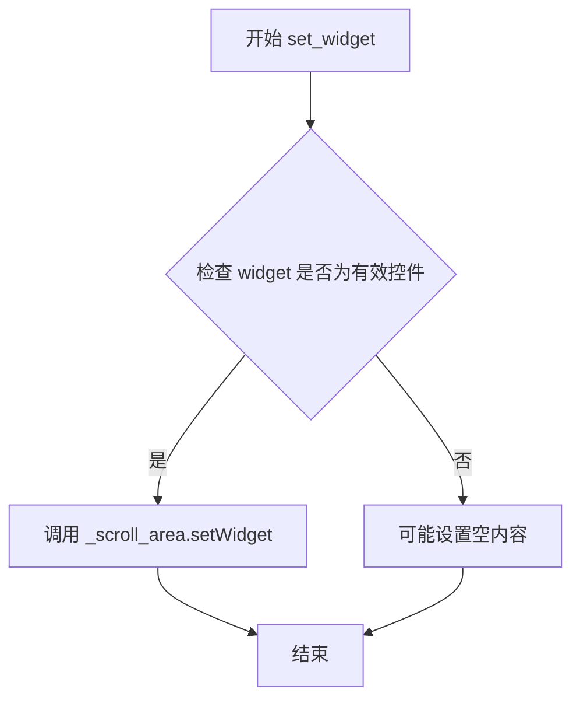

#### 带注释源码

```python
def set_widget(self, widget):
    """
    设置滚动区域的内容widget
    
    Args:
        widget: QtWidgets.QWidget类型，要放入滚动区域的控件对象
        
    Returns:
        None
    """
    # 调用QScrollArea的setWidget方法将传入的widget设置为滚动区域的内容
    # QScrollArea会自动管理widget的显示和滚动行为
    self._scroll_area.setWidget(widget)
```


### `MDrawer.add_widget_to_bottom`

将指定的widget添加到抽屉组件的底部区域。

参数：

-  `button`：`QtWidgets.QWidget`，需要添加到底部区域的widget对象

返回值：`None`，该方法没有返回值

#### 流程图

```mermaid
graph TD
    A[开始 add_widget_to_bottom] --> B{检查button有效性}
    B -->|有效| C[调用self._bottom_lay.addWidget(button)]
    C --> D[将widget添加到底部布局]
    D --> E[结束]
    B -->|无效| E
```

#### 带注释源码

```python
def add_widget_to_bottom(self, button):
    """
    添加widget到底部区域
    
    Args:
        button: 需要添加到底部的widget对象，通常为按钮控件
        
    Returns:
        None
        
    Example:
        >>> drawer = MDrawer(title="测试抽屉")
        >>> button = QPushButton("确定")
        >>> drawer.add_widget_to_bottom(button)
    """
    # 使用底部布局的addWidget方法将传入的widget添加到布局中
    self._bottom_lay.addWidget(button)
```


### `MDrawer.add_widget_to_top`

该方法用于向抽屉组件的标题栏右侧额外区域添加自定义控件（如按钮、图标等），使开发者能够在标题区域插入额外的交互元素。

参数：

- `button`：`QtWidgets.QWidget`，要添加到标题额外区域的控件对象，通常为按钮或其他可显示的 Qt 控件

返回值：`None`，该方法不返回任何值，仅执行控件的添加操作

#### 流程图

```mermaid
flowchart TD
    A[开始 add_widget_to_top] --> B{验证 button 参数}
    B -->|参数有效| C[调用 self._title_extra_lay.addWidget(button)]
    C --> D[将 button 添加到标题额外布局]
    D --> E[结束]
    
    B -->|参数为 None| F[可能抛出异常或静默失败]
    F --> E
```

#### 带注释源码

```python
def add_widget_to_top(self, button):
    """
    添加控件到标题栏的额外区域（标题栏右侧）。
    
    该方法允许开发者在 MDrawer 标题区域的右侧（关闭按钮左侧）添加
    自定义控件，如工具按钮、图标等。这通常用于添加自定义操作按钮
    或状态指示器。
    
    参数:
        button: QtWidgets.QWidget 实例，要添加的控件对象。
               常见的用例是 MToolButton 或其他可交互的控件。
    
    返回值:
        None
    
    示例:
        # 创建一个工具按钮并添加到标题区域
        custom_btn = MToolButton(parent=self).icon_only().svg("settings.svg")
        drawer.add_widget_to_top(custom_btn)
    """
    # 将传入的 button 控件添加到标题额外区域的水平布局中
    # _title_extra_lay 是一个 QHBoxLayout，在标题栏右侧创建了额外的空间
    # 这允许在关闭按钮之前添加自定义控件
    self._title_extra_lay.addWidget(button)
```

---

### 上下文关联信息

#### 1. 相关类字段

| 字段名 | 类型 | 描述 |
|--------|------|------|
| `_title_extra_lay` | `QtWidgets.QHBoxLayout` | 标题栏额外区域的水平布局，用于容纳自定义控件 |
| `_close_button` | `MToolButton` | 关闭按钮，位于标题栏最右侧 |
| `_title_label` | `MLabel` | 标题标签，显示抽屉的标题文本 |

#### 2. 相关方法

| 方法名 | 描述 |
|--------|------|
| `add_widget_to_bottom` | 将控件添加到抽屉底部区域 |
| `__init__` | 初始化方法中创建了 `_title_extra_lay` 布局 |

#### 3. 设计意图

- **灵活性**：允许在标题栏添加自定义操作按钮，满足不同业务场景需求
- **布局顺序**：添加的控件位于标题文本和关闭按钮之间
- **一致性**：与 `add_widget_to_bottom` 方法对称，一个管顶部，一个管底部

#### 4. 潜在技术债务与优化空间

- **参数验证缺失**：方法未对 `button` 参数进行有效性验证，传入 `None` 可能导致异常
- **类型提示缺失**：缺少类型注解，建议添加 `button: QtWidgets.QWidget` 类型提示
- **文档可补充**：可增加参数有效性检查和异常处理说明


### `MDrawer._fade_out`

该方法用于执行抽屉组件的淡出（隐藏）动画。它通过将位置动画（`_pos_ani`）和透明度动画（`_opacity_ani`）的播放方向设置为“向后”（`Backward`），并启动动画，从而使抽屉组件从可见状态平滑地过渡到隐藏状态（移回原位并降低透明度）。

参数：

- `self`：`MDrawer`，调用此方法的MDrawer实例本身。

返回值：`None`，无返回值，仅触发Qt动画效果。

#### 流程图

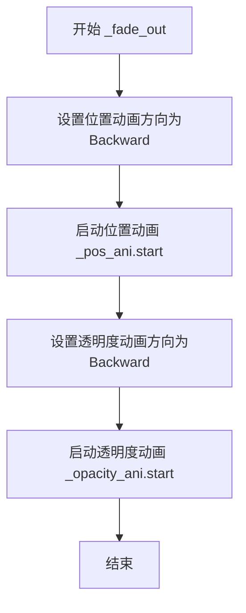

#### 带注释源码

```python
def _fade_out(self):
    """
    执行淡出动画（向后播放）。
    通过将动画方向设置为 Backward，使组件从当前位置（可见）移动并淡出到初始位置（隐藏）。
    """
    # 设置位置动画的方向为向后播放
    # Qt 中的 Backward 方向表示从动画的结束值播放到开始值
    # 对于抽屉来说，就是从屏幕边缘滑回去
    self._pos_ani.setDirection(QtCore.QAbstractAnimation.Backward)
    self._pos_ani.start()
    
    # 设置透明度动画的方向为向后播放
    # 使得窗口透明度从 1.0 变为 0.0（如果是正向播放的话）
    # 这里实际上是从当前的显示状态淡出
    self._opacity_ani.setDirection(QtCore.QAbstractAnimation.Backward)
    self._opacity_ani.start()
```


### `MDrawer._fade_int`

执行淡入动画，启动位置动画和透明度动画，使Drawer面板从隐藏状态平滑过渡到可见状态。

参数： 无（仅包含隐式参数 `self`）

返回值：`None`，无返回值

#### 流程图

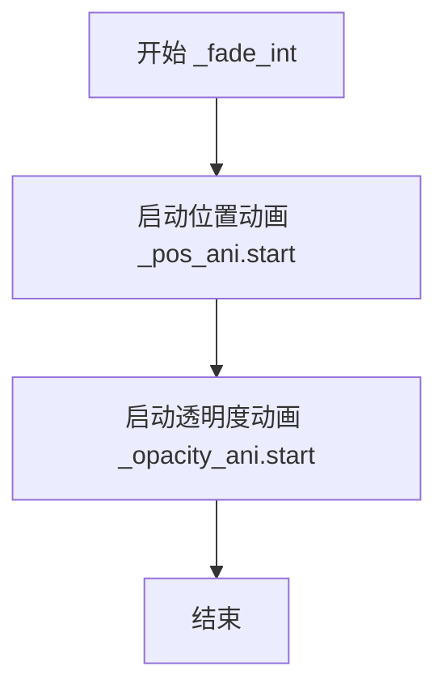

#### 带注释源码

```python
def _fade_int(self):
    """
    执行淡入动画效果。
    
    该方法同时启动位置动画和透明度动画，使Drawer面板
    从不可见状态平滑过渡到完全可见状态。
    
    位置动画(_pos_ani)在__init__中配置为:
    - 属性名: pos (widget位置)
    - 持续时间: 300ms
    - 缓动曲线: OutCubic
    
    透明度动画(_opacity_ani)在__init__中配置为:
    - 属性名: windowOpacity
    - 起始值: 0.0 (完全透明)
    - 结束值: 1.0 (完全不透明)
    - 持续时间: 300ms
    - 缓动曲线: OutCubic
    """
    # 启动位置动画，使widget从目标位置滑入
    self._pos_ani.start()
    
    # 启动透明度动画，使widget逐渐显现
    self._opacity_ani.start()
```


### `MDrawer._set_proper_position`

该方法根据 `MDrawer` 的位置属性（左、右、上、下）和父窗口的几何信息，计算滑动抽屉动画的目标位置，并设置位置动画的起始值和结束值，使抽屉能够从屏幕边缘平滑滑入。

参数：无（仅使用隐式参数 `self`）

返回值：`None`，无返回值

#### 流程图

```mermaid
flowchart TD
    A[开始 _set_proper_position] --> B[获取父窗口 parent]
    B --> C[获取父窗口几何区域 parent_geo]
    C --> D{判断位置类型}
    
    D -->|LeftPos| E[左侧位置处理]
    D -->|RightPos| F[右侧位置处理]
    D -->|TopPos| G[顶部位置处理]
    D -->|BottomPos| H[底部位置处理]
    
    E --> E1[确定参考点: parent.parent()为None取topLeft否则mapToGlobal]
    E1 --> E2[设置固定高度为父窗口高度]
    E2 --> E3[计算target_x: pos.x]
    E3 --> E4[计算target_y: pos.y]
    E4 --> E5[设置动画起始点:左侧外部]
    E5 --> E6[设置动画结束点:目标位置]
    
    F --> F1[确定参考点: parent.parent()为None取topRight否则mapToGlobal]
    F1 --> F2[设置固定高度为父窗口高度]
    F2 --> F3[计算target_x: pos.x - self.width]
    F3 --> F4[计算target_y: pos.y]
    F4 --> F5[设置动画起始点:右侧外部]
    F5 --> F6[设置动画结束点:目标位置]
    
    G --> G1[确定参考点: parent.parent()为None取topLeft否则mapToGlobal]
    G1 --> G2[设置固定宽度为父窗口宽度]
    G2 --> G3[计算target_x: pos.x]
    G3 --> G4[计算target_y: pos.y]
    G4 --> G5[设置动画起始点:顶部外部]
    G5 --> G6[设置动画结束点:目标位置]
    
    H --> H1[确定参考点: parent.parent()为None取bottomLeft否则mapToGlobal]
    H1 --> H2[设置固定宽度为父窗口宽度]
    H2 --> H3[计算target_x: pos.x]
    H3 --> H4[计算target_y: pos.y - self.height]
    H4 --> H5[设置动画起始点:底部外部]
    H5 --> H6[设置动画结束点:目标位置]
    
    E6 --> I[结束]
    F6 --> I
    G6 --> I
    H6 --> I
```

#### 带注释源码

```python
def _set_proper_position(self):
    """
    根据抽屉位置和父窗口几何信息设置动画的目标位置。
    支持左、右、上、下四个方向的滑入动画。
    """
    # 获取父窗口对象
    parent = self.parent()
    # 获取父窗口的几何区域（位置和尺寸）
    parent_geo = parent.geometry()
    
    # === 左侧抽屉处理 ===
    if self._position == MDrawer.LeftPos:
        # 确定参考点：如果是顶级窗口则用topLeft，否则转换为全局坐标
        pos = parent_geo.topLeft() if parent.parent() is None else parent.mapToGlobal(parent_geo.topLeft())
        # 目标位置等于参考点
        target_x = pos.x()
        target_y = pos.y()
        # 设置抽屉高度与父窗口一致
        self.setFixedHeight(parent_geo.height())
        # 设置动画：起始位置在左侧屏幕外，结束位置在父窗口左侧
        self._pos_ani.setStartValue(QtCore.QPoint(target_x - self.width(), target_y))
        self._pos_ani.setEndValue(QtCore.QPoint(target_x, target_y))
    
    # === 右侧抽屉处理 ===
    if self._position == MDrawer.RightPos:
        # 确定参考点：如果是顶级窗口则用topRight，否则转换为全局坐标
        pos = parent_geo.topRight() if parent.parent() is None else parent.mapToGlobal(parent_geo.topRight())
        # 设置抽屉高度与父窗口一致
        self.setFixedHeight(parent_geo.height())
        # 目标x坐标需要减去抽屉自身宽度
        target_x = pos.x() - self.width()
        target_y = pos.y()
        # 设置动画：起始位置在右侧屏幕外，结束位置在父窗口右侧
        self._pos_ani.setStartValue(QtCore.QPoint(target_x + self.width(), target_y))
        self._pos_ani.setEndValue(QtCore.QPoint(target_x, target_y))
    
    # === 顶部抽屉处理 ===
    if self._position == MDrawer.TopPos:
        # 确定参考点：如果是顶级窗口则用topLeft，否则转换为全局坐标
        pos = parent_geo.topLeft() if parent.parent() is None else parent.mapToGlobal(parent_geo.topLeft())
        # 设置抽屉宽度与父窗口一致
        self.setFixedWidth(parent_geo.width())
        target_x = pos.x()
        target_y = pos.y()
        # 设置动画：起始位置在顶部屏幕外，结束位置在父窗口顶部
        self._pos_ani.setStartValue(QtCore.QPoint(target_x, target_y - self.height()))
        self._pos_ani.setEndValue(QtCore.QPoint(target_x, target_y))
    
    # === 底部抽屉处理 ===
    if self._position == MDrawer.BottomPos:
        # 确定参考点：如果是顶级窗口则用bottomLeft，否则转换为全局坐标
        pos = parent_geo.bottomLeft() if parent.parent() is None else parent.mapToGlobal(parent_geo.bottomLeft())
        # 设置抽屉宽度与父窗口一致
        self.setFixedWidth(parent_geo.width())
        target_x = pos.x()
        # 目标y坐标需要减去抽屉自身高度
        target_y = pos.y() - self.height()
        # 设置动画：起始位置在底部屏幕外，结束位置在父窗口底部
        self._pos_ani.setStartValue(QtCore.QPoint(target_x, target_y + self.height()))
        self._pos_ani.setEndValue(QtCore.QPoint(target_x, target_y))
```


### `MDrawer.set_dayu_position`

设置MDrawer抽屉组件的位置（top/right/bottom/left），同时根据位置方向设置抽屉的固定尺寸（垂直位置设置高度，水平位置设置宽度）。

参数：

- `value`：`str`，位置值，可选值为"top"（顶部）、"right"（右侧，默认值）、"bottom"（底部）、"left"（左侧）

返回值：`None`，无返回值

#### 流程图

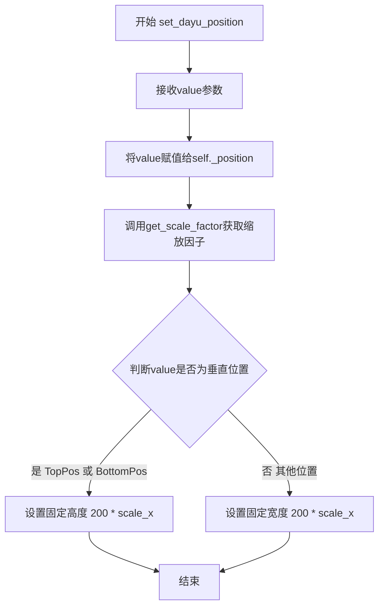

#### 带注释源码

```python
def set_dayu_position(self, value):
    """
    Set the placement of the MDrawer.
    top/right/bottom/left, default is right
    :param value: str
    :return: None
    """
    # 将传入的位置值保存到实例变量中
    self._position = value
    
    # 获取界面缩放因子，用于适配不同分辨率的屏幕
    scale_x, _ = get_scale_factor()
    
    # 根据位置方向设置抽屉尺寸：
    # 垂直位置（top/bottom）设置固定高度
    if value in [MDrawer.BottomPos, MDrawer.TopPos]:
        self.setFixedHeight(200 * scale_x)
    else:
        # 水平位置（left/right）设置固定宽度
        self.setFixedWidth(200 * scale_x)
```


### `MDrawer.get_dayu_position`

获取抽屉的放置位置（top/right/bottom/left）

参数： 无

返回值：`str`，返回抽屉的当前位置字符串（如 "left"、"right"、"top"、"bottom"）

#### 流程图

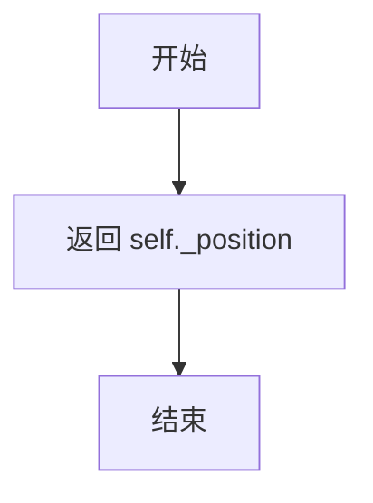

#### 带注释源码

```python
def get_dayu_position(self):
    """
    获取抽屉的放置位置
    :return: str 位置字符串 (left/right/top/bottom)
    """
    return self._position  # 返回存储在 self._position 中的位置值
```


### `MDrawer.left`

设置Drawer的停靠位置为左侧，并返回Drawer对象本身以支持链式调用。

参数：

- 无

返回值：`MDrawer`，返回Drawer对象本身，支持链式调用（如 `drawer.left().show()`）

#### 流程图

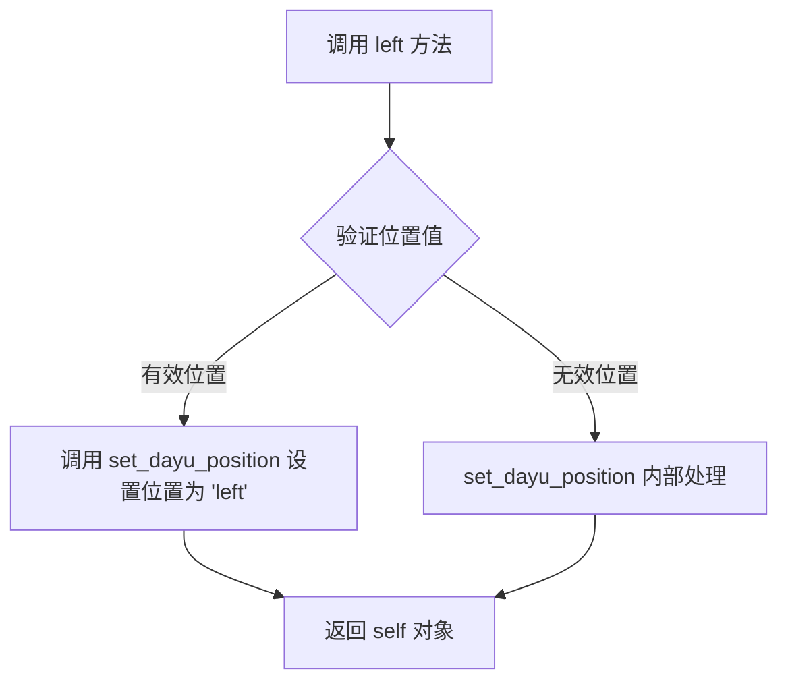

#### 带注释源码

```python
def left(self):
    """Set drawer's placement to left"""
    # 调用 set_dayu_position 方法，将 drawer 的位置设置为左侧常量 'left'
    self.set_dayu_position(MDrawer.LeftPos)
    # 返回 self 对象本身，支持链式调用（例如：drawer.left().show()）
    return self
```


### `MDrawer.right`

设置抽屉的停靠位置为右侧，并返回自身实例以支持链式调用。

参数： 无

返回值：`MDrawer`，返回自身实例，支持链式调用（如 `drawer.right().show()`）

#### 流程图

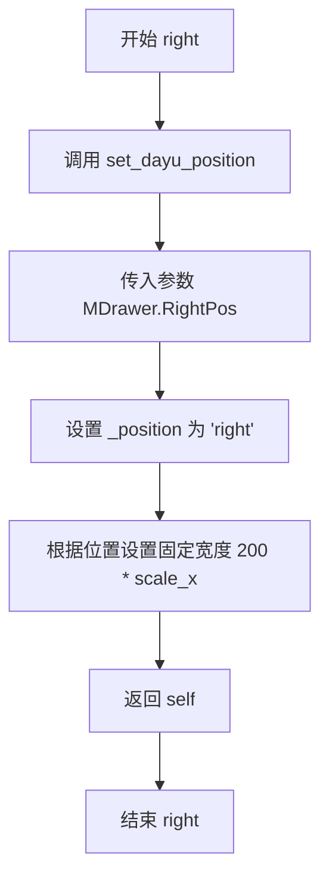

#### 带注释源码

```python
def right(self):
    """Set drawer's placement to right"""
    # 调用内部方法设置抽屉位置为右侧
    self.set_dayu_position(MDrawer.RightPos)
    # 返回自身实例，支持链式调用
    return self
```

#### 详细说明

| 项目 | 内容 |
|------|------|
| **方法名** | right |
| **所属类** | MDrawer |
| **功能描述** | 将抽屉面板的停靠位置设置为右侧，并通过返回 self 实现链式调用模式 |
| **调用栈** | right() → set_dayu_position() → 根据位置设置控件尺寸 |
| **关联常量** | `MDrawer.RightPos = "right"` |
| **设计模式** | 链式调用（Builder Pattern 变体） |


### `MDrawer.top`

设置抽屉的显示位置为顶部，并返回自身实例以支持链式调用。

参数： 无

返回值：`MDrawer`，返回自身实例，支持链式调用

#### 流程图

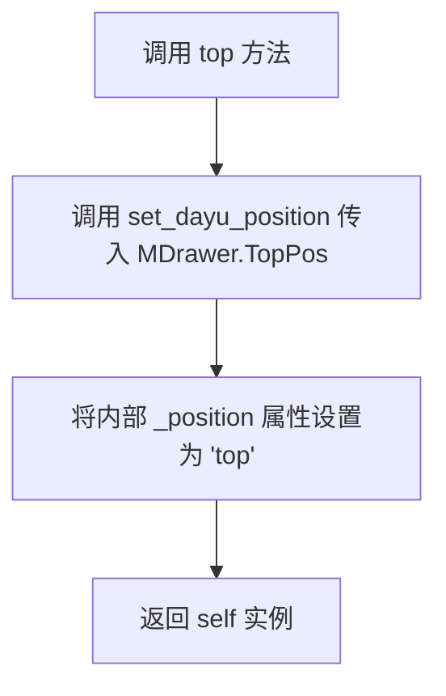

#### 带注释源码

```python
def top(self):
    """
    Set drawer's placement to top
    
    该方法将抽屉的显示位置设置为顶部。
    内部通过调用 set_dayu_position 方法来实现位置设置，
    并返回 self 以支持链式调用（如 drawer.top().show()）。
    
    参数: 无
    
    返回值:
        MDrawer: 返回自身实例，支持链式调用
    """
    self.set_dayu_position(MDrawer.TopPos)
    return self
```


### `MDrawer.bottom`

设置抽屉的放置位置为底部，并返回self以支持链式调用。

参数：

-  `self`：隐式参数，MDrawer实例，不需要额外描述

返回值：`MDrawer`，返回自身实例以支持链式调用

#### 流程图

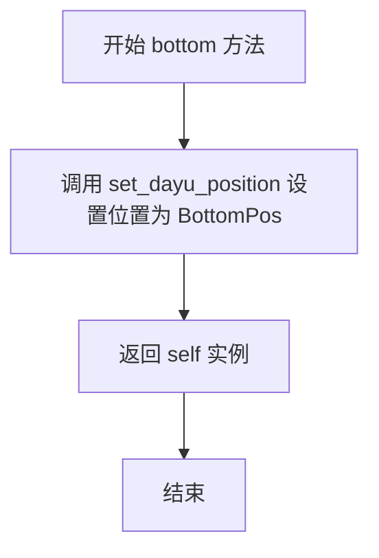

#### 带注释源码

```python
def bottom(self):
    """
    Set drawer's placement to bottom
    设置抽屉的放置位置为底部
    """
    # 调用内部方法设置抽屉位置为底部
    self.set_dayu_position(MDrawer.BottomPos)
    # 返回 self 以支持链式调用，例如: drawer.bottom().show()
    return self
```


### `MDrawer.show`

显示抽屉并播放淡入动画，同时激活窗口以支持中文输入。

参数： 无

返回值：`None`，无返回值描述

#### 流程图

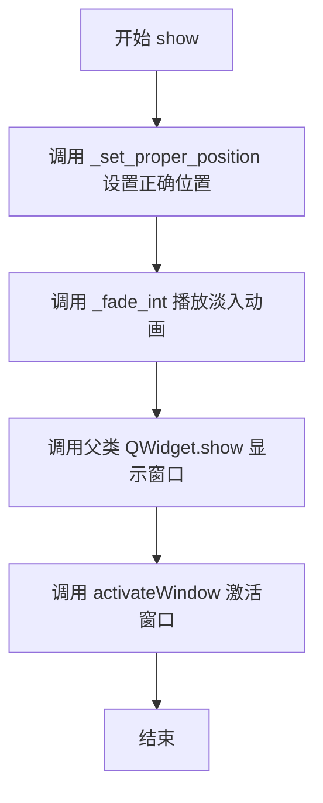

#### 带注释源码

```python
def show(self):
    """
    显示抽屉并播放动画，同时激活窗口以支持中文输入。
    """
    # 根据位置属性设置抽屉的起始和目标位置
    self._set_proper_position()
    
    # 启动位置和透明度动画，实现淡入效果
    self._fade_int()
    
    # 调用父类方法显示窗口
    super(MDrawer, self).show()
    
    # NOTES(timmyliang): for chinese input
    # 激活窗口，确保中文输入法可以正常工作
    self.activateWindow()
```


### `MDrawer.closeEvent(event)`

处理 MDrawer 抽屉组件的关闭事件，实现带有淡出动画和延迟关闭的交互效果。

参数：

- `event`：`QCloseEvent`，Qt 框架的关闭事件对象，包含关闭事件的类型和_accept()、ignore()等方法，用于控制事件是否被接受或忽略

返回值：`None`，无返回值。该方法通过修改 `event` 的接受状态来控制组件是否真正关闭。

#### 流程图

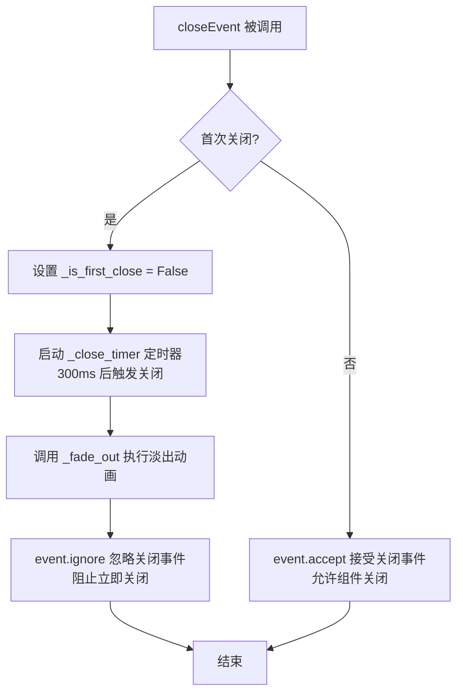

#### 带注释源码

```python
def closeEvent(self, event):
    """
    重写 QWidget 的关闭事件处理方法
    :param event: QCloseEvent 对象，Qt 关闭事件
    """
    # 判断是否为首次关闭
    if self._is_first_close:
        # 首次关闭：将标志位设为 False，避免下次再进入此分支
        self._is_first_close = False
        
        # 启动定时器，300ms 后自动调用 close() 和 sig_closed 信号
        # 这样可以保证动画播放完成后再真正关闭
        self._close_timer.start()
        
        # 执行淡出动画（位置动画 + 透明度动画反向播放）
        self._fade_out()
        
        # 忽略关闭事件，阻止组件立即关闭
        # 让动画有时间播放完成
        event.ignore()
    else:
        # 非首次关闭（即定时器触发后的第二次调用）
        # 接受关闭事件，允许组件正常关闭
        event.accept()
```

## 关键组件


### MDrawer 类

主组件，一个从屏幕边缘滑入的侧边栏/抽屉面板，支持上下左右四个方向的展开与收起动画。

### 位置枚举 (LeftPos, RightPos, TopPos, BottomPos)

定义抽屉展开位置的四个方向常量，用于控制抽屉从父窗口的哪一侧滑入。

### 动画系统 (_pos_ani, _opacity_ani)

位置动画控制抽屉滑入效果，透明度动画控制淡入淡出效果，两者结合实现流畅的展开/收起用户体验。

### 关闭定时器 (_close_timer)

300毫秒单次触发定时器，用于实现延迟关闭机制，配合淡出动画实现平滑关闭。

### 布局结构 (_title_lay, _main_lay, _bottom_lay, _title_extra_lay)

标题栏布局、主布局、底部布局和标题额外区域布局的管理，实现抽屉内部组件的合理排布。

### 滚动区域 (_scroll_area)

可调整大小的滚动区域，用于容纳抽屉的主要内容widget，支持超出可视区域时的滚动。

### 信号系统 (sig_closed)

自定义关闭信号，在抽屉完全关闭时发出，供外部监听处理。

### 属性系统 (dayu_position)

Qt Property包装器，提供getter/setter方法支持Qt元对象系统的属性绑定和QSS样式设置。

### 淡入淡出方法 (_fade_int, _fade_out)

实现抽屉显示时的淡入动画和关闭时的淡出动画，通过反向动画方向控制播放逻辑。

### 位置计算 (_set_proper_position)

根据父窗口几何信息和当前位置设置，计算动画的起始和结束位置，支持全局坐标映射。


## 问题及建议


### 已知问题

-   **closeEvent逻辑存在缺陷**：第一次关闭时启动定时器并忽略事件，但定时器回调再次调用close()时，会直接接受事件。这导致面板在第一次关闭操作后无法被真正关闭（因为_is_first_close已变为False），可能产生意外行为。此外，快速连续点击关闭按钮时，定时器逻辑可能失效。
-   **位置计算逻辑不严谨**：在`_set_proper_position`方法中，通过判断`parent.parent() is None`来决定使用局部坐标还是全局坐标，这种方式脆弱且容易出错。当parent为None或parent结构复杂时可能导致面板定位错误。
-   **魔法数字缺乏管理**：动画时长300ms、默认面板尺寸200等硬编码数值分散在代码中，不利于配置和维护。
-   **代码缩进风格不一致**：存在混合使用不同数量空格缩进的情况（如有些地方4空格，有些8空格或更多），影响代码可读性和团队协作。
-   **窗口标志设置可能冲突**：设置`QtCore.Qt.Popup`标志后又设置`WA_StyledBackground`属性，可能导致样式渲染问题；且Popup模式下父窗口可能无法正确交互。
-   **缺少类型注解和文档**：方法参数和返回值没有类型提示，部分关键方法（如`_fade_out`/_`fade_int`）缺少文档说明。
-   **set_widget覆盖问题**：直接替换scroll_area的widget，没有提供内容管理的增删接口，可能导致外部使用时的不便。
-   **objectName命名不当**：设置`self.setObjectName("message")`，但组件实际是Drawer，"message"这一命名与功能不符，容易造成混淆。
-   **动画状态未管理**：未检查动画当前状态就启动新动画，快速连续调用show()可能产生动画叠加或异常。

### 优化建议

-   **重构closeEvent逻辑**：使用更清晰的状态管理机制（如标志位）来控制关闭行为，考虑使用QTimer.singleShot或在动画结束后再触发真正的关闭，避免事件忽略导致的逻辑混乱。
-   **提取魔法数字为常量**：将动画时长（300）、默认尺寸（200）等提取为类常量或配置参数，提高代码可维护性。
-   **统一代码风格**：使用统一的缩进标准（如4空格），并通过代码检查工具（如pylint、black）强制执行。
-   **优化位置计算逻辑**：提供明确的fallback机制处理parent为None的情况，使用更可靠的坐标转换方法（如mapToParent/mapToGlobal的组合）。
-   **完善类型注解和文档**：为所有公开方法添加类型提示和docstring，特别是参数说明和返回值描述。
-   **改进widget管理**：提供add_widget/remove_widget方法或在set_widget时支持追加模式，增加灵活性。
-   **修复objectName**：将"message"改为"MDrawer"或具有实际意义的名称。
-   **添加动画状态检查**：在启动动画前检查动画状态（state），避免重复启动或状态冲突。
-   **考虑信号设计**：除了sig_closed，可添加sig_opened、sig_position_changed等信号以提供更丰富的事件通知。
-   **增加错误处理**：在`_set_proper_position`等方法中添加异常处理，防止因parent几何信息获取失败导致的崩溃。


## 其它


### 设计目标与约束

本组件旨在提供一个可从屏幕任意边缘滑入的抽屉式面板，支持自定义标题、关闭按钮、底部/顶部自定义按钮区域，以及平滑的动画过渡效果。设计约束包括：必须作为Popup窗口运行以实现模态或非模态行为，默认尺寸为200像素（根据位置决定宽度或高度），动画时长固定为300毫秒，且首次关闭时采用延迟关闭机制以允许用户取消。

### 错误处理与异常设计

组件未实现显式的异常捕获机制。主要潜在问题包括：父窗口为None时可能导致位置计算错误（代码中通过parent.parent() is None判断处理）；set_widget时传入None可能造成滚动区域内容为空；动画属性设置错误可能导致运行时警告。建议在调用set_widget时确保widget不为None，并在调用show前确保已设置有效父窗口。

### 数据流与状态机

MDrawer存在以下状态转换：隐藏状态 -> 显示中（执行位置设置和淡入动画） -> 可见状态 -> 关闭中（首次close触发定时器+淡出动画） -> 隐藏状态。状态转换由is_first_close标志控制：第一次调用close时启动定时器并执行淡出动画但不接受事件，第二次调用close才真正关闭组件。位置属性_position决定了_set_proper_position中的几何计算逻辑。

### 外部依赖与接口契约

依赖包括：PySide6.QtCore和PySide6.QtWidgets（Qt核心库）；本地模块MDivider、MLabel、MToolButton（自定义Qt组件）；本地模块get_scale_factor（获取缩放因子）。公开接口包括：sig_closed信号（关闭时发出）；set_widget(Widget)方法（设置主内容）；add_widget_to_bottom/add_widget_to_top方法（添加额外控件）；left/right/top/bottom链式调用方法设置位置；dayu_position属性（Qt Property用于样式表）。

### 性能考虑

组件在每次show时重新计算位置和动画参数，可能导致轻微性能开销。动画使用了QPropertyAnimation，建议避免同时运行过多动画实例。滚动区域默认设置为可调整大小，适合内容动态变化的场景。

### 安全性考虑

组件使用Popup窗口标志，可能导致焦点管理问题（代码中通过activateWindow()尝试解决中文输入法问题）。未对传入的widget进行类型验证，可能接收非QWidget对象导致运行时错误。建议添加参数类型检查。

### 兼容性考虑

代码使用PySide6，兼容性取决于PySide6版本。setPropertyName使用字节串b"pos"和b"windowOpacity"，这是PySide6的特定要求。Popup窗口行为在 不同操作系统上可能存在差异。

### 使用示例

```python
drawer = MDrawer(title="设置", position="right", closable=True, parent=main_window)
drawer.add_widget_to_bottom(QPushButton("确定"))
drawer.right().show()
```

### 事件与信号说明

sig_closed: QtCore.Signal() - 在关闭动画完成后（定时器超时时）发出。closeEvent: 重写父类方法，实现首次点击关闭按钮时的延迟关闭和淡出动画效果。

### 样式与主题

组件设置WA_StyledBackground属性以支持样式表。默认无样式，需要通过QSS设置背景色、边框等。未提供默认图标资源，close按钮使用SVG图标"close_line.svg"。

### 测试考虑

建议测试场景包括：父窗口resize时抽屉位置是否正确；快速连续点击关闭按钮的行为；四种位置模式下动画效果；在不同DPI缩放下的显示效果；与其他Popup窗口同时存在时的行为。

### 国际化/本地化

title参数直接使用字符串，未实现国际化支持。如需国际化，应传入QCoreApplication.translate生成的字符串。

### 版本历史/变更记录

初始版本（2019.6）- 作者Mu yanru。包含基本的滑入面板功能，支持四个方向位置。

### 潜在技术债务与优化空间

1. 硬编码的动画时长（300ms）和尺寸（200）应考虑提取为可配置参数
2. closeEvent中_is_first_close逻辑复杂，可考虑使用QTimer.singleShot或显式状态机
3. _set_proper_position中大量重复代码可通过策略模式简化
4. 缺少对parent为None的显式处理和警告
5. position属性同时使用字符串和类常量，类型不一致
6. 动画对象在每次show时重新设置参数，可考虑缓存优化
7. 缺少文档字符串（除set_dayu_position和get_dayu_position外）
8. 未实现hide方法的重写，可能导致状态不一致

    