# `comic-translate\app\ui\dayu_widgets\expanding_text_edit.py` 详细设计文档

一个基于PySide6的文本输入组件，支持自动扩展高度（最多max_lines行），超过最大行数后自动切换为滚动模式，并提供类似QLineEdit的returnPressed信号和占位符文本功能，适用于需要紧凑型文本输入的UI场景。

## 整体流程

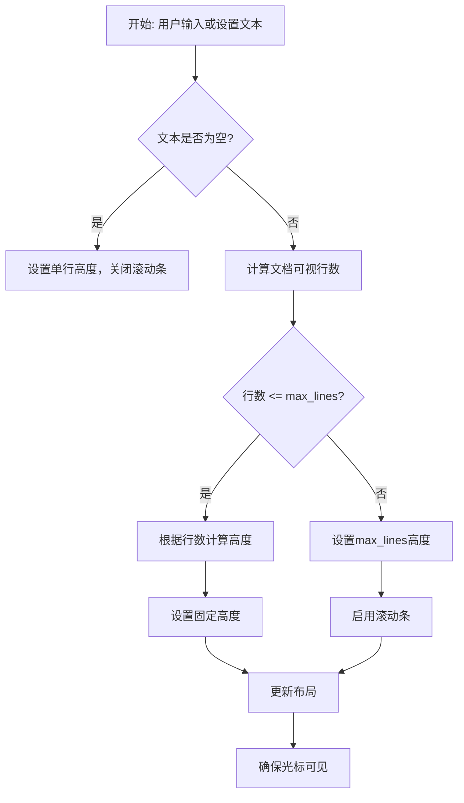

## 类结构

```
QtWidgets.QPlainTextEdit (Qt基类)
└── MExpandingTextEdit (自定义扩展类)
```

## 全局变量及字段


### `dayu_theme`
    
本地主题模块，提供主题尺寸配置和样式

类型：`module`
    


### `QtCore`
    
PySide6核心模块，提供信号、槽、事件等核心功能

类型：`module`
    


### `QtGui`
    
PySide6 GUI模块，提供图形用户界面相关类

类型：`module`
    


### `QtWidgets`
    
PySide6部件模块，提供QtWidgets相关控件类

类型：`module`
    


### `MExpandingTextEdit._max_lines`
    
最大行数限制

类型：`int`
    


### `MExpandingTextEdit._dayu_size`
    
主题尺寸配置

类型：`int`
    


### `MExpandingTextEdit._placeholder_text`
    
占位符文本

类型：`str`
    
    

## 全局函数及方法


### `MExpandingTextEdit.__init__`

该方法是 `MExpandingTextEdit` 类的构造函数，用于初始化一个可垂直扩展的文本编辑框。初始化时设置最大行数限制、默认尺寸、占位符文本，并配置文档属性、信号连接以及初始高度计算，使文本编辑框从单行高度开始，随内容扩展直到达到最大行数后切换为滚动模式。

参数：

-  `text`：`str`，初始文本内容，默认为空字符串
-  `parent`：`Optional[QtWidgets.QWidget]`，父 widget 对象，用于Qt对象树管理，默认为 `None`
-  `max_lines`：`int`，最大可见行数限制，默认为 4

返回值：`None`，无返回值（Python 初始化方法）

#### 流程图

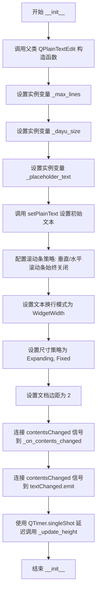

#### 带注释源码

```python
def __init__(self, text: str = "", parent=None, max_lines: int = 4):
    """
    初始化 MExpandingTextEdit 可扩展文本编辑框
    
    参数:
        text: 初始显示的文本内容，默认为空字符串
        parent: 父 widget 对象，用于Qt对象树管理
        max_lines: 最大可见行数，达到后切换为滚动模式
    """
    # 调用父类 QPlainTextEdit 的初始化方法
    super().__init__(parent)
    
    # 保存最大行数配置，用于后续高度计算
    self._max_lines = max_lines
    
    # 保存 dayu 主题的尺寸配置
    self._dayu_size = dayu_theme.default_size
    
    # 占位符文本（QLineEdit 兼容）
    self._placeholder_text = ""
    
    # 设置初始文本内容（会触发 contentsChanged 信号）
    self.setPlainText(text)
    
    # 设置垂直滚动条始终关闭，水平滚动条始终关闭
    # 实现自动扩展而非滚动
    self.setVerticalScrollBarPolicy(QtCore.Qt.ScrollBarPolicy.ScrollBarAlwaysOff)
    self.setHorizontalScrollBarPolicy(QtCore.Qt.ScrollBarPolicy.ScrollBarAlwaysOff)
    
    # 设置文本换行模式为按 widget 宽度自动换行
    self.setLineWrapMode(QtWidgets.QPlainTextEdit.LineWrapMode.WidgetWidth)
    
    # 设置尺寸策略：水平可扩展，垂直固定（高度由内容决定）
    self.setSizePolicy(QtWidgets.QSizePolicy.Expanding, QtWidgets.QSizePolicy.Fixed)
    
    # 减小文档边距，使外观更紧凑
    self.document().setDocumentMargin(2)
    
    # 连接信号：内容变化时更新高度并确保光标可见
    self.document().contentsChanged.connect(self._on_contents_changed)
    # 连接信号：内容变化时发射 textChanged 信号（QLineEdit 兼容）
    self.document().contentsChanged.connect(self.textChanged.emit)
    
    # 延迟到事件循环空闲时计算初始高度
    # 确保 widget 已经完成布局后再计算正确的高度
    QtCore.QTimer.singleShot(0, self._update_height)
```


### `MExpandingTextEdit._on_contents_changed`

当文档内容发生变化时，此方法负责更新文本编辑组件的高度，并确保光标始终可见。

参数：
- 无（仅包含隐式参数 `self`）

返回值：`None`，无返回值

#### 流程图

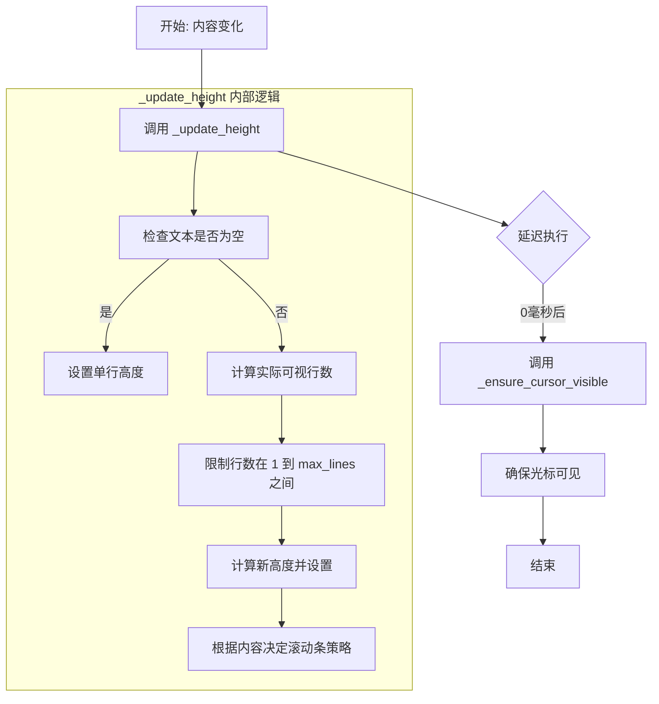

#### 带注释源码

```python
def _on_contents_changed(self):
    """
    Update height when content changes and ensure cursor is visible.
    当文档内容改变时触发：更新高度并确保光标可见。
    """
    # 1. 调用内部方法更新组件高度
    # 根据当前文本内容计算并设置合适的组件高度
    self._update_height()
    
    # 2. 延迟执行确保光标可见
    # 使用 QTimer.singleShot(0, ...) 确保在当前事件处理完成后执行
    # 这对于文档布局更新完成后的光标定位至关重要
    # Scroll to ensure cursor is visible at bottom
    QtCore.QTimer.singleShot(0, self._ensure_cursor_visible)
```


### `MExpandingTextEdit._ensure_cursor_visible`

该方法用于在内容变化后确保光标始终可见，通过调用Qt的`ensureCursorVisible()`方法实现自动滚动到底部的功能。

参数：

- `self`：`MExpandingTextEdit`，方法所属的实例对象

返回值：`None`，无返回值

#### 流程图

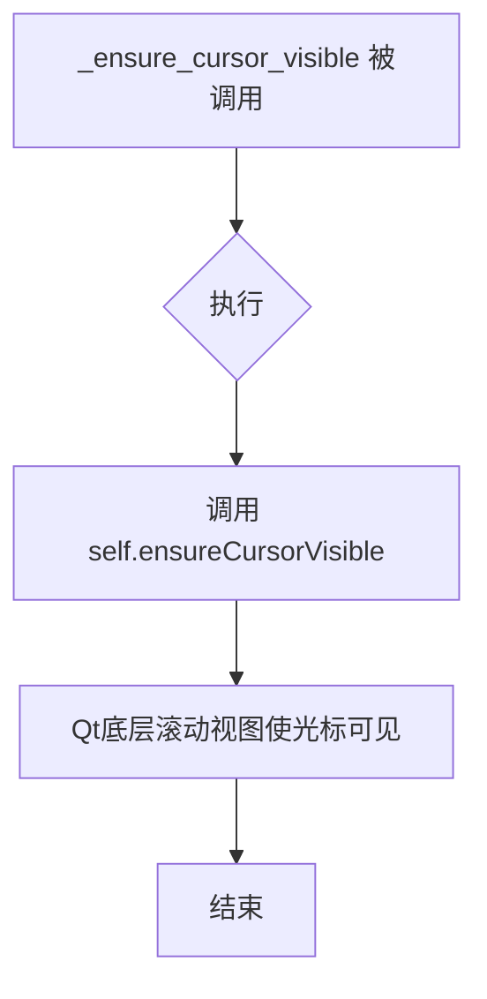

#### 带注释源码

```python
def _ensure_cursor_visible(self):
    """Scroll so that the cursor (latest input) is visible."""
    # 调用Qt QPlainTextEdit的ensureCursorVisible方法
    # 该方法会自动滚动视图使当前光标位置可见
    self.ensureCursorVisible()
```


### `MExpandingTextEdit._calculate_height_for_lines`

该方法根据给定的行数计算文本编辑框的合适高度，考虑字体行高和垂直内边距，用于实现自适应的文本输入组件。

参数：

- `num_lines`：`int`，需要计算高度的可见行数

返回值：`int`，计算得出的小部件总高度（像素），包含文本高度和垂直内边距

#### 流程图

```mermaid
flowchart TD
    A[开始 _calculate_height_for_lines] --> B[获取字体度量 fm = self.fontMetrics]
    B --> C[计算行高 line_height = fm.lineSpacing]
    C --> D[设置垂直内边距 vertical_padding = 6]
    D --> E[计算文本高度 text_height = line_height * num_lines]
    E --> F[计算总高度 total_height = int(text_height + vertical_padding)]
    F --> G[返回 total_height]
```

#### 带注释源码

```python
def _calculate_height_for_lines(self, num_lines: int) -> int:
    """Calculate the widget height for a given number of lines."""
    # 获取当前小部件的字体度量对象，用于计算字符和行的相关尺寸
    fm = self.fontMetrics()
    
    # 获取字体的行间距（包含行间距和基线之间的间隔）
    line_height = fm.lineSpacing()
    
    # Minimal padding for compact single-line appearance
    # 设置最小的垂直内边距，使单行显示时更加紧凑
    # 6像素包含上下各3像素的边距
    vertical_padding = 6  # Small padding top + bottom
    
    # Calculate total height
    # 根据行数计算文本内容的总高度
    text_height = line_height * num_lines
    
    # 将文本高度加上垂直内边距得到最终的小部件高度
    # 使用 int() 取整确保返回整数像素值
    total_height = int(text_height + vertical_padding)
    
    # 返回计算得出的总高度
    return total_height
```


### `MExpandingTextEdit._update_height`

该方法根据文本内容动态调整文本编辑框的高度，确保高度适应内容行数（最多不超过 `max_lines`），并在内容超出最大行数时自动显示垂直滚动条。

参数：

- 该方法无显式参数（隐式接收 `self` 作为实例引用）

返回值：`None`，无返回值（方法直接修改 widget 状态）

#### 流程图

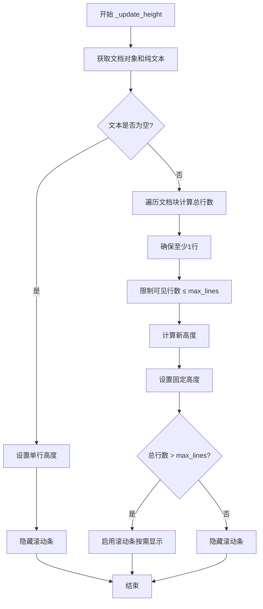

#### 带注释源码

```python
def _update_height(self):
    """Adjust widget height based on content, up to max_lines."""
    # 获取 QTextDocument 对象
    doc = self.document()
    # 获取当前纯文本内容
    text = self.toPlainText()
    
    # 如果文本为空，使用单行高度
    if not text:
        # 计算单行高度并设置
        self.setFixedHeight(self._calculate_height_for_lines(1))
        # 隐藏垂直滚动条
        self.setVerticalScrollBarPolicy(QtCore.Qt.ScrollBarPolicy.ScrollBarAlwaysOff)
        return
    
    # 统计实际可视行数（考虑自动换行）
    # 获取文档的第一个文本块
    block = doc.firstBlock()
    total_lines = 0
    
    # 遍历所有文本块，累加每块的行数
    while block.isValid():
        # 获取文本块的布局对象
        layout = block.layout()
        # 如果布局存在且包含多行，累加行数；否则视为1行
        if layout and layout.lineCount() > 0:
            total_lines += layout.lineCount()
        else:
            total_lines += 1
        # 移动到下一个文本块
        block = block.next()
    
    # 确保至少有1行
    total_lines = max(1, total_lines)
    
    # 将可见行数限制在 [1, max_lines] 范围内
    visible_lines = min(total_lines, self._max_lines)
    
    # 根据可见行数计算新高度
    new_height = self._calculate_height_for_lines(visible_lines)
    
    # 设置固定高度以防止布局跳动
    self.setFixedHeight(new_height)
    
    # 根据内容是否超出最大行数来显示/隐藏滚动条
    if total_lines > self._max_lines:
        # 内容超出时，按需显示滚动条
        self.setVerticalScrollBarPolicy(QtCore.Qt.ScrollBarPolicy.ScrollBarAsNeeded)
    else:
        # 内容未超出时，始终隐藏滚动条
        self.setVerticalScrollBarPolicy(QtCore.Qt.ScrollBarPolicy.ScrollBarAlwaysOff)
```


### `MExpandingTextEdit.keyPressEvent`

处理键盘按键事件，拦截回车键（Enter）以发射 `returnPressed` 信号（类似 QLineEdit 的行为），而 Shift+Enter 则插入换行符，其他按键交给父类处理。

参数：

-  `event`：`QtGui.QKeyEvent`，键盘事件对象，包含按键信息

返回值：`None`，无返回值

#### 流程图

```mermaid
flowchart TD
    A[开始: keyPressEvent] --> B{event.key() 是回车键?}
    B -->|是| C{Shift 键按下?}
    B -->|否| F[调用父类 keyPressEvent]
    C -->|是| D[调用父类 keyPressEvent 插入换行]
    C -->|否| E[发射 returnPressed 信号并返回]
    D --> G[结束]
    E --> G
    F --> G
```

#### 带注释源码

```python
def keyPressEvent(self, event: QtGui.QKeyEvent):
    """Handle Enter key to emit returnPressed signal."""
    # 检查按键是否为回车键（Return）或小键盘回车键（Enter）
    if event.key() in (QtCore.Qt.Key.Key_Return, QtCore.Qt.Key.Key_Enter):
        # 检查是否同时按下了 Shift 修饰键
        if event.modifiers() & QtCore.Qt.KeyboardModifier.ShiftModifier:
            # Shift+Enter 组合：插入普通换行符，调用父类默认处理
            super().keyPressEvent(event)
        else:
            # 普通 Enter 键：发射 returnPressed 信号（模仿 QLineEdit 行为）
            # 然后直接返回，不再调用父类处理（防止插入换行）
            self.returnPressed.emit()
            return
    else:
        # 非回车键的其他按键：交给父类 QPlainTextEdit 处理
        super().keyPressEvent(event)
```


### `MExpandingTextEdit.text`

返回当前输入框中的纯文本内容，提供与 QLineEdit 的 text() 方法兼容的接口。

参数：此方法无显式参数（`self` 为隐式参数，表示类的实例）。

返回值：`str`，返回 QPlainTextEdit 内部的纯文本字符串内容。

#### 流程图

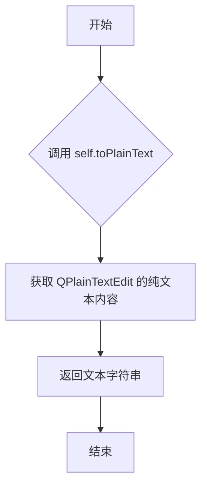

#### 带注释源码

```python
def text(self) -> str:
    """Return the plain text content (QLineEdit compatibility)."""
    # 调用父类 QPlainTextEdit 的 toPlainText 方法获取纯文本
    # 该方法返回 QString 类型的文本，在 Python 中自动转换为 str
    return self.toPlainText()
```


### `MExpandingTextEdit.setText`

设置纯文本内容，提供与 QLineEdit 的兼容性。

参数：

- `text`：`str`，要设置的文本内容

返回值：`None`，无返回值

#### 流程图

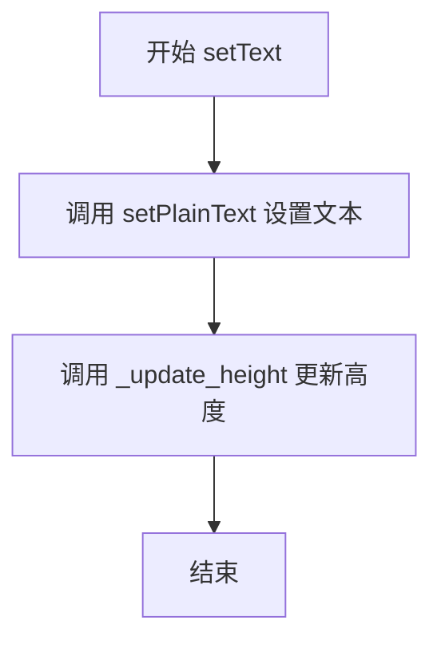

#### 带注释源码

```python
def setText(self, text: str):
    """Set the plain text content (QLineEdit compatibility).
    
    该方法提供与 QLineEdit 的兼容性，允许以类似 QLineEdit 的方式设置文本。
    设置文本后，会自动调用 _update_height() 来调整组件高度以适应内容。
    
    参数:
        text: 要设置的纯文本字符串
    
    返回值:
        无返回值 (None)
    """
    # 调用父类的 setPlainText 方法设置纯文本内容
    self.setPlainText(text)
    
    # 立即更新组件高度以适应新文本内容
    # 这确保了文本设置后组件能正确调整大小
    self._update_height()
```


### `MExpandingTextEdit.clear`

清除文本编辑框的内容，并将组件高度重置为单行高度。

参数：

- （无参数）

返回值：`None`，无返回值描述

#### 流程图

```mermaid
flowchart TD
    A[开始 clear] --> B[调用父类方法 super().clear 清除文本]
    B --> C[调用 _update_height 更新组件高度]
    C --> D[结束]
```

#### 带注释源码

```python
def clear(self):
    """Clear the text content."""
    # 调用父类 QPlainTextEdit 的 clear 方法清除文本内容
    super().clear()
    # 调用内部方法更新组件高度，确保清除后高度重置为单行高度
    self._update_height()
```


### `MExpandingTextEdit.setPlaceholderText`

设置占位符文本，实现与 QLineEdit 的兼容性。

参数：

-  `text`：`str`，要设置的占位符文本内容

返回值：`None`，无返回值

#### 流程图

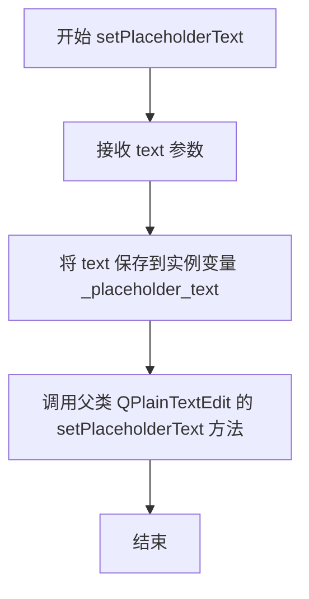

#### 带注释源码

```python
def setPlaceholderText(self, text: str):
    """
    Set placeholder text (QLineEdit compatibility).
    
    设置占位符文本，实现与 QLineEdit 的 API 兼容性。
    同时保存一份副本到实例变量 _placeholder_text 供内部使用。
    
    参数:
        text: str - 要设置的占位符文本内容
    """
    # 保存占位符文本到实例变量，供 placeholderText() 方法返回
    self._placeholder_text = text
    # 调用父类 QPlainTextEdit 的方法，实际设置 Qt 的占位符显示
    super().setPlaceholderText(text)
```


### `MExpandingTextEdit.placeholderText`

获取该文本编辑组件的占位符文本（placeholder text），用于在文本框为空时显示提示信息，类似于 QLineEdit 的占位符功能。

参数：

- `self`：`MExpandingTextEdit`，隐式参数，表示当前实例对象

返回值：`str`，返回当前设置的占位符文本内容

#### 流程图

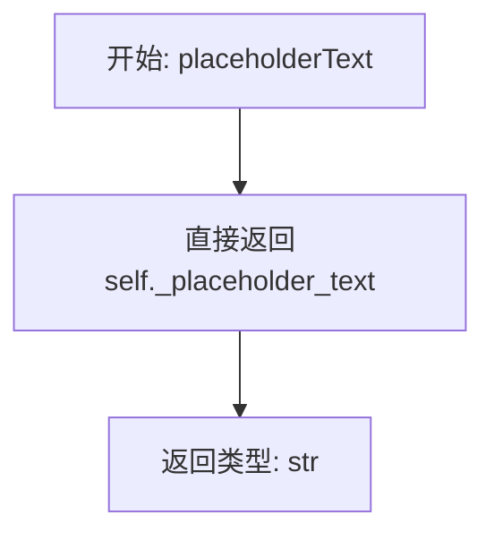

#### 带注释源码

```python
def placeholderText(self) -> str:
    """Get placeholder text."""
    return self._placeholder_text
```

**源码说明：**

- **函数签名**：`def placeholderText(self) -> str:`
  - 方法名：`placeholderText`
  - 参数：`self`（隐式参数，类型为 `MExpandingTextEdit`）
  - 返回值类型：`str`

- **文档字符串**：`"""Get placeholder text."""`
  - 简单描述：获取占位符文本

- **方法体**：`return self._placeholder_text`
  - 直接返回实例属性 `_placeholder_text` 的值
  - `_placeholder_text` 在 `__init__` 方法中初始化为空字符串 `""`
  - 可以通过 `setPlaceholderText()` 方法设置此值

**设计目的：**
该方法是为了与 `QLineEdit` 的 API 保持兼容性，使得 `MExpandingTextEdit` 可以在需要时作为 `QLineEdit` 的替代品使用，提供统一的接口。


### `MExpandingTextEdit.selectAll`

该方法用于选中文本编辑框中的所有文本，提供与 QLineEdit 的 API 兼容性。通过获取当前文本光标，选择整个文档内容，然后将光标设置回文本框来实现全选功能。

参数： 无

返回值：`None`，无返回值（方法执行后直接作用于文本光标状态）

#### 流程图

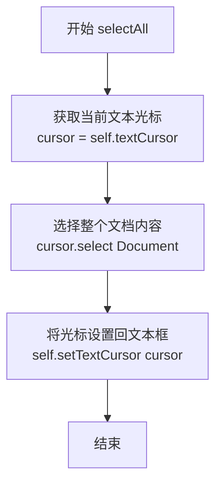

#### 带注释源码

```python
def selectAll(self):
    """Select all text (QLineEdit compatibility)."""
    # 获取当前文本编辑框的光标对象
    cursor = self.textCursor()
    
    # 选择整个文档作为选区（选中所有文本）
    cursor.select(QtGui.QTextCursor.SelectionType.Document)
    
    # 将修改后的光标设置回文本编辑框，使选区生效
    self.setTextCursor(cursor)
```


### `MExpandingTextEdit.resizeEvent`

当窗口小部件的大小发生变化时，该方法会重新计算文本编辑器的可视高度，以确保高度与内容匹配（不超过最大行数）。

参数：

- `event`：`QtGui.QResizeEvent`，窗口小部件调整大小的事件对象，包含旧尺寸和新尺寸信息

返回值：`None`，无返回值（方法执行完成后直接返回）

#### 流程图

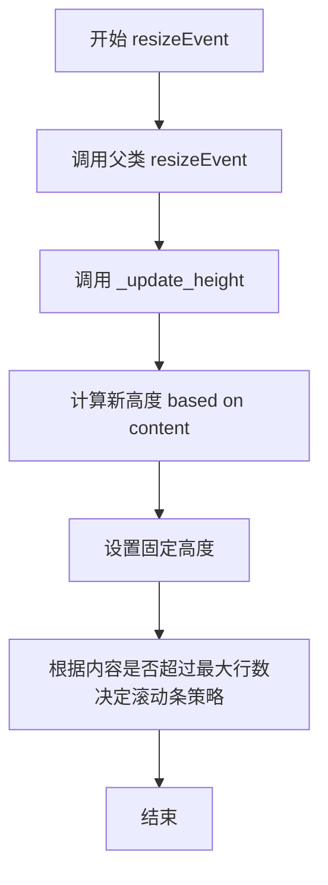

#### 带注释源码

```python
def resizeEvent(self, event):
    """Recalculate height when widget is resized."""
    # 调用父类的 resizeEvent 方法，保持 Qt 原有的调整大小行为
    # 这确保了 QPlainTextEdit 的内部状态正确更新
    super().resizeEvent(event)
    
    # 调用内部方法 _update_height，根据当前内容重新计算并设置部件高度
    # 这确保了当用户手动调整部件大小时，高度能够适应内容或最大行数限制
    self._update_height()
```


### `MExpandingTextEdit.showEvent`

当部件变为可见时，重新计算高度以确保文本编辑框在显示时具有正确的高度。

参数：

-  `event`：`QtGui.QShowEvent`，Qt 提供的显示事件对象，描述导致部件显示的事件

返回值：`None`，无返回值

#### 流程图

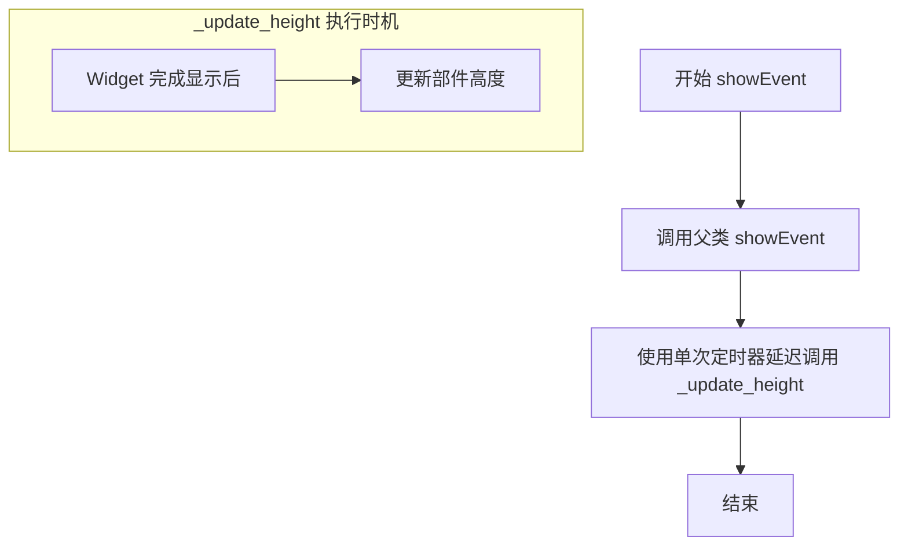

#### 带注释源码

```python
def showEvent(self, event):
    """Recalculate height when widget becomes visible."""
    # 调用父类的 showEvent 方法，保持 Qt 部件的默认显示行为
    # 父类方法会处理 Qt 内部的显示逻辑（如发出 shown 信号等）
    super().showEvent(event)
    
    # 使用 QTimer.singleShot(0, ...) 在当前事件处理完成后、下一个事件循环开始时
    # 延迟调用 _update_height 方法。
    # 延迟的原因：
    # 1. 确保部件已完成布局计算，获取正确的字体和文档信息
    # 2. 避免在 showEvent 执行过程中直接调用 setFixedHeight 可能导致的递归问题
    # 3. 此时部件可见，可以正确计算可视区域的行数
    QtCore.QTimer.singleShot(0, self._update_height)
```


### `MExpandingTextEdit.get_dayu_size`

获取组件的 Dayu 尺寸大小，用于支持样式主题的大小切换功能。

参数：

- （无参数，只包含隐式 `self`）

返回值：`int`，返回组件当前设置的 Dayu 尺寸值（对应 `dayu_theme` 中的尺寸常量如 `tiny`、`small`、`medium`、`large`、`huge`）。

#### 流程图

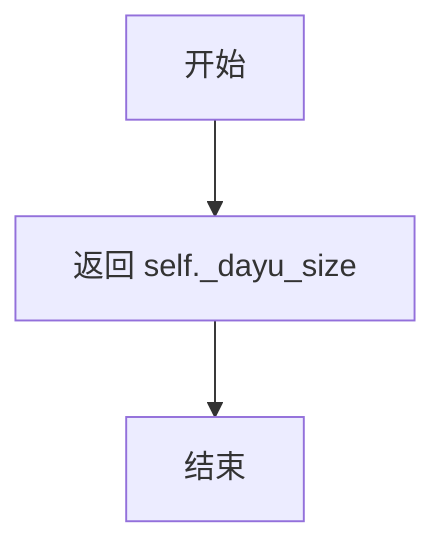

#### 带注释源码

```python
def get_dayu_size(self):
    """获取组件的 Dayu 尺寸大小。
    
    Returns:
        int: 当前的 Dayu 尺寸值，通常为 dayu_theme 模块中定义的
            常量（如 huge, large, medium, small, tiny）之一。
            初始值由 dayu_theme.default_size 决定。
    """
    return self._dayu_size
```


### `MExpandingTextEdit.set_dayu_size`

设置组件的 dayu 尺寸大小，通过 Qt 样式系统应用尺寸主题。

参数：

- `value`：`int`，要设置的 dayu 组件尺寸大小（对应 dayu_theme 模块中的尺寸常量，如 huge、large、medium、small、tiny）

返回值：`None`，无返回值描述

#### 流程图

```mermaid
flowchart TD
    A[开始 set_dayu_size] --> B[接收 value 参数]
    B --> C[将 value 赋值给 self._dayu_size]
    C --> D{调用 style polish}
    D --> E[调用 self.style().polishself]
    E --> F[结束方法]
```

#### 带注释源码

```python
def set_dayu_size(self, value):
    """设置组件的 dayu 尺寸大小。
    
    参数:
        value: int, 尺寸值, 对应 dayu_theme 中的尺寸常量
    """
    # 1. 将传入的尺寸值存储到实例变量 _dayu_size 中
    self._dayu_size = value
    
    # 2. 调用 Qt 样式系统的 polish 方法
    #    polish 会重新应用样式表, 使尺寸变化生效
    self.style().polish(self)
```


### `MExpandingTextEdit.huge`

该方法用于将文本编辑组件的尺寸设置为"巨大"（huge）级别，这是 `dayu_theme` 主题中定义的尺寸级别之一。方法通过调用 `set_dayu_size()` 并传入 `dayu_theme.huge` 常量来改变组件的视觉大小，然后返回 `self` 以支持链式调用设计模式。

参数： 无

返回值：`MExpandingTextEdit`，返回组件实例本身（`self`），支持链式调用

#### 流程图

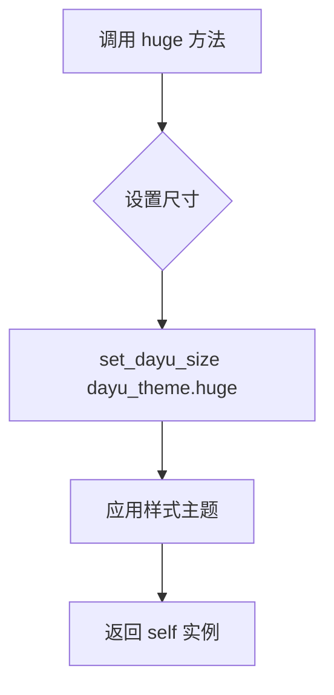

#### 带注释源码

```python
def huge(self):
    """
    将组件尺寸设置为 huge 级别。
    
    该方法是 MExpandingTextEdit 类的尺寸链式 setter 方法之一，
    允许通过连续调用来快速设置组件大小，如:
    widget.huge().medium().small()
    """
    # 调用内部方法将 _dayu_size 属性设置为 dayu_theme.huge
    # 这会触发 Qt 属性系统并应用相应的样式主题
    self.set_dayu_size(dayu_theme.huge)
    
    # 返回 self 实例本身，支持链式调用
    # 例如: text_edit.huge().setText("Hello")
    return self
```


### `MExpandingTextEdit.large`

该方法用于将 `MExpandingTextEdit` 组件的尺寸样式设置为 "large" 级别，通过调用 `set_dayu_size()` 方法设置主题大小，并返回自身实例以支持链式调用，这是 dayu_widgets 库中典型的 Fluent API 设计模式。

参数：
- 无（仅包含 `self` 参数）

返回值：`MExpandingTextEdit`，返回自身实例以支持方法链式调用

#### 流程图

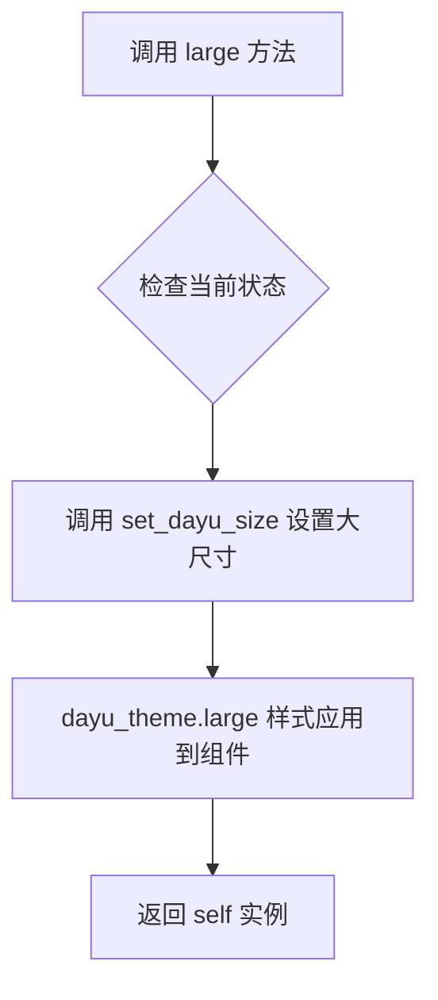

#### 带注释源码

```python
def large(self):
    """
    将组件尺寸设置为大号 (large) 级别。
    采用 Fluent Interface 模式，返回 self 以支持链式调用。
    
    示例用法:
        text_edit = MExpandingTextEdit()
        text_edit.large().setPlaceholderText("请输入内容")
    """
    # 调用内部方法设置主题的大尺寸样式
    self.set_dayu_size(dayu_theme.large)
    
    # 返回 self 实例，允许链式调用（如 .large().medium() 等）
    return self
```


### `MExpandingTextEdit.medium`

设置组件的尺寸为主题中的中等大小（medium），并返回实例本身以支持方法链式调用。

参数：

- `self`：`MExpandingTextEdit`，方法所属的实例对象

返回值：`MExpandingTextEdit`，返回实例本身，用于链式调用

#### 流程图

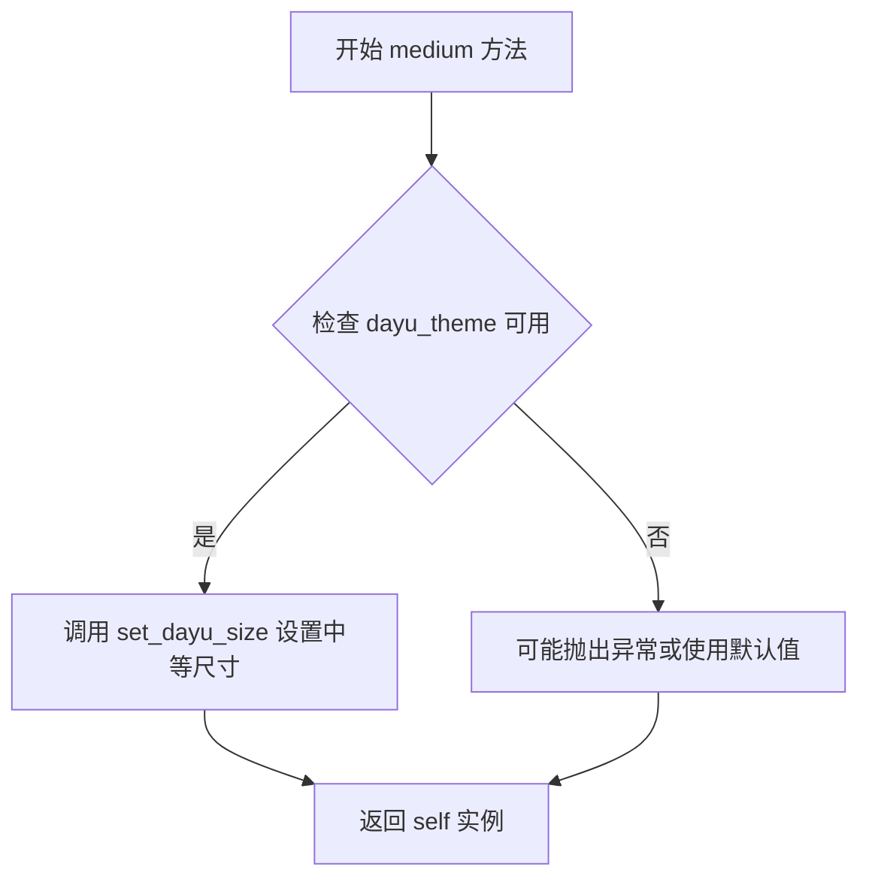

#### 带注释源码

```python
def medium(self):
    """
    设置组件尺寸为中等大小（medium）
    该方法是 Fluent API 的一部分，允许链式调用
    """
    self.set_dayu_size(dayu_theme.medium)  # 调用内部方法设置主题尺寸为 medium
    return self  # 返回实例本身，支持方法链式调用，如 widget.medium().large()
```


### `MExpandingTextEdit.small`

设置文本编辑组件的尺寸为"小号"(small)样式，并返回实例本身以支持方法链式调用。该方法通过调用 `set_dayu_size()` 内部方法设置 `dayu_theme.small` 尺寸，然后返回当前实例，使得多个尺寸方法可以连续调用（如 `.small().medium()` 等效地切换尺寸）。

参数： 无（仅包含隐式参数 `self`）

返回值：`MExpandingTextEdit`，返回实例本身，支持链式调用

#### 流程图

```mermaid
flowchart TD
    A[调用 small 方法] --> B{检查当前实例}
    B -->|是 MExpanding文本编辑实例| C[调用 set_dayu_size]
    C --> D[传入 dayu_theme.small 参数]
    D --> E[更新 _dayu_size 属性]
    E --> F[调用 style().polish 刷新样式]
    F --> G[返回 self 实例]
    G --> H[支持链式调用]
```

#### 带注释源码

```python
def small(self):
    """
    设置文本编辑组件的尺寸为小号样式。
    
    此方法通过调用内部方法 set_dayu_size() 来更新组件的尺寸主题，
    并返回 self 以支持方法链式调用，方便 Fluent API 风格的代码编写。
    
    例如：
        text_edit = MExpandingTextEdit().small()
        # 或者链式调用
        text_edit = MExpandingTextEdit().large().small()  # 最终设为 small
    """
    # 调用内部方法设置尺寸为 dayu_theme.small
    self.set_dayu_size(dayu_theme.small)
    # 返回 self 以支持链式调用
    return self
```


### `MExpandingTextEdit.tiny`

该方法用于将组件的尺寸设置为"极小"（tiny）规格，是 `MExpandingTextEdit` 类的链式配置方法之一，允许在创建实例后通过连续调用来快速设置组件大小风格。

参数：

- 无显式参数（`self` 为隐式参数，表示实例本身）

返回值：`MExpandingTextEdit`，返回实例本身以支持链式调用

#### 流程图

```mermaid
flowchart TD
    A[开始 tiny 方法] --> B{设置尺寸}
    B --> C[调用 self.set_dayu_size<br/>参数: dayu_theme.tiny]
    C --> D[返回 self]
    D --> E[结束 - 支持链式调用]
```

#### 带注释源码

```python
def tiny(self):
    """
    将组件尺寸设置为极小规格（tiny）。
    
    这是一个链式配置方法，允许在创建实例后快速设置尺寸风格。
    内部通过调用 set_dayu_size 方法来实现尺寸变更。
    
    Returns:
        MExpandingTextEdit: 返回实例本身，支持链式调用（例如：widget.tiny().setText('hello')）
    """
    self.set_dayu_size(dayu_theme.tiny)
    return self
```


### `MExpandingTextEdit.sizeHint`

返回基于单行高度的尺寸提示，用于Qt布局系统确定组件的首选大小。

参数：

- `self`：`MExpandingTextEdit`，类实例本身，无需显式传递

返回值：`QtCore.QSize`，返回包含建议宽度和单行高度的 QSize 对象，其中宽度继承自父类建议宽度，高度根据单行文本计算得出。

#### 流程图

```mermaid
flowchart TD
    A[开始 sizeHint] --> B[调用父类sizeHint获取宽度]
    B --> C[调用_calculate_height_for_lines传入1获取单行高度]
    C --> D[构造QtCore.QSize对象]
    D --> E[返回尺寸提示]
```

#### 带注释源码

```python
def sizeHint(self) -> QtCore.QSize:
    """Return size hint based on single line height."""
    # 调用父类QPlainTextEdit的sizeHint方法获取建议宽度
    width = super().sizeHint().width()
    
    # 计算单行文本所需的高度
    # _calculate_height_for_lines(1) 返回单行文本的显示高度
    height = self._calculate_height_for_lines(1)
    
    # 组合宽度和高度，返回Qt尺寸对象
    return QtCore.QSize(width, height)
```


### `MExpandingTextEdit.minimumSizeHint`

该方法重写了 QPlainTextEdit 的 minimumSizeHint，用于返回组件的最小尺寸提示，确保组件基于单行高度计算最小高度，以保持紧凑的单行外观。

参数：

- `self`：隐式参数，`MExpandingTextEdit` 实例本身，当前文本编辑组件

返回值：`QtCore.QSize`，返回基于单行高度的最小尺寸提示，宽度继承自父类，高度基于单行计算

#### 流程图

```mermaid
flowchart TD
    A[开始 minimumSizeHint] --> B[调用父类 super().minimumSizeHint 获取宽度]
    B --> C[调用 _calculate_height_for_lines 传入参数1计算单行高度]
    C --> D[使用 QtCore.QSize 组合宽度和单行高度]
    D --> E[返回 QSize 对象]
```

#### 带注释源码

```python
def minimumSizeHint(self) -> QtCore.QSize:
    """Return minimum size hint based on single line height."""
    # 调用父类 QPlainTextEdit 的 minimumSizeHint 方法获取默认宽度
    width = super().minimumSizeHint().width()
    
    # 计算单行文本的高度（使用内部方法 _calculate_height_for_lines）
    # 传入参数 1 表示计算单行显示所需的高度
    height = self._calculate_height_for_lines(1)
    
    # 组合宽度和单行高度，创建 QSize 对象并返回
    # 宽度保持父类建议的宽度，高度固定为单行高度以保持紧凑外观
    return QtCore.QSize(width, height)
```

## 关键组件


### 自动高度调整机制

根据文本内容自动调整组件高度，从单行开始随着文本换行扩展，支持最大行数限制

### 最大行数限制与滚动切换

通过max_lines参数控制可见行数上限，当内容超过限制时自动切换为滚动模式保持光标可见

### QLineEdit兼容层

提供returnPressed信号、text/setText/clear方法、placeholderText支持和selectAll方法，兼容QLineEdit API

### Dayu主题尺寸支持

通过dayu_size属性和chain方法（tiny/small/medium/large/huge）集成Dayu主题系统，支持动态尺寸切换

### 内容变化监听与高度更新

通过document().contentsChanged信号连接_update_height方法，实时响应内容变化并重新计算高度

### 键盘事件特殊处理

区分Enter键和Shift+Enter键，前者发射returnPressed信号模拟QLineEdit行为，后者正常插入换行

### 尺寸提示计算

sizeHint和minimumSizeHint方法返回基于单行高度的固定尺寸，配合SizePolicy.Expanding实现布局控制


## 问题及建议


### 已知问题

- **信号连接方式不规范**：第48行 `self.document().contentsChanged.connect(self.textChanged.emit)` 直接连接信号对象的emit方法，这种方式在PySide6中行为可能不稳定，且无法正确断开连接
- **硬编码的垂直内边距**：第88行 `vertical_padding = 6` 使用魔法数字，缺乏文档说明，且无法适配不同字体或主题
- **字体度量未缓存**：第87行每次调用 `_calculate_height_for_lines` 都创建新的 `fontMetrics()` 对象，在高频调用时影响性能
- **重复定时器调用**：第62-63行在 `_on_contents_changed` 中使用两个独立的 `singleShot(0, ...)` 调用，增加了事件循环负担
- **高度计算方法重复**：`sizeHint` 和 `minimumSizeHint` 方法中存在重复的计算逻辑（第165-171行和第173-179行）
- **行数计算可能不准确**：第104-113行使用 `layout.lineCount()` 计算行数，但未考虑由于手动换行或特殊字符导致的额外行
- **缺少QLineEdit部分方法兼容**：未实现 `setReadOnly`/`isReadOnly`、`setMaxLength` 等常用方法的代理
- **类型注解不完整**：部分方法如 `clear`、`selectAll`、`resizeEvent` 等缺少参数类型注解

### 优化建议

- 使用 `lambda: self.textChanged.emit()` 替代直接连接信号对象，或定义专门的私有方法来发射信号
- 将 `vertical_padding` 作为类属性或配置参数，可通过构造函数自定义
- 缓存 `fontMetrics()` 对象，在字体变化时更新缓存
- 合并两个 `singleShot` 调用为单一调用，在同一个回调中执行高度更新和光标定位
- 提取 `_calculate_size_hint` 公共方法供 `sizeHint` 和 `minimumSizeHint` 共用
- 添加字体变化监听，在字体改变时重新计算高度
- 考虑使用 `QTextDocument` 的 `blockCount` 结合每块的换行情况来更准确地估算行数
- 补充缺失的类型注解和文档字符串
- 添加边界情况处理，如处理无效的文档块布局

## 其它


### 设计目标与约束

该组件的设计目标是创建一个行为类似于QLineEdit的可编辑文本输入框，但支持多行文本。主要约束包括：基于PySide6.QtWidgets.QPlainTextEdit扩展，依赖dayu_theme主题系统，最大行数默认为4行，需要保持与QLineEdit接口的兼容性（text、setText、clear、setPlaceholderText、placeholderText、selectAll等方法）。

### 错误处理与异常设计

代码中未实现显式的异常处理机制。潜在的异常场景包括：文档对象为None时的访问、字体度量获取失败、布局对象为空等。错误处理主要依赖Qt框架的内部机制和Python的隐式异常传播。在关键方法如_update_height中通过检查文本是否为空、块是否有效等方式进行基本的防御性编程。

### 数据流与状态机

数据流主要包含两条路径：1）文本内容变化流程：用户输入 → document().contentsChanged信号 → _on_contents_changed() → _update_height()计算新高度 → setFixedHeight()应用高度 → 根据total_lines与_max_lines比较决定滚动条策略；2）光标可见性流程：contentsChanged信号 → _on_contents_changed() → QTimer.singleShot(0, _ensure_cursor_visible) → ensureCursorVisible()。状态机包含三种状态：单行状态（文本为空或只有1行）、扩展状态（1<总行数≤最大行数，高度自动扩展）、滚动状态（总行数>最大行数，显示滚动条并保持光标可见）。

### 外部依赖与接口契约

外部依赖包括：PySide6.QtCore（信号、属性、定时器）、PySide6.QtGui（字体度量、文本光标、按键事件）、PySide6.QtWidgets（QPlainTextEdit、尺寸策略、滚动条策略）、dayu_theme模块（default_size、huge、large、medium、small、tiny常量）。接口契约方面：返回Enter信号时表示确认输入（不插入换行符），Shift+Enter执行默认换行行为；text()和setText()方法提供QLineEdit兼容接口；sizeHint()和minimumSizeHint()返回基于单行高度的尺寸建议；dayu_size属性支持链式调用（huge/large/medium/small/tiny方法）。

### 性能考虑

代码使用QTimer.singleShot(0, ...)延迟执行_update_height()和_ensure_cursor_visible()，这在内容快速连续变化时可以起到节流作用，避免每帧都重新计算。固定高度策略避免了布局系统的反复计算。字体度量（fontMetrics）和布局（layout）对象在每次调用时重新获取，可能存在优化空间。

### 安全性考虑

该组件为纯GUI组件，不涉及网络通信、文件操作或敏感数据处理，安全性风险较低。主要考虑点包括：文本内容通过Qt的内部机制处理，不存在注入风险；placeholderText仅作为显示提示，不存储实际数据。

### 兼容性考虑

代码在Python 3环境下使用from __future__ import annotations实现类型注解向前兼容。主要兼容性问题：1）Qt版本依赖，需要PySide6；2）dayu_theme模块依赖，该组件是dayu_widgets生态系统的一部分；3）文档中未处理与QTextEdit的兼容性，仅基于QPlainTextEdit实现。

### 测试考虑

建议测试场景包括：空文本时的单行高度显示；单行文本输入后高度变化；多行文本自动换行时的行数计算；超过max_lines后的滚动行为；Enter键触发returnPressed信号；Shift+Enter插入换行符；setText和clear方法的动态高度调整；resizeEvent触发时的高度重算；showEvent触发时的初始化；placeholderText的设置与显示；dayu_size属性及链式调用方法（huge/large/medium/small/tiny）的样式更新效果。

### 潜在技术债务与优化空间

1）_calculate_height_for_lines方法中的vertical_padding=6为硬编码值，应考虑从主题或配置中读取；2）字体度量在每次计算时重新获取，可缓存以提升性能；3）_update_height方法中遍历所有文本块计算行数，当文本很长时可能影响性能，可考虑限制遍历范围或使用更高效的计算方式；4）缺少对max_lines参数的有效性验证（应为正整数）；5）未实现最大字符数限制功能；6）文档注释中提到emits returnPressed但实际使用Signal()声明为类属性，表述不够精确。

### 关键组件信息

MExpandingTextEdit：核心组件，继承QPlainTextEdit的可扩展文本输入控件；dayu_theme：外部主题模块，提供尺寸常量；document()：Qt文档对象，用于监听内容变化；contentsChanged信号：Qt内置信号，触发高度更新逻辑。

### 整体运行流程

组件初始化时设置单行高度，禁用滚动条，连接contentsChanged信号到内容变化处理函数。当用户输入文本时，contentsChanged信号触发_on_contents_changed方法，该方法调用_update_height计算并应用新高度，同时通过定时器延迟调用_ensure_cursor_visible确保光标可见。_update_height方法遍历文档块计算实际可见行数，根据行数与_max_lines的比较结果决定是固定高度还是启用滚动。当按下Enter键时发射returnPressed信号，按下Shift+Enter时执行默认的换行行为。

    