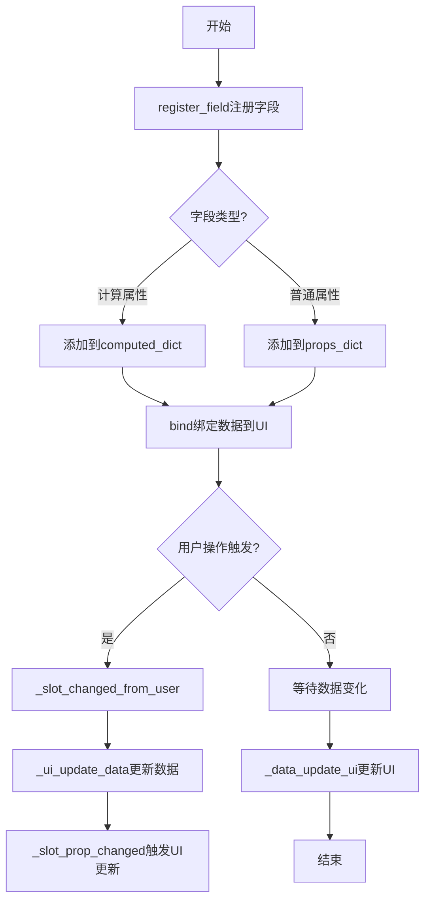
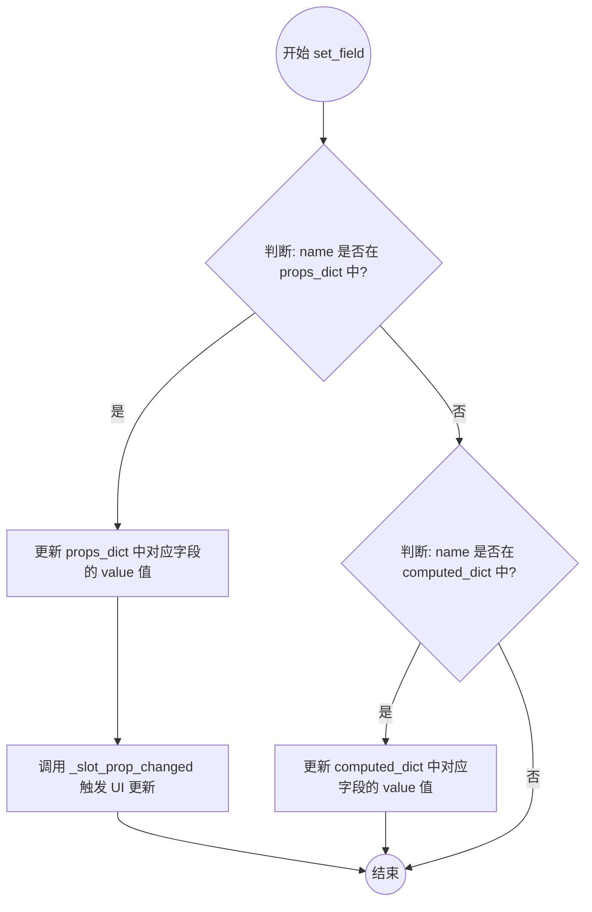
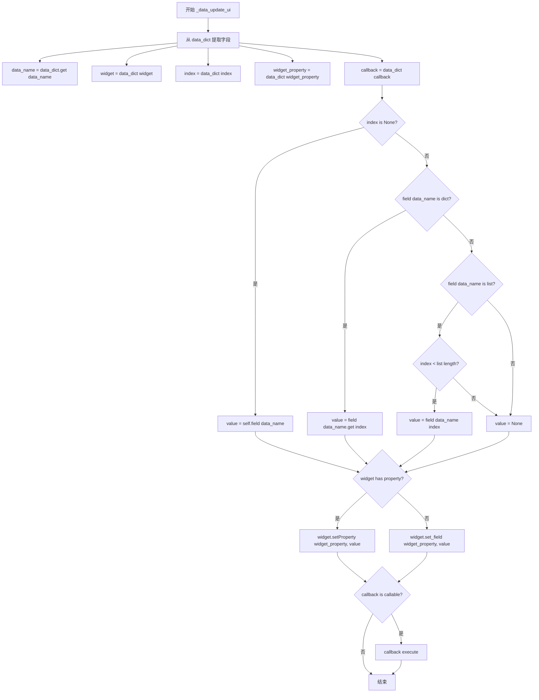
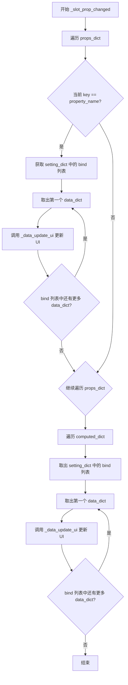
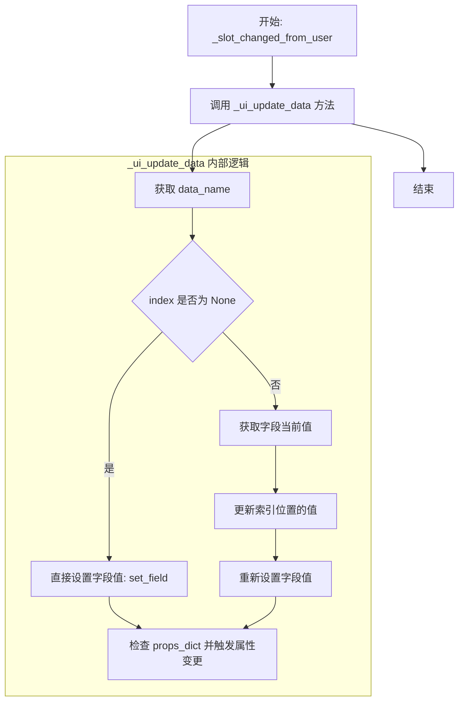
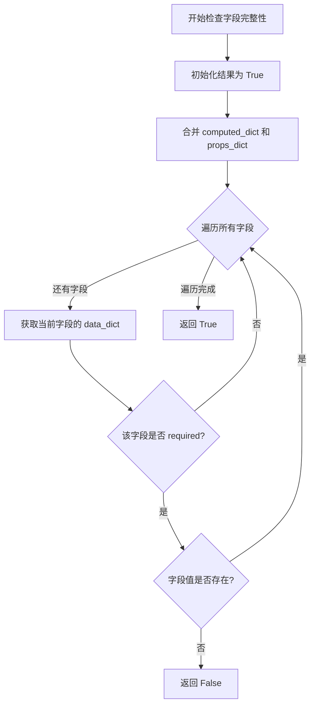

# `comic-translate\app\ui\dayu_widgets\field_mixin.py` 详细设计文档

这是一个Qt UI混合类，用于管理数据字段与Qt widgets之间的双向绑定，支持计算属性和普通属性的注册、绑定、双向同步及完整性验证。

## 整体流程



## 类结构

```
MFieldMixin (混合类)
└── 用于Qt数据绑定的字段管理mixin
```

## 全局变量及字段


### `MFieldMixin.computed_dict`
    
类属性，计算属性字典，用于存储带有getter/setter的计算属性，结构包含value、getter、setter、required和bind列表

类型：`dict | None`
    


### `MFieldMixin.props_dict`
    
类属性，普通属性字典，用于存储普通的键值对属性，结构包含value、require和bind列表

类型：`dict | None`
    
    

## 全局函数及方法


### `MFieldMixin.register_field`

该方法用于注册字段到混合类中，支持计算属性（通过getter函数动态计算）和普通属性两种模式，并将字段信息存储在computed_dict或props_dict中。

参数：

- `name`：`str`，字段名称，用于标识该字段
- `getter`：`callable` 或 `any`，获取器函数（如果为可调用对象则视为计算属性，否则视为普通属性），默认为None
- `setter`：`callable` 或 `any`，设置器函数，用于计算属性的值更新，默认为None
- `required`：`bool`，标识该字段是否为必填项，默认为False

返回值：`None`，无返回值

#### 流程图

```mermaid
flowchart TD
    A[开始 register_field] --> B{self.computed_dict is None?}
    B -->|是| C[初始化 self.computed_dict = {}]
    B -->|否| D{self.props_dict is None?}
    C --> D
    D -->|是| E[初始化 self.props_dict = {}]
    D -->|否| F{callable(getter)?}
    E --> F
    F -->|是| G[value = getter&#40;&#41;]
    G --> H[在 computed_dict 中注册字段]
    H --> I[设置 value, getter, setter, required, bind]
    F -->|否| J[在 props_dict 中注册字段]
    J --> K[设置 value, require, bind]
    I --> L[返回 None]
    K --> L
```

#### 带注释源码

```python
def register_field(self, name, getter=None, setter=None, required=False):
    """
    注册字段到混合类中，支持计算属性和普通属性两种模式
    
    参数:
        name: 字段名称，用于标识该字段
        getter: 获取器函数，如果为可调用对象则创建计算属性，否则创建普通属性
        setter: 设置器函数，用于计算属性的值更新
        required: 标识该字段是否为必填项
    
    返回:
        None
    """
    # 如果computed_dict未初始化，则创建空字典
    if self.computed_dict is None:
        self.computed_dict = {}
    
    # 如果props_dict未初始化，则创建空字典
    if self.props_dict is None:
        self.props_dict = {}
    
    # 判断getter是否为可调用对象
    if callable(getter):
        # 计算属性：值由getter函数动态计算
        value = getter()
        self.computed_dict[name] = {
            "value": value,       # 当前值
            "getter": getter,     # 获取器函数
            "setter": setter,     # 设置器函数
            "required": required, # 是否必填
            "bind": [],           # 绑定列表，用于UI关联
        }
    else:
        # 普通属性：值直接存储
        self.props_dict[name] = {
            "value": getter,    # 属性值
            "require": required, # 是否必填（注意：这里拼写为require而非required）
            "bind": [],         # 绑定列表
        }
    
    # 方法无返回值
    return
```


### `MFieldMixin.bind`

该方法用于将数据字段绑定到Qt Widget，实现数据与UI的双向同步，支持指定索引、Qt信号和回调函数。

#### 参数

- `data_name`：`str`，数据字段名称，用于关联props_dict或computed_dict中的字段
- `widget`：`object`，Qt Widget对象（如QPushButton、QLineEdit等）
- `qt_property`：`str`，Qt Widget的属性名（如"text"、"checked"等）
- `index`：`int`，可选，用于指定列表或字典中的索引位置
- `signal`：`str`，可选，Qt信号名称（如"clicked"、"textChanged"），用于监听用户操作
- `callback`：`callable`，可选，绑定完成后的回调函数

#### 返回值

`object`，返回绑定的widget对象

#### 流程图

```mermaid
flowchart TD
    A[开始 bind 方法] --> B[创建 data_dict 数据字典]
    B --> C{判断 data_name 是否在 computed_dict 中}
    C -->|是| D[将 data_dict 添加到 computed_dict[data_name]['bind'] 列表]
    C -->|否| E[将 data_dict 添加到 props_dict[data_name]['bind'] 列表]
    D --> F{判断 signal 是否存在}
    E --> F
    F -->|是| G[绑定信号到 _slot_changed_from_user 方法]
    F -->|否| H[调用 _data_update_ui 更新UI显示]
    G --> H
    H --> I[返回 widget 对象]
```

#### 带注释源码

```python
def bind(self, data_name, widget, qt_property, index=None, signal=None, callback=None):
    # 创建一个包含绑定信息的字典，用于后续数据同步
    data_dict = {
        "data_name": data_name,           # 数据字段名称
        "widget": widget,                 # 绑定的Qt Widget对象
        "widget_property": qt_property,   # Qt Widget的属性名
        "index": index,                   # 可选的索引（用于list/dict）
        "callback": callback,             # 可选的回调函数
    }
    
    # 判断数据字段是计算属性还是普通属性
    if data_name in self.computed_dict:
        # 计算属性：将绑定信息添加到computed_dict的bind列表中
        self.computed_dict[data_name]["bind"].append(data_dict)
    else:
        # 普通属性：将绑定信息添加到props_dict的bind列表中
        self.props_dict[data_name]["bind"].append(data_dict)
    
    # 如果提供了signal参数，则绑定用户操作信号
    if signal:  # 用户操作绑定数据
        # 使用functools.partial绑定data_dict到处理方法
        getattr(widget, signal).connect(functools.partial(self._slot_changed_from_user, data_dict))
    
    # 初始化时更新UI显示
    self._data_update_ui(data_dict)
    
    # 返回绑定的widget对象，便于链式调用
    return widget
```


### `MFieldMixin.fields`

获取MFieldMixin类中所有已注册的字段名（包括普通属性字段和计算属性字段），返回一个包含所有字段名的列表。

参数：

- `self`：`MFieldMixin`（隐式参数），调用该方法的类实例本身

返回值：`list`，返回所有字段名称的列表，合并了props_dict（普通属性）和computed_dict（计算属性）中的键

#### 流程图

```mermaid
graph TD
    A[开始fields方法] --> B[获取self.props_dict.keys()]
    B --> C[获取self.computed_dict.keys()]
    C --> D[使用+运算符拼接两个keys]
    E[返回拼接后的list] --> D
```

#### 带注释源码

```python
def fields(self):
    """
    获取所有已注册字段的名称列表
    
    该方法合并了两个字典的键：
    - props_dict: 存储普通属性字段（通过register_field的getter参数传入非callable值时创建）
    - computed_dict: 存储计算属性字段（通过register_field的getter参数传入callable时创建）
    
    Returns:
        list: 所有字段名称的列表
    """
    return self.props_dict.keys() + self.computed_dict.keys()
    # self.props_dict.keys() 获取普通属性的字段名
    # self.computed_dict.keys() 获取计算属性的字段名
    # + 运算符将两个dict_keys对象拼接成list返回
```


### `MFieldMixin.field`

获取指定字段的值，支持普通属性字段和计算属性字段。

参数：

- `name`：`str`，字段名称

返回值：`any`，返回指定字段的值。如果字段是普通属性（props_dict），直接返回存储的值；如果是计算属性（computed_dict），则调用其getter函数获取新值并返回。

#### 流程图

```mermaid
flowchart TD
    A[开始 field 方法] --> B{检查 name 是否在 props_dict 中}
    B -->|是| C[返回 props_dict[name]['value']]
    B -->|否| D{检查 name 是否在 computed_dict 中}
    D -->|是| E[调用 computed_dict[name]['getter'] 获取新值]
    E --> F[更新 computed_dict[name]['value'] 为新值]
    F --> G[返回新值]
    D -->|否| H[抛出 KeyError 异常]
    C --> Z[结束]
    G --> Z
    H --> Z
```

#### 带注释源码

```python
def field(self, name):
    """
    获取指定字段的值。
    
    优先从 props_dict（普通属性）中获取，若不存在则从 computed_dict（计算属性）中获取。
    对于计算属性，每次访问都会调用其 getter 函数获取最新值。
    
    参数:
        name: 字段名称，字符串类型
    
    返回:
        字段的当前值，类型取决于字段定义（任意类型）
    
    异常:
        KeyError: 当指定名称的字段不存在时抛出
    """
    # 步骤1: 检查是否为普通属性字段
    if name in self.props_dict:
        # 直接返回普通属性中存储的值
        return self.props_dict[name]["value"]
    
    # 步骤2: 检查是否为计算属性字段
    elif name in self.computed_dict:
        # 调用计算属性的 getter 函数获取最新值
        new_value = self.computed_dict[name]["getter"]()
        # 更新计算属性中缓存的值
        self.computed_dict[name]["value"] = new_value
        # 返回新获取的值
        return new_value
    
    # 步骤3: 字段不存在，抛出异常
    else:
        raise KeyError('There is no field named "{}"'.format(name))
```


### `MFieldMixin.set_field`

该方法用于设置类实例的字段值。它区分处理普通属性（props_dict）和计算属性（computed_dict）。对于普通属性，方法会直接更新存储的值，并调用内部方法触发 UI 更新逻辑；对于计算属性，则仅更新其缓存值。

参数：
- `name`：`str`，需要设置的字段名称。
- `value`：`any`，需要设置的具体值。

返回值：`None`，该方法不返回任何值。

#### 流程图



#### 带注释源码

```python
def set_field(self, name, value):
    """
    设置指定字段的值。

    如果字段存在于 props_dict（普通属性）中，则更新值并通知 UI 更新。
    如果字段存在于 computed_dict（计算属性）中，则仅更新缓存值。
    """
    # 判断是否为普通注册属性
    if name in self.props_dict:
        # 更新属性字典中的值
        self.props_dict[name]["value"] = value
        # 触发属性变化槽函数，用于同步更新绑定此属性的 UI 组件
        self._slot_prop_changed(name)

    # 判断是否为计算属性
    elif name in self.computed_dict:
        # 计算属性通常由 getter 方法计算得出，这里直接赋值会覆盖 getter 的返回值
        self.computed_dict[name]["value"] = value
```


### `MFieldMixin._data_update_ui`

该方法负责将数据模型中的字段值更新到UI组件（小部件）的属性上，支持索引访问（字典或列表），并处理Qt内置属性与自定义属性的差异化设置逻辑，最后执行可选的回调函数以完成后续操作。

参数：

- `self`：实例本身（隐式参数），`MFieldMixin`类型，类的实例引用
- `data_dict`：`dict`类型，包含数据绑定信息的字典，必须包含 `data_name`（数据名称）、`widget`（目标UI组件）、`index`（索引，可为None）、`widget_property`（目标属性名）、`callback`（回调函数，可为None）

返回值：`None`，无返回值，仅执行副作用操作（修改UI组件状态和调用回调函数）

#### 流程图



#### 带注释源码

```python
def _data_update_ui(self, data_dict):
    """
    将数据模型中的字段值更新到UI组件的属性上
    
    参数:
        data_dict: 包含以下键的字典
            - data_name: 数据字段名称（字符串）
            - widget: 目标UI组件（Qt小部件对象）
            - index: 索引值，用于访问复合类型数据（字典键或列表下标），可为None
            - widget_property: 要设置的Qt属性名称（字符串）
            - callback: 更新完成后的回调函数，可为None
    
    返回值:
        None
    """
    # 从数据字典中提取各个字段
    data_name = data_dict.get("data_name")          # 数据字段名称
    widget = data_dict["widget"]                     # 目标UI组件
    index = data_dict["index"]                      # 索引（支持字典/列表访问）
    widget_property = data_dict["widget_property"]  # 目标属性名
    callback = data_dict["callback"]                # 回调函数
    
    value = None  # 初始化值为None
    
    # 根据索引类型获取字段值
    if index is None:
        # 无索引：直接获取字段的完整值
        value = self.field(data_name)
    elif isinstance(self.field(data_name), dict):
        # 索引为字典键：从字典中获取对应键的值
        value = self.field(data_name).get(index)
    elif isinstance(self.field(data_name), list):
        # 索引为列表下标：从列表中获取对应下标的值
        # 防止索引越界，超出范围则返回None
        value = self.field(data_name)[index] if index < len(self.field(data_name)) else None
    
    # 检查UI组件是否具有目标属性（Qt内置属性或动态属性）
    # 方法1：检查Qt元对象系统中的属性
    has_meta_property = widget.metaObject().indexOfProperty(widget_property) > -1
    # 方法2：检查动态添加的属性（通过dynamicPropertyNames）
    has_dynamic_property = widget_property in list(
        map(str, [b.data().decode() for b in widget.dynamicPropertyNames()])
    )
    
    if has_meta_property or has_dynamic_property:
        # 使用Qt的setProperty设置内置或动态属性
        widget.setProperty(widget_property, value)
    else:
        # 使用自定义的set_field方法设置属性（适用于非Qt标准属性）
        widget.set_field(widget_property, value)
    
    # 如果存在回调函数，则执行它（用于链式更新或后续处理）
    if callable(callback):
        callback()
```


### `MFieldMixin._slot_prop_changed`

这是一个属性变更槽函数，当属性值发生变化时被调用，用于遍历所有绑定该属性的UI组件并触发界面更新。

参数：

- `property_name`：`str`，属性名称，用于标识哪个属性发生了变化

返回值：`None`，无返回值

#### 流程图



#### 带注释源码

```python
def _slot_prop_changed(self, property_name):
    """
    属性变更槽函数，当属性值发生变化时被调用
    
    参数:
        property_name: 发生变化的属性名称
    
    返回值:
        None
    """
    # 遍历普通属性字典，查找匹配的属性名
    for key, setting_dict in self.props_dict.items():
        # 检查当前属性是否等于发生变化的属性
        if key == property_name:
            # 遍历该属性绑定的所有UI组件数据字典
            for data_dict in setting_dict["bind"]:
                # 调用UI更新方法，刷新绑定组件的显示
                self._data_update_ui(data_dict)

    # 遍历计算属性字典，通知所有计算属性的绑定组件更新
    # 注意：这里会无条件更新所有计算属性的绑定，无论property_name是什么
    for key, setting_dict in self.computed_dict.items():
        for data_dict in setting_dict["bind"]:
            self._data_update_ui(data_dict)
```


### `MFieldMixin._slot_changed_from_user`

这是一个槽函数，当用户通过UI操作更改字段值时自动触发，负责将用户输入的值传递给数据更新方法，以同步UI与数据模型的状态。

参数：

- `data_dict`：`dict`，数据字典，包含数据名称、小部件、属性名、索引和回调函数等信息
- `ui_value`：`任意类型`，用户通过UI输入的新值

返回值：`None`，无显式返回值

#### 流程图



#### 带注释源码

```python
def _slot_changed_from_user(self, data_dict, ui_value):
    """
    槽函数：当用户通过UI操作更改字段值时自动触发
    
    参数:
        data_dict: 包含数据绑定信息的字典，结构如下：
            - data_name: 数据字段名称
            - widget: 关联的Qt控件对象
            - widget_property: Qt属性名
            - index: 索引（可选，用于列表或字典类型）
            - callback: 回调函数（可选）
        ui_value: 用户在UI中输入的新值
    
    返回值:
        None: 此方法无返回值，结果通过内部调用 _ui_update_data 体现
    """
    # 调用内部方法 _ui_update_data 来处理数据更新
    # 这里采用了委托模式，将具体的更新逻辑交给 _ui_update_data 方法处理
    self._ui_update_data(data_dict, ui_value)
```


### `MFieldMixin._ui_update_data`

该方法用于处理用户从UI控件输入的数据更新，将UI值同步到内部数据字段中，支持索引和非索引两种更新模式，并在更新完成后触发属性变更回调以同步UI显示。

参数：

-  `data_dict`：`dict`，包含字段绑定信息的字典，必须包含 `data_name` 键，可选包含 `index`（字段索引）等信息
-  `ui_value`：`任意类型`，从UI控件获取的用户输入值

返回值：`None`，无返回值，仅执行数据更新和UI同步操作

#### 流程图

```mermaid
flowchart TD
    A[开始 _ui_update_data] --> B[从 data_dict 获取 data_name]
    B --> C[从 data_dict 获取 index, 默认 None]
    C --> D{index is None?}
    D -->|是| E[调用 set_field 直接更新 data_name 的值为 ui_value]
    D -->|否| F[调用 field 获取 data_name 当前值 old_value]
    F --> G[将 ui_value 赋值给 old_value[index]]
    G --> H[调用 set_field 更新 data_name 的值为修改后的 old_value]
    E --> I{检查 data_name 是否在 props_dict 中}
    H --> I
    I -->|是| J[调用 _slot_prop_changed 触发属性变更回调]
    I -->|否| K[结束]
    J --> K
```

#### 带注释源码

```python
def _ui_update_data(self, data_dict, ui_value):
    """
    处理用户从UI控件输入的数据更新，将UI值同步到内部数据字段中。
    
    参数:
        data_dict: dict, 包含字段绑定信息的字典，必须包含 'data_name' 键，
                   可选包含 'index'（字段索引）等信息
        ui_value: 任意类型, 从UI控件获取的用户输入值
    
    返回值:
        None, 无返回值
    """
    # 从 data_dict 中提取字段名称
    data_name = data_dict.get("data_name")
    # 获取字段索引（如果有的话），默认为 None 表示非索引更新
    index = data_dict.get("index", None)
    
    # 判断是否为索引更新模式
    if index is None:
        # 非索引模式：直接设置整个字段值
        self.set_field(data_name, ui_value)
    else:
        # 索引模式：获取当前值并在指定索引位置更新
        old_value = self.field(data_name)
        # 修改索引位置的值
        old_value[index] = ui_value
        # 将修改后的值重新设置到字段中
        self.set_field(data_name, old_value)
    
    # 检查该字段是否为普通属性字段（而非计算字段）
    # 如果是普通属性字段，则触发属性变更回调以同步UI显示
    if data_name in self.props_dict.items():
        self._slot_prop_changed(data_name)
```


### `MFieldMixin._is_complete`

该方法用于检查当前类中所有标记为 `required`（必填）的字段是否都已填写完整，遍历计算属性字典和普通属性字典中的必填项，验证其值是否存在，若存在任何必填项为空则返回 `False`，否则返回 `True`。

参数：

- `self`：`MFieldMixin` 实例，隐含的实例参数，代表当前具有字段管理能力的对象

返回值：`bool`，返回 `True` 表示所有必填字段均已填写完整，返回 `False` 表示存在必填字段未填写

#### 流程图



#### 带注释源码

```python
def _is_complete(self):
    """
    检查所有必填字段是否已填写完整
    
    遍历计算属性字典和普通属性字典的合并项，
    对每个标记为required的字段调用field方法获取其值，
    若值不存在（为空、None等falsy值）则立即返回False，
    若所有必填字段均有效则返回True
    """
    # 遍历计算属性和普通属性的合并项（包括两者共有的键值对）
    for name, data_dict in self.computed_dict.items() + self.props_dict.items():
        # 检查当前字段是否为必填项
        if data_dict["required"]:
            # 调用field方法获取字段的实际值
            if not self.field(name):
                # 若字段值不存在/为空，则判定为不完整，返回False
                return False
    # 所有必填字段均已填写完整，返回True
    return True
```

## 关键组件


### MFieldMixin 类

MFieldMixin 是一个数据绑定与UI同步混入类，通过注册机制管理计算字段和普通属性，并将数据字段绑定到Qt组件的属性或方法，实现数据变化时自动更新UI，以及用户操作UI时自动回写数据。

### 字段注册机制 (register_field)

register_field 方法支持两种类型字段的注册：普通属性字段（props_dict）和计算字段（computed_dict）。计算字段通过getter函数实现惰性加载，只有在访问时才计算新值；普通属性字段直接存储值。

### 数据绑定系统 (bind)

bind 方法实现数据与UI组件的双向绑定，支持指定Qt组件、属性名、索引、信号和回调函数。当信号触发时，通过_partial回调机制将用户操作同步到数据层。

### 索引访问与惰性加载

field 方法实现了索引访问逻辑：当字段值为dict时通过.get(index)获取，当字段值为list时通过[index]获取。对于计算字段，采用惰性加载模式，每次访问都调用getter函数重新计算。

### UI数据更新机制 (_data_update_ui)

_data_update_ui 方法负责将数据值更新到UI组件，支持Qt元对象系统属性和动态属性两种方式。对于计算属性，会触发所有绑定该字段的UI组件更新。

### 数据回写机制 (_ui_update_data)

_ui_update_data 方法实现用户操作后数据回写逻辑，支持索引位置的数据更新（用于list/dict类型的子元素修改），并触发属性变更传播。

### 字段变更传播 (_slot_prop_changed)

_slot_prop_changed 方法实现字段变更时的级联更新，当属性值变化时，遍历所有绑定该属性的UI组件进行同步更新。

### 完整性检查 (_is_complete)

_is_complete 方法验证所有required标记的计算字段和属性字段是否有值，用于表单验证等场景。


## 问题及建议


### 已知问题

-   **键名拼写不一致**：在 `register_field` 方法中，参数使用 `required`，但在 `props_dict` 字典中存储时使用了 `"require"` 键（少了字母'd'），而 `computed_dict` 中使用的是 `"required"`，这会导致 `_is_complete` 方法无法正确检查 `props_dict` 中的必填字段。
-   **字典类型不支持加法运算**：`_is_complete` 方法中使用 `self.computed_dict.items() + self.props_dict.items()`，在 Python 3 中 `dict_items` 对象不支持直接加法运算，会抛出 `TypeError`。
-   **成员检查逻辑错误**：`_ui_update_data` 方法中使用 `if data_name in self.props_dict.items()` 检查键是否存在，这是错误的用法，应该直接使用 `if data_name in self.props_dict`。
-   **冗余的 return 语句**：`register_field` 方法末尾的 `return` 语句没有返回任何值，且作为 mixin 类不需要返回值。
-   **变量命名歧义**：`register_field` 方法中 `value` 变量在 `computed_dict` 分支表示 `getter()` 的返回值，在 `props_dict` 分支表示 `getter` 本身，语义不一致。
-   **computed 字段不支持 setter**：当设置 computed 字段的值时，`set_field` 方法只是简单更新值而不调用 setter，且后续不会触发 UI 更新。
-   **缺少对 widget 属性的验证**：`bind` 方法中获取 `signal` 时若 widget 不存在该信号会抛出 `AttributeError`，未做异常处理。

### 优化建议

-   修正键名拼写：将 `props_dict` 中的 `"require"` 改为 `"required"`，保持与 `computed_dict` 一致。
-   修复字典合并：使用 `list(self.computed_dict.items()) + list(self.props_dict.items())` 或 `itertools.chain`。
-   修正成员检查：将 `if data_name in self.props_dict.items()` 改为 `if data_name in self.props_dict`。
-   移除无用的 return 语句：删除 `register_field` 方法末尾的 `return`。
-   统一变量语义：在 `register_field` 方法中为两个分支使用更明确的变量名，如 `initial_value` 和 `default_value`。
-   增强 computed 字段 setter 支持：在 `set_field` 中检测到 computed 字段时，调用其 setter 函数（若存在）并触发相关 UI 更新。
-   添加信号验证：在 `bind` 方法中调用信号连接前检查属性或方法是否存在，使用 `hasattr(widget, signal)` 进行防御性检查。
-   考虑添加类型注解和文档字符串，提高代码可维护性。


## 其它


### 设计目标与约束

本代码的设计目标是为Qt widget提供一套灵活的字段管理和数据绑定机制，使得数据模型与UI之间能够实现双向自动同步。设计约束包括：1）仅支持PyQt/PySide环境；2）计算属性（computed_dict）仅支持getter和setter，不支持计算逻辑的自动求值；3）绑定机制依赖于widget具有setProperty方法或set_field方法；4）不支持嵌套对象的深度绑定。

### 错误处理与异常设计

代码中的错误处理主要包括：1）field方法在字段不存在时抛出KeyError异常；2）register_field方法对getter参数进行callable检查，非 callable时存入props_dict；3）_data_update_ui方法中对index进行边界检查（index < len(list)）；4）set_field方法对只读计算属性（无setter）无处理，会覆盖value但不触发更新。异常设计存在的问题：缺少对widget属性存在性的预检查，bind方法中signal参数对应的信号不存在时会抛出AttributeError。

### 数据流与状态机

数据流分为两个方向：1）数据→UI：当调用set_field修改数据时，触发_slot_prop_changed，进而调用_data_update_ui更新所有绑定该字段的widget；2）UI→数据：当用户操作widget触发signal时，调用_slot_changed_from_user，进而调用_ui_update_data更新对应字段值。状态机方面：字段具有三种状态——普通属性（props_dict）、计算属性（computed_dict）、绑定状态（bind列表），状态转换通过register_field和bind方法完成。

### 外部依赖与接口契约

外部依赖包括：1）functools模块：用于partial函数创建回调；2）PyQt5/PyQt4/PySide/PySide2：代码运行需要Qt绑定库，widget对象需具有metaObject()、setProperty()、dynamicPropertyNames()等方法。接口契约：1）register_field的getter参数可为None或callable；2）bind方法的widget参数需支持setProperty或具有set_field方法；3）qt_property参数需为字符串，对应widget的有效属性名；4）callback参数需为callable或None。

### 线程安全与并发考虑

代码未对多线程访问进行任何保护。在多线程环境下，多个线程同时调用set_field或修改computed_dict/props_dict可能导致数据不一致。此外，bind方法中直接连接signal到_slot_changed_from_user，如果UI线程与数据线程分离，需自行处理跨线程调用。

### 性能特征与优化空间

性能特征：1）每次set_field调用都会遍历所有绑定进行UI更新，时间复杂度O(n)，n为绑定数量；2）计算属性每次field调用都会执行getter，即使值未变化；3）bind方法中使用list(map(...))每次调用都会创建新列表。优化空间：1）可增加脏标记（dirty flag）机制，仅在值真正变化时触发更新；2）可增加计算属性的缓存失效机制；3）可使用__slots__减少内存开销；4）_data_update_ui中多次调用self.field(data_name)可优化为单次调用。

### 版本兼容性与迁移建议

代码对Python2/3兼容（使用__future__导入），但部分写法较老旧。建议迁移：1）移除Python2兼容代码（division、print_function、absolute_import）；2）props_dict中"require"字段与register_field参数"required"命名不一致，应统一；3）考虑使用dataclass或attrs简化字典结构；4）bind方法中signal参数建议改为可选参数而非必须。

### 使用示例与最佳实践

最佳实践：1）MFieldMixin应作为Qt widget类的mixin使用；2）计算属性适用于需要根据其他字段动态计算的字段；3）required参数可用于表单验证场景；4）回调函数callback适用于需要在UI更新后执行额外逻辑的场景。注意事项：1）避免循环依赖（如A字段依赖B，B字段依赖A）；2）计算属性的setter仅用于存储值，不应包含复杂逻辑；3）绑定前需确保widget已正确初始化。

    