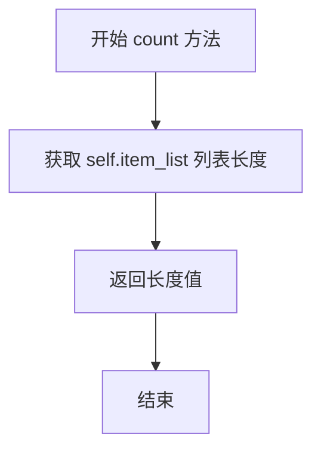
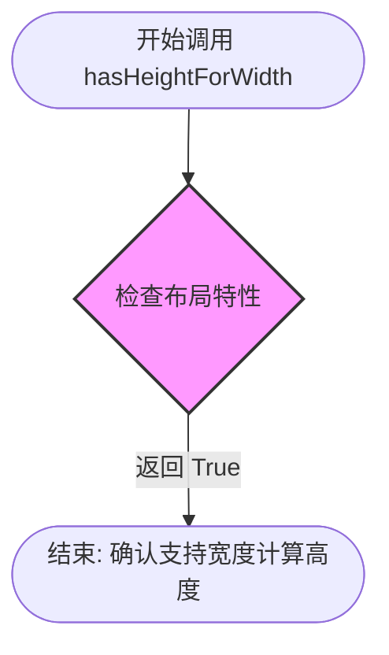
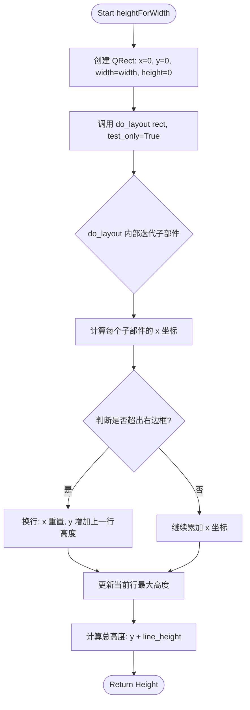
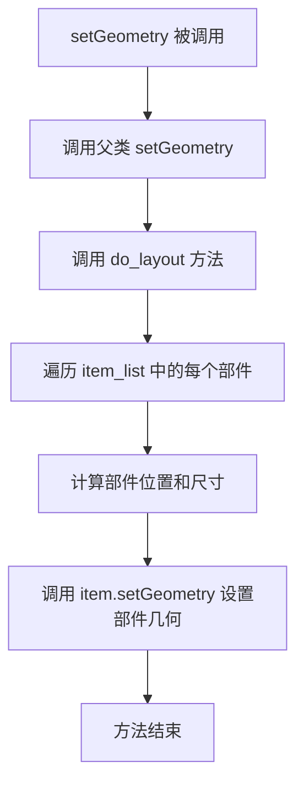
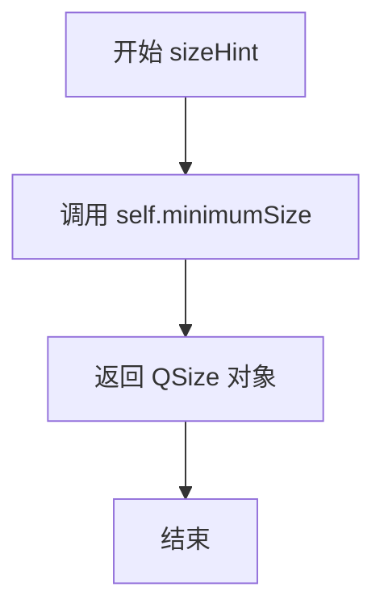
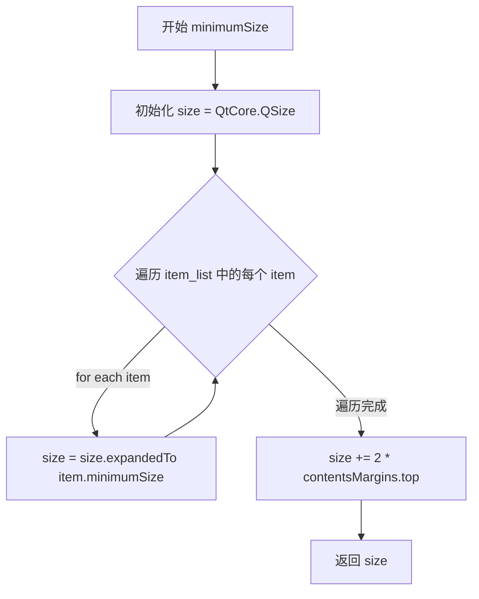

```mermaid
flowchart TD
    A[开始 insertWidget] --> B[调用 addChildWidget&#40;widget&#41;]
    B --> C{判断 index < 0?}
    C -->|是| D[index = self.count&#40;&#41;]
    C -->|否| E[继续]
    D --> F[创建 QWidgetItem&#40;widget&#41;]
    E --> F
    F --> G[self.item_list.insert&#40;index, item&#41;]
    G --> H[调用 self.update&#40;&#41;]
    H --> I[结束]
```

# `comic-translate\app\ui\dayu_widgets\flow_layout.py` 详细设计文档

MFlowLayout 是一个基于 PySide6 的自定义流式布局类，继承自 QtWidgets.QLayout。它实现了类似流 Flex 的布局效果，能够在水平方向上自动排列子部件，当一行宽度不足时自动将后续部件换到下一行，并支持根据宽度动态计算布局高度。

## 整体流程

```mermaid
graph TD
    A[开始] --> B[添加子部件 addWidget/insertWidget]
    B --> C[更新 item_list]
    C --> D{布局触发 (setGeometry / heightForWidth)}
    D --> E[调用 do_layout]
    E --> F[初始化 x, y, line_height]
    F --> G{遍历 item_list}
    G --> H[计算单项宽度与间距]
    H --> I{判断是否超出右边界且非首行}
    I -- 是 --> J[换行: 重置x, 更新y, 重置line_height]
    I -- 否 --> K[计算单项几何位置]
    K --> L[更新 x 和 line_height]
    J --> G
    L --> G
    G -- 遍历结束 --> M[返回总高度]
    M --> N[结束]
```

## 类结构

```
QtWidgets.QLayout (Qt 官方基类)
└── MFlowLayout (自定义流式布局类)
```

## 全局变量及字段


### `MFlowLayout.item_list`
    
存储布局中的 QWidgetItem

类型：`list`
    
    

## 全局函数及方法


### `MFlowLayout.__init__`

该方法是 `MFlowLayout` 类的构造函数，负责初始化流式布局管理器，设置父控件、边距和间距，并初始化内部组件列表。

参数：

- `parent`：`QtWidgets.QWidget` 或 `None`，父控件，默认为 None，用于指定该布局所属的父控件
- `margin`：`int`，边距值，默认为 0，设置布局四周的外部边距
- `spacing`：`int`，间距值，默认为 -1，设置布局内各子控件之间的间距

返回值：`None`，构造函数无返回值

#### 流程图

```mermaid
flowchart TD
    A[开始 __init__] --> B[调用父类 QLayout 的构造函数<br/>super MFlowLayout.__init__ parent]
    B --> C{parent is not None?}
    C -->|是| D[设置边距<br/>self.setMargin margin]
    C -->|否| E[跳过设置边距]
    D --> F[设置间距<br/>self.setSpacing spacing]
    E --> F
    F --> G[初始化 item_list 为空列表<br/>self.item_list = []]
    G --> H[结束 __init__]
```

#### 带注释源码

```python
def __init__(self, parent=None, margin=0, spacing=-1):
    """
    初始化 MFlowLayout 流式布局
    
    参数:
        parent: 父控件，默认为 None
        margin: 边距值，默认为 0
        spacing: 间距值，默认为 -1
    """
    # 调用父类 QLayout 的构造函数进行初始化
    # parent 参数会被传递给 QLayout 构造函数
    super(MFlowLayout, self).__init__(parent)

    # 仅当 parent 不为 None 时才设置边距
    # 如果 parent 为 None，设置 margin 可能没有意义或会导致问题
    if parent is not None:
        self.setMargin(margin)

    # 设置布局中各子控件之间的间距
    # -1 表示使用默认间距，具体值由样式决定
    self.setSpacing(spacing)

    # 初始化存储布局项的列表
    # 用于手动管理布局中的所有子控件
    self.item_list = []
```


### `MFlowLayout.__del__`

该方法是 `MFlowLayout` 类的析构函数，用于在对象销毁时清理布局中的所有子控件。然而，当前实现存在逻辑缺陷：它循环调用 `takeAt(0)` 获取子项，但未对获取的控件进行显式销毁（未调用 `deleteLater()`），且循环逻辑存在 bug（首次获取的 item 未在循环体内处理）。

参数： 无

返回值： `None`，析构函数不返回任何值

#### 流程图

```mermaid
flowchart TD
    A[开始 __del__] --> B[takeAt(0) 获取第一个子项]
    B --> C{item is not None?}
    C -->|是| D[takeAt(0) 继续获取下一个子项]
    D --> C
    C -->|否| E[结束]
    
    style A fill:#f9f,color:#333
    style E fill:#9f9,color:#333
    style C fill:#ff9,color:#333
```

#### 带注释源码

```python
def __del__(self):
    """
    析构函数 - 试图清理布局中的所有子项
    
    注意：当前实现存在以下问题：
    1. takeAt() 返回的是控件的指针，但未对其进行 deleteLater() 调用
    2. 循环逻辑不够清晰，首次 takeAt 的结果未在循环内处理
    3. 应优先使用类中已定义的 clear() 方法进行清理
    """
    item = self.takeAt(0)  # 获取布局中的第一个子项
    while item:  # 当 item 不为 None 时继续循环
        item = self.takeAt(0)  # 继续获取下一个子项
        # 注意：这里没有对之前的 item 进行任何销毁操作
        # 正确的做法应该是：
        # if item:
        #     item.deleteLater()
```

#### 技术债务与优化建议

1. **内存泄漏风险**：当前 `__del__` 方法仅从布局中移除控件引用，但未销毁控件对象，可能导致内存泄漏
2. **应调用 clear() 方法**：类中已定义 `clear()` 方法（会调用 `widget.deleteLater()`），析构函数应直接调用该方法
3. **逻辑冗余**：循环逻辑可以简化为 `while self.takeAt(0): pass` 或直接调用 `self.clear()`

#### 优化后的实现建议

```python
def __del__(self):
    """析构函数 - 正确清理布局中的所有子控件"""
    self.clear()  # 使用类中已定义的 clear 方法，它会正确调用 deleteLater()
```


### `MFlowLayout.insertWidget`

在指定索引位置插入控件到流式布局管理器中，支持负索引（表示追加到末尾），并自动触发布局更新。

参数：

- `index`：`int`，插入位置的索引，负值表示追加到布局末尾
- `widget`：`QtWidgets.QWidget`，要插入的控件对象

返回值：`None`，该方法无返回值

#### 流程图



#### 带注释源码

```python
def insertWidget(self, index, widget):
    """
    在指定索引位置插入控件到流式布局中。
    
    参数:
        index: 插入位置的索引，负值表示追加到布局末尾
        widget: 要插入的Qt控件对象
    """
    # 将widget添加为当前布局的子控件，建立父子关系
    self.addChildWidget(widget)
    
    # 处理负索引情况：追加到布局末尾
    if index < 0:
        index = self.count()
    
    # 为widget创建QWidgetItem包装对象
    item = QtWidgets.QWidgetItem(widget)
    
    # 将item插入到item_list的指定位置
    self.item_list.insert(index, item)
    
    # 触发布局重新计算和绘制
    self.update()
```


### `MFlowLayout.addItem`

该方法重写了 `QLayout` 的标准接口，用于向 `MFlowLayout` 的内部项目列表中添加一个通用的布局项（`QLayoutItem`），从而将其纳入流式布局的管理体系中。

参数：

-  `item`：`QtWidgets.QLayoutItem`，要添加的布局项对象。该对象可以是 widget、spacer 或者嵌套的 layout。

返回值：`None`（Python 中默认为 `None`），无返回值。

#### 流程图

```mermaid
flowchart TD
    A[Start: 调用 addItem] --> B{接收 item 参数}
    B --> C[执行: self.item_list.append(item)]
    C --> D[End: 添加完毕]
```

#### 带注释源码

```python
def addItem(self, item):
    """
    添加一个布局项到布局中。

    :param item: QtWidgets.QLayoutItem，要添加的布局项对象。
    """
    # 将传入的 QLayoutItem 对象添加到内部维护的列表 self.item_list 中
    # 注意：此处仅做数据存储，不负责刷新几何结构，刷新通常由调用者或显式调用 update() 触发
    self.item_list.append(item)
```


### `MFlowLayout.count`

该方法用于返回MFlowLayout布局中当前管理的子项数量，通过返回内部维护的item_list列表的长度来实现，是Qt布局系统中获取布局项数量的标准接口。

参数： 无

返回值：`int`，返回当前布局中管理的子项数量

#### 流程图



#### 带注释源码

```python
def count(self):
    """
    返回布局中子项的数量
    
    这是QLayout标准接口方法之一，用于让Qt布局系统
    能够查询当前布局中包含多少个子布局项。
    
    Returns:
        int: 当前布局中管理的子项数量
    """
    return len(self.item_list)
```


### `MFlowLayout.itemAt`

该方法是 MFlowLayout 类的实例方法，用于根据给定的索引值返回布局中对应的布局项（QLayoutItem），如果索引超出有效范围则返回 None。

参数：

- `index`：`int`，需要获取的布局项的索引位置，索引从 0 开始

返回值：`QtWidgets.QLayoutItem` 或 `None`，返回指定索引位置的布局项对象，如果索引无效（小于 0 或大于等于列表长度）则返回 None

#### 流程图

```mermaid
flowchart TD
    A[开始 itemAt] --> B{检查 index 是否在有效范围内}
    B -->|0 <= index < len(item_list)| C[返回 item_list[index]]
    B -->|index 超出范围| D[返回 None]
    C --> E[结束]
    D --> E
```

#### 带注释源码

```python
def itemAt(self, index):
    """
    根据索引获取布局中的项
    
    Args:
        index: int, 要获取的项的索引位置
        
    Returns:
        QLayoutItem or None: 如果索引有效返回对应的布局项，否则返回 None
    """
    # 检查索引是否在有效范围内 [0, len(item_list))
    if 0 <= index < len(self.item_list):
        # 索引有效，返回对应的布局项
        return self.item_list[index]

    # 索引无效，返回 None
    return None
```


### `MFlowLayout.takeAt`

该方法用于从布局中移除并返回指定索引位置的 widget 项，若索引无效则返回 None。

参数：

-  `index`：`int`，要移除的项的索引位置

返回值：`QtWidgets.QWidget 或 None`，返回指定索引位置的 widget 对象，如果索引超出范围则返回 None。

#### 流程图

```mermaid
flowchart TD
    A[开始 takeAt] --> B{检查索引有效性<br/>0 <= index < len(item_list)}
    B -->|是| C[从 item_list 中弹出对应项]
    C --> D[调用 .widget 方法获取 widget 对象]
    D --> E[返回 widget 对象]
    B -->|否| F[返回 None]
    E --> G[结束]
    F --> G
    
    style A fill:#f9f,color:#000
    style E fill:#9f9,color:#000
    style F fill:#fcc,color:#000
    style G fill:#ff9,color:#000
```

#### 带注释源码

```python
def takeAt(self, index):
    """
    移除并返回指定索引位置的布局项对应的 widget。
    
    参数:
        index: int, 要移除的项的索引位置
        
    返回:
        QtWidgets.QWidget 或 None: 返回指定索引位置的 widget 对象，
        如果索引超出有效范围则返回 None
    """
    # 检查索引是否在有效范围内 [0, len(item_list))
    if 0 <= index < len(self.item_list):
        # 从列表中弹出（移除并返回）该位置的 QWidgetItem 对象
        # 然后调用 .widget() 方法提取其中的 widget 对象
        return self.item_list.pop(index).widget()
    
    # 索引无效，返回 None
    return None
```


### `MFlowLayout.clear`

该方法用于清空布局中的所有子部件，遍历布局项列表并逐个移除项，同时对存在的部件调用 `deleteLater()` 进行安全的内存释放。

参数：此方法无参数（仅包含 `self` 参数）。

返回值：`None`，无返回值。

#### 流程图

```mermaid
flowchart TD
    A([开始 clear]) --> B{item_list 是否非空}
    B -->|是| C[widget = self.takeAt(0)]
    C --> D{widget 是否存在}
    D -->|是| E[widget.deleteLater]
    D -->|否| B
    E --> B
    B -->|否| F([结束])
```

#### 带注释源码

```python
def clear(self):
    """
    清空布局中的所有子部件
    
    该方法遍历 item_list 列表，逐个取出布局项并移除。
    如果取出的部件存在，则调用 Qt 的 deleteLater() 方法
    进行安全的延迟销毁，避免在删除过程中出现异常。
    """
    # 循环条件：只要 item_list 中还有元素就继续循环
    while self.item_list:
        # takeAt(0) 取出索引为 0 的布局项，并从列表中移除该元素
        # takeAt 方法返回的是部件的 widget，如果索引无效则返回 None
        widget = self.takeAt(0)
        
        # 检查取出的部件是否存在
        if widget:
            # 调用 Qt 的 deleteLater() 方法
            # 这是一种安全的对象销毁方式，会将对象放入 Qt 的事件队列
            # 在当前函数执行完毕后再进行实际的销毁操作
            # 这样可以避免在遍历过程中修改列表导致的潜在问题
            widget.deleteLater()
```


### `MFlowLayout.expandingDirections`

该方法重写了 `QLayout` 的 `expandingDirections()`，用于指定布局在水平和垂直方向上的扩展行为。当前实现返回一个空的 `Orientations` 对象，表示该流式布局不支持在任意方向上扩展。

参数： 无

返回值：`QtCore.Qt.Orientations`，返回一个空的 Orientations 对象，表示该布局不在水平或垂直方向上扩展（既不横向伸展也不纵向伸展）。

#### 流程图

```mermaid
flowchart TD
    A[开始 expandingDirections] --> B{方法调用}
    B --> C[创建 Qt.Orientation(0)]
    C --> D[封装为 Qt.Orientations 对象]
    D --> E[返回空的 Orientations]
    E --> F[结束]
    
    style A fill:#f9f,color:#333
    style E fill:#9f9,color:#333
    style F fill:#9f9,color:#333
```

#### 带注释源码

```python
def expandingDirections(self):
    """
    重写 QLayout 的 expandingDirections 方法
    用于返回该布局支持的扩展方向（水平/垂直）
    
    Returns:
        QtCore.Qt.Orientations: 返回空的 Orientations 对象，
                               表示该布局不支持在任何方向上扩展
    """
    # Qt.Orientation(0) 表示创建一个值为 0 的 Orientation 枚举
    # 0 对应 Qt.Orientation.Horizontal = 0x0001，但实际上值为0表示无方向
    # QtCore.Qt.Orientations() 创建一个空的 QFlags 容器，不包含任何方向标志
    # 这意味着布局将根据其内容的 sizeHint 来确定大小，不会主动扩展填充可用空间
    return QtCore.Qt.Orientations(QtCore.Qt.Orientation(0))
```


### `MFlowLayout.hasHeightForWidth`

该方法用于通知 Qt 布局系统，当前流式布局支持“宽度依赖高度”的几何管理模式。由于 MFlowLayout 需要根据可用宽度动态调整布局（将子控件从一行换行到下一行），因此必须返回 `True` 以启用 `heightForWidth` 计算。

参数：
-  无

返回值：`bool`，返回 `True`，表示布局管理器能够根据给定的宽度计算其首选高度。

#### 流程图



#### 带注释源码

```python
def hasHeightForWidth(self):
    """
    检查布局是否支持根据宽度计算高度。

    对于流式布局 (Flow Layout)，其垂直高度取决于布局的宽度。
    当布局宽度变窄时，控件会换行，导致总高度增加。
    因此必须返回 True 以告诉 Qt 系统 heightForWidth(int) 方法是有效的。

    返回:
        bool: 始终返回 True。
    """
    return True
```


### `MFlowLayout.heightForWidth`

该方法实现了 `QLayout` 接口，用于根据给定的宽度计算布局所需的高度。它是流式布局（FlowLayout）的核心逻辑之一，允许布局在父容器宽度变化时动态调整其占据的垂直空间。

参数：

- `width`：`int`，父容器当前可用的宽度值，用于作为布局计算的约束条件。

返回值：`int`，返回在当前宽度下所有子部件按顺序排列后所需的总高度。

#### 流程图



#### 带注释源码

```python
def heightForWidth(self, width):
    """
    根据给定的宽度计算布局所需的高度。
    
    这是 QLayout 的标准接口实现。通过调用 do_layout 并传入 test_only=True，
    可以在不修改子部件几何形状的情况下，仅进行数学计算来获取布局的理想高度。
    
    参数:
        width (int): 布局容器当前的宽度。
        
    返回:
        int: 布局在指定宽度下所有元素排列完成后的总高度。
    """
    # 构造一个虚拟的矩形区域用于布局计算，高度的值在此处无意义（设为0），
    # 实际高度由 do_layout 根据内容计算得出。
    # 第二个参数 True 表示测试模式（test_only），即只计算不设置实际几何位置。
    height = self.do_layout(QtCore.QRect(0, 0, width, 0), True)
    
    # 返回计算得出的布局高度
    return height
```


### `MFlowLayout.setGeometry`

设置布局的几何形状，通过调用父类方法设置基础几何属性，然后执行 `do_layout` 方法对布局中的所有子部件进行位置和尺寸的重新计算与排列。

参数：

- `rect`：`QtCore.QRect`，指定布局的矩形区域，包含位置和尺寸信息

返回值：`None`，无返回值（该方法修改布局内部状态但不返回任何值）

#### 流程图



#### 带注释源码

```python
def setGeometry(self, rect):
    """
    设置布局的几何形状
    
    参数:
        rect: QtCore.QRect, 布局的矩形区域
    """
    # 调用父类 QLayout 的 setGeometry 方法
    # 设置布局的基础几何属性
    super(MFlowLayout, self).setGeometry(rect)
    
    # 执行实际的布局计算
    # test_only=False 表示真正设置子部件的几何位置
    self.do_layout(rect, False)
```


### `MFlowLayout.sizeHint`

该方法为布局提供首选尺寸建议，通过调用 `minimumSize()` 返回布局的最小尺寸作为首选尺寸。

参数：

- `self`：无显式参数（隐式参数），`MFlowLayout` 实例本身

返回值：`QtCore.QSize`，返回布局的首选尺寸，等同于布局的最小尺寸

#### 流程图



#### 带注释源码

```python
def sizeHint(self):
    """
    返回布局的首选尺寸。
    
    在 MFlowLayout 中，sizeHint 直接返回 minimumSize() 的结果，
    意味着布局的首选尺寸等于其最小尺寸。这是一种简化实现，
    适用于流式布局场景，其中布局会根据可用空间自动调整。
    
    返回值:
        QtCore.QSize: 布局的首选尺寸
    """
    return self.minimumSize()
```


### `MFlowLayout.minimumSize`

该方法是MFlowLayout布局类的核心尺寸计算方法，用于计算布局所需的最小尺寸。它遍历布局中的所有子控件项，获取每个子项的最小尺寸并扩展，同时考虑布局的边距大小，最终返回布局的最小尺寸要求。

参数：

- `self`：`MFlowLayout`，隐含参数，表示MFlowLayout布局的实例对象本身

返回值：`QtCore.QSize`，返回布局所需的最小尺寸（宽度和高度）

#### 流程图



#### 带注释源码

```python
def minimumSize(self):
    """
    计算布局的最小尺寸。
    
    该方法遍历布局中的所有子控件项，计算每个子项的最小尺寸，
    并结合布局的边距来确定整个布局所需的最小尺寸。
    
    Returns:
        QtCore.QSize: 布局的最小尺寸
    """
    # 初始化一个空的QSize对象，用于累积计算布局尺寸
    size = QtCore.QSize()

    # 遍历布局中的所有子项
    for item in self.item_list:
        # 使用expandedTo方法将当前尺寸扩展到足以包含子项最小尺寸的大小
        size = size.expandedTo(item.minimumSize())

    # 计算边距贡献的尺寸（使用上边距宽度和高度，边距为2倍）
    # 注意：这里存在一个潜在bug，应该分别使用水平和垂直边距
    size += QtCore.QSize(2 * self.contentsMargins().top(), 2 * self.contentsMargins().top())
    
    # 返回计算得到的最小尺寸
    return size
```


### MFlowLayout.do_layout

该方法是流式布局（FlowLayout）的核心布局计算逻辑，负责根据给定的矩形区域对所有子控件进行定位和排列，支持只计算布局尺寸（test_only模式）或实际设置控件几何位置。

参数：

- `rect`：`QtCore.QRect`，布局区域矩形，指定布局的边界范围
- `test_only`：`bool`，测试模式标志，True表示仅计算布局高度不实际设置控件位置，False表示执行实际布局

返回值：`int`，返回布局计算后的总高度（从rect.y()到最底部的距离）

#### 流程图

```mermaid
flowchart TD
    A[开始 do_layout] --> B[初始化: x=rect.x(), y=rect.y(), line_height=0]
    B --> C{遍历 item_list}
    C -->|还有item| D[获取当前item的widget]
    D --> E[计算水平间距 space_x]
    E --> F[计算垂直间距 space_y]
    F --> G[计算下一个widget的x坐标: next_x = x + item.sizeHint().width + space_x]
    G --> H{next_x - space_x > rect.right() 且 line_height > 0?}
    H -->|是| I[换行: x=rect.x(), y=y+line_height+space_y, next_x重新计算, line_height=0]
    H -->|否| J{test_only?}
    I --> J
    J -->|否| K[设置item几何位置: item.setGeometry]
    J -->|是| L[跳过设置几何位置]
    K --> M[更新x和line_height]
    L --> M
    M --> C
    C -->|遍历完成| N[返回总高度: y + line_height - rect.y()]
    N --> O[结束]
```

#### 带注释源码

```python
def do_layout(self, rect, test_only):
    """
    执行流式布局算法
    
    参数:
        rect: QtCore.QRect - 布局区域矩形
        test_only: bool - 是否仅计算布局不实际设置控件位置
    
    返回:
        int - 布局后的总高度
    """
    # 获取布局区域左上角坐标
    x = rect.x()
    y = rect.y()
    # 当前行的高度
    line_height = 0

    # 遍历所有子控件项
    for item in self.item_list:
        # 获取当前item对应的widget
        wid = item.widget()
        
        # 计算水平间距: 布局器间距 + 样式推荐的水平间距
        space_x = self.spacing() + wid.style().layoutSpacing(
            QtWidgets.QSizePolicy.PushButton,  # 控件类型A
            QtWidgets.QSizePolicy.PushButton,  # 控件类型B
            QtCore.Qt.Horizontal,              # 方向：水平
        )
        
        # 计算垂直间距: 布局器间距 + 样式推荐的垂直间距
        space_y = self.spacing() + wid.style().layoutSpacing(
            QtWidgets.QSizePolicy.PushButton,
            QtWidgets.QSizePolicy.PushButton,
            QtCore.Qt.Vertical,                # 方向：垂直
        )
        
        # 计算如果将当前widget放入后，其右边界x坐标
        next_x = x + item.sizeHint().width() + space_x
        
        # 判断是否需要换行: 
        # 1. 下一个x位置超出右边界
        # 2. 之前已经有元素（line_height > 0）
        if next_x - space_x > rect.right() and line_height > 0:
            # 换行处理
            x = rect.x()  # 重置x到左边界
            y = y + line_height + space_y  # y移动到下一行
            next_x = x + item.sizeHint().width() + space_x  # 重新计算next_x
            line_height = 0  # 重置行高
        
        # 如果不是测试模式，实际设置widget的几何位置
        if not test_only:
            # 设置widget位置和尺寸（左上角坐标 + 建议尺寸）
            item.setGeometry(QtCore.QRect(QtCore.QPoint(x, y), item.sizeHint()))
        
        # 更新x坐标为下一个可用位置
        x = next_x
        # 更新当前行高度（取当前行所有item的最大高度）
        line_height = max(line_height, item.sizeHint().height())

    # 返回布局总高度: 底部y坐标 - 顶部y坐标
    return y + line_height - rect.y()
```

## 关键组件


### MFlowLayout 类

MFlowLayout 是一个自定义的 Qt 流式布局类，继承自 QLayout，实现了类似 FlowLayout 的功能，能够在水平方向上自动换行排列子部件，并提供了动态插入、删除和清除部件的接口。

### item_list 列表

用于存储布局中的所有 QWidgetItem 对象的列表，是布局管理的核心数据结构，保存了所有子部件的引用。

### insertWidget 方法

允许在指定索引位置插入部件，内部调用 addChildWidget 并创建 QWidgetItem 插入到 item_list 中，支持负索引（从末尾计算）。

### do_layout 方法

核心布局计算方法，根据给定的矩形区域计算并定位所有子部件的位置，使用 Qt 的布局间距算法（layoutSpacing）计算水平和垂直间距，实现自动换行逻辑。

### heightForWidth 方法

实现了基于宽度的动态高度计算，使布局能够根据可用宽度自动调整整体高度，实现响应式布局。

### minimumSize 方法

计算布局的最小尺寸，遍历所有子部件的最小尺寸并取并集，同时考虑内容边距。

### clear 方法

清除布局中的所有部件，使用 takeAt 逐个移除并调用 deleteLater 确保部件资源正确释放。

### 潜在技术债务与优化空间

1. __del__ 方法实现不完整，仅调用 takeAt(0) 但未正确处理内存释放
2. 缺乏线程安全性，在多线程环境下操作 item_list 可能导致竞态条件
3. sizeHint 实现直接调用 minimumSize，逻辑不够清晰
4. 缺少对无效输入（如 None widget）的校验
5. expandingDirections 返回固定值，未考虑父容器的扩展需求

### 设计目标与约束

- 设计目标：提供类似 Qt 示例中的 FlowLayout 功能，并增强插入部件的能力
- 约束：依赖 PySide6 Qt 库，仅适用于 Qt 布局系统

### 错误处理与异常设计

- itemAt 和 takeAt 方法对越界索引返回 None 而非抛出异常
- insertWidget 未对 widget 参数进行 None 检查
- 缺乏显式的异常捕获机制

### 数据流与状态机

布局在以下时刻触发重新计算：
1. 调用 update() 时
2. setGeometry 被调用时
3. 部件被添加、插入或移除时

### 外部依赖与接口契约

- 依赖 PySide6.QtCore 和 PySide6.QtWidgets
- 实现 QLayout 接口必需的抽象方法：addItem, count, itemAt, takeAt, expandingDirections, hasHeightForWidth, setGeometry, sizeHint, minimumSize


## 问题及建议


### 已知问题

-   `__del__` 方法存在逻辑错误：循环中每次调用 `takeAt(0)` 会从列表中移除元素并改变列表长度，导致可能无法完全遍历删除所有元素
-   `insertWidget` 方法缺少对 `widget` 参数的 `None` 检查，可能导致后续操作崩溃
-   `do_layout` 方法使用硬编码的 `QSizePolicy.PushButton` 获取间距，未考虑不同 widget 类型的实际布局策略
-   `minimumSize` 方法中边距计算错误：使用 `contentsMargins().top()` 两次，应分别使用 left/right 或 horizontalMargins
-   `sizeHint` 直接返回 `minimumSize()`，未根据实际内容计算合适的推荐尺寸
-   `takeAt` 方法在返回 widget 前未检查 widget 是否已被删除或为空
-   `expandingDirections` 返回固定值 `QtCore.Qt.Orientation(0)`，未根据子 widget 的尺寸策略动态判断

### 优化建议

-   重写 `__del__` 方法，使用 `while self.item_list:` 循环配合 `takeAt(0)` 或直接调用 `clear()` 方法
-   在 `insertWidget` 开头添加 `if widget is None: return` 或抛出异常
-   在 `do_layout` 中动态获取每个 widget 对应的 `QSizePolicy` 类型来计算 spacing
-   修正 `minimumSize` 中的边距计算：`size += QtCore.QSize(2 * self.contentsMargins().left(), 2 * self.contentsMargins().top())`
-   重新实现 `sizeHint` 方法，基于 `do_layout` 计算返回合理的推荐尺寸
-   在 `takeAt` 中添加 widget 有效性检查
-   根据子 widget 的 `sizePolicy().horizontalPolicy()` 和 `verticalPolicy()` 动态返回 `expandingDirections()`
-   考虑添加类型提示（Type Hints）以提升代码可维护性
-   考虑使用 `super()` 的方式重写 `clear` 方法，通过遍历删除所有子项而非手动管理列表


## 其它


### 设计目标与约束

本代码的设计目标是实现一个自定义的流式布局（Flow Layout），允许子控件在水平方向上依次排列，当超出边界时自动换行到下一行。约束条件包括：必须继承自Qt的QLayout类，遵循Qt布局系统的接口规范，支持动态添加/删除widget，并提供insertWidget方法实现指定位置插入。

### 错误处理与异常设计

代码中的异常处理主要体现在边界检查上：itemAt、takeAt、insertWidget等方法都包含对index范围的检查，当索引越界时返回None或进行自动修正。对于无效的widget参数，Qt的addChildWidget方法会内部处理。缺少显式的异常抛出机制，建议在关键方法中添加参数验证并抛出适当的异常。

### 数据流与状态机

布局的数据流主要包括：外部调用addWidget/insertWidget -> 添加QWidgetItem到item_list -> 调用update()触发setGeometry -> 执行do_layout进行布局计算。状态机方面，布局对象维护item_list集合，通过count()反映当前widget数量，clear()可重置所有状态。布局计算结果直接影响子控件的geometry属性。

### 外部依赖与接口契约

主要依赖PySide6的QtCore和QtWidgets模块。具体依赖包括：QLayout基类、QWidgetItem、QSize、QRect、QPoint、Qt.Orientations、Qt.Orientation、QSizePolicy等。接口契约方面：count()返回整数、itemAt()返回QLayoutItem或None、takeAt()返回QWidget或None、heightForWidth()返回整数、sizeHint()和minimumSize()返回QSize、do_layout()返回布局高度。

### 性能考虑与优化空间

当前实现中每次setGeometry都会遍历所有item进行布局计算，没有缓存机制。对于大量widget的场景，do_layout中的style().layoutSpacing()调用可能产生性能开销。优化方向包括：实现脏标记机制避免不必要的重新布局、缓存spacing计算结果、考虑使用__slots__减少内存占用。

### 线程安全性

该布局类本身不是线程安全的。QLayout的文档建议所有布局操作应在主线程中执行，因为布局涉及GUI更新。如果在多线程环境中使用，应当在主线程中通过信号槽或QMetaObject::invokeMethod进行调用。

### 内存管理

item_list存储QWidgetItem对象，takeAt()方法通过pop删除item并返回其widget，但QWidgetItem对象本身由Qt管理。clear()方法调用deleteLater()确保widget被正确销毁。当前__del__方法的实现存在问题：循环调用takeAt(0)但未正确处理返回值，可能导致内存泄漏。

### 版本兼容性

代码使用PySide6，来源于PySide2/PySide的示例。需要注意的是spacing参数在Qt5和Qt6中的行为可能略有差异，layoutSpacing的API在不同版本间可能有变化。代码中对QSizePolicy.PushButton的硬编码可能不适用于所有控件类型。

### 使用示例与典型场景

典型用法包括：创建MFlowLayout实例并设置到父widget、设置margin和spacing、动态添加按钮或标签等小控件、响应窗口大小变化自动调整布局。insertWidget方法适用于需要在特定位置插入控件的场景，如动态构建表单或工具栏。

### 配置与扩展性

当前实现扩展性有限，spacing计算固定使用PushButton的策略。如需扩展，可考虑：添加setSpacingForType方法支持不同控件类型、添加对齐选项（居中、两端对齐等）、支持RTL（从右到左）布局、添加响应式断点控制。


    