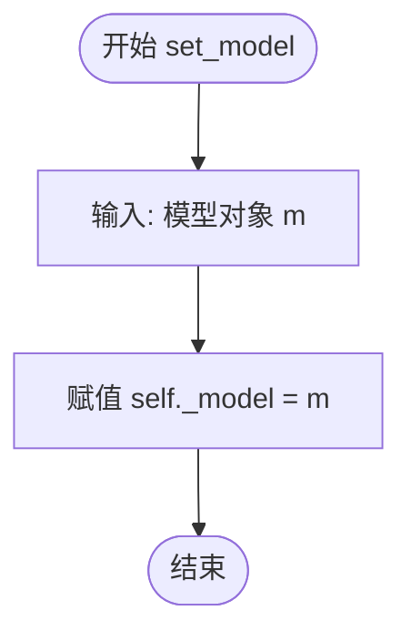
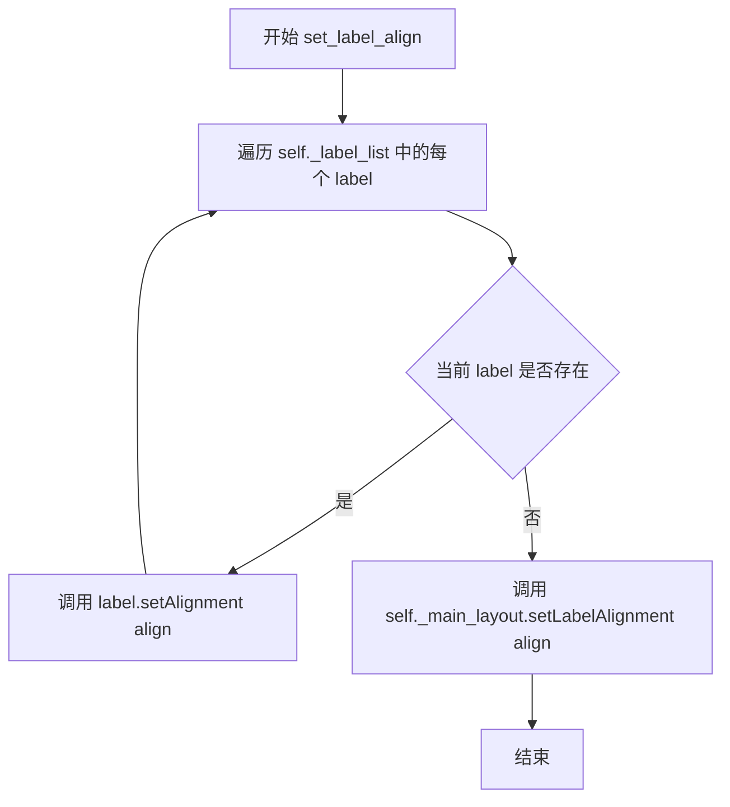
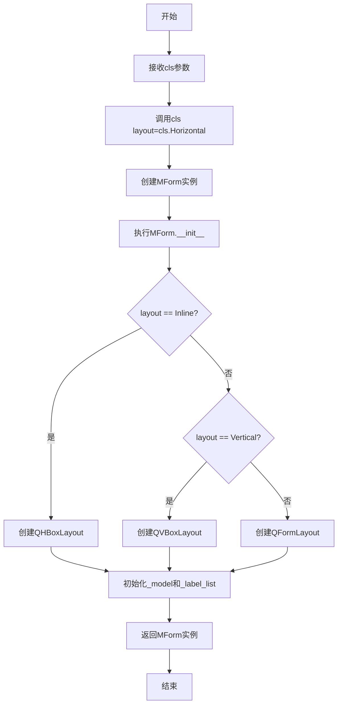

# `comic-translate\app\ui\dayu_widgets\form.py` 详细设计文档

MForm是一个基于PySide6的Qt表单布局管理组件，提供水平、垂直和内联三种布局模式，用于简化Qt表单的创建和模型绑定过程。

## 整体流程

```mermaid
graph TD
A[开始] --> B[实例化MForm]
B --> C{layout参数}
C -->|Horizontal| D[创建QFormLayout]
C -->|Vertical| E[创建QVBoxLayout]
C -->|Inline| F[创建QHBoxLayout]
D --> G[初始化_model=None]
E --> G
F --> G
G --> H[初始化_label_list=[]]
H --> I[set_model设置数据模型]
I --> J[set_label_align设置标签对齐]
J --> K[horizontal/vertical/inline工厂方法]
K --> L[返回配置好的MForm实例]
```

## 类结构

```
QObject (PySide6)
└── QWidget (PySide6)
    └── MForm (自定义组件)
```

## 全局变量及字段


### `MForm.Horizontal`
    
Class constant representing horizontal form layout type

类型：`str`
    


### `MForm.Vertical`
    
Class constant representing vertical form layout type

类型：`str`
    


### `MForm.Inline`
    
Class constant representing inline form layout type

类型：`str`
    


### `MForm._main_layout`
    
Internal layout manager instance (QHBoxLayout, QVBoxLayout, or QFormLayout) for widget arrangement

类型：`QtWidgets.QLayout`
    


### `MForm._model`
    
Internal storage for form data model of any type

类型：`any`
    


### `MForm._label_list`
    
Internal list storing label widgets for alignment management

类型：`list`
    
    

## 全局函数及方法


### `MForm.__init__`

构造函数，用于初始化 MForm 部件，根据 `layout` 参数设置不同的布局管理器，并初始化内部状态。

参数：

- `layout`：`str | None`，布局类型，默认为 `None`。可选值包括 `MForm.Horizontal`（水平表单布局）、`MForm.Vertical`（垂直布局）、`MForm.Inline`（行内水平布局）。若为 `None`，则默认为 `MForm.Horizontal`。
- `parent`：`QWidget | None`，父窗口部件，默认为 `None`。传递给 Qt 基类 `QWidget` 的构造函数，用于建立父子关系。

返回值：`None`，无返回值（构造函数）。

#### 流程图

```mermaid
flowchart TD
    A[开始 __init__] --> B[调用 super().__init__(parent)]
    B --> C{layout is None?}
    C -->|是| D[layout = MForm.Horizontal]
    C -->|否| E{layout == MForm.Inline?}
    D --> E
    E -->|是| F[创建 QHBoxLayout]
    E -->|否| G{layout == MForm.Vertical?}
    G -->|是| H[创建 QVBoxLayout]
    G -->|否| I[创建 QFormLayout]
    F --> J[设置 self._main_layout]
    H --> J
    I --> J
    J --> K[初始化 self._model = None]
    K --> L[初始化 self._label_list = []]
    L --> M[结束 __init__]
```

#### 带注释源码

```python
def __init__(self, layout=None, parent=None):
    """
    初始化 MForm 部件。
    
    参数:
        layout: 布局类型字符串，可选 Horizontal/Vertical/Inline，默认为 Horizontal
        parent: 父 QWidget 对象，默认为 None
    """
    # 调用父类 QWidget 的构造函数，传递 parent 参数
    # 这样可以将当前部件设置为 parent 的子部件，建立 Qt 对象树
    super(MForm, self).__init__(parent)
    
    # 如果 layout 为 None，则使用默认的水平表单布局
    # 使用 or 运算符实现默认值设置
    layout = layout or MForm.Horizontal
    
    # 根据 layout 参数选择不同的布局管理器
    if layout == MForm.Inline:
        # Inline 模式：使用水平盒式布局，所有控件在一行显示
        self._main_layout = QtWidgets.QHBoxLayout()
    elif layout == MForm.Vertical:
        # Vertical 模式：使用垂直盒式布局，标签和控件垂直排列
        self._main_layout = QtWidgets.QVBoxLayout()
    else:
        # Horizontal（默认）模式：使用表单布局，标签在左，控件在右，水平对齐
        # 这是 Qt 中常用的表单布局方式，适合数据录入界面
        self._main_layout = QtWidgets.QFormLayout()
    
    # 初始化数据模型为 None，需要通过 set_model 方法后续设置
    self._model = None
    
    # 初始化标签列表，用于存储表单中的所有标签对象
    # 方便后续统一修改标签属性（如对齐方式）
    self._label_list = []
```


### `MForm.set_model`

该方法用于设置表单的内部数据模型。它接收一个模型对象 `m` 作为输入，并将其直接赋值给类的私有属性 `_model`，以便后续方法（如数据绑定或UI更新）调用。

参数：

-  `m`：`任意类型 (Any)`，传入的表单数据模型对象（如字典、列表或自定义类实例），用于初始化或更新表单的状态。

返回值：`None`，该方法不返回任何值，仅执行赋值操作。

#### 流程图



#### 带注释源码

```python
def set_model(self, m):
    """
    设置表单的数据模型。

    参数:
        m: 任意类型的数据模型对象。该对象通常包含表单所需的字段和值，
           赋值给 _model 后，可通过 get_model 或其他方法进行访问和修改。
    """
    self._model = m
```


### `MForm.set_label_align`

该方法用于设置表单布局中所有标签的对齐方式，遍历标签列表并为每个标签设置对齐，同时更新主布局的标签对齐属性。

参数：

- `align`：`Qt.Alignment`，对齐方式参数，用于指定标签的对齐规则（如左对齐、居中对齐、右对齐等）

返回值：`None`，该方法无返回值，仅执行对齐设置操作

#### 流程图



#### 带注释源码

```
def set_label_align(self, align):
    """
    设置表单中所有标签的对齐方式
    
    参数:
        align: Qt.Alignment，对齐方式
    """
    # 遍历标签列表，为每个标签设置对齐方式
    for label in self._label_list:
        label.setAlignment(align)
    
    # 同时设置主布局的标签对齐方式
    self._main_layout.setLabelAlignment(align)
```


### `MForm.horizontal`

这是一个类方法，用于创建并返回一个具有水平布局（QFormLayout）的MForm实例。它通过调用构造函数并传入水平布局标识来实例化对象。

参数：

- `cls`：`class`，类方法隐含的类本身参数

返回值：`MForm`，返回一个配置为水平布局的MForm实例

#### 流程图



#### 带注释源码

```python
@classmethod
def horizontal(cls):
    """
    类方法：创建水平布局的MForm实例
    
    参数:
        cls: 类方法隐式传递的类引用
    
    返回值:
        MForm: 配置为水平布局(QFormLayout)的新实例
    """
    # 调用类的构造函数，传入水平布局标识符
    # 这会创建一个使用QFormLayout的MForm窗口部件
    return cls(layout=cls.Horizontal)
```


### `MForm.vertical`

该类方法用于创建并返回一个采用垂直布局（Vertical）的 `MForm` 实例。它是 `MForm` 类的工厂方法之一，通过类方法调用方式快速实例化具有特定布局形式的表单容器。

参数：

- `cls`：类本身（class），Python 类方法隐式传递的参数，指代当前类 `MForm`

返回值：`MForm`，返回一个配置了垂直布局的 `MForm` 实例对象

#### 流程图

```mermaid
flowchart TD
    A[开始] --> B[调用 MForm.vertical 类方法]
    B --> C{执行 cls(layout=cls.Vertical) 构造}
    C --> D[创建 MForm 实例]
    D --> E[设置布局为 QVBoxLayout]
    E --> F[初始化 _model 为 None]
    F --> G[初始化 _label_list 为空列表]
    G --> H[返回 MForm 实例]
    H --> I[结束]
```

#### 带注释源码

```python
@classmethod
def vertical(cls):
    """
    创建一个采用垂直布局的 MForm 实例的类方法。
    
    Returns:
        MForm: 返回一个配置了垂直布局(QVBoxLayout)的 MForm 实例
    """
    # 调用类的构造函数，传入垂直布局标识符
    # 内部会创建 QVBoxLayout 作为主布局
    return cls(layout=cls.Vertical)
```


### `MForm.inline`

该类方法是一个工厂方法，用于创建并返回一个配置为内联布局（Inline）的 `MForm` 实例。它通过传递 `Inline` 布局类型给类的构造函数来实现快速创建具有水平盒子布局的表单窗口。

参数：

- `cls`：`<class type>`，类方法的隐式参数，代表调用该方法的类本身（MForm）

返回值：`MForm`，返回一个新创建的 `MForm` 实例，该实例使用 `QHBoxLayout`（内联布局）

#### 流程图

```mermaid
flowchart TD
    A[开始] --> B{调用 cls.inline]
    B --> C[执行 cls.layout=cls.Inline]
    C --> D[创建 MForm 实例]
    D --> E{__init__ 被调用}
    E --> F{判断 layout == MForm.Inline?}
    F -->|是| G[设置 self._main_layout = QHBoxLayout]
    F -->|否| H[根据其他条件选择布局]
    G --> I[初始化 _model = None]
    I --> J[初始化 _label_list = 空列表]
    J --> K[返回 MForm 实例]
    H --> J
    K --> L[结束]
```

#### 带注释源码

```python
@classmethod
def inline(cls):
    """
    工厂方法：创建并返回一个使用内联布局的 MForm 实例
    
    Returns:
        MForm: 配置为内联布局（水平盒子布局）的新实例
    """
    # 调用类的构造函数，传入 Inline 布局参数
    # cls 在实际调用时会被替换为 MForm 本身
    return cls(layout=cls.Inline)
```

## 关键组件


### MForm 类

核心表单布局管理组件，继承自 QtWidgets.QWidget，提供水平、垂直和内联三种布局模式，支持模型绑定和标签对齐控制。

### 布局类型枚举

定义三种布局模式常量：Horizontal（水平）、Vertical（垂直）、Inline（内联），用于指定表单的排列方式。

### 布局管理器

内部维护 Qt 布局对象（QHBoxLayout、QVBoxLayout 或 QFormLayout），根据布局类型动态创建，负责子控件的排列。

### 模型绑定机制

set_model 方法用于绑定数据模型，将外部数据源与表单关联，支持 MVC 架构模式。

### 标签对齐控制

set_label_align 方法批量设置所有标签的对齐方式，支持灵活调整表单外观。

### 工厂方法族

horizontal、vertical、inline 三个类方法提供快捷构造方式，便于以声明式风格创建不同布局的表单实例。


## 问题及建议


### 已知问题

-   `set_model` 方法定义但从未被调用，也未在类内部使用，存在未完成的功能实现或死代码
-   `_label_list` 列表被初始化但从未被填充或使用，是一个未使用的实例变量
-   类方法 `horizontal()`、`vertical()`、`inline()` 创建实例后未调用 `show()` 或返回窗口，可能导致创建的窗口不可见
-   `__init__` 中使用 `layout = layout or MForm.Horizontal` 处理默认值，但对于显式传入空字符串或 `None` 的情况逻辑不够清晰
-   缺少对无效 `layout` 参数的错误处理，若传入非法值（如 "diagonal"）会导致静默失败
-   未定义模型的任何使用方式或接口契约，`set_model` 的参数 `m` 类型和用途不明确

### 优化建议

-   补充 `set_model` 的实现逻辑，使其真正能够绑定数据模型到表单
-   实现 `_label_list` 的填充逻辑，或在添加标签的方法中维护该列表
-   考虑将类方法改为工厂方法，确保返回的实例可直接使用，或添加 `show()` 调用
-   对非法 `layout` 参数添加异常抛出或明确的默认值处理
-   添加类型提示（typing）以明确方法参数和返回值的类型
-   考虑添加文档字符串说明类的用途、布局模式的含义以及模型的使用方式

## 其它


### 设计目标与约束

该类的设计目标是提供一个灵活且易用的Qt表单布局封装，简化不同布局模式的创建过程。约束条件包括：仅支持PySide6框架，要求Python 3.x版本，布局类型仅限Horizontal、Vertical、Inline三种。

### 错误处理与异常设计

代码中未实现显式的错误处理机制。潜在异常场景包括：layout参数传入非法值时会默认使用QFormLayout；set_label_align方法在_label_list为空时不会报错但也不会产生效果；set_model方法未对模型对象进行类型校验。建议添加参数类型检查和边界验证。

### 数据流与状态机

该组件的数据流较简单：外部通过set_model()注入数据模型，通过set_label_align()设置标签对齐方式，通过工厂方法（horizontal/vertical/inline）创建不同布局的实例。内部状态包括：_main_layout（当前布局对象）、_model（数据模型）、_label_list（标签列表）。状态转换通过布局参数决定使用哪种QLayout实现。

### 外部依赖与接口契约

核心依赖为PySide6.QtWidgets模块，需要确保Qt框架已正确安装。公开接口包括：set_model(m)方法接收任意对象作为模型；set_label_align(align)方法接收Qt.AlignmentFlag类型参数；类方法horizontal()、vertical()、inline()返回MForm实例。调用方需保证parent参数符合Qt对象树层级要求。

### 性能考虑

当前实现性能开销较小，主要性能点在于布局对象的创建和标签对齐的迭代设置。对于大量标签场景，set_label_align方法可考虑批量操作优化。_label_list的append操作应关注是否需要去重机制。

### 线程安全性

该类未实现线程安全机制。由于Qt的GUI对象必须在主线程中操作，多线程环境下创建或修改MForm实例可能导致未定义行为。如需跨线程使用，应提供线程安全的接口封装。

### 内存管理

Qt使用父子对象树机制管理内存，QLayout对象在构造时已设置父对象为self。_model属性持有外部对象引用，需注意避免循环引用导致的内存泄漏。建议调用方在模型对象销毁前调用set_model(None)解除引用。

### 单元测试策略

建议测试用例包括：三种工厂方法的返回值类型验证；set_label_align对空列表的处理；layout参数边界情况测试；set_model的None值处理；与其他Qt组件的集成测试。

### 使用示例

```python
# 水平布局表单
form = MForm.horizontal()
form.set_model({"name": "张三", "age": 30})

# 垂直布局表单
form = MForm.vertical()

# 内联布局表单
form = MForm.inline()
```

### 版本兼容性

代码使用PySide6，当前支持Qt 6.x版本。如需兼容PySide2（Qt 5.x），需调整导入语句。Python 2.x兼容性通过__future__导入部分实现，但建议迁移至Python 3.x。

### 许可证和版权信息

文件头部包含作者信息（Mu yanru）、创建日期（2019.4）和联系邮箱，许可证类型未明确声明，使用时需确认授权。

    