# `comic-translate\app\ui\dayu_widgets\header_view.py` 详细设计文档

这是一个基于PySide6的自定义QHeaderView实现，提供了表头的上下文菜单功能，包括列的选择（全选/取消/反选）、列的显示/隐藏控制、以及列宽调整模式切换，同时兼容不同版本的PySide6/PyQt API。

## 整体流程

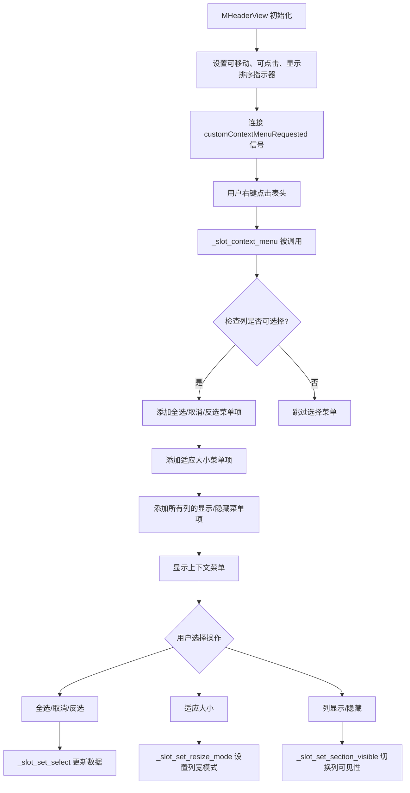

## 类结构

```
QtWidgets.QHeaderView (Qt内置)
└── MHeaderView (自定义实现)
```

## 全局变量及字段


    

## 全局函数及方法


### `functools.partial`

`functools.partial` 是 Python 标准库 `functools` 模块中的一个高阶函数，用于创建部分函数（偏函数）。它允许我们"冻结"函数的部分参数，从而得到一个新的可调用对象。在本代码中，该函数被用于将 Qt 信号（triggered、toggled）与带有预绑定参数的槽函数进行连接，实现事件处理逻辑的延迟绑定。

---

### 场景一：全选操作

参数：

- `func`：`self._slot_set_select`（`method`，要绑定的原始成员方法）
- `*args`：`logical_column`（`int`，列索引）、`QtCore.Qt.Checked`（`Qt.CheckState`，选中状态）

返回值：`functools.partial`，返回一个新的偏函数对象

#### 流程图

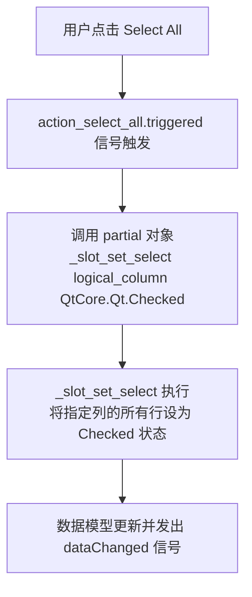

#### 带注释源码

```python
# 当用户点击"全选"菜单项时，触发此信号
action_select_all.triggered.connect(
    # 使用 functools.partial 预绑定列索引和选中状态
    # 效果：点击时自动调用 self._slot_set_select(logical_column, QtCore.Qt.Checked)
    functools.partial(self._slot_set_select, logical_column, QtCore.Qt.Checked)
)
```

---

### 场景二：取消全选操作

参数：

- `func`：`self._slot_set_select`（`method`，要绑定的原始成员方法）
- `*args`：`logical_column`（`int`，列索引）、`QtCore.Qt.Unchecked`（`Qt.CheckState`，未选中状态）

返回值：`functools.partial`，返回一个新的偏函数对象

#### 流程图

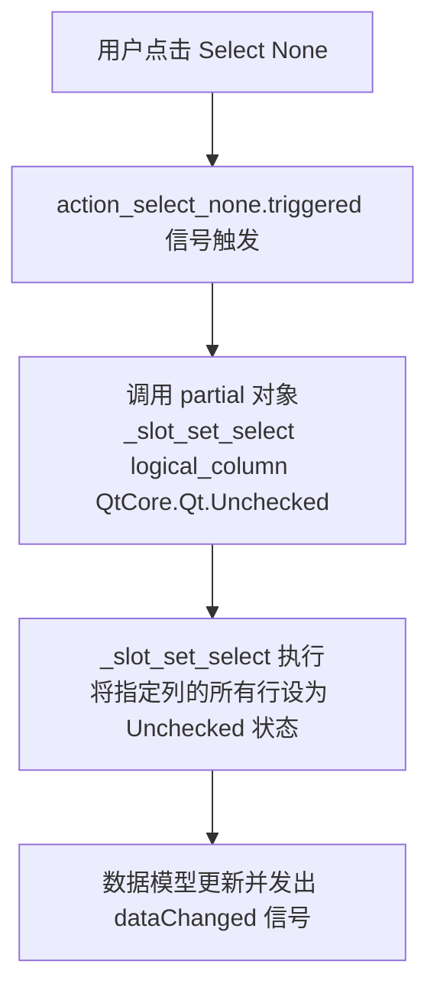

#### 带注释源码

```python
# 当用户点击"取消全选"菜单项时，触发此信号
action_select_none.triggered.connect(
    # 预绑定列索引和未选中状态
    # 效果：点击时自动调用 self._slot_set_select(logical_column, QtCore.Qt.Unchecked)
    functools.partial(self._slot_set_select, logical_column, QtCore.Qt.Unchecked)
)
```

---

### 场景三：反选操作

参数：

- `func`：`self._slot_set_select`（`method`，要绑定的原始成员方法）
- `*args`：`logical_column`（`int`，列索引）、`None`（`NoneType`，反转状态标记）

返回值：`functools.partial`，返回一个新的偏函数对象

#### 流程图

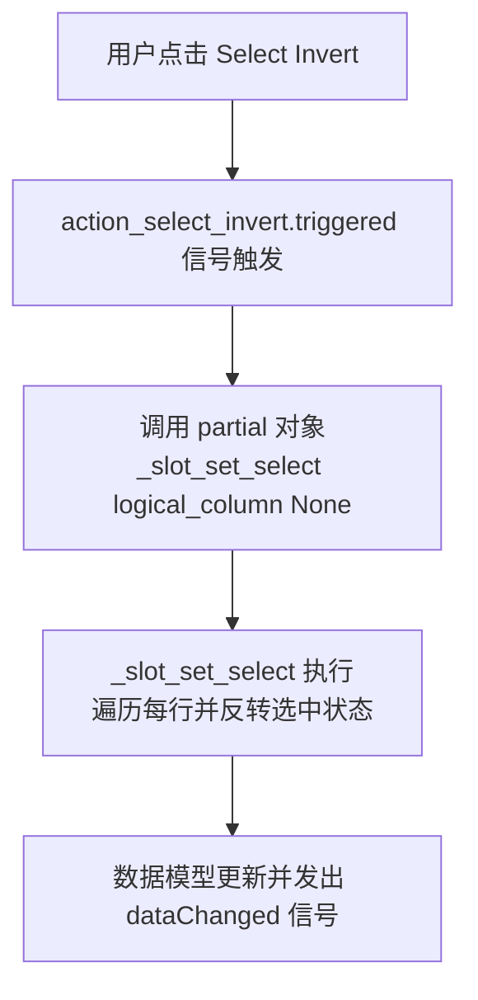

#### 带注释源码

```python
# 当用户点击"反选"菜单项时，触发此信号
action_select_invert.triggered.connect(
    # 预绑定列索引，state 传 None 表示反转逻辑
    # 效果：点击时自动调用 self._slot_set_select(logical_column, None)
    functools.partial(self._slot_set_select, logical_column, None)
)
```

---

### 场景四：适应列宽操作

参数：

- `func`：`self._slot_set_resize_mode`（`method`，要绑定的原始成员方法）
- `*args`：`True`（`bool`，调整大小模式标志）

返回值：`functools.partial`，返回一个新的偏函数对象

#### 流程图

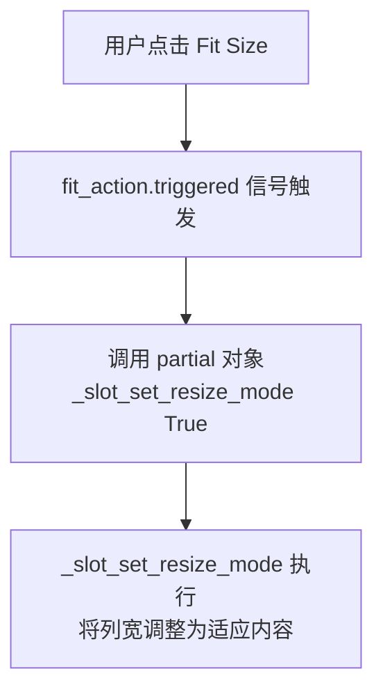

#### 带注释源码

```python
# 当用户点击"适应大小"菜单项时，触发此信号
fit_action.triggered.connect(
    # 预绑定 flag=True 表示使用 ResizeToContents 模式
    # 效果：点击时自动调用 self._slot_set_resize_mode(True)
    functools.partial(self._slot_set_resize_mode, True)
)
```

---

### 场景五：列显示/隐藏操作

参数：

- `func`：`self._slot_set_section_visible`（`method`，要绑定的原始成员方法）
- `*args`：`column`（`int`，列索引）

返回值：`functools.partial`，返回一个新的偏函数对象

#### 流程图

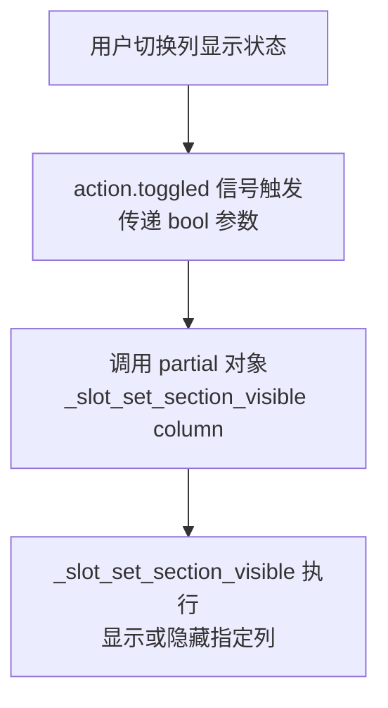

#### 带注释源码

```python
# 遍历每个列，添加显示/隐藏的复选框菜单项
for column in range(self.count()):
    action = context_menu.addAction(...)
    action.setCheckable(True)
    action.setChecked(not self.isSectionHidden(column))
    # 当复选框状态改变时，触发此信号（传递当前复选状态 True/False）
    action.toggled.connect(
        # 预绑定列索引，信号传递的布尔值作为第二个参数
        # 效果：切换时自动调用 self._slot_set_section_visible(column, flag)
        functools.partial(self._slot_set_section_visible, column)
    )
```

---

### 技术债务与优化空间

1. **过度使用 functools.partial**：虽然 `functools.partial` 在 Qt 信号槽连接中很常见，但过度使用可能导致代码可读性下降。可以考虑使用 lambda 表达式或在类中定义专门的槽方法。

2. **信号参数传递冗余**：在场景五中，`action.toggled` 信号已经传递了布尔值，但通过 `functools.partial` 预绑定了列索引，导致信号参数位置需要明确对应。实际上 `toggled[bool]` 信号的参数会作为第二个参数传递，这与 `_slot_set_section_visible(self, index, flag)` 的参数顺序匹配。

3. **魔法数字**：代码中使用了硬编码的偏移量 `QtCore.QPoint(10, 10)`，可以考虑提取为常量。

4. **Qt 兼容性处理**：代码中有多处 `try/except AttributeError` 用于处理不同 Qt 版本的 API 差异，这部分可以考虑封装为统一的兼容性工具函数。

---

### 设计目标与约束

- **设计目标**：为 QHeaderView 提供自定义的右键上下文菜单，支持列的选择操作（Select All/None/Invert）、列宽调整（Fit Size）、列的显示/隐藏控制。
- **约束**：该实现依赖于特定的模型结构（`model.header_list`），假设每个列头部配置包含 `key` 和 `checkable` 字段。
</think>


### `functools.partial`

`functools.partial` 是 Python 标准库 `functools` 模块中的一个高阶函数，用于创建部分函数（偏函数）。它允许"冻结"函数的部分参数，从而得到一个新的可调用对象。在本代码中，该函数被用于将 Qt 信号（triggered、toggled）与带有预绑定参数的槽函数进行连接，实现事件处理逻辑的延迟绑定。

---

### 场景一：全选操作（Select All）

参数：

- `func`：`self._slot_set_select`（`method`，要绑定的原始成员方法）
- `*args`：`logical_column`（`int`，列索引）、`QtCore.Qt.Checked`（`Qt.CheckState`，选中状态）

返回值：`functools.partial`，返回一个新的偏函数对象

#### 流程图


#### 带注释源码

```python
# 当用户点击"全选"菜单项时，触发此信号
action_select_all.triggered.connect(
    # 使用 functools.partial 预绑定列索引和选中状态
    # 效果：点击时自动调用 self._slot_set_select(logical_column, QtCore.Qt.Checked)
    functools.partial(self._slot_set_select, logical_column, QtCore.Qt.Checked)
)
```

---

### 场景二：取消全选操作（Select None）

参数：

- `func`：`self._slot_set_select`（`method`，要绑定的原始成员方法）
- `*args`：`logical_column`（`int`，列索引）、`QtCore.Qt.Unchecked`（`Qt.CheckState`，未选中状态）

返回值：`functools.partial`，返回一个新的偏函数对象

#### 流程图


#### 带注释源码

```python
# 当用户点击"取消全选"菜单项时，触发此信号
action_select_none.triggered.connect(
    # 预绑定列索引和未选中状态
    # 效果：点击时自动调用 self._slot_set_select(logical_column, QtCore.Qt.Unchecked)
    functools.partial(self._slot_set_select, logical_column, QtCore.Qt.Unchecked)
)
```

---

### 场景三：反选操作（Select Invert）

参数：

- `func`：`self._slot_set_select`（`method`，要绑定的原始成员方法）
- `*args`：`logical_column`（`int`，列索引）、`None`（`NoneType`，反转状态标记）

返回值：`functools.partial`，返回一个新的偏函数对象

#### 流程图


#### 带注释源码

```python
# 当用户点击"反选"菜单项时，触发此信号
action_select_invert.triggered.connect(
    # 预绑定列索引，state 传 None 表示反转逻辑
    # 效果：点击时自动调用 self._slot_set_select(logical_column, None)
    functools.partial(self._slot_set_select, logical_column, None)
)
```

---

### 场景四：适应列宽操作（Fit Size）

参数：

- `func`：`self._slot_set_resize_mode`（`method`，要绑定的原始成员方法）
- `*args`：`True`（`bool`，调整大小模式标志）

返回值：`functools.partial`，返回一个新的偏函数对象

#### 流程图


#### 带注释源码

```python
# 当用户点击"适应大小"菜单项时，触发此信号
fit_action.triggered.connect(
    # 预绑定 flag=True 表示使用 ResizeToContents 模式
    # 效果：点击时自动调用 self._slot_set_resize_mode(True)
    functools.partial(self._slot_set_resize_mode, True)
)
```

---

### 场景五：列显示/隐藏操作

参数：

- `func`：`self._slot_set_section_visible`（`method`，要绑定的原始成员方法）
- `*args`：`column`（`int`，列索引）

返回值：`functools.partial`，返回一个新的偏函数对象

#### 流程图


#### 带注释源码

```python
# 遍历每个列，添加显示/隐藏的复选框菜单项
for column in range(self.count()):
    action = context_menu.addAction(...)
    action.setCheckable(True)
    action.setChecked(not self.isSectionHidden(column))
    # 当复选框状态改变时，触发此信号（传递当前复选状态 True/False）
    action.toggled.connect(
        # 预绑定列索引，信号传递的布尔值作为第二个参数
        # 效果：切换时自动调用 self._slot_set_section_visible(column, flag)
        functools.partial(self._slot_set_section_visible, column)
    )
```

---

### 技术债务与优化空间

1. **过度使用 functools.partial**：虽然 `functools.partial` 在 Qt 信号槽连接中很常见，但过度使用可能导致代码可读性下降。可以考虑使用 lambda 表达式或在类中定义专门的槽方法。

2. **信号参数传递冗余**：在场景五中，`action.toggled` 信号已经传递了布尔值，但通过 `functools.partial` 预绑定了列索引，导致信号参数位置需要明确对应。实际上 `toggled[bool]` 信号的参数会作为第二个参数传递，这与 `_slot_set_section_visible(self, index, flag)` 的参数顺序匹配。

3. **魔法数字**：代码中使用了硬编码的偏移量 `QtCore.QPoint(10, 10)`，可以考虑提取为常量。

4. **Qt 兼容性处理**：代码中有多处 `try/except AttributeError` 用于处理不同 Qt 版本的 API 差异，这部分可以考虑封装为统一的兼容性工具函数。

---

### 设计目标与约束

- **设计目标**：为 QHeaderView 提供自定义的右键上下文菜单，支持列的选择操作（Select All/None/Invert）、列宽调整（Fit Size）、列的显示/隐藏控制。
- **约束**：该实现依赖于特定的模型结构（`model.header_list`），假设每个列头部配置包含 `key` 和 `checkable` 字段。


### MHeaderView._slot_context_menu

这是一个在表头视图上右键点击时触发的槽函数，用于显示自定义上下文菜单。该方法根据点击的列和模型数据动态生成菜单选项，包括列选择（全选、不选、反选）、适应列宽、显示/隐藏列等功能。

参数：

- `point`：`QtCore.QPoint`，鼠标右键点击的位置坐标（相对于控件）

返回值：`None`，该方法为槽函数，不返回任何值

#### 流程图

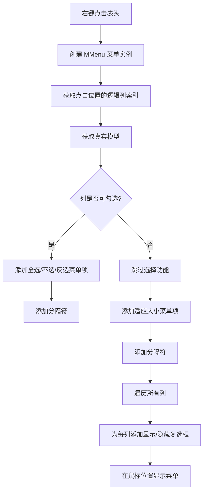

#### 带注释源码

```python
@QtCore.Slot(QtCore.QPoint)
def _slot_context_menu(self, point):
    # 创建一个 MMenu 菜单实例，父对象为当前表头视图
    context_menu = MMenu(parent=self)
    
    # 获取鼠标点击位置的逻辑列索引
    logical_column = self.logicalIndexAt(point)
    
    # 获取真实的数据模型（可能经过代理模型转换）
    model = utils.real_model(self.model())
    
    # 检查是否点击了有效列且该列配置为可勾选
    if logical_column >= 0 and model.header_list[logical_column].get("checkable", False):
        # 添加"全选"菜单项
        action_select_all = context_menu.addAction(self.tr("Select All"))
        # 添加"不选"菜单项
        action_select_none = context_menu.addAction(self.tr("Select None"))
        # 添加"反选"菜单项
        action_select_invert = context_menu.addAction(self.tr("Select Invert"))
        
        # 连接"全选"触发信号到槽函数，传入列索引和勾选状态
        action_select_all.triggered.connect(
            functools.partial(self._slot_set_select, logical_column, QtCore.Qt.Checked)
        )
        # 连接"不选"触发信号到槽函数
        action_select_none.triggered.connect(
            functools.partial(self._slot_set_select, logical_column, QtCore.Qt.Unchecked)
        )
        # 连接"反选"触发信号到槽函数，state为None表示切换状态
        action_select_invert.triggered.connect(functools.partial(self._slot_set_select, logical_column, None))
        
        # 添加菜单分隔符
        context_menu.addSeparator()

    # 添加"适应大小"菜单项
    fit_action = context_menu.addAction(self.tr("Fit Size"))
    # 连接适应大小触发信号到槽函数，传入True表示适应内容
    fit_action.triggered.connect(functools.partial(self._slot_set_resize_mode, True))
    
    # 添加菜单分隔符
    context_menu.addSeparator()
    
    # 遍历表头所有列
    for column in range(self.count()):
        # 获取列的显示名称作为菜单项文本
        action = context_menu.addAction(
            model.headerData(column, QtCore.Qt.Horizontal, QtCore.Qt.DisplayRole)
        )
        # 设置菜单项为可勾选
        action.setCheckable(True)
        # 设置复选框状态与列的可见性相反（隐藏则不勾选）
        action.setChecked(not self.isSectionHidden(column))
        # 连接切换信号到槽函数，传入列索引
        action.toggled.connect(functools.partial(self._slot_set_section_visible, column))
    
    # 在鼠标位置显示菜单，偏移10像素避免遮挡
    context_menu.exec_(QtGui.QCursor.pos() + QtCore.QPoint(10, 10))
```

---
### MMenu（本模块导入的本地模块）

`MMenu` 是从本地模块 `.menu` 导入的自定义菜单类，继承自 Qt 的菜单类。该类用于创建具有特定样式的上下文菜单，包含添加动作、分隔符等标准菜单操作。在 `MHeaderView` 中用于实现表头的右键上下文菜单功能。

#### 关键组件信息

| 组件名称 | 一句话描述 |
|---------|-----------|
| MMenu | 本地模块导入的自定义菜单类，用于创建表头右键上下文菜单 |
| MHeaderView | 自定义表头视图类，继承自QtWidgets.QHeaderView，提供可移动、可点击、可排序的表头功能 |
| utils.real_model | 工具函数，用于获取真实的数据模型（处理代理模型） |
| utils.real_index | 工具函数，用于获取真实的模型索引 |
| utils.get_obj_value | 工具函数，用于获取对象的属性值 |
| utils.set_obj_value | 工具函数，用于设置对象的属性值 |

#### 潜在技术债务或优化空间

1. **魔法数字**：菜单显示位置偏移使用了硬编码的 `QtCore.QPoint(10, 10)`，建议提取为常量或配置项
2. **重复代码**：多个 `functools.partial` 的使用可以封装为更高级的辅助方法
3. **缺少错误处理**：模型操作时未处理可能的异常情况，如模型为空或列索引越界
4. **性能优化**：每次右键点击都创建新的菜单实例，可以考虑缓存或复用菜单对象

#### 其它项目

- **设计目标**：为 QTableView/QTreeView 等表格组件的表头提供自定义右键菜单，支持批量选择和列显示控制
- **约束**：依赖 PySide6 Qt 库，需要配合特定的数据模型结构（header_list 属性）
- **错误处理**：未对无效模型或空模型做防护，可能在异常数据下崩溃
- **数据流**：通过修改数据模型的内部属性（{key}_checked）来维护勾选状态，触发 dataChanged 信号更新视图


### `utils.real_model`

获取底层的真实数据模型（处理代理模型场景）。该函数接收一个Qt模型对象（可能是代理模型），返回底层的基础模型（source model），确保操作的是实际的数据源而非代理层。

参数：

-  `model`：`QAbstractItemModel`，Qt模型对象，可能是代理模型（Proxy Model）或基础模型

返回值：`QAbstractItemModel`，真实的基础模型（Source Model），如果不是代理模型则返回原模型

#### 流程图

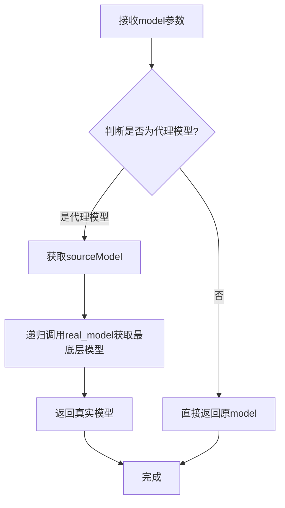

#### 带注释源码

```
# 注：该函数定义在 utils 模块中，未包含在当前代码段中
# 以下是基于调用上下文推断的源码结构

def real_model(model):
    """
    获取真实的底层数据模型
    
    在Qt中经常使用QSortFilterProxyModel等代理模型来提供数据过滤、排序等功能。
    当需要操作底层数据时，需要通过此函数获取原始模型。
    
    参数:
        model: Qt模型对象，可能是代理模型或基础模型
    
    返回:
        底层基础模型，如果不是代理模型则返回原模型
    """
    # 检查模型是否具有sourceModel属性（代理模型的特征）
    if hasattr(model, 'sourceModel'):
        # 如果是代理模型，递归获取其源模型
        return real_model(model.sourceModel())
    else:
        # 基础模型直接返回
        return model
```

#### 调用上下文分析

在 `MHeaderView` 类中的使用方式：

1. **在 `_slot_context_menu` 方法中**：
   ```python
   model = utils.real_model(self.model())
   # 用于获取列的header信息
   if logical_column >= 0 and model.header_list[logical_column].get("checkable", False):
   ```

2. **在 `_slot_set_select` 方法中**：
   ```python
   source_model = utils.real_model(current_model)
   source_model.beginResetModel()
   # ... 修改数据
   source_model.endResetModel()
   source_model.dataChanged.emit(None, None)
   ```

这些调用表明 `utils.real_model` 函数是用于处理Qt模型层级关系的工具函数，确保能够访问到底层的数据模型及其 `header_list` 属性。


### `utils.real_index`

该函数用于将代理模型（如 QSortFilterProxyModel）的索引转换为源模型的索引，以便访问底层数据对象。在 `MHeaderView` 类中，它被用于获取源模型中特定行和列的索引，从而操作内部数据指针。

参数：
- `index`：`QtCore.QModelIndex`，输入的模型索引（通常是代理模型的索引，需要转换为源索引）

返回值：`QtCore.QModelIndex`，对应的源模型索引。如果输入索引无效，则返回无效的模型索引。

#### 流程图

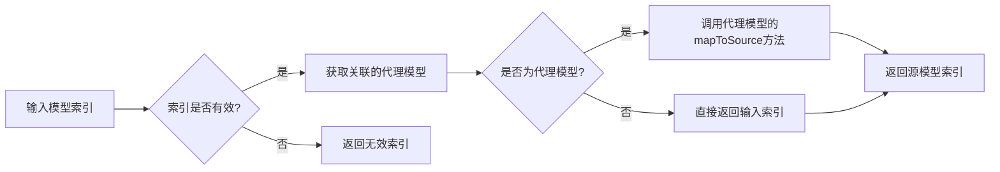

#### 带注释源码

由于 `utils.real_index` 函数未在当前代码文件中定义，而是从 `utils` 模块导入，因此以下源码展示了该函数在 `MHeaderView._slot_set_select` 方法中的调用方式：

```python
# 从 utils 模块导入 real_index 函数（假设实现于 utils.py）
from . import utils as utils

# 在 MHeaderView 类的方法中调用
current_model = self.model()
source_model = utils.real_model(current_model)
source_model.beginResetModel()
# ... 省略部分代码 ...
for row in range(current_model.rowCount()):
    # 调用 utils.real_index 将代理模型索引转换为源模型索引
    real_index = utils.real_index(current_model.index(row, column))
    # 获取内部指针以访问数据对象
    data_obj = real_index.internalPointer()
    if data_obj:
        # 根据状态设置或切换检查属性
        # ...
```

**注意**：实际的 `utils.real_index` 函数实现未在此代码中显示，通常它会封装 Qt 的 `QSortFilterProxyModel.mapToSource` 方法或类似逻辑，以处理代理模型到源模型的索引映射。具体实现需参考 `utils` 模块的源码。


### `utils.get_obj_value`

该函数是一个工具函数，用于从对象中获取指定属性的值。它接收一个数据对象和属性名称作为参数，并返回该属性对应的值。在 MHeaderView 类的 `_slot_set_select` 方法中，该函数被用于获取数据对象的选中状态。

参数：

- `obj`：`object`，数据对象，通常是 QModelIndex.internalPointer() 返回的内部数据指针
- `attr`：`str`，属性名称，字符串类型，表示要获取的属性的键名

返回值：`any`，返回获取到的属性值，具体类型取决于所请求的属性类型（在该代码场景中为 QtCore.Qt.CheckState 枚举值）

#### 流程图

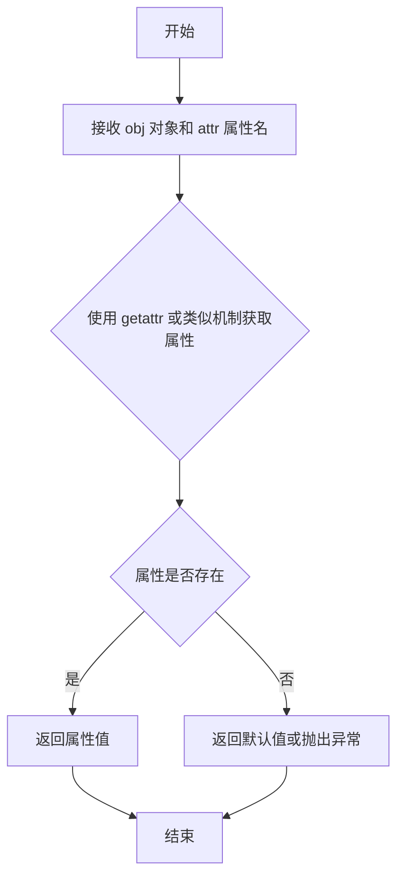

#### 带注释源码

```python
# 由于 utils 模块的实现代码未在当前代码片段中提供，
# 以下是根据使用方式推测的函数签名和功能说明：

def get_obj_value(obj, attr):
    """
    获取对象的指定属性值
    
    参数:
        obj: 数据对象，通常是模型中的数据项对象
        attr: 属性名称字符串
    
    返回:
        对象的指定属性值，如果属性不存在则返回 None 或默认值
    """
    # 推测实现方式：
    # return getattr(obj, attr, None)
    # 或者通过字典方式：
    # return obj.get(attr)
    # 或者通过 ItemDataRole 方式：
    # return obj.data(attr)
    pass
```

> **注意**：该函数的完整实现代码位于 `utils` 模块中（`utils.py` 文件），当前代码片段仅展示了其使用方式。如需查看完整实现，请参考 `utils` 模块的源代码文件。


根据提供的代码，我需要提取 `utils.set_obj_value` 函数的信息。但需要说明的是，代码中只是引用了 `utils.set_obj_value`，而没有提供该函数的实际定义（该函数定义在 `utils` 模块中）。因此，我将基于代码中对 `utils.set_obj_value` 的调用方式来推断其功能。

### `utils.set_obj_value`

该函数用于动态设置对象的属性值。在 `MHeaderView` 类中，它被用来设置数据对象的"选中"状态属性。

参数：

- `obj`：对象，需要设置属性值的目标对象（例如 `data_obj`，通常是数据模型中的项）
- `attr`：str，属性名称（例如 `"{}_checked".format(source_model.header_list[column].get("key"))`）
- `value`：任意类型，需要设置的值（例如 `QtCore.Qt.Checked`、`QtCore.Qt.Unchecked`）

返回值：通常为 `None`（无返回值），或根据实现可能返回设置后的值

#### 流程图

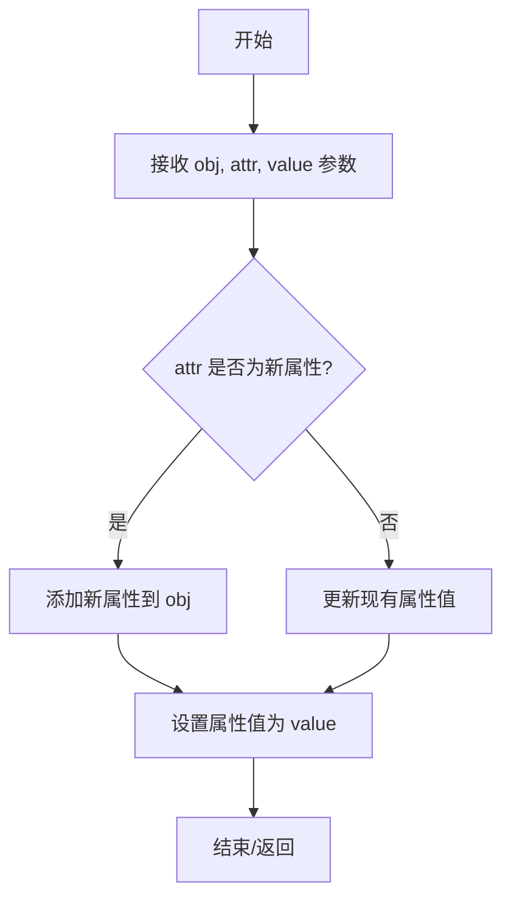

#### 带注释源码

```python
# utils.set_obj_value 函数源码（推断版，基于调用方式）
def set_obj_value(obj, attr, value):
    """
    设置对象的属性值。
    
    参数:
        obj: 对象，目标对象
        attr: str，属性名
        value: 任意类型，属性值
    """
    # 使用 setattr 动态设置对象属性
    # 方式1: 直接设置属性
    # setattr(obj, attr, value)
    
    # 方式2: 如果对象有 __dict__，直接修改
    # obj.__dict__[attr] = value
    
    # 方式3: 可能还支持嵌套属性设置（如 "a.b.c"）
    # 具体实现取决于 utils 模块的实际代码
    pass
```

#### 在 `MHeaderView` 中的调用示例

```python
# 文件：mheader.py（第87-93行）
# 用途：在设置列的选中状态时使用
for row in range(current_model.rowCount()):
    real_index = utils.real_index(current_model.index(row, column))
    data_obj = real_index.internalPointer()
    if state is None:
        old_state = utils.get_obj_value(data_obj, attr)
        utils.set_obj_value(
            data_obj,
            attr,
            QtCore.Qt.Unchecked if old_state == QtCore.Qt.Checked else QtCore.Qt.Checked,
        )
    else:
        utils.set_obj_value(data_obj, attr, state)
```

---

**注意**：由于未提供 `utils` 模块的完整源码，以上信息是基于代码调用方式的推断。如需获取准确的函数定义，请提供 `utils` 模块的源代码。


### MHeaderView.__init__

该方法是MHeaderView类的构造函数，用于初始化自定义表头视图控件。方法首先调用父类QHeaderView的构造函数，然后配置表头的可移动性、可点击性、排序指示器显示、上下文菜单策略、默认对齐方式以及基于方向（水平/垂直）的属性设置。

参数：

- `orientation`：`QtCore.Qt.Orientation`，指定表头方向（水平或垂直），决定表头是横向还是纵向显示
- `parent`：`QtWidgets.QWidget`，可选的父控件，用于建立Qt对象父子关系并管理内存

返回值：`None`，该方法为构造函数，不返回任何值

#### 流程图

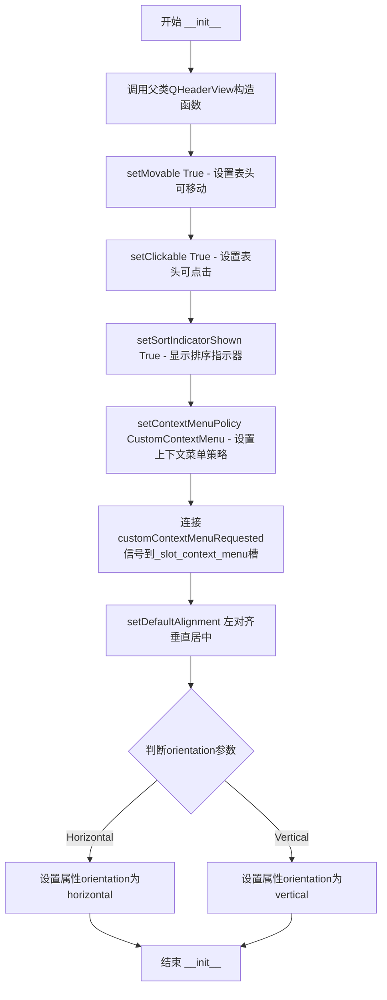

#### 带注释源码

```python
def __init__(self, orientation, parent=None):
    """
    MHeaderView类的初始化方法
    
    参数:
        orientation: QtCore.Qt.Orientation - 表头方向（水平/垂直）
        parent: QtWidgets.QWidget - 父控件（可选）
    """
    # 调用父类QHeaderView的构造函数，传入方向和父控件
    # 这是Qt对象初始化的标准做法，确保父类部分正确初始化
    super(MHeaderView, self).__init__(orientation, parent)
    
    # 设置表头section可拖拽移动位置
    # 允许用户通过拖拽改变列/行的顺序
    self.setMovable(True)
    
    # 设置表头section可响应鼠标点击事件
    # 点击表头可触发排序等操作
    self.setClickable(True)
    
    # 显示排序指示器（小箭头）
    # 指示当前排序列及排序方向（升序/降序）
    self.setSortIndicatorShown(True)
    
    # 设置上下文菜单策略为自定义菜单
    # 只有设置为此策略，才会发射customContextMenuRequested信号
    self.setContextMenuPolicy(QtCore.Qt.CustomContextMenu)
    
    # 连接上下文菜单请求信号到自定义槽函数
    # 当用户右键点击表头时，会触发_slot_context_menu方法
    self.customContextMenuRequested.connect(self._slot_context_menu)
    
    # 设置表头内容的默认对齐方式
    # Qt.AlignLeft | Qt.AlignVCenter 表示左对齐且垂直居中
    self.setDefaultAlignment(QtCore.Qt.AlignLeft | QtCore.Qt.AlignVCenter)
    
    # 根据方向设置样式属性
    # 方便在QSS中根据方向定义不同样式
    # orientation为QtCore.Qt.Horizontal时，属性值为"horizontal"
    # 否则为"vertical"
    self.setProperty(
        "orientation",
        "horizontal" if orientation == QtCore.Qt.Horizontal else "vertical",
    )
```


### `MHeaderView._slot_context_menu`

该函数是 MHeaderView 类的上下文菜单槽函数，当用户右键点击表头时触发。它根据点击位置判断是否为可勾选的列，若是则提供全选/取消/反选操作，同时添加列宽自适应和列显示/隐藏功能，最终在鼠标当前位置弹出上下文菜单。

参数：

- `point`：`QtCore.QPoint`，表示鼠标右键点击表头的位置（相对于控件的坐标）

返回值：`None`，该函数为 Qt 槽函数，不返回任何值

#### 流程图

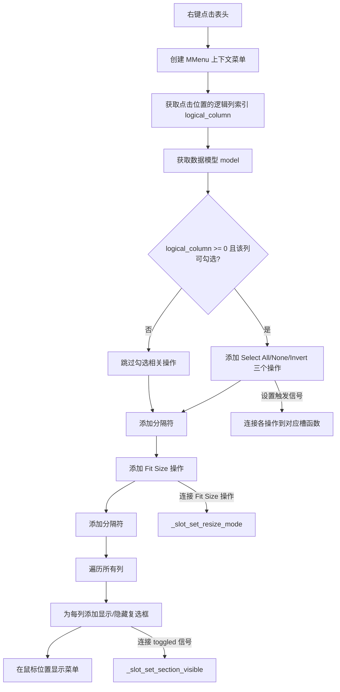

#### 带注释源码

```python
@QtCore.Slot(QtCore.QPoint)
def _slot_context_menu(self, point):
    """
    处理表头右键点击事件，显示上下文菜单。
    
    参数:
        point: QtCore.QPoint - 鼠标右键点击的相对坐标位置
    """
    # 创建上下文菜单，父对象为当前表头控件
    context_menu = MMenu(parent=self)
    
    # 获取点击位置对应的逻辑列索引（用于确定用户点击了哪一列）
    logical_column = self.logicalIndexAt(point)
    
    # 获取数据模型，并使用工具函数获取真实模型（可能经过代理层）
    model = utils.real_model(self.model())
    
    # 检查点击的列是否有效且该列配置为可勾选（checkable）
    if logical_column >= 0 and model.header_list[logical_column].get("checkable", False):
        # 添加"全选"操作
        action_select_all = context_menu.addAction(self.tr("Select All"))
        # 添加"取消全选"操作
        action_select_none = context_menu.addAction(self.tr("Select None"))
        # 添加"反选"操作
        action_select_invert = context_menu.addAction(self.tr("Select Invert"))
        
        # 连接"全选"操作到槽函数，传入列索引和勾选状态
        action_select_all.triggered.connect(
            functools.partial(self._slot_set_select, logical_column, QtCore.Qt.Checked)
        )
        # 连接"取消全选"操作到槽函数
        action_select_none.triggered.connect(
            functools.partial(self._slot_set_select, logical_column, QtCore.Qt.Unchecked)
        )
        # 连接"反选"操作到槽函数，state 为 None 表示反转当前状态
        action_select_invert.triggered.connect(functools.partial(self._slot_set_select, logical_column, None))
        
        # 添加分隔符，分离勾选操作和其他操作
        context_menu.addSeparator()

    # 添加"适应列宽"操作，允许用户一键调整所有列宽以适应内容
    fit_action = context_menu.addAction(self.tr("Fit Size"))
    # 连接操作到调整列宽模式的槽函数
    fit_action.triggered.connect(functools.partial(self._slot_set_resize_mode, True))
    
    # 添加分隔符，分离调整列宽和列显示控制
    context_menu.addSeparator()
    
    # 遍历表头中的所有列，为每一列添加显示/隐藏控制项
    for column in range(self.count()):
        # 获取列的显示名称
        action = context_menu.addAction(
            model.headerData(column, QtCore.Qt.Horizontal, QtCore.Qt.DisplayRole)
        )
        # 设置操作为可勾选状态
        action.setCheckable(True)
        # 初始状态与当前列的隐藏状态相反（显示则勾选，隐藏则不勾选）
        action.setChecked(not self.isSectionHidden(column))
        # 连接切换信号到控制列显示/隐藏的槽函数
        action.toggled.connect(functools.partial(self._slot_set_section_visible, column))
    
    # 在鼠标当前位置显示上下文菜单，偏移 (10, 10) 像素避免遮挡
    context_menu.exec_(QtGui.QCursor.pos() + QtCore.QPoint(10, 10))
```


### `MHeaderView._slot_set_select`

该方法是一个 Qt 槽函数，用于设置表头列的复选框状态。它接收列索引和目标状态（选中、未选中或反选），然后遍历该列所有行的数据对象，根据状态参数设置或切换对应的复选框属性，最后发出数据变更信号以刷新视图。

参数：

- `column`：`int`，逻辑列索引，指定要设置选择状态的列
- `state`：`int`，选择目标状态，取值为 `QtCore.Qt.Checked`（选中）、`QtCore.Qt.Unchecked`（取消选中）或 `None`（反选当前状态）

返回值：`None`，该方法无返回值，通过修改数据模型内部状态生效

#### 流程图

```mermaid
flowchart TD
    A[_slot_set_select 被调用] --> B[获取当前模型和源模型]
    B --> C[开启模型重置: beginResetModel]
    C --> D[构建属性名: {key}_checked]
    D --> E[遍历当前列所有行]
    E --> F[获取行的真实索引和数据对象]
    F --> G{state是否为None}
    G -->|是| H[获取旧状态并反选]
    G -->|否| I[直接设置目标状态]
    H --> J[更新数据对象属性值]
    I --> J
    J --> K{是否还有更多行}
    K -->|是| E
    K -->|否| L[结束模型重置: endResetModel]
    L --> M[发出数据变更信号: dataChanged.emit]
    M --> N[流程结束]
```

#### 带注释源码

```python
@QtCore.Slot(int, int)
def _slot_set_select(self, column, state):
    """
    设置表头列的复选框选择状态
    
    参数:
        column: 逻辑列索引
        state: 目标状态 (QtCore.Qt.Checked, QtCore.Qt.Unchecked, 或 None 表示反选)
    """
    # 获取当前视图关联的模型（可能是代理模型）
    current_model = self.model()
    # 通过工具函数获取底层真实的数据模型（穿透代理模型）
    source_model = utils.real_model(current_model)
    
    # 开始模型重置，阻止视图更新以提高批量操作效率
    source_model.beginResetModel()
    
    # 构建要操作的属性名，格式为 "{column_key}_checked"
    # 从表头配置中获取该列对应的 key 字段
    attr = "{}_checked".format(source_model.header_list[column].get("key"))
    
    # 遍历当前列的所有数据行
    for row in range(current_model.rowCount()):
        # 获取当前单元格的模型索引
        current_index = current_model.index(row, column)
        # 穿透代理模型获取真实的数据模型索引
        real_index = utils.real_index(current_index)
        # 获取数据对象的内部指针
        data_obj = real_index.internalPointer()
        
        # 判断是否执行反选操作
        if state is None:
            # 获取该对象当前的选择状态
            old_state = utils.get_obj_value(data_obj, attr)
            # 状态切换：如果当前是 Checked 则设为 Unchecked，反之设为 Checked
            utils.set_obj_value(
                data_obj,
                attr,
                QtCore.Qt.Unchecked if old_state == QtCore.Qt.Checked else QtCore.Qt.Checked,
            )
        else:
            # 直接设置为目标状态（Checked 或 Unchecked）
            utils.set_obj_value(data_obj, attr, state)
    
    # 结束模型重置，恢复视图更新
    source_model.endResetModel()
    # 发出数据变更信号，通知视图刷新所有数据
    source_model.dataChanged.emit(None, None)
```


### `MHeaderView._slot_set_section_visible`

该方法是 `MHeaderView` 类的槽函数，用于响应列标题复选框的切换事件，根据 `flag` 参数设置指定列的显示或隐藏状态。

参数：

- `index`：`int`，要设置可见性的列的逻辑索引
- `flag`：`int`（Qt CheckState），表示复选框的选中状态（Qt.Checked 或 Qt.Unchecked）

返回值：`None`，无返回值（方法内部直接操作 Qt 控件状态）

#### 流程图

```mermaid
flowchart TD
    A[接收列索引和复选框状态] --> B{flag == Qt.Checked?}
    B -->|Yes| C[设置列显示<br/>setSectionHidden(index, False)]
    B -->|No| D[设置列隐藏<br/>setSectionHidden(index, True)]
    C --> E[流程结束]
    D --> E
```

#### 带注释源码

```python
@QtCore.Slot(QtCore.QModelIndex, int)
def _slot_set_section_visible(self, index, flag):
    """
    槽函数：设置指定列的可见性
    
    当用户通过上下文菜单切换列的显示/隐藏时，此函数被调用。
    它接收列索引和复选框状态，然后设置该列的隐藏状态。
    
    参数:
        index: int - 列的逻辑索引
        flag: int - Qt.Checked 表示显示, Qt.Unchecked 表示隐藏
    """
    # 根据 flag 的反值设置列的隐藏状态
    # flag 为 Qt.Checked (2) 时，not flag 为 False，显示列
    # flag 为 Qt.Unchecked (0) 时，not flag 为 True，隐藏列
    self.setSectionHidden(index, not flag)
```


### `MHeaderView._slot_set_resize_mode`

该方法是 MHeaderView 类的槽函数，用于控制表格头部的列尺寸调整模式。当参数为 True 时，将列尺寸调整为适应内容；当参数为 False 时，列尺寸采用交互式手动调整模式。

参数：

- `flag`：`bool`，布尔标志，用于控制调整模式。True 表示使用 `ResizeToContents`（自动调整到内容宽度），False 表示使用 `Interactive`（交互式手动调整）

返回值：`None`，无返回值描述

#### 流程图

```mermaid
flowchart TD
    A[开始 _slot_set_resize_mode] --> B{flag 是否为 True?}
    B -->|True| C[调用 resizeSections with ResizeToContents]
    B -->|False| D[调用 resizeSections with Interactive]
    C --> E[结束]
    D --> E
```

#### 带注释源码

```python
@QtCore.Slot(bool)
def _slot_set_resize_mode(self, flag):
    """
    槽函数：设置表头的列尺寸调整模式
    
    参数:
        flag (bool): True 表示自动调整列宽以适应内容;
                     False 表示使用交互式调整模式，允许用户手动拖动调整列宽
    """
    # 判断传入的标志位
    if flag:
        # 当 flag 为 True 时，设置所有列的尺寸调整为自动适应内容模式
        # ResizeToContents 会根据列中内容的实际宽度自动计算列宽
        self.resizeSections(QtWidgets.QHeaderView.ResizeToContents)
    else:
        # 当 flag 为 False 时，设置所有列的尺寸调整为交互式模式
        # Interactive 模式允许用户通过拖动表头分隔线来手动调整列宽
        self.resizeSections(QtWidgets.QHeaderView.Interactive)
```


### `MHeaderView.setClickable`

该方法用于设置表头视图的点击状态，通过尝试调用 Qt 不同版本的 API 来实现兼容性支持。如果当前 Qt 版本支持 `setSectionsClickable`（新版本），则使用该方法；否则回退到旧版的 `setClickable` 方法。

参数：

- `flag`：`bool`，用于控制是否将表头设置为可点击状态

返回值：`None`，无返回值描述

#### 流程图

```mermaid
flowchart TD
    A[开始 setClickable] --> B{尝试调用 setSectionsClickable}
    B -->|成功| C[设置表头可点击状态]
    B -->|AttributeError 异常| D[调用旧版 setClickable]
    D --> C
    C --> E[结束]
```

#### 带注释源码

```python
def setClickable(self, flag):
    """
    设置表头视图的点击状态。
    
    该方法提供了 Qt 不同版本之间的兼容性支持。在较新版本的 Qt 中，
    使用 setSectionsClickable 方法；在较旧版本中，则回退使用 setClickable。
    
    参数:
        flag (bool): True 表示设置表头为可点击状态，False 表示禁用点击
    """
    try:
        # 尝试使用 Qt 5.x+ 的新 API
        QtWidgets.QHeaderView.setSectionsClickable(self, flag)
    except AttributeError:
        # 如果新 API 不存在（Qt 4.x 兼容模式），使用旧 API
        QtWidgets.QHeaderView.setClickable(self, flag)
```


### `MHeaderView.setMovable`

设置表头部分是否可移动。该方法提供 Qt5/Qt6 API 兼容性，根据 PySide6 版本自动调用对应的底层方法。

参数：

- `flag`：`bool`，指定表头部分是否可移动。`True` 表示允许用户拖动表头部分重新排序，`False` 表示禁止移动。

返回值：`None`，无返回值，仅执行设置操作。

#### 流程图

```mermaid
flowchart TD
    A[开始 setMovable] --> B{尝试调用 setSectionsMovable}
    B -->|成功| C[设置成功]
    B -->|AttributeError| D[调用 setMovable Qt5 API]
    D --> C
    C --> E[结束]
    
    style B fill:#f9f,stroke:#333
    style D fill:#9f9,stroke:#333
```

#### 带注释源码

```python
def setMovable(self, flag):
    """
    设置表头部分是否可移动。
    
    该方法处理 Qt5 与 Qt6 API 兼容性：
    - Qt6 使用 setSectionsMovable 方法
    - Qt5 使用 setMovable 方法
    
    参数:
        flag: bool, True 允许移动，False 禁止移动
    """
    # 尝试使用 Qt6 API (setSectionsMovable)
    try:
        QtWidgets.QHeaderView.setSectionsMovable(self, flag)
    except AttributeError:
        # 若失败，回退到 Qt5 API (setMovable)
        QtWidgets.QHeaderView.setMovable(self, flag)
```

#### 备注

此方法体现了代码对 Qt 版本差异的兼容性处理，通过 try-except 模式优雅地适配不同版本的 PySide6 API。


### `MHeaderView.resizeMode`

该方法用于获取指定列（或行）的调整大小模式（ResizeMode），通过尝试调用Qt不同版本的API来处理兼容性：如果当前Qt版本支持`sectionResizeMode`方法则调用它，否则降级使用旧的`resizeMode`方法。

参数：

- `index`：`int`，逻辑索引，表示要查询调整大小模式的列或行的索引

返回值：`QHeaderView.ResizeMode`，返回指定索引处的调整大小模式，值可以是`QtWidgets.QHeaderView.Fixed`（固定）、`QtWidgets.QHeaderView.Interactive`（交互式）、`QtWidgets.QHeaderView.Stretch`（拉伸）或`QtWidgets.QHeaderView.ResizeToContents`（适应内容）

#### 流程图

```mermaid
flowchart TD
    A[开始 resizeMode] --> B{尝试调用 sectionResizeMode}
    B -->|成功| C[返回 resizeMode]
    B -->|AttributeError| D[调用旧版 resizeMode]
    D --> C
    C --> E[结束]
```

#### 带注释源码

```python
def resizeMode(self, index):
    """
    获取指定列的调整大小模式。
    
    该方法处理Qt不同版本之间的API兼容性。在Qt 5及以上版本中，
    使用sectionResizeMode方法；在更早的版本中使用resizeMode方法。
    
    参数:
        index: int, 列或行的逻辑索引
        
    返回:
        QHeaderView.ResizeMode, 调整大小模式枚举值
    """
    try:
        # 尝试调用Qt 5+版本的API
        # sectionResizeMode是Qt 5.x后引入的方法
        QtWidgets.QHeaderView.sectionResizeMode(self, index)
    except AttributeError:
        # 如果失败（Qt 4.x版本），降级使用旧API
        QtWidgets.QHeaderView.resizeMode(self, index)
```


### `MHeaderView.setResizeMode`

设置表头的列调整大小模式，用于控制用户调整列大小时的行为方式。该方法尝试调用Qt原生方法，并兼容不同版本的PySide6。

参数：

- `mode`：`int`，调整大小模式，可以是 `QtWidgets.QHeaderView.ResizeToContents`（自动调整到内容宽度）或 `QtWidgets.QHeaderView.Interactive`（交互式调整）

返回值：`None`，无返回值

#### 流程图

```mermaid
flowchart TD
    A[setResizeMode 调用] --> B{检查Qt版本兼容性}
    B -->|PySide6旧版本| C[调用 setSectionResizeMode]
    B -->|PySide6新版本| D[调用 setResizeMode]
    C --> E[设置列调整大小模式]
    D --> E
    E --> F[方法结束]
```

#### 带注释源码

```python
def setResizeMode(self, mode):
    """
    设置表头的列调整大小模式。
    
    该方法是对Qt原生方法的封装，兼容不同版本的PySide6。
    在旧版本中方法名为setResizeMode，在新版本中为setSectionResizeMode。
    
    参数:
        mode: int, 调整大小模式常量
              - QtWidgets.QHeaderView.ResizeToContents: 自动调整到内容宽度
              - QtWidgets.QHeaderView.Interactive: 允许用户交互式调整列宽
              - QtWidgets.QHeaderView.Fixed: 固定宽度，不可调整
              - QtWidgets.QHeaderView.Stretch: 自动拉伸填充可用空间
    """
    try:
        # 尝试调用新版本API (PySide6 >= 6.1)
        QtWidgets.QHeaderView.setResizeMode(self, mode)
    except AttributeError:
        # 兼容旧版本API (PySide6 < 6.1)
        QtWidgets.QHeaderView.setSectionResizeMode(self, mode)
```

#### 调用链说明

该方法被 `_slot_set_resize_mode(bool flag)` 槽函数调用：

```python
@QtCore.Slot(bool)
def _slot_set_resize_mode(self, flag):
    if flag:
        self.resizeSections(QtWidgets.QHeaderView.ResizeToContents)
    else:
        self.resizeSections(QtWidgets.QHeaderView.Interactive)
```

此槽函数通过上下文菜单触发，用于在"适应大小"(Fit Size)功能中切换调整模式。


## 关键组件


### MHeaderView (自定义表头视图)

核心的Qt表头组件，继承自QHeaderView，提供右键菜单、列选择、显示/隐藏和调整大小功能。

### 张量索引与惰性加载 (模型索引处理)

通过`utils.real_model()`, `utils.real_index()`和`utils.get_obj_value()`, `utils.set_obj_value()`工具函数实现惰性加载的数据访问模式，直接操作内部指针而非立即加载全部数据。

### 反量化支持 (复选框状态管理)

通过Qt.Checked/Qt.Unchecked状态和"{key}_checked"属性机制，在`_slot_set_select`方法中实现列数据的批量选择、反选和反转功能。

### 量化策略 (列元数据驱动)

利用model.header_list存储列元数据，通过key标识列，支持checkable等属性配置，实现灵活的列功能定义。

### 右键上下文菜单 (_slot_context_menu)

动态生成右键菜单，提供Select All/Select None/Select Invert、Fit Size、列显示/隐藏等功能的快捷操作。

### 列显示/隐藏机制 (_slot_set_section_visible)

通过setSectionHidden控制单个列的可见性，菜单项根据当前状态动态显示复选标记。

### 调整大小模式控制 (_slot_set_resize_mode)

支持ResizeToContents和Interactive两种模式切换，通过resizeSections方法实现列宽自动适应或交互式调整。

### API兼容性包装器

setClickable/setMovable/resizeMode/setResizeMode方法处理不同Qt版本(5/6)的API差异，使用try-except适配兼容性问题。


## 问题及建议


### 已知问题

-   **PySide6兼容性处理冗余**：`setClickable`、`setMovable`、`resizeMode`、`setResizeMode`方法中使用了try-except来处理PySide6与PyQt的兼容性差异，但PySide6已统一这些API，此类兼容性代码已无必要
-   **数据模型操作效率低**：`_slot_set_select`方法在`beginResetModel()`和`endResetModel()`之间循环修改每行数据，导致整个模型被重置，触发大量信号，建议使用`setData`逐个修改
-   **缺少防御性检查**：多处调用`model.header_list`、`utils.real_model`等未检查返回值是否为None，可能导致`AttributeError`
-   **硬编码偏移量**：`QtGui.QCursor.pos() + QtCore.QPoint(10, 10)`中的10为魔法数字，无解释且难以维护
-   **冗余的信号发射**：`source_model.dataChanged.emit(None, None)`传递`None`参数不够精确，应传递实际变化的索引范围
-   **注释代码未清理**：`enterEvent`和`leaveEvent`方法被注释但未删除，增加了代码理解成本
-   **类型注解完全缺失**：无任何Python类型注解，影响代码可读性和静态分析工具的效力
-   **上下文菜单逻辑复杂**：`_slot_context_menu`方法过长，混合了多项职责（检查checkable、构建菜单、处理选择），难以维护和测试

### 优化建议

-   移除PySide6兼容性的try-except代码块，直接调用PySide6标准方法
-   重构`_slot_set_select`方法，改用模型编辑模式或批量更新机制，避免整个模型重置
-   在关键位置添加防御性检查：`if model is None`、`if hasattr(model, 'header_list')`、`if logical_column < len(model.header_list)`
-   将硬编码的偏移量提取为类常量或配置项，如`MENU_OFFSET = QtCore.QPoint(10, 10)`
-   使用`dataChanged.emit(index, index)`替代`dataChanged.emit(None, None)`以精确通知视图更新
-   删除注释掉的代码块或使用TODO注释标记待删除
-   为所有公开方法添加类型注解（参数和返回值）
-   将`_slot_context_menu`方法拆分为多个私有方法：`._build_checkable_menu()`、`._build_visibility_menu()`等
-   考虑将菜单文本提取为类常量或使用Qt的翻译机制（`tr()`）以支持国际化


## 其它


### 设计目标与约束

**设计目标**：为Qt的表格/树形视图提供功能丰富的自定义表头控件，支持列的移动、点击排序、可检查列的全选/全不选/反选操作、列的显示/隐藏控制、以及自适应列宽功能，提升用户对表格列的操作体验。

**设计约束**：
1. 必须继承自QtWidgets.QHeaderView，保持与Qt原生表头视图的兼容性
2. 需要兼容不同版本的Qt（代码中已处理API差异，如setClickable、setMovable等方法）
3. 依赖的外部模块必须可用：PySide6、MMenu工具类、utils工具函数
4. 上下文菜单中的列显示/隐藏功能依赖于model.headerData和model.header_list属性

### 错误处理与异常设计

**错误处理机制**：
1. **模型获取失败**：在`_slot_context_menu`和`_slot_set_select`方法中，通过`utils.real_model()`获取实际模型，若模型为None或无效，可能导致异常
2. **索引越界**：在遍历列和行时，使用`self.count()`和`current_model.rowCount()`获取数量，但未对`logical_column`进行边界有效性验证
3. **属性访问错误**：访问`source_model.header_list[column]`时未检查column是否在有效范围内
4. **API兼容性**：通过try-except捕获不同Qt版本的API差异（如setClickable/setSectionsClickable）

**异常处理建议**：
- 建议在访问模型数据前增加空值检查和边界验证
- 建议对`header_list`属性不存在的情况进行容错处理

### 数据流与状态机

**数据流分析**：
1. 用户右键点击表头 → 触发`customContextMenuRequested`信号 → 调用`_slot_context_menu`
2. `_slot_context_menu`获取点击位置的逻辑列索引 → 根据模型数据构建动态菜单
3. 用户选择菜单项（如Select All）→ 触发对应action的信号 → 调用`_slot_set_select`
4. `_slot_set_select`遍历所有行 → 通过`utils.real_index`和`internalPointer`获取底层数据对象 → 修改数据对象的checked状态 → 调用`endResetModel`和`dataChanged`信号通知视图刷新
5. 用户切换列显示状态 → 触发`toggled`信号 → 调用`_slot_set_section_visible` → 设置`setSectionHidden`
6. 用户选择自适应大小 → 触发`fit_action` → 调用`_slot_set_resize_mode` → 执行`resizeSections`

**状态转换**：
- 列显示/隐藏：通过`isSectionHidden`和`setSectionHidden`维护布尔状态
- 选中状态：通过数据对象的`{key}_checked`属性维护每行的CheckState
- 调整大小模式：在`ResizeToContents`和`Interactive`两种模式间切换

### 外部依赖与接口契约

**外部依赖**：
1. **PySide6.QtCore**：提供Qt核心功能（Signal、Slot、Qt枚举值等）
2. **PySide6.QtGui**：提供QCursor、QPoint等GUI相关类
3. **PySide6.QtWidgets**：提供QHeaderView等控件基类
4. **MMenu**：本地菜单类，用于构建上下文菜单
5. **utils模块**：提供`real_model()`、`real_index()`、`get_obj_value()`、`set_obj_value()`等工具函数

**接口契约**：
1. **parent参数**：构造函数中的parent参数用于指定父控件，实现Qt的对象层级管理
2. **model要求**：依赖于model具有`header_list`属性（列表类型，每个元素为字典）和`headerData`方法
3. **数据对象要求**：底层数据对象需要支持通过`internalPointer()`获取，且可通过`set_obj_value`设置属性
4. **信号契约**：
   - `customContextMenuRequested(QPoint)`：右键菜单请求信号
   - `dataChanged(QModelIndex, QModelIndex)`：模型数据变更信号（用于刷新视图）

### 公开接口详细说明

| 接口名称 | 参数 | 返回值 | 功能描述 |
|---------|------|--------|---------|
| setClickable | flag: bool | None | 设置表头列是否可点击，兼容不同Qt版本 |
| setMovable | flag: bool | None | 设置表头列是否可移动，兼容不同Qt版本 |
| resizeMode | index: int | int | 获取指定列的调整大小模式，兼容不同Qt版本 |
| setResizeMode | mode: int | None | 设置调整大小模式，兼容不同Qt版本 |

### 关键技术实现点

1. **Qt版本兼容处理**：通过try-except捕获AttributeError来处理不同Qt版本API差异
2. **动态菜单构建**：根据model的header_list动态生成列显示/隐藏菜单项
3. **底层数据访问**：通过QModelIndex的internalPointer直接访问底层数据对象，避免通过proxy model逐层查找
4. **functools.partial**：用于绑定带参数的槽函数，实现参数化调用
5. **属性动态设置**：通过format字符串动态构造属性名（如`{key}_checked`）

### 性能考虑与优化建议

1. **模型重置开销**：每次选中状态变更都调用`beginResetModel`和`endResetModel`，对大数据量可能有性能影响，建议考虑更细粒度的更新
2. **菜单重复创建**：每次右键点击都创建新菜单对象，可考虑缓存菜单实例
3. **列遍历优化**：在`_slot_set_select`中遍历所有行获取index，可考虑使用Qt的迭代器或批量操作
4. **信号连接优化**：多个action连接到相同的slot，可考虑使用lambda或partial传递不同参数减少slot数量


    