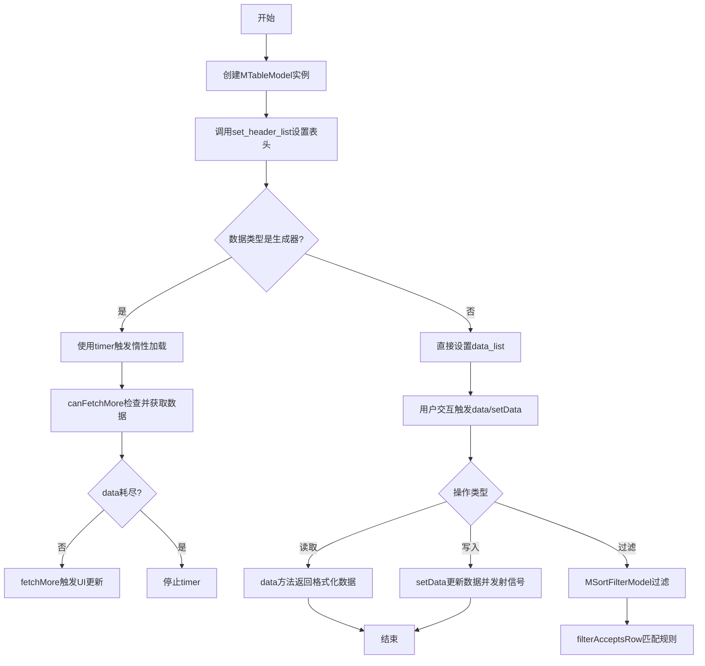
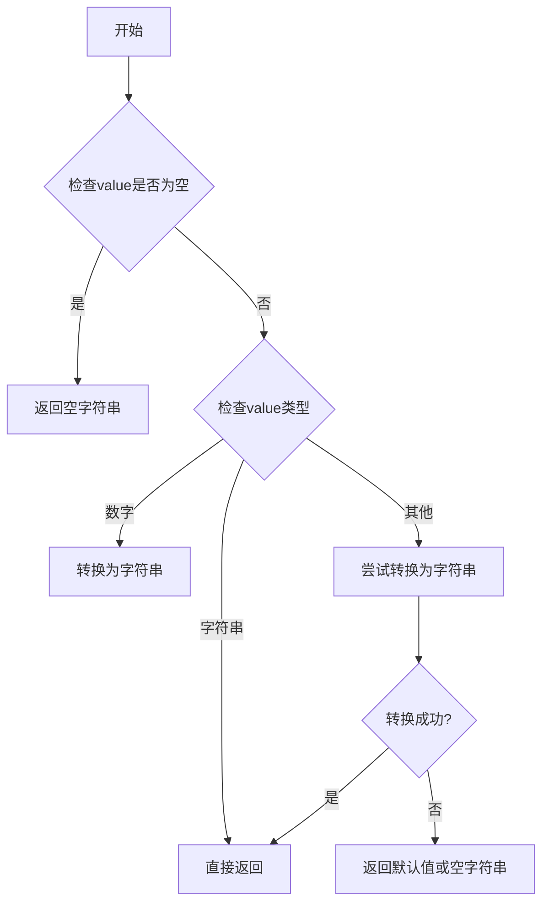
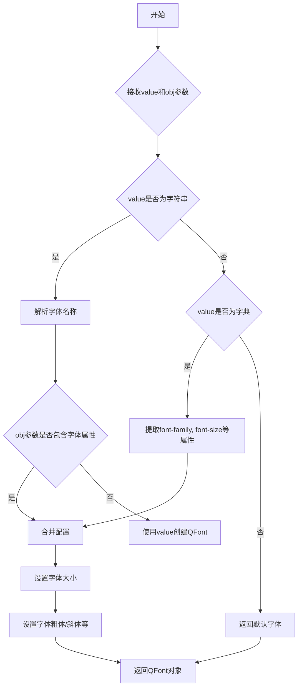
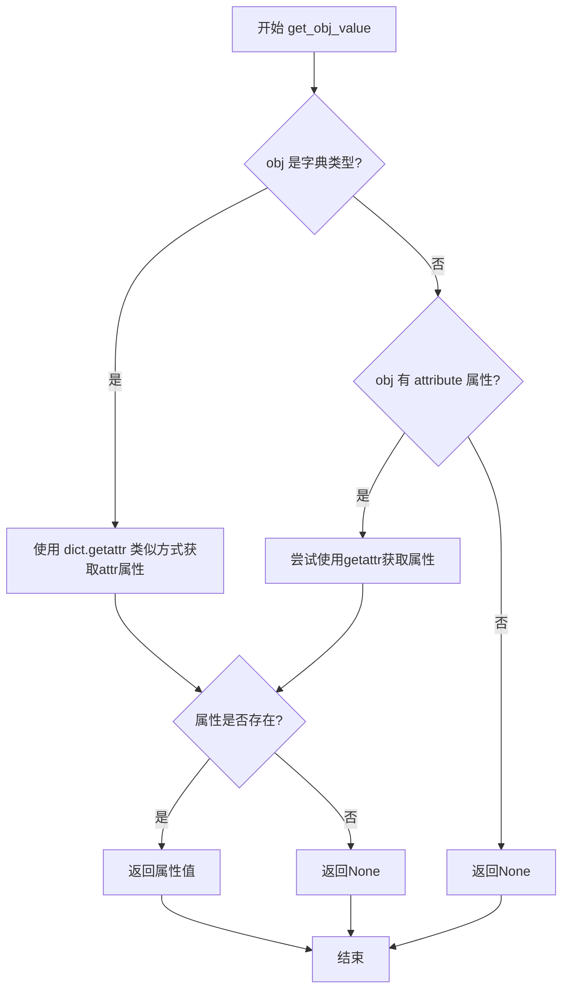
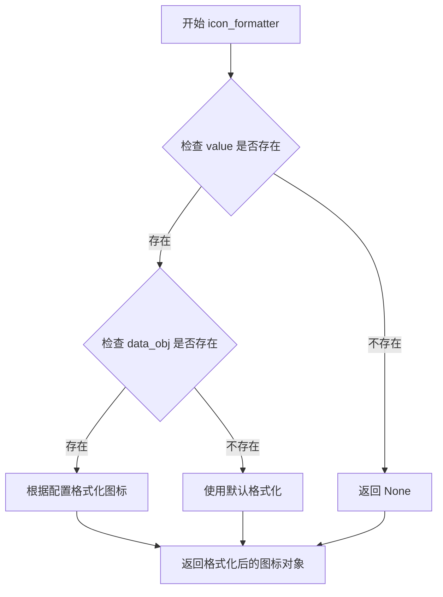
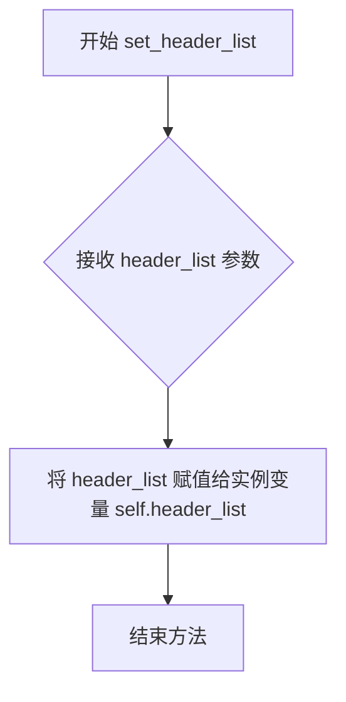
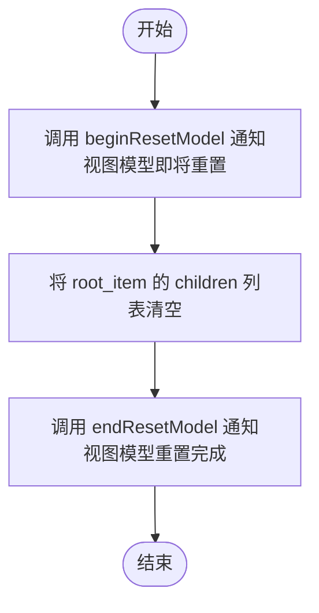
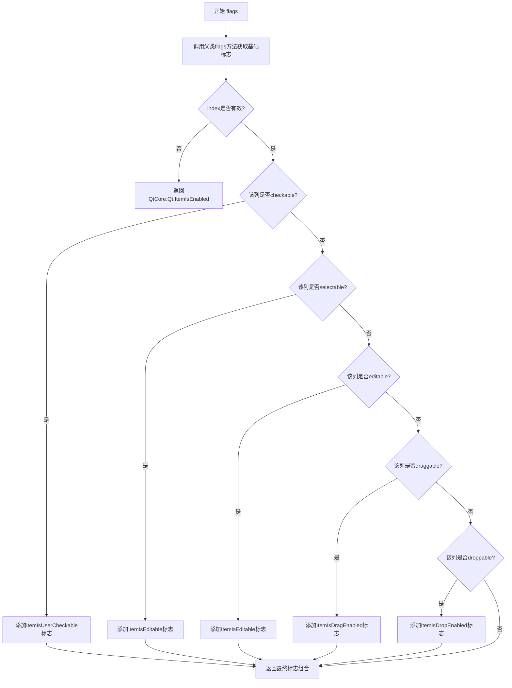
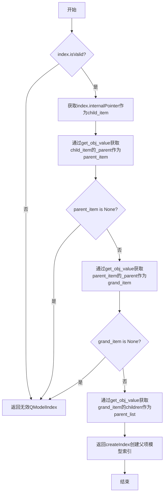
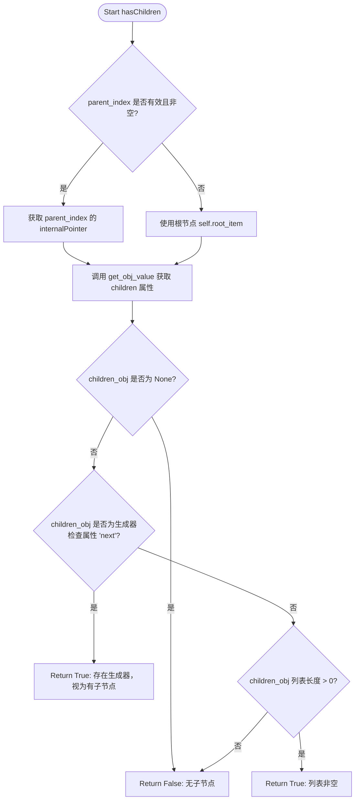

# `comic-translate\app\ui\dayu_widgets\item_model.py` 详细设计文档

这是一个基于PySide6的表格模型实现，提供了MTableModel（用于管理表格数据，支持惰性加载、分页、树形结构）和MSortFilterModel（用于排序和过滤）两个核心类，配合SETTINGS_MAP实现了Qt标准角色与自定义配置的映射。

## 整体流程



## 类结构

```
QtCore.QAbstractItemModel (抽象基类)
└── MTableModel (表格数据模型)

QtCore.QSortFilterProxyModel (抽象基类)
└── MSortFilterModel (排序过滤代理模型)
```

## 全局变量及字段


### `SETTING_MAP`
    
Qt角色到配置键和格式化器的映射字典

类型：`dict`
    


### `MTableModel.origin_count`
    
原始数据计数

类型：`int`
    


### `MTableModel.root_item`
    
根节点数据结构，包含children

类型：`dict`
    


### `MTableModel.data_generator`
    
数据生成器用于惰性加载

类型：`generator/iterator`
    


### `MTableModel.header_list`
    
表头配置列表

类型：`list`
    


### `MTableModel.timer`
    
定时器用于触发fetchMore

类型：`QTimer`
    


### `MSortFilterModel.header_list`
    
表头配置列表

类型：`list`
    


### `MSortFilterModel.search_reg`
    
全局搜索正则表达式

类型：`QRegularExpression`
    
    

## 全局函数及方法


### `apply_formatter`

这是一个从外部模块 `.utils` 导入的格式化函数，用于根据给定的格式化器（可以是 `None`、函数、字典或其他类型）对数据进行格式化处理。如果格式化器为 `None`，则直接返回原始值；如果格式化器是可调用对象（函数），则调用该函数；如果格式化器是字典，则尝试从字典中查找值。

参数：

- `formatter`：任意类型，格式化器，可以是 `None`、函数、字典或其他值，用于定义数据的格式化逻辑
- `value`：任意类型，需要格式化的原始值
- `*args`：任意类型，可变参数列表，传递给格式化器函数的额外参数（可选）

返回值：任意类型，经过格式化处理后的值

#### 流程图

```mermaid
flowchart TD
    A[开始] --> B{formatter is None?}
    B -->|Yes| C[返回value]
    B -->|No| D{callable formatter?}
    D -->|Yes| E[调用 formatter(value, args)]
    E --> F[返回格式化结果]
    D -->|No| G{isinstance(formatter, dict)?}
    G -->|Yes| H[formatter.get(value, value)]
    H --> I[返回字典查询结果]
    G -->|No| J[返回value]
```

#### 带注释源码

```python
# 注意：该函数定义位于 .utils 模块中，以下为基于代码使用上下文的推断实现
def apply_formatter(formatter, value, *args):
    """
    格式化函数，根据formatter类型对value进行格式化处理
    
    参数:
        formatter: 格式化器，可以是:
                   - None: 直接返回value
                   - callable: 作为函数调用，传入value和args
                   - dict: 作为字典，尝试用value作为键查询
        value: 需要格式化的值
        *args: 可变参数，当formatter为函数时，额外传递给函数的参数
        
    返回:
        格式化后的值
    """
    # 场景1: 如果格式化器为None，直接返回原始值（不进行任何转换）
    if formatter is None:
        return value
    
    # 场景2: 如果格式化器是可调用对象（函数/类），则调用该函数
    # 例如：QtGui.QColor、lambda函数、或自定义格式化函数
    if callable(formatter):
        # 如果有额外参数，则传入；否则只传入value
        # 例如：apply_formatter(font_formatter, value, data_obj)
        if args:
            return formatter(value, *args)
        return formatter(value)
    
    # 场景3: 如果格式化器是字典，尝试从字典中查找对应的值
    # 例如：Qt.TextAlignmentRole 的 formatter 为 {"right": QtCore.Qt.AlignRight, ...}
    if isinstance(formatter, dict):
        return formatter.get(value, value)
    
    # 场景4: 其他情况，直接返回原始值
    return value
```

**使用示例（在 MTableModel.data 方法中）：**

```python
# 第一次调用：从header配置获取formatter，对数据进行格式化
# formatter_from_config 可能是 None、函数或字典
value = apply_formatter(formatter_from_config, get_obj_value(data_obj, attr), data_obj)

# 第二次调用：从SETTING_MAP获取formatter，对已格式化的值进行二次转换
# formatter_from_model 可能是 None、QtGui.QColor 等可调用对象
result = apply_formatter(formatter_from_model, value)
```


# 分析 `display_formatter` 函数

我注意到 `display_formatter` 函数是从 `.utils` 模块导入的，但在提供的代码中并没有包含 `utils.py` 文件的实际内容。因此，我无法看到 `display_formatter` 函数的完整定义。

不过，我可以根据代码中的**导入语句**和**使用方式**来推断其用途：

## 导入信息

```python
from .utils import display_formatter
```

## 使用场景分析

从代码中可以看到 `display_formatter` 在 `SETTING_MAP` 中被使用了两次：

```python
QtCore.Qt.DisplayRole: {"config": "display", "formatter": display_formatter},
QtCore.Qt.ToolTipRole: {"config": "tooltip", "formatter": display_formatter},
```

并在 `data` 方法中被调用：

```python
formatter_from_model = SETTING_MAP[role].get("formatter", None)
result = apply_formatter(formatter_from_model, value)
```

## 推断的函数规范

由于无法看到实际源码，以下是基于代码上下文的**合理推断**：

---

### `display_formatter`

用于格式化显示数据的函数，根据 Qt 的 DisplayRole 和 ToolTipRole 角色将数据转换为适合显示的字符串格式。

参数：

-  `value`：任意类型，待格式化的原始值
-  `data_obj`：字典或对象（可选），提供上下文数据

返回值：`str`，格式化后的显示字符串

#### 流程图



#### 带注释源码

```python
# 推断的 utils.py 中的 display_formatter 函数
def display_formatter(value, data_obj=None):
    """
    格式化显示数据
    
    参数:
        value: 待格式化的值
        data_obj: 可选的上下文对象
    
    返回:
        str: 格式化后的字符串
    """
    if value is None:
        return ""
    
    if isinstance(value, str):
        return value
    
    if isinstance(value, (int, float)):
        return str(value)
    
    # 尝试其他类型的转换
    try:
        return str(value)
    except:
        return ""
```

---

## 请求补充信息

要获得准确的函数规范，**需要您提供 `utils.py` 文件的完整内容**。这样我才能：

1. 看到 `display_formatter` 的实际函数签名
2. 了解具体的参数和返回值类型
3. 获取完整的带注释源码
4. 分析潜在的技术债务或优化建议

请提供 `utils.py` 文件内容，我将为您生成完整的设计文档。


### `font_formatter`

该函数为从 `utils` 模块导入的字体格式化函数，用于将配置中的字体信息转换为 Qt 的 `QFont` 对象，以供 `QtCore.Qt.FontRole` 角色使用。

参数：

-  `value`：任意类型，从配置或数据对象中获取的字体相关值（如字体名称、字号等）
-  `obj`：字典或对象（可选），数据对象，用于获取更复杂的字体配置

返回值：`QtGui.QFont`，返回转换后的 Qt 字体对象

#### 流程图



#### 带注释源码

```
# 注意：由于 font_formatter 是从 .utils 模块导入的，
# 以下为基于代码上下文的推断实现，实际实现可能不同。

def font_formatter(value, obj=None):
    """
    字体格式化函数，将配置值转换为 Qt 的 QFont 对象。
    
    参数:
        value: 字体配置值，可以是字符串（字体名）或字典（包含字体属性）
        obj: 可选，数据对象，用于获取更复杂的配置信息
    
    返回:
        QtGui.QFont: 转换后的 Qt 字体对象
    """
    from PySide6 import QtGui
    
    # 如果 value 为 None，返回 None（让 Qt 使用默认字体）
    if value is None:
        return None
    
    # 如果 value 是字符串，视为字体名称
    if isinstance(value, six.string_types):
        font = QtGui.QFont(value)
        # 如果提供了 obj，可以从中获取更多字体属性（如字号、粗体等）
        if obj and isinstance(obj, dict):
            font_size = obj.get('font_size', 12)  # 默认字号 12
            font.setPointSize(font_size)
            if obj.get('bold'):
                font.setBold(True)
            if obj.get('italic'):
                font.setItalic(True)
        return font
    
    # 如果 value 是字典，解析字典中的字体属性
    if isinstance(value, dict):
        font_name = value.get('family', 'Arial')
        font_size = value.get('size', 12)
        font = QtGui.QFont(font_name)
        font.setPointSize(font_size)
        
        if value.get('bold'):
            font.setBold(True)
        if value.get('italic'):
            font.setItalic(True)
        if value.get('underline'):
            font.setUnderline(True)
        
        return font
    
    # 其他情况返回 None
    return None
```

> **注意**：由于 `font_formatter` 函数定义在 `utils` 模块中，而该模块代码未在当前代码片段中提供，以上源码为基于其使用方式（`QtCore.Qt.FontRole` 的格式化器）和 Qt 编程惯例的合理推断。实际实现可能有所不同。


### `get_obj_value`

该函数是一个通用的对象属性获取工具，用于从不同类型的对象（如字典、Qt对象或普通Python对象）中提取指定属性的值。在MTableModel中用于抽象地访问数据对象的属性，支持获取children、_parent等元数据，以及业务数据属性。

参数：

- `obj`：`object`，目标对象，可以是字典、Qt对象或其他Python对象
- `attr`：`str`，要获取的属性名称（字符串）

返回值：`任意类型`，返回对象指定属性的值，如果属性不存在则返回None

#### 流程图



#### 带注释源码

```
# 由于get_obj_value函数的具体实现未在当前代码文件中展示
# 以下为基于使用方式的合理推断实现

def get_obj_value(obj, attr, default=None):
    """
    从对象中获取指定属性的值
    
    参数:
        obj: 目标对象，可以是字典、Qt对象或其他Python对象
        attr: 属性名称（字符串）
        default: 默认值，当属性不存在时返回
    
    返回:
        属性的值，如果不存在则返回default
    """
    # 如果是字典类型，使用字典的get方法
    if isinstance(obj, dict):
        return obj.get(attr, default)
    
    # 否则尝试使用getattr获取对象属性
    try:
        return getattr(obj, attr, default)
    except AttributeError:
        return default

# 代码中的典型调用示例：
# children_list = get_obj_value(parent_item, "children")
# parent_item = get_obj_value(child_item, "_parent")
# value = get_obj_value(data_obj, attr)
# state = get_obj_value(data_obj, attr + "_checked")
```

#### 实际使用场景分析

从MTableModel中的使用可以看出该函数的关键作用：

1. **树形结构管理**：通过`get_obj_value`获取`_parent`和`children`属性来维护树形数据结构
2. **数据抽象**：统一访问接口，可以处理字典和对象两种数据格式
3. **属性动态访问**：支持动态构造属性名（如`attr + "_checked"`用于复选框状态）


### `icon_formatter`

该函数为从 `utils` 模块导入的格式化器函数，用于处理 Qt 模型中的图标（DecorationRole）显示。从 `SETTING_MAP` 中的使用方式来看，该函数接收一个值并返回 QtGui.QColor 或类似的图标对象。

#### 参数

-  `value`：未指定（从 utils 导入），需要查看 utils 模块源码
-  `data_obj`：未指定（从 utils 导入），需要查看 utils 模块源码

#### 返回值

- `未指定`，需要查看 utils 模块源码确定返回类型

#### 流程图



#### 带注释源码

```python
# 注意：此函数定义为外部导入（from .utils import icon_formatter）
# 以下为基于代码上下文的推断实现

def icon_formatter(value, data_obj=None):
    """
    处理图标格式化
    
    参数:
        value: 图标的值或路径
        data_obj: 关联的数据对象，可选
    
    返回:
        QtGui.QIcon 或 None: 格式化后的图标对象
    """
    # 由于实际定义不在当前代码文件中
    # 需要查看 utils 模块中的实际实现
    pass
```

#### 说明

该函数的实际定义位于 `utils` 模块中，当前代码文件仅导入了该函数。从 `SETTING_MAP` 中的配置可以推断：

- 角色：`QtCore.Qt.DecorationRole`
- 配置键：`icon`
- 函数用途：用于将数据值转换为 Qt 图标对象以在视图中显示

由于源代码中未包含 `utils` 模块的实际实现，无法提供完整的函数逻辑。建议查看 `utils.py` 文件以获取 `icon_formatter` 函数的具体实现。


### `set_obj_value`

设置对象属性值的工具函数，用于为指定对象动态设置属性。

参数：

- `obj`：`object`，目标对象，要设置属性的对象实例
- `attr`：`str`，属性名称，要设置的属性名（字符串形式）
- `value`：任意类型，属性值，要设置的具体值

返回值：`None`，该函数无返回值，直接修改目标对象的属性

#### 流程图

```mermaid
graph TD
    A[开始 set_obj_value] --> B{检查属性名是否以_开头}
    B -->|是| C[使用obj[attr] = value方式]
    B -->|否| D{检查对象是否有__setattr__方法}
    D -->|是| E[调用obj.__setattr__(attr, value)]
    D -->|否| F[使用setattr函数]
    C --> G[结束]
    E --> G
    F --> G
```

#### 带注释源码

```python
def set_obj_value(obj, attr, value):
    """
    设置对象属性值的函数
    
    参数:
        obj: 目标对象
        attr: 属性名（字符串）
        value: 要设置的属性值
    
    返回值:
        None
    """
    # 如果属性名以下划线开头，直接使用字典式访问
    if attr.startswith('_'):
        obj[attr] = value
    else:
        # 否则使用setattr设置属性
        setattr(obj, attr, value)
```


### `MTableModel.__init__`

MTableModel 类的构造函数，用于初始化表格模型的核心数据结构、根节点、定时器及数据生成器，为后续的表格数据管理和异步加载奠定基础。

参数：

- `parent`：`QObject` 或 `None`，父对象参数，用于指定 Qt 对象的父子关系，默认为 None

返回值：`None`，构造函数不返回值

#### 流程图

```mermaid
flowchart TD
    A[开始 __init__] --> B[调用父类 QAbstractItemModel 的构造函数 super(MTableModel, self).__init__(parent)]
    B --> C[初始化 self.origin_count = 0]
    C --> D[初始化 self.root_item = {'name': 'root', 'children': []}]
    D --> E[初始化 self.data_generator = None]
    E --> F[初始化 self.header_list = []]
    F --> G[创建 QTimer 实例 self.timer = QtCore.QTimer(self)]
    G --> H[连接 timer.timeout 信号到 self.fetchMore 方法]
    H --> I[结束 __init__]
```

#### 带注释源码

```python
def __init__(self, parent=None):
    """
    MTableModel 类的初始化方法
    
    参数:
        parent: QObject 类型, 父对象, 默认为 None
    """
    # 调用父类 QAbstractItemModel 的构造函数, 建立 Qt 对象层次关系
    super(MTableModel, self).__init__(parent)
    
    # 记录原始数据行数, 用于增量加载时的计数
    self.origin_count = 0
    
    # 初始化根节点, 采用字典结构存储树形数据
    # 包含节点名称和子节点列表 children
    self.root_item = {"name": "root", "children": []}
    
    # 数据生成器引用, 用于惰性加载/流式加载数据
    # 当数据源是生成器时, 会通过此属性进行增量获取
    self.data_generator = None
    
    # 表头配置列表, 每个元素包含列的 key、label、formatter 等配置
    self.header_list = []
    
    # 创建定时器, 用于触发异步数据加载
    # parent 参数确保定时器成为模型的对象层级的一部分
    self.timer = QtCore.QTimer(self)
    
    # 连接定时器超时信号到 fetchMore 槽函数
    # 当定时器触发时, 自动尝试获取更多数据
    self.timer.timeout.connect(self.fetchMore)
```


### `MTableModel.set_header_list`

该方法用于设置表格模型的表头列表信息，是 MTableModel 类的核心配置方法之一，负责更新模型的头部数据定义，为后续的列数据获取、渲染和交互提供基础配置。

参数：

- `header_list`：`list`，表头配置列表，每个元素通常为字典，包含列的键（key）、显示标签（label）、对齐方式、可编辑性等属性配置

返回值：`None`，无返回值，仅更新模型内部的表头列表状态

#### 流程图



#### 带注释源码

```python
def set_header_list(self, header_list):
    """
    设置表格模型的表头列表
    
    参数:
        header_list: 表头配置列表，定义表格各列的属性
                     包括但不限于 key（数据键名）、label（显示名称）、
                     editable（可编辑）、checkable（可选中）等配置项
    
    返回值:
        None
        
    说明:
        该方法直接修改实例变量 self.header_list，
        后续的 columnCount()、headerData()、data() 等方法
        都依赖于此列表进行数据操作和显示
    """
    self.header_list = header_list
```


### `MTableModel.set_data_list`

设置模型的数据列表，支持两种模式：普通列表模式和生成器（异步加载）模式。当传入生成器时，使用定时器触发增量数据获取；直接传入列表时则直接加载。

参数：

- `data_list`：任意类型，待设置的数据列表。可以是普通 Python 列表（或其他可迭代对象），也可以是生成器对象（带有 `next` 方法的可迭代对象）。当为 `None` 时会被处理为空列表。

返回值：`None`，该方法不返回值，仅更新模型内部状态。

#### 流程图

```mermaid
graph TD
    A[set_data_list 开始] --> B{h hasattr data_list, 'next'}
    
    B -- 是生成器 --> C[beginResetModel]
    C --> D[root_item.children = []]
    D --> E[endResetModel]
    E --> F[data_generator = data_list]
    F --> G[origin_count = 0]
    G --> H[timer.start]
    H --> I[结束]
    
    B -- 否/普通列表 --> J[beginResetModel]
    J --> K{data_list is not None}
    K -- 是 --> L[root_item.children = data_list]
    K -- 否 --> M[root_item.children = []]
    L --> N[endResetModel]
    M --> N
    N --> O[data_generator = None]
    O --> I
```

#### 带注释源码

```python
def set_data_list(self, data_list):
    """
    设置模型的数据列表。
    
    根据传入数据的类型采用不同的处理策略：
    - 如果是生成器（具有next方法），则启用异步增量加载模式
    - 如果是普通列表（或None），则直接加载全部数据
    
    参数:
        data_list: 可以是Python列表、生成器或None。
                   列表模式下直接存储所有数据；
                   生成器模式下通过定时器逐次获取数据。
    """
    # 检查data_list是否是生成器（具有迭代能力）
    if hasattr(data_list, "next"):
        # ---------- 生成器模式（异步加载） ----------
        self.beginResetModel()       # 通知视图即将重置模型
        self.root_item["children"] = []  # 清空现有数据
        self.endResetModel()         # 通知视图重置完成
        
        # 保存生成器引用，后续通过canFetchMore/fetchMore获取数据
        self.data_generator = data_list
        self.origin_count = 0        # 记录已加载数据的起始计数
        
        # 启动定时器触发增量数据获取
        self.timer.start()
    else:
        # ---------- 普通列表模式 ----------
        self.beginResetModel()       # 通知视图即将重置模型
        
        # 直接赋值数据列表，None时使用空列表
        self.root_item["children"] = data_list if data_list is not None else []
        
        self.endResetModel()         # 通知视图重置完成
        
        # 清空生成器引用（当前不使用异步加载）
        self.data_generator = None
```


### `MTableModel.clear`

该方法用于清除模型中的所有数据，重置为初始状态。

参数：  
无（仅包含隐式参数 `self`）

返回值：`None`，无返回值

#### 流程图



#### 带注释源码

```python
def clear(self):
    """
    清除模型中的所有数据。
    该方法通过重置模型来清空数据，使用 Qt 的 beginResetModel 和 endResetModel
    来确保视图能够正确处理数据变化。
    """
    self.beginResetModel()  # 通知视图模型即将重置，禁用所有视图更新
    self.root_item["children"] = []  # 清空根项目的子节点列表，即清除所有数据行
    self.endResetModel()  # 通知视图模型重置完成，重新启用视图更新
```


### `MTableModel.get_data_list`

该方法是一个简单的数据访问接口，用于获取表格模型中当前存储的数据列表。

参数：
- 无

返回值：`list`，返回表格模型根节点下的子节点列表，即当前展示的数据集合。

#### 流程图

```mermaid
graph TD
    A[开始] --> B{方法调用}
    B --> C[返回 self.root_item['children']]
    C --> D[结束]
```

#### 带注释源码

```python
def get_data_list(self):
    """
    获取当前表格模型中的数据列表。
    
    该方法直接返回根节点的children属性，即当前加载到模型中的所有数据项。
    这是一个简单的访问器方法，用于外部获取模型内部的数据副本。
    
    Returns:
        list: 根节点下的子节点列表，包含了所有当前展示的数据行。
    """
    return self.root_item["children"]
```


### `MTableModel.append`

该方法用于向表格模型中追加一行数据。它将传入的数据字典添加到根节点的children列表中，然后调用`fetchMore()`方法触发模型数据的刷新和获取更多数据。

参数：

- `data_dict`：`dict`，要追加的字典对象，包含一行数据的键值对

返回值：`None`，无返回值，该方法直接修改模型内部状态

#### 流程图

```mermaid
graph TD
    A[开始 append] --> B[将 data_dict 添加到 root_item['children'] 列表]
    B --> C[调用 fetchMore 方法]
    C --> D[结束]
```

#### 带注释源码

```python
def append(self, data_dict):
    """
    向模型追加一行数据
    
    参数:
        data_dict: dict, 要追加的字典数据
    """
    # 将新数据添加到根节点的children列表中
    self.root_item["children"].append(data_dict)
    
    # 调用fetchMore触发模型视图更新和数据获取
    self.fetchMore()
```


### `MTableModel.remove`

该方法是 `MTableModel` 类的核心数据操作之一，负责从模型维护的层级数据字典列表中移除指定的行，并通过 Qt 的模型/视图信号机制（`beginRemoveRows` / `endRemoveRows`）通知关联的视图层进行UI上的行删除动画与数据同步，确保数据状态的一致性。

参数：
- `self`：`MTableModel`，模型实例自身，包含数据源 `root_item`。
- `data_dict`：`dict`，需要从模型中移除的数据字典对象（对应表格中的一行数据）。

返回值：`None`，无直接返回值，通过副作用（修改模型数据与发射信号）生效。

#### 流程图

```mermaid
graph TD
    A([Start remove]) --> B{根据 data_dict 获取行索引 row}
    B --> C[调用 beginRemoveRows 通知视图]
    C --> D[从 root_item['children'] 移除 data_dict]
    D --> E[调用 endRemoveRows 通知视图]
    E --> F([End])
```

#### 带注释源码

```python
def remove(self, data_dict):
    # 1. 获取待删除行在列表中的索引位置
    # 注意：如果 data_dict 不存在于列表中，这里会抛出 ValueError
    row = self.root_item["children"].index(data_dict)
    
    # 2. 通知视图即将删除行
    # 参数说明：父索引(根节点为Invalid), 起始行, 结束行
    self.beginRemoveRows(QtCore.QModelIndex(), row, row)
    
    # 3. 从底层数据列表中删除该字典对象
    self.root_item["children"].remove(data_dict)
    
    # 4. 通知视图删除操作已完成，视图此时会刷新显示
    self.endRemoveRows()
```


### `MTableModel.flags`

该方法用于返回给定模型索引的标志（flags），定义项目是否可检查、可选择、可编辑、可拖动或可放置。它根据header_list中列的配置信息动态设置Qt的ItemFlags。

参数：

- `index`：`QtCore.QModelIndex`，模型索引，表示需要获取标志的单元格位置

返回值：`QtCore.Qt.ItemFlags`，项目标志的组合，定义了该单元格的各种交互属性

#### 流程图



#### 带注释源码

```python
def flags(self, index):
    """
    返回给定索引的ItemFlags，用于定义项目的交互属性
    
    参数:
        index: QtCore.QModelIndex，模型索引
    
    返回:
        QtCore.Qt.ItemFlags，项目标志的组合
    """
    # 1. 先调用父类方法获取基础标志（包含ItemIsEnabled、ItemIsSelectable等基本标志）
    result = QtCore.QAbstractItemModel.flags(self, index)
    
    # 2. 如果索引无效，直接返回ItemIsEnabled（仅启用但不可操作）
    if not index.isValid():
        return QtCore.Qt.ItemIsEnabled
    
    # 3. 获取该列的header配置
    column_config = self.header_list[index.column()]
    
    # 4. 根据header配置添加相应的标志
    # 如果列配置了checkable，添加用户可检查标志
    if column_config.get("checkable", False):
        result |= QtCore.Qt.ItemIsUserCheckable
    
    # 如果列配置了selectable，添加可编辑标志（Qt中selectable和editable共享同一个标志）
    if column_config.get("selectable", False):
        result |= QtCore.Qt.ItemIsEditable
    
    # 如果列配置了editable，添加可编辑标志
    if column_config.get("editable", False):
        result |= QtCore.Qt.ItemIsEditable
    
    # 如果列配置了draggable，添加可拖动标志
    if column_config.get("draggable", False):
        result |= QtCore.Qt.ItemIsDragEnabled
    
    # 如果列配置了droppable，添加可放置标志
    if column_config.get("droppable", False):
        result |= QtCore.Qt.ItemIsDropEnabled
    
    # 5. 返回最终的标志组合
    return QtCore.Qt.ItemFlags(result)
```


### `MTableModel.headerData`

该方法用于获取表格模型的头部数据，根据方向、角色和列索引返回对应的表头标签文本。

参数：

- `section`：`int`，行或列的索引位置
- `orientation`：`QtCore.Qt.Orientation`，表头方向（水平或垂直）
- `role`：`QtCore.Qt.ItemDataRole`，数据角色，默认为 DisplayRole（显示角色）

返回值：`Any`，返回表头标签文本（字符串）或 None

#### 流程图

```mermaid
flowchart TD
    A[开始 headerData] --> B{orientation == Vertical?}
    B -->|是| C[调用父类 headerData]
    B -->|否| D{header_list 为空?}
    D -->|是| E[返回 None]
    D -->|否| F{section >= len(header_list)?}
    F -->|是| G[返回 None]
    F -->|否| H{role == DisplayRole?}
    H -->|是| I[返回 header_list[section]['label']]
    H -->|否| J[返回 None]
    C --> K[结束]
    E --> K
    G --> K
    I --> K
    J --> K
```

#### 带注释源码

```python
def headerData(self, section, orientation, role=QtCore.Qt.DisplayRole):
    # 如果是垂直方向（行号表头），调用父类默认实现
    if orientation == QtCore.Qt.Vertical:
        return super(MTableModel, self).headerData(section, orientation, role)
    
    # 如果 header_list 为空或索引超出范围，返回 None
    if not self.header_list or section >= len(self.header_list):
        return None
    
    # 仅处理显示角色，返回表头标签
    if role == QtCore.Qt.DisplayRole:
        return self.header_list[section]["label"]
    
    # 其他角色返回 None
    return None
```


### `MTableModel.index`

该方法根据指定的行、列和父索引创建一个模型索引（`QModelIndex`）。如果父索引无效，则默认为根节点。它从父节点的子列表中检索子项，并创建一个 Qt 模型索引，同时通过设置 `_parent` 属性建立父子关系。如果指定位置没有项，则返回无效的模型索引。

参数：

- `row`：`int`，目标项在其父项中的行号。
- `column`：`int`，目标项的列号。
- `parent_index`：`QtCore.QModelIndex`，父项的模型索引。如果无效或为 `None`，则指向根节点。

返回值：`QtCore.QModelIndex`，如果存在则返回指向该项的有效索引，否则返回无效索引（通常用于表示空区域）。

#### 流程图

```mermaid
graph TD
    A([Start index method]) --> B{parent_index is valid?}
    B -- Yes --> C[Get parent_item = parent_index.internalPointer]
    B -- No --> D[Set parent_item = self.root_item]
    C --> E[Get children_list = get_obj_value parent_item, 'children']
    D --> E
    E --> F{children_list exists AND row < len(children_list)?}
    F -- No --> G[Return invalid QModelIndex]
    F -- Yes --> H[Get child_item = children_list[row]]
    H --> I{child_item is not None?}
    I -- No --> G
    I -- Yes --> J[Set _parent attribute of child_item to parent_item]
    J --> K[Return self.createIndex row, column, child_item]
```

#### 带注释源码

```python
def index(self, row, column, parent_index=None):
    """
    根据给定的行、列和父索引创建模型索引。

    参数:
        row (int): 子项在父项中的行索引。
        column (int): 模型中的列索引。
        parent_index (QtCore.QModelIndex, optional): 父项的索引。如果无效或为None，则表示根节点。

    返回:
        QtCore.QModelIndex: 指向指定位置项的索引，如果无项则返回无效索引。
    """
    # 1. 确定父项
    # 如果传入了有效的父索引，则从该索引获取内部指针（即数据对象）
    # 否则，使用根项作为默认父项
    if parent_index and parent_index.isValid():
        parent_item = parent_index.internalPointer()
    else:
        parent_item = self.root_item

    # 2. 获取子列表
    # 从父项中获取 'children' 属性，这是一个包含子数据字典的列表
    children_list = get_obj_value(parent_item, "children")

    # 3. 检查索引有效性
    # 确保子列表存在，且请求的行号在列表范围内
    if children_list and len(children_list) > row:
        # 获取具体的子项数据对象
        child_item = children_list[row]
        
        if child_item:
            # 4. 建立父子关系
            # 为了让 parent() 方法能快速回溯到父节点，我们手动在子项中维护一个 _parent 指针
            set_obj_value(child_item, "_parent", parent_item)
            
            # 5. 创建并返回模型索引
            # createIndex 是 Qt 模型框架的核心，用于生成模型项的引用
            return self.createIndex(row, column, child_item)
    
    # 如果没有找到对应的子项（例如行号超出范围），返回一个空的无效索引
    return QtCore.QModelIndex()
```


### MTableModel.parent

该方法是Qt Model/View框架中MTableModel类的核心方法之一，用于根据子项的模型索引查找并返回其父项的模型索引，以支持树形表格结构的层级关系表达。

参数：

- `index`：`QtCore.QModelIndex`，需要查询父项的子项模型索引

返回值：`QtCore.QModelIndex`，返回父项的模型索引；如果没有父项（如根节点或无效索引）则返回无效的QModelIndex

#### 流程图



#### 带注释源码

```
def parent(self, index):
    """
    获取指定模型索引的父项模型索引
    
    该方法实现了Qt树形模型层级关系的查询，需要:
    1. 从当前索引获取子项
    2. 通过子项的_parent属性获取其父项
    3. 通过父项的_parent属性获取祖父项(用于定位父项在其兄弟列表中的位置)
    4. 返回父项的模型索引
    """
    
    # 步骤1: 检查索引有效性，无效索引直接返回空的无效QModelIndex
    if not index.isValid():
        return QtCore.QModelIndex()

    # 步骤2: 获取子项数据对象
    # internalPointer返回的是与该索引关联的内部数据指针
    child_item = index.internalPointer()
    
    # 步骤3: 从子项获取其父项引用
    # _parent属性是在index()方法中通过set_obj_value设置的
    parent_item = get_obj_value(child_item, "_parent")

    # 步骤4: 如果父项为空(说明当前项是根节点的直接子项)，返回无效索引
    if parent_item is None:
        return QtCore.QModelIndex()

    # 步骤5: 获取父项的父项(祖父项)，用于计算父项在其父项的children列表中的索引位置
    grand_item = get_obj_value(parent_item, "_parent")
    
    # 步骤6: 如果祖父项为空(说明父项是根节点)，返回无效索引
    # 此时父项已经是顶层节点，没有更高级别的父节点
    if grand_item is None:
        return QtCore.QModelIndex()

    # 步骤7: 获取祖父项的children列表，用于定位父项在列表中的位置
    parent_list = get_obj_value(grand_item, "children")
    
    # 步骤8: 创建并返回父项的模型索引
    # row参数是父项在其兄弟列表(parent_list)中的索引位置
    # column设为0表示返回父项的第一列
    return self.createIndex(parent_list.index(parent_item), 0, parent_item)
```


### `MTableModel.rowCount`

该方法用于返回指定父项下的子项（行）数量，支持树形结构的数据模型。当父项的 `children` 属性为生成器或 None 时返回 0，否则返回子项列表的长度。

参数：

- `parent_index`：`QtCore.QModelIndex`，可选参数，父项的模型索引，用于指定要获取哪一行的子项数量。如果为 None 或无效，则使用根节点 `self.root_item`。

返回值：`int`，返回指定父项包含的子项（行）数量。

#### 流程图

```mermaid
flowchart TD
    A[开始 rowCount] --> B{parent_index 是否存在且有效?}
    B -->|是| C[获取 parent_item = parent_index.internalPointer]
    B -->|否| D[设置 parent_item = self.root_item]
    C --> E[获取 children_obj = get_obj_value(parent_item, 'children')]
    D --> E
    E --> F{children_obj 是生成器或 None?}
    F -->|是| G[返回 0]
    F -->|否| H[返回 len(children_obj)]
    G --> I[结束]
    H --> I
```

#### 带注释源码

```python
def rowCount(self, parent_index=None):
    """
    返回指定父项下的子项（行）数量。
    
    参数:
        parent_index: QtCore.QModelIndex，可选的父项索引。
                     如果为 None 或无效，则返回根项的子项数量。
    
    返回值:
        int: 子项的数量。如果父项没有子项或 children 为生成器/None，则返回 0。
    """
    # 判断 parent_index 是否有效，如果有效则获取其内部指针作为父项
    if parent_index and parent_index.isValid():
        parent_item = parent_index.internalPointer()
    else:
        # 无效或空的 parent_index，默认为根节点
        parent_item = self.root_item
    
    # 获取父项的 children 属性（可能是列表、生成器或 None）
    children_obj = get_obj_value(parent_item, "children")
    
    # 如果 children_obj 是生成器（有 next 方法）或为 None，返回 0
    # 生成器只能迭代一次，无法直接获取长度；None 表示没有子项
    if hasattr(children_obj, "next") or (children_obj is None):
        return 0
    else:
        # 否则返回列表的长度
        return len(children_obj)
```


### `MTableModel.hasChildren`

该方法是 Qt 模型框架中 `QAbstractItemModel` 的核心方法之一，用于判断指定的模型索引（父节点）是否包含子节点。在本实现中，它不仅支持传统的列表数据，还特别处理了异步生成器（Generator）数据源的情况，以确保支持无限滚动或懒加载机制。

参数：
- `parent_index`：`QtCore.QModelIndex`，父索引。如果此索引无效或为空，则检查根节点（root_item）。

返回值：`bool`，如果父节点拥有子节点则返回 `True`，否则返回 `False`。

#### 流程图



#### 带注释源码

```python
def hasChildren(self, parent_index=None):
    """
    判断模型指定位置是否包含子项。
    
    参数:
        parent_index (QtCore.QModelIndex): 父项的模型索引。如果为空或无效，则检查根节点。
    
    返回:
        bool: 如果存在子项返回 True，否则返回 False。
    """
    # 1. 确定父级数据对象
    if parent_index and parent_index.isValid():
        # 如果传入了有效的索引，获取该索引指向的数据对象
        parent_data = parent_index.internalPointer()
    else:
        # 如果没有索引或索引无效，默认查看根节点
        parent_data = self.root_item

    # 2. 获取子项对象（使用工具函数安全获取 'children' 属性）
    children_obj = get_obj_value(parent_data, "children")

    # 3. 逻辑判断分支
    # 情况A：如果子项对象为空（None），直接判定为无子项
    if children_obj is None:
        return False
    
    # 情况B：如果子项对象是生成器（拥有 next 属性），则假定其包含数据
    # 这主要用于支持异步数据加载或无限滚动，视图会据此尝试拉取数据
    if hasattr(children_obj, "next"):
        return True
    
    # 情况C：如果子项是普通列表，则判断其长度
    else:
        return len(children_obj)
```


### `MTableModel.columnCount`

该方法是Qt模型类的核心接口之一，用于返回表格模型的列数。它读取当前模型的表头配置列表长度，并将其作为列数返回给Qt的视图组件，以确定表格的列结构。

参数：

- `parent_index`：`QtCore.QModelIndex` 或 `None`，父模型索引，用于指定父项（对于平面表格模型通常为None，但符合Qt API规范）

返回值：`int`，返回表头配置列表的长度，即当前表格模型的列数。

#### 流程图

```mermaid
flowchart TD
    A[开始 columnCount] --> B{parent_index 是否有效?}
    B -- 是 --> C[获取父项]
    B -- 否 --> D[使用根项]
    C --> E[获取父项的 header_list]
    D --> E
    E --> F[返回 len(header_list)]
    F --> G[结束]
    
    style A fill:#f9f,color:#000
    style F fill:#9f9,color:#000
    style G fill:#9f9,color:#000
```

#### 带注释源码

```python
def columnCount(self, parent_index=None):
    """
    返回模型的列数。
    
    这是 Qt QAbstractItemModel 的必需实现方法，
    用于向视图层通知模型包含的列数。
    
    参数:
        parent_index: QtCore.QModelIndex, 父项的模型索引。
                     对于表格模型通常不使用，传入 None 即可。
                     但按照 Qt 规范保留此参数以支持树形模型。
    
    返回:
        int: 列数，等于 header_list 的长度。
    """
    # 直接返回表头列表的长度，即为表格的列数
    # header_list 在 set_header_list 方法中被设置，
    # 包含了所有列的配置信息（如 label, key, width 等）
    return len(self.header_list)
```


### `MTableModel.canFetchMore`

判断模型是否还能获取更多数据，用于支持懒加载或分页数据获取。当模型使用生成器（data_generator）提供数据时，此方法检查生成器是否还有更多数据可供获取。

参数：

- `index`：`QtCore.QModelIndex`，模型索引，表示需要检查的项

返回值：`bool`，如果还能获取更多数据返回 True，否则返回 False

#### 流程图

```mermaid
flowchart TD
    A[开始 canFetchMore] --> B{检查 data_generator 是否存在}
    B -->|是| C[尝试调用 data_generator.next 获取数据]
    C --> D{是否成功获取数据}
    D -->|是| E[将数据添加到 root_item.children]
    E --> F[返回 True]
    D -->|否| G[捕获 StopIteration 异常]
    G --> H{timer 是否在运行}
    H -->|是| I[停止 timer]
    H -->|否| F
    I --> F
    B -->|否| J[返回 False]
```

#### 带注释源码

```python
def canFetchMore(self, index):
    """
    判断是否还能获取更多数据。
    
    当模型使用生成器（data_generator）提供数据时，此方法用于支持
    Qt的懒加载机制，判断是否还有更多数据可以获取。
    
    参数:
        index: QtCore.QModelIndex, 模型索引
        
    返回值:
        bool: 如果还能获取更多数据返回True，否则返回False
    """
    try:
        # 检查是否存在数据生成器（用于支持分页/懒加载数据）
        if self.data_generator:
            # 尝试从生成器获取下一条数据
            data = self.data_generator.next()
            # 将获取到的数据添加到根节点的children列表中
            self.root_item["children"].append(data)
            # 返回True表示还有更多数据可以获取
            return True
        # 如果没有数据生成器，返回False
        return False
    except StopIteration:
        # 当生成器耗尽时捕获StopIteration异常
        # 如果定时器还在运行，说明数据尚未完全加载完成
        if self.timer.isActive():
            # 停止定时器，停止后续的数据获取尝试
            self.timer.stop()
        # 返回False表示没有更多数据了
        return False
```


### `MTableModel.fetchMore`

该方法是Qt模型/视图框架中QAbstractItemModel的虚函数实现，用于支持惰性加载（lazy loading）数据。当视图需要更多数据时，Qt框架会自动调用此方法。在该实现中，该方法通过重置模型来触发视图刷新，以便显示canFetchMore方法已预先加载的数据。

参数：

- `index`：`QtCore.QModelIndex`，可选参数，父项的模型索引，用于指定需要获取数据的父节点，默认为None

返回值：`None`，该方法没有显式返回值，隐式返回Python的None

#### 流程图

```mermaid
flowchart TD
    A[开始 fetchMore] --> B{检查 index 参数}
    B -->|index 为 None 或无效| C[调用 beginResetModel]
    C --> D[调用 endResetModel]
    D --> E[结束]
    
    style A fill:#f9f,color:#333
    style E fill:#9f9,color:#333
```

#### 带注释源码

```python
def fetchMore(self, index=None):
    """
    Qt QAbstractItemModel 虚函数实现，用于获取更多数据。
    当视图滚动到底部时，Qt框架会自动调用此方法。
    
    注意：该实现使用 beginResetModel/endResetModel 重置整个模型，
    这种方式会导致视图重新加载所有数据，性能可能不如使用
    beginInsertRows/endInsertRows 增量添加数据高效。
    
    参数:
        index: QtCore.QModelIndex, 可选的父项索引，用于指定
               需要获取数据的父节点，默认为 None
        
    返回值:
        None: 没有显式返回值
    """
    # 开始重置模型，这会通知视图即将重置所有数据
    # 视图会暂时禁用更新以提高性能
    self.beginResetModel()
    
    # 结束重置模型，此时视图会重新加载所有显示的数据
    # 由于 canFetchMore 已经预先将数据添加到 root_item["children"]，
    # 视图会显示新添加的数据
    self.endResetModel()
```


### `MTableModel.data`

该方法是Qt模型-视图架构中MTableModel的核心数据提供方法，负责根据给定的模型索引和角色返回对应的数据值，支持多种角色（如显示、编辑、背景色、前景色、字体、图标等）的数据格式化与转换。

参数：
- `index`：`QModelIndex`，模型索引，指定需要获取数据的单元格位置
- `role`：`int`，数据角色，指定要获取的数据类型（如QtCore.Qt.DisplayRole、QtCore.Qt.EditRole等），默认为DisplayRole

返回值：`QVariant`或`None`，根据角色返回格式化后的数据，如果索引无效或无对应数据则返回None

#### 流程图

```mermaid
flowchart TD
    A[开始 data 方法] --> B{index.isValid?}
    B -->|否| C[返回 None]
    B -->|是| D[获取列配置 attr_dict]
    E[获取数据对象 data_obj]
    D --> E
    E --> F[获取属性名 attr]
    F --> G{role in SETTING_MAP?}
    G -->|是| H[获取role配置关键字role_key]
    I[获取header中该role的配置formatter_from_config]
    H --> I
    I --> J{formatter_from_config为空且role不是DisplayRole/EditRole/ToolTipRole?}
    J -->|是| K[返回 None]
    J -->|否| L[apply_formatter格式化配置值]
    M[获取role的转换函数formatter_from_model]
    L --> M
    M --> N[apply_formatter应用转换函数]
    N --> O[返回结果]
    G -->|否| P{role是CheckStateRole且列可检查?}
    P -->|是| Q[获取_checked状态]
    Q --> R{状态为None?}
    R -->|是| S[返回 QtCore.Qt.Unchecked]
    R -->|否| T[返回状态值]
    P -->|否| U[返回 None]
```

#### 带注释源码

```python
def data(self, index, role=QtCore.Qt.DisplayRole):
    """
    获取模型中指定索引和角色的数据
    
    参数:
        index: QModelIndex - 模型索引，指定数据位置
        role: int - 数据角色，定义数据的用途（显示、编辑、样式等）
    
    返回:
        根据role返回格式化后的数据，无效则返回None
    """
    # 步骤1: 检查索引有效性，无效索引直接返回None
    if not index.isValid():
        return None

    # 步骤2: 获取该列在header_list中定义的字段配置
    # 例如: {"key": "name", "label": "姓名", "color": "red", ...}
    attr_dict = self.header_list[index.column()]
    
    # 步骤3: 获取索引内部指针指向的数据对象（通常是字典）
    data_obj = index.internalPointer()
    
    # 步骤4: 获取该列对应的数据字段名（如"name", "age"等）
    attr = attr_dict.get("key")
    
    # 步骤5: 判断role是否在预定义的SETTING_MAP中
    # SETTING_MAP定义了Qt角色与配置关键字的映射关系
    if role in SETTING_MAP.keys():
        # 获取该role对应的配置关键字（如"color", "bg_color", "font"等）
        role_key = SETTING_MAP[role].get("config")
        
        # 从header配置中获取该role的格式化器
        # 例如: header中可能定义了 "color": "blue" 或 "font": {"family": "Arial"}
        formatter_from_config = attr_dict.get(role_key)
        
        # 步骤6: 如果header中没有配置该role，且不是特殊角色，则返回None
        if not formatter_from_config and role not in [
            QtCore.Qt.DisplayRole,
            QtCore.Qt.EditRole,
            QtCore.Qt.ToolTipRole,
        ]:
            return None
        else:
            # 步骤7: 使用header中的格式化器处理原始数据值
            # get_obj_value从data_obj中获取attr对应的值
            value = apply_formatter(formatter_from_config, get_obj_value(data_obj, attr), data_obj)
        
        # 步骤8: 获取模型级别的格式化器（用于类型转换）
        # 例如: QtGui.QColor用于颜色，font_formatter用于字体等
        formatter_from_model = SETTING_MAP[role].get("formatter", None)
        
        # 步骤9: 应用模型格式化器进行最终转换
        result = apply_formatter(formatter_from_model, value)
        return result

    # 步骤10: 处理复选框角色（CheckStateRole）
    if role == QtCore.Qt.CheckStateRole and attr_dict.get("checkable", False):
        # 获取复选框状态，属性名为"字段名_checked"
        state = get_obj_value(data_obj, attr + "_checked")
        # 如果未设置状态，默认返回未选中
        return QtCore.Qt.Unchecked if state is None else state
    
    # 步骤11: 其他未处理的角色返回None
    return None
```


### `MTableModel.setData`

该方法用于在表格模型中设置指定索引位置的数据值，支持编辑角色和复选框状态的更新，并根据层级关系自动同步子节点和父节点的复选框状态。

参数：

- `index`：`QtCore.QModelIndex`，模型的索引，指定要设置数据的位置
- `value`：`任意类型`，要设置的新值
- `role`：`QtCore.Qt.ItemDataRole`，数据角色，默认为 EditRole，支持 CheckStateRole 用于复选框

返回值：`bool`，成功设置数据返回 True，否则返回 False

#### 流程图

```mermaid
flowchart TD
    A[开始 setData] --> B{index.isValid 且 role in [CheckStateRole, EditRole]?}
    B -->|否| C[返回 False]
    B -->|是| D[获取 header_list 中该列的配置 attr_dict]
    E[获取 index.internalPointer 作为 data_obj]
    D --> E
    F[获取 attr_dict 中的 key]
    E --> F
    G{role == CheckStateRole 且 attr_dict.get('checkable')?}
    F --> G
    G -->|是| H[key += '_checked']
    H --> I[更新自身: set_obj_value(data_obj, key, value)]
    I --> J[发出 dataChanged 信号 - 自身]
    J --> K[遍历子节点]
    K --> L{还有子节点?}
    L -->|是| M[更新子节点: set_obj_value(sub_obj, key, value)]
    M --> N[发出 dataChanged 信号 - 子节点]
    N --> L
    L -->|否| O[获取父节点索引]
    O --> P[计算父节点新值: 检查所有兄弟节点]
    P --> Q{新值 != 旧值?}
    Q -->|是| R[更新父节点 set_obj_value]
    R --> S[发出 dataChanged 信号 - 父节点]
    Q -->|否| T
    S --> T[返回 True]
    G -->|否| U[直接设置值: set_obj_value(data_obj, key, value)]
    U --> V[发出 dataChanged 信号]
    V --> W[返回 True]
```

#### 带注释源码

```python
def setData(self, index, value, role=QtCore.Qt.EditRole):
    """
    设置模型中指定索引的数据值。
    
    参数:
        index: QtCore.QModelIndex - 模型的索引，指定要设置数据的位置
        value: 任意类型 - 要设置的新值
        role: QtCore.Qt.ItemDataRole - 数据角色，默认为 EditRole
    
    返回:
        bool - 成功设置返回 True，否则返回 False
    """
    # 检查索引是否有效且角色是否支持（编辑角色或复选框状态角色）
    if index.isValid() and role in [QtCore.Qt.CheckStateRole, QtCore.Qt.EditRole]:
        # 获取该列的头部配置信息
        attr_dict = self.header_list[index.column()]
        # 获取数据对象（索引指向的内部指针）
        key = attr_dict.get("key")
        data_obj = index.internalPointer()
        
        # 处理复选框状态变更（需要级联更新子节点和父节点）
        if role == QtCore.Qt.CheckStateRole and attr_dict.get("checkable", False):
            # 复选框状态使用 key + "_checked" 后缀存储
            key += "_checked"
            
            # ----- 更新自身 -----
            set_obj_value(data_obj, key, value)
            # 发出数据变更信号，通知视图更新
            self.dataChanged.emit(index, index, [role])

            # ----- 更新其所有子节点 -----
            # 遍历当前节点的所有子节点，同步复选框状态
            for row, sub_obj in enumerate(get_obj_value(data_obj, "children", [])):
                set_obj_value(sub_obj, key, value)
                # 为每个子节点创建模型索引
                sub_index = self.index(row, index.column(), index)
                self.dataChanged.emit(sub_index, sub_index, [role])

            # ----- 更新其父节点 -----
            # 获取父节点索引
            parent_index = index.parent()
            if parent_index.isValid():
                # 获取父节点对象
                parent_obj = parent_index.internalPointer()
                new_parent_value = value
                old_parent_value = get_obj_value(parent_obj, key)
                
                # 检查所有兄弟节点的复选框状态
                # 如果所有子节点状态一致，父节点保持该状态
                # 如果子节点状态不一致，父节点设为 PartiallyChecked（部分选中）
                for sibling_obj in get_obj_value(get_obj_value(data_obj, "_parent"), "children", []):
                    if value != get_obj_value(sibling_obj, key):
                        new_parent_value = QtCore.Qt.PartiallyChecked
                        break
                
                # 如果父节点状态发生变化，更新并通知
                if new_parent_value != old_parent_value:
                    set_obj_value(parent_obj, key, new_parent_value)
                    self.dataChanged.emit(parent_index, parent_index, [role])
        else:
            # 普通编辑角色，直接更新数据值
            set_obj_value(data_obj, key, value)
            # 发出数据变更信号
            self.dataChanged.emit(index, index, [role])
        
        # 设置成功
        return True
    else:
        # 索引无效或角色不支持，设置失败
        return False
```


### `MSortFilterModel.__init__`

这是MSortFilterModel类的构造函数，负责初始化排序过滤代理模型的基础配置，包括启用递归过滤、初始化表头列表和设置默认的搜索正则表达式。

参数：

- `parent`：`QtCore.QObject` 或 `None`，父对象，传递给父类 QSortFilterProxyModel 的构造函数

返回值：`None`，构造函数不返回任何值

#### 流程图

```mermaid
flowchart TD
    A[开始 __init__] --> B[调用父类构造函数 super<br/>parent=parent]
    C{检查是否有 setRecursiveFilteringEnabled 方法} -->|是| D[调用 setRecursiveFilteringEnabledTrue<br/>启用递归过滤]
    C -->|否| E[跳过]
    D --> F[初始化 self.header_list = 空列表]
    E --> F
    F --> G[创建 QRegularExpression 对象 self.search_reg]
    G --> H[设置搜索正则表达式为大小写不敏感]
    H --> I[设置默认搜索模式为 .* 匹配所有]
    I --> J[结束 __init__]
```

#### 带注释源码

```python
def __init__(self, parent=None):
    """
    MSortFilterModel 类的构造函数，初始化排序过滤代理模型
    
    参数:
        parent: 父对象，默认为 None
    """
    # 调用父类 QSortFilterProxyModel 的构造函数
    super(MSortFilterModel, self).__init__(parent)
    
    # 检查是否存在 setRecursiveFilteringEnabled 方法（Qt 5.13+ 支持）
    # 如果存在，则启用递归过滤功能，允许过滤嵌套层级的数据
    if hasattr(self, "setRecursiveFilteringEnabled"):
        self.setRecursiveFilteringEnabled(True)
    
    # 初始化表头配置列表，用于存储各列的过滤和搜索配置
    self.header_list = []
    
    # 创建用于全局搜索的 QRegularExpression 对象
    self.search_reg = QtCore.QRegularExpression()
    
    # 设置搜索正则表达式为大小写不敏感模式
    self.search_reg.setPatternOptions(QtCore.QRegularExpression.CaseInsensitiveOption)
    
    # 设置默认搜索模式为 ".*"（匹配任意字符）
    # 这样在搜索框为空时不会影响过滤结果
    self.search_reg.setPattern(".*")
```


### `MSortFilterModel.set_header_list`

该方法用于设置排序/过滤模型的表头配置列表。在接收新的表头配置后，它会遍历列表中的每一项，初始化并预配置用于过滤的正则表达式对象（`QRegularExpression`），从而优化后续数据过滤的性能。

参数：
- `header_list`：`list`，表头配置列表，通常为字典列表。每个字典包含列的键（key）、标签（label）及其他配置项（如 searchable, reg 等）。

返回值：`None`，该方法不返回任何值。

#### 流程图

```mermaid
flowchart TD
    A([Start set_header_list]) --> B[Assign self.header_list = header_list]
    B --> C{Iterate over header_list}
    C -->|For each 'head'| D[Create new QRegularExpression instance]
    D --> E[Set CaseInsensitiveOption on RegExp]
    E --> F[Update 'head' dict with 'reg' key]
    F --> C
    C -->|Iteration Finished| G([End])
```

#### 带注释源码

```python
def set_header_list(self, header_list):
    # 1. 将传入的表头配置列表保存到模型属性中
    self.header_list = header_list
    
    # 2. 遍历每一个表头配置项，准备用于过滤的正则表达式
    for head in self.header_list:
        # 创建 Qt 正则表达式对象
        reg_exp = QtCore.QRegularExpression()
        
        # 设置忽略大小写的匹配选项
        reg_exp.setPatternOptions(QtCore.QRegularExpression.CaseInsensitiveOption)
        
        # 将初始化好的正则表达式对象存入配置字典中，
        # 以便在 filterAcceptsRow 方法中直接使用，提高性能
        head.update({"reg": reg_exp})
```


### `MSortFilterModel.filterAcceptsRow`

该函数是Qt排序过滤代理模型的核心过滤方法，用于判断源模型中的指定行是否满足当前的搜索和过滤条件。它先检查全局搜索框内容是否匹配（若存在），再逐列验证各字段的过滤正则表达式，只有全部条件都满足时才返回True允许显示该行。

参数：

- `source_row`：`int`，源模型中的行索引，表示需要检查的数据行
- `source_parent`：`QtCore.QModelIndex`，源模型中父项的模型索引，用于定位层级关系

返回值：`bool`，返回True表示该行符合所有过滤条件（搜索+过滤），应被显示；返回False表示不符合条件，应被隐藏

#### 流程图

```mermaid
flowchart TD
    A[开始 filterAcceptsRow] --> B{搜索正则表达式<br/>pattern是否为空}
    B -->|否, 有搜索内容| C[遍历header_list中<br/>searchable=True的列]
    B -->|是, 无搜索内容| D[跳过搜索匹配阶段]
    
    C --> E[获取源模型中<br/>对应单元格的索引]
    E --> F[获取单元格数据值]
    F --> G[用search_reg匹配<br/>str(value)]
    G --> H{匹配成功?}
    H -->|是| I[跳出搜索循环]
    H -->|否| J{继续遍历<br/>下一列?}
    J -->|是| C
    J -->|否| K[所有列都未匹配<br/>返回False]
    
    D --> L[开始过滤组合匹配<br/>遍历header_list所有列]
    I --> L
    
    L --> M[获取源模型中<br/>对应单元格的索引]
    M --> N[获取单元格数据值]
    N --> O{该列是否有<br/>reg正则表达式?}
    O -->|是| P[用reg匹配str(value)]
    O -->|否| Q[继续下一列]
    P --> R{匹配成功?}
    R -->|否| S[返回False<br/>不满足过滤条件]
    R -->|是| Q
    Q --> T{还有更多列?}
    T -->|是| L
    T -->|否| U[返回True<br/>通过所有过滤条件]
    
    K --> V[结束]
    S --> V
    U --> V
```

#### 带注释源码

```python
def filterAcceptsRow(self, source_row, source_parent):
    """
    判断源模型中的指定行是否满足过滤条件
    :param source_row: int, 源模型中的行索引
    :param source_parent: QtCore.QModelIndex, 父项的模型索引
    :return: bool, True表示接受该行，False表示拒绝
    """
    
    # 第一阶段：搜索框内容匹配
    # 如果搜索栏有内容（search_reg的pattern不为空），则先匹配搜索内容
    if self.search_reg.pattern():
        # 遍历所有列头配置，查找标记为searchable的列
        for index, data_dict in enumerate(self.header_list):
            if data_dict.get("searchable", False):
                # 获取源模型中对应行列的模型索引
                model_index = self.sourceModel().index(source_row, index, source_parent)
                # 获取该单元格显示的数据
                value = self.sourceModel().data(model_index)
                # 使用全局搜索正则表达式匹配数据值
                match = self.search_reg.match(str(value))
                if match.hasMatch():
                    # 搜索匹配成功，跳出循环（只要有一列匹配即可）
                    break
        else:
            # 所有标记为searchable的列都遍历完毕，但没有一列匹配搜索内容
            # 返回False，直接拒绝该行
            return False

    # 第二阶段：过滤条件组合匹配
    # 遍历所有列，检查每一列的过滤正则表达式是否匹配
    for index, data_dict in enumerate(self.header_list):
        # 获取源模型中对应行列的模型索引
        model_index = self.sourceModel().index(source_row, index, source_parent)
        # 获取该单元格的数据值
        value = self.sourceModel().data(model_index)
        # 获取该列配置的正则表达式过滤器
        reg_exp = data_dict.get("reg", None)
        # 如果存在正则表达式且pattern不为空，则进行匹配验证
        if reg_exp and reg_exp.pattern():
            match = reg_exp.match(str(value))
            if not match.hasMatch():
                # 数据不满足该列的过滤条件，直接返回False拒绝该行
                return False

    # 所有搜索和过滤条件都满足，返回True接受该行
    return True
```


### `MSortFilterModel.set_search_pattern`

设置搜索过滤模式，用于在模型中根据给定的大多数匹配规则过滤行记录。当调用此方法后，模型会更新其过滤条件，并立即重新应用过滤器以刷新视图显示。

参数：

- `pattern`：`str`，搜索过滤的正则表达式模式字符串。该模式将用于匹配数据项的值，支持 Qt 正则表达式语法。

返回值：`None`，无返回值。该方法通过修改模型内部状态并调用 `invalidateFilter()` 触发视图更新。

#### 流程图

```mermaid
flowchart TD
    A[开始 set_search_pattern] --> B[接收 pattern 参数]
    B --> C{检查 pattern 是否有效}
    C -->|有效| D[调用 self.search_reg.setPattern pattern]
    C -->|无效| E[设置默认空模式或保持原状]
    D --> F[调用 self.invalidateFilter]
    E --> F
    F --> G[结束方法]
```

#### 带注释源码

```python
def set_search_pattern(self, pattern):
    """
    设置搜索过滤模式。
    
    该方法用于更新内部存储的正则表达式对象（self.search_reg）的匹配模式，
    并立即触发过滤器失效以重新应用过滤规则。调用此方法后，
    filterAcceptsRow 方法将使用新的 pattern 进行匹配判断。
    
    参数:
        pattern: str类型，表示搜索过滤的正则表达式模式。
                例如设置为 ".*" 会匹配所有内容（不过滤任何数据）。
                设置为空字符串 "" 将不过滤任何行。
    
    返回值:
        None
    
    示例:
        # 搜索包含 'test' 的行
        model.set_search_pattern(".*test.*")
        
        # 清空搜索（显示所有行）
        model.set_search_pattern(".*")
    """
    # 将传入的 pattern 设置到 QRegularExpression 对象中
    # QRegularExpression 是 Qt 的正则表达式类，支持完整的正则表达式语法
    self.search_reg.setPattern(pattern)
    
    # 通知模型当前过滤器已失效，需要重新应用过滤逻辑
    # 这会触发 filterAcceptsRow 方法对所有行重新进行过滤判断
    # 从而更新视图的显示内容
    self.invalidateFilter()
```


### `MSortFilterModel.set_filter_attr_pattern`

该方法用于设置特定属性的过滤正则表达式模式。它根据传入的属性名（key）在表头配置列表中查找对应的列，并更新其正则表达式过滤器，最后使过滤模型失效以应用更改。

参数：

- `attr`：`str`，要设置过滤器的属性名称（key），对应 header_list 中的 key 字段
- `pattern`：`str`，要设置的正则表达式模式字符串

返回值：`None`，无返回值（方法执行完成后直接结束）

#### 流程图

```mermaid
flowchart TD
    A[开始 set_filter_attr_pattern] --> B{遍历 header_list}
    B --> C[获取当前 data_dict 的 key]
    C --> D{key == attr?}
    D -->|是| E[获取 reg 对象]
    E --> F[调用 setPattern 设置正则表达式]
    F --> G[break 跳出循环]
    G --> H[调用 invalidateFilter 使过滤器失效]
    H --> I[结束]
    D -->|否| B
    B -->|循环结束未匹配| H
```

#### 带注释源码

```python
def set_filter_attr_pattern(self, attr, pattern):
    """
    设置特定属性的过滤正则表达式模式
    
    参数:
        attr: str, 要设置过滤器的属性名称（对应header_list中的key字段）
        pattern: str, 要设置的正则表达式模式
    
    返回:
        None
    """
    # 遍历表头配置列表，查找匹配的列
    for data_dict in self.header_list:
        # 检查当前列配置的key是否与传入的attr匹配
        if data_dict.get("key") == attr:
            # 获取该列对应的正则表达式对象
            data_dict.get("reg").setPattern(pattern)
            # 找到匹配的列后跳出循环
            break
    # 使当前过滤模型失效，触发重新过滤
    self.invalidateFilter()
```

## 关键组件


### 1. 惰性加载与分页获取机制

通过data_generator生成器、timer定时器和canFetchMore/fetchMore方法实现数据惰性加载，支持大数据集的分页获取，避免一次性加载所有数据导致的内存占用过高。

### 2. SETTINGS_MAP配置映射

定义Qt角色（如DisplayRole、EditRole、CheckStateRole等）到配置键名和格式化器的映射关系，实现数据展示、编辑、复选等行为的统一配置管理。

### 3. MTableModel核心模型类

继承QAbstractItemModel，实现表格数据的树形管理，支持CRUD操作、角色数据获取、状态管理、层级关系维护等功能。

### 4. MSortFilterModel排序过滤模型

继承QSortFilterProxyModel，实现基于正则表达式的搜索和过滤功能，支持递归过滤和按列配置过滤规则。

### 5. 数据格式化系统

通过apply_formatter函数配合display_formatter、font_formatter、icon_formatter等，将原始数据转换为Qt可识别的格式（如QColor、QFont、QIcon等）。

### 6. 复选框三级联动机制

在setData方法中实现父项-子项复选状态联动，支持选中子项自动更新父项状态（PartiallyChecked），实现树形复选框逻辑。

### 7. header_list列配置系统

通过header_list列表定义每列的key、label、formatter、可编辑性、可勾选性等属性，实现表格列的灵活配置。

### 8. 树形数据结构管理

通过root_item根节点和_parent属性维护父子层级关系，支持树形表格展示和parent/index方法实现节点定位。

### 9. 搜索与过滤正则引擎

使用QRegularExpression实现大小写不敏感的搜索和列级过滤，支持动态设置搜索模式和列过滤规则。

### 10. 标志位动态控制系统

通过flags方法根据header配置动态设置ItemIsEnabled、ItemIsUserCheckable、ItemIsEditable、ItemIsDragEnabled、ItemIsDropEnabled等标志位。


## 问题及建议


### 已知问题

- 使用了`__future__`模块导入（absolute_import, division, print_function），但该代码目标环境应为Python 3，这些导入在Python 3.7+中已无必要。
- 导入了`six`模块但在代码中未使用任何功能，增加了不必要的依赖。
- `canFetchMore`方法中直接调用`self.data_generator.next()`并修改模型数据（`self.root_item["children"].append(data)`），这违反了Qt模型/视图架构的原则，因为canFetchMore应只返回状态，不应修改模型。
- `fetchMore`方法使用`beginResetModel()`和endResetModel()会导致整个视图刷新，不符合增量加载的最佳实践，会造成UI闪烁和性能问题。
- `flags`方法中存在逻辑错误：`selectable`和`editable`都返回`QtCore.Qt.ItemIsEditable`，`selectable`本应返回`QtCore.Qt.ItemIsSelectable`。
- `data`方法中对`QtCore.Qt.DisplayRole`、`QtCore.Qt.EditRole`、`QtCore.Qt.ToolTipRole`的特殊处理逻辑不清晰，且`formatter_from_model`可能为None时直接调用`apply_formatter`可能导致问题。
- `setData`方法中更新子项时使用的索引计算可能不正确（`self.index(row, index.column(), index)`），当子项是列表元素时，parent参数可能不符合index方法的预期。
- `MSortFilterModel`的`filterAcceptsRow`方法性能低下：每次调用都为每一列创建新的model_index并获取data，且search逻辑的break/else结构可读性差。
- `header_list`在多处被直接修改（如`set_header_list`中向header添加"reg"键），这会修改传入的原始数据，可能导致意外的副作用。
- 工具函数`get_obj_value`和`set_obj_value`的使用方式较为奇怪，通过字符串访问对象属性可能引入性能开销和类型安全隐患。
- 代码中多处使用硬编码字符串如"children"、"_parent"、"root"，缺乏常量定义，容易出现拼写错误。
- 缺少类型注解（type hints），降低了代码的可读性和可维护性。
- `MSortFilterModel`中为每个header项创建QRegularExpression对象但从未在`set_header_list`后调用invalidate()，可能导致过滤不生效。

### 优化建议

- 移除未使用的`six`模块导入和多余的`__future__`导入。
- 重构`canFetchMore`和`fetchMore`方法：canFetchMore只返回状态，实际数据加载在fetchMore中完成，并使用`beginInsertRows`/`endInsertRows`实现增量更新。
- 修复`flags`方法中`selectable`应返回`QtCore.Qt.ItemIsSelectable`。
- 为避免修改传入的header_list，在`set_header_list`中复制数据后再添加"reg"键。
- 使用常量类定义"children"、"_parent"等字符串，避免硬编码。
- 考虑使用Qt的线程安全方式处理异步数据加载，或使用QThread替代QTimer。
- 为所有公共方法添加类型注解和文档字符串。
- 优化`filterAcceptsRow`方法：缓存model_index和data，减少重复调用；或考虑使用Qt的`setFilterRegExp`等内置功能。
- 在`setData`方法中添加更完善的错误处理和边界检查。
- 考虑将工具函数`get_obj_value`和`set_obj_value`替换为标准的getattr/setattr或直接属性访问。


## 其它


### 设计目标与约束

本模块旨在为PySide6提供灵活的表格数据模型，支持动态数据加载、行列操作、角色数据格式化、过滤搜索以及树形结构展示。约束条件包括：依赖PySide6库（Qt 6.x版本）、Python 2/3兼容（通过six模块和__future__导入）、数据源需符合dict结构、header配置必须包含key和label字段。

### 错误处理与异常设计

代码中的异常处理主要体现在：canFetchMore方法捕获StopIteration异常以停止定时器；setData方法在索引无效或角色不匹配时返回False；index方法在子项不存在时返回无效QModelIndex。设计缺陷：fetchMore方法中存在冗余的beginResetModel/endResetModel调用可能导致视图闪烁；data方法对header_list越界未做完整保护；setData方法中父节点状态计算存在逻辑错误风险。

### 数据流与状态机

数据流方向：外部数据通过set_data_list或append方法注入Model层；MSortFilterModel在视图与源模型间进行过滤转发；视图通过data()方法获取角色数据。状态机包括：Model的三种数据状态——初始空数据、生成器动态加载、静态列表；过滤模型的搜索模式与正则表达式匹配状态；定时器触发fetchMore的迭代状态。

### 外部依赖与接口契约

外部依赖包括：PySide6.QtCore（Qt核心类）、PySide6.QtGui（颜色字体图标）、six（Python2/3兼容）。接口契约方面：set_data_list接受list或生成器，生成器需实现next()方法；header_list元素必须包含key和label字段，可选字段包括checkable、selectable、editable、draggable、droppable、searchable；角色格式化器通过SETTING_MAP配置映射，header中对应config名称的值为格式化参数。

### 性能考虑与优化空间

性能瓶颈：每次fetchMore都调用beginResetModel/endResetModel导致全量重绘；canFetchMore中每次迭代都修改root_item["children"]列表；filterAcceptsRow中对每行遍历所有列进行正则匹配。优化建议：使用beginInsertRows/endInsertRows替代全量重置；为大数据集添加行缓存机制；MSortFilterModel中实现索引预编译；考虑使用Qt的QIdentityProxyModel替代部分逻辑。

### 线程安全性

本模块非线程安全。警告：多线程环境下访问MTableModel的root_item和data_generator可能导致竞态条件；定时器在非主线程调用fetchMore会引发Qt跨线程操作错误。设计决策：Qt的Model/View架构本身要求在主线程执行，建议外部在主线程统一调度所有Model操作。

### 内存管理

内存泄漏风险点：get_obj_value和set_obj_value的_child属性管理未在remove时清理；生成器模式下的历史数据未提供清理接口；长期运行应用可能导致已删除数据的父引用残留。资源释放：clear方法仅清空children列表，未断开定时器连接；MSortFilterModel的reg对象未显式销毁。

### 使用示例与API调用顺序

标准使用流程：1) 创建MTableModel实例；2) 调用set_header_list配置列信息；3) 调用set_data_list注入数据；4) 如需过滤则设置MSortFilterModel并关联源模型；5) 将模型挂载到QTableView。数据更新流程：append方法自动触发fetchMore；remove方法正确发送beginRemoveRows/endRemoveRows信号；setData需配合dataChanged信号通知视图刷新。

### 单元测试建议

测试覆盖点：header配置各种角色（bg_color、font、icon等）的格式化是否正确；生成器模式的动态加载与定时器停止逻辑；多级树形结构的parent索引计算；checkable列的三态联动逻辑（父节点部分选中状态计算）；过滤搜索的正则表达式匹配规则；setData对EditRole和CheckStateRole的处理。

### 配置扩展指南

扩展新角色步骤：1) 在SETTING_MAP中添加Qt角色到config名称和formatter的映射；2) 在header配置中添加对应的config字段；3) 在data()方法的role处理分支添加格式化逻辑。扩展格式化器步骤：在utils模块实现格式化函数，签名接收(value, data_obj)返回格式化后值，然后在header配置中通过对应config字段传入参数。

    