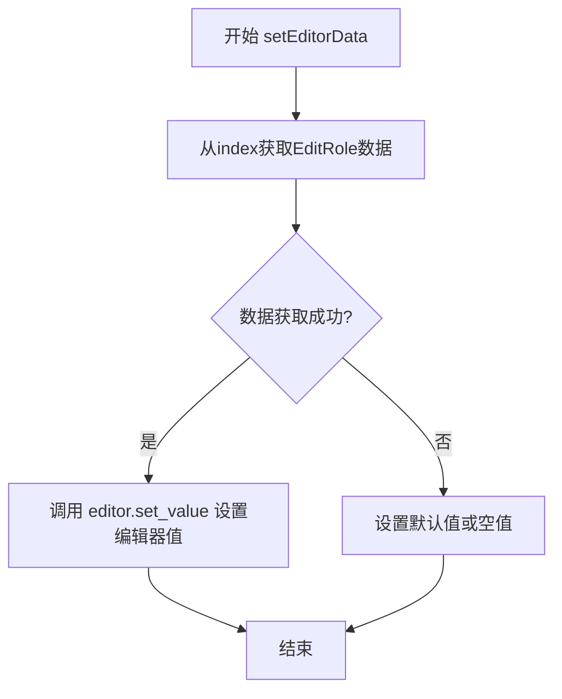

# `comic-translate\app\ui\dayu_widgets\item_view.py` 详细设计文档

该模块封装了基于PySide6的高层次视图组件，包括表格视图(MTableView)、树形视图(MTreeView)、大图视图(MBigView)和列表视图(MListView)，统一处理了表头配置、上下文菜单、空数据渲染、单元格链接交互以及列的可选编辑功能，为Dayu主题应用提供了丰富的UI交互能力。

## 整体流程


## 类结构

```
QtWidgets.QStyledItemDelegate
├── MOptionDelegate (下拉选择委托)
QtWidgets.QTableView
├── MTableView (表格视图)
    ├── set_header_list (混入)
    ├── enable_context_menu (混入)
    ├── slot_context_menu (混入)
    └── mouse_move_event (混入)
QtWidgets.QTreeView
├── MTreeView (树形视图)
    ├── set_header_list (混入)
    ├── enable_context_menu (混入)
    └── ... (类似混入)
QtWidgets.QListView
├── MBigView (大图/图标视图)
    ├── set_header_list (混入)
    ├── scale_size (混入)
    └── wheelEvent (混入)
└── MListView (列表视图)
    ├── set_header_list (混入)
    └── set_show_column (混入)
```

## 全局变量及字段


### `HEADER_SORT_MAP`
    
映射字符串排序方向('asc'/'desc')到Qt排序枚举值

类型：`dict`
    


### `MOptionDelegate.editor`
    
编辑器实例

类型：`QWidget`
    


### `MOptionDelegate.showed`
    
是否已显示

类型：`bool`
    


### `MOptionDelegate.exclusive`
    
是否单选模式

类型：`bool`
    


### `MOptionDelegate.parent_widget`
    
父控件引用

类型：`QWidget`
    


### `MOptionDelegate.arrow_space`
    
箭头图标预留空间

类型：`int`
    


### `MOptionDelegate.arrow_height`
    
箭头图标高度

类型：`int`
    


### `MTableView._no_data_image`
    
空数据时显示的图片

类型：`QPixmap/None`
    


### `MTableView._no_data_text`
    
空数据时显示的文本

类型：`str`
    


### `MTableView.header_list`
    
表头配置列表

类型：`list`
    


### `MTableView.header_view`
    
水平表头对象

类型：`MHeaderView`
    


### `MTreeView._no_data_image`
    
空数据时显示的图片

类型：`QPixmap/None`
    


### `MTreeView._no_data_text`
    
空数据时显示的文本

类型：`str`
    


### `MTreeView.header_list`
    
表头配置列表

类型：`list`
    


### `MTreeView.header_view`
    
水平表头对象

类型：`MHeaderView`
    


### `MBigView._no_data_image`
    
空数据时显示的图片

类型：`QPixmap/None`
    


### `MBigView._no_data_text`
    
空数据时显示的文本

类型：`str`
    


### `MBigView.header_list`
    
表头配置列表

类型：`list`
    


### `MBigView.header_view`
    
水平表头对象

类型：`MHeaderView/None`
    


### `MListView._no_data_image`
    
空数据时显示的图片

类型：`QPixmap/None`
    


### `MListView._no_data_text`
    
空数据时显示的文本

类型：`str`
    


### `MListView.header_list`
    
表头配置列表

类型：`list`
    


### `MListView.header_view`
    
水平表头对象

类型：`MHeaderView/None`
    
    

## 全局函数及方法


### `draw_empty_content`

这是一个用于在 Qt 视图控件（如表格、树形列表）为空时绘制“无数据”占位符的底层绘图函数。它接收视图对象、提示文本和图标，通过计算视图中心位置并结合缩放算法，在视口上绘制居中的图标和文字，以提供友好的用户视觉反馈。

参数：

- `view`：`QtWidgets.QWidget`，要进行绘制的目标视图对象（通常为 `viewport()`）。
- `text`：`str`，可选，要显示的提示文本，默认为 `view.tr("No Data")`（国际化文本）。
- `pix_map`：`MPixmap` 或 `QtGui.QPixmap`，可选，要显示的图标对象，默认为 "empty.svg" 图标文件。

返回值：`None`，该函数直接操作 Qt 绘图设备，不返回值。

#### 流程图

```mermaid
graph TD
    A([开始: draw_empty_content]) --> B{参数 pix_map 是否为空?}
    B -- 是 --> C[使用 MPixmap 加载默认 'empty.svg']
    B -- 否 --> D[使用传入的 pix_map]
    C --> E{参数 text 是否为空?}
    D --> E
    E -- 是 --> F[使用 view.tr 加载默认 'No Data' 文本]
    E -- 否 --> G[使用传入的 text]
    F --> H[创建 QPainter]
    G --> H
    H --> I[获取 font_metrics 和设置画笔颜色]
    I --> J[计算内容高度: pix_map.height + font_metrics.height]
    J --> K[计算视图可用最小尺寸: min(view 高, view 宽) - padding]
    K --> L{内容高度是否超出可用尺寸?}
    L -- 是 --> M[按比例缩放 pix_map 适应剩余空间]
    L -- 否 --> N[保持原有 pix_map 大小]
    M --> O[重新计算调整后的内容高度]
    N --> O
    O --> P[计算绘制坐标: 水平居中, 垂直居中]
    P --> Q[painter.drawText 绘制文字]
    Q --> R[painter.drawPixmap 绘制图标]
    R --> S[painter.end 结束绘图]
    S --> Z([结束])
```

#### 带注释源码

```python
def draw_empty_content(view, text=None, pix_map=None):
    # 导入本地模块（通常用于获取主题颜色配置）
    from . import dayu_theme

    # 如果未提供图标，则加载默认的 'empty.svg' 图片
    pix_map = pix_map or MPixmap("empty.svg")
    # 如果未提供文本，则使用视图的翻译机制获取 "No Data" 字符串
    text = text or view.tr("No Data")
    
    # 创建画家对象，指定要绘制的设备为视图
    painter = QtGui.QPainter(view)
    # 获取字体度量信息，用于计算文字宽高
    font_metrics = painter.fontMetrics()
    
    # 设置画笔颜色为主题中的次级文本颜色
    painter.setPen(QtGui.QPen(QtGui.QColor(dayu_theme.secondary_text_color)))
    
    # 计算总内容高度：图标高度 + 文字高度
    content_height = pix_map.height() + font_metrics.height()
    padding = 10
    
    # 计算视图允许的最小尺寸（取宽高中较小者并减去内边距）
    proper_min_size = min(view.height() - padding * 2, view.width() - padding * 2, content_height)
    
    # 如果计算出的尺寸小于实际内容高度，说明内容溢出，需要缩放图标
    if proper_min_size < content_height:
        # 缩放图标高度为目标高度减去文字高度，保持平滑变换
        pix_map = pix_map.scaledToHeight(proper_min_size - font_metrics.height(), QtCore.Qt.SmoothTransformation)
        # 更新内容高度为新的目标尺寸
        content_height = proper_min_size
        
    # 绘制文本：水平居中，垂直居中计算
    painter.drawText(
        view.width() / 2 - font_metrics.horizontalAdvance(text) / 2,
        view.height() / 2 + content_height / 2 - font_metrics.height() / 2,
        text,
    )
    
    # 绘制图标：水平居中，垂直居中于剩余空间
    painter.drawPixmap(
        view.width() / 2 - pix_map.width() / 2,
        view.height() / 2 - content_height / 2,
        pix_map,
    )
    
    # 结束绘画状态，释放资源
    painter.end()
```


### `set_header_list` / `MTableView.set_header_list` / `MTreeView.set_header_list` / `MBigView.set_header_list` / `MListView.set_header_list`

该函数是一个通用方法，用于配置表格视图的表头属性。它根据传入的 header_list 列表配置每一列的宽度、隐藏状态、排序指示器以及下拉选择委托（用于可编辑的下拉列）。该方法被绑定到 MTableView、MTreeView、MBigView、MListView 四个类上，作为它们的成员方法使用。

参数：

- `self`：视图对象（`MTableView`/`MTreeView`/`MBigView`/`MListView` 的实例），调用此方法的视图本身，用于访问视图的 header_view 和其他属性。
- `header_list`：列表（List），表头配置列表，其中每个元素是一个字典，包含以下可选键值：
  - `key`：列对应的数据属性名（必填）
  - `label`：列显示名称（选填，默认使用 key 的 title()）
  - `width`：列宽度（选填，默认 100）
  - `hide`：是否隐藏该列（选填，默认 False）
  - `order`：排序方式，可选值包括 `"asc"`（升序）、`"desc"`（降序）或直接使用 Qt 的排序常量（选填）
  - `selectable`：该列是否为可选择的下拉框模式（选填，默认 False）
  - `exclusive`：配合 selectable 使用，表示下拉框是否为单选模式（选填，默认 True）

返回值：`None`，该方法无返回值，直接修改视图的内部状态。

#### 流程图


#### 带注释源码

```python
def set_header_list(self, header_list):
    """
    配置表格视图的表头属性（宽度、隐藏、排序、委托）
    
    参数:
        header_list: 表头配置列表，每个元素为包含列属性的字典
    """
    # 获取界面缩放因子，用于计算列宽
    scale_x, _ = get_scale_factor()
    
    # 将配置保存到视图实例属性中，供其他方法（如 mouse_move_event）使用
    self.header_list = header_list
    
    # 检查视图是否拥有 header_view 属性（MBigView 和 MListView 没有）
    if self.header_view:
        # 遍历每一列的配置
        for index, i in enumerate(header_list):
            # 根据配置设置列是否隐藏
            self.header_view.setSectionHidden(index, i.get("hide", False))
            
            # 根据配置设置列宽度，默认 100，应用缩放因子
            self.header_view.resizeSection(index, i.get("width", 100) * scale_x)
            
            # 如果配置了排序属性
            if "order" in i:
                order = i.get("order")
                # 检查 order 是否是 Qt 排序常量（整数值）
                if order in HEADER_SORT_MAP.values():
                    self.header_view.setSortIndicator(index, order)
                # 否则检查是否是字符串 key（"asc" 或 "desc"）
                elif order in HEADER_SORT_MAP:
                    self.header_view.setSortIndicator(index, HEADER_SORT_MAP[order])
            
            # 如果该列需要显示为下拉选择模式
            if i.get("selectable", False):
                # 创建自定义委托实例
                delegate = MOptionDelegate(parent=self)
                # 设置是否为独占模式（单选）
                delegate.set_exclusive(i.get("exclusive", True))
                # 为该列设置委托
                self.setItemDelegateForColumn(index, delegate)
            # 如果该列不需要选择模式，但之前有委托，则移除委托
            elif self.itemDelegateForColumn(index):
                self.setItemDelegateForColumn(index, None)
```


### `enable_context_menu`

该方法是一个通用方法，用于开启或关闭右键菜单策略。当启用时，设置上下文菜单策略为自定义菜单并连接相关信号；当禁用时，设置上下文菜单策略为无。

参数：
- `enable`：`bool`，用于控制是否开启右键菜单（True 为开启，False 为关闭）

返回值：`None`，该方法没有返回值

#### 流程图


#### 带注释源码

```python
def enable_context_menu(self, enable):
    """
    开启或关闭右键菜单策略
    
    参数:
        enable (bool): 是否开启右键菜单
                      True - 开启右键菜单功能
                      False - 关闭右键菜单功能
    
    返回值:
        None
    """
    if enable:
        # 启用：设置上下文菜单策略为自定义菜单模式
        self.setContextMenuPolicy(QtCore.Qt.CustomContextMenu)
        # 连接自定义菜单请求信号到处理槽函数
        self.customContextMenuRequested.connect(self.slot_context_menu)
    else:
        # 禁用：设置上下文菜单策略为无菜单
        self.setContextMenuPolicy(QtCore.Qt.NoContextMenu)
```


### `slot_context_menu`

该方法作为视图（如表格、树形、大图标、列表视图）的槽函数，响应右键点击事件。它负责获取当前鼠标位置的索引，判断是否点击在有效数据行上，收集选中行的数据对象，并最终构造并发射一个包含视图上下文和选中数据的菜单信号（`sig_context_menu`），供外部处理自定义右键菜单逻辑。

参数：

- `self`：`MTableView / MTreeView / MBigView / MListView`，调用此方法的视图实例本身。
- `point`：`QtCore.QPoint`，鼠标右键点击时的屏幕坐标（ Widget 坐标）。

返回值：`None`，该方法通过 `sig_context_menu` 信号传递数据，不直接返回值。

#### 流程图

```mermaid
flowchart TD
    A[用户右键点击视图] --> B{获取 point 处的索引 indexAt}
    B --> C{索引是否有效 isValid?}
    C -- 否 (点击空白区域) --> D[创建空列表 selection=[]]
    C -- 是 (点击数据行) --> E{判断是否使用代理模型 ProxyModel?}
    E -- 是 --> F[遍历选中的行/索引]
    E -- 否 --> F
    F --> G[通过 mapToSource 获取原始索引]
    G --> H[调用 internalPointer 获取数据对象]
    H --> I[将数据对象加入 selection 列表]
    D --> J[构建 ItemViewMenuEvent]
    I --> J
    J --> K[发射 sig_context_menu 信号]
    K --> L[外部槽函数处理菜单显示]
```

#### 带注释源码

```python
@QtCore.Slot(QtCore.QPoint)
def slot_context_menu(self, point):
    """
    处理右键菜单请求的槽函数。
    1. 找到点击位置对应的模型索引。
    2. 如果有效，遍历选中的行，提取数据对象。
    3. 如果无效（空白处），传入空列表。
    4. 发射 sig_context_menu 信号以显示自定义菜单。
    """
    # 获取点击位置对应的代理索引（如果是代理模型）或直接索引
    proxy_index = self.indexAt(point)
    
    # 判断索引是否有效（即是否点击在了数据行上）
    if proxy_index.isValid():
        # 检查当前模型是否为排序/过滤代理模型
        need_map = isinstance(self.model(), QtCore.QSortFilterProxyModel)
        selection = []
        
        # 优先获取选中的行（selectedRows），如果没有行选中则获取所有选中的索引
        # 注意：这里使用了 'or' 的短路特性
        selected_items = self.selectionModel().selectedRows() or self.selectionModel().selectedIndexes()
        
        # 遍历所有选中的索引
        for index in selected_items:
            # 如果使用了代理模型，需要将代理索引映射回源模型索引
            # 如果没有使用代理模型，直接使用当前索引
            source_index = self.model().mapToSource(index) if need_map else index
            
            # 获取索引内部指针，指向存储的底层数据对象（通常是 Python 对象）
            data_obj = source_index.internalPointer()
            
            # 将数据对象添加到选中列表中
            selection.append(data_obj)
            
        # 构造菜单事件，包含视图本身、选中的数据对象列表以及额外的扩展数据（这里为空字典）
        event = utils.ItemViewMenuEvent(view=self, selection=selection, extra={})
        # 发射上下文菜单信号，通知外界可以显示菜单了
        self.sig_context_menu.emit(event)
    else:
        # 如果点击在空白区域（无效索引），同样发射信号，但传入空的 selection
        # 这样外部可以据此显示例如“刷新”、“全选”等不依赖具体数据的菜单项
        event = utils.ItemViewMenuEvent(view=self, selection=[], extra={})
        self.sig_context_menu.emit(event)
```


### `mouse_move_event`

该方法是 MTableView（及相关视图类）的鼠标移动事件处理函数，用于检测鼠标所在单元格是否为链接列，并在满足条件时将光标切换为手型指针，以提示用户该单元格可点击。

参数：

- `self`：调用此方法的视图实例本身（MTableView / MTreeView / MBigView / MListView）
- `event`：`QtGui.QMouseEvent`，包含鼠标事件的详细信息（如位置、按钮状态等）

返回值：`None`，该方法直接修改视图的光标状态，不返回任何值

#### 流程图

```mermaid
flowchart TD
    A[开始: mouse_move_event] --> B[获取鼠标位置对应的索引: indexAt]
    B --> C[转换为真实索引: real_index]
    C --> D{检查列是否为链接列: header_list[column].is_link}
    D -->|否| L[设置光标为普通箭头: ArrowCursor]
    D -->|是| E[获取链接属性名: attr]
    E --> F[获取数据对象: data_list[row]]
    F --> G[获取属性值: get_obj_value]
    G --> H{属性值是否存在}
    H -->|否| L
    H -->|是| I[设置光标为手型指针: PointingHandCursor]
    I --> J[返回]
    L --> J
```

#### 带注释源码

```python
def mouse_move_event(self, event):
    """
    处理鼠标移动事件，检测当前鼠标所在列是否为链接列，
    若是则将光标设置为手型指针，提示用户可点击。
    """
    # 通过鼠标事件的位置获取对应的模型索引
    index = self.indexAt(event.pos())
    
    # 将代理模型索引转换为真实模型索引（处理 QSortFilterProxyModel 的情况）
    real_index = utils.real_index(index)
    
    # 判断当前列是否被配置为链接列（is_link 标志）
    if self.header_list[real_index.column()].get("is_link", False):
        # 获取该列对应的数据属性名
        key_name = self.header_list[real_index.column()]["attr"]
        
        # 从模型的数据列表中获取对应行的数据对象
        data_obj = utils.real_model(self.model()).data_list[real_index.row()]
        
        # 读取数据对象的指定属性值
        value = utils.get_obj_value(data_obj, key_name)
        
        # 若属性值存在（非空），则表示该单元格为有效链接
        if value:
            # 设置光标为手型指针，提示用户可点击
            self.setCursor(QtCore.Qt.PointingHandCursor)
            return
    
    # 非链接列或属性值为空时，恢复为普通箭头光标
    self.setCursor(QtCore.Qt.ArrowCursor)
```


### `mouse_release_event`

处理表格视图中链接列的点击事件。当用户在标记为 `is_link` 的列上释放鼠标左键时，该方法会根据对应数据的属性值（字典、字符串或列表）发射 `sig_link_clicked` 信号，以触发外部定义的链接处理逻辑。

参数：

- `self`：`MTableView`，指向当前的表格视图实例。
- `event`：`QtGui.QMouseEvent`，Qt鼠标事件对象，包含了点击的位置（pos）和点击的按钮（button）信息。

返回值：`None`，该方法通过修改视图状态或发射信号来响应事件，不返回数值。

#### 流程图


#### 带注释源码

```python
def mouse_release_event(self, event):
    """
    处理链接列的点击事件。
    """
    # 检查是否为鼠标左键点击。如果不是，调用父类方法并直接返回，
    # 避免触发链接逻辑（例如右键或中键点击）。
    if event.button() != QtCore.Qt.LeftButton:
        QtWidgets.QTableView.mouseReleaseEvent(self, event)
        return

    # 获取鼠标当前位置对应的模型索引
    index = self.indexAt(event.pos())
    # 将代理模型（如果有）的索引转换为实际模型索引
    real_index = utils.real_index(index)
    
    # 检查该列是否在配置中被标记为链接列 (is_link)
    # 注意：原代码中此处变量名为 headerList (大写L)，但类中定义及类似方法中多使用 header_list (小写l)，疑似笔误
    if self.headerList[real_index.column()].get("is_link", False):
        # 从列配置中获取需要读取的数据属性名 (attr)
        key_name = self.header_list[real_index.column()]["attr"]
        
        # 获取数据对象：先获取真实模型，再根据行号定位数据行
        data_obj = utils.real_model(self.model()).data_list[real_index.row()]
        
        # 使用属性名从数据对象中提取具体的值
        value = utils.get_obj_value(data_obj, key_name)
        
        # 如果值存在，则根据其类型发射信号
        if value:
            if isinstance(value, dict):
                # 如果值是字典，直接将字典内容作为信号参数发射（通常包含URL等）
                self.sig_link_clicked.emit(value)
            elif isinstance(value, six.string_types):
                # 如果值是字符串，通常发射整行数据对象，以便外部获取更多上下文
                self.sig_link_clicked.emit(data_obj)
            elif isinstance(value, list):
                # 如果值是列表（例如多个链接），遍历列表依次发射信号
                for i in value:
                    self.sig_link_clicked.emit(i)
```


### `MOptionDelegate.set_exclusive`

设置是否为单选模式，用于控制下拉选项菜单（MMenu）的选择模式。当 `flag` 为 `True` 时，下拉菜单为单选模式，用户只能选择一个选项；当 `flag` 为 `False` 时，下拉菜单为多选模式，用户可以选择多个选项。

参数：

- `flag`：`bool`，设置是否为单选模式，`True` 表示单选模式，`False` 表示多选模式

返回值：`None`，无返回值，该方法直接修改实例属性 `self.exclusive`

#### 流程图


#### 带注释源码

```python
def set_exclusive(self, flag):
    """
    设置是否为单选模式
    
    该方法用于配置 MOptionDelegate 所创建的下拉编辑器（MMenu）的选择模式。
    当 exclusive 为 True 时，下拉菜单为单选模式，用户只能从下拉列表中选择一个选项；
    当 exclusive 为 False 时，下拉菜单为多选模式，用户可以同时选择多个选项。
    
    参数:
        flag: bool, 设置是否为单选模式。True 表示单选模式，False 表示多选模式
    
    返回值:
        None, 无返回值，直接修改实例属性 self.exclusive
    """
    # 将传入的 flag 参数值赋给实例属性 exclusive
    # 该属性会在 createEditor 方法中被传递给 MMenu 构造函数
    self.exclusive = flag
```


### `MOptionDelegate.createEditor`

该方法是Qt QStyledItemDelegate的核心实现，用于在表格单元格中创建下拉菜单编辑器。当用户双击带有下拉选项的单元格时，此方法会被调用，创建一个MMenu对象作为编辑器，并从数据模型中获取可选值列表，同时关联值变更信号以触发数据提交。

参数：

- `parent`：`QWidget`，父窗口部件，即触发编辑的表格视图
- `option`：`QStyleOptionViewItem`，样式选项，包含单元格的位置和状态信息
- `index`：`QModelIndex`，模型索引，用于定位当前编辑的单元格及其关联的数据

返回值：`QWidget`，返回创建的MMenu编辑器对象，用于替代默认的单元格编辑器

#### 流程图

```mermaid
flowchart TD
    A[开始 createEditor] --> B[保存父窗口部件到 parent_widget]
    B --> C[创建 MMenu 编辑器<br/>exclusive=self.exclusive]
    C --> D[设置窗口标志<br/>FramelessWindowHint | Window]
    D --> E[获取数据模型 model]
    E --> F[获取真实索引 real_index]
    F --> G[获取数据对象 data_obj]
    G --> H[根据列名构建属性名 attr]
    H --> I[从数据对象获取选项列表]
    I --> J[设置编辑器数据 set_data]
    J --> K[连接值变更信号到提交槽函数]
    K --> L[返回编辑器对象]
```

#### 带注释源码

```python
def createEditor(self, parent, option, index):
    """
    创建下拉菜单编辑器
    当用户双击可选择的单元格时，Qt框架会自动调用此方法创建编辑器
    
    参数:
        parent: QWidget - 父窗口部件，通常是触发编辑的表格视图
        option: QStyleOptionViewItem - 样式选项，包含单元格几何信息
        index: QModelIndex - 模型索引，用于定位单元格和获取数据
    
    返回:
        QWidget - 创建的MMenu编辑器对象
    """
    # 1. 保存父窗口部件的引用，用于后续定位编辑器位置
    self.parent_widget = parent
    
    # 2. 创建MMenu编辑器实例，传入互斥标志和父部件
    # exclusive=True表示单选模式，False表示多选模式
    self.editor = MMenu(exclusive=self.exclusive, parent=parent)
    
    # 3. 设置窗口标志为无边框窗口，使其可以作为弹出式下拉菜单
    # FramblelessWindowHint: 无边框
    # Window: 作为独立窗口（用于弹出显示）
    self.editor.setWindowFlags(QtCore.Qt.FramelessWindowHint | QtCore.Qt.Window)
    
    # 4. 从index获取底层数据模型，处理可能存在的代理模型
    model = utils.real_model(index)
    
    # 5. 获取真实索引，处理可能存在的代理模型映射
    real_index = utils.real_index(index)
    
    # 6. 获取数据对象（包含具体业务数据的对象）
    data_obj = real_index.internalPointer()
    
    # 7. 构建属性名，格式为"{key}_list"
    # 例如：如果列的key是"status"，则属性名为"status_list"
    # 这对应数据对象中存储下拉选项列表的属性
    attr = "{}_list".format(model.header_list[real_index.column()].get("key"))
    
    # 8. 从数据对象获取下拉选项列表
    # 如果属性不存在或为空，返回空列表作为默认值
    self.editor.set_data(utils.get_obj_value(data_obj, attr, []))
    
    # 9. 连接值变更信号到编辑完成槽函数
    # 当用户选择新值后，自动触发数据提交
    self.editor.sig_value_changed.connect(self._slot_finish_edit)
    
    # 10. 返回创建的编辑器对象
    return self.editor
```


### `MOptionDelegate.setEditorData`

从模型中加载数据到编辑器（ComboBox/Dropdown）中，以便在编辑模式下显示当前的值。

参数：

- `editor`：`MMenu`，编辑器widget实例，由`createEditor`方法创建，用于显示和编辑数据
- `index`：`QtCore.QModelIndex`，指向模型中当前单元格的索引，用于获取要编辑的数据

返回值：`None`（无返回值），该方法通过副作用设置编辑器的值

#### 流程图



#### 带注释源码

```python
def setEditorData(self, editor, index):
    """
    从模型加载数据到编辑器中。
    
    当用户开始编辑单元格时，Qt框架会调用此方法将模型中的当前值
    加载到编辑器widget中，以便用户可以修改该值。
    
    参数:
        editor: MMenu类型的编辑器widget，用于显示和编辑下拉选项
        index: QModelIndex对象，指向模型中当前要编辑的单元格
    
    返回值:
        None
    
    示例:
        # 假设模型中某单元格存储的值为 "option1"
        # 此方法会将该值加载到下拉菜单编辑器中
    """
    # 使用Qt.EditRole从模型获取当前编辑值
    # Qt.EditRole返回用于在编辑器中显示和编辑的数据
    current_value = index.data(QtCore.Qt.EditRole)
    
    # 将获取到的值设置到编辑器中
    # MMenu.set_value()方法会根据传入的值选中对应的选项
    editor.set_value(current_value)
```


### `MOptionDelegate.setModelData`

该方法是将自定义编辑器（如下拉菜单）中的数据写回到底层数据模型的核心方法，通过获取编辑器的 `value` 属性并调用模型的 `setData` 方法实现数据同步。

参数：

- `editor`：`MMenu`，自定义的编辑器对象，通常为下拉菜单组件，用于编辑表格单元格的选项值
- `model`：`QtCore.QAbstractItemModel`，Qt 模型对象，负责管理数据存储和访问
- `index`：`QtCore.QModelIndex`，模型索引，指定要写入数据的单元格位置

返回值：`None`，该方法无返回值，直接修改模型内部数据

#### 流程图


#### 带注释源码

```python
def setModelData(self, editor, model, index):
    """
    将编辑器中的数据写回模型
    该方法在用户完成编辑后被调用，负责将编辑器中用户选择的数据
    同步到底层的 Qt 数据模型中
    
    参数:
        editor: MMenu类型，自定义的下拉菜单编辑器对象
        model: Qt数据模型对象，用于存储表格数据
        index: QModelIndex，指向当前编辑单元格的模型索引
    
    返回:
        无返回值
    """
    # 从编辑器组件中获取名为"value"的属性值
    # 这个值是用户在编辑器中选择或输入的数据
    model.setData(index, editor.property("value"))
    # 调用模型的setData方法，将获取的值写入模型指定位置
    # index指定了要写入的单元格位置
    # editor.property("value")获取编辑器当前的值
```


### `MOptionDelegate.updateEditorGeometry`

该方法用于在表格单元格激活编辑时，更新下拉菜单编辑器的位置，将其移动到对应单元格区域的正下方，确保编辑器正确显示在用户交互的位置。

参数：

- `editor`：`QtWidgets.QWidget`，编辑器对象，此处为 MMenu 下拉菜单实例
- `option`：`QtWidgets.QStyleOptionViewItem`，包含单元格样式和几何信息的选项对象
- `index`：`QtCore.QModelIndex`，模型索引，用于定位数据项

返回值：`None`，无返回值，该方法直接修改编辑器的位置属性

#### 流程图


#### 带注释源码

```python
def updateEditorGeometry(self, editor, option, index):
    """
    更新编辑器几何位置
    
    该方法在QStyledItemDelegate编辑开始时被调用，
    用于确定下拉菜单编辑器应该显示的位置。
    这里将编辑器放置在触发编辑的单元格正下方。
    
    参数:
        editor: QWidget - 编辑器对象（MMenu下拉菜单）
        option: QStyleOptionViewItem - 包含单元格几何信息的选项
        index: QModelIndex - 模型索引
    """
    # 使用 QPoint 计算编辑器的新位置
    # x 坐标使用单元格的 x 坐标
    # y 坐标使用单元格的 y 坐标 + 单元格高度（即单元格底部）
    # 这样下拉菜单会显示在单元格的下方
    editor.move(
        # mapToGlobal 将局部坐标（相对于父组件）转换为全局屏幕坐标
        # 因为编辑器是独立窗口（FramelessWindowHint），需要全局坐标来定位
        self.parent_widget.mapToGlobal(
            QtCore.QPoint(
                option.rect.x(),                          # 单元格的X坐标
                option.rect.y() + option.rect.height()    # 单元格底部Y坐标
            )
        )
    )
```


### `MOptionDelegate.paint`

该方法负责在表格单元格内绘制下拉箭头图标，根据鼠标悬停和选中状态动态调整背景色和图标颜色，为可编辑列提供视觉反馈。

参数：

- `painter`：`QtGui.QPainter`，用于在单元格上绘制图形的画家对象
- `option`：`QtWidgets.QStyleOptionViewItem`，包含单元格的样式选项和状态信息（如是否鼠标悬停、是否选中）
- `index`：`QtCore.QModelIndex`，指向数据模型中当前单元格的索引

返回值：`None`，该方法为 void 类型，直接在 painter 上绘制图形

#### 流程图


#### 带注释源码

```python
def paint(self, painter, option, index):
    """
    绘制单元格内的下拉箭头
    
    Args:
        painter: QtGui.QPainter，用于绘图的画家对象
        option: QtWidgets.QStyleOptionViewItem，包含单元格样式和状态
        index: QtCore.QModelIndex，指向数据模型中的单元格
    """
    # 1. 保存当前 painter 状态，避免影响后续绘制
    painter.save()
    
    # 2. 获取默认图标颜色
    icon_color = dayu_theme.icon_color
    
    # 3. 检查鼠标悬停状态
    if option.state & QtWidgets.QStyle.State_MouseOver:
        # 鼠标悬停时，填充主题色 primary_5 作为背景
        painter.fillRect(option.rect, QtGui.QColor(dayu_theme.primary_5))
        # 悬停时图标反白显示
        icon_color = "#fff"
    
    # 4. 检查选中状态
    if option.state & QtWidgets.QStyle.State_Selected:
        # 选中时，填充主题色 primary_6 作为背景
        painter.fillRect(option.rect, QtGui.QColor(dayu_theme.primary_6))
        # 选中时图标也反白显示
        icon_color = "#fff"
    
    # 5. 开启抗锯齿渲染，提高图形质量
    painter.setRenderHint(QtGui.QPainter.Antialiasing)
    
    # 6. 设置无边框（NoPen），只使用画刷填充
    painter.setPen(QtCore.Qt.NoPen)
    painter.setBrush(QtGui.QBrush(QtCore.Qt.white))
    
    # 7. 创建下拉箭头图标，使用动态计算的 icon_color
    pix = MPixmap("down_fill.svg", icon_color)
    
    # 8. 获取单元格高度作为参考尺寸
    h = option.rect.height()
    
    # 9. 将图标缩放到单元格高度的 50%
    pix = pix.scaledToWidth(h * 0.5, QtCore.Qt.SmoothTransformation)
    
    # 10. 绘制图标到单元格右侧位置
    # x 坐标：右边缘减去一个单元格高度
    # y 坐标：顶部向下偏移 1/4 单元格高度以垂直居中
    painter.drawPixmap(
        option.rect.x() + option.rect.width() - h,  # x: 右侧位置
        option.rect.y() + h / 4,                     # y: 垂直居中
        pix
    )
    
    # 11. 恢复 painter 到之前保存的状态
    painter.restore()
    
    # 12. 调用父类方法完成默认的单元格内容绘制
    super(MOptionDelegate, self).paint(painter, option, index)
```


### `MOptionDelegate._slot_finish_edit`

这是一个槽函数（Slot），用于响应嵌入的下拉菜单编辑器（`MMenu`）的值变更信号。当用户在表格单元格的下拉框中选中新的选项时，`MMenu` 会发出 `sig_value_changed` 信号，触发该方法。该方法的主要职责是向Qt的模型/视图框架发出 `commitData` 信号，告知视图数据编辑已经完成，并将编辑器实例传递给视图以便提取新值更新数据模型。

参数：

-  `obj`：`object`，从 `MMenu.sig_value_changed` 信号接收的对象，通常代表新选择的值。虽然在方法内部未直接使用该参数，但其作为槽函数参数必须存在以匹配信号签名。

返回值：`None`（无返回值），该方法通过Qt信号机制触发后续数据更新流程，本身不返回任何数据。

#### 流程图


#### 带注释源码

```python
@QtCore.Slot(object)
def _slot_finish_edit(self, obj):
    """
    槽函数：当编辑器（MMenu）的值发生改变时调用。
    负责提交数据并结束编辑状态。

    参数:
        obj: 接收到的信号对象，通常为变更后的数据值，
             在此处实际逻辑中未直接使用，仅作信号槽连接之用。
    """
    # 发出 commitData 信号，这是 Qt Item Views 标准机制的一部分。
    # 它告诉调用此委托的视图，编辑器中的数据现在应该被提交回模型。
    # 传递 self.editor 是为了方便视图或模型获取最新的数据。
    self.commitData.emit(self.editor)
```


### `MOptionDelegate.sizeHint`

该方法重写自 `QStyledItemDelegate`，用于返回单元格的大小提示。实现时在父类返回的尺寸基础上额外增加 `arrow_space`（箭头占用的宽度），从而保证在绘制下拉箭头时不被裁剪。

**参数：**

- `option`：`QStyleOptionViewItem`，Qt 样式选项，描述该项的绘制状态、大小等属性。  
- `index`：`QModelIndex`，模型索引，指向对应单元格的数据。

**返回值：** `QtCore.QSize`，返回包含箭头宽度在内的单元格建议尺寸。

#### 流程图

```mermaid
flowchart TD
    A[Start] --> B[调用父类 sizeHint 获取原始尺寸 orig]
    B --> C[从 orig 中取出宽度和高度]
    C --> D[计算新宽度 = orig.width + self.arrow_space]
    D --> E[创建新 QSize(new_width, orig.height)]
    E --> F[返回新 QSize]
```

#### 带注释源码

```python
def sizeHint(self, option, index):
    """
    返回单元格的尺寸提示，包含下拉箭头所需的额外宽度。

    :param option: QStyleOptionViewItem，项的样式选项（包含矩形、状态等信息）
    :param index: QModelIndex，模型索引，指向具体的单元格
    :return: QtCore.QSize，增加 arrow_space 后的尺寸
    """
    # 1. 调用父类（QStyledItemDelegate）实现的 sizeHint，得到默认的尺寸
    orig = super(MOptionDelegate, self).sizeHint(option, index)

    # 2. 在宽度的方向上额外加上 arrow_space（该值在 __init__ 中被设为 20），
    #    以确保下拉箭头有足够的绘制空间
    new_width = orig.width() + self.arrow_space

    # 3. 高度保持不变，直接使用原始高度
    new_height = orig.height()

    # 4. 构造并返回新的 QSize 对象
    return QtCore.QSize(new_width, new_height)
```


### `MTableView.__init__`

初始化表格视图，配置垂直和水平标题视图，设置排序、选择行为和交替行颜色等属性。

参数：

- `size`：`int` 或 `None`，表格视图的默认大小（用于设置行高和列头高度），默认为 `dayu_theme.default_size`
- `show_row_count`：`bool`，是否显示行号列，默认为 `False`
- `parent`：`QtWidgets.QWidget` 或 `None`，父窗口部件，默认为 `None`

返回值：`None`，无返回值（`__init__` 方法）

#### 流程图


#### 带注释源码

```python
def __init__(self, size=None, show_row_count=False, parent=None):
    # 调用父类 QTableView 的初始化方法，传入 parent 作为父窗口部件
    super(MTableView, self).__init__(parent)
    
    # 初始化无数据时显示的图片为 None（稍后可设置）
    self._no_data_image = None
    
    # 初始化无数据时显示的文本为 "No Data"（使用 Qt 的 tr() 进行国际化）
    self._no_data_text = self.tr("No Data")
    
    # 如果未传入 size，则使用主题中的默认大小
    size = size or dayu_theme.default_size
    
    # 创建垂直标题视图（行号列），设置父窗口为自身
    ver_header_view = MHeaderView(QtCore.Qt.Vertical, parent=self)
    
    # 设置垂直标题视图的默认行高为 size
    ver_header_view.setDefaultSectionSize(size)
    
    # 隐藏垂直标题视图的排序指示器
    ver_header_view.setSortIndicatorShown(False)
    
    # 将垂直标题视图设置到表格视图
    self.setVerticalHeader(ver_header_view)
    
    # 初始化列头配置列表（用于存储每列的属性配置）
    self.header_list = []
    
    # 创建水平标题视图（列头），设置父窗口为自身
    self.header_view = MHeaderView(QtCore.Qt.Horizontal, parent=self)
    
    # 设置水平标题视图的固定高度为 size
    self.header_view.setFixedHeight(size)
    
    # 根据 show_row_count 参数决定是否显示行号列
    if not show_row_count:
        ver_header_view.hide()  # 隐藏垂直标题视图
    
    # 将水平标题视图设置到表格视图
    self.setHorizontalHeader(self.header_view)
    
    # 启用列排序功能
    self.setSortingEnabled(True)
    
    # 设置选择行为为按行选择（选中整行而非单个单元格）
    self.setSelectionBehavior(QtWidgets.QAbstractItemView.SelectRows)
    
    # 启用交替行颜色（奇偶行不同背景色）
    self.setAlternatingRowColors(True)
    
    # 隐藏网格线
    self.setShowGrid(False)
```


### `MTableView.set_no_data_text`

该方法用于设置 `MTableView` 表格组件在无数据（空状态）时显示的提示文本内容。它通过更新实例属性 `_no_data_text` 来实现，该属性随后会在 `paintEvent` 绘制事件中被 `draw_empty_content` 函数调用以渲染界面。

参数：

- `text`：`str`，需要显示的空数据提示文本（支持 Qt 本地化字符串）。

返回值：`None`，该方法无返回值，仅更新内部状态。

#### 流程图


#### 带注释源码

```python
def set_no_data_text(self, text):
    """
    设置无数据时显示的文本。
    
    参数:
        text (str): 将在表格视图中显示的提示信息。
    """
    # 将传入的 text 参数赋值给实例变量 _no_data_text
    # 该变量在 paintEvent 中被 draw_empty_content 函数使用
    self._no_data_text = text
```


### `MTableView.set_no_data_image`

设置空数据时显示的图片，用于在表格无数据时展示自定义的占位图。

参数：

- `image`：图像对象，设置为空数据时显示的图片，支持 Qt 的图像类型（如 QPixmap、QImage 等）或自定义图像对象

返回值：`无（None）`，该方法为 setter 方法，仅执行赋值操作，不返回任何值

#### 流程图


#### 带注释源码

```python
def set_no_data_image(self, image):
    """
    设置空数据时显示的图片
    
    该方法用于自定义表格在无数据时显示的占位图片。
    图片会在 paintEvent 中被 draw_empty_content 函数使用。
    
    参数:
        image: 图像对象,可以是 Qt 的 QPixmap、QImage 或其他图像类型
               如果为 None,则使用默认的 empty.svg
    返回值:
        无
    """
    self._no_data_image = image  # 将传入的图像赋值给实例变量
```

#### 上下文关联源码

```python
class MTableView(QtWidgets.QTableView):
    # ... 其他代码 ...
    
    def __init__(self, size=None, show_row_count=False, parent=None):
        super(MTableView, self).__init__(parent)
        self._no_data_image = None  # 初始化为空数据图片变量
        self._no_data_text = self.tr("No Data")
        # ... 其他初始化代码 ...
    
    def set_no_data_image(self, image):
        """设置空数据时显示的图片"""
        self._no_data_image = image
    
    def paintEvent(self, event):
        """Override paintEvent when there is no data to show, draw the preset picture and text."""
        model = utils.real_model(self.model())
        if model is None:
            draw_empty_content(self.viewport(), self._no_data_text, self._no_data_image)
        elif isinstance(model, MTableModel):
            if not model.get_data_list():
                draw_empty_content(self.viewport(), self._no_data_text, self._no_data_image)
        return super(MTableView, self).paintEvent(event)
```


### `MTableView.setShowGrid`

该方法用于重写Qt原生表格的setShowGrid功能，通过同步设置水平表头、垂直表头的grid属性，并刷新样式，从而实现表头网格样式的统一控制。

参数：

- `flag`：`bool`，控制是否显示表格网格的标志，True显示网格，False隐藏网格

返回值：`bool`，返回父类QTableView.setShowGrid的返回值（通常为None）

#### 流程图


#### 带注释源码

```python
def setShowGrid(self, flag):
    """
    重写setShowGrid方法，同步设置表头网格样式
    
    该方法覆盖了QTableView的setShowGrid，在显示/隐藏表格网格的同时，
    同步更新水平表头header_view和垂直表头verticalHeader的grid属性，
    并通过样式刷新确保表头网格样式与表格网格样式保持一致。
    
    参数:
        flag: bool类型，控制是否显示表格网格
    """
    # 设置水平表头的grid属性
    self.header_view.setProperty("grid", flag)
    # 设置垂直表头的grid属性
    self.verticalHeader().setProperty("grid", flag)
    # 刷新水平表头的样式，使属性生效
    self.header_view.style().polish(self.header_view)

    # 调用父类方法设置表格网格，并返回其返回值
    return super(MTableView, self).setShowGrid(flag)
```


### `MTableView.paintEvent(event)`

该方法重写了 Qt 表视图的绘制事件，用于在数据模型为空时自定义绘制“暂无数据”的占位图和文本提示。如果模型存在且包含数据，则调用父类的默认绘制逻辑。

参数：

-  `event`：`QtGui.QPaintEvent`，Qt 库传递的绘制事件对象，包含了需要重绘的区域信息。

返回值：`None`，无返回值（Python 中默认为 None）。

#### 流程图


#### 带注释源码

```python
def paintEvent(self, event):
    """Override paintEvent when there is no data to show, draw the preset picture and text."""
    # 1. 获取真实的数据模型 (处理代理模型的情况)
    model = utils.real_model(self.model())
    
    # 2. 检查模型是否存在
    if model is None:
        # 如果模型为空（例如未设置模型），绘制空状态
        draw_empty_content(self.viewport(), self._no_data_text, self._no_data_image)
    # 3. 检查模型类型及数据是否为空
    elif isinstance(model, MTableModel):
        # 如果是自定义的 MTableModel，检查其内部数据列表
        if not model.get_data_list():
            # 如果数据列表为空，绘制空状态
            draw_empty_content(self.viewport(), self._no_data_text, self._no_data_image)
            
    # 4. 如果不满足上述空状态条件，则调用父类 (QtWidgets.QTableView) 的默认绘制方法
    #    执行标准的表格绘制逻辑 (绘制表头、网格、单元格内容等)
    return super(MTableView, self).paintEvent(event)
```


### `MTableView.save_state`

保存表头视图的状态到本地配置文件，以便在下次加载时恢复表头的列顺序、宽度和可见性等状态。

参数：

- `name`：`str`，用于标识配置项的名称，作为配置键的前缀

返回值：`None`，该方法没有返回值，仅执行配置保存操作

#### 流程图

```mermaid
flowchart TD
    A[开始保存表头状态] --> B[创建QSettings对象]
    B --> C[设置配置格式为IniFormat]
    C --> D[调用header_view.saveState获取当前表头状态]
    D --> E[构建配置键: name/headerState]
    E --> F[将状态保存到本地配置文件]
    F --> G[结束]
```

#### 带注释源码

```python
def save_state(self, name):
    # 创建一个QSettings实例，用于持久化存储配置
    # 参数说明：
    #   - IniFormat: 使用INI文件格式存储
    #   - UserScope: 只对当前用户可见
    #   - "DAYU": 应用程序名称
    #   - ".": 组织名称（这里使用点号作为占位）
    settings = QtCore.QSettings(
        QtCore.QSettings.IniFormat,
        QtCore.QSettings.UserScope,
        "DAYU",
        ".",
    )
    # 使用name作为配置键的前缀，将表头状态保存到本地
    # headerState是固定的配置键名，用于存储表头视图的状态
    # self.header_view.saveState()返回一个QByteArray，包含表头的所有状态信息
    # 注意：这里format的第二个参数应该是self.header_view.saveState()
    # 原代码存在bug：format参数顺序错误
    settings.setValue("{}/headerState".format(name), self.header_view.saveState())
```


### `MTableView.load_state`

从本地配置（QSettings）加载表头状态信息，包括列的宽度、排序顺序、隐藏状态等，并使用这些状态恢复表头视图。

参数：

- `name`：`str`，用于标识表头状态的名称，作为 QSettings 中的键前缀

返回值：`None`，该方法仅执行状态恢复操作，无返回值

#### 流程图

```mermaid
flowchart TD
    A[开始 load_state] --> B[创建 QSettings 实例]
    B --> C[构建设置键: {name}/headerState]
    C --> D{检查设置值是否存在}
    D -->|值存在| E[获取保存的头部状态]
    E --> F[调用 header_view.restoreState 恢复状态]
    F --> G[结束]
    D -->|值不存在| G
```

#### 带注释源码

```python
def load_state(self, name):
    """
    从本地配置加载表头状态。
    
    参数:
        name: str, 用于标识表头状态的名称，作为 QSettings 中的键前缀
    """
    # 创建 QSettings 实例，使用 Ini 格式存储在用户作用域
    settings = QtCore.QSettings(
        QtCore.QSettings.IniFormat,
        QtCore.QSettings.UserScope,
        "DAYU",
        ".",
    )
    # 检查对应的设置值是否存在
    if settings.value("{}/headerState".format(name)):
        # 如果存在，则从设置中恢复表头状态
        self.header_view.restoreState(settings.value("{}/headerState".format(name)))
```


### `MTableView.set_header_list`

该方法用于动态设置表格视图的列配置信息，包括列的显示与隐藏、宽度调整、排序指示器以及可选的下拉选择功能，从而实现对表格列的灵活控制。

参数：
- `self`：`MTableView` 实例，当前表格视图对象。
- `header_list`：`list[dict]`，列配置列表，每个字典包含列的属性（如 `key`、`label`、`width`、`hide`、`order`、`selectable` 等）。

返回值：`None`，无返回值。

#### 流程图

```mermaid
graph TD
    A[开始 set_header_list] --> B[获取缩放因子 scale_x]
    B --> C[设置 self.header_list = header_list]
    C --> D{header_view 是否存在}
    D -->|是| E[遍历 header_list]
    D -->|否| H[结束]
    E --> F[设置列隐藏状态和宽度]
    F --> G{是否包含 order}
    G -->|是| I[设置排序指示器]
    G -->|否| J{是否 selectable}
    I --> J
    J -->|是| K[创建 MOptionDelegate 并设置列代理]
    J -->|否| L{该列是否有代理}
    K --> M[设置代理到指定列]
    L -->|是| N[移除该列代理]
    L -->|否| E
    M --> E
    N --> E
```

#### 带注释源码

```python
def set_header_list(self, header_list):
    # 获取水平方向的缩放因子，用于调整列宽
    scale_x, _ = get_scale_factor()
    # 将传入的 header_list 保存到实例属性中
    self.header_list = header_list
    # 如果存在水平头视图（header_view），则进行列配置
    if self.header_view:
        # 遍历 header_list 中的每一列配置
        for index, i in enumerate(header_list):
            # 根据配置设置列是否隐藏，默认为 False（显示）
            self.header_view.setSectionHidden(index, i.get("hide", False))
            # 根据配置调整列宽，默认宽度为 100，并乘以缩放因子
            self.header_view.resizeSection(index, i.get("width", 100) * scale_x)
            # 如果配置中包含排序指示（order）
            if "order" in i:
                order = i.get("order")
                # 如果 order 已经是排序枚举值，直接设置
                if order in HEADER_SORT_MAP.values():
                    self.header_view.setSortIndicator(index, order)
                # 如果 order 是字符串（如 "asc" 或 "desc"），转换为排序枚举值
                elif order in HEADER_SORT_MAP:
                    self.header_view.setSortIndicator(index, HEADER_SORT_MAP[order])
            # 如果该列被标记为可选（selectable），则设置下拉选择代理
            if i.get("selectable", False):
                # 创建 MOptionDelegate 实例
                delegate = MOptionDelegate(parent=self)
                # 设置是否为独占模式（单选），默认为 True
                delegate.set_exclusive(i.get("exclusive", True))
                # 将代理设置给对应的列
                self.setItemDelegateForColumn(index, delegate)
            # 如果该列不是可选的，但已有代理，则移除代理
            elif self.itemDelegateForColumn(index):
                self.setItemDelegateForColumn(index, None)
```


### `MTableView.enable_context_menu`

该函数用于启用或禁用表格视图的右键上下文菜单功能。当启用时，会设置上下文菜单策略为自定义菜单，并连接到槽函数处理菜单请求；当禁用时，则关闭上下文菜单功能。

参数：

- `enable`：`bool`，布尔值参数，为 `True` 时启用右键菜单，为 `False` 时禁用右键菜单

返回值：`None`，该方法无返回值，仅修改组件状态

#### 流程图

```mermaid
flowchart TD
    A[开始 enable_context_menu] --> B{enable 为 True?}
    B -->|是| C[设置上下文菜单策略为 CustomContextMenu]
    C --> D[连接 customContextMenuRequested 信号到 slot_context_menu]
    D --> E[结束]
    B -->|否| F[设置上下文菜单策略为 NoContextMenu]
    F --> E
```

#### 带注释源码

```python
def enable_context_menu(self, enable):
    """
    启用或禁用表格视图的右键上下文菜单
    
    参数:
        enable: bool, 是否启用右键菜单
            True - 启用自定义右键菜单
            False - 禁用右键菜单
    返回:
        None
    """
    if enable:
        # 设置上下文菜单策略为自定义菜单模式
        self.setContextMenuPolicy(QtCore.Qt.CustomContextMenu)
        # 连接自定义菜单请求信号到槽函数
        self.customContextMenuRequested.connect(self.slot_context_menu)
    else:
        # 禁用上下文菜单
        self.setContextMenuPolicy(QtCore.Qt.NoContextMenu)
```


### `MTableView.slot_context_menu`

该方法是 `MTableView` 的上下文菜单槽函数（Slot），通过动态混入的方式挂载到类上。它负责响应右键点击信号，根据点击位置判断是否选中了数据行，并收集当前视图中所选中的所有数据对象，最后将这些信息封装进自定义事件并发射 `sig_context_menu` 信号，以供界面层动态生成右键菜单。

参数：

-  `point`：`QtCore.QPoint`，鼠标右键点击在视图控件上的坐标位置。

返回值：`None`，该方法为 Qt 槽函数，不直接返回值，结果通过信号 `sig_context_menu` 传递。

#### 流程图

```mermaid
flowchart TD
    A([接收到 customContextMenuRequested 信号]) --> B{调用 indexAt(point) 检查有效性}
    
    B -- 无效 (点击空白处) --> C[构建空列表 selection]
    C --> D[创建空 Selection 的 ItemViewMenuEvent]
    D --> G[发射 sig_context_menu 信号]
    
    B -- 有效 (点击在数据行上) --> E{检查 Model 类型}
    E --> F{是否需要 Proxy 映射?}
    
    F -- 是 (使用 QSortFilterProxyModel) --> H[遍历 selectedRows/Indexes]
    H --> I[调用 mapToSource 转换索引]
    I --> J[调用 internalPointer 获取数据对象]
    
    F -- 否 (直接 Model) --> K[遍历 selectedRows/Indexes]
    K --> L[直接调用 internalPointer 获取数据对象]
    
    J --> M[将数据对象加入 selection 列表]
    L --> M
    M --> N[创建包含 selection 的 ItemViewMenuEvent]
    N --> G
    
    G --> Z([结束])
```

#### 带注释源码

```python
@QtCore.Slot(QtCore.QPoint)
def slot_context_menu(self, point):
    """
    处理右键菜单请求的槽函数。
    1. 获取点击位置对应的模型索引。
    2. 判断索引是否有效（即是否点击在数据上）。
    3. 收集当前视图中所有被选中行的底层数据对象。
    4. 发射 sig_context_menu 信号以触发菜单生成。
    """
    # 获取点击位置对应的代理模型索引
    proxy_index = self.indexAt(point)
    
    # 判断是点击在有效数据上，还是空白区域
    if proxy_index.isValid():
        # 判断当前模型是否为代理模型（用于处理排序/过滤后的索引映射）
        need_map = isinstance(self.model(), QtCore.QSortFilterProxyModel)
        
        selection = []
        # 获取所有选中的行（优先），如果不行则获取所有选中的索引
        # 注意：这里会收集所有选中的项，不仅仅是鼠标点击的那一项，支持批量操作
        for index in self.selectionModel().selectedRows() or self.selectionModel().selectedIndexes():
            # 如果使用了代理模型，需要将代理索引映射回源模型索引
            # 然后通过 internalPointer 获取存储在模型中的原始 Python 数据对象
            if need_map:
                source_index = self.model().mapToSource(index)
                data_obj = source_index.internalPointer()
            else:
                data_obj = index.internalPointer()
            
            if data_obj:
                selection.append(data_obj)
        
        # 构建包含选中数据的事件对象
        event = utils.ItemViewMenuEvent(view=self, selection=selection, extra={})
        # 发射信号，通知外部处理菜单逻辑
        self.sig_context_menu.emit(event)
    else:
        # 点击空白处，传入空的 selection 列表
        event = utils.ItemViewMenuEvent(view=self, selection=[], extra={})
        self.sig_context_menu.emit(event)
```


### `MTableView.mouse_move_event(event)`

该方法是一个动态混入的鼠标移动事件处理函数，用于在表格视图中实现链接悬停效果。当鼠标移动到带有链接标记的列上时，将光标设置为手型指针；否则恢复为默认箭头光标。

参数：

- `self`：`MTableView`，执行该方法的视图对象本身
- `event`：`QtCore.QEvent`（具体为 `QtGui.QMouseEvent`），鼠标移动事件对象，包含鼠标位置等信息

返回值：`None`，该方法不返回任何值，仅通过改变光标类型提供视觉反馈

#### 流程图

```mermaid
flowchart TD
    A[鼠标移动事件触发] --> B[获取鼠标位置对应的单元格索引]
    B --> C{该列是否为链接列?}
    C -->|是| D[获取列对应的属性名和数据对象]
    D --> E[根据属性名获取单元格值]
    E --> F{值是否存在?}
    F -->|是| G[设置光标为手型指针]
    F -->|否| I[设置光标为箭头光标]
    C -->|否| I
    G --> H[返回]
    I --> H
```

#### 带注释源码

```python
def mouse_move_event(self, event):
    """
    处理鼠标移动事件，用于实现链接悬停效果
    当鼠标移动到链接列时显示手型光标
    
    参数:
        self: MTableView实例，当前视图对象
        event: 鼠标事件对象，包含鼠标位置等信息
    """
    # 获取鼠标位置对应的单元格索引
    index = self.indexAt(event.pos())
    
    # 将代理模型索引转换为实际模型索引
    real_index = utils.real_index(index)
    
    # 检查该列是否被标记为链接列
    if self.header_list[real_index.column()].get("is_link", False):
        # 获取该列对应的数据属性名
        key_name = self.header_list[real_index.column()]["attr"]
        
        # 获取数据对象（从模型的数据列表中按行获取）
        data_obj = utils.real_model(self.model()).data_list[real_index.row()]
        
        # 根据属性名获取单元格的实际值
        value = utils.get_obj_value(data_obj, key_name)
        
        # 如果值存在（不为空）
        if value:
            # 设置光标为手型指针，提示用户该位置可点击
            self.setCursor(QtCore.Qt.PointingHandCursor)
            return
    
    # 默认情况下设置光标为箭头光标
    self.setCursor(QtCore.Qt.ArrowCursor)
```


### MTableView.mouse_release_event(event)

该函数是 MTableView 类的一个动态混入方法，负责处理表格视图中的鼠标左键释放事件。它首先检查事件是否为左键点击，若是则获取点击位置的索引，判断该列是否为链接列（`is_link`），若为链接列则根据数据类型（字典、字符串或列表）发射 `sig_link_clicked` 信号，以实现处理链接点击的逻辑（代码中存在 `self.headerList` 的潜在拼写错误，应为 `self.header_list`）。

参数：

-  `event`：`QtCore.QEvent`（具体通常为 `QtGui.QMouseEvent`），鼠标释放事件对象，包含了点击位置、按钮类型等事件信息。

返回值：`None`，无返回值（Python 默认返回 None）。

#### 流程图

```mermaid
flowchart TD
    A([开始]) --> B{event.button() == QtCore.Qt.LeftButton?}
    B -- No --> C[调用父类 mouseReleaseEvent]
    C --> D([结束])
    B -- Yes --> E[获取 index = self.indexAt(event.pos())]
    E --> F[获取 real_index = utils.real_index(index)]
    F --> G{self.headerList[real_index.column()].get("is_link")}
    G -- False --> D
    G -- True --> H[获取 key_name 和 data_obj]
    H --> I[获取 value = utils.get_obj_value(data_obj, key_name)]
    I --> J{value is not None}
    J -- False --> D
    J -- True --> K{isinstance(value, dict)?}
    K -- True --> L[emit sig_link_clicked(value)]
    L --> D
    K -- False --> M{isinstance(value, six.string_types)?}
    M -- True --> N[emit sig_link_clicked(data_obj)]
    N --> D
    M -- False --> O{isinstance(value, list)?}
    O -- True --> P[for i in value: emit sig_link_clicked(i)]
    P --> D
```

#### 带注释源码

```python
def mouse_release_event(self, event):
    """处理鼠标左键释放事件，实现链接点击处理逻辑。
    
    参数:
        event: QtCore.QEvent，鼠标事件对象，包含点击位置和按钮状态。
    """
    # 判断是否为鼠标左键释放
    if event.button() != QtCore.Qt.LeftButton:
        # 非左键点击，调用父类默认处理逻辑
        QtWidgets.QTableView.mouseReleaseEvent(self, event)
        return
    
    # 获取点击位置对应的模型索引
    index = self.indexAt(event.pos())
    # 通过工具函数获取真实索引（处理代理模型的情况）
    real_index = utils.real_index(index)
    
    # 注意：此处代码存在潜在拼写错误 'headerList'，
    # 根据上下文和其他方法一致性和类定义，应为 'self.header_list'
    if self.headerList[real_index.column()].get("is_link", False):
        # 从表头配置中获取链接对应的属性名
        key_name = self.header_list[real_index.column()]["attr"]
        # 获取数据模型中的数据对象
        data_obj = utils.real_model(self.model()).data_list[real_index.row()]
        # 获取该属性的值
        value = utils.get_obj_value(data_obj, key_name)
        
        # 如果值存在，则根据类型处理并发射信号
        if value:
            # 如果值是字典，发射整个字典作为信号参数
            if isinstance(value, dict):
                self.sig_link_clicked.emit(value)
            # 如果值是字符串，发射包含该行数据的对象
            elif isinstance(value, six.string_types):
                self.sig_link_clicked.emit(data_obj)
            # 如果值是列表，遍历列表元素依次发射信号
            elif isinstance(value, list):
                for i in value:
                    self.sig_link_clicked.emit(i)
```


### `MTreeView.__init__`

该方法是MTreeView类的构造函数，用于初始化一个树形视图控件，设置无数据时的显示文本和图片，配置表头视图，并启用排序和交替行颜色功能。

参数：
- `parent`：`QtWidgets.QWidget` 或 `None`，父控件，默认为None

返回值：`None`，构造函数无返回值

#### 流程图

```mermaid
flowchart TD
    A[开始 __init__] --> B[调用父类 QTreeView 构造函数<br/>super(MTreeView, self).__init__(parent)]
    B --> C[初始化 _no_data_image = None<br/>设置无数据时显示的图片]
    C --> D[初始化 _no_data_text = self.tr('No Data')<br/>设置无数据时显示的文本]
    D --> E[初始化 header_list = []<br/>表头配置列表]
    E --> F[创建 MHeaderView(QtCore.Qt.Horizontal)<br/>创建水平表头视图]
    F --> G[调用 self.setHeader(header_view)<br/>设置树形视图的表头]
    G --> H[调用 self.setSortingEnabled(True)<br/>启用排序功能]
    H --> I[调用 self.setAlternatingRowColors(True)<br/>启用交替行颜色]
    I --> J[结束 __init__]
```

#### 带注释源码

```python
def __init__(self, parent=None):
    """
    MTreeView 构造函数，初始化树形视图控件
    
    参数:
        parent: 父控件，默认为 None
    """
    # 调用父类 QTreeView 的构造函数
    super(MTreeView, self).__init__(parent)
    
    # 初始化无数据时显示的图片（默认为 None，后续可通过 set_no_data_image 设置）
    self._no_data_image = None
    
    # 初始化无数据时显示的文本，使用 Qt 的国际化翻译功能
    self._no_data_text = self.tr("No Data")
    
    # 初始化表头配置列表，用于存储各列的元数据
    self.header_list = []
    
    # 创建水平方向的表头视图
    self.header_view = MHeaderView(QtCore.Qt.Horizontal)
    
    # 将自定义表头视图设置为树形视图的表头
    self.setHeader(self.header_view)
    
    # 启用排序功能，允许用户点击表头进行排序
    self.setSortingEnabled(True)
    
    # 启用交替行颜色，使奇偶行显示不同颜色以增强可读性
    self.setAlternatingRowColors(True)
```


### `MTreeView.paintEvent`

该方法用于在树形视图无数据时，重写绘制事件以显示预设的占位图片和文本提示，提升用户体验。

参数：

- `event`：`QEvent`，Qt的paint事件对象，触发视图重绘时传入

返回值：`None`，该方法重写父类paintEvent，不返回任何值

#### 流程图

```mermaid
flowchart TD
    A[开始 paintEvent] --> B[获取模型: model = utils.real_model(self.model())]
    B --> C{model is None?}
    C -->|是| D[调用 draw_empty_content 绘制空内容]
    C -->|否| E{isinstance(model, MTableModel)?}
    E -->|是| F{model.get_data_list() 为空?}
    E -->|否| H[调用父类 paintEvent]
    F -->|是| G[调用 draw_empty_content 绘制空内容]
    F -->|否| H
    D --> H
    G --> H
    H --> I[结束]
```

#### 带注释源码

```python
def paintEvent(self, event):
    """Override paintEvent when there is no data to show, draw the preset picture and text."""
    # 获取实际的数据模型（可能是经过代理模型包装的）
    model = utils.real_model(self.model())
    
    # 如果模型为空（尚未设置模型），绘制空内容提示
    if model is None:
        draw_empty_content(self.viewport(), self._no_data_text, self._no_data_image)
    # 如果模型是MTableModel类型，检查其数据列表是否为空
    elif isinstance(model, MTableModel):
        if not model.get_data_list():
            # 数据列表为空，绘制空内容提示
            draw_empty_content(self.viewport(), self._no_data_text, self._no_data_image)
    
    # 调用父类的paintEvent执行默认的绘制逻辑
    return super(MTreeView, self).paintEvent(event)
```


### `MTreeView.set_no_data_text`

设置树形视图在无数据时显示的文本内容。

参数：

- `text`：`str`，需要显示的无数据提示文本

返回值：`None`，该方法无返回值，仅更新实例属性

#### 流程图

```mermaid
flowchart TD
    A[开始] --> B[接收text参数]
    B --> C[将text赋值给self._no_data_text]
    C --> D[结束]
```

#### 带注释源码

```python
def set_no_data_text(self, text):
    """
    设置无数据提示文本。
    
    Args:
        text: str，要显示的无数据提示文本
    Returns:
        None
    """
    self._no_data_text = text
```


### `MBigView.__init__`

该方法是 `MBigView` 类的构造函数，负责初始化一个大图标列表视图，继承自 QtWidgets.QListView，并设置图标模式、间距和默认图标大小等属性。

参数：

- `parent`：`QtWidgets.QWidget`，父窗口部件，默认为 None，用于指定该视图的父对象

返回值：`None`，构造函数无返回值

#### 流程图

```mermaid
flowchart TD
    A[开始 __init__] --> B[调用父类 QListView 构造函数]
    B --> C[初始化 _no_data_image = None]
    C --> D[初始化 _no_data_text = No Data]
    D --> E[初始化 header_list = 空列表]
    E --> F[初始化 header_view = None]
    F --> G[设置视图模式为 IconMode]
    G --> H[设置调整模式为 Adjust]
    H --> I[设置移动模式为 Static]
    I --> J[设置间距为 10]
    J --> K[获取默认图标大小 big_view_default_size]
    K --> L[设置图标大小为默认尺寸]
    L --> M[结束 __init__]
```

#### 带注释源码

```python
def __init__(self, parent=None):
    """初始化 MBigView 大图标列表视图。
    
    Args:
        parent: 父窗口部件，默认为 None
    """
    # 调用父类 QtWidgets.QListView 的构造函数
    super(MBigView, self).__init__(parent)
    
    # 初始化无数据时显示的图片（默认为 None，后续可通过 set_no_data_image 设置）
    self._no_data_image = None
    
    # 初始化无数据时显示的文本（使用 Qt 的 tr 方法支持国际化，默认为 "No Data"）
    self._no_data_text = self.tr("No Data")
    
    # 初始化表头列表（用于存储列配置信息）
    self.header_list = []
    
    # 初始化表头视图（MBigView 不使用表头，设为 None）
    self.header_view = None
    
    # 设置视图模式为大图标模式（IconMode），以网格形式显示项目
    self.setViewMode(QtWidgets.QListView.IconMode)
    
    # 设置调整模式为自动调整（Adjust），视口大小改变时自动调整项目位置
    self.setResizeMode(QtWidgets.QListView.Adjust)
    
    # 设置移动模式为静态（Static），项目位置固定不可拖动
    self.setMovement(QtWidgets.QListView.Static)
    
    # 设置项目之间的间距为 10 像素
    self.setSpacing(10)
    
    # 从主题配置中获取大视图的默认图标大小
    default_size = dayu_theme.big_view_default_size
    
    # 设置图标的默认大小为正方形
    self.setIconSize(QtCore.QSize(default_size, default_size))
```


### `MBigView.scale_size(factor)`

该方法用于根据给定的缩放因子调整大图视图（MBigView）的图标大小，并在缩放过程中确保图标尺寸不超过预设的最大值和最小值。

参数：

- `factor`：`float`，缩放因子，用于计算新的图标大小（当前图标尺寸乘以该因子）

返回值：`None`，该方法直接修改对象状态，不返回任何值。

#### 流程图

```mermaid
flowchart TD
    A[开始 scale_size] --> B[获取当前图标大小]
    B --> C[计算新大小: new_size = iconSize \* factor]
    C --> D{new_size.width > max_size?}
    D -->|是| E[将new_size设置为max_size]
    D -->|否| F{new_size.width < min_size?}
    F -->|是| G[将new_size设置为min_size]
    F -->|否| H[保持new_size不变]
    E --> I[调用setIconSize设置新大小]
    G --> I
    H --> I
    I --> J[结束]
```

#### 带注释源码

```python
def scale_size(self, factor):
    """Scale the icon size.
    
    根据传入的缩放因子调整图标的尺寸，同时确保图标大小
    保持在预设的最小值和最大值范围内。
    
    Args:
        factor: 缩放因子，用于乘以当前图标尺寸得到新尺寸
    """
    # 计算新的图标大小（当前大小乘以缩放因子）
    new_size = self.iconSize() * factor
    # 获取主题中定义的最大图标尺寸
    max_size = dayu_theme.big_view_max_size
    # 获取主题中定义的最小图标尺寸
    min_size = dayu_theme.big_view_min_size
    # 如果新尺寸超过最大尺寸，则限制为最大尺寸
    if new_size.width() > max_size:
        new_size = QtCore.QSize(max_size, max_size)
    # 如果新尺寸小于最小尺寸，则限制为最小尺寸
    elif new_size.width() < min_size:
        new_size = QtCore.QSize(min_size, min_size)
    # 应用新的图标尺寸到视图
    self.setIconSize(new_size)
```


### `MBigView.wheelEvent`

该方法重写了 QListView 的 wheelEvent 事件处理，当用户按住 Ctrl 键并滚动鼠标滚轮时，根据滚轮 delta 值计算缩放因子并调整列表视图的图标大小；若未按 Ctrl 键，则交由父类默认处理。

参数：

- `event`：`QtCore.QEvent`（具体为 `QtGui.QWheelEvent`），滚轮事件对象，包含滚轮滚动方向和幅度信息

返回值：`None`，该方法为事件处理重写，不返回任何值

#### 流程图

```mermaid
flowchart TD
    A[wheelEvent 被调用] --> B{检查 Ctrl 键是否按下}
    B -->|是| C[获取 event.delta 值]
    C --> D[计算 num_degrees = delta / 8.0]
    D --> E[计算 num_steps = num_degrees / 15.0]
    E --> F[计算 factor = 1.125 ^ num_steps]
    F --> G[调用 scale_size 方法]
    G --> H[图标大小被缩放]
    B -->|否| I[调用父类 wheelEvent]
    I --> J[执行默认滚轮行为]
```

#### 带注释源码

```python
def wheelEvent(self, event):
    """Override wheelEvent while user press ctrl, zoom the list view icon size."""
    # 检查事件修饰键是否为 Ctrl
    if event.modifiers() == QtCore.Qt.ControlModifier:
        # 将滚轮 delta 转换为角度
        num_degrees = event.delta() / 8.0
        # 将角度转换为步数（标准鼠标每步 15 度）
        num_steps = num_degrees / 15.0
        # 计算缩放因子：1.125 的 num_steps 次方
        # 1.125 ≈ 2^(1/8)，每 8 步翻倍，符合常规缩放体验
        factor = pow(1.125, num_steps)
        # 调用 scale_size 方法实际缩放图标
        self.scale_size(factor)
    else:
        # 若未按 Ctrl，交由父类处理默认行为
        super(MBigView, self).wheelEvent(event)
```


### `MBigView.paintEvent(event)`

重写 paintEvent 方法，当没有数据时在视口上绘制预设的空数据提示图片和文字。

参数：

- `event`：`QtGui.QPaintEvent`，paintEvent 事件对象，包含重绘区域信息

返回值：`None`，无返回值（方法返回时调用父类 paintEvent）

#### 流程图

```mermaid
graph TD
    A([开始 paintEvent]) --> B[获取 model: utils.real_model(self.model())]
    B --> C{model is None?}
    C -->|是| D[调用 draw_empty_content 绘制空数据提示]
    C -->|否| E{model 是 MTableModel?}
    E -->|是| F{model.get_data_list 为空?}
    E -->|否| G[调用 super().paintEvent 返回]
    F -->|是| D
    F -->|否| G
    D --> G
    G --> H([结束])
```

#### 带注释源码

```python
def paintEvent(self, event):
    """Override paintEvent when there is no data to show, draw the preset picture and text."""
    # 获取实际的数据模型（处理代理模型的情况）
    model = utils.real_model(self.model())
    
    # 如果模型为空，绘制空数据提示
    if model is None:
        draw_empty_content(self.viewport(), self._no_data_text, self._no_data_image)
    # 如果模型是 MTableModel 类型且数据列表为空，绘制空数据提示
    elif isinstance(model, MTableModel):
        if not model.get_data_list():
            draw_empty_content(self.viewport(), self._no_data_text, self._no_data_image)
    
    # 调用父类的 paintEvent 方法，执行默认的绘制逻辑
    return super(MBigView, self).paintEvent(event)
```


### `MBigView.set_no_data_text`

用于设置 `MBigView` 列表控件在无数据展示时，视图中心显示的提示文本。该方法直接修改实例属性 `_no_data_text`，该属性随后会在 `paintEvent` 绘制阶段被读取并渲染到界面上。

参数：
- `text`：`str`，需要显示的"无数据"提示文本内容。

返回值：`NoneType`，无返回值。

#### 流程图

```mermaid
flowchart TD
    A([Start]) --> B{Input text}
    B --> C[self._no_data_text = text]
    C --> D([End])
```

#### 带注释源码

```python
def set_no_data_text(self, text):
    """
    设置无数据时显示的文本。
    
    参数:
        text (str): 想要显示的文本字符串。
    """
    self._no_data_text = text
```


### `MListView.__init__`

这是 `MListView` 类的构造函数，用于初始化一个列表视图控件，设置默认属性、文本和基本配置。

参数：

- `size`：`int` 或 `None`，控制列表项的显示大小，默认为 `None`（会使用 `dayu_theme.default_size`）
- `parent`：`QtWidgets.QWidget` 或 `None`，指定父控件，默认为 `None`

返回值：`None`，构造函数无返回值

#### 流程图

```mermaid
flowchart TD
    A[开始 __init__] --> B[调用父类 QListView 构造函数]
    B --> C[初始化 _no_data_image 为 None]
    C --> D[初始化 _no_data_text 为 "No Data"]
    D --> E{size 参数是否为空?}
    E -->|是| F[使用 dayu_theme.default_size]
    E -->|否| G[使用传入的 size 值]
    F --> H[设置 dayu_size 属性]
    G --> H
    H --> I[初始化 header_list 为空列表]
    I --> J[初始化 header_view 为 None]
    J --> K[设置模型列为 0]
    K --> L[启用交替行颜色]
    L --> M[结束 __init__]
```

#### 带注释源码

```python
def __init__(self, size=None, parent=None):
    """
    初始化 MListView 列表视图控件
    
    参数:
        size: 列表项大小，默认为 None（使用主题默认大小）
        parent: 父控件，默认为 None
    """
    # 调用父类 QListView 的构造函数进行初始化
    super(MListView, self).__init__(parent)
    
    # 初始化无数据时显示的图片（默认为 None）
    self._no_data_image = None
    
    # 初始化无数据时显示的文本（使用 Qt 的翻译机制支持国际化）
    self._no_data_text = self.tr("No Data")
    
    # 设置 dayu_size 属性，如果 size 为 None 则使用主题默认大小
    self.setProperty("dayu_size", size or dayu_theme.default_size)
    
    # 初始化头部列表（用于存储列配置信息）
    self.header_list = []
    
    # 初始化头部视图（列表视图通常为 None，部分视图实现会有头部）
    self.header_view = None
    
    # 设置模型列索引为 0（第一列）
    self.setModelColumn(0)
    
    # 启用交替行颜色显示，便于阅读
    self.setAlternatingRowColors(True)
```


### `MListView.set_show_column`

该方法用于设置 MListView 列表视图显示的列，根据传入的属性键名（attr）在 header_list 中查找对应的列索引，并将该列设置为视图的主显示列。如果未找到匹配的列，则默认回退到第一列（索引 0）进行显示。

参数：

- `attr`：`str`，要显示的列的键名（key），对应 header_list 中每个列定义的 "key" 字段

返回值：`None`，该方法无返回值，直接修改视图的显示列属性

#### 流程图

```mermaid
flowchart TD
    A[开始 set_show_column] --> B[遍历 header_list]
    B --> C{当前 attr_dict 的 key == attr?}
    C -->|是| D[调用 setModelColumn 设置显示列]
    D --> E[退出方法]
    C -->|否| F{还有更多列?}
    F -->|是| B
    F -->|否| G[未找到匹配列]
    G --> H[调用 setModelColumn 设置为索引 0]
    H --> E
```

#### 带注释源码

```python
def set_show_column(self, attr):
    """
    设置列表视图显示的列。
    
    Args:
        attr: str，要显示的列对应的键名（key），用于在 header_list 中查找匹配的列
    """
    # 遍历 header_list 中的所有列定义
    for index, attr_dict in enumerate(self.header_list):
        # 检查当前列的 key 是否与传入的 attr 匹配
        if attr_dict.get("key") == attr:
            # 找到匹配项，设置模型列为该索引
            self.setModelColumn(index)
            # 找到后退出循环
            break
    else:
        # 如果循环正常结束（未找到匹配列），默认显示第一列
        self.setModelColumn(0)
```


### `MListView.paintEvent(event)`

该方法重写了 Qt 的 `paintEvent`，用于在列表视图没有数据时显示预设的图片和文本提示。

参数：

- `event`：`QtGui.QPaintEvent`，Qt 绘画事件对象，包含了需要重绘的区域信息

返回值：`None`，该方法直接调用父类的 `paintEvent` 完成标准绘制流程

#### 流程图

```mermaid
flowchart TD
    A[开始 paintEvent] --> B{获取 model}
    B --> C[model = utils.real_model self.model()]
    C --> D{model is None?}
    D -->|是| E[调用 draw_empty_content]
    D -->|否| F{model 是 MTableModel?}
    F -->|是| G{model.get_data_list 为空?}
    G -->|是| E
    G -->|否| H[调用父类 paintEvent]
    F -->|否| H
    E --> H
    H --> I[结束]
```

#### 带注释源码

```python
def paintEvent(self, event):
    """Override paintEvent when there is no data to show, draw the preset picture and text."""
    # 获取实际的模型对象（可能是代理模型，需要解包）
    model = utils.real_model(self.model())
    
    # 如果模型为空（未设置模型），显示空内容提示
    if model is None:
        draw_empty_content(self.viewport(), self._no_data_text, self._no_data_image)
    # 如果是 MTableModel 类型，且数据列表为空，显示空内容提示
    elif isinstance(model, MTableModel):
        if not model.get_data_list():
            draw_empty_content(self.viewport(), self._no_data_text, self._no_data_image)
    
    # 调用父类的 paintEvent 执行标准绘制流程
    return super(MListView, self).paintEvent(event)
```


### `MListView.set_no_data_text`

该方法用于设置 `MListView` 组件内部的无数据提示文本 (`_no_data_text`)，当视图模型为空或无数据时，会在 `paintEvent` 中绘制此文本。

参数：
-  `text`：`str`，需要显示的无数据提示文本内容。

返回值：`None`，该方法为 setter 方法，不返回任何值，仅修改实例状态。

#### 流程图

```mermaid
flowchart TD
    A([开始]) --> B[接收参数 text]
    B --> C{赋值实例变量<br/>self._no_data_text = text]
    C --> D([结束])
```

#### 带注释源码

```python
def set_no_data_text(self, text):
    """
    设置无数据时显示的文本。
    此方法直接修改实例属性 _no_data_text，该属性会在 paintEvent 中被调用。
    :param text: str，要显示的文本内容，例如 "No Data"。
    """
    self._no_data_text = text
```


## 关键组件


### MOptionDelegate

Qt表格选项委托类，继承自QStyledItemDelegate，用于处理表格列的下拉选择编辑功能，支持单选/多选模式，可自定义下拉菜单的数据源和选中值。

### MTableView

Qt表格视图组件，继承自QTableView，支持表头配置、排序、上下文菜单、空数据提示、状态保存与恢复、网格显示控制等功能。

### MTreeView

Qt树形视图组件，继承自QTreeView，支持表头配置、排序、上下文菜单、空数据提示显示等功能。

### MBigView

Qt大图标列表视图组件，继承自QListView，以图标模式展示数据，支持Ctrl+滚轮缩放图标大小，适用于图片或大图标展示场景。

### MListView

Qt列表视图组件，继承自QListView，支持表头配置、上下文菜单、空数据提示显示、指定列显示等功能。

### draw_empty_content

全局函数，用于在视图无数据时绘制预设的图片和文本提示，包含自动计算内容尺寸和缩放适配逻辑。

### set_header_list

全局函数，用于配置表格/树形视图的表头信息，包括列的隐藏、宽度、排序指示器、可选择列委托等设置。

### enable_context_menu

全局函数，用于启用或禁用视图的上下文菜单功能，通过Qt自定义菜单信号实现。

### slot_context_menu

全局函数，上下文菜单请求的槽函数，处理菜单请求事件，构建选中数据对象列表并发射信号。

### mouse_move_event

全局函数，鼠标移动事件处理，用于实现链接列的鼠标悬停指针变化效果。

### mouse_release_event

全局函数，鼠标释放事件处理，用于处理链接列的点击事件，根据数据类型发射相应信号。

### HEADER_SORT_MAP

全局常量字典，映射排序方向字符串（"asc"/"desc"）到Qt的排序枚举值（Qt.AscendingOrder/Qt.DescendingOrder）。

### MHeaderView

自定义表头视图组件，用于管理表格/树形视图的水平表头，支持自定义高度和排序指示器显示。

### MTableModel

表格数据模型组件，用于管理视图的底层数据结构，提供数据列表获取和编辑角色数据支持。

### MMenu

自定义菜单组件，支持单选/多选模式的数据选择，用于下拉编辑器的选项菜单。

### MPixmap

图片资源封装组件，用于加载和转换图标资源，支持颜色覆盖和尺寸缩放。

### utils 模块

工具模块，提供real_model、real_index、get_obj_value等函数，用于处理模型索引转换、对象属性获取等操作。


## 问题及建议


### 已知问题

-   **变量命名不一致**：`mouse_release_event` 方法中使用 `self.headerList`（大写L），而其他所有地方都使用 `self.header_list`（小写l），这会导致 `AttributeError`。
-   **代码重复**：`paintEvent` 方法在 MTableView、MTreeView、MBigView、MListView 四个类中几乎完全相同；`set_no_data_text` 方法在多个类中重复定义。
-   **缺失属性定义**：`MTableView` 类中 `mouse_release_event` 方法使用了 `self.sig_link_clicked` 信号，但该信号未在类中定义。
-   **不完整的错误处理**：`save_state` 和 `load_state` 方法没有处理 `QSettings` 可能抛出的异常；`mouse_move_event` 和 `mouse_release_event` 访问 `self.header_list[real_index.column()]` 时未检查索引是否越界。
-   **硬编码的魔法值**：多处使用硬编码值如 `padding = 10`、`h * 0.5`、`factor = pow(1.125, num_steps)` 等，缺乏配置或常量定义。
-   **paintEvent 性能问题**：每次绘制都会调用 `utils.real_model(self.model())` 和 `model.get_data_list()`，在数据量大时可能影响性能。
-   **委托编辑器未清理**：`MOptionDelegate` 的 `editor` 属性在创建后未在编辑器关闭时清理，可能导致内存泄漏。
-   **函数式方法赋值方式不规范**：`set_header_list`、`enable_context_menu` 等全局函数被直接赋值给类作为方法，这种 monkey-patch 方式不够优雅。
-   **draw_empty_content 函数的副作用**：该函数内部导入 `dayu_theme`，应在模块级别导入以避免重复导入开销。

### 优化建议

-   **统一变量命名**：将 `self.headerList` 改为 `self.header_list`，确保命名一致性。
-   **提取公共基类或混入**：将重复的 `paintEvent`、信号定义、`set_no_data_text` 等提取到共享的基类或 mixin 中。
-   **补充缺失定义**：在 `MTableView` 类中添加 `sig_link_clicked = QtCore.Signal(object)` 定义。
-   **添加异常处理**：在 `save_state` 和 `load_state` 中添加 try-except 块；为列表访问添加边界检查。
-   **提取魔法值**：创建配置类或常量文件，将硬编码值提取为可配置参数。
-   **优化 paintEvent 性能**：考虑缓存模型数据或使用 `update()` 时进行条件判断。
-   **清理编辑器资源**：在委托中添加 `closeEditor` 或 `destroyEditor` 方法以清理 editor 属性。
-   **改进函数赋值方式**：使用正式的 mixin 类或继承关系来组织共享方法，而不是直接赋值全局函数。
-   **移动导入语句**：将 `draw_empty_content` 中的 `from . import dayu_theme` 移至文件顶部。


## 其它


### 设计目标与约束

本组件库旨在提供一套统一的PySide6视图组件，封装Qt原生的QTableView、QTreeView、QListView等，简化数据展示和交互逻辑。设计约束包括：依赖PySide6和six库；必须配合MTableModel使用才能正常工作；视图组件的列配置通过header_list定义。

### 错误处理与异常设计

代码中错误处理较少，主要通过try-except隐式处理。当model为None或data_list为空时显示空数据占位图。未对无效的header_list配置、缺失的model、损坏的settings等场景做显式异常捕获。潜在异常场景：header_list索引越界、mapToSource失败、internalPointer返回None、settings文件损坏等。

### 数据流与状态机

数据流向：外部数据 → MTableModel → QAbstractItemView → 视图渲染。状态包括：视图可见性、排序状态、选中状态、编辑状态、空数据状态。状态转换：初始化 → 设置model → 数据加载 → 用户交互（排序、筛选、编辑、点击链接） → 状态更新。

### 外部依赖与接口契约

核心依赖：PySide6.QtCore、PySide6.QtGui、PySide6.QtWidgets、six。内部依赖：dayu_theme（主题配置）、utils（工具函数）、item_model.MTableModel、header_view.MHeaderView、menu.MMenu、qt.MPixmap。接口契约：使用本组件需配置header_list结构；model必须继承MTableModel并实现get_data_list方法；上下文菜单通过sig_context_menu信号传递ItemViewMenuEvent。

### 性能考虑与优化空间

性能热点：paintEvent在每次重绘时调用，可能频繁执行空数据检查；每个可选择列都创建独立的MOptionDelegate实例。优化方向：缓存real_model和real_index结果；使用Qt的QPersistentModelIndex减少索引查找开销；考虑使用Qt::UserRole缓存计算结果；MOptionDelegate可改为复用池。

### 资源管理与内存泄漏风险

潜在内存风险：MOptionDelegate的editor未显式关闭销毁；QSettings每次save_state和load_state都创建新实例；pixmap资源未显式释放。管理机制：依赖Qt父对象自动回收；建议显式deleteLater处理editor。

### 国际化与本地化支持

视图组件使用self.tr()实现字符串翻译支持，如"No Data"。draw_empty_content中的文本通过view.tr()获取翻译。需配合Qt的linguist工具生成翻译文件。

### 主题定制机制

通过dayu_theme模块提供主题配置：icon_color、primary_5、primary_6、secondary_text_color、default_size、big_view_default_size等。颜色和尺寸可全局修改影响所有视图组件。

### 状态持久化机制

MTableView提供save_state和load_state方法，使用QSettings将headerView的排列状态保存到本地Ini文件。保存键格式："{name}/headerState"。其他视图类（MTreeView、MBigView、MListView）未实现状态持久化。

### 事件处理流程

关键事件链：鼠标悬停 → mouse_move_event → 判断is_link → 设置光标；鼠标释放 → mouse_release_event → 判断is_link → 发射sig_link_clicked信号；右键点击 → enable_context_menu → slot_context_menu → 发射sig_context_menu信号；滚轮缩放 → wheelEvent（仅MBigView） → scale_size。

### API使用示例

```python
# 创建表格视图
table_view = MTableView(size=30, show_row_count=True)
# 设置列配置
header_list = [
    {"key": "name", "label": "名称", "width": 150, "order": "asc"},
    {"key": "status", "label": "状态", "selectable": True, "exclusive": False},
    {"key": "link", "label": "链接", "is_link": True, "attr": "url"}
]
table_view.set_header_list(header_list)
# 设置模型
table_view.setModel(MTableModel(data_list=data))
# 启用上下文菜单
table_view.enable_context_menu(True)
table_view.sig_context_menu.connect(handle_menu)
# 保存/加载状态
table_view.save_state("my_table")
table_view.load_state("my_table")
```

### 兼容性考虑

代码使用__future__导入支持Python 2/3兼容，但six库表明主要兼容Python 2。PySide6仅支持Python 3.5+。Qt版本依赖PySide6版本。HEADER_SORT_MAP使用了Qt.AscendingOrder和Qt.DescendingOrder枚举值。

### 测试策略建议

单元测试：测试各视图类初始化、header_list配置生效、空数据绘制、状态保存加载。集成测试：测试与MTableModel配合、上下文菜单功能、链接点击信号发射、排序功能。边界测试：空header_list、None model、超大数据量、header_list键缺失等异常情况。

### 技术债务与改进建议

1. 缺少抽象基类或协议定义，各视图类重复实现相似逻辑；2. set_header_list、enable_context_menu等作为方法动态赋值而非继承实现，代码组织混乱；3. 未对无效header_list配置做校验；4. MTreeView、MBigView、MListView未实现save_state/load_state；5. 注释代码eventFilter未清理；6. 硬编码字符串如"empty.svg"、"down_fill.svg"应提取为常量或配置。

    