# `comic-translate\app\ui\dayu_widgets\item_view_full_set.py` 详细设计文档

这是一个基于 PySide6 的复合 UI 组件 (MItemViewFullSet)，它封装了表格视图 (MTableView) 和 大图视图 (MBigView)，集成了排序过滤模型 (MSortFilterModel)、搜索框 (MLineEdit) 和分页控件 (MPage)，并实现了多视图间的共享选择模型，用于统一展示和操作数据列表。

## 整体流程

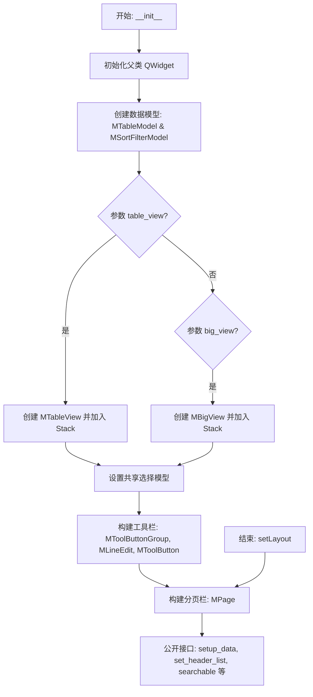

## 类结构

```
MItemViewFullSet (QtWidgets.QWidget)
├── 数据模型层
│   ├── MTableModel (source_model)
│   └── MSortFilterModel (sort_filter_model)
├── 视图层
│   ├── MTableView (条件创建)
│   └── MBigView (条件创建)
│   └── QStackedWidget (stack_widget)
├── 交互层
│   ├── MToolButtonGroup (view_button_grp)
│   ├── MLineEdit (search_line_edit)
│   └── MToolButton (search_attr_button)
└── 布局与分页
QHBoxLayout (top_lay)
QVBoxLayout (main_lay)
MPage (page_set)
```

## 全局变量及字段


### `MItemViewFullSet.sort_filter_model`
    
排序过滤代理模型，用于对数据进行排序和过滤

类型：`MSortFilterModel`
    


### `MItemViewFullSet.source_model`
    
原始数据模型，存储表格的原始数据

类型：`MTableModel`
    


### `MItemViewFullSet.stack_widget`
    
视图切换容器，用于在表格视图和大图视图之间切换

类型：`QStackedWidget`
    


### `MItemViewFullSet.view_button_grp`
    
视图切换按钮组，提供视图切换的按钮控件

类型：`MToolButtonGroup`
    


### `MItemViewFullSet.table_view`
    
表格视图实例，以表格形式展示数据

类型：`MTableView`
    


### `MItemViewFullSet.big_view`
    
大图视图实例，以大图形式展示数据

类型：`MBigView`
    


### `MItemViewFullSet.selection_model`
    
共享的选择模型，用于管理视图的选择状态

类型：`QItemSelectionModel`
    


### `MItemViewFullSet.tool_bar`
    
顶部工具栏容器，包含搜索框和视图切换按钮

类型：`QWidget`
    


### `MItemViewFullSet.top_lay`
    
工具栏布局，管理工具栏内控件的排列

类型：`QHBoxLayout`
    


### `MItemViewFullSet.search_line_edit`
    
搜索输入框，用于输入搜索关键字

类型：`MLineEdit`
    


### `MItemViewFullSet.search_attr_button`
    
搜索属性下拉按钮，用于选择搜索属性

类型：`MToolButton`
    


### `MItemViewFullSet.page_set`
    
分页控件，用于数据分页显示

类型：`MPage`
    


### `MItemViewFullSet.main_lay`
    
主布局，垂直排列工具栏、视图和分页控件

类型：`QVBoxLayout`
    
    

## 全局函数及方法


### `MItemViewFullSet.__init__`

这是 `MItemViewFullSet` 类的构造函数，用于初始化一个完整的数据项视图组件，支持表格视图和大图标视图两种展示模式，并提供搜索、分页和工具栏等功能。

参数：

- `table_view`：`bool`，默认为 `True`，是否启用表格视图（Table View）
- `big_view`：`bool`，默认为 `False`，是否启用大图标视图（Big View）
- `parent`：`QtWidgets.QWidget`，默认为 `None`，父 widget 对象

返回值：`None`，构造函数无返回值

#### 流程图

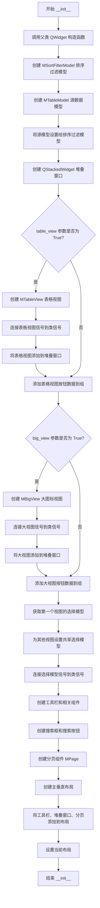

#### 带注释源码

```python
def __init__(self, table_view=True, big_view=False, parent=None):
    """
    初始化 MItemViewFullSet 组件
    
    参数:
        table_view: bool, 是否显示表格视图, 默认为 True
        big_view: bool, 是否显示大图标视图, 默认为 False
        parent: QtWidgets.QWidget, 父 widget, 默认为 None
    """
    # 1. 调用父类 QtWidgets.QWidget 的构造函数进行初始化
    # parent 参数传递给父类,建立父子关系
    super(MItemViewFullSet, self).__init__(parent)
    
    # 2. 创建排序过滤模型,用于支持数据的排序和过滤功能
    self.sort_filter_model = MSortFilterModel()
    
    # 3. 创建源数据模型,存储实际的数据项
    self.source_model = MTableModel()
    
    # 4. 将源模型设置为排序过滤模型的源模型,建立模型关联
    self.sort_filter_model.setSourceModel(self.source_model)

    # 5. 创建堆叠窗口容器,用于切换不同的视图模式
    self.stack_widget = QtWidgets.QStackedWidget()

    # 6. 创建工具按钮组,用于切换视图模式(表格/大图)
    self.view_button_grp = MToolButtonGroup(exclusive=True)
    
    # 用于存储视图按钮的配置数据
    data_group = []
    
    # 7. 如果启用了表格视图
    if table_view:
        # 创建表格视图,显示行号
        self.table_view = MTableView(show_row_count=True)
        
        # 连接双击信号:当用户双击表格中的项时,发射 sig_double_clicked 信号
        self.table_view.doubleClicked.connect(self.sig_double_clicked)
        
        # 连接按下信号:当用户按下鼠标时,触发 slot_left_clicked 槽函数
        self.table_view.pressed.connect(self.slot_left_clicked)
        
        # 为表格视图设置排序过滤模型(注意:不是源模型)
        self.table_view.setModel(self.sort_filter_model)
        
        # 将表格视图添加到堆叠窗口
        self.stack_widget.addWidget(self.table_view)
        
        # 添加表格视图按钮配置:SVG图标,可勾选,提示文本
        data_group.append({"svg": "table_view.svg", "checkable": True, "tooltip": "Table View"})
    
    # 8. 如果启用了 大图标视图
    if big_view:
        # 创建大图标视图
        self.big_view = MBigView()
        
        # 连接双击信号
        self.big_view.doubleClicked.connect(self.sig_double_clicked)
        
        # 连接按下信号
        self.big_view.pressed.connect(self.slot_left_clicked)
        
        # 设置模型
        self.big_view.setModel(self.sort_filter_model)
        
        # 添加到堆叠窗口
        self.stack_widget.addWidget(self.big_view)
        
        # 添加大视图按钮配置
        data_group.append({"svg": "big_view.svg", "checkable": True, "tooltip": "Big View"})

    # 9. 设置多个视图共享同一个选择模型(SelectionModel)
    # 这样可以在不同视图之间保持选中的同步性
    # 获取第一个视图的选择模型作为主选择模型
    leader_view = self.stack_widget.widget(0)
    self.selection_model = leader_view.selectionModel()
    
    # 遍历所有其他视图,将它们的选择模型设置为主选择模型
    for index in range(self.stack_widget.count()):
        if index == 0:
            continue  # 跳过第一个视图(它已经是主视图)
        other_view = self.stack_widget.widget(index)
        other_view.setSelectionModel(self.selection_model)

    # 10. 连接选择模型的信号到类的信号,实现信号转发
    # 当前选中项改变时发射
    self.selection_model.currentChanged.connect(self.sig_current_changed)
    # 当前行改变时发射
    self.selection_model.currentRowChanged.connect(self.sig_current_row_changed)
    # 当前列改变时发射
    self.selection_model.currentColumnChanged.connect(self.sig_current_column_changed)
    # 选择区域改变时发射
    self.selection_model.selectionChanged.connect(self.sig_selection_changed)

    # 11. 创建工具栏和相关组件
    self.tool_bar = QtWidgets.QWidget()
    
    # 创建水平布局,设置边距为0
    self.top_lay = QtWidgets.QHBoxLayout()
    self.top_lay.setContentsMargins(0, 0, 0, 0)
    
    # 12. 如果有多个视图模式,设置视图切换按钮组
    if data_group and len(data_group) > 1:
        # 当按钮选中状态改变时,切换堆叠窗口的当前视图
        self.view_button_grp.sig_checked_changed.connect(self.stack_widget.setCurrentIndex)
        
        # 设置按钮列表并默认选中第一个
        self.view_button_grp.set_button_list(data_group)
        self.view_button_grp.set_dayu_checked(0)
        
        # 将按钮组添加到工具栏布局
        self.top_lay.addWidget(self.view_button_grp)
    
    # 13. 创建搜索框组件
    # 使用链式调用创建搜索样式的小型输入框
    self.search_line_edit = MLineEdit().search().small()
    
    # 创建搜索属性按钮(下拉箭头)
    self.search_attr_button = MToolButton().icon_only().svg("down_fill.svg").small()
    
    # 将按钮设置为输入框的前缀组件
    self.search_line_edit.set_prefix_widget(self.search_attr_button)
    
    # 连接文本变化信号到排序过滤模型的搜索模式设置
    self.search_line_edit.textChanged.connect(self.sort_filter_model.set_search_pattern)
    
    # 默认隐藏搜索框(需要调用 searchable() 方法显示)
    self.search_line_edit.setVisible(False)

    # 14. 添加伸缩空间,将搜索框推到右侧
    self.top_lay.addStretch()
    self.top_lay.addWidget(self.search_line_edit)
    
    # 设置工具栏的布局
    self.tool_bar.setLayout(self.top_lay)

    # 15. 创建分页组件
    self.page_set = MPage()
    
    # 16. 创建主垂直布局
    self.main_lay = QtWidgets.QVBoxLayout()
    self.main_lay.setSpacing(5)  # 设置控件间距
    self.main_lay.setContentsMargins(0, 0, 0, 0)  # 设置边距
    
    # 17. 将工具栏、视图堆叠、分页依次添加到主布局
    self.main_lay.addWidget(self.tool_bar)
    self.main_lay.addWidget(self.stack_widget)
    self.main_lay.addWidget(self.page_set)
    
    # 18. 设置当前 widget 的布局为主布局
    self.setLayout(self.main_lay)
```


### `MItemViewFullSet.enable_context_menu`

该方法用于启用所有视图的右键上下文菜单功能，并将各个视图的上下文菜单信号连接到父组件的信号上，以实现统一的菜单触发处理。

参数：无需参数

返回值：`None`，该方法无返回值，仅执行副作用操作

#### 流程图

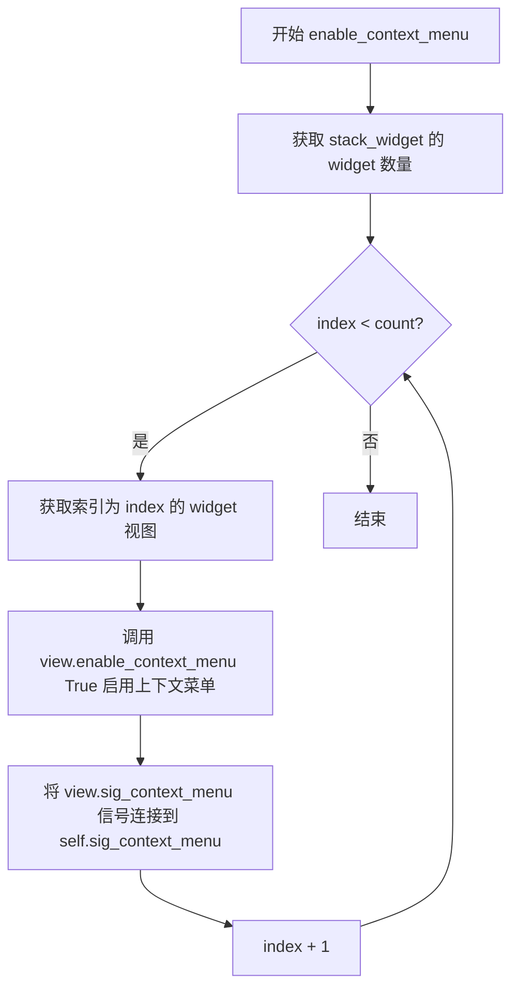

#### 带注释源码

```python
def enable_context_menu(self):
    """
    启用所有视图的上下文菜单功能。
    
    该方法会遍历 QStackedWidget 中的所有视图组件，为每个视图启用右键菜单，
    并将视图的上下文菜单信号连接到父组件的信号上，实现统一的菜单触发处理。
    """
    # 遍历 stack_widget 中的所有视图widget
    for index in range(self.stack_widget.count()):
        # 获取当前索引位置的视图对象
        view = self.stack_widget.widget(index)
        
        # 调用视图的 enable_context_menu 方法，传入 True 启用菜单
        view.enable_context_menu(True)
        
        # 将视图的 sig_context_menu 信号连接到父组件的 sig_context_menu 信号
        # 这样当任意视图触发上下文菜单时，会发送统一的信号
        view.sig_context_menu.connect(self.sig_context_menu)
```


### `MItemViewFullSet.set_no_data_text`

设置所有视图控件在无数据时显示的文本内容。该方法遍历堆叠窗口中的所有视图（表格视图和大图视图），为每个视图设置统一的"无数据"提示文本。

参数：

- `text`：`str`，需要设置的无数据提示文本内容

返回值：`None`，无返回值

#### 流程图

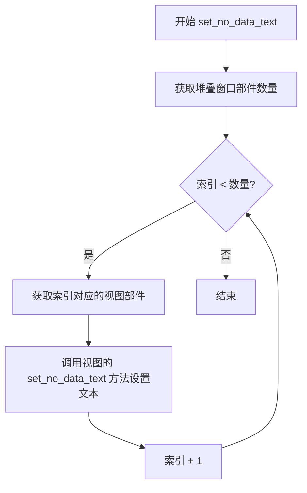

#### 带注释源码

```python
def set_no_data_text(self, text):
    """
    设置所有视图的无数据提示文本
    
    参数:
        text: str, 无数据时显示的文本内容
    返回:
        None
    """
    # 遍历堆叠窗口中的所有视图部件
    for index in range(self.stack_widget.count()):
        # 获取当前索引对应的视图部件
        view = self.stack_widget.widget(index)
        # 为每个视图设置无数据提示文本
        view.set_no_data_text(text)
```

#### 设计说明

该方法的设计体现了以下特点：

1. **统一接口**：通过遍历堆叠窗口中的所有视图，为表格视图和大图视图提供统一的文本设置接口
2. **封装性**：隐藏了底层不同视图的具体实现细节，调用者只需调用此方法即可同时设置所有视图
3. **可扩展性**：当添加新的视图类型到堆叠窗口时，无需修改此方法的逻辑


### `MItemViewFullSet.set_selection_mode`

该方法用于统一设置当前 widget 中所有子视图（表格视图和大图视图）的项目选择模式。

参数：
-  `mode`：`int` (通常为 `QtCore.Qt.SelectionMode`)，指定选择模式（例如 `QtCore.Qt.SingleSelection`、`QtCore.Qt.MultiSelection` 等）。

返回值：`None`，无返回值。

#### 流程图

```mermaid
graph TD
    A[Start set_selection_mode] --> B{Loop: index in range(stack_widget.count)}
    B -->|Each View| C[Get View: stack_widget.widget(index)]
    C --> D[Call view.setSelectionMode(mode)]
    D --> E{Next Index}
    E -->|Yes| B
    E -->|No| F[End]
```

#### 带注释源码

```python
def set_selection_mode(self, mode):
    """
    设置所有内部视图的选择模式。

    参数:
        mode: QtCore.Qt.SelectionMode (或 int), 对应 Qt 的选择模式枚举。
              常用值包括:
              - QtCore.Qt.NoSelection: 禁止选择
              - QtCore.Qt.SingleSelection: 单选
              - QtCore.Qt.MultiSelection: 多选
              - QtCore.Qt.ExtendedSelection: 扩展多选 (Ctrl/Shift)
              - QtCore.Qt.ContiguousSelection: 连续选择
    """
    # 遍历堆叠窗口 (StackedWidget) 中的所有视图索引
    for index in range(self.stack_widget.count()):
        # 根据索引获取具体的视图对象 (可能是 MTableView 或 MBigView)
        view = self.stack_widget.widget(index)
        # 调用视图自带的 setSelectionMode 方法设置选择模式
        view.setSelectionMode(mode)
```


### `MItemViewFullSet.tool_bar_visible`

该方法用于控制工具栏（tool_bar）的显示与隐藏，通过接收一个布尔值参数来设置工具栏的可见性状态。

参数：

- `flag`：`bool`，控制工具栏是否可见，传入 `True` 时显示工具栏，传入 `False` 时隐藏工具栏

返回值：`None`，该方法无返回值，仅执行设置工具栏可见性的操作

#### 流程图

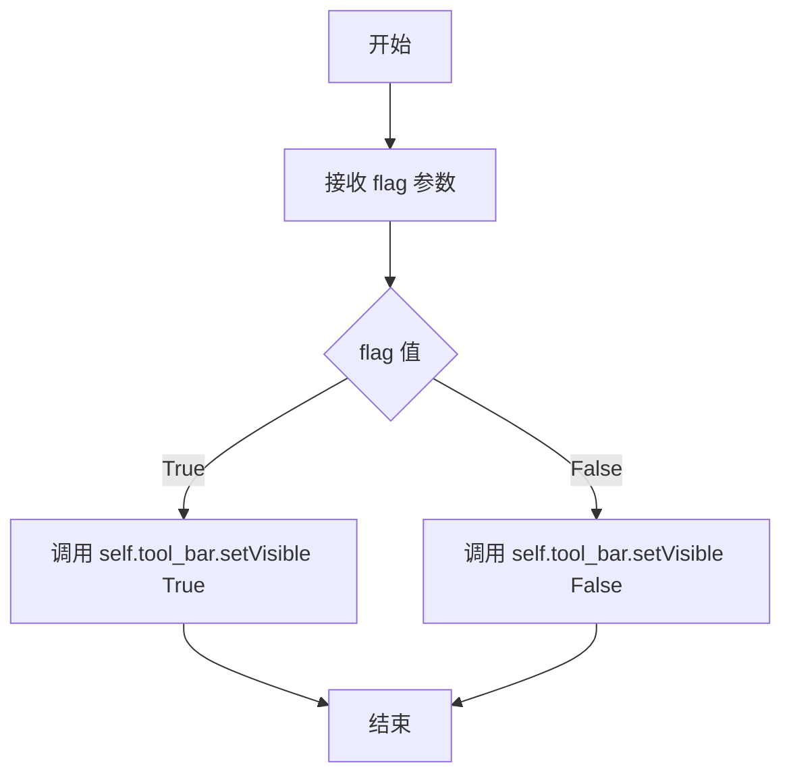

#### 带注释源码

```python
def tool_bar_visible(self, flag):
    """
    设置工具栏的可见性。
    
    参数:
        flag (bool): 布尔值，控制工具栏的显示与隐藏。
                     True 表示显示工具栏，False 表示隐藏工具栏。
    
    返回:
        None: 无返回值，仅修改工具栏的可见性状态。
    
    示例:
        # 隐藏工具栏
        self.tool_bar_visible(False)
        
        # 显示工具栏
        self.tool_bar_visible(True)
    """
    # 调用 Qt 的 setVisible 方法设置工具栏的可见性
    # 该方法接收一个布尔参数：True 显示控件，False 隐藏控件
    self.tool_bar.setVisible(flag)
```

#### 上下文依赖信息

- **调用者**：通常由外部代码或父类方法来触发，用于动态控制 UI 布局
- **依赖组件**：
  - `self.tool_bar`：QtWidgets.QWidget 类型，在 `__init__` 方法中初始化为水平布局的工具栏容器
- **被调用者**：QtWidgets.QWidget.setVisible()，这是 Qt 框架提供的内置方法


### `MItemViewFullSet.slot_left_clicked`

该方法是 `MItemViewFullSet` 类的私有槽函数，用于处理视图项的左键点击事件。当用户左键点击列表或表格中的项时，该方法会将视图层收到的索引（经过排序过滤模型处理）转换回原始数据模型的索引，并发射信号通知订阅者。

参数：

- `start_index`：`QtCore.QModelIndex`，点击的视图项在排序/过滤模型中的索引

返回值：`None`，该方法为 Qt 槽函数，不返回值，仅通过信号机制传递数据

#### 流程图

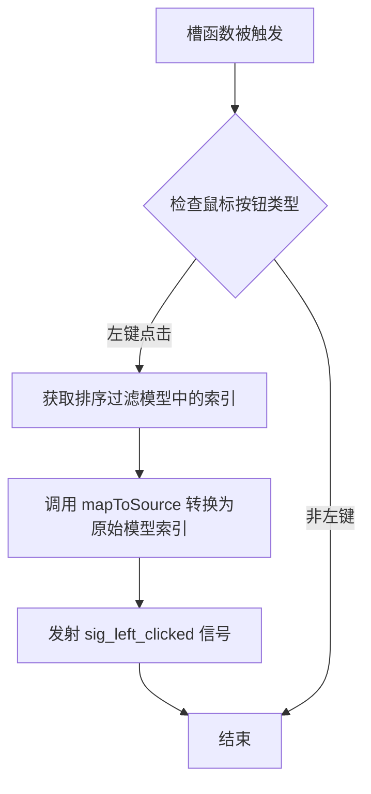

#### 带注释源码

```python
@QtCore.Slot(QtCore.QModelIndex)
def slot_left_clicked(self, start_index):
    """
    处理视图项左键点击事件的槽函数。
    
    当用户左键点击表格或大图视图中的项时，此方法被调用。
    它将视图层收到的索引（经过排序过滤模型处理）转换回
    原始数据模型的索引，并发射信号通知订阅者。
    
    参数:
        start_index (QtCore.QModelIndex): 
            点击的视图项在排序/过滤模型中的索引
    """
    # 获取当前鼠标按下的按钮状态
    button = QtWidgets.QApplication.mouseButtons()
    
    # 仅处理左键点击事件
    if button == QtCore.Qt.LeftButton:
        # 将排序/过滤模型的索引映射回原始数据模型的索引
        # sort_filter_model 可能对数据进行了排序或过滤，
        # 因此需要转换回原始模型索引
        real_index = self.sort_filter_model.mapToSource(start_index)
        
        # 发射左键点击信号，传递原始模型索引
        # 订阅者可以据此获取实际的数据项
        self.sig_left_clicked.emit(real_index)
```


### `MItemViewFullSet.set_header_list`

该方法用于设置视图组件的表头列表数据，同时更新数据模型和所有视图的表头配置，并清空现有数据。

参数：

- `header_list`：`list`，表头列表数据，用于定义表格的列标题

返回值：`None`，该方法没有返回值

#### 流程图

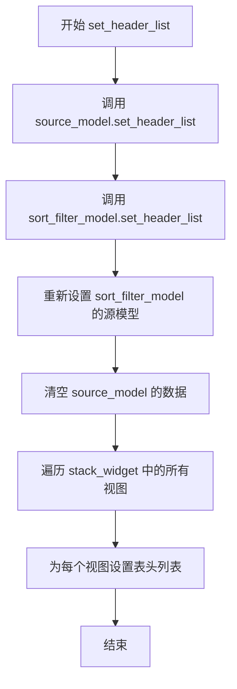

#### 带注释源码

```python
def set_header_list(self, header_list):
    """
    设置表头列表
    
    参数:
        header_list: 表头列表数据
    """
    # 1. 设置源数据模型的表头
    self.source_model.set_header_list(header_list)
    # 2. 设置排序过滤模型的表头
    self.sort_filter_model.set_header_list(header_list)
    # 3. 重新设置排序过滤模型的源模型（确保模型链正确）
    self.sort_filter_model.setSourceModel(self.source_model)
    # 4. 清空源数据模型（重置数据状态）
    self.source_model.clear()
    # 5. 遍历所有视图并设置表头
    for index in range(self.stack_widget.count()):
        view = self.stack_widget.widget(index)
        view.set_header_list(header_list)
```


### `MItemViewFullSet.tool_bar_append_widget`

该方法用于向工具栏布局的末尾添加一个 widget 组件，是工具栏动态扩展功能的实现，允许外部将自定义控件（如按钮、标签等）添加到工具栏区域。

参数：

- `widget`：`QtWidgets.QWidget`，需要添加到工具栏的 Qt 控件对象

返回值：`None`，无返回值（方法直接操作布局管理器）

#### 流程图

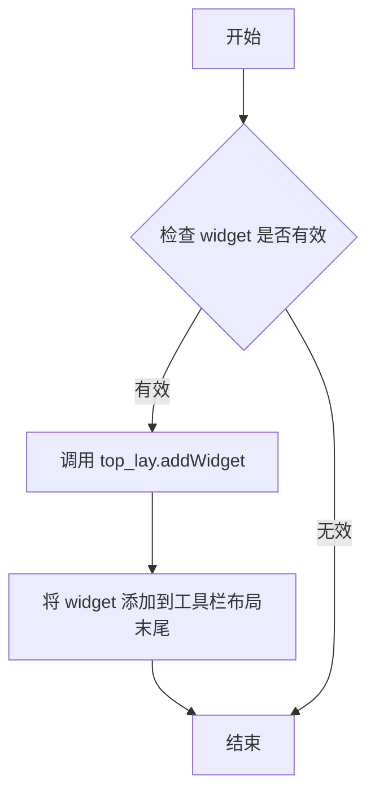

#### 带注释源码

```python
def tool_bar_append_widget(self, widget):
    """
    向工具栏末尾追加一个 widget。
    
    参数:
        widget: QtWidgets.QWidget，需要添加的控件对象
        
    返回值:
        None
        
    注意:
        该方法会将 widget 添加到水平布局的末尾（在搜索框之后）
        不会触发任何信号或回调
    """
    self.top_lay.addWidget(widget)  # 将传入的 widget 添加到工具栏水平布局的末尾
```


### `MItemViewFullSet.tool_bar_insert_widget`

在工具栏布局的开头插入一个指定的widget组件。

参数：

- `widget`：`QtWidgets.QWidget`，要插入到工具栏布局中的widget组件

返回值：`None`，该方法不返回任何值

#### 流程图

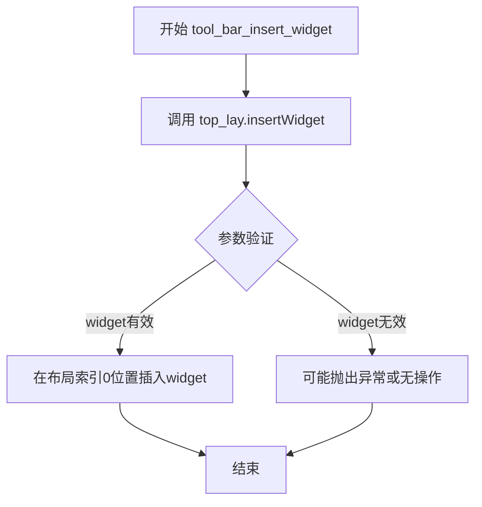

#### 带注释源码

```python
def tool_bar_insert_widget(self, widget):
    """
    在工具栏布局的开头插入一个widget。
    
    该方法将指定的widget组件插入到水平布局(self.top_lay)的第一个位置(索引0)。
    工具栏布局是一个QHBoxLayout，insertWidget方法会将widget添加到布局的左侧。
    
    参数:
        widget: QtWidgets.QWidget类型，要插入的widget组件。
               常见的插入内容包括搜索按钮、筛选按钮、自定义操作按钮等。
    
    返回值:
        无返回值(None)。该方法直接修改布局，不返回任何内容。
    
    示例:
        # 插入一个自定义按钮到工具栏最左侧
        custom_button = MToolButton().icon_only().svg("custom.svg")
        self.tool_bar_insert_widget(custom_button)
    """
    self.top_lay.insertWidget(0, widget)
```


### `MItemViewFullSet.setup_data`

该方法用于设置视图的数据列表，清除现有数据并更新记录计数。

参数：
- `data_list`：`list`，需要设置到视图中的数据列表

返回值：`None`，该方法没有返回值

#### 流程图

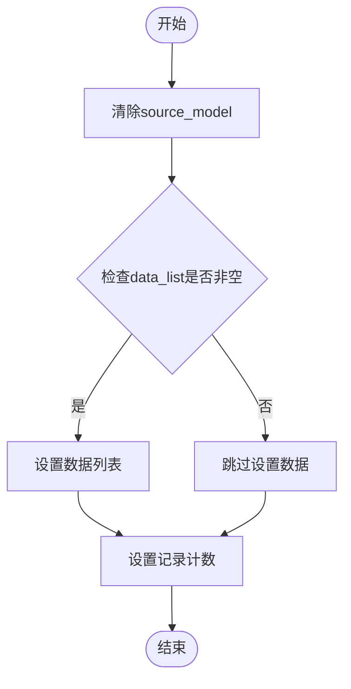

#### 带注释源码

```python
@QtCore.Slot()
def setup_data(self, data_list):
    # 清除源模型中的所有现有数据
    self.source_model.clear()
    # 如果提供了数据列表，则将其设置到源模型中
    if data_list:
        self.source_model.set_data_list(data_list)
    # 更新页面控件中的记录计数
    self.set_record_count(len(data_list))
```


### `MItemViewFullSet.set_record_count`

设置分页组件的总记录数，用于更新底部页码显示的总数据量。

参数：

- `total`：`int`，总记录数，表示数据源中的数据条目总数

返回值：`None`，无返回值，仅通过调用 `page_set.set_total(total)` 更新分页组件的显示

#### 流程图

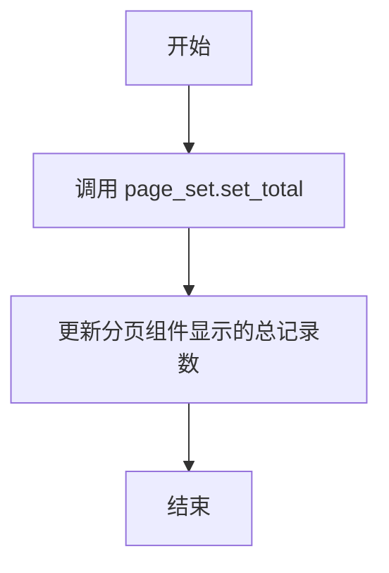

#### 带注释源码

```python
@QtCore.Slot(int)
def set_record_count(self, total):
    """设置分页组件的总记录数
    
    Args:
        total: 总记录数，用于更新底部页码显示的数据总量
    """
    # 调用页面组件的 set_total 方法，设置总记录数
    self.page_set.set_total(total)
```


### `MItemViewFullSet.get_data`

获取当前视图组件中源模型的数据列表。

参数：
- 无

返回值：`list`，返回源模型中存储的数据列表

#### 流程图

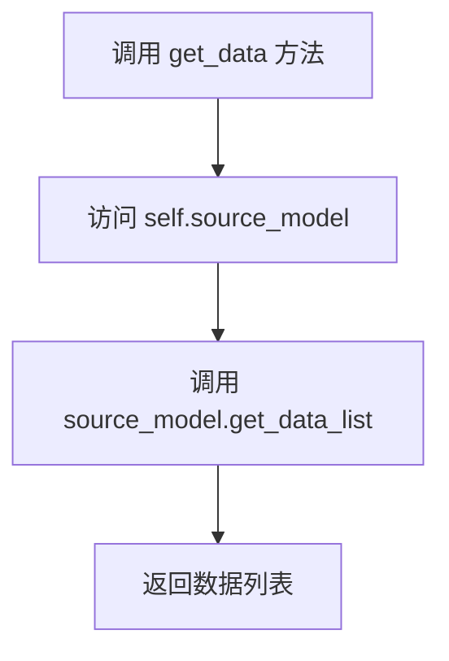

#### 带注释源码

```python
def get_data(self):
    """
    获取数据列表。
    从源模型中提取当前加载的数据并返回。

    返回值:
        list: 源模型中的数据列表
    """
    return self.source_model.get_data_list()
```


### `MItemViewFullSet.searchable`

该方法用于启用并显示搜索功能。它将内置的搜索行编辑框（`search_line_edit`）设置为可见状态，允许用户输入关键字对视图中的数据进行过滤。同时，该方法返回当前实例本身（`self`），以支持链式调用。

参数：

- （无显式参数，`self` 为隐式参数）

返回值：`MItemViewFullSet`，返回当前实例对象，支持链式调用。

#### 流程图

```mermaid
flowchart TD
    A([开始]) --> B[设置搜索框可见: self.search_line_edit.setVisible(True)]
    B --> C[返回自身: return self]
    C --> D([结束])
```

#### 带注释源码

```python
def searchable(self):
    """Enable search line edit visible."""
    # 将搜索行编辑框设置为可见
    self.search_line_edit.setVisible(True)
    # 返回 self 以支持链式调用 (例如: widget.searchable().setup_data(...))
    return self
```


## 关键组件


### MItemViewFullSet

主容器类，整合表格视图和大图视图的完整视图组件，支持视图切换、数据展示、分页和搜索功能。

### MSortFilterModel

排序过滤模型，负责对数据列表进行搜索过滤和排序处理，将原始数据转换为符合筛选条件的视图数据。

### MTableModel

表格数据模型，存储和管理视图的原始数据，提供数据设置、获取和清空等基础数据操作方法。

### MTableView

表格视图组件，以表格形式展示数据，支持显示行数、上下文菜单、双击和单击事件。

### MBigView

大图视图组件，以大图形式展示数据，与表格视图共享同一数据模型和选择模型。

### QStackedWidget

堆叠窗口容器，用于在多个视图（表格视图和大图视图）之间进行切换显示。

### QItemSelectionModel

统一选择模型，在多个视图间共享选择状态，确保不同视图间的选择操作保持同步。

### MToolButtonGroup

视图切换按钮组，提供视图切换的单选按钮组UI，支持在表格视图和大图视图之间切换。

### MLineEdit

搜索输入框组件，提供数据搜索过滤功能，支持搜索模式设置和前缀小部件配置。

### MPage

分页组件，负责数据分页显示和记录总数管理。

### 信号系统

定义了一系列信号（sig_double_clicked、sig_left_clicked、sig_current_changed等），用于视图事件向外部传递。


## 问题及建议


### 已知问题

-   **鼠标事件判断不准确**：在`slot_left_clicked`方法中使用`QtWidgets.QApplication.mouseButtons()`获取鼠标状态，但这可能返回应用程序启动后按下的任意鼠标按钮，而非当前点击事件的按钮，应使用信号传递的`event`参数或`QtCore.QEvent`来判断。
-   **信号重复连接风险**：`enable_context_menu`方法中每次调用都会为视图连接`sig_context_menu`信号，可能导致重复连接和信号泄漏。
-   **代码重复**：多处遍历`self.stack_widget`获取所有视图的代码重复（如`enable_context_menu`、`set_no_data_text`、`set_selection_mode`等方法），违反DRY原则。
-   **魔法数字和字符串**：多处硬编码字符串如"table_view.svg"、"big_view.svg"、"down_fill.svg"以及布局参数（如边距0、间距5），缺乏常量定义。
-   **类型提示缺失**：所有方法均无类型提示，影响代码可维护性和IDE辅助功能。
-   **信号命名不一致**：类内部使用`slot_`前缀命名槽函数，但Qt惯例中槽函数与普通方法无异，此处命名可能造成混淆。
-   **模型设置冗余**：`set_header_list`方法中多次调用`setSourceModel`，且在`__init__`中已设置过一次，导致模型被重复设置。
-   **缺少错误处理**：文件导入和模块依赖无try-except保护，若上游模块缺失或接口变更会导致整个类无法实例化。
-   **资源清理缺失**：无析构函数或`deleteLater`调用来断开信号连接和释放资源。
-   **文档字符串不完整**：关键方法如`setup_data`、`get_data`、`searchable`缺少参数和返回值说明。

### 优化建议

-   **修复鼠标事件判断**：改用`QtCore.QEvent`或通过`QtCore.QPoint`计算，或在信号传递的索引中携带按钮信息。
-   **提取公共方法**：创建私有方法`_get_all_views()`返回所有视图列表，减少重复代码。
-   **添加连接保护**：在`enable_context_menu`中使用`disconnect`后再连接，或使用`dict`维护连接状态防止重复。
-   **定义常量类**：创建`ViewConstants`或`Icons`类集中管理图标路径和布局参数。
-   **补充类型提示**：为所有方法添加参数和返回值类型注解，如`def set_header_list(self, header_list: List[str]) -> None:`。
-   **优化模型设置**：移除`set_header_list`中重复的`setSourceModel`调用，保持模型设置的一致性。
-   **添加异常处理**：在导入和初始化阶段添加异常捕获，提供降级方案或明确错误信息。
-   **实现资源清理**：在类中添加`cleanup`方法或重写`closeEvent`来断开信号连接。
-   **完善文档字符串**：为所有公共方法添加详细的docstring，说明参数、返回值和异常。
-   **考虑使用属性装饰器**：将部分配置方法改为属性访问，如`tool_bar_visible`可作为`tool_bar`的属性。


## 其它


### 设计目标与约束

设计目标：提供一个统一的项目视图组件，支持表格视图和大图视图两种显示模式，具备搜索过滤、分页、工具栏自定义、上下文菜单等功能，适用于需要展示结构化数据并支持多种交互方式的桌面应用程序。

设计约束：
- 依赖PySide6 Qt库
- 遵循Qt的信号槽机制
- 必须配合MTableModel、MSortFilterModel使用
- 视图数量至少为1（table_view或big_view之一）
- 仅支持单一数据源

### 错误处理与异常设计

异常处理策略：
- 初始化时如果table_view和big_view均为False，视图将无法正常显示，但不会抛出异常
- 数据设置时（setup_data）会先清空现有数据再设置新数据，确保数据一致性
- 搜索模式设置时（set_search_pattern）使用try-except捕获潜在的正则表达式错误
- 信号连接失败时静默处理，不影响主流程

错误边界：
- MTableModel和MSortFilterModel的异常由各自类处理
- 视图组件的异常由各自视图类处理
- 外部调用者需确保传入的数据格式正确

### 数据流与状态机

数据流向：
1. 外部数据通过setup_data方法传入
2. 数据首先存储到source_model（MTableModel）
3. sort_filter_model对source_model进行包装，提供过滤和排序功能
4. 视图组件（MTableView/MBigView）通过setModel绑定sort_filter_model
5. 视图显示经过过滤和排序后的数据

状态转换：
- 初始状态：无数据，视图为空
- 数据加载状态：setup_data调用后，数据已加载
- 搜索状态：searchable调用后，搜索框可见
- 分页状态：page_set管理分页，set_record_count更新总数

### 外部依赖与接口契约

外部依赖模块：
- MToolButtonGroup：工具按钮组，用于视图切换
- MSortFilterModel：排序过滤模型
- MTableModel：表格数据模型
- MBigView：大图视图组件
- MTableView：表格视图组件
- MLineEdit：带搜索功能的行编辑组件
- MPage：分页组件
- MToolButton：工具按钮组件

接口契约：
- setup_data(data_list)：data_list应为列表类型
- set_header_list(header_list)：header_list应为列表类型
- get_data()：返回source_model中的数据列表
- 所有信号参数遵循Qt的信号规范

### 安全性考虑

输入验证：
- setup_data方法不验证data_list内容，由MTableModel处理
- set_header_list方法不验证header_list格式
- 搜索模式直接传递给正则表达式引擎，需确保输入安全

内存管理：
- 使用Qt的父子对象机制管理内存
- 视图共享selection_model，需注意生命周期管理

### 性能考虑

性能优化点：
- 多视图共享selection_model，避免多个选择模型带来的内存开销
- 使用sort_filter_model进行本地过滤，避免频繁数据库查询
- 视图懒加载：仅在需要时创建视图

潜在性能瓶颈：
- 大数据量时搜索过滤可能较慢
- 分页实现依赖page_set组件，需配合后端分页使用

### 兼容性考虑

Qt版本兼容性：
- 依赖PySide6，需确保Qt版本为6.x
- 使用QtCore.Slot装饰器确保方法可被Qt元对象系统识别

Python版本兼容性：
- 使用__future__导入确保Python 2/3兼容性
- 建议Python 3.6+

### 测试策略

单元测试：
- 测试setup_data和get_data的数据一致性
- 测试set_header_list后视图更新
- 测试搜索功能正确性
- 测试工具栏显示/隐藏功能

集成测试：
- 测试多视图切换功能
- 测试分页组件交互
- 测试上下文菜单功能
- 测试信号槽连接正确性

### 部署和配置

部署方式：
- 作为模块导入使用：from m_item_view_full_set import MItemViewFullSet
- 需确保所有依赖模块在同一包内

配置选项：
- 构造函数参数：table_view(bool)和big_view(bool)控制初始视图
- 工具栏可通过tool_bar_append_widget和tool_bar_insert_widget扩展
- 搜索框通过searchable方法启用

    