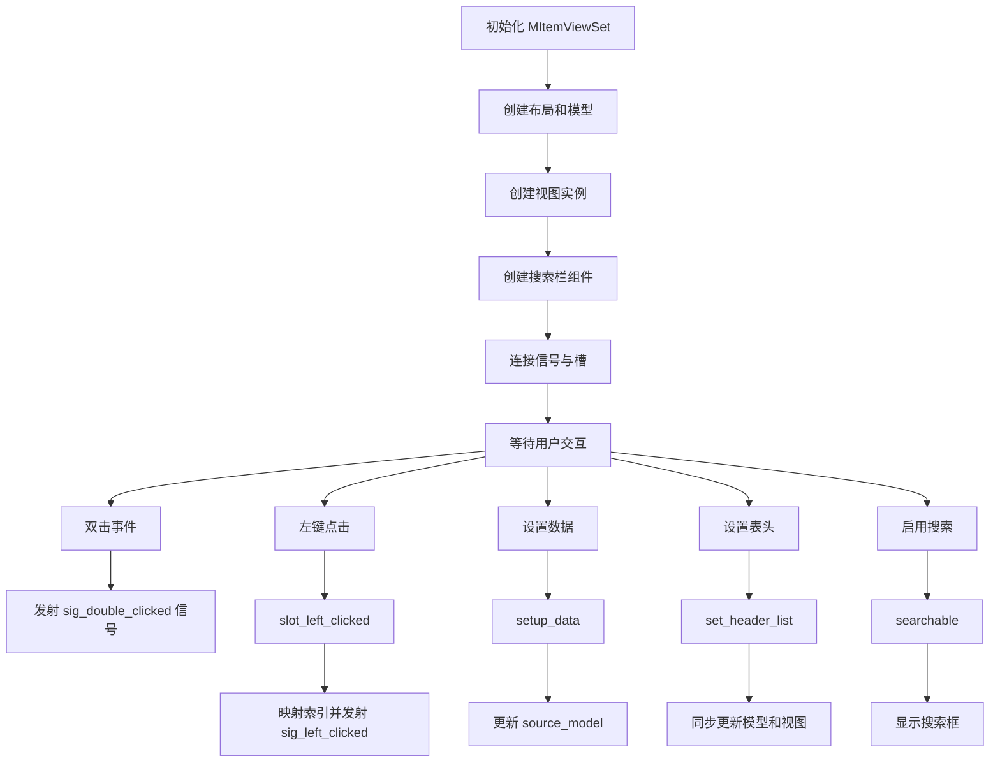
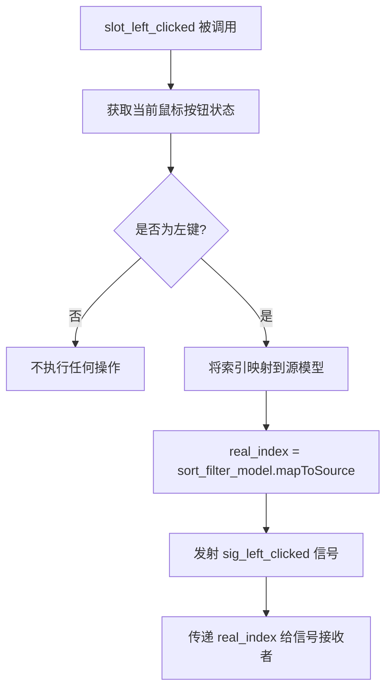
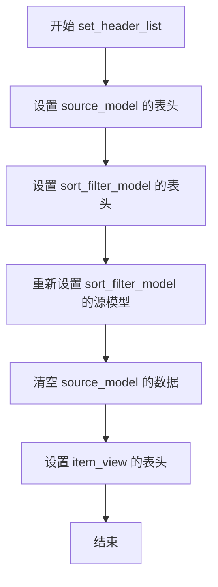
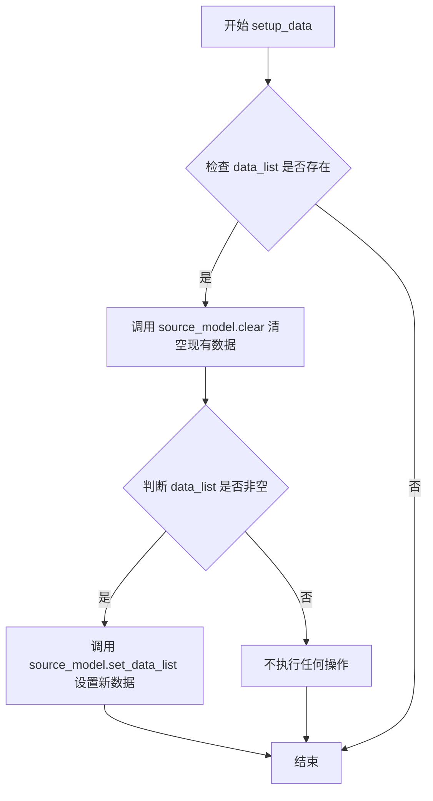
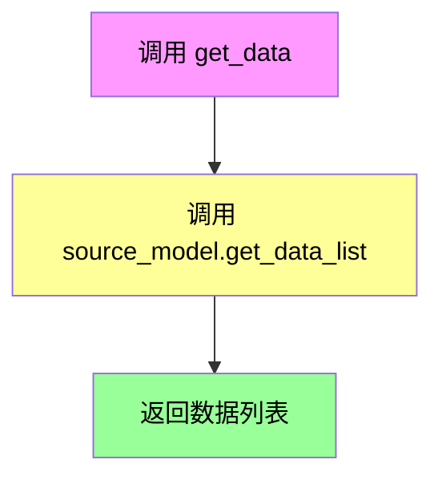
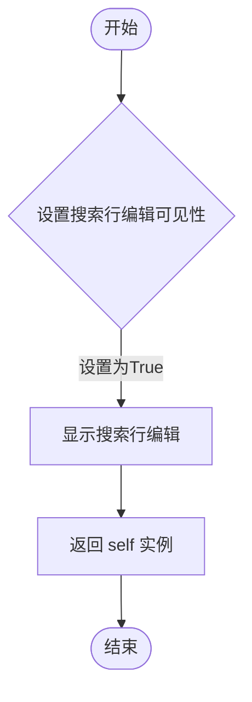
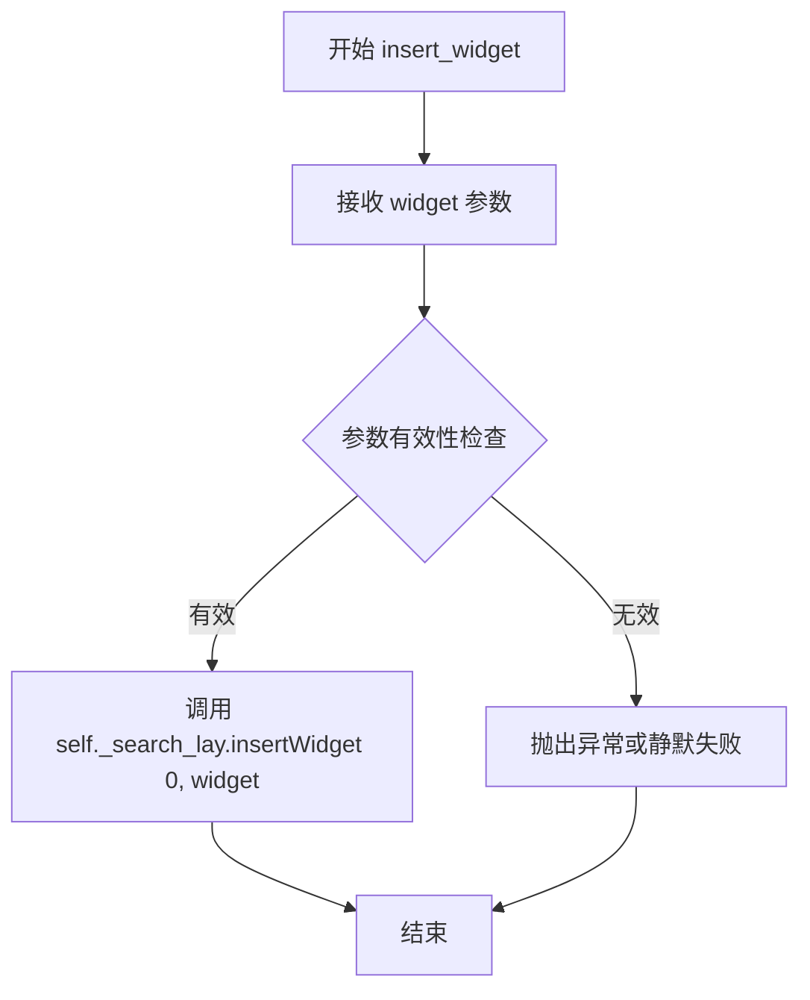

# `comic-translate\app\ui\dayu_widgets\item_view_set.py` 详细设计文档

这是一个基于PySide6的通用项目视图组件，封装了多种视图类型（表格、树形、列表、大视图）并集成了搜索、排序和过滤功能，支持数据管理和交互事件处理。

## 整体流程



## 类结构

```
MItemViewSet (QtWidgets.QWidget)
├── sig_double_clicked: QtCore.Signal
├── sig_left_clicked: QtCore.Signal
├── TableViewType: MTableView (类属性)
├── BigViewType: MBigView (类属性)
├── TreeViewType: MTreeView (类属性)
├── ListViewType: MListView (类属性)
├── main_lay: QVBoxLayout
├── sort_filter_model: MSortFilterModel
├── source_model: MTableModel
├── item_view: (视图实例)
├── _search_line_edit: MLineEdit
├── _search_attr_button: MToolButton
└── _search_lay: QHBoxLayout
```

## 全局变量及字段


### `MItemViewSet.sig_double_clicked`
    
双击信号，当用户双击项目视图中的项目时发出

类型：`QtCore.Signal`
    


### `MItemViewSet.sig_left_clicked`
    
左键点击信号，当用户左键单击项目视图中的项目时发出

类型：`QtCore.Signal`
    


### `MItemViewSet.TableViewType`
    
表格视图类型类属性，用于指定使用表格视图

类型：`MTableView`
    


### `MItemViewSet.BigViewType`
    
大视图类型类属性，用于指定使用大视图

类型：`MBigView`
    


### `MItemViewSet.TreeViewType`
    
树形视图类型类属性，用于指定使用树形视图

类型：`MTreeView`
    


### `MItemViewSet.ListViewType`
    
列表视图类型类属性，用于指定使用列表视图

类型：`MListView`
    


### `MItemViewSet.main_lay`
    
主垂直布局，容纳搜索栏和项目视图

类型：`QtWidgets.QVBoxLayout`
    


### `MItemViewSet.sort_filter_model`
    
排序过滤模型，负责数据的排序和过滤功能

类型：`MSortFilterModel`
    


### `MItemViewSet.source_model`
    
源数据模型，存储原始数据

类型：`MTableModel`
    


### `MItemViewSet.item_view`
    
项目视图组件，用于显示数据

类型：`视图实例`
    


### `MItemViewSet._search_line_edit`
    
搜索输入框，用于输入搜索关键词

类型：`MLineEdit`
    


### `MItemViewSet._search_attr_button`
    
搜索属性按钮，用于触发搜索功能

类型：`MToolButton`
    


### `MItemViewSet._search_lay`
    
搜索栏水平布局，容纳搜索输入框和按钮

类型：`QtWidgets.QHBoxLayout`
    
    

## 全局函数及方法


### `MItemViewSet.__init__`

初始化视图集，设置布局、模型、视图和搜索框等组件，构建基于 Qt 的项目视图界面。

参数：
- `view_type`：`可选的视图类（如 MTableView）`，指定视图类型，默认为 None（使用默认的 TableViewType）
- `parent`：`QtWidgets.QWidget 或 None`，父 widget，默认为 None

返回值：`None`，无返回值（构造函数）

#### 流程图

```mermaid
flowchart TD
    A[开始 __init__] --> B[调用父类构造函数 super().__init__(parent)]
    B --> C[创建垂直布局 main_lay]
    C --> D[创建排序过滤模型 sort_filter_model]
    D --> E[创建源模型 source_model]
    E --> F[设置源模型到排序过滤模型]
    F --> G{view_type 是否为 None?}
    G -->|是| H[使用默认视图类 TableViewType]
    G -->|否| I[使用传入的 view_type]
    H --> J[创建视图实例 item_view]
    I --> J
    J --> K[连接视图信号: doubleClicked 到 sig_double_clicked, pressed 到 slot_left_clicked]
    K --> L[设置模型到视图: setModel sort_filter_model]
    L --> M[创建搜索行编辑 _search_line_edit]
    M --> N[创建搜索属性按钮 _search_attr_button]
    N --> O[设置搜索行编辑的前缀widget]
    O --> P[连接搜索行编辑信号 textChanged 到 sort_filter_model.set_search_pattern]
    P --> Q[设置搜索行编辑不可见]
    Q --> R[创建搜索布局 _search_lay]
    R --> S[添加伸缩项和搜索行编辑到搜索布局]
    S --> T[将搜索布局添加到主布局]
    T --> U[将视图添加到主布局]
    U --> V[设置主布局到当前widget]
    V --> Z[结束]
```

#### 带注释源码

```python
def __init__(self, view_type=None, parent=None):
    # 调用父类 QWidget 的构造函数，初始化 widget
    super(MItemViewSet, self).__init__(parent)
    
    # 创建垂直布局，作为主布局
    self.main_lay = QtWidgets.QVBoxLayout()
    self.main_lay.setSpacing(5)  # 设置间距为5
    self.main_lay.setContentsMargins(0, 0, 0, 0)  # 设置边距为0
    
    # 创建排序过滤模型，用于过滤和排序
    self.sort_filter_model = MSortFilterModel()
    # 创建源数据模型
    self.source_model = MTableModel()
    # 设置排序过滤模型的源模型
    self.sort_filter_model.setSourceModel(self.source_model)
    
    # 确定视图类：如果 view_type 为 None，则使用默认的 TableViewType
    view_class = view_type or MItemViewSet.TableViewType
    # 创建视图实例
    self.item_view = view_class()
    # 连接视图的 doubleClicked 信号到类的 sig_double_clicked 信号
    self.item_view.doubleClicked.connect(self.sig_double_clicked)
    # 连接视图的 pressed 信号到槽函数 slot_left_clicked
    self.item_view.pressed.connect(self.slot_left_clicked)
    # 设置视图的模型为排序过滤模型
    self.item_view.setModel(self.sort_filter_model)
    
    # 创建搜索行编辑：使用 MLineEdit 的 search 和 small 方法
    self._search_line_edit = MLineEdit().search().small()
    # 创建搜索属性按钮：使用 MToolButton 的 icon_only、svg 和 small 方法
    self._search_attr_button = MToolButton().icon_only().svg("down_fill.svg").small()
    # 设置搜索行编辑的前缀 widget 为搜索属性按钮
    self._search_line_edit.set_prefix_widget(self._search_attr_button)
    # 连接搜索行编辑的文本变化信号到排序过滤模型的搜索模式设置
    self._search_line_edit.textChanged.connect(self.sort_filter_model.set_search_pattern)
    # 默认设置搜索行编辑不可见
    self._search_line_edit.setVisible(False)
    
    # 创建搜索布局：水平布局
    self._search_lay = QtWidgets.QHBoxLayout()
    self._search_lay.setContentsMargins(0, 0, 0, 0)  # 设置边距为0
    # 添加伸缩项，使搜索行编辑靠右
    self._search_lay.addStretch()
    # 将搜索行编辑添加到搜索布局
    self._search_lay.addWidget(self._search_line_edit)
    
    # 将搜索布局添加到主布局
    self.main_lay.addLayout(self._search_lay)
    # 将视图添加到主布局
    self.main_lay.addWidget(self.item_view)
    # 设置当前 widget 的布局为主布局
    self.setLayout(self.main_lay)
```


### `MItemViewSet.slot_left_clicked`

处理项目视图的左键点击事件，将点击的索引从排序/过滤模型映射到源模型，并发射自定义信号。

参数：

- `start_index`：`QtCore.QModelIndex`，来自视图的模型索引（经过排序/过滤模型处理）

返回值：`None`，该方法无返回值，通过信号传递数据

#### 流程图



#### 带注释源码

```python
@QtCore.Slot(QtCore.QModelIndex)
def slot_left_clicked(self, start_index):
    """
    处理项目视图的左键点击事件。
    
    当用户左键点击项目视图中的项目时，此槽函数会被调用。
    它会将索引从排序/过滤模型映射回源模型，并发射信号通知处理程序。
    
    参数:
        start_index: QtCore.QModelIndex
            来自视图的模型索引，该索引已经过排序/过滤模型处理
    """
    # 获取当前鼠标按钮状态
    # 返回一个 Qt.MouseButton 枚举值
    button = QtWidgets.QApplication.mouseButtons()
    
    # 检查是否按下的是左键
    if button == QtCore.Qt.LeftButton:
        # 将排序/过滤模型的索引映射回源模型的索引
        # 因为视图中显示的是经过排序/过滤的数据
        # 需要转换为源模型中的实际索引
        real_index = self.sort_filter_model.mapToSource(start_index)
        
        # 发射自定义信号，传递源模型中的真实索引
        # 供外部槽函数使用
        self.sig_left_clicked.emit(real_index)
```


### `MItemViewSet.set_header_list`

设置表头列表，同时更新数据模型和视图组件的表头信息，确保三者保持同步。

参数：

- `header_list`：`list`，表头列表，包含要显示的列标题

返回值：`None`，该方法无返回值，仅执行副作用操作

#### 流程图



#### 带注释源码

```python
def set_header_list(self, header_list):
    """
    设置表头列表，同时更新数据模型和视图组件的表头信息。
    
    参数:
        header_list: 表头列表，包含要显示的列标题
    """
    # 1. 更新源数据模型的表头
    self.source_model.set_header_list(header_list)
    
    # 2. 更新排序/过滤模型的表头
    self.sort_filter_model.set_header_list(header_list)
    
    # 3. 重新绑定源模型，确保模型链正确建立
    # 注意：此步骤可能存在冗余，可考虑优化
    self.sort_filter_model.setSourceModel(self.source_model)
    
    # 4. 清空现有数据，避免旧数据与新表头不匹配
    self.source_model.clear()
    
    # 5. 更新视图的表头显示
    self.item_view.set_header_list(header_list)
```


### `MItemViewSet.setup_data`

设置数据列表，用于将外部数据加载到视图控件中。该方法接受一个数据列表，清空现有数据后将其填充到源模型中。

**参数：**

- `data_list`：`list`，需要设置的数据列表，数据应为表格形式的多维列表

**返回值：**`None`，无返回值

#### 流程图



#### 带注释源码

```python
@QtCore.Slot()
def setup_data(self, data_list):
    """
    设置视图的数据列表。
    
    参数:
        data_list: 数据列表，应为表格形式的多维列表
    """
    # 首先清空现有数据，确保视图显示的是全新的数据
    self.source_model.clear()
    
    # 检查传入的数据列表是否有效（非空）
    if data_list:
        # 将新数据列表设置到源模型中
        self.source_model.set_data_list(data_list)
```


### `MItemViewSet.get_data`

获取当前视图集中的数据列表。该方法通过调用源数据模型的 `get_data_list` 方法返回所有当前加载的数据。

参数：
- 无（仅包含隐含的 `self` 参数）

返回值：`list`，返回当前数据模型中存储的所有数据记录的列表

#### 流程图



#### 带注释源码

```python
def get_data(self):
    """
    获取当前视图集中的数据列表。
    
    该方法作为外观方法，直接透传调用底层源数据模型的获取数据列表功能。
    无需任何参数，通过 self 引用访问内部数据模型。
    
    Returns:
        list: 返回包含所有数据记录的列表，列表元素类型取决于 MTableModel 的具体实现，
              通常为字典或自定义数据对象。若数据为空，则返回空列表。
    """
    # 调用源数据模型的对象方法获取数据列表
    return self.source_model.get_data_list()
```


### MItemViewSet.searchable

启用搜索功能，使搜索行编辑组件可见，以便用户可以进行数据搜索。

参数：
- `self`：`MItemViewSet`，调用此方法的实例对象本身

返回值：`MItemViewSet`，返回实例本身，以支持链式调用（例如 `widget.searchable().other_method()`）

#### 流程图



#### 带注释源码

```python
def searchable(self):
    """Enable search line edit visible."""
    # 将搜索行编辑组件设置为可见状态
    self._search_line_edit.setVisible(True)
    # 返回当前实例，支持链式调用
    return self
```


### `MItemViewSet.insert_widget`

向搜索布局（`_search_lay`）中插入一个额外的 Qt 组件，以便在搜索框旁边显示自定义控件。

参数：

- `widget`：`QtWidgets.QWidget`，需要插入到搜索布局中的额外组件

返回值：`None`，该方法没有返回值

#### 流程图



#### 带注释源码

```python
def insert_widget(self, widget):
    """Use can insert extra widget into search layout."""
    # 使用 QHBoxLayout 的 insertWidget 方法将传入的 widget 插入到布局的索引 0 位置
    # 这样 widget 会显示在搜索行的最左侧（搜索按钮左侧）
    self._search_lay.insertWidget(0, widget)
```

## 关键组件


### MItemViewSet

主视图容器类，封装了Qt的多种视图（表格、树、列表、大视图）并集成了搜索过滤功能，提供统一的数据展示和交互接口。

### 视图类型组件（TableViewType, BigViewType, TreeViewType, ListViewType）

类级别的视图类型属性，支持动态切换不同的视图显示模式，分别对应表格视图、大视图、树形视图和列表视图。

### 模型系统（MSortFilterModel, MTableModel）

排序过滤模型和数据模型的组合使用，实现了数据的展示、排序和搜索过滤功能，支持将数据列表转换为Qt模型视图架构。

### 搜索功能组件（MLineEdit, MToolButton）

集成的搜索输入框和搜索属性按钮，支持实时搜索过滤，提供可配置的搜索UI组件。

### 信号系统（sig_double_clicked, sig_left_clicked）

双击和左键点击的信号发射机制，将视图的用户交互事件传递给外部处理。

### 布局管理系统（main_lay, _search_lay）

垂直和水平布局的组合使用，组织搜索栏和主视图的位置关系，支持灵活的界面布局配置。


## 问题及建议


### 已知问题

-   **鼠标按钮检测逻辑错误**：`slot_left_clicked` 方法中使用 `QtWidgets.QApplication.mouseButtons()` 获取鼠标状态是不可靠的，因为在信号触发时鼠标按钮状态可能已经改变，应该通过事件参数传递或使用 `QtCore.Qt.MouseButton` 判断。
-   **重复设置模型**：`set_header_list` 方法中调用了两次 `setSourceModel`，一次在 `__init__` 中，一次在方法内部，导致模型被重复设置且可能引起不必要的信号触发。
-   **缺少类型提示**：所有方法和字段都缺少 Python 类型注解，不利于静态分析和代码维护。
-   **临时对象父对象缺失**：`MToolButton().icon_only().svg("down_fill.svg").small()` 创建的按钮未设置父对象，可能导致内存管理问题。
-   **无输入参数校验**：`setup_data`、`set_header_list` 等方法未对输入参数进行有效性校验，可能导致运行时错误。
-   **搜索功能无防抖**：每次文本变化都直接调用 `set_search_pattern`，在大量数据时可能导致性能问题。
-   **硬编码配置值**：图标文件名 "down_fill.svg"、间距值 5 等硬编码在代码中，缺乏配置灵活性。

### 优化建议

-   修复鼠标按钮检测逻辑，使用更可靠的事件传递方式或直接检查信号携带的按钮信息。
-   移除 `set_header_list` 中冗余的 `setSourceModel` 调用，保持模型设置的一致性。
-   为所有方法添加类型提示，提高代码可读性和可维护性。
-   为 `MToolButton` 设置正确的父对象，或使用工厂方法确保对象生命周期管理正确。
-   在公开方法中添加参数类型检查和边界验证，防止异常数据导致程序崩溃。
-   考虑为搜索功能添加防抖（debounce）机制，减少频繁的过滤操作。
-   将硬编码的配置值提取为类属性或配置文件，支持灵活的定制需求。
-   添加文档字符串说明类和方法的功能、参数和返回值。

## 其它


### 设计目标与约束

本模块旨在提供一个统一的Qt项目视图组件，支持多种视图类型（表格、树形、列表、大视图）的灵活切换与展示，同时集成搜索过滤功能。设计约束包括：依赖PySide6框架，仅支持Qt信号槽机制，视图类型在初始化时确定，后续不可动态切换，搜索功能为可选启用。

### 错误处理与异常设计

代码中未显式实现异常处理机制。潜在异常场景包括：1) view_type参数传入非预期类型时的处理；2) 数据模型设置失败时的回滚机制；3) 信号连接失败时的降级策略。建议增加参数类型校验、异常捕获与日志记录，并提供默认错误提示UI。

### 数据流与状态机

数据流向为：外部数据→setup_data()方法→source_model.set_data_list()→排序过滤模型→视图展示。搜索时文本变化触发textChanged信号→sort_filter_model.set_search_pattern()→过滤模型更新→视图自动刷新。状态转换包括：初始状态→数据加载状态→就绪状态，搜索激活时增加过滤状态。

### 外部依赖与接口契约

核心依赖包括：PySide6.QtCore、PySide6.QtWidgets及同目录下的item_model、item_view、line_edit、tool_button模块。对外公开接口包括：set_header_list()设置表头、setup_data()加载数据、get_data()获取数据、searchable()启用搜索、insert_widget()插入自定义部件。信号接口包括：sig_double_clicked(双击)、sig_left_clicked(左键单击)。

### 性能考虑与优化空间

当前实现存在以下性能隐患：每次set_header_list调用都会执行sort_filter_model.setSourceModel(self.source_model)导致模型重建；searchable()方法仅设置可见性未做搜索优化；大量数据时未实现虚拟滚动。建议优化：1) 避免重复设置SourceModel；2) 搜索输入增加防抖处理；3) 大数据量时考虑分页或虚拟滚动；4) 模型增加懒加载机制。

### 安全性考虑

代码未涉及用户敏感数据处理，安全性风险较低。但需注意：searchable()方法暴露的搜索功能可能造成数据泄露风险，建议根据业务需求对搜索范围进行权限控制。

### 兼容性考虑

依赖PySide6版本需与Qt版本匹配，当前代码使用__future__导入确保Python2/3兼容性（但实际仅支持Python3）。建议明确标注最低PySide6版本要求，并提供版本检测机制。

### 配置与扩展性

扩展性设计：1) 通过view_type参数支持自定义视图类；2) TableViewType等类属性支持子类重写；3) insert_widget()支持插入搜索栏扩展部件；4) 搜索功能模块化可独立启用。配置化建议：将默认视图类型、搜索防抖时间、布局间距等参数抽取为配置项。

### 测试策略建议

建议补充单元测试覆盖：1) 各视图类型初始化与切换；2) set_header_list参数校验；3) setup_data数据加载与清空；4) searchable搜索功能触发；5) 信号发射与槽函数执行；6) 边界条件（空数据、异常数据类型）处理。

### 版本演进与迁移说明

当前版本为初始实现，未来可能演进方向包括：1) 支持视图类型动态切换；2) 增加多选与批量操作；3) 支持自定义渲染器；4) 增加拖拽排序功能。迁移时需注意信号签名变化、接口参数调整并保持向后兼容。

    