# `comic-translate\app\ui\dayu_widgets\label.py` 详细设计文档

MLabel 是一个基于 PySide6 的自定义标签组件，继承自 QLabel，通过扩展属性（level、type、style）和 fluent API 方法提供了灵活的文本展示能力，支持标题层级、警告类型、多种装饰样式（加粗/删除线/下划线等）以及文本省略和超链接功能。

## 整体流程

```mermaid
graph TD
    Start[开始] --> Init[创建 MLabel 实例]
    Init --> SetText[调用 setText 设置文本]
    SetText --> StyleApply{应用样式?}
    StyleApply -- 是 --> FluentMethod[调用 fluent 方法 (e.g. .h1())]
    FluentMethod --> UpdateProp[更新内部属性并刷新样式]
    StyleApply -- 否 --> Resize[等待/触发 resizeEvent]
    Resize --> UpdateElide[调用 _update_elided_text 调整显示文本]
    UpdateElide --> Render[渲染界面]
```

## 类结构

```
QtWidgets.QLabel (基类)
└── MLabel (自定义标签组件)
```

## 全局变量及字段


### `dayu_theme`
    
本地主题模块，提供超链接样式配置

类型：`module`
    


### `QtCore`
    
PySide6核心模块，提供Qt核心功能

类型：`module`
    


### `QtGui`
    
PySide6 GUI模块，提供图形用户界面功能

类型：`module`
    


### `QtWidgets`
    
PySide6部件模块，提供Qt UI组件

类型：`module`
    


### `MLabel._dayu_level`
    
标题级别 (1-4)，用于设置不同层级的标题样式

类型：`int`
    


### `MLabel._dayu_type`
    
文本类型 (secondary/warning/danger)，用于设置文本的语义类型

类型：`str`
    


### `MLabel._dayu_underline`
    
下划线样式标记，控制文本是否显示下划线

类型：`bool`
    


### `MLabel._dayu_delete`
    
删除线样式标记，控制文本是否显示删除线

类型：`bool`
    


### `MLabel._dayu_strong`
    
加粗样式标记，控制文本是否加粗显示

类型：`bool`
    


### `MLabel._dayu_mark`
    
标记样式标记，控制文本是否高亮显示

类型：`bool`
    


### `MLabel._dayu_code`
    
代码样式标记，控制文本是否以等宽字体显示

类型：`bool`
    


### `MLabel._dayu_border`
    
边框样式标记，控制文本是否显示边框

类型：`bool`
    


### `MLabel._elide_mode`
    
文本省略模式，控制文本溢出时的省略方式

类型：`QtCore.Qt.TextElideMode`
    
    

## 全局函数及方法


### MLabel.__init__

该方法是MLabel类的构造函数，负责初始化标签控件的基本属性、交互标志、大小策略以及所有的自定义样式属性（如下划线、标记、删除线、加粗、代码样式、边框等），并设置文本属性。

参数：

- `text`：`str`，标签显示的文本内容，默认为空字符串
- `parent`：`QtWidgets.QWidget`，父控件对象，用于建立Qt对象层次结构，默认为None
- `flags`：`QtCore.Qt.WindowFlags`，窗口标志，控制窗口的特性和行为，默认为QtCore.Qt.Widget

返回值：`None`，该方法为构造函数，不返回任何值

#### 流程图

```mermaid
flowchart TD
    A[__init__ 开始] --> B[调用父类QLabel构造函数<br/>super().__init__text, parent, flags]
    B --> C[设置文本交互标志<br/>setTextInteractionFlags]
    C --> D[设置大小策略<br/>setSizePolicy Preferred, Minimum]
    D --> E[初始化私有样式属性]
    E --> F1[_dayu_type = ""]
    F1 --> F2[_dayu_underline = False]
    F2 --> F3[_dayu_mark = False]
    F3 --> F4[_dayu_delete = False]
    F4 --> F5[_dayu_strong = False]
    F5 --> F6[_dayu_code = False]
    F6 --> F7[_dayu_border = False]
    F7 --> F8[_dayu_level = 0]
    F8 --> F9[_elide_mode = QtCore.Qt.ElideNone]
    F9 --> G[设置dayu_text属性<br/>setProperty]
    G --> H[__init__ 结束]
```

#### 带注释源码

```python
def __init__(self, text="", parent=None, flags=QtCore.Qt.Widget):
    """
    初始化MLabel组件
    
    参数:
        text: 标签显示的文本内容，默认为空字符串
        parent: 父控件对象，用于建立Qt对象层次结构
        flags: 窗口标志，控制窗口特性和行为
    """
    # 调用父类QLabel的构造函数，传递文本、父控件和窗口标志
    super(MLabel, self).__init__(text, parent, flags)
    
    # 设置文本交互标志，允许通过鼠标访问链接并支持文本浏览器交互
    self.setTextInteractionFlags(
        QtCore.Qt.TextBrowserInteraction | QtCore.Qt.LinksAccessibleByMouse
    )
    
    # 设置大小策略：水平方向首选(Preferred)，垂直方向最小(Minimum)
    # 这样标签可以根据内容自适应宽度，但不会强制占用额外高度
    self.setSizePolicy(
        QtWidgets.QSizePolicy.Preferred, 
        QtWidgets.QSizePolicy.Minimum
    )
    
    # ========== 初始化自定义样式属性 ==========
    # 以下属性用于控制标签的各种视觉样式，通过Qt属性系统与样式表交互
    
    # 类型样式：secondary/warning/danger，用于不同场景的样式区分
    self._dayu_type = ""
    
    # 下划线样式：控制文本是否显示下划线
    self._dayu_underline = False
    
    # 标记样式：控制文本是否高亮显示
    self._dayu_mark = False
    
    # 删除线样式：控制文本是否显示删除线（用于表示废弃/删除内容）
    self._dayu_delete = False
    
    # 粗体样式：控制文本是否加粗显示
    self._dayu_strong = False
    
    # 代码样式：控制文本是否以等宽字体显示（用于代码片段）
    self._dayu_code = False
    
    # 边框样式：控制文本是否显示边框
    self._dayu_border = False
    
    # 标题级别：1-4级，对应h1-h4标题样式
    self._dayu_level = 0
    
    # 文本省略模式：控制文本过长时的省略方式（左侧/中间/右侧省略/不省略）
    self._elide_mode = QtCore.Qt.ElideNone
    
    # ========== 设置Qt动态属性 ==========
    # 使用自定义属性dayu_text存储原始文本，用于支持动态属性变化监听
    self.setProperty("dayu_text", text)
```


### `MLabel.get_dayu_level`

获取 MLabel 组件的 dayu_level（等级）属性值。

参数： 无

返回值：`int`，当前设置的等级值（默认为 0）。

#### 流程图

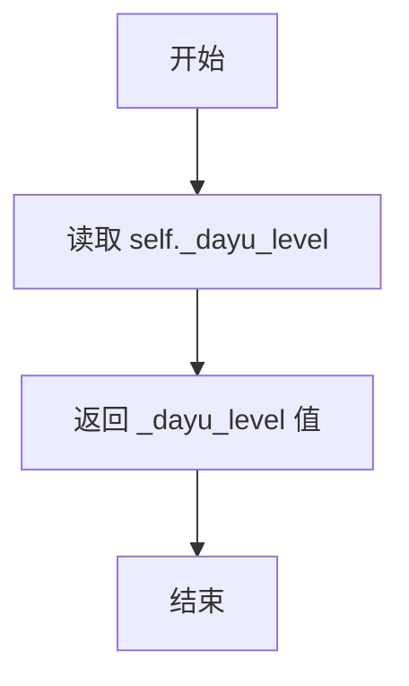

#### 带注释源码

```python
def get_dayu_level(self):
    """Get MLabel level."""
    # 返回内部存储的等级整数变量
    return self._dayu_level
```

---

### `MLabel.set_dayu_level`

设置 MLabel 组件的 dayu_level（等级）属性值，并触发样式更新。

参数：
- `value`：`int`，要设置的等级值（例如 1, 2, 3, 4 对应 H1-H4）。

返回值：`None`，无返回值（void）。

#### 流程图

```mermaid
graph TD
    A[开始] --> B[接收 value 参数]
    B --> C[赋值 self._dayu_level = value]
    C --> D[调用 self.style().polish self]
    D --> E[结束]
```

#### 带注释源码

```python
def set_dayu_level(self, value):
    """Set MLabel level"""
    # 1. 更新内部状态
    self._dayu_level = value
    # 2. 通知 Qt 样式系统重新应用样式策略
    self.style().polish(self)
```


### `MLabel.get_dayu_type` / `MLabel.set_dayu_type`

该方法对用于获取和设置 `MLabel` 控件的视觉类型（`dayu_type`）。`dayu_type` 属性通常用于定义标签的颜色风格或语义状态（如普通、警告、危险），通过 Qt 的属性系统与样式表绑定。Setter 方法在设置值后会调用 `style().polish(self)` 触发界面重绘。

参数：

- `self`：`MLabel`，表示 MLabel 的实例本身。
- `value`：`str`，要设置的类型值（例如 `"secondary"`, `"warning"`, `"danger"` 或空字符串）。

返回值：

- `get_dayu_type` 返回：`str`，当前存储的 `_dayu_type` 值。
- `set_dayu_type` 返回：`None`（无返回值）。

#### 流程图

```mermaid
flowchart TD
    A[Start] --> B{调用方法}
    B -->|Setter| C[将 value 赋值给 self._dayu_type]
    C --> D[调用 self.style().polish(self)]
    D --> E[End]
    B -->|Getter| F[返回 self._dayu_type]
    F --> E
```

#### 带注释源码

```python
def get_dayu_type(self):
    """
    获取 MLabel 的类型。
    
    :return: str, 当前设定的 dayu_type 值。
    """
    return self._dayu_type

def set_dayu_type(self, value):
    """
    设置 MLabel 的类型，并触发样式更新。
    
    :param value: str, 新的类型值。
    """
    self._dayu_type = value
    # 调用 polish 通知样式系统重新应用样式策略
    self.style().polish(self)
```


### 1. 一段话描述

本代码定义了一个名为 `MLabel` 的自定义 Qt 标签组件，继承自 `QtWidgets.QLabel`，用于在不同层级和样式下显示文本。核心功能包括通过 Qt Property 机制实现动态样式属性（如级别、类型、下划线、删除线、加粗、标记、代码边框等），并支持文本省略模式。本次提取的两个方法 `get_dayu_underline` 和 `set_dayu_underline` 用于获取和设置文本的下划线样式属性。

### 2. 文件的整体运行流程

该模块定义了 `MLabel` 类，供其他模块导入使用。当实例化 `MLabel` 对象时，会初始化多个私有属性（如下划线、删除线、加粗等样式标志），并通过 Qt 的 Property 机制将它们暴露为 Qt 属性，使 Qt 样式表（QSS）能够感知这些属性的变化。当调用 `set_dayu_underline(True)` 时，会设置内部 `_dayu_underline` 标志并触发样式重绘。

### 3. 类的详细信息

#### 类名：`MLabel`

**类字段：**

- `SecondaryType`：str，secondary 类型标识
- `WarningType`：str，warning 类型标识
- `DangerType`：str，danger 类型标识
- `H1Level`：int，H1 级别（值为1）
- `H2Level`：int，H2 级别（值为2）
- `H3Level`：int，H3 级别（值为3）
- `H4Level`：int，H4 级别（值为4）

**类方法：** 包含多个 get/set 方法用于属性操作，以及链式调用样式方法（h1/h2/h3/h4、secondary、warning、danger、strong、mark、code、border、delete、underline）等。

---

### MLabel.get_dayu_underline

获取标签的下划线样式属性值。

参数： 无

返回值：`bool`，返回当前下划线样式的启用状态（True 为启用，False 为禁用）。

#### 流程图

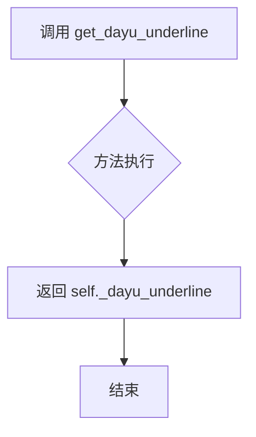

#### 带注释源码

```python
def get_dayu_underline(self):
    """
    获取 MLabel 的下划线样式属性。
    
    该方法为 Qt Property 系统提供读取接口，配合 dayu_underline 属性使用。
    当 QSS 或 Python 代码访问 dayu_underline 属性时，会调用此方法。
    
    Returns:
        bool: 当前下划线样式的启用状态
    """
    return self._dayu_underline
```

---

### MLabel.set_dayu_underline

设置标签的下划线样式属性值。

参数：

- `value`：`bool`，要设置的下划线样式状态（True 启用下划线，False 禁用）

返回值：`None`（无返回值），该方法通过副作用（修改内部属性并触发样式重绘）生效。

#### 流程图

```mermaid
flowchart TD
    A[调用 set_dayu_underline] --> B[接收 value 参数]
    B --> C[设置 self._dayu_underline = value]
    C --> D[调用 self.style().polish触发样式更新]
    D --> E[结束]
```

#### 带注释源码

```python
def set_dayu_underline(self, value):
    """
    设置 MLabel 的下划线样式。
    
    该方法为 Qt Property 系统提供写入接口。当设置 dayu_underline 属性时，
    会更新内部 _dayu_underline 标志，并调用 style().polish() 通知 Qt
    样式系统重新应用样式。
    
    Params:
        value (bool): 下划线样式启用标志，True 为启用，False 为禁用
    
    Returns:
        None
    """
    # 更新内部下划线状态标志
    self._dayu_underline = value
    # 触发 Qt 样式系统重新应用样式
    self.style().polish(self)
```

---

### 5. 关键组件信息

| 组件名称 | 一句话描述 |
|---------|-----------|
| MLabel | 继承自 QLabel 的自定义标签组件，支持多种样式属性 |
| QtCore.Property | Qt 元对象系统属性声明宏，用于暴露 Python 属性到 Qt |
| dayu_underline Property | 通过 Qt Property 机制暴露的下划线样式属性 |

---

### 6. 潜在的技术债务或优化空间

1. **重复代码模式**：多个 get/set 方法（如 get_dayu_underline/set_dayu_underline、get_dayu_delete/set_dayu_delete 等）结构高度相似，可考虑使用描述符（Descriptor）或装饰器模式进行重构，减少代码冗余。

2. **错误处理缺失**：set_dayu_underline 方法未对 value 参数进行类型校验，如果传入非布尔值可能导致意外行为。

3. **属性绑定错误**：在类底部定义的 `dayu_elide_mod` Property 中，getter 和 setter 都错误地引用了 `get_dayu_code` 和 `set_dayu_code`，应该分别指向 `get_elide_mode` 和 `set_elide_mode`，这是一个明显的复制粘贴错误。

4. **文档不完整**：get_dayu_underline 方法缺少 docstring，而其他方法有完整的文档说明。

---

### 7. 其它项目

**设计目标与约束：**
- 该类设计为链式调用风格，多个样式设置方法（如 `underline()`、`strong()`）返回 `self`，方便 fluent API 使用。
- 通过 Qt Property 机制使属性可直接被 QSS 样式表访问，实现样式与逻辑分离。

**错误处理与异常设计：**
- 当前实现未对参数类型进行严格校验，依赖于 Python 的动态类型特性。
- 建议在 set 方法中添加 `isinstance(value, bool)` 检查，并在类型错误时抛出 `TypeError`。

**数据流与状态机：**
- 状态存储在多个布尔类型私有属性中（`_dayu_underline`、`_dayu_delete` 等）。
- 状态变更通过 `style().polish(self)` 触发 UI 更新，属于典型的观察者模式应用。

**外部依赖与接口契约：**
- 依赖 PySide6（Qt for Python）库。
- 通过 `dayu_theme` 模块导入超链接样式配置。
- 公开接口包括：Qt Property 属性、链式样式方法（h1/h2/h3/h4 等）、setText/getText 等。


### `MLabel.get_dayu_delete` / `MLabel.set_dayu_delete`

该方法对用于获取和设置标签的删除线（strikethrough）样式属性，是 MLabel 组件的 Qt 属性访问器，用于控制文本的删除线显示效果。

参数：

- `self`：`MLabel`，表示方法所属的实例对象
- `value`：`bool`，要设置的删除线样式状态值（True 为启用删除线，False 为禁用）

返回值：

- `get_dayu_delete` 返回 `bool`，表示当前是否启用删除线样式
- `set_dayu_delete` 返回 `None`，该方法为 setter 方法，无显式返回值

#### 流程图

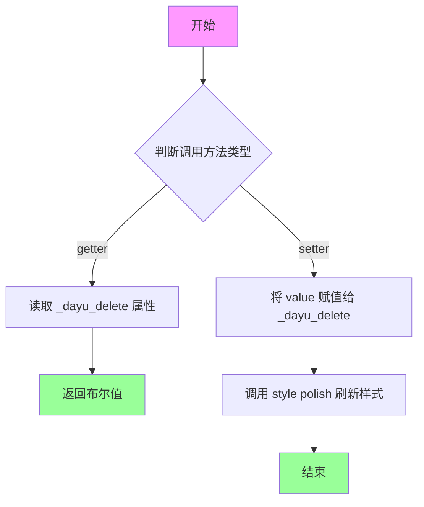

#### 带注释源码

```python
def get_dayu_delete(self):
    """
    获取 MLabel 的删除线样式状态
    
    该方法作为 Qt Property 的 getter 访问器使用，
    返回当前标签是否启用删除线样式
    
    Returns:
        bool: 当前删除线样式的启用状态
              True 表示启用删除线，False 表示禁用
    """
    return self._dayu_delete


def set_dayu_delete(self, value):
    """
    设置 MLabel 的删除线样式
    
    该方法作为 Qt Property 的 setter 访问器使用，
    用于启用或禁用标签文本的删除线样式。
    设置后调用 style().polish(self) 刷新 Qt 样式系统
    
    Args:
        value (bool): 要设置的删除线样式状态
                      True 表示启用删除线样式
                      False 表示禁用删除线样式
    """
    # 将传入的布尔值赋给内部属性
    self._dayu_delete = value
    # 调用 Qt 样式系统刷新控件外观
    # polish() 会触发样式表重新应用
    self.style().polish(self)
```

#### 关联的 Qt Property 定义

```python
# 在类定义末尾，通过 Qt Property 将 getter/setter 方法绑定为 Qt 属性
# 这样可以在 Qt 样式表和 Qt Designer 中访问此属性
dayu_delete = QtCore.Property(bool, get_dayu_delete, set_dayu_delete)
```

#### 使用示例

```python
# 通过方法调用
label = MLabel("Hello World")
label.set_dayu_delete(True)   # 启用删除线
is_deleted = label.get_dayu_delete()  # 返回 True

# 通过 Qt Property 调用（等价于上述方法调用）
label.setProperty("dayu_delete", True)
value = label.property("dayu_delete")
```

#### 相关方法

| 方法名 | 功能描述 |
|--------|----------|
| `delete()` | 便捷方法，内部调用 `set_dayu_delete(True)` 并返回 self |
| `set_dayu_mark()` | 设置标记样式 |
| `set_dayu_underline()` | 设置下划线样式 |
| `set_dayu_strong()` | 设置粗体样式 |
| `set_dayu_code()` | 设置代码样式 |

#### 技术债务与优化空间

1. **缺少输入验证**：`set_dayu_delete` 方法未对 `value` 参数进行类型检查，如果传入非布尔值可能导致潜在问题
2. **文档注释不完整**：部分方法缺少完整的参数和返回值说明
3. **样式刷新机制**：`style().polish(self)` 在每个 setter 中单独调用，如果有多个属性连续设置，会导致样式系统多次刷新，建议考虑批量更新机制
4. **属性一致性**：类中定义了 `dayu_elide_mod` 属性，但其 getter/setter 错误地引用了 `dayu_code` 相关方法


### `MLabel.set_dayu_strong`

设置标签的加粗样式属性，通过 Qt 的 property 机制与 Qt 样式系统集成。

参数：

-  `value`：`bool`，要设置的加粗样式状态，True 为启用加粗，False 为禁用加粗

返回值：`None`，无返回值，仅执行属性设置和样式刷新

#### 流程图

```mermaid
flowchart TD
    A[开始 set_dayu_strong] --> B{检查 value 类型}
    B -->|类型正确| C[将 value 赋值给 self._dayu_strong]
    B -->|类型错误| D[Python 会在赋值时抛出 TypeError]
    C --> E[调用 self.style().polish&#40;self&#41; 刷新样式]
    E --> F[结束]
```

#### 带注释源码

```python
def set_dayu_strong(self, value):
    """
    设置 MLabel 的加粗样式属性。
    
    该方法通过 Qt 的 property 机制被调用，用于设置标签的加粗显示效果。
    设置后调用 style().polish() 刷新控件样式，使更改立即生效。
    
    参数:
        value (bool): 布尔值，True 启用加粗样式，False 禁用加粗样式
        
    返回:
        None: 无返回值
        
    示例:
        label = MLabel("加粗文本")
        label.set_dayu_strong(True)  # 启用加粗
        # 或通过 Qt 属性方式
        label.setProperty("dayu_strong", True)
    """
    self._dayu_strong = value  # 将传入的布尔值存储到实例变量
    self.style().polish(self)  # 调用 Qt 样式系统刷新控件外观
```

---

### `MLabel.get_dayu_strong`

获取标签的加粗样式属性当前状态。

参数：

- （无额外参数，仅包含隐式 self）

返回值：`bool`，返回当前加粗样式的启用状态，True 表示已启用加粗，False 表示未启用

#### 流程图

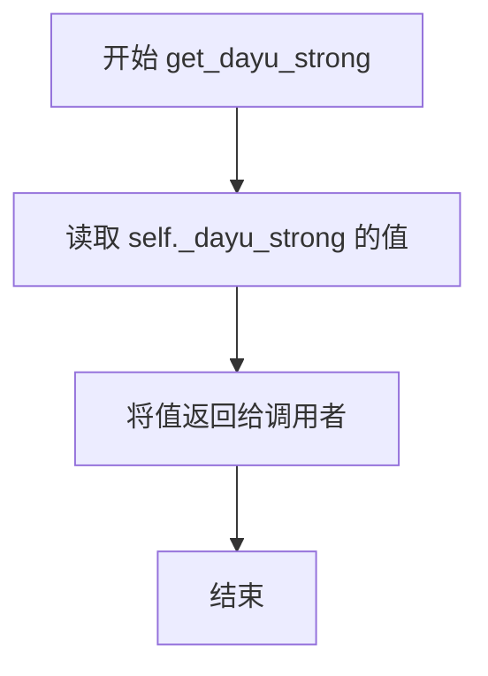

#### 带注释源码

```python
def get_dayu_strong(self):
    """
    获取 MLabel 的加粗样式属性。
    
    该方法作为 Qt property 的 getter 部分，用于获取当前标签的加粗样式状态。
    Qt 属性系统会自动调用此方法获取属性值。
    
    参数:
        无（隐式参数 self 指向实例本身）
        
    返回:
        bool: 当前加粗样式的状态，True 表示启用，False 表示未启用
        
    示例:
        label = MLabel("文本")
        label.set_dayu_strong(True)
        is_strong = label.get_dayu_strong()  # 返回 True
        # 或通过 Qt 属性方式
        is_strong = label.property("dayu_strong")  # 返回 True
    """
    return self._dayu_strong  # 返回实例变量中存储的加粗状态
```

---

### Qt Property 注册

上述 getter 和 setter 方法通过以下代码注册为 Qt 属性：

```python
# 将 dayu_strong 注册为 Qt 属性，类型为 bool
# 关联 getter: get_dayu_strong
# 关联 setter: set_dayu_strong
dayu_strong = QtCore.Property(bool, get_dayu_strong, set_dayu_strong)
```

这使得可以通过 `setProperty()` / `property()` 方法以及 QSS 样式表来动态访问和设置加粗属性。


### `MLabel.get_dayu_mark`

获取标签的标记（mark）样式属性值。

参数：

- `self`：`MLabel`，表示 MLabel 类的实例对象本身

返回值：`bool`，返回当前标签的标记样式状态（True 表示启用标记样式，False 表示未启用）

#### 流程图

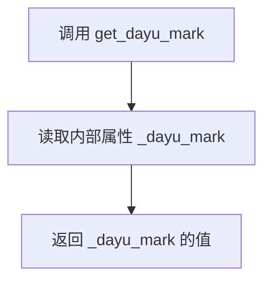

#### 带注释源码

```python
def get_dayu_mark(self):
    """
    获取 MLabel 的标记样式属性。
    
    :return: bool - 当前标记样式的启用状态
    """
    return self._dayu_mark
```

---

### `MLabel.set_dayu_mark`

设置标签的标记（mark）样式属性，并刷新样式。

参数：

- `self`：`MLabel`，表示 MLabel 类的实例对象本身
- `value`：`bool`，要设置的标记样式状态（True 启用标记样式，False 禁用标记样式）

返回值：无（`None`）

#### 流程图

```mermaid
flowchart TD
    A[调用 set_dayu_mark] --> B[将 value 赋值给内部属性 _dayu_mark]
    B --> C[调用 self.style().polish 刷新样式]
    C --> D[方法结束]
```

#### 带注释源码

```python
def set_dayu_mark(self, value):
    """
    设置 MLabel 的标记样式。
    
    :param value: bool - 标记样式的目标状态
    """
    self._dayu_mark = value
    self.style().polish(self)
```

---

### `MLabel.dayu_mark` 属性

通过 Qt 属性系统定义的读写属性，关联上述 getter 和 setter 方法。

#### 属性定义源码

```python
dayu_mark = QtCore.Property(bool, get_dayu_mark, set_dayu_mark)
```


### `MLabel.get_dayu_code`

获取 MLabel 组件的代码样式属性值。

参数：

- `self`：隐式参数，MLabel 实例本身

返回值：`bool`，返回当前是否为代码样式（True 表示启用代码样式，False 表示未启用）

#### 流程图

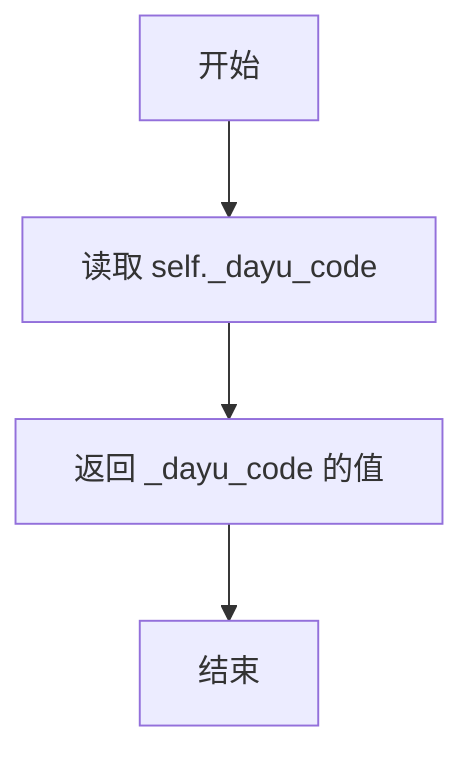

#### 带注释源码

```python
def get_dayu_code(self):
    """
    获取 MLabel 的代码样式属性。
    
    Returns:
        bool: 当前代码样式的布尔值状态
    """
    return self._dayu_code
```

---

### `MLabel.set_dayu_code`

设置 MLabel 组件的代码样式属性，并触发样式更新。

参数：

- `self`：隐式参数，MLabel 实例本身
- `value`：`bool`，要设置的代码样式状态（True 为启用代码样式，False 为禁用）

返回值：`None`，无返回值

#### 流程图

```mermaid
flowchart TD
    A[开始] --> B[接收 value 参数]
    B --> C[将 value 赋值给 self._dayu_code]
    C --> D[调用 self.style().polish(self) 刷新样式]
    D --> E[结束]
```

#### 带注释源码

```python
def set_dayu_code(self, value):
    """
    设置 MLabel 代码样式。
    
    Args:
        value: bool, 是否启用代码样式
    """
    # 将传入的值保存到内部属性
    self._dayu_code = value
    # 调用 Qt 样式系统刷新组件外观
    self.style().polish(self)
```

---

### `QtCore.Property` 绑定

在代码中，这两个方法通过 Qt 的属性系统绑定在一起：

```python
# 将 get_dayu_code 和 set_dayu_code 绑定为 Qt 属性
# 使得可以在 Qt 样式表或 QSS 中通过 dayu_code 属性访问
dayu_code = QtCore.Property(bool, get_dayu_code, set_dayu_code)
```

这样设计允许：
1. Python 代码中直接通过 `label.dayu_code = True` 赋值
2. Qt 样式表中通过 `QLabel[dayu_code="true"]` 选择器应用样式
3. 通过 `label.property("dayu_code")` 获取属性值


### MLabel.set_dayu_border

设置 MLabel 的边框样式（Qt Property Setter）。

参数：
- `value`：`bool`，布尔值，用于指定是否显示边框。

返回值：`None`，无返回值。

#### 流程图

```mermaid
graph TD
    A([开始 set_dayu_border]) --> B[设置属性 self._dayu_border = value]
    B --> C[调用 self.style().polish]
    C --> D([结束])
```

#### 带注释源码

```python
def set_dayu_border(self, value):
    """Set MLabel border style."""
    # 将传入的布尔值 value 赋值给实例属性 _dayu_border，用于保存边框的启用状态
    self._dayu_border = value
    # 调用 Qt 样式系统的 polish 方法，强制刷新控件样式以应用边框效果
    self.style().polish(self)
```


### `MLabel.get_elide_mode` / `MLabel.set_elide_mode`

获取或设置标签的文本省略模式，用于控制在文本超出标签宽度时的省略显示方式（如左侧省略、右侧省略、中间省略或不省略）。

参数：

- `value`：`int`（QtCore.Qt.TextElideMode），省略模式值，可选值为 Qt.ElideLeft（左侧省略）、Qt.ElideMiddle（中间省略）、Qt.ElideRight（右侧省略）、Qt.ElideNone（不省略）

返回值：`get_elide_mode` 返回 `QtCore.Qt.TextElideMode`，表示当前设置的省略模式；`set_elide_mode` 返回 `None`。

#### 流程图

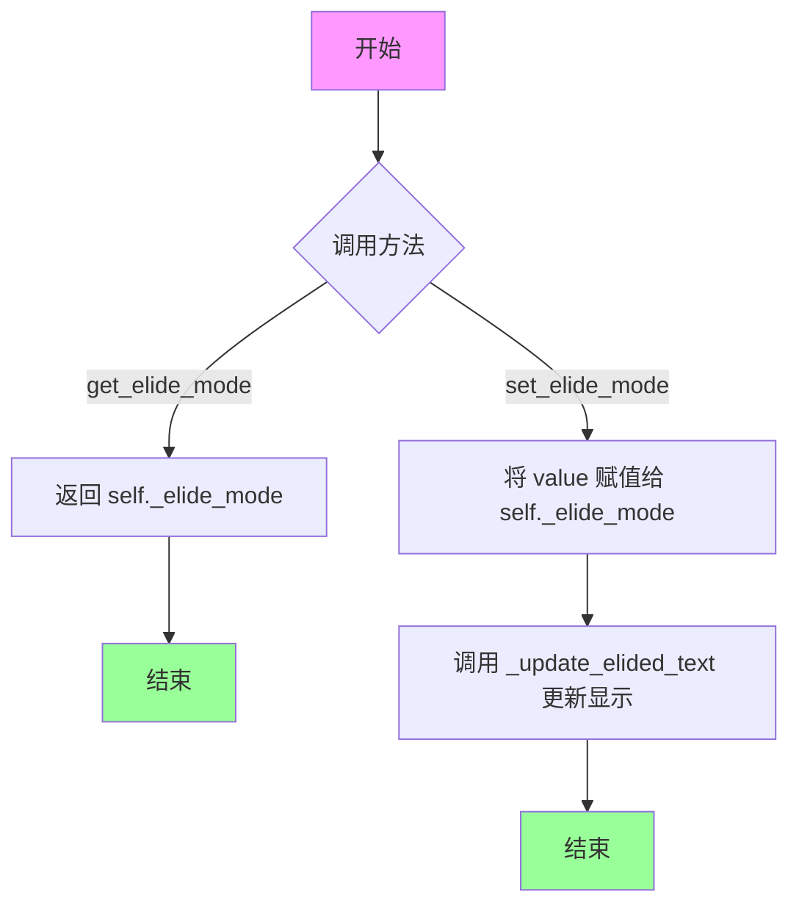

#### 带注释源码

```python
def get_elide_mode(self):
    """获取标签的文本省略模式
    
    Returns:
        QtCore.Qt.TextElideMode: 当前设置的省略模式，
        可能值为 Qt.ElideLeft、Qt.ElideMiddle、Qt.ElideRight 或 Qt.ElideNone
    """
    return self._elide_mode

def set_elide_mode(self, value):
    """设置标签的文本省略模式
    
    只有当文本超出标签宽度时，省略模式才会生效。
    设置后会自动调用 _update_elided_text() 方法更新显示的文本。
    
    Args:
        value (int): 省略模式值，应为 QtCore.Qt.TextElideMode 枚举值
            - Qt.ElideLeft: 左侧省略，用...代替
            - Qt.ElideMiddle: 中间省略，用...代替
            - Qt.ElideRight: 右侧省略，用...代替
            - Qt.ElideNone: 不省略，完全显示文本
    """
    # 将传入的省略模式值保存到实例变量
    self._elide_mode = value
    # 调用内部方法更新标签上显示的文本（应用省略效果）
    self._update_elided_text()
```


### `MLabel.minimumSizeHint`

重写最小尺寸提示方法，根据标签是否启用自动换行返回不同的尺寸建议。如果启用了自动换行，则调用父类的默认实现；否则返回宽度为1像素、高度为字体高度（根据当前字体计算）的最小尺寸。

参数：

- `self`：`MLabel`，MLabel 类的实例对象

返回值：`QtCore.QSize`，返回标签的最小尺寸建议

#### 流程图

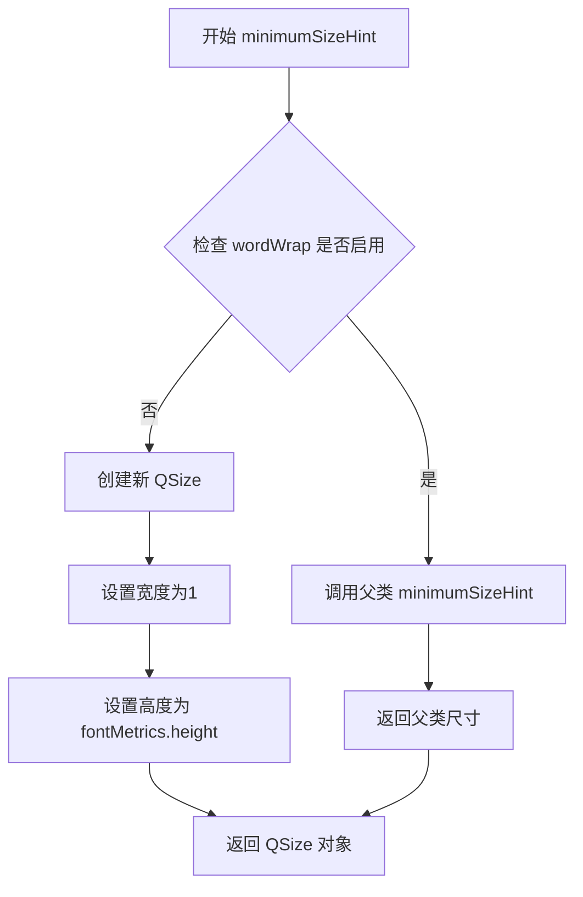

#### 带注释源码

```python
def minimumSizeHint(self):
    """
    重写 QLabel 的 minimumSizeHint 方法
    根据是否启用自动换行返回不同的最小尺寸
    """
    # 检查标签是否启用了自动换行功能
    if self.wordWrap():
        # 如果启用了自动换行，调用父类(QLabel)的默认实现
        # 让 Qt 自动计算合适的尺寸
        return super(MLabel, self).minimumSizeHint()
    
    # 如果未启用自动换行
    # 返回自定义的最小尺寸: 宽度为1像素, 高度为当前字体的高度
    # 这样可以确保标签至少显示一行文字的高度
    return QtCore.QSize(1, self.fontMetrics().height())
```


### `MLabel.text`

重写基类方法，用于返回原始未修改的文本内容。

参数：

- `self`：`MLabel`，隐式参数，代表当前 MLabel 实例

返回值：`str`，返回存储在 `text` 属性中的原始文本

#### 流程图

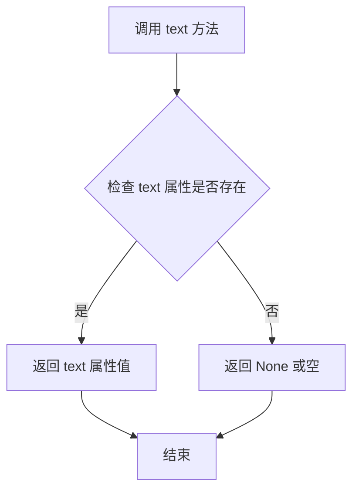

#### 带注释源码

```python
def text(self):
    """
    Overridden base method to return the original unmodified text

    :returns:   The original unmodified text
    """
    # 通过 Qt 的 property 机制获取 'text' 属性的原始值
    # 这里绕过了 QLabel 的 text() 方法的默认处理逻辑
    # 直接获取存储在 Qt 属性系统中的原始文本
    return self.property("text")
```


### `MLabel.setText`

重写设置文本的方法，用于设置标签文本并处理文本省略（当文本超出标签宽度时显示省略号），同时将文本设置为工具提示。

参数：

- `text`：`str`，要设置的文本内容

返回值：`None`，该方法无返回值

#### 流程图

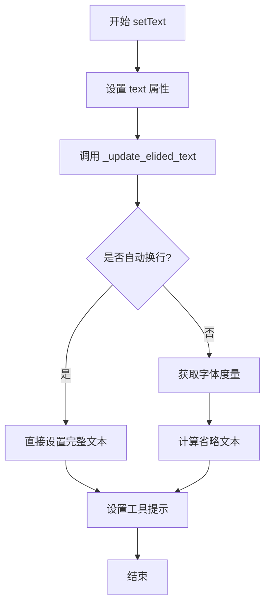

#### 带注释源码

```python
def setText(self, text):
    """
    Overridden base method to set the text on the label

    :param text:    The text to set on the label
    """
    # 将文本存储到 Qt 属性系统中，供后续获取原始文本使用
    self.setProperty("text", text)
    # 根据当前省略模式和标签宽度更新省略后的文本显示
    self._update_elided_text()
    # 将完整文本设置为工具提示，方便用户查看被省略的内容
    self.setToolTip(text)
```


### `MLabel.set_link`

设置超链接，允许用户点击链接在浏览器中打开。该方法使用富文本 HTML 格式设置超链接，支持自定义链接文本。

参数：

- `self`：`MLabel`，隐式的当前实例对象
- `href`：`str`，超链接的 href 属性，指定链接目标 URL
- `text`：`str`，可选参数，超链接的显示文本，默认为 None（当 text 为 None 时，显示 href 本身）

返回值：`None`，无返回值

#### 流程图

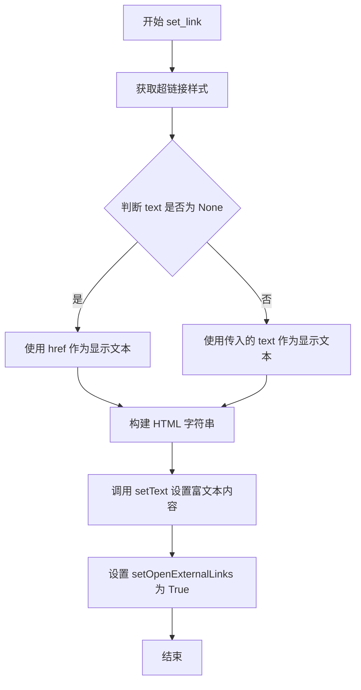

#### 带注释源码

```python
def set_link(self, href, text=None):
    """
    设置超链接

    :param href: The href attr of a tag  # 超链接的目标地址
    :param text: The a tag text content   # 超链接的显示文本，可选
    """
    # 这里富文本的超链接必须使用 html 的样式，使用 qss 不起作用
    # 获取预定义的超链接样式模板
    link_style = dayu_theme.hyperlink_style
    
    # 格式化 HTML 字符串，构建完整的超链接标签
    # 如果 text 为 None，则显示 href 本身作为链接文本
    self.setText('{style}<a href="{href}">{text}</a>'.format(
        style=link_style,      # 超链接的 CSS 样式
        href=href,             # 链接目标 URL
        text=text or href      # 显示文本，默认为 href
    ))
    
    # 启用自动打开外部链接（在新窗口或浏览器中打开）
    self.setOpenExternalLinks(True)
```


### `MLabel._update_elided_text`

更新标签的省略文本，当文本超出标签宽度时显示省略号

参数：

- `self`：`MLabel`，MLabel 实例本身，隐式参数

返回值：`None`，无返回值，仅更新标签显示的文本

#### 流程图

```mermaid
flowchart TD
    A[开始] --> B[获取 text 属性]
    B --> C{text 是否为空}
    C -->|是| D[使用空字符串]
    C -->|否| E[保持原文本]
    D --> F{wordWrap 是否为真}
    E --> F
    F -->|是| G[调用父类 setText 设置完整文本]
    F -->|否| H[获取 fontMetrics]
    G --> I[结束]
    H --> J[计算省略文本 elidedText]
    J --> K[调用父类 setText 设置省略文本]
    K --> I
```

#### 带注释源码

```python
def _update_elided_text(self):
    """
    Update the elided text on the label
    """
    # 从 label 的属性中获取存储的原始文本
    text = self.property("text")
    # 如果文本为空（None），则使用空字符串替代
    text = text if text else ""
    
    # 如果启用了自动换行，则不需要省略文本，直接显示完整内容
    if self.wordWrap():
        # 调用父类 QLabel 的 setText 方法设置完整文本
        super(MLabel, self).setText(text)
        # 直接返回，不再进行省略处理
        return
    
    # 获取当前 label 的字体度量对象，用于计算文本宽度
    _font_metrics = self.fontMetrics()
    
    # 计算省略文本：text 为原始文本，self._elide_mode 为省略模式，
    # self.width() - 2 * 2 为可用宽度（左右各留 2 像素边距）
    _elided_text = _font_metrics.elidedText(text, self._elide_mode, self.width() - 2 * 2)
    
    # 调用父类 QLabel 的 setText 方法设置省略后的文本
    super(MLabel, self).setText(_elided_text)
```


### `MLabel.resizeEvent`

重写自 `QLabel.resizeEvent`，当窗口大小发生变化时自动触发，用于更新文本的省略显示效果。

参数：

- `event`：`QtGui.QResizeEvent`，包含窗口调整事件的信息（如新窗口尺寸）

返回值：`None`，无返回值（重写父类方法）

#### 流程图

```mermaid
flowchart TD
    A[窗口大小发生变化] --> B{调用 resizeEvent}
    B --> C[调用 _update_elided_text 方法]
    C --> D{检查 wordWrap 是否启用}
    D -->|是| E[获取原始文本]
    E --> F[调用父类 setText 设置完整文本]
    D -->|否| G[获取 fontMetrics 字体度量]
    G --> H[计算省略文本 elidedText]
    H --> I[调用父类 setText 设置省略文本]
    F --> J[流程结束]
    I --> J
```

#### 带注释源码

```python
def resizeEvent(self, event):
    """
    Overridden base method called when the widget is resized.

    :param event:    The resize event
    """
    # 调用内部方法 _update_elided_text 来更新省略文本
    # 该方法会根据当前的字体和标签宽度重新计算文本是否需要省略显示
    self._update_elided_text()
```


### `MLabel.h1/h2/h3/h4`

该组方法用于链式设置标题级别，通过设置 `dayu_level` 属性来改变标签的标题层级（H1-H4），并返回 `self` 以支持方法链式调用。

参数：

- `self`：`MLabel`，隐式参数，当前 MLabel 实例

返回值：`MLabel`，返回自身实例以支持链式调用

#### 流程图

```mermaid
flowchart TD
    A[调用 h1/h2/h3/h4 方法] --> B{判断方法类型}
    B -->|h1| C[设置 dayu_level = H1Level = 1]
    B -->|h2| D[设置 dayu_level = H2Level = 2]
    B -->|h3| E[设置 dayu_level = H3Level = 3]
    B -->|h4| F[设置 dayu_level = H4Level = 4]
    C --> G[调用 set_dayu_level 设置属性]
    D --> G
    E --> G
    F --> G
    G --> H[调用 style.polish 刷新样式]
    H --> I[返回 self 实例]
```

#### 带注释源码

```python
def h1(self):
    """
    Set QLabel with h1 type.
    
    将标签设置为一级标题样式，
    通过设置 dayu_level 属性为 H1Level(1) 实现，
    并返回 self 以支持链式调用。
    
    :return: 返回自身实例 MLabel，支持链式调用
    :rtype: MLabel
    """
    self.set_dayu_level(MLabel.H1Level)  # 设置级别为1（H1）
    return self  # 返回自身以支持链式调用

def h2(self):
    """
    Set QLabel with h2 type.
    
    将标签设置为二级标题样式，
    通过设置 dayu_level 属性为 H2Level(2) 实现。
    
    :return: 返回自身实例 MLabel，支持链式调用
    :rtype: MLabel
    """
    self.set_dayu_level(MLabel.H2Level)  # 设置级别为2（H2）
    return self

def h3(self):
    """
    Set QLabel with h3 type.
    
    将标签设置为三级标题样式，
    通过设置 dayu_level 属性为 H3Level(3) 实现。
    
    :return: 返回自身实例 MLabel，支持链式调用
    :rtype: MLabel
    """
    self.set_dayu_level(MLabel.H3Level)  # 设置级别为3（H3）
    return self

def h4(self):
    """
    Set QLabel with h4 type.
    
    将标签设置为四级标题样式，
    通过设置 dayu_level 属性为 H4Level(4) 实现。
    
    :return: 返回自身实例 MLabel，支持链式调用
    :rtype: MLabel
    """
    self.set_dayu_level(MLabel.H4Level)  # 设置级别为4（H4）
    return self
```


### `MLabel.secondary` / `MLabel.warning` / `MLabel.danger`

这三个方法用于链式设置文本类型（secondary/warning/danger），通过调用 `set_dayu_type()` 方法设置标签的样式类型，并返回 `self` 以支持方法链式调用，实现流畅的 fluent 接口设计。

参数：

- `self`：`MLabel`，隐式参数，表示当前 MLabel 实例

返回值：`MLabel`，返回当前实例本身，支持链式调用

#### 流程图

```mermaid
flowchart TD
    A[调用 secondary/warning/danger] --> B{调用方法}
    B --> C[secondary: set_dayu_type<br/>'secondary']
    B --> D[warning: set_dayu_type<br/>'warning']
    B --> E[danger: set_dayu_type<br/>'danger']
    C --> F[set_dayu_type 内部设置<br/>self._dayu_type = value]
    D --> F
    E --> F
    F --> G[self.style().polish<br/>(刷新样式)]
    G --> H[return self<br/>(返回当前实例)]
    H --> I[支持链式调用<br/>如 label.secondary().strong()]
```

#### 带注释源码

```python
def secondary(self):
    """Set QLabel with secondary type."""
    # 设置标签的 dayu_type 属性为 SecondaryType ("secondary")
    # Qt Property 系统会触发 set_dayu_type 方法
    self.set_dayu_type(MLabel.SecondaryType)
    # 返回 self，实现链式调用
    # 例如: label.secondary().strong() 或 label.warning().h1()
    return self

def warning(self):
    """Set QLabel with warning type."""
    # 设置标签的 dayu_type 属性为 WarningType ("warning")
    # 内部会调用 self.style().polish(self) 刷新 Qt 样式
    self.set_dayu_type(MLabel.WarningType)
    # 返回 self 以支持方法链式调用
    return self

def danger(self):
    """Set QLabel with danger type."""
    # 设置标签的 dayu_type 属性为 DangerType ("danger")
    # 配合 Qt stylesheet 实现不同颜色的文本样式
    self.set_dayu_type(MLabel.DangerType)
    # 返回 self，支持链式调用
    return self
```

---

**使用示例**

```python
# 链式调用示例
label = MLabel("警告信息").warning()
label2 = MLabel("危险操作").danger()
label3 = MLabel("次要信息").secondary()
label4 = MLabel("标题").h1().secondary()
```


### MLabel.{strong/mark/code/border/delete/underline}

该方法用于链式设置标签的各种样式效果（粗体/标记/代码/边框/删除线/下划线），通过将对应的样式属性设置为 True 并返回自身实例实现 Fluent Interface 风格的链式调用。

参数：
- `self`：无参数，仅类方法隐式接收的实例引用

返回值：`MLabel`，返回自身实例以支持链式调用（例如 `label.strong().mark().underline()`）

#### 流程图

```mermaid
flowchart TD
    A[开始] --> B{检查样式属性值}
    B -->|已为 True| C[直接返回 self]
    B -->|为 False 或未设置| D[调用对应的 set_dayu_xxx 方法设置属性为 True]
    D --> E[调用 self.style().polish 刷新样式]
    E --> F[返回 self]
    C --> F
```

#### 带注释源码

```python
def strong(self):
    """Set QLabel with strong style."""
    # 调用属性 setter，将 _dayu_strong 设置为 True
    self.set_dayu_strong(True)
    # 刷新 Qt 样式系统，使样式生效
    self.style().polish(self)
    # 返回自身实例，支持链式调用
    return self

def mark(self):
    """Set QLabel with mark style."""
    self.set_dayu_mark(True)
    self.style().polish(self)
    return self

def code(self):
    """Set QLabel with code style."""
    self.set_dayu_code(True)
    self.style().polish(self)
    return self

def border(self):
    """Set QLabel with border style."""
    self.set_dayu_border(True)
    self.style().polish(self)
    return self

def delete(self):
    """Set QLabel with delete style."""
    self.set_dayu_delete(True)
    self.style().polish(self)
    return self

def underline(self):
    """Set QLabel with underline style."""
    self.set_dayu_underline(True)
    self.style().polish(self)
    return self
```

#### 补充说明

**设计模式**：此方法组实现了 Fluent Interface（流畅接口）设计模式，允许通过点号连接多个方法调用，形成可读的链式调用链。

**样式属性对应关系**：

| 方法名 | 样式属性 | Qt 属性名 |
|--------|----------|-----------|
| strong | 粗体 | dayu_strong |
| mark | 高亮标记 | dayu_mark |
| code | 代码样式 | dayu_code |
| border | 边框 | dayu_border |
| delete | 删除线 | dayu_delete |
| underline | 下划线 | dayu_underline |

**使用示例**：
```python
# 链式调用设置多种样式
label = MLabel("Important Text").strong().mark().underline()
label2 = MLabel("Code Snippet").code().border()
label3 = MLabel("Deleted Content").delete()
```

**技术债务/优化空间**：
1. **代码重复**：六个方法实现逻辑几乎完全相同，存在明显的代码重复，可通过装饰器或工厂方法重构
2. **border 方法注释错误**：注释写的是 "Set QLabel with code style"，应改为 "Set QLabel with border style"
3. **无法单独关闭样式**：当前实现只能设置为 True，无法通过链式调用关闭某个样式（如需关闭需直接调用 setter 设置为 False）


### `MLabel.event`

重写事件处理方法，用于处理动态属性变化事件，当 `dayu_text` 属性发生变化时自动更新标签文本。

参数：

- `self`：`MLabel`，当前 MLabel 实例（隐式参数）
- `event`：`QtCore.QEvent`，Qt 事件对象，包含事件类型和属性信息

返回值：`bool`，返回父类 `QLabel.event()` 的处理结果，指示事件是否被处理

#### 流程图

```mermaid
flowchart TD
    A[开始 event 处理] --> B{event.type == DynamicPropertyChange?}
    B -->|否| E[调用父类 event 方法]
    B -->|是| C{propertyName == 'dayu_text'?}
    C -->|否| E
    C -->|是| D[调用 setText 更新文本]
    D --> E
    E --> F[返回处理结果]
```

#### 带注释源码

```python
def event(self, event):
    """
    重写事件处理方法，处理动态属性变化事件
    
    :param event: Qt 事件对象，包含事件类型和属性信息
    :returns: 布尔值，表示事件是否被处理
    """
    # 检查事件类型是否为动态属性变化事件
    if event.type() == QtCore.QEvent.DynamicPropertyChange and event.propertyName() == "dayu_text":
        # 当 dayu_text 属性变化时，自动更新标签显示的文本
        self.setText(self.property("dayu_text"))
    # 调用父类的事件处理方法，保持默认行为
    return super(MLabel, self).event(event)
```

## 关键组件


### MLabel 类

自定义QLabel子类，提供标题显示、文本样式控制和链接支持功能。

### 属性系统 (QtCore.Property)

使用Qt元对象系统定义可Qt样式表访问的属性，包括dayu_level、dayu_type、dayu_underline、dayu_delete、dayu_strong、dayu_mark、dayu_code、dayu_border等。

### 文本省略 (Elide) 功能

通过_elide_mode和_update_elided_text方法实现文本过长时的省略显示，支持Qt.ElideLeft/Qt.ElideMiddle/Qt.ElideRight/Qt.ElideNone模式。

### 链接支持 (set_link)

提供set_link方法支持富文本超链接显示，使用HTML格式设置href和文本内容。

### 样式属性方法集

提供链式调用的样式设置方法：underline()、delete()、strong()、mark()、code()、border()，每个方法返回self支持 fluent interface。

### 类型系统

支持SecondaryType、WarningType、DangerType三种文本类型，用于区分重要程度。

### 级别系统

支持H1Level至H4Level四个标题级别，对应h1()至h4()方法。

### 事件处理 (event)

重写event方法监听DynamicPropertyChange事件，当dayu_text属性变化时自动更新显示文本。

### 动态属性更新机制

通过setProperty/getProperty与Qt样式系统交互，style().polish(self)触发样式应用。


## 问题及建议


### 已知问题

- **Property定义错误**：`dayu_elide_mod`属性错误地使用了`get_dayu_code`和`set_dayu_code`作为getter/setter，而实际应该使用`get_elide_mode`和`set_elide_mode`，导致该属性无法正常工作。
- **border方法文档错误**：方法注释写的是"Set QLabel with code style"，但实际功能是设置边框样式，文档与实现不符。
- **缺少参数验证**：`set_elide_mode`方法没有验证传入的value是否为有效的Qt.ElideMode枚举值，可能导致运行时错误。
- **magic number**：`width() - 2 * 2`中的数字2缺乏解释，应该定义为常量或提供注释说明其含义。
- **性能问题**：每次设置属性（underline、delete、strong等）都会调用`style().polish(self)`，连续设置多个属性会产生多次样式重绘，影响性能。

### 优化建议

- **修复Property定义**：将`dayu_elide_mod`属性的getter和setter改为`get_elide_mode`和`set_elide_mode`。
- **修正文档**：将`border`方法的注释改为"Set QLabel with border style"。
- **添加参数验证**：在`set_elide_mode`方法中添加对value类型的验证，确保其为有效的Qt.ElideMode值。
- **提取magic number**：将`width() - 2 * 2`中的2提取为类常量，如`ELIDE_PADDING = 2`，并添加注释说明。
- **批量样式更新**：考虑添加一个`beginUpdate`/`endUpdate`机制，或者在连续修改属性时延迟调用`polish`，减少不必要的样式重绘。
- **统一命名规范**：`dayu_elide_mod`建议改为`dayu_elide_mode`以保持命名一致性。

## 其它


### 设计目标与约束

**设计目标**：提供一种灵活、可配置的文本标签组件，支持多种视觉样式（标题级别、类型、装饰效果），通过Qt属性系统实现样式动态更新，并与PySide6生态无缝集成。

**约束条件**：
- 仅支持PySide6环境
- 依赖dayu_theme模块提供的hyperlink_style样式
- 文本省略模式仅支持Qt.ElideLeft/Qt.ElideMiddle/Qt.ElideRight/Qt.ElideNone
- 链接功能依赖setOpenExternalLinks(True)，仅支持外部链接

### 错误处理与异常设计

**异常处理机制**：
- set_elide_mode方法仅检查参数是否为Qt.TextElideMode枚举值，但未做严格校验，非法值会被静默接受
- set_dayu_type方法未限制value的取值范围，任何字符串均可设置，可能导致样式不生效
- 链接设置set_link中href和text参数均未做URL格式校验

**潜在错误场景**：
- 当text属性为None时，_update_elided_text会将其转换为空字符串处理
- wordWrap()为True时省略文本功能不生效，但不会报错
- 动态属性dayu_text变更时会触发setText，可能导致递归调用（通过event过滤避免）

### 数据流与状态机

**数据流**：
```
用户调用样式方法(h1/strong/delete等)
        ↓
修改私有属性(_dayu_level/_dayu_strong等)
        ↓
调用style().polish(self)触发样式更新
        ↓
Qt样式系统应用QSS样式
```

**关键状态**：
- _dayu_level：控制标题级别(1-4)，对应不同字体大小
- _dayu_type：控制类型(secondary/warning/danger)，对应不同颜色
- _elide_mode：控制文本省略模式，影响文本显示长度
- _dayu_underline/_dayu_delete/_dayu_strong/_dayu_mark/_dayu_code/_dayu_border：布尔装饰状态

### 外部依赖与接口契约

**外部依赖**：
- PySide6.QtCore：属性系统、事件处理、尺寸策略
- PySide6.QtWidgets：QLabel基类
- PySide6.QtGui：字体度量
- dayu_theme.hyperlink_style：超链接样式配置

**接口契约**：
- 公开方法：h1/h2/h3/h4/secondary/warning/danger/strong/mark/code/border/delete/underline/set_link
- Qt属性：dayu_level(int)、dayu_type(str)、dayu_underline(bool)、dayu_delete(bool)、dayu_strong(bool)、dayu_mark(bool)、dayu_code(bool)、dayu_border(bool)、dayu_elide_mod(QtCore.Qt.TextElideMode)
- 继承接口：text()/setText()/minimumSizeHint()/resizeEvent()/event()

### 其它项目

**性能注意事项**：
- 每次属性修改都调用style().polish(self)，在大批量标签同时修改时可能产生性能开销
- _update_elided_text在resizeEvent中调用，频繁调整窗口大小时可能触发多次重绘

**线程安全**：
- 该组件为UI组件，应仅在主线程中操作
- 未做线程安全保护，跨线程调用可能导致未定义行为

**可访问性(a11y)**：
- 支持TextBrowserInteraction和LinksAccessibleByMouse，便于屏幕阅读器和鼠标用户交互
- 建议增加aria-label等辅助技术支持

**国际化(i18n)**：
- 直接使用setText设置文本，未集成翻译机制
- 需外部调用translate或i18n框架处理多语言

    