# `comic-translate\app\ui\dayu_widgets\line_edit.py` 详细设计文档

MLineEdit 是一个基于 PySide6 的自定义 QLineEdit 组件，隶属于 Dayu Theme 系统。它通过混入模式(Mixin)增强了焦点阴影效果，并提供了一套流畅API(Fluent API)，用于处理前缀/后缀小部件(如搜索按钮、文件选择器)、文本变化的防抖处理(Debounce)以及历史记录管理。

## 整体流程

```mermaid
graph TD
    User[用户操作/编程调用] -->|输入文本| TextChanged{textChanged 信号}
    TextChanged -->|触发| SlotBegin[_slot_begin_to_start_delay]
    SlotBegin -->|检查定时器| IsActive{_delay_timer.isActive?}
    IsActive -- 是 --> Stop[停止当前定时器]
    IsActive -- 否 --> Start[直接启动定时器]
    Stop --> Start
    Start --> Timeout[定时器超时 (默认500ms)]
    Timeout --> SlotDelay[_slot_delay_text_changed]
    SlotDelay --> EmitSignal[emit sig_delay_text_changed]

User -->|调用 set_suffix_widget| SetSuffix[设置后缀组件]
SetSuffix --> CheckOld{已有后缀?}
CheckOld -- 是 --> RemoveOld[移除旧组件并隐藏]
CheckOld -- 否 --> SetProps[设置 combine/position 属性]
SetProps --> AdjustMargin[调整文本边距以避让]
AdjustMargin --> AddToLayout[插入到 Layout]
AddToLayout --> UpdateRef[更新 _suffix_widget 引用]
```

## 类结构

```
QtCore.QObject (系统基类)
QtWidgets.QLineEdit (Qt基类)
focus_shadow_mixin (混入类)
MLineEdit (当前实现类)
```

## 全局变量及字段


### `MLineEdit._main_layout`
    
用于管理前后缀部件的布局管理器

类型：`QHBoxLayout`
    


### `MLineEdit._prefix_widget`
    
存储左侧(前缀)小部件的引用

类型：`QWidget`
    


### `MLineEdit._suffix_widget`
    
存储右侧(后缀)小部件的引用

类型：`QWidget`
    


### `MLineEdit._delay_timer`
    
用于实现文本输入防抖(Debounce)的定时器

类型：`QTimer`
    


### `MLineEdit._dayu_size`
    
存储当前组件的尺寸配置(对应 Theme 的大小枚举)

类型：`int`
    
    

## 全局函数及方法


### `MLineEdit.__init__`

初始化布局、定时器、信号连接和默认属性，为输入框设置水平布局、延迟触发定时器、文本历史记录属性和尺寸主题。

#### 参数

- `text`：`str`，默认值 `""`，输入框的初始文本内容
- `parent`：可选的父对象，默认为 `None`，用于Qt对象层次结构管理

#### 返回值

`None`，构造函数无返回值

#### 流程图

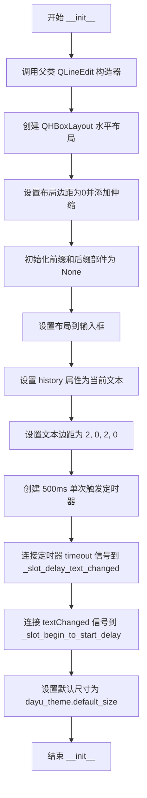

#### 带注释源码

```python
def __init__(self, text="", parent=None):
    # 调用父类 QLineEdit 的构造函数，传入初始文本和父对象
    super(MLineEdit, self).__init__(text, parent)
    
    # 创建水平布局管理器，用于容纳前缀和后缀部件
    self._main_layout = QtWidgets.QHBoxLayout()
    # 设置布局的外边距为0，使部件紧贴边框
    self._main_layout.setContentsMargins(0, 0, 0, 0)
    # 在布局末尾添加伸缩空间，推挤前缀/后缀部件到边缘
    self._main_layout.addStretch()

    # 初始化前缀部件为 None，后续可通过 set_prefix_widget 设置
    self._prefix_widget = None
    # 初始化后缀部件为 None，后续可通过 set_suffix_widget 设置
    self._suffix_widget = None

    # 将水平布局设置为输入框的主布局
    self.setLayout(self._main_layout)
    # 将当前文本存储到 history 属性中，用于记录输入历史
    self.setProperty("history", self.property("text"))
    # 设置文本区域内边距：左2像素，右2像素，上下0像素
    self.setTextMargins(2, 0, 2, 0)

    # 创建延迟定时器，用于实现防抖或延迟触发功能
    self._delay_timer = QtCore.QTimer()
    # 设置定时器间隔为500毫秒
    self._delay_timer.setInterval(500)
    # 设置为单次触发模式，定时器触发一次后自动停止
    self._delay_timer.setSingleShot(True)
    # 连接定时器超时信号到延迟文本变化槽函数
    self._delay_timer.timeout.connect(self._slot_delay_text_changed)
    # 连接文本变化信号到启动延迟定时器的槽函数
    self.textChanged.connect(self._slot_begin_to_start_delay)
    # 初始化 Dayu 主题尺寸为默认大小
    self._dayu_size = dayu_theme.default_size
```


### `MLineEdit.get_dayu_size` / `MLineEdit.set_dayu_size`

该方法对用于获取和设置 MLineEdit 组件的尺寸（`dayu_size`）。Getter 方法返回内部存储的尺寸值；Setter 方法不仅更新内部状态，还会级联地将该尺寸传递给前后缀 widgets（如果它们支持此属性），并触发界面重绘。

参数：

- `value`：`int`，要设置的组件尺寸值（仅 `set_dayu_size` 需要）。

返回值：

- `get_dayu_size`：`int`，返回当前组件的尺寸。
- `set_dayu_size`：`None`，无返回值。

#### 流程图

```mermaid
graph TD
    A[Start set_dayu_size] --> B[赋值 self._dayu_size = value]
    B --> C{检查 _prefix_widget 是否有 set_dayu_size 方法}
    C -->|是| D[调用 _prefix_widget.set_dayu_size]
    C -->|否| E{检查 _suffix_widget 是否有 set_dayu_size 方法}
    D --> E
    E -->|是| F[调用 _suffix_widget.set_dayu_size]
    E -->|否| G[调用 self.style().polish 刷新样式]
    F --> G
    G --> H[End]
    
    %% 并行的 getter 流程
    I[Start get_dayu_size] --> J[返回 self._dayu_size] --> K[End]
```

#### 带注释源码

```python
def get_dayu_size(self):
    """
    获取组件的尺寸
    :return: integer
    """
    return self._dayu_size

def set_dayu_size(self, value):
    """
    设置组件的尺寸。
    :param value: integer
    :return: None
    """
    # 1. 更新自身的尺寸状态
    self._dayu_size = value
    
    # 2. 如果存在前缀组件，且支持尺寸设置，则同步更新
    if hasattr(self._prefix_widget, "set_dayu_size"):
        self._prefix_widget.set_dayu_size(self._dayu_size)
        
    # 3. 如果存在后缀组件，且支持尺寸设置，则同步更新
    if hasattr(self._suffix_widget, "set_dayu_size"):
        self._suffix_widget.set_dayu_size(self._dayu_size)
        
    # 4. 强制刷新控件样式以应用尺寸变化
    self.style().polish(self)

# 定义 Qt 属性，允许在 Qt  Designer 或 QSS 中通过 dayu_size 属性名访问
dayu_size = QtCore.Property(int, get_dayu_size, set_dayu_size)
```


### `MLineEdit.set_delay_duration`

设置防抖定时器的超时时间，用于控制文本变化信号的延迟触发。

参数：

-  `millisecond`：`int`，延迟时间，单位为毫秒。

返回值：`None`，无返回值。

#### 流程图

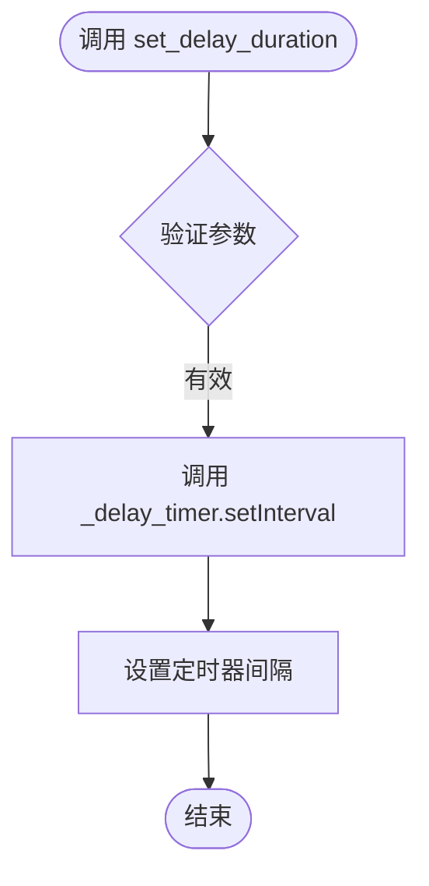

#### 带注释源码

```python
def set_delay_duration(self, millisecond):
    """Set delay timer's timeout duration.
    
    设置防抖延迟定时器的超时时间。
    当文本改变时，触发延迟定时器，经过指定毫秒数后才发出 sig_delay_text_changed 信号。
    
    Args:
        millisecond (int): 延迟时间，单位毫秒。
    """
    self._delay_timer.setInterval(millisecond)
```


### MLineEdit._slot_delay_text_changed

定时器超时时发射 `sig_delay_text_changed` 信号的内部槽函数，用于实现带延迟的文本变化通知。

参数：

- 无

返回值：无（`None`），该方法为槽函数，仅用于发射信号

#### 流程图

```mermaid
flowchart TD
    A[定时器超时触发] --> B[获取当前文本: self.text()]
    B --> C[发射 sig_delay_text_changed 信号并传递当前文本]
    C --> D[结束]
```

#### 带注释源码

```python
@QtCore.Slot()
def _slot_delay_text_changed(self):
    """
    定时器超时时发射 sig_delay_text_changed 信号的内部槽。
    该方法在 _delay_timer 超时后被调用，
    用于将用户输入的文本通过信号发送给关注此变化的监听者。
    """
    # 获取当前文本框中的文本内容
    current_text = self.text()
    # 发射延迟文本变化信号，通知外部文本已更改
    self.sig_delay_text_changed.emit(current_text)
```


### `MLineEdit._slot_begin_to_start_delay`

该方法是 `MLineEdit` 类的内部槽函数，连接至父类 `QLineEdit` 的 `textChanged` 信号。其核心功能是实现文本输入的**防抖（Debounce）处理**。每当文本发生变化时，此方法会被调用，如果防抖定时器（`_delay_timer`）已经在运行，它会先被停止，然后重新启动，从而确保只有在用户停止输入一段时间（由定时器间隔决定）后，才会触发真正的数据处理逻辑。

参数：

- `_`：`six.text_type`，文本变化时传入的文本内容（当前方法内未使用该参数，仅作为槽函数签名占位）。

返回值：`None`，无返回值。

#### 流程图

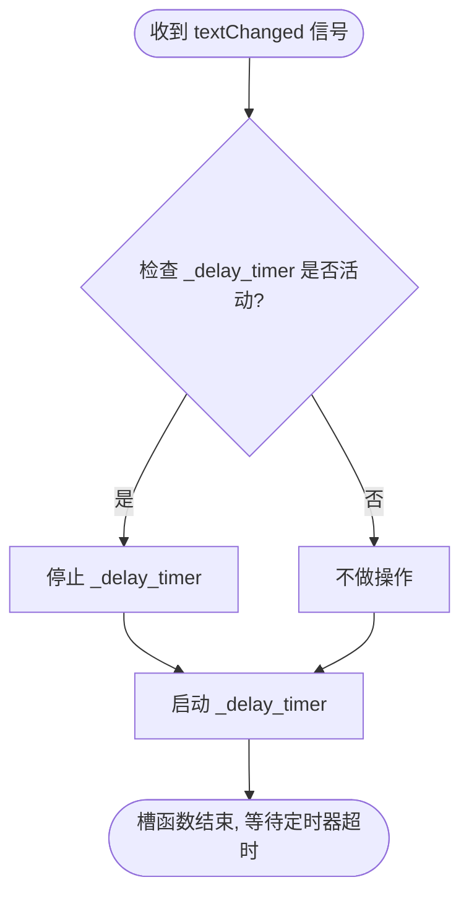

#### 带注释源码

```python
@QtCore.Slot(six.text_type)
def _slot_begin_to_start_delay(self, _):
    """
    文本变化时重启防抖定时器的内部槽。
    该方法作为 textChanged 信号的槽，确保持续输入时只触发一次延迟后的逻辑。
    
    :param _: 文本变化后的内容（在此方法中未被使用）
    :type _: six.text_type
    :return: None
    """
    # 检查防抖定时器是否已经处于运行状态
    if self._delay_timer.isActive():
        # 如果正在运行，则停止当前计时，重置计时器
        self._delay_timer.stop()
    
    # 重新启动定时器，开始新的倒计时
    self._delay_timer.start()
```


### `MLineEdit.get_prefix_widget`

获取输入框左侧的前缀部件

参数：

- 无

返回值：`QWidget`，当前设置的前缀部件，如果未设置则为 `None`

#### 流程图

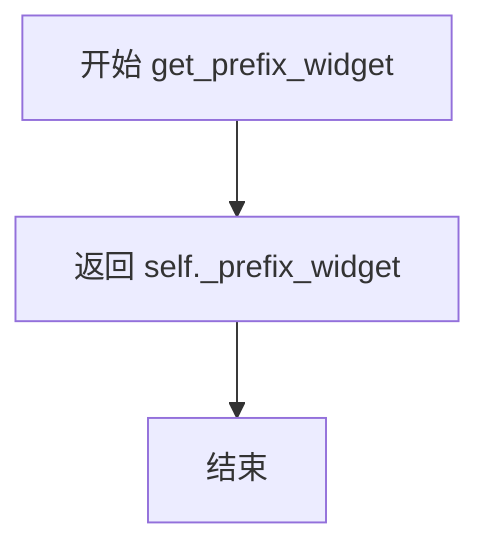

#### 带注释源码

```python
def get_prefix_widget(self):
    """Get the prefix widget for user to edit"""
    # 直接返回内部保存的前缀部件变量
    # 如果未设置过则为 None
    return self._prefix_widget
```

---

### `MLineEdit.set_prefix_widget`

设置输入框左侧的前缀部件，并自动调整文本边距

参数：

- `widget`：`QWidget`，要设置为左侧前缀部件的 widget

返回值：`QWidget`，返回设置的 widget 本身

#### 流程图

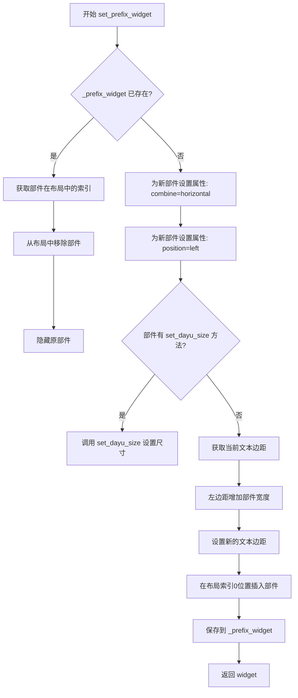

#### 带注释源码

```python
def set_prefix_widget(self, widget):
    """Set the line edit left start widget"""
    # 如果已存在前缀部件，先移除旧的
    if self._prefix_widget:
        # 获取旧部件在布局中的索引位置
        index = self._main_layout.indexOf(self._prefix_widget)
        # 从布局中取出该部件
        self._main_layout.takeAt(index)
        # 隐藏旧部件
        self._prefix_widget.setVisible(False)
    
    # 为新部件设置水平组合属性（用于样式）
    # if isinstance(widget, MPushButton):  # 注释掉的类型检查
    widget.setProperty("combine", "horizontal")
    # 设置部件位置为左侧
    widget.setProperty("position", "left")
    
    # 如果部件支持 dayu_size 属性，同步设置尺寸
    if hasattr(widget, "set_dayu_size"):
        widget.set_dayu_size(self._dayu_size)

    # 调整文本边距，为左侧部件留出空间
    margin = self.textMargins()
    margin.setLeft(margin.left() + widget.width())
    self.setTextMargins(margin)

    # 在布局的0位置插入部件（最左侧）
    self._main_layout.insertWidget(0, widget)
    # 保存引用
    self._prefix_widget = widget
    return widget
```


### MLineEdit.get_suffix_widget

获取输入框右侧的部件，用于在文本输入框右侧显示附加的组件（如按钮、图标等）。

参数：なし

返回值：`QtWidgets.QWidget` 或 `None`，返回当前设置的右侧部件，如果没有设置则返回 `None`。

#### 流程图

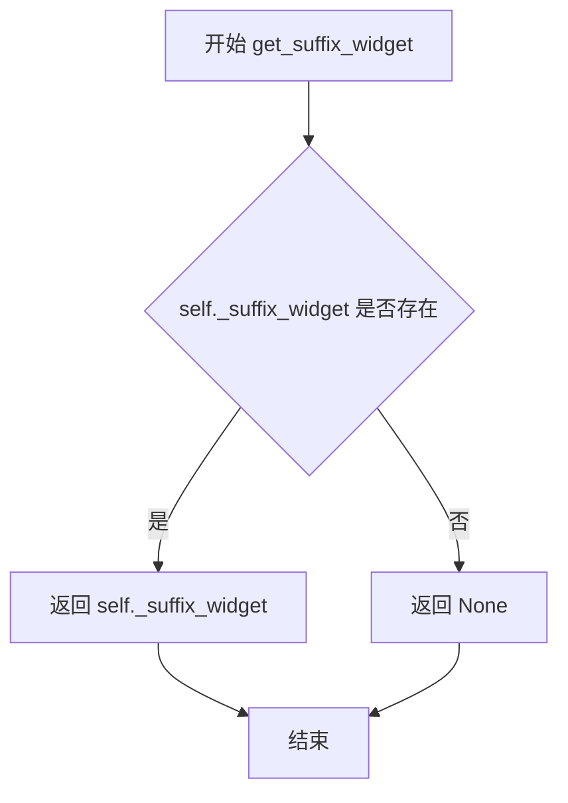

#### 带注释源码

```python
def get_suffix_widget(self):
    """Get the suffix widget for user to edit"""
    # 直接返回内部保存的 _suffix_widget 成员变量
    # 该变量在 set_suffix_widget 方法中被赋值
    return self._suffix_widget
```

---

### MLineEdit.set_suffix_widget

设置输入框右侧的部件，该方法会在文本输入框右侧添加一个 widget，并自动调整文本边距以适应部件宽度。

参数：

- `widget`：`QtWidgets.QWidget`，要设置到输入框右侧的部件（如按钮、图标等）

返回值：`QtWidgets.QWidget`，返回设置的部件本身，方便链式调用。

#### 流程图

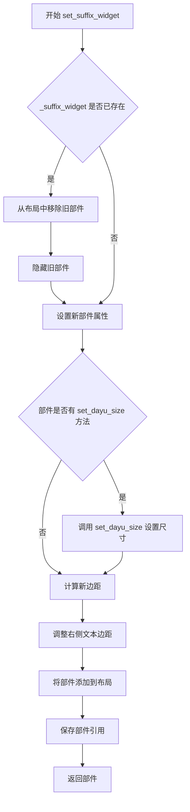

#### 带注释源码

```python
def set_suffix_widget(self, widget):
    """Set the line edit right end widget"""
    # 如果已经存在 suffix_widget，先从布局中移除
    if self._suffix_widget:
        # 获取旧部件在布局中的索引
        index = self._main_layout.indexOf(self._suffix_widget)
        # 从布局中取出部件（但不删除对象）
        self._main_layout.takeAt(index)
        # 隐藏旧部件
        self._suffix_widget.setVisible(False)
    
    # 设置部件属性，使其符合水平布局样式
    # combine="horizontal" 表示与输入框水平组合
    widget.setProperty("combine", "horizontal")
    # position="right" 表示放置在右侧
    widget.setProperty("position", "right")
    
    # 如果部件支持 dayu_size 属性，同步设置尺寸
    if hasattr(widget, "set_dayu_size"):
        widget.set_dayu_size(self._dayu_size)

    # 获取当前文本边距
    margin = self.textMargins()
    # 增加右侧边距，宽度为部件宽度，防止文字被部件遮挡
    margin.setRight(margin.right() + widget.width())
    self.setTextMargins(margin)
    
    # 将部件添加到水平布局的最右侧
    self._main_layout.addWidget(widget)
    # 保存部件引用，供 get_suffix_widget 后续获取
    self._suffix_widget = widget
    return widget
```


### `MLineEdit.setText`

重写 `QLineEdit` 的 `setText` 方法，在设置文本时将文本追加保存到 `history` 属性中，以实现文本变更历史的记录功能。

参数：

- `text`：`six.text_type`，需要设置的文本内容

返回值：`None`，无返回值（继承自父类 `QLineEdit.setText` 的行为）

#### 流程图

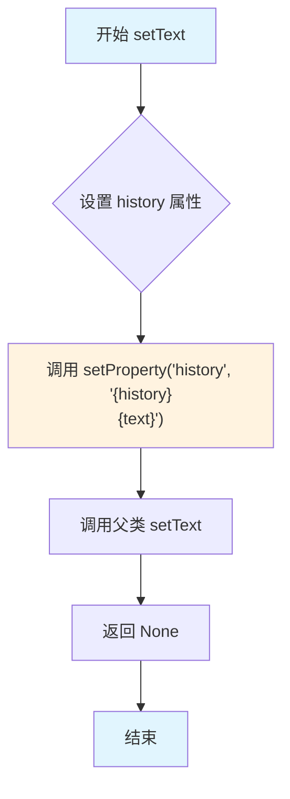

#### 带注释源码

```python
def setText(self, text):
    """Override setText save text to history"""
    # 获取当前 history 属性值，并与新文本拼接后保存
    # 格式为："{历史记录}\n{新文本}"，实现追加历史的功能
    self.setProperty("history", "{}\n{}".format(self.property("history"), text))
    # 调用父类 QLineEdit 的 setText 方法完成实际的文本设置
    return super(MLineEdit, self).setText(text)
```


### `MLineEdit.clear`

重写方法，清除文本时同步清空 history 属性

参数：

- 无额外参数（除了隐式的 `self`）

返回值：`None`，QLineEdit.clear() 的返回值

#### 流程图

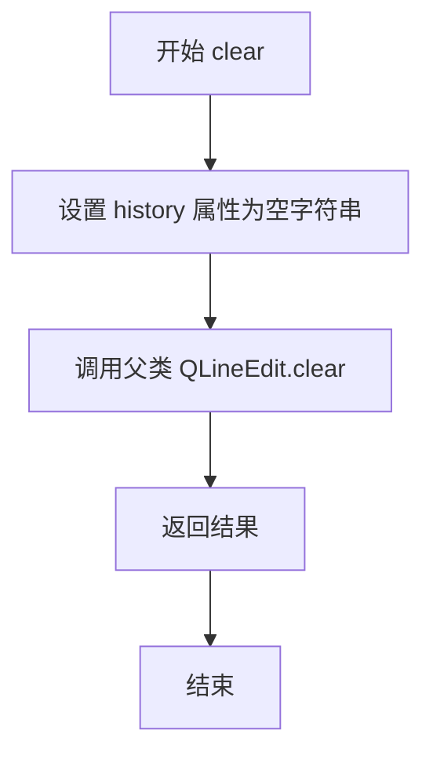

#### 带注释源码

```python
def clear(self):
    """Override clear to clear history"""
    # 1. 首先清空 history 属性，确保历史记录被清除
    self.setProperty("history", "")
    # 2. 调用父类的 clear 方法，清除输入框中的文本
    # 返回父类 clear 的返回值（通常为 None）
    return super(MLineEdit, self).clear()
```


### `MLineEdit.search`

配置搜索框模式，为输入框添加清空按钮和搜索占位符文本。

参数：

- 无（仅包含 `self`）

返回值：`MLineEdit`，返回自身实例以支持链式调用

#### 流程图

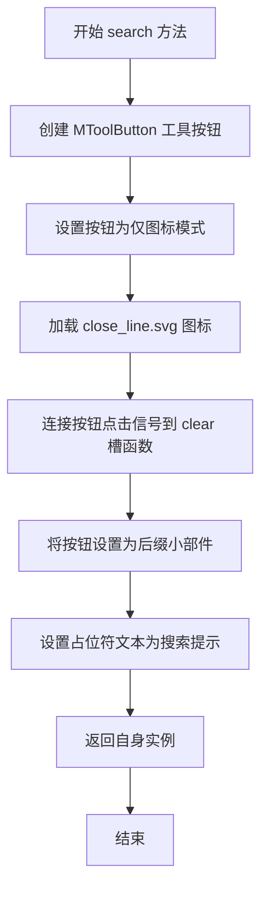

#### 带注释源码

```python
def search(self):
    """Add a search icon button for MLineEdit."""
    # 创建一个工具按钮实例
    suffix_button = MToolButton().icon_only().svg("close_line.svg")
    # 将按钮的 clicked 信号连接到输入框的 clear 方法
    # 当用户点击清空按钮时，自动清空输入内容
    suffix_button.clicked.connect(self.clear)
    # 将工具按钮设置为输入框的后缀小部件（右侧显示）
    self.set_suffix_widget(suffix_button)
    # 设置占位符提示文本，提示用户输入搜索关键词
    self.setPlaceholderText(self.tr("Enter key word to search..."))
    # 返回自身实例，支持链式调用（如：line.search().large()）
    return self
```


### `MLineEdit.error`

配置 MLineEdit 为错误信息展示模式，将其设为只读状态，应用红色样式，并添加一个详情按钮用于弹出显示完整错误信息的对话框。

参数：
- 无额外参数（仅包含隐式参数 `self`）

返回值：`MLineEdit`，返回自身以支持方法链式调用

#### 流程图

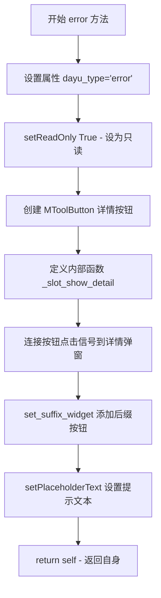

#### 带注释源码

```python
def error(self):
    """A a toolset to MLineEdit to store error info with red style"""

    # 定义内部Slot函数：显示错误详情弹窗
    @QtCore.Slot()
    def _slot_show_detail(self):
        # 创建只读文本编辑框作为弹窗
        dialog = QtWidgets.QTextEdit(self)
        dialog.setReadOnly(True)
        # 获取主屏幕几何信息用于定位弹窗
        screen = QtGui.QGuiApplication.primaryScreen()
        # Get the geometry of the primary screen
        geo = screen.geometry()
        # 设置弹窗位置在屏幕中心，大小为屏幕1/4
        dialog.setGeometry(geo.width() / 2, geo.height() / 2, geo.width() / 4, geo.height() / 4)
        dialog.setWindowTitle(self.tr("Error Detail Information"))
        # 从history属性中获取历史输入内容作为错误详情显示
        dialog.setText(self.property("history"))
        # 设置弹窗为对话框类型
        dialog.setWindowFlags(QtCore.Qt.Dialog)
        dialog.show()

    # 设置dayu_type属性为error，触发红色样式
    self.setProperty("dayu_type", "error")
    # 设为只读状态，禁止用户输入
    self.setReadOnly(True)
    # 创建详情按钮，使用detail_line.svg图标
    _suffix_button = MToolButton().icon_only().svg("detail_line.svg")
    # 点击按钮时显示错误详情弹窗
    _suffix_button.clicked.connect(functools.partial(_slot_show_detail, self))
    # 将详情按钮设置为输入框的后缀部件
    self.set_suffix_widget(_suffix_button)
    # 设置提示文本
    self.setPlaceholderText(self.tr("Error information will be here..."))
    # 返回自身，支持方法链式调用
    return self
```


### `MLineEdit.search_engine`

为 MLineEdit 输入框添加一个搜索按钮（MPushButton）作为后缀组件，使其具备搜索功能。该方法创建一个主按钮并将其设置为输入框的后缀部件，同时设置占位符文本。

参数：

- `text`：`str`，按钮上显示的文本，默认为 "Search"

返回值：`MLineEdit`，返回实例本身以支持链式调用

#### 流程图

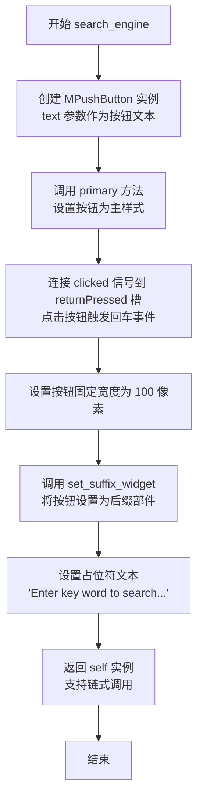

#### 带注释源码

```python
def search_engine(self, text="Search"):
    """Add a MPushButton to suffix for MLineEdit"""
    # 创建一个 MPushButton 实例，text 参数控制按钮显示的文本
    # 默认显示 "Search"
    _suffix_button = MPushButton(text=text).primary()
    
    # 将按钮的 clicked 信号连接到输入框的 returnPressed 槽
    # 当用户点击搜索按钮时，触发回车信号，等同于用户在输入框中按回车
    _suffix_button.clicked.connect(self.returnPressed)
    
    # 设置按钮的固定宽度为 100 像素，确保按钮宽度统一
    _suffix_button.setFixedWidth(100)
    
    # 调用 set_suffix_widget 方法，将按钮设置为输入框的后缀部件
    # 后缀部件会显示在输入框的右侧
    self.set_suffix_widget(_suffix_button)
    
    # 设置输入框的占位符提示文本，提示用户输入搜索关键词
    self.setPlaceholderText(self.tr("Enter key word to search..."))
    
    # 返回 self 本身，支持链式调用（例如：lineedit.search_engine().large()）
    return self
```


### `MLineEdit.file`

配置当前行编辑框为文件选择输入框，通过右侧按钮打开文件浏览器选择文件，并将选中的文件路径自动填充到文本框中。

参数：

- `self`：实例本身，无需显式传递
- `filters`：`list` 或 `None`，可选参数，用于指定文件过滤器（如 `["*.png", "*.jpg"]`），默认值为 `None` 表示不限制文件类型

返回值：`MLineEdit`，返回实例本身，支持链式调用

#### 流程图

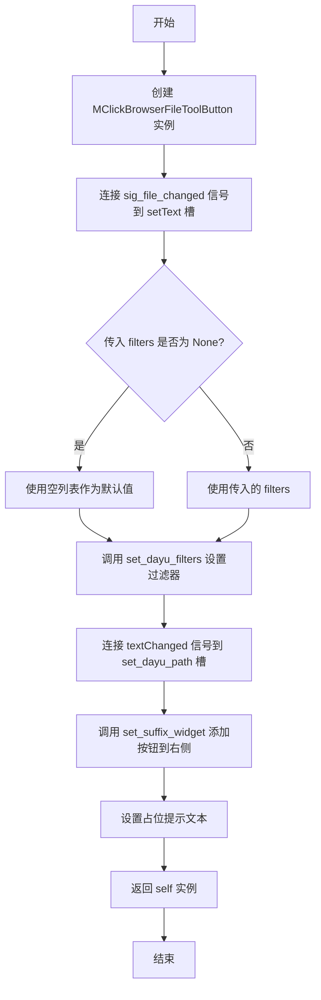

#### 带注释源码

```python
def file(self, filters=None):
    """Add a MClickBrowserFileToolButton for MLineEdit to select file"""
    # 1. 创建文件浏览按钮部件
    _suffix_button = MClickBrowserFileToolButton()
    
    # 2. 当用户选择文件后，自动将文件路径设置到文本框
    _suffix_button.sig_file_changed.connect(self.setText)
    
    # 3. 设置文件过滤器，限制可选文件类型
    #    如果 filters 为 None，则使用空列表
    _suffix_button.set_dayu_filters(filters or [])
    
    # 4. 当文本框内容改变时，同步更新文件浏览器的路径
    self.textChanged.connect(_suffix_button.set_dayu_path)
    
    # 5. 将文件浏览按钮设置为后缀部件（显示在右侧）
    self.set_suffix_widget(_suffix_button)
    
    # 6. 设置提示占位文本
    self.setPlaceholderText(self.tr("Click button to browser files"))
    
    # 7. 返回自身实例，支持链式调用
    return self
```


### `MLineEdit.save_file`

为 MLineEdit 组件添加一个保存文件选择按钮（右侧），允许用户通过点击按钮选择目标保存路径，并将选择的路径回填到输入框中。

参数：

- `filters`：`list`，可选，文件过滤器列表，用于限制可选择的文件类型（如 `["*.png", "*.jpg"]`）

返回值：`MLineEdit`，返回自身实例，支持链式调用

#### 流程图

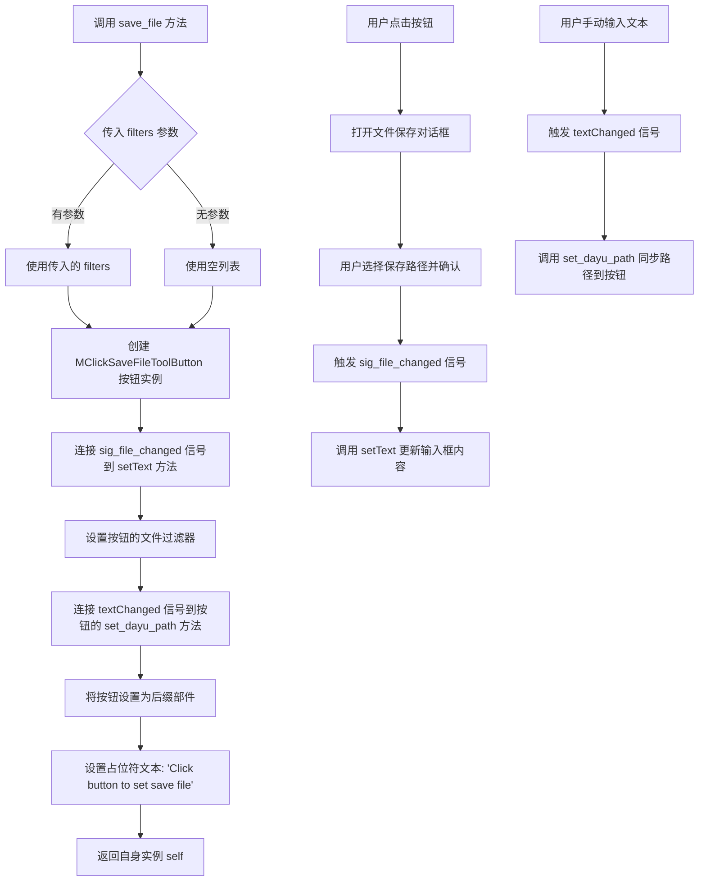

#### 带注释源码

```python
def save_file(self, filters=None):
    """Add a MClickSaveFileToolButton for MLineEdit to set save file
    
    该方法为行编辑框添加一个保存文件浏览器按钮。
    用户点击按钮后可选择目标保存路径，选定后路径会自动填充到输入框。
    
    Args:
        filters: 文件过滤器列表，默认为 None。
                 例如：['*.png', '*.jpg', '*.bmp']
    
    Returns:
        MLineEdit: 返回自身实例，支持链式调用
    """
    # 步骤1: 创建保存文件工具按钮实例
    _suffix_button = MClickSaveFileToolButton()
    
    # 步骤2: 将按钮的文件变更信号连接到 setText 方法
    # 当用户在文件对话框中选择路径后，自动更新输入框文本
    _suffix_button.sig_file_changed.connect(self.setText)
    
    # 步骤3: 设置文件过滤器，限制可选择的文件类型
    # 使用 filters or [] 确保即使传入 None 也不会出错
    _suffix_button.set_dayu_filters(filters or [])
    
    # 步骤4: 将输入框的文本变更信号连接到按钮的路径设置方法
    # 当用户手动输入路径时，同步更新按钮的当前路径状态
    self.textChanged.connect(_suffix_button.set_dayu_path)
    
    # 步骤5: 将按钮设置为行编辑框的后缀部件（右侧）
    self.set_suffix_widget(_suffix_button)
    
    # 步骤6: 设置占位符提示文本，引导用户操作
    self.setPlaceholderText(self.tr("Click button to set save file"))
    
    # 步骤7: 返回自身，支持链式调用
    # 例如: line_edit.save_file().medium()
    return self
```


### `MLineEdit.folder`

为 MLineEdit 添加一个文件夹选择按钮，允许用户通过点击按钮选择文件夹，选中的文件夹路径会自动填充到文本输入框中。

参数：

- `self`：`MLineEdit` 实例，方法所属的对象（隐式参数）

返回值：`MLineEdit`，返回实例本身（self），支持链式调用

#### 流程图

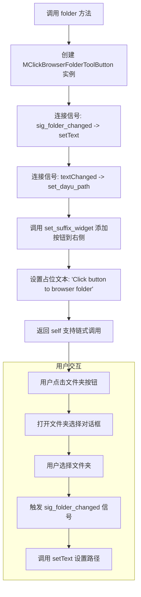

#### 带注释源码

```python
def folder(self):
    """Add a MClickBrowserFolderToolButton for MLineEdit to select folder"""
    # 创建文件夹浏览按钮部件
    _suffix_button = MClickBrowserFolderToolButton()
    
    # 当文件夹选择改变时，自动将路径设置到文本输入框
    # sig_folder_changed 信号在用户选择新文件夹时触发
    _suffix_button.sig_folder_changed.connect(self.setText)
    
    # 当文本输入改变时，同步更新按钮的路径状态
    # 这确保了按钮知道当前输入框中的路径
    self.textChanged.connect(_suffix_button.set_dayu_path)
    
    # 将文件夹按钮设置为输入框的后缀部件（显示在右侧）
    self.set_suffix_widget(_suffix_button)
    
    # 设置提示文本，引导用户操作
    self.setPlaceholderText(self.tr("Click button to browser folder"))
    
    # 返回 self，支持链式调用（如：ml.edit.folder().large()）
    return self
```


### `MLineEdit.huge`

设置 MLineEdit 组件为超大尺寸的快捷方法。

参数： 无

返回值： `MLineEdit`，返回自身实例，支持链式调用

#### 流程图

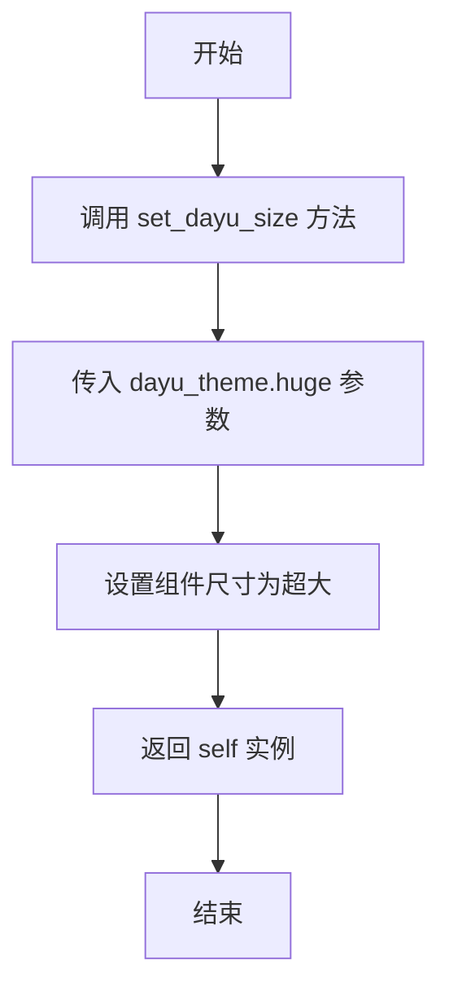

#### 带注释源码

```python
def huge(self):
    """Set MLineEdit to huge size"""
    # 调用 set_dayu_size 方法，将组件尺寸设置为 dayu_theme.huge（超大）
    self.set_dayu_size(dayu_theme.huge)
    # 返回自身实例，支持链式调用
    return self
```

---

### `MLineEdit.large`

设置 MLineEdit 组件为大尺寸的快捷方法。

参数： 无

返回值： `MLineEdit`，返回自身实例，支持链式调用

#### 流程图

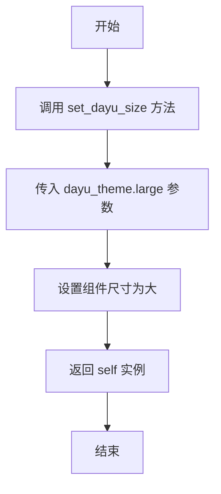

#### 带注释源码

```python
def large(self):
    """Set MLineEdit to large size"""
    # 调用 set_dayu_size 方法，将组件尺寸设置为 dayu_theme.large（大）
    self.set_dayu_size(dayu_theme.large)
    # 返回自身实例，支持链式调用
    return self
```

---

### `MLineEdit.medium`

设置 MLineEdit 组件为中等尺寸的快捷方法。

参数： 无

返回值： `MLineEdit`，返回自身实例，支持链式调用

#### 流程图

```mermaid
flowchart TD
    A[开始] --> B[调用 set_dayu_size 方法]
    B --> C[传入 dayu_theme.medium 参数]
    C --> D[设置组件尺寸为中等]
    D --> E[返回 self 实例]
    E --> F[结束]
```

#### 带注释源码

```python
def medium(self):
    """Set MLineEdit to  medium"""
    # 调用 set_dayu_size 方法，将组件尺寸设置为 dayu_theme.medium（中等）
    self.set_dayu_size(dayu_theme.medium)
    # 返回自身实例，支持链式调用
    return self
```

---

### `MLineEdit.small`

设置 MLineEdit 组件为小尺寸的快捷方法。

参数： 无

返回值： `MLineEdit`，返回自身实例，支持链式调用

#### 流程图

```mermaid
flowchart TD
    A[开始] --> B[调用 set_dayu_size 方法]
    B --> C[传入 dayu_theme.small 参数]
    C --> D[设置组件尺寸为小]
    D --> E[返回 self 实例]
    E --> F[结束]
```

#### 带注释源码

```python
def small(self):
    """Set MLineEdit to small size"""
    # 调用 set_dayu_size 方法，将组件尺寸设置为 dayu_theme.small（小）
    self.set_dayu_size(dayu_theme.small)
    # 返回自身实例，支持链式调用
    return self
```

---

### `MLineEdit.tiny`

设置 MLineEdit 组件为极小尺寸的快捷方法。

参数： 无

返回值： `MLineEdit`，返回自身实例，支持链式调用

#### 流程图

```mermaid
flowchart TD
    A[开始] --> B[调用 set_dayu_size 方法]
    B --> C[传入 dayu_theme.tiny 参数]
    C --> D[设置组件尺寸为极小]
    D --> E[返回 self 实例]
    E --> F[结束]
```

#### 带注释源码

```python
def tiny(self):
    """Set MLineEdit to tiny size"""
    # 调用 set_dayu_size 方法，将组件尺寸设置为 dayu_theme.tiny（极小）
    self.set_dayu_size(dayu_theme.tiny)
    # 返回自身实例，支持链式调用
    return self
```

## 关键组件


### 延迟文本变化机制

通过`_delay_timer`定时器实现惰性加载的文本变化信号发射，提高性能并减少频繁触发

### 前缀/后缀Widget系统

支持在输入框左侧(prefix)和右侧(suffix)添加自定义控件，通过`_main_layout`布局管理

### 大小属性系统(dayu_size)

通过Qt Property机制实现可配置的主题尺寸大小，支持前缀/后缀Widget的尺寸同步

### 搜索功能(search)

集成搜索图标按钮和占位文本，提供快速清除输入内容的交互

### 错误信息展示(error)

通过红色样式和详情对话框展示错误信息，支持查看历史记录内容

### 文件浏览器功能(file/save_file/folder)

集成文件选择、文件保存、文件夹选择的后缀按钮，通过信号槽与输入框联动

### 尺寸预设方法(huge/large/medium/small/tiny)

提供五个预定义的主题尺寸常量，快速切换输入框大小

### 历史记录管理

通过`history`属性存储文本变更历史，支持历史回溯和清空


## 问题及建议


### 已知问题

- 使用了过时的 `six` 库进行 Python 2/3 兼容处理，但项目已基于 Python 3 和 PySide6，`six` 库已废弃。
- `set_prefix_widget` 和 `set_suffix_widget` 方法中，移除旧 widget 时仅设置为不可见和从布局中取出，未调用 `deleteLater()` 或显式销毁，可能导致内存泄漏。
- `setText` 方法重写中，历史记录通过字符串拼接无限增长，没有长度限制，会导致内存占用持续增加。
- 在设置 prefix/suffix widget 边距时，使用 `widget.width()` 获取宽度，但 widget 此时可能未添加到布局或显示，width 可能为 0 或不准确。
- `error()` 方法每次调用都会重新定义内部函数 `_slot_show_detail` 并创建新的对话框和按钮，导致代码重复和潜在的资源浪费。
- 延迟定时器实现中，每次文本改变都重启定时器，在快速输入时可能不是最优的防抖策略。
- `set_dayu_size` 方法中直接调用 `self.style().polish(self)` 强制重绘样式，可能引发性能开销。
- 缺乏对输入参数的有效性验证，例如 `set_delay_duration` 未检查毫秒值是否为非负数。

### 优化建议

- 移除 `six` 依赖，直接使用 Python 3 内置类型（如 `str`）和 Qt 类型定义信号。
- 在替换 widget 时，调用旧 widget 的 `deleteLater()` 确保资源释放，或考虑使用 Qt 的父子对象机制自动管理。
- 对历史记录实施限制，例如使用 `collections.deque` 并设置最大长度，或定期清理旧数据。
- 调整边距计算逻辑，可考虑在 widget 显示后（如通过事件过滤器）获取其实际几何尺寸，或使用布局的 sizeHint。
- 重构 `error()` 方法，将对话框创建逻辑提取为类方法或私有方法，避免重复定义和资源浪费。
- 优化延迟定时器逻辑，例如使用 `QTimer.singleShot` 实现防抖，或在定时器运行时不再重启，而是延迟执行。
- 评估 `polish` 调用的必要性，可考虑仅在特定样式属性变化时调用，或使用 Qt 的属性系统触发更新。
- 添加参数验证，例如在 `set_delay_duration` 中检查 `millisecond >= 0`，或在 `file` 等方法中校验 `filters` 类型。


## 其它


### 设计目标与约束

本组件旨在提供一个功能丰富的单行文本输入框，继承自PySide6的QLineEdit，支持前缀/后缀widget扩展、延迟文本变化信号、多场景预设（搜索、文件选择、密码模式等）、统一尺寸管理。设计约束：仅支持PySide6框架，需配合dayu_theme主题系统使用，后缀widget通过QLayout管理，延迟定时器默认500ms单次触发。

### 错误处理与异常设计

1. **set_prefix_widget/set_suffix_widget**：若widget为None或已存在，会先移除旧widget；未做类型检查，传入非QWidget会导致后续布局异常。2. **file/save_file/folder方法**：filters参数默认为None，内部使用`or []`处理；未处理文件浏览器打开失败的情况。3. **delay_timer**：若在定时器运行中销毁对象可能导致信号槽未断开，建议在父类析构时显式停止定时器。4. **property操作**：访问不存在的property（如"history"首次设置）会返回空值，但setProperty会创建新property。

### 数据流与状态机

**核心状态**：_prefix_widget（左侧扩展widget）、_suffix_widget（右侧扩展widget）、_dayu_size（尺寸规格）、_delay_timer（延迟触发器）、历史记录（通过property "history"存储）。

**数据流向**：用户输入 → textChanged信号 → _slot_begin_to_start_delay启动定时器 → 500ms后 → _slot_delay_text_changed发射sig_delay_text_changed → 上层接收变化文本。

**widget设置流程**：set_suffix_widget → 移除旧widget → 设置combine/position属性 → 同步dayu_size → 更新textMargins → 插入布局。

### 外部依赖与接口契约

1. **dayu_theme模块**：提供default_size、huge、large、medium、small、tiny常量，用于set_dayu_size。2. **browser模块**：MClickBrowserFileToolButton、MClickBrowserFolderToolButton、MClickSaveFileToolButton，需实现sig_file_changed/sig_folder_changed信号和set_dayu_filters、set_dayu_path方法。3. **mixin模块**：focus_shadow_mixin装饰器，为输入框添加焦点阴影效果。4. **push_button/tool_button模块**：MPushButton、MToolButton，用于search、error、search_engine方法创建按钮。5. **Qt组件**：QLineEdit、QHBoxLayout、QTimer、Property机制。

### 使用示例

```python
# 基本使用
edit = MLineEdit()
edit.show()

# 带延迟信号的搜索框
edit = MLineEdit().search()
edit.sig_delay_text_changed.connect(lambda text: print(f"search: {text}"))

# 文件选择
edit = MLineEdit().file(filters=["*.py", "*.txt"])

# 文件保存
edit = MLineEdit().save_file(filters=["*.json"])

# 文件夹选择
edit = MLineEdit().folder()

# 密码模式
edit = MLineEdit().password()

# 错误展示
edit = MLineEdit().error()

# 设置大小
edit.large()  # 或 .huge()/.medium()/.small()/.tiny()
```

### 版本历史

- **2019.2**：初始版本，由Mu yanru创建，包含基础输入框、前缀/后缀widget、延迟信号功能。

### 性能考虑

1. **延迟定时器**：默认500ms防抖，适合搜索场景，但高频率输入可能延迟响应。2. **textMargins更新**：每次设置widget都会调用setTextMargins，频繁操作可能触发布局重算，建议批量设置。3. **history存储**：每次setText都追加历史，长文本会导致property字符串不断增长，建议定期清理或限制长度。

### 主题与样式

组件通过dayu_size统一管理尺寸，set_dayu_size会同步调用style().polish(self)触发样式重绘。前缀/后缀widget通过setProperty设置combine="horizontal"和position（left/right）配合样式表实现横向连接效果。error方法设置dayu_type="error"属性用于红色样式展示。


    