# `comic-translate\app\ui\dayu_widgets\line_tab_widget.py` 详细设计文档

MLineTabWidget是一个基于PySide6的标签页组件，提供带下划线样式的按钮切换功能，支持左对齐、居中和右对齐排列，可通过dayu_size统一管理组件尺寸

## 整体流程

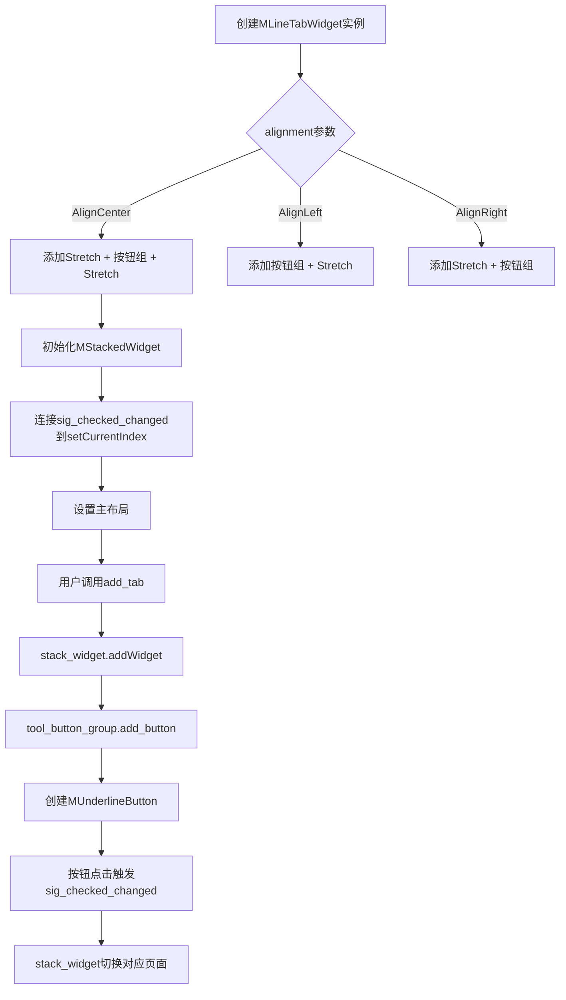

## 类结构

```
QWidget (Qt基类)
└── MLineTabWidget (主组件)
    ├── MUnderlineButtonGroup (按钮组)
    │   └── MButtonGroupBase
    │       └── MUnderlineButton (按钮)
    │           └── MToolButton
    ├── MStackedWidget (页面容器)
    └── MDivider (分隔线)
```

## 全局变量及字段


### `dayu_theme.default`
    
全局默认尺寸配置值，用于设置组件的默认大小

类型：`int`
    


### `MUnderlineButtonGroup._line_tab`
    
关联的行式标签页主控件引用，用于获取尺寸配置

类型：`MLineTabWidget`
    


### `MUnderlineButtonGroup._button_group(继承)`
    
继承自MButtonGroupBase的按钮组，管理所有下划线按钮的互斥选择

类型：`QtCore.QButtonGroup`
    


### `MUnderlineButtonGroup.sig_checked_changed`
    
选中状态变化信号，当按钮被选中时发射当前选中按钮的id

类型：`QtCore.Signal(int)`
    


### `MLineTabWidget.tool_button_group`
    
下划线按钮组管理器，负责创建和管理标签页的顶部按钮

类型：`MUnderlineButtonGroup`
    


### `MLineTabWidget.bar_layout`
    
水平布局管理器，用于排列顶部按钮栏中的元素

类型：`QtWidgets.QHBoxLayout`
    


### `MLineTabWidget.stack_widget`
    
堆叠窗口容器，用于承载各个标签页的页面内容

类型：`MStackedWidget`
    


### `MLineTabWidget._dayu_size`
    
当前组件的尺寸规格值，控制按钮和整体UI的大小

类型：`int`
    
    

## 全局函数及方法


### `MUnderlineButton.__init__`

该方法是 `MUnderlineButton` 类的构造函数，用于初始化下划线按钮控件，继承自 `MToolButton`，并将按钮设置为可勾选状态。

参数：

- `parent`：`QtWidgets.QWidget` 或 `None`，父控件，默认为 `None`

返回值：`None`，构造函数没有返回值

#### 流程图

```mermaid
flowchart TD
    A[开始 __init__] --> B[调用父类 MToolButton.__init__]
    B --> C[设置按钮为可勾选状态 setCheckable(True)]
    C --> D[结束 __init__]
```

#### 带注释源码

```
def __init__(self, parent=None):
    """
    初始化 MUnderlineButton 实例
    
    参数:
        parent: 父控件对象, 默认为 None
    """
    # 调用父类 MToolButton 的构造函数, 传递父控件
    super(MUnderlineButton, self).__init__(parent)
    
    # 设置按钮为可勾选状态, 支持选中/未选中切换
    self.setCheckable(True)
```


### `MUnderlineButtonGroup.__init__`

该方法是`MUnderlineButtonGroup`类的构造函数，用于初始化一个下划线按钮组组件，建立与对应的`MLineTabWidget`的关联，并配置按钮组的独占选择模式和点击信号连接。

参数：

- `tab`：`MLineTabWidget`，关联的线条标签页组件，用于获取尺寸配置等信息
- `parent`：`QtWidgets.QWidget` 或 `None`，父组件，默认为 `None`

返回值：`None`，构造函数无返回值

#### 流程图

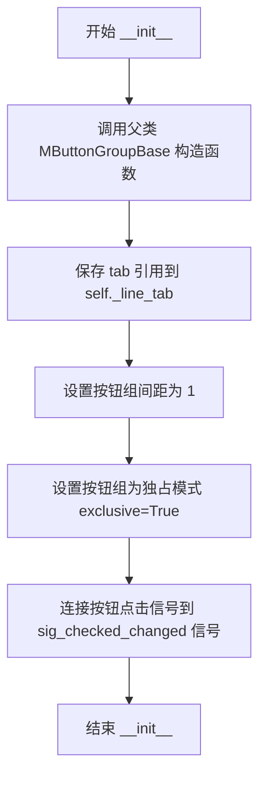

#### 带注释源码

```python
def __init__(self, tab, parent=None):
    """
    初始化 MUnderlineButtonGroup 实例
    
    Args:
        tab: MLineTabWidget 实例，关联的线条标签页组件
        parent: QWidget 或 None，父组件，默认为 None
    """
    # 调用父类 MButtonGroupBase 的构造函数，传入 parent 参数
    super(MUnderlineButtonGroup, self).__init__(parent=parent)
    
    # 保存传入的 tab（MLineTabWidget 实例）引用，用于后续获取尺寸等信息
    self._line_tab = tab
    
    # 设置按钮组内按钮之间的间距为 1 像素
    self.set_spacing(1)
    
    # 设置按钮组为独占模式，即同一时间只能有一个按钮被选中
    self._button_group.setExclusive(True)
    
    # 将按钮组的 buttonClicked(int) 信号连接到自定义的 sig_checked_changed 信号
    # 当有按钮被点击时，会发射 sig_checked_changed 信号，传递被点击按钮的 id
    self._button_group.buttonClicked[int].connect(self.sig_checked_changed)
```


### `MUnderlineButtonGroup.create_button`

该方法根据传入的数据字典创建一个带有下划线样式的按钮实例，根据数据中的svg、text和icon属性配置按钮的显示模式，并设置按钮的尺寸。

参数：

- `data_dict`：`dict`，包含按钮配置数据的字典，可能包含"svg"（SVG图标路径）、"text"（按钮文本）和"icon"（图标）键

返回值：`MUnderlineButton`，返回创建的带下划线样式的按钮实例

#### 流程图

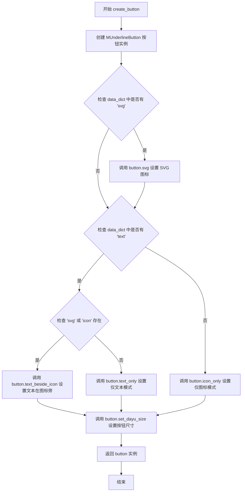

#### 带注释源码

```python
def create_button(self, data_dict):
    """
    根据数据字典创建带下划线样式的按钮
    
    参数:
        data_dict: 包含按钮配置信息的字典，可包含以下键:
            - svg: SVG图标路径
            - text: 按钮文本
            - icon: 图标标识
    
    返回:
        创建的 MUnderlineButton 按钮实例
    """
    # 创建一个新的 MUnderlineButton 按钮，父对象为当前按钮组
    button = MUnderlineButton(parent=self)
    
    # 如果提供了 svg 图标路径，则设置按钮的 SVG 图标
    if data_dict.get("svg"):
        button.svg(data_dict.get("svg"))
    
    # 根据配置决定按钮的显示模式
    if data_dict.get("text"):
        # 如果有文本，进一步判断显示方式
        if data_dict.get("svg") or data_dict.get("icon"):
            # 当同时有图标时，文本显示在图标旁边
            button.text_beside_icon()
        else:
            # 只有文本时，仅显示文本
            button.text_only()
    else:
        # 没有文本时，仅显示图标
        button.icon_only()
    
    # 设置按钮的大小，与行标签页的尺寸保持一致
    button.set_dayu_size(self._line_tab.get_dayu_size())
    
    # 返回创建完成的按钮实例
    return button
```


### `MUnderlineButtonGroup.update_size`

更新按钮组中所有按钮的尺寸大小。

参数：

- `size`：`int`，需要设置的尺寸大小，用于统一更新组内所有按钮的尺寸

返回值：`None`，该方法无返回值

#### 流程图

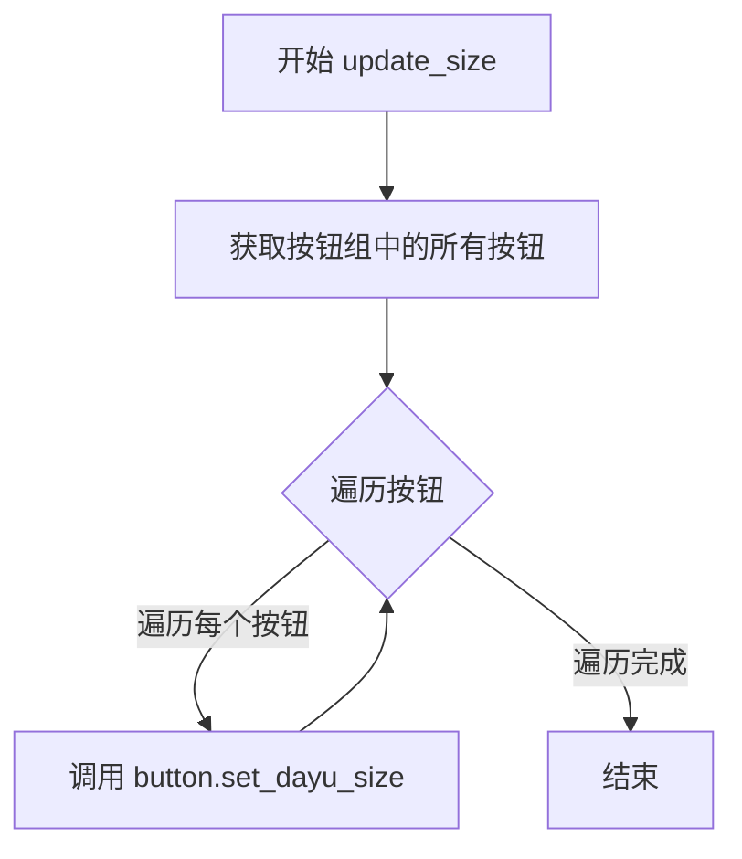

#### 带注释源码

```python
def update_size(self, size):
    """
    更新按钮组中所有按钮的尺寸大小
    
    Args:
        size: 整数类型，新的尺寸值
    """
    # 遍历按钮组中的所有按钮
    for button in self._button_group.buttons():
        # 为每个按钮设置新的尺寸大小
        button.set_dayu_size(size)
```


### `MUnderlineButtonGroup.set_dayu_checked`

设置当前选中按钮的ID，通过按钮组查找对应ID的按钮并将其设置为选中状态，同时发出选中变更信号。

参数：

- `value`：`int`，要设置为选中状态的按钮ID

返回值：`None`，无返回值，仅执行状态设置和信号发射

#### 流程图

```mermaid
flowchart TD
    A[开始 set_dayu_checked] --> B[根据value获取对应按钮]
    B --> C{按钮是否存在}
    C -->|是| D[调用button.setChecked(True)设置选中状态]
    C -->|否| E[可能抛出异常或静默失败]
    D --> F[调用self.sig_checked_changed.emit(value)发射信号]
    E --> G[结束]
    F --> G
```

#### 带注释源码

```python
def set_dayu_checked(self, value):
    """Set current checked button's id"""
    # 根据传入的value（按钮ID）从按钮组中获取对应的按钮对象
    button = self._button_group.button(value)
    # 调用按钮的setChecked方法将其设置为选中状态
    button.setChecked(True)
    # 发出checked_changed信号，通知外部当前选中的按钮ID已变更
    self.sig_checked_changed.emit(value)
```


### `MUnderlineButtonGroup.get_dayu_checked`

获取当前选中的下划线按钮的ID。

参数：  
无

返回值：`int`，当前选中的按钮的ID，如果没有选中任何按钮则返回-1。

#### 流程图

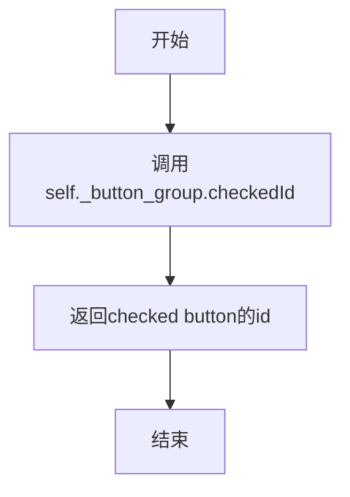

#### 带注释源码

```python
def get_dayu_checked(self):
    """Get current checked button's id"""
    # 使用Qt的button group的checkedId方法获取当前选中按钮的ID
    # 返回值为int类型，如果没有选中任何按钮则返回-1
    return self._button_group.checkedId()
```


### `MUnderlineButtonGroup.dayu_checked`

该方法是 MUnderlineButtonGroup 类的一个 Qt Property，用于获取或设置当前选中按钮的 ID。它封装了 get_dayu_checked 和 set_dayu_checked 方法，并通过 sig_checked_changed 信号通知变化。

参数：

- `value`：`int`，要设置为选中状态的按钮 ID（仅在 setter 中使用）

返回值：`int`，当前选中按钮的 ID（仅在 getter 中返回）

#### 流程图

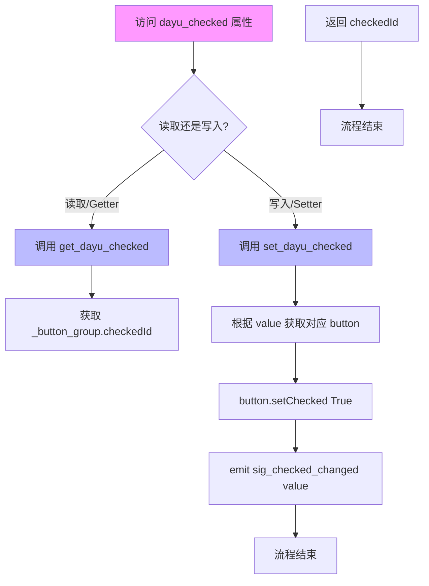

#### 带注释源码

```python
def set_dayu_checked(self, value):
    """Set current checked button's id"""
    # 根据传入的按钮 ID 获取对应的按钮对象
    button = self._button_group.button(value)
    # 将该按钮设置为选中状态
    button.setChecked(True)
    # 发射信号通知选中状态已改变
    self.sig_checked_changed.emit(value)

def get_dayu_checked(self):
    """Get current checked button's id"""
    # 返回当前被选中的按钮 ID
    return self._button_group.checkedId()

# Qt Property 定义：将 get 和 set 方法封装为 Qt 属性
# 类型为 int，getter 为 get_dayu_checked，setter 为 set_dayu_checked
# 当值改变时通过 sig_checked_changed 信号通知外部
dayu_checked = QtCore.Property(int, get_dayu_checked, set_dayu_checked, notify=sig_checked_changed)
```


### `MLineTabWidget.__init__`

初始化一个线性标签页小部件，支持水平对齐配置和主题大小设置。

参数：

- `alignment`：`QtCore.Qt.AlignmentFlag`，标签页标题的水平对齐方式，默认为 `QtCore.Qt.AlignCenter`（居中对齐）
- `parent`：`QtWidgets.QWidget`，可选的父窗口小部件，默认为 `None`

返回值：`None`，构造函数无返回值

#### 流程图

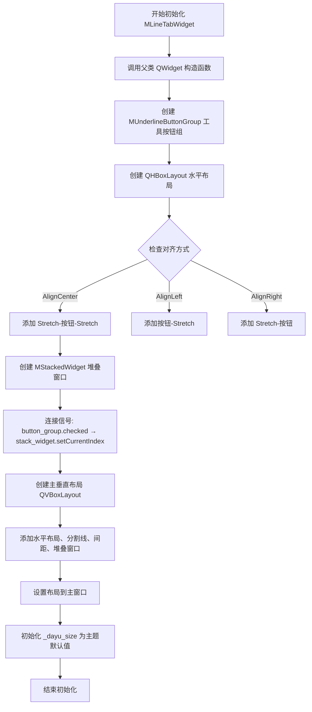

#### 带注释源码

```python
def __init__(self, alignment=QtCore.Qt.AlignCenter, parent=None):
    """初始化线性标签页小部件
    
    参数:
        alignment: QtCore.Qt.AlignmentFlag, 标签页标题的水平对齐方式
                   支持 AlignCenter(居中), AlignLeft(左对齐), AlignRight(右对齐)
        parent: QtWidgets.QWidget, 父窗口小部件，用于Qt对象树管理
    """
    # 调用父类QWidget的初始化方法，建立Qt对象层次关系
    super(MLineTabWidget, self).__init__(parent=parent)
    
    # 创建下划线风格按钮组，传入self作为tab引用
    self.tool_button_group = MUnderlineButtonGroup(tab=self)
    
    # 创建水平布局用于放置标签页标题按钮
    self.bar_layout = QtWidgets.QHBoxLayout()
    # 设置布局边距为0，紧贴边缘
    self.bar_layout.setContentsMargins(0, 0, 0, 0)
    
    # 根据对齐参数配置按钮组在水平布局中的位置
    if alignment == QtCore.Qt.AlignCenter:
        # 居中对齐：两端添加弹性空间，按钮组居中
        self.bar_layout.addStretch()
        self.bar_layout.addWidget(self.tool_button_group)
        self.bar_layout.addStretch()
    elif alignment == QtCore.Qt.AlignLeft:
        # 左对齐：按钮组在前，后端添加弹性空间
        self.bar_layout.addWidget(self.tool_button_group)
        self.bar_layout.addStretch()
    elif alignment == QtCore.Qt.AlignRight:
        # 右对齐：前端添加弹性空间，按钮组在后
        self.bar_layout.addStretch()
        self.bar_layout.addWidget(self.tool_button_group)
    
    # 创建堆叠窗口容器，用于存放各标签页的内容面板
    self.stack_widget = MStackedWidget()
    
    # 连接信号：当按钮组选中状态改变时，切换堆叠窗口当前显示的页面
    self.tool_button_group.sig_checked_changed.connect(self.stack_widget.setCurrentIndex)
    
    # 创建主垂直布局，按垂直方向排列标题栏、分隔线和内容区
    main_lay = QtWidgets.QVBoxLayout()
    main_lay.setContentsMargins(0, 0, 0, 0)  # 无边距
    main_lay.setSpacing(0)  # 无间距
    main_lay.addLayout(self.bar_layout)  # 添加标题按钮栏
    main_lay.addWidget(MDivider())  # 添加分隔线
    main_lay.addSpacing(5)  # 添加5像素间距
    main_lay.addWidget(self.stack_widget)  # 添加内容堆叠区域
    
    # 将主布局设置给当前窗口
    self.setLayout(main_lay)
    
    # 初始化主题大小为dayu_theme的默认值
    self._dayu_size = dayu_theme.default
```


### `MLineTabWidget.append_widget`

该方法用于向行标签页（MLineTabWidget）的右侧位置添加一个组件。它通过将传入的组件添加到水平布局（bar_layout）来实现，组件将被放置在现有按钮之后。

参数：

- `widget`：`QtWidgets.QWidget`，要添加到行标签页右侧位置的组件

返回值：`None`，该方法不返回任何值，仅执行组件的添加操作

#### 流程图

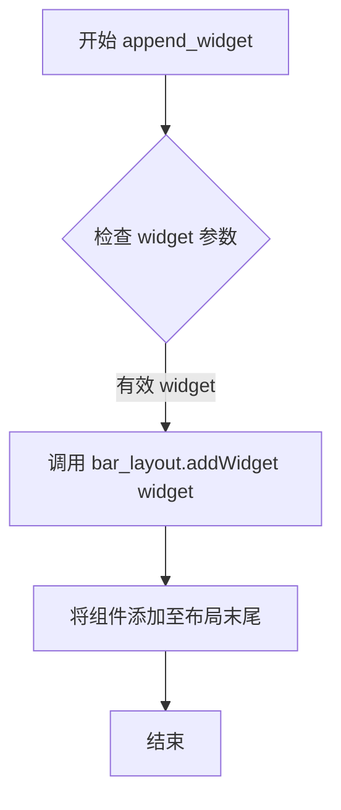

#### 带注释源码

```python
def append_widget(self, widget):
    """Add the widget to line tab's right position."""
    # 使用水平布局的 addWidget 方法将传入的组件添加到布局的末尾
    # 这样组件会出现在按钮组的右侧位置
    self.bar_layout.addWidget(widget)
```

#### 补充说明

**设计意图**：
- 该方法是 MLineTabWidget 的公开接口，允许外部将自定义组件（如搜索框、过滤器等 UI 元素）添加到标签页的右上角区域
- 组件会被添加到 `bar_layout` 的末尾，由于初始化时按钮组位于中间位置（当 alignment 为 AlignCenter 时），新添加的组件会出现在按钮组的右侧

**调用关系**：
- 该方法内部调用 `QtWidgets.QHBoxLayout.addWidget()` 方法
- 通常与 `insert_widget()` 方法配合使用，后者将组件插入到左侧位置

**使用示例**：
```python
# 创建一个搜索框并添加到标签页右侧
search_box = QLineEdit()
tab_widget.append_widget(search_box)
```


### `MLineTabWidget.insert_widget`

该方法用于将控件插入到行选项卡（Line Tab）左侧位置。它通过调用水平布局的 `insertWidget` 方法，将传入的控件插入到布局的索引 0 位置（即最左侧）。

参数：

- `widget`：`QtWidgets.QWidget`，要插入到行选项卡左侧的控件

返回值：`None`，无返回值

#### 流程图

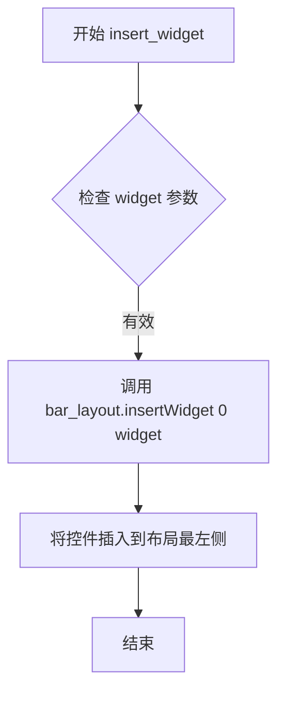

#### 带注释源码

```python
def insert_widget(self, widget):
    """Insert the widget to line tab's left position."""
    # 使用 bar_layout 的 insertWidget 方法将控件插入到索引 0 的位置
    # 参数 0 表示插入到布局的最左侧（开头）
    # widget 参数是待插入的 Qt 控件对象
    self.bar_layout.insertWidget(0, widget)
```


### `MLineTabWidget.add_tab`

向行型标签页组件添加一个新的标签页，同时在按钮组中创建对应的标签按钮，并将指定的 widget 添加到堆叠窗口管理器中。

参数：

- `widget`：`QtWidgets.QWidget`，要添加的标签页内容 widget（会被添加到内部的堆叠窗口管理器中显示）
- `data_dict`：`dict`，包含按钮配置数据的字典，应包含以下键值：
  - `svg`（可选）：SVG 图标路径
  - `text`（可选）：按钮文本
  - `icon`（可选）：图标配置

返回值：`None`，无返回值（该方法为副作用操作）

#### 流程图

```mermaid
flowchart TD
    A[开始 add_tab] --> B[调用 stack_widget.addWidget<br/>将 widget 添加到堆叠窗口]
    B --> C[计算新按钮索引<br/>stack_widget.count() - 1]
    C --> D[调用 tool_button_group.add_button<br/>添加按钮到按钮组]
    D --> E[结束]
```

#### 带注释源码

```python
def add_tab(self, widget, data_dict):
    """Add a tab"""
    # 将传入的 widget 添加到底部的堆叠窗口管理器中
    # stack_widget 是 MStackedWidget 实例，负责管理多个页面的显示
    self.stack_widget.addWidget(widget)
    
    # 计算新添加页面的索引（当前总数减1，即新页面的位置）
    # 然后调用工具按钮组的 add_button 方法创建对应的标签按钮
    # 按钮组（tool_button_group）是 MUnderlineButtonGroup 实例
    # 管理顶部的标签按钮和它们的选中状态
    self.tool_button_group.add_button(data_dict, self.stack_widget.count() - 1)
```


### `MLineTabWidget.get_dayu_size`

获取行选项卡组件的尺寸大小。

参数：

- 无

返回值：`int`，返回行选项卡的尺寸大小值。

#### 流程图

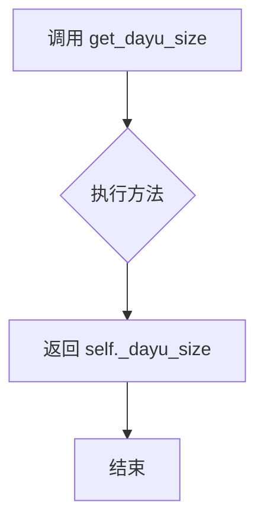

#### 带注释源码

```python
def get_dayu_size(self):
    """
    获取行选项卡的尺寸大小。
    :return: integer 返回行选项卡的尺寸大小值
    """
    # 返回内部存储的 _dayu_size 属性值
    return self._dayu_size
```


### `MLineTabWidget.set_dayu_size`

设置行标签组件的尺寸大小，同时更新内部按钮组的尺寸。

参数：

- `value`：`int`，要设置的尺寸值

返回值：`None`，无返回值

#### 流程图

```mermaid
flowchart TD
    A[开始 set_dayu_size] --> B[更新 self._dayu_size = value]
    B --> C[调用 self.tool_button_group.update_size 更新按钮组尺寸]
    C --> D[调用 self.style().polish 刷新样式]
    D --> E[结束]
```

#### 带注释源码

```
def set_dayu_size(self, value):
    """
    Set the line tab size.
    :param value: integer
    :return: None
    """
    # 将传入的尺寸值保存到实例变量
    self._dayu_size = value
    # 调用按钮组的update_size方法，同步更新所有按钮的尺寸
    self.tool_button_group.update_size(self._dayu_size)
    # 调用Qt样式系统的polish方法，刷新组件外观
    self.style().polish(self)
```


### MLineTabWidget.dayu_size

Qt Property 属性，封装了对内部 `_dayu_size` 字段的读写操作，通过 getter 和 setter 方法实现，并提供信号通知机制。当设置新值时，会同时更新关联按钮组的大小并刷新控件样式。

参数：

- `value`：`int`，要设置的大小值（仅在 setter 时使用）

返回值：`int`，当前的大小值

#### 流程图

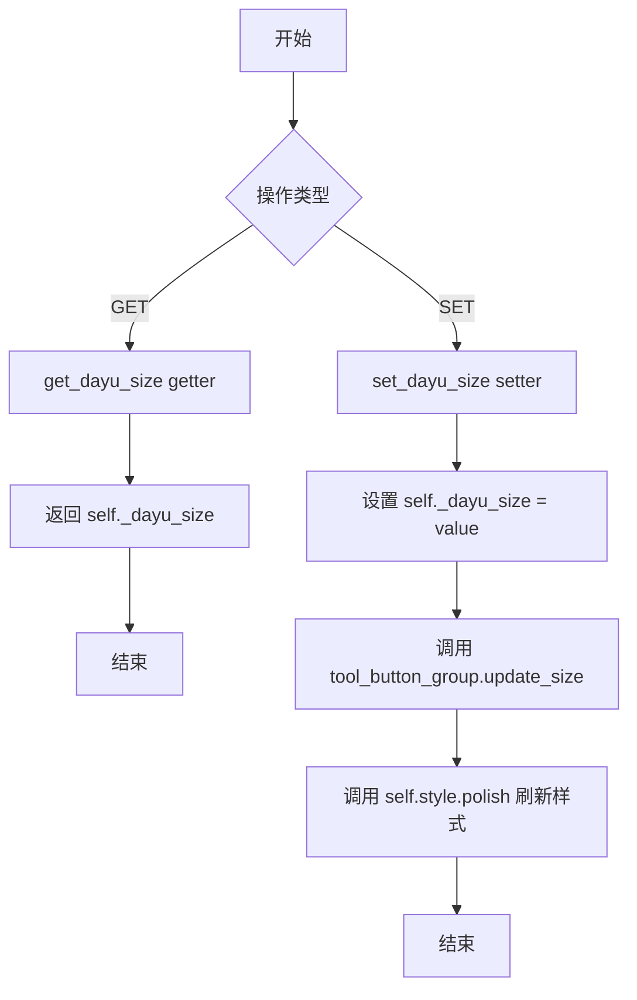

#### 带注释源码

```python
# Qt Property 定义
# 属性名: dayu_size
# 类型: int
# getter: get_dayu_size
# setter: set_dayu_size
dayu_size = QtCore.Property(int, get_dayu_size, set_dayu_size)

def get_dayu_size(self):
    """
    Get the line tab size.
    :return: integer
    """
    # 返回内部存储的大小值
    return self._dayu_size

def set_dayu_size(self, value):
    """
    Set the line tab size.
    :param value: integer
    :return: None
    """
    # 1. 更新内部存储的大小值
    self._dayu_size = value
    # 2. 通知按钮组更新所有按钮的大小
    self.tool_button_group.update_size(self._dayu_size)
    # 3. 刷新控件样式以应用新的大小设置
    self.style().polish(self)
```


## 关键组件


### MUnderlineButton

下划线样式的工具按钮组件，继承自MToolButton，提供可选中的切换功能，用于作为标签页的点击项。

### MUnderlineButtonGroup

按钮组管理组件，继承自MButtonGroupBase，负责创建和管理多个下划线按钮，处理按钮的排他性选择，并通过sig_checked_changed信号同步选中状态。

### MLineTabWidget

核心的线条风格标签页小部件，整合水平排列的按钮组与垂直堆叠的页面容器，支持左对齐/居中/右对齐三种布局模式，实现标签切换与页面切换的联动。

### 堆叠窗口管理

使用MStackedWidget管理多个页面内容，通过按钮组的选中信号控制当前显示的页面索引，实现标签页的切换功能。

### 布局管理系统

组合使用QHBoxLayout和QVBoxLayout管理组件布局，支持在按钮栏左侧或右侧插入额外控件，并通过stretch实现对齐控制。

### 样式属性系统

通过QtCore.Property实现dayu_size属性的Q_PROPERTY绑定，支持统一调整按钮组内所有按钮的尺寸，并触发样式更新。

### 信号与槽机制

通过sig_checked_changed信号实现按钮选中状态与堆叠窗口页面切换的自动同步，支持Qt属性系统的通知机制。

### 对齐策略支持

支持QtCore.Qt.AlignCenter、AlignLeft、AlignRight三种对齐模式，通过条件判断动态调整水平布局中的stretch分布。


## 问题及建议


### 已知问题

-   **空指针风险**：`set_dayu_checked` 方法中直接调用 `self._button_group.button(value)`，未检查返回值是否为 None，如果传入无效的 value 会导致 `AttributeError`
-   **缺少参数验证**：`add_tab` 方法未对 `widget` 和 `data_dict` 参数进行空值检查，可能导致后续操作失败
-   **布局参数硬编码**：边距和间距使用硬编码值（0、5），缺乏灵活的配置机制，降低了组件的可复用性
-   **属性通知机制不完整**：`dayu_size` 属性使用 `Property` 但未定义 `notify` 信号，导致属性变化时无法自动通知观察者
-   **内部组件过度暴露**：将 `tool_button_group` 和 `stack_widget` 等内部组件直接公开，破坏了封装性，容易被外部代码错误使用
-   **信号连接潜在泄漏**：`sig_checked_changed` 信号直接连接到 `stack_widget.setCurrentIndex`，未考虑断开连接的场景
-   **类型注解缺失**：所有方法参数和返回值都缺少类型注解，降低了代码的可维护性和 IDE 支持

### 优化建议

-   **添加空值检查**：在 `set_dayu_checked` 和 `add_tab` 等方法中添加参数验证，提高代码健壮性
-   **使用 Qt 属性正确通知**：为 `dayu_size` 属性添加 `notify` 信号，或改用 `pyqtProperty` / `pyside6Property` 的正确语法
-   **封装内部组件**：将 `tool_button_group` 和 `stack_widget` 设为私有属性，提供受保护的访问方法
-   **配置化布局参数**：将硬编码的边距和间距改为可选参数或从主题配置中读取
-   **添加类型注解**：使用 Python typing 模块为所有方法添加参数和返回类型注解
-   **考虑使用 __slots__**：为不需要动态添加属性的类添加 `__slots__` 以节省内存
-   **添加文档字符串**：为关键方法补充更详细的文档说明，包括参数范围和异常情况


## 其它


### 设计目标与约束

该组件旨在提供一个具有下划线样式的标签页控件，支持水平对齐方式（左/中/右），与Dayu主题系统集成，实现标签切换与堆叠页面内容的同步。设计约束包括：仅支持垂直布局的标签页结构，按钮组必须与MStackedWidget配合使用，依赖Dayu主题的尺寸系统。

### 错误处理与异常设计

代码中未显式实现错误处理机制。潜在异常场景包括：传入的parent为None时可能影响信号传递；set_dayu_checked方法在按钮ID不存在时会返回-1而非抛出异常；add_tab方法未对widget和data_dict参数进行空值校验。建议在关键方法入口添加参数类型检查和None值防御。

### 数据流与状态机

状态转换流程：用户点击按钮 -> MUnderlineButtonGroup捕获点击信号 -> sig_checked_changed信号发射 -> MLineTabWidget接收信号 -> 调用stack_widget.setCurrentIndex切换页面。按钮选中状态由Qt的QButtonGroup exclusive模式管理，确保单选行为。dayu_size属性变更时会触发样式重绘。

### 外部依赖与接口契约

核心依赖包括：PySide6.QtCore（信号机制、属性系统）、PySide6.QtWidgets（布局组件）、dayu_theme（主题尺寸）、本地模块（button_group.MButtonGroupBase、divider.MDivider、stacked_widget.MStackedWidget、tool_button.MToolButton）。接口契约：add_tab方法要求widget为QWidget实例，data_dict需包含text/svg/icon键；alignment参数仅支持QtCore.Qt.AlignCenter/AlignLeft/AlignRight三种枚举值。

### 性能考虑

堆叠页面采用懒加载策略，页面内容在切换时才显示。按钮组使用QButtonGroup管理，信号连接采用直接连接模式确保响应速度。style().polish(self)在尺寸变更时触发，存在一定的样式重绘开销。

### 安全性考虑

代码未处理用户输入验证，data_dict参数直接用于按钮属性设置。SVG和文本内容未进行安全过滤，可能存在注入风险。建议在create_button方法中对svg路径和text内容进行白名单校验。

### 测试考虑

建议针对以下场景编写单元测试：三种对齐方式的布局正确性验证；按钮点击切换页面功能测试；dayu_size属性变更后按钮尺寸更新验证；空data_dict和缺失key情况的异常处理；多标签页添加和移除的内存管理。

### 版本兼容性

代码使用__future__模块兼容Python 2/3，但实际运行需要PySide6。Qt.AlignCenter等枚举在Qt5/6中可能存在差异，建议使用QtCore.Qt.AlignmentFlag枚举以提高兼容性。

### 可访问性

按钮缺少无障碍标签设置，screen reader无法正确读取标签页内容。建议为每个MUnderlineButton设置setAccessibleName和setAccessibleDescription，遵循Qt可访问性规范。

### 国际化/本地化

代码未实现国际化支持，文本内容（如按钮显示文本）直接来自data_dict参数。需要在调用add_tab前对data_dict中的文本进行Qt Linguist翻译处理，或使用QObject.tr()方法包装静态文本。

### 关键组件信息

MUnderlineButton：带下划线可选中状态的工具按钮，继承MToolButton。MUnderlineButtonGroup：管理下划线按钮组的类，处理选中状态同步和信号发射。MLineTabWidget：主标签页容器组件，协调按钮组与堆叠窗口的交互。MDivider：水平分割线组件，用于标签栏与内容区的视觉分隔。MStackedWidget：堆叠页面容器，管理多个页面的显示与隐藏。

### 潜在技术债务与优化空间

sig_checked_changed信号使用int类型传递按钮ID，若按钮数量超过int范围理论上存在风险（实际可忽略）；dayu_checked属性使用Qt Property实现，但getter/setter命名与Qt命名规范略有出入；bar_layout在运行时动态添加widget可能导致布局计算开销；未提供remove_tab或clear方法，标签页动态管理功能不完整。


    