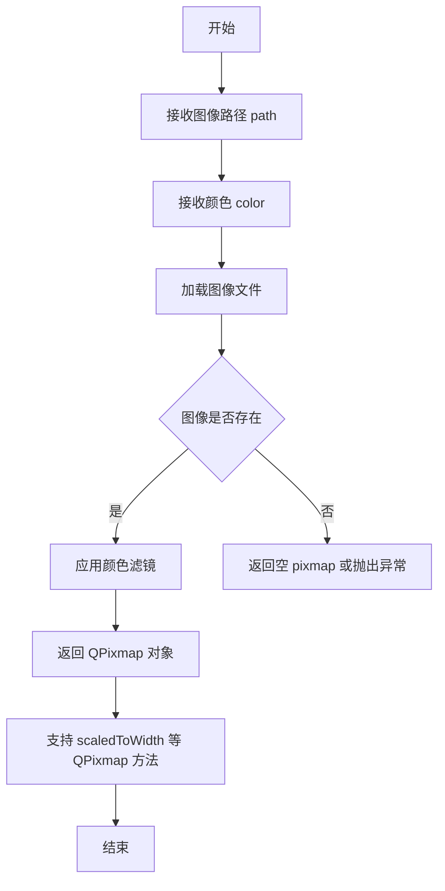
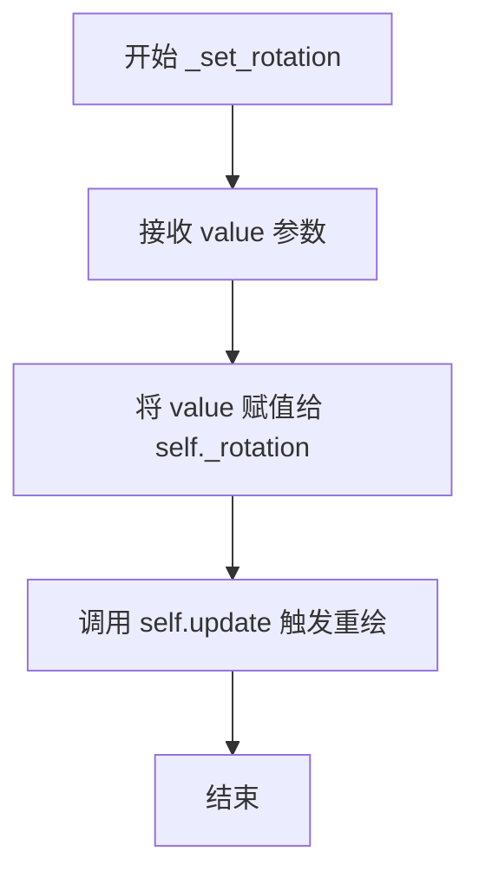
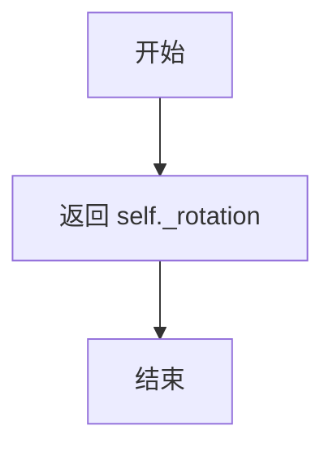
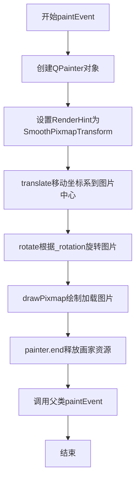
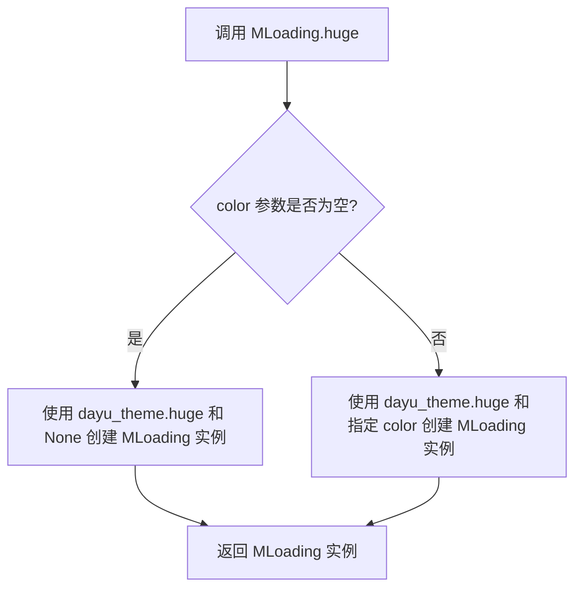
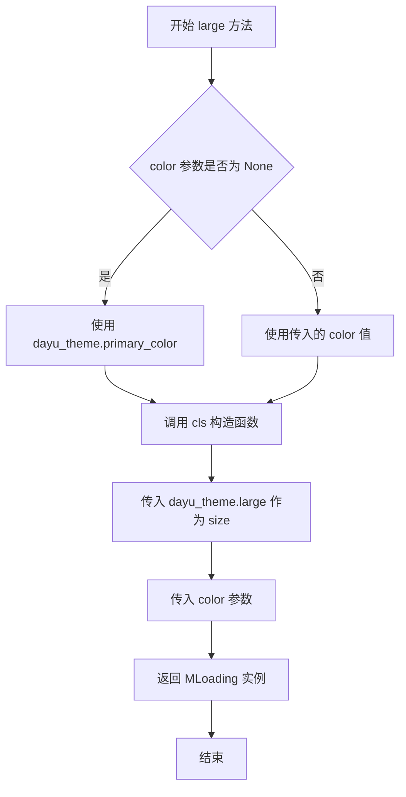
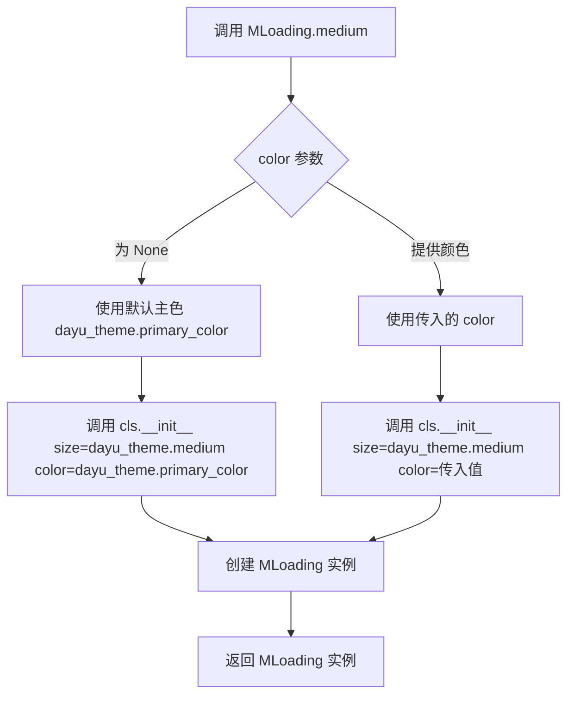
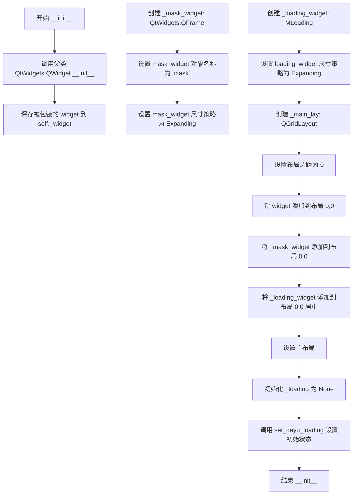
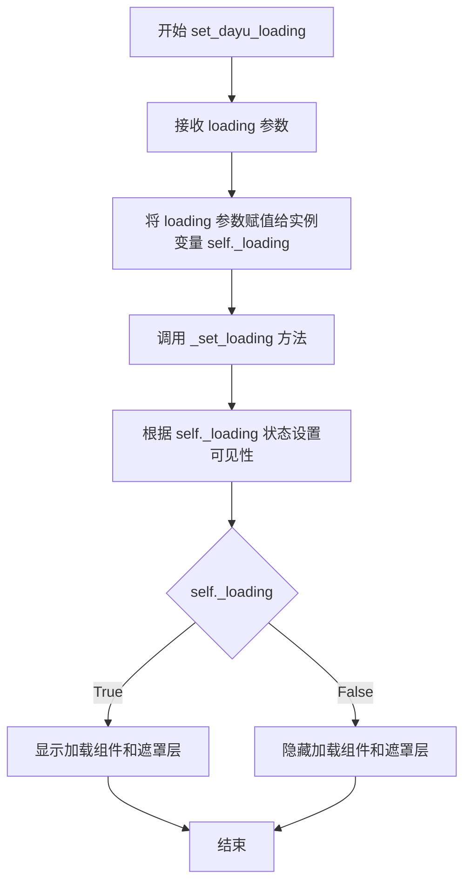
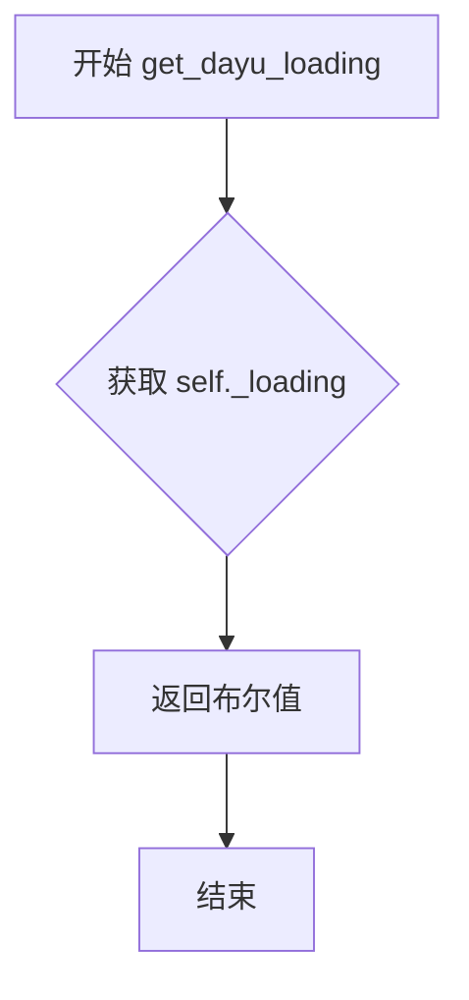

# `comic-translate\app\ui\dayu_widgets\loading.py` 详细设计文档

这是一个基于PySide6的加载动画组件库，包含MLoading旋转加载动画部件和MLoadingWrapper包装器部件，用于在Qt应用中显示加载状态和遮罩效果。

## 整体流程

```mermaid
graph TD
    A[开始] --> B[创建MLoading实例]
B --> C[设置固定尺寸]
C --> D[加载loading.svg图标并着色]
D --> E[创建QPropertyAnimation动画]
E --> F[设置动画属性: 持续时间1秒, 旋转0-360度, 无限循环]
F --> G[启动动画]
G --> H[用户调用paintEvent]
H --> I[创建QPainter]
I --> J[平移到中心并旋转]
J --> K[绘制pixmap]
K --> L[结束]

graph TD
    M[创建MLoadingWrapper] --> N[接收widget和loading参数]
N --> O[创建遮罩QFrame]
O --> P[创建MLoading实例]
P --> Q[使用QGridLayout布局]
Q --> R[将widget/遮罩/加载动画添加到同一单元格]
R --> S[调用set_dayu_loading设置初始状态]
S --> T[根据loading状态显示/隐藏加载动画和遮罩]
```

## 类结构

```
QtWidgets.QWidget (Qt基类)
├── MLoading (加载动画部件)
└── MLoadingWrapper (加载状态包装器)
```

## 全局变量及字段


### `dayu_theme.default_size`
    
Default size for the loading widget.

类型：`int`
    


### `dayu_theme.primary_color`
    
Primary theme color used for the loading indicator.

类型：`QtGui.QColor`
    


### `dayu_theme.huge`
    
Huge size preset for the loading widget.

类型：`int`
    


### `dayu_theme.large`
    
Large size preset for the loading widget.

类型：`int`
    


### `dayu_theme.medium`
    
Medium size preset for the loading widget.

类型：`int`
    


### `dayu_theme.small`
    
Small size preset for the loading widget.

类型：`int`
    


### `dayu_theme.tiny`
    
Tiny size preset for the loading widget.

类型：`int`
    


### `MLoading.pix`
    
加载动画的图像

类型：`MPixmap`
    


### `MLoading._rotation`
    
当前旋转角度

类型：`int`
    


### `MLoading._loading_ani`
    
旋转动画对象

类型：`QtCore.QPropertyAnimation`
    


### `MLoadingWrapper._widget`
    
被包装的部件

类型：`QtWidgets.QWidget`
    


### `MLoadingWrapper._mask_widget`
    
遮罩部件

类型：`QtWidgets.QFrame`
    


### `MLoadingWrapper._loading_widget`
    
加载动画部件

类型：`MLoading`
    


### `MLoadingWrapper._main_lay`
    
主布局

类型：`QtWidgets.QGridLayout`
    


### `MLoadingWrapper._loading`
    
当前加载状态

类型：`bool`
    
    

## 全局函数及方法


### `MPixmap`

该函数（类）用于根据给定的图像路径和颜色创建一个经过颜色处理的 QPixmap 对象，通常用于加载 SVG 图标并应用主题色。

参数：

- `path`：`str`，图像文件的路径（如 "loading.svg"）
- `color`：`QColor` 或 `str`，要应用的颜色（通常使用主题色如 `dayu_theme.primary_color`）

返回值：`QPixmap`，返回经过颜色处理并可缩放的 pixmap 对象，支持链式调用如 `.scaledToWidth()`

#### 流程图



#### 带注释源码

```python
# MPixmap 模块源码（从 .qt 模块导入，具体实现未在此文件中显示）
# 基于 MLoading 中的使用方式推断：
# self.pix = MPixmap("loading.svg", color or dayu_theme.primary_color).scaledToWidth(
#     size, QtCore.Qt.SmoothTransformation
# )

# 推断的实现方式可能是：
from PySide6 import QtGui

class MPixmap:
    """
    创建一个带有颜色滤镜的 Pixmap 对象
    """
    
    def __init__(self, path, color):
        """
        初始化 MPixmap
        
        参数:
            path: str - 图像文件路径
            color: QColor - 要应用的颜色
        """
        self._pixmap = QtGui.QPixmap(path)
        if not self._pixmap.isNull():
            # 创建一个带有颜色 的图像
            self._apply_color(color)
    
    def _apply_color(self, color):
        """应用颜色滤镜到 pixmap"""
        # 具体的颜色处理逻辑
        # 可能使用 QPainter 或 QImage 进行颜色混合
        pass
    
    def scaledToWidth(self, width, mode=QtCore.Qt.SmoothTransformation):
        """
        按宽度缩放 pixmap
        
        参数:
            width: int - 目标宽度
            mode: QtCore.Qt.TransformationMode - 缩放模式
            
        返回:
            QPixmap - 缩放后的 pixmap
        """
        return self._pixmap.scaledToWidth(width, mode)
    
    def width(self):
        """返回 pixmap 宽度"""
        return self._pixmap.width()
    
    def height(self):
        """返回 pixmap 高度"""
        return self._pixmap.height()
```

> **注意**：由于 `MPixmap` 是从 `.qt` 模块导入的，其完整源代码未在当前文件中提供。以上是根据 `MLoading` 类中的使用方式推断的接口定义。实际实现可能包含更多功能，如缓存机制、图像格式支持、颜色混合算法等。


### `MLoading.__init__`

该方法是 `MLoading` 类的构造函数，用于初始化一个加载动画部件。它设置部件的尺寸、颜色，并启动持续旋转的动画来展示加载状态。

参数：

- `self`：`MLoading`，MLoading 实例本身
- `size`：`int` 或 `None`，加载动画的尺寸，默认为 `dayu_theme.default_size`
- `color`：`QColor` 或 `None`，加载动画的颜色，默认为 `dayu_theme.primary_color`
- `parent`：`QWidget` 或 `None`，父窗口部件，传递给 Qt 父类

返回值：`None`，构造函数无返回值

#### 流程图

```mermaid
flowchart TD
    A[开始 __init__] --> B[调用父类构造函数 super().__init__]
    B --> C{size 参数是否为空?}
    C -->|是| D[使用 dayu_theme.default_size]
    C -->|否| E[使用传入的 size]
    D --> F[设置部件固定尺寸 setFixedSize]
    F --> G{color 参数是否为空?}
    G -->|是| H[使用 dayu_theme.primary_color]
    G -->|否| I[使用传入的 color]
    H --> J[创建 MPixmap 并缩放到指定尺寸]
    I --> J
    J --> K[初始化 _rotation = 0]
    K --> L[创建 QPropertyAnimation]
    L --> M[设置动画属性: 目标对象、持续时间1000ms、属性名rotation、起始值0、终止值360]
    M --> N[设置循环次数为无限循环 -1]
    N --> O[启动动画 start]
    O --> P[结束 __init__]
```

#### 带注释源码

```python
def __init__(self, size=None, color=None, parent=None):
    """
    MLoading 构造函数
    
    参数:
        size: int 或 None, 加载动画的尺寸, 默认为 dayu_theme.default_size
        color: QColor 或 None, 加载动画的颜色, 默认为 dayu_theme.primary_color  
        parent: QWidget 或 None, 父窗口部件
    """
    # 调用父类 QtWidgets.QWidget 的构造函数，传递 parent 参数
    super(MLoading, self).__init__(parent)
    
    # 如果 size 为 None，则使用主题默认尺寸
    size = size or dayu_theme.default_size
    
    # 设置部件的固定宽高为 size * size
    self.setFixedSize(QtCore.QSize(size, size))
    
    # 创建加载动画的 pixmap:
    # 1. 使用 "loading.svg" 资源文件
    # 2. 应用颜色（默认使用主题主色）
    # 3. 缩放到指定的宽度，使用平滑变换
    self.pix = MPixmap("loading.svg", color or dayu_theme.primary_color).scaledToWidth(
        size, QtCore.Qt.SmoothTransformation
    )
    
    # 初始化旋转角度为 0 度
    self._rotation = 0
    
    # 创建 Qt 属性动画对象，用于控制旋转
    self._loading_ani = QtCore.QPropertyAnimation()
    
    # 设置动画的目标对象为当前部件 self
    self._loading_ani.setTargetObject(self)
    
    # 设置动画持续时间为 1000 毫秒（1秒）
    self._loading_ani.setDuration(1000)
    
    # 设置动画属性名为 "rotation"（对应 Qt Property）
    self._loading_ani.setPropertyName(b"rotation")
    
    # 设置动画起始值为 0 度
    self._loading_ani.setStartValue(0)
    
    # 设置动画终止值为 360 度
    self._loading_ani.setEndValue(360)
    
    # 设置循环次数为 -1，表示无限循环
    self._loading_ani.setLoopCount(-1)
    
    # 启动动画
    self._loading_ani.start()
```


### `MLoading._set_rotation`

该方法是 MLoading 类的私有方法，作为 Qt 属性系统（Qt Property）的 setter 使用，负责接收外部传入的旋转角度值并更新内部状态，同时触发界面重绘以显示更新后的旋转效果。

参数：

- `value`：`int`，要设置的旋转角度值（0-360度）

返回值：`None`，该方法无返回值，仅执行状态更新和界面刷新操作

#### 流程图



#### 带注释源码

```python
def _set_rotation(self, value):
    """
    Qt Property 的 setter 方法，用于设置加载动画的旋转角度。
    
    该方法被 Qt 属性系统（QtCore.Property）调用，当动画的当前值
    发生变化时，Qt 属性系统会自动调用此方法来更新内部状态。
    
    参数:
        value (int): 旋转角度值，通常为 0-360 之间的整数。
                     该值由 QPropertyAnimation 在动画过程中持续更新。
    
    返回值:
        None: 无返回值，仅更新对象内部状态并触发界面重绘。
    
    示例:
        # Qt 属性系统内部会自动调用此方法
        # self.rotation = 90  # 相当于调用 _set_rotation(90)
    """
    # 将传入的角度值保存到实例变量中
    self._rotation = value
    
    # 调用 QWidget 的 update() 方法，触发 paintEvent 的执行
    # Qt 会在适当的时候重新绘制小部件显示更新后的旋转效果
    self.update()
```


### `MLoading._get_rotation`

该方法是 `MLoading` 类的私有方法，作为 Qt Property 的 getter 使用，用于获取当前加载动画的旋转角度值。

参数：

- `self`：`MLoading`，MLoading 类的实例对象，隐式参数，代表当前加载控件对象本身

返回值：`int`，返回当前旋转角度值（0-360度）

#### 流程图



#### 带注释源码

```python
def _get_rotation(self):
    """
    获取当前加载动画的旋转角度。
    此方法作为 Qt Property 的 getter 使用，
    配合 QtCore.Property 绑定到 rotation 属性上，
    使 QPropertyAnimation 能够通过属性机制访问和修改旋转值。
    
    Returns:
        int: 当前旋转角度值，范围为 0-360
    """
    return self._rotation
```


### `MLoading.paintEvent`

该方法是MLoading类的核心绘制方法，通过重写Qt的paintEvent实现加载动画的旋转显示。它使用QPainter将加载图片绘制到窗口上，并通过旋转属性实现动画效果。

参数：

- `self`：MLoading，加载动画控件实例本身
- `event`：QPaintEvent，Qt paint事件对象，包含绘制区域信息

返回值：`None`，该方法继承自QWidget的paintEvent，返回值为空

#### 流程图



#### 带注释源码

```python
def paintEvent(self, event):
    """override the paint event to paint the 1/4 circle image."""
    # 创建QPainter对象，用于在widget上进行绘制
    painter = QtGui.QPainter(self)
    # 设置渲染提示，启用平滑的像素图变换（抗锯齿效果）
    painter.setRenderHint(QtGui.QPainter.SmoothPixmapTransform)
    # 将坐标系原点移动到pixmap的中心位置
    # 这样旋转时会围绕中心点而不是左上角
    painter.translate(self.pix.width() / 2, self.pix.height() / 2)
    # 根据_rotation属性旋转画布，实现动画效果
    painter.rotate(self._rotation)
    # 在计算后的位置绘制pixmap
    # 坐标需要偏移到中心点的相反方向，以确保图片中心对齐
    painter.drawPixmap(
        -self.pix.width() / 2,
        -self.pix.height() / 2,
        self.pix.width(),
        self.pix.height(),
        self.pix,
    )
    # 结束绘制，释放QPainter资源
    painter.end()
    # 调用父类的paintEvent，保持Qt的事件处理机制完整
    return super(MLoading, self).paintEvent(event)
```


### `MLoading.huge`

该方法是一个类方法，用于创建一个具有超大尺寸的加载动画部件。它接受可选的颜色参数，并返回配置了 `dayu_theme.huge` 尺寸的 `MLoading` 实例。

参数：

- `color`：`str` 或 `None`，可选参数，用于指定加载动画的颜色，默认为 `None`（使用主题默认主色）

返回值：`MLoading`，返回一个新创建的 MLoading 实例，其尺寸被设置为 huge 级别

#### 流程图



#### 带注释源码

```python
@classmethod
def huge(cls, color=None):
    """
    创建一个超大尺寸的 MLoading 加载动画部件
    
    参数:
        cls: 类本身, 由 classmethod 自动传入
        color: str 或 None, 可选参数, 指定加载动画的颜色
    
    返回值:
        MLoading: 返回配置了 huge 尺寸的 MLoading 实例
    """
    # 调用类的构造函数，传入 huge 尺寸和可选的颜色参数
    return cls(dayu_theme.huge, color)
```


### `MLoading.large`

创建一个具有大尺寸的加载动画组件。该类方法接受可选的颜色参数，返回配置了预设大尺寸的 `MLoading` 实例，用于在 UI 中显示加载状态。

**参数：**

- `cls`：`type`，类方法隐含的类引用，用于调用构造函数创建实例
- `color`：`Optional[QtGui.QColor]`，可选参数，用于指定加载动画的颜色，默认为 `dayu_theme.primary_color`

**返回值：** `MLoading`，返回一个配置了大尺寸（`dayu_theme.large`）和指定颜色的加载动画组件实例

#### 流程图



#### 带注释源码

```python
@classmethod
def large(cls, color=None):
    """
    Create a MLoading with large size
    
    该类方法用于创建一个大尺寸的加载动画组件。
    它封装了直接调用 MLoading 构造函数的细节，
    提供了更语义化的工厂方法接口。
    
    Args:
        color: 可选的 QtGui.QColor 对象，用于设置加载动画的颜色。
               如果为 None，则使用主题默认的主色调。
    
    Returns:
        MLoading: 配置了预设大尺寸的加载动画组件实例
    """
    # 调用类的构造函数，传入大尺寸常量作为 size 参数
    # color 参数直接透传给构造函数
    return cls(dayu_theme.large, color)
```


### `MLoading.medium`

创建一个中等尺寸的加载动画部件，通过类方法快速实例化指定大小的 `MLoading` 对象。

参数：

- `cls`：类对象（隐式参数），`type`，调用该方法的类本身，用于创建实例
- `color`：`Optional[str | QColor]`，可选参数，用于指定加载动画的颜色，默认为 `None`（使用主题默认主色）

返回值：`MLoading`，返回新创建的中等尺寸加载动画部件实例

#### 流程图



#### 带注释源码

```python
@classmethod
def medium(cls, color=None):
    """Create a MLoading with medium size"""
    # cls 代表 MLoading 类本身
    # dayu_theme.medium 是预设的中等尺寸常量
    # color 参数传递给构造函数，用于指定加载动画的颜色
    # 如果 color 为 None，则在 __init__ 中会使用 dayu_theme.primary_color
    return cls(dayu_theme.medium, color)
```


### `MLoading.small`

这是一个类方法，用于创建并返回一个配置为小尺寸的MLoading加载动画实例，默认使用主题配置的小尺寸，也可以自定义颜色。

参数：

- `cls`：类方法隐含的第一个参数，表示MLoading类本身
- `color`：`可选参数，类型为颜色值（如None或颜色对象）`，指定加载动画的颜色，默认为None（使用主题主色）

返回值：`MLoading`（MLoading实例），返回一个新创建的小尺寸加载动画部件实例

#### 流程图

```mermaid
graph TD
    A[调用 MLoading.small] --> B{color参数是否为空?}
    B -->|是| C[使用dayu_theme.small作为尺寸, 默认颜色]
    B -->|否| D[使用dayu_theme.small作为尺寸, 使用传入的color]
    C --> E[调用cls构造函数: cls(dayu_theme.small, None)]
    D --> E
    E --> F[返回MLoading实例]
    F --> G[显示小尺寸加载动画]
```

#### 带注释源码

```python
@classmethod
def small(cls, color=None):
    """Create a MLoading with small size"""
    # cls在此处代表MLoading类本身
    # dayu_theme.small 是预定义的小尺寸常量
    # 如果color为None，将使用默认的主色调
    return cls(dayu_theme.small, color)
```

---

#### 补充信息

**关键组件信息：**

- `MLoading`：显示加载动画图像的Qt部件类
- `dayu_theme`：主题配置模块，提供默认尺寸常量（huge, large, medium, small, tiny）和主色（primary_color）
- `MPixmap`：用于处理带颜色配置的pixmap图像

**潜在技术债务或优化空间：**

1. 尺寸参数缺乏验证机制，未检查size是否为有效数值
2. 颜色参数类型不明确，注释中未说明接受的颜色格式（如hex、rgb、Qt颜色对象等）
3. 类方法数量较多，存在重复代码模式，可考虑使用工厂模式或参数化方法简化
4. 动画持续时间(1000ms)和旋转角度(0-360)为硬编码，缺乏灵活性配置

**设计目标与约束：**

- 提供多种预设尺寸的便捷类方法（huge/large/medium/small/tiny）
- 通过Qt属性系统实现流畅的旋转动画
- 遵循PySide6 Qt绑定规范

**错误处理与异常设计：**

- 若传入无效尺寸可能导致显示异常
- 若MPixmap加载失败（如loading.svg文件不存在），可能抛出异常但未捕获


### `MLoading.tiny`

创建一个具有微小尺寸的MLoading（加载动画）实例的类方法。

参数：

- `cls`：`type`，类方法隐含的第一个参数，表示类本身（MLoading类）
- `color`：`str` 或 `None`，可选参数，用于设置加载动画的颜色，默认为 `None`

返回值：`MLoading`，返回一个新的MLoading实例，该实例使用dayu_theme中定义的微小尺寸

#### 流程图

```mermaid
graph TD
    A[开始] --> B[接收color参数]
    B --> C[调用cls构造函数: cls(dayu_theme.tiny, color)]
    C --> D[创建MLoading实例]
    D --> E[返回MLoading实例]
    E --> F[结束]
```

#### 带注释源码

```python
@classmethod
def tiny(cls, color=None):
    """Create a MLoading with tiny size"""
    # 使用dayu_theme.tiny作为尺寸，color作为颜色参数，创建并返回MLoading实例
    return cls(dayu_theme.tiny, color)
```


### `MLoadingWrapper.__init__`

该方法是 `MLoadingWrapper` 类的构造函数，用于初始化一个包装器控件，该控件可以叠加显示加载动画（MLoading）和半透明遮罩层，用于在数据加载时覆盖目标控件并展示加载状态。

参数：

- `self`：隐式参数，MLoadingWrapper 实例本身
- `widget`：`QtWidgets.QWidget`，需要被包装的目标控件，将在其上方叠加显示加载动画
- `loading`：`bool`，初始加载状态，默认为 `True`，即创建后立即显示加载状态
- `parent`：`QtWidgets.QWidget`，父控件，默认为 `None`，用于建立 Qt 控件层级关系

返回值：`None`，构造函数不返回任何值

#### 流程图



#### 带注释源码

```python
def __init__(self, widget, loading=True, parent=None):
    """
    初始化 MLoadingWrapper 包装器控件
    
    Args:
        widget: 要包装的 Qt 控件，将在加载时覆盖此控件
        loading: 初始加载状态，True 为显示加载动画
        parent: 父控件，用于 Qt 控件树层级管理
    """
    # 调用父类 QWidget 的初始化方法，建立 Qt 对象层级
    super(MLoadingWrapper, self).__init__(parent)
    
    # 保存被包装的目标控件引用，后续可通过 self._widget 访问
    self._widget = widget
    
    # 创建半透明遮罩层 QFrame，用于在加载时覆盖底层控件
    self._mask_widget = QtWidgets.QFrame()
    # 设置对象名称，便于 Qt样式表(QSS) 中的选择器定位
    self._mask_widget.setObjectName("mask")
    # 设置尺寸策略为 Expanding，使遮罩层随父控件扩展
    self._mask_widget.setSizePolicy(QtWidgets.QSizePolicy.Expanding, QtWidgets.QSizePolicy.Expanding)
    
    # 创建加载动画控件 MLoading 的实例
    self._loading_widget = MLoading()
    # 设置加载控件的尺寸策略
    self._loading_widget.setSizePolicy(QtWidgets.QSizePolicy.Expanding, QtWidgets.QSizePolicy.Expanding)

    # 创建网格布局管理器，用于层叠放置三个控件
    self._main_lay = QtWidgets.QGridLayout()
    # 设置布局的上下左右边距均为 0，使子控件紧贴边缘
    self._main_lay.setContentsMargins(0, 0, 0, 0)
    # 将被包装的 widget 放置在第一行第一列
    self._main_lay.addWidget(widget, 0, 0)
    # 将遮罩层放置在同一位置，覆盖 widget
    self._main_lay.addWidget(self._mask_widget, 0, 0)
    # 将加载动画控件放置在中心位置
    self._main_lay.addWidget(self._loading_widget, 0, 0, QtCore.Qt.AlignCenter)
    # 将布局设置给当前包装器控件
    self.setLayout(self._main_lay)
    
    # 初始化内部加载状态标志为 None
    self._loading = None
    # 根据参数 loading 设置初始加载状态，会触发 _set_loading() 控制显示/隐藏
    self.set_dayu_loading(loading)
```


### `MLoadingWrapper._set_loading`

该方法是 `MLoadingWrapper` 类的内部私有方法，用于根据 `_loading` 属性的当前值来设置加载指示器和遮罩层的可见性，实现加载状态的显示与隐藏切换。

参数：

- `self`：`MLoadingWrapper`，当前 `MLoadingWrapper` 类的实例对象，隐式参数，用于访问类的成员变量和方法

返回值：`None`，无返回值描述（该方法仅通过修改 UI 组件的可见性状态来生效，不返回任何数据）

#### 流程图

```mermaid
flowchart TD
    A[开始 _set_loading] --> B{self._loading}
    B -->|True| C[设置加载组件可见: setVisible(True)]
    B -->|True| D[设置遮罩组件可见: setVisible(True)]
    B -->|False| E[设置加载组件可见: setVisible(False)]
    B -->|False| F[设置遮罩组件可见: setVisible(False)]
    C --> G[方法结束]
    D --> G
    E --> G
    F --> G
```

#### 带注释源码

```python
def _set_loading(self):
    """
    根据 _loading 属性的值设置加载组件和遮罩组件的可见性。
    当 _loading 为 True 时显示加载动画和遮罩层，为 False 时隐藏。
    """
    # 设置加载指示器组件的可见性
    # 加载指示器（MLoading 实例）根据 loading 状态显示或隐藏
    self._loading_widget.setVisible(self._loading)
    
    # 设置遮罩层的可见性
    # 遮罩层用于在加载时遮挡底层 widget，提供视觉隔离效果
    self._mask_widget.setVisible(self._loading)
```


### `MLoadingWrapper.set_dayu_loading`

设置当前组件的加载状态，用于显示或隐藏加载动画和遮罩层。

参数：

-  `loading`：`bool`，表示是否显示加载状态。True 时显示加载动画和遮罩层，False 时隐藏。

返回值：`None`，无返回值。

#### 流程图



#### 带注释源码

```python
def set_dayu_loading(self, loading):
    """
    Set current state to loading or not
    :param loading: bool
    :return: None
    """
    # 将传入的 loading 状态保存到实例变量中
    self._loading = loading
    # 调用内部方法 _set_loading 来实际控制 UI 组件的显示/隐藏
    self._set_loading()
```


### `MLoadingWrapper.get_dayu_loading`

获取当前加载部件是否处于加载状态的布尔值。

参数：

- `self`：`MLoadingWrapper`，类的实例本身，包含所有实例属性和方法

返回值：`bool`，返回当前 loading 部件的加载状态，True 表示正在加载，False 表示未加载

#### 流程图



#### 带注释源码

```python
def get_dayu_loading(self):
    """
    Get current loading widget is loading or not.
    :return: bool
    """
    # 返回内部属性 _loading，该属性存储当前的加载状态
    # True 表示正在显示加载动画，False 表示不显示
    return self._loading
```

## 关键组件


### MLoading 类

Qt widgets.QWidget的子类，用于显示加载动画图片，通过旋转1/4圆形的SVG图像来展示加载状态。

### MLoadingWrapper 类

Qt widgets.QWidget的子类，作为一个包装器组件，可以包裹任意widget并显示或隐藏加载状态，提供遮罩层和加载动画的组合显示。

### 旋转动画系统

利用Qt的QPropertyAnimation实现，通过rotation属性实现平滑的360度旋转动画，动画设置为无限循环。

### paintEvent 自定义绘制

重写Qt的paintEvent方法，使用QPainter自定义绘制旋转的加载图像，支持平滑变换和坐标变换。

### 工厂方法集合

提供huge()、large()、medium()、small()、tiny()等类方法，快速创建不同尺寸规格的MLoading实例。

### dayu_loading 属性系统

使用Qt的Property机制实现的双向绑定属性，用于在Python和Qt元对象系统之间同步加载状态。

### 尺寸与主题系统

集成dayu_theme主题系统的默认尺寸配置，支持通过size参数自定义或使用预设的尺寸常量。

### MPixmap 图像加载

使用MPixmap加载SVG矢量图并根据颜色主题进行着色和缩放处理。


## 问题及建议


### 已知问题

-   使用了Python 2兼容的`__future__`导入语句，增加了不必要的代码复杂性。
-   QPropertyAnimation的属性名使用了字节字符串`b"rotation"`，不符合Python 3的最佳实践。
-   加载动画永久循环播放（loop count -1），未提供停止动画的接口，可能导致资源浪费。
-   `paintEvent`方法中调用父类方法后返回了返回值，但Qt的paintEvent通常不需要返回值。
-   缺乏对外部依赖（如`dayu_theme`和`MPixmap`）的异常处理，如果这些模块导入失败或初始化错误，程序可能崩溃。
-   动画持续时间硬编码为1000毫秒，缺乏灵活性，无法满足不同场景的需求。
-   `MLoadingWrapper`类中`_set_loading`方法设计为私有但在`set_dayu_loading`中直接调用，职责不清晰。
-   类和公共方法缺少详细的文档字符串，影响代码可读性和可维护性。

### 优化建议

-   移除所有`from __future__ import`语句，因为项目基于PySide6（仅支持Python 3）。
-   将属性名改为字符串`"rotation"`以符合Python 3规范。
-   添加`stop_animation`方法来停止QPropertyAnimation，并在类销毁时自动调用以释放资源。
-   移除`paintEvent`中`super()`调用后的返回值，改为直接调用。
-   在`MLoading`的构造函数中添加异常处理，捕获`MPixmap`或`dayu_theme`可能的导入错误，并提供默认值或抛出有意义的异常。
-   将动画持续时间作为可选参数添加到构造函数中，默认值为1000毫秒。
-   重构`_set_loading`方法为公共方法或移除私有前缀，并添加文档说明其用途。
-   为所有公共类、方法和属性添加详细的文档字符串（docstring），包括参数、返回值和异常说明。
-   考虑将`MLoading`的类方法（huge、large等）改为静态方法或工厂方法，并添加类型提示以提高类型安全性。
-   优化`MLoadingWrapper`的布局逻辑，当前使用GridLayout可能略显冗余，可根据实际使用场景简化。


## 其它


### 设计目标与约束

本组件用于在PySide6应用程序中显示加载动画状态，支持多种尺寸预设，并提供包装器组件用于遮挡和指示任意widget的加载状态。设计约束：1) 依赖PySide6 Qt库；2) 需要loading.svg图片资源；3) 动画使用QPropertyAnimation实现，Qt版本需支持Qt Property系统。

### 错误处理与异常设计

- 图片加载失败：MPixmap内部处理，异常时可能导致pix为None，paintEvent需做好防御
- 无效尺寸参数：size参数使用or默认值dayu_theme.default_size，避免None
- parent参数传递：直接传递给父类QtWidgets.QWidget，由Qt管理生命周期

### 数据流与状态机

MLoading状态机：
- 初始化 -> 动画运行中（_loading_ani.isRunning()）
- 旋转属性变化 -> 触发paintEvent重绘

MLoadingWrapper状态机：
- dayu_loading=True: 显示遮罩(_mask_widget) + 显示加载动画(_loading_widget)
- dayu_loading=False: 隐藏遮罩 + 隐藏加载动画

### 外部依赖与接口契约

依赖模块：
- PySide6.QtCore: QPropertyAnimation, QSize, Qt, Property
- PySide6.QtGui: QPainter, QPainter.SmoothPixmapTransform
- PySide6.QtWidgets: QWidget, QFrame, QGridLayout, QSizePolicy
- 本地模块: dayu_theme(default_size/huge/large/medium/small/tiny, primary_color), qt.MPixmap

接口契约：
- MLoading类：可通过类方法huge/large/medium/small/tiny创建不同尺寸实例
- MLoadingWrapper类：通过set_dayu_loading(bool)或dayu_loading属性控制显示状态

### 线程安全

- QPropertyAnimation和paintEvent在主线程执行，无线程安全问题
- 如在非主线程使用，需通过Qt线程间通信机制

### 资源清理

- QPropertyAnimation在MLoading销毁时自动清理
- pixmap资源由Qt父对象管理
- 建议在MLoadingWrapper销毁时确保loading动画停止

### 性能考虑

- 动画使用property机制，每帧触发update()，建议监控高刷新率下的性能
- paintEvent中使用smoothTransformation，可考虑在低性能设备使用FastTransformation
- 遮罩使用QFrame，可考虑使用setAutoFillBackground优化

### 使用示例

```python
# 基础使用
loading = MLoading()
loading.show()

# 使用预设尺寸
large_loading = MLoading.large(color=Qt.red)

# 包装已有widget
my_widget = QPushButton("Click")
wrapper = MLoadingWrapper(my_widget, loading=True)
wrapper.set_dayu_loading(False)  # 隐藏加载状态

# 使用Qt属性
wrapper.setProperty("dayu_loading", True)
```

### 单元测试建议

1. 测试MLoading各尺寸构造函数返回对象类型和尺寸
2. 测试MLoadingWrapper默认loading状态
3. 测试set_dayu_loading切换状态后widget可见性
4. 测试Qt Property读写一致性
5. 测试动画启动后rotation属性变化

### 配置项

- dayu_theme.default_size: 默认尺寸
- dayu_theme.primary_color: 默认颜色
- 动画持续时间: 1000ms（硬编码，可考虑配置化）
- 旋转角度: 0-360度（顺时针）

### 兼容性考虑

- Python 2/3兼容（使用__future__导入）
- Qt版本: 需支持QPropertyAnimation和Qt Property系统
- 跨平台: 依赖PySide6，支持Windows/Linux/macOS

    