# `comic-translate\app\ui\dayu_widgets\menu.py` 详细设计文档

这是一个基于PySide6的可滚动、可搜索的菜单组件。它继承自QtWidgets.QMenu，通过ScrollableMenuBase实现长菜单的滚动功能，通过SearchableMenuBase实现菜单项的搜索过滤，最终由MMenu类提供级联数据加载、动态取值和事件信号支持，适用于需要处理大量选项的GUI场景。

## 整体流程

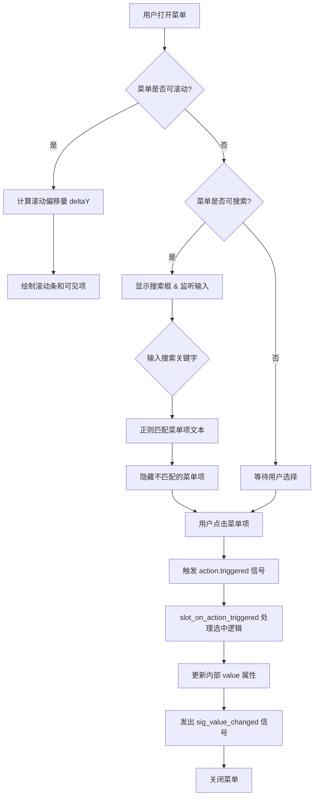

## 类结构

```
QtWidgets.QMenu
└── ScrollableMenuBase (混入 property_mixin)
    └── SearchableMenuBase (混入 property_mixin)
        └── MMenu
```

## 全局变量及字段


### `ScrollableMenuBase.deltaY`
    
滚动偏移量

类型：`int`
    


### `ScrollableMenuBase.dirty`
    
标记菜单项几何信息是否需要重算

类型：`bool`
    


### `ScrollableMenuBase.ignoreAutoScroll`
    
是否忽略自动滚动

类型：`bool`
    


### `ScrollableMenuBase._maximumHeight`
    
菜单最大高度

类型：`int`
    


### `ScrollableMenuBase._actionRects`
    
缓存的菜单项矩形区域

类型：`list`
    


### `ScrollableMenuBase.scrollTimer`
    
滚动动画定时器

类型：`QTimer`
    


### `ScrollableMenuBase.delayTimer`
    
延迟操作定时器，用于防抖

类型：`QTimer`
    


### `ScrollableMenuBase.defaultItemHeight`
    
菜单项默认高度

类型：`int`
    


### `ScrollableMenuBase.scrollUpRect`
    
上滚动箭头区域

类型：`QRect`
    


### `ScrollableMenuBase.scrollDownRect`
    
下滚动箭头区域

类型：`QRect`
    


### `SearchableMenuBase.search_popup`
    
搜索结果弹窗

类型：`MPopup`
    


### `SearchableMenuBase.search_bar`
    
搜索输入框

类型：`MLineEdit`
    


### `SearchableMenuBase.search_label`
    
搜索标签

类型：`QLabel`
    


### `MMenu.sig_value_changed`
    
值改变信号

类型：`Signal`
    


### `MMenu._action_group`
    
动作组，用于管理互斥或多选

类型：`QActionGroup`
    


### `MMenu._load_data_func`
    
数据加载回调函数

类型：`callable`
    
    

## 全局函数及方法


### `utils.display_formatter`

该函数用于格式化菜单项的显示文本，将原始标签数据转换为适合在 Qt 菜单中显示的格式。

参数：

- `label`：`str`，原始的菜单项标签文本

返回值：`str`，格式化后的菜单项显示文本

#### 流程图

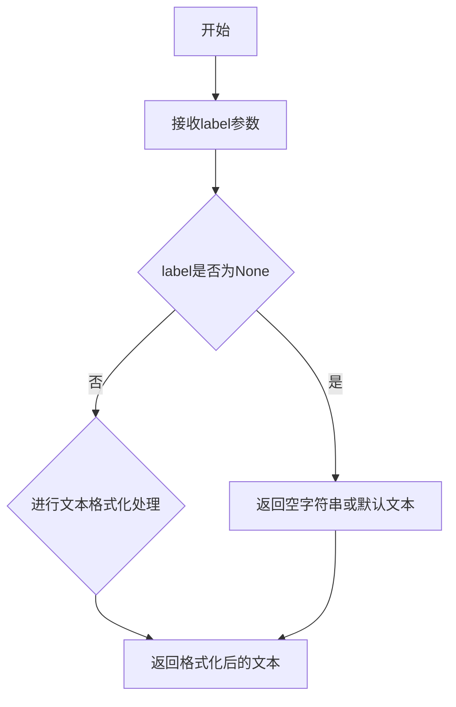

#### 带注释源码

```python
# 从代码中调用的位置推断：
# 文件：MMenu 类中的 _add_menu 方法
# 行号：约第 270 行

# 调用示例：
action = self._action_group.addAction(utils.display_formatter(data_dict.get("label")))

# 参数说明：
# - data_dict.get("label"): 从数据字典中获取的原始标签
# - utils.display_formatter(): 对标签进行格式化处理

# 返回值：
# - 返回格式化后的字符串，用于设置 QAction 的显示文本
```

> **注意**：该函数的完整源代码定义未在当前代码片段中提供。根据导入语句 `from .import utils as utils`（应为 `from . import utils`），该函数位于同目录下的 `utils.py` 模块中。从调用方式来看，该函数接受一个字符串参数并返回格式化后的字符串文本。


# 函数文档提取

### `utils.from_list_to_nested_dict`

将扁平字符串列表转换为嵌套字典结构的工具函数，常用于将路径风格的字符串列表转换为树形数据结构。

参数：

- `option_list`：`list`，输入的字符串列表，每个元素代表一个路径节点
- `sep`：`str`，路径分隔符，默认为从属性中获取的 "separator"（代码中通过 `self.property("separator")` 获取）

返回值：`list`，转换后的嵌套字典列表，每个字典包含 `label`、`value` 和可能的 `children` 字段

#### 流程图

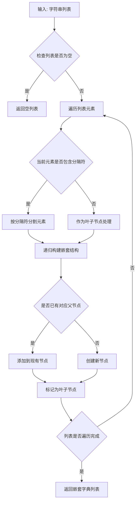

#### 带注释源码

```python
# 该函数定义在 utils 模块中，此处根据调用方式推断其实现逻辑
# 根据代码中的调用: utils.from_list_to_nested_dict(option_list, sep=self.property("separator"))
# 函数签名应为: def from_list_to_nested_dict(option_list, sep="/")

def from_list_to_nested_dict(option_list, sep="/"):
    """
    将扁平字符串列表转换为嵌套字典结构
    
    示例:
        输入: ["a/b/c", "a/b/d", "a/e"]
        输出: [
            {"label": "a", "children": [
                {"label": "b", "children": [
                    {"label": "c", "value": "c"},
                    {"label": "d", "value": "d"}
                ]},
                {"label": "e", "value": "e"}
            ]}
        ]
    """
    result = []
    for item in option_list:
        parts = item.split(sep)  # 按分隔符分割路径
        # 递归构建嵌套结构的逻辑
        # ...
    return result
```

#### 实际代码调用示例

在 `MMenu.set_data` 方法中的调用：

```python
def set_data(self, option_list):
    assert isinstance(option_list, list)
    if option_list:
        # 检查是否所有元素都是字符串类型
        if all(isinstance(i, six.string_types) for i in option_list):
            # 调用 from_list_to_nested_dict 转换为嵌套结构
            option_list = utils.from_list_to_nested_dict(option_list, sep=self.property("separator"))
        # 检查是否所有元素都是数字类型
        if all(isinstance(i, (int, float)) for i in option_list):
            option_list = [{"value": i, "label": str(i)} for i in option_list]
    # 全部转换成 dict 类型的 list
    self.setProperty("data", option_list)
```


### property_mixin

`property_mixin` 是一个装饰器/混入类，用于为类添加属性相关的混入功能。从代码使用方式来看，它被用作类装饰器，为 `ScrollableMenuBase`、`SearchableMenuBase` 和 `MMenu` 这三个类添加属性处理能力。

参数：

- `cls`：`type`，被装饰的目标类

返回值：`type`，装饰后的类（添加了属性混入功能）

#### 流程图

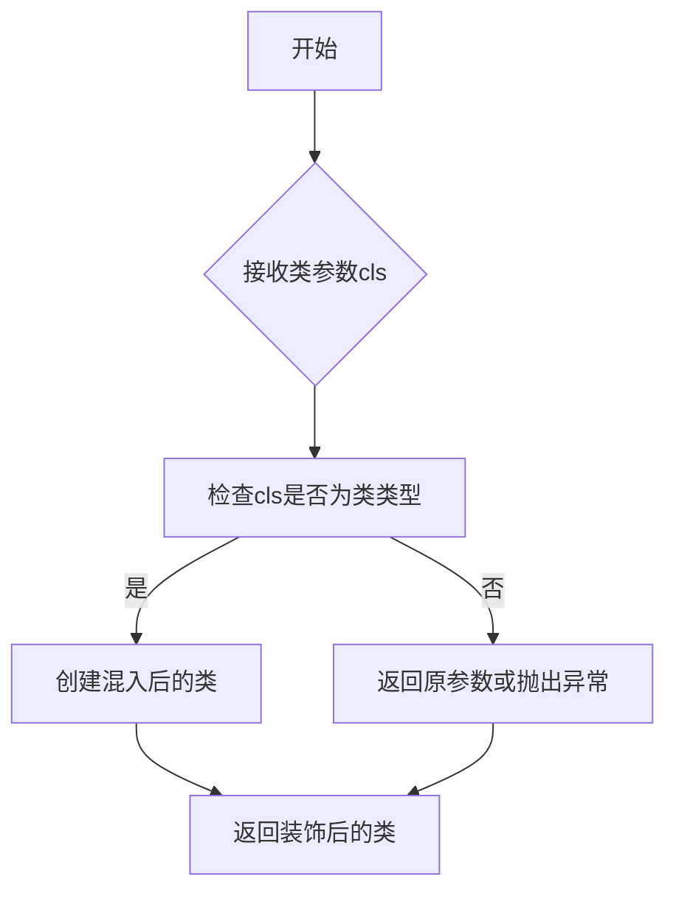

#### 带注释源码

```python
# property_mixin 的定义在实际代码中位于 .mixin 模块
# 以下是基于使用方式的推断代码结构

def property_mixin(cls):
    """
    属性混入装饰器
    
    用于为类添加属性相关的混入功能。
    被装饰的类将获得属性处理、属性验证等扩展功能。
    
    使用示例:
        @property_mixin
        class ScrollableMenuBase(QtWidgets.QMenu):
            pass
    """
    # 1. 验证输入是否为类类型
    if not isinstance(cls, type):
        raise TypeError("property_mixin requires a class as input")
    
    # 2. 为类添加混入的属性处理方法
    # 3. 返回增强后的类
    
    return cls
```

#### 实际使用示例

```python
# 在提供的代码中，property_mixin 被用于装饰以下类：

@property_mixin
class ScrollableMenuBase(QtWidgets.QMenu):
    """可滚动的菜单基类"""
    deltaY = 0
    dirty = True
    # ... 其他属性和方法

@property_mixin  
class SearchableMenuBase(ScrollableMenuBase):
    """可搜索的菜单基类，继承自ScrollableMenuBase"""
    # ... 属性和方法

@property_mixin
class MMenu(SearchableMenuBase):
    """主菜单类，支持级联、搜索等功能"""
    sig_value_changed = QtCore.Signal(object)
    # ... 属性和方法
```

---

### 补充说明

**关于 property_mixin 的实现**：
- 该装饰器的具体实现在 `mixin.py` 文件中（通过 `from .mixin import property_mixin` 导入）
- 当前提供的代码片段未包含 `mixin.py` 的源码
- 从使用方式推断，该装饰器可能实现了属性代理、属性验证或属性监听等功能

**建议**：
如需获取 `property_mixin` 的完整实现细节，请提供 `mixin.py` 文件的源码。


### `ScrollableMenuBase.__init__`

该方法是 `ScrollableMenuBase` 类的构造函数，负责初始化可滚动菜单的基本属性、计时器和相关配置。通过调用父类 QMenu 的初始化方法，并设置定时器用于滚动检测和延迟操作，最终通过 `setMaxItemCount(0)` 设置默认的最大菜单项数量。

参数：

- `*args`：可变位置参数，用于传递给父类 `QtWidgets.QMenu` 的初始化参数（如父对象、标题等）
- `**kwargs`：可变关键字参数，用于传递给父类 `QtWidgets.QMenu` 的初始化参数（如 `parent`、`title` 等）

返回值：无返回值（构造函数）

#### 流程图

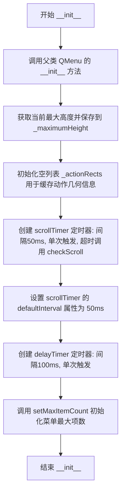

#### 带注释源码

```python
def __init__(self, *args, **kwargs):
    """
    初始化可滚动菜单基类
    
    参数:
        *args: 可变位置参数，传递给父类 QMenu
        **kwargs: 可变关键字参数，传递给父类 QMenu
    """
    # 调用父类 QtWidgets.QMenu 的初始化方法，传递所有参数
    super(ScrollableMenuBase, self).__init__(*args, **kwargs)
    
    # 保存当前菜单的最大高度，用于后续恢复或计算
    self._maximumHeight = self.maximumHeight()
    
    # 初始化空列表，用于缓存每个动作(action)的几何矩形信息
    # 该列表会在 actionRects 属性被访问时填充
    self._actionRects = []

    # 创建滚动检测定时器 scrollTimer
    # interval=50: 定时器间隔为50毫秒
    # singleShot=True: 定时器只触发一次，需要手动重启
    # timeout=self.checkScroll: 超时时调用 checkScroll 方法
    self.scrollTimer = QtCore.QTimer(self, interval=50, singleShot=True, timeout=self.checkScroll)
    
    # 设置自定义属性 defaultInterval，用于后续恢复定时器间隔
    self.scrollTimer.setProperty("defaultInterval", 50)
    
    # 创建延迟定时器 delayTimer，用于延迟执行某些操作
    # interval=100: 延迟时间为100毫秒
    # singleShot=True: 单次触发
    self.delayTimer = QtCore.QTimer(self, interval=100, singleShot=True)

    # 初始化菜单的最大项计数为0
    # 值为0时表示不限制最大高度，使用默认的最大高度
    self.setMaxItemCount(0)
```


### `ScrollableMenuBase._set_max_scroll_count`

该方法用于根据传入的最大滚动项数量设置菜单的最大显示项数，通过将传入值乘以 2.2 来计算实际的菜单最大项数并调用 `setMaxItemCount` 方法进行设置。

参数：

- `value`：`int` 或 `float`，要设置的最大滚动项数量

返回值：`None`，无返回值，仅执行菜单项数量的设置操作

#### 流程图

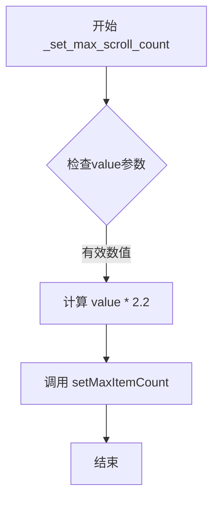

#### 带注释源码

```python
def _set_max_scroll_count(self, value):
    """
    根据传入的最大滚动项数量设置菜单的实际显示项数
    
    参数:
        value: 最大滚动项数量，整数或浮点数
    
    说明:
        该方法是一个内部方法，用于将外部设置的最大滚动项数量
        转换为菜单实际能够显示的项数。乘以2.2是为了预留额外的空间，
        以便在菜单滚动时能够显示更多的上下文项。
    """
    # 将传入的值乘以2.2，然后调用setMaxItemCount设置菜单的最大项数
    # 2.2这个系数是为了提供更好的用户体验，确保滚动时有足够的缓冲空间
    self.setMaxItemCount(value * 2.2)
```


### `ScrollableMenuBase.actionRects`

该属性用于获取菜单项的几何矩形列表，支持脏数据标记以实现缓存更新，并结合滚动偏移量计算每个菜单项的可见区域。

参数： 无（属性访问器不接受额外参数）

返回值：`list[QtCore.QRect]`，返回菜单中所有可见菜单项的几何矩形列表，每个矩形对应一个菜单项的尺寸和位置信息。

#### 流程图

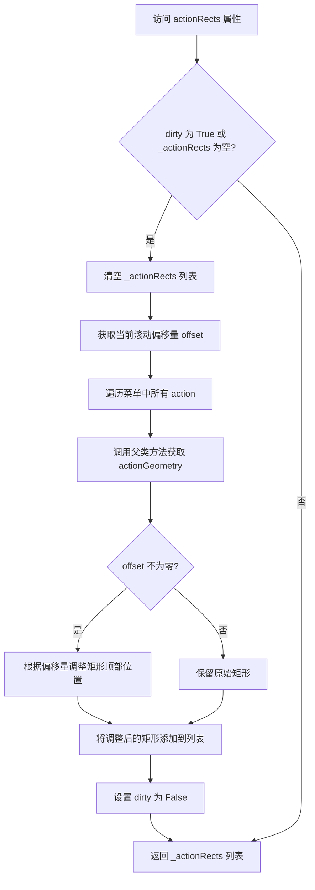

#### 带注释源码

```python
@property
def actionRects(self):
    """
    获取菜单项的几何矩形列表
    
    该属性实现了一个缓存机制：
    - 当 dirty 标志为 True 或缓存列表为空时重新计算
    - 根据当前滚动偏移量调整每个菜单项的矩形区域
    - 用于支持可滚动菜单的视觉呈现和交互检测
    """
    # 检查是否需要重新计算：如果菜单项发生变化或首次访问
    if self.dirty or not self._actionRects:
        # 清空现有缓存
        del self._actionRects[:]
        # 获取当前滚动偏移量，用于调整菜单项位置
        offset = self.offset()
        
        # 遍历菜单中所有的动作项
        for action in self.actions():
            # 获取动作在菜单中的几何矩形（使用父类方法）
            geo = super(ScrollableMenuBase, self).actionGeometry(action)
            
            # 如果存在滚动偏移，则调整矩形顶部位置
            if offset:
                geo.moveTop(geo.y() - offset)
            
            # 将计算得到的矩形添加到缓存列表
            self._actionRects.append(geo)
        
        # 重置脏标志，表示数据已更新
        self.dirty = False
    
    # 返回缓存的菜单项矩形列表
    return self._actionRects
```


### `ScrollableMenuBase.iterActionRects`

该方法是一个生成器函数，用于迭代菜单中所有动作（action）及其对应的几何矩形（rect），通常与 `actionRects` 属性配合使用以获取菜单项的当前位置信息。

参数：无（仅包含 `self` 参数）

返回值：`Generator[Tuple[QtGui.QAction, QtCore.QRect], None, None]`，返回一个生成器，每一轮迭代 yield 一个包含动作对象和其对应矩形的元组。

#### 流程图

```mermaid
flowchart TD
    A[开始 iterActionRects] --> B[获取 self.actions&#40;&#41; 菜单动作列表]
    B --> C[获取 self.actionRects 矩形列表]
    C --> D[使用 zip&#40;&#41; 组合动作和矩形]
    E[for 循环遍历] --> F{是否还有未遍历的元素?}
    F -->|是| G[yield action, rect 元组]
    G --> E
    F -->|否| H[结束生成器]
    D --> E
```

#### 带注释源码

```python
def iterActionRects(self):
    """
    迭代菜单中所有动作及其对应的几何矩形。
    
    这是一个生成器方法，配合 actionRects 属性使用，
    用于在滚动菜单中获取每个菜单项的当前位置信息。
    
    Returns:
        Generator: 生成 (action, rect) 元组的生成器，
                  action 是 QtGui.QAction 对象，
                  rect 是 QtCore.QRect 对象，表示该动作的几何矩形
    """
    # 使用 zip 将动作列表和矩形列表配对，然后遍历
    # actions() 返回菜单中所有 QAction 对象列表
    # actionRects 是属性，返回当前计算过的矩形列表（包含滚动偏移）
    for action, rect in zip(self.actions(), self.actionRects):
        yield action, rect
```


### `ScrollableMenuBase.setMaxItemCount`

该方法用于设置可滚动菜单的最大显示项数，根据给定的count计算并设置菜单的最大高度，同时考虑样式面板宽度、边距和滚动条高度等因素，确保菜单能够正确显示指定数量的菜单项。

参数：

- `count`：`int`，要显示的最大菜单项数量，如果为0则恢复默认最大高度

返回值：`None`，该方法无返回值，仅通过setMaximumHeight修改菜单的高度属性

#### 流程图

```mermaid
flowchart TD
    A[开始 setMaxItemCount] --> B[获取当前样式 style]
    B --> C[创建QStyleOptionMenuItem opt]
    C --> D[创建假动作 a用于初始化样式选项]
    D --> E[调用initStyleOption初始化opt]
    E --> F[计算字体度量获取defaultItemHeight]
    F --> G{count是否为0?}
    G -->|是| H[设置最大高度为默认_maximumHeight]
    G -->|否| I[计算面板宽度fw]
    I --> J[计算水平边距hmargin]
    J --> K[计算滚动区域高度scrollHeight]
    K --> L[设置最大高度为 defaultItemHeight \* count + (fw + hmargin + scrollHeight) \* 2]
    H --> M[设置dirty为True]
    L --> M
    M --> N[结束]
```

#### 带注释源码

```python
def setMaxItemCount(self, count):
    """
    设置可滚动菜单的最大显示项数
    
    参数:
        count: int, 要显示的最大菜单项数量。为0时恢复默认高度。
    """
    # 获取菜单的QStyle对象，用于查询样式相关度量值
    style = self.style()
    
    # 创建QStyleOptionMenuItem用于计算菜单项的尺寸
    opt = QtWidgets.QStyleOptionMenuItem()
    opt.initFrom(self)
    
    # 创建一个假动作用于获取菜单项的样式信息
    a = QtGui.QAction("fake action", self)
    self.initStyleOption(opt, a)
    
    # 初始化尺寸对象
    size = QtCore.QSize()
    fm = self.fontMetrics()
    qfm = opt.fontMetrics
    
    # 根据字体度量计算菜单项的宽度
    # 使用boundingRect计算文本在单行模式下的宽度
    size.setWidth(fm.boundingRect(QtCore.QRect(), QtCore.Qt.TextSingleLine, a.text()).width())
    
    # 设置高度为两个字体度量中较大的值
    size.setHeight(max(fm.height(), qfm.height()))
    
    # 使用样式获取菜单项的实际尺寸
    # CT_MenuItem表示这是菜单项的内容类型
    self.defaultItemHeight = style.sizeFromContents(QtWidgets.QStyle.CT_MenuItem, opt, size, self).height()
    
    # 如果count为0，恢复默认的最大高度
    if not count:
        self.setMaximumHeight(self._maximumHeight)
    else:
        # PM_MenuPanelWidth: 菜单面板边框宽度
        fw = style.pixelMetric(QtWidgets.QStyle.PM_MenuPanelWidth, None, self)
        # PM_MenuHMargin: 菜单水平边距
        vmargin = style.pixelMetric(QtWidgets.QStyle.PM_MenuHMargin, opt, self)
        
        # 计算滚动条区域的高度
        scrollHeight = self.scrollHeight(style)
        
        # 设置最大高度 = 单项高度 * 数量 + (面板宽度 + 边距 + 滚动高度) * 2
        # 乘以2是因为上下都需要留出空间
        self.setMaximumHeight(self.defaultItemHeight * count + (fw + vmargin + scrollHeight) * 2)
    
    # 标记菜单项几何信息为脏数据，需要重新计算
    self.dirty = True
```


### `ScrollableMenuBase.scrollHeight`

该方法用于计算可滚动菜单的滚动区域高度。它通过获取Qt样式中菜单滚动条的标准高度，并乘以2来得出最终的滚动区域高度（上下各一个滚动箭头区域）。

参数：

- `style`：`QtWidgets.QStyle`，Qt样式对象，用于获取菜单相关的像素度量标准

返回值：`int`，计算得到的滚动区域高度（像素值）

#### 流程图

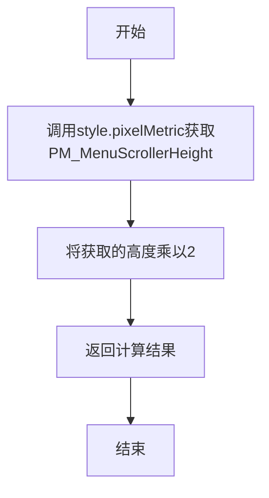

#### 带注释源码

```python
def scrollHeight(self, style):
    """
    计算可滚动菜单的滚动区域高度
    
    参数:
        style: Qt样式对象，用于查询样式相关的像素度量
    
    返回值:
        滚动区域的总高度（像素）
    """
    # 从Qt样式中获取菜单滚动条的标准高度
    # PM_MenuScrollerHeight 是Qt预定义的菜单滚动条高度常量
    # 乘以2是因为菜单上下两端各需要一半的滚动区域
    return style.pixelMetric(QtWidgets.QStyle.PM_MenuScrollerHeight, None, self) * 2
```


### `ScrollableMenuBase.isScrollable`

该方法用于判断当前菜单是否处于可滚动状态。当菜单的"scrollable"属性被设置为真值，且当前实际高度小于根据内容计算的建议高度时，返回真，表示菜单需要显示滚动条以容纳更多内容。

参数：
- 无参数（仅包含隐式参数 `self`）

返回值：`bool`，如果菜单当前高度小于其内容建议的高度且启用了滚动功能则返回 `True`，否则返回 `False`

#### 流程图

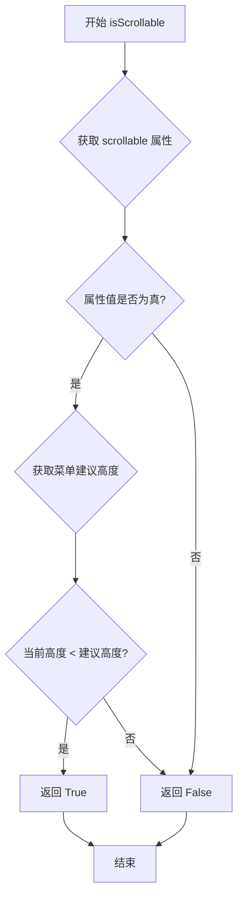

#### 带注释源码

```python
def isScrollable(self):
    """
    检查菜单是否可滚动。
    
    判断逻辑：
    1. 检查菜单的 'scrollable' 属性是否为真（由外部设置）
    2. 比较当前菜单高度与根据内容计算的建议高度
    当两者都满足时，表示菜单内容超出显示区域，需要滚动
    """
    # 获取菜单的 'scrollable' 属性，该属性控制是否启用滚动功能
    # 通过 Qt 的 property 机制存储，可在运行时动态设置
    is_scrollable_prop = self.property("scrollable")
    
    # 获取父类（QMenu）计算的建议高度，即不加滚动限制时菜单应有的高度
    hint_height = super(ScrollableMenuBase, self).sizeHint().height()
    
    # 判断当前高度是否小于建议高度
    # 如果小于，说明内容被截断，需要滚动显示
    current_height = self.height()
    
    # 组合判断：必须同时满足属性为真且高度不足
    return is_scrollable_prop and current_height < hint_height
```


### `ScrollableMenuBase.checkScroll`

该方法用于检查鼠标是否位于菜单的滚动区域内，如果位于上滚动区域或下滚动区域，则触发滚动操作，使菜单内容随鼠标移动而滚动。

参数：

- 无显式参数（`self` 为隐式参数）

返回值：`None`，无返回值

#### 流程图

```mermaid
flowchart TD
    A[开始 checkScroll] --> B[获取鼠标在全球坐标系中的位置]
    B --> C[计算滚动增量 delta = max&#40;2, int&#40;defaultItemHeight * 0.25&#41;&#41;]
    C --> D{鼠标是否在 scrollUpRect 区域内?}
    D -->|是| E[delta = -delta]
    D -->|否| F{鼠标是否在 scrollDownRect 区域内?}
    F -->|否| G[返回, 不进行滚动]
    F -->|是| H{调用 scrollBy&#40;delta&#41; 是否成功?}
    E --> H
    H -->|是| I[启动滚动定时器 scrollTimer]
    H -->|否| G
    I --> G
```

#### 带注释源码

```python
def checkScroll(self):
    # 获取鼠标当前在全球坐标系中的位置，并转换为菜单的本地坐标系
    pos = self.mapFromGlobal(QtGui.QCursor.pos())
    
    # 计算滚动增量，使用菜单项默认高度的 25%，最小值为 2 像素
    delta = max(2, int(self.defaultItemHeight * 0.25))
    
    # 判断鼠标是否在向上滚动区域内（上箭头区域）
    if self.scrollUpRect.contains(pos):
        # 向上滚动需要将增量设为负值
        delta *= -1
    # 如果鼠标不在向下滚动区域内（下箭头区域），则直接返回，不执行滚动
    elif not self.scrollDownRect.contains(pos):
        return
    
    # 调用 scrollBy 方法执行实际的滚动操作
    # 如果滚动成功（返回 True），则启动定时器继续滚动
    if self.scrollBy(delta):
        # 使用定时器的默认间隔（50ms）启动滚动定时器，实现平滑连续滚动
        self.scrollTimer.start(self.scrollTimer.property("defaultInterval"))
```


### ScrollableMenuBase.offset

获取菜单的滚动偏移量，用于在绘制菜单时调整菜单项的几何位置。

参数：

- （无参数，除 self 外）

返回值：`int`，当前滚动偏移量。如果菜单可滚动，返回 `deltaY` 与滚动高度之差；否则返回 0。

#### 流程图

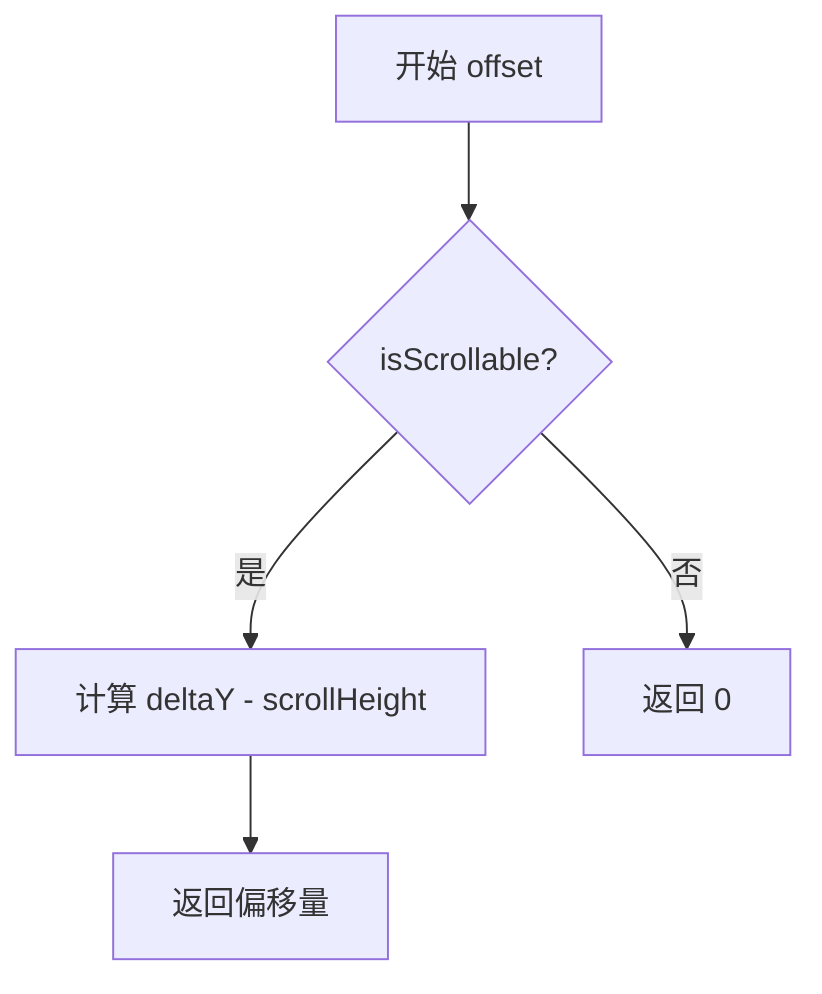

#### 带注释源码

```python
def offset(self):
    """
    获取菜单的滚动偏移量。
    
    该方法计算菜单在垂直方向上的滚动偏移值，用于在绘制菜单时
    调整每个菜单项的 geometry 位置，实现菜单的滚动效果。
    
    只有当菜单内容超过最大高度（即 isScrollable() 返回 True）时，
    才会返回非零偏移量。
    
    Returns:
        int: 滚动偏移量，为 0 表示不可滚动，非 0 表示当前滚动位置
    """
    if self.isScrollable():
        # 可滚动时，返回当前滚动增量减去滚动器高度
        # deltaY: 当前滚动位置增量
        # scrollHeight: 滚动器（上下箭头）的高度
        return self.deltaY - self.scrollHeight(self.style())
    # 不可滚动时，返回 0
    return 0
```


### `ScrollableMenuBase.translatedActionGeometry`

该方法用于获取给定菜单动作在可滚动菜单中的几何信息（QtCore.QRect），通过查找动作在actions()列表中的索引来从预计算的actionRects列表中获取对应的矩形区域，该区域已经包含了滚动偏移量的调整。

参数：

- `action`：`QtGui.QAction`，需要获取几何信息的菜单动作对象

返回值：`QtCore.QRect`，返回动作在考虑滚动偏移后的几何矩形区域

#### 流程图

```mermaid
flowchart TD
    A[开始 translatedActionGeometry] --> B[获取 self.actions() 列表]
    B --> C[查找 action 在 actions 列表中的索引位置]
    C --> D[使用该索引从 self.actionRects 列表中获取对应的矩形]
    D --> E[返回 QRect 矩形对象]
```

#### 带注释源码

```python
def translatedActionGeometry(self, action):
    """
    获取给定动作在可滚动菜单中的几何信息
    
    参数:
        action: QtGui.QAction 对象，需要获取其几何信息
    
    返回值:
        QtCore.QRect: 包含动作位置和尺寸的矩形区域（已考虑滚动偏移）
    """
    # 通过查找action在actions()列表中的索引位置
    # 然后从预先计算的actionRects列表中获取对应的矩形区域
    # actionRects 属性在获取时会自动考虑 offset 偏移量
    return self.actionRects[self.actions().index(action)]
```


### `ScrollableMenuBase.ensureVisible`

该方法用于确保指定的菜单项（action）在可滚动的菜单可视区域内，如果菜单项不在可见区域内，则自动滚动菜单以使其可见。

参数：

- `action`：`QtGui.QAction`，需要确保可见的菜单项动作对象

返回值：`None`，无返回值（该方法直接修改菜单的滚动位置）

#### 流程图

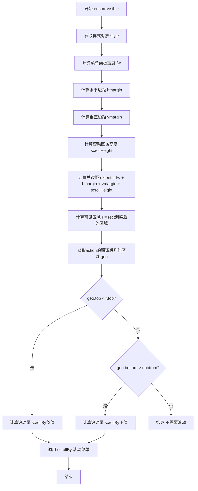

#### 带注释源码

```python
def ensureVisible(self, action):
    """
    确保指定的菜单项在可视区域内，如果不在则自动滚动菜单。
    
    参数:
        action: QtGui.QAction，需要确保可见的菜单项动作
    """
    # 获取当前菜单的样式对象
    style = self.style()
    
    # 获取菜单面板的边框宽度（像素）
    fw = style.pixelMetric(QtWidgets.QStyle.PM_MenuPanelWidth, None, self)
    
    # 获取菜单项的水平边距
    hmargin = style.pixelMetric(QtWidgets.QStyle.PM_MenuHMargin, None, self)
    
    # 获取菜单项的垂直边距
    vmargin = style.pixelMetric(QtWidgets.QStyle.PM_MenuVMargin, None, self)
    
    # 计算滚动箭头区域的高度
    scrollHeight = self.scrollHeight(style)
    
    # 计算总的边缘区域（用于确定可见区域）
    extent = fw + hmargin + vmargin + scrollHeight
    
    # 获取菜单的矩形区域，并调整边缘（排除滚动箭头区域）
    r = self.rect().adjusted(0, extent, 0, -extent)
    
    # 获取指定action的翻译后的几何区域（考虑滚动偏移）
    geo = self.translatedActionGeometry(action)
    
    # 如果action的顶部在可见区域上方，则向上滚动
    if geo.top() < r.top():
        # 计算需要滚动的距离（负值向上滚动）
        self.scrollBy(-(r.top() - geo.top()))
    
    # 否则，如果action的底部在可见区域下方，则向下滚动
    elif geo.bottom() > r.bottom():
        # 计算需要滚动的距离（正值向下滚动）
        self.scrollBy(geo.bottom() - r.bottom())
```


### `ScrollableMenuBase.scrollBy`

该方法负责菜单的滚动操作，根据传入的步长值调整菜单的垂直滚动位置，支持向上和向下滚动，并确保滚动内容在可见范围内。

参数：
- `step`：`int`，滚动步长，负值表示向上滚动，正值表示向下滚动，值的大小决定滚动距离

返回值：`bool`，返回滚动是否成功执行，若滚动后位置未改变则返回False，否则返回True

#### 流程图

```mermaid
flowchart TD
    A[开始 scrollBy] --> B{step < 0?}
    B -->|Yes| C[计算 newDelta = max(0, deltaY + step)]
    C --> D{newDelta == deltaY?}
    D -->|Yes| E[返回 False]
    D -->|No| M[更新 deltaY = newDelta]
    
    B -->|No| F{step > 0?}
    F -->|Yes| G[计算 newDelta = deltaY + step]
    G --> H[获取样式和滚动高度]
    H --> I[计算底部边界 bottom = height - scrollHeight]
    I --> J[查找最后一个可见动作]
    J --> K[计算最后动作底部位置 lastBottom]
    K --> L{lastBottom < bottom?}
    L -->|Yes| N[newDelta -= bottom - lastBottom]
    L -->|No| O{newDelta == deltaY?}
    N --> O
    O -->|Yes| E
    O -->|No| M
    
    F -->|No| P[返回 False]
    
    M --> Q[设置 dirty = True]
    Q --> R[调用 update 重绘]
    R --> S[返回 True]
```

#### 带注释源码

```python
def scrollBy(self, step):
    """
    根据给定的步长滚动菜单内容
    
    参数:
        step: int, 滚动步长。正值向下滚动，负值向上滚动。
              绝对值越大，滚动距离越远。
    返回:
        bool: 如果滚动成功（位置发生改变）返回True，否则返回False
    """
    # 处理向上滚动（负步长）
    if step < 0:
        # 计算新的滚动位置，确保不超过0（即不能向上滚动超过顶部）
        newDelta = max(0, self.deltaY + step)
        # 如果新位置与当前位置相同，说明无法继续滚动，返回False
        if newDelta == self.deltaY:
            return False
    
    # 处理向下滚动（正步长）
    elif step > 0:
        # 计算新的滚动位置
        newDelta = self.deltaY + step
        # 获取当前样式用于计算尺寸
        style = self.style()
        # 获取滚动器高度（上下滚动箭头区域）
        scrollHeight = self.scrollHeight(style)
        # 计算菜单实际内容区域的底部边界
        bottom = self.height() - scrollHeight

        # 倒序遍历找到最后一个可见的动作项
        for lastAction in reversed(self.actions()):
            if lastAction.isVisible():
                break
        
        # 计算最后一个动作项在滚动后的底部位置
        # 公式：原底部位置 - 新滚动偏移 + 滚动器高度
        lastBottom = self.actionGeometry(lastAction).bottom() - newDelta + scrollHeight
        
        # 如果最后一项底部在可视区域下方，调整滚动位置
        if lastBottom < bottom:
            newDelta -= bottom - lastBottom
        
        # 如果调整后位置未改变，说明无法继续滚动
        if newDelta == self.deltaY:
            return False

    # 更新滚动偏移量
    self.deltaY = newDelta
    # 标记菜单布局为脏，需要重新计算
    self.dirty = True
    # 触发界面重绘
    self.update()
    return True
```


### `ScrollableMenuBase.actionAt`

根据给定位置（坐标）查找并返回对应的菜单动作（QAction）。该方法通过遍历菜单中所有动作的几何区域，判断给定坐标落在哪个动作的区域内，从而实现菜单项的定位功能。

参数：
- `pos`：`QtCore.QPoint`，鼠标或焦点的屏幕坐标位置

返回值：`QtGui.QAction` 或 `None`，返回给定位置处对应的菜单动作，如果该位置没有对应动作则返回 None

#### 流程图

```mermaid
flowchart TD
    A[开始 actionAt] --> B{遍历 actions 和 rects}
    B --> C{当前 rect.contains(pos)?}
    C -->|是| D[返回对应的 action]
    C -->|否| E{还有更多 action?}
    E -->|是| B
    E -->|否| F[返回 None]
    D --> G[结束]
    F --> G
```

#### 带注释源码

```python
def actionAt(self, pos):
    """
    根据给定位置查找对应的菜单动作
    
    参数:
        pos: QtCore.QPoint，菜单内的坐标位置
    返回:
        QtGui.QAction: 在该位置处的菜单动作
        None: 该位置没有对应的菜单动作
    """
    # 遍历所有动作及其对应的几何矩形区域
    for action, rect in self.iterActionRects():
        # 检查给定位置是否在当前动作的矩形区域内
        if rect.contains(pos):
            # 找到匹配的动作，立即返回
            return action
    # 遍历完成未找到匹配的动作，返回 None
    return None
```


### `ScrollableMenuBase.sizeHint`

该方法是 `QtWidgets.QMenu.sizeHint()` 的重写实现，用于获取可滚动菜单的建议大小。它首先调用父类方法获取建议尺寸，然后检查高度是否超过菜单的最大高度限制，如果超过则将高度限制为最大高度，以确保菜单不会超过预设的显示范围。

参数：

- `self`：隐式参数，`ScrollableMenuBase` 实例本身

返回值：`QtCore.QSize`，返回菜单的建议大小尺寸

#### 流程图

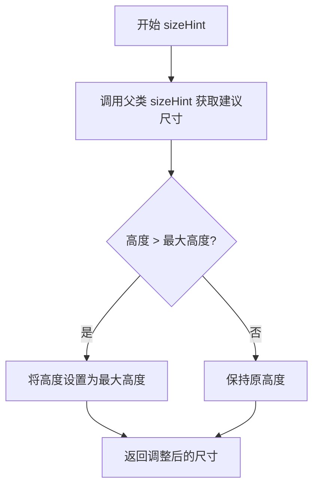

#### 带注释源码

```python
def sizeHint(self):
    """
    重写 QMenu 的 sizeHint 方法
    确保返回的尺寸不超过菜单的最大高度限制
    """
    # 调用父类方法获取默认的建议尺寸
    hint = super(ScrollableMenuBase, self).sizeHint()
    
    # 检查建议高度是否超过菜单的最大高度
    if hint.height() > self.maximumHeight():
        # 如果超过，则将高度限制为最大高度
        hint.setHeight(self.maximumHeight())
    
    # 返回最终的建议尺寸
    return hint
```


### `ScrollableMenuBase.eventFilter`

该方法是Qt事件过滤器的重写实现，用于处理菜单显示事件。当菜单显示时，如果菜单可滚动且有滚动偏移，则调整菜单项的显示位置以确保正确可见性。

参数：

- `source`：`QtCore.QObject`，事件过滤的源对象，即安装此事件过滤器的对象（通常是菜单项关联的QWidget）
- `event`：`QtCore.QEvent`，待处理的事件对象

返回值：`bool`，返回`False`表示事件未处理，需传递给父类处理；返回`True`表示事件已处理

#### 流程图

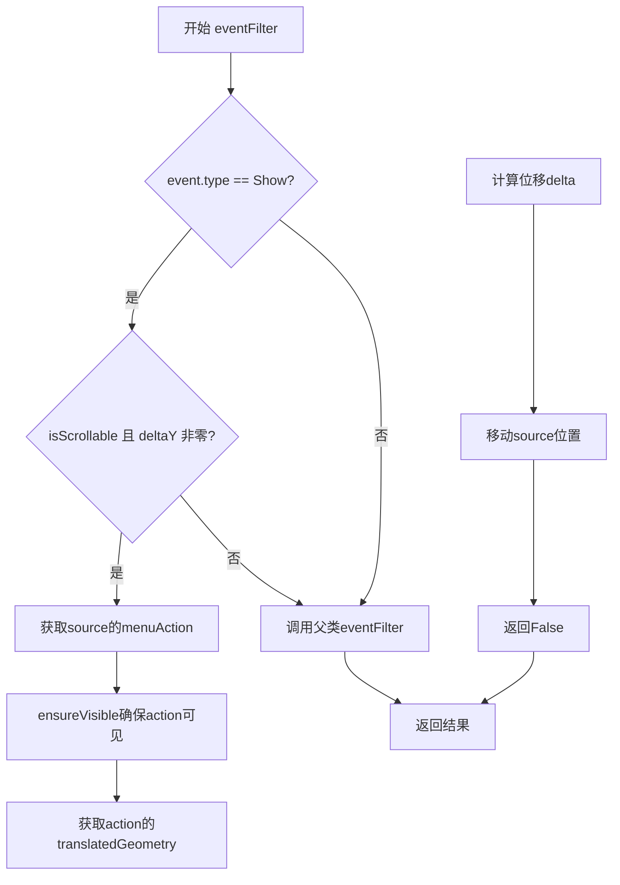

#### 带注释源码

```python
def eventFilter(self, source, event):
    """
    重写事件过滤器，处理菜单显示事件
    用于在菜单显示时调整滚动位置，确保选中的菜单项正确显示
    """
    # 检查事件类型是否为显示事件
    if event.type() == event.Show:
        # 如果菜单可滚动且存在滚动偏移
        if self.isScrollable() and self.deltaY:
            # 获取触发此菜单的菜单动作（通常是鼠标右键点击的项）
            action = source.menuAction()
            # 确保该动作在可见区域内
            self.ensureVisible(action)
            # 获取该动作相对于菜单的翻译后几何信息
            rect = self.translatedActionGeometry(action)
            # 计算需要偏移的 delta（当前位置与原始位置的差值）
            delta = rect.topLeft() - self.actionGeometry(action).topLeft()
            # 移动源对象（菜单）到新位置
            source.move(source.pos() + delta)
        # 返回 False 表示不拦截事件，传递给父类处理
        return False
    # 对于非显示事件，调用父类的 eventFilter 方法处理
    return super(ScrollableMenuBase, self).eventFilter(source, event)
```


### `ScrollableMenuBase.event`

该方法是`ScrollableMenuBase`类对Qt QMenu事件处理器的重写（override），用于处理可滚动菜单中的键盘和鼠标事件。它首先判断菜单是否可滚动，若否则交给父类处理。对于键盘事件（上下箭头键），它确保选中的菜单项可见；对于鼠标事件，它处理滚动箭头区域的点击和释放，以及菜单项的触发。

参数：

- `self`：`ScrollableMenuBase`实例，方法所属对象
- `event`：`QtCore.QEvent`类型，Qt事件对象，包含事件类型和相关数据（如键盘按键、鼠标位置等）

返回值：`bool`类型，表示事件是否被处理。返回`True`表示事件已被处理，不再传递；返回`False`或调用父类方法的结果表示未完全处理，需要父类进一步处理。

#### 流程图

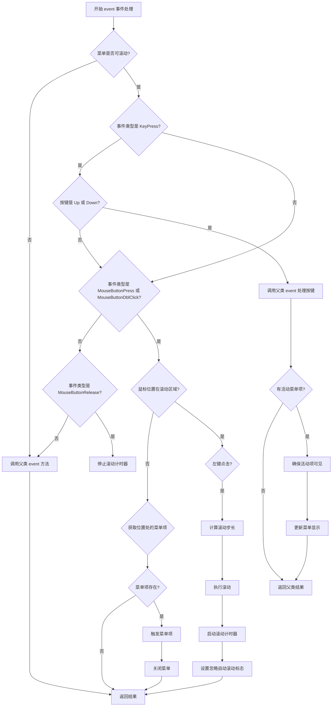

#### 带注释源码

```python
def event(self, event):
    """
    重写 QMenu 的事件处理方法，处理可滚动菜单的键盘和鼠标事件
    
    参数:
        event: Qt 事件对象
        
    返回:
        bool: 事件是否被处理
    """
    # 如果菜单不可滚动，交给父类处理
    if not self.isScrollable():
        return super(ScrollableMenuBase, self).event(event)
    
    # 处理键盘按键事件（上下方向键）
    if event.type() == event.KeyPress and event.key() in (
        QtCore.Qt.Key_Up,
        QtCore.Qt.Key_Down,
    ):
        # 先让父类处理按键（选择菜单项）
        res = super(ScrollableMenuBase, self).event(event)
        # 获取当前激活的菜单项
        action = self.activeAction()
        if action:
            # 确保选中的菜单项在可见区域内
            self.ensureVisible(action)
            # 刷新菜单显示
            self.update()
        return res
    
    # 处理鼠标按下或双击事件
    elif event.type() in (event.MouseButtonPress, event.MouseButtonDblClick):
        # 获取鼠标在菜单中的位置
        pos = event.pos()
        # 检查是否点击了滚动箭头区域（上箭头或下箭头）
        if self.scrollUpRect.contains(pos) or self.scrollDownRect.contains(pos):
            # 只处理左键点击
            if event.button() == QtCore.Qt.LeftButton:
                # 计算滚动步长（默认为项高的25%，最小为2像素）
                step = max(2, int(self.defaultItemHeight * 0.25))
                # 如果点击的是上箭头，步长取反（向上滚动）
                if self.scrollUpRect.contains(pos):
                    step *= -1
                # 执行滚动
                self.scrollBy(step)
                # 启动滚动计时器（200ms后再次检查是否需要继续滚动）
                self.scrollTimer.start(200)
                # 设置标志：忽略自动滚动（防止滚动时改变选中项）
                self.ignoreAutoScroll = True
            return True  # 事件已处理，不再传递
    
    # 处理鼠标释放事件
    elif event.type() == event.MouseButtonRelease:
        pos = event.pos()
        # 停止滚动计时器
        self.scrollTimer.stop()
        # 如果鼠标不在滚动区域内
        if not (self.scrollUpRect.contains(pos) or self.scrollDownRect.contains(pos)):
            # 查找鼠标位置对应的菜单项
            action = self.actionAt(pos)
            if action:
                # 触发该菜单项的动作
                action.trigger()
                # 关闭菜单
                self.close()
        return True  # 事件已处理
    
    # 其他事件类型交给父类处理
    return super(ScrollableMenuBase, self).event(event)
```


### `ScrollableMenuBase.timerEvent`

该方法是 `QtWidgets.QMenu` 的 `timerEvent` 的重写实现，用于处理菜单的定时器事件。当菜单不可滚动时，它会忽略内部定时器事件以防止重新打开弹出窗口。

参数：

- `event`：`QtCore.QTimerEvent`，表示定时器事件对象，包含事件的ID和类型信息

返回值：`None`，无返回值（该方法主要处理副作用，不返回任何值）

#### 流程图

```mermaid
flowchart TD
    A[开始 timerEvent] --> B{菜单是否可滚动?}
    B -->|是| C[不执行任何操作, 直接返回]
    B -->|否| D[调用父类 timerEvent 处理]
    D --> C
    C --> E[结束]
```

#### 带注释源码

```python
def timerEvent(self, event):
    """
    重写 timerEvent 以处理定时器事件
    
    参数:
        event: QtCore.QTimerEvent - Qt定时器事件对象
    """
    # 检查菜单当前是否处于可滚动状态
    if not self.isScrollable():
        # 如果菜单不可滚动，忽略内部定时器事件
        # 这样做可以防止重新打开弹出窗口
        # 调用父类的 timerEvent 方法处理该事件
        super(ScrollableMenuBase, self).timerEvent(event)
```


### `ScrollableMenuBase.mouseMoveEvent`

处理鼠标移动事件，用于在可滚动菜单中实现鼠标悬停时的自动滚动和菜单项高亮功能。当鼠标移动到滚动区域时触发自动滚动；当鼠标在菜单项区域移动时，更新当前选中的菜单项并确保选中的项可见。

参数：

- `event`：`QtGui.QMouseEvent`，鼠标移动事件对象，包含鼠标位置等信息

返回值：`None`，无返回值（重写父类方法）

#### 流程图

```mermaid
flowchart TD
    A[开始 mouseMoveEvent] --> B{菜单是否可滚动?}
    B -->|否| C[调用父类mouseMoveEvent]
    C --> D[返回]
    B -->|是| E[获取鼠标位置 pos]
    E --> F{鼠标是否在滚动区域?}
    F -->|是| G[启动滚动计时器 200ms]
    F -->|否| H[重置 ignoreAutoScroll = False]
    G --> D
    H --> I[获取当前活动菜单项 oldAction]
    I --> J{鼠标是否在菜单范围内?}
    J -->|否| K[设置 action = None]
    J -->|是| L[遍历菜单项区域]
    L --> M{找到对应的菜单项?}
    M -->|是| N[设置对应的 action]
    M -->|否| K
    N --> O[设置活动菜单项为 action]
    O --> P{action 存在且不是分隔符?}
    P -->|否| Q{oldAction 有可见的子菜单?}
    P -->|是| R[连接 delayTimer 确保可见]
    R --> S[启动 delayTimer 150ms]
    Q -->|是| T[连接 delayTimer 关闭子菜单]
    T --> U[启动 delayTimer 50ms]
    Q -->|否| V[更新菜单显示]
    S --> V
    K --> V
    V --> D
```

#### 带注释源码

```python
def mouseMoveEvent(self, event):
    """
    处理鼠标移动事件
    
    参数:
        event: QtGui.QMouseEvent，鼠标移动事件
    """
    # 如果菜单不可滚动，调用父类的默认处理
    if not self.isScrollable():
        super(ScrollableMenuBase, self).mouseMoveEvent(event)
        return

    # 获取鼠标在菜单中的位置
    pos = event.pos()
    
    # 检查鼠标是否在滚动区域（顶部或底部滚动按钮区域）
    if pos.y() < self.scrollUpRect.bottom() or pos.y() > self.scrollDownRect.top():
        # 如果不在自动滚动忽略状态且计时器未启动，则启动滚动计时器
        if not self.ignoreAutoScroll and not self.scrollTimer.isActive():
            self.scrollTimer.start(200)
        return
    
    # 鼠标进入菜单项区域，重置忽略自动滚动标志
    self.ignoreAutoScroll = False

    # 记录之前选中的菜单项
    oldAction = self.activeAction()
    
    # 检查鼠标是否在菜单矩形范围内
    if not self.rect().contains(pos):
        action = None
    else:
        # 遍历所有菜单项的几何区域，找到鼠标所在的菜单项
        y = event.y()
        for action, rect in self.iterActionRects():
            # 检查鼠标y坐标是否在当前菜单项的垂直范围内
            if rect.y() <= y <= rect.y() + rect.height():
                break
        else:
            # 没有找到对应的菜单项
            action = None

    # 设置当前活动菜单项
    self.setActiveAction(action)
    
    # 如果有选中的菜单项且不是分隔符
    if action and not action.isSeparator():
        # 定义延迟可见性检查函数
        def ensureVisible():
            self.delayTimer.timeout.disconnect()
            self.ensureVisible(action)

        # 断开之前的延迟计时器连接
        try:
            self.delayTimer.disconnect()
        except:
            pass
        
        # 连接新的延迟计时器，确保选中的菜单项可见
        self.delayTimer.timeout.connect(ensureVisible)
        self.delayTimer.start(150)
    # 如果之前有选中的菜单项且有可见的子菜单
    elif oldAction and oldAction.menu() and oldAction.menu().isVisible():
        # 定义关闭子菜单的函数
        def closeMenu():
            self.delayTimer.timeout.disconnect()
            oldAction.menu().hide()

        # 连接延迟计时器，延迟关闭子菜单
        self.delayTimer.timeout.connect(closeMenu)
        self.delayTimer.start(50)
    
    # 触发菜单重绘
    self.update()
```


### `ScrollableMenuBase.wheelEvent`

该方法是 QMenu 的 wheelEvent 重写实现，用于处理鼠标滚轮事件以实现可滚动菜单的内容滚动。当用户滚动鼠标滚轮时，根据滚动方向调用 scrollBy 方法向上或向下滚动菜单内容，同时停止延迟计时器以避免干扰。

参数：

- `event`：`QtGui.QWheelEvent`，鼠标滚轮事件对象，包含角度增量（angleDelta）信息，用于判断滚动方向

返回值：`None`，无返回值

#### 流程图

```mermaid
flowchart TD
    A([开始 wheelEvent]) --> B{isScrollable?}
    B -->|否| C[直接返回]
    B -->|是| D[停止 delayTimer]
    D --> E{angleDelta.y < 0?}
    E -->|是| F[scrollBy defaultItemHeight]
    E -->|否| G[scrollBy -defaultItemHeight]
    F --> H([结束])
    G --> H
    C --> H
```

#### 带注释源码

```python
def wheelEvent(self, event):
    """
    重写 QMenu 的 wheelEvent 方法，处理鼠标滚轮事件以实现菜单滚动
    
    参数:
        event: QtGui.QWheelEvent 对象，包含滚轮滚动信息
    """
    # 如果菜单不可滚动（内容较少未超过最大高度），直接返回不处理
    if not self.isScrollable():
        return
    
    # 停止延迟计时器，避免滚动时触发其他延迟操作（如菜单自动滚动、高亮延迟等）
    self.delayTimer.stop()
    
    # 根据滚轮角度增量判断滚动方向
    # angleDelta().y() < 0 表示滚轮向下滚动（页面内容向上）
    # angleDelta().y() > 0 表示滚轮向上滚动（页面向下）
    if event.angleDelta().y() < 0:
        # 滚轮向下滚动，调用 scrollBy 传入正值，菜单内容向上移动
        self.scrollBy(self.defaultItemHeight)
    else:
        # 滚轮向上滚动，调用 scrollBy 传入负值，菜单内容向下移动
        self.scrollBy(-self.defaultItemHeight)
```


### `ScrollableMenuBase.showEvent`

该方法是 `QMenu` 的 `showEvent` 事件处理器的重写实现，用于在菜单显示时初始化滚动相关的状态和事件过滤器。当菜单支持滚动时，重置滚动位置和脏标记，为所有子菜单安装事件过滤器以实现自动滚动功能，并最终调用父类的实现。

参数：

- `event`：`QtCore.QEvent`，Qt 菜单显示事件对象，包含菜单显示时的相关事件信息

返回值：`None`，该方法为 void 类型，无返回值

#### 流程图

```mermaid
flowchart TD
    A[开始 showEvent] --> B{isScrollable?}
    B -->|是| C[deltaY = 0]
    C --> D[dirty = True]
    D --> E{遍历 actions}
    E --> F{action.menu?}
    F -->|是| G[action.menu.installEventFilter]
    F -->|否| H[继续下一个 action]
    G --> H
    H --> I[ignoreAutoScroll = False]
    I --> J[调用父类 showEvent]
    B -->|否| J
    J --> K[结束]
```

#### 带注释源码

```python
def showEvent(self, event):
    """
    重写 showEvent 以在菜单显示时初始化滚动状态
    
    参数:
        event: QtCore.QEvent, Qt 菜单显示事件
    """
    # 检查菜单是否可滚动且内容超出最大高度
    if self.isScrollable():
        # 重置垂直滚动偏移量到顶部
        self.deltaY = 0
        # 标记动作几何信息需要重新计算
        self.dirty = True
        # 为所有包含子菜单的 action 安装事件过滤器
        # 以实现自动滚动到选中项的功能
        for action in self.actions():
            if action.menu():
                action.menu().installEventFilter(self)
        # 重置自动滚动忽略标志，允许自动滚动
        self.ignoreAutoScroll = False
    # 调用父类 QMenu 的 showEvent 处理程序
    super(ScrollableMenuBase, self).showEvent(event)
```


### `ScrollableMenuBase.hideEvent`

该方法是一个事件处理器，用于在菜单隐藏时清理事件过滤器。当菜单隐藏时，它会遍历所有菜单项，如果菜单项有子菜单，则移除该子菜单的事件过滤器，最后调用父类的 hideEvent 方法完成标准的隐藏处理。

参数：

- `self`：实例方法隐含的当前 ScrollableMenuBase 对象实例
- `event`：PySide6.QtCore.QEvent，Qt 框架的隐藏事件对象，包含事件相关的信息

返回值：`None`，该方法不返回任何值

#### 流程图

```mermaid
flowchart TD
    A[开始 hideEvent] --> B{遍历 self.actions()}
    B --> C[获取当前 action]
    C --> D{action 是否有子菜单?}
    D -->|是| E[移除子菜单的事件过滤器 self]
    D -->|否| F[继续下一个 action]
    E --> F
    F --> G{是否还有更多 actions?}
    G -->|是| C
    G -->|否| H[调用父类 hideEvent]
    H --> I[结束]
```

#### 带注释源码

```python
def hideEvent(self, event):
    """
    重写 QMenu 的 hideEvent 事件处理器。
    当菜单隐藏时，清理之前在 showEvent 中安装的事件过滤器，
    防止子菜单在父菜单隐藏后继续响应事件。
    
    参数:
        event: QEvent 对象，包含隐藏事件的详细信息
    """
    # 遍历菜单中的所有动作（菜单项）
    for action in self.actions():
        # 检查该动作是否有关联的子菜单
        if action.menu():
            # 移除之前安装的事件过滤器，防止内存泄漏或错误事件传递
            action.menu().removeEventFilter(self)
    
    # 调用父类（QMenu）的 hideEvent 方法，执行标准的隐藏逻辑
    super(ScrollableMenuBase, self).hideEvent(event)
```


### `ScrollableMenuBase.resizeEvent`

覆盖 Qt 菜单的 resizeEvent，当菜单大小改变时重新计算并更新滚动箭头区域（scrollUpRect 和 scrollDownRect）的位置和尺寸，确保滚动箭头按钮始终正确显示在菜单的顶部和底部。

参数：

- `event`：`QtCore.QEvent`，Qt 的大小调整事件对象（实际类型为 `QtGui.QResizeEvent`），包含菜单的新旧尺寸信息

返回值：`None`，无返回值

#### 流程图

```mermaid
flowchart TD
    A[resizeEvent 被调用] --> B[调用父类 resizeEvent]
    B --> C[获取当前样式 style]
    C --> D[获取内容边距 margins]
    D --> E[计算菜单面板宽度 fw]
    E --> F[计算水平和垂直边距 hmargin, vmargin]
    F --> G[计算左上右下边距]
    G --> H[计算内容区域宽度 contentWidth]
    H --> I[计算滚动区域高度 scrollHeight]
    I --> J[更新 scrollUpRect<br/>位于菜单顶部]
    J --> K[更新 scrollDownRect<br/>位于菜单底部]
    K --> L[结束]
```

#### 带注释源码

```python
def resizeEvent(self, event):
    """
    Override Qt QMenu's resizeEvent to update scroll arrow rectangles.
    
    当菜单大小改变时，重新计算滚动箭头的绘制区域，
    确保滚动按钮始终正确显示在菜单的顶部和底部。
    
    参数:
        event: Qt 的 QResizeEvent，包含新旧尺寸信息
    """
    # 首先调用父类的 resizeEvent 处理基本逻辑
    super(ScrollableMenuBase, self).resizeEvent(event)

    # 获取菜单的样式对象，用于计算各种尺寸
    style = self.style()
    
    # 获取菜单的内容边距（上右下左）
    margins = self.contentsMargins()
    l, t, r, b = margins.left(), margins.top(), margins.right(), margins.bottom()
    
    # 获取菜单面板的边框宽度
    fw = style.pixelMetric(QtWidgets.QStyle.PM_MenuPanelWidth, None, self)
    
    # 获取菜单项的水平边距和垂直边距
    hmargin = style.pixelMetric(QtWidgets.QStyle.PM_MenuHMargin, None, self)
    vmargin = style.pixelMetric(QtWidgets.QStyle.PM_MenuVMargin, None, self)
    
    # 计算实际的内容边距（左、上、下）
    leftMargin = fw + hmargin + l       # 左边距 = 面板宽 + 水平边距 + 内容左留白
    topMargin = fw + vmargin + t        # 上边距 = 面板宽 + 垂直边距 + 内容上留白
    bottomMargin = fw + vmargin + b     # 下边距 = 面板宽 + 垂直边距 + 内容下留白
    
    # 计算内容区域的可用宽度
    contentWidth = self.width() - (fw + hmargin) * 2 - l - r

    # 计算滚动区域的高度（滚动箭头的高度）
    scrollHeight = self.scrollHeight(style)
    
    # 设置向上滚动箭头区域（位于菜单顶部）
    # 从 leftMargin, topMargin 开始，宽度为 contentWidth，高度为 scrollHeight
    self.scrollUpRect = QtCore.QRect(leftMargin, topMargin, contentWidth, scrollHeight)
    
    # 设置向下滚动箭头区域（位于菜单底部）
    # 从左侧 leftMargin 开始，y 坐标为菜单高度减去滚动区域高度再减去下边距
    self.scrollDownRect = QtCore.QRect(
        leftMargin,
        self.height() - scrollHeight - bottomMargin,
        contentWidth,
        scrollHeight,
    )
```


### `ScrollableMenuBase.paintEvent`

该方法是 QMenu 的重写实现，用于绘制可滚动菜单的自定义外观。当菜单可滚动时，它负责绘制菜单项、滚动箭头、边框和空白区域，并处理滚动偏移量的渲染。

参数：

- `event`：`PySide6.QtGui.QPaintEvent`，包含绘图事件的相关信息，如需要重绘的区域

返回值：无（`None`），该方法直接进行绘制操作，不返回任何值

#### 流程图

```mermaid
flowchart TD
    A[开始 paintEvent] --> B{isScrollable?}
    B -->|否| C[调用父类 paintEvent]
    B -->|是| D[创建 QPainter 和 QRegion]
    C --> Z[结束]
    D --> E[绘制菜单面板背景 PE_PanelMenu]
    E --> F[计算滚动区域边界 topEdge 和 bottomEdge]
    F --> G[保存画家状态并应用偏移量翻译]
    G --> H{遍历 actionRect}
    H -->|action 在可视区域外| I[跳过该项]
    H -->|action 在可视区域内| J[计算可见矩形并设置裁剪区域]
    J --> K[绘制菜单项 CE_MenuItem]
    K --> L{还有更多 action?}
    L -->|是| H
    L -->|否| M[恢复画家状态]
    M --> N[绘制滚动箭头 Scroller]
    N --> O[绘制边框 PE_FrameMenu]
    O --> P[绘制空白区域 CE_MenuEmptyArea]
    P --> Z
```

#### 带注释源码

```python
def paintEvent(self, event):
    """
    重写 paintEvent 方法用于绘制可滚动菜单
    当菜单可滚动时，自定义绘制菜单项、滚动箭头和边框
    当菜单不可滚动时，调用父类的默认绘制实现
    """
    # 检查菜单是否处于可滚动状态
    if not self.isScrollable():
        # 不可滚动时使用默认绘制行为
        super(ScrollableMenuBase, self).paintEvent(event)
        return

    # 获取当前样式对象
    style = self.style()
    # 创建画家对象用于绘制
    qp = QtGui.QPainter(self)
    # 获取菜单的矩形区域
    rect = self.rect()
    # 初始化空白区域为整个菜单区域
    emptyArea = QtGui.QRegion(rect)

    # 创建菜单选项对象并初始化
    menuOpt = QtWidgets.QStyleOptionMenuItem()
    menuOpt.initFrom(self)
    # 设置初始状态为无状态
    menuOpt.state = style.State_None
    # 图标宽度和制表符宽度设为0
    menuOpt.maxIconWidth = 0
    menuOpt.tabWidth = 0
    # 绘制菜单面板背景
    style.drawPrimitive(QtWidgets.QStyle.PE_PanelMenu, menuOpt, qp, self)

    # 获取菜单面板边框宽度
    fw = style.pixelMetric(QtWidgets.QStyle.PM_MenuPanelWidth, None, self)
    # 计算滚动区域边界
    topEdge = self.scrollUpRect.bottom()
    bottomEdge = self.scrollDownRect.top()
    # 获取滚动偏移量
    offset = self.offset()
    # 保存画家当前状态
    qp.save()
    # 应用垂直偏移翻译，用于支持淡入淡出动画
    qp.translate(0, -offset)
    
    # 遍历所有菜单项及其几何矩形
    for action, actionRect in self.iterActionRects():
        # 获取转换后的动作几何信息
        actionRect = self.translatedActionGeometry(action)
        # 如果动作完全在滚动区域上方则跳过
        if actionRect.bottom() < topEdge:
            continue
        # 如果动作完全在滚动区域下方则跳过
        if actionRect.top() > bottomEdge:
            continue

        # 创建可见矩形
        visible = QtCore.QRect(actionRect)
        # 调整底部边界
        if actionRect.bottom() > bottomEdge:
            visible.setBottom(bottomEdge)
        # 调整顶部边界
        elif actionRect.top() < topEdge:
            visible.setTop(topEdge)
        # 转换为区域并应用偏移
        visible = QtGui.QRegion(visible.translated(0, offset))
        # 设置裁剪区域为当前项的可见部分
        qp.setClipRegion(visible)
        # 从空白区域中减去已绘制的部分
        emptyArea -= visible.translated(0, -offset)

        # 为当前动作创建样式选项
        opt = QtWidgets.QStyleOptionMenuItem()
        self.initStyleOption(opt, action)
        # 设置动作矩形并应用偏移
        opt.rect = actionRect.translated(0, offset)
        # 绘制菜单项
        style.drawControl(QtWidgets.QStyle.CE_MenuItem, opt, qp, self)
    
    # 恢复画家状态
    qp.restore()

    # 获取鼠标相对于菜单的位置
    cursor = self.mapFromGlobal(QtGui.QCursor.pos())
    # 准备滚动箭头的数据：向上箭头和向下箭头
    upData = (False, self.deltaY > 0, self.scrollUpRect)
    downData = (True, actionRect.bottom() - 2 > bottomEdge, self.scrollDownRect)

    # 分别绘制向上和向下滚动箭头
    for isDown, enabled, scrollRect in upData, downData:
        # 设置裁剪区域为滚动箭头区域
        qp.setClipRect(scrollRect)

        # 创建滚动箭头样式选项
        scrollOpt = QtWidgets.QStyleOptionMenuItem()
        scrollOpt.initFrom(self)
        scrollOpt.state = style.State_None
        # 根据是向上还是向下箭头设置状态
        scrollOpt.state |= style.State_DownArrow if isDown else style.State_UpArrow
        scrollOpt.checkType = scrollOpt.NotCheckable
        scrollOpt.maxIconWidth = scrollOpt.tabWidth = 0
        scrollOpt.rect = scrollRect
        scrollOpt.menuItemType = scrollOpt.Scroller
        
        # 根据启用状态绘制不同样式
        if enabled:
            # 如果鼠标在滚动箭头区域内，绘制选中状态
            if scrollRect.contains(cursor):
                frame = QtWidgets.QStyleOptionMenuItem()
                frame.initFrom(self)
                frame.rect = scrollRect
                frame.state |= style.State_Selected | style.State_Enabled
                style.drawControl(QtWidgets.QStyle.CE_MenuItem, frame, qp, self)

            # 添加启用状态并设置活跃调色板
            scrollOpt.state |= style.State_Enabled
            scrollOpt.palette.setCurrentColorGroup(QtGui.QPalette.Active)
        else:
            # 设置禁用调色板
            scrollOpt.palette.setCurrentColorGroup(QtGui.QPalette.Disabled)
        
        # 绘制滚动箭头控件
        style.drawControl(QtWidgets.QStyle.CE_MenuScroller, scrollOpt, qp, self)

    # 绘制边框（如有）
    if fw:
        # 创建边框区域
        borderReg = QtGui.QRegion()
        # 添加四个方向的边框
        borderReg |= QtGui.QRegion(QtCore.QRect(0, 0, fw, self.height()))
        borderReg |= QtGui.QRegion(QtCore.QRect(self.width() - fw, 0, fw, self.height()))
        borderReg |= QtGui.QRegion(QtCore.QRect(0, 0, self.width(), fw))
        borderReg |= QtGui.QRegion(QtCore.QRect(0, self.height() - fw, self.width(), fw))
        # 设置裁剪区域
        qp.setClipRegion(borderReg)
        # 从空白区域中减去边框区域
        emptyArea -= borderReg
        
        # 创建框架选项
        frame = QtWidgets.QStyleOptionFrame()
        frame.rect = rect
        frame.palette = self.palette()
        frame.state = QtWidgets.QStyle.State_None
        frame.lineWidth = style.pixelMetric(QtWidgets.QStyle.PM_MenuPanelWidth)
        frame.midLineWidth = 0
        # 绘制菜单边框
        style.drawPrimitive(QtWidgets.QStyle.PE_FrameMenu, frame, qp, self)

    # 绘制空白区域
    qp.setClipRegion(emptyArea)
    menuOpt.state = style.State_None
    menuOpt.menuItemType = menuOpt.EmptyArea
    menuOpt.checkType = menuOpt.NotCheckable
    menuOpt.rect = menuOpt.menuRect = rect
    # 绘制菜单空白区域
    style.drawControl(QtWidgets.QStyle.CE_MenuEmptyArea, menuOpt, qp, self)
```


### `SearchableMenuBase.__init__`

该方法是`SearchableMenuBase`类的构造函数，继承自`ScrollableMenuBase`，用于初始化可搜索菜单的基本功能。它创建搜索弹出框、搜索栏和搜索标签，设置布局，并配置搜索相关的属性（如`searchable`和`search_re`）。

参数：

- `*args`：可变位置参数，传递给父类`ScrollableMenuBase`的构造函数，用于初始化QMenu基类
- `**kwargs`：可变关键字参数，传递给父类`ScrollableMenuBase`的构造函数，用于初始化QMenu基类

返回值：`None`，构造函数无返回值

#### 流程图

```mermaid
graph TD
    A[Start __init__] --> B[Call parent __init__ with *args, **kwargs]
    B --> C[Create search_popup: MPopup]
    C --> D[Set search_popup visible: False]
    D --> E[Create search_bar: MLineEdit]
    E --> F[Create search_label: QLabel]
    F --> G[Connect search_bar.textChanged to slot_search_change]
    G --> H[Wrap search_bar.keyPressEvent with partial]
    H --> I[Connect aboutToHide to clear search bar]
    I --> J[Create QVBoxLayout]
    J --> K[Add search_label to layout]
    K --> L[Add search_bar to layout]
    L --> M[Set search_popup layout]
    M --> N[Set search_placeholder property]
    N --> O[Set search_label property]
    O --> P[Set searchable property: True]
    P --> Q[Set search_re property: 'I']
    Q --> R[End __init__]
```

#### 带注释源码

```python
def __init__(self, *args, **kwargs):
    # 调用父类ScrollableMenuBase的构造函数，传递可变参数
    # 初始化QMenu基类功能（滚动菜单等）
    super(SearchableMenuBase, self).__init__(*args, **kwargs)
    
    # 创建搜索弹出框（MPopup），用于显示搜索界面
    self.search_popup = MPopup(self)
    # 初始时隐藏搜索弹出框
    self.search_popup.setVisible(False)
    
    # 创建搜索栏（MLineEdit），用于输入搜索文本
    self.search_bar = MLineEdit(parent=self)
    # 创建搜索标签（QLabel），用于显示搜索提示
    self.search_label = QtWidgets.QLabel()
    
    # 连接搜索栏文本变化信号到搜索处理槽函数
    self.search_bar.textChanged.connect(self.slot_search_change)
    # 使用partial包装搜索栏的键盘事件，添加自定义搜索逻辑
    # 允许菜单原有键盘事件在搜索栏上触发（如上下键、返回键）
    self.search_bar.keyPressEvent = partial(self.search_key_event, self.search_bar.keyPressEvent)
    # 连接菜单隐藏信号，清空搜索栏文本
    self.aboutToHide.connect(lambda: self.search_bar.setText(""))
    
    # 创建垂直布局管理器
    layout = QtWidgets.QVBoxLayout()
    # 将搜索标签添加到布局
    layout.addWidget(self.search_label)
    # 将搜索栏添加到布局
    layout.addWidget(self.search_bar)
    # 为搜索弹出框设置布局
    self.search_popup.setLayout(layout)
    
    # 设置搜索提示占位符属性（国际化支持）
    self.setProperty("search_placeholder", self.tr("Search Action..."))
    # 设置搜索标签属性（国际化支持）
    self.setProperty("search_label", self.tr("Search Action..."))
    
    # 启用菜单搜索功能
    self.setProperty("searchable", True)
    # 设置搜索正则表达式标志（不区分大小写）
    self.setProperty("search_re", "I")
```


### `SearchableMenuBase.search_key_event`

该方法是搜索菜单的键盘事件处理包装器，用于在搜索栏获得焦点时支持特殊的键盘操作（如方向键导航菜单），同时保持原有搜索栏的键盘事件处理逻辑。

参数：

- `call`：`Callable`，原始的 `MLineEdit.keyPressEvent` 方法，用于在处理完特殊键后回调用来保持搜索栏的正常键盘行为
- `event`：`QtCore.QEvent`，键盘事件对象，包含按键的键值等信息

返回值：`Any`，返回原始 `keyPressEvent` 方法 `call(event)` 的执行结果

#### 流程图

```mermaid
flowchart TD
    A[开始: search_key_event] --> B[获取按键 key = event.key()]
    B --> C{key 是否为方向键或回车键?}
    C -->|Yes| D[调用父类 keyPressEvent 处理菜单导航]
    C -->|No| E{key 是否为 Tab 键?}
    E -->|Yes| F[将焦点设置到搜索栏 search_bar.setFocus]
    E -->|No| G[不做特殊处理]
    D --> H[执行原始搜索栏键盘事件 call event]
    F --> H
    G --> H
    H --> I[返回 call event 的结果]
```

#### 带注释源码

```python
def search_key_event(self, call, event):
    """
    处理搜索栏的键盘事件，支持菜单导航键的特殊处理
    
    参数:
        call: 原始的 MLineEdit.keyPressEvent 方法，用于保持搜索栏的默认行为
        event: Qt 键盘事件对象
    
    返回:
        原始 keyPressEvent 方法的返回值
    """
    # 获取键盘事件的键值
    key = event.key()
    
    # NOTES: 支持菜单原始键事件在搜索栏上
    # 当用户在搜索栏中按下方向键或回车键时，将事件传递给父类处理菜单导航
    if key in (
        QtCore.Qt.Key_Up,       # 向上键
        QtCore.Qt.Key_Down,     # 向下键
        QtCore.Qt.Key_Return,   # 回车键
        QtCore.Qt.Key_Enter,    # 数字键盘回车键
    ):
        # 调用父类的 keyPressEvent 处理菜单项的选择和导航
        super(SearchableMenuBase, self).keyPressEvent(event)
    
    # 当按下 Tab 键时，将焦点转移到搜索栏本身
    elif key == QtCore.Qt.Key_Tab:
        self.search_bar.setFocus()
    
    # 调用原始的搜索栏键盘事件处理方法，保持搜索栏的正常文本输入功能
    # 例如：输入字符、删除字符、复制粘贴等
    return call(event)
```


### `SearchableMenuBase._set_search_label`

该方法用于设置搜索菜单中搜索标签的显示文本，通过调用Qt的QLabel的setText方法将传入的值设置为标签的文本内容。

参数：

- `value`：`str`，要设置为搜索标签的文本内容

返回值：`None`，该方法无返回值，仅执行标签文本的设置操作

#### 流程图

```mermaid
graph TD
    A[开始 _set_search_label] --> B{接收参数 value}
    B --> C[调用 self.search_label.setText]
    C --> D[设置搜索标签文本为 value]
    D --> E[结束]
```

#### 带注释源码

```python
def _set_search_label(self, value):
    """
    设置搜索标签的文本内容
    
    参数:
        value: str, 要显示在搜索标签上的文本
    返回:
        None
    """
    # 将传入的value设置为search_label的显示文本
    self.search_label.setText(value)
```


### `SearchableMenuBase._set_search_placeholder`

设置搜索栏的占位符文本。该方法是属性设置器，用于更新搜索输入框的占位提示文字，提升用户搜索体验。

参数：

- `value`：`str`，要设置的占位符文本内容

返回值：`None`，无返回值，仅执行属性设置操作

#### 流程图

```mermaid
flowchart TD
    A[开始 _set_search_placeholder] --> B[接收 value 参数]
    B --> C{检查 value 类型}
    C -->|有效值| D[调用 search_bar.setPlaceholderText]
    D --> E[设置搜索框占位符文本]
    E --> F[结束]
```

#### 带注释源码

```python
def _set_search_placeholder(self, value):
    """
    设置搜索栏的占位符文本。
    
    该方法作为 property_mixin 的属性设置器，
    当设置 'search_placeholder' 属性时被调用。
    它将传入的值设置为搜索栏的占位符提示文字。
    
    Args:
        value: str，要设置的占位符文本内容
        
    Returns:
        None
    """
    # 使用 MLineEdit 的 setPlaceholderText 方法设置占位符
    self.search_bar.setPlaceholderText(value)
```


### `SearchableMenuBase._set_search_re`

设置搜索正则表达式属性值，并进行类型校验

参数：

- `value`：`six.text_type`，搜索正则表达式的新值

返回值：`None`，该方法仅进行类型校验，不返回任何值

#### 流程图

```mermaid
flowchart TD
    A[开始 _set_search_re] --> B{value 是否为文本类型}
    B -- 是 --> C[正常返回]
    B -- 否 --> D[抛出 TypeError 异常]
    C --> E[结束]
    D --> E
```

#### 带注释源码

```python
def _set_search_re(self, value):
    """
    设置搜索正则表达式属性值
    
    Args:
        value: 搜索正则表达式，应为字符串类型
    
    Raises:
        TypeError: 当 value 不是字符串类型时抛出
    """
    # 检查 value 是否为文本类型 (six.text_type 在 Python2 中为 unicode, Python3 中为 str)
    if not isinstance(value, six.text_type):
        # 如果类型不匹配，抛出 TypeError 异常
        raise TypeError("`search_re` property should be a string type")
```


### `SearchableMenuBase.slot_search_change`

该方法是可搜索菜单的搜索功能核心处理函数，当搜索框文本发生变化时触发。它接收用户输入的搜索文本，根据"search_re"属性配置的正则表达式标志构建搜索模式，然后调用内部方法更新菜单项的可见性，实现实时搜索过滤功能。

参数：

- `text`：`str`，用户输入的搜索文本内容

返回值：`None`，该方法无返回值，主要通过修改菜单项的可见性状态来呈现搜索结果

#### 流程图

```mermaid
flowchart TD
    A[slot_search_change 被调用] --> B[获取 search_re 属性值]
    B --> C{search_re 是否存在?}
    C -->|是| D[遍历 search_re 字符]
    C -->|否| E[flags = 0]
    D --> F[提取每个字符转为大写]
    F --> G[使用 getattr 获取对应的 re 模块标志]
    G --> H[flags |= 标志值]
    E --> I[构建正则表达式模式]
    I --> J{text 是否为空?}
    J -->|是| K[模式为 '.*.*']
    J -->|否| L[模式为 '.*' + text + '.*']
    K --> M[调用 _update_search 方法]
    L --> M
    M --> N[_update_search 遍历菜单项]
    N --> O{检查每个 action}
    O --> P{action 是否有子菜单?}
    P -->|是| Q[匹配菜单标题]
    P -->|否| R[匹配 action 文本]
    Q --> S[递归调用 _update_search]
    R --> T[设置 action 可见性]
    T --> U[记录匹配到的 action]
    S --> V{所有 action 检查完毕?}
    U --> V
    V -->|否| O
    V -->|是| W[更新父菜单项可见性]
    W --> X[结束]
```

#### 带注释源码

```python
def slot_search_change(self, text):
    """
    搜索框文本变化时的回调函数
    根据输入的文本构建正则表达式并更新菜单项的显示状态
    
    参数:
        text: str 用户在搜索框中输入的文本
    返回:
        None
    """
    # 初始化正则表达式标志位
    flags = 0
    
    # 获取 search_re 属性，该属性用于配置正则表达式匹配标志
    # 例如: "i" 表示忽略大小写, "m" 表示多行模式
    search_re_property = self.property("search_re")
    
    # 遍历属性中的每个字符，转换为对应的 re 模块标志
    for m in search_re_property or "":
        # getattr 从 re 模块获取对应的标志常量
        # 例如: 'i' -> re.IGNORECASE, 'm' -> re.MULTILINE
        # 如果字符无效则返回 0（按位或运算不影响结果）
        flags |= getattr(re, m.upper(), 0)
    
    # 构建搜索正则表达式模式
    # 模式格式: ".*text.*" 用于模糊匹配（包含关系）
    # 使用传入的 flags 参数进行正则匹配配置
    search_reg = re.compile(r".*%s.*" % text, flags)
    
    # 调用内部方法更新菜单项的搜索匹配状态
    self._update_search(search_reg)
```


### SearchableMenuBase._update_search

该方法用于在可搜索菜单中递归更新菜单项的可见性，根据搜索正则表达式匹配菜单项文本或菜单标题，并相应地显示或隐藏菜单及其子菜单。

参数：

- `search_reg`：正则表达式对象（re.Pattern），用于匹配菜单项的搜索模式
- `parent_menu`：QtWidgets.QMenu，可选参数，默认为None，指定要搜索的父菜单，None时搜索当前菜单

返回值：`None`，该方法无返回值，通过修改菜单项的可见性来展示搜索结果

#### 流程图

```mermaid
flowchart TD
    A[开始 _update_search] --> B{parent_menu是否存在?}
    B -->|是| C[获取parent_menu的actions]
    B -->|否| D[获取self.actions]
    C --> E[初始化空列表vis_list]
    D --> E
    E --> F[遍历actions中的每个action]
    F --> G{action是否有menu?}
    G -->|否| H[用search_reg匹配action.text]
    H --> I{是否匹配?}
    I -->|是| J[设置action可见为True]
    J --> K[将action添加到vis_list]
    I -->|否| L[设置action可见为False]
    G -->|是| M[用search_reg匹配menu.title]
    M --> N{是否匹配?}
    N -->|是| O[递归调用_update_search 传入空字符串和menu]
    N -->|否| P[递归调用_update_search 传入search_reg和menu]
    O --> F
    P --> F
    L --> F
    K --> F
    F --> Q[遍历是否结束?]
    Q -->|否| F
    Q -->|是| R{parent_menu是否存在?}
    R -->|是| S[根据vis_list和search_reg设置parent_menu.menuAction可见性]
    R -->|否| T[结束]
    S --> T
```

#### 带注释源码

```python
def _update_search(self, search_reg, parent_menu=None):
    """
    递归更新菜单项的可见性以匹配搜索条件
    
    参数:
        search_reg: 编译后的正则表达式对象，用于匹配菜单项
        parent_menu: 可选的父菜单对象，默认为None表示搜索当前菜单
    """
    # 获取要搜索的菜单的操作列表
    # 如果提供了parent_menu则搜索该菜单，否则搜索当前菜单
    actions = parent_menu.actions() if parent_menu else self.actions()
    
    # 用于存储可见的action的列表
    vis_list = []
    
    # 遍历菜单中的所有action
    for action in actions:
        # 获取action关联的菜单（如果有子菜单）
        menu = action.menu()
        
        # 如果action没有子菜单
        if not menu:
            # 使用正则表达式匹配action的文本
            is_match = bool(re.match(search_reg, action.text()))
            # 根据匹配结果设置action的可见性
            action.setVisible(is_match)
            # 如果匹配成功，将action添加到可见列表
            is_match and vis_list.append(action)
        else:
            # 如果action有子菜单，匹配菜单的标题
            is_match = bool(re.match(search_reg, menu.title()))
            # 递归搜索子菜单
            # 如果当前菜单标题匹配，传入空字符串让子菜单全部显示
            # 否则保持原搜索条件
            self._update_search("" if is_match else search_reg, menu)

    # 如果存在父菜单，根据搜索结果更新父菜单项的可见性
    if parent_menu:
        # 只有当有可见的action或者搜索条件为空时才显示父菜单项
        parent_menu.menuAction().setVisible(bool(vis_list) or not search_reg)
```


### `SearchableMenuBase.keyPressEvent`

该方法是 `SearchableMenuBase` 类中重写的键盘事件处理函数，用于在可搜索菜单中处理用户按键输入。当用户按下 A-Z 字母键时，自动触发搜索栏显示并填充对应字符；当按下 Escape 键时，清空搜索内容并隐藏搜索弹出框；其他情况则调用父类的键盘事件处理方法。

参数：

- `event`：`QtGui.QKeyEvent`，键盘事件对象，包含按键的键值和修饰符信息

返回值：`None`，该方法继承自 `QtWidgets.QMenu` 的 `keyPressEvent`，重写后不改变返回值类型

#### 流程图

```mermaid
flowchart TD
    A[keyPressEvent 被调用] --> B{检查 searchable 属性是否为真}
    B -->|否| I[调用父类 keyPressEvent]
    B -->|是| C{检查按键键值}
    C -->|65 ≤ key ≤ 90<br>（A-Z 字母键）| D[将键值转换为字符]
    D --> E[设置搜索栏文本为该字符]
    E --> F[设置搜索栏获取焦点]
    F --> G[全选搜索栏文本]
    G --> H[计算弹出框偏移量并显示搜索弹出框]
    C -->|key == Key_Escape| J[清空搜索栏文本]
    J --> K[隐藏搜索弹出框]
    H --> I
    K --> I
    I --> L[返回]
```

#### 带注释源码

```python
def keyPressEvent(self, event):
    """
    重写 QMenu 的键盘事件处理方法，实现搜索功能。
    
    当 searchable 属性为 True 时：
    - 按下 A-Z 字母键：显示搜索栏并填充对应字符
    - 按下 Escape 键：隐藏搜索栏
    - 其他按键：交给父类处理
    """
    # 获取按键的键值
    key = event.key()
    
    # 检查菜单是否支持搜索功能
    if self.property("searchable"):
        # NOTES(timmyliang): 26 character trigger search bar
        # 当按键为 A-Z 字母键时（ASCII 65-90），触发搜索栏
        if 65 <= key <= 90:
            # 将键值转换为对应的字符
            char = chr(key)
            
            # 在搜索栏中显示该字符
            self.search_bar.setText(char)
            
            # 让搜索栏获得焦点，准备用户输入
            self.search_bar.setFocus()
            
            # 选中文本框中的所有内容，方便用户直接输入替换
            self.search_bar.selectAll()
            
            # 计算搜索弹出框的宽度，最小为 50 像素
            width = self.sizeHint().width()
            width = width if width >= 50 else 50
            
            # 计算弹出框的偏移量，向右偏移菜单宽度
            offset = QtCore.QPoint(width, 0)
            
            # 移动搜索弹出框到菜单右侧
            self.search_popup.move(self.pos() + offset)
            
            # 显示搜索弹出框
            self.search_popup.show()
        
        # 按下 Escape 键时，隐藏搜索栏
        elif key == QtCore.Qt.Key_Escape:
            # 清空搜索栏的文本内容
            self.search_bar.setText("")
            
            # 隐藏搜索弹出框
            self.search_popup.hide()
    
    # 调用父类的 keyPressEvent 处理其他按键事件
    return super(SearchableMenuBase, self).keyPressEvent(event)
```


### `MMenu.__init__`

这是MMenu类的构造函数，初始化一个可搜索的菜单组件，支持独占/非独占模式、级联菜单、数据加载等功能。

参数：

- `exclusive`：`bool`，是否启用独占模式（单选），默认为True
- `cascader`：`bool`，是否启用级联模式，默认为False
- `title`：`str`，菜单标题，默认为空字符串
- `parent`：父对象，默认为None

返回值：无返回值（构造函数）

#### 流程图

```mermaid
flowchart TD
    A[开始 __init__] --> B[调用父类构造函数]
    B --> C[设置 cascader 属性]
    C --> D[设置鼠标指针为手型]
    D --> E[创建 QActionGroup]
    E --> F[设置独占模式]
    F --> G[连接 triggered 信号到 slot_on_action_triggered]
    G --> H[初始化 _load_data_func 为 None]
    H --> I[调用 set_value 设置空值]
    I --> J[调用 set_data 设置空数据列表]
    J --> K[设置分隔符为 '/']
    K --> L[结束 __init__]
```

#### 带注释源码

```
def __init__(self, exclusive=True, cascader=False, title="", parent=None):
    # 调用父类 SearchableMenuBase 的初始化方法，传递 title 和 parent 参数
    super(MMenu, self).__init__(title=title, parent=parent)
    
    # 设置 cascader 属性，用于控制是否为级联菜单
    self.setProperty("cascader", cascader)
    
    # 设置鼠标悬停时显示手型光标，提升用户体验
    self.setCursor(QtCore.Qt.PointingHandCursor)
    
    # 创建 QActionGroup 用于管理菜单项的选中状态
    self._action_group = QtGui.QActionGroup(self)
    
    # 设置动作组是否为独占模式（单选/多选）
    self._action_group.setExclusive(exclusive)
    
    # 连接动作组的 triggered 信号到槽函数，处理菜单项点击事件
    self._action_group.triggered.connect(self.slot_on_action_triggered)
    
    # 初始化数据加载回调函数为 None，后续可通过 set_load_callback 设置
    self._load_data_func = None
    
    # 设置默认值（空字符串）
    self.set_value("")
    
    # 初始化数据为空列表
    self.set_data([])
    
    # 设置默认分隔符为 '/'，用于级联菜单的路径分割
    self.set_separator("/")
```


### `MMenu.set_separator`

设置菜单的分隔符字符，用于在级联菜单中分割路径字符串。

参数：

- `chr`：`str`，分隔符字符，用于在 cascader 模式下分割路径字符串

返回值：`None`，无返回值，仅设置实例属性

#### 流程图

```mermaid
graph TD
    A[开始 set_separator] --> B[调用 self.setProperty separator chr]
    B --> C[结束]
```

#### 带注释源码

```python
def set_separator(self, chr):
    """
    设置菜单的分隔符
    
    参数:
        chr: str, 分隔符字符
             例如: '/' 用于路径级联模式
    
    返回:
        None
    """
    # 通过 Qt 属性系统设置 separator 属性值
    # 该属性在 cascader 模式下用于分割路径字符串
    self.setProperty("separator", chr)
```


### `MMenu.set_load_callback`

设置菜单的加载数据回调函数。当菜单即将显示时（触发`aboutToShow`信号），会自动调用该回调函数获取数据，并调用`set_data`方法将数据填充到菜单中。

参数：

- `func`：`callable`，用于加载数据的回调函数，该函数应返回一个列表类型的数据

返回值：`None`，无返回值

#### 流程图

```mermaid
flowchart TD
    A[开始 set_load_callback] --> B{func 是否可调用}
    B -->|是| C[将 func 赋值给 self._load_data_func]
    B -->|否| D[抛出 AssertionError]
    C --> E[连接 self.aboutToShow 信号与 self.slot_fetch_data 槽函数]
    E --> F[结束]
```

#### 带注释源码

```python
def set_load_callback(self, func):
    """
    设置菜单的加载数据回调函数
    
    参数:
        func: 用于加载数据的回调函数，该函数应返回一个列表类型的数据
    """
    # 断言确保传入的 func 是一个可调用对象（函数或 callable）
    assert callable(func)
    
    # 将回调函数保存到实例变量 _load_data_func 中
    self._load_data_func = func
    
    # 当菜单即将显示时，自动调用 slot_fetch_data 方法获取数据
    self.aboutToShow.connect(self.slot_fetch_data)
```


### `MMenu.slot_fetch_data`

当菜单即将显示时，从预定义的加载回调函数获取数据，并将数据设置到菜单中。

参数：

- 无（仅包含 `self` 隐式参数）

返回值：`None`，无返回值（该方法通过副作用更新菜单状态）

#### 流程图

```mermaid
flowchart TD
    A[开始 slot_fetch_data] --> B[调用 self._load_data_func 获取数据列表]
    B --> C[调用 self.set_data 设置数据]
    C --> D[结束]
```

#### 带注释源码

```python
def slot_fetch_data(self):
    """
    槽函数：当菜单即将显示时触发，从加载回调函数获取数据并设置到菜单中。
    该方法通过 aboutToShow 信号连接，在菜单显示前自动调用。
    """
    # 从加载回调函数获取数据列表
    # _load_data_func 在 set_load_callback 中被设置
    data_list = self._load_data_func()
    
    # 将获取到的数据设置到菜单中
    # 这会触发 _set_data 方法来构建菜单项
    self.set_data(data_list)
```


### `MMenu.set_value`

设置菜单的值，支持级联菜单的字符串分割处理。

参数：

- `data`：`list | str | int | float`，待设置的值数据

返回值：`None`，无返回值，仅通过 `setProperty` 设置内部属性值

#### 流程图

```mermaid
flowchart TD
    A[开始 set_value] --> B{验证 data 类型}
    B -->|类型合法| C{是否为级联菜单且为字符串}
    B -->|类型不合法| D[抛出 AssertionError]
    C -->|是| E[按分隔符分割字符串为列表]
    C -->|否| F[直接使用原始 data]
    E --> G[调用 setProperty 设置 value 属性]
    F --> G
    G --> H[结束]
```

#### 带注释源码

```python
def set_value(self, data):
    """
    设置菜单的值
    
    参数:
        data: 可以是 list, str, int, float 类型的数据
              如果是级联菜单(cascader=True)的字符串，会被分割成列表
    
    返回值:
        None
    """
    # 类型断言：确保 data 是支持的类型之一
    # 支持: list(列表), str(字符串), int(整数), float(浮点数)
    assert isinstance(data, (list, six.string_types, six.integer_types, float))
    
    # 注释掉的代码：原本可以通过索引获取动作的 value 属性
    # if isinstance(data, int):
    #     action = self._action_group.actions()[data]
    #     data = action.property('value')
    
    # 如果是级联菜单模式且数据是字符串类型，按分隔符分割
    # 例如: "menu1/menu2/item" -> ["menu1", "menu2", "item"]
    if self.property("cascader") and isinstance(data, six.string_types):
        # 获取分隔符，默认为 "/"
        data = data.split(self.property("separator"))
    
    # 将数据设置为 Qt 属性，供后续 _set_value 方法使用
    self.setProperty("value", data)
```


### `MMenu._set_value`

该方法用于根据给定的值设置菜单项的选中状态，支持单个值或列表值，并可处理级联菜单的完整路径匹配。当选中状态发生改变时，会触发 `sig_value_changed` 信号。

参数：

- `value`：任意类型，要设置的值，可以是单个值（如字符串、整数、浮点数）或列表，表示需要选中的菜单项值

返回值：`None`，无返回值，通过修改动作的选中状态和发出信号来实现功能

#### 流程图

```mermaid
flowchart TD
    A[开始 _set_value] --> B{value 是否为列表}
    B -->|是| C[直接使用 value 作为 data_list]
    B -->|否| D[将 value 包装为列表: data_list = [value]]
    C --> E[初始化 flag = False]
    D --> E
    E --> F{遍历 _action_group 中的每个动作 act}
    F --> G{act 是否有 long_path 属性}
    G -->|是| H[拼接 data_list 为字符串: selected = '/'.join(map(str, data_list))]
    H --> I{act.long_path == selected}
    G -->|否| J[检查 act.value 是否在 data_list 中]
    J --> K{checked = act.value in data_list}
    I --> K
    K --> L{act.isChecked() != checked}
    L -->|是| M[设置 act.setChecked(checked), flag = True]
    L -->|否| N[不修改, 继续下一个动作]
    M --> O{遍历完成?}
    N --> O
    O -->|否| F
    O -->|是| P{flag == True?}
    P -->|是| Q[发出信号 sig_value_changed.emit(value)]
    P -->|否| R[结束]
    Q --> R
```

#### 带注释源码

```python
def _set_value(self, value):
    """
    根据给定值设置菜单项的选中状态
    
    参数:
        value: 要设置的值，可以是单个值或列表
               - 字符串/整数/浮点数: 直接作为要选中的值
               - 列表: 多个要选中的值（用于非排他性选择）
    """
    # 将值转换为列表，统一处理逻辑
    # 如果是单个值，包装成列表；如果是列表直接使用
    data_list = value if isinstance(value, list) else [value]
    
    # 标记是否有选中状态发生变化
    flag = False
    
    # 遍历动作组中的所有动作
    for act in self._action_group.actions():
        if act.property("long_path"):
            # 级联菜单: 使用完整路径进行匹配
            # 将数据列表拼接为路径字符串，例如 ['root', 'sub', 'item'] -> 'root/sub/item'
            selected = "/".join(map(str, data_list))
            # 检查动作的 long_path 是否与选中的完整路径匹配
            checked = act.property("long_path") == selected
        else:
            # 非级联菜单: 直接检查动作的 value 是否在选中值列表中
            checked = act.property("value") in data_list
        
        # 如果当前选中状态与目标状态不一致，则更新
        if act.isChecked() != checked:  # 更新来自代码
            act.setChecked(checked)
            flag = True  # 标记状态已改变
    
    # 如果有选中状态发生变化，发出信号通知外部
    if flag:
        self.sig_value_changed.emit(value)
```


### `MMenu._add_menu`

该方法是一个递归私有方法，用于根据传入的字典数据（`data_dict`）动态构建菜单结构。它会判断字典中是否包含 `children` 键：若包含，则创建子菜单（`MMenu`）并递归添加子项；若不包含，则创建动作（`QAction`）并添加到当前菜单中。该方法是构建级联菜单（Cascading Menu）或复杂选项菜单的核心逻辑。

参数：

- `parent_menu`：`MMenu` (继承自 `QtWidgets.QMenu`)，父菜单对象，新构建的菜单项或子菜单将添加到此对象中。
- `data_dict`：`dict`，数据字典，包含键值对 `label`（显示文本）、`value`（选中值），可选键 `children`（子项列表）。
- `long_path`：`str`，级联路径字符串，默认为 `None`。用于记录从根菜单到当前节点的完整路径，以便在级联选择模式下回显完整数据。

返回值：`None`，无返回值。该方法直接修改 `parent_menu` 对象的状态。

#### 流程图

```mermaid
graph TD
    A[开始 _add_menu] --> B{检查 data_dict 中是否存在 'children' 键}
    B -- 是 (存在子菜单) --> C[创建新的 MMenu 子菜单]
    C --> D[设置子菜单的 value 属性]
    D --> E[将子菜单添加到 parent_menu]
    E --> F{parent_menu 是否为根菜单 (self)?}
    F -- 否 --> G[设置子菜单的 parent_menu 属性]
    F -- 是 --> H[遍历 children 列表]
    G --> H
    H --> I[计算当前子项的 long_path]
    I --> J{计算后的 long_path 是否为空?}
    J -- 否 --> K[递归调用 _add_menu (传入 long_path)]
    J -- 是 --> L[递归调用 _add_menu (不传 long_path)]
    K --> H
    L --> H
    H --> M[结束]
    
    B -- 否 (叶子节点) --> N[使用 action_group 创建 QAction]
    N --> O[格式化并设置显示文本 (label)]
    O --> P[设置 value 属性]
    P --> Q[设置 long_path 属性]
    Q --> R[设置 parent_menu 属性]
    R --> S[设置动作可复选 (setCheckable)]
    S --> T[将 Action 添加到 parent_menu]
    T --> M
```

#### 带注释源码

```python
def _add_menu(self, parent_menu, data_dict, long_path=None):
    """
    递归添加菜单项或子菜单。
    
    参数:
        parent_menu (QtWidgets.QMenu): 父菜单实例。
        data_dict (dict): 包含 'label', 'value' 和可选 'children' 的字典。
        long_path (str, optional): 累积的路径字符串，用于标识层级。
    """
    # 1. 判断是否为子菜单（分支节点）
    if "children" in data_dict:
        # 2. 创建子菜单实例
        menu = MMenu(title=data_dict.get("label"), parent=self)
        menu.setProperty("value", data_dict.get("value"))
        parent_menu.addMenu(menu)
        
        # 3. 记录父子关系，以便后续获取完整数据
        if not (parent_menu is self):
            menu.setProperty("parent_menu", parent_menu)
            
        # 4. 递归处理所有子节点
        for i in data_dict.get("children"):
            # 5. 如果当前路径为空，则以当前节点的 label 作为根路径
            long_path = long_path or data_dict.get("label")
            # 6. 拼接完整路径，例如 "Root/Level1/Level2"
            assemble_long_path = "{root}/{label}".format(root=long_path, label=i.get("label"))
            
            # 7. 递归调用自身构建下一层级
            if assemble_long_path:
                self._add_menu(menu, i, assemble_long_path)
            else:
                self._add_menu(menu, i)
    else:
        # 8. 处理叶子节点（具体动作项）
        # 使用工具函数格式化显示文本
        action = self._action_group.addAction(utils.display_formatter(data_dict.get("label")))
        action.setProperty("value", data_dict.get("value"))
        action.setCheckable(True) # 设置为可勾选
        
        # 记录该动作的层级路径和父菜单，用于反向查找
        action.setProperty("long_path", long_path)
        action.setProperty("parent_menu", parent_menu)
        parent_menu.addAction(action)
```


### `MMenu.set_data`

该方法用于设置菜单的数据项，支持将字符串列表、数字列表或字典列表转换为统一的字典格式，并存储到菜单的"data"属性中。

参数：

- `option_list`：`list`，要设置到菜单的数据列表，可以是字符串列表、数字列表或字典列表

返回值：`None`，无返回值，仅更新菜单的"data"属性

#### 流程图

```mermaid
flowchart TD
    A[开始 set_data] --> B{option_list 是否为空?}
    B -->|是| C[直接设置 data 属性为空列表]
    B -->|否| D{所有元素是否为字符串类型?}
    D -->|是| E[调用 from_list_to_nested_dict 转换为嵌套字典]
    E --> F{所有元素是否为数字类型?}
    D -->|否| F
    F -->|是| G[将数字转换为 {value, label} 字典列表]
    F -->|否| H[保持原字典列表格式]
    G --> I[设置 data 属性]
    H --> I
    C --> I
    I --> J[结束]
```

#### 带注释源码

```python
def set_data(self, option_list):
    """
    设置菜单的数据项
    
    参数:
        option_list: 数据列表，支持三种格式:
            1. 字符串列表 - 将被转换为嵌套字典结构
            2. 数字列表 - 将被转换为包含value和label的字典列表
            3. 字典列表 - 直接使用原格式
    
    返回值:
        None
    """
    # 断言输入必须是列表类型
    assert isinstance(option_list, list)
    
    # 如果列表不为空，进行数据格式转换处理
    if option_list:
        # 检查是否所有元素都是字符串类型
        if all(isinstance(i, six.string_types) for i in option_list):
            # 调用工具函数将扁平字符串列表转换为嵌套字典结构
            # sep参数获取菜单的separator属性作为分隔符
            option_list = utils.from_list_to_nested_dict(option_list, sep=self.property("separator"))
        
        # 检查是否所有元素都是数字类型（int或float）
        if all(isinstance(i, (int, float)) for i in option_list):
            # 将数字列表转换为标准字典格式 [{value: x, label: str(x)}, ...]
            option_list = [{"value": i, "label": str(i)} for i in option_list]
    
    # 统一转换为字典类型的列表后，设置到菜单的data属性
    self.setProperty("data", option_list)
```


### `MMenu._set_data`

该方法用于设置菜单的数据项。它首先清空当前菜单中的所有动作（actions），然后根据传入的数据字典列表递归构建菜单结构，包括子菜单和菜单项。

参数：

- `option_list`：`list`，包含菜单数据的字典列表，每个字典代表一个菜单项或子菜单

返回值：`None`，该方法直接修改菜单状态，不返回任何值

#### 流程图

```mermaid
flowchart TD
    A[开始 _set_data] --> B[调用 self.clear 清空菜单]
    B --> C[遍历 _action_group 中的所有动作]
    C --> D{动作是否遍历完成?}
    D -->|否| E[从动作组中移除当前动作]
    E --> C
    D -->|是| F[遍历 option_list 中的每个数据字典]
    F --> G{数据是否遍历完成?}
    G -->|否| H[调用 _add_menu 递归添加菜单项]
    H --> G
    G -->|是| I[结束]
```

#### 带注释源码

```python
def _set_data(self, option_list):
    """
    设置菜单的数据项
    
    参数:
        option_list: 包含菜单数据的字典列表
            字典格式示例:
            {
                "label": "菜单项文本",
                "value": 菜单项值,
                "children": [子菜单项列表]
            }
    """
    # 步骤1: 清空当前菜单的所有内容
    self.clear()
    
    # 步骤2: 从动作组中移除所有现有动作
    for act in self._action_group.actions():
        self._action_group.removeAction(act)
    
    # 步骤3: 遍历数据列表，递归构建菜单结构
    for data_dict in option_list:
        # 调用 _add_menu 方法递归添加菜单/菜单项
        # 第一个参数 self 表示父菜单为当前菜单
        # data_dict 是当前要添加的数据字典
        self._add_menu(self, data_dict)
```

---

### 关联信息

#### 1. 类继承关系

```
QtWidgets.QMenu
    └── ScrollableMenuBase (混入property_mixin)
            └── SearchableMenuBase (混入property_mixin)
                    └── MMenu
```

#### 2. 核心功能描述

`MMenu` 类是一个可滚动、可搜索的菜单组件，支持级联选择、动态加载数据、数据格式化等功能。`_set_data` 方法是其核心数据设置方法，负责将外部数据转换为菜单项。

#### 3. 相关方法

| 方法名 | 职责 |
|--------|------|
| `_add_menu` | 递归创建子菜单或菜单项 |
| `set_data` | 公共接口，对数据进行预处理后调用 `_set_data` |
| `clear` | 继承自 QMenu，清空菜单显示 |
| `_set_value` | 设置当前选中值 |

#### 4. 数据格式示例

```python
# 简单列表
["Option A", "Option B", "Option C"]

# 字典列表
[
    {"label": "Menu 1", "value": 1},
    {"label": "Menu 2", "value": 2}
]

# 嵌套结构（支持子菜单）
[
    {
        "label": "Parent",
        "value": "parent_val",
        "children": [
            {"label": "Child 1", "value": "child1"},
            {"label": "Child 2", "value": "child2"}
        ]
    }
]
```

#### 5. 潜在优化点

- **性能**：当前每次调用 `_set_data` 都会完整重建菜单，若数据量较大可考虑增量更新
- **错误处理**：缺少对 `data_dict` 格式的校验，可能导致异常
- **内存管理**：移除的动作对象未显式销毁，可能存在内存泄漏风险


### `MMenu._get_parent`

该方法是一个递归方法，用于遍历获取当前菜单项的所有父级菜单的值，并将其插入到结果列表中。

参数：

- `result`：`list`，用于存储父级菜单值的列表，通过引用传递
- `obj`：`QObject`，菜单动作（QAction）或菜单（QMenu）对象，用于递归查找其父级菜单

返回值：`None`，该方法直接修改 `result` 列表，不返回任何值

#### 流程图

```mermaid
flowchart TD
    A[开始 _get_parent] --> B{obj 是否有 parent_menu 属性}
    B -->|是| C[获取 parent_menu]
    B -->|否| D[结束]
    C --> E[将 parent_menu 的 value 插入 result 列表开头]
    E --> F[递归调用 _get_parent]
    F --> B
```

#### 带注释源码

```python
def _get_parent(self, result, obj):
    """
    递归获取当前菜单项的所有父级菜单值
    
    参数:
        result: list - 用于存储父级菜单值的列表，通过引用传递
        obj: QObject - 菜单动作或菜单对象
    返回:
        None - 直接修改 result 列表
    """
    # 检查对象是否有 parent_menu 属性
    if obj.property("parent_menu"):
        # 获取父级菜单对象
        parent_menu = obj.property("parent_menu")
        # 将父级菜单的 value 属性插入到 result 列表的开头
        result.insert(0, parent_menu.property("value"))
        # 递归调用自身，继续查找更上一级的父菜单
        self._get_parent(result, parent_menu)
```


### `MMenu.slot_on_action_triggered`

该方法是 `MMenu` 类的槽函数，用于处理菜单项被触发时的逻辑。根据菜单的 `cascader` 属性设置（是否为级联模式）以及互斥组是否互斥，来确定选中的数据，并更新菜单值同时发出值变化信号。

参数：

- `action`：`PySide6.QtGui.QAction`，触发的事件对应的菜单动作对象，通过该对象获取其 `value` 属性值

返回值：`None`，无返回值，但会触发 `sig_value_changed` 信号的发射

#### 流程图

```mermaid
flowchart TD
    A[slot_on_action_triggered 被调用] --> B{检查 cascader 属性}
    B -->|True 级联模式| C[获取 action 的 value 属性]
    C --> D[初始化 selected_data 为列表, 包含当前值]
    D --> E[调用 _get_parent 递归获取父级 value]
    E --> F[调用 set_value 设置选中数据]
    F --> G[发射 sig_value_changed 信号]
    B -->|False 非级联模式| H{检查 _action_group 是否互斥}
    H -->|True 互斥模式| I[selected_data 直接等于当前 action 的 value]
    I --> F
    H -->|False 非互斥模式| J[遍历所有已勾选的 action]
    J --> K[收集所有已勾选 action 的 value 到列表]
    K --> F
```

#### 带注释源码

```python
def slot_on_action_triggered(self, action):
    """
    槽函数：当菜单项被点击触发时调用
    处理选中数据的收集、设置以及信号发射
    
    参数:
        action: 触发当前事件的 QAction 对象
    """
    # 从被触发的 action 中获取其关联的 value 属性值
    current_data = action.property("value")
    
    # 判断是否为级联模式（级联选择器，如省市区选择）
    if self.property("cascader"):
        # 级联模式：需要收集当前项及所有父级项的值
        selected_data = [current_data]  # 将当前值放入列表
        self._get_parent(selected_data, action)  # 递归获取父级菜单项的值
    else:
        # 非级联模式
        if self._action_group.isExclusive():
            # 互斥模式（单选）：直接使用当前选中的值
            selected_data = current_data
        else:
            # 非互斥模式（多选）：收集所有已勾选项的值
            selected_data = [
                act.property("value") 
                for act in self._action_group.actions() 
                if act.isChecked()
            ]
    
    # 更新菜单的当前值状态
    self.set_value(selected_data)
    
    # 发出值变化信号，通知外部当前选中值已变更
    self.sig_value_changed.emit(selected_data)
```


### `MMenu.set_loader`

设置菜单的数据加载器函数，该函数将在菜单显示前被调用以获取菜单数据。

参数：

- `func`：`callable`，用于加载菜单数据的回调函数

返回值：`None`，无返回值

#### 流程图

```mermaid
flowchart TD
    A[开始 set_loader] --> B[将 func 赋值给 self._load_data_func]
    B --> C[结束]
```

#### 带注释源码

```python
def set_loader(self, func):
    """
    设置菜单的数据加载器函数
    
    该方法用于设置一个回调函数，该函数会在菜单显示前被调用
    以动态加载菜单项数据。与 set_load_callback 不同的是，
    此方法不会自动连接 aboutToShow 信号，需要手动调用或结合
    其他机制触发数据加载。
    
    Args:
        func: callable 类型，用于加载菜单数据的回调函数
              该函数应返回菜单数据列表
    """
    # 将传入的函数赋值给实例变量 _load_data_func
    # 该变量会在 slot_fetch_data 方法中被调用
    self._load_data_func = func
```

## 关键组件


### ScrollableMenuBase（可滚动菜单基类）

实现菜单的滚动功能，支持大量菜单项时自动显示滚动条，包含滚动区域计算、滚动定时器管理、滚动事件处理和自定义绘制逻辑。

### SearchableMenuBase（可搜索菜单基类）

在ScrollableMenuBase基础上增加搜索功能，通过正则表达式实时过滤菜单项，支持大小写敏感切换和搜索结果动态展示。

### MMenu（主菜单类）

提供级联式菜单支持，支持动态数据加载、值与显示分离、动作分组、选中状态管理和菜单项数据格式化等功能。

### 滚动机制

包含scrollBy、checkScroll、ensureVisible等方法，配合QTimer实现平滑滚动，支持上下滚动箭头绘制和滚动状态检测。

### 搜索过滤机制

基于正则表达式的搜索实现，包含search_key_event、slot_search_change、_update_search等方法，支持模糊匹配和实时过滤。

### 数据加载与格式化

支持惰性加载机制，通过set_load_callback和set_loader注册数据加载函数，使用display_formatter和from_list_to_nested_dict处理数据格式转换。

### 级联选择器

支持cascader模式的层级选择，通过separator分割路径，_get_parent方法实现父子层级关系追溯，long_path维护完整路径。


## 问题及建议


### 已知问题

-   **硬编码的魔法数字**：代码中多处使用硬编码数值（如定时器间隔50ms、100ms、200ms，滚动增量0.25，系数2.2等），缺乏配置化管理，导致后续调整成本高
-   **异常处理不规范**：`try: self.delayTimer.disconnect() except: pass` 使用裸except捕获所有异常，隐藏了真实错误信息，不利于调试
-   **Qt属性系统滥用**：大量使用 `setProperty`/`property` 存储状态（如"scrollable"、"searchable"、"cascader"、"value"等），而非类属性或实例变量，缺乏类型安全性和IDE自动补全支持
-   **代码重复**：`scrollHeight(style)` 计算逻辑在 `setMaxItemCount`、`ensureVisible`、`scrollBy`、`resizeEvent`、`showEvent` 等多处重复实现
-   **过时的依赖**：使用 `six` 库进行Python 2/3兼容处理，但该库已逐渐废弃，且Python 2支持已终止
-   **内存管理隐患**：`_actionRects` 列表在 `actionRects` 属性访问时可能重新生成，dirty标志管理在多线程场景下可能存在竞态条件
-   **类型提示缺失**：整个代码库没有任何类型注解（Type Hints），不利于静态分析和IDE支持
-   **边界条件处理不足**：`wheelEvent` 未验证 `event.angleDelta()` 是否存在；嵌套子菜单的事件过滤和滚动逻辑可能存在边界问题
-   **文档注释不完整**：类和方法缺少详细的文档字符串，关键逻辑无注释说明

### 优化建议

-   **提取配置常量**：创建配置类或使用配置模块，将所有硬编码数值集中管理，便于后期调整
-   **改进异常处理**：使用 `except RuntimeError` 或具体的异常类型替代裸except，添加日志记录
-   **使用类属性替代Qt属性**：将菜单状态（scrollable、cascader、separator等）改为类属性或实例变量，配合类型注解
-   **提取公共方法**：`scrollHeight(style)` 等重复逻辑应提取为私有方法，在类内复用
-   **移除six依赖**：直接使用Python 3语法，可通过 `from collections.abc import Callable` 替代 `six.string_types`
-   **添加类型提示**：为所有方法参数和返回值添加类型注解，使用 `typing` 模块
-   **完善文档字符串**：为每个类和方法添加详细的docstring，说明参数、返回值和业务逻辑
-   **优化绘制性能**：`paintEvent` 中存在大量样式计算，考虑缓存 `QStyleOptionMenuItem` 对象
-   **添加单元测试**：针对核心方法（scrollBy、ensureVisible、actionAt等）编写测试用例

## 其它


### 设计目标与约束

本模块旨在提供一种可滚动、可搜索的Qt菜单组件，支持大量菜单项的展示和快速检索。设计约束包括：1) 依赖PySide6或PyQt5等Qt绑定库；2) 必须继承自QtWidgets.QMenu；3) 保持与原生菜单的视觉一致性；4) 支持键盘和鼠标交互；5) 搜索功能支持正则表达式flags；6) 级联模式支持多级菜单数据。

### 错误处理与异常设计

类型检查：set_value方法对输入类型进行断言检查，确保为list、str、int、float类型；_set_search_re方法检查search_re属性必须为字符串类型；set_data方法验证option_list必须为列表类型。异常捕获：slot_search_change中的re.compile可能抛出re.error异常；property_mixin相关操作可能引发AttributeError。边界处理：scrollBy方法处理滚动边界情况；actionAt方法在无匹配时返回None；ensureVisible方法处理不可见action的滚动逻辑。

### 数据流与状态机

菜单数据流：外部通过set_data设置option_list，经过_set_data转换为嵌套的action结构；用户选中action后通过slot_on_action_triggered处理，触发sig_value_changed信号，更新value属性。搜索状态机：SearchableMenuBase监听键盘事件，当按下A-Z键时显示搜索弹出框，输入文本后通过slot_search_change执行正则匹配，调用_update_search过滤显示的action。滚动状态机：checkScroll检测鼠标位置决定滚动方向，scrollTimer控制滚动节流，deltaY记录当前滚动偏移量。

### 外部依赖与接口契约

Qt依赖：PySide6.QtCore、PySide6.QtGui、PySide6.QtWidgets，兼容PyQt5/PySide2。第三方库：six用于Python2/3兼容（six.text_type、six.integer_types）；functools.partial用于函数柯里化；re用于正则表达式搜索。本地模块：.line_edit.MLineEdit搜索输入框；.mixin.property_mixin属性混入；.popup.MPopup搜索弹出框；.utils工具函数（display_formatter、from_list_to_nested_dict）。

### 性能考虑与优化

滚动优化：使用dirty标志和_actionRects缓存避免重复计算几何信息；scrollTimer和delayTimer实现滚动节流；defaultInterval=50ms控制滚动更新频率。搜索优化：正则表达式预编译；150ms延迟触发搜索更新避免频繁重绘。渲染优化：paintEvent中使用QRegion进行区域裁剪，只绘制可见区域内容；iterActionRects使用生成器模式节省内存。

### 线程安全性

Qt GUI操作必须在主线程执行，本模块未使用多线程，timerEvent和所有事件处理均在主线程。_load_data_func回调函数如果涉及耗时操作应由调用方在线程池中执行，然后通过Qt信号槽机制在主线程更新菜单数据。

### 内存管理

定时器管理：scrollTimer和delayTimer作为成员变量自动跟随对象销毁；showEvent中installEventFilter，hideEvent中removeEventFilter确保事件过滤器正确清理。action管理：_action_group管理所有action，clear方法清除时自动释放；搜索弹出框search_popup作为成员变量随父对象销毁。

### 兼容性

Python版本：兼容Python 2.7（通过six模块）和Python 3.x。Qt版本：设计支持PySide6、PyQt5、PySide2，通过统一的QtWidgets和QtCore模块接口。窗口系统：依赖Qt事件系统，理论上支持所有Qt支持的平台。

### 配置选项与属性

菜单通过Qt属性系统配置：scrollable控制是否可滚动；searchable控制是否可搜索；search_placeholder搜索框占位符；search_label搜索标签；search_re正则flags；cascader控制级联模式；separator级联分隔符；value当前选中值；data菜单数据。

### 使用示例与API参考

创建可滚动菜单：menu = ScrollableMenuBase(parent)；menu.setMaxItemCount(10)。创建可搜索菜单：menu = SearchableMenuBase(parent)；menu.setProperty("searchable", True)。创建完整功能菜单：mmenu = MMenu(exclusive=True, cascader=True)；mmenu.set_data([{"label": "Item1", "value": 1}, {"label": "Folder", "children": [{"label": "SubItem", "value": 2}]}])；mmenu.sig_value_changed.connect(callback)。

### 测试策略建议

单元测试：测试setMaxItemCount计算准确性；测试scrollBy边界条件；测试search_reg正则匹配逻辑；测试action选中状态与value同步。集成测试：测试大量菜单项（100+）的滚动性能；测试搜索响应时间；测试与其他Qt组件的事件交互。边界测试：空数据菜单；单item菜单；多级嵌套菜单；特殊字符菜单项。

    