# `comic-translate\app\ui\dayu_widgets\menu_tab_widget.py` 详细设计文档

这是一个基于PySide6实现的导航菜单组件，提供了块状按钮(MBlockButton)、按钮组(MBlockButtonGroup)和菜单标签小部件(MMenuTabWidget)，支持水平/垂直布局、按钮互斥选择、动态添加工具栏部件以及尺寸主题管理。

## 整体流程

```mermaid
graph TD
A[开始] --> B[创建MMenuTabWidget]
B --> C{设置方向}
C -- Horizontal --> D[创建QHBoxLayout]
C -- Vertical --> E[创建QVBoxLayout]
D --> F[初始化MBlockButtonGroup]
E --> F
F --> G[添加按钮组到布局]
G --> H[添加分割线(仅水平时)]
H --> I[等待用户操作]
I --> J{用户点击按钮}
J --> K[_on_button_clicked触发]
K --> L[获取按钮ID]
L --> M[发出sig_checked_changed信号]
M --> N[更新选中状态]
I --> O{调用add_menu}
O --> P[create_button创建按钮]
P --> Q[设置按钮图标/文字]
Q --> I
```

## 类结构

```
QtWidgets.QWidget
└── MMenuTabWidget (菜单标签组件)
    └── MBlockButtonGroup (按钮组管理)
        └── MButtonGroupBase (基类)
            └── MBlockButton (块状按钮)
                └── MToolButton (工具按钮)
```

## 全局变量及字段


### `dayu_theme`
    
主题/样式管理模块，提供界面尺寸和样式配置

类型：`module`
    


### `MButtonGroupBase`
    
按钮组基类，提供按钮组的通用功能

类型：`class`
    


### `MDivider`
    
分割线组件，用于视觉分隔

类型：`class`
    


### `MToolButton`
    
工具按钮组件，支持图标、文本和多种显示模式

类型：`class`
    


### `MBlockButtonGroup.sig_checked_changed`
    
选中状态变化信号，参数为被选中按钮的id

类型：`QtCore.Signal(int)`
    


### `MBlockButtonGroup._menu_tab`
    
对tab页的引用，用于获取尺寸等配置信息

类型：`MMenuTabWidget`
    


### `MBlockButtonGroup._button_group`
    
Qt按钮组对象，管理所有块级按钮

类型：`QButtonGroup`
    


### `MMenuTabWidget.tool_button_group`
    
工具按钮组实例，管理菜单标签页中的按钮

类型：`MBlockButtonGroup`
    


### `MMenuTabWidget._bar_layout`
    
水平或垂直布局管理器，用于排列工具栏中的元素

类型：`QHBoxLayout/QVBoxLayout`
    


### `MMenuTabWidget._dayu_size`
    
界面尺寸配置值，控制整体UI元素大小

类型：`int`
    
    

## 全局函数及方法


### `MBlockButton.__init__`

这是 MBlockButton 类的初始化方法，用于创建一个可复选（checkable）的块状按钮控件，继承自 MToolButton。

参数：

- `self`：MBlockButton 实例，当前对象本身
- `parent`：`QtWidgets.QWidget`，可选的父控件，默认为 None，用于建立 Qt 控件的父子层次关系

返回值：`None`，构造函数不返回任何值

#### 流程图

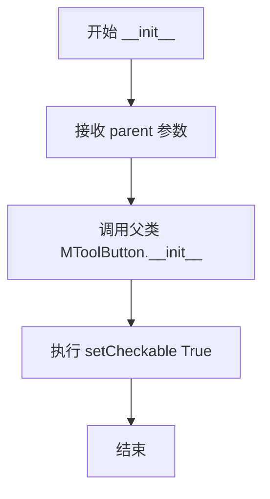

#### 带注释源码

```python
def __init__(self, parent=None):
    """
    初始化 MBlockButton 实例
    
    参数:
        parent: QtWidgets.QWidget, 可选的父控件，用于建立 Qt 控件层次结构
                默认为 None，表示没有父控件
    """
    # 调用父类 MToolButton 的初始化方法，传递 parent 参数
    super(MBlockButton, self).__init__(parent)
    
    # 设置按钮为可复选状态（toggle button）
    # 允许用户点击切换按钮的选中/未选中状态
    self.setCheckable(True)
```

---

**补充说明：**

- **设计目的**：MBlockButton 继承自 MToolButton，专注于提供块状风格的导航按钮
- **核心功能**：通过 `setCheckable(True)` 使按钮具备切换状态的能力，可用于菜单项的选择
- **技术债务**：当前实现较为简单，未设置默认样式或图标，若需更多定制可能需要扩展
- **错误处理**：构造函数未进行额外的错误处理，依赖 Qt 框架自身的异常管理


### `MBlockButtonGroup.__init__`

这是MBlockButtonGroup类的初始化方法，用于创建一个块状按钮组（Block Button Group），支持水平或垂直排列，并管理按钮的独占选中状态。该组件继承自MButtonGroupBase，提供了导航菜单的功能。

参数：

- `self`：`MBlockButtonGroup`，类实例本身（隐式参数）
- `tab`：`MMenuTabWidget` 或 `QtWidgets.QWidget`，菜单标签页对象，用于获取大小尺寸和关联按钮组
- `orientation`：`QtCore.Qt.Orientation`，按钮排列方向，默认值为 `QtCore.Qt.Horizontal`（水平排列），可设为 `QtCore.Qt.Vertical`（垂直排列）
- `parent`：`QtWidgets.QWidget`，父widget对象，默认值为 `None`，用于Qt对象层级管理

返回值：`None`，初始化方法不返回值，仅完成对象状态初始化

#### 流程图

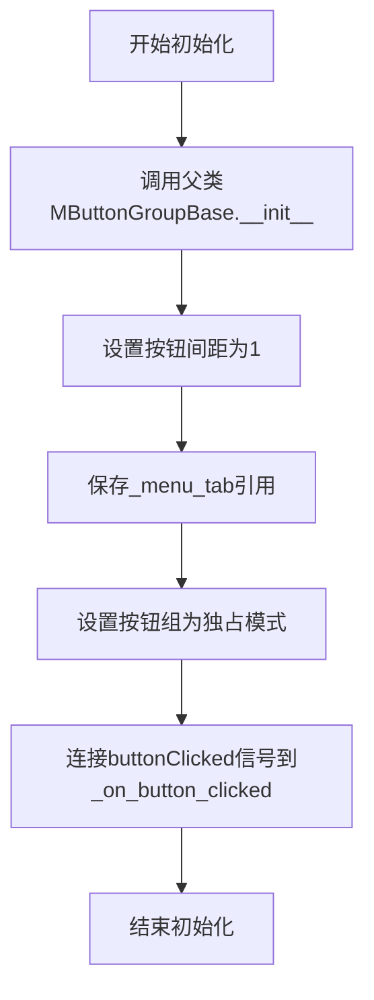

#### 带注释源码

```python
def __init__(self, tab, orientation=QtCore.Qt.Horizontal, parent=None):
    """初始化MBlockButtonGroup块状按钮组
    
    参数:
        tab: MMenuTabWidget或QtWidgets.QWidget
            菜单标签页对象，用于获取dayu_size和关联按钮组
        orientation: QtCore.Qt.Orientation
            按钮排列方向，默认QtCore.Qt.Horizontal（水平）
        parent: QtWidgets.QWidget
            父widget对象，默认为None
    """
    # 调用父类MButtonGroupBase的初始化方法，传入方向和父对象
    super(MBlockButtonGroup, self).__init__(orientation=orientation, parent=parent)
    
    # 设置按钮之间的间距为1像素
    self.set_spacing(1)
    
    # 保存菜单标签页引用，用于后续获取按钮尺寸等配置
    self._menu_tab = tab
    
    # 设置按钮组为独占模式，保证同一时间只有一个按钮被选中
    self._button_group.setExclusive(True)
    
    # 连接按钮点击信号到内部处理方法，当按钮被点击时触发_on_button_clicked
    self._button_group.buttonClicked.connect(self._on_button_clicked)
```


### `MBlockButtonGroup._on_button_clicked`

当按钮组中的按钮被点击时，获取该按钮的 ID 并发出 `sig_checked_changed` 信号，以通知外部当前选中的按钮已变更。

参数：

- `self`：`MBlockButtonGroup`，类实例本身
- `button`：`PySide6.QtWidgets.QAbstractButton`，被点击的按钮对象

返回值：`None`，该方法无返回值，通过信号机制传递数据

#### 流程图

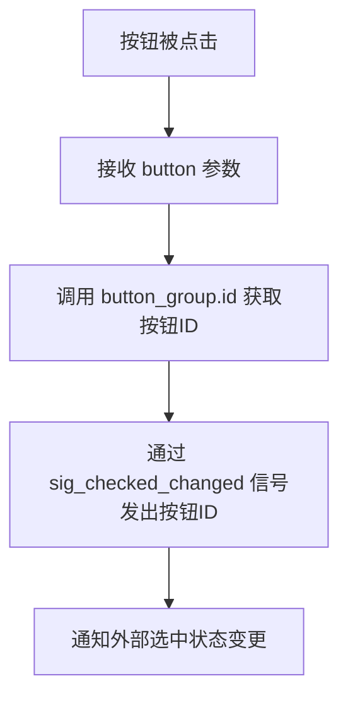

#### 带注释源码

```python
def _on_button_clicked(self, button):
    # Get the id of the clicked button and emit it
    # 获取被点击按钮的唯一标识ID
    button_id = self._button_group.id(button)
    # 发射信号通知外部当前选中的按钮ID已变更
    self.sig_checked_changed.emit(button_id)
```


### `MBlockButtonGroup.create_button`

该方法负责实例化一个 `MBlockButton` 按钮，并根据传入的 `data_dict` 字典中的键值（如 `svg`, `text`, `icon`）动态设置其显示内容、布局样式以及从父级菜单栏获取的尺寸大小，最终返回配置好的按钮对象。

参数：
- `data_dict`：`dict`，字典类型，包含按钮的配置数据。通常包含以下可选键：
  - `svg` (str): 图标文件路径。
  - `text` (str): 按钮显示的文本。
  - `icon` (str): 按钮的图标标识。

返回值：`MBlockButton`，返回配置完成后的块状按钮实例。

#### 流程图

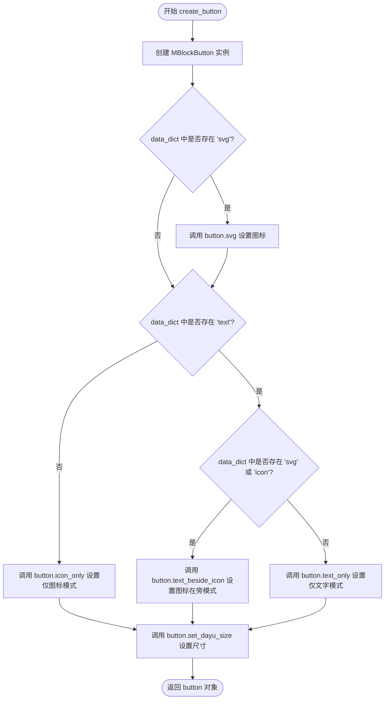

#### 带注释源码

```python
def create_button(self, data_dict):
    """
    根据数据字典创建并配置一个 MBlockButton。

    参数:
        data_dict (dict): 包含按钮属性的字典，例如 {'svg': 'path/to/icon.svg', 'text': 'Click Me'}.

    返回:
        MBlockButton: 配置好的按钮实例。
    """
    # 1. 实例化按钮对象
    button = MBlockButton()

    # 2. 如果提供了 svg 路径，则设置按钮的矢量图标
    if data_dict.get("svg"):
        button.svg(data_dict.get("svg"))

    # 3. 判断文本内容，以决定按钮的布局模式
    if data_dict.get("text"):
        # 如果同时有 svg 或 icon 资源，文字应排列在图标旁边
        if data_dict.get("svg") or data_dict.get("icon"):
            button.text_beside_icon()
        else:
            # 只有文字，没有图标
            button.text_only()
    else:
        # 没有文字内容，默认仅显示图标
        button.icon_only()

    # 4. 设置按钮的尺寸大小，该大小继承自当前的菜单标签页 (self._menu_tab)
    button.set_dayu_size(self._menu_tab.get_dayu_size())

    # 5. 返回构建完成的按钮
    return button
```


### `MBlockButtonGroup.update_size`

该方法用于批量更新按钮组中所有按钮的尺寸，通过遍历按钮组中的每一个按钮并调用其 `set_dayu_size` 方法来应用新的尺寸设置。

参数：

- `self`：隐式参数，`MBlockButtonGroup` 实例本身，代表当前按钮组对象
- `size`：整数类型（int），表示要设置的新尺寸值，该值会应用到所有子按钮上

返回值：`None`，该方法无返回值，仅执行副作用操作

#### 流程图

```mermaid
graph TD
    A([开始 update_size]) --> B[获取按钮组中的所有按钮]
    B --> C{遍历每个按钮}
    C -->|是| D[调用 button.set_dayu_size&#40;size&#41;]
    D --> C
    C -->|否| E([结束])
    
    style A fill:#f9f,stroke:#333
    style E fill:#9f9,stroke:#333
    style D fill:#ff9,stroke:#333
```

#### 带注释源码

```python
def update_size(self, size):
    """
    更新按钮组中所有按钮的尺寸大小
    
    参数:
        size: int, 新的尺寸值，将被应用到组内的每个按钮
        
    返回值:
        None
        
    注意:
        此方法遍历当前按钮组中的所有按钮，并为每个按钮设置相同的尺寸。
        尺寸值通过调用按钮的 set_dayu_size 方法进行设置。
    """
    # 遍历按钮组中的所有按钮
    for button in self._button_group.buttons():
        # 为每个按钮设置统一的尺寸大小
        button.set_dayu_size(size)
```


### `MBlockButtonGroup.set_dayu_checked`

设置当前选中按钮的ID，通过按钮ID选中对应的按钮并发射选中信号。

参数：

- `self`：`MBlockButtonGroup`，隐式参数，表示当前按钮组实例
- `value`：`int`，要选中的按钮ID

返回值：`None`，无返回值（该方法通过信号机制通知状态变更）

#### 流程图

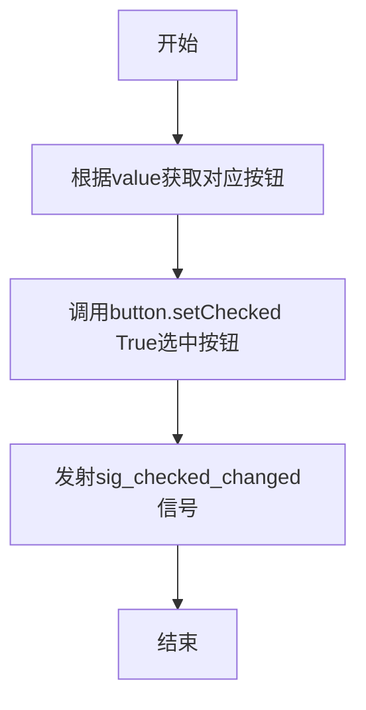

#### 带注释源码

```python
def set_dayu_checked(self, value):
    """Set current checked button's id"""
    # 根据传入的value（按钮ID）获取对应的按钮对象
    button = self._button_group.button(value)
    # 将该按钮设置为选中状态
    button.setChecked(True)
    # 发射选中状态变更信号，通知监听者当前选中的按钮ID
    self.sig_checked_changed.emit(value)
```


### `MBlockButtonGroup.get_dayu_checked`

获取当前被选中按钮的 ID。

参数：

- `self`：`MBlockButtonGroup`，隐式参数，表示类的实例本身

返回值：`int`，返回当前被选中按钮的 ID，如果没有按钮被选中则返回 -1

#### 流程图

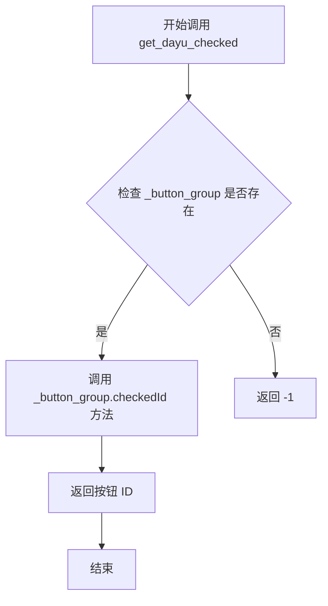

#### 带注释源码

```python
def get_dayu_checked(self):
    """Get current checked button's id"""
    # 调用 Qt QButtonGroup 的 checkedId 方法获取当前选中按钮的 ID
    # 如果没有按钮被选中，返回 -1
    return self._button_group.checkedId()
```


### `MBlockButtonGroup.dayu_checked`

该属性是 `MBlockButtonGroup` 类的 Qt 属性（Property），用于管理按钮组中的选中状态。通过 getter 获取当前选中的按钮 ID，通过 setter 设置选中的按钮，并通过 notify 信号通知选中状态的变化。

**注意**：该属性是一个 Qt Property，不是传统的方法，因此它本身没有直接参数。参数信息如下：

- `value`（在 setter `set_dayu_checked` 中）：`int`，要设置为选中状态的按钮 ID
- `getter`（`get_dayu_checked`）：无参数
- `notify signal`（`sig_checked_changed`）：`int`，发出当前选中的按钮 ID

返回值：`int`，当前选中的按钮 ID（`get_dayu_checked` 返回）；`None`（`set_dayu_checked` 无返回值）

#### 流程图

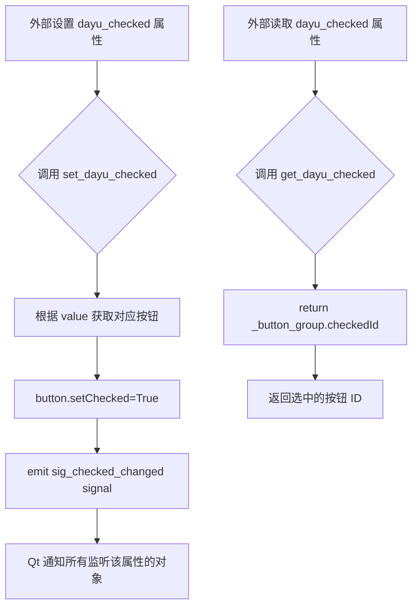

#### 带注释源码

```python
# Qt Property 定义
# 参数1: 属性类型 int
# 参数2: getter 方法 get_dayu_checked
# 参数3: setter 方法 set_dayu_checked
# 参数4: notify 信号 sig_checked_changed (当属性变化时发出)
dayu_checked = QtCore.Property(int, get_dayu_checked, set_dayu_checked, notify=sig_checked_changed)

def set_dayu_checked(self, value):
    """Set current checked button's id"""
    # 根据传入的按钮 ID 获取对应的按钮对象
    button = self._button_group.button(value)
    # 将按钮设置为选中状态
    button.setChecked(True)
    # 发出信号通知选中状态已改变，参数为按钮 ID
    self.sig_checked_changed.emit(value)

def get_dayu_checked(self):
    """Get current checked button's id"""
    # 返回当前被选中的按钮 ID（-1 表示无选中）
    return self._button_group.checkedId()
```


### `MMenuTabWidget.__init__`

该方法是 `MMenuTabWidget` 类的构造函数，负责初始化一个菜单标签部件。它根据传入的 `orientation` 参数创建水平或垂直方向的工具按钮组布局，配置布局边距和间距，添加工具栏部件，并设置默认的主题尺寸。

参数：

- `self`：`MMenuTabWidget`，当前实例对象
- `orientation`：`QtCore.Qt.Orientation`，可选参数，默认为 `QtCore.Qt.Horizontal`，指定菜单栏的方向（水平或垂直）
- `parent`：`QtWidgets.QWidget`，可选参数，默认为 `None`，指定父部件

返回值：`None`，该方法为构造函数，不返回任何值

#### 流程图

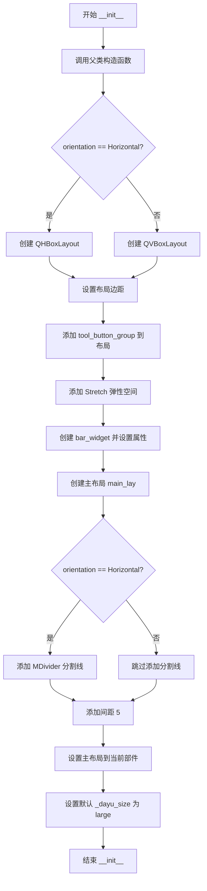

#### 带注释源码

```python
def __init__(self, orientation=QtCore.Qt.Horizontal, parent=None):
    # 调用父类 QWidget 的构造函数，初始化基类
    super(MMenuTabWidget, self).__init__(parent=parent)
    
    # 创建工具按钮组，传入自身实例和方向参数
    # MBlockButtonGroup 负责管理菜单按钮的逻辑
    self.tool_button_group = MBlockButtonGroup(tab=self, orientation=orientation)

    # 根据方向选择水平或垂直布局
    if orientation == QtCore.Qt.Horizontal:
        # 水平布局：左右边距为10，上下边距为0
        self._bar_layout = QtWidgets.QHBoxLayout()
        self._bar_layout.setContentsMargins(10, 0, 10, 0)
    else:
        # 垂直布局：四周边距均为0
        self._bar_layout = QtWidgets.QVBoxLayout()
        self._bar_layout.setContentsMargins(0, 0, 0, 0)

    # 将工具按钮组添加到布局中
    self._bar_layout.addWidget(self.tool_button_group)
    # 添加弹性空间，将按钮组推到左边（水平）或上边（垂直）
    self._bar_layout.addStretch()
    
    # 创建工具栏容器部件
    bar_widget = QtWidgets.QWidget()
    bar_widget.setObjectName("bar_widget")
    bar_widget.setLayout(self._bar_layout)
    # 设置样式背景属性，使背景色可以自定义
    bar_widget.setAttribute(QtCore.Qt.WA_StyledBackground)

    # 创建主垂直布局
    main_lay = QtWidgets.QVBoxLayout()
    main_lay.setContentsMargins(0, 0, 0, 0)
    main_lay.setSpacing(0)
    # 将工具栏添加到主布局
    main_lay.addWidget(bar_widget)

    # 如果是水平方向，添加分割线
    if orientation == QtCore.Qt.Horizontal:
        main_lay.addWidget(MDivider())

    # 添加5像素的间距
    main_lay.addSpacing(5)
    
    # 设置当前部件的布局
    self.setLayout(main_lay)
    
    # 设置默认的 dayu_size 为大号尺寸
    self._dayu_size = dayu_theme.large
```


### `MMenuTabWidget.tool_bar_append_widget`

将指定的Qt小部件添加到菜单栏右侧位置的布局中。该方法直接调用Qt布局管理器的addWidget方法，将传入的小部件添加到水平或垂直布局的末尾。

参数：

- `self`：`MMenuTabWidget`，MMenuTabWidget类的实例，代表当前菜单标签控件对象
- `widget`：`QtWidgets.QWidget`，要添加到菜单栏右侧的小部件对象，可以是任意继承自QWidget的控件（如按钮、标签等）

返回值：`None`，该方法无返回值，仅执行添加小部件的副作用操作

#### 流程图

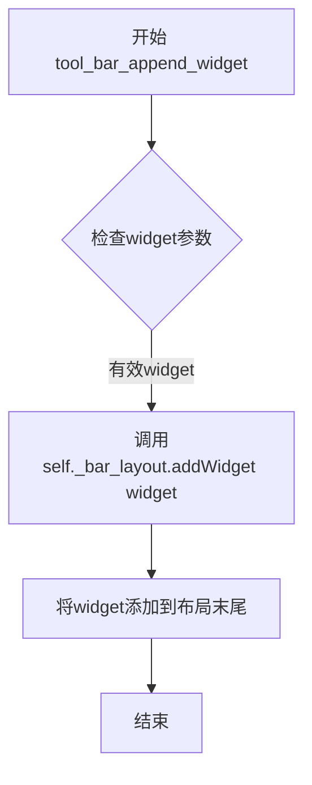

#### 带注释源码

```python
def tool_bar_append_widget(self, widget):
    """Add the widget too menubar's right position."""
    # 使用Qt布局管理器的addWidget方法将widget添加到_bar_layout的末尾
    # _bar_layout是根据orientation创建的水平或垂直布局
    # addWidget会自动将widget添加到布局的右侧（对于QHBoxLayout）或底部（对于QVBoxLayout）
    self._bar_layout.addWidget(widget)
```


### `MMenuTabWidget.tool_bar_insert_widget`

将指定的小部件（widget）插入到菜单栏（menubar）的最左侧位置。

参数：

- `widget`：`QtWidgets.QWidget`，需要插入到菜单栏左侧的小部件对象

返回值：`None`，该方法无返回值（Qt的insertWidget方法返回值为void）

#### 流程图

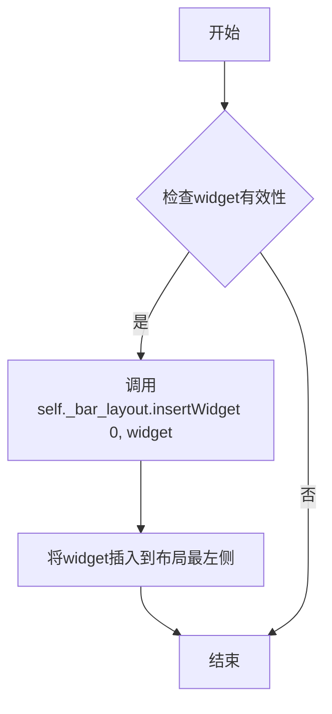

#### 带注释源码

```
def tool_bar_insert_widget(self, widget):
    """Insert the widget to menubar's left position."""
    # 使用Qt的insertWidget方法将widget插入到布局的索引0位置
    # 即菜单栏的最左侧（靠近菜单按钮的地方）
    # 索引0表示插入到布局的最前面
    self._bar_layout.insertWidget(0, widget)
```


### `MMenuTabWidget.add_menu`

该方法用于向菜单标签组件中添加一个菜单项，通过调用内部持有的按钮组对象完成菜单的动态添加操作。

参数：

- `self`：`MMenuTabWidget`，隐式参数，表示当前实例本身
- `data_dict`：`dict`，字典类型，包含菜单数据的字典，如svg、text、icon等键值对
- `index`：`int` 或 `None`，可选参数，表示菜单按钮的索引位置，默认为None

返回值：`None`，无返回值描述

#### 流程图

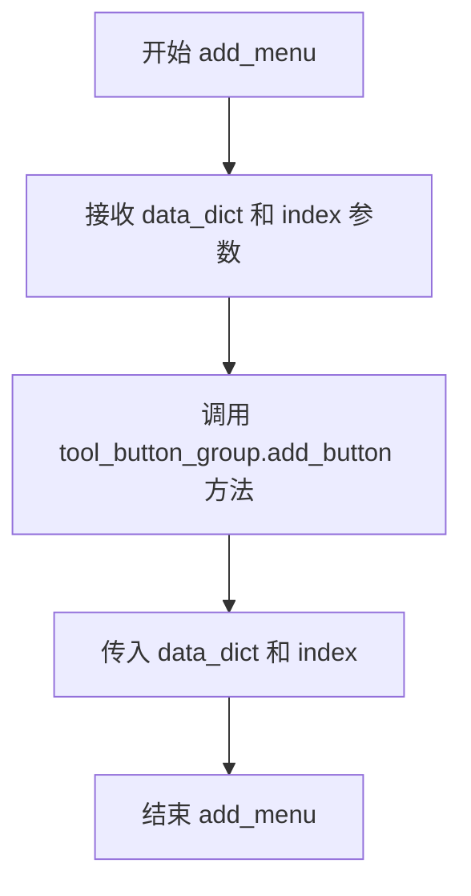

#### 带注释源码

```python
def add_menu(self, data_dict, index=None):
    """
    Add a menu
    向菜单标签组件中添加一个菜单项
    
    参数:
        data_dict: dict, 包含菜单数据的字典，如svg、text、icon等键值对
        index: int or None, 可选的索引位置，用于指定按钮的添加位置
    """
    # 调用内部持有的按钮组对象的add_button方法来实际添加菜单按钮
    self.tool_button_group.add_button(data_dict, index)
```


### `MMenuTabWidget.get_dayu_size`

获取菜单标签组件的尺寸大小。该方法返回当前设置的 `dayu_size` 属性值，用于统一管理菜单标签按钮的尺寸。

参数：

- `self`：`MMenuTabWidget`，隐含的类实例参数，表示当前菜单标签组件对象

返回值：`int`，返回菜单标签的尺寸大小（对应 `dayu_theme` 中的尺寸常量，如 `dayu_theme.large` 等）

#### 流程图

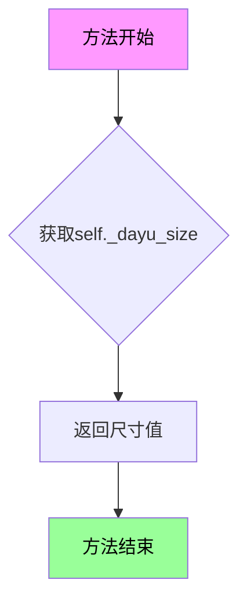

#### 带注释源码

```python
def get_dayu_size(self):
    """
    Get the menu tab size.
    :return: integer
    """
    # 返回当前菜单标签组件的尺寸大小
    # 该值在类初始化时默认设置为 dayu_theme.large
    # 可通过 set_dayu_size 方法进行修改
    return self._dayu_size
```


### `MMenuTabWidget.set_dayu_size`

设置菜单标签组件的尺寸大小，同时更新按钮组中的所有按钮尺寸并刷新样式。

参数：

- `self`：实例本身，隐式参数，MMenuTabWidget 的实例对象
- `value`：`int`，要设置的尺寸值，对应 dayu_theme 中的尺寸常量（如 small、medium、large）

返回值：`None`，无返回值

#### 流程图

```mermaid
flowchart TD
    A[set_dayu_size 被调用] --> B[将 value 赋值给 self._dayu_size]
    B --> C[调用 tool_button_group.update_size 传入当前尺寸]
    C --> D[遍历按钮组中所有按钮]
    D --> E[调用每个按钮的 set_dayu_size 方法]
    E --> F[调用 self.style().polish 刷新组件样式]
    F --> G[流程结束]
```

#### 带注释源码

```python
def set_dayu_size(self, value):
    """
    Set the menu tab size.
    :param value: integer
    :return: None
    """
    # 1. 将传入的尺寸值保存到实例变量 _dayu_size 中
    self._dayu_size = value
    # 2. 调用按钮组的 update_size 方法，传递当前尺寸值
    #    该方法会遍历按钮组中的所有按钮，为每个按钮设置新的尺寸
    self.tool_button_group.update_size(self._dayu_size)
    # 3. 调用 Qt 样式系统的 polish 方法，刷新组件的视觉样式
    #    确保尺寸变更后样式能够正确应用
    self.style().polish(self)
```


### `MMenuTabWidget.dayu_size`

这是一个Qt属性（Property），用于获取/设置菜单标签组件的尺寸大小。该属性内部绑定了`get_dayu_size`和`set_dayu_size`方法，实现了尺寸的读取和设置功能，并会在设置时自动更新关联按钮组的大小。

参数：

- `{属性本身无参数，但set_dayu_size方法有参数value}`
  - `value`：`int`，要设置的新尺寸值

返回值：`None`（`set_dayu_size`无返回值），但`get_dayu_size`返回`int`类型（当前尺寸值）

#### 流程图

```mermaid
flowchart TD
    A[访问 dayu_size 属性] --> B{读取还是写入?}
    B -->|读取| C[调用 get_dayu_size]
    C --> D[返回 self._dayu_size]
    B -->|写入| E[调用 set_dayu_size]
    E --> F[更新 self._dayu_size = value]
    F --> G[调用 tool_button_group.update_size 更新按钮大小]
    G --> H[调用 self.style().polish 刷新样式]
    H --> I[返回 None]
```

#### 带注释源码

```python
def get_dayu_size(self):
    """
    Get the menu tab size.
    :return: integer
    """
    return self._dayu_size

def set_dayu_size(self, value):
    """
    Set the menu tab size.
    :param value: integer
    :return: None
    """
    self._dayu_size = value
    # 更新按钮组中所有按钮的尺寸
    self.tool_button_group.update_size(self._dayu_size)
    # 刷新当前控件的样式
    self.style().polish(self)

# 定义Qt属性：类型为int，getter为get_dayu_size，setter为set_dayu_size
dayu_size = QtCore.Property(int, get_dayu_size, set_dayu_size)
```

## 关键组件


### MBlockButton

继承自MToolButton的可复选块状按钮组件，提供SVG图标、文本和图标等多种显示模式，支持复选状态管理。

### MBlockButtonGroup

按钮组管理类，封装QButtonGroup功能，提供exclusive模式管理，实现按钮点击信号转发（sig_checked_changed），支持动态创建和更新按钮。

### MMenuTabWidget

菜单标签容器组件，支持水平和垂直两种布局方向，内部包含工具按钮组和分割线，提供动态添加菜单和侧边栏组件的能力。

### dayu_size属性系统

基于Qt Property机制的大小管理属性，支持getter/setter设计模式，当大小改变时自动更新所有子按钮尺寸并刷新样式。

### sig_checked_changed信号机制

按钮组的选中状态变更信号系统，通过Qt的Signal(int)实现，支持Qt Property绑定，实现选中状态的响应式更新。

### 布局管理系统

基于QHBoxLayout/QVBoxLayout的弹性布局，支持左侧插入widget和右侧追加widget，提供边距和间距的精细控制。


## 问题及建议


### 已知问题

-   **类型注解缺失**：代码中未使用类型注解（type hints），降低可读性和可维护性。
-   **异常处理不足**：`set_dayu_checked` 方法中未检查 `button` 是否为 `None`，可能导致运行时错误。
-   **硬编码值**：布局边距、间距等值硬编码，可能不适应不同场景。
-   **代码重复**：`MMenuTabWidget` 构造函数中水平/垂直方向的布局设置有重复代码。
-   **文档不完整**：部分方法缺少参数和返回值的详细描述。
-   **属性命名不一致**：使用 `dayu_checked` 和 `dayu_size` 等自定义属性，但未遵循标准命名约定。
-   **信号连接潜在风险**：`sig_checked_changed` 信号在 `set_dayu_checked` 中手动 emit，可能导致信号重复触发。
-   **无测试覆盖**：代码中未包含单元测试或集成测试。
-   **依赖隐式依赖**：依赖 `dayu_theme` 等模块，但未明确版本或接口契约。
-   **设计模式不明确**：未遵循明确的设计模式（如 MVC/MVP），可能影响扩展性。

### 优化建议

-   **添加类型注解**：为所有方法参数和返回值添加类型注解，例如 `def set_dayu_checked(self, value: int) -> None`。
-   **增强异常处理**：在 `set_dayu_checked` 中添加 `if button is not None` 检查，或使用 `try-except` 捕获异常。
-   **提取配置常量**：将硬编码的边距、间距等值定义为类或模块级常量，例如 `MARGIN_HORIZONTAL = 10`。
-   **简化布局逻辑**：使用工厂方法或条件表达式减少重复代码，例如通过 `orientation` 参数选择布局类型。
-   **完善文档字符串**：为所有公共方法添加详细的文档字符串，包括参数、返回值和异常说明。
-   **统一命名规范**：考虑使用更标准的属性名，如 `checked_id` 代替 `dayu_checked`，或遵循 Qt 命名约定。
-   **优化信号机制**：避免手动 emit 信号导致重复触发，可使用 `blockSignals` 临时阻塞信号。
-   **添加单元测试**：编写测试用例覆盖核心功能，如按钮点击、状态切换等。
-   **明确依赖版本**：在代码注释或配置文件中指定依赖模块的版本要求。
-   **引入设计模式**：考虑采用清晰的设计模式（如组合模式）以提高代码结构和可扩展性。


## 其它


### 设计目标与约束

设计目标：提供一种灵活、可定制的导航菜单组件，支持水平/垂直布局，可包含图标和文本按钮，支持单选互斥操作，与dayu_theme主题系统集成。

技术约束：依赖PySide6框架，继承自MToolButton、MButtonGroupBase、QWidget等基类，需要与dayu_theme主题系统配合使用。

### 错误处理与异常设计

1. `set_dayu_checked(value)`方法中，如果`value`对应的button不存在，会抛出`RuntimeError: 'No button with id'`，需要添加参数校验或异常处理。
2. `create_button(data_dict)`方法中，假设`data_dict`为字典类型，未对输入类型进行校验。
3. `add_button(data_dict, index)`方法从`tool_button_group`调用，但该方法未在代码中定义（继承自MButtonGroupBase），需要确保基类实现正确。

### 数据流与状态机

1. **按钮点击流程**：用户点击按钮 → `_button_group.buttonClicked`信号触发 → `_on_button_clicked`回调 → 获取button id → 发射`sig_checked_changed`信号 → 外部处理
2. **状态管理**：通过Qt的Property机制（`dayu_checked`、`dayu_size`）实现双向绑定，支持QSS样式更新
3. **布局状态**：根据orientation参数动态选择QHBoxLayout或QVBoxLayout

### 外部依赖与接口契约

1. **依赖模块**：
   - `PySide6.QtCore`：信号槽机制、Qt属性系统
   - `PySide6.QtWidgets`：UI组件
   - `dayu_theme`：主题尺寸常量
   - `MButtonGroupBase`：按钮组基类
   - `MDivider`：分隔线组件
   - `MToolButton`：工具按钮基类

2. **接口契约**：
   - `MMenuTabWidget.add_menu(data_dict, index)`：添加菜单项，data_dict需包含svg、text、icon等键
   - `MMenuTabWidget.tool_bar_append_widget(widget)`：在工具栏右侧添加工具
   - `MMenuTabWidget.tool_bar_insert_widget(widget)`：在工具栏左侧添加工具

### 样式与主题定制

1. 通过`setObjectName("bar_widget")`为特定widget设置对象名，支持QSS选择器定制样式
2. 使用`set_dayu_size()`方法动态调整按钮尺寸，与dayu_theme主题系统联动
3. 通过`setAttribute(QtCore.Qt.WA_StyledBackground)`启用背景样式支持

### 性能考虑

1. 按钮使用复选模式（setCheckable），每次点击仅触发信号而非重新创建按钮
2. 使用`setSpacing(1)`和`setContentsMargins`优化布局间距
3. 通过`update_size()`批量更新按钮尺寸，避免逐个设置

### 国际化与本地化

1. 文本内容通过`data_dict`传入，支持外部传入多语言文本
2. 组件本身不包含硬编码文本，便于国际化处理

### 使用示例与调用流程

1. 创建`MMenuTabWidget`实例，指定方向
2. 通过`add_menu()`方法添加菜单数据
3. 通过`tool_bar_append_widget()`添加工具组件
4. 连接`sig_checked_changed`信号处理选中状态变化

### 版本变更与兼容性

1. 代码使用Python 2/3兼容语法（`__future__`导入）
2. 依赖PySide6（较新版本），需确保Qt版本兼容性
3. `MBlockButton`继承自`MToolButton`，需确保基类API稳定

    