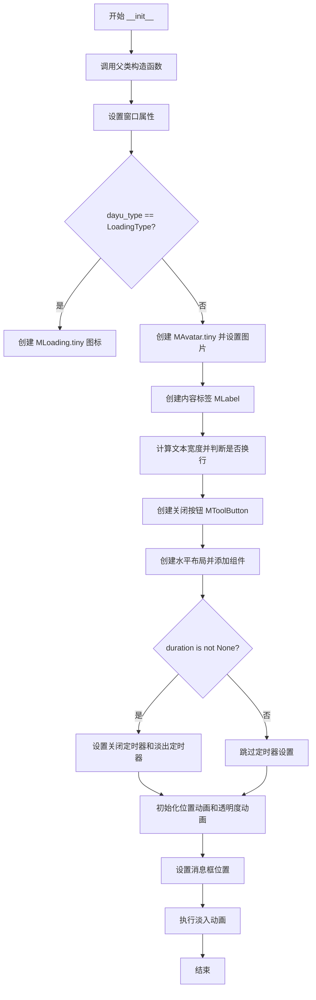
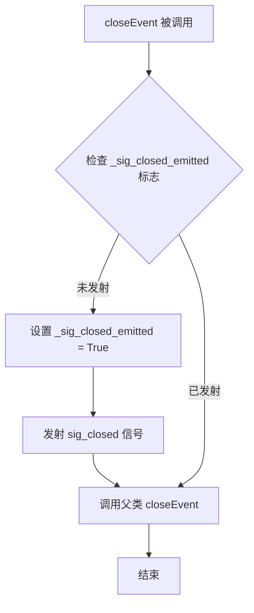
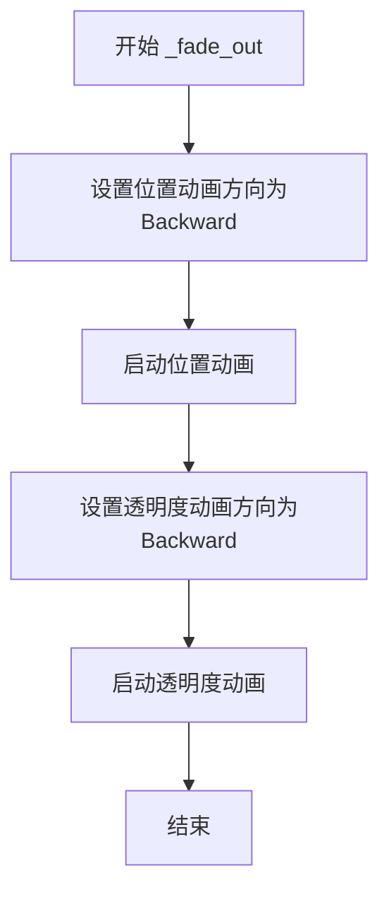
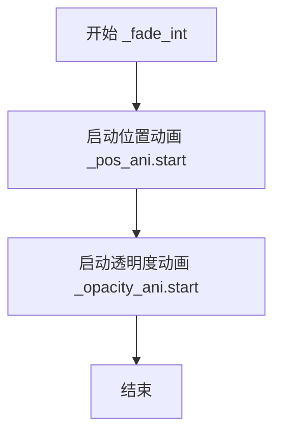
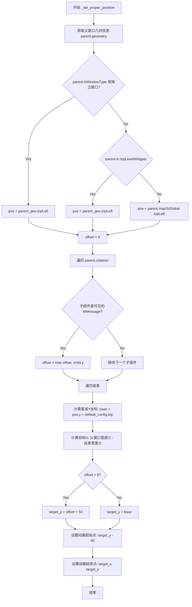
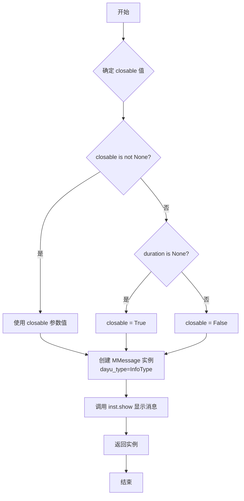
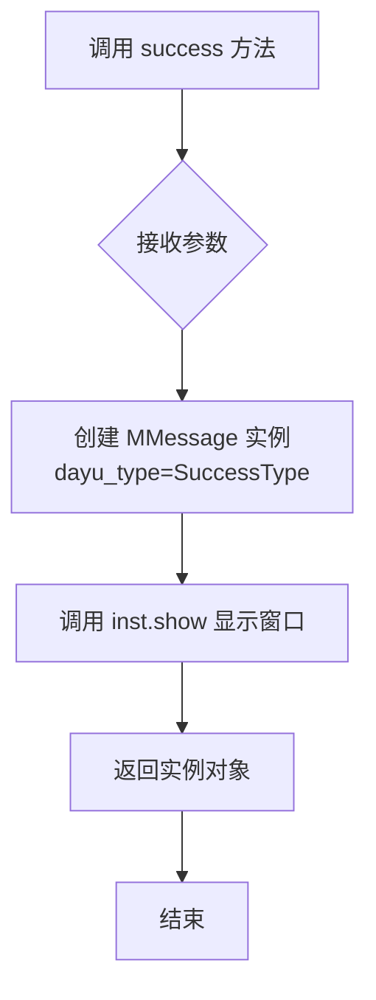
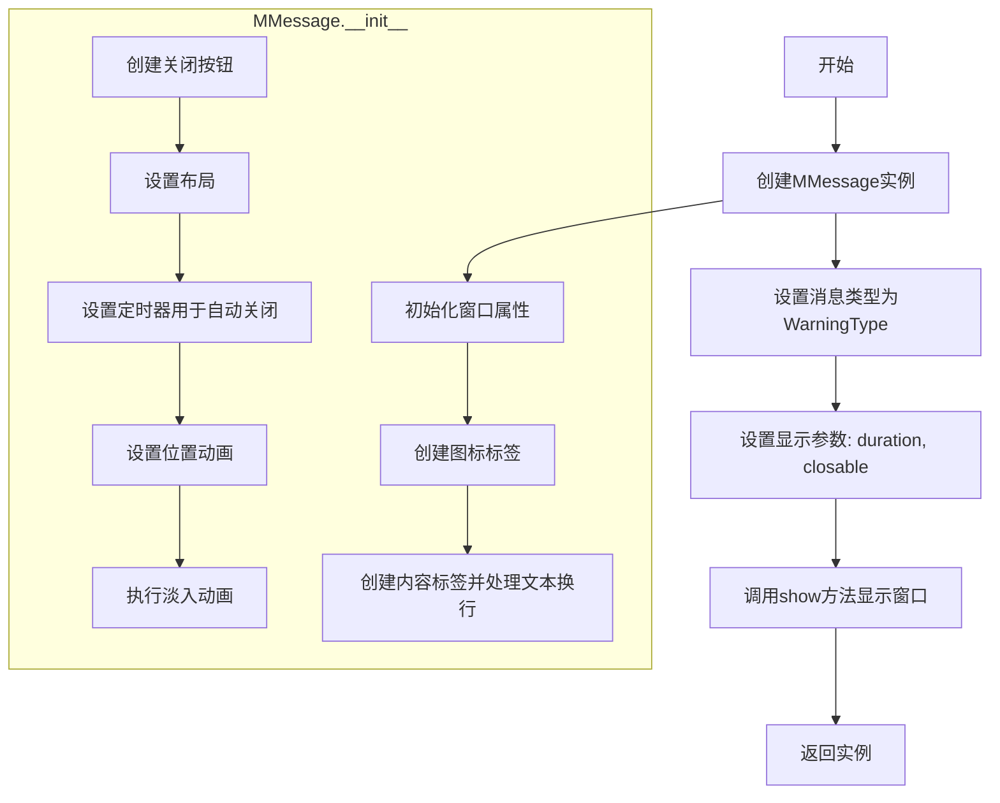
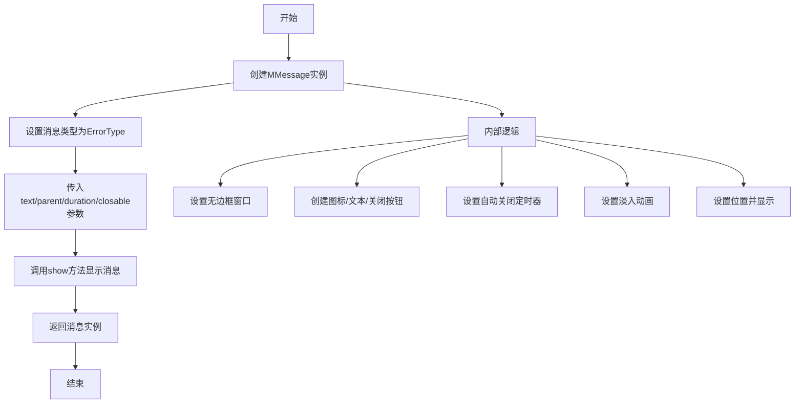
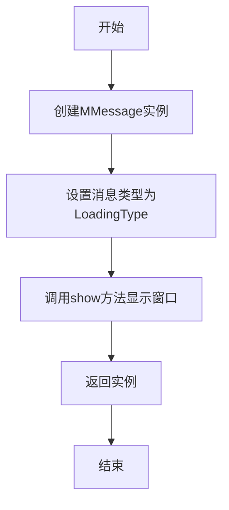

# `comic-translate\app\ui\dayu_widgets\message.py` 详细设计文档

MMessage是一个基于PySide6的轻量级消息通知组件，用于在应用中显示不同类型（信息、成功、警告、错误、加载中）的带动画效果的浮动消息提示框，支持自动关闭、手动关闭、动画淡入淡出以及基于父窗口的智能定位功能。

## 整体流程

```mermaid
graph TD
    A[用户调用类方法<br/>info/success/warning/error/loading] --> B[创建MMessage实例]
    B --> C{dayu_type是否为LoadingType?}
    C -- 是 --> D[使用MLoading.tiny()作为图标]
    C -- 否 --> E[使用MAvatar.tiny()并设置对应类型图片]
    E --> F[创建内容标签MLabel<br/>并处理文本自动换行]
    F --> G{closable或duration为None?}
    G -- 是 --> H[显示关闭按钮]
    G -- 否 --> I[隐藏关闭按钮]
    I --> J[设置窗口标志<br/>FramelessWindowHint/Dialog/WindowStaysOnTopHint]
    J --> K{ duration不为None?}
    K -- 是 --> L[启动关闭定时器<br/>和渐出动画定时器]
    K -- 否 --> M[不启动定时器]
    L --> N[初始化位置和透明度动画]
    M --> N
    N --> O[调用_set_proper_position<br/>计算显示位置]
    O --> P[调用_fade_int执行淡入动画]
    P --> Q[show显示窗口]
    Q --> R{定时器触发或用户点击关闭?}
    R --> S[调用_fade_out执行淡出动画]
    S --> T[触发closeEvent]
    T --> U[发射sig_closed信号]
    U --> V[调用QWidget.close关闭窗口]
```

## 类结构

```
QtWidgets.QWidget (PySide6基类)
└── MMessage (自定义消息组件)
```

## 全局变量及字段


### `MMessage`
    
消息提示组件类，用于在界面上显示信息、成功、警告、错误和加载中等类型的消息

类型：`class`
    


### `MMessage.InfoType`
    
消息类型常量，表示信息消息

类型：`str`
    


### `MMessage.SuccessType`
    
消息类型常量，表示成功消息

类型：`str`
    


### `MMessage.WarningType`
    
消息类型常量，表示警告消息

类型：`str`
    


### `MMessage.ErrorType`
    
消息类型常量，表示错误消息

类型：`str`
    


### `MMessage.LoadingType`
    
消息类型常量，表示加载中消息

类型：`str`
    


### `MMessage.default_config`
    
类变量，默认配置字典，包含duration(默认2秒)和top(默认24px)

类型：`dict`
    


### `MMessage.sig_closed`
    
关闭信号，当消息窗口关闭时发射

类型：`QtCore.Signal`
    


### `MMessage._sig_closed_emitted`
    
实例变量，标记关闭信号是否已发射，避免重复发射

类型：`bool`
    


### `MMessage._content_label`
    
实例变量，消息内容标签组件

类型：`MLabel`
    


### `MMessage._close_button`
    
实例变量，关闭按钮组件

类型：`MToolButton`
    


### `MMessage._main_lay`
    
实例变量，主水平布局管理器

类型：`QtWidgets.QHBoxLayout`
    


### `MMessage._pos_ani`
    
实例变量，位置动画，用于淡入淡出时的位置过渡

类型：`QtCore.QPropertyAnimation`
    


### `MMessage._opacity_ani`
    
实例变量，透明度动画，用于窗口透明度的渐变效果

类型：`QtCore.QPropertyAnimation`
    
    

## 全局函数及方法


### `MMessage.__init__`

初始化消息组件，设置窗口属性、创建UI组件、配置动画和定时器。

参数：

- `text`：`str`，消息文本内容
- `duration`：`int/None`，显示持续时间（秒），None表示不自动关闭
- `dayu_type`：`str/None`，消息类型，决定图标和颜色
- `closable`：`bool`，是否显示关闭按钮
- `parent`：`QWidget/None`，父窗口组件

返回值：`None`，构造函数无返回值

#### 流程图



#### 带注释源码

```python
def __init__(self, text, duration=None, dayu_type=None, closable=False, parent=None):
    """
    初始化消息组件
    
    参数:
        text: str - 消息文本内容
        duration: int/None - 显示持续时间(秒), None表示不自动关闭
        dayu_type: str/None - 消息类型, 决定图标和颜色
        closable: bool - 是否显示关闭按钮
        parent: QWidget/None - 父窗口组件
    """
    # 调用父类 QtWidgets.QWidget 的构造函数
    super(MMessage, self).__init__(parent)
    
    # 设置对象名称, 便于样式表选择器识别
    self.setObjectName("message")
    
    # 标记是否已发送关闭信号, 避免重复发送
    self._sig_closed_emitted = False
    
    # 设置窗口标志:
    # - FramelessWindowHint: 无边框窗口
    # - Dialog: 对话框模式
    # - WindowStaysOnTopHint: 窗口置顶
    self.setWindowFlags(
        QtCore.Qt.WindowType.FramelessWindowHint
        | QtCore.Qt.WindowType.Dialog
        | QtCore.Qt.WindowType.WindowStaysOnTopHint
    )
    
    # 设置窗口属性:
    # - WA_DeleteOnClose: 关闭时自动删除对象
    # - WA_StyledBackground: 启用样式背景
    self.setAttribute(QtCore.Qt.WidgetAttribute.WA_DeleteOnClose)
    self.setAttribute(QtCore.Qt.WidgetAttribute.WA_StyledBackground)

    # 根据消息类型创建图标组件
    if dayu_type == MMessage.LoadingType:
        # 加载类型使用 MLoading 组件
        _icon_label = MLoading.tiny()
    else:
        # 其他类型使用 MAvatar 组件
        _icon_label = MAvatar.tiny()
        # 确定当前类型(默认使用Info类型)
        current_type = dayu_type or MMessage.InfoType
        # 设置对应类型的图标图片和颜色
        _icon_label.set_dayu_image(
            MPixmap(
                "{}_fill.svg".format(current_type),
                vars(dayu_theme).get(current_type + "_color"),
            )
        )

    # 创建消息内容标签
    self._content_label = MLabel(parent=self)

    # 计算文本自然宽度, 超过最大宽度时启用自动换行
    # 注意: QFontMetrics.horizontalAdvance() 在遇到换行符时会停止计算
    # 因此需要逐行计算取最大值
    _max_message_width = 700  # 最大消息宽度
    _fm = self._content_label.fontMetrics()
    _natural_width = max(
        (_fm.horizontalAdvance(line) for line in text.splitlines()),
        default=0,
    )
    # 如果文本超过最大宽度, 启用自动换行并固定宽度
    if _natural_width > _max_message_width:
        self._content_label.setWordWrap(True)
        self._content_label.setFixedWidth(_max_message_width)

    # 设置消息文本
    self._content_label.setText(text)

    # 创建关闭按钮, 设置图标为关闭图标
    self._close_button = MToolButton(parent=self).icon_only().svg("close_line.svg").tiny()
    # 点击关闭按钮时触发关闭
    self._close_button.clicked.connect(self.close)
    # 关闭按钮可见性: closable为True或duration为None(永久显示)时可见
    self._close_button.setVisible(closable or duration is None)

    # 创建水平布局
    self._main_lay = QtWidgets.QHBoxLayout()
    # 依次添加图标、内容标签、弹性空间、关闭按钮
    self._main_lay.addWidget(_icon_label)
    self._main_lay.addWidget(self._content_label)
    self._main_lay.addStretch()
    self._main_lay.addWidget(self._close_button)
    # 应用布局
    self.setLayout(self._main_lay)

    # 如果设置了持续时间, 配置定时器
    if duration is not None:
        # 关闭定时器: 到达指定时间后自动关闭
        _close_timer = QtCore.QTimer(self)
        _close_timer.setSingleShot(True)
        _close_timer.timeout.connect(self.close)
        _close_timer.setInterval(duration * 1000)  # 转换为毫秒

        # 淡出动画定时器: 在关闭前300毫秒开始淡出
        _ani_timer = QtCore.QTimer(self)
        _ani_timer.timeout.connect(self._fade_out)
        _ani_timer.setInterval(duration * 1000 - 300)

        # 启动定时器
        _close_timer.start()
        _ani_timer.start()

    # 创建位置动画(窗口弹出效果)
    self._pos_ani = QtCore.QPropertyAnimation(self)
    self._pos_ani.setTargetObject(self)
    self._pos_ani.setEasingCurve(QtCore.QEasingCurve.OutCubic)  # 出 cubic 缓动曲线
    self._pos_ani.setDuration(300)  # 动画持续300毫秒
    self._pos_ani.setPropertyName(b"pos")

    # 创建透明度动画(淡入淡出效果)
    self._opacity_ani = QtCore.QPropertyAnimation()
    self._opacity_ani.setTargetObject(self)
    self._opacity_ani.setDuration(300)
    self._opacity_ani.setEasingCurve(QtCore.QEasingCurve.OutCubic)
    self._opacity_ani.setPropertyName(b"windowOpacity")
    self._opacity_ani.setStartValue(0.0)  # 初始透明度为0(完全透明)
    self._opacity_ani.setEndValue(1.0)    # 结束透明度为1(完全不透明)

    # 计算并设置消息框的显示位置
    self._set_proper_position(parent)
    
    # 执行淡入动画(显示消息)
    self._fade_int()
```


### `MMessage.closeEvent`

重写父类方法，处理窗口关闭事件，在窗口关闭时发射`sig_closed`信号，确保信号只发射一次。

参数：

-  `event`：`QCloseEvent`，关闭事件对象

返回值：`None`，重写父类方法，处理窗口关闭事件

#### 流程图



#### 带注释源码

```python
def closeEvent(self, event):
    """
    重写 QWidget 的 closeEvent 事件处理方法。
    在窗口关闭时发射 sig_closed 信号，确保信号只发射一次。
    
    参数:
        event: QCloseEvent，关闭事件对象
    """
    # 检查是否已经发射过 sig_closed 信号
    # 这确保了在窗口关闭流程中，信号只会被发射一次
    # 避免因多次调用 close() 或其他关闭操作导致重复发射
    if not self._sig_closed_emitted:
        # 设置标志为 True，防止后续重复发射信号
        self._sig_closed_emitted = True
        # 发射关闭信号，通知订阅者该消息窗口即将关闭
        self.sig_closed.emit()
    
    # 调用父类的 closeEvent 方法
    # 确保 Qt 的默认关闭行为能够正常执行
    # 例如：触发 destroy()、发送 QCloseEvent 等
    super(MMessage, self).closeEvent(event)
```


### `MMessage._fade_out`

执行淡出动画，将位置和透明度动画方向设置为Backward并启动，以实现消息组件的渐隐消失效果。

参数： 无

返回值： `None`，无返回值

#### 流程图



#### 带注释源码

```python
def _fade_out(self):
    """
    执行淡出动画。
    将位置动画和透明度动画的方向设置为Backward，
    使动画反向播放（从结束状态回到开始状态），
    从而实现消息窗口渐隐消失的效果。
    """
    # 设置位置动画方向为Backward，使其反向播放
    # Backward方向：从终点位置移动到起点位置
    self._pos_ani.setDirection(QtCore.QAbstractAnimation.Backward)
    # 启动位置动画，开始反向移动
    self._pos_ani.start()
    
    # 设置透明度动画方向为Backward，使其反向播放
    # Backward方向：从完全不透明逐渐变为完全透明
    self._opacity_ani.setDirection(QtCore.QAbstractAnimation.Backward)
    # 启动透明度动画，开始渐隐效果
    self._opacity_ani.start()
```


### `MMessage._fade_int`

执行淡入动画，启动位置和透明度动画，使消息组件以平滑的动画效果显示在屏幕上。

参数： 无

返回值：`None`，无返回值

#### 流程图



#### 带注释源码

```python
def _fade_int(self):
    """
    执行淡入动画，启动位置和透明度动画，使消息组件以平滑的动画效果显示在屏幕上。
    该方法在消息组件初始化时被调用，配合 _set_proper_position 方法设置起始和结束位置，
    实现消息从上方滑入并逐渐显示的效果。
    """
    # 启动位置动画，使消息从上方滑入到目标位置
    self._pos_ani.start()
    
    # 启动透明度动画，使消息逐渐显示（从完全透明到完全不透明）
    self._opacity_ani.start()
```


### MMessage._set_proper_position

根据父窗口类型和已显示的消息计算并设置最佳显示位置，支持多个消息堆叠显示。该方法通过分析父窗口的层级关系和已存在的消息组件，动态计算新消息的显示坐标，并配置位置动画的起始和结束值。

参数：

- `parent`：`QWidget`，父窗口组件

返回值：`None`，无返回值

#### 流程图



#### 带注释源码

```python
def _set_proper_position(self, parent):
    """
    根据父窗口类型和已显示的消息计算并设置最佳显示位置，支持堆叠显示
    
    参数:
        parent: QWidget, 父窗口组件
    返回值:
        None
    """
    # 获取父窗口的几何信息（位置和尺寸）
    parent_geo = parent.geometry()
    
    # 判断父窗口的类型并计算基础位置
    if parent.isWindowType():
        # 情况1: parent没有parent了，就是个完全独立的窗口
        # 直接使用父窗口的左上角作为参考点
        pos = parent_geo.topLeft()
    elif parent in QtWidgets.QApplication.topLevelWidgets():
        # 情况2: parent虽然是独立窗口，但却还有parent
        # 常见于DCC中比如Maya，我们开发的工具窗口会将maya主窗口作为工具窗口的parent
        # 同样直接使用父窗口的左上角
        pos = parent_geo.topLeft()
    else:
        # 情况3: parent是一个嵌入到其他窗口中的控件
        # 需要将局部坐标转换为全局坐标
        pos = parent.mapToGlobal(parent_geo.topLeft())
    
    # 初始化垂直偏移量，用于堆叠多个消息
    offset = 0
    
    # 遍历父窗口的所有子组件，找出已显示的MMessage实例
    for child in parent.children():
        # 检查子组件是否是MMessage类型且当前可见
        if isinstance(child, MMessage) and child.isVisible():
            # 更新offset为已显示消息中y坐标最大的值，实现堆叠效果
            offset = max(offset, child.y())
    
    # 计算消息显示的基础垂直位置
    # 父窗口顶部 + 配置的顶部偏移量（默认24px）
    base = pos.y() + MMessage.default_config.get("top")
    
    # 计算目标X坐标：父窗口水平中心 - 消息宽度的一半（实现水平居中）
    target_x = pos.x() + parent_geo.width() / 2 - self.sizeHint().width() / 2
    
    # 计算目标Y坐标
    # 如果存在已显示的消息（offset > 0），则在最后一个消息下方50px处显示
    # 否则使用基础位置
    target_y = (offset + 50) if offset else base
    
    # 配置位置动画的起始值：从目标位置上方40px处开始
    self._pos_ani.setStartValue(QtCore.QPoint(target_x, target_y - 40))
    
    # 配置位置动画的结束值：到达最终计算的目标位置
    self._pos_ani.setEndValue(QtCore.QPoint(target_x, target_y))
```


### `MMessage.info`

类方法，显示信息类型消息。创建一个信息提示窗口，展示给定的文本内容，支持自动关闭和手动关闭功能。

参数：

- `cls`：`class`，类本身
- `text`：`str`，消息文本
- `parent`：`QWidget`，父窗口
- `duration`：`int/None`，显示时长（单位为秒，None 表示不自动关闭）
- `closable`：`bool/None`，是否显示关闭按钮（若为 None，则当 duration 为 None 时自动为 True）

返回值：`MMessage`，返回创建的消息实例

#### 流程图



#### 带注释源码

```python
@classmethod
def info(cls, text, parent, duration=None, closable=None):
    """Show a normal message"""
    # 如果 closable 参数为 None，则根据 duration 是否为 None 来决定：
    # 若 duration 为 None（不自动关闭），则 closable 默认为 True（显示关闭按钮）
    # 若 duration 有值（自动关闭），则 closable 默认为 False（不显示关闭按钮）
    _closable = closable if closable is not None else duration is None
    
    # 创建 MMessage 实例，指定消息类型为 InfoType（信息提示）
    inst = cls(
        text,                           # 消息文本内容
        dayu_type=MMessage.InfoType,    # 消息类型：信息
        duration=duration,              # 显示时长（秒）
        closable=_closable,             # 是否显示关闭按钮
        parent=parent,                  # 父窗口
    )
    
    # 显示消息窗口
    inst.show()
    
    # 返回创建的消息实例，供调用者后续操作（如手动关闭）
    return inst
```


### `MMessage.success`

该类方法用于在屏幕上显示一个操作成功的消息提示。它通过实例化 `MMessage` 类并将类型指定为成功类型（SuccessType），然后调用显示方法将消息呈现在父窗口上。

参数：

- `cls`：`class`，类本身（类方法隐式参数）
- `text`：`str`，消息文本，要显示的内容
- `parent`：`QWidget`，父窗口，消息显示所在的窗口部件
- `duration`：`int/None`，显示时长，消息保持显示的秒数，默认为 None（仅在 closable 为 True 时手动关闭，或根据配置）
- `closable`：`bool/None`，是否可关闭，指定是否显示关闭按钮

返回值：`MMessage`，返回创建的消息实例，以便调用者进行进一步控制（如手动关闭）

#### 流程图



#### 带注释源码

```python
@classmethod
def success(cls, text, parent, duration=None, closable=None):
    """
    显示成功类型的消息。
    
    参数:
        text: 消息文本内容。
        parent: 父窗口部件。
        duration: 显示时长（秒），默认为 None。
        closable: 是否显示关闭按钮，默认为 None。
    """
    # 1. 实例化消息对象，指定类型为成功类型
    inst = cls(
        text,
        dayu_type=MMessage.SuccessType,
        duration=duration,
        closable=closable,
        parent=parent,
    )

    # 2. 调用 show() 方法将窗口显示在屏幕上
    inst.show()
    
    # 3. 返回该实例，允许调用者保存引用以便后续手动管理
    return inst
```

#### 潜在的技术债务或优化空间

1.  **代码重复 (Code Duplication)**：`info`, `warning`, `error`, `loading` 方法的实现逻辑几乎完全一致，仅 `dayu_type` 参数不同。这违反了 DRY（Don't Repeat Yourself）原则。建议抽取一个通用的内部方法 `_create_message` 或工厂方法。
2.  **参数默认值逻辑不一致**：在 `info` 方法中，有特殊处理 `closable = closable if closable is not None else duration is None`（即如果未指定 duration，默认显示关闭按钮）。但在 `success`, `warning`, `error` 中，直接传递了 `closable`。这导致不同类型的消息在默认行为上存在细微差异（虽然最终都由 `__init__` 中的 `setVisible` 逻辑决定），增加了维护成本和预期行为的复杂度。

#### 其它项目

- **设计目标与约束**：该方法是静态工厂方法（Factory Method），用于简化创建特定类型消息的流程。约束是 `parent` 参数不能为 `None`，否则定位逻辑会出错。
- **错误处理与异常设计**：该方法本身没有复杂的错误处理，依赖于 `MMessage.__init__` 中的逻辑。如果 `parent` 无效，可能导致 `QApplication.topLevelWidgets()` 判断异常，但通常由 Qt 内部保证不会崩溃。
- **数据流与状态机**：数据流是从调用者流向 `MMessage` 实例。状态上，消息实例从 `Hidden` -> `Visible` (通过 `show()`)。
- **外部依赖与接口契约**：依赖 `MMessage` 类的构造函数和 Qt 的显示机制。接口契约即接受文本、父窗口、可选的时长和关闭标志。


### `MMessage.warning`

类方法，显示警告类型消息

参数：

- `cls`：`class`，类本身
- `text`：`str`，消息文本
- `parent`：`QWidget`，父窗口
- `duration`：`int/None`，显示时长
- `closable`：`bool/None`，是否可关闭

返回值：`MMessage`，返回创建的消息实例

#### 流程图



#### 带注释源码

```python
@classmethod
def warning(cls, text, parent, duration=None, closable=None):
    """Show a warning message"""
    # 使用WarningType创建MMessage实例，传入文本、消息类型、显示时长、closable标志和父窗口
    inst = cls(
        text,
        dayu_type=MMessage.WarningType,  # 设置为警告类型
        duration=duration,               # 显示时长（秒），None则不自动关闭
        closable=closable,               # 是否显示关闭按钮
        parent=parent,                   # 父窗口组件
    )
    inst.show()  # 显示消息窗口
    return inst  # 返回创建的消息实例供调用者管理
```


### `MMessage.error`

类方法，用于显示错误类型的消息通知。该方法创建一个错误类型的消息实例并显示在父窗口上，支持自动关闭和手动关闭功能。

参数：

- `cls`：`class`，类本身（类方法的第一个参数）
- `text`：`str`，消息文本
- `parent`：`QWidget`，父窗口
- `duration`：`int/None`，显示时长（单位为秒，None 表示不自动关闭）
- `closable`：`bool/None`，是否可关闭

返回值：`MMessage`，返回创建的消息实例

#### 流程图



#### 带注释源码

```python
@classmethod
def error(cls, text, parent, duration=None, closable=None):
    """Show an error message"""
    # 创建消息实例，指定错误类型
    inst = cls(
        text,                      # 消息文本内容
        dayu_type=MMessage.ErrorType,  # 设置为错误类型
        duration=duration,         # 显示时长（秒）
        closable=closable,         # 是否显示关闭按钮
        parent=parent,            # 父窗口组件
    )
    # 显示消息窗口
    inst.show()
    # 返回创建的实例供外部控制
    return inst
```


### `MMessage.loading`

类方法，显示加载中消息（无自动关闭）

参数：

- `cls`：`class`，类本身
- `text`：`str`，消息文本
- `parent`：`QWidget`，父窗口

返回值：`MMessage`，返回创建的消息实例

#### 流程图



#### 带注释源码

```python
@classmethod
def loading(cls, text, parent):
    """Show a message with loading animation"""
    # 创建MMessage实例，指定消息类型为LoadingType以显示加载动画
    # 注意：loading方法不设置duration，因此不会自动关闭
    inst = cls(text, dayu_type=MMessage.LoadingType, parent=parent)
    # 显示消息窗口
    inst.show()
    # 返回创建的实例，供调用者后续控制（如手动关闭）
    return inst
```


### MMessage.config

类方法，配置MMessage的全局默认参数，用于设置消息提示的默认显示时长和顶部偏移量。

参数：

- `cls`：`class`，类本身
- `duration`：`int/None`，全局默认显示时长（秒）
- `top`：`int/None`，全局默认顶部偏移（像素）

返回值：`None`，无返回值

#### 流程图

```mermaid
flowchart TD
    A[开始] --> B{duration is not None?}
    B -->|Yes| C[设置 default_config['duration'] = duration]
    B -->|No| D{top is not None?}
    C --> D
    D -->|Yes| E[设置 default_config['top'] = top]
    D -->|No| F[结束]
    E --> F
```

#### 带注释源码

```python
@classmethod
def config(cls, duration=None, top=None):
    """
    Config the global MMessage duration and top setting.
    :param duration: int (unit is second)
    :param top: int (unit is px)
    :return: None
    """
    # 如果传入了 duration 参数且不为 None，则更新默认配置中的显示时长
    if duration is not None:
        cls.default_config["duration"] = duration
    # 如果传入了 top 参数且不为 None，则更新默认配置中的顶部偏移量
    if top is not None:
        cls.default_config["top"] = top
```

## 关键组件


### 消息类型系统

定义五种消息类型常量（info、success、warning、error、loading），用于区分不同场景的消息展示和对应的图标样式。

### 自动关闭与定时器机制

使用QTimer实现消息的自动关闭功能，包含_close_timer定时器控制关闭时机，_ani_timer定时器控制淡出动画触发时间，支持通过duration参数自定义显示时长。

### 动画系统

利用QPropertyAnimation实现位置动画（_pos_ani）和透明度动画（_opacity_ani），提供流畅的淡入淡出效果，使用OutCubic缓动曲线增强视觉体验。

### 文本换行逻辑

通过QFontMetrics逐行测量文本宽度，当文本总宽度超过_max_message_width（700px）时自动启用单词换行，确保长文本消息的正确显示。

### 位置堆叠算法

在_set_proper_position方法中计算消息框显示位置，通过遍历parent的子组件获取已显示消息的垂直偏移量，实现多消息的垂直堆叠显示，避免相互遮挡。

### 图标工厂

根据dayu_type类型动态创建图标，Loading类型使用MLoading组件，其他类型使用MAvatar配合MPixmap加载对应颜色的SVG图标。

### 工厂方法模式

提供info、success、warning、error、loading等类方法作为便捷入口，封装实例创建和显示流程，返回消息实例供后续操作（如手动关闭）。

### 全局配置管理

通过default_config类变量和config类方法管理全局配置，支持自定义默认显示时长和顶部偏移量。


## 问题及建议


### 已知问题

-   **魔法数字和硬编码值**：代码中包含多个硬编码的数值（如`_max_message_width = 700`、`offset + 50`、动画持续时间300ms等），这些应该提取为常量或配置项，提高可维护性
-   **资源泄露风险**：定时器`_close_timer`和`_ani_timer`在对象销毁时没有显式停止，虽然设置了parent但可能存在潜在的资源泄露风险
-   **不一致的closable逻辑**：在`info`方法中使用了`closable if closable is not None else duration is None`的逻辑，但其他类方法（success、warning、error）没有使用同样的默认逻辑，导致行为不一致
-   **冗余的动画属性**：`_pos_ani`和`_opacity_ani`在初始化时总是设置正向动画，但在`_fade_out`时才反向，可能导致代码理解和维护困难
-   **对parent的强依赖**：`_set_proper_position`方法对parent的几何信息强依赖，如果parent为None或无效，可能导致异常或显示错误
-   **horizontalAdvance已弃用**：`QFontMetrics.horizontalAdvance()`在较新版本的Qt中已弃用，应使用`horizontalAdvance`的更新方法
-   **缺乏文本长度限制**：虽然有word wrap逻辑，但没有对消息文本的最大长度做限制，可能导致超长文本问题
-   **没有消息队列管理**：多个MMessage实例的位置计算依赖于遍历parent的children，但没有统一的管理机制，可能导致位置计算不准确
-   **国际化支持缺失**：所有显示文本（如"close_line.svg"）都是硬编码，不支持国际化
-   **紧耦合设计**：动画逻辑、计时逻辑与UI逻辑紧耦合在一起，不利于单元测试和扩展

### 优化建议

-   将所有魔法数字提取为类常量或`default_config`字典中的可配置项
-   在`__init__`方法结束时或`closeEvent`中显式停止并删除定时器
-   统一所有类方法的closable默认逻辑，保持行为一致
-   考虑使用`QtCore.QTimer.singleShot`替代手动管理的定时器，简化逻辑
-   为`_set_proper_position`方法添加parent为None的检查和异常处理
-   将`horizontalAdvance`替换为`QtGui.QFontMetrics.horizontalAdvance`的新API
-   添加最大文本长度限制，超长时截断并添加省略号
-   考虑实现一个消息管理器类来统一管理消息实例的显示和位置
-   将硬编码的字符串提取为常量或配置，支持多语言
-   将动画逻辑封装到单独的方法或类中，降低耦合度
-   添加reopen方法或reset方法，支持消息的重新显示
-   考虑使用`QtCore.QTimer.setInterval`配合lambda或partial来实现更清晰的定时逻辑


## 其它


### 设计目标与约束

该组件旨在提供一个轻量级的消息提示（Toast/Notification）功能，支持多种消息类型（信息、成功、警告、错误、加载中），具备自动消失、动画效果、可配置化的特性。设计约束包括：依赖PySide6 Qt库，仅支持桌面端应用，需要parent窗口对象作为定位参考。

### 错误处理与异常设计

1. **parent为None的情况**：代码未对parent为None做处理，可能导致_set_proper_position方法中的parent.geometry()调用异常
2. **duration参数为0**：当duration为0时，计时器不会启动，消息不会自动关闭，符合预期
3. **图片资源缺失**：MPixmap加载SVG失败时可能产生异常，应添加异常捕获
4. **窗口关闭信号**：通过_sig_closed_emitted标志防止重复发射sig_closed信号

### 数据流与状态机

消息组件生命周期状态：Created -> Visible(动画进入) -> Wait(等待duration) -> FadeOut(动画退出) -> Closed
关键状态转换由QPropertyAnimation和QTimer控制，状态变量包括：_sig_closed_emitted（关闭信号是否已发射）、动画方向属性。

### 外部依赖与接口契约

1. **dayu_theme模块**：提供主题颜色配置（info_color、success_color等）
2. **MAvatar类**：用于显示图标
3. **MLabel类**：用于显示消息文本
4. **MLoading类**：用于加载动画类型
5. **MToolButton类**：用于关闭按钮
6. **MPixmap类**：用于加载SVG图标资源

### 性能考虑

1. **文本宽度计算**：每次实例化时都进行文本宽度测量和max()遍历，大文本量时可能有性能影响
2. **动画对象**：创建多个QPropertyAnimation对象，建议复用或延迟初始化
3. **定时器**：每个消息实例创建两个QTimer，可考虑合并或复用

### 线程安全性

该组件设计为主线程（GUI线程）使用，未进行任何线程安全保护，不应从非GUI线程调用show()、close()等方法或修改属性。

### 国际化/本地化

当前未包含国际化支持，消息类型名称（info、success、warning、error、loading）为英文，如需国际化可扩展类型枚举或使用翻译字符串。

### 使用示例与API参考

```python
# 基本用法
MMessage.info("操作成功", parent_window)
MMessage.success("保存成功", parent_window, duration=3)
MMessage.warning("注意：磁盘空间不足", parent_window, closable=True)
MMessage.error("连接失败", parent_window)
MMessage.loading("正在处理...", parent_window)

# 全局配置
MMessage.config(duration=5, top=50)
```

### 限制与注意事项

1. 消息窗口使用FramelessWindowHint，无原生标题栏和边框
2. 仅支持单行或多行文本，不支持富文本（HTML）
3. 消息位置计算依赖parent窗口的几何信息，parent窗口大小变化时消息位置不会自适应
4. 同屏多条消息时通过offset算法堆叠显示，但未处理跨父窗口的消息重叠问题
5. 动画时长固定为300毫秒，不可配置

    