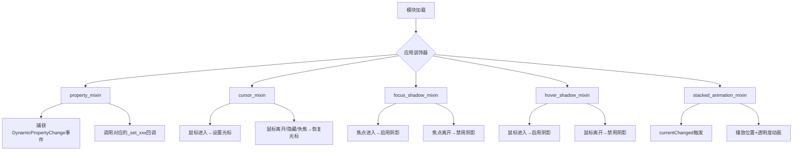
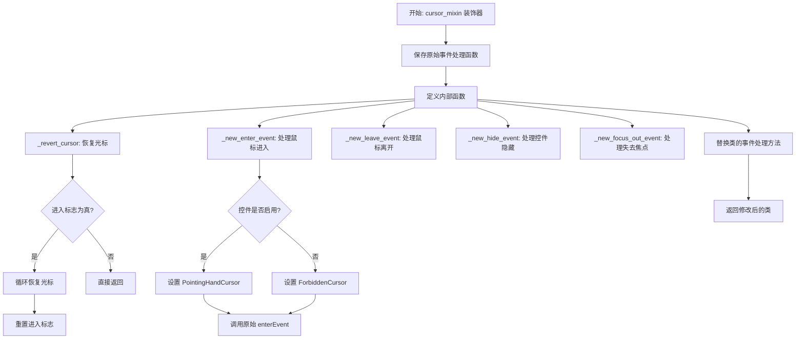
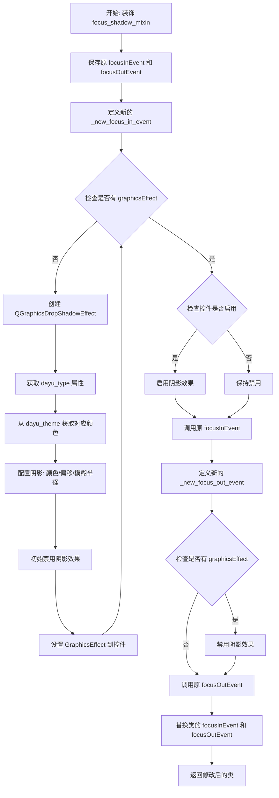
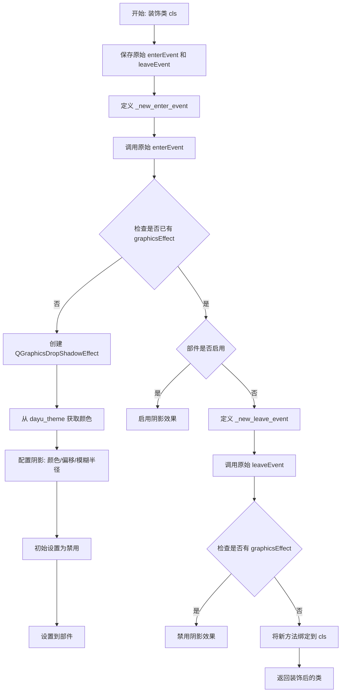
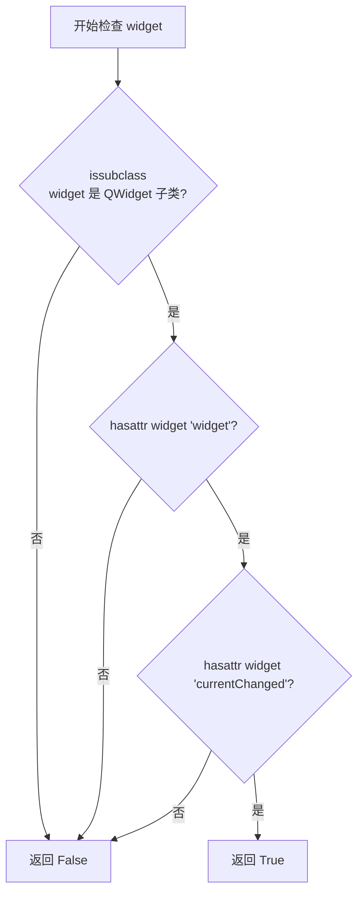

# `comic-translate\app\ui\dayu_widgets\mixin.py` 详细设计文档

该模块定义了一系列Python装饰器（mixin），用于为PySide6 Qt widgets添加各类UI交互功能，包括动态属性变化响应、鼠标光标样式切换（进入时显示PointingHandCursor，禁用时显示ForbiddenCursor）、焦点/悬停阴影效果、堆叠窗口切换动画等，无需修改原始Qt组件代码即可增强其表现行为。

## 整体流程



## 类结构

```
该模块无传统类层次结构，采用函数式装饰器模式
所有功能通过装饰器函数实现
辅助函数_stackable用于类型检查
```

## 全局变量及字段


### `QtCore`
    
PySide6 的 QtCore 模块，提供核心非 GUI 功能（如信号、属性、事件等）。

类型：`module`
    


### `QtGui`
    
PySide6 的 QtGui 模块，提供 2D 图形和 GUI 基础类。

类型：`module`
    


### `QtWidgets`
    
PySide6 的 QtWidgets 模块，提供常用 UI 组件（按钮、菜单、对话框等）。

类型：`module`
    


### `dayu_theme`
    
本地模块，用于定义主题颜色及相关常量。

类型：`module`
    


    

## 全局函数及方法


### `property_mixin`

该装饰器用于为 Qt 类添加动态属性变化处理功能。当 Qt 对象的动态属性值发生变化时，会自动调用类中对应的 `_set_{属性名}` 方法进行处理。

参数：

- `cls`：需要添加动态属性处理功能的类（Class）

返回值：`cls`，装饰器修改后的类对象

#### 流程图

```mermaid
flowchart TD
    A[开始] --> B[接收类 cls]
    B --> C[定义新方法 _new_event]
    C --> D{事件类型是否为<br/>DynamicPropertyChange?}
    D -->|否| E[调用原始 event 方法]
    D -->|是| F[获取属性名 prp]
    F --> G{类是否有<br/>_set_{prp} 方法?}
    G -->|否| E
    G -->|是| H[获取回调函数 callback]
    H --> I[调用 callback<br/>传入属性值]
    I --> E
    E --> J[返回结果]
    J --> K[使用 setattr 将 _new_event<br/>设置为类的 event 方法]
    K --> L[返回修改后的类]
```

#### 带注释源码

```python
def property_mixin(cls):
    """Run function after dynamic property value changed"""
    # 定义内部函数 _new_event，用于替换类的 event 方法
    def _new_event(self, event):
        # 检查事件类型是否为动态属性变化事件
        if event.type() == QtCore.QEvent.DynamicPropertyChange:
            # 获取属性名并进行解码（从字节转换为字符串）
            prp = event.propertyName().data().decode()
            # 检查实例是否有对应的 setter 方法（命名格式：_set_{属性名}）
            if hasattr(self, "_set_{}".format(prp)):
                # 通过反射获取 setter 方法
                callback = getattr(self, "_set_{}".format(prp))
                # 调用 setter 方法，传入当前属性值
                callback(self.property(str(prp)))
        # 调用父类的 event 方法处理其他事件
        return super(cls, self).event(event)

    # 使用 setattr 将新定义的 event 方法替换类的原有 event 方法
    setattr(cls, "event", _new_event)
    # 返回修改后的类
    return cls
```


### cursor_mixin

该装饰器用于动态修改 Qt 控件的鼠标光标样式。当鼠标进入控件时，根据控件是否启用将光标设置为指向手型（PointingHandCursor）或禁止光标（ForbiddenCursor）；当鼠标离开、控件隐藏或失去焦点时，恢复默认光标。

参数：

- `cls`：`type`，要应用光标样式装饰器的 Qt 控件类（通常为 `QtWidgets.QWidget` 的子类）

返回值：`type`，返回修改后的类（添加了自定义光标处理逻辑的类）

#### 流程图



#### 带注释源码

```python
def cursor_mixin(cls):
    """
    Change Widget cursor:
    when user mouse in: Qt.PointingHandCursor;
    when widget is disabled and mouse in: Qt.ForbiddenCursor
    """
    # 1. 保存原始的事件处理函数，以便在装饰后仍然调用它们
    old_enter_event = cls.enterEvent      # 保存原始的鼠标进入事件处理函数
    old_leave_event = cls.leaveEvent      # 保存原始的鼠标离开事件处理函数
    old_hide_event = cls.hideEvent       # 保存原始的控件隐藏事件处理函数
    old_focus_out_event = cls.focusOutEvent  # 保存原始的失去焦点事件处理函数

    # 2. 定义内部函数 _revert_cursor：用于恢复光标到默认状态
    def _revert_cursor(self):
        """
        恢复光标到默认状态
        使用 __dayu_enter 标志记录鼠标是否进入过控件
        使用 __dayu_enter_count 计数器处理嵌套的光标设置
        """
        # 检查是否曾进入过该控件
        if self.__dict__.get("__dayu_enter", False):
            # 循环恢复所有被覆盖的光标
            while self.__dict__.get("__dayu_enter_count", 0) > 0:
                QtWidgets.QApplication.restoreOverrideCursor()
                self.__dict__.update({
                    "__dayu_enter_count": self.__dict__.get("__dayu_enter_count", 0) - 1
                })
            # 重置进入标志
            self.__dict__.update({"__dayu_enter": False})

    # 3. 定义内部函数 _new_enter_event：处理鼠标进入事件
    def _new_enter_event(self, *args, **kwargs):
        """
        新的鼠标进入事件处理函数
        根据控件启用状态设置相应的光标样式
        """
        # 标记鼠标已进入控件，并增加光标覆盖计数
        self.__dict__.update({"__dayu_enter": True})
        self.__dict__.update({
            "__dayu_enter_count": self.__dict__.get("__dayu_enter_count", 0) + 1
        })
        # 根据控件是否启用设置光标：启用时为指向手型，否则为禁止光标
        QtWidgets.QApplication.setOverrideCursor(
            QtCore.Qt.PointingHandCursor if self.isEnabled() else QtCore.Qt.ForbiddenCursor
        )
        # 调用原始的鼠标进入事件处理函数，保持原有功能
        return old_enter_event(self, *args, **kwargs)

    # 4. 定义内部函数 _new_leave_event：处理鼠标离开事件
    def _new_leave_event(self, *args, **kwargs):
        """
        新的鼠标离开事件处理函数
        恢复光标后调用原始的离开事件处理函数
        """
        _revert_cursor(self)  # 先恢复光标
        return old_leave_event(self, *args, **kwargs)  # 再调用原始函数

    # 5. 定义内部函数 _new_hide_event：处理控件隐藏事件
    def _new_hide_event(self, *args, **kwargs):
        """
        新的控件隐藏事件处理函数
        隐藏控件时也需要恢复光标
        """
        _revert_cursor(self)  # 恢复光标
        return old_hide_event(self, *args, **kwargs)  # 调用原始函数

    # 6. 定义内部函数 _new_focus_out_event：处理失去焦点事件
    def _new_focus_out_event(self, *args, **kwargs):
        """
        新的失去焦点事件处理函数
        控件失去焦点时恢复光标
        """
        _revert_cursor(self)  # 恢复光标
        return old_focus_out_event(self, *args, **kwargs)  # 调用原始函数

    # 7. 将新的事件处理函数替换类的原有方法
    cls.enterEvent = _new_enter_event     # 替换鼠标进入事件
    cls.leaveEvent = _new_leave_event     # 替换鼠标离开事件
    cls.hideEvent = _new_hide_event       # 替换控件隐藏事件
    cls.focusOutEvent = _new_focus_out_event  # 替换失去焦点事件
    
    # 8. 返回修改后的类
    return cls
```


### `focus_shadow_mixin`

该装饰器用于给Qt控件类添加焦点阴影效果。当控件获得焦点（focus in）时启用阴影效果，失去焦点（focus out）时禁用阴影效果。

参数：

-  `cls`：`class`，需要添加焦点阴影效果的Qt控件类

返回值：`class`，返回修改后的类，添加了焦点阴影事件处理

#### 流程图



#### 带注释源码

```python
def focus_shadow_mixin(cls):
    """
    Add shadow effect for decorated class when widget focused
    When focus in target widget, enable shadow effect.
    When focus out target widget, disable shadow effect.
    """
    # 保存原始的 focusInEvent 和 focusOutEvent 方法
    old_focus_in_event = cls.focusInEvent
    old_focus_out_event = cls.focusOutEvent

    def _new_focus_in_event(self, *args, **kwargs):
        """
        新的焦点进入事件处理函数
        1. 先调用原始的 focusInEvent
        2. 检查是否已有 graphicsEffect
        3. 如果没有则创建阴影效果
        4. 如果控件启用则显示阴影
        """
        # 先调用原始的焦点进入事件处理
        old_focus_in_event(self, *args, **kwargs)
        
        # 检查控件是否已有图形效果
        if not self.graphicsEffect():
            # 动态导入本地模块获取主题颜色
            from . import dayu_theme

            # 创建_drop阴影效果对象
            shadow_effect = QtWidgets.QGraphicsDropShadowEffect(self)
            
            # 获取控件的 dayu_type 属性确定颜色类型
            dayu_type = self.property("dayu_type")
            
            # 从主题模块获取对应类型的颜色，默认使用 primary 颜色
            color = vars(dayu_theme).get("{}_color".format(dayu_type or "primary"))
            
            # 设置阴影颜色
            shadow_effect.setColor(QtGui.QColor(color))
            
            # 设置阴影偏移为0，表示四周均匀扩散
            shadow_effect.setOffset(0, 0)
            
            # 设置阴影模糊半径为5像素
            shadow_effect.setBlurRadius(5)
            
            # 初始禁用阴影效果（等待焦点触发）
            shadow_effect.setEnabled(False)
            
            # 将阴影效果应用到控件
            self.setGraphicsEffect(shadow_effect)
        
        # 只有在控件启用状态时才显示阴影效果
        if self.isEnabled():
            self.graphicsEffect().setEnabled(True)

    def _new_focus_out_event(self, *args, **kwargs):
        """
        新的焦点离开事件处理函数
        1. 先调用原始的 focusOutEvent
        2. 如果有 graphicsEffect 则禁用阴影
        """
        # 先调用原始的焦点离开事件处理
        old_focus_out_event(self, *args, **kwargs)
        
        # 检查控件是否有图形效果
        if self.graphicsEffect():
            # 禁用阴影效果
            self.graphicsEffect().setEnabled(False)

    # 使用 setattr 替换类的焦点事件方法
    setattr(cls, "focusInEvent", _new_focus_in_event)
    setattr(cls, "focusOutEvent", _new_focus_out_event)
    return cls
```


### `hover_shadow_mixin`

给 Qt 部件添加悬停阴影效果的装饰器。当鼠标进入目标部件时启用阴影效果，当鼠标离开目标部件时禁用阴影效果。

参数：

- `cls`：`class`，需要添加悬停阴影效果的 Qt 部件类

返回值：`class`，装饰后的类（添加了悬停阴影功能）

#### 流程图



#### 带注释源码

```python
def hover_shadow_mixin(cls):
    """
    Add shadow effect for decorated class when widget hovered
    当鼠标进入目标部件时，启用阴影效果。
    当鼠标离开目标部件时，禁用阴影效果。
    """
    # 保存原始的 enterEvent 和 leaveEvent 方法
    old_enter_event = cls.enterEvent
    old_leave_event = cls.leaveEvent

    def _new_enter_event(self, *args, **kwargs):
        """新的鼠标进入事件处理函数"""
        # 先调用原始的 enterEvent
        old_enter_event(self, *args, **kwargs)
        
        # 如果部件还没有图形效果，则创建阴影效果
        if not self.graphicsEffect():
            # 导入本地模块
            from . import dayu_theme

            # 创建 DropShadow 效果
            shadow_effect = QtWidgets.QGraphicsDropShadowEffect(self)
            
            # 获取部件的 type 属性来确定颜色
            dayu_type = self.property("type")
            # 从 dayu_theme 获取对应类型的颜色，默认使用 primary
            color = vars(dayu_theme).get("{}_color".format(dayu_type or "primary"))
            
            # 配置阴影效果参数
            shadow_effect.setColor(QtGui.QColor(color))  # 设置阴影颜色
            shadow_effect.setOffset(0, 0)                 # 设置偏移（无偏移）
            shadow_effect.setBlurRadius(5)                # 设置模糊半径
            shadow_effect.setEnabled(False)               # 初始禁用阴影
            
            # 将阴影效果应用到部件
            self.setGraphicsEffect(shadow_effect)
        
        # 如果部件处于启用状态，则启用阴影效果
        if self.isEnabled():
            self.graphicsEffect().setEnabled(True)

    def _new_leave_event(self, *args, **kwargs):
        """新的鼠标离开事件处理函数"""
        # 先调用原始的 leaveEvent
        old_leave_event(self, *args, **kwargs)
        
        # 如果存在图形效果，则禁用阴影
        if self.graphicsEffect():
            self.graphicsEffect().setEnabled(False)

    # 使用 setattr 将新的事件处理函数绑定到类
    setattr(cls, "enterEvent", _new_enter_event)
    setattr(cls, "leaveEvent", _new_leave_event)
    return cls
```


### `stacked_animation_mixin`

该函数是一个装饰器，用于为堆叠窗口组件（如 QTabWidget、QStackedWidget）添加切换动画效果。当当前页面改变时，显示透明度（opacity）和位置（position）动画。

参数：

- `cls`：`type`，要装饰的类，必须是支持堆叠的 Qt 窗口小部件类（如 QTabWidget、QStackedWidget）

返回值：`type`，返回修改后的类，如果输入类不支持堆叠则返回原始类

#### 流程图

```mermaid
flowchart TD
    A[开始: 装饰 stacked_animation_mixin] --> B{检查类是否可堆叠<br/>_stackable(cls)}
    B -->|不可堆叠| C[返回原始类 cls]
    B -->|可堆叠| D[保存原始 __init__ 方法]
    D --> E[创建新的 __init__ 方法 _new_init]
    E --> F[初始化动画属性<br/>_previous_index, 位置动画, 透明度动画]
    F --> G[连接 currentChanged 信号到 _play_anim]
    G --> H[创建 _play_anim 方法]
    H --> I[创建 _disable_opacity 方法]
    I --> J[使用 setattr 替换类方法<br/>__init__, _play_anim, _disable_opacity]
    J --> K[返回修改后的类]
```

#### 带注释源码

```python
def stacked_animation_mixin(cls):
    """
    Decorator for stacked widget.
    When Stacked widget currentChanged, show opacity and position animation for current widget.
    """
    # 检查输入的类是否为可堆叠的窗口组件
    # 可堆叠组件需满足：是 QWidget 子类，且具有 widget 方法和 currentChanged 信号
    if not _stackable(cls):  # If widget can't stack, return the original widget class
        return cls
    
    # 保存原始的初始化方法
    old_init = cls.__init__

    def _new_init(self, *args, **kwargs):
        """
        新的初始化方法，为堆叠组件添加动画相关属性和连接信号
        """
        # 调用原始初始化方法
        old_init(self, *args, **kwargs)
        
        # 记录前一个显示的页面索引
        self._previous_index = 0
        
        # 创建显示时的位置动画（从右侧滑入）
        self._to_show_pos_ani = QtCore.QPropertyAnimation()
        self._to_show_pos_ani.setDuration(400)  # 动画持续400毫秒
        self._to_show_pos_ani.setPropertyName(b"pos")  # 动画属性为位置
        self._to_show_pos_ani.setEndValue(QtCore.QPoint(0, 0))  # 结束位置为原点
        self._to_show_pos_ani.setEasingCurve(QtCore.QEasingCurve.OutCubic)  # 缓动曲线
        
        # 创建隐藏时的位置动画（向左侧滑出）
        self._to_hide_pos_ani = QtCore.QPropertyAnimation()
        self._to_hide_pos_ani.setDuration(400)
        self._to_hide_pos_ani.setPropertyName(b"pos")
        self._to_hide_pos_ani.setEndValue(QtCore.QPoint(0, 0))
        self._to_hide_pos_ani.setEasingCurve(QtCore.QEasingCurve.OutCubic)
        
        # 创建透明度效果和动画
        self._opacity_eff = QtWidgets.QGraphicsOpacityEffect()
        self._opacity_ani = QtCore.QPropertyAnimation()
        self._opacity_ani.setDuration(400)
        self._opacity_ani.setEasingCurve(QtCore.QEasingCurve.InCubic)
        self._opacity_ani.setPropertyName(b"opacity")
        self._opacity_ani.setStartValue(0.0)  # 起始透明度为0
        self._opacity_ani.setEndValue(1.0)    # 结束透明度为1
        self._opacity_ani.setTargetObject(self._opacity_eff)
        
        # 动画结束后禁用透明度效果，避免与子控件冲突导致崩溃
        self._opacity_ani.finished.connect(self._disable_opacity)
        
        # 连接页面切换信号到动画播放方法
        self.currentChanged.connect(self._play_anim)

    def _play_anim(self, index):
        """
        播放切换动画
        参数: index - 切换到的页面索引
        """
        # 获取即将显示的窗口部件
        current_widget = self.widget(index)
        
        # 根据切换方向选择动画效果
        if self._previous_index < index:
            # 正向切换（页码增大）：从右侧滑入
            self._to_show_pos_ani.setStartValue(QtCore.QPoint(self.width(), 0))
            self._to_show_pos_ani.setTargetObject(current_widget)
            self._to_show_pos_ani.start()
        else:
            # 反向切换（页码减小）：从左侧滑入
            self._to_hide_pos_ani.setStartValue(QtCore.QPoint(-self.width(), 0))
            self._to_hide_pos_ani.setTargetObject(current_widget)
            self._to_hide_pos_ani.start()
        
        # 设置透明度效果到当前部件并启用
        current_widget.setGraphicsEffect(self._opacity_eff)
        current_widget.graphicsEffect().setEnabled(True)
        
        # 播放透明度渐显动画
        self._opacity_ani.start()
        
        # 更新前一个页面索引
        self._previous_index = index

    def _disable_opacity(self):
        """
        动画播放完成后禁用透明度效果
        原因：如果不关闭效果，会与子控件的 effect 或 paintEvent 冲突引起崩溃
        QPainter::begin: A paint device can only be painted by one painter at a time.
        """
        self.currentWidget().graphicsEffect().setEnabled(False)

    # 使用 setattr 将新方法绑定到类上
    setattr(cls, "__init__", _new_init)
    setattr(cls, "_play_anim", _play_anim)
    setattr(cls, "_disable_opacity", _disable_opacity)
    return cls
```


### `_stackable`

用于检查 widget 是否可堆叠的内部函数，主要供 `stacked_animation_mixin` 装饰器使用，以确定是否为 widget 添加堆叠动画功能。

参数：

- `widget`：`type`，待检查的 widget 类（通常为 QTabWidget 或 QStackedWidget 的子类）

返回值：`bool`，如果 widget 可堆叠（是 QWidget 子类且具有 `widget` 和 `currentChanged` 属性）则返回 True，否则返回 False

#### 流程图



#### 带注释源码

```python
def _stackable(widget):
    """Used for stacked_animation_mixin to only add mixin for widget who can stacked."""
    # 注释说明：
    # 1. 使用 widget() 方法获取当前 widget
    # 2. 使用 currentChanged 信号来触发动画
    # 3. 目前只有 QTabWidget 和 QStackedWidget 可以使用此装饰器
    
    # 检查逻辑：
    # 1. widget 必须是 QtWidgets.QWidget 的子类
    # 2. widget 必须具有 'widget' 方法（用于获取子widget）
    # 3. widget 必须具有 'currentChanged' 信号（用于监听切换事件）
    return issubclass(widget, QtWidgets.QWidget) and hasattr(widget, "widget") and hasattr(widget, "currentChanged")
```

## 关键组件


### property_mixin

动态属性变更处理装饰器，监听Qt的DynamicPropertyChange事件，当动态属性值变化时自动调用对应的_set_{属性名}方法进行回调处理。

### cursor_mixin

鼠标光标管理装饰器，当鼠标进入控件时设置PointingHandCursor（启用状态）或ForbiddenCursor（禁用状态），离开时恢复光标。

### focus_shadow_mixin

焦点阴影效果装饰器，当控件获得焦点时启用QGraphicsDropShadowEffect阴影效果，失去焦点时禁用。

### hover_shadow_mixin

悬停阴影效果装饰器，当鼠标悬停在控件上时启用阴影效果，离开时禁用。

### stacked_animation_mixin

堆叠窗口动画装饰器，为QTabWidget和QStackedWidget添加切换页面时的位移动画和透明度动画效果。

### _stackable

辅助判断函数，用于判断widget类是否支持堆叠功能（必须是QWidget子类且具有widget方法和currentChanged信号）。


## 问题及建议


### 已知问题

-   **光标计数逻辑风险**：`cursor_mixin`中使用`__dayu_enter_count`来跟踪光标恢复次数，但在极端情况下（如快速连续触发enter/leave事件）可能导致计数不匹配，造成光标未正确恢复。
-   **重复代码**：`focus_shadow_mixin`与`hover_shadow_mixin`中存在大量重复的阴影效果创建逻辑（约20行重复代码），违反DRY原则。
-   **硬编码值**：动画持续时间（400ms）、阴影模糊半径（5）等参数硬编码在各处，修改时需要多处改动，缺乏可配置性。
-   **性能问题**：每次进入/获得焦点时都调用`graphicsEffect()`检查阴影是否存在，但后续创建阴影时未复用已有对象，可能造成资源浪费。
-   **异常处理缺失**：`property_mixin`中`event.propertyName().data().decode()`调用没有空值检查，`hasattr(self, "_set_{}".format(prp))`可能在属性名包含特殊字符时失败。
-   **内存管理风险**：`stacked_animation_mixin`中创建的`QPropertyAnimation`和`QGraphicsOpacityEffect`对象未显式管理生命周期，长期使用可能导致内存泄漏。
-   **魔法字符串**：`"dayu_type"`、`"type"`、"`_color`"等字符串散布在代码中，应提取为常量便于维护。
-   **导入位置风险**：`focus_shadow_mixin`和`hover_shadow_mixin`中的`from . import dayu_theme`在函数内部导入，若模块加载顺序出问题会导致运行时错误。
-   **边界条件处理不足**：`_stackable`函数仅检查`widget`和`currentChanged`属性，未验证`widget`方法是否可调用。
-   **动画状态未检查**：`stacked_animation_mixin`的`_play_anim`方法未检查动画是否已在运行，连续快速切换页面可能导致动画冲突或异常。

### 优化建议

-   **提取公共逻辑**：将`focus_shadow_mixin`和`hover_shadow_mixin`中的阴影创建逻辑抽取为私有方法` _create_shadow_effect(self, property_name)`，减少重复代码。
-   **参数化配置**：为装饰器添加可选参数，如`@hover_shadow_mixin(duration=400, blur_radius=5)`，或在模块级别定义配置常量。
-   **增强异常处理**：在`property_mixin`中添加try-except捕获解码异常；在阴影效果创建前检查`property`返回值是否为None。
-   **优化导入**：将`dayu_theme`的导入移至模块顶部，或使用延迟导入模式并在导入失败时提供明确错误信息。
-   **使用常量替代魔法字符串**：在模块顶部定义`DAYU_TYPE_PROPERTY = "dayu_type"`、`TYPE_PROPERTY = "type"`等常量。
-   **添加状态检查**：在`_play_anim`中检查`self._to_show_pos_ani.state() == QtCore.QAbstractAnimation.Running`避免重复启动动画。
-   **资源清理**：在装饰的类中添加析构函数或在适当时机显式停止并删除动画对象。
-   **类型注解**：为函数参数和返回值添加类型注解，提高代码可读性和IDE支持。
-   **简化super调用**：将`super(cls, self).event(event)`改为Python 3风格的`super().event(event)`。
-   **添加文档字符串**：为内部函数`_stackable`、内部方法`_play_anim`等添加docstring说明功能。


## 其它


### 设计目标与约束

本模块旨在通过mixin装饰器模式为PySide6 Qt组件提供可复用的功能扩展，包括动态属性处理、光标管理、阴影效果和动画效果。设计约束包括：仅支持PySide6框架，要求Python 3.x环境，装饰器仅对QWidget及其子类有效，且部分装饰器（如stacked_animation_mixin）仅适用于QTabWidget和QStackedWidget等具有widget方法和currentChanged信号的组件。

### 错误处理与异常设计

本模块主要采用防御性编程策略。在property_mixin中，通过hasattr检查回调方法是否存在来避免AttributeError；在cursor_mixin中使用__dict__.get安全访问私有属性防止KeyError；在shadow相关mixin中，先通过graphicsEffect()检查效果是否已存在再进行操作。若装饰器应用于不支持的widget类，stacked_animation_mixin会直接返回原类而不抛出异常。模块未定义自定义异常类，异常通常沿用Python内置异常或Qt原生异常。

### 数据流与状态机

本模块不涉及复杂的状态机设计，主要数据流如下：cursor_mixin通过__dayu_enter和__dayu_enter_count两个私有字典键管理光标状态，_revert_cursor方法负责状态重置；focus_shadow_mixin和hover_shadow_mixin通过graphicsEffect对象的状态（enabled/disabled）控制阴影显示；stacked_animation_mixin通过_previous_index记录上一个页面索引以判断动画方向。所有状态均为实例级随生命周期管理，无持久化需求。

### 外部依赖与接口契约

本模块直接依赖PySide6的QtCore、QtGui和QtWidgets三个子模块，间接依赖dayu_theme模块（用于获取主题颜色值）。外部接口契约包括：property_mixin要求被装饰类继承自QObject且支持DynamicPropertyChange事件；cursor_mixin要求被装饰类实现enterEvent、leaveEvent、hideEvent和focusOutEvent方法；focus_shadow_mixin要求被装饰类实现focusInEvent和focusOutEvent方法；hover_shadow_mixin要求被装饰类实现enterEvent和leaveEvent方法；stacked_animation_mixin要求被装饰类具有widget()方法和currentChanged信号。所有装饰器均以类为参数并返回修改后的类。

### 性能考虑与优化空间

当前实现存在以下性能问题或优化空间：cursor_mixin中使用while循环逐次restoreOverrideCursor效率较低，可考虑直接重置计数；shadow效果在每次enterEvent时都检查graphicsEffect是否存在，可缓存判断结果；stacked_animation_mixin每次页面切换都创建新的QGraphicsOpacityEffect对象，应复用单一实例；property_mixin中每次事件都执行hasattr和getattr查询，宜将回调方法缓存至实例属性。此外，shadow相关的颜色查询使用了vars(dayu_theme)和字符串格式化，建议在模块初始化时建立颜色映射表以减少运行时查询。

### 兼容性说明

本模块仅在Python 3环境下测试，兼容PySide6各版本。由于使用了__dict__直接操作实例私有属性，可能与某些Qt绑定实现（如PyQt6）不兼容。装饰器通过setattr动态添加方法的方式可能在某些元类场景下失效。模块依赖的dayu_theme模块需提前初始化，否则会导致ImportError。

### 使用示例与调用流程

典型使用流程为：导入模块后，使用@decorator语法或decorator(cls)方式应用于Qt widget类。例如：@property_mixin类需定义_set_xxx方法处理动态属性xxx的变化；@cursor_mixin自动处理鼠标进入/离开/隐藏/失焦时的光标切换；@focus_shadow_mixin要求设置dayu_type属性指定主题色；@hover_shadow_mixin要求设置type属性；@stacked_animation_mixin直接装饰QTabWidget或QStackedWidget子类即可启用页面切换动画。

### 测试建议

建议为每个装饰器编写单元测试：property_mixin测试动态属性变化时回调是否被正确触发；cursor_mixin测试启用/禁用状态下的光标类型切换以及多次进入/离开的计数平衡；focus_shadow_mixin和hover_shadow_mixin测试焦点/悬停状态切换时阴影效果的状态变化；stacked_animation_mixin测试正向/反向页面切换时的动画方向以及连续切换时的行为正确性。Mock测试需模拟Qt事件和信号触发。

### 版本演进与历史信息

当前代码版本为2019.3，由Mu yanru编写维护。代码保留了future模块导入以兼容Python 2/3，但实际仅支持Python 3。文件头部包含标准的Apache 2.0风格版权声明（虽然License字段未明确写出）。模块从最初的单一装饰器逐步演进为包含5个功能独立但可组合使用的装饰器集合，体现了良好的单一职责原则。

    