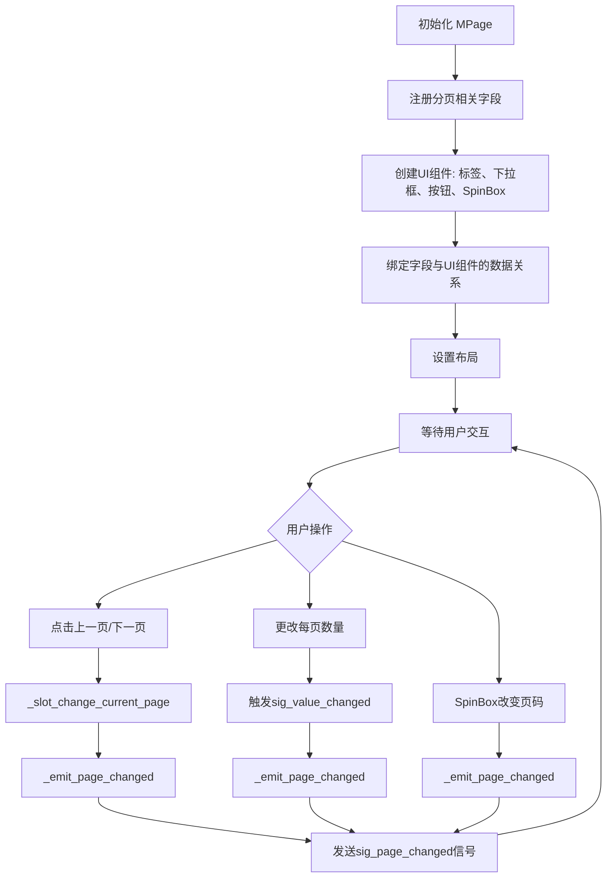
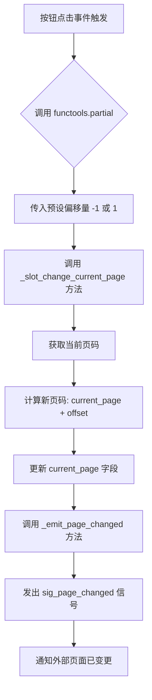
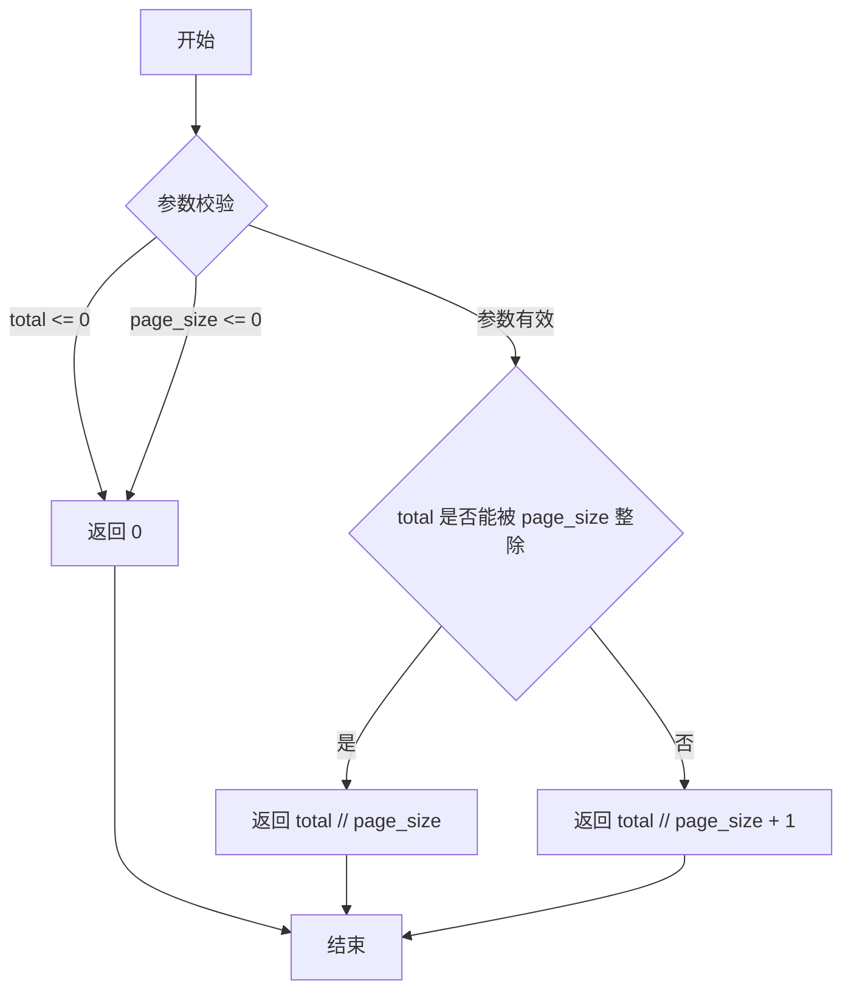
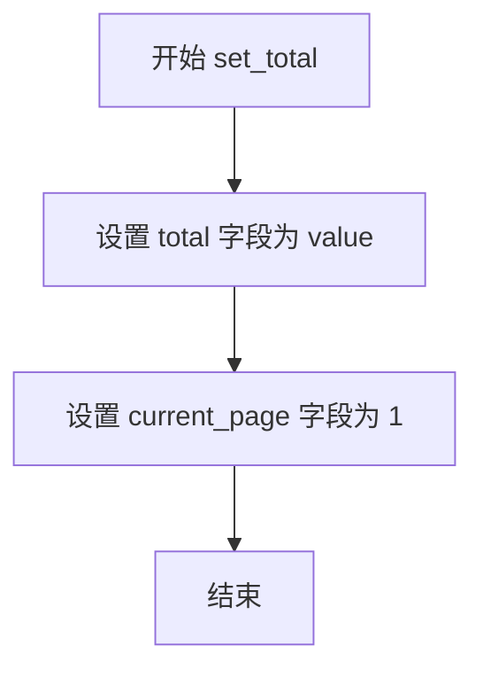

# `comic-translate\app\ui\dayu_widgets\page.py` 详细设计文档

MPage是一个Qt分页组件控件，用于将长列表数据分页显示，支持每页显示数量选择、页码跳转、上一页/下一页导航等功能，提供友好的分页用户界面。

## 整体流程



## 类结构

```
QtWidgets.QWidget (Qt基类)
└── MPage (分页组件)
    └── MFieldMixin (混入类)

UI组件依赖:
├── MComboBox (下拉框)
├── MLabel (标签)
├── MMenu (菜单)
├── MSpinBox (数字输入框)
└── MToolButton (工具按钮)
```

## 全局变量及字段


### `sig_page_changed`
    
页码变化信号，当页面大小或当前页码改变时发出

类型：`QtCore.Signal(int, int)`
    


### `page_size_selected`
    
当前选择的每页显示数量

类型：`int`
    


### `page_size_list`
    
每页显示数量选项列表，包含多种可选的每页记录数配置

类型：`list`
    


### `total`
    
总记录数，即数据集中的总条目数量

类型：`int`
    


### `current_page`
    
当前页码，表示当前正在查看的页面编号

类型：`int`
    


### `total_page`
    
总页数(计算字段)，根据总记录数和每页数量自动计算得出

类型：`int`
    


### `total_page_text`
    
总页数文本显示，用于界面展示的总页数字符串

类型：`str`
    


### `display_text`
    
显示文本(如: 第1页，共10页)，展示当前分页状态的可读文本

类型：`str`
    


### `can_pre`
    
是否可以上一页，指示当前是否允许切换到前一页

类型：`bool`
    


### `can_next`
    
是否可以下一页，指示当前是否允许切换到后一页

类型：`bool`
    


### `_display_label`
    
显示文本标签，用于展示分页状态信息

类型：`MLabel`
    


### `_change_page_size_button`
    
每页数量选择下拉框，允许用户选择每页显示的记录数

类型：`MComboBox`
    


### `_pre_button`
    
上一页按钮，提供导航到前一页的用户交互控件

类型：`MToolButton`
    


### `_next_button`
    
下一页按钮，提供导航到后一页的用户交互控件

类型：`MToolButton`
    


### `_current_page_spin_box`
    
页码输入框，允许用户直接输入目标页码进行跳转

类型：`MSpinBox`
    


### `_total_page_label`
    
总页数显示标签，用于展示计算得出的总页数

类型：`MLabel`
    


### `main_lay`
    
主水平布局，管理页面组件的整体水平排布

类型：`QHBoxLayout`
    


### `QtWidgets.QWidget, MFieldMixin.MPage`
    
分页组件，用于将长列表分成多页，支持动态调整每页显示数量和页码导航

类型：`class`
    
    

## 全局函数及方法


### `MPage._slot_change_current_page`

该方法是 MPage 类的内部方法，用于处理上一页/下一页按钮的点击事件。通过 functools.partial 绑定偏移量参数，实现点击按钮时增加或减少当前页码。

参数：

- `offset`：`int`，页码偏移量，-1 表示上一页，1 表示下一页

返回值：`None`，无返回值，仅更新当前页码状态并触发页面变更信号

#### 流程图



#### 带注释源码

```python
def _slot_change_current_page(self, offset):
    """
    处理上一页/下一页按钮点击事件
    
    参数:
        offset: 页码偏移量
                -1: 上一页
                 1: 下一页
    
    该方法通过 functools.partial 绑定到按钮的 clicked 信号:
    - self._pre_button.clicked.connect(functools.partial(self._slot_change_current_page, -1))
    - self._next_button.clicked.connect(functools.partial(self._slot_change_current_page, 1))
    
    functools.partial 的作用:
    - 预设第二个参数 offset 为固定值 (-1 或 1)
    - 当按钮被点击时，只传递第一个参数 (self，即 MPage 实例)
    - 实际上创建了一个新的可调用对象，等同于:
      lambda: self._slot_change_current_page(-1) 或 lambda: self._slot_change_current_page(1)
    """
    # 获取当前页码并加上偏移量，计算新页码
    self.set_field("current_page", self.field("current_page") + offset)
    # 发出页面变更信号，通知外部当前页面配置已更新
    self._emit_page_changed()
```

#### functools.partial 绑定上下文说明

```python
# 绑定上一页按钮：点击时调用 _slot_change_current_page(-1)
self._pre_button.clicked.connect(functools.partial(self._slot_change_current_page, -1))

# 绑定下一页按钮：点击时调用 _slot_change_current_page(1)
self._next_button.clicked.connect(functools.partial(self._slot_change_current_page, 1))

# functools.partial 的作用原理:
# functools.partial(func, *args, **kwargs)
# 创建一个部分函数，预设部分参数
# 当调用 partial(self._slot_change_current_page, -1)() 时
# 实际上执行的是 self._slot_change_current_page(-1)
```


### `utils.get_total_page`

计算总页数工具函数，根据总记录数和每页显示记录数计算总页数。

参数：

- `total`：`int`，总记录数
- `page_size`：`int`，每页显示的记录数

返回值：`int`，计算得到的总页数

#### 流程图



#### 带注释源码

```python
def get_total_page(total, page_size):
    """
    计算总页数
    
    参数:
        total: int, 总记录数
        page_size: int, 每页显示的记录数
    
    返回:
        int, 总页数
    """
    # 参数校验：如果总数或每页大小小于等于0，返回0
    if total <= 0 or page_size <= 0:
        return 0
    
    # 使用向上整除算法计算总页数
    # 例如：total=100, page_size=25 -> 4页
    # total=101, page_size=25 -> 5页
    return (total + page_size - 1) // page_size
```

#### 使用示例

```python
# 在 MPage 类中的调用方式
total_page = utils.get_total_page(self.field("total"), self.field("page_size_selected"))

# 示例
utils.get_total_page(100, 25)  # 返回 4
utils.get_total_page(101, 25)  # 返回 5
utils.get_total_page(0, 25)    # 返回 0
utils.get_total_page(100, 0)   # 返回 0
```


### `utils.get_page_display_string`

该函数是分页组件的核心辅助工具，用于生成在界面上展示的分页状态文本（如 "1-25 of 100" 或 "第 1 页，共 5 页"）。它接收当前页码、每页大小和总数据量作为输入，计算并返回一个格式化的字符串，供 `MPage` 组件中的标签（Label）使用。

参数：
- `current_page`：`int`，当前选中的页码（从 1 开始）。
- `page_size`：`int`，每页显示的记录条数。
- `total`：`int`，数据库中的总记录数。

返回值：`str`，格式化后的分页显示字符串，用于向用户展示当前数据范围。

#### 流程图

```mermaid
flowchart TD
    A([开始]) --> B{total == 0?}
    B -- 是 --> C[返回空字符串或'无数据']
    B -- 否 --> D[计算起始序号<br>start = (current_page - 1) \* page_size + 1]
    D --> E[计算结束序号<br>end = min(current_page \* page_size, total)]
    E --> F[拼接显示字符串<br>e.g. '{start}-{end} of {total}']
    F --> G([返回字符串])
```

#### 带注释源码

由于在提供的代码片段中仅包含该函数的**调用**（位于 `MPage` 类的 `__init__` 方法内），原始定义位于外部 `utils` 模块中未直接展示。以下为基于调用上下文反推的逻辑实现源码，以及在 `MPage` 中的调用示例。

**推断的实现逻辑：**

```python
def get_page_display_string(current_page, page_size, total):
    """
    生成并返回分页显示文本。

    参数:
        current_page (int): 当前页码。
        page_size (int): 每页显示的数量。
        total (int): 总数据量。

    返回:
        str: 格式化后的字符串。
    """
    # 边界处理：如果总数为0，则不显示范围
    if total == 0:
        return "0"  # 或者 "No Data"

    # 1. 计算当前页的起始序号 (例如第1页，起始为1)
    start_index = (current_page - 1) * page_size + 1
    
    # 2. 计算当前页的结束序号 (例如25，或者不足25时为total)
    end_index = min(current_page * page_size, total)
    
    # 3. 拼接并返回显示字符串，例如 "1 - 25 of 100"
    return "{start} - {end} of {total}".format(
        start=start_index,
        end=end_index,
        total=total
    )
```

**在 `MPage` 类中的调用源码：**

```python
# 位于 MPage.__init__ 方法中
# 注册一个计算字段 'display_text'，每当 current_page, page_size, total 变化时，
# 重新计算显示文本
self.register_field(
    "display_text",
    lambda: utils.get_page_display_string(
        self.field("current_page"),       # 获取当前页码
        self.field("page_size_selected"), # 获取当前选中的每页条数
        self.field("total")               # 获取总数据量
    ),
)

# 将计算出的 display_text 绑定到显示标签的 dayu_text 属性
self.bind("display_text", self._display_label, "dayu_text")
```


### `MPage.__init__`

初始化分页组件，创建分页 UI 并注册相关字段，用于实现长列表的分页加载功能。

参数：

- `parent`：`QtWidgets.QWidget`，父 widget，默认为 None

返回值：`None`，无返回值

#### 流程图

```mermaid
flowchart TD
    A[开始 __init__] --> B[调用super().__init__parent]
    B --> C[注册字段: page_size_selected=25]
    C --> D[注册字段: page_size_list 包含4个选项]
    D --> E[注册字段: total=0]
    E --> F[注册字段: current_page=0]
    F --> G[注册字段: total_page 计算字段]
    G --> H[注册字段: total_page_text 计算字段]
    H --> I[注册字段: display_text 计算字段]
    I --> J[注册字段: can_pre 计算字段]
    J --> K[注册字段: can_next 计算字段]
    K --> L[创建页面设置菜单 MMenu]
    L --> M[创建显示标签 MLabel]
    M --> N[创建页面大小选择器 MComboBox]
    N --> O[创建前后翻页按钮 MToolButton]
    O --> P[创建当前页码输入框 MSpinBox]
    P --> Q[创建总页数标签 MLabel]
    Q --> R[绑定字段到各组件]
    R --> S[连接信号与槽]
    S --> T[设置水平布局]
    T --> U[结束 __init__]
```

#### 带注释源码

```python
def __init__(self, parent=None):
    # 调用父类 QWidget 和 MFieldMixin 的初始化方法
    super(MPage, self).__init__(parent)
    
    # 注册页面大小选择字段，默认25条/页
    self.register_field("page_size_selected", 25)
    
    # 注册页面大小选项列表，包含4个预设选项
    self.register_field(
        "page_size_list",
        [
            {"label": "25 - Fastest", "value": 25},
            {"label": "50 - Fast", "value": 50},
            {"label": "75 - Medium", "value": 75},
            {"label": "100 - Slow", "value": 100},
        ],
    )
    
    # 注册总记录数字段
    self.register_field("total", 0)
    
    # 注册当前页码字段
    self.register_field("current_page", 0)
    
    # 注册总页数字段，通过工具函数计算
    self.register_field(
        "total_page",
        lambda: utils.get_total_page(self.field("total"), self.field("page_size_selected")),
    )
    
    # 注册总页数文本显示字段
    self.register_field("total_page_text", lambda: str(self.field("total_page")))
    
    # 注册显示文本字段，用于显示"显示 X-Y 条"
    self.register_field(
        "display_text",
        lambda: utils.get_page_display_string(
            self.field("current_page"),
            self.field("page_size_selected"),
            self.field("total"),
        ),
    )
    
    # 注册是否可以上一页的判断字段
    self.register_field("can_pre", lambda: self.field("current_page") > 1)
    
    # 注册是否可以下一页的判断字段
    self.register_field("can_next", lambda: self.field("current_page") < self.field("total_page"))
    
    # 创建页面设置菜单
    page_setting_menu = MMenu(parent=self)
    
    # 创建显示标签（如"1-25 of 100"）
    self._display_label = MLabel()
    self._display_label.setAlignment(QtCore.Qt.AlignCenter)
    
    # 创建页面大小选择下拉框
    self._change_page_size_button = MComboBox().small()
    self._change_page_size_button.set_menu(page_setting_menu)
    self._change_page_size_button.set_formatter(lambda x: "{} per page".format(x))

    # 创建上一页按钮
    self._pre_button = MToolButton().icon_only().svg("left_fill.svg").small()
    self._pre_button.clicked.connect(functools.partial(self._slot_change_current_page, -1))
    
    # 创建下一页按钮
    self._next_button = MToolButton().small().icon_only().svg("right_fill.svg")
    self._next_button.clicked.connect(functools.partial(self._slot_change_current_page, 1))
    
    # 创建当前页码输入框
    self._current_page_spin_box = MSpinBox()
    self._current_page_spin_box.setMinimum(1)
    self._current_page_spin_box.set_dayu_size(dayu_theme.small)
    self._current_page_spin_box.valueChanged.connect(self._emit_page_changed)
    
    # 创建总页数显示标签
    self._total_page_label = MLabel()

    # 绑定字段到各组件，实现双向数据绑定
    self.bind("page_size_list", page_setting_menu, "data")
    self.bind("page_size_selected", page_setting_menu, "value", signal="sig_value_changed")
    self.bind(
        "page_size_selected",
        self._change_page_size_button,
        "value",
        signal="sig_value_changed",
    )
    self.bind("current_page", self._current_page_spin_box, "value", signal="valueChanged")
    self.bind("total_page", self._current_page_spin_box, "maximum")
    self.bind("total_page_text", self._total_page_label, "dayu_text")
    self.bind("display_text", self._display_label, "dayu_text")
    self.bind("can_pre", self._pre_button, "enabled")
    self.bind("can_next", self._next_button, "enabled")

    # 页面大小改变时发出信号
    self._change_page_size_button.sig_value_changed.connect(self._emit_page_changed)

    # 设置水平布局
    main_lay = QtWidgets.QHBoxLayout()
    main_lay.setContentsMargins(0, 0, 0, 0)
    main_lay.setSpacing(2)
    main_lay.addStretch()
    main_lay.addWidget(self._display_label)
    main_lay.addStretch()
    main_lay.addWidget(MLabel("|").secondary())
    main_lay.addWidget(self._change_page_size_button)
    main_lay.addWidget(MLabel("|").secondary())
    main_lay.addWidget(self._pre_button)
    main_lay.addWidget(MLabel("Page"))
    main_lay.addWidget(self._current_page_spin_box)
    main_lay.addWidget(MLabel("/"))
    main_lay.addWidget(self._total_page_label)
    main_lay.addWidget(self._next_button)
    self.setLayout(main_lay)
```


### `MPage.set_total`

设置分页组件的总记录数，并将当前页重置为第一页。

参数：

- `self`：隐式参数，MPage 实例，表示分页组件本身
- `value`：`int`，要设置的总记录数值

返回值：`None`，该方法无返回值（Python 中未显式 return）

#### 流程图



#### 带注释源码

```python
def set_total(self, value):
    """Set page component total count."""
    # 将传入的总记录数 value 设置到 total 字段
    self.set_field("total", value)
    # 重置当前页码为第一页
    self.set_field("current_page", 1)
```


### `MPage._slot_change_current_page`

该方法是一个私有的槽函数（Slot），专门用于响应“上一页”和“下一页”按钮的点击事件。它接收一个整数类型的偏移量（offset），根据当前页码计算新的页码，更新 `current_page` 内部字段，并触发页面变更信号以通知数据层刷新显示内容。

参数：

- `self`：`MPage`，MPage 类的实例本身，包含分页控件的 UI 和状态。
- `offset`：`int`，页码变化的增量。通常传入 `-1` 表示上一页，`+1` 表示下一页。

返回值：`None`，该方法主要执行副作用（更新状态和发射信号），不返回任何数据。

#### 流程图

```mermaid
graph TD
    A[Start: 触发点击事件] --> B[获取当前页码: self.field('current_page')]
    B --> C[计算新页码: new_page = current_page + offset]
    C --> D[更新字段: self.set_field('current_page', new_page)]
    D --> E[调用内部方法: self._emit_page_changed]
    E --> F[发送信号: sig_page_changed.emit]
    F --> G[End: UI 和监听器更新]
```

#### 带注释源码

```python
def _slot_change_current_page(self, offset):
    """
    处理页码变化的槽函数。
    由 'functools.partial' 绑定到 _pre_button 和 _next_button 的 clicked 信号上。

    Args:
        offset (int): 页码偏移量，-1 为上一页，1 为下一页。
    """
    # 1. 从混合字段系统 (MFieldMixin) 中获取当前的页码
    current_page = self.field("current_page")

    # 2. 计算新的页码：当前页码 + 偏移量
    new_page = current_page + offset

    # 3. 将计算出的新页码写回字段系统。
    # 这会自动触发与 'current_page' 字段绑定的 UI 组件（如 MSpinBox）进行更新。
    self.set_field("current_page", new_page)

    # 4. 显式调用方法发送信号，通知外部（如表格组件）当前配置已变更，需要重新加载数据。
    self._emit_page_changed()
```


### `MPage.set_page_config`

设置分页组件的每页数量配置，接收一个数据列表并将其转换为标准格式后更新页面大小配置。

参数：

- `data_list`：`list`，需要设置的页面大小选项列表，可以是整数列表或字典列表

返回值：`None`，无返回值

#### 流程图

```mermaid
graph TD
    A[开始] --> B[接收 data_list 参数]
    B --> C[遍历 data_list 中的每个元素]
    C --> D{当前元素是否为整数类型?}
    D -->|是| E[将整数转换为字典格式<br/>{label: str(data), value: data}]
    D -->|否| F[保持元素原样不变]
    E --> G[将处理后的元素添加到新列表]
    F --> G
    G --> H{是否还有未处理的元素?}
    H -->|是| C
    H -->|否| I[调用 self.set_field 方法<br/>更新 page_size_list 字段]
    I --> J[结束]
```

#### 带注释源码

```python
def set_page_config(self, data_list):
    """Set page component per page settings."""
    # 遍历传入的数据列表，对每个元素进行处理
    self.set_field(
        "page_size_list",  # 字段名称：页面大小列表
        [  # 列表推导式处理每个元素
            {"label": str(data), "value": data} if isinstance(data, int) else data 
            # 如果元素是整数，转换为字典格式：label为字符串，value为原值
            # 如果元素已经是字典，则保持不变
            for data in data_list  # 遍历输入的data_list
        ],
    )
    # 调用set_field方法将处理后的列表设置为page_size_list字段的值
    # 该字段会自动触发与UI组件的绑定更新
```


### `MPage._emit_page_changed`

发送页码变化信号。当页面配置（页面大小或当前页码）发生改变时，触发 `sig_page_changed` 信号，将当前选中的页面大小和当前页码通知给外部监听者。

参数：

- `self`：`self`，MPage 实例本身，隐式参数，无需外部传入

返回值：`None`，无返回值，该方法通过 Qt 信号机制通知外部

#### 流程图

```mermaid
flowchart TD
    A[开始 _emit_page_changed] --> B[获取 page_size_selected 字段值]
    B --> C[获取 current_page 字段值]
    C --> D[发射 sig_page_changed 信号]
    D --> E[传递 (page_size_selected, current_page) 参数]
    E --> F[结束]
```

#### 带注释源码

```python
def _emit_page_changed(self):
    """
    发送页码变化信号。
    
    当页面大小或当前页码发生改变时，调用此方法通知外部监听者。
    通过 Qt 的信号机制，将当前页面配置（页面大小和页码）发送出去。
    """
    # 从 MFieldMixin 继承的 field() 方法获取当前选中的页面大小
    # 例如：25, 50, 75, 100 等
    page_size = self.field("page_size_selected")
    
    # 从 MFieldMixin 继承的 field() 方法获取当前页码
    # 从 1 开始计数
    current_page = self.field("current_page")
    
    # 发射 Qt 信号 sig_page_changed，传递 (页面大小, 当前页码) 元组
    # 外部可以通过连接此信号来响应分页变化
    # signal signature: sig_page_changed = QtCore.Signal(int, int)
    self.sig_page_changed.emit(page_size, current_page)
```

## 关键组件


### MPage类

分页组件核心类，继承自QtWidgets.QWidget和MFieldMixin，提供分页导航功能，支持每页条目数选择、页码跳转和上下页切换。

### sig_page_changed信号

页码变化时发出的信号，携带当前页码和每页条目数，用于通知外部数据刷新。

### page_size_selected字段

当前选中的每页显示条目数，默认值为25，支持25/50/75/100四种选项。

### page_size_list字段

分页配置列表，存储每页条目数的选项及其标签，用于构建页面大小选择菜单。

### total字段

数据总条目数，用于计算总页数和显示分页信息。

### current_page字段

当前显示的页码，从1开始，用于跟踪用户当前浏览的页面位置。

### total_page字段

计算属性，根据总条目数和每页条目数计算得出的总页数。

### display_text字段

计算属性，生成显示文本，描述当前页码和总条目数的关系。

### can_pre字段

计算属性，判断是否可以执行上一页操作，当前页码大于1时返回True。

### can_next字段

计算属性，判断是否可以执行下一页操作，当前页码小于总页数时返回True。

### _display_label组件

MLabel实例，显示当前分页状态信息，如"第X页，共Y条"等格式化文本。

### _change_page_size_button组件

MComboBox实例，页面大小选择器，提供每页显示条目数的下拉选择功能。

### _pre_button组件

MToolButton实例，上一页导航按钮，图标为left_fill.svg，点击向前翻页。

### _next_button组件

MToolButton实例，下一页导航按钮，图标为right_fill.svg，点击向后翻页。

### _current_page_spin_box组件

MSpinBox实例，页码输入框，允许用户直接输入目标页码进行跳转。

### _total_page_label组件

MLabel实例，显示总页数信息，与当前页码配合展示分页进度。

### set_total方法

设置数据总条目数，并自动重置当前页码为第一页，用于初始化或刷新分页数据。

### set_page_config方法

动态设置分页配置选项，支持传入整数列表或字典列表，灵活配置每页条目数选项。

### _slot_change_current_page方法

处理页码偏移操作，根据传入的偏移量（+1或-1）计算新页码并更新状态。

### _emit_page_changed方法

触发页码变化信号，将当前选中的页面大小和页码发送给订阅者。


## 问题及建议


### 已知问题

-   **信号与槽逻辑冗余**：代码中混合使用了 `bind` 方法（自动绑定）与手动 `connect`（如 `valueChanged`、`sig_value_changed`），这不仅增加了信号触发链的复杂性，还可能导致 `sig_page_changed` 信号被重复发射，难以追踪调试。
-   **国际化与硬编码问题**：UI 文本（如 "Page", "/", "per page" 以及分页下拉框中的 "Fastest", "Fast" 等）均采用硬编码字符串，缺乏对多语言环境的支持，影响组件的国际化适用性。
-   **代码封装不足**：`__init__` 方法职责过重，包含了字段注册、UI 创建、布局设置和信号绑定等大量逻辑，导致方法体过长（超 100 行），阅读和维护困难。
-   **数据校验缺失**：`set_total` 和 `set_page_config` 方法未对输入参数的类型和有效性（如负数、None、非法字典结构）进行校验，可能导致后续计算出错或界面异常。
-   **缺乏类型注解**：作为公共接口的方法（`set_total`, `set_page_config`）和信号（`sig_page_changed`）缺少 Python 类型提示，不利于静态分析工具和 IDE 的辅助功能。
-   **重复 UI 代码**：分隔符 `MLabel("|").secondary()` 在布局中被实例化了两次，存在代码重复。

### 优化建议

-   **统一信号管理**：建议梳理 `bind` 与手动连接的关系，尽量利用 `MFieldMixin` 的响应式机制处理数据同步。若需手动拦截信号，应明确注释其独立于 `bind` 的用途，避免逻辑混乱。
-   **重构初始化流程**：将 `__init__` 中的代码解耦，拆分为 `_register_fields()`、`_init_ui()`、`_setup_layout()`、`_bind_signals()` 等私有方法，提高代码可读性和可维护性。
-   **引入国际化（i18n）**：将所有界面文本替换为国际化函数调用（例如 `_("Page")`），将配置文本（如 "Fastest"）提取为常量或配置项。
-   **实现参数校验**：在 `set_total` 中增加 `isinstance(value, int) and value >= 0` 的检查；在 `set_page_config` 中校验列表项是否为 dict 且包含必要的 "label" 和 "value" 键。
-   **补充类型注解**：为公共方法添加类型提示（如 `def set_total(self, value: int) -> None: ...`），提升代码健壮性。
-   **消除重复代码**：将重复的分隔符 Label 提取为局部变量，或考虑在布局循环中动态生成。


## 其它


### 设计目标与约束

**设计目标**：实现分页导航组件，支持自定义每页显示条数，提供首页、上一页、下一页、末页导航功能，通过数据绑定机制实现UI自动更新，减少内存占用并提升长列表数据的加载性能。

**约束条件**：依赖PySide6 Qt框架和MFieldMixin数据绑定基类，UI风格需与dayu_theme主题系统保持一致，组件需嵌入到Qt布局管理器中使用。

### 错误处理与异常设计

**边界值处理**：当total设置为负数时，系统将其视为0处理；当page_size_selected为0或负数时，自动回退到默认值25；当current_page超出有效范围时，自动将其调整到合法区间（1到total_page之间）。

**类型校验**：set_total()方法接受整数类型参数，传入非整数时Qt类型系统会进行隐式转换；set_page_config()方法期望接收列表类型参数，列表元素需包含label和value字段或为整数值。

**异常传播机制**：页面变化时通过sig_page_changed信号携带当前page_size_selected和current_page参数，外部组件可据此处理异常情况如数据加载失败等。

### 数据流与状态机

**核心状态字段**：total（总记录数）、current_page（当前页码）、page_size_selected（每页条数）、total_page（总页数）、can_pre（能否上一页）、can_next（能否下一页）、display_text（显示文本）。

**状态转换规则**：当page_size_selected变化时，current_page自动重置为1；当total变化时，current_page重置为1并重新计算total_page；当current_page变化时，触发sig_page_changed信号通知外部。

**数据流向**：外部调用set_total()设置总数 → register_field触发total更新 → lambda表达式计算total_page和display_text → bind机制同步更新对应UI组件 → _emit_page_changed发送信号。

### 外部依赖与接口契约

**依赖模块**：PySide6.QtCore（信号机制）、PySide6.QtWidgets（Qt基础组件）、dayu_theme（主题尺寸常量）、utils（分页计算工具函数）、MLabel（标签组件）、MComboBox（下拉选择框）、M ToolButton（工具按钮）、MSpinBox（数字输入框）、MMenu（菜单组件）。

**公开接口**：set_total(value: int)设置总记录数；set_page_config(data_list: list)配置每页条数选项列表；sig_page_changed.emit(page_size: int, current_page: int)页码变化信号。

**接口契约**：调用set_total()后会自动重置current_page为1；set_page_config()接收的列表元素可以是整数值或包含label/value的字典；sig_page_changed信号在page_size或current_page变化时触发。

### UI布局与样式设计

**布局结构**：采用QHBoxLayout水平布局，包含以下区域——显示信息区（display_label）、每页条数选择区（change_page_size_button）、导航按钮区（pre_button、next_button）、页码输入区（current_page_spin_box、total_page_label）。

**样式规范**：使用dayu_theme.small定义组件尺寸，图标采用SVG矢量格式（left_fill.svg、right_fill.svg），分隔符使用次级样式的MLabel，布局设置无额外边距（0,0,0,0）、组件间距为2。

**对齐方式**：display_label采用Qt.AlignCenter居中对齐，其他组件采用默认左对齐，通过addStretch()实现两端对齐效果。

### 可扩展性与维护性

**扩展能力**：支持通过register_field()注册新字段实现业务逻辑扩展；set_page_config()支持自定义每页条数选项；可通过继承MPage重写方法实现定制化行为。

**维护性**：代码结构清晰，按功能分区（字段注册、UI初始化、绑定配置、布局设置）；使用数据绑定替代硬编码更新逻辑，降低耦合度；方法命名遵循Python命名规范，具有良好的可读性。

**技术债务**：每页条数选项的描述文本硬编码在register_field中（如"25 - Fastest"），缺乏国际化支持；未提供键盘快捷键（如Enter确认、Esc取消）功能；缺少对触摸设备的支持。

### 性能考虑

**渲染优化**：利用MFieldMixin的数据绑定机制，仅在字段值实际变化时更新对应UI组件，避免全量刷新；lambda表达式延迟计算直到字段被访问时才执行，减少不必要的计算开销。

**内存优化**：分页加载策略本身即降低内存占用，仅保留当前页数据在内存中；信号槽机制采用Qt原生实现，相比Python回调具有更高的执行效率。

**潜在瓶颈**：每次字段变化都会触发bind绑定的所有更新操作，当绑定关系复杂时可能存在性能问题；lambda函数在每次字段访问时重新执行，如涉及复杂计算需考虑缓存优化。

### 测试计划

**功能测试**：测试设置不同total值（0、正数、负数、大数值）时的行为；测试page_size_selected变化时current_page是否正确重置；测试导航按钮（上一页、下一页）在边界情况下的启用/禁用状态。

**边界测试**：测试page_size_selected设置为0或负数时的容错处理；测试current_page手动输入超出范围时的处理；测试set_page_config()传入空列表或非法参数时的行为。

**集成测试**：测试sig_page_changed信号是否正确发射并携带预期参数；测试与父布局的兼容性；测试主题样式（dayu_theme）变更时的响应。

### 使用示例

```python
# 创建分页组件实例
page = MPage(parent_widget)

# 设置总记录数（假设共100条记录）
page.set_total(100)

# 连接页码变化信号处理数据加载
def handle_page_change(page_size, current_page):
    # 根据page_size和current_page加载对应数据
    start = (current_page - 1) * page_size
    end = start + page_size
    data = fetch_data(start, end)  # 伪代码：获取数据
    print(f"加载第{current_page}页，每页{page_size}条")

page.sig_page_changed.connect(handle_page_change)

# 自定义每页条数选项
page.set_page_config([10, 20, 50, 100])
```


    