# `comic-translate\app\ui\dayu_widgets\popup.py` 详细设计文档

MPopup是一个基于PySide6的自定义弹出窗口类，继承自QFrame，实现了带有动画效果的浮动弹出框功能，支持鼠标拖拽移动、透明度动画和尺寸动画，适用于下拉菜单、工具提示等场景。

## 整体流程

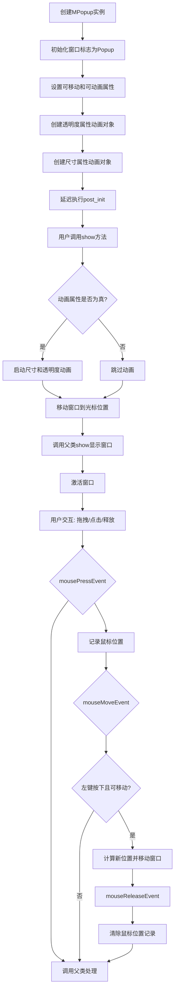

## 类结构

```
QtWidgets.QFrame (Qt框架基类)
└── MPopup (自定义弹出窗口)
    ├── @hover_shadow_mixin (悬停阴影混入)
    └── @property_mixin (属性混入)
```

## 全局变量及字段


### `MPopup.mouse_pos`
    
记录鼠标按下位置用于拖拽计算

类型：`QPoint | None`
    


### `MPopup._opacity_anim`
    
控制窗口透明度动画

类型：`QPropertyAnimation`
    


### `MPopup._size_anim`
    
控制窗口尺寸动画

类型：`QPropertyAnimation`
    
    

## 全局函数及方法


### MPopup.__init__

该方法是MPopup类的构造函数，负责初始化弹出窗口的基本属性、窗口标志、动画配置和样式属性。

参数：

- `parent`：`QWidget | None`，父窗口控件，传递给QFrame的初始化参数

返回值：`None`，无返回值，用于初始化对象状态

#### 流程图

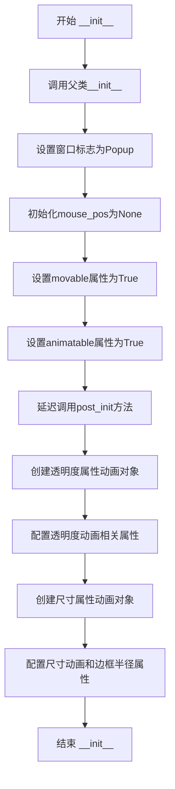

#### 带注释源码

```python
def __init__(self, parent=None):
    """初始化MPopup弹出窗口"""
    # 调用父类QFrame的构造函数，传递parent参数
    super(MPopup, self).__init__(parent)
    
    # 设置窗口标志为Popup类型，使窗口具有弹出框行为
    self.setWindowFlags(QtCore.Qt.Popup)
    
    # 初始化鼠标位置，用于拖拽移动功能
    self.mouse_pos = None
    
    # 设置可移动属性为True，支持用户拖拽移动窗口
    self.setProperty("movable", True)
    
    # 设置可动画属性为True，启用显示/隐藏动画效果
    self.setProperty("animatable", True)
    
    # 延迟执行post_init方法，在事件循环启动后初始化动画尺寸
    QtCore.QTimer.singleShot(0, self.post_init)

    # 创建透明度属性动画对象，动画目标为windowOpacity属性
    self._opacity_anim = QtCore.QPropertyAnimation(self, b"windowOpacity")
    # 设置透明度动画持续时间300毫秒
    self.setProperty("anim_opacity_duration", 300)
    # 设置透明度动画缓动曲线为OutCubic
    self.setProperty("anim_opacity_curve", "OutCubic")
    # 设置透明度动画起始值为0（完全透明）
    self.setProperty("anim_opacity_start", 0)
    # 设置透明度动画结束值为1（完全不透明）
    self.setProperty("anim_opacity_end", 1)

    # 创建尺寸属性动画对象，动画目标为size属性
    self._size_anim = QtCore.QPropertyAnimation(self, b"size")
    # 设置尺寸动画持续时间300毫秒
    self.setProperty("anim_size_duration", 300)
    # 设置尺寸动画缓动曲线为OutCubic
    self.setProperty("anim_size_curve", "OutCubic")
    # 设置边框圆角半径为15像素
    self.setProperty("border_radius", 15)
```


### `MPopup.post_init`

该方法是一个延迟初始化函数，用于在对象构造完成后初始化动画尺寸参数。它从Qt属性中读取动画的起始和结束尺寸，如果属性未设置则使用默认值（起始尺寸默认宽度为0、结束尺寸使用窗口的建议大小），确保动画参数在使用前已正确配置。

参数：

- `self`：`MPopup` 实例，隐式参数，表示当前 popup 窗口对象

返回值：`None`，该方法无返回值，仅通过 Qt 属性系统设置动画参数

#### 流程图

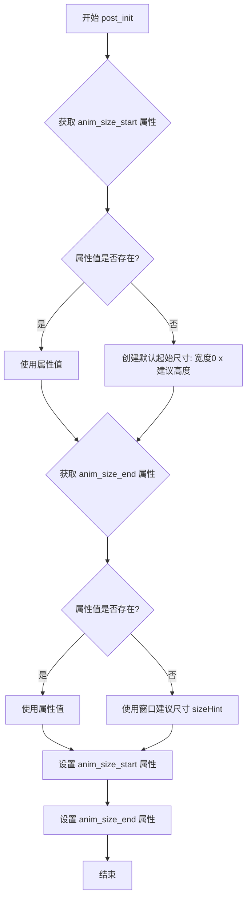

#### 带注释源码

```python
def post_init(self):
    """
    延迟初始化动画尺寸参数
    
    该方法在 MPopup 构造完成后被 QTimer.singleShot(0, ...) 调用，
    用于初始化动画的起始和结束尺寸。如果属性未设置，则使用默认值。
    """
    # 获取 anim_size_start 属性（动画起始尺寸）
    start_size = self.property("anim_size_start")
    
    # 获取窗口的建议大小作为参考
    size = self.sizeHint()
    
    # 如果属性未设置，使用默认起始尺寸：宽度0，高度为窗口建议高度
    # 这样可以实现从左侧展开的动画效果
    start_size = start_size if start_size else QtCore.QSize(0, size.height())
    
    # 获取 anim_size_end 属性（动画结束尺寸）
    end_size = self.property("anim_size_end")
    
    # 如果属性未设置，使用窗口的建议大小作为结束尺寸
    end_size = end_size if end_size else size
    
    # 将处理后的尺寸值设置回属性，供后续动画使用
    self.setProperty("anim_size_start", start_size)
    self.setProperty("anim_size_end", end_size)
```

#### 关键设计说明

| 项目 | 说明 |
|------|------|
| **调用时机** | 通过 `QtCore.QTimer.singleShot(0, self.post_init)` 在构造函数末尾延迟调用，确保对象完全初始化后再设置动画参数 |
| **默认值策略** | 使用 Qt 属性系统的动态特性，通过 `property()` 和 `setProperty()` 读写属性，支持子类覆盖默认值 |
| **尺寸计算** | `sizeHint()` 是 Qt 的标准方法，返回窗口的建议大小，确保动画结束尺寸符合内容需求 |
| **与动画系统的集成** | 设置的属性会被 `_set_anim_size_start` 和 `_set_anim_size_end` 方法捕获，进而配置 `QPropertyAnimation` |


### `MPopup.update_mask`

更新窗口遮罩实现圆角效果。该方法通过创建 `QPainterPath` 并添加圆角矩形，将其转换为多边形后设置为窗口的遮罩，从而实现窗口的圆角显示效果。

参数：

- 无（该方法为实例方法，隐含 `self` 参数）

返回值：`None`，无返回值描述

#### 流程图

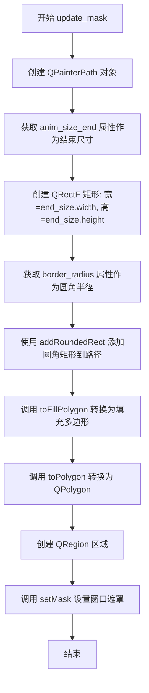

#### 带注释源码

```python
def update_mask(self):
    """
    更新窗口遮罩以实现圆角效果
    
    该方法通过以下步骤实现圆角窗口:
    1. 创建 QPainterPath 路径对象
    2. 根据动画结束尺寸创建矩形
    3. 添加圆角矩形到路径
    4. 将路径转换为多边形并设置为窗口遮罩
    """
    # 创建 QPainterPath 对象，用于定义复杂的形状路径
    rectPath = QtGui.QPainterPath()
    
    # 获取动画属性的结束尺寸（anim_size_end）
    # 该属性在 _set_anim_size_end 方法中设置
    end_size = self.property("anim_size_end")
    
    # 创建浮点矩形，参数为 (x, y, width, height)
    # 从 (0,0) 开始，宽度和高度来自 end_size
    rect = QtCore.QRectF(0, 0, end_size.width(), end_size.height())
    
    # 获取圆角半径属性（border_radius）
    # 默认值为 15，在 __init__ 中通过 setProperty 设置
    radius = self.property("border_radius")
    
    # 向路径添加圆角矩形
    # 参数: (rectangle, x_radius, y_radius)
    rectPath.addRoundedRect(rect, radius, radius)
    
    # 将路径的填充多边形转换为 QPolygon 对象
    # toFillPolygon() 返回 QPolygonF，再调用 toPolygon() 转换为 QPolygon
    polygon = rectPath.toFillPolygon().toPolygon()
    
    # 创建 QRegion 对象，用于定义窗口的显示区域
    region = QtGui.QRegion(polygon)
    
    # 设置窗口遮罩，使窗口显示为圆角形状
    # 这会裁剪窗口内容，使其呈现圆角效果
    self.setMask(region)
```


### `MPopup._get_curve`

获取缓动曲线对象，根据传入的曲线名称字符串从 QtCore.QEasingCurve 中获取对应的缓动曲线实例，若曲线名称无效则抛出 TypeError 异常。

参数：

- `value`：`str`，缓动曲线名称字符串（如 "OutCubic"、"Linear" 等）

返回值：`QEasingCurve`，返回 Qt 的缓动曲线对象

#### 流程图

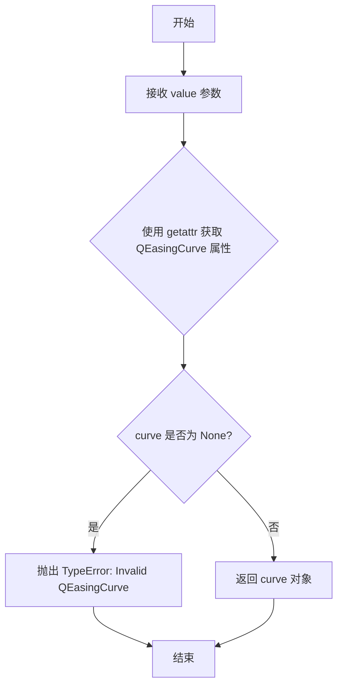

#### 带注释源码

```python
def _get_curve(self, value):
    """
    获取 QEasingCurve 缓动曲线对象
    
    参数:
        value: str - 缓动曲线名称字符串
        
    返回:
        QEasingCurve - Qt的缓动曲线对象
    """
    # 使用 getattr 从 QtCore.QEasingCurve 类中动态获取属性
    # 第三个参数 None 表示如果属性不存在则返回 None 而不是抛出 AttributeError
    curve = getattr(QtCore.QEasingCurve, value, None)
    
    # 检查是否成功获取到曲线对象
    if not curve:
        # 如果曲线名称无效，抛出 TypeError 异常
        raise TypeError("Invalid QEasingCurve")
    
    # 返回获取到的缓动曲线对象
    return curve
```


### `MPopup._set_border_radius`

设置圆角半径，通过延迟调用 `update_mask` 方法更新窗口遮罩以实现圆角效果。

参数：

- `value`：`int`，圆角半径的像素值（该参数在函数体中未直接使用，但作为 Qt 属性 setter 会被属性系统调用）

返回值：`None`，该方法不返回任何值

#### 流程图

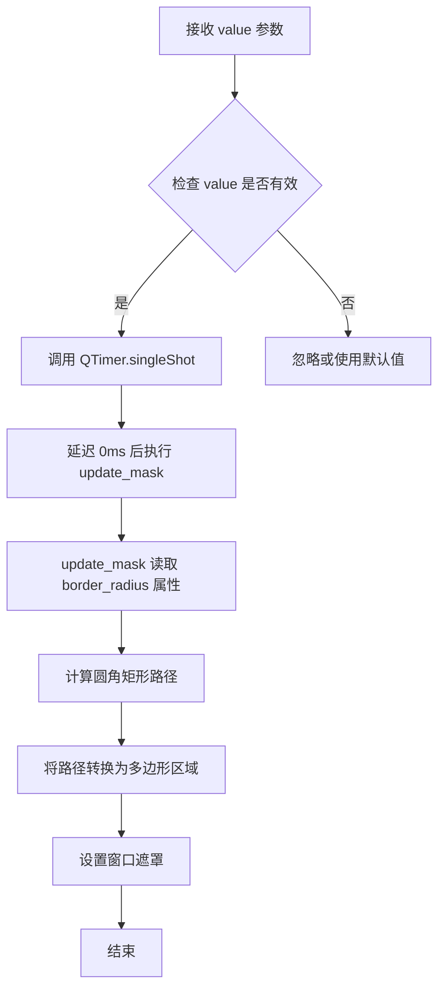

#### 带注释源码

```python
def _set_border_radius(self, value):
    """
    设置圆角半径
    
    该方法作为 Qt 属性系统 的 setter 使用，当通过 setProperty 设置 border_radius 属性时会被调用。
    注意：value 参数在函数体中未被直接使用，而是由 update_mask 方法从属性中读取。
    
    Args:
        value: int，圆角半径的像素值
    
    Returns:
        None
    """
    # 使用 singleShot 延迟 0 毫秒调用 update_mask
    # 延迟调用是为了确保在属性设置完成后再更新遮罩，
    # 避免在属性设置过程中过早更新导致的状态不一致
    QtCore.QTimer.singleShot(0, self.update_mask)
```


### `MPopup._set_anim_opacity_duration`

设置透明度动画时长。该方法接收一个整数值作为参数，通过调用 QPropertyAnimation 对象的 setDuration 方法来设置透明度动画的持续时间。

参数：

- `value`：`int`，透明度动画的持续时间，单位为毫秒

返回值：`None`，无返回值

#### 流程图

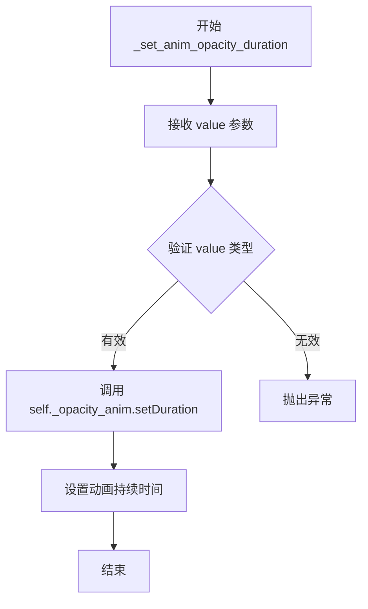

#### 带注释源码

```python
def _set_anim_opacity_duration(self, value):
    """
    设置透明度动画时长
    
    参数:
        value: int, 动画持续时间（毫秒）
    返回:
        None
    说明:
        该方法通过 QPropertyAnimation 的 setDuration 方法
        设置窗口透明度动画的持续时间
    """
    # 调用内部属性 _opacity_anim 的 setDuration 方法设置动画时长
    self._opacity_anim.setDuration(value)
```


### `MPopup._set_anim_opacity_curve`

设置透明度动画的缓动曲线（Easing Curve），通过将传入的曲线名称转换为 `QtCore.QEasingCurve` 枚举值，并应用到透明度动画上。

参数：

- `value`：`str`，动画曲线的名称（如 "OutCubic"、"Linear" 等），对应 `QtCore.QEasingCurve` 的枚举属性名

返回值：`None`，无返回值（方法执行完成后直接返回）

#### 流程图

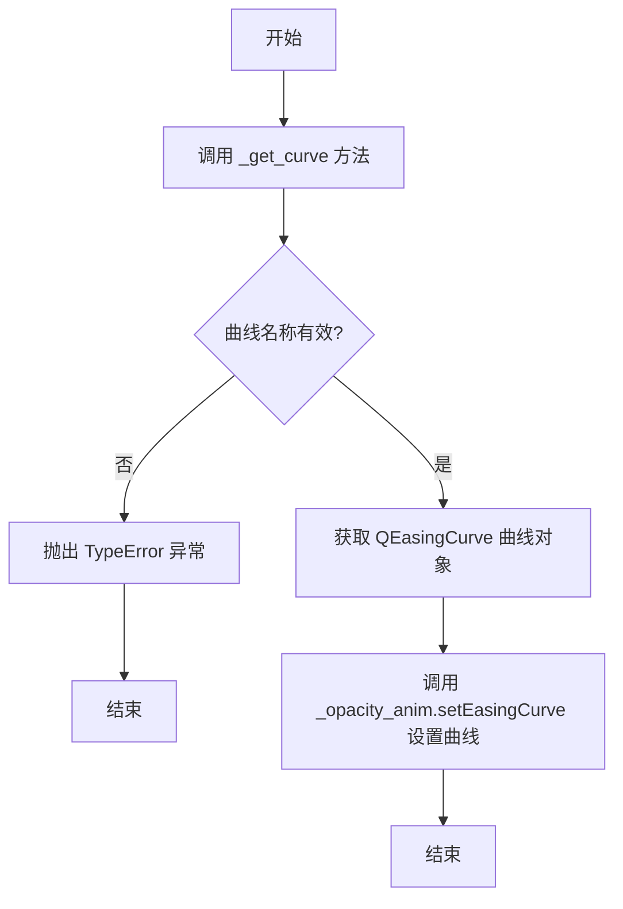

#### 带注释源码

```python
def _set_anim_opacity_curve(self, value):
    """
    设置透明度动画的缓动曲线
    
    参数:
        value: str - 曲线名称，对应 QtCore.QEasingCurve 的属性名
              例如: "OutCubic", "Linear", "InOutQuad" 等
              
    返回值:
        None
        
    说明:
        该方法通过 _get_curve 方法将字符串名称转换为 QEasingCurve 枚举值，
        然后调用 QPropertyAnimation 的 setEasingCurve 方法应用到透明度动画。
        不同的曲线会产生不同的动画缓动效果。
    """
    # 调用 _get_curve 方法将字符串转换为 QEasingCurve 对象
    # _get_curve 内部会查找 QtCore.QEasingCurve.value 属性
    # 如果找不到则抛出 TypeError 异常
    self._opacity_anim.setEasingCurve(self._get_curve(value))
    
    # NOTES(timmyliang): 
    # _opacity_anim 是 QPropertyAnimation 对象，绑定的是 windowOpacity 属性
    # setEasingCurve 用于设置动画的时间曲线，影响动画的加速度变化
    # OutCubic 会使动画开始快，结尾慢（减速效果）
```


### `MPopup._set_anim_opacity_start`

设置透明度动画的起始值，通过调用QPropertyAnimation的setStartValue方法配置窗口透明度动画的初始不透明度。

参数：

- `value`：`float`，透明度起始值，范围通常在0.0到1.0之间（0.0为完全透明，1.0为完全不透明）

返回值：`None`，无返回值

#### 流程图

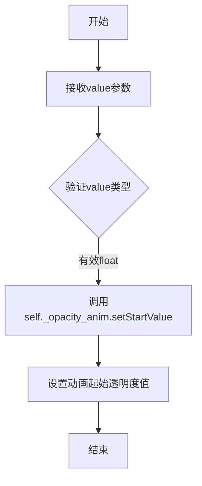

#### 带注释源码

```python
def _set_anim_opacity_start(self, value):
    """
    设置透明度动画的起始值
    
    Args:
        value: float类型，透明度起始值（0.0-1.0）
    
    Returns:
        None
    """
    # 调用Qt属性动画对象的setStartValue方法设置动画起始值
    # _opacity_anim是QPropertyAnimation对象，绑定到windowOpacity属性
    self._opacity_anim.setStartValue(value)
```


### `MPopup._set_anim_opacity_end`

设置透明度动画的结束值，用于控制弹出窗口显示或隐藏时的透明度目标。

参数：

- `value`：`float`，透明度动画的结束值，范围通常在 0.0 到 1.0 之间（0.0 为完全透明，1.0 为完全不透明）

返回值：`None`，该方法不返回任何值

#### 流程图

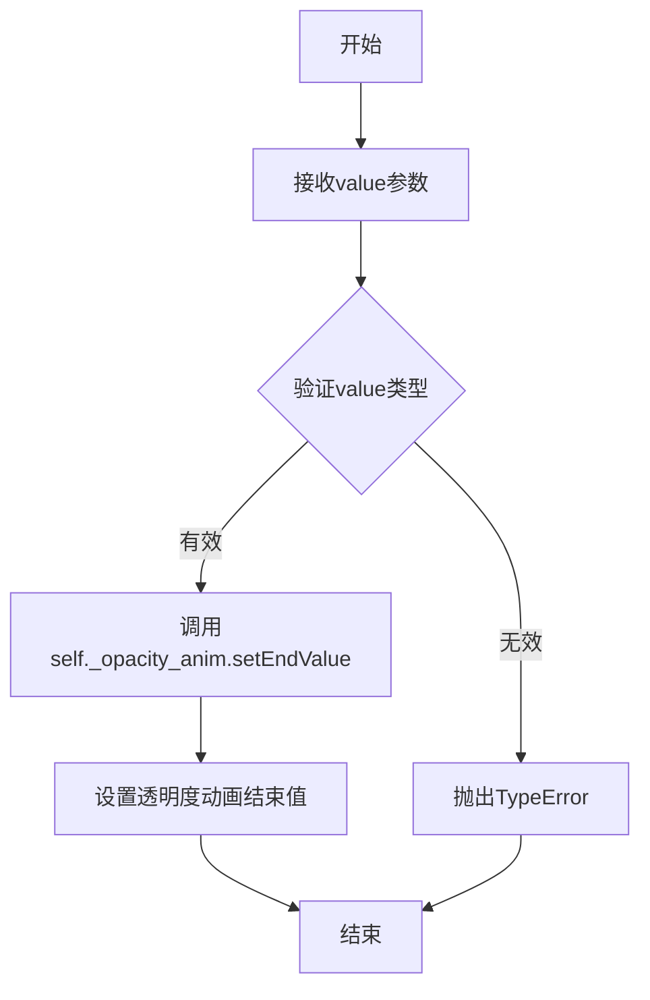

#### 带注释源码

```python
def _set_anim_opacity_end(self, value):
    """
    设置透明度动画的结束值
    
    该方法作为property_mixin的setter使用，当设置anim_opacity_end属性时
    会自动调用此方法来更新透明度动画的目标值
    
    参数:
        value: float - 透明度动画的结束值，范围0.0-1.0
               0.0表示完全透明，1.0表示完全不透明
    
    返回值:
        None - 该方法仅修改内部状态，不返回任何值
    """
    # 使用QPropertyAnimation设置透明度动画的结束值
    # _opacity_anim是QtCore.QPropertyAnimation实例，动画目标为windowOpacity
    self._opacity_anim.setEndValue(value)
```


### `MPopup._set_anim_size_duration`

该方法用于设置尺寸动画的持续时间，通过调用 QPropertyAnimation 的 setDuration 方法来更新动画时长配置。

参数：

- `value`：`int`，动画持续时间值，单位为毫秒

返回值：`None`，该方法仅执行属性设置操作，无返回值

#### 流程图

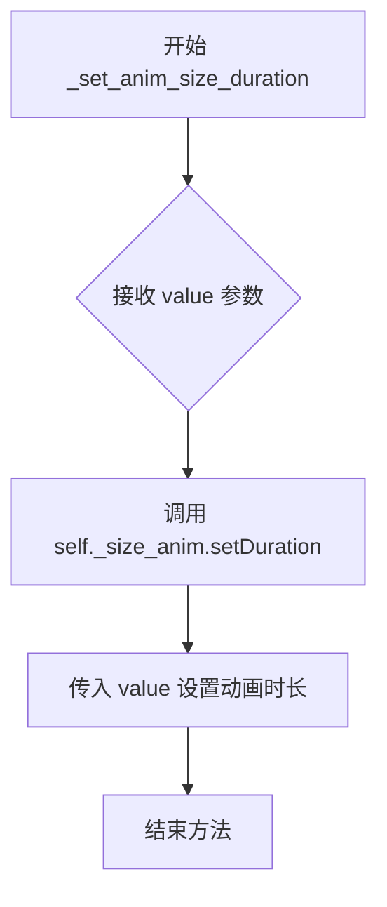

#### 带注释源码

```python
def _set_anim_size_duration(self, value):
    """
    设置尺寸动画的持续时间
    
    参数:
        value: int - 动画持续时间，单位为毫秒
    
    返回值:
        None
    """
    # 调用内部 QPropertyAnimation 对象的 setDuration 方法
    # 设置尺寸变化动画的持续时间
    self._size_anim.setDuration(value)
```


### `MPopup._set_anim_size_curve`

设置尺寸动画的缓动曲线，用于控制尺寸变化动画的时间插值方式。

参数：

- `value`：`str`，动画曲线类型名称（如 "OutCubic"、"Linear" 等 QEasingCurve 支持的曲线名称）

返回值：`None`，该方法不返回任何值，直接修改内部 QPropertyAnimation 对象的缓动曲线属性

#### 流程图

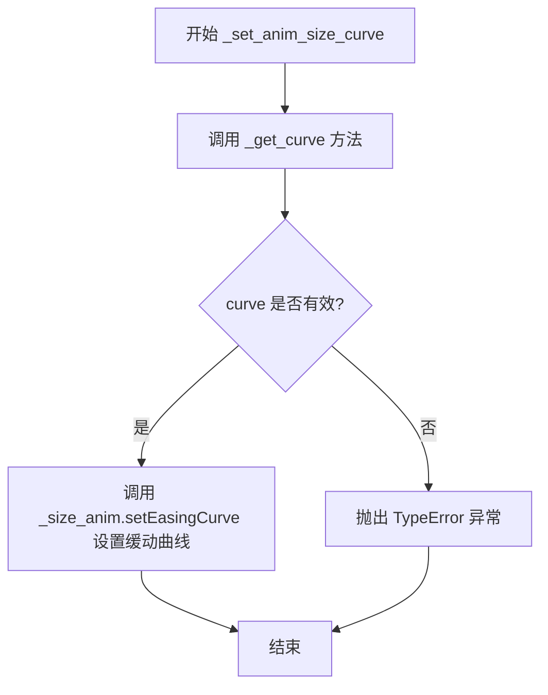

#### 带注释源码

```python
def _set_anim_size_curve(self, value):
    """
    设置尺寸动画的缓动曲线
    
    参数:
        value: str - QEasingCurve 类型名称字符串，如 'OutCubic', 'Linear' 等
    
    返回:
        None - 此方法直接修改内部动画对象的属性，不返回任何值
    """
    # 调用 _get_curve 方法将字符串转换为 QEasingCurve 对象
    # _get_curve 内部使用 getattr 从 QtCore.QEasingCurve 获取对应的曲线类型
    # 如果传入的值无效，会抛出 TypeError 异常
    curve = self._get_curve(value)
    
    # 使用 setEasingCurve 方法设置尺寸动画的缓动曲线
    # _size_anim 是 QPropertyAnimation 实例，作用于 self 的 size 属性
    self._size_anim.setEasingCurve(curve)
```


### `MPopup._set_anim_size_start`

设置尺寸动画的起始值，用于控制弹出窗口动画开始时的大小。

参数：

- `value`：`QSize`，动画起始的尺寸大小

返回值：`None`，无返回值，仅执行属性设置操作

#### 流程图

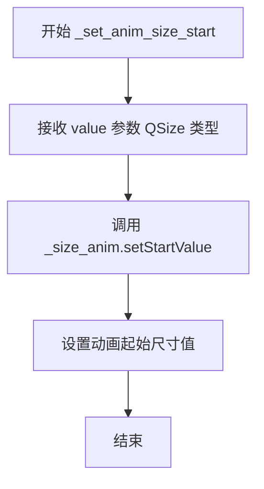

#### 带注释源码

```python
def _set_anim_size_start(self, value):
    """
    设置尺寸动画的起始值
    
    参数:
        value: QSize - 动画开始时的窗口尺寸
    返回:
        None
    """
    # 将传入的起始尺寸值设置到尺寸动画对象上
    # 这样在动画开始时，窗口会从指定的起始尺寸变化到结束尺寸
    self._size_anim.setStartValue(value)
```


### `MPopup._set_anim_size_end`

该方法用于设置尺寸动画的结束值，并在设置完成后延迟更新窗口遮罩，以确保动画效果与遮罩区域同步。

参数：

- `value`：`QSize`，要设置的尺寸动画结束值，用于定义弹出窗口动画完成后的最终大小

返回值：`None`，该方法无返回值，仅执行副作用操作

#### 流程图

```mermaid
flowchart TD
    A[开始 _set_anim_size_end] --> B{接收 value 参数}
    B --> C[设置尺寸动画结束值: self._size_anim.setEndValue(value)]
    C --> D[延迟执行 update_mask: QTimer.singleShot 0ms]
    D --> E[update_mask 更新窗口遮罩]
    E --> F[结束]
```

#### 带注释源码

```python
def _set_anim_size_end(self, value):
    """
    设置尺寸动画的结束值
    
    参数:
        value: QSize - 动画结束时的窗口尺寸
    
    说明:
        该方法做了两件事:
        1. 通过 QPropertyAnimation 设置动画的结束值
        2. 使用 QTimer.singleShot 延迟调用 update_mask
           延迟是为了确保在属性设置完成后再更新遮罩
    """
    # 设置尺寸动画的结束值，使动画目标尺寸与设置值同步
    self._size_anim.setEndValue(value)
    
    # 延迟 0 毫秒执行 update_mask，确保属性已更新
    # NOTES(timmyliang): 延迟执行确保 setEndValue 的效果已生效
    # 然后更新窗口的遮罩区域以匹配新的尺寸
    QtCore.QTimer.singleShot(0, self.update_mask)
```


### `MPopup.start_anim`

启动 MPopup 弹窗的大小和透明度动画，使弹窗以平滑的过渡效果显示在屏幕上。

参数：无参数（仅包含 self 隐式参数）

返回值：`None`，无返回值，该方法通过副作用生效

#### 流程图

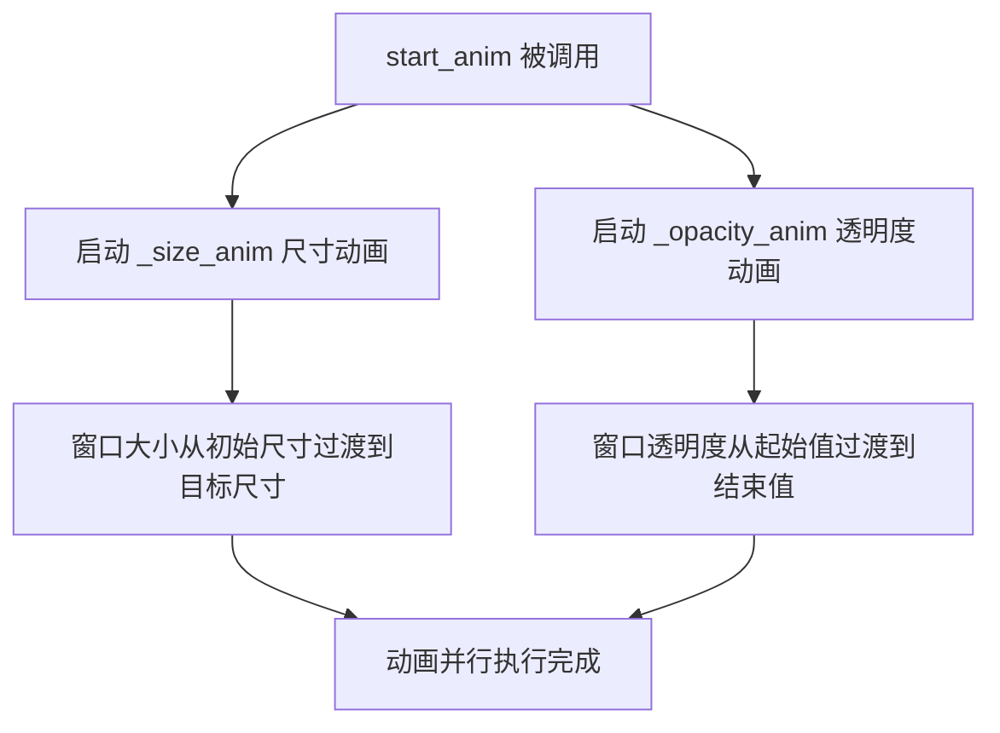

#### 带注释源码

```python
def start_anim(self):
    """
    启动所有动画
    
    启动尺寸动画和透明度动画，使弹窗以平滑的动画效果显示。
    两个动画会同时开始运行（并行执行）。
    """
    # 启动尺寸属性动画，使窗口大小从 anim_size_start 过渡到 anim_size_end
    self._size_anim.start()
    
    # 启动透明度属性动画，使窗口透明度从 anim_opacity_start 过渡到 anim_opacity_end
    self._opacity_anim.start()
```

#### 关联变量信息

| 变量名 | 类型 | 描述 |
|--------|------|------|
| `self._size_anim` | `QtCore.QPropertyAnimation` | 控制窗口尺寸变化的动画对象 |
| `self._opacity_anim` | `QtCore.QPropertyAnimation` | 控制窗口透明度变化的动画对象 |


### `MPopup.mousePressEvent`

该方法是 MPopup 类的鼠标按下事件处理函数，用于在用户按下鼠标左键时记录鼠标位置，为后续的拖拽移动功能提供起始位置。

参数：

- `event`：`QMouseEvent`，鼠标事件对象，包含鼠标按键、位置等信息

返回值：`None`，该方法继承自父类 QFrame 的 mousePressEvent，返回值为空（void）

#### 流程图

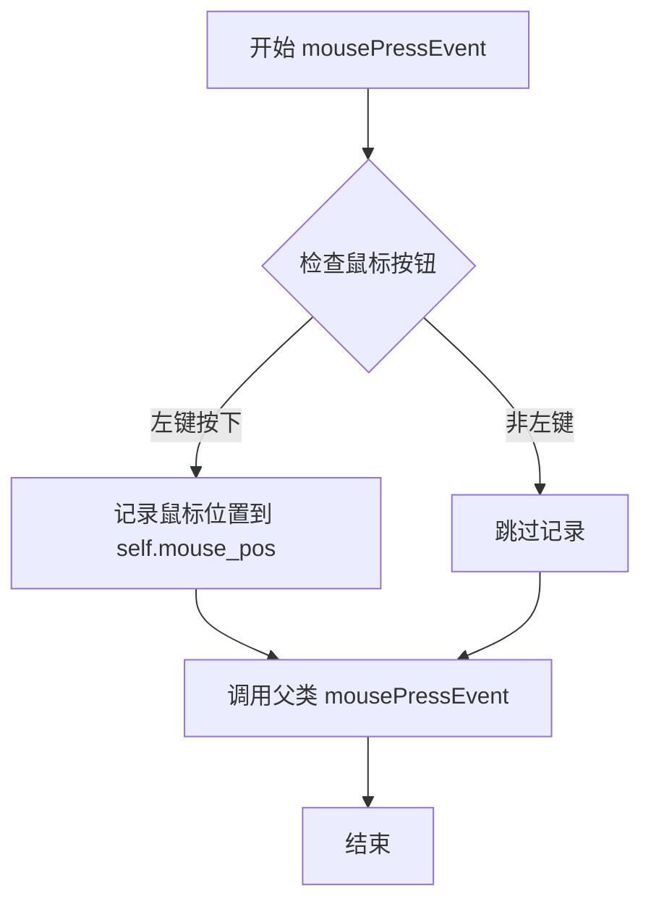

#### 带注释源码

```python
def mousePressEvent(self, event):
    """
    鼠标按下事件处理
    
    当用户按下鼠标左键时，记录当前鼠标位置，为后续拖拽移动提供起始参考点。
    对于其他鼠标按钮或非可移动状态，直接传递给父类处理。
    
    参数:
        event: QMouseEvent - 鼠标事件对象，包含按键类型和位置信息
    """
    # 检查是否是鼠标左键按下
    if event.button() == QtCore.Qt.LeftButton:
        # 记录当前鼠标相对于窗口的位置
        # 用于后续 mouseMoveEvent 计算拖拽位移
        self.mouse_pos = event.pos()
    
    # 调用父类的 mousePressEvent 处理默认行为
    # 确保 Popup 窗口的正常交互行为不受影响
    return super(MPopup, self).mousePressEvent(event)
```


### `MPopup.mouseReleaseEvent`

处理鼠标释放事件，当用户释放鼠标按钮时重置内部保存的鼠标位置状态，以便停止拖拽移动操作。

参数：

- `event`：`QMouseEvent`，鼠标释放事件对象，包含鼠标按钮、位置等信息

返回值：`None`，无返回值（调用父类方法但不处理其返回值）

#### 流程图

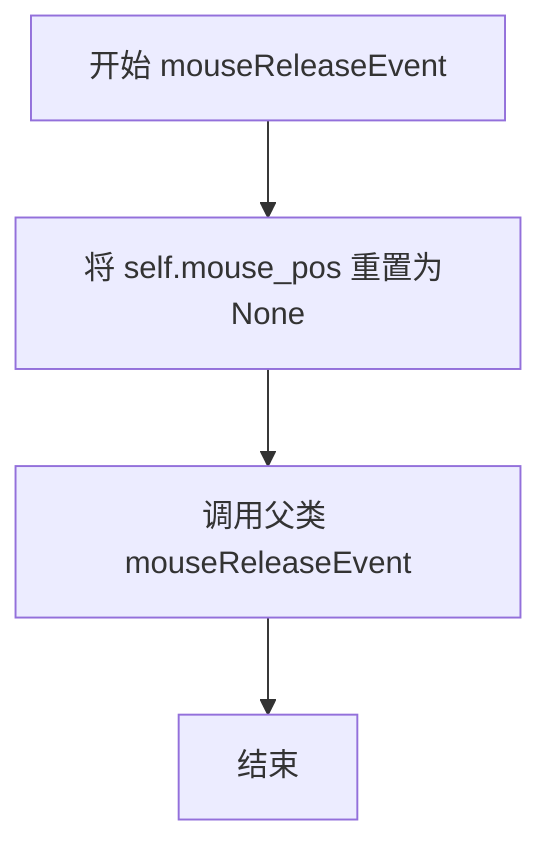

#### 带注释源码

```python
def mouseReleaseEvent(self, event):
    """
    处理鼠标释放事件
    
    当用户释放鼠标左键时，清除之前保存的鼠标位置信息，
    从而停止窗口的拖拽移动功能。
    
    参数:
        event: QMouseEvent - 鼠标释放事件对象
        
    返回值:
        None - 调用父类方法但不处理返回值
    """
    # 重置鼠标位置为 None，停止拖拽移动状态
    self.mouse_pos = None
    # 调用父类的 mouseReleaseEvent 处理默认行为（如传递事件给子控件）
    return super(MPopup, self).mouseReleaseEvent(event)
```


### `MPopup.mouseMoveEvent`

处理鼠标移动事件，实现窗口拖拽移动功能。当用户按住左键拖动且窗口可移动时，更新窗口位置。

参数：

- `event`：`QMouseEvent`，Qt 鼠标事件对象，包含鼠标位置和按钮状态信息

返回值：`None`，该方法继承自 `QFrame`，调用父类同名方法完成事件处理

#### 流程图

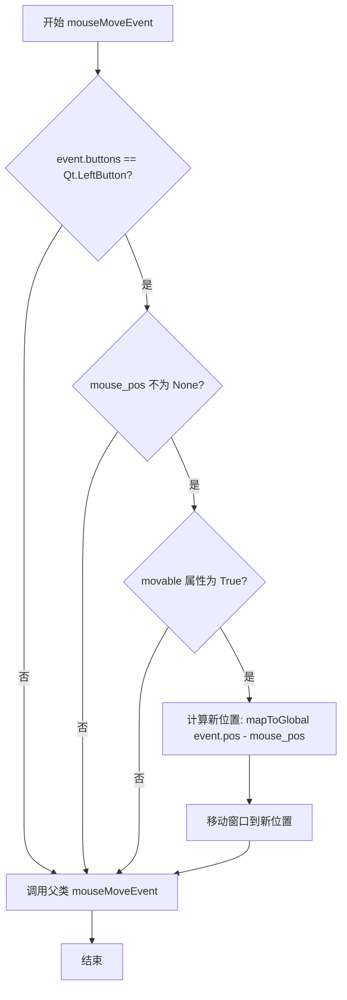

#### 带注释源码

```python
def mouseMoveEvent(self, event):
    # 检查鼠标左键是否被按下，且 mouse_pos 已初始化，且窗口可移动属性为 True
    if event.buttons() == QtCore.Qt.LeftButton and self.mouse_pos and self.property("movable"):
        # 计算鼠标相对于按下位置的偏移量
        # 将局部坐标转换为全局坐标，实现窗口跟随鼠标移动
        self.move(self.mapToGlobal(event.pos() - self.mouse_pos))
    # 调用父类 QFrame 的 mouseMoveEvent 处理默认行为（如悬停效果等）
    return super(MPopup, self).mouseMoveEvent(event)
```


### `MPopup.show()`

该方法用于显示弹出窗口，并根据属性配置触发动画效果（透明度动画和尺寸动画），同时将窗口移动到当前鼠标光标位置，最后激活窗口以确保输入焦点正确。

参数：

- `self`：`MPopup` 实例，隐式参数，不需要显式传递

返回值：`None`，无返回值

#### 流程图

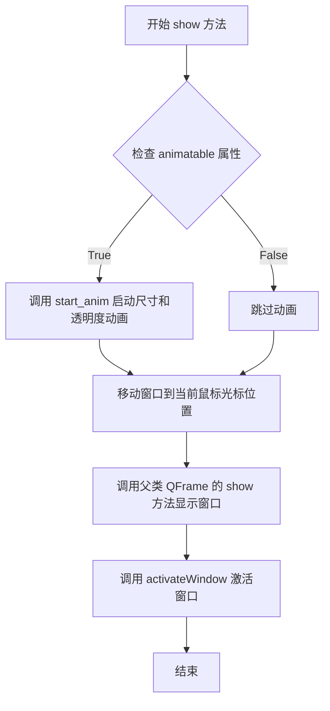

#### 带注释源码

```python
def show(self):
    """
    显示窗口并触发动画效果
    
    该方法执行以下操作：
    1. 如果可动画，则启动尺寸和透明度动画
    2. 将窗口移动到当前鼠标光标位置
    3. 调用父类方法显示窗口
    4. 激活窗口以确保中文输入等场景正常工作
    """
    # 检查 animatable 属性，如果为 True 则启动动画
    if self.property("animatable"):
        self.start_anim()
    
    # 将窗口移动到当前鼠标光标所在位置
    self.move(QtGui.QCursor.pos())
    
    # 调用父类 QtWidgets.QFrame 的 show 方法显示窗口
    super(MPopup, self).show()
    
    # NOTES(timmyliang): for chinese input
    # 激活窗口，确保窗口获得焦点，适用于中文输入法等场景
    self.activateWindow()
```

## 关键组件


### MPopup 类

Qt弹出窗口组件，继承自QFrame，支持动画效果（透明度与尺寸）、圆角矩形遮罩、鼠标拖拽移动功能，并通过mixin装饰器扩展属性和悬停阴影效果。

### 动画系统

包含透明度动画（_opacity_anim）和尺寸动画（_size_anim）两个QPropertyAnimation实例，通过Qt属性系统实现窗口弹出时的淡入和展开效果。

### 遮罩更新机制

update_mask方法使用QPainterPath和QRegion创建圆角矩形遮罩，实现窗口的圆角视觉效果，支持自定义圆角半径。

### 拖拽移动功能

通过mousePressEvent、mouseMoveEvent、mouseReleaseEvent实现窗口拖拽移动，使用property("movable")控制是否可移动，mouse_pos记录拖拽起始位置。

### Mixin装饰器

hover_shadow_mixin和property_mixin装饰器为类添加悬停阴影效果和属性管理功能，实现代码复用和功能扩展。

### 属性动画配置

通过setProperty设置动画参数（duration、curve、start、end），支持自定义动画时长、缓动曲线、起始和结束值，_get_curve方法解析QEasingCurve枚举值。

### 窗口标志设置

设置Qt.Popup窗口标志，使弹出窗口具有浮动特性，并使用Qt.WindowStaysOnTopHint保持置顶。

### 中文输入兼容

show方法中调用activateWindow()解决中文输入法在弹出窗口上的兼容性问题。


## 问题及建议


### 已知问题

-   **延迟初始化模式风险**：`post_init`通过`QTimer.singleShot(0, self.post_init)`调用，这种模式在复杂场景下可能导致竞态条件，且调试困难
-   **属性与成员变量混用**：移动功能使用`self.mouse_pos`成员变量存储位置，但`movable`状态却通过`property()`查询，导致状态管理不一致
-   **动画配置冗余**：动画属性通过setProperty存储后再通过对应的setter方法配置，初始化流程分散，增加了维护成本
-   **废弃API使用风险**：`update_mask`中使用`toPolygon()`方法在较新Qt版本中已标记为废弃
-   **缺少类型注解**：整个类没有使用Python类型提示，降低了代码可读性和IDE支持
-   **硬编码的显示位置**：`show()`方法直接使用`QCursor.pos()`定位，缺乏灵活性，无法适应多显示器或自定义定位需求

### 优化建议

-   将动画初始化逻辑集中到专门的初始化方法中，避免使用延迟调用
-   统一状态管理：移动相关状态（movable、mouse_pos）统一使用成员变量或统一通过property管理
-   迁移到新API：使用`QtGui.QPolygonF`替代废弃的`toPolygon()`
-   添加类型注解：为所有方法参数和返回值添加类型提示
-   增强定位灵活性：提供定位策略参数或方法，允许外部自定义弹出位置
-   考虑使用`QObject`或`pyqtSignal`实现更清晰的事件通信


## 其它


### 设计目标与约束

**设计目标**：提供一种可拖拽、带有动画效果的弹出式窗口组件，支持透明度渐变和尺寸变化的动画效果，适用于下拉菜单、工具提示等UI场景。

**约束条件**：
- 依赖PySide6框架，仅适用于Qt生态系统
- 窗口标志设为Popup类型，确保模态弹出行为
- 动画参数通过Qt属性系统动态配置，不支持运行时动态修改动画曲线
- 拖拽移动功能依赖mouse_pos状态，非线程安全

### 错误处理与异常设计

**异常类型**：
- `TypeError`：当`_get_curve`接收到无效的QEasingCurve名称时抛出
- `AttributeError`：当访问不存在的Qt属性时可能触发

**错误处理策略**：
- `_get_curve`方法使用`getattr`安全获取曲线枚举，默认返回None后抛出TypeError
- 属性设置使用`setProperty`，若属性不存在会被忽略而非抛出异常
- 动画启动失败时静默处理，不影响窗口显示

### 数据流与状态机

**状态流转**：
- `初始化状态` → `post_init` → `就绪状态` → `show()` → `动画播放状态` → `显示完成`
- 拖拽状态：`mousePressEvent`记录位置 → `mouseMoveEvent`执行移动 → `mouseReleaseEvent`清除状态

**数据流向**：
- 用户调用`show()` → 触发`start_anim()` → 并行启动`_size_anim`和`_opacity_anim` → 动画结束
- 窗口移动通过`property("movable")`布尔值控制是否响应拖拽

### 外部依赖与接口契约

**外部依赖**：
- `PySide6.QtCore`：Qt核心功能、定时器、属性系统
- `PySide6.QtGui`：画家路径、光标、窗口相关
- `PySide6.QtWidgets`：QFrame基类
- `mixin.hover_shadow_mixin`：阴影效果混入（外部提供）
- `mixin.property_mixin`：属性混入（外部提供）

**接口契约**：
- `show()`：重写Qt方法，调用父类show并附加动画逻辑
- `mousePressEvent/mouseReleaseEvent/mouseMoveEvent`：重写鼠标事件处理
- `update_mask()`：更新圆角遮罩，需在尺寸动画后调用
- `start_anim()`：公开方法，启动透明度与尺寸动画

### 性能考虑

- 使用`QTimer.singleShot(0, ...)`延迟执行确保对象完全初始化
- 遮罩更新使用`QPainterPath.addRoundedRect`创建复杂路径，高频率调用可能影响性能
- 动画使用Qt原生QPropertyAnimation，内部优化较好
- 窗口移动时实时计算坐标，存在轻微性能开销

### 安全性考虑

- 无用户输入验证场景
- 无敏感数据处理
- 窗口位置计算依赖全局坐标转换`mapToGlobal`，需确保父对象有效

### 线程模型

- Qt属性系统非线程安全，多线程环境下配置属性可能导致竞态条件
- 动画在主线程执行，外部修改属性应在主线程操作
- 无后台计算任务，无需worker线程

### 资源管理

- 动画对象`_opacity_anim`和`_size_anim`作为实例属性随窗口销毁自动释放
- 遮罩资源由Qt自动管理
- 无显式资源释放逻辑，依赖Python垃圾回收

### 兼容性考虑

- 使用`__future__`导入兼容Python 2/3（但代码实际运行于Python 3）
- Qt枚举使用`QtCore.Qt.`前缀，兼容PySide6版本
- `QPainterPath.toFillPolygon()`在某些Qt版本行为可能有差异
- 依赖mixin类的实现细节，需与`hover_shadow_mixin`和`property_mixin`同步维护

    