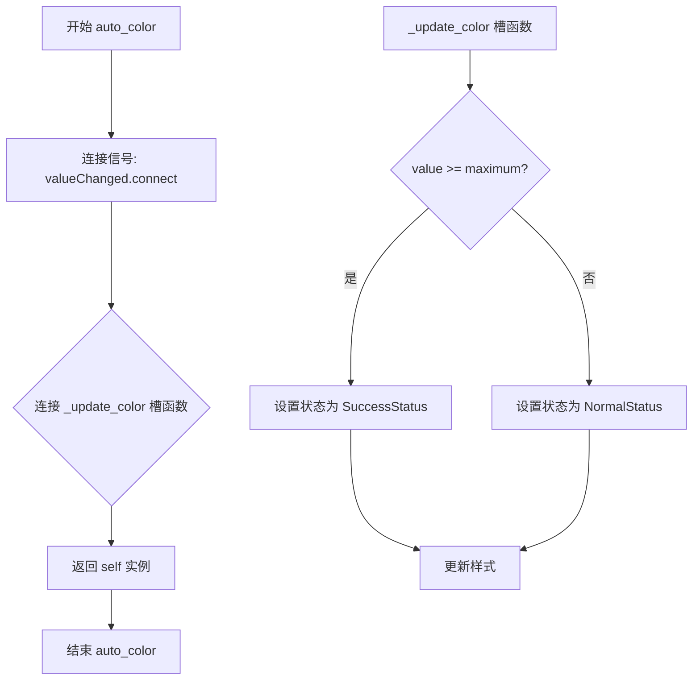
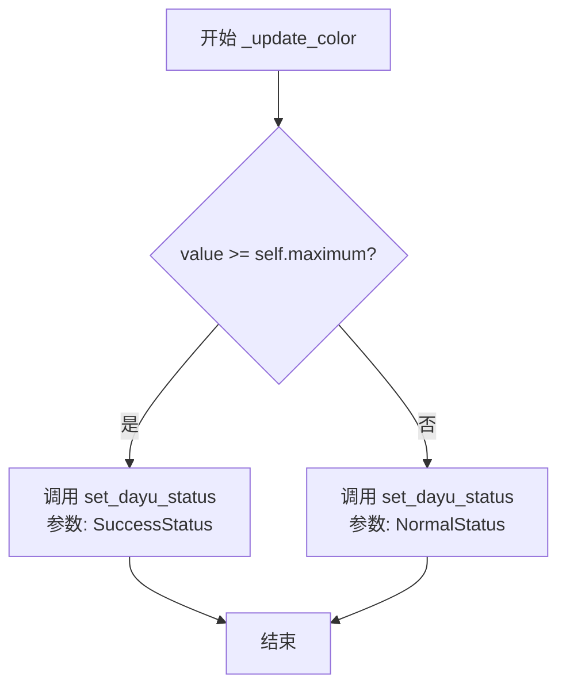
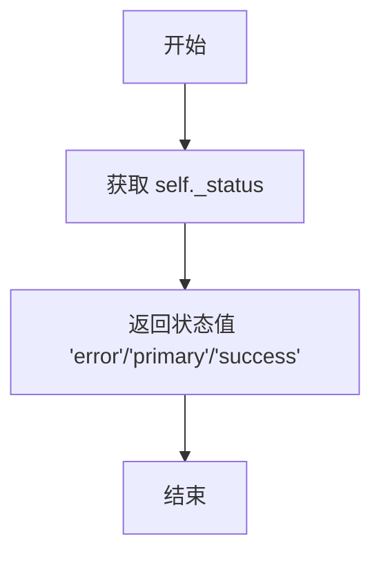

# `comic-translate\app\ui\dayu_widgets\progress_bar.py` 详细设计文档

MProgressBar是一个基于PySide6的自定义进度条组件，继承自QtWidgets.QProgressBar，支持三种状态（error、primary、success），并提供自动根据进度值改变颜色的功能，通过Qt属性系统实现样式的动态更新。

## 整体流程

```mermaid
graph TD
    A[创建MProgressBar实例] --> B[设置对齐方式为居中]
    B --> C[初始化状态为NormalStatus]
    C --> D{调用auto_color?}
    D -- 是 --> E[连接valueChanged信号到_update_color槽]
    D -- 否 --> F[等待手动调用状态方法]
    E --> G{进度值变化}
    G --> H{value >= maximum?}
    H -- 是 --> I[设置为SuccessStatus]
    H -- 否 --> J[设置为NormalStatus]
    I --> K[调用style().polish刷新样式]
    J --> K
    F --> K
    K --> L[结束]
    M[手动调用状态方法] --> N{normal/error/success}
    N --> O[设置对应状态并刷新样式]
```

## 类结构

```
QObject (Qt基类)
└── QWidget
    └── QFrame
        └── QProgressBar
            └── MProgressBar (自定义进度条)
```

## 全局变量及字段


### `MProgressBar.ErrorStatus`
    
类属性，字符串 'error'，表示错误状态

类型：`str`
    


### `MProgressBar.NormalStatus`
    
类属性，字符串 'primary'，表示正常/主要状态

类型：`str`
    


### `MProgressBar.SuccessStatus`
    
类属性，字符串 'success'，表示成功状态

类型：`str`
    


### `MProgressBar._status`
    
实例属性，私有，存储当前状态

类型：`str`
    
    

## 全局函数及方法


### `MProgressBar.__init__`

这是 MProgressBar 类的构造函数，用于初始化自定义进度条组件。在调用父类构造函数后，设置文本居中对齐，并初始化默认状态为普通状态（NormalStatus）。

参数：

- `self`：MProgressBar 实例本身，无需显式传递
- `parent`：`QtWidgets.QWidget` 或 `None`，父组件指针，用于建立 Qt 对象树层级关系，默认为 None

返回值：`None`，构造函数无显式返回值

#### 流程图

```mermaid
flowchart TD
    A[开始 __init__] --> B[调用父类 QProgressBar 构造函数<br/>super(MProgressBar, self).__init__(parent=parent)]
    B --> C[设置文本对齐方式为居中<br/>self.setAlignment(QtCore.Qt.AlignCenter)]
    C --> D[初始化状态属性为 NormalStatus<br/>self._status = MProgressBar.NormalStatus]
    D --> E[结束 __init__]
```

#### 带注释源码

```python
def __init__(self, parent=None):
    """
    MProgressBar 构造函数，初始化自定义进度条组件。
    
    参数:
        parent: 父 QWidget 对象，默认为 None
    """
    # 调用父类 QProgressBar 的初始化方法，建立 Qt 对象树
    # parent 参数传递给父类，用于管理对象生命周期和层级关系
    super(MProgressBar, self).__init__(parent=parent)
    
    # 设置进度条文本内容居中显示
    # 使用 QtCore.Qt.AlignCenter 对齐方式
    self.setAlignment(QtCore.Qt.AlignCenter)
    
    # 初始化内部状态属性为普通状态
    # NormalStatus 对应 'primary' 字符串，用于 Qt 样式表状态控制
    self._status = MProgressBar.NormalStatus
```


### `MProgressBar.auto_color`

该方法用于自动根据进度条的值变化更新颜色样式。当进度条的值达到最大值时，状态会切换为成功状态（success）；否则保持为正常状态（primary）。该方法通过连接 Qt 的 valueChanged 信号到内部更新颜色的槽函数来实现此功能，并返回当前实例以支持链式调用。

参数：

- `self`：`MProgressBar`，调用该方法的当前 MProgressBar 实例

返回值：`MProgressBar`，返回当前实例本身（self），以便支持链式调用（例如 `bar.auto_color().normal()`）

#### 流程图



#### 带注释源码

```python
def auto_color(self):
    """
    自动根据进度条的值更新颜色样式。
    
    该方法连接 Qt 的 valueChanged 信号到内部的 _update_color 槽函数，
    当进度条值发生变化时自动更新状态颜色。
    
    Returns:
        MProgressBar: 返回当前实例本身，支持链式调用
    """
    # 连接 Qt 的 valueChanged 信号到 _update_color 槽函数
    # 当进度条的值改变时，会自动触发 _update_color 方法
    self.valueChanged.connect(self._update_color)
    
    # 返回 self 以支持链式调用
    # 例如: bar.auto_color().success()
    return self
```


### `MProgressBar._update_color`

该方法是一个Qt槽函数，用于根据进度条的当前值自动更新进度条的颜色状态。当进度值达到最大值时，将状态设置为"success"（成功），否则设置为"normal"（正常）。

参数：

- `self`：`MProgressBar`，方法所属的实例对象，隐式参数
- `value`：`int`，进度条的当前值，用于与最大值比较以确定状态

返回值：`None`，该方法无返回值，通过调用`set_dayu_status`方法间接更新进度条状态

#### 流程图



#### 带注释源码

```python
@QtCore.Slot(int)  # Qt装饰器，将此方法声明为int类型的槽函数
def _update_color(self, value):
    """
    根据进度值更新进度条的颜色状态
    
    参数:
        value: int, 进度条的当前值
    """
    # 判断当前值是否达到或超过进度条的最大值
    if value >= self.maximum():
        # 如果达到最大值，设置状态为成功（绿色）
        self.set_dayu_status(MProgressBar.SuccessStatus)
    else:
        # 如果未达到最大值，设置状态为正常（默认色）
        self.set_dayu_status(MProgressBar.NormalStatus)
```


### `MProgressBar.get_dayu_status`

该方法是一个简单的属性 getter，用于获取进度条控件的当前状态值。它返回内部私有变量 `_status` 的内容，该状态值用于控制进度条的样式表现（错误状态、正常状态或成功状态）。

参数：

-  `self`：`MProgressBar`，类的实例本身，表示调用该方法的进度条对象

返回值：`str`，返回当前进度条的状态值，状态值包括："error"（错误状态）、"primary"（正常/主要状态）、"success"（成功状态）

#### 流程图



#### 带注释源码

```python
def get_dayu_status(self):
    """
    获取进度条的当前状态
    
    该方法作为 Qt Property 的 getter 使用，用于获取进度条的内部状态。
    状态值决定了进度条的视觉样式（颜色等）：
    - 'error': 错误状态，通常显示红色
    - 'primary': 正常/主要状态，显示主题色
    - 'success': 成功状态，通常显示绿色
    
    返回：
        str: 当前的状态字符串，初始值为 'primary'
    """
    return self._status
```


### `MProgressBar.set_dayu_status`

该方法用于设置进度条的状态（status），并通过 Qt 的样式系统（style）强制刷新组件的视觉表现，以反映新的状态（如 error、primary、success）。

参数：

- `value`：`str`，表示要设置的状态值，对应 MProgressBar 的三种状态（"error"、"primary"、"success"）

返回值：`None`，该方法无返回值，仅执行副作用（更新内部状态并刷新样式）

#### 流程图

```mermaid
graph TD
    A([开始 set_dayu_status]) --> B[将 value 赋值给 self._status]
    B --> C[调用 self.style().polish 刷新样式]
    C --> D([结束])
```

#### 带注释源码

```python
def set_dayu_status(self, value):
    """
    设置进度条的当前状态，并触发样式刷新。

    参数:
        value (str): 状态值，应为以下三者之一:
                     - "error": 错误状态，样式显示为错误色
                     - "primary": 正常/进行中状态，样式显示为主色
                     - "success": 成功状态，样式显示为成功色

    返回值:
        None: 此方法不返回值，仅更新内部状态并刷新组件样式
    """
    # 将传入的状态值保存到内部变量 _status，供 Qt 属性系统使用
    self._status = value
    # 调用 Qt 样式系统的 polish 方法，强制刷新组件的视觉样式
    # 这会触发 Qt 根据新的 status 属性值重新应用对应的 QSS 样式规则
    self.style().polish(self)
```


### `MProgressBar.normal`

将进度条的状态设置为 Normal（普通）状态，并返回当前实例以支持链式调用。

参数：

- `self`：`MProgressBar`，类的实例本身，当前调用此方法的进度条对象

返回值：`MProgressBar`，返回当前实例（self），支持链式调用

#### 流程图

```mermaid
flowchart TD
    A[开始 normal 方法] --> B[调用 set_dayu_status]
    B --> C[设置状态为 MProgressBar.NormalStatus 'primary']
    C --> D{返回 self]
    D --> E[结束 - 支持链式调用]
```

#### 带注释源码

```python
def normal(self):
    """
    将进度条状态设置为普通状态（NormalStatus）
    
    该方法会：
    1. 调用 set_dayu_status 将内部状态 _status 设置为 NormalStatus ('primary')
    2. 通过 Qt 的样式系统触发样式重绘
    3. 返回 self 以支持链式调用（如 bar.normal().setValue(50)）
    
    Returns:
        MProgressBar: 返回自身实例，支持链式调用
    """
    self.set_dayu_status(MProgressBar.NormalStatus)  # 设置状态为普通/primary状态
    return self  # 返回自身实例，支持链式调用
```


### `MProgressBar.error`

该方法用于将进度条状态设置为错误状态，并刷新样式以显示错误视觉样式，同时返回自身以支持链式调用。

参数：

- `self`：`MProgressBar`，MProgressBar的实例方法，self指向当前进度条对象本身

返回值：`MProgressBar`，返回当前MProgressBar实例，以支持链式调用（如`bar.error().setValue(50)`）

#### 流程图

```mermaid
flowchart TD
    A[开始 error 方法] --> B[调用 set_dayu_status 方法]
    B --> C[将 _status 设置为 ErrorStatus<br/>即字符串 "error"]
    C --> D[调用 style().polish self<br/>刷新进度条样式]
    D --> E[返回 self 实例]
    E --> F[结束 error 方法]
```

#### 带注释源码

```python
def error(self):
    """
    将进度条状态设置为错误状态
    
    该方法执行以下操作:
    1. 调用 set_dayu_status 方法将内部状态 _status 设置为 ErrorStatus("error")
    2. 通过 Qt 样式系统刷新进度条的视觉样式，使其显示错误状态的配色
    3. 返回 self 本身，以支持链式调用
    
    Returns:
        MProgressBar: 返回当前 MProgressBar 实例，支持链式调用
    """
    # 设置状态为错误状态常量 "error"
    self.set_dayu_status(MProgressBar.ErrorStatus)
    
    # 返回自身，支持链式调用
    return self
```


### `MProgressBar.success`

设置进度条为成功状态，并将自身返回以支持链式调用。

参数：

- `self`：`MProgressBar`，调用此方法的实例对象

返回值：`MProgressBar`，返回自身实例，支持链式调用

#### 流程图

```mermaid
flowchart TD
    A[开始 success 方法] --> B[调用 set_dayu_status 方法]
    B --> C[设置 _status 为 SuccessStatus]
    C --> D[调用 style().polish 刷新样式]
    D --> E[返回 self 实例]
    E --> F[结束]
```

#### 带注释源码

```python
def success(self):
    """
    将进度条状态设置为成功状态
    
    该方法执行以下操作：
    1. 调用 set_dayu_status 方法将内部状态 _status 设置为 SuccessStatus
    2. 触发样式更新，使进度条显示成功状态的样式（绿色）
    3. 返回 self 实例本身，支持链式调用
    
    Returns:
        MProgressBar: 返回自身实例，支持方法链式调用
    
    Example:
        # 链式调用示例
        progress_bar.success().normal().error()
    """
    # 设置状态为成功状态常量 'success'
    self.set_dayu_status(MProgressBar.SuccessStatus)
    # 返回自身实例，支持链式调用
    return self
```

## 关键组件


### MProgressBar 进度条组件

继承自QtWidgets.QProgressBar的自定义进度条组件，提供状态管理和样式切换功能。

### 状态管理机制

支持三种状态：ErrorStatus（错误）、NormalStatus（正常/进行中）、SuccessStatus（成功），通过_dayu_status内部变量管理。

### auto_color 自动颜色功能

连接valueChanged信号到_update_color槽函数，当进度达到最大值时自动切换到成功状态。

### Qt属性系统 (dayu_status)

使用QtCore.Property创建可绑定的dayu_status属性，实现getter和setter方法，支持Qt样式系统中的属性绑定。

### 样式更新机制

通过self.style().polish(self)触发Qt样式系统重绘，实现状态变化时的视觉更新。

### 链式调用接口

提供normal()、error()、success()方法，返回self支持链式调用设置进度条状态。


## 问题及建议


### 已知问题

-   **命名不一致**：类名使用MProgressBar，但方法名中使用“dayu_status”（如`get_dayu_status`、`set_dayu_status`），命名风格不统一，且“dayu_status”含义不明确（可能是“大于状态”的拼音），影响代码可读性。
-   **信号重复连接风险**：`auto_color`方法中直接调用`self.valueChanged.connect(self._update_color)`，未进行断开连接处理。若多次调用`auto_color`，会导致同一信号多次连接到同一槽函数，造成逻辑重复执行。
-   **状态值缺乏校验**：`set_dayu_status`方法直接接受任意字符串作为状态值，未对输入进行有效性验证（如检查是否为有效状态枚举），可能导致无效状态被设置。
-   **外部样式依赖未声明**：CSS样式中使用了变量（如`@error_6`、`@success_6`），但这些变量未在代码中定义，依赖于外部样式表配置。若样式表未正确加载，进度条将无法显示正确的颜色状态。
-   **Qt属性更新可能触发性能问题**：`set_dayu_status`中每次设置状态都调用`self.style().polish(self)`，该方法会触发样式重绘，在高频更新场景下可能影响性能。
-   **类文档和注释不足**：类和方法缺乏详细的文档说明，代码可维护性较低。
-   **未使用的导入**：`QtCore`导入了多个模块，但代码中仅使用了`QtCore.Qt`和`QtCore.Slot`、`QtCore.Property`，可优化导入范围。

### 优化建议

-   **统一命名规范**：将`dayu_status`相关方法重命名为`status`或`progress_status`，保持与类名和功能的一致性。
-   **避免信号重复连接**：在`auto_color`方法中，先使用`self.valueChanged.disconnect(self._update_color)`断开已有连接，再建立新连接，防止重复绑定。
-   **添加状态值校验**：在`set_dayu_status`中增加参数校验，确保传入值为有效状态（如NormalStatus、ErrorStatus、SuccessStatus之一），或改用枚举类型（Enum）替代字符串常量。
-   **解耦样式更新逻辑**：将`style().polish(self)`调用移至必要的场景（如状态首次变更时），或提供手动刷新样式的方法，避免不必要的性能开销。
-   **完善文档注释**：为类和方法添加docstring，说明功能、参数、返回值及使用示例，提升代码可读性和可维护性。
-   **优化导入语句**：使用`from PySide6 import QtCore, QtWidgets`即可，无需导入具体模块名（除非需要避免命名冲突）。
-   **考虑使用枚举定义状态**：引入`enum`模块定义状态枚举类，替代字符串常量，提高类型安全性和代码提示。


## 其它


### 设计目标与约束

该组件旨在提供一个具有状态可视化能力的自定义进度条，支持错误、成功、普通三种状态切换，并通过Qt Property机制实现与Qt样式系统的集成。约束条件包括：必须与PySide6 Qt框架配合使用，状态值仅支持预定义的三种字符串常量，依赖于Qt的样式系统进行状态可视化呈现。

### 错误处理与异常设计

当前实现中错误处理机制较为薄弱。set_dayu_status方法未对传入的value进行有效性校验，可能导致非预期状态值被设置。建议添加状态值验证逻辑，当传入无效状态时抛出ValueError或采用默认状态。此外，auto_color方法中未处理value大于maximum()的边界情况，虽然逻辑上value不会超过maximum()，但缺乏显式保护。

### 数据流与状态机

MProgressBar的状态转换遵循简单状态机模型。状态流转路径为：NormalStatus（初始状态）→ SuccessStatus（完成时自动转换）/ ErrorStatus（手动触发）/ NormalStatus（手动重置）。状态变更触发样式重绘（通过style().polish(self)）。数据流向为：用户调用set_dayu_status/normal/error/success方法 → 更新_status内部变量 → 调用Qt样式系统polish刷新外观。

### 外部依赖与接口契约

主要外部依赖为PySide6模块，具体包括QtCore和QtWidgets两个子模块。接口契约方面：get_dayu_status返回字符串类型状态值，set_dayu_status接受字符串类型参数，auto_color返回self支持链式调用。QtCore.Property定义了status属性的getter/setter接口。样式系统依赖Qt的样式表机制，通过status属性选择器渲染不同颜色。

### 使用示例与API调用指南

基本用法示例：创建实例后可通过setValue设置进度，通过status方法链切换状态。auto_color启用后，当进度达到最大值时自动切换为成功状态。样式可通过QSS文件定义，支持根据status属性值选择不同的进度条颜色方案。

### 性能考虑与优化空间

每次状态变更都调用style().polish(self)进行全量样式重绘，可能带来性能开销。在高频状态变更场景下，建议评估是否可采用更轻量的更新方式。此外，auto_color通过valueChanged信号连接_update_color，每次状态变更都会触发信号传递，可考虑使用Qt的属性绑定机制替代显式连接以优化性能。

### 线程安全性

该组件未实现任何线程同步机制。由于Qt的GUI组件必须在主线程中操作，多线程环境下直接调用setValue或状态变更方法可能导致未定义行为。建议在文档中明确说明该组件仅适用于主线程，并提供线程安全的使用封装示例。

### 兼容性考虑

代码使用了PySide6，这是Qt for Python的较新版本。对于PySide2或PyQt5用户，可能存在API差异。此外，QtCore.Property的使用方式在不同Qt版本间可能存在细微差别。QtCore.Slot装饰器在现代PySide6中已不推荐使用，可考虑采用更现代的信号槽连接方式。

### 测试策略建议

建议覆盖以下测试场景：状态初始值验证、三种状态切换功能测试、auto_color自动状态转换测试、status属性读写一致性测试、链式调用返回self验证、样式系统集成测试。测试框架推荐使用pytest结合Qt测试工具，确保GUI组件行为符合预期。

    