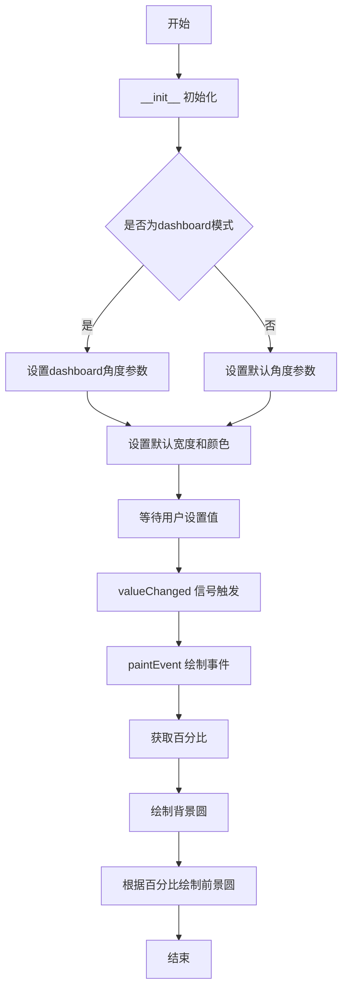
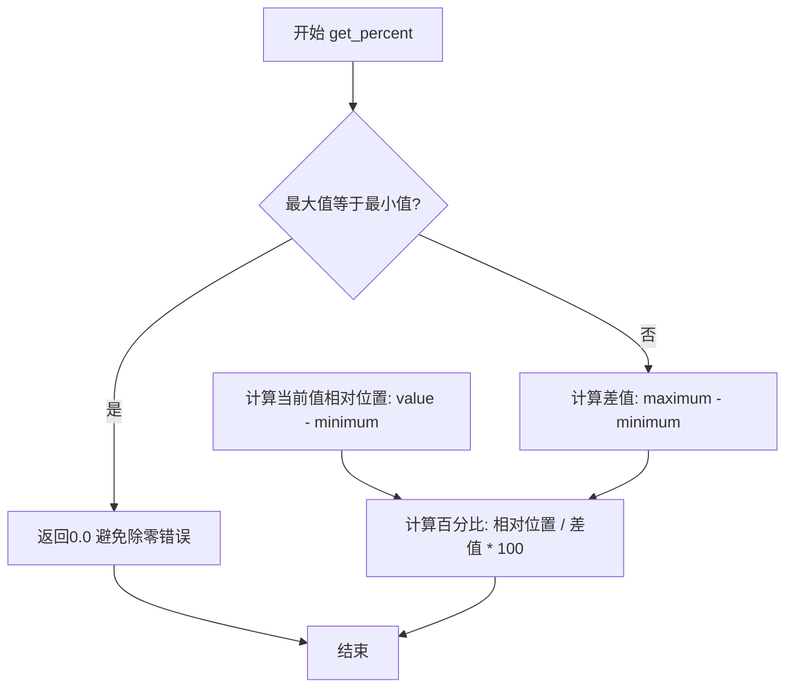
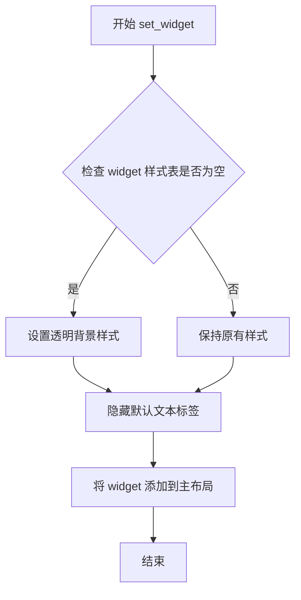
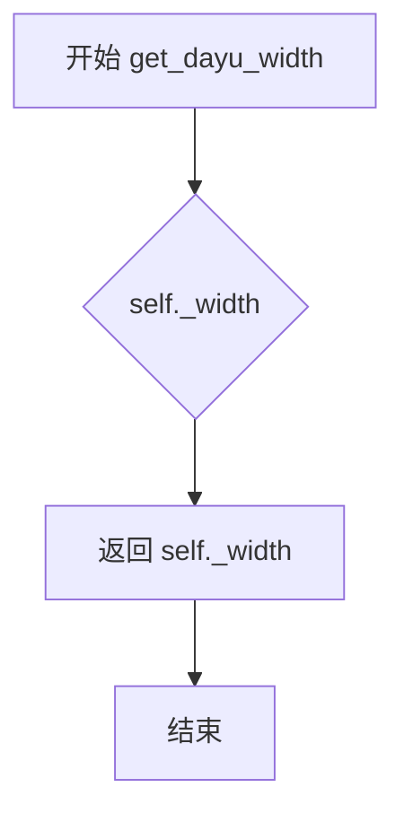
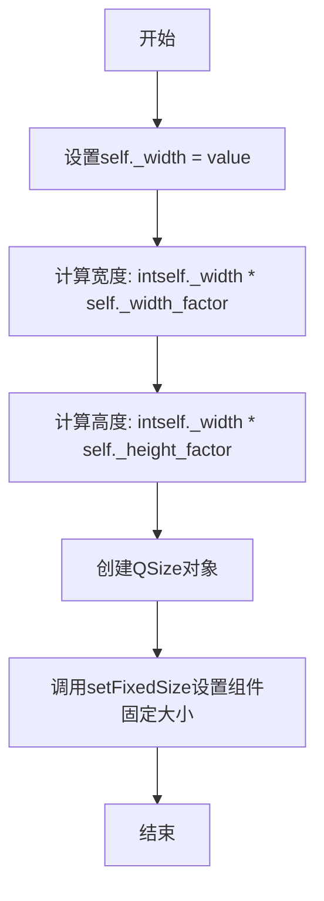
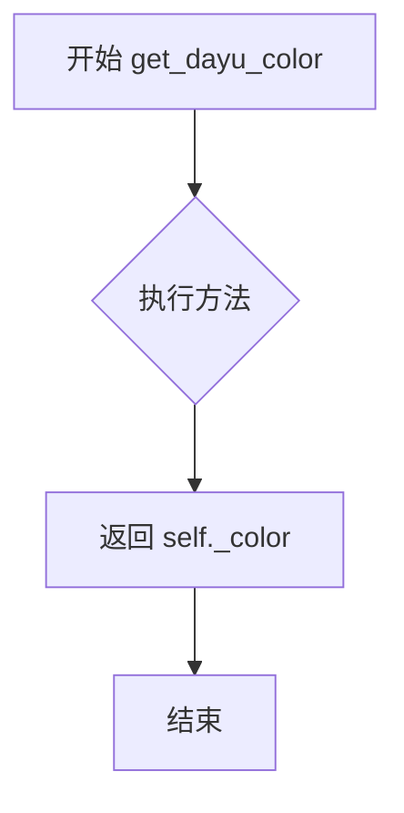
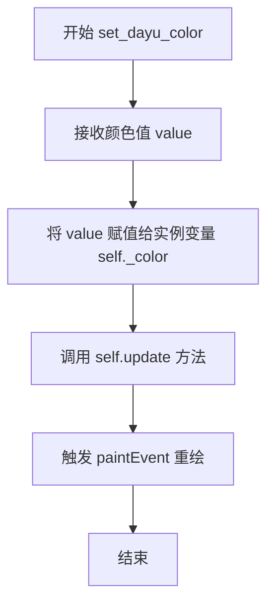
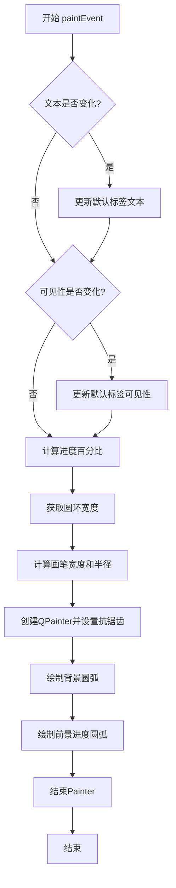

# `comic-translate\app\ui\dayu_widgets\progress_circle.py` 详细设计文档

MProgressCircle是一个基于PySide6的自定义Qt进度条组件，继承自QProgressBar，用于以圆形方式显示操作完成的百分比，支持普通模式和仪表板(dashboard)模式，提供可配置的圆形宽度、前景色和自定义中心小部件功能。

## 整体流程



## 类结构

```
QProgressBar (Qt基类)
└── MProgressCircle (自定义圆形进度条)
```

## 全局变量及字段


### `dayu_theme.progress_circle_default_radius`
    
默认圆形进度条的半径常量

类型：`int`
    


### `dayu_theme.primary_color`
    
主题主色调常量，用于圆形前景色

类型：`str`
    


### `dayu_theme.background_selected_color`
    
背景选中色常量，用于绘制圆形背景弧

类型：`str`
    


### `QtCore.Qt.AlignCenter`
    
Qt对齐常量，表示居中对齐，用于设置默认标签的文本对齐方式

类型：`QtCore.Qt.AlignmentFlag`
    


### `QtCore.Qt.RoundCap`
    
Qt画笔端点样式常量，表示圆头端点，用于设置弧线两端的圆头效果

类型：`QtCore.Qt.PenCapStyle`
    


### `QtGui.QPainter.Antialiasing`
    
Qt渲染提示常量，启用抗锯齿以获得更平滑的圆形绘制效果

类型：`QtGui.QPainter.RenderHint`
    


### `MProgressCircle._main_lay`
    
主水平布局容器，用于包含默认百分比标签或自定义中心部件

类型：`QtWidgets.QHBoxLayout`
    


### `MProgressCircle._default_label`
    
默认百分比显示标签，展示当前进度百分比数值

类型：`MLabel`
    


### `MProgressCircle._color`
    
圆形前景色，存储当前设置的进度条颜色值

类型：`str`
    


### `MProgressCircle._width`
    
圆形固定宽度，存储当前设置的圆形直径大小

类型：`int`
    


### `MProgressCircle._start_angle`
    
起始角度，以1/16度为单位，定义圆形进度条的绘制起始位置

类型：`int`
    


### `MProgressCircle._max_delta_angle`
    
最大角度增量，以1/16度为单位，定义圆形进度条的最大弧度范围

类型：`int`
    


### `MProgressCircle._height_factor`
    
高度缩放因子，用于调整dashboard模式下的圆形高度比例

类型：`float`
    


### `MProgressCircle._width_factor`
    
宽度缩放因子，用于调整dashboard模式下的圆形宽度比例

类型：`float`
    
    

## 全局函数及方法


### `utils.get_percent`

计算百分比工具函数，根据当前值、最小值和最大值计算对应的百分比值。

参数：

- `value`：`int`，当前进度值
- `minimum`：`int`，进度条的最小值
- `maximum`：`int`，进度条的最大值

返回值：`float`，返回计算后的百分比值（0-100之间的浮点数）

#### 流程图



#### 带注释源码

```python
def get_percent(value, minimum, maximum):
    """
    计算百分比工具函数
    :param value: int, 当前进度值
    :param minimum: int, 进度条最小值
    :param maximum: int, 进度条最大值
    :return: float, 百分比值（0-100）
    """
    # 防止除零错误，当最小值等于最大值时返回0
    if maximum == minimum:
        return 0.0
    # 计算当前值在范围内的百分比位置
    # (value - minimum) / (maximum - minimum) * 100
    percent = (value - minimum) / (maximum - minimum) * 100
    return percent
```

#### 使用示例

在 `MProgressCircle.paintEvent` 中的调用：

```python
# 获取当前进度百分比
percent = utils.get_percent(self.value(), self.minimum(), self.maximum())

# 用于计算圆弧绘制角度
# -percent * 0.01 * self._max_delta_angle
painter.drawArc(
    pen_width / 2.0 + 1,
    pen_width / 2.0 + 1,
    radius,
    radius,
    self._start_angle,
    -percent * 0.01 * self._max_delta_angle,  # 将百分比转为0-1范围再乘以总角度
)
```


### `MProgressCircle.__init__`

初始化 MProgressCircle 组件，设置布局、默认标签、颜色、宽度等属性，并根据 dashboard 参数配置仪表盘样式或普通圆形进度条样式。

参数：

- `dashboard`：`bool`，是否为仪表盘样式（dashboard=True 时为 270 度弧形进度条，dashboard=False 时为 360 度圆形进度条）
- `parent`：`QtWidgets.QWidget`，父窗口组件，默认为 None

返回值：`None`，无返回值（构造函数）

#### 流程图

```mermaid
flowchart TD
    A[开始 __init__] --> B[调用父类 QProgressBar 构造函数]
    B --> C[创建 QHBoxLayout 布局管理器]
    C --> D[创建默认 MLabel 标签并设置 H3 样式]
    D --> E[设置标签居中对齐]
    E --> F[将默认标签添加到布局]
    F --> G[设置当前组件的布局为 _main_lay]
    G --> H[初始化颜色和宽度为 None]
    H --> I[设置起始角度为 90*16, 最大角度为 360*16]
    I --> J{参数 dashboard?}
    J -->|True| K[设置起始角度为 225*16]
    K --> L[设置最大角度为 270*16]
    L --> M[设置高度因子为 (2+√2)/4 + 0.03]
    M --> N[设置宽度因子为 1.0]
    J -->|False| O[保持默认角度和因子]
    N --> P[调用 set_dayu_width 设置默认宽度]
    O --> P
    P --> Q[调用 set_dayu_color 设置默认颜色]
    Q --> R[结束 __init__]
```

#### 带注释源码

```python
def __init__(self, dashboard=False, parent=None):
    """
    初始化 MProgressCircle 组件
    :param dashboard: bool, 是否为仪表盘样式（默认 False）
    :param parent: QtWidgets.QWidget, 父窗口组件（默认 None）
    :return: None
    """
    # 调用父类 QProgressBar 的构造函数进行初始化
    super(MProgressCircle, self).__init__(parent)
    
    # 创建水平布局管理器用于放置内部组件
    self._main_lay = QtWidgets.QHBoxLayout()
    
    # 创建默认标签用于显示百分比文本，设置 H3 样式
    self._default_label = MLabel().h3()
    # 设置标签文本居中对齐
    self._default_label.setAlignment(QtCore.Qt.AlignCenter)
    # 将默认标签添加到布局中
    self._main_lay.addWidget(self._default_label)
    # 为进度条设置布局管理器
    self.setLayout(self._main_lay)
    
    # 初始化颜色和宽度属性为 None
    self._color = None
    self._width = None

    # 初始化角度参数（角度乘以 16 以适应 Qt 的 API）
    self._start_angle = 90 * 16  # 起始角度（90度）
    self._max_delta_angle = 360 * 16  # 最大角度变化量（360度）
    # 初始化宽高因子（用于仪表盘样式的椭圆调整）
    self._height_factor = 1.0
    self._width_factor = 1.0
    
    # 如果是仪表盘样式，调整角度和宽高因子
    if dashboard:
        # 仪表盘样式从 225 度开始
        self._start_angle = 225 * 16
        # 仪表盘样式覆盖 270 度范围
        self._max_delta_angle = 270 * 16
        # 仪表盘样式的高度因子（基于 (2+√2)/4 + 0.03）
        self._height_factor = (2 + pow(2, 0.5)) / 4 + 0.03

    # 设置默认的圆形进度条宽度（从主题配置中获取）
    self.set_dayu_width(dayu_theme.progress_circle_default_radius)
    # 设置默认的前景颜色（从主题配置中获取）
    self.set_dayu_color(dayu_theme.primary_color)
```


### MProgressCircle.set_widget

设置自定义小部件以显示在圆形进度条的圆心区域，并替换默认的百分比标签。

参数：

- `widget`：`QWidget`，要显示在圆环中心的自定义Qt小部件

返回值：`None`，无返回值

#### 流程图



#### 带注释源码

```python
def set_widget(self, widget):
    """
    Set a custom widget to show on the circle's inner center
     and replace the default percent label
    :param widget: QWidget
    :return: None
    """
    # 隐藏QProgressBar默认的文本显示
    self.setTextVisible(False)
    
    # 如果widget没有设置样式表，则设置透明背景
    # 以确保自定义widget不会遮挡圆环进度条
    if not widget.styleSheet():
        widget.setStyleSheet("background:transparent")
    
    # 将自定义widget添加到水平布局的中心区域
    self._main_lay.addWidget(widget)
```


### `MProgressCircle.get_dayu_width`

获取圆形进度条的固定宽度属性值。

参数： 无

返回值：`int`，返回当前圆形进度条的固定宽度值（像素）

#### 流程图



#### 带注释源码

```python
def get_dayu_width(self):
    """
    获取当前圆形进度条的固定宽度
    Get current circle fixed width
    
    此方法是 Qt Property 系统的一部分，与 set_dayu_width 配合使用，
    用于获取在 set_dayu_width 中设置的圆形宽度值。
    该值用于控制圆形进度条的显示尺寸。
    
    :return: int - 当前设置的圆形宽度值（像素）
    """
    return self._width
```

---

**补充说明：**

| 项目 | 说明 |
|------|------|
| **所属类** | `MProgressCircle` |
| **方法类型** | Getter 方法，配合 Qt Property 系统使用 |
| **关联属性** | `dayu_width = QtCore.Property(int, get_dayu_width, set_dayu_width)` |
| **关联方法** | `set_dayu_width(self, value)` - 设置宽度 |
| **存储属性** | `self._width` - 内部存储的宽度值 |
| **调用场景** | 在 `paintEvent` 中通过 `total_width = self.get_dayu_width()` 调用 |


### `MProgressCircle.set_dayu_width`

设置圆形进度条的宽度属性，通过宽度因子和高度因子计算实际显示尺寸。

参数：

- `value`：`int`，要设置的圆形宽度值

返回值：`None`，无返回值

#### 流程图



#### 带注释源码

```python
def set_dayu_width(self, value):
    """
    Set current circle fixed width
    :param value: int
    :return: None
    """
    # 1. 将传入的宽度值保存到实例变量_width中
    self._width = value
    
    # 2. 根据宽度因子和高度因子计算实际显示的宽度和高度
    # 宽度因子_width_factor和高度_factor用于支持仪表盘样式
    # 仪表盘模式下宽度因子为1.0，高度因子会调整以适应弧形显示
    calculated_width = int(self._width * self._width_factor)
    calculated_height = int(self._width * self._height_factor)
    
    # 3. 创建QSize对象并设置组件的固定大小
    # 这会重写QProgressBar的默认尺寸策略
    self.setFixedSize(QtCore.QSize(calculated_width, calculated_height))
```


### `MProgressCircle.get_dayu_color`

获取圆形进度条的当前前景色属性值。

参数： 无

返回值：`str`，返回当前设置的圆形前景色（颜色值字符串）

#### 流程图



#### 带注释源码

```python
def get_dayu_color(self):
    """
    Get current circle foreground color
    :return: str
    """
    return self._color
```


### `MProgressCircle.set_dayu_color`

设置圆形进度条的前景颜色（圆环颜色），用于自定义进度条的显示颜色。

参数：

- `value`：`str`，颜色值，可以是颜色名称（如 "red"）或十六进制颜色代码（如 "#FF0000"）

返回值：`None`，无返回值

#### 流程图



#### 带注释源码

```python
def set_dayu_color(self, value):
    """
    Set current circle's foreground color
    :param value: str 颜色值，可以是颜色名称或十六进制颜色代码
    :return: None 无返回值
    """
    # 将传入的颜色值保存到实例变量 _color 中
    self._color = value
    
    # 调用 Qt 的 update 方法，触发 paintEvent 事件
    # 这会使得进度条使用新的颜色进行重绘
    self.update()
```


### `MProgressCircle.paintEvent`

该方法重写了QProgressBar的paintEvent，用于实现圆形进度条的渲染功能。通过Qt绘图引擎在控件上绘制两个圆弧：背景圆弧（显示整体进度条范围）和前景圆弧（根据当前进度值动态绘制已完成部分），同时处理文本标签的同步更新。

参数：

- `self`：当前MProgressCircle实例，隐式传递
- `event`：`QtGui.QPaintEvent`，Qt绘图事件对象（本方法中未直接使用，仅作为Qt事件处理程序签名所需）

返回值：`None`，无返回值（方法重写父类paintEvent）

#### 流程图



#### 带注释源码

```python
def paintEvent(self, event):
    """
    Override QProgressBar's paintEvent to implement circular progress rendering.
    重写QProgressBar的paintEvent以实现圆形进度渲染。
    """
    # 检查进度条文本是否与默认标签文本不同，如果是则同步更新默认标签
    # This ensures the default label displays the current progress text
    if self.text() != self._default_label.text():
        self._default_label.setText(self.text())
    
    # 检查文本可见性设置是否与默认标签的可见性一致，不一致则同步更新
    # Sync visibility of default label with progress bar's text visibility setting
    if self.isTextVisible() != self._default_label.isVisible():
        self._default_label.setVisible(self.isTextVisible())

    # 使用工具函数计算当前进度百分比
    # Calculate current progress percentage using utility function
    percent = utils.get_percent(self.value(), self.minimum(), self.maximum())
    
    # 获取圆形进度条的固定宽度
    # Get the fixed width of the circular progress bar
    total_width = self.get_dayu_width()
    
    # 根据总宽度计算画笔宽度和圆环半径
    # Calculate pen width and radius based on total width
    pen_width = int(3 * total_width / 50.0)
    radius = total_width - pen_width - 1

    # 创建QPainter对象用于自定义绘制
    # Create QPainter for custom drawing
    painter = QtGui.QPainter(self)
    
    # 启用抗锯齿以获得平滑的圆形边缘
    # Enable antialiasing for smooth circular edges
    painter.setRenderHints(QtGui.QPainter.Antialiasing)

    # ========== 绘制背景圆弧 ==========
    # Draw background circle (full circle representing total range)
    
    # 创建背景画笔
    # Create background pen
    pen_background = QtGui.QPen()
    pen_background.setWidth(pen_width)  # 设置画笔宽度
    pen_background.setColor(QtGui.QColor(dayu_theme.background_selected_color))  # 设置背景颜色
    pen_background.setCapStyle(QtCore.Qt.RoundCap)  # 设置线帽样式为圆角
    painter.setPen(pen_background)
    
    # 绘制完整的背景圆弧
    # Draw full background arc (360 degrees represented as negative angle)
    painter.drawArc(
        pen_width / 2.0 + 1,      # x坐标
        pen_width / 2.0 + 1,      # y坐标
        radius,                    # 宽度
        radius,                    # # 高度
        self._start_angle,         # 起始角度（单位：1/16度）
        -self._max_delta_angle,    # 扫描角度（负值表示顺时针）
    )

    # ========== 绘制前景进度圆弧 ==========
    # Draw foreground circle (progress arc showing completion)
    
    # 创建前景画笔（使用用户指定的颜色）
    # Create foreground pen with user-specified color
    pen_foreground = QtGui.QPen()
    pen_foreground.setWidth(pen_width)
    pen_foreground.setColor(QtGui.QColor(self._color))  # 使用dayu_color属性颜色
    pen_foreground.setCapStyle(QtCore.Qt.RoundCap)
    painter.setPen(pen_foreground)
    
    # 绘制进度圆弧，长度根据当前百分比计算
    # Draw progress arc, length calculated based on current percentage
    painter.drawArc(
        pen_width / 2.0 + 1,
        pen_width / 2.0 + 1,
        radius,
        radius,
        self._start_angle,
        -percent * 0.01 * self._max_delta_angle,  # 将百分比转换为角度
    )
    
    # 结束绘制，释放画家资源
    # End painting and release painter resources
    painter.end()
```


### `MProgressCircle.dashboard`

创建并返回一个 dashboard 样式的圆形进度条实例。dashboard 模式下的进度条具有不同的角度范围（225° 到 495°，即 270° 弧度）和高度/宽度比例，适合仪表盘风格的 UI 展示。

参数：

- `parent`：`QtWidgets.QWidget`，可选参数，父 widget，用于设置进度条的父对象，默认为 None

返回值：`MProgressCircle`，返回 dashboard 样式的圆形进度条实例

#### 流程图

```mermaid
flowchart TD
    A[开始] --> B[调用 MProgressCircle 构造函数]
    B --> C[设置 dashboard=True]
    C --> D[传入 parent 参数]
    D --> E[初始化 dashboard 模式参数:<br/>_start_angle = 225 * 16<br/>_max_delta_angle = 270 * 16<br/>_height_factor = (2 + √2)/4 + 0.03]
    E --> F[返回 MProgressCircle 实例]
    F --> G[结束]
```

#### 带注释源码

```python
@classmethod
def dashboard(cls, parent=None):
    """
    创建 dashboard 样式 MProgressCircle 实例的类方法
    
    Args:
        cls: 类本身（隐式参数）
        parent: 父 widget，可选参数，默认为 None
        
    Returns:
        MProgressCircle: dashboard 模式的圆形进度条实例
    """
    # 调用 MProgressCircle 构造函数，传入 dashboard=True 标志
    # 这样会在初始化时设置 dashboard 特有的角度和尺寸参数
    return MProgressCircle(dashboard=True, parent=parent)
```

## 关键组件


### MProgressCircle 类

核心功能：基于PySide6的圆形进度条控件，支持仪表盘模式、自定义中心widget、颜色和宽度配置

### 圆形进度绘制组件

paintEvent方法实现，负责绘制背景圆环和前景进度圆环，使用QPainter和drawArc绘制，支持抗锯齿和圆角端点样式

### 属性系统组件

dayu_width和dayu_color两个Qt属性，通过QtCore.Property定义，实现属性的getter/setter封装，支持Qt属性系统绑定

### 仪表盘模式组件

dashboard类方法和dashboard参数支持，创建270度范围的仪表盘样式进度条，适用于仪表盘展示场景

### 自定义中心组件

set_widget方法，允许用户设置自定义widget替代默认百分比文本显示

### 角度计算组件

_start_angle和_max_delta_angle控制进度条起始角度和总角度范围，支持普通模式和仪表盘模式的不同角度配置

### 主题配置组件

集成dayu_theme模块的progress_circle_default_radius和primary_color作为默认配置，background_selected_color用于背景环绘制


## 问题及建议


### 已知问题

-   **魔法数字缺乏解释**：代码中存在多个硬编码数值（如`50.0`、`0.03`、`(2 + pow(2, 0.5)) / 4`），这些数值缺乏注释说明其来源和含义，影响代码可维护性。
-   **paintEvent中的冗余操作**：每次绘制时都会调用`self._default_label.setText()`和`setVisible()`，即使文本未发生变化也会触发不必要的UI更新和重绘。
-   **除零风险**：在`utils.get_percent()`调用和`percent * 0.01`计算中未对`maximum()`和`minimum()`进行差值检查，当两者相等时可能导致除零错误或异常行为。
-   **属性定义顺序不符合规范**：`QtCore.Property`的定义位于方法定义之后，虽然功能正常但不符合Python/PEP8的类定义组织规范（属性应早于方法定义）。
-   **缺少析构和资源清理**：没有实现`__del__`方法或显式的资源清理机制，自定义widget通过`set_widget`设置后缺乏生命周期管理。
-   **文档不完整**：部分方法（如`paintEvent`）缺少完整的文档字符串说明；参数和返回值类型注解不完整（如`set_widget`缺少返回类型）。

### 优化建议

-   **消除魔法数字**：将硬编码的数值提取为类常量或配置参数，并添加注释说明其用途和计算逻辑。
-   **优化paintEvent性能**：在设置文本和可见性前添加状态检查，避免不必要的UI更新操作。
-   **添加边界值检查**：在计算百分比前检查`maximum() - minimum()`是否为零，并处理相应的边界情况。
-   **调整代码结构**：将`QtCore.Property`定义移至类开头位置，并按照类常量、实例属性、方法顺序组织代码。
-   **完善文档和类型注解**：为所有公开方法添加完整的文档字符串，包括参数类型和返回值类型；添加类型注解以提高代码可读性和IDE支持。
-   **考虑添加自定义widget的清理逻辑**：在替换或移除widget时调用`deleteLater()`防止内存泄漏。
-   **提取配置参数**：将角度相关的常量（`90 * 16`、`225 * 16`、`270 * 16`）提取为类常量，便于样式扩展和维护。


## 其它


### 设计目标与约束

设计目标：提供一个美观的圆形进度条组件，用于显示操作流程的完成百分比。支持普通模式和仪表盘(dashboard)模式，可自定义内部显示的widget，并提供dayu_width和dayu_color两个Qt属性用于自定义样式。

约束条件：
- 必须继承自QtWidgets.QProgressBar以保持与Qt框架的兼容性
- 必须使用PySide6作为UI框架
- 依赖dayu_theme模块获取默认颜色和主题配置
- 依赖utils模块的get_percent函数计算进度百分比
- 依赖MLabel组件显示默认百分比文本

### 错误处理与异常设计

当前代码未包含显式的错误处理和异常捕获机制，存在以下潜在问题：

1. **参数有效性验证缺失**：set_dayu_width和set_dayu_color方法未对输入参数进行有效性检查，可能接收None或非法值导致运行时错误
2. **除零风险**：paintEvent中计算percent时，如果minimum()和maximum()相同且为0，可能导致除零错误
3. **布局管理风险**：set_widget方法未检查widget是否为None，也未提供移除已添加widget的方法
4. **线程安全性**：paintEvent在主线程中执行，若多线程修改进度值可能导致绘制异常

建议改进：添加参数类型检查和边界值验证，实现异常捕获机制，考虑添加线程同步保护

### 数据流与状态机

数据流：
1. 用户通过QProgressBar的标准接口（如setValue）设置进度值
2. paintEvent被触发时，调用utils.get_percent计算进度百分比
3. 根据百分比计算弧形绘制的角度范围
4. 使用QPainter绘制背景圆弧和前景圆弧
5. 若使用默认标签，同步更新_default_label的显示文本

状态机：
- **显示模式状态**：显示默认百分比标签 / 显示自定义widget（通过set_widget设置）
- **文本可见性状态**：文本可见 / 文本不可见（通过setTextVisible控制）
- **样式模式状态**：普通圆形模式 / dashboard仪表盘模式（通过构造函数dashboard参数选择）

### 外部依赖与接口契约

外部依赖模块：
1. **PySide6.QtCore**：提供QtCore.Qt枚举、QtCore.Property、QtCore.QSize
2. **PySide6.QtGui**：提供QPainter、QPen、QColor和渲染提示
3. **PySide6.QtWidgets**：提供QProgressBar、QHBoxLayout基类
4. **dayu_theme模块**：提供progress_circle_default_radius（默认半径）、primary_color（主题色）、background_selected_color（背景色）
5. **utils模块**：提供get_percent函数用于计算进度百分比
6. **MLabel类**：提供默认的百分比文本显示标签

公开接口契约：
- 构造函数：MProgressCircle(dashboard=False, parent=None)，dashboard为True时创建仪表盘样式
- 类方法：dashboard(parent=None)，工厂方法创建仪表盘样式实例
- Qt属性：dayu_width（int类型，圆形宽度）、dayu_color（str类型，前景颜色）
- 标准Qt接口：继承自QProgressBar的所有接口（setValue、value、minimum、maximum、setTextVisible、isTextVisible等）
- 自定义接口：set_widget(widget)，设置自定义内部widget

### 兼容性设计

Qt版本兼容性：代码使用PySide6，需要确认Qt6版本兼容性，某些Qt5的API可能存在差异
Python版本兼容性：代码使用了from __future__ import语句，理论上支持Python 2.7+和Python 3.x
UI框架兼容性：仅支持PySide6，如需支持PyQt5或PyQt6需要条件导入修改

### 国际化与本地化

当前代码未包含国际化支持，文本内容（如默认显示的百分比）直接使用数字，未考虑不同语言环境下的格式化需求。若需要国际化，应使用Qt的QCoreApplication.translate或Qt样式表进行文本替换。

### 性能考虑

潜在性能问题：
1. paintEvent每次重绘都会创建新的QPainter和QPen对象，可能产生额外开销
2. 未实现绘制缓存机制，频繁更新进度时可能导致性能下降
3. 未使用QPen的共享机制，重复设置相同属性

优化建议：考虑使用QPicture或QPixmap缓存绘制结果，减少重复绘制开销

    