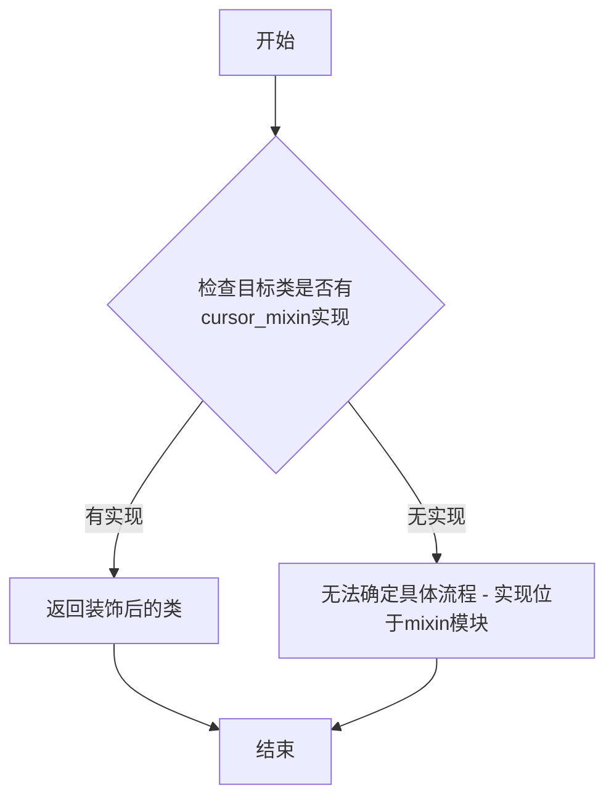
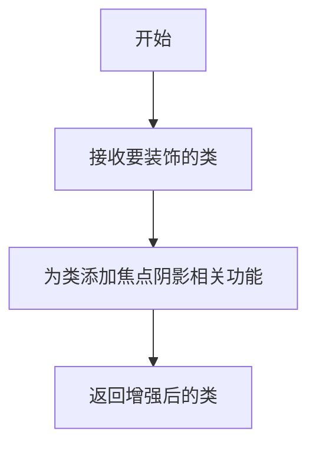
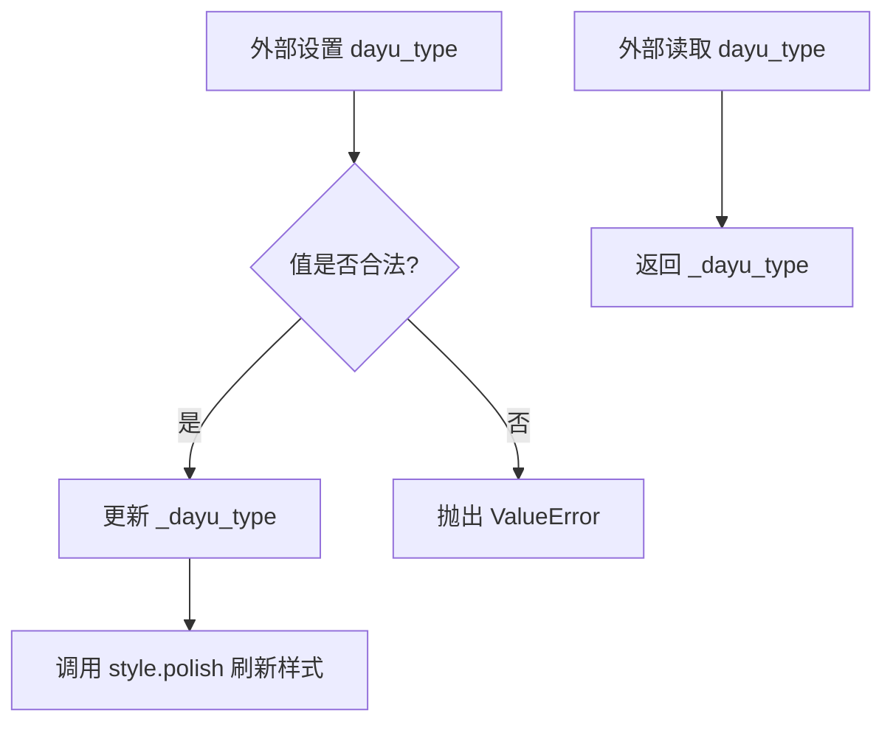
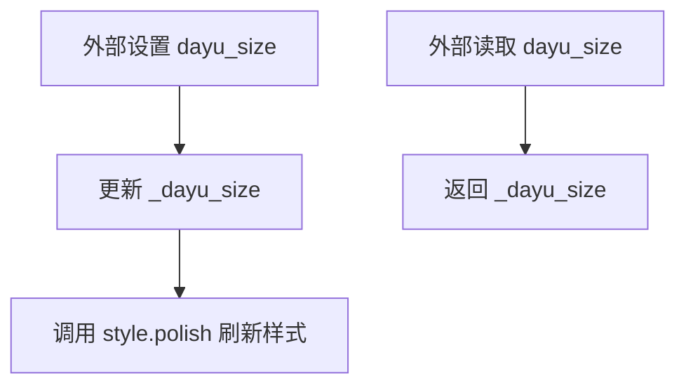
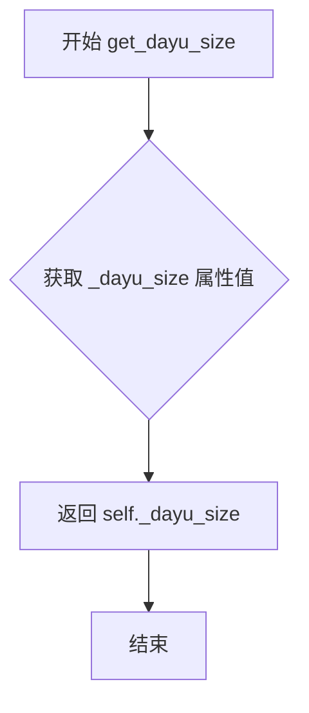
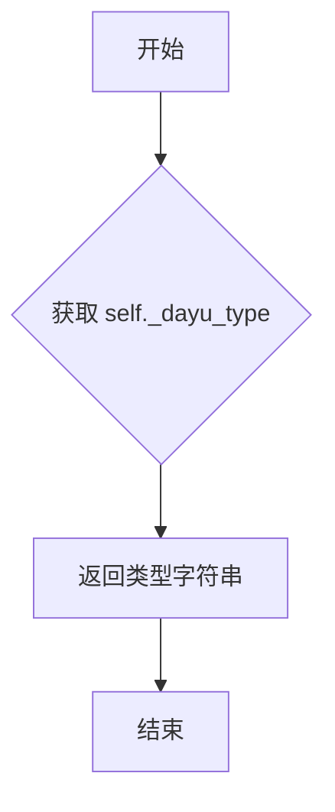
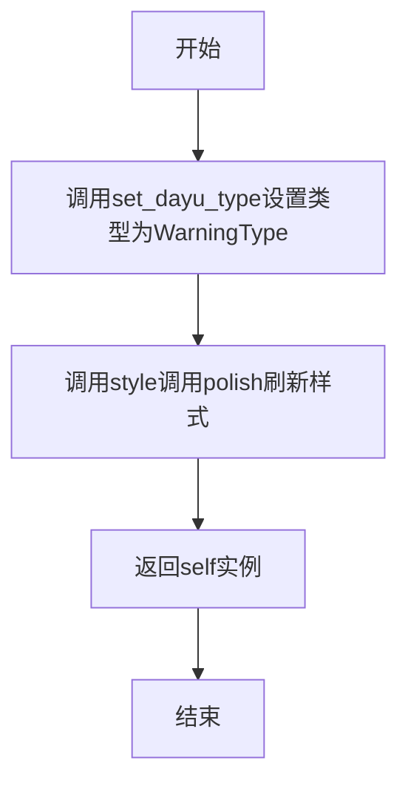
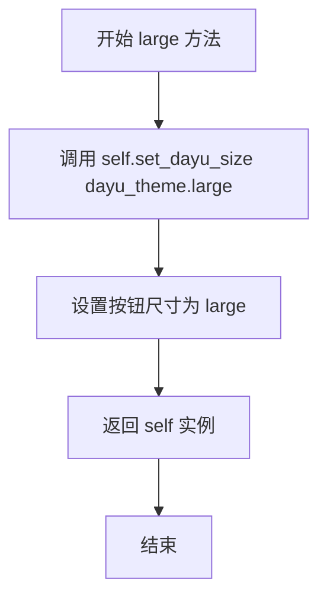

# `comic-translate\app\ui\dayu_widgets\push_button.py` 详细设计文档

MPushButton是一个基于PySide6的自定义按钮组件，属于dayu_theme UI框架。它扩展了QtWidgets.QPushButton，提供了预设的样式类型（default/primary/success/warning/danger）和尺寸（tiny/small/medium/large/huge），支持链式调用设置按钮样式，并通过mixin机制集成了光标和焦点阴影功能。

## 整体流程

```mermaid
graph TD
    A[创建MPushButton实例] --> B{icon是否为None}
    B -- 是 --> C[调用super().__init__(text=text, parent=parent)]
    B -- 否 --> D[调用super().__init__(icon=icon, text=text, parent=parent)]
    C --> E[初始化_dayu_type为DefaultType]
    D --> E
    E --> F[初始化_dayu_size为dayu_theme.default_size]
    F --> G[应用cursor_mixin和focus_shadow_mixin装饰器]
    G --> H[等待用户调用样式方法]
    H --> I{调用样式方法}
    I --> J[primary/success/warning/danger]
    I --> K[huge/large/medium/small/tiny]
    J --> L[set_dayu_type更新类型]
    K --> M[set_dayu_size更新尺寸]
    L --> N[style().polish刷新样式]
    M --> N
```

## 类结构

```
QtWidgets.QPushButton (Qt基类)
└── MPushButton (自定义按钮组件)
    ├── cursor_mixin (装饰器-光标混合)
    └── focus_shadow_mixin (装饰器-焦点阴影混合)
```

## 全局变量及字段


### `dayu_theme`
    
主题配置模块

类型：`module`
    


### `cursor_mixin`
    
光标混合类装饰器

类型：`function`
    


### `focus_shadow_mixin`
    
焦点阴影混合类装饰器

类型：`function`
    


### `MPushButton.DefaultType`
    
默认类型常量

类型：`str`
    


### `MPushButton.PrimaryType`
    
主要类型常量

类型：`str`
    


### `MPushButton.SuccessType`
    
成功类型常量

类型：`str`
    


### `MPushButton.WarningType`
    
警告类型常量

类型：`str`
    


### `MPushButton.DangerType`
    
危险类型常量

类型：`str`
    


### `MPushButton._dayu_type`
    
按钮当前类型

类型：`str`
    


### `MPushButton._dayu_size`
    
按钮当前尺寸

类型：`int`
    
    

## 全局函数及方法


### `cursor_mixin`

这是一个光标混合装饰器函数，用于为 QWidget 子类添加自定义光标行为。从代码中可以看出，该装饰器被应用于 `MPushButton` 类，但实际的装饰器实现位于 `mixin` 模块中，当前代码文件仅导入了该函数。

#### 流程图



#### 带注释源码

```python
# 当前代码文件中仅导入cursor_mixin，实际实现位于mixin模块
from .mixin import cursor_mixin

# cursor_mixin作为装饰器使用，应用于MPushButton类
@cursor_mixin
@focus_shadow_mixin
class MPushButton(QtWidgets.QPushButton):
    """
    MPushButton类使用了cursor_mixin装饰器
    该装饰器会在鼠标悬停等事件发生时改变光标样式
    """
    # ... 类的其他实现
```

**注意**：根据提供的代码文件，`cursor_mixin` 函数的完整实现并未包含在此代码中。该函数是从同目录下的 `mixin` 模块导入的。要获取完整的 `cursor_mixin` 实现细节，需要查看 `mixin.py` 文件或相关模块。


根据提供的代码，我需要说明一个问题：**focus_shadow_mixin 函数的具体实现在当前代码片段中并未给出**，它是通过 `from .mixin import focus_shadow_mixin` 从外部模块导入的。

但是，我可以从代码的使用方式中提取以下信息：

---

### `focus_shadow_mixin`

焦点阴影混合装饰器函数，用于为 Qt 按钮添加焦点阴影效果。

参数：

- 无显式参数（作为装饰器使用，接收被装饰的类作为参数）

返回值：`类型未知`，返回装饰后的类（通常返回修改后的类）

#### 流程图



#### 带注释源码

```
# 该函数定义在 mixin.py 模块中，当前代码中仅显示导入和使用方式
from .mixin import focus_shadow_mixin

# 使用装饰器模式为 MPushButton 类添加焦点阴影功能
@cursor_mixin
@focus_shadow_mixin
class MPushButton(QtWidgets.QPushButton):
    # ... 类定义
```

---

### ⚠️ 信息不完整

**要获取完整的 `focus_shadow_mixin` 详细信息，需要查看 `mixin.py` 文件的实际实现代码。** 当前提供的代码片段仅包含了：
1. 导入语句
2. 作为装饰器的使用方式

如果您能提供 `mixin.py` 文件的内容，我可以为您完成完整的详细设计文档。


### `MPushButton.dayu_type`

Qt属性，用于获取和设置按钮的类型（样式）。

参数：

- `value`：`str`，要设置的按钮类型，必须是 "default"、"primary"、"success"、"warning" 或 "danger" 之一

返回值：`str`，返回当前按钮的类型

#### 流程图



#### 带注释源码

```python
def get_dayu_type(self):
    """
    Get the push button type.
    :return: string.
    """
    return self._dayu_type

def set_dayu_type(self, value):
    """
    Set the push button type.
    :return: None
    """
    if value in [
        MPushButton.DefaultType,
        MPushButton.PrimaryType,
        MPushButton.SuccessType,
        MPushButton.WarningType,
        MPushButton.DangerType,
    ]:
        self._dayu_type = value
    else:
        raise ValueError(
            "Input argument 'value' should be one of " "default/primary/success/warning/danger string."
        )
    self.style().polish(self)

# Qt属性定义：将getter和setter绑定到属性上
dayu_type = QtCore.Property(str, get_dayu_type, set_dayu_type)
```

---

### `MPushButton.dayu_size`

Qt属性，用于获取和设置按钮的尺寸大小。

参数：

- `value`：`int`，要设置的按钮尺寸大小

返回值：`int`，返回当前按钮的尺寸大小

#### 流程图



#### 带注释源码

```python
def get_dayu_size(self):
    """
    Get the push button height
    :return: integer
    """
    return self._dayu_size

def set_dayu_size(self, value):
    """
    Set the avatar size.
    :param value: integer
    :return: None
    """
    self._dayu_size = value
    self.style().polish(self)

# Qt属性定义：将getter和setter绑定到属性上
dayu_size = QtCore.Property(int, get_dayu_size, set_dayu_size)
```


### `MPushButton.__init__`

该方法是 `MPushButton` 类的构造函数，用于初始化一个自定义样式的按钮组件。根据是否传入图标参数，选择调用父类 `QPushButton` 的不同构造函数，并设置默认的按钮类型和尺寸。

参数：

- `text`：`str`，按钮上显示的文本内容，默认为空字符串
- `icon`：`QtGui.QIcon | None`，按钮上显示的图标，默认为 `None`
- `parent`：`QtWidgets.QWidget | None`，父窗口部件，用于构建控件层级，默认为 `None`

返回值：`None`，该方法不返回任何值

#### 流程图

```mermaid
flowchart TD
    A[开始 __init__] --> B{icon is None?}
    B -->|是| C[调用 super().__init__ text=text, parent=parent]
    B -->|否| D[调用 super().__init__ icon=icon, text=text, parent=parent]
    C --> E[self._dayu_type = DefaultType]
    D --> E
    E --> F[self._dayu_size = default_size]
    F --> G[结束]
```

#### 带注释源码

```python
def __init__(self, text="", icon=None, parent=None):
    """
    初始化 MPushButton 实例。
    
    参数:
        text: 按钮显示的文本，默认为空字符串
        icon: 按钮显示的图标，默认为 None
        parent: 父窗口部件，默认为 None
    """
    # 判断是否提供了图标
    if icon is None:
        # 无图标时调用父类简化构造函数
        super(MPushButton, self).__init__(text=text, parent=parent)
    else:
        # 有图标时调用带图标参数的父类构造函数
        super(MPushButton, self).__init__(icon=icon, text=text, parent=parent)
    
    # 初始化按钮类型为默认类型
    self._dayu_type = MPushButton.DefaultType
    # 初始化按钮尺寸为主题默认尺寸
    self._dayu_size = dayu_theme.default_size
```


### `MPushButton.get_dayu_size`

获取按钮的尺寸大小，该方法返回按钮当前的尺寸值（高度）。

参数： 无

返回值：`integer`，返回按钮的尺寸值（整数类型）

#### 流程图



#### 带注释源码

```python
def get_dayu_size(self):
    """
    获取按钮的高度尺寸
    :return: integer 按钮的尺寸值（整数类型）
    """
    # 返回私有属性 _dayu_size，该属性存储了按钮的尺寸信息
    return self._dayu_size
```


### `MPushButton.set_dayu_size`

设置按钮的尺寸大小，通过修改内部 `_dayu_size` 属性并触发样式刷新使更改生效。

参数：

- `value`：`int`，整数类型，表示按钮的尺寸大小

返回值：`None`，无返回值

#### 流程图

```mermaid
flowchart TD
    A[开始 set_dayu_size] --> B[接收参数 value]
    B --> C{验证 value 是否为有效整数}
    C -->|是| D[将 value 赋值给 self._dayu_size]
    C -->|否| E[可选择抛出异常或使用默认值]
    D --> F[调用 self.style().polish self 刷新按钮样式]
    F --> G[结束方法]
```

#### 带注释源码

```python
def set_dayu_size(self, value):
    """
    设置按钮的尺寸大小。
    :param value: integer 整数类型的尺寸值
    :return: None 无返回值
    """
    # 将传入的尺寸值保存到实例属性 _dayu_size 中
    self._dayu_size = value
    # 调用 Qt 的样式系统刷新按钮外观，使尺寸更改立即生效
    # polish() 会重新计算样式并应用到控件上
    self.style().polish(self)
```


### `MPushButton.get_dayu_type`

获取按钮的类型（dayu_type）属性值。

参数：

- 无参数（仅包含隐式参数 `self`）

返回值：`str`，返回当前按钮的类型字符串，可能的值为 "default"、"primary"、"success"、"warning" 或 "danger"。

#### 流程图



#### 带注释源码

```python
def get_dayu_type(self):
    """
    Get the push button type.
    :return: string.
    """
    # 返回内部存储的按钮类型属性值
    # 该值在类初始化时默认为 DefaultType = "default"
    # 可通过 set_dayu_type 方法或 fluent 接口方法（primary/success/warning/danger）设置
    return self._dayu_type
```

#### 补充说明

该方法作为 Qt Property 系统的一部分，与 `set_dayu_type` 方法配对使用，通过 `QtCore.Property(str, get_dayu_type, set_dayu_type)` 定义为 `dayu_type` 属性。这允许在 Qt 样式表或 Qt Designer 中以属性方式访问按钮类型。该方法是纯函数，无副作用，仅返回内部状态值。


### `MPushButton.set_dayu_type(value)`

设置按钮的视觉类型（样式主题），用于改变按钮的外观风格，如默认、主要、成功、警告或危险类型。

参数：

- `value`：`str`，要设置的按钮类型值，有效值为 "default"、"primary"、"success"、"warning"、"danger"

返回值：`None`，无返回值，仅更新按钮的内部状态并刷新样式

#### 流程图

```mermaid
flowchart TD
    A[开始 set_dayu_type] --> B{检查 value 是否有效}
    B -->|有效| C[更新 self._dayu_type = value]
    B -->|无效| D[抛出 ValueError 异常]
    C --> E[调用 self.style().polish self 刷新样式]
    D --> F[结束]
    E --> F
```

#### 带注释源码

```python
def set_dayu_type(self, value):
    """
    Set the push button type.
    设置按钮的类型样式
    
    :param value: str, 按钮类型，有效值为 'default', 'primary', 'success', 'warning', 'danger'
    :return: None
    """
    # 检查传入的值是否在允许的类型列表中
    if value in [
        MPushButton.DefaultType,    # "default"
        MPushButton.PrimaryType,    # "primary"
        MPushButton.SuccessType,    # "success"
        MPushButton.WarningType,    # "warning"
        MPushButton.DangerType,     # "danger"
    ]:
        # 值有效，更新内部属性 _dayu_type
        self._dayu_type = value
    else:
        # 值无效，抛出 ValueError 异常并给出错误提示
        raise ValueError(
            "Input argument 'value' should be one of " "default/primary/success/warning/danger string."
        )
    # 调用 Qt 样式系统刷新按钮外观，使新类型生效
    self.style().polish(self)
```


### `MPushButton.primary`

设置按钮为主要类型（PrimaryType），使按钮呈现主要样式。

参数：

- `self`：`MPushButton`，表示调用该方法的按钮实例本身

返回值：`MPushButton`，返回按钮实例本身，支持方法链式调用

#### 流程图

```mermaid
flowchart TD
    A[Start: 调用 primary 方法] --> B{验证类型是否合法}
    B -->|是| C[调用 set_dayu_type 设置类型为 PrimaryType]
    B -->|否| D[抛出 ValueError 异常]
    C --> E[调用 style().polish 刷新样式]
    E --> F[返回 self 实例]
    F --> G[End: 方法结束]
```

#### 带注释源码

```python
def primary(self):
    """
    设置 MPushButton 为主题的主要类型（PrimaryType）
    
    该方法将按钮的类型设置为 'primary'，通常用于突出显示
    主要操作或最重要的操作按钮。
    
    实现原理：
    1. 通过 set_dayu_type 方法设置内部 _dayu_type 属性为 PrimaryType
    2. 调用 style().polish(self) 触发 Qt 样式系统重新应用样式
    3. 返回 self 以支持方法链式调用（如 button.primary().large()）
    
    参数:
        无（实例方法，隐含 self 参数）
    
    返回值:
        MPushButton: 返回按钮实例本身，支持链式调用
        例如: button.primary().large() 可以连续设置类型和尺寸
    
    示例:
        # 设置为主要类型按钮
        btn = MPushButton("提交")
        btn.primary()
        
        # 链式调用
        btn.primary().large()
    """
    """Set MPushButton to PrimaryType"""
    self.set_dayu_type(MPushButton.PrimaryType)
    return self
```


### `MPushButton.success`

设置按钮为成功类型（SuccessType），用于将按钮的视觉样式更改为成功状态，并返回按钮自身以支持链式调用。

参数：

- 此方法无显式参数（`self` 为隐式参数，表示按钮实例本身）

返回值：`MPushButton`，返回按钮实例本身，支持链式调用（例如 `button.success().large()`）

#### 流程图

```mermaid
flowchart TD
    A[开始 success 方法] --> B{验证 SuccessType 是否有效}
    B -->|是| C[调用 set_dayu_type 设置类型为 SuccessType]
    B -->|否| D[由 set_dayu_type 抛出 ValueError]
    C --> E[调用 style().polish 刷新按钮样式]
    E --> F[返回 self 实例]
    D --> G[异常处理]
    
    style B fill:#e1f5fe
    style C fill:#e8f5e8
    style F fill:#fff3e0
```

#### 带注释源码

```python
def success(self):
    """
    Set MPushButton to SuccessType
    
    将按钮的 dayu_type 属性设置为 SuccessType ("success")，
    这会改变按钮的视觉样式为成功状态（如绿色）。
    
    Returns:
        MPushButton: 返回按钮实例自身，支持链式调用
                      (例如: button.success().large())
    
    Example:
        # 基本用法
        button = MPushButton("确定")
        button.success()
        
        # 链式调用
        button.success().large()
    """
    # 调用 set_dayu_type 方法，将按钮类型设置为 SuccessType
    self.set_dayu_type(MPushButton.SuccessType)
    
    # 返回 self 以支持链式调用模式
    return self
```


### `MPushButton.warning()`

设置按钮为警告类型，用于触发警示操作或显示需要用户注意的内容。

参数：

- （无参数）

返回值：`MPushButton`，返回按钮实例自身，支持方法链式调用

#### 流程图



#### 带注释源码

```python
def warning(self):
    """Set MPushButton to  WarningType"""
    # 调用内部方法设置按钮类型为警告类型
    self.set_dayu_type(MPushButton.WarningType)
    # 返回self以支持链式调用，如 button.warning().large()
    return self
```


### `MPushButton.danger`

设置按钮为危险类型（DangerType），常用于删除、警告等危险操作。

参数：
- 无（仅 `self`）

返回值：`MPushButton`，返回按钮实例自身，支持链式调用。

#### 流程图

```mermaid
graph TD
    A[调用 danger 方法] --> B{检查类型有效性}
    B -->|有效| C[设置 _dayu_type = DangerType 'danger']
    B -->|无效| D[抛出 ValueError]
    C --> E[调用 style().polish 刷新样式]
    E --> F[返回 self 实例]
```

#### 带注释源码

```python
def danger(self):
    """Set MPushButton to DangerType"""
    # 调用 set_dayu_type 方法，将按钮类型设置为危险类型
    self.set_dayu_type(MPushButton.DangerType)
    # 返回 self 以支持链式调用（如 button.danger().huge()）
    return self
```


### `MPushButton.huge`

设置MPushButton为巨大尺寸

参数：

- 无

返回值：`MPushButton`，返回按钮自身，支持链式调用

#### 流程图

```mermaid
graph TD
    A[开始] --> B[调用set_dayu_size设置尺寸为dayu_theme.huge]
    B --> C[调用style().polish更新样式]
    C --> D[返回self]
    D --> E[结束]
```

#### 带注释源码

```python
def huge(self):
    """
    Set MPushButton to huge size
    设置按钮为巨大尺寸
    """
    # 调用set_dayu_size方法，将_dayu_size设置为dayu_theme.huge
    # 内部会触发style().polish(self)来更新按钮样式
    self.set_dayu_size(dayu_theme.huge)
    # 返回self，支持链式调用（例如button.huge().primary()）
    return self
```


### `MPushButton.large`

设置 MPushButton 按钮为大尺寸（large）。

参数：

- 无（仅包含 `self` 实例引用）

返回值：`MPushButton`，返回按钮实例本身，支持链式调用。

#### 流程图



#### 带注释源码

```python
def large(self):
    """
    Set MPushButton to large size
    
    该方法用于将按钮的尺寸设置为大尺寸（large），
    内部调用 set_dayu_size 方法设置尺寸值，
    并返回 self 以支持链式调用（如 button.large().primary()）
    
    参数:
        self: MPushButton 实例本身
    
    返回:
        self: 返回按钮实例，支持链式调用
    """
    # 调用内部方法设置按钮尺寸为 dayu_theme.large
    self.set_dayu_size(dayu_theme.large)
    # 返回 self 以支持链式调用
    return self
```


### `MPushButton.medium`

设置 MPushButton 为中等尺寸，通过调用 `set_dayu_size` 方法并传入 `dayu_theme.medium` 值来调整按钮大小，同时返回自身以支持链式调用。

参数：
- 该方法无显式参数（`self` 为隐含参数，表示 MPushButton 实例本身）

返回值：`MPushButton`，返回按钮实例本身，支持链式调用

#### 流程图

```mermaid
flowchart TD
    A[开始 medium 方法] --> B[调用 self.set_dayu_size dayu_theme.medium]
    B --> C[设置 self._dayu_size 为 medium 值]
    C --> D[调用 self.style().polish self 刷新样式]
    D --> E[返回 self 实例]
    E --> F[结束]
```

#### 带注释源码

```python
def medium(self):
    """
    设置 MPushButton 为中等尺寸
    
    该方法通过调用 set_dayu_size 方法将按钮的尺寸设置为 medium，
    并返回 self 以支持链式调用（fluent interface）。
    
    参数:
        无（self 为隐含参数）
    
    返回值:
        MPushButton: 返回按钮自身，支持链式调用
    """
    # 调用 set_dayu_size 方法，传入 dayu_theme.medium 中等尺寸常量
    self.set_dayu_size(dayu_theme.medium)
    
    # 返回 self 实例，允许进行链式调用，如 button.medium().primary()
    return self
```


### `MPushButton.small`

设置按钮为小尺寸。该方法通过调用 `set_dayu_size` 将按钮的高度设置为 `dayu_theme.small` 定义的小尺寸值，并返回按钮自身以支持链式调用。

参数：

- 无显式参数（`self` 为隐式参数，表示按钮实例本身）

返回值：`MPushButton`，返回按钮实例本身，支持链式调用（如 `button.small().primary()`）

#### 流程图

```mermaid
graph TD
    A[开始: small] --> B[调用 self.set_dayu_size<br/>参数: dayu_theme.small]
    B --> C[内部执行: 设置 self._dayu_size = dayu_theme.small]
    C --> D[调用 self.style().polish<br/>刷新按钮样式]
    D --> E[返回 self]
    E --> F[结束: 返回MPushButton实例]
```

#### 带注释源码

```python
def small(self):
    """
    Set MPushButton to small size
    
    该方法将按钮的尺寸设置为预定义的小尺寸值。
    内部通过 set_dayu_size 方法实现，并触发样式刷新。
    
    Returns:
        MPushButton: 返回按钮自身，支持链式调用
                    例如: button.small().primary()
    """
    # 调用 set_dayu_size 方法，将尺寸设置为 dayu_theme.small
    self.set_dayu_size(dayu_theme.small)
    
    # 返回 self，支持链式调用（如 .small().primary()）
    return self
```


### `MPushButton.tiny`

设置 MPushButton 为微小尺寸。

参数：

- 无

返回值：`MPushButton`，返回按钮自身以支持链式调用。

#### 流程图

```mermaid
flowchart TD
    A[开始 tiny 方法] --> B{调用 set_dayu_size}
    B --> C[设置 self._dayu_size = dayu_theme.tiny]
    C --> D[调用 self.style().polish 刷新样式]
    D --> E[返回 self]
    E --> F[结束]
```

#### 带注释源码

```python
def tiny(self):
    """
    Set MPushButton to tiny size
    
    该方法将按钮的尺寸设置为微小尺寸。
    通过调用 set_dayu_size 方法设置 dayu_theme.tiny 作为尺寸值，
    并通过 style().polish(self) 刷新按钮样式以应用尺寸变化。
    
    Returns:
        MPushButton: 返回按钮自身，支持链式调用
                      例如: button.tiny().primary()
    """
    self.set_dayu_size(dayu_theme.tiny)
    return self
```

## 关键组件


### MPushButton类

继承自QtWidgets.QPushButton的自定义按钮组件，提供统一的类型（dayu_type）和大小（dayu_size）管理，支持链式调用风格设置按钮样式。

### 类型枚举常量

定义按钮的视觉类型，包括DefaultType、PrimaryType、SuccessType、WarningType、DangerType五种，用于区分按钮的业务语义和视觉样式。

### dayu_type属性

Qt Property系统封装的字符串类型属性，存储按钮的视觉类型，通过get_dayu_size和set_dayu_size方法访问，值变化时调用style().polish(self)刷新样式。

### dayu_size属性

Qt Property系统封装的整型属性，存储按钮的尺寸大小，通过get_dayu_type和set_dayu_type方法访问，值变化时调用style().polish(self)刷新样式。

### 链式设置方法组

提供primary()、success()、warning()、danger()方法设置按钮类型，huge()、large()、medium()、small()、tiny()方法设置按钮尺寸，所有方法均返回self支持链式调用。

### 混入类组合

通过@cursor_mixin和@focus_shadow_mixin装饰器为按钮添加光标样式和焦点阴影功能，实现代码复用和功能解耦。

### dayu_theme依赖

从本地模块导入default_size、huge、large、medium、small、tiny等尺寸常量，提供统一的尺寸配置值。


## 问题及建议


### 已知问题

-   **注释错误**：set_dayu_size 方法的文档字符串中写的是"Set the avatar size"（设置头像大小），这是从其他类复制过来的错误描述，应该改为"Set the push button size"
-   **代码重复**：primary、success、warning、danger、huge、large、medium、small、tiny 等方法结构完全相同，只是调用不同的 setter 和值，存在大量重复代码
-   **缺乏输入验证**：set_dayu_size 方法没有对 value 参数进行有效性验证，可能接受无效的尺寸值
-   **魔法值**：类型验证列表在 set_dayu_type 中硬编码，如果添加新的类型常量，需要同步更新验证逻辑，容易遗漏
-   **初始化逻辑冗余**：__init__ 方法中处理 icon 的 if-else 分支可以简化
-   **缺少类型提示**：没有使用 Python 类型注解（Type Hints），影响代码可读性和 IDE 支持
-   **类常量设计**：类型常量使用字符串类属性而非枚举（Enum），缺乏类型安全性
-   **混合类顺序依赖**：装饰器顺序（@cursor_mixin 在 @focus_shadow_mixin 之前）会影响方法解析顺序，但没有文档说明

### 优化建议

-   **使用枚举替代字符串常量**：引入 IntEnum 或 StrEnum 定义按钮类型常量，提升类型安全性和可维护性
-   **添加尺寸验证逻辑**：在 set_dayu_size 中验证 value 是否在有效范围内，无效时抛出 ValueError
-   **提取公共方法**：创建通用的 set_property 方法，通过参数区分类型和尺寸，减少重复代码
-   **修复文档字符串**：更正 set_dayu_size 的文档描述，去除无关的"avatar"引用
-   **简化 icon 初始化**：直接传递 icon 参数给父类，无需条件判断
-   **添加类型注解**：为所有方法添加参数和返回值的类型提示
-   **添加 reset 方法**：为 QtCore.Property 添加 reset 方法以支持重置为默认值
-   **补充 __init__ 文档**：为构造函数参数添加文档说明


## 其它


### 设计目标与约束

本组件旨在提供一个统一风格的按钮组件，支持多种类型（default/primary/success/warning/danger）和多种尺寸（tiny/small/medium/large/huge），通过Qt的Property机制实现Qt Designer中的属性编辑支持。约束条件包括：类型参数必须为预定义的五种类型之一，尺寸参数必须为dayu_theme中定义的整数值，组件依赖PySide6框架和dayu_theme主题配置。

### 错误处理与异常设计

当set_dayu_type方法接收到无效的类型值时，会抛出ValueError异常，错误信息明确列出允许的类型值。当icon参数为None时，构造函数使用text参数创建按钮；icon不为None时，同时使用icon和text参数创建按钮。类型验证在set_dayu_type方法中进行，不合法的类型值会导致异常并阻止状态更新。

### 数据流与状态机

MPushButton的状态由_dayu_type和_dayu_size两个内部属性维护。状态变更流程为：调用setter方法 → 验证参数合法性 → 更新内部属性 → 调用self.style().polish(self)触发样式重绘。类型状态机包含5个状态：DefaultType → PrimaryType/SuccessType/WarningType/DangerType，状态之间可自由切换。尺寸状态机包含5个状态：tiny/small/medium/large/huge，各尺寸对应dayu_theme中定义的整数值。

### 外部依赖与接口契约

本组件依赖以下外部模块：PySide6.QtCore（Property机制）、PySide6.QtWidgets（QPushButton基类）、dayu_theme（主题尺寸常量）、cursor_mixin（光标混入）、focus_shadow_mixin（焦点阴影混入）。接口契约方面：构造函数接受text（字符串）、icon（QIcon或None）、parent（QWidget或None）三个参数；getter方法返回当前类型/尺寸值；setter方法在非法输入时抛出ValueError；链式调用方法（primary/success/warning/danger/huge/large/medium/small/tiny）返回self以支持方法链。

### 主题与样式系统

组件使用Qt的样式系统，通过self.style().polish(self)触发样式重绘。dayu_type和dayu_size通过QtCore.Property绑定到Qt样式系统，支持Qt Designer中的属性编辑。主题配置从dayu_theme模块导入，包括default_size、huge、large、medium、small、tiny等尺寸常量。样式策略采用预定义类型+动态尺寸的方式，通过CSS或QSS在应用层面实现具体视觉效果。

### 事件处理机制

组件继承自QPushButton，完整继承其事件处理机制（点击、按下、释放、悬停等）。通过cursor_mixin混入处理鼠标悬停时的光标变化，通过focus_shadow_mixin混入处理焦点时的阴影效果。set_dayu_size方法调用polish触发样式系统重绘，确保尺寸变更立即生效。

### 使用示例

```python
# 基本用法
button = MPushButton("Click Me")
button.set_dayu_type(MPushButton.PrimaryType)
button.set_dayu_size(dayu_theme.large)

# 链式调用
button = MPushButton("Success").success().large()

# Qt Designer中使用
# 在Qt Designer中可将MPushButton提升为自定义按钮类型
# 可在属性编辑器中直接编辑dayu_type和dayu_size属性
```

### 性能考虑

每次调用setter方法都会调用self.style().polish(self)触发完整样式重绘，这在频繁更新时可能影响性能。优化建议：可考虑增加dirty flag，仅在值实际发生变化时才调用polish；或提供批量更新接口，在批量修改后统一触发一次重绘。对于大量按钮实例的场景，应注意Qt样式系统的开销。

### 版本兼容性

本组件使用Python 3兼容语法（__future__导入），支持Python 2.7+和Python 3.x。依赖PySide6，如需支持PyQt5/PyQt6需做相应适配。QtCore.Property的使用方式在PySide6和PyQt系列中略有差异，当前代码针对PySide6优化。dayu_theme模块的API稳定性将影响本组件的尺寸配置功能。

    