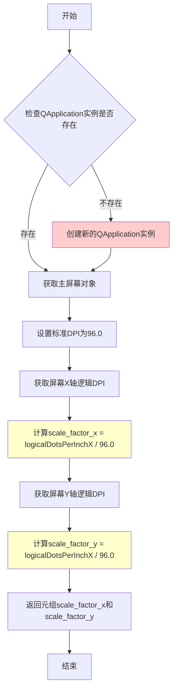
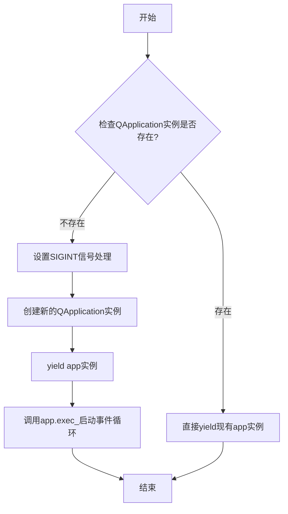
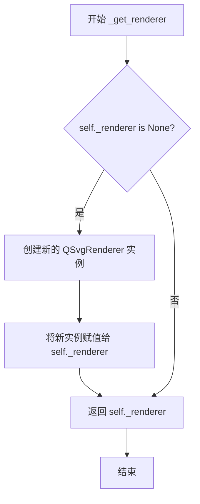
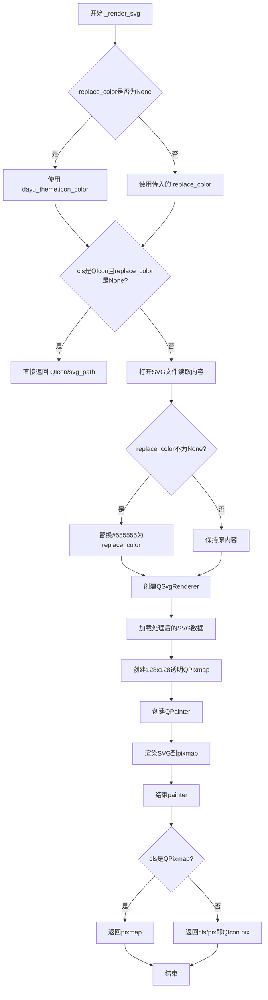

# `comic-translate\app\ui\dayu_widgets\qt\__init__.py` 详细设计文档

这是一个用于处理Qt图形资源（如图标、像素图）的工具模块，提供SVG渲染与颜色替换、实例缓存、高DPI屏幕缩放因子计算以及Qt应用程序生命周期管理的功能。

## 整体流程

```mermaid
graph TD
    Start((开始))
    Call[调用 MPixmap 或 MIcon]
    CheckCache{检查缓存 key=path+color}
    Hit[命中缓存] --> Return[返回缓存对象]
    Miss[未命中] --> CheckType{文件类型是 SVG?}
    Yes[是] --> Render[_render_svg 渲染SVG]
    No[否] --> Load[直接加载文件]
    Update[更新缓存字典] --> Return
    Render --> Update
    Load --> Update
    CheckCache -->|是| Hit
    CheckCache -->|否| Miss
    Call --> CheckCache
    Return((结束))

graph TD
    ScaleStart((开始))
    CheckApp{QApplication 实例是否存在?}
    CreateApp[创建 QApplication]
    GetScreen[获取主屏幕物理分辨率]
    Calc[计算 scale = logicalDpi / 96.0]
    ReturnScale[返回 (scale_x, scale_y)]
    ScaleStart --> CheckApp
    CheckApp -->|否| CreateApp --> GetScreen
    CheckApp -->|是| GetScreen
    GetScreen --> Calc --> ReturnScale
```

## 类结构

```
MCacheDict (资源缓存类)
├── MPixmap (全局实例: QPixmap缓存)
└── MIcon (全局实例: QIcon缓存)

全局函数
├── get_scale_factor (DPI缩放计算)
└── application (Qt应用上下文管理器)
```

## 全局变量及字段


### `MPixmap`
    
用于缓存 QPixmap 图标的缓存字典实例

类型：`MCacheDict`
    


### `MIcon`
    
用于缓存 QIcon 图标的缓存字典实例

类型：`MCacheDict`
    


### `standard_dpi`
    
标准 DPI 值，用于计算屏幕缩放因子

类型：`float`
    


### `MCacheDict.cls`
    
目标类，用于指定缓存的图像类型（QPixmap 或 QIcon）

类型：`type`
    


### `MCacheDict._cache_pix_dict`
    
内存缓存字典，用于存放已加载的图像对象，以路径和颜色为键

类型：`dict`
    


### `MCacheDict._renderer`
    
SVG 渲染器实例，用于将 SVG 图像绘制为像素图

类型：`QSvgRenderer`
    
    

## 全局函数及方法


### `get_scale_factor`

该函数用于获取屏幕的缩放因子，通过比较系统逻辑DPI与标准DPI（96.0）的比值来计算X和Y方向的缩放比例，以便实现高DPI屏幕的适配。

参数：无

返回值：`tuple`，返回包含X轴和Y轴缩放因子的元组 `(scale_factor_x, scale_factor_y)`

#### 流程图



#### 带注释源码

```python
def get_scale_factor():
    """
    获取屏幕的缩放因子，用于高DPI屏幕适配
    
    该函数通过比较系统当前逻辑DPI与标准DPI（96）的比值，
    计算出X和Y方向的缩放因子，以支持在不同DPI显示器上
    正确显示UI元素。
    
    Returns:
        tuple: 包含两个float值的元组 (scale_factor_x, scale_factor_y)
               - scale_factor_x: X轴方向的缩放因子
               - scale_factor_y: Y轴方向的缩放因子
    """
    # 检查是否存在Qt应用实例，如果没有则创建一个
    # 这是必要的，因为需要QGuiApplication来获取屏幕信息
    if not QtWidgets.QApplication.instance():
        app = QtWidgets.QApplication([])
    
    # 定义标准DPI值，Windows默认DPI为96
    standard_dpi = 96.0
    
    # 获取屏幕X轴的逻辑每英寸像素数
    # logicalDotsPerInchX() 返回屏幕水平方向每英寸的逻辑像素数
    scale_factor_x = QGuiApplication.primaryScreen().logicalDotsPerInchX() / standard_dpi
    
    # 获取屏幕Y轴的逻辑每英寸像素数
    # 注意：这里存在一个潜在bug，应该使用logicalDotsPerInchY()而不是logicalDotsPerInchX()
    scale_factor_y = QGuiApplication.primaryScreen().logicalDotsPerInchX() / standard_dpi
    
    # 返回X和Y方向的缩放因子元组
    return scale_factor_x, scale_factor_y
```


### `application`

这是一个 Qt 应用程序上下文管理器，用于获取或创建 Qt 应用程序实例，并在需要时启动事件循环。

参数：

- `*args`：可变参数，用于传递给 QApplication 构造函数（仅在创建新应用时使用）。

返回值：`QtWidgets.QApplication`，返回 Qt 应用程序实例。

#### 流程图



#### 带注释源码

```python
@contextlib.contextmanager
def application(*args):
    """
    Qt应用程序上下文管理器，用于获取或创建QApplication实例。
    如果已存在实例则复用，否则创建新实例并在上下文结束时启动事件循环。
    
    参数:
        *args: 可变参数，传递给QApplication构造函数（仅创建新实例时使用）
    
    返回:
        QtWidgets.QApplication: Qt应用程序实例
    """
    # 获取当前应用程序实例（如果存在）
    app = QtWidgets.QApplication.instance()

    # 判断应用实例是否已存在
    if not app:
        # 设置SIGINT信号处理，确保Ctrl+C可以正常中断程序
        signal.signal(signal.SIGINT, signal.SIG_DFL)
        
        # 创建新的QApplication实例，传递命令行参数
        app = QtWidgets.QApplication(sys.argv)
        
        # yield出应用实例供调用者使用
        yield app
        
        # 启动Qt事件循环（阻塞直到退出）
        app.exec_()
    else:
        # 应用已存在，直接yield现有实例
        yield app
```


### `MCacheDict.__init__`

该方法是 `MCacheDict` 类的构造函数，用于初始化一个图像缓存字典对象。它接受一个类类型（`QtGui.QPixmap` 或 `QtGui.QIcon`）作为参数，初始化缓存字典和 SVG 渲染器，为后续的图像缓存和渲染做好准备。

参数：

- `self`：隐式参数，MCacheDict 实例本身
- `cls`：`type`，要缓存的类型（QtGui.QPixmap 或 QtGui.QIcon）

返回值：`None`，无显式返回值（`__init__` 方法不返回值）

#### 流程图

```mermaid
flowchart TD
    A[开始 __init__] --> B[调用父类 MCacheDict.__init__]
    B --> C[设置 self.cls = cls]
    C --> D[初始化 self._cache_pix_dict = {}]
    D --> E[初始化 self._renderer = None]
    E --> F[结束]
```

#### 带注释源码

```python
def __init__(self, cls):
    """
    初始化 MCacheDict 实例
    
    参数:
        cls: 要缓存的类型，QtGui.QPixmap 或 QtGui.QIcon
    """
    # 调用父类 object 的初始化方法
    super(MCacheDict, self).__init__()
    
    # 存储要缓存的类型（Pixmap 或 Icon）
    self.cls = cls
    
    # 初始化图像缓存字典，用于存储已加载的图像
    self._cache_pix_dict = {}
    
    # 初始化 SVG 渲染器为 None（延迟加载）
    self._renderer = None
```


### `MCacheDict._get_renderer`

该方法是MCacheDict类的私有方法，实现了延迟初始化（Lazy Initialization）模式，用于确保SVG渲染器（QSvgRenderer）只在首次需要时才被创建，并保持全局唯一，避免重复创建资源带来的性能开销。

参数：

- `self`：`MCacheDict`，隐式参数，表示当前MCacheDict实例对象

返回值：`QSvgRenderer`，返回SVG渲染器实例。如果渲染器尚未初始化，则先创建再返回；如果已存在则直接返回该实例。

#### 流程图



#### 带注释源码

```python
def _get_renderer(self):
    """
    获取SVG渲染器实例，采用延迟初始化模式。
    
    该方法确保QSvgRenderer只会被创建一次，后续调用直接返回
    已创建的实例，实现资源复用，避免重复创建带来的性能开销。
    
    Returns:
        QSvgRenderer: SVG渲染器实例，用于将SVG图像渲染为QPixmap
    
    Example:
        renderer = self._get_renderer()
        renderer.load(QtCore.QByteArray(six.b(svg_data)))
    """
    # 检查渲染器是否已经初始化
    if self._renderer is None:
        # 如果尚未初始化，创建一个新的QSvgRenderer实例
        self._renderer = QSvgRenderer()
    # 返回渲染器实例（无论是新创建的还是已存在的）
    return self._renderer
```


### `MCacheDict._render_svg`

该方法负责将SVG图像文件渲染为Qt图像对象（QPixmap或QIcon），支持颜色替换功能，并处理不同目标类型（QIcon或QPixmap）的返回。

参数：

- `self`：`MCacheDict`，类的实例本身
- `svg_path`：`str`，SVG文件的路径
- `replace_color`：`str` 或 `None`，用于替换SVG中默认颜色（#555555）的目标颜色，默认为`None`

返回值：`QtGui.QPixmap` 或 `QtGui.QIcon`，渲染后的图像对象

#### 流程图



#### 带注释源码

```python
def _render_svg(self, svg_path, replace_color=None):
    # 导入本地模块以获取主题配置
    from .. import dayu_theme

    # 如果未指定颜色，则使用主题默认图标颜色
    replace_color = replace_color or dayu_theme.icon_color
    
    # 特殊处理：若目标是QIcon且不需要颜色替换，则直接返回原始SVG作为图标
    if (self.cls is QtGui.QIcon) and (replace_color is None):
        return QtGui.QIcon(svg_path)
    
    # 读取SVG文件内容
    with open(svg_path, "r") as f:
        data_content = f.read()
    
    # 如果指定了替换颜色，则替换SVG中的默认灰色(#555555)
    if replace_color is not None:
        data_content = data_content.replace("#555555", replace_color)
    
    # 获取或创建SVG渲染器
    renderer = self._get_renderer()
    
    # 将处理后的SVG内容加载到渲染器（转换为字节数组以适应Qt）
    renderer.load(QtCore.QByteArray(six.b(data_content)))
    
    # 创建128x128大小的透明背景像素图
    pix = QtGui.QPixmap(128, 128)
    pix.fill(QtCore.Qt.transparent)
    
    # 创建画家对象用于渲染
    painter = QtGui.QPainter(pix)
    
    # 执行SVG渲染到像素图
    renderer.render(painter)
    
    # 结束绘画操作，释放资源
    painter.end()
    
    # 根据目标类型返回对应格式：直接返回QPixmap或包装为QIcon
    if self.cls is QtGui.QPixmap:
        return pix
    else:
        return self.cls(pix)
```


### `MCacheDict.__call__`

该方法是 MCacheDict 类的可调用接口，通过将图像路径与可选颜色组合作为缓存键，实现对 SVG 或普通图像文件的加载与缓存，并返回对应类型的 Qt 图像对象（QPixmap 或 QIcon）。

#### 参数

- `path`：`str`，要加载的图像文件路径或图标名称
- `color`：`str`，可选参数，用于替换 SVG 文件中的默认颜色（#555555）

#### 返回值

- `self.cls`（`QtGui.QPixmap` 或 `QtGui.QIcon`），返回缓存的图像对象，如果文件不存在则返回空实例

#### 流程图

```mermaid
flowchart TD
    A[开始 __call__] --> B[导入 utils 模块]
    B --> C[调用 utils.get_static_file 获取完整路径]
    C --> D{full_path 是否存在?}
    D -->|否| E[返回空实例 self.cls()]
    D -->|是| F[构建缓存键 key = path.lower() + color]
    F --> G{缓存中是否存在 key?}
    G -->|是| H[直接返回缓存的 pix_map]
    G -->|否| I{文件是否是 SVG 格式?}
    I -->|是| J[调用 _render_svg 渲染 SVG]
    I -->|否| K[直接加载图像文件]
    J --> L[更新缓存字典]
    K --> L
    L --> M[返回 pix_map 图像对象]
```

#### 带注释源码

```python
def __call__(self, path, color=None):
    """
    使类的实例可以像函数一样被调用，用于获取或生成图像
    
    参数:
        path: str, 图像文件路径或图标名称
        color: str, 可选，用于替换SVG中的默认颜色
    
    返回:
        QtGui.QPixmap 或 QtGui.QIcon: 加载/渲染的图像对象
    """
    # 导入本地模块（避免循环依赖）
    from .. import utils

    # 获取完整的静态文件路径
    full_path = utils.get_static_file(path)
    
    # 如果路径不存在，返回空实例（QPixmap或QIcon）
    if full_path is None:
        return self.cls()
    
    # 构建缓存键：使用小写路径+颜色
    # 格式："{full_path_lower}{color_or_empty}"
    key = "{}{}".format(full_path.lower(), color or "")
    
    # 从缓存字典中尝试获取已缓存的图像
    pix_map = self._cache_pix_dict.get(key, None)
    
    # 缓存未命中，需要重新加载
    if pix_map is None:
        # 判断是否为 SVG 格式文件
        if full_path.endswith("svg"):
            # 调用 SVG 渲染方法（支持颜色替换）
            pix_map = self._render_svg(full_path, color)
        else:
            # 普通图像文件直接加载
            pix_map = self._cache_pix_dict.get(key, self.cls(full_path))
        
        # 将新加载的图像加入缓存字典
        self._cache_pix_dict.update({key: pix_map})
    
    # 返回缓存的图像对象
    return pix_map
```

## 关键组件


### MCacheDict 类

缓存字典类，用于缓存 QPixmap 或 QIcon 对象，支持 SVG 渲染和颜色替换。该类实现了延迟加载和缓存机制，提高图标/图像的加载效率。

### _get_renderer 方法

获取 SVG 渲染器的内部方法，采用惰性加载模式，仅在首次需要时创建 QSvgRenderer 实例，避免不必要的资源消耗。

### _render_svg 方法

SVG 渲染核心方法，负责读取 SVG 文件、替换颜色、渲染为像素图。支持颜色替换功能，默认使用主题色 #555555 替换为目标颜色。

### get_scale_factor 函数

获取屏幕缩放因子的全局函数，计算逻辑 DPI 与标准 DPI (96) 的比值，用于支持高分辨率屏幕的适配。

### application 上下文管理器

应用程序上下文管理器，负责创建和管理 QApplication 实例，处理 SIGINT 信号以支持优雅退出，同时确保应用程序单例模式。

### MPixmap 和 MIcon 全局变量

预定义的 MCacheDict 实例，分别用于缓存 QPixmap 和 QIcon 对象，提供便捷的图标/图像加载接口。

### 缓存机制

基于字典的缓存系统，使用文件路径和颜色组合作为键，实现相同资源的高效复用，避免重复渲染。


## 问题及建议


### 已知问题

-   **scale_factor计算错误**：get_scale_factor函数中scale_factor_y错误地使用了logicalDotsPerInchX()而非logicalDotsPerInchY()，导致Y轴缩放因子计算不正确
-   **缓存无上限**：MCacheDict的_cache_pix_dict字典无大小限制，无LRU或TTL机制，长期运行可能导致内存泄漏
-   **SVG文件重复读取**：每次缓存未命中时都重新打开并读取SVG文件内容，未对文件内容进行缓存
-   **颜色替换硬编码**：只替换"#555555"一个颜色值，无法处理SVG中其他需要替换的颜色
-   **类型检查方式不安全**：使用`is`比较类对象而非`isinstance()`进行类型检查，可能出现意外行为
-   **错误处理缺失**：文件读取失败、SVG渲染失败、QPixmap/QIcon构造失败等场景无异常处理
-   **QPainter未使用with语句**：手动调用painter.end()而非context manager，若发生异常可能资源未释放
-   **重复导入局部模块**：__call__和_render_svg方法内部重复导入utils和dayu_theme模块
-   **信号处理不跨平台**：application函数中signal.signal(signal.SIGINT, signal.SIG_DFL)在Windows平台可能不生效

### 优化建议

-   修正scale_factor_y的计算：使用logicalDotsPerInchY()替代logicalDotsPerInchX()
-   为缓存添加最大容量限制和LRU淘汰策略，防止内存无限增长
-   考虑在缓存键中包含SVG文件内容哈希，避免重复读取
-   使用正则表达式或DOM解析替换SVG中所有颜色而非单一硬编码值
-   改用isinstance()进行类型检查，提高代码健壮性
-   添加try-except块处理文件IO、SVG渲染等可能失败的场景
-   使用contextlib.closing或with语句确保QPainter资源正确释放
-   将局部导入移至文件顶部，或使用延迟导入的缓存机制
-   考虑使用qInstallMessageHandler或其他跨平台方式处理信号
-   为MCacheDict添加缓存清理方法，提供手动或定期清理的能力

## 其它


### 设计目标与约束

**设计目标：**
1. 提供高效的图标/像素图缓存机制，避免重复加载和渲染
2. 支持SVG矢量图的动态渲染和颜色替换
3. 提供统一的应用程序上下文管理，简化Qt应用启动流程
4. 支持高DPI屏幕的缩放因子计算

**设计约束：**
1. 仅支持PySide6作为UI框架
2. 依赖six库确保Python 2/3兼容性
3. SVG渲染仅支持单色替换（#555555）
4. 缓存键基于文件路径和颜色，暂无缓存失效机制

### 错误处理与异常设计

**异常处理策略：**
1. 文件读取异常：使用`try-except`捕获，SVG文件不存在时返回空图标/像素图
2. SVG渲染异常：渲染失败时静默降级返回空对象
3. 屏幕信息获取异常：当无法获取屏幕DPI时，使用默认值96.0
4. 缓存未命中：返回对应类的空实例（`self.cls()`）

**边界条件：**
- 文件路径不存在时返回空图标/像素图
- 非SVG格式直接加载，不进行渲染处理
- 颜色为None时不进行颜色替换

### 数据流与状态机

**主要数据流：**
1. 图像请求 → 检查缓存 → 缓存命中 → 返回缓存对象
2. 图像请求 → 检查缓存 → 缓存未命中 → 加载/渲染 → 更新缓存 → 返回新对象
3. SVG请求 → 打开文件 → 颜色替换 → 创建渲染器 → 绘制到QPixmap → 返回结果

**状态说明：**
- `_renderer`首次调用时初始化，后续复用
- `_cache_pix_dict`字典存储已渲染的图像对象

### 外部依赖与接口契约

**外部依赖：**
1. `PySide6.QtCore` - Qt核心功能
2. `PySide6.QtGui` - 图形处理
3. `PySide6.QtWidgets` - 控件系统
4. `six` - Python 2/3兼容
5. 本地模块`dayu_theme` - 主题配置
6. 本地模块`utils` - 工具函数

**接口契约：**
- `MCacheDict.__call__(path, color=None)` - 缓存调用接口
- `get_scale_factor()` - 返回(scale_x, scale_y)元组
- `application(*args)` - 返回QApplication上下管理器

### 平台兼容性说明

1. Windows/macOS/Linux跨平台支持
2. 高DPI屏幕支持（通过logicalDotsPerInchX获取）
3. Python 2.7+和Python 3.x兼容（通过six和__future__）

### 性能考虑与优化建议

1. 当前缓存无大小限制，可能导致内存占用持续增长
2. SVG渲染器单例复用是良好的优化
3. 文件IO操作可以进一步异步化
4. 建议添加缓存LRU淘汰机制或最大数量限制
5. 颜色替换硬编码#555555，缺乏灵活性

### 测试覆盖建议

1. 测试MCacheDict对SVG文件的缓存和渲染
2. 测试非SVG文件的直接加载
3. 测试颜色替换功能
4. 测试文件不存在时的降级处理
5. 测试application上下文管理器的单例模式
6. 测试get_scale_factor的DPI计算逻辑

    