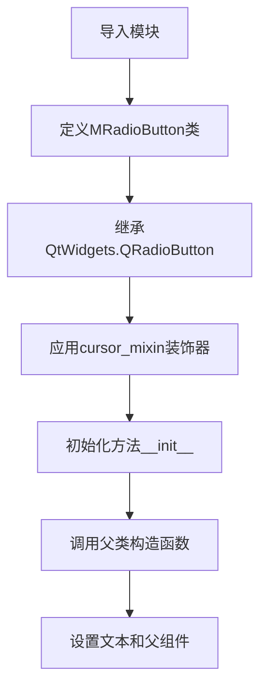
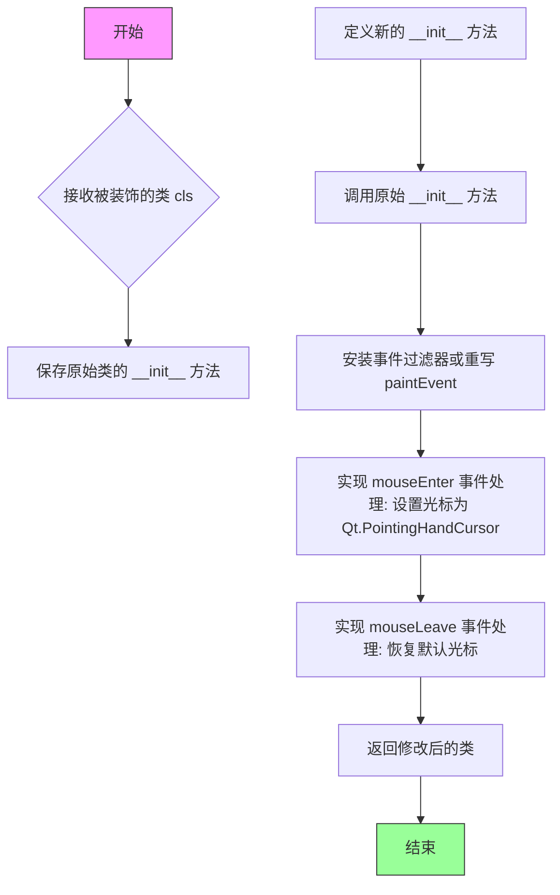

# `comic-translate\app\ui\dayu_widgets\radio_button.py` 详细设计文档

MRadioButton是一个基于PySide6的QRadioButton的自定义单选按钮组件，通过cursor_mixin装饰器添加了鼠标悬停时的光标样式功能，并支持样式表设置。该组件简化了Qt单选按钮的样式定制流程。

## 整体流程



## 类结构

```
QtWidgets.QRadioButton (Qt基类)
└── MRadioButton (自定义单选按钮组件)
```

## 全局变量及字段


### `MRadioButton.MRadioButton`
    
自定义Qt单选按钮类，继承自QRadioButton，使用样式表和自定义光标样式

类型：`class`
    


### `MRadioButton.__init__`
    
构造函数，初始化MRadioButton实例，接受text和parent参数

类型：`method`
    


### `MRadioButton.cursor_mixin`
    
装饰器，为MRadioButton添加自定义光标交互功能

类型：`decorator`
    
    

## 全局函数及方法


### `cursor_mixin`

该装饰器用于为 Qt 组件添加鼠标悬停时改变光标形状的功能，通过修改类的 paintEvent 或事件过滤器来实现鼠标 hover 时显示特定光标（如手型光标）。

参数：

- `cls`：被装饰的类，需要添加光标交互功能的 Qt 组件类

返回值：`cls`，返回修改后的类（添加了光标相关功能）

#### 流程图



#### 带注释源码

```python
# 注意：以下源码为基于使用方式推断的实现，并非原始源码
# 原始实现位于 .mixin 模块中

def cursor_mixin(cls):
    """
    装饰器：为 Qt 组件添加鼠标悬停时的光标变化功能
    
    参数:
        cls: 被装饰的 Qt 组件类（如 QRadioButton）
    
    返回:
        cls: 添加了光标交互功能的类
    """
    # 保存原始的 __init__ 方法
    original_init = cls.__init__
    
    def new_init(self, *args, **kwargs):
        """
        新的初始化方法，添加光标事件处理
        """
        # 1. 调用原始初始化方法
        original_init(self, *args, **kwargs)
        
        # 2. 设置鼠标追踪为 True，以便捕获 hover 事件
        self.setMouseTracking(True)
        
        # 3. 安装事件过滤器来处理光标变化
        # 或者重写 paintEvent 方法
        self.installEventFilter(self)
    
    # 4. 定义事件过滤器方法
    def eventFilter(self, obj, event):
        """
        过滤鼠标事件以改变光标
        
        参数:
            obj: 事件源对象
            event: Qt 事件对象
            
        返回:
            bool: 是否处理该事件
        """
        from PySide6.QtCore import QEvent
        from PySide6.QtGui import QCursor
        from PySide6.QtWidgets import QApplication
        
        if event.type() == QEvent.HoverEnter:
            # 鼠标进入时设置为手型光标
            self.setCursor(QCursor(Qt.PointingHandCursor))
        elif event.type() == QEvent.HoverLeave:
            # 鼠标离开时恢复默认光标
            self.unsetCursor()
        
        # 调用基类的事件过滤器
        return super(cls, self).eventFilter(obj, event)
    
    # 替换类的 __init__ 方法
    cls.__init__ = new_init
    
    # 添加事件过滤器方法（如果类中不存在）
    if not hasattr(cls, 'eventFilter'):
        cls.eventFilter = eventFilter
    
    return cls


# 使用示例
@cursor_mixin
class MRadioButton(QtWidgets.QRadioButton):
    """
    MRadioButton 使用样式表并在悬停时设置光标形状
    """
    
    def __init__(self, text="", parent=None):
        super(MRadioButton, self).__init__(text=text, parent=parent)
```

> **注意**：由于 `cursor_mixin` 是从 `.mixin` 模块导入的，上述源码为基于其使用方式和功能描述的推断实现。实际的源码实现可能略有不同，建议查看 `mixin.py` 文件获取完整的实现细节。


### `MRadioButton.__init__`

该方法是 MRadioButton 类的构造函数，用于初始化单选按钮控件，设置显示文本和父级 widget，并调用父类 QRadioButton 的构造函数完成基础初始化。

参数：

- `self`：隐式参数，MRadioButton 实例对象，表示当前创建的 MRadioButton 控件实例
- `text`：`str`，可选参数，默认为空字符串，表示单选按钮显示的文本标签
- `parent`：`PySide6.QtWidgets.QWidget | None`，可选参数，默认为 None，表示单选按钮的父级 widget，用于管理控件层级和内存生命周期

返回值：`None`，构造函数不返回任何值

#### 流程图

```mermaid
flowchart TD
    A[开始 __init__] --> B[接收 text 和 parent 参数]
    B --> C[调用 super().__init__ 初始化父类 QRadioButton]
    C --> D[设置按钮文本为 text 参数值]
    D --> E[将控件挂载到 parent 父级下]
    E --> F[结束 __init__]
```

#### 带注释源码

```python
def __init__(self, text="", parent=None):
    """
    初始化 MRadioButton 单选按钮控件
    
    参数:
        text: 单选按钮显示的文本，默认为空字符串
        parent: 父级 widget，默认为 None
    """
    # 调用父类 QRadioButton 的构造函数
    # text 参数传递给父类设置按钮显示文本
    # parent 参数传递给父类管理控件层级关系
    super(MRadioButton, self).__init__(text=text, parent=parent)
```

## 关键组件


### 一段话描述
MRadioButton是一个基于PySide6的QRadioButton扩展类，通过cursor_mixin装饰器为单选按钮添加了鼠标悬停时的自定义光标样式和样式表支持，无需额外扩展功能。

### 文件运行流程
1. 脚本作为模块被导入时，首先执行必要的future导入以兼容Python 2/3
2. 导入PySide6的QtWidgets模块和本地mixin模块中的cursor_mixin
3. 定义MRadioButton类并使用cursor_mixin装饰器进行装饰
4. 当实例化MRadioButton时，调用父类QRadioButton的构造函数初始化

### 类详细信息

#### MRadioButton类
**类字段：**
- 无类字段

**类方法：**
- `__init__(self, text="", parent=None)`
  - 参数：text(str, 单选按钮显示文本), parent(父控件对象)
  - 返回值：无
  - 描述：构造函数，调用父类初始化方法
  - mermain流程图：
  ```mermaid
  flowchart TD
    A[开始__init__] --> B[调用super初始化]
    B --> C[结束]
  ```
  - 带注释源码：
  ```python
  def __init__(self, text="", parent=None):
      super(MRadioButton, self).__init__(text=text, parent=parent)
  ```

### 全局变量和全局函数
- `cursor_mixin` (function/decorator): 从mixin模块导入的装饰器，为类添加鼠标光标相关功能
- `QtWidgets` (module): PySide6的QtWidgets模块，提供Qt GUI组件

### 关键组件信息

### cursor_mixin
一个装饰器函数或混合类，用于为MRadioButton添加鼠标悬停时的光标形状改变功能，可能是通过事件过滤器或重写事件处理方法实现。

### QtWidgets.QRadioButton
Qt的标准单选按钮组件，MRadioButton继承自此类以获得基本的单选按钮功能。

### 潜在的技术债务或优化空间
1. **功能单一**：当前类仅继承父类，未添加任何自定义功能，cursor_mixin的具体实现未知，可能存在过度设计
2. **文档缺失**：类文档字符串说明"No more extend"，但未说明为何需要这个类
3. **硬编码默认值**：text默认值为空字符串，可能不符合实际使用场景
4. **无错误处理**：构造函数中未进行参数验证

### 其它项目

#### 设计目标与约束
- 设计目标：创建一个可自定义样式的单选按钮组件
- 约束：依赖PySide6框架，仅在Qt环境下可用

#### 错误处理与异常设计
- 未实现显式的错误处理机制，依赖父类QRadioButton的异常处理

#### 数据流与状态机
- 数据流：父类QRadioButton管理选中状态，cursor_mixin处理鼠标交互状态

#### 外部依赖与接口契约
- 依赖PySide6.QtWidgets模块
- 依赖本地mixin模块中的cursor_mixin
- 接口：兼容QRadioButton的所有标准接口


## 问题及建议


### 已知问题

-   **mixin依赖隐藏实现细节**：核心功能（"use stylesheet and set cursor shape when hover"）的实现隐藏在cursor_mixin中，代码阅读者无法直接看到光标样式的具体实现逻辑，增加了理解和维护成本
-   **冗余的future导入**：导入了`absolute_import`、`division`、`print_function`，但代码中未使用任何Python 2/3兼容特性
-   **无类型注解**：构造函数和类定义缺少类型注解，不利于静态分析和IDE自动补全
-   **平台兼容性问题**：硬编码依赖`PySide6`，若需支持PySide2、PyQt5/PyQt6需重写导入语句，缺乏灵活性
-   **文档不完整**：类文档字符串仅说明功能，未说明具体样式实现方式和可配置项
-   **无错误处理**：构造函数未对输入参数进行校验（如text类型、parent类型）
-   **潜在的版本锁定风险**：代码创建于2019年，使用当时的PySide6版本，可能存在API变更导致的兼容性问题

### 优化建议

-   将cursor_mixin的关键功能内联到类中，或在类文档中详细说明mixin的具体实现和行为
-   移除未使用的`from __future__`导入语句，简化代码
-   为构造函数添加类型注解：`def __init__(self, text: str = "", parent: QtWidgets.QWidget = None) -> None`
-   使用环境变量或配置类管理Qt框架依赖，提高跨版本兼容性
-   在构造函数中添加参数校验：`if not isinstance(text, str): raise TypeError("text must be str")`
-   补充详细的类文档，说明样式表的具体内容和光标形状的设置方式
-   考虑添加类级别的配置方法或属性，允许运行时自定义样式和行为


## 其它


### 设计目标与约束

设计目标：为Qt应用提供一个自定义的单选按钮组件，继承QRadioButton的基本功能，通过cursor_mixin装饰器扩展鼠标悬停时的光标交互体验，并支持样式表定制。约束条件包括：必须继承自PySide6.QtWidgets.QRadioButton类，使用cursor_mixin装饰器实现光标效果，构造函数参数需与父类保持兼容。

### 错误处理与异常设计

构造函数中参数类型错误由PySide6框架本身验证，若传入无效参数会抛出TypeError。cursor_mixin装饰器若未正确定义或包含错误，会在类初始化时传播异常。父类QRadioButton的异常处理机制适用于本类，无需额外捕获。

### 数据流与状态机

MRadioButton作为Qt UI组件，遵循Qt的事件驱动模型。数据流主要体现在：用户交互（点击）触发QRadioButton的toggled信号，状态变化（选中/未选中）通过Qt的内部状态机管理。组件本身不维护额外状态，完全依赖父类的状态管理机制。

### 外部依赖与接口契约

外部依赖包括：PySide6.QtWidgets模块（提供QRadioButton基类）、cursor_mixin函数（来自本地mixin模块，提供光标交互功能）。接口契约方面：构造函数接受text（字符串，默认为空）和parent（Qt父对象，默认为None），返回MRadioButton实例。公共接口继承自QRadioButton，包括setText()、text()、setChecked()、isChecked()、toggled信号等。

### 使用场景与集成指南

适用于需要统一鼠标交互风格和样式定制的中大型Qt应用。集成方式：在UI代码中直接实例化MRadioButton，设置文本和父对象，通过setStyleSheet()方法应用样式表。该组件应放置在项目modules或widgets目录中，确保mixin模块路径正确。

### 版本兼容性说明

代码使用PySide6（Qt for Python 6.x版本），不兼容PySide2/PyQt5。cursor_mixin装饰器需确保与Python 3.x兼容（代码中已导入__future__模块支持Python 2兼容写法，但实际运行环境应为Python 3）。

### 安全性考虑

无用户输入处理，无敏感数据操作，安全性主要取决于PySide6框架本身和上层应用代码对本组件的使用方式。样式表需确保来自可信来源，防止注入攻击。

    