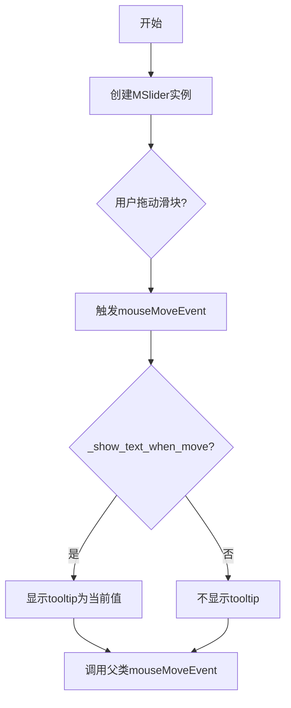
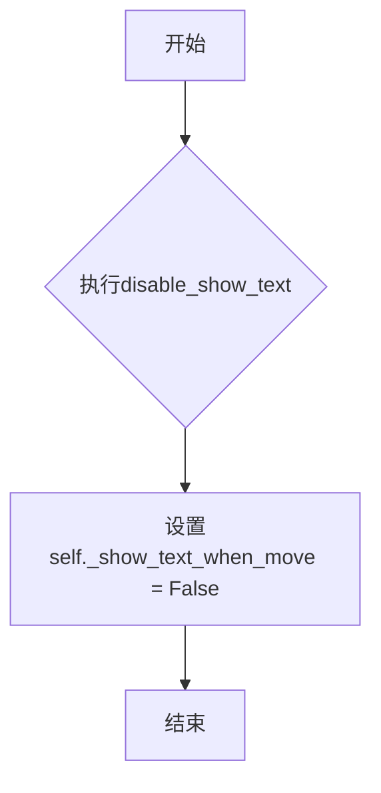

# `comic-translate\app\ui\dayu_widgets\slider.py` 详细设计文档

一个自定义的滑块组件，继承自QtWidgets.QSlider，主要功能是在鼠标移动时显示当前值作为tooltip，并支持通过方法控制是否显示文本。

## 整体流程



## 类结构

```
QtWidgets.QSlider (Qt基类)
└── MSlider (自定义滑块组件)
```

## 全局变量及字段


### `MSlider._show_text_when_move`
    
控制滑块拖动时是否显示数值tooltip

类型：`bool`
    
    

## 全局函数及方法


### `MSlider.__init__`

初始化滑块组件，调用父类 QSlider 的构造函数并设置默认属性。

参数：

-  `orientation`：`QtCore.Qt.Orientation`，滑块方向
-  `parent`：`QtWidgets.QWidget`，父组件

返回值：`None`，无返回值描述

#### 流程图

```mermaid
graph TD
    A[开始 __init__] --> B[调用父类 QSlider 构造方法<br/>super(MSlider, self).__init__]
    B --> C[设置实例属性 _show_text_when_move = True]
    C --> D[结束]
```

#### 带注释源码

```python
def __init__(self, orientation=QtCore.Qt.Horizontal, parent=None):
    """
    初始化 MSlider 滑块组件。
    
    Args:
        orientation: 滑块方向，默认水平方向 (QtCore.Qt.Horizontal)
        parent: 父组件，默认为 None
    
    Returns:
        None
    """
    # 调用父类 QSlider 的构造方法，传入方向和父组件
    super(MSlider, self).__init__(orientation, parent=parent)
    
    # 初始化实例属性：是否在移动时显示文本（默认开启）
    self._show_text_when_move = True
```


### `MSlider.disable_show_text`

禁用移动时显示数值tooltip的方法。该方法通过将内部标志位 `_show_text_when_move` 设置为 `False`，从而阻止在鼠标移动时显示当前滑块值的提示框。

参数：

- （无参数）

返回值：`None`，无返回值

#### 流程图



#### 带注释源码

```python
def disable_show_text(self):
    """
    禁用移动时显示数值tooltip。
    
    该方法将内部标志位 _show_text_when_move 设置为 False，
    从而阻止 mouseMoveEvent 中显示工具提示框。
    
    参数：
        无
    
    返回值：
        无
    """
    # 将标志位设为False，后续mouseMoveEvent中检查该标志时将不会显示tooltip
    self._show_text_when_move = False
```


### `MSlider.mouseMoveEvent`

处理鼠标移动事件，显示tooltip，当鼠标在滑块上移动时显示当前值。

参数：

- `event`：`QtCore.QEvent`，鼠标移动事件

返回值：`None`，无返回值

#### 流程图

```mermaid
flowchart TD
    A[开始: 接收mouseMoveEvent事件] --> B{_show_text_when_move是否为True}
    B -->|是| C[获取当前滑块值: self.value()]
    B -->|否| D[跳转到父类方法]
    C --> E[在鼠标全局位置显示tooltip: QtWidgets.QToolTip.showText]
    E --> D
    D --> F[调用父类mouseMoveEvent: super().mouseMoveEvent]
    F --> G[结束]
```

#### 带注释源码

```python
def mouseMoveEvent(self, event):
    """Override the mouseMoveEvent to show current value as a tooltip."""
    # 判断是否需要在移动时显示文本
    if self._show_text_when_move:
        # 获取当前滑块的值并转换为字符串
        current_value = str(self.value())
        # 在鼠标全局位置显示tooltip，显示当前值
        # 参数1: 鼠标全局位置 event.globalPos()
        # 参数2: 显示的文本内容 current_value
        # 参数3: 关联的控件 self
        QtWidgets.QToolTip.showText(event.globalPos(), current_value, self)
    # 调用父类的mouseMoveEvent方法，保持滑块原有行为
    return super(MSlider, self).mouseMoveEvent(event)
```

## 关键组件


### 组件：MSlider类

继承自QtWidgets.QSlider的滑块组件，用于在指定范围内显示当前值和间隔，通过QSS样式定制并重写鼠标移动事件实现值提示功能。

### 组件：鼠标移动事件处理（mouseMoveEvent方法）

重写父类mouseMoveEvent方法，拦截鼠标移动事件，在鼠标位置显示当前滑块值的工具提示。

### 组件：文本显示控制标志（_show_text_when_move）

布尔类型实例变量，用于控制是否在鼠标移动时显示值提示，默认为True表示启用显示功能。

### 组件：禁用显示方法（disable_show_text）

公开方法，用于关闭鼠标移动时的值提示显示功能，将内部标志设置为False。


## 问题及建议


### 已知问题

-   **事件处理逻辑缺陷**：在`mouseMoveEvent`方法中，当`_show_text_when_move`为`True`时，显示tooltip后直接`return`，导致父类的`mouseMoveEvent`无法被调用，可能影响滑块的正常拖动交互；而当`_show_text_when_move`为`False`时，完全没有调用父类方法，导致滑块在禁用文本显示时无法响应鼠标事件。
-   **缺少文档字符串**：类和方法缺少详细的文档说明，不利于后续维护和他人理解。
-   **硬编码显示逻辑**：tooltip显示的文本直接使用`str(self.value())`，缺乏格式化和本地化支持，无法满足国际化或自定义显示格式的需求。
-   **初始化逻辑问题**：`_show_text_when_move`在`__init__`中硬编码为`True`，没有提供通过参数配置的灵活性。
-   **缺少类型注解**：方法参数和返回值缺乏类型提示，影响代码的可读性和静态分析工具的支持。

### 优化建议

-   **修复事件处理流程**：将`mouseMoveEvent`改为无论是否显示tooltip，都应调用父类的`mouseMoveEvent`以保证滑块的正常交互功能。
-   **添加配置接口**：提供setter方法或构造函数参数，允许用户自定义tooltip的显示格式（如数值前缀、后缀、精度等）。
-   **完善文档字符串**：为类和关键方法添加Google风格或Sphinx风格的文档说明。
-   **添加类型注解**：为方法参数和返回值添加类型提示，提高代码可维护性。
-   **考虑添加单元测试**：针对不同场景（显示/不显示tooltip、不同方向等）添加测试用例。


## 其它


### 设计目标与约束

本组件旨在扩展Qt标准滑块组件，提供更友好的用户交互体验，通过鼠标移动时显示当前值作为提示信息。约束条件包括：仅支持PySide6框架，依赖于QtWidgets.QSlider基类，鼠标移动时显示tooltip的功能默认启用但可通过API关闭。

### 错误处理与异常设计

本组件继承自QtWidgets.QSlider，错误处理机制主要依赖Qt框架的异常传播。由于组件逻辑简单，未引入额外的异常处理逻辑。潜在异常场景包括：1) 父对象销毁后调用组件方法；2) 在不支持鼠标事件的设备上使用。这些场景由Qt框架统一管理。

### 数据流与状态机

MSlider内部维护一个布尔状态_show_text_when_move，用于控制是否在鼠标移动时显示数值提示。当用户触发mouseMoveEvent时，流程为：检查状态标志→若启用则显示tooltip→调用父类mouseMoveEvent处理默认行为。状态转换简单：启用(_show_text_when_move=True) ↔ 禁用(_show_text_when_move=False)。

### 外部依赖与接口契约

外部依赖包括：1) PySide6.QtCore模块，用于Qt核心枚举 Qt.Orientation；2) PySide6.QtWidgets模块，用于QSlider基类、QToolTip工具类。接口契约：构造函数接受orientation和parent参数，disable_show_text()无返回值，mouseMoveEvent(event)重写父类方法需调用super()保持原有功能。

### 性能考量

组件性能开销极低，仅在鼠标移动时触发tooltip显示。由于QtTooltip.showText每次调用会创建临时字符串，频繁调用时可能有轻微性能影响，但对于滑块组件可忽略不计。建议在大量并发滑块实例场景下评估实际影响。

### 平台兼容性说明

本组件基于PySide6实现，理论上支持所有Qt支持的平台（Windows、macOS、Linux）。鼠标移动事件处理依赖Qt的event系统，在触摸屏设备上mouseMoveEvent可能不会触发，此时组件功能不适用但不会报错。

    