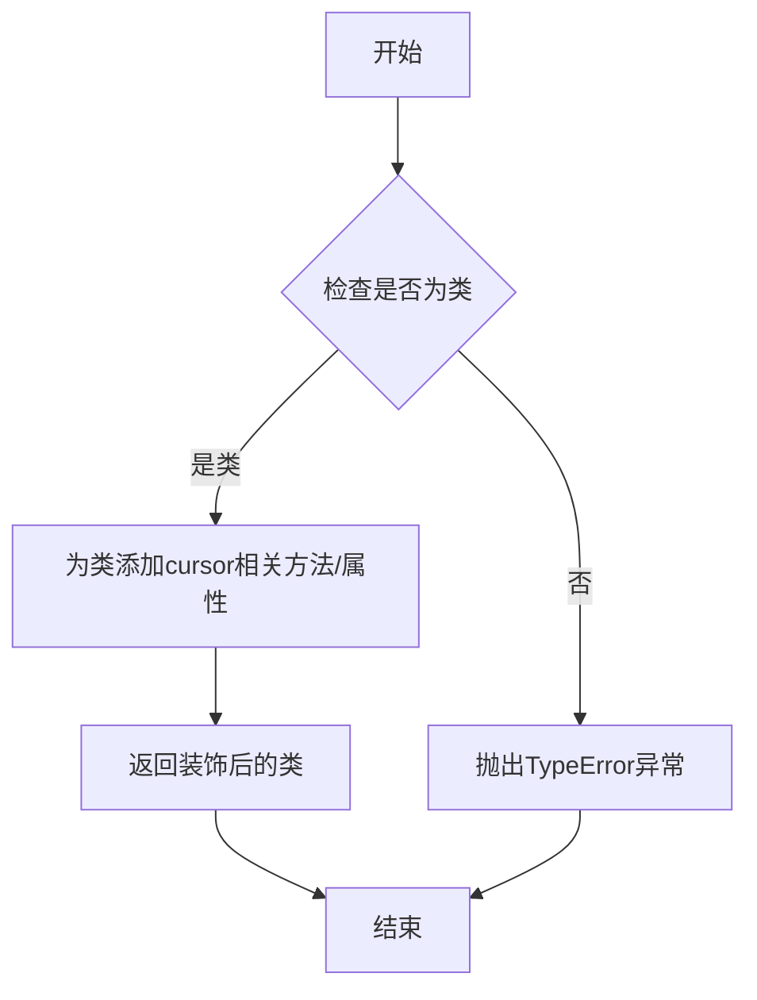
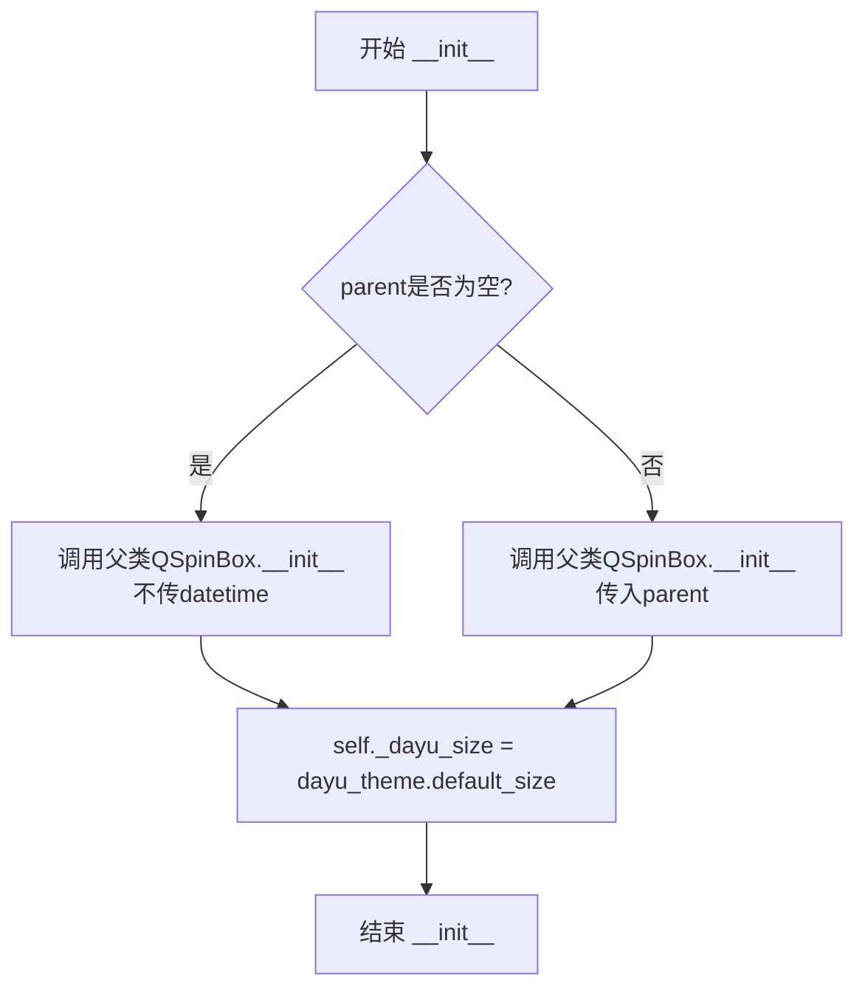
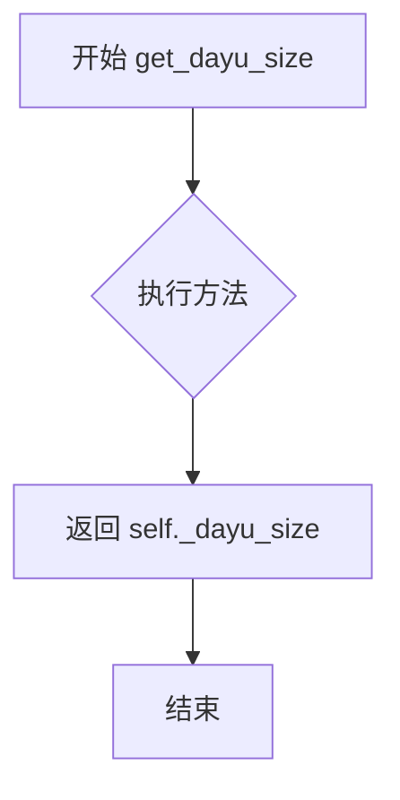
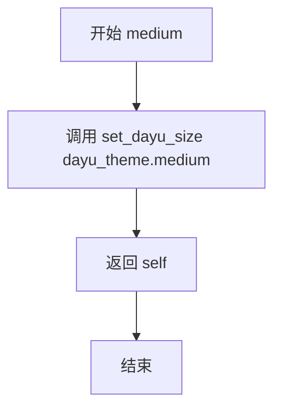
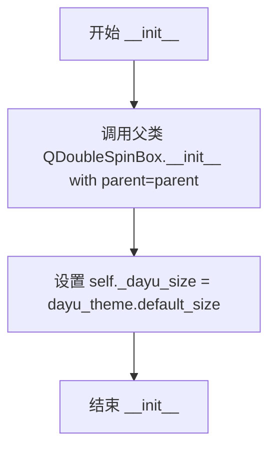
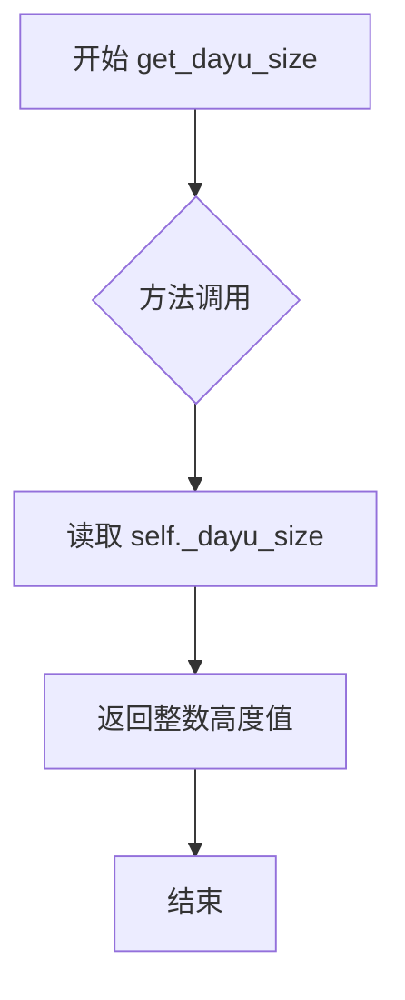
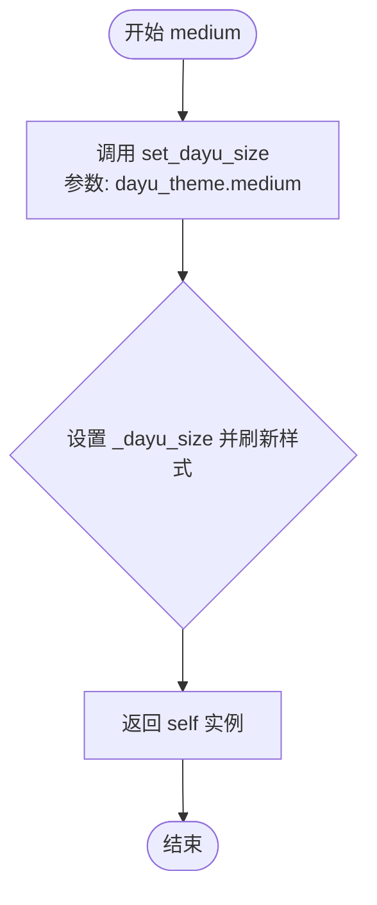
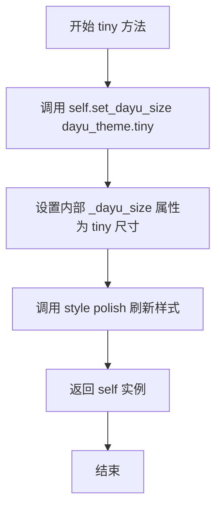
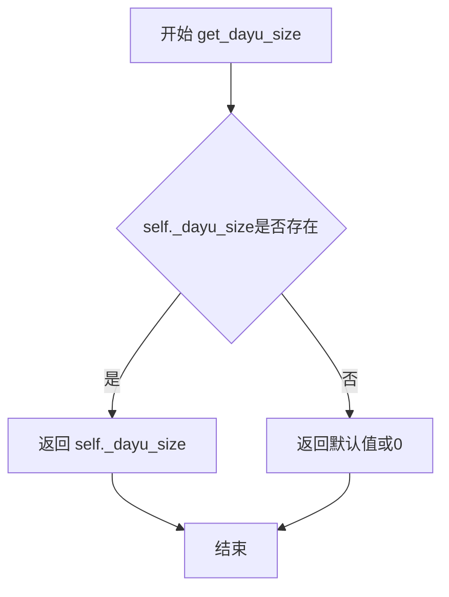

# `comic-translate\app\ui\dayu_widgets\spin_box.py` 详细设计文档

这是一组Qt Widgets的自定义包装组件，为QSpinBox、QDoubleSpinBox、QDateTimeEdit、QDateEdit和QTimeEdit添加了统一的dayu_size属性和预设尺寸方法（huge/large/medium/small/tiny），用于快速调整组件的高度以适配大华主题的样式规范。

## 整体流程

```mermaid
graph TD
    A[开始] --> B[导入模块]
    B --> C[定义类: MSpinBox]
    C --> D[定义类: MDoubleSpinBox]
    D --> E[定义类: MDateTimeEdit]
    E --> F[定义类: MDateEdit]
    F --> G[定义类: MTimeEdit]
    G --> H[结束]

 subgraph MSpinBox执行流程
    I1[创建MSpinBox实例] --> I2[调用__init__]
    I2 --> I3[初始化_dayu_size为default_size]
    I3 --> I4[用户调用huge/large/medium/small/tiny方法]
    I4 --> I5[set_dayu_size更新尺寸]
    I5 --> I6[调用style().polish刷新样式]
 end
```

## 类结构

```
QtWidgets.QSpinBox
├── MSpinBox
├── MDoubleSpinBox (继承自QDoubleSpinBox)
├── MDateTimeEdit (继承自QDateTimeEdit)
├── MDateEdit (继承自QDateEdit)
└── MTimeEdit (继承自QTimeEdit)

所有M类都装饰了cursor_mixin
```

## 全局变量及字段


### `dayu_theme.default_size`
    
Default height size for widgets

类型：`int`
    


### `dayu_theme.huge`
    
Huge height size for widgets

类型：`int`
    


### `dayu_theme.large`
    
Large height size for widgets

类型：`int`
    


### `dayu_theme.medium`
    
Medium height size for widgets

类型：`int`
    


### `dayu_theme.small`
    
Small height size for widgets

类型：`int`
    


### `dayu_theme.tiny`
    
Tiny height size for widgets

类型：`int`
    


### `MSpinBox._dayu_size`
    
Internal storage for the height of MSpinBox

类型：`int`
    


### `MDoubleSpinBox._dayu_size`
    
Internal storage for the height of MDoubleSpinBox

类型：`int`
    


### `MDateTimeEdit._dayu_size`
    
Internal storage for the height of MDateTimeEdit

类型：`int`
    


### `MDateEdit._dayu_size`
    
Internal storage for the height of MDateEdit

类型：`int`
    


### `MTimeEdit._dayu_size`
    
Internal storage for the height of MTimeEdit

类型：`int`
    
    

## 全局函数及方法


### `cursor_mixin`

这是一个装饰器函数，用于为Qt的输入控件类（MSpinBox、MDoubleSpinBox等）添加鼠标指针行为相关的功能。该装饰器被应用在多个自定义Qt组件上，使其在鼠标悬停时显示特定的光标样式。

#### 参数

- `cls`：被装饰的类（Class），需要添加cursor_mixin功能的Qt控件类

#### 返回值

- 返回装饰后的类，添加了cursor相关的方法或属性

#### 流程图



#### 带注释源码

```
# 注意：cursor_mixin 的实际定义在 .mixin 模块中
# 当前文件只展示了该装饰器的使用方式

# 从 mixin 模块导入 cursor_mixin 装饰器
from .mixin import cursor_mixin

# 使用装饰器为 MSpinBox 类添加 cursor 功能
@cursor_mixin
class MSpinBox(QtWidgets.QSpinBox):
    """
    MSpinBox just use stylesheet and add dayu_size. No more extend.
    Property:
        dayu_size: The height of MSpinBox
    """
    # ... 类的其他实现

# 装饰器同样应用于其他控件类
@cursor_mixin
class MDoubleSpinBox(QtWidgets.QDoubleSpinBox):
    # ...

@cursor_mixin
class MDateTimeEdit(QtWidgets.QDateTimeEdit):
    # ...

@cursor_mixin
class MDateEdit(QtWidgets.QDateEdit):
    # ...

@cursor_mixin
class MTimeEdit(QtWidgets.QTimeEdit):
    # ...
```

> **注意**：由于`cursor_mixin`装饰器的实际实现代码在`.mixin`模块中（当前代码段未包含），以上信息是基于其使用方式推断得出的。如需获取完整的装饰器实现细节，请参考`mixin.py`源文件。


### `MSpinBox.__init__`

该方法是MSpinBox类的构造函数，用于初始化一个带有自定义样式和尺寸属性的旋转框控件。它接受一个可选的父窗口参数，调用父类QSpinBox的构造函数进行基础初始化，并设置默认的dayu_size属性值。

参数：

- `parent`：`QtWidgets.QWidget` 或 `None`，父窗口部件，默认为None

返回值：`None`，构造函数无返回值

#### 流程图



#### 带注释源码

```python
def __init__(self, parent=None):
    """
    初始化MSpinBox实例
    
    :param parent: 父窗口部件，默认为None
    :type parent: QtWidgets.QWidget or None
    :return: None
    :rtype: None
    """
    # 调用父类QSpinBox的构造函数，传入parent参数
    # QtWidgets.QSpinBox.__init__(self, parent=parent)
    super(MSpinBox, self).__init__(parent=parent)
    
    # 初始化_dayu_size属性为默认尺寸
    # dayu_theme.default_size 定义了控件的默认高度
    self._dayu_size = dayu_theme.default_size
```


### `MSpinBox.get_dayu_size`

获取 MSpinBox 组件的高度值。

参数：无需参数

返回值：`int`，返回 MSpinBox 的高度值

#### 流程图



#### 带注释源码

```python
def get_dayu_size(self):
    """
    获取 MSpinBox 的高度
    :return: 整数类型，表示 MSpinBox 的高度值
    """
    return self._dayu_size
```


### `MSpinBox.set_dayu_size`

设置 MSpinBox 组件的尺寸大小，同时通过 Qt 样式系统应用更新后的样式。

参数：

- `value`：`int`，要设置的尺寸值（高度）

返回值：`None`，无返回值

#### 流程图

```mermaid
flowchart TD
    A[开始 set_dayu_size] --> B{检查 value 参数}
    B -->|有效值| C[将 value 赋值给 self._dayu_size]
    B -->|无效值| D[保持原值或抛出异常]
    C --> E[调用 self.style().polish self]
    E --> F[结束]
    D --> F
```

#### 带注释源码

```python
def set_dayu_size(self, value):
    """
    设置 MSpinBox 的尺寸大小
    
    参数:
        value: int - 要设置的尺寸值（高度）
    
    返回:
        None - 无返回值
    """
    # 将传入的尺寸值保存到内部变量中
    self._dayu_size = value
    
    # 调用 Qt 样式系统的 polish 方法重新应用样式
    # 这会触发样式的重新计算和应用，使控件根据新的尺寸值更新外观
    self.style().polish(self)
```


### `MSpinBox.huge`

将 MSpinBox 控件的尺寸设置为 "huge" 大小，并返回实例本身以支持链式调用。

参数： 无

返回值：`MSpinBox`，返回自身实例，支持链式调用。

#### 流程图

```mermaid
flowchart TD
    A[调用 huge 方法] --> B{无参数}
    B --> C[调用 set_dayu_size 方法]
    C --> D[设置 _dayu_size 为 dayu_theme.huge]
    D --> E[调用 style().polish 刷新样式]
    E --> F[返回 self 实例]
```

#### 带注释源码

```python
def huge(self):
    """
    Set MSpinBox to huge size
    
    该方法将 MSpinBox 的高度设置为预设的 huge 尺寸。
    内部通过 set_dayu_size 方法修改 _dayu_size 属性，
    并调用 Qt 的 polish 方法刷新控件样式。
    
    Returns:
        MSpinBox: 返回自身实例，支持链式调用（例如：box.huge().medium()）
    """
    self.set_dayu_size(dayu_theme.huge)
    return self
```


### `MSpinBox.large`

设置 MSpinBox 为大号尺寸。

参数：

- 无

返回值：`MSpinBox`，返回自身实例以支持链式调用。

#### 流程图

```mermaid
graph TD
    A[开始] --> B[调用 set_dayu_size 方法<br/>参数: dayu_theme.large]
    B --> C[更新 _dayu_size 属性]
    C --> D[调用 style().polish 刷新样式]
    D --> E[返回 self]
    E --> F[结束]
```

#### 带注释源码

```python
def large(self):
    """
    Set MSpinBox to large size
    
    该方法用于将 MSpinBox 的尺寸设置为大号。
    内部调用 set_dayu_size 方法，并传入 dayu_theme.large 值。
    返回 self 以支持链式调用（例如：spinbox.large().small()）。
    
    参数:
        无（仅包含 self 参数）
    
    返回值:
        MSpinBox: 返回自身实例，支持链式调用
    """
    self.set_dayu_size(dayu_theme.large)  # 调用 set_dayu_size 方法，传入大号尺寸常量
    return self  # 返回自身实例，支持链式调用
```


### `MSpinBox.medium`

设置 MSpinBox 为中等尺寸

参数：
- 无

返回值：`MSpinBox`，返回 self 以支持链式调用

#### 流程图



#### 带注释源码

```python
def medium(self):
    """Set MSpinBox to  medium"""
    # 调用 set_dayu_size 方法，将尺寸设置为 dayu_theme.medium（中等尺寸）
    self.set_dayu_size(dayu_theme.medium)
    # 返回 self 实例，支持链式调用（例如：box.medium().small()）
    return self
```


### `MSpinBox.small`

设置 MSpinBox 为小尺寸，并返回自身以支持链式调用。

参数：此方法没有参数。

返回值：`MSpinBox`，返回自身实例，支持链式调用。

#### 流程图

```mermaid
flowchart TD
    A[开始 small 方法] --> B[调用 set_dayu_size 方法]
    B --> C[传入 dayu_theme.small 参数]
    C --> D[设置 _dayu_size 属性为 small]
    D --> E[调用 style().polish 刷新样式]
    E --> F[返回 self 实例]
    F --> G[结束]
```

#### 带注释源码

```python
def small(self):
    """Set MSpinBox to small size"""
    # 调用 set_dayu_size 方法，将尺寸设置为 dayu_theme.small
    self.set_dayu_size(dayu_theme.small)
    # 返回 self 以支持链式调用，例如: spinbox.small().medium()
    return self
```


### MSpinBox.tiny

设置MSpinBox组件为tiny尺寸，并返回自身以支持链式调用。

参数：
- 无

返回值：`MSpinBox`，返回自身实例，支持链式调用风格

#### 流程图

```mermaid
graph TD
    A[调用 tiny 方法] --> B[调用 set_dayu_size 方法]
    B --> C[设置 _dayu_size 为 dayu_theme.tiny]
    C --> D[调用 style().polish 刷新样式]
    D --> E[返回 self]
```

#### 带注释源码

```python
def tiny(self):
    """Set MSpinBox to tiny size"""
    # 调用set_dayu_size方法，传入dayu_theme.tiny常量
    self.set_dayu_size(dayu_theme.tiny)
    # 返回self实例，支持链式调用如 box.tiny().small()
    return self
```


### `MDoubleSpinBox.__init__`

该方法是 `MDoubleSpinBox` 类的构造函数，用于初始化一个带有自定义尺寸属性的双精度旋转框控件。

参数：

- `parent`：`QtWidgets.QWidget` 或 `None`，父控件，默认为 `None`

返回值：`None`，构造函数不返回值

#### 流程图



#### 带注释源码

```python
def __init__(self, parent=None):
    """
    初始化 MDoubleSpinBox 实例
    
    :param parent: 父控件，默认为 None
    :type parent: QtWidgets.QWidget or None
    :return: None
    :rtype: None
    """
    # 调用父类 QDoubleSpinBox 的构造函数进行初始化
    super(MDoubleSpinBox, self).__init__(parent=parent)
    
    # 初始化 dayu_size 属性为默认值
    # dayu_theme.default_size 定义了控件的默认高度
    self._dayu_size = dayu_theme.default_size
```


### `MDoubleSpinBox.get_dayu_size`

获取 MDoubleSpinBox 组件的高度值（dayu_size 属性）

参数：
- 无

返回值：`int`，返回 MDoubleSpinBox 的当前高度值

#### 流程图



#### 带注释源码

```python
def get_dayu_size(self):
    """
    Get the MDoubleSpinBox height
    :return: integer
    """
    return self._dayu_size
```

**说明：**
- 该方法是 Qt 属性系统的一部分，与 `set_dayu_size` 方法一起用于实现 `dayu_size` 属性
- 直接返回实例变量 `_dayu_size`，该变量存储当前组件的高度
- `_dayu_size` 在 `__init__` 方法中被初始化为 `dayu_theme.default_size`
- 返回值类型为 `int`，表示高度像素值


### `MDoubleSpinBox.set_dayu_size`

设置MDoubleSpinBox组件的尺寸大小，通过Qt样式系统应用尺寸变更。

参数：

- `value`：`int`，要设置的尺寸值（高度）

返回值：`None`，无返回值描述

#### 流程图

```mermaid
flowchart TD
    A[开始 set_dayu_size] --> B[将value赋值给self._dayu_size]
    B --> C[调用self.style().polish应用样式更新]
    C --> D[结束]
```

#### 带注释源码

```python
def set_dayu_size(self, value):
    """
    Set the MDoubleSpinBox size.
    :param value: integer
    :return: None
    """
    # 将传入的尺寸值保存到实例变量中
    self._dayu_size = value
    # 调用Qt样式系统的polish方法，强制刷新组件样式以应用尺寸变更
    self.style().polish(self)
```


### `MDoubleSpinBox.huge`

设置 MDoubleSpinBox 控件为超大尺寸（huge size）。

参数：

- 无参数（仅包含隐式参数 `self`）

返回值：`MDoubleSpinBox`，返回自身实例，支持链式调用

#### 流程图

```mermaid
flowchart TD
    A[开始 huge 方法] --> B[调用 set_dayu_size 方法]
    B --> C[传入 dayu_theme.huge 参数]
    C --> D[设置 _dayu_size 属性]
    D --> E[调用 style().polish 刷新样式]
    E --> F[返回 self 实例]
    F --> G[结束]
```

#### 带注释源码

```python
def huge(self):
    """Set MDoubleSpinBox to huge size"""
    # 调用 set_dayu_size 方法，传入 dayu_theme.huge 常量
    # 该方法会设置 _dayu_size 属性并刷新控件样式
    self.set_dayu_size(dayu_theme.huge)
    # 返回 self 实例，支持链式调用
    # 例如: widget.huge().setValue(10.5)
    return self
```


### `MDoubleSpinBox.large`

设置 MDoubleSpinBox 控件为大尺寸（large），并返回自身以支持链式调用。该方法是 Fluent Design 风格尺寸 setter 的一部分，允许开发者通过链式调用快速设置控件尺寸。

参数： 无

返回值：`MDoubleSpinBox`，返回自身实例，支持链式调用（例如 `box.large().medium()`）

#### 流程图

```mermaid
flowchart TD
    A[开始 large 方法] --> B[调用 set_dayu_size]
    B --> C[传入 dayu_theme.large 参数]
    C --> D[更新内部 _dayu_size 属性]
    D --> E[调用 style().polish 刷新样式]
    E --> F[返回 self]
    F --> G[结束]
```

#### 带注释源码

```python
def large(self):
    """Set MDoubleSpinBox to large size"""
    # 设置内部尺寸属性为预定义的大尺寸值
    self.set_dayu_size(dayu_theme.large)
    # 返回 self 以支持链式调用（Builder 模式）
    return self
```


### `MDoubleSpinBox.medium`

该方法用于将 `MDoubleSpinBox` 组件的高度设置为预设的“中等”尺寸（medium），并返回组件实例本身，以支持链式调用。

参数：
- `self`：隐式参数，指向 `MDoubleSpinBox` 实例本身。

返回值：`MDoubleSpinBox`，返回实例本身，支持链式调用（例如 `spinbox.medium().setValue(10)`）。

#### 流程图



#### 带注释源码

```python
def medium(self):
    """
    Set MDoubleSpinBox to  medium
    将组件尺寸设置为中等大小
    """
    # 调用内部方法 set_dayu_size，传入 dayu_theme 模块中定义的中等尺寸常量
    self.set_dayu_size(dayu_theme.medium)
    # 返回 self 本身，允许进行链式调用，例如 obj.medium().setRange(0, 100)
    return self
```


### `MDoubleSpinBox.small`

该方法用于将 MDoubleSpinBox 控件设置为小尺寸（small），内部调用 set_dayu_size 方法设置尺寸值，并通过返回 self 支持链式调用。

**参数：** 无

**返回值：** `MDoubleSpinBox`，返回自身实例以支持链式调用

#### 流程图

```mermaid
flowchart TD
    A[开始 small 方法] --> B[调用 set_dayu_size]
    B --> C[传入 dayu_theme.small 参数]
    C --> D[设置 _dayu_size 属性]
    D --> E[调用 style().polish 刷新样式]
    E --> F[返回 self]
    F --> G[结束]
```

#### 带注释源码

```python
def small(self):
    """Set MDoubleSpinBox to small size"""
    # 调用 set_dayu_size 方法，传入 dayu_theme.small 常量作为参数
    # 该常量定义了系统中的小尺寸数值
    self.set_dayu_size(dayu_theme.small)
    # 返回 self 本身，支持链式调用
    # 例如: spin_box.small().medium() 会先设置为小，再设置为中
    return self
```

**相关方法说明：**
- `set_dayu_size(value)`: 内部实际设置尺寸的方法，会同时更新 `_dayu_size` 属性并调用 Qt 样式系统的 `polish` 方法刷新控件外观
- `dayu_theme.small`: 从 `dayu_theme` 模块导入的预定义常量，代表小尺寸的数值


### `MDoubleSpinBox.tiny`

设置 MDoubleSpinBox 为极小(tiny)尺寸，并返回实例以支持方法链式调用。

参数： 无（仅包含隐式参数 `self`）

返回值：`MDoubleSpinBox`，返回实例本身，支持链式调用

#### 流程图



#### 带注释源码

```python
def tiny(self):
    """
    Set MDoubleSpinBox to tiny size
    将 MDoubleSpinBox 设置为极小尺寸
    
    Args:
        无，仅使用隐式 self 参数
    
    Returns:
        MDoubleSpinBox: 返回实例本身，用于支持方法链式调用
                     例如: box.tiny().medium()
    """
    # 调用 set_dayu_size 方法，传入 dayu_theme.tiny 常量
    self.set_dayu_size(dayu_theme.tiny)
    # 返回 self 以支持链式调用
    return self
```


### `MDateTimeEdit.__init__`

MDateTimeEdit 的初始化方法，用于构造日期时间编辑控件实例，支持可选的初始日期时间值和父窗口参数，并初始化 dayu_size 属性为默认值。

参数：

- `datetime`：`QDateTime | None`，初始日期时间值，默认为 None，表示不设置初始时间
- `parent`：`QWidget | None`，父窗口部件，默认为 None

返回值：`None`，无返回值

#### 流程图

```mermaid
flowchart TD
    A[开始 __init__] --> B{datetime is None?}
    B -->|Yes| C[调用父类 QDateTimeEdit.__init__(parent=parent)]
    B -->|No| D[调用父类 QDateTimeEdit.__init__(datetime, parent=parent)]
    C --> E[self._dayu_size = dayu_theme.default_size]
    D --> E
    E --> F[结束 __init__]
```

#### 带注释源码

```python
def __init__(self, datetime=None, parent=None):
    """
    初始化 MDateTimeEdit 实例
    
    参数:
        datetime: 初始日期时间值，传入 QDateTime 对象，默认为 None
        parent: 父窗口部件，传入 QWidget 对象，默认为 None
    返回:
        无返回值
    """
    # 判断是否传入了日期时间值
    if datetime is None:
        # 未传入日期时间，调用父类无参构造函数
        super(MDateTimeEdit, self).__init__(parent=parent)
    else:
        # 传入了日期时间，调用父类带日期时间参数的构造函数
        super(MDateTimeEdit, self).__init__(datetime, parent=parent)
    
    # 初始化 dayu_size 属性为主题默认大小
    self._dayu_size = dayu_theme.default_size
```


### `MDateTimeEdit.get_dayu_size`

获取MDateTimeEdit组件的高度值。该方法是Qt属性系统的getter方法，用于返回组件的_dayu_size属性值，配合set_dayu_size方法和QtCore.Property实现可绑定的高度属性。

参数： 无

返回值：`integer`，返回MDateTimeEdit组件的当前高度值

#### 流程图



#### 带注释源码

```python
def get_dayu_size(self):
    """
    Get the MDateTimeEdit height
    :return: integer
    """
    # 返回当前MDateTimeEdit实例的_dayu_size属性值
    # _dayu_size在__init__方法中被初始化为dayu_theme.default_size
    # 该属性用于存储组件的高度值，支持通过Qt属性系统进行绑定
    return self._dayu_size
```


### `MDateTimeEdit.set_dayu_size`

设置 MDateTimeEdit 组件的高度尺寸，通过更新内部 `_dayu_size` 属性并调用样式抛光方法使样式生效。

参数：

- `value`：`int`，要设置的尺寸值

返回值：`None`，无返回值

#### 流程图

```mermaid
flowchart TD
    A[开始 set_dayu_size] --> B{value 参数}
    B -->|赋值| C[self._dayu_size = value]
    C --> D[self.style.polish self]
    D --> E[结束]
```

#### 带注释源码

```python
def set_dayu_size(self, value):
    """
    Set the MDateTimeEdit size.
    :param value: integer  # 输入参数：新的尺寸值
    :return: None          # 返回值：无
    """
    self._dayu_size = value    # 将传入的尺寸值保存到实例属性
    self.style().polish(self) # 调用 Qt 样式系统抛光组件，使样式生效
```


### `MDateTimeEdit.huge`

设置 MDateTimeEdit 控件为巨大尺寸，通过调用 set_dayu_size 方法将控件高度设置为 dayu_theme.huge，并返回自身实例以支持链式调用。

参数：

- 无参数（仅包含 self 隐式参数）

返回值：`MDateTimeEdit`，返回自身实例，支持链式调用风格

#### 流程图

```mermaid
graph TD
    A[开始 huge 方法] --> B{检查尺寸值}
    B -->|有效值| C[设置 self._dayu_size = dayu_theme.huge]
    C --> D[调用 self.style().polish 刷新样式]
    D --> E[返回 self 实例]
    E --> F[结束]
```

#### 带注释源码

```python
def huge(self):
    """
    Set MDateTimeEdit to huge size
    
    该方法将 MDateTimeEdit 控件的尺寸设置为 'huge' 级别，
    内部通过 dayu_theme.huge 获取对应的像素高度值，
    然后调用 set_dayu_size 方法进行实际设置。
    最后返回 self 实例以支持链式调用（如 widget.huge().setDateTime(...)）。
    
    Args:
        None (只包含隐式 self 参数)
    
    Returns:
        MDateTimeEdit: 返回自身实例，支持链式调用
    """
    # 调用 set_dayu_size 方法，将尺寸设置为 huge 级别
    self.set_dayu_size(dayu_theme.huge)
    # 返回自身实例，支持链式调用
    return self
```


### `MDateTimeEdit.large`

设置 MDateTimeEdit 控件为大尺寸规格，通过调用 `set_dayu_size` 方法并将 `dayu_theme.large` 作为参数传入来实现尺寸调整，同时该方法返回 self 以支持链式调用。

参数： 无

返回值：`MDateTimeEdit`，返回实例本身（self），支持链式调用

#### 流程图

```mermaid
flowchart TD
    A[开始 large 方法] --> B{检查 dayu_theme.large 值}
    B --> C[调用 self.set_dayu_size dayu_theme.large]
    C --> D[设置 self._dayu_size = dayu_theme.large]
    D --> E[调用 self.style.polish self 刷新样式]
    E --> F[返回 self 实例]
    F --> G[结束]
    
    style A fill:#e1f5fe
    style C fill:#fff3e0
    style F fill:#e8f5e9
    style G fill:#f3e5f5
```

#### 带注释源码

```python
def large(self):
    """
    Set MDateTimeEdit to large size
    将 MDateTimeEdit 控件设置为大尺寸
    
    该方法内部调用 set_dayu_size 方法，传入 dayu_theme.large 值
    并返回 self 以支持链式调用（例如：widget.large().medium()）
    
    参数：
        无（该方法不需要额外参数，使用类属性 dayu_theme.large）
    
    返回值：
        MDateTimeEdit：返回实例本身（self），支持链式调用
    """
    # 设置尺寸为预定义的大尺寸值
    # dayu_theme.large 是主题中定义的大尺寸常量
    self.set_dayu_size(dayu_theme.large)
    
    # 返回 self 以支持方法链式调用
    # 例如：date_edit = MDateTimeEdit().large()
    return self
```

#### 相关的尺寸设置方法

`MDateTimeEdit` 类提供了五个尺寸规格方法，形成完整的尺寸体系：

| 方法名 | 功能描述 | 尺寸常量 |
|--------|----------|----------|
| `tiny()` | 设置为极小尺寸 | `dayu_theme.tiny` |
| `small()` | 设置为小尺寸 | `dayu_theme.small` |
| `medium()` | 设置为中等尺寸 | `dayu_theme.medium` |
| `large()` | 设置为大尺寸 | `dayu_theme.large` |
| `huge()` | 设置为超大尺寸 | `dayu_theme.huge` |

#### 实现原理

`large()` 方法的实现依赖于 Qt 的属性系统：

1. **Qt属性系统**：通过 `QtCore.Property` 定义了 `dayu_size` 属性
2. **样式重绘**：调用 `self.style().polish(self)` 触发 Qt 样式系统重新应用样式表
3. **尺寸存储**：实际尺寸值存储在 `self._dayu_size` 私有属性中


### `MDateTimeEdit.medium`

设置 MDateTimeEdit 组件为中等尺寸。

参数：

- （无参数）

返回值：`MDateTimeEdit`，返回实例本身，支持链式调用。

#### 流程图

```mermaid
flowchart TD
    A[开始 medium] --> B[调用 set_dayu_size 设置尺寸为 dayu_theme.medium]
    B --> C[返回 self]
    C --> D[结束]
```

#### 带注释源码

```python
def medium(self):
    """Set MDateTimeEdit to  medium"""
    # 调用 set_dayu_size 方法，将组件尺寸设置为中等尺寸
    self.set_dayu_size(dayu_theme.medium)
    # 返回 self 以支持链式调用（例如：widget.medium().setEnabled(True)）
    return self
```


### `MDateTimeEdit.small`

设置 MDateTimeEdit 组件为小尺寸，并返回实例本身以支持链式调用。

参数：

- `self`：无需显式传递参数，是类的实例本身

返回值：`MDateTimeEdit`，返回实例本身，支持链式调用

#### 流程图

```mermaid
flowchart TD
    A[开始 small 方法] --> B[调用 set_dayu_size 并传入 dayu_theme.small]
    B --> C[设置组件高度为小尺寸]
    C --> D[style.polish 刷新样式]
    D --> E[返回 self 实例]
    E --> F[结束]
```

#### 带注释源码

```python
def small(self):
    """
    Set MDateTimeEdit to small size
    
    将 MDateTimeEdit 组件的尺寸设置为小尺寸。
    该方法内部调用 set_dayu_size 方法设置尺寸值，
    然后通过 style().polish(self) 刷新组件样式，
    最后返回 self 以支持链式调用（如 widget.small().medium()）。
    
    :return: MDateTimeEdit 返回实例本身，支持链式调用
    :rtype: MDateTimeEdit
    """
    self.set_dayu_size(dayu_theme.small)
    return self
```


### `MDateTimeEdit.tiny`

设置 MDateTimeEdit 为微小尺寸

参数： 无

返回值：`MDateTimeEdit`，返回 self 以支持链式调用

#### 流程图

```mermaid
flowchart TD
    A[调用 tiny 方法] --> B{检查参数}
    B -->|无参数| C[调用 set_dayu_size 方法]
    C --> D[设置 _dayu_size 为 dayu_theme.tiny]
    D --> E[调用 style().polish 刷新样式]
    E --> F[返回 self]
```

#### 带注释源码

```python
def tiny(self):
    """Set MDateTimeEdit to tiny size"""
    # 调用 set_dayu_size 方法，将尺寸设置为 dayu_theme.tiny
    self.set_dayu_size(dayu_theme.tiny)
    # 返回 self，支持链式调用
    return self
```


### `MDateEdit.__init__`

MDateEdit类的初始化方法，用于创建带有dayu_size属性的日期编辑器控件，支持可选的初始日期和父窗口参数。

参数：

- `date`：`Optional[QtCore.QDate]`，可选参数，初始日期值，默认为None
- `parent`：`Optional[QtWidgets.QWidget]`，可选参数，父窗口对象，默认为None

返回值：`None`，该方法为初始化方法，不返回任何值

#### 流程图

```mermaid
flowchart TD
    A[开始 __init__] --> B{date is None?}
    B -->|是| C[调用 super().__init__(parent=parent)]
    B -->|否| D[调用 super().__init__(date, parent=parent)]
    C --> E[self._dayu_size = dayu_theme.default_size]
    D --> E
    E --> F[结束 __init__]
```

#### 带注释源码

```python
def __init__(self, date=None, parent=None):
    """
    初始化 MDateEdit 实例
    
    参数:
        date: 可选的初始日期,类型为 QDate 或 None
        parent: 可选的父窗口部件,类型为 QWidget 或 None
    """
    # 判断是否提供了日期参数
    if date is None:
        # 未提供日期时,调用父类无参构造函数
        super(MDateEdit, self).__init__(parent=parent)
    else:
        # 提供了日期时,调用父类带日期参数的构造函数
        super(MDateEdit, self).__init__(date, parent=parent)
    
    # 初始化 dayu_size 属性为主题默认大小
    self._dayu_size = dayu_theme.default_size
```


### `MDateEdit.get_dayu_size`

获取 `MDateEdit` 控件的当前高度值。

参数：此方法无显式参数（`self` 为隐式参数）。

返回值：`int`，返回 `MDateEdit` 控件的当前高度值。

#### 流程图

```mermaid
graph TD
    A[开始] --> B[返回 self._dayu_size]
    B --> C[结束]
```

#### 带注释源码

```python
def get_dayu_size(self):
    """
    获取 MDateEdit 控件的高度
    :return: 整数，表示控件的高度
    """
    return self._dayu_size
```


### `MDateEdit.set_dayu_size`

设置 MDateEdit 组件的尺寸大小，通过更新内部存储的尺寸值并触发样式重绘来实现尺寸调整。

参数：

- `value`：`int`，要设置的尺寸值，通常为预定义常量（如 huge、large、medium、small、tiny）

返回值：`None`，无返回值

#### 流程图

```mermaid
flowchart TD
    A[开始 set_dayu_size] --> B[接收 value 参数]
    B --> C{验证 value 是否有效}
    C -->|是| D[将 value 赋值给 self._dayu_size]
    C -->|否| E[使用默认值或忽略]
    D --> F[调用 self.style().polishself]
    F --> G[结束]
```

#### 带注释源码

```python
def set_dayu_size(self, value):
    """
    Set the MDateEdit size.
    :param value: integer - 要设置的尺寸大小值
    :return: None
    """
    # 将传入的尺寸值保存到实例变量中
    self._dayu_size = value
    # 调用 Qt 样式系统的 polish 方法，强制刷新样式
    # 这会应用新的尺寸到控件上
    self.style().polish(self)
```


### `MDateEdit.huge`

设置 MDateEdit 组件为巨大（huge）尺寸，并通过返回自身支持链式调用。

参数：

- 无显式参数（`self` 为隐式参数，代表 MDateEdit 实例本身）

返回值：`MDateEdit`，返回组件自身，支持链式调用

#### 流程图

```mermaid
flowchart TD
    A[调用 huge 方法] --> B{检查当前尺寸}
    B --> C[调用 set_dayu_size 设置为 huge 尺寸]
    C --> D[调用 style().polish 刷新样式]
    D --> E[返回 self 实例]
```

#### 带注释源码

```python
def huge(self):
    """
    Set MDateEdit to huge size
    将 MDateEdit 组件设置为巨大的尺寸规格
    
    实现步骤：
    1. 获取 dayu_theme.huge 常量值
    2. 通过 set_dayu_size 方法设置尺寸
    3. 触发 Qt 样式系统刷新组件外观
    4. 返回 self 以支持链式调用（如 widget.huge().setDate(...)）
    
    :return: MDateEdit - 返回自身实例，支持链式调用
    :rtype: MDateEdit
    """
    self.set_dayu_size(dayu_theme.huge)  # 设置尺寸为 huge 规格
    return self  # 返回自身，支持链式调用
```


### `MDateEdit.large`

设置MDateEdit控件为大尺寸样式，通过调用set_dayu_size方法将控件高度设置为dayu_theme.large定义的大尺寸值，并返回self以支持链式调用。

参数：

- `self`：`MDateEdit`，调用此方法的MDateEdit实例本身

返回值：`MDateEdit`，返回实例本身（self），支持链式调用

#### 流程图

```mermaid
flowchart TD
    A[开始] --> B{调用self.set_dayu_size<br/>传入dayu_theme.large参数}
    B --> C[设置_dayu_size属性为large值]
    C --> D[调用style().polish<br/>应用样式更新]
    D --> E[返回self]
    E --> F[结束]
```

#### 带注释源码

```python
def large(self):
    """
    Set MDateEdit to large size
    将MDateEdit设置为大尺寸
    
    该方法执行以下操作：
    1. 调用set_dayu_size方法，传入dayu_theme.large作为参数
    2. set_dayu_size内部会更新_dayu_size属性并调用style().polish()应用样式
    3. 返回self实例，支持链式调用（如edit.large().tiny()等）
    
    :return: MDateEdit - 返回实例本身，支持链式调用
    """
    self.set_dayu_size(dayu_theme.large)
    return self
```


### `MDateEdit.medium`

设置 MDateEdit 控件为中等尺寸（medium），并返回实例本身以支持链式调用。

参数：

- 无显式参数（隐式参数 `self` 为 MDateEdit 实例）

返回值：`MDateEdit`，返回实例本身，用于链式调用（例如 `edit.medium().tiny()`）

#### 流程图

```mermaid
flowchart TD
    A[开始 medium 方法] --> B{检查 _dayu_size}
    B --> C[调用 set_dayu_size 方法]
    C --> D[设置 _dayu_size = dayu_theme.medium]
    D --> E[调用 style.polish 刷新样式]
    E --> F[返回 self 实例]
    F --> G[结束]
```

#### 带注释源码

```python
def medium(self):
    """
    Set MDateEdit to medium size.
    将 MDateEdit 设置为中等尺寸
    
    返回值:
        MDateEdit: 返回 self 实例，支持链式调用
    """
    # 调用 set_dayu_size 方法，传入 dayu_theme.medium 常量
    self.set_dayu_size(dayu_theme.medium)
    # 返回 self，允许链式调用（例如：edit.medium().tiny()）
    return self
```


### `MDateEdit.small`

设置 MDateEdit 组件为小尺寸，并通过返回 self 实现链式调用。

参数：

- 无参数

返回值：`MDateEdit`，返回自身实例，支持链式调用（如 `date_edit.small().medium()`）

#### 流程图

```mermaid
flowchart TD
    A[开始 small 方法] --> B[调用 set_dayu_size 方法]
    B --> C[传入 dayu_theme.small 作为参数]
    C --> D[设置 _dayu_size 属性为 small 值]
    D --> E[调用 style polish 刷新样式]
    E --> F[返回 self 实例]
    G[结束 small 方法]
```

#### 带注释源码

```python
def small(self):
    """
    设置 MDateEdit 为小尺寸
    :return: MDateEdit 返回自身实例，支持链式调用
    """
    # 调用 set_dayu_size 方法，将尺寸设置为 dayu_theme.small
    self.set_dayu_size(dayu_theme.small)
    # 返回 self，允许链式调用（例如：date_edit.small().tiny()）
    return self
```


### `MDateEdit.tiny`

设置 MDateEdit 组件为微小尺寸（tiny size），通过调用 `set_dayu_size` 方法将组件的高度设置为 `dayu_theme.tiny` 对应的值，并返回组件自身以支持链式调用。

参数：

- `self`：隐式参数，表示 MDateEdit 的实例本身

返回值：`MDateEdit`，返回组件自身，支持链式调用

#### 流程图

```mermaid
flowchart TD
    A[开始 tiny 方法] --> B[调用 self.set_dayu_size]
    B --> C[传入 dayu_theme.tiny 参数]
    C --> D{设置尺寸并刷新样式}
    D --> E[返回 self 实例]
    E --> F[结束]
```

#### 带注释源码

```python
def tiny(self):
    """
    Set MDateEdit to tiny size
    
    此方法将 MDateEdit 的高度设置为 dayu_theme.tiny 对应的尺寸值。
    通过调用 set_dayu_size 方法实现，同时触发样式刷新。
    最后返回 self 本身以支持链式调用（如 widget.tiny().setEnabled(False)）。
    
    :return: MDateEdit - 返回实例自身，支持链式调用
    """
    # 调用 set_dayu_size 方法，传入 dayu_theme.tiny 常量
    self.set_dayu_size(dayu_theme.tiny)
    # 返回 self 以支持方法链式调用
    return self
```


### `MTimeEdit.__init__`

该方法是 MTimeEdit 类的构造函数，用于初始化时间编辑控件。它接受可选的时间值和父控件参数，并根据参数情况调用相应的父类构造函数，同时初始化控件的尺寸属性。

参数：

- `time`：`QTime` 或 `None`，可选的初始时间值。如果为 None，则创建空的时间编辑器
- `parent`：`QWidget` 或 `None`，父控件，用于管理控件的所有权和生命周期

返回值：`None`，构造函数不返回任何值

#### 流程图

```mermaid
flowchart TD
    A[开始 __init__] --> B{time is None?}
    B -->|是| C[调用父类 QTimeEdit.__init__ parent=parent]
    B -->|否| D[调用父类 QTimeEdit.__init__ time, parent]
    C --> E[self._dayu_size = dayu_theme.default_size]
    D --> E
    E --> F[结束]
```

#### 带注释源码

```python
def __init__(self, time=None, parent=None):
    """
    初始化 MTimeEdit 控件
    
    :param time: 初始时间值，默认为 None
    :param parent: 父控件，默认为 None
    :return: None
    """
    # 判断是否提供了时间参数
    if time is None:
        # 如果没有提供时间，调用父类不带时间参数的构造函数
        super(MTimeEdit, self).__init__(parent=parent)
    else:
        # 如果提供了时间，调用父类带时间参数的构造函数
        super(MTimeEdit, self).__init__(time, parent=parent)
    
    # 初始化 dayu_size 属性为默认尺寸
    # dayu_theme.default_size 是主题中定义的默认控件高度
    self._dayu_size = dayu_theme.default_size
```

#### 备注

该方法的设计模式说明：
- 使用条件判断处理可选参数，这是 Qt 控件常见的初始化模式
- 通过 `super().__init__()` 调用父类构造函数，确保 Qt 控件正确初始化
- `_dayu_size` 属性用于控制控件的高度，实现自定义尺寸主题功能
- 该方法被 `@cursor_mixin` 装饰器装饰，提供了鼠标光标相关的混入功能


### MTimeEdit.get_dayu_size

获取MTimeEdit组件的高度值，用于实现Qt属性系统中的getter方法。

参数：无（该方法仅包含隐式参数self）

返回值：`int`，返回MTimeEdit组件的当前高度值

#### 流程图

```mermaid
flowchart TD
    A[开始 get_dayu_size] --> B{获取self._dayu_size}
    B --> C[返回整数高度值]
    C --> D[结束]
```

#### 带注释源码

```python
def get_dayu_size(self):
    """
    获取MTimeEdit的高度
    :return: 整数类型，表示MTimeEdit组件的高度值
    """
    return self._dayu_size
```


### `MTimeEdit.set_dayu_size`

设置 MTimeEdit 组件的高度大小，并通过 Qt 样式系统应用样式更新。

参数：

- `value`：`int`，要设置的尺寸大小值

返回值：`None`，无返回值

#### 流程图

```mermaid
flowchart TD
    A[开始 set_dayu_size] --> B[设置 self._dayu_size = value]
    B --> C[调用 self.style().polish self]
    C --> D[结束]
```

#### 带注释源码

```python
def set_dayu_size(self, value):
    """
    Set the MTimeEdit size.
    :param value: integer
    :return: None
    """
    # 将传入的尺寸值保存到实例属性中
    self._dayu_size = value
    # 调用 Qt 样式系统的 polish 方法刷新组件样式
    # 使新的尺寸值在界面上生效
    self.style().polish(self)
```


### `MTimeEdit.huge`

设置MTimeEdit组件为巨大尺寸

参数：

- 无参数（仅包含self）

返回值：`MTimeEdit`，返回self以支持链式调用

#### 流程图

```mermaid
flowchart TD
    A[开始 huge方法] --> B[调用set_dayu_size设置大小为dayu_theme.huge]
    B --> C[返回self]
    C --> D[结束]
```

#### 带注释源码

```python
def huge(self):
    """
    Set MTimeEdit to huge size
    将MTimeEdit设置为巨大尺寸
    
    该方法通过调用set_dayu_size将组件的高度设置为dayu_theme.huge定义的巨大尺寸值，
    然后返回self以支持链式调用（例如：widget.huge().medium()）
    
    Args:
        self: MTimeEdit实例本身
    
    Returns:
        MTimeEdit: 返回self实例，支持链式调用
    """
    self.set_dayu_size(dayu_theme.huge)
    return self
```


### `MTimeEdit.large`

设置 MTimeEdit 控件为大尺寸（large）

参数：
- `self`：实例本身，无需显式传递

返回值：`MTimeEdit`，返回实例本身以支持链式调用

#### 流程图

```mermaid
graph TD
    A[开始 large 方法] --> B[调用 set_dayu_size 设置尺寸为 dayu_theme.large]
    B --> C[调用 self.style().polish 刷新样式]
    C --> D[返回 self 实例]
    D --> E[结束]
```

#### 带注释源码

```python
def large(self):
    """
    Set MTimeEdit to large size
    
    该方法用于将 MTimeEdit 控件的高度设置为预设的大尺寸（large）。
    内部通过调用 set_dayu_size 方法来实现尺寸设置，并返回实例本身以支持链式调用。
    
    Args:
        self: MTimeEdit 实例本身
        
    Returns:
        MTimeEdit: 返回实例本身，支持方法链式调用（如 widget.large().medium()）
    """
    self.set_dayu_size(dayu_theme.large)  # 调用 set_dayu_size 方法，传入大尺寸常量
    return self  # 返回实例本身，支持链式调用
```


### `MTimeEdit.medium`

设置 MTimeEdit 控件为中等尺寸（medium），并返回控件自身以支持链式调用。

参数： 无

返回值：`MTimeEdit`，返回控件自身，支持链式调用

#### 流程图

```mermaid
graph TD
    A[开始 medium 方法] --> B{无参数}
    B -->|是| C[调用 set_dayu_size 方法<br/>参数: dayu_theme.medium]
    C --> D[返回 self<br/>支持链式调用]
    D --> E[结束]
```

#### 带注释源码

```python
def medium(self):
    """
    设置 MTimeEdit 为中等尺寸
    
    该方法是 MTimeEdit 类的尺寸设置方法之一，
    通过调用 set_dayu_size 将控件的高度设置为 dayu_theme.medium
    并返回 self 以支持链式调用（如 widget.medium().setEnabled(True)）
    
    Args:
        无参数
        
    Returns:
        MTimeEdit: 返回控件自身，支持链式调用
    """
    # 调用 set_dayu_size 方法，传入中等尺寸常量
    self.set_dayu_size(dayu_theme.medium)
    # 返回 self，支持链式调用
    return self
```


### `MTimeEdit.small`

设置 MTimeEdit 组件为小尺寸（small），通过调用 `set_dayu_size` 方法将 `_dayu_size` 属性设置为 `dayu_theme.small`，然后触发样式刷新。该方法返回组件自身以支持链式调用。

参数： 无

返回值：`MTimeEdit`，返回自身实例，支持链式调用

#### 流程图

```mermaid
flowchart TD
    A[开始 small 方法] --> B{检查条件}
    B -->|方法被调用| C[调用 set_dayu_size 方法]
    C --> D[将 _dayu_size 设置为 dayu_theme.small]
    D --> E[调用 self.style.polish 刷新样式]
    E --> F[返回 self 实例]
    F --> G[结束]
```

#### 带注释源码

```python
def small(self):
    """Set MTimeEdit to small size"""
    # 调用 set_dayu_size 方法，将尺寸设置为 dayu_theme.small（预定义的小尺寸值）
    self.set_dayu_size(dayu_theme.small)
    # 返回 self，允许链式调用（例如：widget.small().medium()）
    return self
```


### `MTimeEdit.tiny`

设置 MTimeEdit 组件为极小(tiny)尺寸

参数：
- 无

返回值：`MTimeEdit`，返回实例本身以支持方法链式调用

#### 流程图

```mermaid
flowchart TD
    A[开始 tiny 方法] --> B[调用 set_dayu_size 方法]
    B --> C[传入 dayu_theme.tiny 参数]
    C --> D[设置内部 _dayu_size 属性]
    D --> E[调用 style().polish 刷新样式]
    E --> F[返回 self 实例]
    F --> G[结束]
```

#### 带注释源码

```python
def tiny(self):
    """Set MTimeEdit to tiny size"""
    # 调用 set_dayu_size 方法，传入 dayu_theme.tiny 常量
    # 该方法会设置内部 _dayu_size 属性并刷新组件样式
    self.set_dayu_size(dayu_theme.tiny)
    # 返回 self 本身，支持方法链式调用（如 widget.tiny().medium()）
    return self
```


## 关键组件


# 设计文档

## 1. 一段话描述

该代码是一个PySide6的Qt样式表扩展模块，通过继承Qt原生输入控件（QSpinBox、QDoubleSpinBox、QDateTimeEdit、QDateEdit、QTimeEdit）并添加自定义的`dayu_size`尺寸属性和预设尺寸方法，为这些控件提供统一的尺寸管理和主题定制能力。

## 2. 文件整体运行流程

模块导入时加载`dayu_theme`配置和`cursor_mixin`装饰器。每个自定义控件类在实例化时初始化`_dayu_size`为默认尺寸，通过Qt属性系统暴露`dayu_size`属性供外部访问和修改，同时提供链式调用的预设尺寸方法（huge/large/medium/small/tiny）用于快速调整控件尺寸。

## 3. 类详细信息

### 3.1 MSpinBox

**类字段：**
| 名称 | 类型 | 描述 |
|------|------|------|
| _dayu_size | int | 控件高度值 |

**类方法：**

| 方法名称 | 参数 | 参数类型 | 参数描述 | 返回值类型 | 返回值描述 |
|----------|------|----------|----------|------------|------------|
| __init__ | parent | QWidget (可选) | 父控件对象 | None | 初始化MSpinBox |
| get_dayu_size | 无 | - | - | int | 获取控件高度 |
| set_dayu_size | value | int | 高度值 | None | 设置控件高度 |
| huge | 无 | - | - | self | 设置为huge尺寸 |
| large | 无 | - | - | self | 设置为large尺寸 |
| medium | 无 | - | - | self | 设置为medium尺寸 |
| small | 无 | - | - | self | 设置为small尺寸 |
| tiny | 无 | - | - | self | 设置为tiny尺寸 |

**mermaid流程图：**
```mermaid
graph TD
    A[MSpinBox实例化] --> B[初始化_dayu_size为default_size]
    B --> C[用户调用set_dayu_size或预设方法]
    C --> D[更新_dayu_size值]
    D --> E[调用style.polish刷新样式]
    E --> F[返回self支持链式调用]
```

**带注释源码：**
```python
@cursor_mixin
class MSpinBox(QtWidgets.QSpinBox):
    """
    MSpinBox just use stylesheet and add dayu_size. No more extend.
    Property:
        dayu_size: The height of MSpinBox
    """

    def __init__(self, parent=None):
        # 调用父类构造函数，parent参数控制控件层级关系
        super(MSpinBox, self).__init__(parent=parent)
        # 初始化默认尺寸，从dayu_theme模块获取
        self._dayu_size = dayu_theme.default_size

    def get_dayu_size(self):
        """获取当前控件高度"""
        return self._dayu_size

    def set_dayu_size(self, value):
        """设置控件尺寸并刷新样式"""
        self._dayu_size = value
        # polish通知样式系统重新应用样式
        self.style().polish(self)

    # Qt属性系统：将Python方法映射为Qt属性
    dayu_size = QtCore.Property(int, get_dayu_size, set_dayu_size)

    def huge(self):
        """设置为超大尺寸"""
        self.set_dayu_size(dayu_theme.huge)
        return self  # 支持链式调用

    def large(self):
        """设置为大尺寸"""
        self.set_dayu_size(dayu_theme.large)
        return self

    def medium(self):
        """设置为中等尺寸"""
        self.set_dayu_size(dayu_theme.medium)
        return self

    def small(self):
        """设置为小尺寸"""
        self.set_dayu_size(dayu_theme.small)
        return self

    def tiny(self):
        """设置为微小尺寸"""
        self.set_dayu_size(dayu_theme.tiny)
        return self
```

### 3.2 MDoubleSpinBox

继承自QDoubleSpinBox，结构与MSpinBox完全一致，仅基类不同。

### 3.3 MDateTimeEdit

继承自QDateTimeEdit，支持可选的datetime参数初始化。

### 3.4 MDateEdit

继承自QDateEdit，支持可选的date参数初始化。

### 3.5 MTimeEdit

继承自QTimeEdit，支持可选的time参数初始化。

## 4. 关键组件信息

### dayu_size属性系统

通过QtCore.Property实现的属性封装，提供统一的尺寸管理接口。

### 预设尺寸方法（huge/large/medium/small/tiny）

提供链式调用的快捷方法，一键设置预定义尺寸。

### cursor_mixin装饰器

为所有控件类添加光标相关的功能扩展。

### dayu_theme模块

提供各尺寸常量（huge/large/medium/small/tiny/default_size）的配置中心。

## 5. 潜在技术债务与优化空间

1. **代码重复**：五个控件类存在大量重复代码（getter/setter、5个尺寸方法），建议提取基类或使用元类/装饰器生成通用实现
2. **硬编码依赖**：样式刷新依赖`self.style().polish(self)`，未考虑平台差异
3. **属性同步**：仅提供setter方法直接修改内部变量，未通过属性接口保持一致性
4. **文档缺失**：缺少模块级文档和尺寸值说明

## 6. 其它项目

### 设计目标与约束
- 最小化扩展原则：仅添加尺寸管理功能，不改变原生控件行为
- 链式调用支持：所有设置方法返回self，提升API友好度

### 错误处理与异常设计
- 未进行参数类型校验（value应为正整数）
- 未处理dayu_theme模块不可用的情况

### 外部依赖与接口契约
- 依赖PySide6.QtCore和PySide6.QtWidgets
- 依赖本地dayu_theme模块提供尺寸常量
- 依赖cursor_mixin装饰器提供扩展功能

### 数据流与状态机
```
用户调用set_dayu_size(value)
    ↓
更新_dayu_size属性
    ↓
触发style().polish()刷新Qt样式系统
    ↓
UI呈现新尺寸
```

## 问题及建议


### 已知问题

- **严重代码重复**：五个类（MSpinBox、MDoubleSpinBox、MDateTimeEdit、MDateEdit、MTimeEdit）中存在大量重复代码，包括get_dayu_size、set_dayu_size以及huge、large、medium、small、tiny方法几乎完全相同，违反了DRY原则
- **缺少抽象基类**：未提取公共的size属性逻辑到基类中，导致维护成本高且容易出现不一致
- **无效的return语句**：huge()、large()、medium()、small()、tiny()方法中的`return self`在Qt属性系统中不会生效，因为set_dayu_size返回None，这些方法实际上只起设置作用
- **缺乏参数验证**：set_dayu_size方法未对value参数进行类型检查和范围验证，可能导致无效值被设置
- **样式更新机制不明确**：直接调用`self.style().polish(self)`可能不是最优的样式更新方式，且未说明为何不通过Qt样式表（QSS）实现

### 优化建议

- **抽取基类**：创建抽象基类MSpinBoxBase或混入类，实现通用的dayu_size属性和size设置方法，让具体组件类继承
- **统一size属性实现**：考虑使用Qt的sizePolicy或通过样式表统一控制高度，而非依赖polish机制
- **移除无效return**：由于Qt属性机制限制，将size设置方法的返回值改为None或移除return语句以避免误解
- **添加参数验证**：在set_dayu_size中添加类型检查和合理的范围限制（如最小高度）
- **考虑使用信号**：添加dayu_sizeChanged信号，在size改变时发出通知，增强响应式编程支持
- **统一导入方式**：dayu_theme的导入未做异常处理，应添加fallback或明确依赖要求

## 其它


### 设计目标与约束

本模块的设计目标是为PySide6的数值选择器（QSpinBox）、双精度数值选择器（QDoubleSpinBox）、日期时间编辑器（QDateTimeEdit）、日期编辑器（QDateEdit）和时间编辑器（QTimeEdit）提供统一的尺寸定制功能。通过暴露`dayu_size`属性和链式调用方法（huge、large、medium、small、tiny），实现主题化的大小管理。约束条件包括：仅支持PySide6框架，仅处理高度尺寸，不修改原有的数值输入功能。

### 错误处理与异常设计

本模块的错误处理设计如下：
- **参数类型检查**：set_dayu_size方法接收整数类型的value参数，若传入非整数类型，Qt属性系统会自动进行类型转换或抛出TypeError
- **边界值处理**：dayu_theme中的尺寸常量（huge、large、medium、small、tiny）应保证为正整数，若为负数或零可能导致UI显示异常
- **父类异常传播**：所有异常均由父类QtWidgets组件处理，本模块不捕获额外异常
- **None值处理**：MDateTimeEdit、MDateEdit、MTimeEdit的构造函数中datetime/date/time参数可为None，代码已正确处理

### 外部依赖与接口契约

本模块的外部依赖包括：
- **PySide6.QtCore**：提供QtCore.Property用于定义Qt属性
- **PySide6.QtWidgets**：提供所有Qt widgets基类
- **dayu_theme模块**：提供default_size、huge、large、medium、small、tiny等尺寸常量
- **cursor_mixin模块**：提供光标样式混合功能

接口契约：
- 所有自定义组件继承自对应的Qt组件，保持100% API兼容性
- dayu_size属性为整数类型，表示组件高度像素值
- huge()、large()、medium()、small()、tiny()方法返回self以支持链式调用
- get_dayu_size()返回当前尺寸值，set_dayu_size()设置尺寸并触发样式重绘

### 性能考虑

本模块的性能特性：
- set_dayu_size方法调用self.style().polish(self)会触发样式重绘，在频繁调用时可能影响性能，建议批量设置时使用blockSignals或直接操作样式表
- 使用Qt属性系统而非Python属性，提供了Qt元对象系统的集成优势
- 每个类实例维护独立的_dayu_size属性，无全局状态，无内存泄漏风险

### 安全性考虑

本模块的安全性分析：
- 无用户输入验证需求，所有输入由开发者控制
- 无网络通信，无数据泄露风险
- 无敏感信息存储
- 遵循PySide6官方安全实践

### 可测试性设计

本模块的可测试性：
- 每个组件独立，可单独实例化测试
- get_dayu_size和set_dayu_size方法可单独调用验证
- huge()等方法返回self，便于链式调用验证
- 建议测试用例：验证默认值、设置各尺寸值、验证链式调用、验证父类功能未受影响

### 使用示例

```python
# 基本使用
spin = MSpinBox()
spin.set_dayu_size(40)

# 链式调用
spinbox = MSpinBox().large()
doublespin = MDoubleSpinBox().medium()
datetime_edit = MDateTimeEdit().small()

# 与其他Qt属性组合
spin.setRange(0, 100)
spin.setValue(50)
```

### 版本兼容性说明

- 本模块基于PySide6编写，适用于PySide6 6.0及以上版本
- 使用了Python 3的类型注解和__future__导入以支持Python 2.7（尽管PySide6官方仅支持Python 3）
- dayu_theme和cursor_mixin模块需额外提供

### 配置与主题集成

本模块依赖dayu_theme模块定义的尺寸常量，建议在项目中统一配置：
- huge：超大尺寸，通常用于主界面突出显示
- large：大尺寸，常用于重要输入区域
- medium：中等尺寸，默认选项
- small：小尺寸，用于紧凑布局
- tiny：最小尺寸，用于极简UI


    