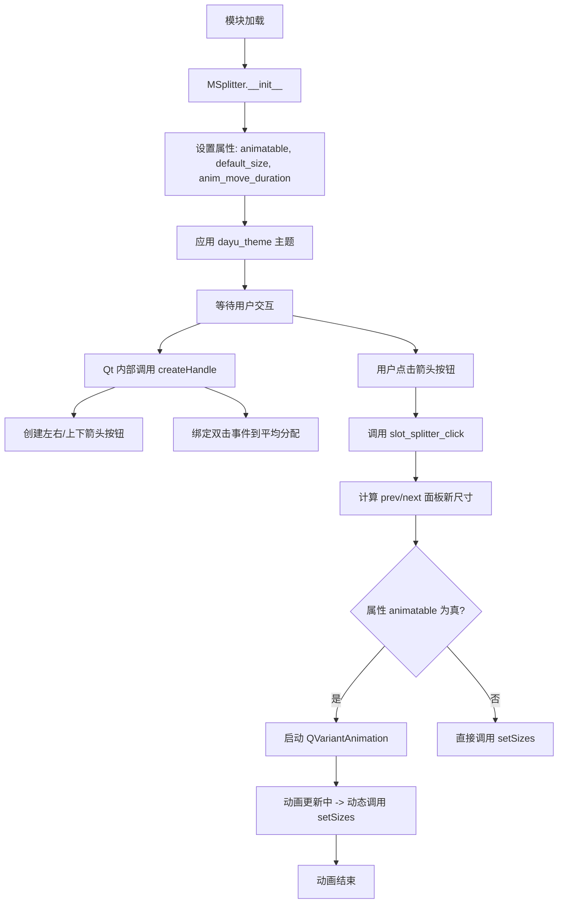
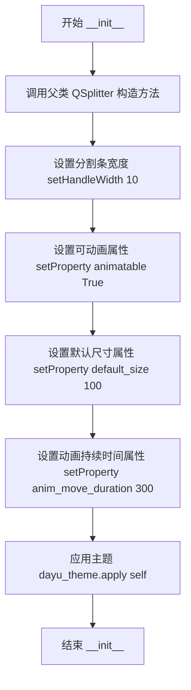

# `comic-translate\app\ui\dayu_widgets\splitter.py` 详细设计文档

这是一个基于 PySide6 的自定义分割器控件，继承自 QSplitter。它实现了通过点击分割条上的按钮来展开/折叠面板、双击恢复平均大小，并提供了基于 Qt 属性系统的平滑动画调整大小功能。

## 整体流程



## 类结构

```
QtWidgets.QSplitter (PySide6 基类)
└── MSplitter (自定义实现，包含 property_mixin)
```

## 全局变量及字段


### `MSplitter.animatable`
    
控制是否启用尺寸变化的平滑动画

类型：`bool`
    


### `MSplitter.default_size`
    
面板默认展开或收起的尺寸

类型：`int`
    


### `MSplitter.anim_move_duration`
    
动画执行持续时间(毫秒)

类型：`int`
    
    

## 全局函数及方法


### `MSplitter.__init__`

该方法用于初始化分割器实例，设置分割器的方向、父窗口，并配置分割条的相关属性（如_handle宽度、可动画属性、默认尺寸和动画持续时间），最后应用主题样式。

参数：

- `self`：`MSplitter`，MSplitter 类实例本身
- `Orientation`：`QtCore.Qt.Horizontal`（默认），分割器方向，可为水平或垂直
- `parent`：`QtWidgets.QWidget` 或 `None`（默认），父窗口部件

返回值：`None`，无返回值，负责对象的初始化工作

#### 流程图



#### 带注释源码

```python
def __init__(self, Orientation=QtCore.Qt.Horizontal, parent=None):
    """
    初始化 MSplitter 实例
    
    参数:
        Orientation: QtCore.Qt.Horizontal, 分割器方向，默认为水平方向
        parent: QtWidgets.QWidget or None, 父窗口部件，默认为 None
    返回:
        None
    """
    # 调用父类 QSplitter 的构造方法，传入方向和父窗口
    super(MSplitter, self).__init__(Orientation, parent=parent)
    
    # 设置分割条（Handle）的宽度为 10 像素
    self.setHandleWidth(10)
    
    # 设置 animatable 属性为 True，启用分割条动画效果
    self.setProperty("animatable", True)
    
    # 设置 default_size 属性为 100，作为默认的分割尺寸
    self.setProperty("default_size", 100)
    
    # 设置 anim_move_duration 属性为 300，控制动画持续时间（毫秒）
    self.setProperty("anim_move_duration", 300)
    
    # 应用 dayu_theme 主题样式到当前分割器部件
    dayu_theme.apply(self)
```


### `MSplitter.slot_splitter_click`

处理分割面板（QSplitter）上的按钮点击事件。当用户点击展开/收起按钮时，此方法会根据 `index` 和 `first` 参数重新计算相邻面板的尺寸，实现交互式的面板展开或收起效果，并可选地播放平滑的动画过渡。

参数：

- `self`：`MSplitter`，分割面板控件实例，继承自 `QtWidgets.QSplitter`。
- `index`：`int`，目标面板的索引。在代码中，此参数接收的是 `self.count()`（组件总数），对应 `sizes()` 列表中的下标，用于确定调整尺寸的两个相邻面板（`index-1` 和 `index`）。
- `first`：`bool`，默认为 `True`。控制当两个面板均处于展开状态时的尺寸转移方向。若为 `True`，则收缩前一个面板（`index-1`）并将空间转移给当前面板（`index`）；若为 `False`，则反之。

返回值：`None`。该方法直接修改控件内部的尺寸列表，并通过 `setSizes` 或动画更新 UI，不返回任何值。

#### 流程图

```mermaid
graph TD
    Start([slot_splitter_click 触发]) --> GetSizes[获取当前所有面板的尺寸列表 sizes()]
    GetSizes --> CalcIndices[计算 prev = index - 1]
    CalcIndices --> CheckPrevSize{prev_size == 0?}
    CheckPrevSize -- 是 --> ActionRestorePrev[将 prev 恢复为 default_size, 并从 index 扣除相应尺寸]
    CheckPrevSize -- 否 --> CheckNextSize{next_size == 0?}
    CheckNextSize -- 是 --> ActionRestoreNext[将 index 恢复为 default_size, 并从 prev 扣除相应尺寸]
    CheckNextSize -- 否 --> CheckFirstFlag{first == True?}
    CheckFirstFlag -- 是 --> ActionExpandCurrent[将 prev_size 加到 index, 置 prev 为 0]
    CheckFirstFlag -- 否 --> ActionExpandPrev[将 next_size 加到 prev, 置 index 为 0]
    
    ActionRestorePrev --> CheckAnimatable
    ActionRestoreNext --> CheckAnimatable
    ActionExpandCurrent --> CheckAnimatable
    ActionExpandPrev --> CheckAnimatable
    
    CheckAnimatable{animatable 属性为真?}
    CheckAnimatable -- 是 --> SetupAnimation[创建 QVariantAnimation]
    SetupAnimation --> StartAnim[动画从 next_size 变化到 size_list[index]]
    StartAnim --> End([结束])
    
    CheckAnimatable -- 否 --> SetSizesDirect[直接调用 self.setSizes(size_list)]
    SetSizesDirect --> End
```

#### 带注释源码

```python
def slot_splitter_click(self, index, first=True):
    """
    处理分割面板上的点击事件，调整面板大小。
    :param index: 目标面板的索引（通常为组件总数 count，对应 sizes 列表的下标）。
    :param first: 布尔值，指示展开/收起时的优先方向。
    """
    # 1. 获取当前所有面板的尺寸列表
    size_list = self.sizes()
    
    # 2. 确定相邻面板的索引（前一个面板索引为 index-1）
    prev = index - 1
    prev_size = size_list[prev]
    next_size = size_list[index]
    
    # 获取默认面板尺寸（属性 default_size）
    default_size = self.property("default_size")
    
    # 3. 逻辑分支：根据当前尺寸状态决定如何调整
    if not prev_size:
        # 情况A：前一个面板尺寸为0（已收起），则恢复它，并从当前面板扣除尺寸
        size_list[prev] = default_size
        size_list[index] -= default_size
    elif not next_size:
        # 情况B：当前面板尺寸为0（已收起），则恢复它，并从前一个面板扣除尺寸
        size_list[index] = default_size
        size_list[prev] -= default_size
    else:
        # 情况C：两个面板都处于展开状态
        if first:
            # 如果 first 为真：将前一个面板的空间全部转移到当前面板（收起前一个，展开当前）
            size_list[index] += prev_size
            size_list[prev] = 0
        else:
            # 如果 first 为假：将当前面板的空间全部转移到前一个面板（收起当前，展开前一个）
            size_list[prev] += next_size
            size_list[index] = 0

    # 4. 根据属性决定是否使用动画过渡
    if self.property("animatable"):
        # 使用 QVariantAnimation 实现平滑动画
        anim = QtCore.QVariantAnimation(self)

        # 定义动画每一帧的回调：更新相邻面板的尺寸以保持总宽/高度不变
        # 逻辑：当前面板变化了多少(delta)，就反向加给前一个面板
        def anim_size(index, size_list, v):
            # 注意：此处通过闭包捕获了 size_list 的引用
            size_list[index - 1] += size_list[index] - v
            size_list[index] = v
            self.setSizes(size_list)

        # 连接信号：动画值变化时调用 anim_size
        anim.valueChanged.connect(partial(anim_size, index, size_list))
        
        # 设置动画参数
        anim.setDuration(self.property("anim_move_duration"))
        # 起始值：变化前的尺寸 (next_size)
        anim.setStartValue(next_size)
        # 结束值：变化后的尺寸 (size_list[index])
        anim.setEndValue(size_list[index])
        anim.start()
    else:
        # 直接设置尺寸，无动画
        self.setSizes(size_list)
```


### `MSplitter.createHandle`

该方法重写了 `QtWidgets.QSplitter` 的默认句柄创建逻辑。它在每个分割条位置生成一个自定义的 `QSplitterHandle` 控件，该控件内部包含两个用于收起或展开面板的箭头按钮，并绑定了双击鼠标事件以实现将所有面板尺寸重置为平均大小。

参数：

- `self`：`MSplitter`，隐式参数，代表当前的分割器实例本身。

返回值：`QtWidgets.QSplitterHandle`，返回配置好的自定义分割条句柄对象，其中包含了布局和交互按钮。

#### 流程图

```mermaid
graph TD
    A([Start createHandle]) --> B[Get count & orientation]
    B --> C{Is Horizontal?}
    C -->|Yes| D[Create QVBoxLayout]
    C -->|No| E[Create QHBoxLayout]
    D --> F
    E --> F
    F[Create QSplitterHandle] --> G[Override mouseDoubleClickEvent:<br/>Set all sizes to 1]
    G --> H[Create ToolButton 1 (Left/Up Arrow)]
    H --> I[Connect clicked -> slot_splitter_click<br/>(count, True)]
    I --> J[Create ToolButton 2 (Right/Down Arrow)]
    J --> K[Connect clicked -> slot_splitter_click<br/>(count, False)]
    K --> L[Add Buttons to Layout]
    L --> M([Return Handle])
```

#### 带注释源码

```python
def createHandle(self):
    # 获取当前分割器中的 widget 数量，用于确定句柄索引
    count = self.count()

    # 获取分割器的方向（水平或垂直）
    orient = self.orientation()
    # 判断是否为水平方向
    is_horizontal = orient is QtCore.Qt.Horizontal
    # 创建对应方向的 QSplitterHandle
    handle = QtWidgets.QSplitterHandle(orient, self)

    # NOTES: double click average size
    # 为句柄的双击事件绑定 Lambda 函数，双击时将所有面板尺寸重置为1（平均分配）
    handle.mouseDoubleClickEvent = lambda e: self.setSizes([1 for i in range(self.count())])

    # 根据方向选择垂直或水平布局，用于摆放按钮
    layout = QtWidgets.QVBoxLayout() if is_horizontal else QtWidgets.QHBoxLayout()
    # 设置布局边距为0
    layout.setContentsMargins(0, 0, 0, 0)
    # 为句柄设置布局
    handle.setLayout(layout)

    # 创建第一个控制按钮（左/上箭头）
    button = QtWidgets.QToolButton(handle)
    button.setArrowType(QtCore.Qt.LeftArrow if is_horizontal else QtCore.Qt.UpArrow)
    # 绑定点击事件，调用收起/展开逻辑，传入 count 和 True
    button.clicked.connect(lambda: self.slot_splitter_click(count, True))
    # 将按钮添加到布局
    layout.addWidget(button)
    
    # 创建第二个控制按钮（右/下箭头）
    button = QtWidgets.QToolButton(handle)
    arrow = QtCore.Qt.RightArrow if is_horizontal else QtCore.Qt.DownArrow
    button.setArrowType(arrow)
    # 绑定点击事件，传入 count 和 False
    button.clicked.connect(lambda: self.slot_splitter_click(count, False))
    layout.addWidget(button)

    # 返回配置完成的句柄
    return handle
```

## 关键组件


### MSplitter 类

自定义分割器组件，继承自QtWidgets.QSplitter，提供带有动画效果的展开/折叠功能，允许用户通过点击箭头按钮动态调整面板大小。

### 属性系统

通过Qt属性机制存储配置信息，包括animatable（是否启用动画）、default_size（默认面板大小）、anim_move_duration（动画持续时间），实现配置与逻辑的解耦。

### slot_splitter_click 方法

处理分割器点击事件的核心方法，根据当前面板状态执行展开或折叠逻辑，动态计算并调整相邻面板的尺寸，支持双向展开/折叠。

### createHandle 方法

创建自定义分割句柄，生成带有左右/上下箭头按钮的面板，用于触发展开/折叠操作，实现用户交互入口。

### 动画系统

基于QVariantAnimation实现的平滑尺寸过渡动画，在animatable属性启用时提供流畅的用户体验，动画结束后自动更新面板尺寸。

### 双击均分功能

通过重写mouseDoubleClickEvent实现双击平均分配所有面板尺寸的快捷操作，提升用户体验。


## 问题及建议


### 已知问题

-   **动画对象未持有引用**：在 `slot_splitter_click` 方法中创建的 `QVariantAnimation` 对象没有保存到实例变量，动画可能在执行过程中被垃圾回收，导致动画异常中断
-   **lambda 闭包捕获 self**：多处使用 `lambda e: ...` 和 `lambda: ...` 捕获 self，可能导致循环引用和内存泄漏，同时也不利于垃圾回收
-   **边界条件未做保护**：`slot_splitter_click` 方法中直接访问 `size_list[prev]` 和 `size_list[index]`，当 index=0 或 prev<0 时会导致 IndexError 异常
-   **createHandle 逻辑依赖外部状态**：方法内部使用 `self.count()` 获取当前面板数量，但这个值在 handle 创建时可能与预期不符，导致按钮点击行为不可预测
-   **硬编码魔法值**：handleWidth(10)、default_size(100)、anim_move_duration(300) 等数值硬编码在代码中，缺乏配置灵活性
-   **方法命名不规范**：`slot_splitter_click` 使用了驼峰命名，与 Python PEP8 风格指南不符

### 优化建议

-   **保存动画引用**：将动画对象保存到实例变量（如 `self._animation`），或在动画完成前阻止垃圾回收
-   **使用 bound method 替代 lambda**：将按钮点击事件和双击事件改为绑定到类方法，避免 lambda 闭包问题
-   **添加边界检查**：在 `slot_splitter_click` 方法入口处添加 `if index <= 0 or index >= len(size_list): return` 保护逻辑
-   **抽取配置常量**：将硬编码值定义为类常量或可通过属性配置的默认值，提高可维护性
-   **重构动画逻辑**：考虑使用 QPropertyAnimation 替代 QVariantAnimation，并简化动画回调中的复杂逻辑
-   **统一命名风格**：将 `slot_splitter_click` 改为下划线命名风格如 `_on_splitter_clicked`
-   **分离 createHandle 逻辑**：将按钮创建逻辑抽取为独立方法如 `_create_handle_button`，提高代码可读性


## 其它


### 设计目标与约束

- **设计目标**: 提供一个可自定义的分割器组件，支持点击按钮动态调整面板大小，支持动画过渡效果
- **约束条件**: 
  - 依赖PySide6库
  - 需要配合dayu_theme主题使用
  - 仅支持Qt水平或垂直方向
  - 分割器至少需要2个子部件才能正常工作

### 错误处理与异常设计

- **索引越界风险**: `slot_splitter_click`方法中访问`size_list[prev]`和`size_list[index]`时未检查边界，可能在index为0时访问-1导致越界
- **空指针处理**: 未检查`self.property()`返回的None值，直接使用可能导致类型错误
- **动画状态**: 未处理动画进行中重复点击的情况，可能导致多个动画同时运行

### 数据流与状态机

- **状态存储**: 使用Qt属性系统存储配置状态（animatable、default_size、anim_move_duration）
- **尺寸计算**: 尺寸调整逻辑依赖`sizes()`列表的当前值，每次操作后重新计算
- **动画流程**: 点击按钮 → 计算新尺寸 → 创建QVariantAnimation → 设置起止值 → 启动动画 → 动画更新回调中应用尺寸

### 外部依赖与接口契约

- **依赖模块**:
  - PySide6.QtCore, PySide6.QtGui, PySide6.QtWidgets - Qt框架核心
  - dayu_theme - 主题应用模块
  - property_mixin - 属性混入模块
- **接口契约**:
  - `__init__`: 接受Orientation和parent参数
  - `slot_splitter_click(index, first)`: 第一个参数为分割器索引，第二个参数为方向标识
  - `createHandle()`: 返回QtWidgets.QSplitterHandle对象

### 性能考虑

- **动画性能**: 每次点击都创建新的QVariantAnimation对象，未复用，可能导致资源浪费
- **Lambda捕获**: 使用lambda捕获外层变量，可能导致引用循环
- **重复计算**: `self.sizes()`和`self.count()`被多次调用，可缓存

### 线程安全性

- 所有操作均在主线程执行
- 未发现跨线程数据访问，无需加锁

### 资源管理

- 动画对象创建后未显式保存引用，可能被垃圾回收
- 未实现销毁时的清理逻辑

### 版本兼容性

- 使用Python 3兼容语法（__future__导入）
- 依赖PySide6（Qt6版本），不兼容PySide2（Qt5）
- property_mixin的具体实现未知，可能存在兼容性问题

### 使用示例

```python
from PySide6 import QtCore, QtWidgets
from m_splitter import MSplitter

app = QtWidgets.QApplication([])
window = QtWidgets.QWidget()
layout = QtWidgets.QVBoxLayout(window)

splitter = MSplitter(QtCore.Qt.Horizontal)
splitter.addWidget(QtWidgets.QPushButton("Left"))
splitter.addWidget(QtWidgets.QPushButton("Right"))
layout.addWidget(splitter)

window.show()
app.exec()
```

    