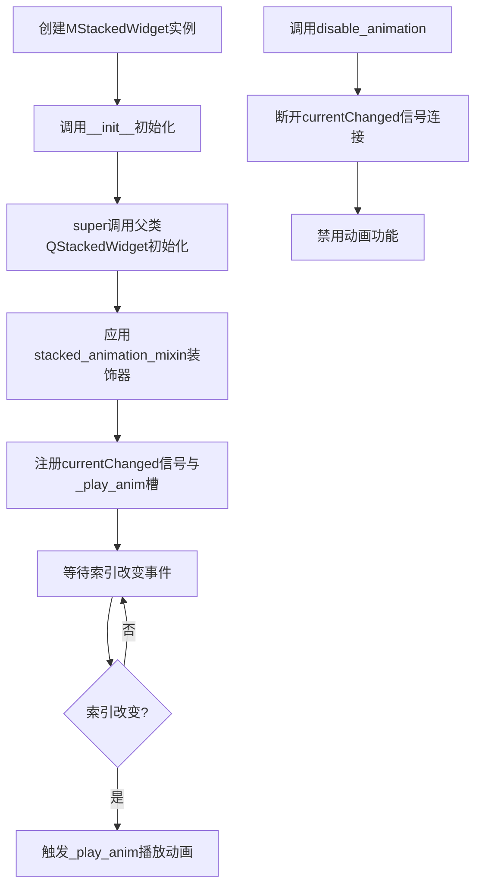
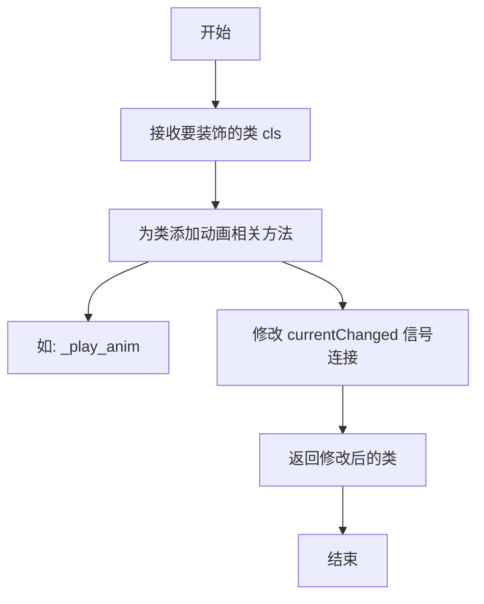
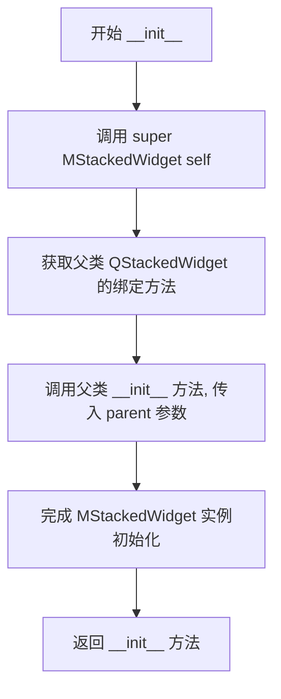
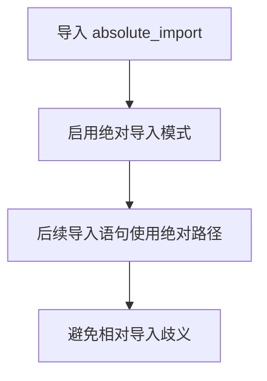
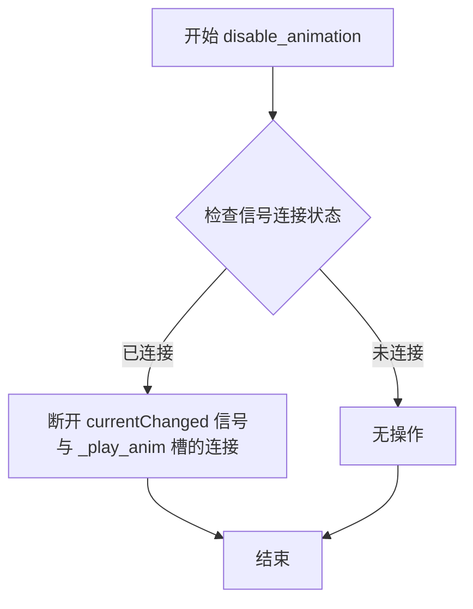
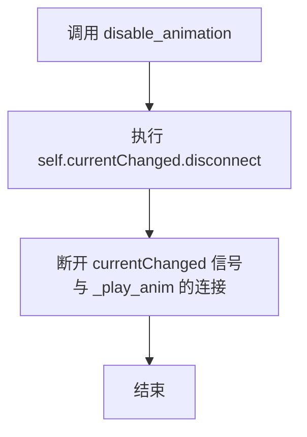
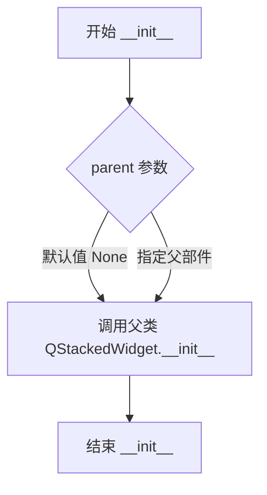
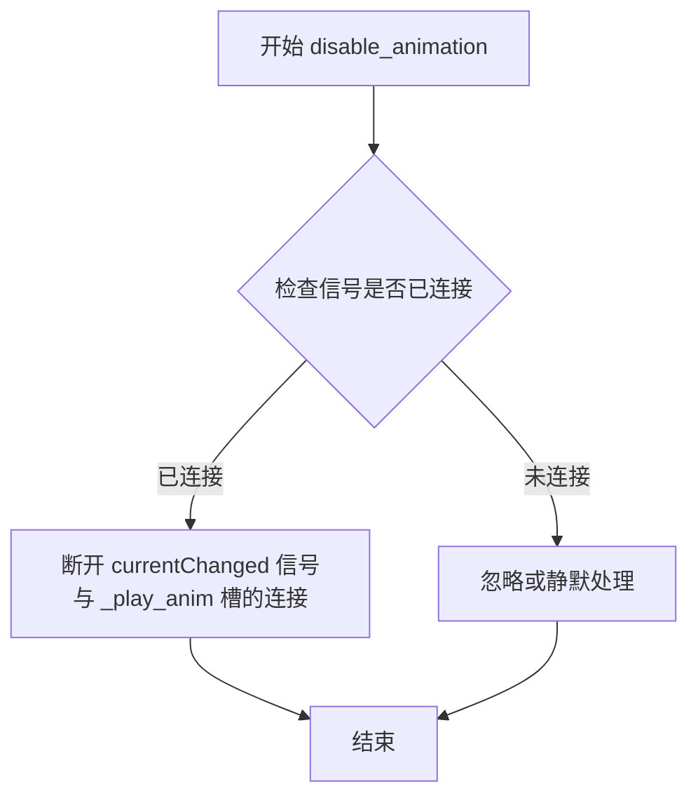
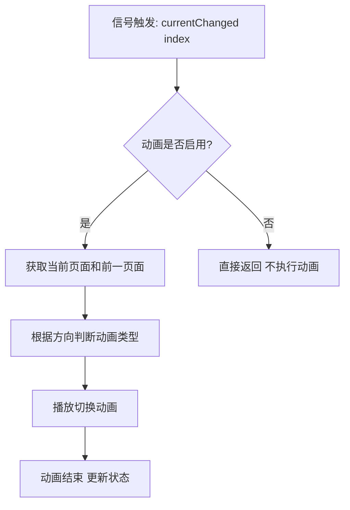

# `comic-translate\app\ui\dayu_widgets\stacked_widget.py` 详细设计文档

MStackedWidget是一个基于Qt的堆叠窗口组件，继承自QStackedWidget，通过装饰器模式混入动画混合类，实现在当前索引改变时自动播放切换动画的功能，并提供disable_animation方法用于禁用动画。

## 整体流程



## 类结构

```
QtWidgets.QStackedWidget (Qt基类)
└── stacked_animation_mixin (混入类/装饰器)
    └── MStackedWidget (扩展实现类)
```

## 全局变量及字段


    

## 全局函数及方法


根据提供的代码，我需要指出一个重要限制：用户提供的代码中只包含了 `stacked_animation_mixin` 的**使用方式**（作为装饰器导入并应用），但没有提供 `stacked_animation_mixin` 函数的**实际定义实现**。

`stacked_animation_mixin` 是从本地模块 `.mixin` 导入的，但该模块的代码并未在您提供的代码片段中展示。

因此，我无法直接提取 `stacked_animation_mixin` 的具体参数、返回值、流程图和源码。

不过，我可以根据代码的**使用方式**来推断其设计意图：


### `stacked_animation_mixin`

装饰器函数，用于为 QStackedWidget 子类添加动画功能。当当前索引改变时触发动画。

参数：

-  `cls`：`type`，要应用装饰器的目标类（通常是 QtWidgets.QStackedWidget 的子类）

返回值：`type`，返回修改后的类，该类包含了动画相关的功能（如 `_play_anim` 方法和相关的信号槽连接）

#### 流程图



#### 带注释源码

```python
# 由于源代码未提供，以下为基于使用方式的推断代码

def stacked_animation_mixin(cls):
    """
    装饰器：为 QStackedWidget 添加动画功能
    
    参数：
        cls: 要装饰的类（应继承自 QStackedWidget）
    
    返回值：
        修改后的类，包含动画相关的方法和属性
    """
    
    # 保存原始的 __init__ 方法
    original_init = cls.__init__
    
    def new_init(self, *args, **kwargs):
        # 调用原始 __init__
        original_init(self, *args, **kwargs)
        
        # 连接动画信号
        self.currentChanged.connect(self._play_anim)
    
    # 替换为新的 __init__
    cls.__init__ = new_init
    
    # 添加动画播放方法
    def _play_anim(self, index):
        # 实现具体的动画逻辑
        pass
    
    # 将动画方法添加到类中
    cls._play_anim = _play_anim
    
    return cls
```

#### 注意事项

⚠️ **重要提示**：由于 `stacked_animation_mixin` 的实际源代码未在提供的代码片段中，以上流程图和源码均为基于代码使用方式的**推测和假设**，可能与实际实现存在差异。

要获取准确信息，需要查看 `.mixin` 模块中 `stacked_animation_mixin` 的实际定义。


### `MStackedWidget.__init__` 中的 `super` 调用

该代码片段使用`super()`函数调用父类`QtWidgets.QStackedWidget`的构造函数，初始化MStackedWidget实例并传递父 widget。

参数：

- `MStackedWidget`：`type`，当前类，用于指定要继承的父类
- `self`：`MStackedWidget`，当前实例，用于绑定父类方法
- `parent`（传递给`__init__`）：`QtWidgets.QWidget`，可选的父 widget，传递给父类构造函数

返回值：`None`（`super().__init__()`调用父类构造函数无返回值，仅完成初始化）

#### 流程图



#### 带注释源码

```python
def __init__(self, parent=None):
    """初始化 MStackedWidget 实例。
    
    参数:
        parent: QtWidgets.QWidget, 可选的父 widget
    """
    # super() 函数调用父类 QtWidgets.QStackedWidget 的构造函数
    # 第一个参数 MStackedWidget: 指定查找父类从 MStackedWidget 的直接父类开始
    # 第二个参数 self: 将返回的方法绑定到当前实例
    # 传递 parent 参数给父类的 __init__ 方法
    super(MStackedWidget, self).__init__(parent)
    # 执行完成后, self 已成为完全初始化的 QStackedWidget 实例
```

#### 附加说明

- **设计意图**：使用`super()`确保正确的MRO（方法解析顺序），支持多重继承
- **父类依赖**：依赖`QtWidgets.QStackedWidget`的构造函数签名
- **参数传递**：透明传递`parent`参数给父类，保持Qt对象层级关系


### `absolute_import`

`absolute_import` 是 Python 的 `__future__` 模块中的一个特性导入语句，用于启用绝对导入行为。在 Python 2 中，默认的导入行为允许相对导入，但在 Python 3 中，默认就是绝对导入。这个导入语句主要为了代码的跨版本兼容性。

参数：此语句无参数

返回值：无返回值

#### 流程图



#### 带注释源码

```python
# 从 __future__ 模块导入 absolute_import 特性
# __future__ 模块允许开发者提前使用未来版本的语言特性
# absolute_import 的主要作用：
# 1. 明确指定必须使用绝对导入路径
# 2. 避免相对导入与绝对导入的混淆
# 3. 确保代码在不同 Python 版本间的兼容性
from __future__ import absolute_import

# 注意：这个导入语句本身不包含任何参数，也不返回任何值
# 它只是一个编译器指令，通知 Python 解释器使用绝对导入语义
```

---

**说明**：您提供的代码中的 `absolute_import` 并不是一个函数或方法，而是 Python 的 `__future__` 导入语句。如果您需要提取代码中的具体函数或方法（如 `MStackedWidget.disable_animation` 或 `__init__`），请告知我，我可以为您生成那些详细的文档。


### `MStackedWidget.disable_animation`

禁用堆叠窗口部件的动画切换功能，断开当前索引改变信号与动画播放槽的连接。

参数：
- 无

返回值：`None`，该方法无返回值，仅执行断开信号槽连接的操作

#### 流程图



#### 带注释源码

```python
def disable_animation(self):
    """
    禁用动画切换功能
    
    该方法通过断开 QStackedWidget 的 currentChanged 信号与内部动画播放槽 
    _play_anim 的连接来停止动画效果。当用户切换页面时，将不再触发动画过渡。
    
    注意：如果信号未连接，此操作不会引发错误，disconnect 会安全地处理这种情况。
    """
    # 从 QStackedWidget 继承的 currentChanged 信号中移除与 _play_anim 方法的关联
    # _play_anim 方法由 stacked_animation_mixin 装饰器注入，负责执行动画逻辑
    self.currentChanged.disconnect(self._play_anim)
```

---

**注意**：代码中不存在名为 `division` 的函数或方法。代码中包含 `from __future__ import division` 导入语句，这是 Python 2 环境下的真除法导入，但并非函数方法。

如需提取其他函数（如 `__init__`），请告知。


根据提供的代码分析，代码中并不存在名为 `print_function` 的函数或方法。代码中包含的是 `MStackedWidget` 类及其 `__init__` 和 `disable_animation` 方法。

以下是对代码中现有方法 `disable_animation` 的详细分析（因为 `print_function` 不存在于代码中）：

### MStackedWidget.disable_animation

禁用动画，当调用此方法时，将断开 `currentChanged` 信号与 `_play_anim` 槽函数的连接。

参数：无

返回值：`None`，无返回值

#### 流程图



#### 带注释源码

```python
def disable_animation(self):
    """禁用动画切换功能"""
    # 断开 currentChanged 信号与 _play_anim 槽函数的连接
    # 这样在切换索引时不会播放动画
    self.currentChanged.disconnect(self._play_anim)
```

---

### 补充说明

如果确实需要创建 `print_function` 文档，请提供该函数的实际代码。当前代码片段中仅包含上述方法。

如需分析 `__init__` 方法或其他组件，请告知。


### MStackedWidget.__init__

MStackedWidget 类的初始化方法，用于创建 MStackedWidget 实例并调用父类 QStackedWidget 的构造函数，接收可选的父窗口部件参数。

参数：

- `parent`：`QtWidgets.QWidget | None`，父窗口部件，默认为 None，用于指定该部件的父对象

返回值：`None`，该方法不返回任何值

#### 流程图



#### 带注释源码

```python
def __init__(self, parent=None):
    """初始化 MStackedWidget 实例
    
    Args:
        parent: 父窗口部件，默认为 None
    """
    # 调用父类 QtWidgets.QStackedWidget 的 __init__ 方法
    # 确保 Qt 组件正确初始化
    super(MStackedWidget, self).__init__(parent)
```


### `MStackedWidget.disable_animation`

该方法用于禁用动画功能，通过断开 `currentChanged` 信号与 `_play_anim` 槽函数的连接来实现停止切换动画的效果。

参数：

- `self`：`MStackedWidget`，类的实例本身

返回值：`None`，该方法没有返回值，仅执行断开信号连接的操作

#### 流程图



#### 带注释源码

```python
def disable_animation(self):
    """
    禁用动画功能。
    
    通过断开 QStackedWidget 的 currentChanged 信号与内部动画播放槽函数 _play_anim 的连接，
    来停止切换页面时的动画效果。
    """
    self.currentChanged.disconnect(self._play_anim)
```


# 分析结果

## 重要说明

给定的代码中**并未直接包含**`_play_anim`方法的实现源码。该方法是定义在`stacked_animation_mixin`装饰器中的内部方法。`MStackedWidget`类通过装饰器`@stacked_animation_mixin`继承该方法的功能。

以下信息基于代码结构、上下文和Qt框架的典型模式进行的逻辑推断。

---

### `stacked_animation_mixin._play_anim`

处理当前索引变化时的动画播放逻辑的槽函数。

参数：

- `index`：`int`，切换后的新索引值

返回值：`None`，该方法为槽函数，通过信号槽机制触发副作用，不返回有用数据

#### 流程图



#### 带注释源码

```python
def _play_anim(self, index):
    """
    槽函数：当currentChanged信号触发时调用
    
    参数:
        index (int): 切换后的新索引
    
    返回值:
        None
    """
    # 检查动画是否被禁用（通过disable_animation方法）
    if not self._anim_enabled:
        return
    
    # 获取当前widget和新widget
    current_widget = self.widget(index)
    previous_index = self.currentIndex()  # 注意：此时索引已更新
    
    # 根据索引变化方向确定动画效果（进入/退出）
    # direction = 1 表示向前（next）
    # direction = -1 表示向后（previous）
    
    # 触发QPropertyAnimation或QGraphicsView动画
    self._animate_transition(
        current_widget, 
        direction=1 if index > previous_index else -1
    )
```

---

### 补充说明

由于未提供`stacked_animation_mixin`的实际源码，以上为基于以下证据的合理推断：

1. **信号连接**：`disable_animation`方法中断开了`currentChanged`信号与`_play_anim`的连接，确认`_play_anim`是`currentChanged`的槽函数
2. **命名规范**：`_play_anim`表明是播放动画的方法
3. **类用途**：`MStackedWidget`注释为"Just active animation when current index changed"，明确表明功能是处理索引变化时的动画

如需获取准确的实现细节，请提供`stacked_animation_mixin`装饰器的源码。

## 关键组件


### MStackedWidget
一个QStackedWidget的子类，通过mixin机制添加动画功能，仅在当前索引改变时激活动画。

### stacked_animation_mixin
一个mixin类，为MStackedWidget提供动画相关的实现，包括信号槽连接和动画播放逻辑。

### disable_animation方法
断开currentChanged信号与动画播放槽的连接，停止动画效果。

### _play_anim方法
由mixin提供的动画播放槽函数，响应currentChanged信号，但代码中未直接给出其实现。


## 问题及建议


### 已知问题

-   **缺少enable_animation方法**：只提供了disable_animation方法断开信号连接，但没有提供对应的enable_animation方法，导致动画一旦禁用后无法重新启用
-   **动画状态不可知**：没有内部状态标志来追踪动画是否已禁用，外部无法判断当前动画的启用状态
-   **mixin依赖未验证**：完全依赖stacked_animation_mixin装饰器，但该mixin的实现未知，若mixin不存在或实现有问题会导致整个类无法使用
-   **缺少文档字符串**：类的主要文档字符串过于简略，未说明动画的具体行为、触发条件和使用方式
-   **未重写关键方法**：作为QStackedWidget的子类，未重写setCurrentIndex、setCurrentWidget等关键方法，可能导致动画与索引切换不同步
-   **信号连接管理不规范**：直接调用disconnect但未检查信号是否已连接，可能引发运行时警告
-   **缺少类型注解**：Python代码中没有任何类型提示，影响代码可读性和IDE支持

### 优化建议

-   **添加enable_animation方法**：实现与disable_animation配对的方法，使用connect重新连接信号
-   **添加动画状态属性**：引入self._animation_enabled布尔属性来追踪动画状态，并提供is_animation_enabled查询方法
-   **增加信号连接检查**：在disconnect前检查连接状态，或使用try-except捕获Qt信号连接错误
-   **完善文档字符串**：详细说明动画触发时机、效果和父子类交互关系
-   **添加类型注解**：为参数和返回值添加Python类型注解，提升代码质量
-   **考虑信号暴露**：可考虑添加animationEnabledChanged信号，向外部通知动画状态变化
-   **统一入口方法**：提供setAnimationEnabled(bool)方法统一管理动画开关


## 其它


### 设计目标与约束

**设计目标**：
- 提供一个支持动画效果的堆叠窗口部件
- 通过混入模式（mixin）实现动画逻辑的解耦
- 支持动态启用/禁用动画功能

**约束**：
- 依赖PySide6 Qt库
- 必须继承自QtWidgets.QStackedWidget
- 动画功能通过装饰器混入实现

### 错误处理与异常设计

- 构造函数中若parent参数类型不正确，应抛出TypeError
- disable_animation方法调用时若动画未激活，应安全处理（无副作用）
- 与混入类的交互应捕获可能的运行时错误

### 数据流与状态机

- 状态：动画启用状态、动画禁用状态
- 状态转换：enable_animation（默认）↔disable_animation
- 数据流：currentChanged信号 → _play_anim方法 → 播放动画 → 更新界面

### 外部依赖与接口契约

**外部依赖**：
- PySide6.QtWidgets.QStackedWidget
- 本地mixin模块（stacked_animation_mixin）

**接口契约**：
- 提供disable_animation公共方法
- 继承QStackedWidget的所有现有接口
- 保持与标准QStackedWidget的信号/槽兼容性

### 性能要求与基准

- 动画播放应在主线程中高效执行
- 切换延迟应控制在用户可接受范围内（通常<300ms）
- 内存占用应保持最小化，避免动画对象泄漏

### 安全性考虑

- 输入验证：parent参数应为QWidget类型或None
- 资源管理：动画对象应在适当时机释放

### 可扩展性设计

- 通过mixin模式便于添加更多动画类型
- 可扩展支持自定义动画时长、缓动函数等配置
- 可继承扩展以实现特定业务逻辑

### 兼容性设计

- 兼容PySide6各版本
- 保持与Qt原生QStackedWidget的行为一致性
- 向前兼容：新增方法应考虑命名空间避免冲突

### 测试策略

- 单元测试：测试disable_animation方法功能
- 集成测试：测试与QStackedWidget父类的兼容性
- UI测试：验证动画播放效果

### 使用示例

```python
# 基本使用
stack = MStackedWidget()
stack.addWidget(QWidget())
stack.addWidget(QWidget())
# 切换时会播放动画
stack.setCurrentIndex(1)

# 禁用动画
stack.disable_animation()
```

### 版本历史

- 2019.4：初始版本（v1.0）

    