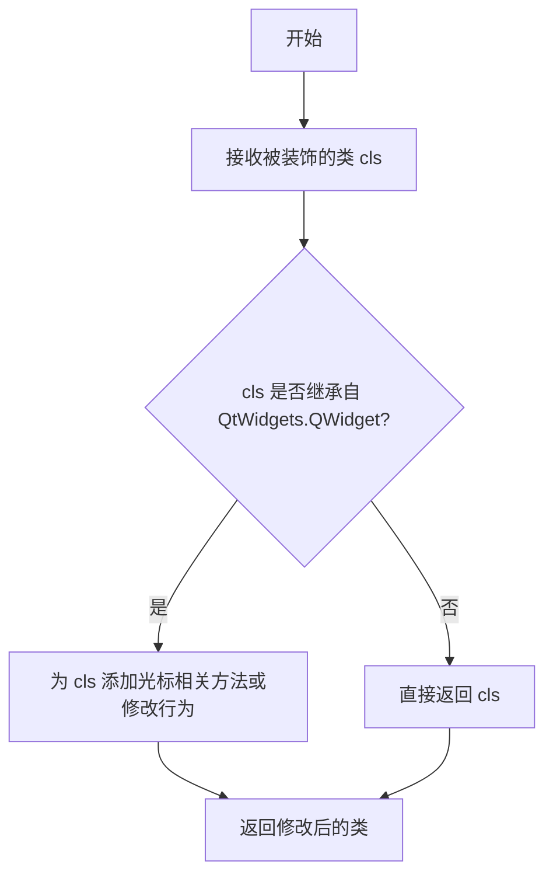
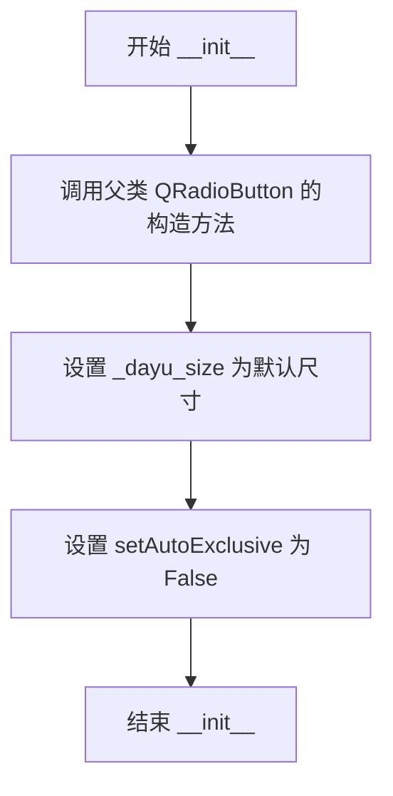
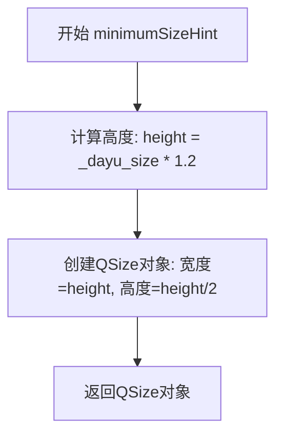
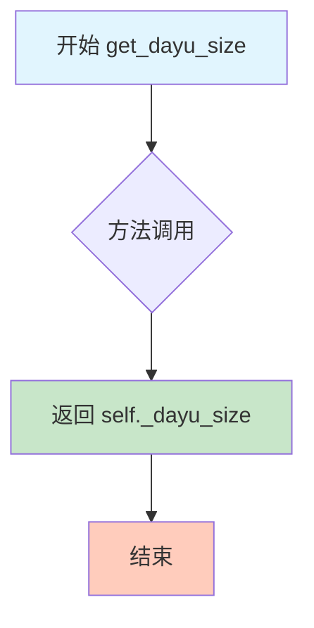
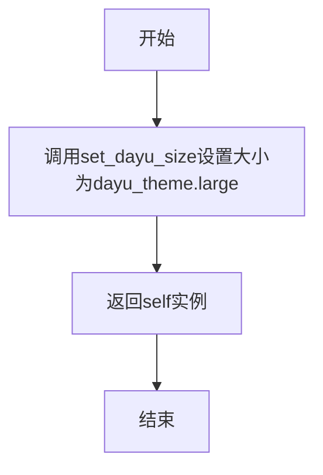
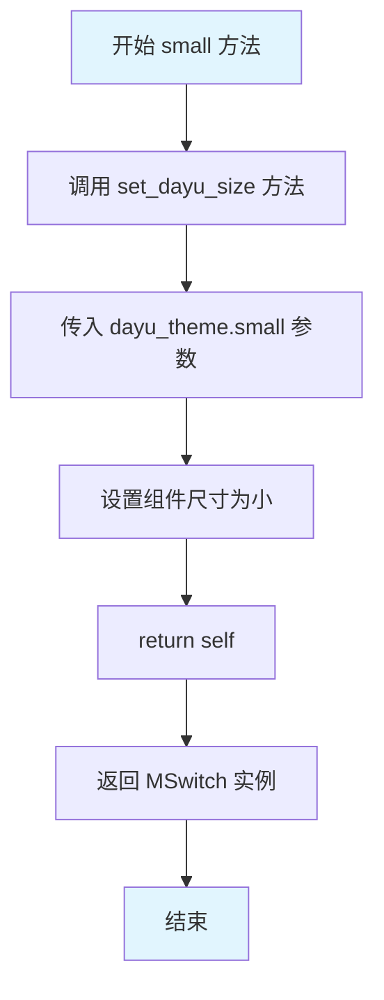
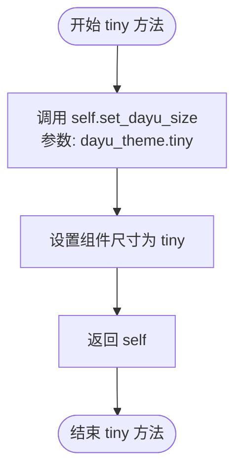

# `comic-translate\app\ui\dayu_widgets\switch.py` 详细设计文档

MSwitch是一个自定义的开关选择器组件，继承自PySide6的QRadioButton，提供可视化的大小切换功能（tiny/small/medium/large/huge）和自定义主题尺寸属性，适用于需要开关状态的GUI应用场景。

## 整体流程

```mermaid
graph TD
    A[创建MSwitch实例] --> B[调用__init__初始化]
    B --> C[设置默认dayu_size]
    C --> D[设置setAutoExclusive(False)]
    E[用户调用size方法] --> F{huge/large/medium/small/tiny}
    F --> G[调用set_dayu_size更新尺寸]
    G --> H[调用style().polish刷新样式]
    I[获取尺寸属性] --> J[调用get_dayu_size]
    J --> K[返回_dayu_size值]
```

## 类结构

```
QtWidgets.QRadioButton (PySide6基类)
└── MSwitch (自定义开关组件)
    └── @cursor_mixin (装饰器)
```

## 全局变量及字段


### `dayu_theme.default_size`
    
开关组件的默认尺寸数值

类型：`int`
    


### `dayu_theme.huge`
    
开关组件的巨大尺寸数值

类型：`int`
    


### `dayu_theme.large`
    
开关组件的大尺寸数值

类型：`int`
    


### `dayu_theme.medium`
    
开关组件的中等尺寸数值

类型：`int`
    


### `dayu_theme.small`
    
开关组件的小尺寸数值

类型：`int`
    


### `dayu_theme.tiny`
    
开关组件的微小尺寸数值

类型：`int`
    


### `MSwitch._dayu_size`
    
开关组件的尺寸数值

类型：`int`
    
    

## 全局函数及方法


### `cursor_mixin`

`cursor_mixin` 是一个装饰器函数（由外部 `mixin` 模块提供），用于为 `MSwitch` 类添加鼠标光标相关的功能行为。

**注意**：提供的代码中仅包含 `cursor_mixin` 的导入和使用，并未包含其实际实现。以下信息基于代码上下文和装饰器函数的常见模式推断得出。

参数：

-  `cls`：`type`（类对象），被装饰的目标类（此处为 `MSwitch` 类）

返回值：`type`（类对象），装饰后的类

#### 流程图



#### 带注释源码

```python
# 注：以下源码为基于使用模式的推测，非实际代码
# 实际实现位于 from .mixin import cursor_mixin 处

def cursor_mixin(cls):
    """
    装饰器：为 Qt 组件添加鼠标光标交互功能
    
    :param cls: 被装饰的类，通常继承自 QtWidgets.QWidget
    :return: 装饰后的类
    """
    # 保存原始类
    original_class = cls
    
    # 为类添加光标相关方法
    # 例如：鼠标进入时改变光标，鼠标离开时恢复
    def enterEvent(self, event):
        # 鼠标进入组件区域时设置光标为手型
        self.setCursor(QtCore.Qt.PointingHandCursor)
        # 调用原始的 enterEvent
        super(original_class, self).enterEvent(event)
    
    def leaveEvent(self, event):
        # 鼠标离开组件区域时恢复默认光标
        self.unsetCursor()
        # 调用原始的 leaveEvent
        super(original_class, self).leaveEvent(event)
    
    # 将新方法添加到类中
    cls.enterEvent = enterEvent
    cls.leaveEvent = leaveEvent
    
    return cls
```

#### 备注

由于 `cursor_mixin` 的实现位于外部模块 `mixin` 中，未在当前代码文件中提供，因此无法获取其确切的源代码。实际的 `cursor_mixin` 函数定义可能在项目的 `mixin.py` 或相关模块中。建议查看 `mixin.py` 文件以获取完整的实现细节。


### `MSwitch.__init__`

构造函数，用于初始化 MSwitch 开关控件实例，设置默认尺寸并禁用互斥选择。

参数：

- `self`：隐含的实例参数，表示当前创建的 MSwitch 对象
- `parent`：`QtWidgets.QWidget`，可选，父控件，默认为 None，用于建立 Qt 控件层级关系

返回值：`None`，无返回值

#### 流程图



#### 带注释源码

```python
def __init__(self, parent=None):
    """
    初始化 MSwitch 开关控件。

    :param parent: QtWidgets.QWidget, 父控件，默认为 None
    :return: None
    """
    # 调用父类 QRadioButton 的构造函数，完成 Qt 基础控件的初始化
    super(MSwitch, self).__init__(parent)
    
    # 初始化开关的默认尺寸，使用 dayu_theme 中的默认大小
    self._dayu_size = dayu_theme.default_size
    
    # 设置 AutoExclusive 为 False，允许同时选中多个 MSwitch
    # （QRadioButton 默认互斥，但 MSwitch 作为独立开关需要可多选）
    self.setAutoExclusive(False)
```


### `MSwitch.minimumSizeHint`

覆盖QRadioButton的最小尺寸提示方法，根据dayu_size属性计算开关组件的最小尺寸，不需要文本空间。

参数：
- 无显式参数（继承自Qt的minimumSizeHint方法）

返回值：`QtCore.QSize`，返回开关组件的最小尺寸，宽度为dayu_size * 1.2，高度为dayu_size * 0.6

#### 流程图



#### 带注释源码

```python
def minimumSizeHint(self):
    """
    Override the QRadioButton minimum size hint. We don't need the text space.
    :return: QtCore.QSize - the minimum size hint for the switch widget
    """
    # 根据dayu_size计算开关的高度
    # 高度 = 默认尺寸 * 1.2
    height = self._dayu_size * 1.2
    
    # 返回QSize对象
    # 宽度 = height (即 dayu_size * 1.2)
    # 高度 = height / 2 (即 dayu_size * 0.6)
    return QtCore.QSize(int(height), int(height / 2))
```


### `MSwitch.get_dayu_size`

获取 MSwitch 组件的尺寸大小。该方法是 Qt Property 系统的 getter 方法，用于读取 `_dayu_size` 属性的当前值。

参数： 无

返回值：`int`，返回组件当前的尺寸大小值（单位为像素）

#### 流程图



#### 带注释源码

```python
def get_dayu_size(self):
    """
    Get the switch size.
    :return: int - 当前开关组件的尺寸大小值
    """
    # 直接返回私有属性 _dayu_size 的值
    # 该值由 set_dayu_size 或预设主题默认值初始化
    return self._dayu_size
```


### `MSwitch.set_dayu_size`

设置开关组件的尺寸大小，通过更新内部尺寸属性并调用Qt样式系统来应用新的尺寸。

参数：

- `value`：`int`，要设置的开关尺寸大小值

返回值：`None`，无返回值

#### 流程图

```mermaid
flowchart TD
    A[开始 set_dayu_size] --> B{检查参数有效性}
    B -->|参数有效| C[更新 self._dayu_size = value]
    C --> D[调用 self.style().polish self]
    D --> E[结束方法, 返回 None]
    
    B -->|参数无效| E
```

#### 带注释源码

```python
def set_dayu_size(self, value):
    """
    设置开关组件的尺寸大小。
    
    此方法接收一个整数值来定义开关的尺寸，
    更新内部存储的 _dayu_size 属性，
    并通过 Qt 的样式系统应用新的尺寸。
    
    :param value: int - 开关的新尺寸值
    :return: None - 此方法不返回任何值
    """
    # 步骤1: 将传入的 value 赋值给实例属性 _dayu_size
    # 这个属性存储了开关的当前尺寸配置
    self._dayu_size = value
    
    # 步骤2: 调用 Qt 样式系统的 polish 方法
    # polish() 会重新计算组件的外观并应用样式策略
    # 确保新尺寸能够正确地在界面上体现出来
    self.style().polish(self)
```


### MSwitch.huge

设置 MSwitch 组件为巨大尺寸的便捷方法，通过调用 `set_dayu_size` 方法将组件尺寸设置为 `dayu_theme.huge` 值，并返回 self 以支持链式调用。

参数： 无

返回值：`MSwitch`，返回自身实例以支持链式调用（如 `switch.huge().medium()`）

#### 流程图

```mermaid
flowchart TD
    A[开始 huge 方法] --> B{检查参数}
    B -->|无需参数| C[调用 set_dayu_size 方法]
    C --> D[传入 dayu_theme.huge 参数]
    D --> E[设置 _dayu_size 属性]
    E --> F[调用 style().polish 刷新样式]
    F --> G[返回 self 实例]
    G --> H[结束]
```

#### 带注释源码

```python
def huge(self):
    """
    Set MSwitch to huge size
    
    该方法将开关组件的尺寸设置为 'huge' 级别。
    通过设置 _dayu_size 属性为 dayu_theme.huge，然后调用
    style().polish(self) 刷新组件样式。
    
    Returns:
        MSwitch: 返回自身实例，支持链式调用
                 例如: switch.huge().medium()
    
    Example:
        >>> switch = MSwitch()
        >>> switch.huge()  # 设置为巨大尺寸
        >>> # 或者链式调用
        >>> switch.huge().setChecked(True)
    """
    self.set_dayu_size(dayu_theme.huge)  # 调用 set_dayu_size 方法设置尺寸为 huge
    return self  # 返回 self 以支持链式调用
```


### `MSwitch.large`

设置MSwitch控件为大尺寸，并返回self以支持链式调用。

参数：

- 无

返回值：`MSwitch`，返回自身实例，支持链式调用

#### 流程图



#### 带注释源码

```python
def large(self):
    """
    Set MSwitch to large size
    
    该方法将MSwitch控件的尺寸设置为大尺寸(dayu_theme.large)，
    并返回self以支持Qt的链式调用风格
    
    参数:
        无 (仅使用self)
    
    返回值:
        MSwitch: 返回自身实例，允许进行链式调用
    """
    # 调用内部方法设置尺寸为预设的大尺寸
    self.set_dayu_size(dayu_theme.large)
    # 返回self以支持链式调用，例如: switch.large().setChecked(True)
    return self
```


### `MSwitch.medium`

设置 MSwitch 组件为中等尺寸，并返回自身实例以支持链式调用。

参数：此方法无参数。

返回值：`MSwitch`，返回自身实例，支持链式调用风格。

#### 流程图

```mermaid
flowchart TD
    A[开始 medium 方法] --> B{检查当前尺寸}
    B -->|当前尺寸不等于 medium| C[调用 set_dayu_size]
    B -->|当前尺寸已为 medium| D[直接返回 self]
    C --> E[更新 _dayu_size 属性]
    E --> F[调用 style().polish 刷新样式]
    F --> G[返回 self]
    D --> G
```

#### 带注释源码

```python
def medium(self):
    """
    Set MSwitch to medium size
    
    该方法将开关组件的尺寸设置为中等大小。
    通过调用 set_dayu_size 方法更新内部尺寸属性，
    并返回 self 以支持链式调用（例如：switch.medium().tiny()）。
    
    Args:
        None
        
    Returns:
        MSwitch: 返回自身实例，支持链式调用
    """
    self.set_dayu_size(dayu_theme.medium)  # 设置尺寸为中等
    return self  # 返回自身实例，支持链式调用
```


### `MSwitch.small`

将 MSwitch 组件的尺寸设置为预设的小尺寸（small），并返回实例本身以支持链式调用。

参数：

- `self`：`MSwitch`，调用此方法的 MSwitch 实例本身

返回值：`MSwitch`，返回实例本身以支持链式调用

#### 流程图



#### 带注释源码

```python
def small(self):
    """
    Set MSwitch to small size
    
    此方法将开关组件的尺寸设置为预设的小尺寸（dayu_theme.small），
    并返回实例本身以支持链式调用（Fluent Interface 设计模式）。
    
    使用方式示例:
        switch = MSwitch()
        switch.small()  # 设置为小尺寸
        # 或者链式调用
        MSwitch().small().medium()
    
    Returns:
        MSwitch: 返回实例本身，支持链式调用
    
    See Also:
        huge(): 设置为巨大尺寸
        large(): 设置为大尺寸
        medium(): 设置为中等尺寸
        tiny(): 设置为微小尺寸
    """
    self.set_dayu_size(dayu_theme.small)
    return self
```

---

#### 补充信息

**设计目标与约束：**

- **链式调用模式**：该方法返回 `self` 允许连续调用其他尺寸方法，符合 fluent interface 设计模式，提升 API 友好度
- **尺寸预设**：使用 `dayu_theme` 中定义的常量，确保尺寸值的一致性和可维护性

**数据流与状态机：**

- 该方法修改 `_dayu_size` 实例属性
- 调用 `set_dayu_size()` 时会触发 `style().polish(self)` 重新应用样式

**潜在的技术债务或优化空间：**

- 当前尺寸方法（small、medium、large、huge、tiny）实现高度重复，可考虑使用策略模式或配置驱动的方式简化
- 缺少输入验证（如负数或极大值的处理）


### `MSwitch.tiny`

设置 MSwitch 组件为极小尺寸（tiny size），通过调用 `set_dayu_size` 方法将开关尺寸设置为 `dayu_theme.tiny`，并返回自身以支持方法链式调用。

参数：

- `self`：`MSwitch`，MSwitch 类的实例对象，隐式参数，表示当前开关组件

返回值：`MSwitch`，返回组件自身实例，用于方法链式调用（例如 `switch.tiny().large()`）

#### 流程图



#### 带注释源码

```python
def tiny(self):
    """
    设置 MSwitch 为极小尺寸（tiny size）
    
    该方法将开关组件的尺寸设置为 dayu_theme.tiny 定义的极小尺寸，
    并返回组件自身以支持方法链式调用。
    
    Args:
        self: MSwitch 实例，隐式参数
        
    Returns:
        MSwitch: 返回组件自身实例，支持链式调用
    """
    self.set_dayu_size(dayu_theme.tiny)  # 调用内部方法设置尺寸为极小
    return self  # 返回 self 以支持方法链式调用
```


## 关键组件


### MSwitch 类

主开关选择器组件，继承自QRadioButton，提供带自定义尺寸的开关控件功能

### dayu_size 属性

使用Qt Property实现的动态大小属性，支持getter/setter，允许运行时调整开关尺寸大小

### cursor_mixin 混入

为MSwitch提供光标交互功能的混入类，装饰器模式增强组件行为而不改变继承结构

### dayu_theme 依赖

主题模块，提供default_size、huge、large、medium、small、tiny等尺寸常量定义

### minimumSizeHint 方法

重写QRadioButton的最小尺寸提示，计算基于_dayu_size的椭圆/圆形尺寸，不预留文本空间


## 问题及建议


### 已知问题

- **minimumSizeHint计算逻辑不直观**：高度乘以1.2，宽度除以2，这个比例关系缺乏明确的设计依据，可能导致在不同主题或样式下显示异常
- **set_dayu_size方法未验证输入有效性**：没有对value进行正数校验，负值或零值可能导致布局问题
- **样式更新方式不够规范**：直接调用`style().polish(self)`可能不如调用`update()`和`updateGeometry()`符合Qt的最佳实践
- **尺寸方法存在重复代码**：huge、large、medium、small、tiny五个方法体结构完全相同，仅参数不同，违反DRY原则
- **QtCore.Property定义位置不佳**：属性定义在所有方法之后，虽然Python支持但影响代码可读性和维护性
- **缺少父类构造参数的有效性检查**：parent参数未进行类型检查

### 优化建议

- 使用字典映射尺寸名称与具体值，通过单一方法`set_size(size_name)`替代五个独立方法
- 在`set_dayu_size`中添加参数校验逻辑，确保value为正整数
- 将QtCore.Property定义移至类方法之前，提升代码结构清晰度
- 考虑使用`self.update()`替代`style().polish(self)`，或同时调用两者以确保样式和几何信息正确更新
- 为minimumSizeHint的计算公式添加注释，说明比例关系的来源或设计意图
- 添加类型提示(type hints)增强代码可维护性

## 其它


### 设计目标与约束

MSwitch组件的设计目标是提供一个美观的开关选择器控件，继承自QRadioButton并支持多种尺寸预设。设计约束包括：必须继承QtWidgets.QRadioButton以利用其原生选择功能；通过dayu_size属性控制尺寸；支持链式调用（返回self）以便连续设置样式；重写minimumSizeHint方法以移除文本空间占用。

### 错误处理与异常设计

当前代码主要通过Qt的属性系统处理参数验证。set_dayu_size方法未进行参数类型和范围的严格校验，建议添加类型检查和合理范围限制（如最小值为1）。使用QtCore.Property时，Python端的类型错误会被Qt框架捕获并忽略。cursor_mixin装饰器可能引入异常，需要确保其正确实现。

### 数据流与状态机

MSwitch状态转换依赖QRadioButton的原生状态机。核心状态包括：checked（选中）和unchecked（未选中）。由于setAutoExclusive(False)，支持多选模式。尺寸属性变更时触发style().polish(self)重新应用样式。数据流：用户交互 → QRadioButton状态变更 → Qt信号发射 → 样式重绘。

### 外部依赖与接口契约

主要外部依赖包括：PySide6.QtCore和PySide6.QtWidgets（Qt框架核心模块）；dayu_theme模块（提供default_size、huge、large、medium、small、tiny等尺寸常量）；cursor_mixin装饰器（提供鼠标光标交互功能）。接口契约：构造函数接受parent参数（Qt对象层级管理）；dayu_size属性为int类型；size相关方法返回self支持链式调用。

### 使用示例

```python
# 基础用法
switch = MSwitch()
switch.setChecked(True)

# 设置尺寸
switch.set_dayu_size(20)

# 使用尺寸预设（链式调用）
switch.tiny().setChecked(True)

# 获取当前尺寸
current_size = switch.get_dayu_size()
```

### 性能考虑

每次set_dayu_size调用都会执行style().polish(self)，这会触发样式重绘，可能影响性能。建议：在批量修改属性时考虑使用Qt的属性系统批量更新机制；尺寸预设方法频繁调用时考虑添加尺寸缓存；minimumSizeHint重写避免了不必要的布局计算。

### 兼容性考虑

代码使用Python 2/3兼容语法（__future__导入），但PySide6仅支持Python 3。Qt版本兼容性依赖PySide6版本。建议：确认PySide6版本与Qt版本匹配；测试在不同操作系统（Windows/macOS/Linux）下的样式表现；cursor_mixin装饰器需确保与Qt事件系统兼容。

### 测试策略

建议测试覆盖：尺寸属性读写正确性；各尺寸预设方法返回self的链式调用；minimumSizeHint返回值与dayu_size的数学关系（height = _dayu_size * 1.2，width = height/2）；setAutoExclusive(False)下的多选行为；cursor_mixin装饰器对光标样式的修改；样式重绘触发时机。

### 事件处理

继承自QRadioButton的事件处理能力：clicked、toggled、stateChanged等信号可用。重写了minimumSizeHint影响sizeHint相关行为。cursor_mixin可能重写mouse相关事件处理。样式变更通过style().polish()触发Qt样式引擎重绘。

### 样式与主题

依赖dayu_theme模块定义的尺寸常量。通过Qt的样式系统（QSS或Qt Style Sheets）自定义外观。polish()调用确保Qt样式引擎应用最新属性到控件。继承QRadioButton的默认样式（圆形选择指示器），可能需要自定义样式表实现开关外观。

### 无障碍访问

建议添加：设置objectName便于自动化测试；支持键盘导航（继承自QRadioButton已有基础支持）；提供可访问性描述文本；确保足够的颜色对比度。QRadioButton基类已提供基础无障碍支持。

    