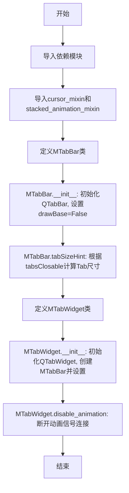
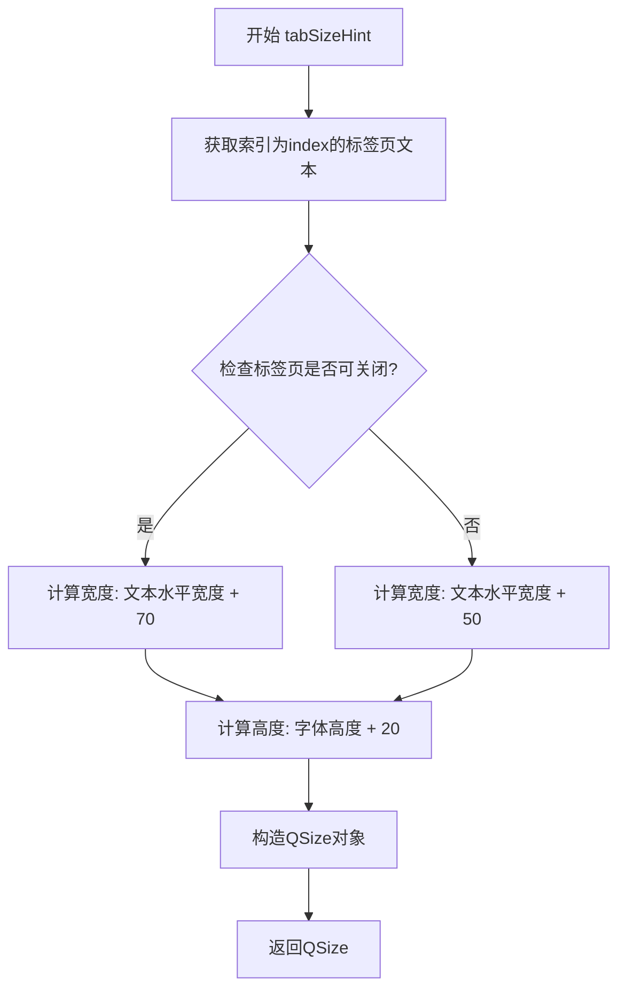
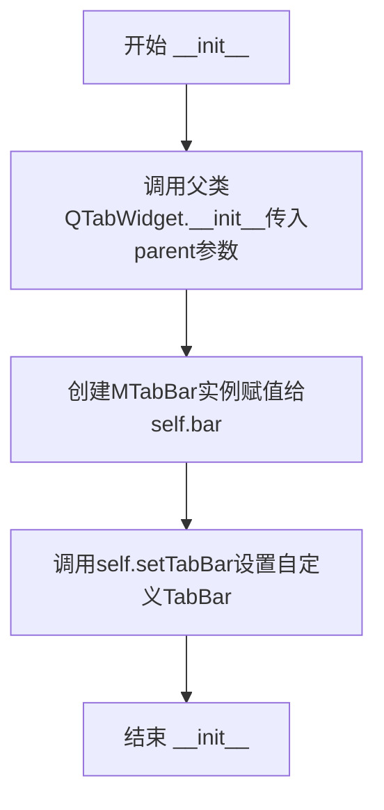
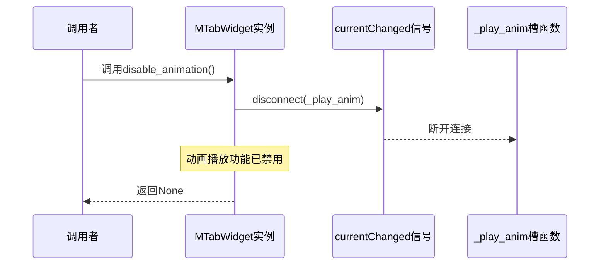

# `comic-translate\app\ui\dayu_widgets\tab_widget.py` 详细设计文档

这是一个基于PySide6的自定义Tab组件库，包含带光标混合功能的MTabBar和带堆叠动画混合功能的MTabWidget，用于实现可定制化且支持动画切换的标签页组件。

## 整体流程



## 类结构

```
QtWidgets.QTabBar
└── MTabBar (应用cursor_mixin装饰器)
QtWidgets.QTabWidget
└── MTabWidget (应用stacked_animation_mixin装饰器)
    └── MTabBar (组合关系)
```

## 全局变量及字段


### `MTabWidget.bar`
    
自定义标签栏实例，用于管理标签页的显示和交互

类型：`MTabBar`
    
    

## 全局函数及方法


### `MTabBar.__init__`

初始化 `MTabBar` 实例，设置父对象并配置标签栏不绘制基座（边框），以适配自定义外观。

参数：
-  `parent`：`QtWidgets.QWidget`，父窗口部件，默认为 None

返回值：`None`，无返回值

#### 流程图

```mermaid
graph TD
    A[Start] --> B[Call super().__init__(parent=parent)]
    B --> C[Call setDrawBase(False)]
    C --> D[End]
```

#### 带注释源码

```python
def __init__(self, parent=None):
    # 调用父类 QtWidgets.QTabBar 的初始化方法，传递 parent 参数
    super(MTabBar, self).__init__(parent=parent)
    # 设置标签栏不绘制基座（通常指底部的边框线），以获得更扁平或自定义的视觉效果
    self.setDrawBase(False)
```


### `MTabBar.tabSizeHint`

该方法重写了 `QTabBar` 的 `tabSizeHint`，根据标签页文本内容和标签页是否可关闭，动态计算并返回每个标签页的推荐尺寸。

参数：

- `index`：`int`，表示标签页的索引，用于获取对应标签页的文本内容

返回值：`QtCore.QSize`，返回标签页的推荐尺寸，宽度根据文本长度和是否可关闭动态计算，高度为字体高度加上固定边距

#### 流程图



#### 带注释源码

```python
def tabSizeHint(self, index):
    """
    重写 QTabBar 的 tabSizeHint 方法
    用于计算指定索引标签页的推荐尺寸
    
    参数:
        index: int, 标签页索引
    
    返回:
        QtCore.QSize: 标签页的推荐尺寸
    """
    # 获取指定索引的标签页文本内容
    tab_text = self.tabText(index)
    
    # 判断当前标签栏是否支持关闭按钮
    if self.tabsClosable():
        # 如果可关闭，增加额外宽度(70)以容纳关闭按钮
        return QtCore.QSize(
            # 使用 fontMetrics 计算文本的水平宽度
            self.fontMetrics().horizontalAdvance(tab_text) + 70,
            # 高度为字体高度加上20像素的上下边距
            self.fontMetrics().height() + 20,
        )
    else:
        # 如果不可关闭，只需增加50像素的基本边距
        return QtCore.QSize(
            # 使用 fontMetrics 计算文本的水平宽度
            self.fontMetrics().horizontalAdvance(tab_text) + 50,
            # 高度为字体高度加上20像素的上下边距
            self.fontMetrics().height() + 20,
        )
```


### `MTabWidget.__init__`

该方法是MTabWidget类的构造函数，用于初始化一个带有自定义TabBar的TabWidget组件。它调用父类构造函数并创建MTabBar实例设置为当前TabWidget的标签栏。

参数：

- `parent`：`QtWidgets.QWidget | None`，父 widget，默认为None

返回值：`None`，无返回值（构造函数）

#### 流程图



#### 带注释源码

```
@stacked_animation_mixin  # 装饰器：添加堆叠动画混合功能
class MTabWidget(QtWidgets.QTabWidget):
    """自定义TabWidget组件，支持动画和自定义TabBar"""
    
    def __init__(self, parent=None):
        """
        初始化MTabWidget实例
        
        参数:
            parent: 父QWidget对象，默认为None
        """
        # 调用父类QtWidgets.QTabWidget的构造函数
        super(MTabWidget, self).__init__(parent=parent)
        
        # 创建自定义的MTabBar实例
        self.bar = MTabBar()
        
        # 将自定义的TabBar设置为当前TabWidget的标签栏
        # 这样可以使用自定义的tabSizeHint等行为
        self.setTabBar(self.bar)
```


### `MTabWidget.disable_animation`

该方法通过断开QTabWidget的currentChanged信号与动画播放槽函数_play_anim之间的连接，实现禁用标签页切换时的动画效果。

参数：

- 无显式参数（仅包含隐含的self参数）

返回值：`None`，无返回值（该方法直接操作Qt信号连接，不返回任何值）

#### 流程图



#### 带注释源码

```python
def disable_animation(self):
    """
    禁用标签页切换动画。
    
    该方法通过断开currentChanged信号与_play_anim槽函数的连接，
    停止标签页切换时的动画播放效果。
    """
    self.currentChanged.disconnect(self._play_anim)
    # 断开currentChanged信号与_play_anim槽的连接
    # self: MTabWidget实例
    # currentChanged: QTabWidget的信号，在当前标签页改变时发出
    # _play_anim: stacked_animation_mixin中定义的动画播放槽函数
```

#### 类详细信息补充

**MTabWidget类**

- 父类：`QtWidgets.QTabWidget`
- 装饰器：`@stacked_animation_mixin`（提供动画混合功能）
- 主要字段：
  - `bar`：`MTabBar`类型，自定义标签栏实例
- 主要方法：
  - `__init__`：初始化方法，创建MTabBar并设置为标签栏
  - `disable_animation`：禁用切换动画

**MTabBar类**

- 父类：`QtWidgets.QTabBar`
- 装饰器：`@cursor_mixin`（提供光标混合功能）
- 主要方法：
  - `tabSizeHint`：根据标签文本长度计算标签尺寸

#### 关键组件信息

| 组件名称 | 描述 |
|---------|------|
| MTabWidget | 自定义标签窗口组件，支持动画切换 |
| MTabBar | 自定义标签栏，支持动态尺寸计算 |
| stacked_animation_mixin | 动画混合类，提供_play_anim槽函数和动画逻辑 |
| cursor_mixin | 光标混合类，提供鼠标光标交互功能 |
| currentChanged信号 | Qt内置信号，标签页切换时发出 |

#### 潜在技术债务与优化空间

1. **错误处理缺失**：disconnect调用前未检查连接是否存在，可能产生潜在警告
2. **无对应enable_animation方法**：只提供禁用动画，未提供显式启用动画的公共方法
3. **硬编码依赖**：直接依赖`_play_anim`方法名，缺乏灵活性

#### 其它项目

**设计目标与约束**

- 目标：提供可动态控制开关的标签页动画功能
- 约束：依赖Qt信号槽机制，动画逻辑封装在mixin中

**错误处理与异常设计**

- 当前实现未对disconnect失败情况进行异常捕获
- 建议：可添加try-except或前置检查信号连接状态

**数据流与状态机**

- 状态：动画启用（已连接）→ 动画禁用（已断开）
- 数据流：用户调用 → 信号断开 → 切换标签时不再触发动画

**外部依赖与接口契约**

- 依赖PySide6.QtCore和PySide6.QtWidgets
- 依赖stacked_animation_mixin提供的_play_anim方法
- 契约：调用前需确保_play_anim方法已与信号连接


## 关键组件


### MTabBar

自定义标签栏组件，继承自QtWidgets.QTabBar，通过重写tabSizeHint方法实现基于标签文本内容的动态标签大小计算，支持带关闭按钮和不带关闭按钮两种布局模式。

### MTabWidget

自定义标签窗口组件，继承自QtWidgets.QTabWidget，内部管理MTabBar实例作为标签栏，提供disable_animation方法用于断开动画播放信号连接。

### cursor_mixin

光标管理混入类，为MTabBar提供自定义光标交互功能，通过装饰器模式注入到目标类中。

### stacked_animation_mixin

堆叠动画混入类，为MTabWidget提供堆叠切换动画功能，通过混入方式扩展标签窗口的动画行为，包含currentChanged信号与_play_anim槽函数的连接机制。


## 问题及建议


### 已知问题

-   硬编码的标签尺寸数值（70和50）缺乏灵活性，无法通过配置调整
-   tabSizeHint方法缺少对无效index的边界检查，可能引发异常
-   MTabWidget创建MTabBar时未传递parent参数，可能影响对象生命周期和内存管理
-   disable_animation方法直接disconnect信号而未检查连接状态，可能导致RuntimeError
-   代码中缺少类型提示和文档字符串，影响可维护性
-   MTabBar和MTabWidget的许多功能依赖于mixin，但mixin实现未知，增加了理解和维护难度
-   没有提供公开接口来配置标签大小策略
-   方法命名不够清晰（如disable_animation）

### 优化建议

-   将硬编码的尺寸数值改为可配置的属性或方法参数
-   在tabSizeHint中添加index有效性检查
-   在创建MTabBar时传递self作为parent：self.bar = MTabBar(self)
-   在disable_animation中添加信号连接检查或使用try-except处理disconnect异常
-   添加类型提示和docstring说明类和方法用途
-   考虑将mixin的具体实现纳入文档或提供清晰的接口定义
-   添加公开方法或属性以允许外部配置标签大小
-   改进方法命名，使其更描述性

## 其它


### 设计目标与约束

本组件旨在提供自定义的标签栏和标签页控件，支持自定义tab大小计算和动画效果。基于PySide6框架开发，需要遵守Qt的信号槽机制和事件循环。依赖cursor_mixin和stacked_animation_mixin两个混合类实现扩展功能。

### 错误处理与异常设计

tabSizeHint方法中未对index越界进行保护，可能引发IndexError。tabText方法在index无效时可能返回空字符串但不会抛出异常。currentChanged信号断开时未检查连接状态，可能产生运行时警告。建议添加索引有效性校验和异常捕获机制。

### 数据流与状态机

MTabWidget初始化时创建MTabBar实例并设置为自身的tabBar。动画混合类通过currentChanged信号触发_play_anim槽函数实现动画。disable_animation方法断开信号连接以停止动画。数据流：用户切换标签 -> currentChanged信号 -> _play_anim执行动画 -> UI更新。

### 外部依赖与接口契约

依赖PySide6.QtCore和PySide6.QtWidgets模块。依赖本地mixin模块中的cursor_mixin和stacked_animation_mixin混合类。MTabBar的tabSizeHint(index)方法接收整数索引返回QSize对象。MTabWidget的disable_animation()方法无参数无返回值。

### 使用示例与配置

MTabWidget支持通过parent参数指定父控件。MTabBar的tab大小根据tabsClosable()状态自动计算， closable时宽度增加70像素，否则增加50像素，高度统一增加20像素。可通过Qt样式表进一步自定义外观。

### 性能考虑与优化空间

tabSizeHint在每次显示tab时可能被频繁调用，fontMetrics().horizontalAdvance()和height()可缓存以减少重复计算。动画混合类未提供性能相关配置选项。当存在大量标签页时可能存在性能瓶颈。

### 兼容性考虑

代码基于Python 3编写，使用__future__导入支持Python 2兼容写法，但PySide6本身需要Python 3.5+。Qt版本依赖PySide6，对应Qt 6.x版本。与Qt 5的QTabBar/QTabWidget接口存在差异。

### 测试策略建议

应测试正常情况下的tab大小计算，测试tabsClosable()为True/False时的不同行为，测试disable_animation方法能否正确断开信号，测试索引越界时的异常处理，测试与混合类的兼容性。

### 版本历史与变更记录

初始版本2019.2，由Mu yanru创建。基于PySide6框架，采用mixin模式实现功能扩展。


    