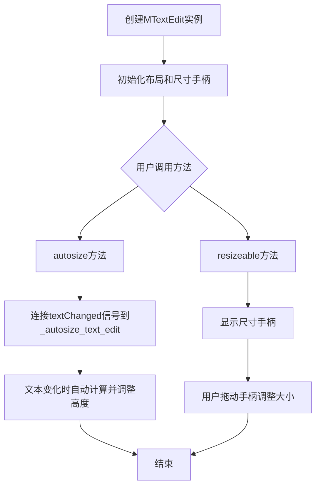
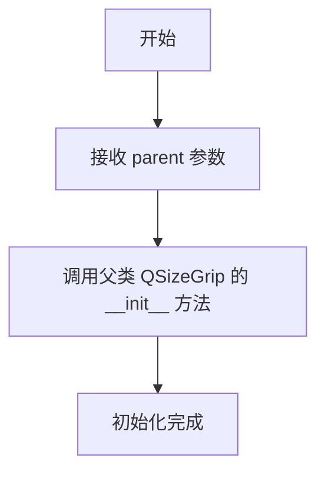
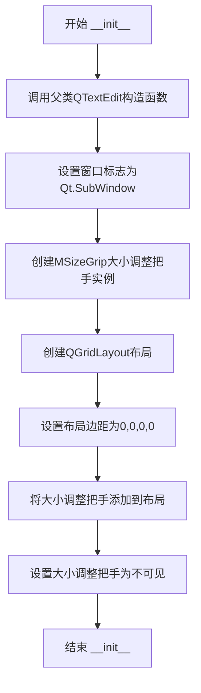
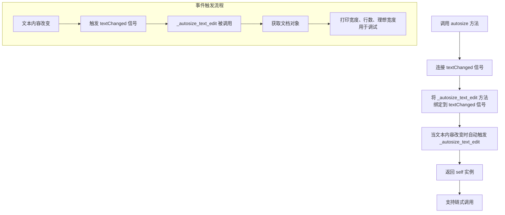
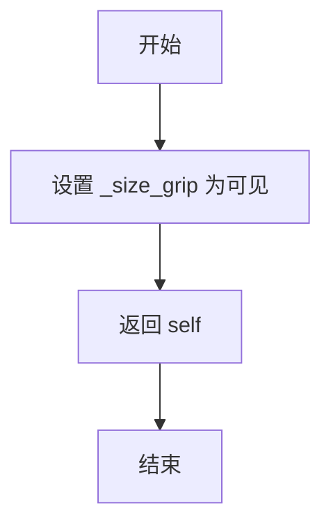

# `comic-translate\app\ui\dayu_widgets\text_edit.py` 详细设计文档

该文件定义了两个Qt自定义控件：MSizeGrip和MTextEdit。MSizeGrip继承自QSizeGrip，用于提供尺寸调整手柄；MTextEdit继承自QTextEdit，是一个可自动调整大小的文本编辑控件，支持通过尺寸手柄手动调整大小，并提供链式调用接口。

## 整体流程



## 类结构

```
QtWidgets.QSizeGrip
└── MSizeGrip
QtWidgets.QTextEdit
└── MTextEdit
```

## 全局变量及字段


### `MTextEdit._size_grip`
    
用于调整MTextEdit大小的尺寸调整手柄控件

类型：`MSizeGrip`
    
    

## 全局函数及方法


### `MSizeGrip.__init__`

该方法是 `MSizeGrip` 类的构造函数，用于初始化一个大小调整手柄（Size Grip）部件，继承自 Qt 的 `QSizeGrip` 类，并设置其父窗口部件。

参数：

- `parent`：`QtWidgets.QWidget`，父窗口部件，默认为 None，用于指定该部件的父对象

返回值：`None`，无返回值

#### 流程图



#### 带注释源码

```python
def __init__(self, parent=None):
    """
    初始化 MSizeGrip 对象
    
    参数:
        parent: 父窗口部件，默认为 None
    """
    # 调用父类 QtWidgets.QSizeGrip 的构造函数
    # 将 parent 参数传递给父类进行初始化
    super(MSizeGrip, self).__init__(parent)
```


### MTextEdit.__init__

`MTextEdit.__init__`是MTextEdit类的构造函数，负责初始化一个可调整大小的文本编辑控件。它继承自QTextEdit，设置了子窗口标志，创建了大小调整把手（MSizeGrip），并配置了网格布局，使控件具备可调整大小的能力，同时默认隐藏大小调整把手。

参数：

- `parent`：`QWidget`，可选的父控件，默认为None，用于建立Qt的父子层次关系

返回值：`None`，构造函数不返回任何值

#### 流程图



#### 带注释源码

```python
def __init__(self, parent=None):
    """
    初始化MTextEdit文本编辑控件
    
    参数:
        parent: 父控件对象，默认为None
    """
    # 调用父类QTextEdit的构造函数进行基础初始化
    super(MTextEdit, self).__init__(parent)
    
    # 设置窗口标志为SubWindow，使其作为子控件而非独立窗口
    self.setWindowFlags(QtCore.Qt.SubWindow)
    
    # 创建大小调整把手(MSizeGrip)实例，父控件为当前文本编辑控件
    self._size_grip = MSizeGrip(self)
    
    # 创建网格布局管理器
    layout = QtWidgets.QGridLayout()
    
    # 设置布局的上下左右边距均为0，使内容紧贴边框
    layout.setContentsMargins(0, 0, 0, 0)
    
    # 将大小调整把手添加到布局的右下角位置
    # 参数: 组件, 行0, 列0, 对齐方式为底部和右侧
    layout.addWidget(self._size_grip, 0, 0, QtCore.Qt.AlignBottom | QtCore.Qt.AlignRight)
    
    # 将布局应用到文本编辑控件
    self.setLayout(layout)
    
    # 默认隐藏大小调整把手，需要通过resizeable()方法显示
    self._size_grip.setVisible(False)
```

---

#### 关键组件信息

| 组件名称 | 一句话描述 |
|---------|-----------|
| MSizeGrip | 自定义的QSizeGrip子类，用于提供右下角大小调整功能 |
| QGridLayout | Qt网格布局管理器，用于组织控件和大小调整把手的位置 |
| Qt.SubWindow | 窗口标志，表示控件作为子窗口而非顶级窗口 |
| Qt.AlignBottom \| Qt.AlignRight | 对齐标志，将大小调整把手定位在右下角 |

#### 潜在的技术债务或优化空间

1. **硬编码的布局参数**：布局边距和大小调整把手的位置都是硬编码的，缺乏灵活性
2. **缺少大小调整把手的样式定制**：MSizeGrip没有进行样式设置，可能与整体UI风格不统一
3. ** autosize 方法的不完整性**：`_autosize_text_edit`方法中有注释掉的宽度获取逻辑，且打印语句未移除，可能影响生产环境性能
4. **文档注释不完整**：类和方法缺少完整的文档字符串说明

#### 其它项目

**设计目标**：
- 创建一个可嵌入的文本编辑控件
- 提供可调整大小的用户交互能力
- 通过SubWindow标志实现作为子控件的集成

**错误处理**：
- 目前未实现显式的错误处理机制
- 依赖Qt框架的底层异常处理

**外部依赖**：
- PySide6.QtCore：提供Qt核心功能如窗口标志和枚举
- PySide6.QtWidgets：提供Qt UI组件如QTextEdit、QGridLayout、QSizeGrip


### MTextEdit.autosize

该方法用于启用MTextEdit的自动大小调整功能，通过将textChanged信号连接到内部处理函数来实现文本编辑框的高度随内容自动增长的特性，并返回实例本身以支持链式调用。

参数：

- `self`：`MTextEdit`，表示MTextEdit类的实例本身

返回值：`MTextEdit`，返回实例本身，用于支持链式调用（如`widget.autosize().resizeable()`）

#### 流程图



#### 带注释源码

```python
def autosize(self):
    """
    启用自动大小调整功能。
    
    该方法将 QTextEdit 的 textChanged 信号连接到内部方法 _autosize_text_edit，
    当文本内容发生变化时，会自动触发相应的处理逻辑。
    
    返回:
        MTextEdit: 返回实例本身，支持链式调用
    """
    # 连接 textChanged 信号到 _autosize_text_edit 方法
    # 当文本内容改变时，会自动调用 _autosize_text_edit 进行处理
    self.textChanged.connect(self._autosize_text_edit)
    
    # 返回 self 实例，支持链式调用
    # 例如: text_edit.autosize().resizeable()
    return self
```


### `MTextEdit._autosize_text_edit`

这是一个私有方法，用于自动调整MTextEdit的大小。该方法获取当前文档对象，并打印文本编辑器的宽度、行数和文档的理想宽度，用于调试和确定合适的尺寸。

参数：

- `self`：MTextEdit实例本身，不需要显式传递

返回值：`None`，该方法没有返回值，仅执行打印操作

#### 流程图

```mermaid
graph TD
    A[开始 _autosize_text_edit] --> B[获取文档对象: doc = self.document()]
    B --> C[打印调试信息: 宽度, 行数, 理想宽度]
    C --> D[结束]
```

#### 带注释源码

```python
def _autosize_text_edit(self):
    """
    自动调整文本编辑框大小的内部方法。
    该方法通常作为textChanged信号的槽函数被调用，
    用于获取当前文档的尺寸信息以便进行自动调整。
    
    注意：当前实现仅为调试目的，实际的自动调整逻辑未实现。
    """
    # w = self.width()  # 原本可能用于获取宽度的代码，已被注释
    doc = self.document()  # 获取与文本编辑框关联的QTextDocument对象
    # 打印当前文本编辑框的宽度、文档行数、以及文档的理想宽度（不换行时的宽度）
    print(self.width(), doc.lineCount(), doc.idealWidth())
```

#### 关联信息

**所属类**: `MTextEdit`

**调用关系**: 
- 由 `autosize()` 方法调用：`self.textChanged.connect(self._autosize_text_edit)`
- 当文本内容改变时，自动触发此方法

**设计目的**: 
- 为文本编辑框提供自动调整大小的能力
- 通过监听文本变化事件，获取文档尺寸信息

**潜在优化空间**:
1. 方法目前仅打印信息，未实现实际的自动调整逻辑
2. `idealWidth()` 在某些情况下可能不准确，建议结合 `QTextDocument.size` 或 `QTextEdit.documentSize` 使用
3. 缺少错误处理，如果文档为None可能导致异常
4. 打印语句应替换为日志系统或移除


### `MTextEdit.resizeable`

此方法用于显示文本编辑器的右下角调整大小手柄，允许用户通过拖动手柄来调整 `MTextEdit` 控件的尺寸。

参数：

- `self`：`MTextEdit` 实例，表示调用此方法的文本编辑器对象本身。

返回值：`MTextEdit`，返回对象本身，以便支持方法链式调用。

#### 流程图



#### 带注释源码

```python
def resizeable(self):
    """Show the size grip on bottom right. User can use it to resize MTextEdit"""
    # 将内部的大小调整手柄控件设置为可见状态
    self._size_grip.setVisible(True)
    # 返回对象自身，以支持链式调用（例如 obj.resizeable().autosize()）
    return self
```

## 关键组件


### MSizeGrip类

Qt QSizeGrip的子类，用于在文本编辑器的右下角提供可调整大小的手柄组件。继承父类的基本功能，作为MTextEdit的子组件使用。

### MTextEdit类

Qt QTextEdit的子类，实现了一个带有可调整大小手柄的文本编辑器组件。支持自动调整大小模式和可调整大小模式两种使用方式，通过内部集成的MSizeGrip实现右下角调整功能。

### autosize方法

当文本内容发生变化时，自动计算并输出当前文本编辑器的宽度、行数和理想宽度。用于调试和自动调整大小的功能实现。

### resizeable方法

显示右下角的尺寸调整手柄，允许用户通过拖拽调整文本编辑器的大小。返回self以支持方法链式调用。


## 问题及建议


### 已知问题

-   **方法命名拼写错误**：`resizeable` 应改为 `resizable`，保持命名规范一致
-   **自动调整大小功能未实现**：`_autosize_text_edit` 方法仅包含调试打印语句，未实现实际的自动调整大小逻辑，该功能目前不可用
-   **信号重复连接风险**：`autosize()` 方法每次调用都会连接新的信号处理器，若多次调用会导致信号重复连接，可能引发性能问题和意外行为
-   **调试代码遗留**：`print(self.width(), doc.lineCount(), doc.idealWidth())` 语句应替换为正式的日志记录或移除
-   **MSizeGrip 类冗余**：`MSizeGrip` 仅是 `QSizeGrip` 的简单包装，未添加任何额外功能，可直接使用 `QSizeGrip`
-   **魔法数字**：网格布局的边距参数 `0, 0, 0, 0` 应提取为常量或使用 `setContentsMargins(0, 0, 0, 0)` 的可读形式
-   **缺少文档注释**：类和方法均无 docstring，代码可读性和可维护性较差

### 优化建议

-   修正 `resizeable` 为 `resizable` 并完善自动调整大小逻辑实现
-   在 `autosize()` 方法中添加信号连接检查或使用 `disconnect` 后再连接，防止重复绑定
-   移除或替换调试用的 print 语句为标准日志模块
-   删除冗余的 `MSizeGrip` 类，直接在 `MTextEdit` 中使用 `QtWidgets.QSizeGrip`
-   为所有类和公共方法添加 docstring 文档字符串
-   考虑将布局边距值定义为类级常量或配置参数
-   添加类型注解（type hints）以提高代码可读性和静态分析能力

## 其它


### 设计目标与约束

设计目标：提供一个可调整大小的文本编辑组件，支持自动调整大小和手动调整大小两种模式，继承自Qt的QTextEdit组件。

约束：
- 依赖PySide6 Qt库
- 仅支持Qt窗口环境
- Python 2/3兼容（使用__future__导入）

### 错误处理与异常设计

代码本身较为简单，未包含复杂的错误处理逻辑。
潜在异常情况：
- parent参数类型错误：Qt构造函数会自动处理
- 文档为空时的尺寸计算：Qt文档对象可以正常处理

建议改进：
- 添加参数类型检查
- 对autosize方法的信号连接进行异常捕获
- 在_resize_event中处理可能的尺寸计算异常

### 数据流与状态机

数据流：
1. 用户输入文本 → QTextEdit.textChanged信号 → _autosize_text_edit槽函数 → 计算文档尺寸 → 调整组件大小
2. 用户拖动size grip → QSizeGrip事件 → 组件 resizeEvent → 更新组件尺寸

状态：
- 默认状态：_size_grip不可见
- 可调整状态：通过resizeable()方法设置_size_grip可见
- 自动调整状态：通过autosize()方法连接textChanged信号

### 外部依赖与接口契约

外部依赖：
- PySide6.QtCore：Qt核心功能（Qt枚举、窗口标志）
- PySide6.QtWidgets：Qt UI组件

接口契约：
- MTextEdit继承自QtWidgets.QTextEdit
- autosize()方法返回self，支持链式调用
- resizeable()方法返回self，支持链式调用
- 公开属性：_size_grip（MSizeGrip实例）

### 性能考虑

潜在性能问题：
- autosize模式：每次文本变化都会触发尺寸计算，频繁调用document()和lineCount()，大文档时可能有性能影响
- 当前_autosize_text_edit方法计算了尺寸但未实际使用结果

优化建议：
- 添加尺寸计算的节流（throttle）机制
- 实现实际的自动调整大小逻辑
- 考虑使用document().blockCount()替代lineCount()

### 线程安全

该组件为UI组件，仅在主线程中使用，无线程安全问题。
但如果autosize功能在非GUI线程中调用，可能导致Qt警告或崩溃。

### 内存管理

- MSizeGrip作为MTextEdit的子组件，通过Qt父子对象机制管理内存
- MTextEdit自身的内存由Qt管理
- 无明显的内存泄漏风险

### 兼容性考虑

Python兼容性：
- 使用__future__导入支持Python 2/3

Qt版本兼容性：
- 使用PySide6，需Qt 6.x
- 如需支持Qt 5.x，需使用PyQt5或PySide2

### 测试策略建议

单元测试：
- 测试MSizeGrip创建和显示
- 测试MTextEdit创建和基本属性
- 测试autosize方法信号连接
- 测试resizeable方法_size_grip可见性
- 测试链式调用

集成测试：
- 测试在实际QApplication环境中的行为
- 测试大小调整功能

### 使用示例

```python
# 基本用法
text_edit = MTextEdit()
text_edit.show()

# 启用手动调整大小
text_edit.resizeable()

# 启用自动调整大小
text_edit.autosize()

# 链式调用
text_edit = MTextEdit().autosize().resizeable()
```

### 版本历史

- 2019.6：初始版本，由Mu yanru创建

### 待实现功能

- _autosize_text_edit方法计算了尺寸但未实际应用，建议实现真正的自动调整大小功能
- 缺少文档注释（docstring）
- 可考虑添加最小/最大尺寸限制

    