# `comic-translate\app\ui\dayu_widgets\theme.py` 详细设计文档

这是一个Qt样式主题管理系统，提供了完整的颜色、字体、尺寸等主题配置，支持亮色/暗色主题切换和动态主题色生成，主要用于为Qt widgets提供统一美观的视觉样式。

## 整体流程

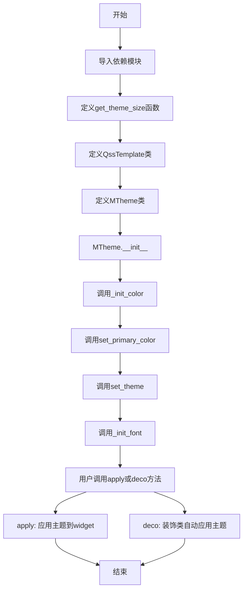

## 类结构

```
模块: theme
├── 函数: get_theme_size
├── 类: QssTemplate (string.Template子类)
└── 类: MTheme
    ├── 颜色属性 (类属性)
    ├── 实例属性 (颜色、字体、尺寸等)
    └── 方法 (__init__, set_theme, set_primary_color, _init_icon, _init_color, _init_font, __getattribute__, _dark, _light, apply, deco)
```

## 全局变量及字段


### `DEFAULT_STATIC_FOLDER`
    
默认静态资源文件夹路径。

类型：`str`
    


### `utils`
    
工具模块，提供颜色生成和静态文件读取等辅助函数。

类型：`module`
    


### `get_scale_factor`
    
获取屏幕DPI缩放因子，返回水平与垂直缩放比例。

类型：`function`
    


### `get_theme_size`
    
返回根据DPI比例缩放的主题尺寸字典。

类型：`function`
    


### `string`
    
Python标准库的string模块，用于字符串模板。

类型：`module`
    


### `QssTemplate.delimiter`
    
QSS模板中使用的分隔符字符（'@'）。

类型：`str`
    


### `QssTemplate.idpattern`
    
用于匹配QSS模板中占位符变量名的正则表达式模式。

类型：`str`
    


### `MTheme.blue`
    
主题默认蓝色十六进制颜色码（#1890ff）。

类型：`str`
    


### `MTheme.purple`
    
主题默认紫色十六进制颜色码（#722ed1）。

类型：`str`
    


### `MTheme.cyan`
    
主题默认青色十六进制颜色码（#13c2c2）。

类型：`str`
    


### `MTheme.green`
    
主题默认绿色十六进制颜色码（#52c41a）。

类型：`str`
    


### `MTheme.magenta`
    
主题默认洋红色十六进制颜色码（#eb2f96）。

类型：`str`
    


### `MTheme.pink`
    
主题默认粉色十六进制颜色码（#ef5b97）。

类型：`str`
    


### `MTheme.red`
    
主题默认红色十六进制颜色码（#f5222d）。

类型：`str`
    


### `MTheme.orange`
    
主题默认橙色十六进制颜色码（#fa8c16）。

类型：`str`
    


### `MTheme.yellow`
    
主题默认黄色十六进制颜色码（#fadb14）。

类型：`str`
    


### `MTheme.volcano`
    
主题默认火山色十六进制颜色码（#fa541c）。

类型：`str`
    


### `MTheme.geekblue`
    
主题默认极客蓝十六进制颜色码（#2f54eb）。

类型：`str`
    


### `MTheme.lime`
    
主题默认酸橙绿十六进制颜色码（#a0d911）。

类型：`str`
    


### `MTheme.gold`
    
主题默认金色十六进制颜色码（#faad14）。

类型：`str`
    


### `MTheme.female_color`
    
女性性别指示色十六进制颜色码（#ef5b97）。

类型：`str`
    


### `MTheme.male_color`
    
男性性别指示色十六进制颜色码（#4ebbff）。

类型：`str`
    


### `MTheme.default_qss`
    
从静态文件加载的默认QSS模板对象。

类型：`QssTemplate`
    


### `MTheme.primary_color`
    
用户选择的主题主颜色。

类型：`str`
    


### `MTheme.item_hover_bg`
    
悬停项目的背景颜色，派生自primary_1。

类型：`str`
    


### `MTheme.primary_1`
    
主颜色生成的第一级颜色变体。

类型：`str`
    


### `MTheme.primary_2`
    
主颜色生成的第二级颜色变体。

类型：`str`
    


### `MTheme.primary_3`
    
主颜色生成的第三级颜色变体。

类型：`str`
    


### `MTheme.primary_4`
    
主颜色生成的第四级颜色变体。

类型：`str`
    


### `MTheme.primary_5`
    
主颜色生成的第五级颜色变体。

类型：`str`
    


### `MTheme.primary_6`
    
主颜色生成的第六级颜色变体。

类型：`str`
    


### `MTheme.primary_7`
    
主颜色生成的第七级颜色变体。

类型：`str`
    


### `MTheme.primary_8`
    
主颜色生成的第八级颜色变体。

类型：`str`
    


### `MTheme.primary_9`
    
主颜色生成的第九级颜色变体。

类型：`str`
    


### `MTheme.primary_10`
    
主颜色生成的第十级颜色变体。

类型：`str`
    


### `MTheme.hyperlink_style`
    
超链接的HTML样式片段，使用主颜色。

类型：`str`
    


### `MTheme.info_color`
    
信息状态默认颜色（蓝色）。

类型：`str`
    


### `MTheme.info_1`
    
信息颜色第一级变体。

类型：`str`
    


### `MTheme.info_2`
    
信息颜色第二级变体。

类型：`str`
    


### `MTheme.info_3`
    
信息颜色第三级变体。

类型：`str`
    


### `MTheme.info_4`
    
信息颜色第四级变体。

类型：`str`
    


### `MTheme.info_5`
    
信息颜色第五级变体。

类型：`str`
    


### `MTheme.info_6`
    
信息颜色第六级变体。

类型：`str`
    


### `MTheme.info_7`
    
信息颜色第七级变体。

类型：`str`
    


### `MTheme.info_8`
    
信息颜色第八级变体。

类型：`str`
    


### `MTheme.info_9`
    
信息颜色第九级变体。

类型：`str`
    


### `MTheme.info_10`
    
信息颜色第十级变体。

类型：`str`
    


### `MTheme.success_color`
    
成功状态默认颜色（绿色）。

类型：`str`
    


### `MTheme.success_1`
    
成功颜色第一级变体。

类型：`str`
    


### `MTheme.success_2`
    
成功颜色第二级变体。

类型：`str`
    


### `MTheme.success_3`
    
成功颜色第三级变体。

类型：`str`
    


### `MTheme.success_4`
    
成功颜色第四级变体。

类型：`str`
    


### `MTheme.success_5`
    
成功颜色第五级变体。

类型：`str`
    


### `MTheme.success_6`
    
成功颜色第六级变体。

类型：`str`
    


### `MTheme.success_7`
    
成功颜色第七级变体。

类型：`str`
    


### `MTheme.success_8`
    
成功颜色第八级变体。

类型：`str`
    


### `MTheme.success_9`
    
成功颜色第九级变体。

类型：`str`
    


### `MTheme.success_10`
    
成功颜色第十级变体。

类型：`str`
    


### `MTheme.warning_color`
    
警告状态默认颜色（金色）。

类型：`str`
    


### `MTheme.warning_1`
    
警告颜色第一级变体。

类型：`str`
    


### `MTheme.warning_2`
    
警告颜色第二级变体。

类型：`str`
    


### `MTheme.warning_3`
    
警告颜色第三级变体。

类型：`str`
    


### `MTheme.warning_4`
    
警告颜色第四级变体。

类型：`str`
    


### `MTheme.warning_5`
    
警告颜色第五级变体。

类型：`str`
    


### `MTheme.warning_6`
    
警告颜色第六级变体。

类型：`str`
    


### `MTheme.warning_7`
    
警告颜色第七级变体。

类型：`str`
    


### `MTheme.warning_8`
    
警告颜色第八级变体。

类型：`str`
    


### `MTheme.warning_9`
    
警告颜色第九级变体。

类型：`str`
    


### `MTheme.warning_10`
    
警告颜色第十级变体。

类型：`str`
    


### `MTheme.error_color`
    
错误状态默认颜色（红色）。

类型：`str`
    


### `MTheme.error_1`
    
错误颜色第一级变体。

类型：`str`
    


### `MTheme.error_2`
    
错误颜色第二级变体。

类型：`str`
    


### `MTheme.error_3`
    
错误颜色第三级变体。

类型：`str`
    


### `MTheme.error_4`
    
错误颜色第四级变体。

类型：`str`
    


### `MTheme.error_5`
    
错误颜色第五级变体。

类型：`str`
    


### `MTheme.error_6`
    
错误颜色第六级变体。

类型：`str`
    


### `MTheme.error_7`
    
错误颜色第七级变体。

类型：`str`
    


### `MTheme.error_8`
    
错误颜色第八级变体。

类型：`str`
    


### `MTheme.error_9`
    
错误颜色第九级变体。

类型：`str`
    


### `MTheme.error_10`
    
错误颜色第十级变体。

类型：`str`
    


### `MTheme.font_family`
    
CSS字体家族字符串，包含多种系统字体。

类型：`str`
    


### `MTheme.font_size_base`
    
基础字号（单位pt），默认为9。

类型：`int`
    


### `MTheme.font_size_large`
    
大号字号，等于基础字号加2。

类型：`int`
    


### `MTheme.font_size_small`
    
小号字号，等于基础字号减2。

类型：`int`
    


### `MTheme.h1_size`
    
一级标题字号，等于基础字号乘以2.71。

类型：`int`
    


### `MTheme.h2_size`
    
二级标题字号，等于基础字号乘以2.12。

类型：`int`
    


### `MTheme.h3_size`
    
三级标题字号，等于基础字号乘以1.71。

类型：`int`
    


### `MTheme.h4_size`
    
四级标题字号，等于基础字号乘以1.41。

类型：`int`
    


### `MTheme.title_color`
    
标题文字颜色。

类型：`str`
    


### `MTheme.primary_text_color`
    
主要文本颜色。

类型：`str`
    


### `MTheme.secondary_text_color`
    
次要文本颜色。

类型：`str`
    


### `MTheme.disable_color`
    
禁用状态的文字颜色。

类型：`str`
    


### `MTheme.border_color`
    
边框颜色。

类型：`str`
    


### `MTheme.divider_color`
    
分割线颜色。

类型：`str`
    


### `MTheme.header_color`
    
头部区域背景颜色。

类型：`str`
    


### `MTheme.icon_color`
    
图标默认颜色。

类型：`str`
    


### `MTheme.background_color`
    
主背景颜色。

类型：`str`
    


### `MTheme.background_selected_color`
    
选中项的背景颜色。

类型：`str`
    


### `MTheme.background_in_color`
    
内部区域背景颜色。

类型：`str`
    


### `MTheme.background_out_color`
    
外部区域背景颜色。

类型：`str`
    


### `MTheme.mask_color`
    
遮罩颜色，背景色的90%透明度版本。

类型：`str`
    


### `MTheme.toast_color`
    
Toast通知的背景颜色。

类型：`str`
    


### `MTheme.unit`
    
尺寸单位字符串，固定为'px'。

类型：`str`
    


### `MTheme.font_unit`
    
字体大小单位字符串，固定为'pt'。

类型：`str`
    


### `MTheme.text_error_color`
    
错误状态文字颜色，等于error_7。

类型：`str`
    


### `MTheme.text_color_inverse`
    
反色文字颜色，固定为'#fff'。

类型：`str`
    


### `MTheme.text_warning_color`
    
警告状态文字颜色，等于warning_7。

类型：`str`
    


### `MTheme.icon_down`
    
下箭头图标文件路径。

类型：`str`
    


### `MTheme.icon_up`
    
上箭头图标文件路径。

类型：`str`
    


### `MTheme.icon_left`
    
左箭头图标文件路径。

类型：`str`
    


### `MTheme.icon_right`
    
右箭头图标文件路径。

类型：`str`
    


### `MTheme.icon_close`
    
关闭图标文件路径。

类型：`str`
    


### `MTheme.icon_calender`
    
日历图标文件路径。

类型：`str`
    


### `MTheme.icon_splitter`
    
分割器图标文件路径。

类型：`str`
    


### `MTheme.icon_float`
    
浮动图标文件路径。

类型：`str`
    


### `MTheme.icon_size_grip`
    
尺寸调整图标文件路径。

类型：`str`
    


### `MTheme.icon_check`
    
勾选图标SVG文件路径。

类型：`str`
    


### `MTheme.icon_minus`
    
减号图标SVG文件路径。

类型：`str`
    


### `MTheme.icon_circle`
    
圆形图标SVG文件路径。

类型：`str`
    


### `MTheme.icon_sphere`
    
球形图标SVG文件路径。

类型：`str`
    
    

## 全局函数及方法


### `get_theme_size`

该函数用于根据当前屏幕的缩放因子计算并返回主题相关的各种尺寸参数，包括边框半径、组件大小、图标尺寸、徽章尺寸、下拉框尺寸、微调框尺寸、拖动条尺寸、开关尺寸、复选框尺寸、单选按钮尺寸、滑动条尺寸、进度条尺寸、Toast尺寸、大视图尺寸、指示器尺寸和滚动条尺寸等，为UI主题系统提供响应式尺寸支持。

参数：

- 无

返回值：`dict`，返回一个包含主题尺寸的字典，键为尺寸名称（如 `border_radius_large`、`huge`、`medium` 等），值为对应尺寸的整数值（基于缩放因子计算）

#### 流程图

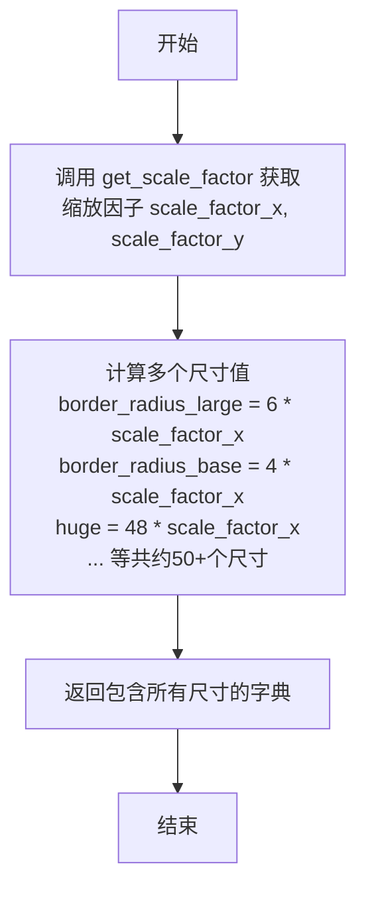

#### 带注释源码

```python
def get_theme_size():
    """
    获取主题相关的尺寸信息，基于屏幕缩放因子计算各种UI组件的尺寸。
    
    Returns:
        dict: 包含各种主题尺寸的字典，如边框半径、组件大小、图标尺寸等。
              所有尺寸值都根据 scale_factor_x 进行缩放处理。
    """
    # 获取屏幕的水平和垂直缩放因子
    # scale_factor_x: 水平方向的缩放比例
    # scale_factor_y: 垂直方向的缩放比例（当前未使用）
    scale_factor_x, scale_factor_y = get_scale_factor()
    
    # 返回包含所有主题尺寸的字典
    # 每个尺寸都通过 int() 转换为整数，并乘以缩放因子以实现响应式布局
    return {
        # 边框半径尺寸
        "border_radius_large": int(6 * scale_factor_x),   # 大边框圆角
        "border_radius_base": int(4 * scale_factor_x),    # 基础边框圆角
        "border_radius_small": int(2 * scale_factor_x),   # 小边框圆角
        
        # 组件基础尺寸（从大到小）
        "huge": int(48 * scale_factor_x),      # 巨大尺寸
        "large": int(40 * scale_factor_x),     # 大尺寸
        "medium": int(32 * scale_factor_x),    # 中等尺寸
        "small": int(24 * scale_factor_x),     # 小尺寸
        "tiny": int(18 * scale_factor_x),      # 极小尺寸
        
        # 图标尺寸（组件尺寸减去相应偏移量）
        "huge_icon": int((48 - 20) * scale_factor_x),      # 巨大图标
        "large_icon": int((40 - 16) * scale_factor_x),     # 大图标
        "medium_icon": int((32 - 12) * scale_factor_x),    # 中等图标
        "small_icon": int((24 - 10) * scale_factor_x),     # 小图标
        "tiny_icon": int((18 - 8) * scale_factor_x),       # 极小图标
        
        # 默认尺寸与徽章相关尺寸
        "default_size": int(32 * scale_factor_x),          # 默认尺寸
        "badge_width_radius": int(8 * scale_factor_x),     # 徽章宽度半径
        "badge_width": int(16 * scale_factor_x),           # 徽章宽度
        "badge_dot": int(8 * scale_factor_x),              # 徽章圆点
        "badge_dot_radius": int(4 * scale_factor_x),       # 徽章圆点半径
        
        # 下拉框相关尺寸
        "drop_down_huge": int(20 * scale_factor_x),        # 巨大下拉框
        "drop_down_large": int(16 * scale_factor_x),       # 大下拉框
        "drop_down_medium": int(14 * scale_factor_x),      # 中等下拉框
        "drop_down_small": int(10 * scale_factor_x),       # 小下拉框
        "drop_down_tiny": int(8 * scale_factor_x),         # 极小下拉框
        
        # 微调框相关尺寸
        "spin_box_huge": int(28 * scale_factor_x),         # 巨大微调框
        "spin_box_large": int(26 * scale_factor_x),        # 大微调框
        "spin_box_medium": int(24 * scale_factor_x),       # 中等微调框
        "spin_box_small": int(20 * scale_factor_x),         # 小微调框
        "spin_box_tiny": int(18 * scale_factor_x),         # 极小微调框
        
        # 微调框图标尺寸
        "spin_box_icon_huge": int(14 * scale_factor_x),    # 巨大微调框图标
        "spin_box_icon_large": int(12 * scale_factor_x),   # 大微调框图标
        "spin_box_icon_medium": int(10 * scale_factor_x),  # 中等微调框图标
        "spin_box_icon_small": int(8 * scale_factor_x),    # 小微调框图标
        "spin_box_icon_tiny": int(6 * scale_factor_x),     # 极小微调框图标
        
        # 拖动条相关尺寸
        "drag_border": int(2 * scale_factor_x),             # 拖动边框
        "drag_border_radius": int(10 * scale_factor_x),    # 拖动边框圆角
        "drag_padding_x": int(20 * scale_factor_x),        # 拖动水平内边距
        "drag_padding_y": int(40 * scale_factor_x),        # 拖动垂直内边距
        "drag_size": int(60 * scale_factor_x),             # 拖动尺寸
        
        # 开关尺寸（按尺寸级别分类）
        "switch_width_huge": int(58 * scale_factor_x),     # 巨大开关宽度
        "switch_height_huge": int(30 * scale_factor_x),    # 巨大开关高度
        "switch_radius_huge": int(15 * scale_factor_x),   # 巨大开关圆角
        
        "switch_width_large": int(48 * scale_factor_x),    # 大开关宽度
        "switch_height_large": int(24 * scale_factor_x),   # 大开关高度
        "switch_radius_large": int(12 * scale_factor_x),   # 大开关圆角
        
        "switch_width_medium": int(38 * scale_factor_x),   # 中等开关宽度
        "switch_height_medium": int(19 * scale_factor_x),  # 中等开关高度
        "switch_radius_medium": int(9 * scale_factor_x),  # 中等开关圆角
        
        "switch_width_small": int(28 * scale_factor_x),    # 小开关宽度
        "switch_height_small": int(14 * scale_factor_x),    # 小开关高度
        "switch_radius_small": int(7 * scale_factor_x),    # 小开关圆角
        
        "switch_width_tiny": int(18 * scale_factor_x),     # 极小开关宽度
        "switch_height_tiny": int(10 * scale_factor_x),    # 极小开关高度
        "switch_radius_tiny": int(5 * scale_factor_x),     # 极小开关圆角
        
        # 复选框相关尺寸
        "check_box_size": int(13 * scale_factor_x),         # 复选框大小
        "check_box_spacing": int(4 * scale_factor_x),      # 复选框间距
        
        # 单选按钮相关尺寸
        "radio_size": int(14 * scale_factor_x),             # 单选按钮大小
        "radio_radius": int(14 * scale_factor_x / 2.0),    # 单选按钮半径
        "radio_spacing": int(4 * scale_factor_x),          # 单选按钮间距
        
        # 滑动条相关尺寸
        "slider_height": int(4 * scale_factor_x),           # 滑动条高度
        "slider_radius": int(3 * scale_factor_x),           # 滑动条圆角
        "slider_handle_size": int(8 * scale_factor_x),      # 滑动条手柄大小
        "slider_handle_radius": int(8 * scale_factor_x / 1.5), # 滑动条手柄半径
        
        # 进度条相关尺寸
        "progress_circle_default_radius": int(120 * scale_factor_x), # 圆形进度条默认半径
        "progress_bar_size": int(12 * scale_factor_x),     # 进度条大小
        "progress_bar_radius": int(12 * scale_factor_x / 2.0), # 进度条圆角
        
        # Toast通知相关尺寸
        "toast_size": int(120 * scale_factor_x),            # Toast大小
        "toast_icon_size": int(60 * scale_factor_x),       # Toast图标大小
        
        # 大视图相关尺寸
        "big_view_default_size": int(120 * scale_factor_x), # 大视图默认尺寸
        "big_view_max_size": int(400 * scale_factor_x),     # 大视图最大尺寸
        "big_view_min_size": int(24 * scale_factor_x),      # 大视图最小尺寸
        
        # 指示器相关尺寸
        "indicator_padding": int(4 * scale_factor_x),       # 指示器内边距
        "indicator_size": int(8 * scale_factor_x),          # 指示器大小
        
        # 滚动条相关尺寸
        "scroll_bar_size": int(12 * scale_factor_x),        # 滚动条大小
        "scroll_bar_margin": int(12 * scale_factor_x * 2) + 1, # 滚动条边距
        "scroll_bar_radius": int(12 * scale_factor_x / 2.0), # 滚动条圆角
    }
```


### `QssTemplate`

`QssTemplate` 是一个继承自 Python 标准库 `string.Template` 的类，专门用于处理 Qt 样式表（QSS）。它通过将默认的分隔符从 `$` 修改为 `@`，并定义了标识符的正则匹配模式，使其能够解析包含 `@var_name` 格式占位符的 QSS 字符串。

#### 1. 文件的整体运行流程

本代码文件主要定义了与 UI 主题和尺寸相关的工具类及配置。具体流程如下：

1.  **定义工具函数**：首先定义 `get_theme_size()` 函数，用于根据屏幕缩放因子计算并返回各种 UI 组件的尺寸字典。
2.  **定义模板类**：定义 `QssTemplate` 类，继承自 `string.Template`，作为 QSS 文件的解析器。
3.  **定义主题类**：定义 `MTheme` 类，该类在初始化时读取 QSS 文件并使用 `QssTemplate` 进行实例化，同时管理颜色、字体等主题数据。
4.  **应用样式**：当调用 `MTheme.apply(widget)` 时，会将计算好的尺寸数据和主题属性填充到 QSS 模板中，生成最终的样式表并应用到 Widget 上。

#### 2. 类的详细信息

##### 类字段

- **`delimiter`**：`str`
  - 描述：模板字符串的分隔符。此处覆盖父类默认的 `$`，改为 `@`，因此 QSS 中的占位符格式为 `@variable_name`。
- **`idpattern`**：`str` (正则表达式)
  - 描述：定义有效占位符名称的匹配规则。此处使用正则 `r"[_a-z][_a-z0-9]*"`，允许以下划线或字母开头的字母数字组合。

##### 类方法

该类没有定义任何自定义方法，完全依赖父类 `string.Template` 的行为。

- **`substitute(mapping)`**：继承自 `string.Template`。
  - **参数**：
    - `mapping`：`dict`，键值对字典，用于替换模板中的占位符。
  - **返回值**：`str`，替换完成后的 QSS 字符串。
  - **描述**：根据 mapping 字典中的值替换模板中所有匹配的占位符。如果缺少键，会抛出 `KeyError`。

#### 3. 流程图

由于 `QssTemplate` 本身是一个数据模型（不包含执行逻辑），以下流程图展示了它在 `MTheme` 中被实际使用的过程，以及其内部继承的替换逻辑。

```mermaid
graph TD
    A[开始] --> B[MTheme.apply 调用]
    B --> C[获取当前主题尺寸 get_theme_size]
    C --> D[合并 vars(self) 得到的颜色/字体属性]
    E[QssTemplate 实例<br>存储在 self.default_qss]
    D --> F[调用 QssTemplate.substitute]
    F --> G{检查占位符是否在 mapping 中}
    G -- 是 --> H[替换占位符为对应值]
    G -- 否 --> I[抛出 KeyError 异常]
    H --> J[返回完整的 QSS 字符串]
    J --> K[widget.setStyleSheet 应用样式]
    
    subgraph QssTemplate 内部逻辑
    E
    F
    G
    H
    I
    end
```

#### 4. 带注释源码

```python
class QssTemplate(string.Template):
    """
    自定义 QSS 模板类，继承自 string.Template。
    用于解析 QSS 文件中的占位符。
    """
    
    # 改变父类的默认分隔符 '$' 为 '@'，使占位符格式变为 @variable
    delimiter = "@"
    
    # 定义有效的标识符正则：必须以下划线或字母开头，后续可以是数字、下划线或字母
    idpattern = r"[_a-z][_a-z0-9]*"
```

#### 5. 关键组件信息

- **`string.Template`**：Python 标准库模板类，`QssTemplate` 的父类，提供了基础的字符串替换功能。
- **`get_theme_size()`**：全局函数，计算 UI 元素的像素尺寸，是 `QssTemplate` 替换数据的主要来源之一。

#### 6. 潜在的技术债务或优化空间

1.  **错误处理脆弱性**：`MTheme.apply` 方法直接调用了 `self.default_qss.substitute(size_dict)`。如果 QSS 文件中使用了模板中不存在的占位符（例如变量名拼写错误），程序会直接抛出 `KeyError` 导致崩溃。建议改用 `safe_substitute` 或在加载时增加 QSS 文件的占位符校验。
2.  **标识符限制**：`idpattern` 设置为 `r"[_a][_a-z0-9]*"`，不支持点（.）或中划线（-）。如果 QSS 变量命名风格不统一（如 `@primary-color`），会导致解析失败。

#### 7. 其它项目

**设计目标与约束：**
- **目标**：实现 UI 样式（QSS）与业务逻辑的解耦，通过变量控制主题。
- **约束**：必须遵循 `string.Template` 的语法规则，且变量名必须符合 Python 标识符规范。

**外部依赖与接口契约：**
- **输入**：需要传入包含所有 QSS 中定义的变量的字典（如 `size_dict`）。
- **依赖**：依赖 `string` 模块，无需第三方库。

**数据流与状态机：**
- **数据流**：`QSS 文件 (文本)` -> `QssTemplate (对象)` -> `substitute (替换)` -> `StyleSheet (文本)` -> `Qt Widget`。
- **状态**：该类本身无状态，仅作为解析规则的定义。


### `MTheme.__init__`

MTheme 类的初始化方法，负责创建主题实例并配置主题的默认样式、颜色、字体和图标资源。

参数：

- `theme`：`str`，可选参数，指定主题类型，默认为 "light"（浅色主题），支持 "dark"（深色主题）
- `primary_color`：`str`，可选参数，指定主题的主色调，默认为 None（将使用 MTheme.blue 作为默认值）

返回值：`None`，该方法为构造函数，无返回值

#### 流程图

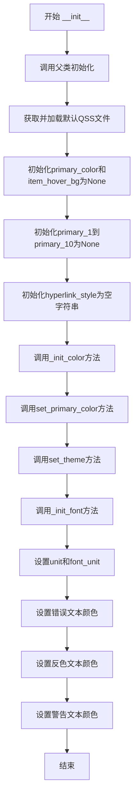

#### 带注释源码

```python
def __init__(self, theme="light", primary_color=None):
    # 调用父类object的初始化方法
    super(MTheme, self).__init__()
    
    # 获取默认的QSS样式文件路径并打开读取
    # QssTemplate继承自string.Template，用于后续的样式替换
    default_qss_file = utils.get_static_file("main.qss")
    with open(default_qss_file, "r") as f:
        self.default_qss = QssTemplate(f.read())
    
    # 初始化主色调和悬停背景色为None，后续会通过set_primary_color设置
    self.primary_color, self.item_hover_bg = (None, None)
    
    # 初始化主色调的10个色阶为None
    # 这些变量将存储基于primary_color生成的10种不同深浅的颜色
    (
        self.primary_1,
        self.primary_2,
        self.primary_3,
        self.primary_4,
        self.primary_5,
        self.primary_6,
        self.primary_7,
        self.primary_8,
        self.primary_9,
        self.primary_10,
    ) = (None,) * 10
    
    # 初始化超链接样式为空字符串，后续会根据primary_color生成
    self.hyperlink_style = ""
    
    # 初始化主题的颜色变量（info/success/warning/error颜色及其色阶）
    self._init_color()
    
    # 设置主色调，如果未提供则使用默认的MTheme.blue
    # 这会生成primary_1到primary_10的色阶
    self.set_primary_color(primary_color or MTheme.blue)
    
    # 根据theme参数应用对应的主题（浅色/深色）并初始化图标资源
    self.set_theme(theme)
    
    # 初始化字体相关属性
    self._init_font()
    
    # 设置单位，unit用于尺寸单位，font_unit用于字体大小单位
    self.unit = "px"
    self.font_unit = "pt"
    
    # 设置特定文本颜色
    # error_7在_init_color中已初始化，此处用于错误文本颜色
    self.text_error_color = self.error_7
    # 反色文本颜色，默认为白色
    self.text_color_inverse = "#fff"
    # 警告文本颜色，warning_7在_init_color中已初始化
    self.text_warning_color = self.warning_7
```


### `MTheme.set_theme`

该方法用于设置MTheme类的主题样式，根据传入的theme参数（"light"或"dark"）来切换主题的配色方案和图标资源。

参数：

- `theme`：`str`，主题名称，支持"light"（浅色主题）和"dark"（深色主题）两种值

返回值：`None`，该方法不返回任何值，仅通过修改实例属性来改变主题配置

#### 流程图

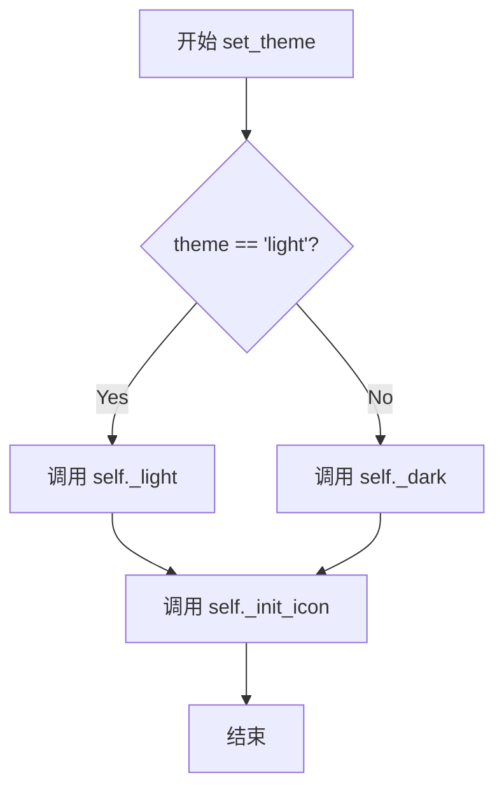

#### 带注释源码

```python
def set_theme(self, theme):
    """
    设置主题样式
    
    参数:
        theme (str): 主题名称，'light' 为浅色主题，'dark' 为深色主题
    
    返回:
        None
    """
    # 判断主题类型，如果是 "light" 则调用 _light 方法
    if theme == "light":
        self._light()
    # 否则调用 _dark 方法设置深色主题配色
    else:
        self._dark()
    # 根据主题类型初始化对应的图标资源
    self._init_icon(theme)
```


### `MTheme.set_primary_color`

设置主题的主色调，并自动生成该主色调的10个梯度色阶（primary_1到primary_10），同时更新悬停背景色和富文本超链接样式。

参数：

- `color`：`str`，要设置的主色调颜色值，支持十六进制颜色格式（如"#1890ff"）

返回值：`None`，无返回值（该方法直接修改实例属性）

#### 流程图

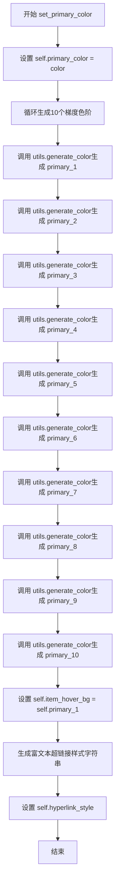

#### 带注释源码

```python
def set_primary_color(self, color):
    """
    设置主题的主色调，并生成相关的衍生颜色
    :param color: str，主色调颜色值，十六进制格式，如"#1890ff"
    :return: None
    """
    # 1. 直接设置传入的主色调颜色
    self.primary_color = color
    
    # 2. 使用utils.generate_color生成10个梯度色阶
    # 这些梯度色阶用于不同的场景，如hover、active、pressed等状态
    self.primary_1 = utils.generate_color(color, 1)  # 最浅的梯度
    self.primary_2 = utils.generate_color(color, 2)
    self.primary_3 = utils.generate_color(color, 3)
    self.primary_4 = utils.generate_color(color, 4)
    self.primary_5 = utils.generate_color(color, 5)
    self.primary_6 = utils.generate_color(color, 6)
    self.primary_7 = utils.generate_color(color, 7)
    self.primary_8 = utils.generate_color(color, 8)
    self.primary_9 = utils.generate_color(color, 9)
    self.primary_10 = utils.generate_color(color, 10)  # 最深的梯度
    
    # 3. 设置悬停背景色为最浅的梯度色（primary_1）
    self.item_hover_bg = self.primary_1
    
    # 4. 生成富文本超链接样式字符串
    # 用于在富文本中显示超链接时的样式
    self.hyperlink_style = """
    <style>
     a {{
        text-decoration: none;
        color: {0};
    }}
    </style>""".format(
        self.primary_color
    )
```


### `MTheme._init_icon`

该方法用于初始化主题的图标资源路径，根据传入的主题类型（浅色或深色）动态生成不同类型图标（PNG和SVG）的完整URL路径，并将其赋值给实例属性。

参数：

- `self`：MTheme，方法所属的类实例
- `theme`：str，主题类型，"light"表示浅色主题，"dark"表示深色主题

返回值：`None`，该方法无返回值，直接修改实例属性

#### 流程图

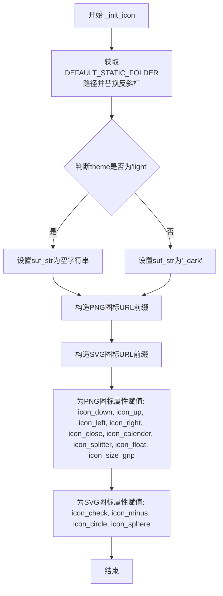

#### 带注释源码

```python
def _init_icon(self, theme):
    # 获取静态资源文件夹路径，并将反斜杠替换为正斜杠（兼容Windows和Unix路径）
    pre_str = DEFAULT_STATIC_FOLDER.replace("\\", "/")
    
    # 根据主题类型确定文件名前缀：浅色主题无后缀，深色主题添加_dark后缀
    suf_str = "" if theme == "light" else "_dark"
    
    # 构造PNG格式图标的URL前缀模板，使用占位符{}作为图标名称的插入位置
    # 例如：theme为light时 -> "path/to/icons/{}.png"
    # theme为dark时 -> "path/to/icons/{}_dark.png"
    url_prefix = "{pre}/{{}}{suf}.png".format(pre=pre_str, suf=suf_str)
    
    # 构造SVG格式图标的URL前缀模板（SVG图标不区分深浅色主题）
    url_prefix_2 = "{pre}/{{}}.svg".format(pre=pre_str)
    
    # 为各个PNG图标资源设置完整路径并赋值给实例属性
    self.icon_down = url_prefix.format("down_line")      # 下箭头图标
    self.icon_up = url_prefix.format("up_line")          # 上箭头图标
    self.icon_left = url_prefix.format("left_line")      # 左箭头图标
    self.icon_right = url_prefix.format("right_line")     # 右箭头图标
    self.icon_close = url_prefix.format("close_line")     # 关闭图标
    self.icon_calender = url_prefix.format("calendar_fill") # 日历图标
    self.icon_splitter = url_prefix.format("splitter")   # 分隔符图标
    self.icon_float = url_prefix.format("float")          # 浮动图标
    self.icon_size_grip = url_prefix.format("size_grip")  # 尺寸调整图标
    
    # 为各个SVG图标资源设置完整路径并赋值给实例属性
    self.icon_check = url_prefix_2.format("check")       # 勾选图标
    self.icon_minus = url_prefix_2.format("minus")        # 减号图标
    self.icon_circle = url_prefix_2.format("circle")      # 圆形图标
    self.icon_sphere = url_prefix_2.format("sphere")      # 球形图标
```


### `MTheme._init_color`

该方法负责初始化MTheme类的主题颜色系统，包括信息色、成功色、警告色、错误色四种状态颜色的完整色阶（1-10级），通过调用工具函数生成不同透明度和深度的颜色变体，为UI组件提供统一的色彩规范。

参数：

- `self`：实例方法隐含参数，MTheme类的实例对象，无需显式传递

返回值：`None`，无返回值，该方法通过直接修改实例属性来初始化颜色配置

#### 流程图

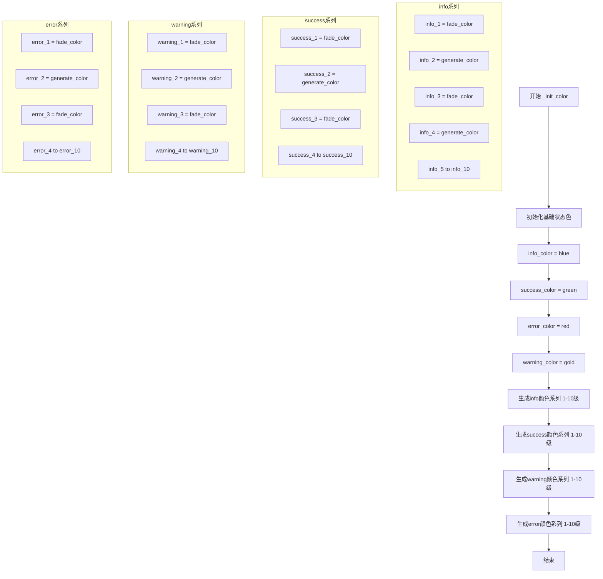

#### 带注释源码

```python
def _init_color(self):
    """
    初始化主题颜色系统
    包括四种基础状态色及其10级色阶变化
    """
    # 设置四种基础状态颜色（对应CSS主题色）
    self.info_color = self.blue           # 信息色-蓝色
    self.success_color = self.green       # 成功色-绿色
    self.processing_color = self.blue     # 处理中-蓝色（同info）
    self.error_color = self.red           # 错误色-红色
    self.warning_color = self.gold        # 警告色-金色

    # ========== 信息色(Info)系列 ==========
    # fade_color生成透明度变化，generate_color生成色阶变化
    self.info_1 = utils.fade_color(self.info_color, "15%")   # 15%透明度
    self.info_2 = utils.generate_color(self.info_color, 2)  # 第2级色阶
    self.info_3 = utils.fade_color(self.info_color, "35%")   # 35%透明度
    self.info_4 = utils.generate_color(self.info_color, 4)  # 第4级色阶
    self.info_5 = utils.generate_color(self.info_color, 5)  # 第5级色阶
    self.info_6 = utils.generate_color(self.info_color, 6)  # 第6级色阶
    self.info_7 = utils.generate_color(self.info_color, 7)  # 第7级色阶
    self.info_8 = utils.generate_color(self.info_color, 8)  # 第8级色阶
    self.info_9 = utils.generate_color(self.info_color, 9)  # 第9级色阶
    self.info_10 = utils.generate_color(self.info_color, 10) # 第10级色阶

    # ========== 成功色(Success)系列 ==========
    self.success_1 = utils.fade_color(self.success_color, "15%")
    self.success_2 = utils.generate_color(self.success_color, 2)
    self.success_3 = utils.fade_color(self.success_color, "35%")
    self.success_4 = utils.generate_color(self.success_color, 4)
    self.success_5 = utils.generate_color(self.success_color, 5)
    self.success_6 = utils.generate_color(self.success_color, 6)
    self.success_7 = utils.generate_color(self.success_color, 7)
    self.success_8 = utils.generate_color(self.success_color, 8)
    self.success_9 = utils.generate_color(self.success_color, 9)
    self.success_10 = utils.generate_color(self.success_color, 10)

    # ========== 警告色(Warning)系列 ==========
    self.warning_1 = utils.fade_color(self.warning_color, "15%")
    self.warning_2 = utils.generate_color(self.warning_color, 2)
    self.warning_3 = utils.fade_color(self.warning_color, "35%")
    self.warning_4 = utils.generate_color(self.warning_color, 4)
    self.warning_5 = utils.generate_color(self.warning_color, 5)
    self.warning_6 = utils.generate_color(self.warning_color, 6)
    self.warning_7 = utils.generate_color(self.warning_color, 7)
    self.warning_8 = utils.generate_color(self.warning_color, 8)
    self.warning_9 = utils.generate_color(self.warning_color, 9)
    self.warning_10 = utils.generate_color(self.warning_color, 10)

    # ========== 错误色(Error)系列 ==========
    self.error_1 = utils.fade_color(self.error_color, "15%")
    self.error_2 = utils.generate_color(self.error_color, 2)
    self.error_3 = utils.fade_color(self.error_color, "35%")
    self.error_4 = utils.generate_color(self.error_color, 4)
    self.error_5 = utils.generate_color(self.error_color, 5)
    self.error_6 = utils.generate_color(self.error_color, 6)
    self.error_7 = utils.generate_color(self.error_color, 7)
    self.error_8 = utils.generate_color(self.error_color, 8)
    self.error_9 = utils.generate_color(self.error_color, 9)
    self.error_10 = utils.generate_color(self.error_color, 10)
```

#### 关键组件信息

| 组件名称 | 一句话描述 |
|---------|-----------|
| `utils.fade_color` | 工具函数，根据百分比生成带透明度的颜色 |
| `utils.generate_color` | 工具函数，根据色阶号生成对应深度的颜色 |
| `info_color/success_color/warning_color/error_color` | 四种基础状态色，对应蓝/绿/金/红 |
| `*_1 到 *_10` | 各状态色的10级色阶变体，用于UI层次展示 |

#### 潜在技术债务与优化空间

1. **代码重复性高**：四个颜色系列（info/success/warning/error）初始化逻辑完全相同，存在大量重复代码，可通过循环或辅助方法重构

2. **硬编码颜色数量**：当前固定为10级色阶，缺乏灵活性，建议改为可配置参数

3. **magic string问题**：`"15%"`和`"35%"`等透明度值散落各处，应提取为常量或配置

4. **缺少缓存机制**：每次初始化都会重新计算颜色，可考虑缓存计算结果

5. **无错误处理**：如果`utils.generate_color`或`utils.fade_color`调用失败，缺乏异常捕获机制


### `MTheme._init_font`

该方法是 MTheme 类的私有方法，用于初始化主题的字体相关属性，包括字体家族、基础字号、大号字号、小号字号以及四个标题层级（H1-H4）的字号计算。

参数：

- `self`：实例对象，MTheme 类的实例本身

返回值：`None`，该方法没有返回值，仅用于初始化实例属性

#### 流程图

```mermaid
flowchart TD
    A[开始 _init_font] --> B[设置 font_family 字体家族字符串]
    B --> C[设置 font_size_base = 9]
    C --> D[设置 font_size_large = font_size_base + 2]
    D --> E[设置 font_size_small = font_size_base - 2]
    E --> F[计算 h1_size = int(font_size_base * 2.71)]
    F --> G[计算 h2_size = int(font_size_base * 2.12)]
    G --> H[计算 h3_size = int(font_size_base * 1.71)]
    H --> I[计算 h4_size = int(font_size_base * 1.41)]
    I --> J[结束 _init_font]
```

#### 带注释源码

```python
def _init_font(self):
    # font
    # 设置默认字体家族，包含多个平台和语言的备选字体
    self.font_family = (
        'BlinkMacSystemFont,"Segoe UI","PingFang SC","Hiragino Sans GB","Microsoft YaHei",'
        '"Helvetica Neue",Helvetica,Arial,sans-serif'
    )
    # 设置基础字号为 9pt
    self.font_size_base = 9
    # 大号字号为基础字号加2，即11pt
    self.font_size_large = self.font_size_base + 2
    # 小号字号为基础字号减2，即7pt
    self.font_size_small = self.font_size_base - 2
    # H1标题字号为基础字号的2.71倍并取整，约24pt
    self.h1_size = int(self.font_size_base * 2.71)
    # H2标题字号为基础字号的2.12倍并取整，约19pt
    self.h2_size = int(self.font_size_base * 2.12)
    # H3标题字号为基础字号的1.71倍并取整，约15pt
    self.h3_size = int(self.font_size_base * 1.71)
    # H4标题字号为基础字号的1.41倍并取整，约12pt
    self.h4_size = int(self.font_size_base * 1.41)
```


### `MTheme.__getattribute__`

该方法是MTheme类的属性访问拦截器，通过尝试先从对象本身获取属性，若属性不存在则从主题尺寸字典中查找对应的尺寸值，实现了属性访问的透明扩展功能。

参数：

- `item`：`str`，要访问的属性名称

返回值：`任意类型`，如果属性存在于对象中则返回该属性值，否则返回`get_theme_size()`字典中对应item的值（若不存在则返回0）

#### 流程图

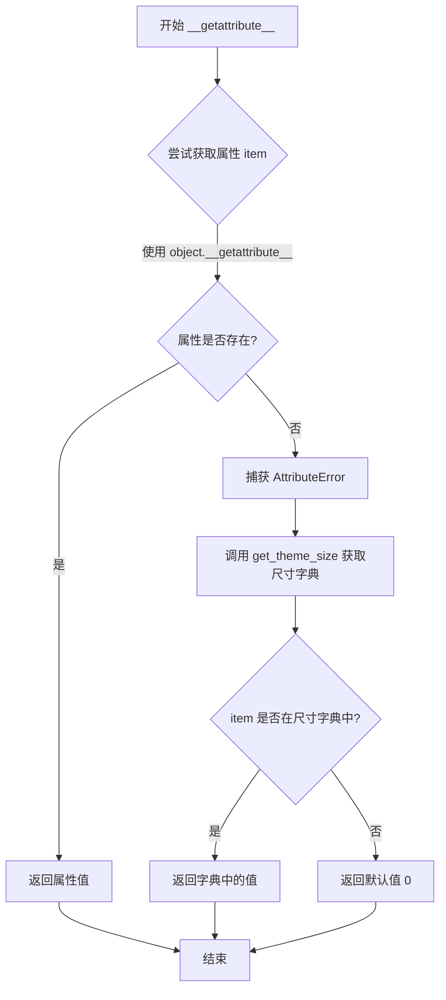

#### 带注释源码

```python
def __getattribute__(self, item):
    """
    自定义属性访问方法，实现属性查找的透明扩展。
    
    该方法在属性查找失败时会尝试从主题尺寸字典中获取值，
    允许动态访问预定义的主题尺寸属性。
    
    参数:
        item (str): 要访问的属性名称
        
    返回:
        任意类型: 如果属性存在于对象本身则返回该属性值；
                 否则返回 get_theme_size() 字典中对应 item 的值；
                 若 item 不在字典中则返回 0
    """
    # 首先尝试通过默认的 object.__getattribute__ 获取属性
    # 这样可以正常访问类中定义的所有属性（如 blue, purple 等颜色值）
    try:
        return object.__getattribute__(self, item)
    except AttributeError:
        # 如果属性不存在（抛出 AttributeError），则从主题尺寸字典中查找
        # get_theme_size() 返回一个包含各种主题尺寸的字典（如 border_radius_large, huge 等）
        # 使用 dict.get() 方法，如果 item 不在字典中则返回默认值 0
        return get_theme_size().get(item, 0)
```


### MTheme._dark

该方法用于设置深色主题的颜色配置，通过为MTheme实例的各个颜色属性赋值来实现深色主题的UI效果，包括标题、文本、边框、背景等颜色。

参数：

- `self`：`MTheme`，MTheme类的实例方法，指代当前主题对象本身

返回值：`None`，无返回值，该方法直接修改实例属性

#### 流程图

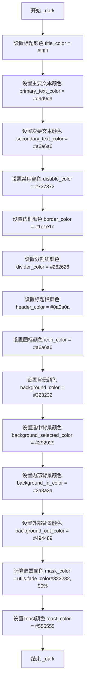

#### 带注释源码

```python
def _dark(self):
    """
    设置深色主题的颜色配置
    该方法为MTheme实例的所有深色主题相关颜色属性赋值
    包括文本颜色、背景颜色、边框颜色等UI元素颜色
    """
    # 标题颜色设置为白色
    self.title_color = "#ffffff"
    # 主要文本颜色设置为浅灰色
    self.primary_text_color = "#d9d9d9"
    # 次要文本颜色设置为中灰色
    self.secondary_text_color = "#a6a6a6"
    # 禁用状态颜色设置为深灰色
    self.disable_color = "#737373"
    # 边框颜色设置为近黑色
    self.border_color = "#1e1e1e"
    # 分割线颜色设置为深灰色
    self.divider_color = "#262626"
    # 标题栏颜色设置为纯黑
    self.header_color = "#0a0a0a"
    # 图标颜色设置为中灰色
    self.icon_color = "#a6a6a6"

    # 背景颜色设置为深灰色
    self.background_color = "#323232"
    # 选中项背景颜色设置为稍深的灰色
    self.background_selected_color = "#292929"
    # 输入框内部背景颜色设置为中深灰色
    self.background_in_color = "#3a3a3a"
    # 外部背景颜色设置为浅深灰色
    self.background_out_color = "#494949"
    # 遮罩颜色通过工具函数将背景色淡化90%得到
    self.mask_color = utils.fade_color(self.background_color, "90%")
    # Toast提示颜色设置为中灰色
    self.toast_color = "#555555"
```


### `MTheme._light`

该方法用于初始化浅色主题的颜色调色板，通过设置各种颜色属性（如标题颜色、文本颜色、背景颜色、边框颜色等）来定义浅色主题的视觉样式。

参数：

- `self`：`MTheme` 实例，表示主题对象本身

返回值：`None`，无返回值，该方法直接修改实例属性

#### 流程图

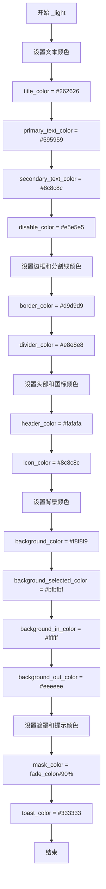

#### 带注释源码

```python
def _light(self):
    """
    初始化浅色主题的颜色属性
    
    该方法设置浅色主题下各种UI元素使用的颜色值，
    包括文本颜色、背景颜色、边框颜色、图标颜色等。
    """
    
    # ==================== 文本颜色 ====================
    # 标题文字颜色 - 深灰色
    self.title_color = "#262626"
    # 主要文字颜色 - 中灰色
    self.primary_text_color = "#595959"
    # 次要文字颜色 - 浅灰色
    self.secondary_text_color = "#8c8c8c"
    # 禁用状态颜色 - 极浅灰色
    self.disable_color = "#e5e5e5"
    
    # ==================== 边框和分割线颜色 ====================
    # 边框颜色 - 浅灰色
    self.border_color = "#d9d9d9"
    # 分割线颜色 - 更浅的灰色
    self.divider_color = "#e8e8e8"
    # 头部区域背景颜色
    self.header_color = "#fafafa"
    # 图标颜色 - 浅灰色
    self.icon_color = "#8c8c8c"
    
    # ==================== 背景颜色 ====================
    # 主背景颜色 - 极浅灰白
    self.background_color = "#f8f8f9"
    # 选中项背景颜色 - 中灰色
    self.background_selected_color = "#bfbfbf"
    # 内部区域背景颜色 - 纯白
    self.background_in_color = "#ffffff"
    # 外部区域背景颜色 - 浅灰
    self.background_out_color = "#eeeeee"
    
    # ==================== 特殊效果颜色 ====================
    # 遮罩颜色 - 背景色透明度90%
    # 调用工具函数生成半透明颜色
    self.mask_color = utils.fade_color(self.background_color, "90%")
    # 提示框文字颜色 - 深灰
    self.toast_color = "#333333"
```


### `MTheme.apply`

该方法用于将主题样式表应用到指定的Qt控件，通过获取主题尺寸和颜色配置，替换QSS模板中的占位符，最终设置控件的样式表。

参数：

- `widget`：`QWidget`，需要应用主题样式表的Qt控件对象

返回值：`None`，该方法直接修改控件的样式表，不返回任何值

#### 流程图

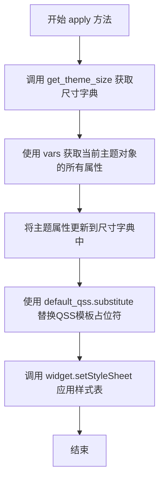

#### 带注释源码

```python
def apply(self, widget):
    """
    将主题样式表应用到指定的Qt控件
    
    该方法执行以下操作：
    1. 获取主题相关的尺寸配置
    2. 合并当前主题对象的颜色、字体等属性
    3. 通过QssTemplate替换QSS模板中的占位符
    4. 将生成的完整样式表设置到控件上
    
    参数:
        widget: Qt控件对象，需要应用主题样式的QWidget或其子类实例
    
    返回值:
        None
    
    示例:
        >>> theme = MTheme(theme='light', primary_color='#1890ff')
        >>> theme.apply(some_button)
    """
    # Step 1: 获取主题尺寸字典，包含各种UI元素的尺寸配置
    # 如边框半径、图标大小、开关尺寸等
    size_dict = get_theme_size()
    
    # Step 2: 将当前主题对象的所有实例属性（颜色、字体等）合并到尺寸字典
    # vars(self) 返回对象的 __dict__，包含所有实例属性
    size_dict.update(vars(self))
    
    # Step 3: 使用QssTemplate的substitute方法替换QSS模板中的占位符
    # 占位符格式为 @variable_name，会被size_dict中对应的值替换
    # default_qss 是从main.qss文件读取的QSS样式模板
    generated_qss = self.default_qss.substitute(size_dict)
    
    # Step 4: 将生成的QSS样式表应用到目标控件
    # setStyleSheet是Qt QWidget的方法，用于设置控件的样式表
    widget.setStyleSheet(generated_qss)
```


### `MTheme.deco`

这是一个装饰器方法，用于为Qt组件类自动应用主题样式表和抛光效果。它通过替换类的 `__init__` 方法来注入样式表设置逻辑，并添加 `polish` 方法用于样式抛光。

参数：

- `cls`：`type`，要应用主题装饰的Qt组件类

返回值：`type`，装饰后的类（修改了 `__init__` 和添加了 `polish` 方法）

#### 流程图

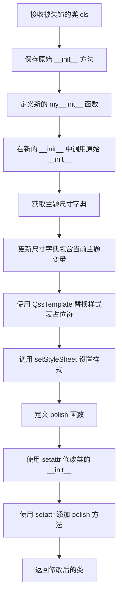

#### 带注释源码

```python
def deco(self, cls):
    """
    装饰器方法，为Qt组件类应用主题样式表
    
    参数:
        cls: 要装饰的Qt组件类
    返回:
        装饰后的类
    """
    # 步骤1: 保存原始的 __init__ 方法引用
    original_init__ = cls.__init__

    # 步骤2: 定义新的 __init__ 方法
    def my__init__(instance, *args, **kwargs):
        # 先调用原始初始化方法，确保对象正确构造
        original_init__(instance, *args, **kwargs)
        
        # 获取主题尺寸配置字典
        size_dict = get_theme_size()
        
        # 用当前主题实例的属性更新尺寸字典
        # vars(self) 获取 MTheme 实例的所有属性
        size_dict.update(vars(self))
        
        # 使用 QssTemplate 替换样式表中的占位符变量
        # 并为 Qt 组件设置样式表
        instance.setStyleSheet(self.default_qss.substitute(size_dict))

    # 步骤3: 定义 polish 方法，用于样式抛光
    def polish(instance):
        # 调用 Qt 的样式抛光器
        instance.style().polish(instance)

    # 步骤4: 使用 setattr 替换类的 __init__ 方法
    setattr(cls, "__init__", my__init__)
    
    # 步骤5: 为类添加 polish 方法
    setattr(cls, "polish", polish)
    
    # 返回修改后的类
    return cls
```

## 关键组件


### 动态缩放尺寸系统 (get_theme_size)

根据屏幕DPI缩放因子动态计算所有UI组件的尺寸参数，实现跨分辨率自适应布局。

### QSS模板引擎 (QssTemplate)

继承自string.Template的自定义模板类，使用"@"作为分隔符，支持QSS文件中的占位符替换，实现样式与代码解耦。

### 主题颜色生成系统 (MTheme.set_primary_color)

根据用户指定的主色自动生成10阶渐变色系列，并计算悬停状态背景色，同时生成富文本超链接样式。

### 语义化颜色体系

预定义info/success/warning/error四种语义颜色，每种颜色生成10个渐变梯度，支持UI状态的层次化表达。

### 图标路径动态管理 (MTheme._init_icon)

根据主题类型（light/dark）动态拼接图标文件路径，支持PNG和SVG两种格式，自动处理深色主题的资源后缀。

### 字体配置系统 (MTheme._init_font)

定义跨平台字体栈，包含BlinkMacSystemFont、Segoe UI、PingFang SC等字体，支持标题层级(h1-h4)的字号计算。

### 主题切换机制 (MTheme.set_theme)

支持light和dark两种主题模式，内部调用`_light()`和`_dark()`方法初始化对应的颜色方案，实现主题热切换。

### 样式表应用器 (MTheme.apply)

将主题尺寸字典与QSS模板合并，通过`substitute()`方法替换占位符后应用到目标Qt组件。

### 装饰器模式主题注入 (MTheme.deco)

通过装饰器为任意Qt组件类注入主题初始化逻辑，自动在实例化时应用样式表并注册polish回调。

### 惰性属性访问 (__getattribute__)

当访问MTheme实例不存在的属性时，自动从`get_theme_size()`字典中查找并返回对应的尺寸值，实现主题属性按需加载。


## 问题及建议


### 已知问题

-   `__getattribute__` 方法实现不当，每次访问不存在的属性时都会调用 `get_theme_size()`，造成性能开销且无法给出明确的错误提示
-   `_init_color` 方法存在大量重复代码，信息色、成功色、警告色、错误色的生成逻辑完全相同，可通过循环或辅助方法重构
-   `__init__` 中读取 QSS 文件时没有异常处理，若文件不存在或读取失败会导致程序崩溃
-   `get_theme_size()` 每次调用都会重新获取 `get_scale_factor()`，未做缓存，频繁调用时性能低下
-   `apply` 方法和 `deco` 方法每次执行都重新构建 `size_dict`，调用 `vars(self)` 产生额外开销
-   `set_theme` 和 `set_primary_color` 方法缺少参数校验，未对传入的 theme 字符串或 primary_color 颜色值进行验证
-   `deco` 装饰器通过直接修改类的 `__init__` 和添加 `polish` 方法实现，行为不够透明，可能与其它装饰器冲突
-   `_init_icon` 方法中存在重复的字符串格式化逻辑
-   硬编码的颜色值和尺寸值较多，后续修改维护成本高

### 优化建议

-   移除或重写 `__getattribute__`，改用显式属性定义或在 `__getattr__` 中仅处理特定属性查找失败的情况
-   重构 `_init_color` 方法，使用循环遍历颜色类型列表（info、success、warning、error）统一生成对应色阶，减少代码重复
-   为文件读取操作添加 try-except 异常处理，并提供友好的错误提示
-   将 `scale_factor` 和 `get_theme_size()` 的返回值进行缓存或惰性计算，避免重复调用
-   预计算 `size_dict` 并在属性变更时更新缓存，减少 `apply` 和 `deco` 中的重复计算
-   在 `set_theme` 中校验 theme 参数（仅允许 "light" 或 "dark"），在 `set_primary_color` 中校验颜色格式
-   重新设计 `deco` 装饰器，考虑使用类装饰器或 mixin 方式，避免直接修改传入类的 `__init__`
-   将颜色配置和尺寸配置抽离为独立的配置文件或数据结构，提高可维护性
-   对 `_init_icon` 方法使用循环或字典映射简化字符串构造逻辑


## 其它


### 设计目标与约束

**设计目标**：为Qt应用程序提供可配置的主题系统，支持亮色/暗色主题切换、主色调自定义、响应式尺寸计算（适配高DPI屏幕），并通过QSS模板机制实现样式统一管理。

**设计约束**：
- 依赖Qt框架（通过`get_scale_factor`获取屏幕缩放因子）
- 颜色生成依赖`utils`模块的`generate_color`和`fade_color`函数
- 静态资源路径由`DEFAULT_STATIC_FOLDER`指定，需确保资源文件存在
- 主题配置通过代码硬编码，不支持运行时持久化存储

### 错误处理与异常设计

**文件读取异常**：在`MTheme.__init__`中打开`main.qss`文件时，若文件不存在或读取失败，会抛出`IOError`异常，建议捕获并提供友好的错误提示。

**属性访问异常**：`__getattribute__`方法捕获`AttributeError`并返回默认值0，用于动态获取未定义的尺寸属性，但可能导致隐藏的配置错误。

**颜色生成异常**：若`utils.generate_color`或`utils.fade_color`接收到无效的颜色值或百分比，可能抛出异常，需在调用前验证输入有效性。

### 数据流与状态机

**主题状态机**：
- 初始状态：默认亮色主题（theme="light"）
- 切换事件：调用`set_theme(theme)`方法
- 状态转换：
  - light → dark：调用`_dark()`方法重置颜色变量
  - dark → light：调用`_light()`方法重置颜色变量
- 状态持久化：无持久化机制，程序重启后恢复默认

**数据流向**：
1. 外部调用`MTheme(theme, primary_color)`初始化主题对象
2. `set_primary_color()`计算10级主色调渐变
3. `set_theme()`根据主题类型应用颜色方案
4. `apply(widget)`或`deco`装饰器将QSS模板与尺寸数据合并应用到控件

### 外部依赖与接口契约

**模块依赖**：
- `utils`：提供`get_static_file`、`generate_color`、`fade_color`函数
- `qt.get_scale_factor`：获取屏幕DPI缩放因子
- `DEFAULT_STATIC_FOLDER`：静态资源根目录路径

**接口契约**：
- `get_theme_size()`：返回包含所有尺寸键值对的字典
- `MTheme.apply(widget)`：接收Qt控件对象，无返回值
- `MTheme.deco(cls)`：接收Qt控件类，返回装饰后的类

**资源要求**：
- `main.qss`：QSS模板文件，位于`DEFAULT_STATIC_FOLDER`路径下
- 图标文件（PNG/SVG）：位于`DEFAULT_STATIC_FOLDER`路径下，包括`down_line.png`、`calendar_fill.png`等

### 性能考量

**启动性能**：`MTheme.__init__`中会读取QSS文件并初始化大量颜色变量，若创建多个主题实例会造成重复计算，建议单例模式或缓存主题对象。

**尺寸计算**：每次调用`get_theme_size()`都会重新获取缩放因子并计算所有尺寸，若频繁调用建议缓存结果。

**内存占用**：颜色属性（primary_1~primary_10等）每个主题实例占用约100+个属性字段，若需支持多主题切换可考虑享元模式。

### 版本兼容性

**Python版本**：代码使用`__future__`导入支持Python 2.7（已废弃），建议移除过时的Python 2兼容代码。

**Qt版本**：`get_scale_factor`依赖Qt实现，需确认目标Qt版本支持该函数。

### 测试策略建议

- 单元测试：验证`get_theme_size()`返回的尺寸计算正确性
- 集成测试：测试`MTheme.apply()`对不同Qt控件的样式应用效果
- 主题切换测试：验证亮色/暗色主题切换后颜色值正确
- DPI适配测试：在不同缩放因子（1x、1.5x、2x）下验证尺寸响应

### 部署与运维注意事项

- 确保`DEFAULT_STATIC_FOLDER`路径下包含`main.qss`及所有图标文件
- 部署时需保证`utils`模块和`qt`模块可用
- 建议在应用启动时预初始化主题对象，避免首次使用时加载延迟

    