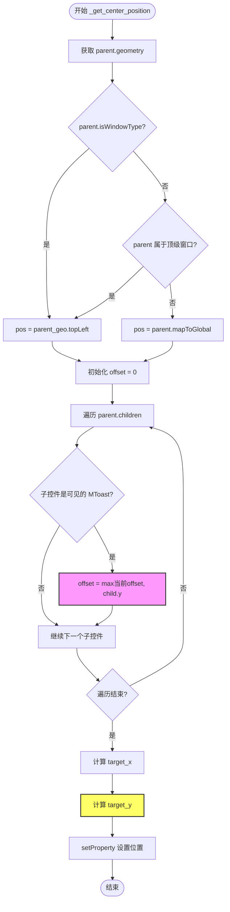

# `comic-translate\app\ui\dayu_widgets\toast.py` 详细设计文档

MToast 是一个基于 PySide6 的轻量级 Qt 组件，用于在父窗口中心显示类似移动设备的 Toast（轻提示）消息，支持信息、成功、警告、错误、加载中等类型，具备自动定位、淡入淡出动画及自动关闭功能。

## 整体流程

```mermaid
graph TD
    Start[用户调用类方法<br>e.g. MToast.info()] --> Init[__init__ 初始化]
    Init --> ConfigWindow[设置窗口标志:<br>Frameless, Dialog, StaysOnTop]
    Init --> SetAttributes[设置属性:<br>TranslucentBackground, DeleteOnClose]
    Init --> BuildUI[构建界面布局:<br>图标(MLoading/MAvatar) + 文本(MLabel)]
    Init --> SetupTimer[创建并启动自动关闭定时器<br>(_close_timer)]
    Init --> SetupAnim[初始化透明度动画<br>(_opacity_ani)]
    Init --> CalcPos[_get_center_position<br>计算在父窗口的居中位置]
    Init --> ShowWidget[show() 显示窗口]
    ShowWidget --> FadeIn[_fade_int 淡入动画]
    ShowWidget --> CheckType{dayu_type<br>== Loading?}
    CheckType -- 是 --> WaitClose[等待手动调用 close()]
    CheckType -- 否 --> TimerRunning[定时器倒计时]
    TimerRunning --> Timeout[定时器超时<br>timeout 信号]
    Timeout --> TriggerClose[触发 closeEvent]
    WaitClose --> TriggerClose
    TriggerClose --> CloseEvent{closeEvent 事件}
    CloseEvent --> Played{has_played?}
    Played -- 是 --> Accept[event.accept 立即关闭]
    Played -- 否 --> FadeOut[_fade_out 淡出动画]
    FadeOut --> AnimFinished[动画结束<br>finished 信号]
    AnimFinished --> DoClose[调用 self.close 关闭]
```

## 类结构

```
MToast (QtWidgets.QWidget)
├── 核心属性配置 (dayu_theme)
│   └── 提供主题颜色、尺寸配置
├── UI 组件
│   ├── MAvatar (图标显示)
│   ├── MLabel (文本显示)
│   ├── MLoading (加载动画)
│   └── MPixmap (图像资源)
└── Qt 核心
    ├── QPropertyAnimation (动画)
    ├── QTimer (定时器)
    └── Signal (信号槽)
```

## 全局变量及字段


### `MToast.InfoType`
    
信息类型标识 ('info')

类型：`str`
    


### `MToast.SuccessType`
    
成功类型标识 ('success')

类型：`str`
    


### `MToast.WarningType`
    
警告类型标识 ('warning')

类型：`str`
    


### `MToast.ErrorType`
    
错误类型标识 ('error')

类型：`str`
    


### `MToast.LoadingType`
    
加载类型标识 ('loading')

类型：`str`
    


### `MToast.default_config`
    
全局默认配置 {'duration': 2}

类型：`dict`
    


### `MToast.sig_closed`
    
关闭时发出的信号

类型：`Signal`
    


### `MToast.has_played`
    
标记淡出动画是否已执行

类型：`bool`
    


### `MToast._opacity_ani`
    
控制窗口透明度变化的动画对象

类型：`QPropertyAnimation`
    


### `MToast._close_timer`
    
控制自动关闭的定时器

类型：`QTimer`
    
    

## 全局函数及方法


### `MToast.__init__`

构造函数，初始化 MToast 组件，设置无边框窗口、布局、图标、动画并计算显示位置。

#### 参数

- `self`：自动传递，当前实例对象
- `text`：`str`，要显示的文本内容
- `duration`：`int`，可选，显示持续时间（秒），默认从 default_config 获取（2秒）
- `dayu_type`：`str`，可选，消息类型（info/success/warning/error/loading），默认为 info
- `parent`：`QWidget`，可选，父窗口部件，默认为 None

#### 返回值

无返回值（构造函数）

#### 流程图

```mermaid
flowchart TD
    A[开始 __init__] --> B[调用父类构造函数]
    B --> C[设置窗口标志: FramelessWindowHint | Dialog | WindowStaysOnTopHint]
    C --> D[设置窗口属性: WA_TranslucentBackground, WA_DeleteOnClose, WA_StyledBackground]
    D --> E{dayu_type == LoadingType?}
    E -->|Yes| F[添加 MLoading 图标]
    E -->|No| G[添加 MAvatar 图标]
    F --> H[创建 MLabel 显示文本]
    G --> H
    H --> I[设置布局: QVBoxLayout 包含图标和文本]
    I --> J[设置固定大小]
    J --> K[创建关闭定时器]
    K --> L{dayu_type != LoadingType?}
    L -->|Yes| M[启动关闭定时器]
    L -->|No| N[不启动定时器]
    M --> O[创建透明度动画]
    N --> O
    O --> P[计算中心位置 _get_center_position]
    P --> Q[执行淡入动画 _fade_int]
    Q --> R[结束 __init__]
```

#### 带注释源码

```python
def __init__(self, text, duration=None, dayu_type=None, parent=None):
    """
    MToast 构造函数
    
    参数:
        text: str, 要显示的文本内容
        duration: int, 可选，显示持续时间（秒），默认2秒
        dayu_type: str, 可选，消息类型（info/success/warning/error/loading）
        parent: QWidget, 可选，父窗口部件
    """
    # 调用父类 QWidget 的构造函数
    super(MToast, self).__init__(parent)
    
    # 设置窗口标志：无边框 | 对话框 | 总是置顶
    self.setWindowFlags(
        QtCore.Qt.FramelessWindowHint
        | QtCore.Qt.Dialog
        | QtCore.Qt.WindowStaysOnTopHint
    )
    
    # 设置窗口属性：透明背景、关闭时删除、样式化背景
    self.setAttribute(QtCore.Qt.WA_TranslucentBackground)
    self.setAttribute(QtCore.Qt.WA_DeleteOnClose)
    self.setAttribute(QtCore.Qt.WA_StyledBackground)

    # 创建水平布局用于放置图标
    _icon_lay = QtWidgets.QHBoxLayout()
    _icon_lay.addStretch()

    # 根据类型显示不同的图标
    if dayu_type == MToast.LoadingType:
        # 加载类型显示 MLoading 动画组件
        _icon_lay.addWidget(MLoading(size=dayu_theme.huge, color=dayu_theme.text_color_inverse))
    else:
        # 其他类型显示 MAvatar 图标
        _icon_label = MAvatar()
        _icon_label.set_dayu_size(dayu_theme.toast_icon_size)
        _icon_label.set_dayu_image(
            MPixmap(
                "{}_line.svg".format(dayu_type or MToast.InfoType),
                dayu_theme.text_color_inverse,
            )
        )
        _icon_lay.addWidget(_icon_label)
    _icon_lay.addStretch()

    # 创建文本标签
    _content_label = MLabel()
    _content_label.setText(text)
    _content_label.setAlignment(QtCore.Qt.AlignCenter)

    # 创建主垂直布局
    _main_lay = QtWidgets.QVBoxLayout()
    _main_lay.setContentsMargins(0, 0, 0, 0)
    _main_lay.addStretch()
    _main_lay.addLayout(_icon_lay)
    _main_lay.addSpacing(10)
    _main_lay.addWidget(_content_label)
    _main_lay.addStretch()
    
    # 设置布局到窗口
    self.setLayout(_main_lay)
    
    # 设置固定大小
    self.setFixedSize(QtCore.QSize(dayu_theme.toast_size, dayu_theme.toast_size))

    # 创建关闭定时器
    _close_timer = QtCore.QTimer(self)
    _close_timer.setSingleShot(True)
    _close_timer.timeout.connect(self.close)
    _close_timer.timeout.connect(self.sig_closed)
    # 设置定时器间隔（毫秒）
    _close_timer.setInterval((duration or self.default_config.get("duration")) * 1000)
    
    # 标记是否已播放过动画
    self.has_played = False

    # 加载类型不自动关闭，需要手动关闭
    if dayu_type != MToast.LoadingType:
        _close_timer.start()

    # 创建透明度属性动画
    self._opacity_ani = QtCore.QPropertyAnimation()
    self._opacity_ani.setTargetObject(self)
    self._opacity_ani.setDuration(300)
    self._opacity_ani.setEasingCurve(QtCore.QEasingCurve.OutCubic)
    self._opacity_ani.setPropertyName(b"windowOpacity")
    self._opacity_ani.setStartValue(0.0)
    self._opacity_ani.setEndValue(0.9)

    # 计算窗口中心位置
    self._get_center_position(parent)
    
    # 执行淡入动画
    self._fade_int()
```


### `MToast.closeEvent`

重写Qt的关闭事件，用于判断Toast组件是否已播放过淡出动画。若已播放则接受关闭事件，否则播放淡出动画并忽略关闭事件，以确保动画播放完成后再关闭窗口。

参数：

- `self`：`MToast`，MToast类的实例本身，包含组件的所有状态和属性
- `event`：`QCloseEvent`，Qt的关闭事件对象，用于控制窗口的关闭行为

返回值：`None`，该方法通过修改event的状态来控制关闭流程，不直接返回值

#### 流程图


#### 带注释源码

```python
def closeEvent(self, event):
    """
    重写QWidget的closeEvent事件
    用于处理MToast窗口关闭时的逻辑
    
    参数:
        event: QCloseEvent对象，Qt的关闭事件
        
    处理逻辑:
        1. 检查has_played标志，判断是否已经播放过淡出动画
        2. 如果已播放，直接接受关闭事件，窗口正常关闭
        3. 如果未播放，先触发淡出动画，并忽略当前关闭事件
           等待动画播放完成后再真正关闭窗口
    """
    # 判断是否已经播放过淡出动画
    if self.has_played:
        # 已播放过动画，直接接受关闭事件，允许窗口关闭
        event.accept()
    else:
        # 未播放过动画，先播放淡出动画
        self._fade_out()
        # 忽略当前的关闭事件，防止窗口立即关闭
        # 等待淡出动画完成后在_fade_out中调用self.close()再关闭
        event.ignore()
```


### `MToast._fade_out`

该方法用于执行透明度从高到低的淡出动画，通过将动画方向设置为反向并在动画完成时触发关闭操作，实现消息提示框的优雅消失。

参数：

- `self`：隐式参数，MToast 实例本身，无需显式传递

返回值：`None`，无返回值

#### 流程图


#### 带注释源码

```python
def _fade_out(self):
    """
    执行透明度从高到低的淡出动画，动画结束后关闭窗口。
    该方法在用户关闭Toast或超时后被调用，用于实现优雅的消失效果。
    """
    # 标记已执行过淡出动画，避免重复触发
    self.has_played = True
    
    # 设置动画方向为Backward，即从结束值向开始值播放
    # _opacity_ani 初始设置为从0.0到0.9，Backward则从0.9到0.0
    self._opacity_ani.setDirection(QtCore.QAbstractAnimation.Backward)
    
    # 连接动画完成信号到close槽，动画结束时自动关闭窗口
    self._opacity_ani.finished.connect(self.close)
    
    # 启动淡出动画
    self._opacity_ani.start()
```


### `MToast._fade_int`

执行透明度从低到高的淡入动画，通过启动 QPropertyAnimation 使窗口从不透明状态淡入到设定的目标透明度。

参数：

- `self`：实例本身，无需显式传递

返回值：`None`，无返回值描述

#### 流程图


#### 带注释源码

```python
def _fade_int(self):
    """
    执行透明度从低到高的淡入动画。
    该方法启动预先配置好的 QPropertyAnimation，使窗口从完全透明
    逐渐淡入到目标不透明度（0.9），动画时长300毫秒，使用OutCubic缓动曲线。
    """
    self._opacity_ani.start()  # 启动淡入动画
```


### `MToast._get_center_position`

该方法负责计算并设置 `MToast` 控件在屏幕上的最终显示坐标。它首先判断 `parent` 窗口的类型（顶级窗口或嵌套窗口），以确定计算坐标系的基准点（局部坐标或全局坐标）。随后，它遍历 `parent` 的子控件，尝试计算垂直偏移量（`offset`）以避免多个 Toast 消息重叠显示，但根据源码显示，该偏移量计算后未被实际应用到最终的 Y 坐标中，存在逻辑缺陷。

参数：

- `self`：`MToast`，表示当前的 Toast 控件实例。
- `parent`：`QtWidgets.QWidget`，父级窗口或控件，Toast 将相对于该对象进行居中定位。

返回值：`None`（无返回值），该方法通过 `setProperty` 直接修改控件的位置状态。

#### 流程图



#### 带注释源码

```python
def _get_center_position(self, parent):
    # 获取父窗口的几何信息（位置和尺寸）
    parent_geo = parent.geometry()
    
    # 判断父窗口的类型以确定坐标基准
    if parent.isWindowType():
        # 如果父窗口是顶级窗口（没有父级窗口的独立窗口）
        # 则直接使用其几何信息的左上角作为基准点（屏幕坐标）
        pos = parent_geo.topLeft()
    elif parent in QtWidgets.QApplication.topLevelWidgets():
        # 虽然父窗口是独立窗口，但它也有父级（例如 DCC 软件中的工具窗口以 Maya 主窗口为父级）
        # 同样直接使用其几何信息的左上角
        pos = parent_geo.topLeft()
    else:
        # 父窗口是嵌套在其它窗口中的控件
        # 需要将局部坐标转换为全局屏幕坐标
        pos = parent.mapToGlobal(parent_geo.topLeft())
        
    # 初始化垂直偏移量，用于处理多个 Toast 重叠的情况
    offset = 0
    # 遍历父窗口的所有子控件
    for child in parent.children():
        # 如果子控件也是 MToast 并且当前可见
        if isinstance(child, MToast) and child.isVisible():
            # 更新偏移量为当前可见 Toast 的最大 Y 坐标（实现纵向堆叠）
            offset = max(offset, child.y())
            
    # 计算 Toast 居中的目标 X 坐标
    # 父窗口基准 X + 父窗口宽度的一半 - Toast 自身宽度的一半
    target_x = pos.x() + parent_geo.width() / 2 - self.width() / 2
    
    # 计算 Toast 居中的目标 Y 坐标
    # 父窗口基准 Y + 父窗口高度的一半 - Toast 自身高度的一半
    target_y = pos.y() + parent_geo.height() / 2 - self.height() / 2
    
    # 注意：此处计算了 offset，但未将其加到 target_y 上，导致堆叠逻辑未生效
    # 正确应为：target_y = target_y + offset
    
    # 设置控件的位置属性
    self.setProperty("pos", QtCore.QPoint(target_x, target_y))
```


### `MToast.info`

显示普通信息提示（InfoType）的工厂方法。该方法创建一个指定类型的 `MToast` 实例，计算其在父窗口中的中心位置，显示提示，并在指定时间后自动关闭（或返回实例由调用者管理）。

参数：

- `cls`：`type`，类本身（类方法隐式传入）。
- `text`：`str`，要显示的文本内容。
- `parent`：`QtWidgets.QWidget`，父窗口部件。用于计算Toast显示的中心位置，若传入 `None` 可能导致位置计算异常。
- `duration`：`int` 或 `None`，可选。显示持续时间，单位为秒。默认为 `None`，此时会读取类默认配置（通常为2秒）。

返回值：`MToast`，返回创建的 `MToast` 实例。调用者可以使用此返回值手动控制提示框（例如强制关闭）。

#### 流程图


#### 带注释源码

```python
@classmethod
def info(cls, text, parent, duration=None):
    """Show a normal toast message"""
    # 使用类方法实例化MToast，传入文本、持续时间、类型为InfoType以及父窗口
    inst = cls(text, duration=duration, dayu_type=MToast.InfoType, parent=parent)
    # 调用show方法使窗口可见
    inst.show()
    # 返回该实例，以便调用者可以手动管理其生命周期（例如提前关闭）
    return inst
```


### `MToast.success`

显示成功类型的Toast消息，创建一个带有成功图标和指定文本内容的提示组件，并自动显示在父窗口的中心位置。

参数：

- `text`：`str`，要显示的成功提示文本内容
- `parent`：`QtWidgets.QWidget`，父窗口部件，用于定位Toast显示位置
- `duration`：`int`，可选参数，显示持续时间（单位：秒），默认值为`None`（从`default_config`获取）

返回值：`MToast`，返回创建的MToast实例对象，可用于后续对该Toast实例进行操作（如手动关闭）

#### 流程图


#### 带注释源码

```python
@classmethod
def success(cls, text, parent, duration=None):
    """Show a success toast message"""
    # 创建一个MToast实例，类型为SuccessType
    # 参数text: 显示的文本内容
    # 参数duration: 显示持续时间（秒），如果为None则使用默认配置
    # 参数dayu_type: 设置为MToast.SuccessType，显示成功图标
    # 参数parent: 父窗口部件，用于定位Toast显示位置
    inst = cls(text, duration=duration, dayu_type=MToast.SuccessType, parent=parent)
    
    # 显示Toast组件
    inst.show()
    
    # 返回创建的实例，供调用者进行后续操作（如手动关闭）
    return inst
```


### MToast.warning

显示一个警告类型的Toast消息泡。

参数：

- `text`：`str`，要显示的警告文本内容。
- `parent`：`QtWidgets.QWidget`，父窗口部件，Toast会显示在其几何中心，并作为Qt层级中的父对象。
- `duration`：`int` (可选，默认值2秒)，消息泡显示的持续时间，单位为秒。

返回值：`MToast`，返回生成的Toast实例对象。调用者可以使用此实例手动控制消息泡（如提前关闭）。

#### 流程图

```mermaid
flowchart TD
    Start([开始]) --> CreateInstance[创建 MToast 实例<br>dayu_type=WarningType]
    CreateInstance --> ShowWindow[调用 inst.show()]
    ShowWindow --> ReturnInstance[返回实例]
    ReturnInstance --> End([结束])
```

#### 带注释源码

```python
@classmethod
def warning(cls, text, parent, duration=None):
    """Show a warning toast message"""
    # 使用 warning 类型实例化 MToast
    # cls 是类本身，这里相当于 MToast(text, ...)
    inst = cls(text, duration=duration, dayu_type=MToast.WarningType, parent=parent)
    # 调用 Qt Widget 的 show 方法使其可见
    inst.show()
    # 返回实例的引用，允许调用者控制该实例（例如手动关闭）
    return inst
```


### `MToast.error`

显示错误提示的静态方法，用于在界面上弹出错误类型的Toast消息。

参数：

- `cls`：类型，用于引用类本身（classmethod的隐式参数）
- `text`：`str`，要显示的错误提示文本内容
- `parent`：`QtWidgets.QWidget`，父窗口组件，用于确定Toast显示的位置
- `duration`：`int` 或 `None`，提示框显示的持续时间（秒），默认为None（使用全局默认配置2秒）

返回值：`MToast`，返回创建的Toast实例对象，可用于后续操作（如手动关闭）

#### 流程图


#### 带注释源码

```python
@classmethod
def error(cls, text, parent, duration=None):
    """Show an error toast message"""
    # 使用error类型创建Toast实例
    # cls指代MToast类本身，调用构造函数初始化
    inst = cls(text, duration=duration, dayu_type=MToast.ErrorType, parent=parent)
    
    # 调用show方法将Toast窗口显示在屏幕上
    inst.show()
    
    # 返回创建的实例，以便调用者可以进行后续操作
    # 如手动关闭、连接信号等
    return inst
```


### `MToast.loading`

显示加载动画的Toast提示框（不自动关闭），需要手动关闭。

参数：

- `cls`：类型，通常为`MToast`类本身，表示类方法
- `text`：`str`，要显示的加载提示文本内容
- `parent`：父窗口部件，用于确定Toast显示的位置

返回值：`MToast`实例，返回创建的Toast对象实例，以便调用者可以手动控制其关闭

#### 流程图


#### 带注释源码

```python
@classmethod
def loading(cls, text, parent):
    """Show a toast message with loading animation.
    You should close this widget by yourself."""
    # 创建MToast实例，指定类型为LoadingType，加载动画类型
    inst = cls(text, dayu_type=MToast.LoadingType, parent=parent)
    # 显示Toast窗口
    inst.show()
    # 返回实例，调用者可通过返回的实例调用close()方法手动关闭
    return inst
```


### `MToast.config`

设置全局默认的显示时长，用于配置所有Toast消息的默认持续时间。

参数：

- `duration`：`int`，Toast显示的持续时间，单位为秒

返回值：`None`，该方法没有返回值

#### 流程图


#### 带注释源码

```python
@classmethod
def config(cls, duration):
    """
    Config the global MToast duration setting.
    :param duration: int (unit is second)
    :return: None
    """
    # 检查传入的duration参数是否为None
    if duration is not None:
        # 只有当duration不为None时，才更新默认配置字典中的duration值
        # 这样可以保留之前设置的默认值
        cls.default_config["duration"] = duration
```

## 关键组件


### 消息类型系统

MToast 预定义了五种消息类型常量（InfoType、SuccessType、WarningType、ErrorType、LoadingType），用于区分不同业务场景的消息展示，每种类型对应不同的图标和展示逻辑。

### 窗口属性配置

通过 setWindowFlags 设置 FramelessWindowHint（无边框）、Dialog（对话框）、WindowStaysOnTopHint（置顶）属性，并设置 WA_TranslucentBackground（透明背景）、WA_DeleteOnClose（关闭时删除）、WA_StyledBackground（样式背景）等 Qt 属性，实现手机风格的消息弹窗效果。

### 透明度渐变动画

使用 QPropertyAnimation 实现窗口透明度动画，duration 为 300ms，缓动曲线为 OutCubic，透明度从 0.0 渐变到 0.9，用于消息出现时的淡入效果和关闭时的淡出效果。

### 自动关闭定时器

通过 QTimer 设置单次触发定时器，根据 duration 参数（默认 2 秒）自动触发 close 和 sig_closed 信号，实现非 Loading 类型消息的自动关闭功能。

### 中心定位算法

_get_center_position 方法根据 parent 窗口类型计算 MToast 的显示位置，支持独立窗口、顶级窗口和嵌套窗口三种场景，并考虑同类型子组件的偏移量，确保消息始终显示在父窗口中心区域。

### 类方法工厂

提供 info、success、warning、error、loading 五个类方法作为工厂方法，封装实例创建、类型设置和显示逻辑，提供便捷的静态调用接口。

### 配置管理机制

通过 default_config 类变量和 config 类方法管理全局配置，支持动态修改默认显示时长，实现组件级别的配置扩展能力。


## 问题及建议


### 已知问题

- **逻辑缺陷**：`MToast._get_center_position` 方法中，offset 计算逻辑有误——遍历 children 获取的只是 y 坐标偏移，但从未实际应用到目标位置上，导致多toast堆叠时位置计算失效
- **状态管理混乱**：`has_played` 变量命名语义不清，既用于控制动画状态又用于判断是否接受 closeEvent，逻辑耦合度高；且 `closeEvent` 中对 `event.ignore()` 的使用可能导致父窗口收到意外的事件传播
- **动画信号重复连接**：在 `_fade_out` 方法中每次调用都执行 `self._opacity_ani.finished.connect(self.close)`，未断开旧连接，可能导致多次触发
- **参数校验缺失**：`duration` 参数未做类型和范围校验，传入负数或非数值会导致异常；`dayu_type` 未做白名单校验
- **线程安全隐患**：`config` 类方法直接修改类变量 `default_config`，在多线程场景下存在竞态条件
- **资源泄漏风险**：动画对象 `_opacity_ani` 和定时器 `_close_timer` 未在析构时显式清理
- **parent 为 None 的处理缺失**：`_get_center_position` 未处理 parent 为 None 的情况，会导致属性访问异常
- **魔法数字散落**：动画时长 300ms、不透明度 0.9、时间乘数 1000 等数值硬编码，缺乏配置化

### 优化建议

- 重构 `_get_center_position` 方法，修复 offset 计算逻辑，使其真正生效；增加 parent 为 None 的防御性检查
- 分离 `has_played` 状态为两个独立变量（如 `_animation_played` 和 `_force_close`），或引入明确的状态机
- 在 `__init__` 中连接信号一次，避免重复连接；或使用 `QtCore.QObject.disconnect` 在适当时机断开
- 对 `duration` 和 `dayu_type` 添加参数校验和类型提示
- 将 `default_config` 改为线程安全的数据结构（如使用锁保护），或提供线程安全的配置接口
- 提取魔法数字为类常量或配置项（如 `ANIMATION_DURATION = 300`、`DEFAULT_OPACITY = 0.9`）
- 考虑增加上下文管理器或自动销毁机制，确保资源正确释放
- 增强文档注释，对公共方法补充完整的参数说明和异常说明

## 其它


### 设计目标与约束

**设计目标**：为 Qt 应用程序提供一种轻量级的、类似手机的通知消息组件，支持多种消息类型（信息、成功、警告、错误、加载中），具备淡入淡出动画和自动关闭功能，提升用户体验。

**约束条件**：
- **依赖框架**：仅支持 PySide6（Qt for Python），需在 Qt 环境下运行。
- **平台限制**：依赖于 Qt 的 GUI 组件，不支持无头环境或非 Qt 平台。
- **线程安全**：Qt GUI 组件必须在主线程中创建和操作，不支持多线程直接调用。
- **父窗口要求**：显示时必须提供有效的父窗口 QWidget 实例，用于定位和事件传递。
- **图标资源**：依赖外部 SVG 图标文件（如 `info_line.svg`），需确保资源路径正确。

### 错误处理与异常设计

**异常处理机制**：
- 代码中未显式捕获异常，主要依赖 Qt 的信号槽机制和警告输出。
- 可能的异常场景：
  - **图标加载失败**：`MPixmap` 加载 SVG 文件不存在时，Qt 可能不会抛出异常，但图标不会显示。
  - **父窗口无效**：如果 `parent` 参数为 `None` 或无效窗口，`geometry()` 调用可能导致异常。
  - **持续时间参数错误**：如果 `duration` 为负数或非整数，可能导致计时器设置错误。

**错误恢复策略**：
- 对于图标加载失败，建议在 `MPixmap` 初始化时添加异常捕获，并提供默认占位符。
- 对于父窗口问题，建议在调用前验证 `parent` 是否为有效的 `QWidget` 实例。
- 建议添加参数校验，如 `duration` 必须为非负整数。

**日志与调试**：
- 可通过 Qt 的 `qWarning()` 或 `qDebug()` 输出调试信息。
- 建议在关键路径（如动画启动、位置计算）添加日志点。

### 数据流与状态机

**状态定义**：
- **Init（初始化）**：实例已创建，UI 布局已完成，但尚未显示。
- **Showing（显示中）**：调用 `show()` 后，组件可见，淡入动画播放中。
- **Visible（可见）**：淡入动画结束，组件完全可见，计时器运行中（除 Loading 类型）。
- **Hiding（隐藏中）**：淡出动画播放中，组件逐渐透明。
- **Closed（已关闭）**：组件已关闭，`WA_DeleteOnClose` 触发内存释放。

**状态转换图**：


**数据流处理**：
1. **创建阶段**：调用类方法（如 `info`）-> 创建 `MToast` 实例 -> 初始化 UI（图标、标签、布局）-> 设置计时器（除 Loading）。
2. **显示阶段**：计算位置（考虑父窗口和其他 Toast）-> 启动淡入动画 -> 显示组件。
3. **保持阶段**：计时器倒计时（可配置时长）。
4. **关闭阶段**：触发 `closeEvent` -> 播放淡出动画 -> 关闭组件。

### 外部依赖与接口契约

**依赖模块**：
- **PySide6.QtCore**：提供信号、槽、计时器、动画等核心功能。
- **PySide6.QtWidgets**：提供 QWidget、QLayout、QApplication 等 GUI 基础。
- **dayu_theme**：提供主题相关配置（颜色、尺寸），如 `dayu_theme.toast_size`。
- **MAvatar**：图标显示组件，用于非 Loading 类型的图标。
- **MLabel**：文本显示组件。
- **MLoading**：加载动画组件，用于 Loading 类型。
- **MPixmap**：图标资源加载，支持 SVG 格式着色。

**公共接口契约**：
- **类方法**：
  - `info(text, parent, duration=None)`：显示信息提示，返回 MToast 实例。
  - `success(text, parent, duration=None)`：显示成功提示。
  - `warning(text, parent, duration=None)`：显示警告提示。
  - `error(text, parent, duration=None)`：显示错误提示。
  - `loading(text, parent)`：显示加载提示（无自动关闭）。
  - `config(duration)`：设置全局默认持续时间。
- **信号**：
  - `sig_closed`：当 Toast 关闭时发出。
- **参数约束**：
  - `text`：字符串，必填，消息内容。
  - `parent`：QWidget，必填，父窗口。
  - `duration`：整数或 None，可选，持续时间（秒），默认 2 秒。
  - `dayu_type`：字符串，可选，消息类型（info/success/warning/error/loading）。

### 性能考虑

**潜在性能问题**：
- **频繁创建**：每次调用类方法都创建新实例，如果频繁调用（如每秒多次），会导致大量对象创建和销毁，增加 GC 压力。
- **动画开销**：使用 QPropertyAnimation 进行透明度动画，在低性能设备上可能掉帧。
- **位置计算**：`_get_center_position` 方法遍历父窗口的所有子组件来计算偏移，当子组件较多时可能耗时。

**优化建议**：
- **对象池**：对于高频场景，可引入对象池复用 MToast 实例。
- **动画优化**：可调整动画时长或使用硬件加速（通过 Qt 渲染提示）。
- **缓存**：位置计算结果可缓存，避免重复遍历，但需考虑父窗口大小变化。
- **懒加载**：图标资源可在首次显示时加载，之后缓存。

### 内存管理

**内存策略**：
- **自动释放**：通过 `WA_DeleteOnClose` 属性，关闭后自动删除组件，避免内存泄漏。
- **父子关系**：使用 `parent` 参数建立 Qt 父子层次，父窗口销毁时子组件自动销毁。
- **计时器管理**：`_close_timer` 作为成员变量，随实例销毁而销毁。

**注意事项**：
- 如果父窗口在 Toast 显示期间关闭，Toast 可能变为孤儿组件，但因设置了 `WA_DeleteOnClose`，最终会释放。
- Loading 类型的 Toast 不会自动关闭，需手动调用 `close()`，否则会一直占用内存直到父窗口关闭。

### 可访问性支持

**当前状态**：
- 未实现 Qt 可访问性 API（如 `setAccessibleName`、`setAccessibleDescription`）。
- 图标使用 SVG 文件，屏幕阅读器无法获取语义信息。

**改进建议**：
- 为组件设置 `objectName`，便于调试和自动化测试。
- 为 Toast 内容设置 `accessibleName`，如“信息通知：{text}”。
- 为图标设置 `accessibleDescription`，如“信息图标”、“成功图标”。
- 考虑支持键盘快捷键关闭（如 Escape 键）。

### 国际化与本地化

**当前状态**：
- 消息文本由调用方传入，不做处理。
- 图标文件名硬编码（如 `info_line.svg`），不支持语言特定的图标。

**改进建议**：
- 文本国际化由调用方负责，MToast 仅负责显示。
- 图标可通过 `dayu_type` 动态构建，支持语言特定图标，如 `info_line_{locale}.svg`。
- 可添加 `setDirection(Qt.LayoutDirection)` 支持从右到左的语言（RTL）。

### 测试策略

**单元测试**：
- 测试类方法返回值是否为 MToast 实例。
- 测试 `config` 方法是否正确修改 `default_config`。
- 测试默认参数（如 duration）是否生效。

**集成测试**：
- 在 QApplication 环境下测试显示和关闭流程。
- 测试不同父窗口类型（窗口、对话框、主窗口）下的定位逻辑。

**UI 测试**：
- 验证 Toast 大小是否与 `dayu_theme.toast_size` 一致。
- 验证位置是否在父窗口中央。
- 验证动画效果（淡入淡出时长）。
- 验证多个 Toast 叠加时的偏移逻辑。

**边界测试**：
- `parent=None` 时的行为。
- `duration=0` 是否立即关闭。
- `text` 为空字符串或多行文本的处理。


    