# `comic-translate\app\ui\dayu_widgets\tool_button.py` 详细设计文档

MToolButton是一个基于PySide6的自定义ToolButton组件，属于Dayu Theme UI框架。它扩展了QtWidgets.QToolButton，增加了SVG图标支持、主题色高亮、尺寸管理和链式调用等功能，提供了fluent风格的按钮样式设置方法。

## 整体流程

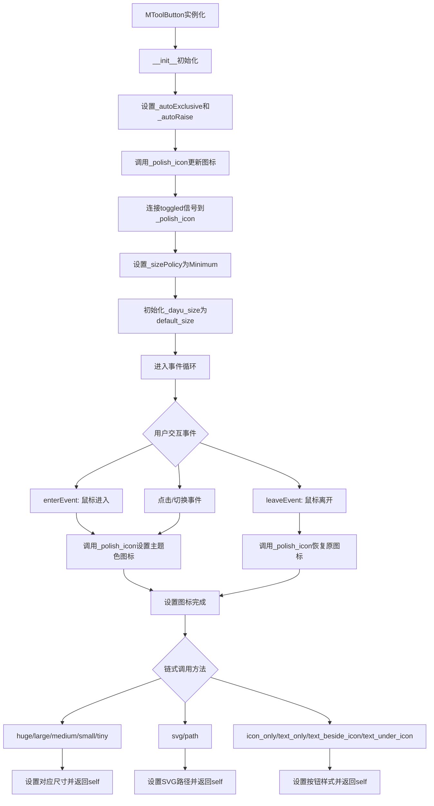

## 类结构

```
QtWidgets.QToolButton (Qt基类)
└── MToolButton (自定义扩展类, @cursor_mixin装饰器)
```

## 全局变量及字段


### `dayu_theme.default_size`
    
Default size setting for MToolButton components

类型：`int`
    


### `dayu_theme.primary_color`
    
Primary color used for highlighting icons on hover or checked state

类型：`QColor or str`
    


### `dayu_theme.huge`
    
Huge size preset value for MToolButton

类型：`int`
    


### `dayu_theme.large`
    
Large size preset value for MToolButton

类型：`int`
    


### `dayu_theme.medium`
    
Medium size preset value for MToolButton

类型：`int`
    


### `dayu_theme.small`
    
Small size preset value for MToolButton

类型：`int`
    


### `dayu_theme.tiny`
    
Tiny size preset value for MToolButton

类型：`int`
    


### `MToolButton._dayu_svg`
    
Stores the SVG file path for the button icon

类型：`str or None`
    


### `MToolButton._dayu_size`
    
Stores the current size dimension of the tool button

类型：`int`
    
    

## 全局函数及方法


### `MIcon` (from `.qt` module)

`MIcon` 是从 `.qt` 模块导入的图标类，用于根据 SVG 路径和可选颜色创建 Qt 图标对象。在 `MToolButton` 中主要用于设置按钮的图标样式，支持主色调高亮显示。

参数：

-  `path`：`str`，SVG 文件路径或路径字符串，用于指定图标资源
-  `color`：`QColor` 或 `str`（可选），图标颜色，默认为 `None`

返回值：`QIcon`，返回创建的 Qt 图标对象

#### 流程图

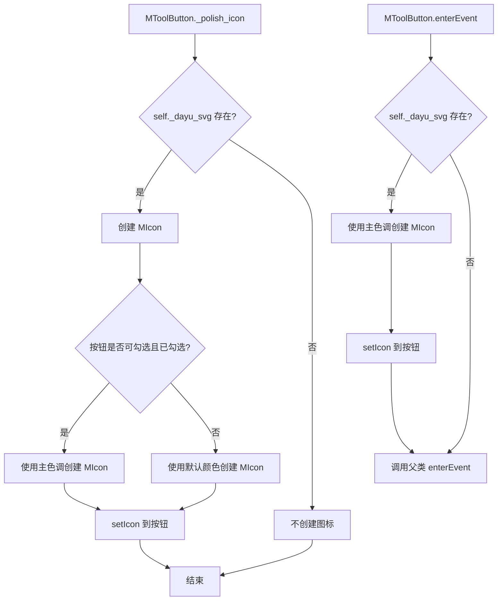

#### 带注释源码

```python
# MIcon 是从 .qt 模块导入的图标类
# 源码不在当前文件中，以下为使用示例和推断的实现逻辑

# 使用方式 1: 使用默认颜色
icon = MIcon(self._dayu_svg)
self.setIcon(icon)

# 使用方式 2: 使用主色调（高亮）
icon = MIcon(self._dayu_svg, dayu_theme.primary_color)
self.setIcon(icon)

# MIcon 类的推断定义（实际实现见 .qt 模块）
class MIcon:
    """
    图标类，用于创建支持 SVG 路径和颜色定制的 Qt 图标
    
    Args:
        path: SVG 文件路径
        color: 可选的颜色值，可以是 QColor 对象或颜色字符串
    """
    
    def __init__(self, path, color=None):
        """
        初始化 MIcon
        
        Args:
            path: str, SVG 图标路径
            color: QColor 或 str, 可选的颜色参数
        """
        self._path = path
        self._color = color
        # 内部会调用 Qt 的 QIcon 或 QPixmap 相关 API 创建图标
        # 如果提供了 color，可能会使用 QtSvg 或 QPainter 渲染 SVG 为指定颜色
    
    # 返回值应为 Qt 的 QIcon 对象，用于 QToolButton.setIcon()
```


### `cursor_mixin`

这是一个装饰器函数，用于为 `MToolButton` 类添加鼠标光标交互功能。当鼠标进入或离开按钮时，能够自动改变光标样式。

参数：

- `cls`：`type`，被装饰的类（通常是 `MToolButton` 或其他 Qt 控件类）

返回值：`type`，返回修改后的类，添加了光标交互能力

#### 流程图

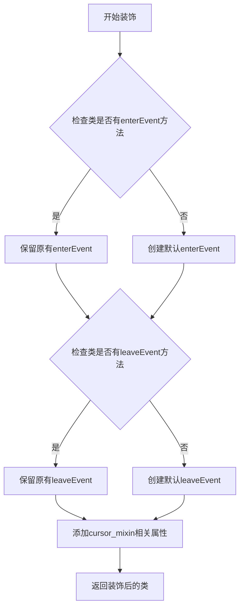

#### 带注释源码

```python
# 从.mixin模块导入cursor_mixin装饰器
# 该装饰器用于为Qt控件添加鼠标光标交互功能
from .mixin import cursor_mixin

# 使用cursor_mixin装饰MToolButton类
# 装饰后该类将具有鼠标悬停时改变光标的能力
@cursor_mixin
class MToolButton(QtWidgets.QToolButton):
    """MToolButton"""
    
    def __init__(self, parent=None):
        super(MToolButton, self).__init__(parent=parent)
        self._dayu_svg = None
        self.setAutoExclusive(False)
        self.setAutoRaise(True)
        
        self._polish_icon()
        self.toggled.connect(self._polish_icon)
        self.setSizePolicy(QtWidgets.QSizePolicy.Minimum, QtWidgets.QSizePolicy.Minimum)
        
        self._dayu_size = dayu_theme.default_size
    
    # enterEvent被cursor_mixin装饰器增强
    # 当鼠标进入按钮区域时触发
    def enterEvent(self, event):
        """Override enter event to highlight the icon"""
        if self._dayu_svg:
            self.setIcon(MIcon(self._dayu_svg, dayu_theme.primary_color))
        return super(MToolButton, self).enterEvent(event)
    
    # leaveEvent被cursor_mixin装饰器增强
    # 当鼠标离开按钮区域时触发
    def leaveEvent(self, event):
        """Override leave event to recover the icon"""
        self._polish_icon()
        return super(MToolButton, self).leaveEvent(event)
```


### `MToolButton.__init__`

该方法是MToolButton类的构造函数，负责初始化工具按钮的各项属性和行为，包括设置父窗口、处理SVG图标、配置按钮样式、连接信号槽以及设置默认尺寸策略。

参数：

- `parent`：`QtWidgets.QWidget`，父窗口部件，默认为None，用于指定工具按钮的父对象

返回值：`None`，构造函数无返回值

#### 流程图

```mermaid
flowchart TD
    A[开始 __init__] --> B[调用父类QToolButton的构造函数<br/>super(MToolButton, self).__init__(parent=parent)]
    B --> C[初始化_dayu_svg为None]
    C --> D[设置AutoExclusive为False<br/>setAutoExclusive(False)]
    D --> E[设置AutoRaise为True<br/>setAutoRaise(True)]
    E --> F[调用_polish_icon方法<br/>处理图标样式]
    F --> G[连接toggled信号到_polish_icon槽函数]
    G --> H[设置大小策略为Minimum<br/>setSizePolicy]
    H --> I[从dayu_theme获取default_size<br/>赋值给_dayu_size]
    I --> J[结束 __init__]
    
    style A fill:#f9f,color:#000
    style J fill:#9f9,color:#000
```

#### 带注释源码

```python
@cursor_mixin
class MToolButton(QtWidgets.QToolButton):
    """MToolButton"""
    
    def __init__(self, parent=None):
        """
        初始化MToolButton工具按钮
        
        参数:
            parent: 父窗口部件,默认为None
        """
        # 调用父类QToolButton的构造函数,传递parent参数
        super(MToolButton, self).__init__(parent=parent)
        
        # 初始化私有属性:存储SVG图标路径,初始为None表示未设置图标
        self._dayu_svg = None
        
        # 设置按钮为非互斥模式,允许同时选中多个工具按钮
        self.setAutoExclusive(False)
        
        # 启用自动悬浮提升效果,鼠标悬停时自动高亮按钮
        self.setAutoRaise(True)
        
        # 调用内部方法根据当前状态(checked/unckecked)设置图标样式
        self._polish_icon()
        
        # 连接toggled信号到_polish_icon槽函数
        # 当按钮的checked状态改变时自动更新图标样式
        self.toggled.connect(self._polish_icon)
        
        # 设置大小策略为Minimum水平最小、垂直最小
        # 允许按钮收缩到其最小合理尺寸
        self.setSizePolicy(QtWidgets.QSizePolicy.Minimum, QtWidgets.QSizePolicy.Minimum)
        
        # 从dayu_theme模块获取默认尺寸并赋值给_dayu_size属性
        self._dayu_size = dayu_theme.default_size
```


### `MToolButton._polish_icon`

该方法是一个私有槽函数，用于根据按钮的选中状态动态调整图标显示样式，当按钮可被选中且处于选中状态时显示主色调图标，否则显示默认图标。

参数：

- `checked`：`bool | None`，可选参数，表示按钮的选中状态，默认为 None

返回值：`None`，无返回值，仅通过副作用修改按钮的图标显示

#### 流程图

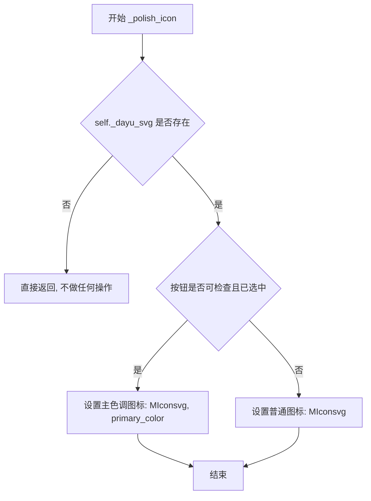

#### 带注释源码

```python
@QtCore.Slot(bool)
def _polish_icon(self, checked=None):
    """
    根据按钮的选中状态调整图标显示样式
    
    参数:
        checked: bool 或 None, 表示按钮的选中状态
                 当通过信号触发时,会传递实际的checked值
                 当手动调用时,默认为None
    
    返回值:
        None
    
    处理逻辑:
        1. 首先检查是否存在自定义SVG路径(_dayu_svg)
        2. 如果存在,则进一步判断按钮状态
        3. 对于可检查的按钮且当前处于选中状态时,
           使用主题主色调(primary_color)渲染图标以示区分
        4. 其他情况使用普通图标
    """
    # 检查是否存在自定义SVG图标路径
    if self._dayu_svg:
        # 判断按钮是否为可检查(checkable)类型且当前处于选中(checked)状态
        if self.isCheckable() and self.isChecked():
            # 选中状态:使用主色调渲染图标,提供视觉反馈
            self.setIcon(MIcon(self._dayu_svg, dayu_theme.primary_color))
        else:
            # 非选中状态:使用默认方式渲染图标
            self.setIcon(MIcon(self._dayu_svg))
    # 如果没有设置SVG路径,则不执行任何图标操作
```


### `MToolButton.enterEvent`

该方法用于处理鼠标进入工具按钮的事件，当鼠标悬停时将图标高亮显示为品牌色（primary_color），并在完成后调用父类的enterEvent方法。

参数：

- `event`：`QtCore.QEvent`，Qt框架的鼠标进入事件对象，包含事件的元数据

返回值：`None`，该方法无返回值，主要通过副作用（设置图标）完成功能

#### 流程图

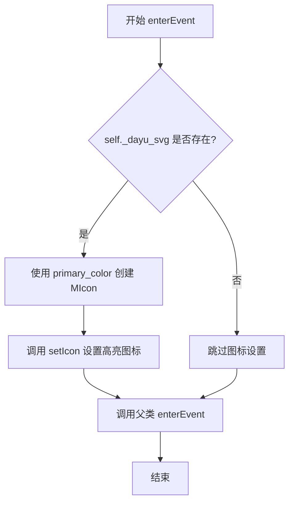

#### 带注释源码

```python
def enterEvent(self, event):
    """
    Override enter event to highlight the icon
    
    当鼠标进入工具按钮区域时触发此事件，用于实现鼠标悬停时的图标高亮效果。
    如果当前设置了SVG图标路径，则将图标颜色切换为品牌色以提供视觉反馈。
    
    参数:
        event: QtCore.QEvent - Qt框架的事件对象，包含鼠标进入事件的详细信息
    
    返回值:
        None - 该方法通过直接修改对象状态（图标）完成功能，无返回值
    """
    # 检查是否设置了SVG图标路径
    if self._dayu_svg:
        # 使用品牌色创建高亮图标并设置到按钮上
        # dayu_theme.primary_color 通常为品牌主色调，用于交互反馈
        self.setIcon(MIcon(self._dayu_svg, dayu_theme.primary_color))
    
    # 调用父类的enterEvent方法，确保Qt框架的默认行为得到执行
    # 这是一个重要的最佳实践：重写事件方法时需要调用父类实现
    return super(MToolButton, self).enterEvent(event)
```


### `MToolButton.leaveEvent`

重写离开事件，当鼠标离开工具按钮时恢复图标的显示状态。

参数：

-  `event`：`QtCore.QEvent`，鼠标离开事件对象，包含事件的类型和属性信息

返回值：`None`，无返回值（调用父类 leaveEvent 的返回值）

#### 流程图

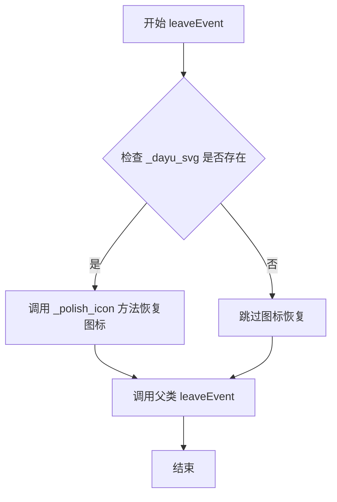

#### 带注释源码

```python
def leaveEvent(self, event):
    """
    Override leave event to recover the icon
    
    当鼠标离开工具按钮区域时触发此事件，
    用于恢复图标到普通状态（移除高亮颜色）
    
    Args:
        event: QtCore.QEvent，鼠标离开事件对象
        
    Returns:
        None，调用父类的 leaveEvent 方法（父类返回值为 void）
    """
    # 调用 _polish_icon 方法恢复图标状态
    # 如果按钮是 checkable 且处于 checked 状态，会应用 primary_color
    # 否则应用默认颜色（实现图标恢复效果）
    self._polish_icon()
    
    # 调用父类的 leaveEvent 方法，保持 Qt 事件处理链的完整性
    return super(MToolButton, self).leaveEvent(event)
```


### `MToolButton.get_dayu_size`

获取工具按钮的尺寸大小

参数：

- 无（仅包含隐式参数 `self`）

返回值：`int`，返回工具按钮的当前尺寸大小

#### 流程图

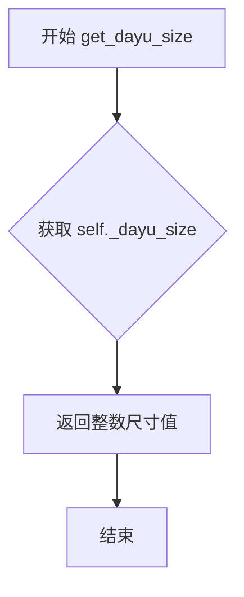

#### 带注释源码

```python
def get_dayu_size(self):
    """
    获取工具按钮的尺寸大小
    :return: integer 工具按钮的尺寸值
    """
    # 直接返回内部存储的 _dayu_size 属性值
    # 该值在初始化时由 dayu_theme.default_size 设置
    # 可以通过 set_dayu_size 方法进行修改
    return self._dayu_size
```


### `MToolButton.set_dayu_size`

设置工具按钮的尺寸大小，同时根据按钮样式更新固定尺寸和图标大小。

参数：

- `value`：`int`，要设置的按钮尺寸值

返回值：`None`，无返回值

#### 流程图

```mermaid
flowchart TD
    A[开始 set_dayu_size] --> B[赋值 self._dayu_size = value]
    B --> C[调用 self.style().polish self]
    C --> D{检查按钮样式是否为 IconOnly}
    D -->|是| E[设置固定尺寸 setFixedSize]
    E --> F[设置图标尺寸 setIconSize]
    D -->|否| G[结束]
    F --> G
```

#### 带注释源码

```python
def set_dayu_size(self, value):
    """
    Set the tool button size.
    :param value: integer
    :return: None
    """
    # 1. 保存尺寸值到内部变量
    self._dayu_size = value
    
    # 2. 调用Qt样式系统刷新按钮外观
    # polish方法会重新应用样式主题
    self.style().polish(self)
    
    # 3. 判断当前按钮样式是否为仅显示图标模式
    if self.toolButtonStyle() == QtCore.Qt.ToolButtonIconOnly:
        # 4. 在图标模式下，需要同时设置固定尺寸和图标尺寸
        # 使图标与按钮尺寸保持一致
        self.setFixedSize(QtCore.QSize(self._dayu_size, self._dayu_size))
        self.setIconSize(QtCore.QSize(self._dayu_size, self._dayu_size))
```


### `MToolButton.get_dayu_svg`

获取当前工具按钮关联的SVG图标路径。

参数：
- 无

返回值：`str` 或 `None`，返回当前设置的SVG文件路径，如果未设置则返回 `None`。

#### 流程图

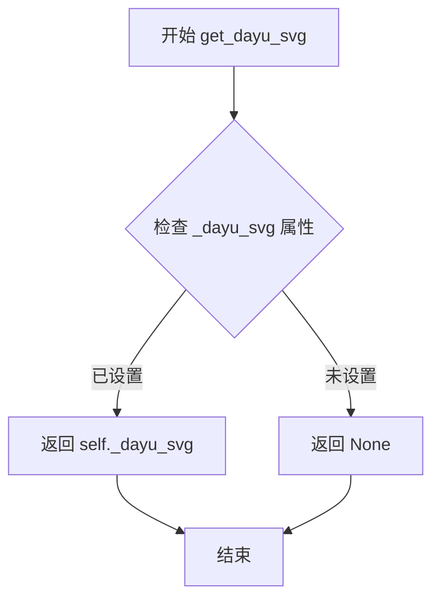

#### 带注释源码

```python
def get_dayu_svg(self):
    """Get current svg path"""
    # 直接返回内部保存的 SVG 路径属性
    # _dayu_svg 在 __init__ 中初始化为 None
    # 通过 set_dayu_svg 方法可以设置该值
    return self._dayu_svg
```


### `MToolButton.set_dayu_svg`

设置工具按钮的SVG图标路径，并立即刷新图标显示。

参数：

- `path`：`str`，要设置的SVG文件路径

返回值：`None`，无返回值

#### 流程图

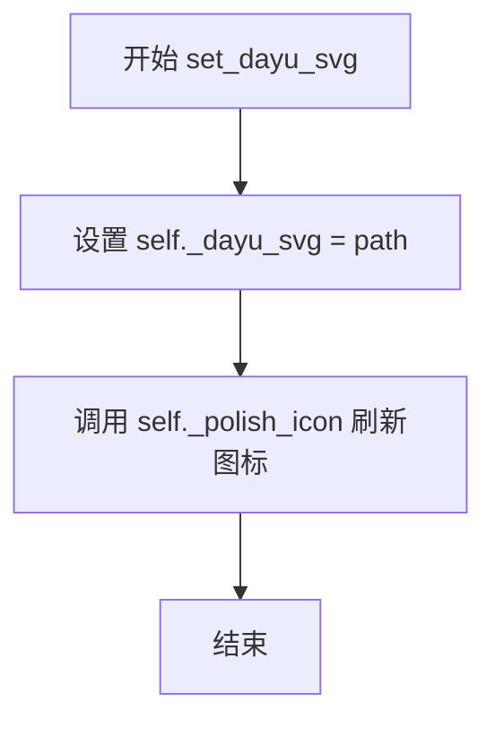

#### 带注释源码

```python
def set_dayu_svg(self, path):
    """Set current svg path"""
    self._dayu_svg = path          # 保存SVG路径到私有属性
    self._polish_icon()             # 立即调用图标刷新方法更新显示
```


### `MToolButton.huge`

将 MToolButton 组件设置为巨大尺寸（huge），并返回实例本身以支持链式调用。

参数：
- 无

返回值：`MToolButton`，返回实例本身（self），支持链式调用。

#### 流程图

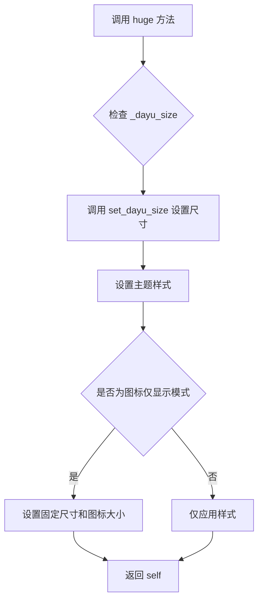

#### 带注释源码

```python
def huge(self):
    """Set MToolButton to huge size"""
    # 调用 set_dayu_size 方法，传入 dayu_theme.huge 常量作为参数
    # 该方法会：
    # 1. 更新内部 _dayu_size 属性
    # 2. 调用 style().polish(self) 应用主题样式
    # 3. 如果当前按钮风格为 ToolButtonIconOnly，则设置固定尺寸和图标大小
    # 4. 返回 self，支持链式调用
    self.set_dayu_size(dayu_theme.huge)
    # 返回实例本身，允许如 button.huge().svg('icon.svg') 的链式调用
    return self
```


### `MToolButton.large`

设置工具按钮的尺寸为“大”级别，支持链式调用。

参数：

- 此方法无显式参数（`self` 为隐式参数）

返回值：`MToolButton`，返回自身实例以支持链式调用方法

#### 流程图

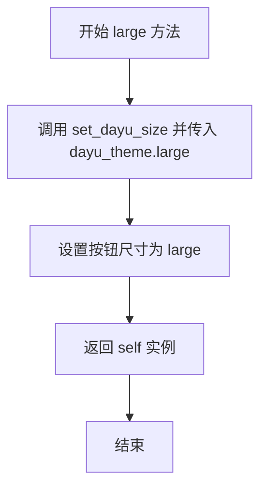

#### 带注释源码

```python
def large(self):
    """Set MToolButton to large size"""
    # 调用内部方法 set_dayu_size，传入大尺寸常量
    self.set_dayu_size(dayu_theme.large)
    # 返回 self 以支持链式调用（例如 button.large().svg('icon.svg')）
    return self
```


### `MToolButton.medium`

设置工具按钮为中等大小，并返回自身以支持链式调用。

参数：

- 无参数（除了隐含的 `self`）

返回值：`MToolButton`，返回按钮自身，用于链式调用。

#### 流程图

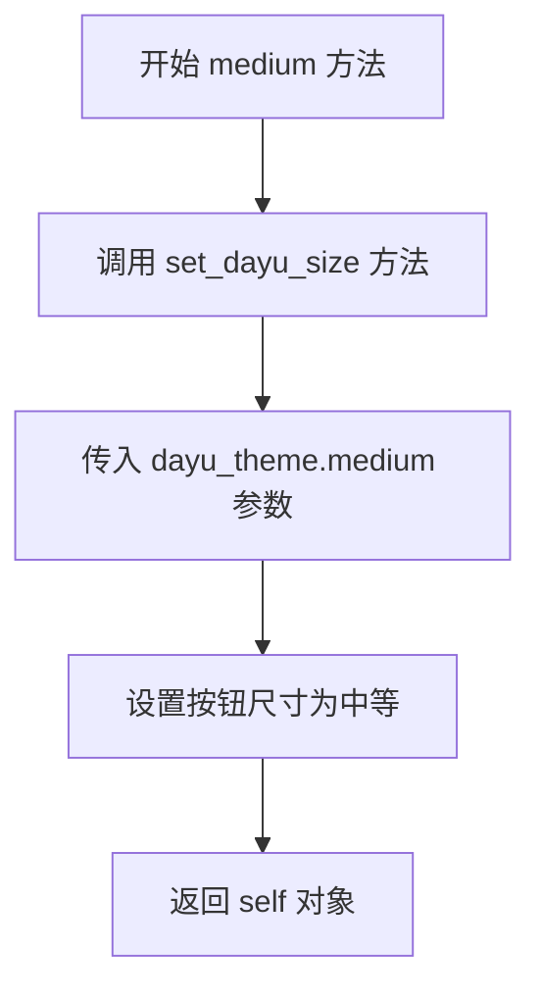

#### 带注释源码

```python
def medium(self):
    """Set MToolButton to  medium size"""
    # 调用 set_dayu_size 方法，将按钮尺寸设置为中等大小
    # dayu_theme.medium 是预定义的中等尺寸常量
    self.set_dayu_size(dayu_theme.medium)
    # 返回 self 本身，实现链式调用（例如：button.medium().svg('icon.svg')）
    return self
```


### `MToolButton.small`

设置 MToolButton 为小尺寸，并返回实例本身以支持链式调用。

参数：

- `self`：`MToolButton`，调用此方法的实例对象

返回值：`MToolButton`，返回实例本身（self），支持链式调用

#### 流程图

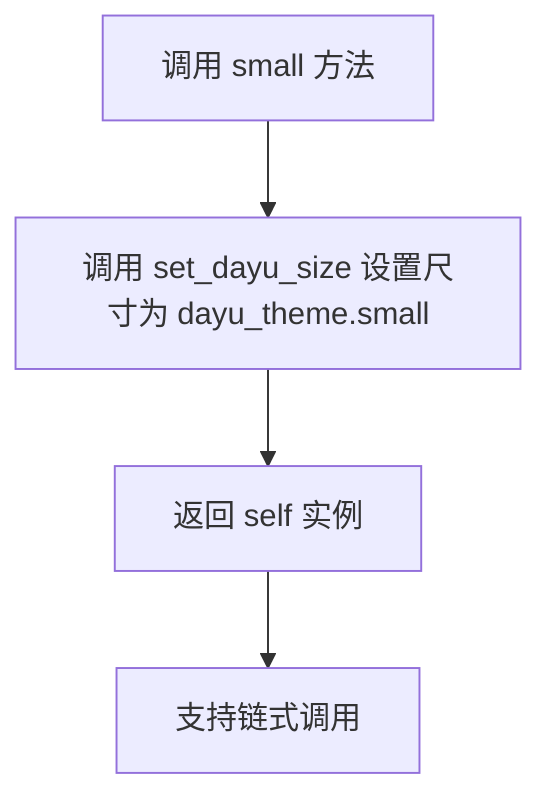

#### 带注释源码

```python
def small(self):
    """Set MToolButton to small size"""
    # 调用 set_dayu_size 方法，将工具按钮的尺寸设置为 dayu_theme.small（小尺寸）
    self.set_dayu_size(dayu_theme.small)
    # 返回实例本身（self），以支持方法链式调用，例如 button.small().svg('icon.svg')
    return self
```


### `MToolButton.tiny`

设置工具按钮为微小(tiny)尺寸，并返回自身以支持链式调用。

参数： 无

返回值：`MToolButton`，返回自身实例，支持链式调用

#### 流程图

```mermaid
flowchart TD
    A[tiny方法被调用] --> B{检查尺寸配置}
    B --> C[调用set_dayu_size方法]
    C --> D[设置_dayu_size为dayu_theme.tiny]
    D --> E[调用style().polish刷新样式]
    E --> F{检查当前按钮样式}
    F --> G[如果为IconOnly模式则更新固定尺寸和图标大小]
    G --> H[返回self实例]
    H --> I[支持链式调用]
```

#### 带注释源码

```python
def tiny(self):
    """Set MToolButton to tiny size"""
    # 将工具按钮的尺寸设置为tiny级别（从dayu_theme模块获取）
    self.set_dayu_size(dayu_theme.tiny)
    # 返回self以支持链式调用，例如：button.tiny().svg('icon.svg')
    return self
```

---

### 补充：MToolButton类完整设计文档

#### 1. 核心功能概述
MToolButton是一个基于PySide6.QtWidgets.QToolButton的增强型工具按钮组件，提供了链式API fluent interface设计，支持SVG图标动态切换、多种尺寸规格（tiny/small/medium/large/huge）以及多种显示样式（图标仅显示/文字仅显示/文字在图标旁/文字在图标下）的灵活配置。

#### 2. 文件运行流程

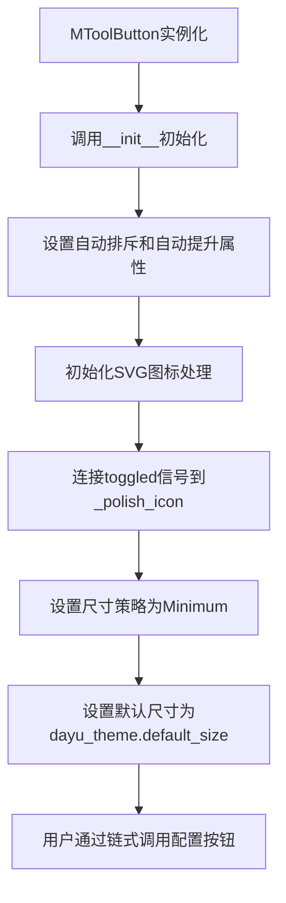

#### 3. 类详细信息

**类名：** MToolButton  
**父类：** QtWidgets.QToolButton  
**功能：** 增强型工具按钮组件，支持Fluent API链式调用

##### 类字段

| 字段名 | 类型 | 描述 |
|--------|------|------|
| `_dayu_svg` | str 或 None | 存储当前SVG图标路径 |
| `_dayu_size` | int | 存储当前按钮尺寸规格 |

##### 全局依赖

| 名称 | 类型 | 描述 |
|------|------|------|
| `dayu_theme` | 模块 | 主题配置模块，提供尺寸常量 |
| `cursor_mixin` | 装饰器类 | 光标交互混入类 |
| `MIcon` | 类 | 图标组件封装类 |

##### 类方法

| 方法名 | 功能 |
|--------|------|
| `__init__` | 初始化工具按钮基础属性和状态 |
| `_polish_icon` | 根据选中状态更新图标颜色 |
| `enterEvent` | 鼠标进入时高亮图标 |
| `leaveEvent` | 鼠标离开时恢复图标状态 |
| `get_dayu_size` | 获取当前按钮尺寸 |
| `set_dayu_size` | 设置按钮尺寸并刷新样式 |
| `get_dayu_svg` | 获取当前SVG路径 |
| `set_dayu_svg` | 设置SVG路径并更新图标 |
| `huge` | 设置为huge尺寸 |
| `large` | 设置为large尺寸 |
| `medium` | 设置为medium尺寸 |
| `small` | 设置为small尺寸 |
| `tiny` | 设置为tiny尺寸 |
| `svg` | 设置SVG图标路径 |
| `icon_only` | 仅显示图标模式 |
| `text_only` | 仅显示文字模式 |
| `text_beside_icon` | 文字在图标旁 |
| `text_under_icon` | 文字在图标下 |

#### 4. 关键组件信息

| 组件名称 | 功能描述 |
|----------|----------|
| `dayu_size` QtProperty | Qt属性系统封装，支持Qt样式表和Qt Designer集成 |
| `_polish_icon` | 图标着色核心逻辑，处理选中/未选中/悬停状态 |
| 链式API | 通过返回self实现流畅的链式调用体验 |

#### 5. 潜在技术债务与优化空间

1. **尺寸同步问题**：`set_dayu_size`方法中仅在`ToolButtonIconOnly`模式下更新固定尺寸，其他模式下可能存在尺寸不一致
2. **信号冗余**：toggled信号每次状态改变都会触发`_polish_icon`，即使SVG未变化也会执行，建议增加dirty check
3. **硬编码颜色**：primary_color直接写入逻辑，建议通过主题系统配置
4. **返回值不一致**：部分方法返回None，部分返回self，文档可更清晰标注

#### 6. 其它设计说明

**设计目标：**
- 提供统一风格的工具按钮组件
- 支持链式调用简化UI构建代码
- 集成SVG矢量图标支持

**错误处理：**
- dayu_theme.tiny等尺寸常量不存在时会导致AttributeError，建议添加默认值 fallback
- SVG路径无效时MIcon可能抛出异常

**数据流：**
```
用户调用tiny() 
  → set_dayu_size(dayu_theme.tiny) 
  → 更新_dayu_size属性 
  → style().polish刷新 
  → 如果是IconOnly模式则更新尺寸
  → 返回self
```

**外部依赖：**
- PySide6.QtCore
- PySide6.QtWidgets
- 本地模块：dayu_theme, cursor_mixin, MIcon


### `MToolButton.svg`

设置工具按钮的SVG图标路径，并返回自身以支持链式调用。

参数：

-  `path`：`str`，SVG图标的文件路径

返回值：`MToolButton`，返回自身实例，支持链式调用

#### 流程图

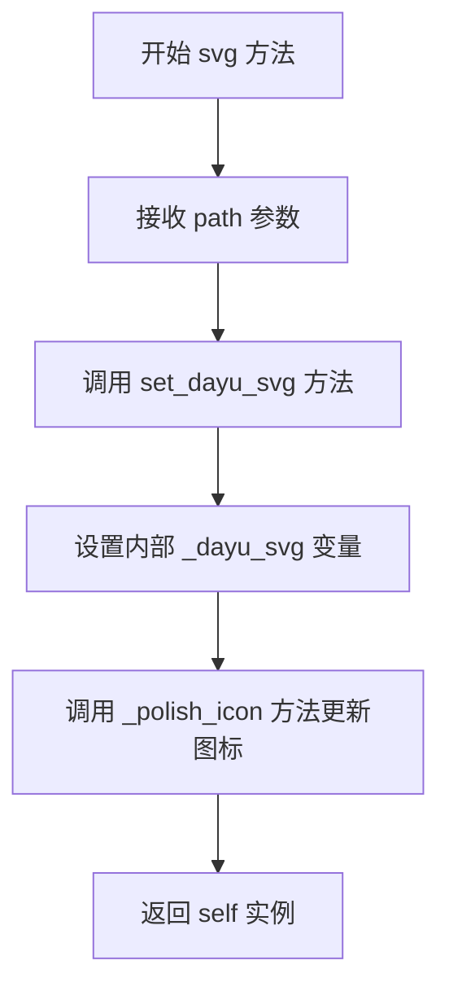

#### 带注释源码

```python
def svg(self, path):
    """Set current svg path"""
    # 调用内部方法设置SVG路径
    self.set_dayu_svg(path)
    # 返回自身实例，支持链式调用（如 button.svg('icon.svg').huge().large()）
    return self
```

---

### 补充说明

**方法功能简述**：
`svg` 方法是 `MToolButton` 类的链式配置方法之一，用于设置工具按钮显示的SVG图标。该方法的设计遵循了 fluent interface（流式接口）模式，通过返回 `self` 允许开发者连续调用多个配置方法，使代码更加简洁易读。

**使用示例**：
```python
button = MToolButton()
button.svg('icon.svg').huge().text_beside_icon()
```


### `MToolButton.icon_only`

设置工具按钮为仅显示图标模式

参数：

- 该方法无显式参数（隐式参数 `self` 为 `MToolButton` 实例）

返回值：`MToolButton`，返回自身实例以支持链式调用（如 `button.icon_only().svg('path/to/icon.svg')`）

#### 流程图

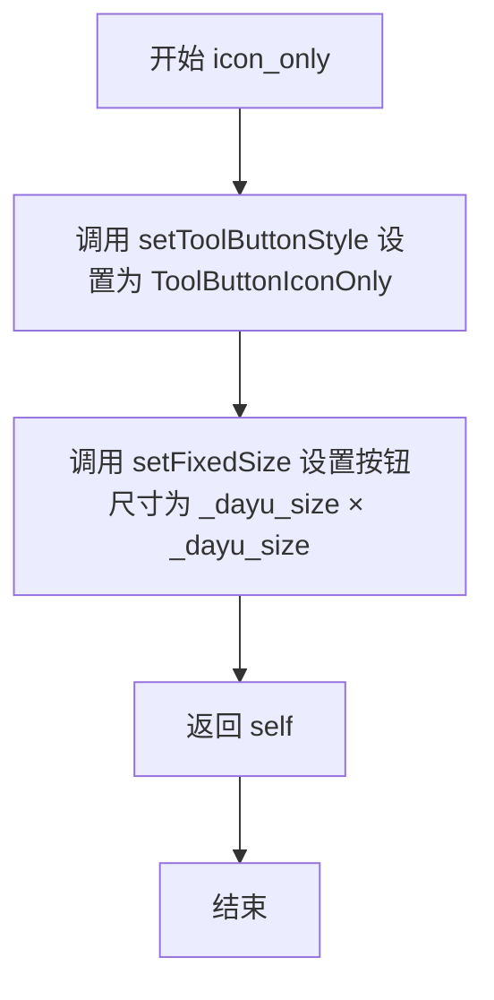

#### 带注释源码

```python
def icon_only(self):
    """Set tool button style to icon only"""
    # 设置按钮显示样式为仅显示图标模式（ToolButtonIconOnly）
    self.setToolButtonStyle(QtCore.Qt.ToolButtonIconOnly)
    # 根据当前 _dayu_size 设置按钮的固定宽高尺寸
    self.setFixedSize(QtCore.QSize(self._dayu_size, self._dayu_size))
    # 返回自身实例，支持链式调用
    return self
```


### `MToolButton.text_only`

设置工具按钮的显示样式为仅显示文本，隐藏图标。

参数：
- 无参数

返回值：`MToolButton`，返回工具按钮实例本身，支持链式调用。

#### 流程图

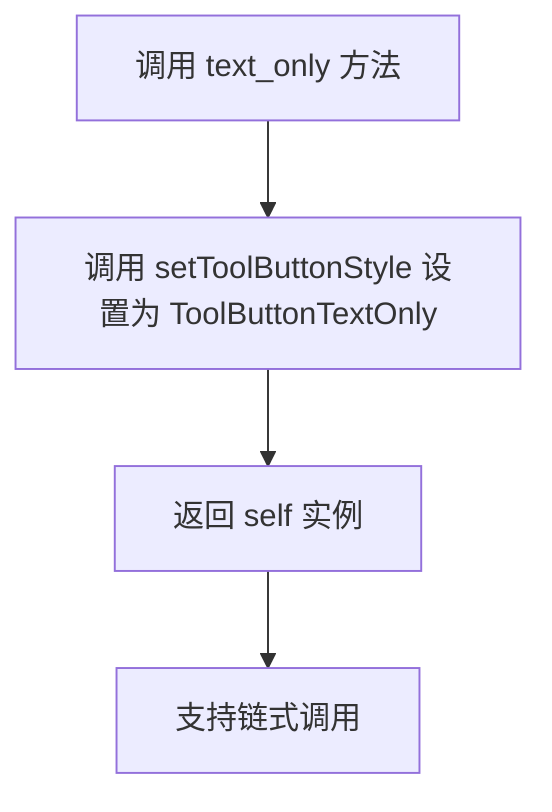

#### 带注释源码

```python
def text_only(self):
    """Set tool button style to text only"""
    # 设置工具按钮的显示模式为仅显示文本
    # Qt.ToolButtonTextOnly = 2，表示按钮只显示文字，不显示图标
    self.setToolButtonStyle(QtCore.Qt.ToolButtonTextOnly)
    
    # 返回 self 本身，以支持方法的链式调用
    # 例如：button.text_only().set_dayu_size(20)
    return self
```


### `MToolButton.text_beside_icon`

设置工具按钮的显示样式为文本位于图标旁边（ToolButtonTextBesideIcon），并返回自身以支持链式调用。

参数：无需参数

返回值：`MToolButton`，返回工具按钮实例自身，用于支持链式调用（例如 `button.text_beside_icon().large().svg('icon.svg')`）

#### 流程图

```mermaid
graph TD
    A[开始 text_beside_icon] --> B[调用 setToolButtonStyle<br/>参数: QtCore.Qt.ToolButtonTextBesideIcon]
    B --> C[设置按钮样式为文本在图标旁边]
    C --> D[返回 self (MToolButton实例)]
    D --> E[结束]
    
    style A fill:#f9f,stroke:#333
    style E fill:#9f9,stroke:#333
```

#### 带注释源码

```python
def text_beside_icon(self):
    """Set tool button style to text beside icon"""
    # 设置工具按钮的显示样式为文本在图标旁边
    # Qt.ToolButtonTextBesideIcon 是 QtCore.Qt 中的枚举值
    # 表示按钮同时显示图标和文本，且文本位于图标旁边
    self.setToolButtonStyle(QtCore.Qt.ToolButtonTextBesideIcon)
    
    # 返回 self 以支持链式调用
    # 允许用户连续调用多个方法，如 button.text_beside_icon().large()
    return self
```


### `MToolButton.text_under_icon`

设置工具按钮的显示样式为文本在图标下方的模式（ToolButtonTextUnderIcon），并返回自身以支持方法链式调用。

参数：

- `self`：`MToolButton`，隐式参数，表示当前工具按钮实例本身

返回值：`MToolButton`，返回当前实例，支持链式调用

#### 流程图

```mermaid
flowchart TD
    A[开始] --> B[调用 setToolButtonStyle 设置为 Qt.ToolButtonTextUnderIcon]
    B --> C[返回 self]
    C --> D[结束]
```

#### 带注释源码

```python
def text_under_icon(self):
    """Set tool button style to text under icon"""
    # 设置工具按钮的样式为文本在图标下方
    # QtCore.Qt.ToolButtonTextUnderIcon 是 Qt 定义的一个枚举值
    # 表示按钮显示时图标在上、文本在下的布局方式
    self.setToolButtonStyle(QtCore.Qt.ToolButtonTextUnderIcon)
    # 返回 self 以支持方法链式调用，例如 button.text_under_icon().large()
    return self
```

## 关键组件


### MToolButton 类

核心自定义工具按钮组件，继承自QtWidgets.QToolButton，提供链式API fluent interface，用于创建支持SVG图标、主题样式和多种显示模式的工具按钮。

### 图标状态管理 (_polish_icon 方法)

处理工具按钮的图标状态，根据选中状态（checked）切换图标颜色，使用主色调（primary_color）表示选中或悬停状态。

### 鼠标悬停效果 (enterEvent/leaveEvent)

重写Qt事件处理方法，鼠标进入时高亮图标（使用主题主色），离开时恢复原始图标状态。

### 大小属性系统 (dayu_size Property)

通过QtProperty实现可绑定的size属性，支持整数类型的大小设置，内部维护_dayu_size字段并通过样式策略（style().polish）应用大小变化。

### 链式配置API

提供fluent interface设计模式，包括huge()/large()/medium()/small()/tiny()设置尺寸，icon_only()/text_only()/text_beside_icon()/text_under_icon()设置显示样式，svg()设置图标路径，均返回self实现链式调用。

### SVG图标加载 (set_dayu_svg/get_dayu_svg)

维护私有属性_dayu_svg存储SVG路径，通过MIcon类将SVG路径转换为Qt图标对象，支持动态刷新图标。

### 主题集成 (dayu_theme)

依赖外部主题模块获取default_size、primary_color、huge、large、medium、small、tiny等主题常量，保持组件与整体设计系统的一致性。

### 混入类 (cursor_mixin)

通过装饰器应用的光标混入类，为工具按钮添加额外的光标交互能力。


## 问题及建议


### 已知问题

- **enterEvent逻辑不完整**：在`enterEvent`中直接设置`primary_color`，没有考虑`isCheckable()`和`isChecked()`的状态，与`_polish_icon`的逻辑不一致，导致鼠标悬停时可能覆盖选中态的图标颜色
- **_polish_icon方法参数未使用**：方法签名包含`checked`参数但实际未使用，造成代码冗余
- **leaveEvent调用逻辑错误**：`leaveEvent`调用`_polish_icon()`时未传递参数，但该方法在`toggled`信号触发时接收`checked`参数，调用方式不一致可能导致状态判断异常
- **大小设置代码重复**：`set_dayu_size`和`icon_only`方法中都有设置`setFixedSize`和`iconSize`的代码，未提取为公共方法
- **缺少类型注解**：所有方法均无类型提示（type hints），降低代码可维护性和IDE支持
- **dayu_size和dayu_svg属性冗余**：同时存在`dayu_size`属性和`get_dayu_size/set_dayu_size`方法，以及`dayu_svg`方法（`svg()`）和`get_dayu_svg/set_dayu_svg`方法，API设计冗余
- **hardcoded颜色逻辑**：图标颜色处理硬编码`dayu_theme.primary_color`，缺乏灵活性

### 优化建议

- 修复`enterEvent`逻辑，与`_polish_icon`保持一致，区分checkable状态处理
- 移除`_polish_icon`方法中未使用的`checked`参数，或在适当场景使用
- 提取公共的大小设置代码到私有方法中
- 添加Python类型注解（typing）
- 考虑统一API设计，保留一种命名风格
- 将颜色配置外部化，支持主题定制

## 其它


### 设计目标与约束

本组件旨在提供一个功能丰富的工具按钮（ToolButton）控件，支持自定义SVG图标、多种尺寸规格、灵活的样式布局（仅图标、仅文本、图标+文本等），并与Dayu主题系统集成。设计约束包括：必须基于PySide6框架，继承自QtWidgets.QToolButton，图标通过MIcon组件加载，支持链式调用API设计。

### 错误处理与异常设计

代码中错误处理较为简单，主要通过条件判断避免异常。例如在`_polish_icon`方法中检查`_dayu_svg`是否存在，在`enterEvent`和`leaveEvent`中检查`_dayu_svg`是否为None。未使用try-except捕获异常，依赖Qt框架的内部错误处理。建议：在set_dayu_svg方法中可以增加文件路径有效性检查，在set_dayu_size方法中可以增加数值范围校验。

### 数据流与状态机

MToolButton的状态包括：普通状态、悬停状态（enterEvent触发）、按下状态（checkable且checked）、禁用状态。数据流：_dayu_svg存储SVG路径→_polish_icon方法根据状态渲染图标→setIcon设置最终图标。状态转换：普通→悬停（鼠标进入）→普通（鼠标离开）；普通→按下（toggle）→普通（再次toggle）。

### 外部依赖与接口契约

外部依赖包括：PySide6.QtCore和PySide6.QtWidgets（Qt框架核心组件）、dayu_theme模块（主题配置，包含default_size、primary_color、huge、large、medium、small、tiny等尺寸常量）、cursor_mixin mixin类（提供鼠标样式混入功能）、MIcon类（SVG图标加载与渲染）。接口契约：所有setter方法（set_dayu_size、set_dayu_svg）无返回值，chain方法（huge、large、medium、small、tiny、svg、icon_only等）返回self以支持链式调用。

### 性能考虑

组件使用Qt的Property机制实现dayu_size属性，确保与Qt样式系统集成。图标渲染在每次状态变化时调用，可能存在频繁创建MIcon对象的开销，建议考虑图标缓存机制。set_dayu_size中调用style().polish(self)会触发样式重绘，应注意批量操作时的性能影响。

### 线程安全性

代码未涉及多线程操作，Qt的UI组件必须在主线程中操作，因此不存在线程安全问题。但需注意：如果外部代码从非主线程调用本组件方法，可能导致未定义行为，应在文档中明确说明。

### 兼容性考虑

代码基于PySide6（Qt6），使用了一些Qt6特有的API（如QtCore.Slot装饰器）。对于Qt5/PySide2的兼容性可能存在问题，需要进行适配。代码中使用了类型注解（property type: int），但Python版本需3.5+才能支持。建议：明确最低Qt版本和Python版本要求。

### 使用示例

```python
# 基本用法
button = MToolButton()
button.svg("path/to/icon.svg")
button.large()

# 链式调用
button = MToolButton().svg("path/to/icon.svg").huge().text_beside_icon()

# 可检查按钮
button.setCheckable(True)
button.toggled.connect(callback)
```

    