# `comic-translate\app\ui\dayu_widgets\utils.py` 详细设计文档

这是一个基于 PySide6 的Qt辅助工具模块，主要提供颜色生成算法（如Ant Design色彩系统）、数据格式化器（用于Qt模型显示）、静态文件获取、窗口设置持久化以及UI图形绘制等功能的函数库。

## 整体流程

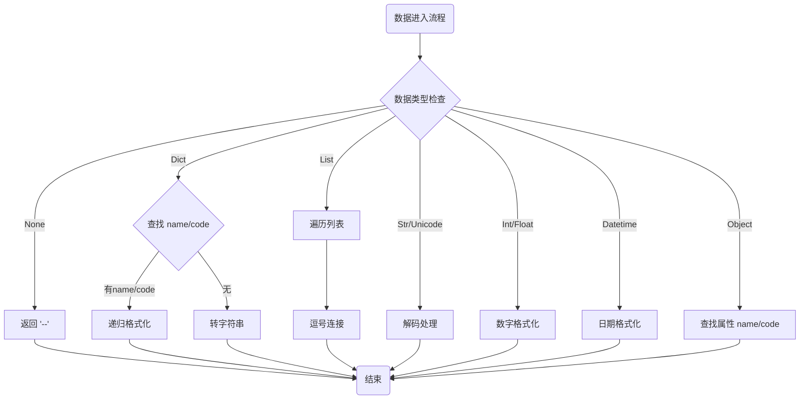

## 类结构

```
HelperModule (工具模块)
├── 配置与常量 (Configuration)
│   └── ItemViewMenuEvent (命名元组)
├── 颜色工具 (Color Utils)
│   ├── fade_color (透明度处理)
│   ├── generate_color (Ant Design 调色板)
│   └── get_color_icon (颜色转图标)
├── 格式化器 (Formatters - Singledispatch)
│   ├── real_model (模型解包)
│   ├── real_index (索引解包)
│   ├── display_formatter (显示文本格式化)
│   ├── icon_formatter (图标格式化)
│   └── font_formatter (字体样式)
├── 数据处理 (Data Helpers)
│   ├── get_obj_value / set_obj_value / has_obj_value
│   ├── from_list_to_nested_dict
│   └── apply_formatter
├── 静态文件 (Static Files)
│   └── get_static_file
├── 分页与计算 (Pagination & Math)
│   ├── get_percent
│   ├── get_total_page
│   └── get_page_display_string
├── 设置管理 (Settings - Decorator)
│   ├── read_settings
│   └── add_settings (装饰器)
└── UI 图形 (UI Graphics)
    ├── get_fit_geometry
    ├── convert_to_round_pixmap
    └── generate_text_pixmap
```

## 全局变量及字段


### `CUSTOM_STATIC_FOLDERS`
    
A list or tuple of custom static folder paths used to search for static files, imported from the package.

类型：`list or tuple of str`
    


### `DEFAULT_STATIC_FOLDER`
    
The default static folder path used as a fallback when searching for static files, imported from the package.

类型：`str`
    


### `dayu_theme`
    
A theme module containing color and font configuration constants (background_in_color, font_family, secondary_text_color), imported locally within generate_text_pixmap function.

类型：`module or object`
    


### `ItemViewMenuEvent.view`
    
The view widget that triggered the menu event.

类型：`QtWidgets.QAbstractItemView`
    


### `ItemViewMenuEvent.selection`
    
The current selection in the view when the menu event occurred.

类型：`QtCore.QItemSelection`
    


### `ItemViewMenuEvent.extra`
    
Extra data or context information associated with the menu event.

类型：`any`
    
    

## 全局函数及方法


### `get_static_file`

一个便捷的函数，用于获取静态文件夹（./static）中的文件。用户只需提供文件名，函数会在预定义的静态文件夹目录列表中搜索并返回文件的完整路径。

参数：

- `path`：`str`，文件名

返回值：`str | None`，如果找到文件则返回完整路径，否则返回 None

#### 流程图

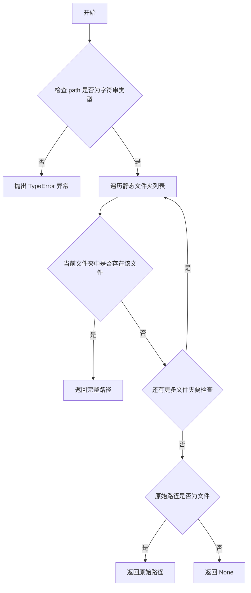

#### 带注释源码

```python
def get_static_file(path):
    """
    A convenient function to get the file in ./static,
    User just give the name of the file.
    eg. get_static_file('add_line.svg')
    :param path: file name
    :return: if input file found, return the full path, else return None
    """
    # 检查 path 参数是否为字符串类型，使用 six 库的字符串类型以兼容 Python 2/3
    if not isinstance(path, six.string_types):
        raise TypeError("Input argument 'path' should be six.string_types type, " "but get {}".format(type(path)))
    
    # 使用生成器表达式遍历所有可能的文件夹前缀
    # 文件夹列表包括：空字符串（当前目录）、DEFAULT_STATIC_FOLDER 和 CUSTOM_STATIC_FOLDERS
    full_path = next(
        (
            os.path.join(prefix, path)
            for prefix in ["", DEFAULT_STATIC_FOLDER] + CUSTOM_STATIC_FOLDERS
            if os.path.isfile(os.path.join(prefix, path))
        ),
        path,  # 如果未找到文件，返回原始 path 作为默认值
    )
    
    # 再次验证最终路径是否为有效文件
    if os.path.isfile(full_path):
        return full_path
    
    # 文件未找到，返回 None
    return None
```


### `from_list_to_nested_dict`

该函数用于将字符串列表（如 `["a/b", "a/c", "a/b/d"]`）转换为嵌套的字典结构（例如 `[{"value": "a", "label": "a", "children": [{"value": "b", "label": "b", "children": [...]}, ...]}]`），常用于构建树形数据结构或文件路径层级展示。

#### 参数

- `input_arg`：`list/tuple/set`，需要转换的字符串列表/元组/集合
- `sep`：`str`，分隔符，默认为 "/"，用于分割字符串

#### 返回值

- `list`，返回嵌套字典结构的列表，每个字典包含 `value`（值）、`label`（标签）字段，叶子节点无 `children` 字段

#### 流程图

```mermaid
flowchart TD
    A([开始]) --> B{检查 input_arg 类型}
    B -->|不是 list/tuple/set| C[抛出 TypeError]
    B -->|是 list/tuple/set| D{检查 sep 类型}
    D -->|不是字符串| E[抛出 TypeError]
    D -->|是字符串| F[初始化结果列表 result = []]
    F --> G[遍历 input_arg 中的每个 item]
    G --> H[item.stripsep 去除首尾分隔符]
    H --> I[使用 sep 分割 components]
    J[component_count = lencomponents]
    I --> J
    J --> K[current = result]
    K --> L[遍历 components 中的每个 comp 和索引 i]
    L --> M{在 current 中查找 value==comp 的原子}
    M -->|找到| N[atom = 找到的原子]
    M -->|未找到| O[创建新原子 {value, label, children}]
    O --> P[将新原子添加到 current]
    P --> Q[atom = 新原子]
    N --> R[current = atom.children]
    R --> S{i == component_count - 1}
    S -->|是| T[atom.pop 删除 children]
    S -->|否| U{继续下一个 comp}
    U --> L
    T --> V{处理下一个 item}
    V --> G
    G --> W{所有 item 处理完成}
    W --> X[返回 result]
    X --> Y([结束])
    
    C --> Z([异常])
    E --> Z
```

#### 带注释源码

```python
def from_list_to_nested_dict(input_arg, sep="/"):
    """
    将字符串列表转换为嵌套字典结构
    :param input_arg: 输入的列表/元组/集合，包含字符串路径
    :param sep: 分隔符，用于分割字符串路径，默认为 "/"
    :return: 嵌套字典列表，每个字典包含 value、label 字段
    """
    # 参数类型检查：确保 input_arg 是列表、元组或集合类型
    if not isinstance(input_arg, (list, tuple, set)):
        raise TypeError(
            "Input argument 'input' should be list or tuple or set, "
            "but get {}".format(type(input_arg))
        )
    
    # 参数类型检查：确保 sep 是字符串类型
    if not isinstance(sep, six.string_types):
        raise TypeError(
            "Input argument 'sep' should be six.string_types, "
            "but get {}".format(type(sep))
        )

    # 初始化结果列表
    result = []
    
    # 遍历输入的每个字符串项
    for item in input_arg:
        # 去除首尾的分隔符，然后按分隔符分割成组件列表
        components = item.strip(sep).split(sep)
        component_count = len(components)
        
        # current 指向当前处理层的字典列表
        current = result
        
        # 遍历每个组件，构建嵌套结构
        for i, comp in enumerate(components):
            # 在当前层查找是否已存在相同 value 的节点
            atom = next((x for x in current if x["value"] == comp), None)
            
            # 如果不存在，则创建新节点
            if atom is None:
                atom = {"value": comp, "label": comp, "children": []}
                current.append(atom)
            
            # 移动到下一层（子节点）
            current = atom["children"]
            
            # 如果是最后一个组件（叶子节点），移除 children 字段
            if i == component_count - 1:
                atom.pop("children")
    
    return result
```


### `fade_color`

将十六进制颜色值转换为 RGBA 格式字符串，用于 QSS/CSS 样式中的颜色透明度处理。

参数：

- `color`：`str`，十六进制颜色格式，例：'#ff0000'
- `alpha`：`str`，透明度百分比，例：'10%'

返回值：`str`，CSS 颜色格式 rgba(r, g, b, a)，例：'rgba(255, 0, 0, 10%)'

#### 流程图

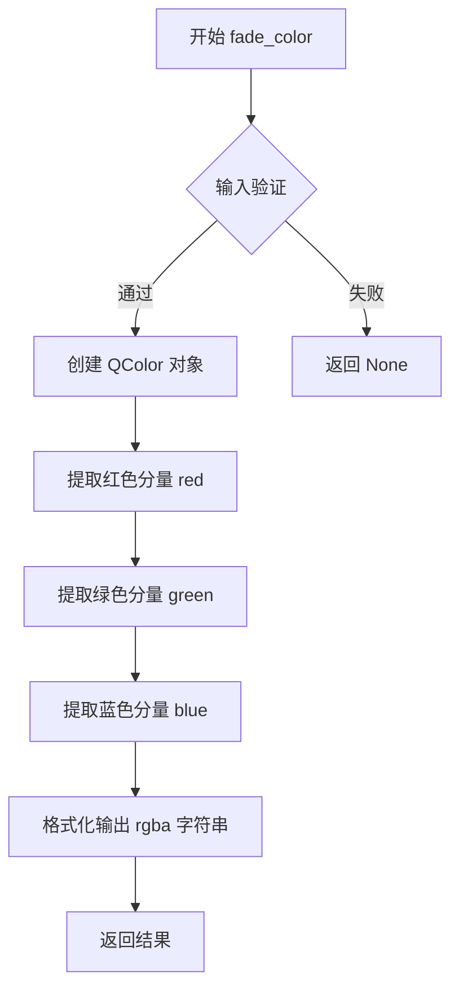

#### 带注释源码

```python
def fade_color(color, alpha):
    """
    Fade color with given alpha.
    eg. fade_color('#ff0000', '10%) => 'rgba(255, 0, 0, 10%)'
    :param color: string, hex digit format '#RRGGBB'
    :param alpha: string, percent 'number%'
    :return: qss/css color format rgba(r, g, b, a)
    """
    # 使用 QtGui.QColor 解析十六进制颜色字符串
    q_color = QtGui.QColor(color)
    # 返回格式化的 rgba 字符串，保留原始 alpha 值
    return "rgba({}, {}, {}, {})".format(q_color.red(), q_color.green(), q_color.blue(), alpha)
```


### `generate_color`

该函数实现了基于 Ant Design 色彩系统的颜色生成算法，根据基准颜色和色阶索引（1-10）生成从浅到深的一系列颜色，支持 HEX 格式的颜色输入输出。

参数：

- `primary_color`：字符串或 `QtGui.QColor`，基准颜色，支持 HEX 格式字符串（如 "#RRGGBB"）或 QColor 对象
- `index`：整数，颜色阶码，1-10 代表从浅到深的颜色梯度

返回值：`str`，返回生成的 HEX 格式颜色字符串（如 "#RRGGBB"）

#### 流程图

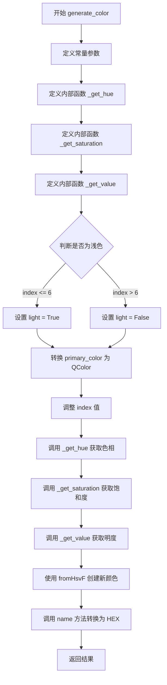

#### 带注释源码

```python
def generate_color(primary_color, index):
    """
    Reference to ant-design color system algorithm.
    :param primary_color: base color. #RRGGBB
    :param index: color step. 1-10 from light to dark
    :return: result color
    """
    # 这里生成颜色的算法，来自 Ant Design, 只做了语言的转换，和颜色的类型的转换，没对算法做任何修改
    # 来源：Ant Design 官方色彩算法
    # https://github.com/ant-design/ant-design/blob/master/components/style/color/colorPalette.less
    # https://zhuanlan.zhihu.com/p/32422584

    # 色彩系统的固定参数常量
    hue_step = 2  # 色相步长
    saturation_step = 16  # 饱和度步长（浅色）
    saturation_step2 = 5  # 饱和度步长（深色）
    brightness_step1 = 5  # 亮度步长（浅色）
    brightness_step2 = 15  # 亮度步长（深色）
    light_color_count = 5  # 浅色数量
    dark_color_count = 4  # 深色数量

    def _get_hue(color, i, is_light):
        """
        计算色相值，根据颜色处于色轮的不同位置（60-240度 vs 其他角度）采用不同的计算方向
        :param color: QColor 对象
        :param i: 调整索引
        :param is_light: 是否为浅色
        :return: 归一化的色相值 0.0-1.0
        """
        h_comp = color.hue()
        if 60 <= h_comp <= 240:
            # 处于冷色调区域，浅色向减小方向，深色向增加方向
            hue = h_comp - hue_step * i if is_light else h_comp + hue_step * i
        else:
            # 处于暖色调区域，浅色向增加方向，深色向减小方向
            hue = h_comp + hue_step * i if is_light else h_comp - hue_step * i
        # 色相值循环处理，保持在 0-359 范围内
        if hue < 0:
            hue += 359
        elif hue >= 359:
            hue -= 359
        return hue / 359.0  # 归一化到 0-1

    def _get_saturation(color, i, is_light):
        """
        计算饱和度值，浅色降低饱和度，深色增加饱和度
        :param color: QColor 对象
        :param i: 调整索引
        :param is_light: 是否为浅色
        :return: 归一化的饱和度值 0.0-1.0
        """
        s_comp = color.saturationF() * 100
        if is_light:
            # 浅色逐渐降低饱和度
            saturation = s_comp - saturation_step * i
        elif i == dark_color_count:
            # 最后一个深色增加一个饱和度步长
            saturation = s_comp + saturation_step
        else:
            # 深色逐渐增加饱和度
            saturation = s_comp + saturation_step2 * i
        # 限制饱和度范围在 0-100
        saturation = min(100.0, saturation)
        # 特殊处理：最浅的颜色如果饱和度大于10则强制设为10
        if is_light and i == light_color_count and saturation > 10:
            saturation = 10
        # 饱和度最小值为6
        saturation = max(6.0, saturation)
        return round(saturation * 10) / 1000.0  # 归一化到 0-1

    def _get_value(color, i, is_light):
        """
        计算明度值，浅色增加明度，深色降低明度
        :param color: QColor 对象
        :param i: 调整索引
        :param is_light: 是否为浅色
        :return: 归一化的明度值 0.0-1.0
        """
        v_comp = color.valueF()
        if is_light:
            # 浅色逐渐增加明度，最高不超过1.0
            return min((v_comp * 100 + brightness_step1 * i) / 100, 1.0)
        # 深色逐渐降低明度，最低不低于0.0
        return max((v_comp * 100 - brightness_step2 * i) / 100, 0.0)

    # 判断是否为浅色：index 1-6 为浅色，7-10 为深色
    light = index <= 6
    # 如果是字符串则转换为 QColor 对象
    hsv_color = QtGui.QColor(primary_color) if isinstance(primary_color, six.string_types) else primary_color
    # 根据浅色/深色重新计算索引，使其从0开始递增
    index = light_color_count + 1 - index if light else index - light_color_count - 1
    # 使用 HSV 色彩空间生成新颜色并转换为 HEX 格式返回
    return QtGui.QColor.fromHsvF(
        _get_hue(hsv_color, index, light),
        _get_saturation(hsv_color, index, light),
        _get_value(hsv_color, index, light),
    ).name()
```


### `real_model`

获取源模型，无论用户给的是源索引、代理索引还是代理模型。

参数：

- `source_model`：`任意类型`，输入的模型（可能是源模型、代理模型或模型索引）

返回值：`QtCore.QAbstractItemModel`，返回源模型

#### 流程图

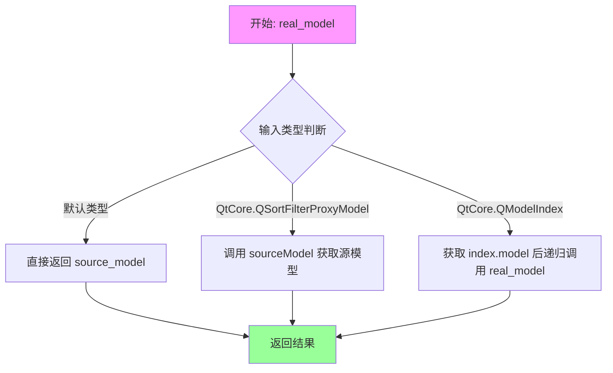

#### 带注释源码

```python
@singledispatch
def real_model(source_model):
    """
    Get the source model whenever user give a source index or proxy index or proxy model.
    """
    # 默认实现：直接返回输入的模型
    return source_model


@real_model.register(QtCore.QSortFilterProxyModel)
def _(proxy_model):
    """
    当输入是 QSortFilterProxyModel 时，获取其源模型
    """
    # 通过 sourceModel() 方法获取代理模型背后的真实模型
    return proxy_model.sourceModel()


@real_model.register(QtCore.QModelIndex)
def _(index):
    """
    当输入是 QModelIndex 时，获取该索引对应的模型后再递归调用 real_model
    """
    # 从索引获取关联的模型，然后递归调用以获取最终源模型
    return real_model(index.model())
```


### `real_index`

获取源模型的索引，当用户传入代理索引（proxy index）时，自动映射回源模型的索引；如果已经是源模型的索引，则直接返回。

参数：

- `index`：`QtCore.QModelIndex`，用户传入的索引，可以是源模型的索引或代理模型的索引

返回值：`QtCore.QModelIndex`，返回源模型（source model）中的索引

#### 流程图

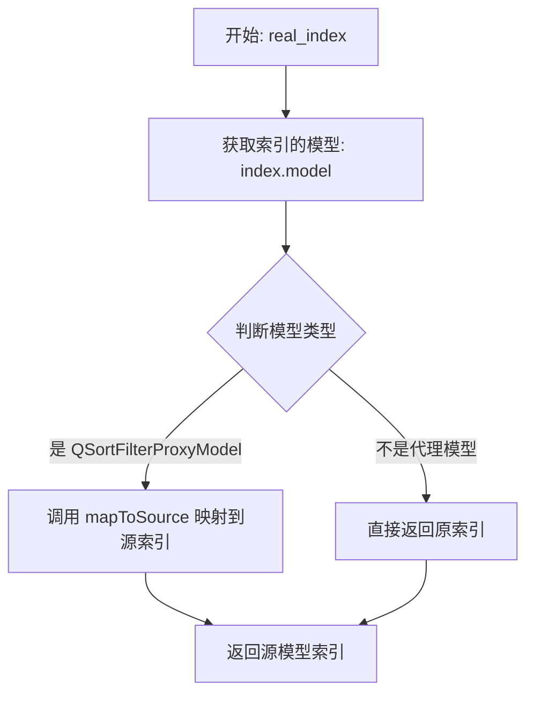

#### 带注释源码

```python
def real_index(index):
    """
    Get the source index whenever user give a source index or proxy index.
    获取源索引，当用户传入源索引或代理索引时使用。
    :param index: QtCore.QModelIndex，用户传入的索引
    :return: QtCore.QModelIndex，源模型中的索引
    """
    # 获取索引关联的模型对象
    model = index.model()
    
    # 判断模型是否为代理模型（QSortFilterProxyModel）
    if isinstance(model, QtCore.QSortFilterProxyModel):
        # 如果是代理模型，使用 mapToSource 方法将代理索引映射回源索引
        return model.mapToSource(index)
    
    # 如果不是代理模型（即已是源模型索引），直接返回原索引
    return index
```


### `get_obj_value`

该函数是一个通用的属性获取工具，能够统一处理字典和普通对象的属性读取操作，通过简单的类型判断自动选择合适的数据获取方式，为上层业务逻辑提供一致的接口。

参数：

- `data_obj`：任意类型（dict 或 object），需要获取属性值的对象，可以是字典或任何具有属性的 Python 对象
- `attr`：str，需要获取的键（对于字典）或属性名（对于对象）
- `default`：任意类型（默认 None），当字典中不存在指定键或对象不存在指定属性时返回的默认值

返回值：任意类型，成功获取时返回键或属性的值，否则返回默认值

#### 流程图

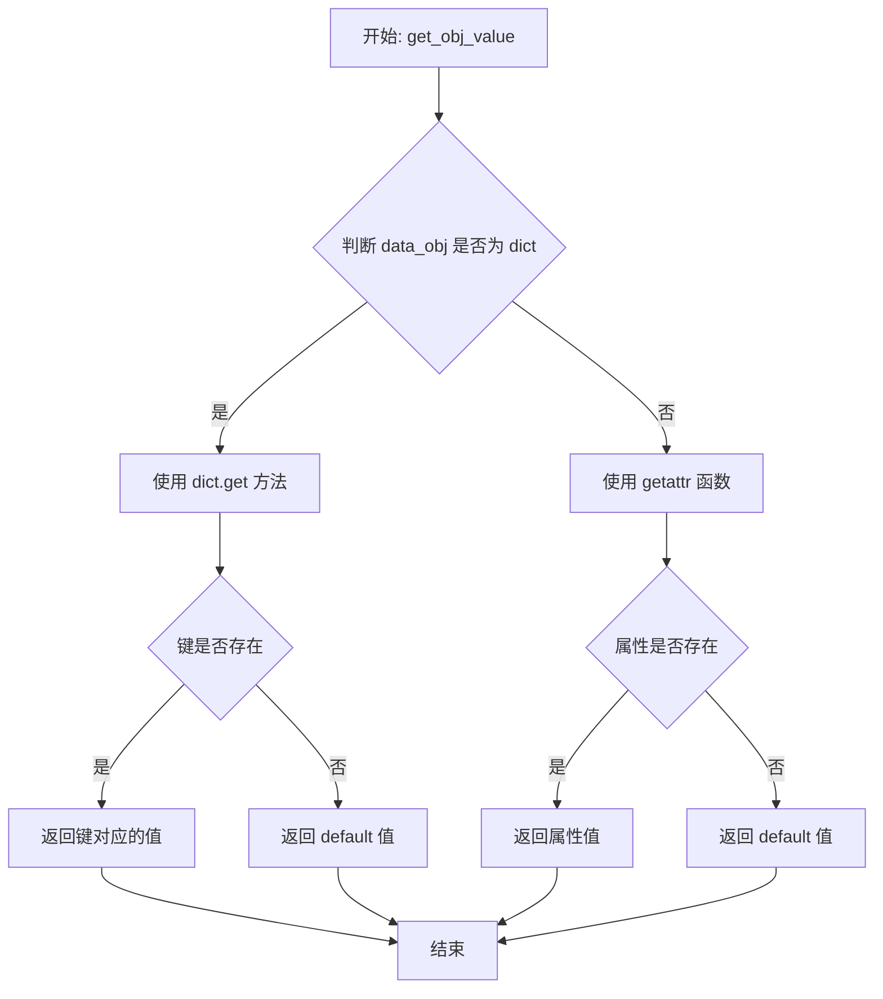

#### 带注释源码

```python
def get_obj_value(data_obj, attr, default=None):
    """
    Get dict's key or object's attribute with given attr
    
    该函数提供统一的接口来获取字典的键值或对象的属性值。
    根据输入对象的类型自动选择不同的获取方式：
    - 字典类型：使用 dict.get 方法
    - 其他对象：使用 getattr 函数
    
    参数:
        data_obj: 任意类型（dict 或 object），需要获取属性值的对象
        attr: str，需要获取的键或属性名
        default: 任意类型（默认 None），不存在时返回的默认值
    
    返回:
        任意类型：成功获取时返回键或属性的值，否则返回默认值
    """
    # 判断输入对象是否为字典类型
    if isinstance(data_obj, dict):
        # 字典类型使用 get 方法获取指定键的值，键不存在时返回 default
        return data_obj.get(attr, default)
    
    # 非字典类型（普通对象），使用 getattr 获取对象的属性值
    # 属性不存在时返回 default
    return getattr(data_obj, attr, default)
```


### `set_obj_value`

设置字典的键或对象的属性值。根据传入的 `data_obj` 类型，如果是字典则更新指定键值对，如果是对象则设置对象属性。

参数：

- `data_obj`：`dict` 或 `object`，需要设置属性或键值的数据对象
- `attr`：`str`，属性名称（字典的键名或对象的属性名）
- `value`：`任意类型`，要设置的值

返回值：`None`，无返回值（dict.update() 和 setattr() 均返回 None）

#### 流程图

```mermaid
flowchart TD
    A[开始 set_obj_value] --> B{判断 data_obj 类型}
    B -->|dict| C[调用 data_obj.update({attr: value})]
    B -->|object| D[调用 setattr(data_obj, attr, value)]
    C --> E[返回 None]
    D --> E
    E[结束]
```

#### 带注释源码

```python
def set_obj_value(data_obj, attr, value):
    """
    Set dict's key or object's attribute with given attr and value
    
    参数:
        data_obj: 字典或对象，指定要设置的数据容器
        attr: 字符串，指定要设置的键名或属性名
        value: 任意类型，指定要设置的值
    
    返回:
        无返回值（None）
    """
    # 判断传入的 data_obj 是否为字典类型
    if isinstance(data_obj, dict):
        # 如果是字典，使用 update 方法更新指定键值对
        # 注意：dict.update() 方法返回 None，因此函数最终返回 None
        return data_obj.update({attr: value})
    # 如果不是字典，假设是普通对象，使用 setattr 设置属性
    # setattr(obj, name, value) 会将对象的指定属性设置为对应值
    # setattr 也返回 None
    return setattr(data_obj, attr, value)
```


### `has_obj_value`

检查字典是否包含指定的键，或对象是否包含指定的属性。

参数：

- `data_obj`：`dict` 或 `object`，数据对象，可以是字典或任意对象实例
- `attr`：`str`，要检查的属性名或键名

返回值：`bool`，如果字典包含该键或对象包含该属性返回 `True`，否则返回 `False`

#### 流程图

```mermaid
flowchart TD
    A[开始 has_obj_value] --> B{isinstance data_obj, dict?}
    B -->|是| C[attr in data_obj.keys()]
    B -->|否| D[hasattr data_obj, attr]
    C --> E[返回结果]
    D --> E
    E[结束]
```

#### 带注释源码

```python
def has_obj_value(data_obj, attr):
    """Return weather dict has the given key or object has the given attribute."""
    # 判断data_obj是否为字典类型
    if isinstance(data_obj, dict):
        # 如果是字典，检查attr是否在字典的keys中
        return attr in data_obj.keys()
    # 如果不是字典，则认为是普通对象，使用hasattr检查属性是否存在
    return hasattr(data_obj, attr)
```


### `apply_formatter`

用于 QAbstractModel 的 data 方法，为字段配置格式化器并使用索引数据应用该格式化器。根据传入的 formatter 参数类型（None、字典、可调用对象或直接值），执行不同的处理逻辑并返回格式化后的值。

参数：

- `formatter`：任意类型，格式化器。可以是 None（无配置）、dict（字典选项型配置）、callable（回调函数型配置）或任何直接值类型。
- `*args`：可变位置参数，传递给格式化器的位置参数列表。
- `**kwargs`：可变关键字参数，传递给格式化器的关键字参数字典。

返回值：任意类型，返回应用格式化器后的结果。如果 formatter 为 None，返回第一个位置参数 args[0]；如果 formatter 是字典，返回字典中键对应的值；如果 formatter 是可调用对象，返回调用结果；否则直接返回 formatter 本身。

#### 流程图

```mermaid
flowchart TD
    A[开始 apply_formatter] --> B{formatter is None?}
    B -- 是 --> C[返回 args[0]]
    B -- 否 --> D{formatter 是 dict?}
    D -- 是 --> E[返回 formatter.get args[0], None]
    D -- 否 --> F{formatter 是 callable?}
    F -- 是 --> G[返回 formatter 调用结果]
    F -- 否 --> H[返回 formatter 本身]
    C --> I[结束]
    E --> I
    G --> I
    H --> I
```

#### 带注释源码

```python
def apply_formatter(formatter, *args, **kwargs):
    """
    Used for QAbstractModel data method.
    Config a formatter for one field, apply the formatter with the index data.
    :param formatter: formatter. It can be None/dict/callable or just any type of value
    :param args:
    :param kwargs:
    :return: apply the formatter with args and kwargs
    """
    # 情况1: formatter 为 None，表示没有配置格式化器，直接返回原始数据
    if formatter is None:  # 压根就没有配置
        return args[0]
    # 情况2: formatter 为字典，表示使用字典映射进行格式化（键值对查找）
    elif isinstance(formatter, dict):  # 字典选项型配置
        return formatter.get(args[0], None)
    # 情况3: formatter 为可调用对象（函数），调用该函数并传递参数
    elif callable(formatter):  # 回调函数型配置
        return formatter(*args, **kwargs)
    # 情况4: formatter 为直接值（常量），直接返回该值
    # 直接值型配置
    return formatter
```


### `display_formatter`

用于Qt的QAbstractItemModel的data方法中Qt.DisplayRole格式化显示的通用函数，通过singledispatch实现对不同输入类型的字符串格式化处理。

参数：

- `input_other_type`：`任意类型`，需要被格式化的输入值，可以是int、float、str、dict、list、datetime、object等任意类型

返回值：`six.string_types`（str），格式化后的字符串表示

#### 流程图

```mermaid
flowchart TD
    A[开始: display_formatter] --> B{输入类型判断}
    
    B -->|dict| C[检查name/code键]
    C --> D{name键存在?}
    D -->|是| E[递归格式化name值]
    D -->|否| F{code键存在?}
    F -->|是| G[递归格式化code值]
    F -->|否| H[str转换]
    
    B -->|list| I[遍历列表元素]
    I --> J[递归格式化每个元素]
    J --> K[用逗号连接]
    
    B -->|str| L[用windows-1252解码]
    
    B -->|six.text_type| M[直接返回unicode]
    
    B -->|type(None)| N[返回'--']
    
    B -->|int| O[直接返回int]
    
    B -->|float| P[格式化为两位小数]
    
    B -->|object| Q{检查name属性?}
    Q -->|是| R[递归格式化name属性]
    Q -->|否| S{检查code属性?}
    S -->|是| T[递归格式化code属性]
    S -->|否| U[str转换]
    
    B -->|datetime| V[格式化为Y-m-d H:M:S]
    
    B -->|其他类型| W[str转换]
    
    E --> X[返回结果]
    G --> X
    H --> X
    K --> X
    L --> X
    M --> X
    N --> X
    O --> X
    P --> X
    R --> X
    T --> X
    U --> X
    V --> X
    W --> X
```

#### 带注释源码

```python
@singledispatch
def display_formatter(input_other_type):
    """
    用于QAbstractItemModel的data方法的Qt.DisplayRole
    将任意输入值格式化为字符串
    
    :param input_other_type: 任意类型的输入值
    :return: six.string_types 格式化后的字符串
    """
    # 默认处理：转换为字符串
    # 注意：这个函数实际上不会被调用，因为singledispatch
    # 会根据类型自动调度到注册的特定处理函数
    return str(input_other_type)


@display_formatter.register(dict)
def _(input_dict):
    """
    处理字典类型的输入
    字典可能包含'name'或'code'键，用于显示名称或代码
    """
    # 检查字典中是否存在"name"键
    if "name" in input_dict.keys():
        # 递归调用display_formatter格式化name值
        return display_formatter(input_dict.get("name"))
    # 检查字典中是否存在"code"键
    elif "code" in input_dict.keys():
        # 递归调用display_formatter格式化code值
        return display_formatter(input_dict.get("code"))
    # 如果都没有，则直接转换为字符串
    return str(input_dict)


@display_formatter.register(list)
def _(input_list):
    """
    处理列表类型的输入
    将列表中的每个元素格式化后用逗号连接
    """
    result = []
    # 遍历列表中的每个元素
    for i in input_list:
        # 对每个元素递归调用display_formatter，然后转为字符串
        result.append(str(display_formatter(i)))
    # 用逗号连接所有结果
    return ",".join(result)


@display_formatter.register(str)
def _(input_str):
    """
    处理字符串类型的输入
    使用windows-1252编码进行解码
    注意：这里有一个潜在问题，input_str本身就是str类型，
    不需要再解码，可能会导致错误
    """
    # 使用windows-1252编码解码，这是为了处理某些特殊字符
    return input_str.decode("windows-1252")
    # 原始代码中被注释的替代方案：
    # return obj.decode()


@display_formatter.register(six.text_type)
def _(input_unicode):
    """
    处理unicode类型（six.text_type）的输入
    Python 2中的unicode或Python 3中的str
    直接返回原值
    """
    return input_unicode


@display_formatter.register(type(None))
def _(input_none):
    """
    处理None值
    返回显示占位符'--'
    """
    return "--"


@display_formatter.register(int)
def _(input_int):
    """
    处理整数类型
    直接返回int，不影响该列的排序功能
    这是Qt模型中保持数值排序的重要处理方式
    """
    # 直接返回int，不进行字符串转换
    # 这样可以保持该列的数值排序功能
    # return str(input_int)
    return input_int


@display_formatter.register(float)
def _(input_float):
    """
    处理浮点数类型
    格式化为保留两位小数
    """
    # 使用round函数先四舍五入，然后格式化为两位小数
    return "{:.2f}".format(round(input_float, 2))


@display_formatter.register(object)
def _(input_object):
    """
    处理任意对象类型
    检查对象是否有name或code属性
    """
    # 检查对象是否有name属性
    if hasattr(input_object, "name"):
        # 获取name属性并递归格式化
        return display_formatter(getattr(input_object, "name"))
    # 检查对象是否有code属性
    if hasattr(input_object, "code"):
        # 获取code属性并递归格式化
        return display_formatter(getattr(input_object, "code"))
    # 如果都没有，则转换为字符串
    return str(input_object)


@display_formatter.register(dt.datetime)
def _(input_datetime):
    """
    处理datetime对象
    格式化为标准的年-月-日 时:分:秒 格式
    """
    # 使用strftime格式化datetime为指定格式
    return input_datetime.strftime("%Y-%m-%d %H:%M:%S")
```


### `font_formatter`

该函数用于QAbstractItemModel的Qt.FontRole，根据setting_dict中的配置创建并返回相应的QFont字体实例，支持设置下划线(underline)和粗体(bold)两种字体样式。

参数：

- `setting_dict`：`dict`，包含字体样式设置的字典，应包含"underline"和/或"bold"键，值为布尔类型

返回值：`QtGui.QFont`，返回配置了指定字体样式的QFont实例

#### 流程图

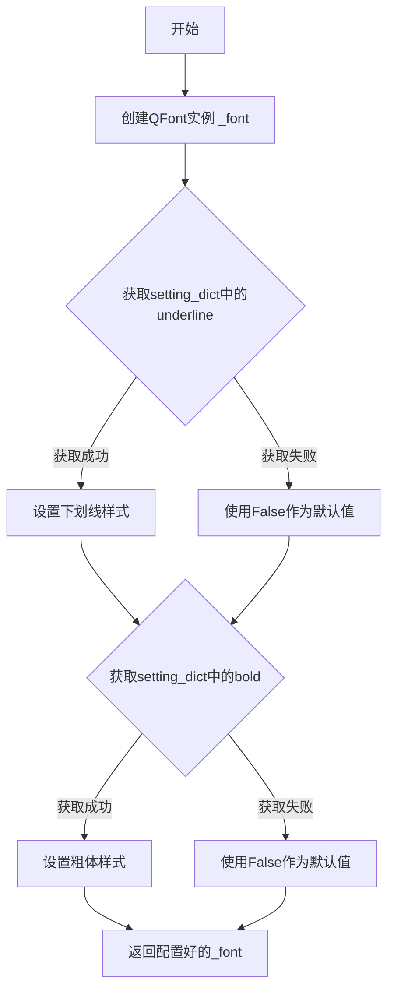

#### 带注释源码

```python
def font_formatter(setting_dict):
    """
    Used for QAbstractItemModel data method for Qt.FontRole
    :param underline: font style underline
    :param bold: font style bold
    :return: a QFont instance with given style
    """
    # 创建一个新的QFont实例，用于配置字体样式
    _font = QtGui.QFont()
    
    # 从setting_dict中获取underline设置，如果不存在则默认为False
    # 设置字体的下划线样式
    _font.setUnderline(setting_dict.get("underline") or False)
    
    # 从setting_dict中获取bold设置，如果不存在则默认为False
    # 设置字体的粗体样式
    _font.setBold(setting_dict.get("bold") or False)
    
    # 返回配置好的QFont实例
    return _font
```


### `icon_formatter`

该函数是使用 `singledispatch` 实现的通用图标格式化函数，用于 `QAbstractItemModel` 的 `Qt.DecorationRole`，能够根据不同类型的输入（字典、对象、字符串、元组、None）灵活地返回对应的 `QIcon` 实例，极大地简化了视图中图标数据的处理逻辑。

参数：

- `input_other_type`：`Any`，待格式化的输入值，可以是 dict、object、str、tuple、None 或 QIcon 类型

返回值：`QtGui.QIcon`，返回对应的 QIcon 实例

#### 流程图

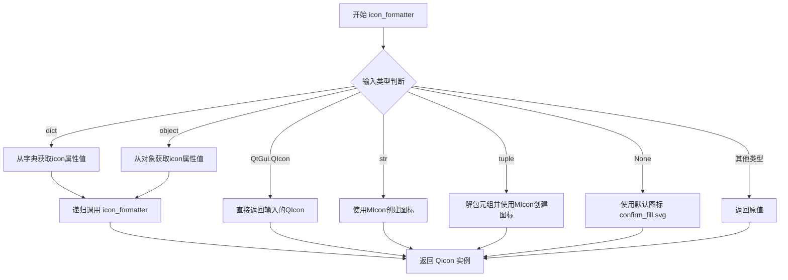

#### 带注释源码

```python
@singledispatch
def icon_formatter(input_other_type):
    """
    用于 QAbstractItemModel 的 Qt.DecorationRole 数据方法。
    一个辅助函数，用于轻松获取 QIcon。
    输入可以是 dict/object、string、None、tuple(file_path, fill_color)
    
    :param input_other_type: 任意类型的输入值
    :return: QIcon 实例
    """
    # 默认实现：如果输入类型没有注册处理器，则直接返回原值
    # 这是一个不会被到达的分支，因为已有所有常见类型的注册实现
    return input_other_type  # this function never reached


@icon_formatter.register(dict)
def _(input_dict):
    """
    处理字典类型的输入
    从字典中查找 'icon' 键对应的值，然后递归调用 icon_formatter 进行处理
    """
    attr_list = ["icon"]
    # 使用生成器表达式查找第一个非空的 icon 属性值
    path = next((get_obj_value(input_dict, attr) for attr in attr_list), None)
    # 递归调用以处理找到的路径值
    return icon_formatter(path)


@icon_formatter.register(QtGui.QIcon)
def _(input_dict):
    """
    处理已经是 QIcon 类型的输入
    直接返回，无需任何转换
    """
    return input_dict


@icon_formatter.register(object)
def _(input_object):
    """
    处理普通对象类型的输入
    从对象属性中查找 'icon' 属性值，然后递归调用 icon_formatter 进行处理
    """
    attr_list = ["icon"]
    # 使用生成器表达式查找第一个非空的 icon 属性
    path = next((get_obj_value(input_object, attr) for attr in attr_list), None)
    # 递归调用以处理找到的路径值
    return icon_formatter(path)


@icon_formatter.register(str)
def _(input_string):
    """
    处理字符串类型的输入
    将字符串作为图标路径，使用 MIcon 类创建图标实例
    """
    return MIcon(input_string)


@icon_formatter.register(tuple)
def _(input_tuple):
    """
    处理元组类型的输入
    元组格式为 (file_path, fill_color)，解包后传给 MIcon 创建图标
    """
    return MIcon(*input_tuple)


@icon_formatter.register(type(None))
def _(input_none):
    """
    处理 None 类型的输入
    当输入为空时，使用默认的确认填充图标作为占位符
    """
    return icon_formatter("confirm_fill.svg")
```


### `overflow_format`

将整数格式化为字符串，当数值超过指定阈值时返回带 "+" 后缀的字符串。

参数：

- `num`：`int`，要格式化的整数
- `overflow`：`int`，溢出阈值

返回值：`str`，如果 `num` 小于等于 `overflow`，返回数字的字符串形式；否则返回 `"{overflow}+"`

#### 流程图

```mermaid
flowchart TD
    A[开始] --> B{num 是否为 int 类型?}
    B -- 否 --> C[抛出 ValueError 异常]
    B -- 是 --> D{overflow 是否为 int 类型?}
    D -- 否 --> E[抛出 ValueError 异常]
    D -- 是 --> F{num <= overflow?}
    F -- 是 --> G[返回 str(num)]
    F -- 否 --> H[返回 "{overflow}+"]
    G --> I[结束]
    H --> I
    C --> I
    E --> I
```

#### 带注释源码

```python
def overflow_format(num, overflow):
    """
    Give a integer, return a string.
    When this integer is large than given overflow, return "overflow+"
    """
    # 检查 num 参数类型是否为 int，若不是则抛出 ValueError
    if not isinstance(num, int):
        raise ValueError("Input argument 'num' should be int type, " "but get {}".format(type(num)))
    # 检查 overflow 参数类型是否为 int，若不是则抛出 ValueError
    if not isinstance(overflow, int):
        raise ValueError("Input argument 'overflow' should be int type, " "but get {}".format(type(overflow)))
    # 如果 num 小于等于 overflow，直接返回数字的字符串形式
    # 否则返回 "{阈值}+" 格式的字符串，表示已溢出
    return str(num) if num <= overflow else "{}+".format(overflow)
```


### `get_percent`

该函数用于计算给定值在指定范围内的百分比位置，当最小值等于最大值时返回100以避免除零错误，否则通过线性插值计算0-100之间的百分比值。

参数：

- `value`：`数值类型`，需要计算百分比的目标值
- `minimum`：`数值类型`，范围的最小值
- `maximum`：`数值类型`，范围的最大值

返回值：`float`，返回0-100之间的百分比浮点数（当minimum==maximum时返回100）

#### 流程图

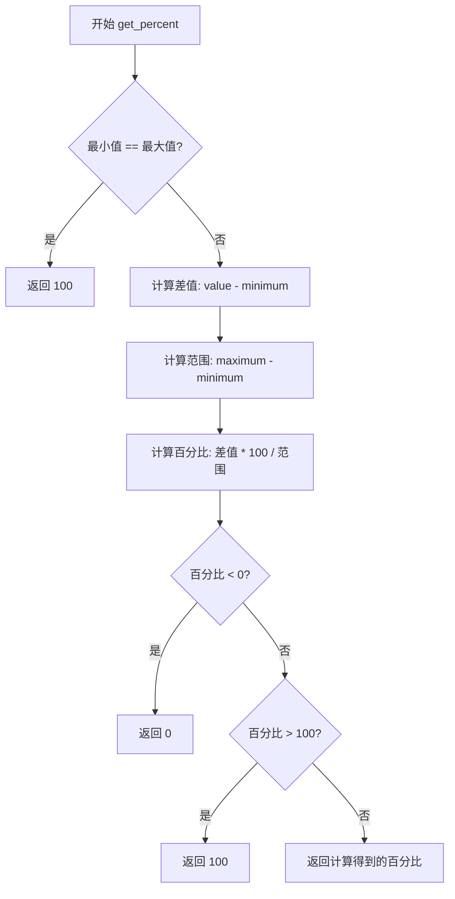

#### 带注释源码

```python
def get_percent(value, minimum, maximum):
    """
    Get a given value's percent in the range.
    :param value: value
    :param minimum: the range's minimum value
    :param maximum: the range's maximum value
    :return: percent float
    """
    # 当范围最小值等于最大值时（即范围只有一个点）
    if minimum == maximum:
        # 参考自 qprogressbar.cpp
        # If max and min are equal and we get this far, it means that the
        # progress bar has one step and that we are on that step. Return
        # 100% here in order to avoid division by zero further down.
        return 100
    # 正常计算百分比：先将value映射到[minimum, maximum]区间，再转换为0-100
    # 使用max(0, min(100, ...))确保结果在0-100范围内
    return max(0, min(100, (value - minimum) * 100 / (maximum - minimum)))
```


### `get_total_page`

获取分页的总页数，根据总数和每页数量计算总页数。

参数：

- `total`：`int`，总数（总数）
- `per`：`int`，每页数量（每页显示的条目数）

返回值：`int`，总页数（计算后的总页数）

#### 流程图

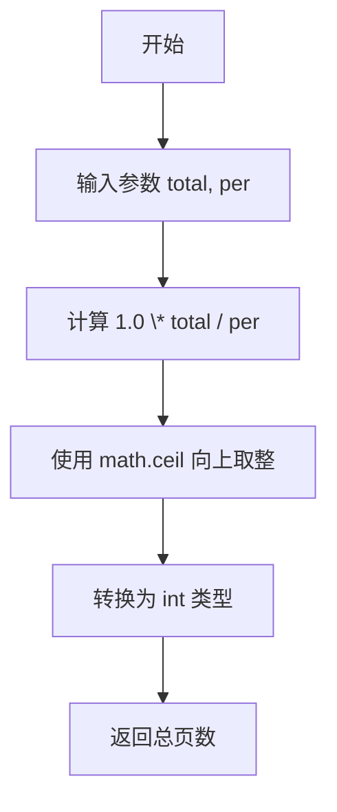

#### 带注释源码

```python
def get_total_page(total, per):
    """
    Get the page count.
    :param total: total count
    :param per: count per page
    :return: page count int
    """
    # 使用 math.ceil 向上取整，确保当有剩余数据时能生成额外的一页
    # 乘以 1.0 确保进行浮点数除法，避免整数除法导致的截断
    return int(math.ceil(1.0 * total / per))
```


### `get_page_display_string`

该函数用于生成分页显示字符串，格式为"起始页 - 结束页 of 总数"，常用于UI表格或列表的分页信息展示。

参数：

- `current`：`int`，当前页码
- `per`：`int`，每页显示的条目数
- `total`：`int`，总条目数

返回值：`str`，分页显示字符串，格式如"1 - 10 of 100"

#### 流程图

```mermaid
graph TD
    A[开始] --> B{current是否为0}
    B -->|是| C[start = 0]
    B -->|否| D[start = (current - 1) * per + 1]
    C --> E[end = min(total, current * per)]
    D --> E
    E --> F[格式化输出: start - end of total]
    F --> G[返回字符串]
```

#### 带注释源码

```python
def get_page_display_string(current, per, total):
    """
    Get the format string x - x of xx
    :param current: current page
    :param per: count per page
    :param total: total count
    :return: str
    """
    # 计算起始位置：如果current为0则起始为0，否则按公式计算
    # 例如：第1页、每页10条，起始 = (1-1)*10 + 1 = 1
    #       第2页、每页10条，起始 = (2-1)*10 + 1 = 11
    start = ((current - 1) * per + 1) if current else 0
    
    # 计算结束位置：取total和current*per的最小值
    # 防止最后一页显示超过总条数
    # 例如：共25条，每页10条，第3页结束 = min(25, 3*10) = 25
    end = min(total, current * per)
    
    # 格式化输出分页字符串
    return "{start} - {end} of {total}".format(
        start=start,
        end=end,
        total=total,
    )
```


### `read_settings`

该函数用于从 Qt 配置文件中读取应用设置，支持读取顶层键值对以及嵌套在组（Group）中的键值对，并返回一个包含所有配置的字典。

参数：

- `organization`：`str`，组织名称，用于标识设置所属的组织/公司
- `app_name`：`str`，应用名称，用于标识具体的应用程序

返回值：`dict`，返回包含所有设置项的字典，其中顶层键直接作为字典的键，组内键以 `"组名/键名"` 的形式作为字典的键

#### 流程图

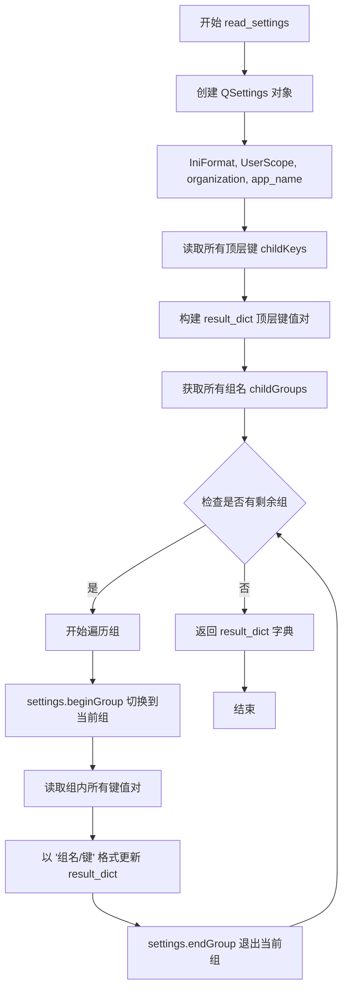

#### 带注释源码

```python
def read_settings(organization, app_name):
    """
    从 Qt 配置文件中读取应用设置。
    :param organization: 组织名称，用于 QSettings
    :param app_name: 应用名称，用于 QSettings
    :return: 包含所有设置项的字典
    """
    # 创建 QSettings 对象，使用 INI 格式和用户作用域
    settings = QtCore.QSettings(
        QtCore.QSettings.IniFormat,
        QtCore.QSettings.UserScope,
        organization,
        app_name,
    )
    # 读取所有顶层键值对，构建字典
    result_dict = {key: settings.value(key) for key in settings.childKeys()}
    
    # 遍历所有组，读取组内的键值对
    for grp_name in settings.childGroups():
        # 进入组上下文
        settings.beginGroup(grp_name)
        # 以 "组名/键名" 格式更新字典
        result_dict.update({
            grp_name + "/" + key: settings.value(key) 
            for key in settings.childKeys()
        })
        # 退出组上下文，返回顶层
        settings.endGroup()
    
    return result_dict
```


### `add_settings`

`add_settings` 是一个装饰器工厂函数，用于自动保存和恢复 Qt 窗口部件（如 QWidget）的属性设置（如窗口大小、位置、布局状态等）。它通过绑定属性到部件，并在特定事件（如关闭事件）触发时自动将设置持久化到 QSettings，同时提供 `bind` 和 `unbind` 方法动态管理属性绑定。

参数：

-  `organization`：`str`，应用程序的组织名称，用于 QSettings 的标识
-  `app_name`：`str`，应用程序的名称，用于 QSettings 的标识
-  `event_name`：`str`，触发保存设置的事件名称，默认为 `"closeEvent"`（也可设为 `"hideEvent"`）

返回值：`function`，返回一个装饰器函数 `wrapper`，该装饰器接受类作为参数并返回修改后的类

#### 流程图

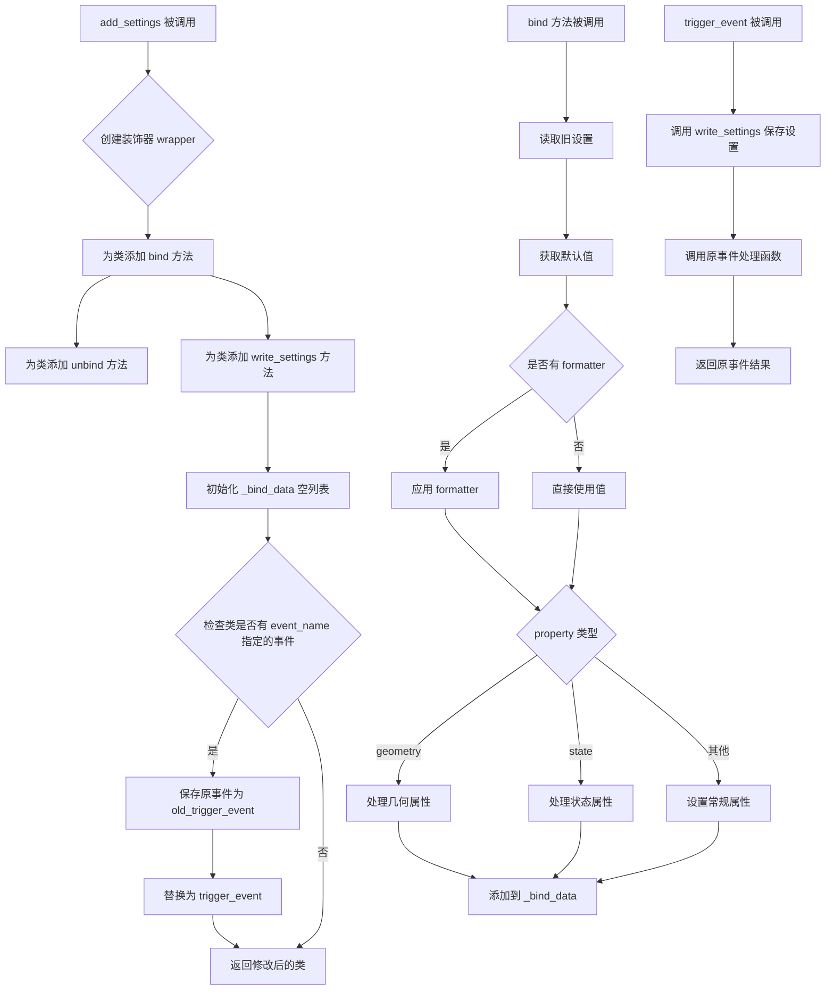

#### 带注释源码

```python
def add_settings(organization, app_name, event_name="closeEvent"):
    """
    装饰器工厂：用于自动保存和恢复窗口部件的设置
    
    :param organization: 组织名称，用于 QSettings
    :param app_name: 应用程序名称，用于 QSettings
    :param event_name: 触发保存的事件名称，默认为 closeEvent
    :return: 装饰器函数
    """
    
    def _write_settings(self):
        """
        将绑定数据写入 QSettings
        该方法会被绑定到类的实例上
        """
        # 创建 QSettings 实例，使用 INI 格式和用户作用域
        settings = QtCore.QSettings(
            QtCore.QSettings.IniFormat,
            QtCore.QSettings.UserScope,
            organization,
            app_name,
        )
        # 遍历所有绑定的属性
        for attr, widget, property in self._bind_data:
            if property == "geometry":
                # 窗口几何属性需要特殊处理，调用 saveGeometry
                settings.setValue(attr, widget.saveGeometry())
            elif property == "state":
                # 窗口状态（如 QSplitter、QMainWindow 的布局状态）
                settings.setValue(attr, widget.saveState())
            else:
                # 其他属性直接通过 property 获取并保存
                settings.setValue(attr, widget.property(property))

    def trigger_event(self, event):
        """
        触发事件的包装函数，在事件触发时保存设置
        :param event: Qt 事件对象
        """
        # 一般是 closeEvent 或者 hideEvent
        # 当窗口作为子组件，比如 tab 的一页时、关闭最顶层窗口时，都不会触发 closeEvent，
        # 此时请使用 hideEvent
        # 如果是作为一个独立的窗口，请使用 closeEvent
        self.write_settings()  # 先保存设置
        old_event = getattr(self, "old_trigger_event")  # 获取原事件处理函数
        return old_event(event)  # 调用原事件处理函数并返回结果

    def bind(self, attr, widget, property, default=None, formatter=None):
        """
        绑定属性到窗口部件
        :param attr: 属性名称，用于在 QSettings 中存储
        :param widget: Qt 窗口部件对象
        :param property: 要保存的属性名称（如 "geometry", "state", 或其他 Qt 属性）
        :param default: 默认值，当 QSettings 中没有对应值时使用
        :param formatter: 可选的格式化函数，用于处理值的读取和写入
        """
        old_setting_dict = read_settings(organization, app_name)
        value = old_setting_dict.get(attr, default)
        if callable(formatter):  # 二次处理 value，比如存入的 bool，读取后要恢复成 bool
            value = formatter(value)
        if property == "geometry":  # 窗口大小位置需要特殊处理
            if isinstance(value, QtCore.QRect):  # setting 并没有存，使用用户default传入进来的geo
                widget.setGeometry(value)
            elif isinstance(value, QtCore.QByteArray):  # settings 有保存值
                widget.restoreGeometry(value)
        elif property == "state":  # 类似 QMainWindow/QSplitter等的布局参数需要特殊处理
            # 由于每种类型组件的state 都不同，所以无法让用户手动传入默认参数，只能读取保存的
            # 用户可以使用组件自己的方法去初始化布局
            if isinstance(value, QtCore.QByteArray):  # settings 有保存值
                widget.restoreState(value)
        else:
            widget.setProperty(property, value)
        self._bind_data.append((attr, widget, property))

    def unbind(self, attr, widget, property):
        """
        解除属性绑定
        :param attr: 属性名称
        :param widget: Qt 窗口部件对象
        :param property: 属性名称
        """
        self.write_settings()  # 先保存当前设置
        self._bind_data.remove((attr, widget, property))  # 从绑定列表中移除

    def wrapper(cls):
        """
        装饰器 wrapper，为目标类添加设置保存/恢复功能
        :param cls: 要装饰的类
        :return: 修改后的类
        """
        cls.bind = bind
        cls.unbind = unbind
        cls.write_settings = _write_settings
        cls._bind_data = []
        # 如果类有 event_name 指定的属性（如 closeEvent），则替换为包装函数
        if hasattr(cls, event_name):
            old_event = getattr(cls, event_name)
            setattr(cls, "old_trigger_event", old_event)
            setattr(cls, event_name, trigger_event)
        return cls

    return wrapper
```


### `get_fit_geometry`

该函数用于获取一个适合当前屏幕的窗口几何位置，通过计算屏幕可用区域的一半大小，并将窗口居中放置在屏幕中央，返回一个 QRect 对象表示窗口的位置和尺寸。

参数：无

返回值：`QtCore.QRect`，返回一个表示窗口几何位置的矩形对象，包含窗口的 x、y 坐标以及宽度和高度

#### 流程图

```mermaid
flowchart TD
    A[开始] --> B[获取QApplication的所有屏幕]
    B --> C[获取第一个屏幕的可用几何区域]
    C --> D{检查geo是否存在}
    D -->|是| E[计算新几何区域]
    D -->|否| F[返回None]
    E --> G[计算x坐标: geo.width / 4]
    G --> H[计算y坐标: geo.height / 4]
    H --> I[计算宽度: geo.width / 2]
    I --> J[计算高度: geo.height / 2]
    J --> K[创建QRect对象]
    K --> L[返回QRect]
    L --> M[结束]
    F --> M
```

#### 带注释源码

```python
def get_fit_geometry():
    """
    获取一个适合当前屏幕的窗口几何位置。
    窗口将居中显示，占用屏幕可用区域的一半大小。
    
    Returns:
        QtCore.QRect: 包含窗口位置和尺寸的矩形区域
                     x = 屏幕宽度/4 (居中偏左)
                     y = 屏幕高度/4 (居中偏上)
                     width = 屏幕宽度/2 (窗口宽度为屏幕一半)
                     height = 屏幕高度/2 (窗口高度为屏幕一半)
    """
    # 使用生成器表达式获取第一个屏幕的可用几何区域
    # QtWidgets.QApplication.screens() 返回所有可用屏幕的列表
    # screen.availableGeometry() 返回不包含任务栏等区域的可用几何信息
    # next() 函数返回第一个匹配的元素，如果列表为空则返回 None
    geo = next(
        (screen.availableGeometry() for screen in QtWidgets.QApplication.screens()),
        None,  # 如果没有屏幕，返回 None
    )
    
    # 计算居中的窗口几何位置
    # x: 屏幕宽度的1/4位置 (窗口左侧距离)
    # y: 屏幕高度的1/4位置 (窗口顶部距离)
    # width: 屏幕宽度的一半 (窗口宽度)
    # height: 屏幕高度的一半 (窗口高度)
    # 这样窗口会居中显示在屏幕中央
    return QtCore.QRect(
        geo.width() / 4,      # x 坐标
        geo.height() / 4,     # y 坐标
        geo.width() / 2,      # 宽度
        geo.height() / 2      # 高度
    )
```


### `convert_to_round_pixmap`

该函数用于将传入的矩形 QPixmap 图像转换为圆形图像，通过创建一个正方形的透明 QPixmap，并使用 QPainterPath 创建椭圆剪裁路径来实现圆形裁剪效果。

参数：

- `orig_pix`：`QtGui.QPixmap`，原始的矩形像素图对象

返回值：`QtGui.QPixmap`，裁剪后的圆形像素图对象

#### 流程图

```mermaid
flowchart TD
    A[开始] --> B[获取缩放因子 scale_x]
    B --> C[计算最小边长 w = min orig_pix.width, orig_pix.height]
    C --> D[创建 w×w 的正方形透明 Pixmap]
    D --> E[创建 QPainter 对象]
    E --> F[设置渲染提示: 抗锯齿 + 平滑变换]
    F --> G[创建 QPainterPath 并添加椭圆路径]
    G --> H[设置剪裁路径为圆形]
    H --> I[在圆形区域内绘制原始 pixmap]
    I --> J[返回圆形 pixmap]
```

#### 带注释源码

```python
def convert_to_round_pixmap(orig_pix):
    """
    将矩形 pixmap 转换为圆形 pixmap
    :param orig_pix: QtGui.QPixmap, 原始的矩形图像
    :return: QtGui.QPixmap, 裁剪后的圆形图像
    """
    # 获取屏幕缩放因子（当前未使用，仅获取了 scale_x）
    scale_x, _ = get_scale_factor()
    
    # 计算新图像的边长，取原始图像宽高中较小者
    w = min(orig_pix.width(), orig_pix.height())
    
    # 创建一个正方形的透明 pixmap 作为画布
    pix_map = QtGui.QPixmap(w, w)
    pix_map.fill(QtCore.Qt.transparent)
    
    # 创建画家对象用于绘制
    painter = QtGui.QPainter(pix_map)
    
    # 设置渲染提示：抗锯齿和平滑变换，提升图像质量
    painter.setRenderHints(QtGui.QPainter.Antialiasing | QtGui.QPainter.SmoothPixmapTransform)
    
    # 创建画家路径对象
    path = QtGui.QPainterPath()
    
    # 在路径中添加椭圆（圆形），边界为画布边缘
    path.addEllipse(0, 0, w, w)
    
    # 设置剪裁路径，使得后续绘制只在圆形区域内生效
    painter.setClipPath(path)
    
    # 在圆形区域内绘制原始 pixmap
    painter.drawPixmap(0, 0, w, w, orig_pix)
    
    # 返回裁剪后的圆形 pixmap
    return pix_map
```


### `generate_text_pixmap`

该函数用于在给定的宽高尺寸画布上绘制带有背景色的文本，并返回生成的QPixmap图像对象。函数支持文本对齐方式配置（居中、左对齐、右对齐、顶部对齐、底部对齐），默认居中显示。

参数：

- `width`：`int`，画布的宽度（像素）
- `height`：`int`，画布的高度（像素）
- `text`：`str`，要绘制到画布上的文本内容
- `alignment`：`QtCore.Qt.AlignmentFlag`，文本对齐方式，默认为QtCore.Qt.AlignCenter（居中），支持按位与运算组合多种对齐方式
- `bg_color`：`QColor`或`None`，背景填充颜色，默认为None（使用主题背景色）

返回值：`QtGui.QPixmap`，返回包含绘制文本的像素图对象

#### 流程图

```mermaid
flowchart TD
    A[开始 generate_text_pixmap] --> B[获取或使用默认背景色]
    B --> C[创建指定尺寸的QPixmap]
    C --> D[使用背景色填充Pixmap]
    E[创建QPainter绘图对象] --> F[设置抗锯齿渲染提示]
    F --> G[设置字体家族为主题字体]
    G --> H[设置文本颜色为主题次级文本色]
    H --> I[获取字体度量信息]
    I --> J[计算默认居中位置 x, y]
    J --> K{检查对齐方式}
    K -->|AlignLeft| L[设置x=0]
    K -->|AlignRight| M[设置x=width - text_width]
    K -->|AlignTop| N[设置y=0]
    K -->|AlignBottom| O[设置y=height - text_height]
    L --> P[绘制文本到指定位置]
    M --> P
    N --> P
    O --> P
    P --> Q[结束绘图painter]
    Q --> R[返回生成的pix_map]
```

#### 带注释源码

```python
def generate_text_pixmap(width, height, text, alignment=QtCore.Qt.AlignCenter, bg_color=None):
    """
    生成一个带有文本的像素图（QPixmap）
    
    参数:
        width: 画布宽度（像素）
        height: 画布高度（像素）
        text: 要绘制的文本内容
        alignment: 文本对齐方式，支持QtCore.Qt.AlignCenter/Left/Right/Top/Bottom
        bg_color: 背景色，默认为None则使用主题背景色
    
    返回:
        QtGui.QPixmap: 包含绘制文本的像素图对象
    """
    # 动态导入本地模块dayu_theme以获取主题配置
    from . import dayu_theme

    # 如果未指定背景色，则使用主题的默认背景色
    bg_color = bg_color or dayu_theme.background_in_color
    
    # 创建指定尺寸的像素图对象
    pix_map = QtGui.QPixmap(width, height)
    # 使用背景色填充整个像素图
    pix_map.fill(QtGui.QColor(bg_color))
    
    # 创建绘图对象，开始在pix_map上绘制
    painter = QtGui.QPainter(pix_map)
    # 设置文本抗锯齿渲染，提升文本清晰度
    painter.setRenderHints(QtGui.QPainter.TextAntialiasing)
    
    # 获取并配置字体
    font = painter.font()
    # 设置字体家族为主题配置的字体
    font.setFamily(dayu_theme.font_family)
    painter.setFont(font)
    
    # 设置文本颜色为主题的次级文本颜色
    painter.setPen(QtGui.QPen(QtGui.QColor(dayu_theme.secondary_text_color)))

    # 获取字体度量器用于计算文本尺寸
    font_metrics = painter.fontMetrics()
    # 计算文本宽度（水平advance距离）
    text_width = font_metrics.horizontalAdvance(text)
    # 计算文本高度
    text_height = font_metrics.height()
    
    # 计算默认居中位置的坐标
    x = width / 2 - text_width / 2
    y = height / 2 - text_height / 2
    
    # 根据对齐方式参数调整绘制坐标
    # 使用按位与运算检查对齐标志位
    if alignment & QtCore.Qt.AlignLeft:
        x = 0  # 左对齐，x坐标设为0
    elif alignment & QtCore.Qt.AlignRight:
        x = width - text_width  # 右对齐，x坐标设为右侧边界
    elif alignment & QtCore.Qt.AlignTop:
        y = 0  # 顶部对齐，y坐标设为0
    elif alignment & QtCore.Qt.AlignBottom:
        y = height - text_height  # 底部对齐，y坐标设为底部边界

    # 在计算出的位置绘制文本
    painter.drawText(x, y, text)
    # 结束绘图，释放绘图资源
    painter.end()
    
    # 返回生成的包含文本的像素图
    return pix_map
```


### `get_color_icon`

该函数用于根据给定的颜色和尺寸生成一个填充了指定颜色的图标对象（QIcon）。它支持多种颜色格式输入（如十六进制颜色字符串、RGB逗号分隔字符串或QColor对象），并根据屏幕缩放因子调整图标大小。

参数：

- `color`：`str` 或 `QtGui.QColor`，颜色值，可以是十六进制格式（如"#ff0000"）、RGB逗号格式（如"255,0,0"）或QColor对象
- `size`：`int`，图标的尺寸（默认值24），单位为像素

返回值：`QtGui.QIcon`，返回一个填充了指定颜色的图标对象

#### 流程图

```mermaid
flowchart TD
    A[开始 get_color_icon] --> B[获取屏幕缩放因子 scale_x]
    B --> C[创建 QPixmap 大小为 size \* scale_x]
    C --> D{color 是字符串?}
    D -->|是| E{color 以 # 开头?}
    D -->|否| F[直接使用 color 作为 q_color]
    E -->|是| G[将 color 转换为 QColor]
    E -->|否| H{color 包含两个逗号?}
    H -->|是| I[解析为 RGB 元组并创建 QColor]
    H -->|否| J[使用默认 color]
    G --> K[使用 q_color 填充 pixmap]
    F --> K
    I --> K
    J --> K
    K --> L[从 pixmap 创建 QIcon]
    L --> M[返回 QIcon]
```

#### 带注释源码

```python
def get_color_icon(color, size=24):
    """
    根据给定的颜色和尺寸生成一个填充了指定颜色的图标对象（QIcon）。
    
    参数:
        color: 颜色值,可以是十六进制格式(如"#ff0000")、RGB逗号格式(如"255,0,0")或QColor对象
        size: 图标的尺寸,单位为像素,默认值为24
    
    返回:
        QtGui.QIcon: 填充了指定颜色的图标对象
    """
    # 获取屏幕缩放因子,以支持高DPI屏幕
    scale_x, y = get_scale_factor()
    
    # 根据缩放因子创建适当大小的 pixmap
    pix = QtGui.QPixmap(size * scale_x, size * scale_x)
    
    # 初始化 q_color 变量
    q_color = color
    
    # 检查 color 是否为字符串类型
    if isinstance(color, str):
        # 如果是十六进制颜色格式(如"#FF0000")
        if color.startswith("#"):
            # 注意:这里有个bug,应该是 color 而不是 str
            q_color = QtGui.QColor(str)  # 此处应为 color
        # 如果是 RGB 逗号分隔格式(如"255,0,0")
        elif color.count(",") == 2:
            # 将字符串分割并转换为整数元组,再创建 QColor
            q_color = QtGui.QColor(*tuple(map(int, color.split(","))))
    
    # 用指定颜色填充 pixmap
    pix.fill(q_color)
    
    # 从 pixmap 创建 QIcon 并返回
    return QtGui.QIcon(pix)
```


## 关键组件


### 颜色生成与处理系统

基于Ant Design颜色算法生成调色板，支持颜色的淡化和透明度处理，包含`generate_color`、`fade_color`等函数，用于UI主题色的动态生成。

### Qt模型索引解包工具

提供`real_model`和`real_index`函数，使用`singledispatch`实现多态处理，能够从QSortFilterProxyModel或QModelIndex中解包获取原始模型和索引。

### 多态格式化器框架

实现`singledispatch`模式的格式化器系统，包括`display_formatter`、`icon_formatter`、`font_formatter`，支持对dict、list、str、int、float、datetime、object等多种数据类型进行格式化处理。

### 动态对象属性访问器

提供`get_obj_value`、`set_obj_value`、`has_obj_value`三个函数，统一处理dict和object两种数据结构的属性访问方式。

### 设置持久化装饰器

`add_settings`函数返回一个装饰器类，用于将Qt窗口的geometry、state等属性自动持久化到QSettings，支持bind/unbind动态绑定和解绑组件属性。

### 图像生成工具集

包含`convert_to_round_pixmap`生成圆形图像、`generate_text_pixmap`生成带文本的图像、`get_color_icon`生成颜色图标等功能，支持高DPI缩放。

### 分页与数值格式化工具

提供`overflow_format`处理数值溢出显示、`get_percent`计算百分比范围值、`get_total_page`计算总页数、`get_page_display_string`生成分页显示字符串。

### 静态文件路径解析

`get_static_file`函数在默认静态文件夹和自定义静态文件夹列表中查找并返回文件的完整路径。

### 列表转嵌套字典转换器

`from_list_to_nested_dict`函数将扁平化的字符串列表（如"a/b/c"格式）转换为嵌套的树形字典结构。


## 问题及建议


### 已知问题

-   **Python 3兼容性问题**：`display_formatter.register(str)`函数中使用`input_str.decode("windows-1252")`，但在Python 3中`str`类型已经是字符串，无法使用decode方法，这会导致`AttributeError`
-   **类型检查不一致**：`fade_color`函数接受`alpha`参数，但在注释中说明应该是字符串类型（如"10%"），而实际调用时可能传入数字
-   **逻辑错误**：`get_color_icon`函数中存在`QtGui.QColor(str)`的错误，应该是`QtGui.QColor(color)`
-   **循环导入风险**：`generate_text_pixmap`函数内部使用`from . import dayu_theme`进行延迟导入，这种模式容易导致循环导入问题
-   **错误处理不足**：`get_static_file`函数在文件未找到时返回原始path而不是None，与文档描述的返回值不一致
-   **类型提示缺失**：整个代码库没有使用类型注解（type hints），降低了代码的可维护性和IDE支持
-   **魔法数字**：多处使用硬编码的数字（如颜色算法中的hue_step=2），缺乏常量定义
-   **重复代码**：多个formatter函数（display_formatter、icon_formatter、font_formatter）有类似的注册模式，可以抽象基类
-   **全局状态依赖**：代码依赖`CUSTOM_STATIC_FOLDERS`、`DEFAULT_STATIC_FOLDER`、`dayu_theme`等全局变量，降低了函数的纯度

### 优化建议

-   **修复Python 3兼容性问题**：将`display_formatter.register(str)`的实现改为处理bytes类型，或者直接返回字符串
-   **统一类型检查**：使用Python标准库的typing模块替代six库，并添加完整的类型注解
-   **修复逻辑错误**：修正`get_color_icon`中的类型转换错误
-   **改进导入方式**：将`dayu_theme`的导入移到文件顶部，避免函数内部导入
-   **增强错误处理**：为关键函数添加更详细的异常捕获和日志记录
-   **提取常量**：将魔法数字提取为模块级常量，如颜色算法参数
-   **优化性能**：考虑使用缓存机制减少重复计算，如`read_settings`可以使用缓存
-   **代码重构**：考虑使用抽象基类或组合模式减少formatter函数中的重复代码


## 其它


### 设计目标与约束

本模块旨在为基于PySide6的Qt应用程序提供通用的辅助函数集，核心目标包括：1）提供统一的颜色生成与处理能力，参考Ant Design色彩系统算法；2）封装Qt模型相关的操作，简化QAbstractItemModel的数据格式化；3）提供配置持久化的装饰器方案；4）支持静态资源的便捷获取。设计约束方面，主要依赖PySide6库，需保证与Qt5/Qt6的兼容性；同时需要支持Python 2.7+至Python 3.x的兼容性（通过six模块和__future__导入实现）。

### 错误处理与异常设计

本模块采用分级错误处理策略：1）参数类型检查：对于关键函数（如get_static_file、from_list_to_nested_dict、overflow_format等），在函数入口进行类型检查，不符合预期类型时抛出TypeError；2）值域检查：overflow_format函数对num和overflow进行int类型检查，get_percent函数处理最小值等于最大值的情况避免除零错误；3）容错返回：get_static_file在文件不存在时返回None而非抛出异常，display_formatter对未知类型尝试转换为字符串；4）单分派函数使用fallback机制处理未注册类型。整体设计遵循"快速失败"原则，在开发阶段暴露问题，同时提供默认行为避免运行时崩溃。

### 数据流与状态机

本模块不涉及复杂的状态机设计，但存在以下数据流关系：1）颜色生成流程：generate_color接收基色和索引，经过HSV色彩空间转换计算，输出新颜色名称；2）模型索引解析流程：real_model和real_index构成Qt模型索引的递归解析链路，处理ProxyModel到SourceModel的映射；3）格式化器链：apply_formatter作为主调度器，根据formatter类型（None/dict/callable）分发给display_formatter、icon_formatter等具体实现；4）设置绑定流程：add_settings装饰器通过bind方法建立widget属性与持久化设置的映射关系，在trigger_event触发时调用write_settings写入。

### 外部依赖与接口契约

本模块的外部依赖包括：1）PySide6模块：QtCore、QtGui、QtWidgets，用于Qt数据类型、图形界面操作；2）six库：用于Python 2/3兼容性检查（six.string_types、six.text_type）；3）singledispatch或functools.singledispatch：用于函数多态分发；4）本地模块：.qt.MIcon、.qt.get_scale_factor、.import CUSTOM_STATIC_FOLDERS和DEFAULT_STATIC_FOLDER配置、.dayu_theme主题配置。接口契约方面：get_static_file接受字符串路径返回完整文件路径或None；display_formatter和icon_formatter采用单分派机制，支持多种输入类型；add_settings装饰器要求被装饰类具有指定的event_name方法（如closeEvent）和可绑定属性的widget组件。

### 性能考虑与优化空间

性能优化点包括：1）颜色生成算法：generate_color内部函数_get_hue、_get_saturation、_get_value每次调用都会创建新的QColor对象，可考虑缓存已计算的颜色；2）设置读取：read_settings每次调用都遍历所有childKeys和childGroups，对于大型配置文件可能存在性能瓶颈，建议增加缓存机制；3）单分派函数：display_formatter和icon_formatter注册了多个类型处理器，首次调用时需要查找匹配类型，可考虑使用字典直接映射加速；4）屏幕几何计算：get_fit_geometry每次调用都遍历所有屏幕，可考虑缓存屏幕信息。优化方向：引入functools.lru_cache缓存频繁调用的函数结果；对于颜色生成可预计算常用颜色的调色板。

### 安全性考虑

本模块涉及的安全考量：1）文件路径处理：get_static_file未对path进行严格的路径遍历检查，理论上存在路径注入风险，建议增加路径规范化验证；2）字符串解码：display_formatter对str类型默认使用'windows-1252'解码，可能导致编码相关安全或显示问题，建议明确输入编码或提供配置；3）动态代码执行：apply_formatter支持callable类型的formatter，调用方需确保传入的可调用对象可信，避免任意代码执行风险；4）设置持久化：add_settings装饰器将widget属性写入用户目录，需注意敏感信息（如密码字段）不应通过此机制持久化。

### 可测试性设计

测试策略建议：1）单元测试：针对每个独立函数编写测试用例，重点覆盖边界条件（如空输入、极端值）；2）类型覆盖测试：单分派函数需测试所有注册类型及未注册类型的fallback行为；3）集成测试：add_settings装饰器需要模拟Qt环境和widget进行测试；4）Mock对象：测试中需要Mock QtGui.QColor、QtCore.QSettings等Qt对象；5）回归测试：颜色生成算法需与Ant Design标准色彩进行比对验证。当前代码已包含部分类型检查，可通过pytest结合unittest.mock进行测试覆盖。

### 版本兼容性

兼容性设计要点：1）Python版本：通过__future__导入支持Python 2.7，使用six库处理字符串类型差异；2）Qt版本：代码基于PySide6，但使用了QtCore.QSortFilterProxyModel、QtCore.QModelIndex等Qt Core共有的API，理论上可适配PySide2/PyQt5；3）singledispatch：优先使用functools.singledispatch（Python 3.4+），回退到singledispatch第三方库；4）API变更：QtCore.QSettings的IniFormat和UserScope在Qt5/Qt6中保持兼容；screen.availableGeometry()在Qt5.14+和Qt6中可用，需注意版本判断。潜在问题：Qt6中部分枚举值和API有所调整，需要条件分支处理。

### 配置管理与扩展性

配置管理机制：1）静态资源配置：通过CUSTOM_STATIC_FOLDERS和DEFAULT_STATIC_FOLDER全局变量配置静态资源搜索路径；2）主题配置：依赖dayu_theme模块提供背景色、字体、文本颜色等主题参数；3）设置持久化：add_settings装饰器使用QSettings的IniFormat存储，支持组织和应用名称配置。扩展性设计：1）单分派函数（display_formatter、icon_formatter、real_model）支持通过register方法扩展新类型；2）add_settings装饰器支持通过bind方法动态绑定新的属性；3）颜色生成算法可扩展支持更多色彩空间（如HSL、LAB）；4）建议增加插件机制，允许第三方模块注册自定义formatter。

### 日志与监控

日志设计建议：1）错误日志：类型检查失败、文件未找到等异常情况应记录日志，建议使用Python标准logging模块；2）调试日志：add_settings的bind/unbind操作、设置读写操作可增加debug级别日志；3）性能监控：针对read_settings、generate_color等可能存在性能问题的函数，可使用functools.wraps装饰器实现调用时长统计。当前代码中未包含日志实现，建议添加：import logging; logger = logging.getLogger(__name__)，在关键路径增加日志记录点。


    