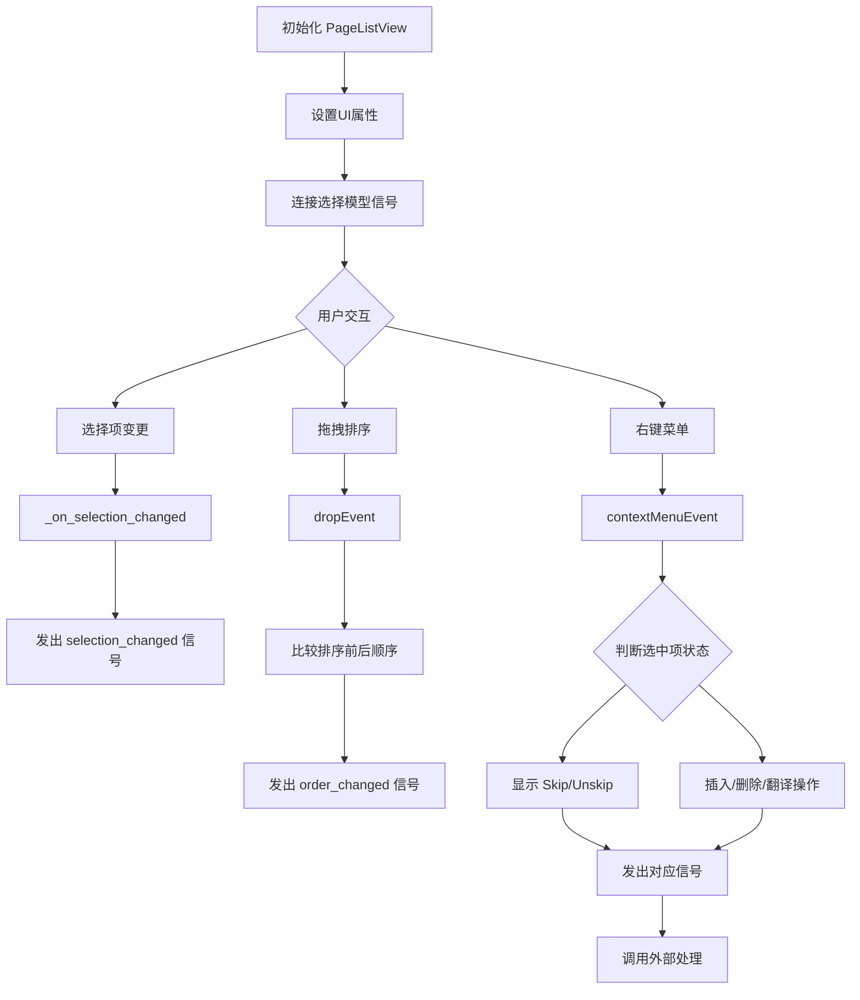
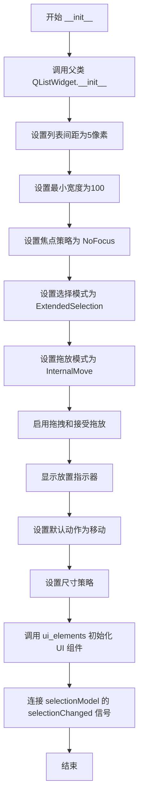
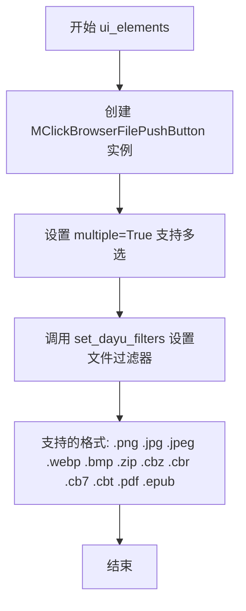
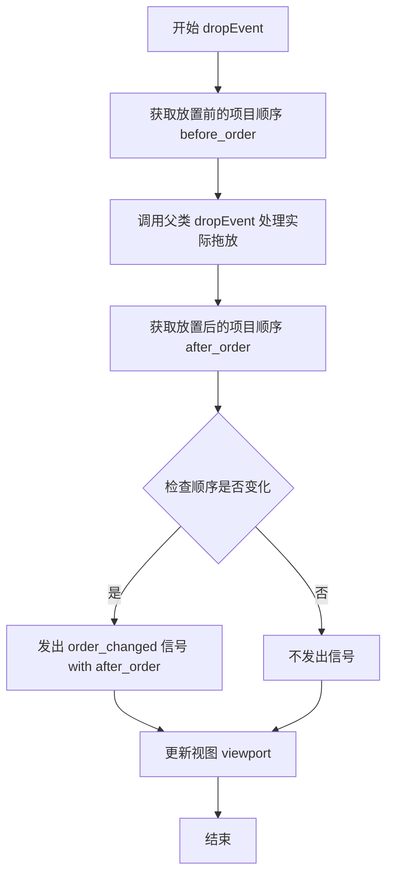
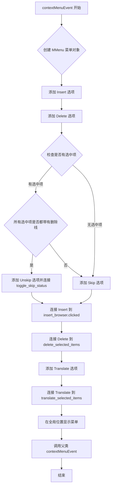
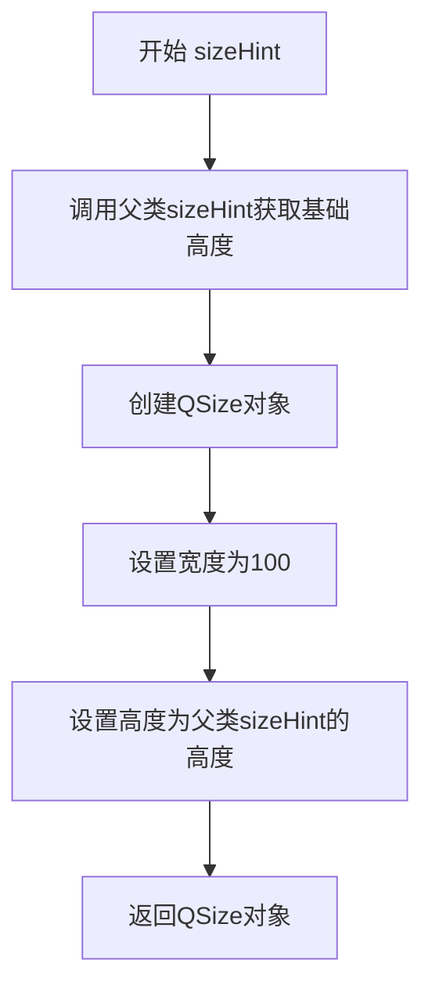
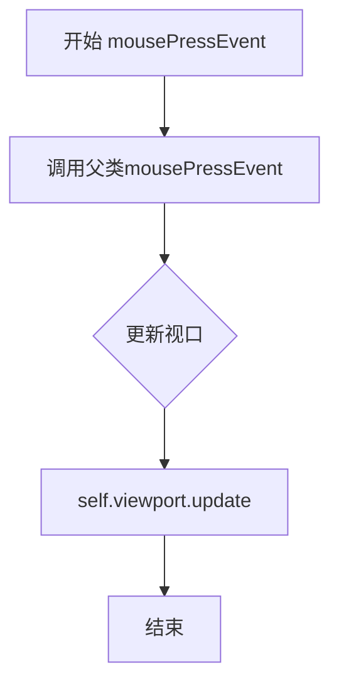
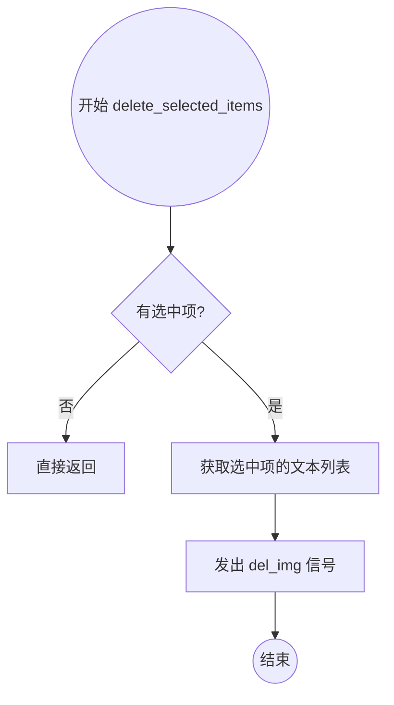
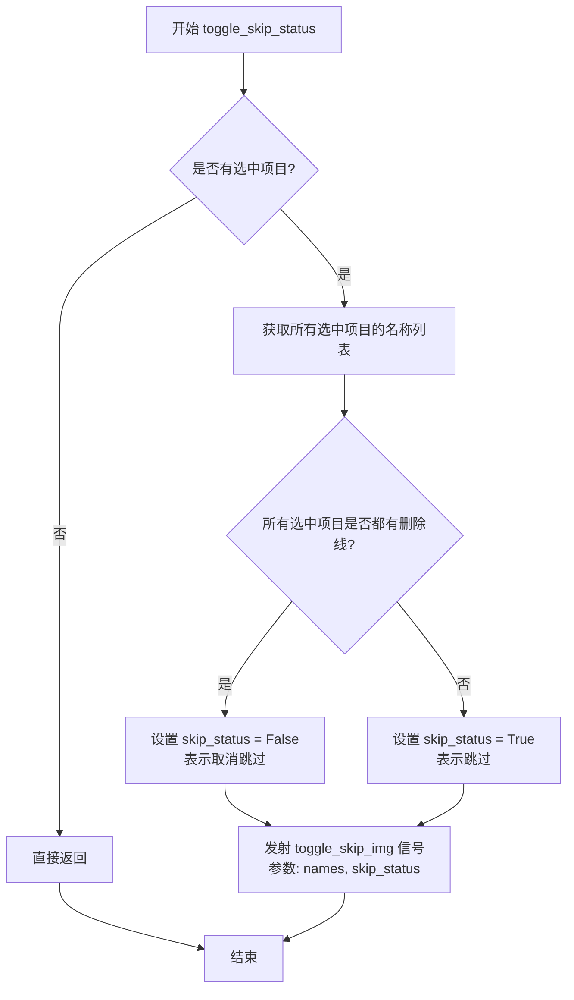
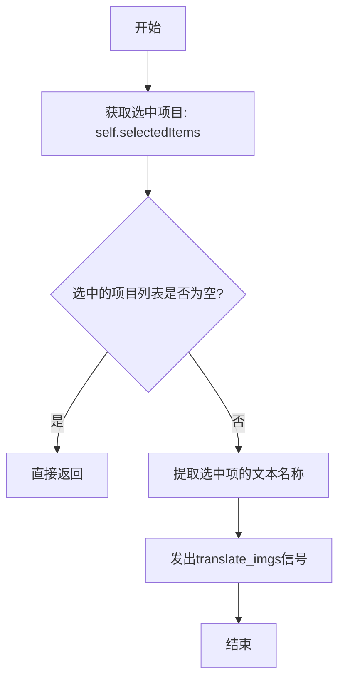

# `comic-translate\app\ui\list_view.py` 详细设计文档

基于PySide6 QListWidget的自定义列表视图组件，用于显示和管理图像/文件列表，支持多选、拖拽排序、上下文菜单操作（插入、删除、跳过/取消跳过、翻译），并通过信号与外部进行数据交互。

## 整体流程



## 类结构

```
QListWidget (Qt基类)
└── PageListView (自定义列表视图)
```

## 全局变量及字段


### `PageListView.del_img`
    
删除图像信号

类型：`Signal(list)`
    


### `PageListView.toggle_skip_img`
    
切换跳过状态信号

类型：`Signal(list, bool)`
    


### `PageListView.translate_imgs`
    
翻译图像信号

类型：`Signal(list)`
    


### `PageListView.selection_changed`
    
选择变更信号

类型：`Signal(list)`
    


### `PageListView.order_changed`
    
顺序变更信号

类型：`Signal(list)`
    


### `PageListView.insert_browser`
    
文件浏览器按钮

类型：`MClickBrowserFilePushButton`
    
    

## 全局函数及方法


### `PageListView.__init__`

这是 `PageListView` 类的初始化方法，负责配置 QListWidget 的基本属性、信号连接以及初始化 UI 元素。该方法设置列表视图的间距、尺寸策略、拖拽行为和选择模式等，使其适合作为图像/页面列表的容器。

参数：

- 无显式参数（`self` 为隐式参数）

返回值：`None`，无返回值

#### 流程图



#### 带注释源码

```python
def __init__(self) -> None:
    """
    初始化 PageListView 实例。
    配置 QListWidget 的基本属性、信号槽和 UI 元素。
    """
    # 调用父类 QListWidget 的构造函数
    super().__init__()
    
    # 设置列表项之间的间距为 5 像素
    self.setSpacing(5)
    
    # 设置最小宽度为 100 像素，防止列表过窄
    self.setMinimumWidth(100)
    
    # 设置焦点策略为 NoFocus，使控件不接收键盘焦点
    self.setFocusPolicy(Qt.FocusPolicy.NoFocus)
    
    # 设置选择模式为 ExtendedSelection，支持多选
    self.setSelectionMode(QAbstractItemView.SelectionMode.ExtendedSelection)
    
    # 设置拖放模式为 InternalMove，允许在列表内部拖拽排序
    self.setDragDropMode(QAbstractItemView.DragDropMode.InternalMove)
    
    # 启用拖拽功能
    self.setDragEnabled(True)
    
    # 接受拖放事件
    self.setAcceptDrops(True)
    
    # 显示放置指示器，提示用户可以在哪里放置
    self.setDropIndicatorShown(True)
    
    # 设置默认动作为移动操作
    self.setDefaultDropAction(Qt.DropAction.MoveAction)
    
    # 设置尺寸策略：水平方向最小扩展，垂直方向首选
    self.setSizePolicy(QSizePolicy.Policy.MinimumExpanding, QSizePolicy.Policy.Preferred)
    
    # 初始化 UI 元素（创建文件浏览按钮等）
    self.ui_elements()
    
    # 连接选择模型的变化信号到自定义处理方法
    # 当用户选择/取消选择列表项时，触发 _on_selection_changed
    self.selectionModel().selectionChanged.connect(self._on_selection_changed)
```


### `PageListView.ui_elements`

初始化UI元素，创建文件浏览器按钮并配置支持的文件过滤器（图片格式和文档格式），用于插入图像文件。

参数：
- 无（该方法为实例方法，隐式接收 `self` 参数）

返回值：`None`，无返回值

#### 流程图



#### 带注释源码

```python
def ui_elements(self):
    """
    初始化UI元素，创建文件浏览器按钮并配置支持的文件过滤器。
    
    该方法创建了一个多选文件浏览器按钮，用于选择图像文件和文档文件，
    支持的文件类型包括常见图片格式和电子书/漫画格式。
    """
    # 创建支持多选的文件浏览器按钮
    self.insert_browser = MClickBrowserFilePushButton(multiple=True)
    
    # 配置支持的文件过滤器
    # 图片格式: PNG, JPEG, WebP, BMP
    # 文档格式: ZIP, CBZ, CBR, CB7, CBT (漫画压缩格式)
    # 电子书格式: PDF, EPUB
    self.insert_browser.set_dayu_filters([".png", ".jpg", ".jpeg", ".webp", ".bmp",
                                           ".zip", ".cbz", ".cbr", ".cb7", ".cbt",
                                           ".pdf", ".epub"])
```


### `PageListView._on_selection_changed`

处理列表选择变更事件的方法，当用户选择或取消选择列表项时调用，收集当前选中项的索引并通过信号发出。

参数：

- `self`：`PageListView`，方法的拥有者对象
- `selected`：`QItemSelection`，当前被选中的项目集合（Qt 内部使用）
- `deselected`：`QItemSelection`，当前被取消选中的项目集合（Qt 内部使用）

返回值：`None`，无返回值，仅通过信号传递数据

#### 流程图

```mermaid
flowchart TD
    A[_on_selection_changed 被调用] --> B[初始化空列表 selected_indices]
    B --> C[遍历 self.selectedItems]
    C --> D{遍历是否结束?}
    D -->|否| E[获取当前项的索引: index = self.row(item)]
    E --> F{索引是否有效?}
    F -->|是| G[将索引添加到 selected_indices]
    F -->|否| D
    G --> D
    D -->|是| H[发射信号: self.selection_changed.emit(selected_indices)]
    H --> I[流程结束]
```

#### 带注释源码

```
def _on_selection_changed(self, selected, deselected):
    """Handle selection changes and emit signal with selected indices."""
    # 初始化一个空列表，用于存储当前选中的项目索引
    selected_indices = []
    
    # 遍历所有当前被选中的项目（由 Qt 的选择模型提供）
    for item in self.selectedItems():
        # 获取该项目在列表中的行索引
        index = self.row(item)
        
        # 确保索引有效（大于等于0）
        if index >= 0:
            # 将有效索引添加到列表中
            selected_indices.append(index)
    
    # 发射自定义信号，通知外部当前选中的项目索引列表
    # 接收者可以通过这个信号获取选中项信息进行相应处理
    self.selection_changed.emit(selected_indices)
```


### `PageListView._item_identity`

获取给定列表项的唯一标识符。如果项在 `UserRole` 中存储了自定义数据（如文件路径），则返回该数据；否则返回项的显示文本。

参数：

- `item`：`QListWidgetItem`，需要获取标识符的列表项对象。

返回值：`str`，项的唯一标识符。

#### 流程图

```mermaid
graph TD
    A([Start: 输入 item]) --> B[获取 item.data(Qt.UserRole)]
    B --> C{数据是字符串且非空?}
    C -- Yes --> D[Return data]
    C -- No --> E[Return item.text()]
    D --> F([End])
    E --> F
```

#### 带注释源码

```python
def _item_identity(self, item) -> str:
    # 尝试获取项中存储的自定义用户数据（通常用于存储文件路径等唯一标识）
    data = item.data(Qt.ItemDataRole.UserRole)
    
    # 检查数据是否存在且为非空字符串
    if isinstance(data, str) and data:
        # 如果存在有效的自定义数据，则返回该数据作为标识
        return data
    
    # 如果没有自定义数据，则回退使用项的显示文本作为标识
    return item.text()
```


### `PageListView._current_item_order`

该方法用于获取列表视图（QListWidget）中当前所有项目的顺序。它通过遍历列表中的每一项，利用 `_item_identity` 方法获取每一项的唯一标识（优先使用 `UserRole` 数据，否则使用文本），并将这些标识按当前顺序存入列表并返回。

参数：

-  `self`：`PageListView`，表示类实例本身。

返回值：`list[str]`，返回一个包含所有项目标识符的列表，列表顺序即为当前列表视图中的项目顺序。

#### 流程图

```mermaid
flowchart TD
    A([开始 _current_item_order]) --> B[初始化空列表: order]
    B --> C{遍历索引 idx 从 0 到 count-1}
    C --> D[获取索引处的项目: item = self.item(idx)]
    D --> E{项目是否存在?}
    E -- 是 --> F[获取项目标识: identity = self._item_identity(item)]
    F --> G[将 identity 添加到 order 列表]
    G --> C
    E -- 否 --> C
    C --> H{遍历结束?}
    H -- 是 --> I([返回 order 列表])
```

#### 带注释源码

```python
def _current_item_order(self) -> list[str]:
    """
    获取当前列表视图中的项目顺序。
    遍历所有项目，收集每个项目的标识符（优先 UserRole 数据，否则使用文本）。
    
    返回:
        list[str]: 按当前顺序排列的项目标识符列表。
    """
    # 1. 初始化一个空列表用于存储顺序
    order = []
    
    # 2. 遍历列表中的所有项 (从索引 0 到 总数-1)
    for idx in range(self.count()):
        # 获取当前索引位置的列表项对象
        item = self.item(idx)
        
        # 3. 检查项目对象是否有效（不为空）
        if item:
            # 4. 调用内部方法获取该项的唯一标识，并追加到列表末尾
            # _item_identity 负责处理是使用 data 还是 text 的逻辑
            order.append(self._item_identity(item))
            
    # 5. 返回收集到的顺序列表
    return order
```


### `PageListView.dropEvent`

该方法重写了QListWidget的拖拽放置事件，用于在内部拖放操作完成后检测列表项顺序是否发生变化，并在顺序发生改变时发出`order_changed`信号通知外部组件，同时更新视图以刷新显示。

参数：

- `event`：`QDropEvent`，Qt的拖拽放置事件对象，包含拖放操作的相关信息（如放置位置、拖拽的数据等）

返回值：`None`，该方法无返回值，主要通过信号机制向外传递顺序变化信息

#### 流程图



#### 带注释源码

```python
def dropEvent(self, event: QDropEvent):
    """
    处理拖拽放置事件。
    在父类处理完拖放操作后，检查列表项顺序是否发生变化，
    若发生变化则发出 order_changed 信号。
    
    参数:
        event: QDropEvent - Qt拖拽放置事件对象
    """
    # 步骤1: 在处理拖放前，记录当前所有项目的顺序
    before_order = self._current_item_order()
    
    # 步骤2: 调用父类的dropEvent方法，执行Qt内置的拖放处理逻辑
    # 这会实际改变列表中的项目位置
    super().dropEvent(event)
    
    # 步骤3: 在拖放处理后，再次获取项目的当前顺序
    after_order = self._current_item_order()
    
    # 步骤4: 检查顺序是否发生变化
    # 条件: 有项目存在 且 顺序与放置前不同
    if after_order and after_order != before_order:
        # 发出 order_changed 信号，传递新的顺序列表
        self.order_changed.emit(after_order)
    
    # 步骤5: 更新视口，确保界面正确刷新显示
    self.viewport().update()
```


### `PageListView.contextMenuEvent`

该方法处理列表视图的右键上下文菜单事件，当用户右键点击列表项时触发。它创建一个包含“Insert”、“Delete”、“Skip/Unskip”和“Translate”选项的自定义菜单，并根据选中项目的状态（是否被划掉）动态决定显示“Skip”还是"Unskip"选项，最后将菜单显示在鼠标当前位置。

参数：

- `event`：`QContextMenuEvent`，右键菜单事件对象，包含触发菜单的位置（全局位置和局部位置）以及触发位置的项目信息

返回值：`None`，该方法不返回值，通过菜单动作触发相应的信号槽机制

#### 流程图



#### 带注释源码

```python
def contextMenuEvent(self, event: QContextMenuEvent):
    """处理右键菜单事件，显示自定义上下文菜单。
    
    参数:
        event: QContextMenuEvent，包含了触发菜单的位置信息
    """
    # 创建自定义菜单对象，父对象为当前列表视图
    menu = MMenu(parent=self)
    
    # 添加"Insert"插入选项
    insert = menu.addAction(self.tr('Insert'))
    
    # 添加"Delete"删除选项
    delete_act = menu.addAction(self.tr('Delete'))

    # 获取当前选中的项目列表
    selected = self.selectedItems()
    
    # 判断是否显示"Skip"或"Unskip"选项
    # 如果有选中项，且所有选中项都有删除线（strikeOut），则显示"Unskip"
    if selected and all(item.font().strikeOut() for item in selected):
        action = menu.addAction(self.tr('Unskip'))  # 添加取消跳过选项
        action.triggered.connect(self.toggle_skip_status)  # 连接切换跳过状态方法
    else:
        action = menu.addAction(self.tr('Skip'))  # 添加跳过选项
        action.triggered.connect(self.toggle_skip_status)  # 连接切换跳过状态方法

    # 将Insert选项连接到浏览器按钮的点击信号
    insert.triggered.connect(self.insert_browser.clicked)
    
    # 将Delete选项连接到删除选中项的方法
    delete_act.triggered.connect(self.delete_selected_items)

    # 添加翻译选项
    translate_act = menu.addAction(self.tr('Translate'))
    translate_act.triggered.connect(self.translate_selected_items)

    # 在鼠标全局位置显示上下文菜单
    menu.exec_(event.globalPos())
    
    # 调用父类的contextMenuEvent处理默认行为
    super().contextMenuEvent(event)
```


### `PageListView.sizeHint`

该方法重写了QListWidget的sizeHint，用于提供自定义的尺寸建议。固定宽度为100像素，高度自适应为父类sizeHint的高度，从而在列表视图初始化时提供一个合理的默认尺寸。

参数：无（仅包含隐含的self参数）

返回值：`QSize`，返回建议的窗口尺寸，其中宽度固定为100像素，高度由父类sizeHint方法确定

#### 流程图



#### 带注释源码

```python
def sizeHint(self) -> QSize:
    # Provide a reasonable default size
    # 返回一个自定义的QSize对象
    # 宽度固定为100像素，高度使用父类sizeHint的高度
    # 这样可以确保列表视图有一个合理的最小宽度，同时保持高度的自适应性
    return QSize(100, super().sizeHint().height())
```


### `PageListView.mousePressEvent`

该方法是`PageListView`类的鼠标按下事件处理函数，用于重写QListWidget的默认鼠标按下行为，在处理完父类事件后强制更新视口以确保UI正确刷新。

参数：

- `self`：`PageListView`，表示当前`PageListView`实例本身
- `event`：`QMouseEvent`，Qt鼠标事件对象，包含鼠标按键、位置等事件信息

返回值：`None`，该方法为事件处理函数，不返回任何值

#### 流程图



#### 带注释源码

```
def mousePressEvent(self, event):
    """
    鼠标按下事件处理函数
    
    重写QListWidget的mousePressEvent，在处理完父类事件后
    强制更新视口以确保UI状态正确刷新
    
    参数:
        event: QMouseEvent - Qt鼠标事件对象，包含鼠标按键、位置等信息
    """
    # 调用父类(QListWidget)的mousePressEvent处理默认行为
    # 父类会处理如选中项、拖拽开始等默认逻辑
    super().mousePressEvent(event)
    
    # 强制更新视口区域，确保UI正确重绘
    # 这对于保持选中状态、拖拽指示器等UI元素的正确显示很重要
    self.viewport().update()
```

#### 备注

该方法是一个典型的**装饰性重写**（decorative override），其核心功能非常简洁：
1. **委托父类处理**：将主要的鼠标事件处理逻辑委托给父类`QListWidget`执行
2. **强制刷新**：在父类处理完成后立即更新视口，确保拖拽指示器、选中状态等UI元素能够正确显示

这种模式常见于需要保持父类默认行为同时添加额外UI更新的场景。


### `PageListView.setCurrentItem`

该方法是对 `QListWidget` 标准方法的覆盖。它首先调用父类逻辑将指定项设置为当前选中项，随后显式调用 `viewport().update()` 强制刷新视图区域。这是为了确保自定义的绘制效果（如“跳过”状态下的删除线样式）能够立即在界面上生效，避免因 Qt 事件循环延迟导致的视觉不同步。

参数：
-  `item`：`QListWidgetItem`，需要设置为当前选中状态的项目对象。

返回值：`None`，该方法不返回任何值。

#### 流程图

```mermaid
graph TD
    A[Start setCurrentItem] --> B[Call super().setCurrentItem item]
    B --> C[Call self.viewport().update]
    C --> D[End]
```

#### 带注释源码

```python
def setCurrentItem(self, item):
    # 1. 调用父类 QListWidget 的 setCurrentItem 方法
    #    执行 Qt 内部的选中逻辑，高亮显示该行并设置当前索引
    super().setCurrentItem(item)
    
    # 2. 强制更新视图端口 (viewport)
    #    由于此类中项目可能包含自定义样式（如 strikeOut 字体），
    #    直接调用 update() 可确保 UI 立即重绘，防止选中状态与实际显示不同步
    self.viewport().update()
```


### `PageListView.delete_selected_items`

该方法用于处理列表视图中选中项的删除操作。它首先获取当前已选中的列表项（QListWidgetItem），若选中项为空则直接返回；否则提取选中项的文本内容（通常为文件路径或文件名），并通过类信号 `del_img` 将其发送出去，以通知上层逻辑（如控制器）执行实际的文件或数据删除。

参数：

-  `self`：`PageListView`，调用此方法的类实例本身。

返回值：`None`，无返回值。该方法在无选中项时直接返回，否则发出信号后结束。

#### 流程图



#### 带注释源码

```python
def delete_selected_items(self):
    """
    删除当前选中的项目。
    通过获取选中项的文本信息，并发射信号通知外部进行删除处理。
    """
    # 1. 获取当前列表中被选中的所有项目对象 (QListWidgetItem 列表)
    selected_items = self.selectedItems()
    
    # 2. 检查是否有选中项。如果没有选中项，则直接结束函数，避免无效操作。
    if not selected_items:
        return

    # 3. 使用列表推导式提取选中项的显示文本 (通常为文件名或路径)
    selected_file_names = [item.text() for item in selected_items]
    
    # 4. 发射自定义信号 del_img，携带选中文件的名称列表。
    #    连接的槽函数（Slot）负责具体的文件删除逻辑，实现解耦。
    self.del_img.emit(selected_file_names)
```


### `PageListView.toggle_skip_status`

该方法用于切换选中项目的跳过状态。当用户通过右键菜单选择"Skip"或"Unskip"时，根据当前选中项目的字体是否有删除线（strikeOut）来判断是跳过还是取消跳过，并将操作结果通过信号发送给对应的处理函数。

参数： 无（仅包含隐式参数 `self`）

返回值：`None`，该方法无返回值，通过信号机制传递操作结果

#### 流程图



#### 带注释源码

```python
def toggle_skip_status(self):
    """
    切换选中项目的跳过状态。
    如果所有选中项目都被标记为跳过（显示删除线），则取消跳过；
    否则将选中项目标记为跳过。
    """
    # 获取当前所有选中的项目
    selected = self.selectedItems()
    
    # 如果没有选中任何项目，直接返回，不做任何操作
    if not selected:
        return
        
    # 提取选中项目的文本名称，生成列表
    names = [item.text() for item in selected]
    
    # 判断当前跳过状态：
    # 如果所有选中项目的字体都有删除线（strikeOut返回True），
    # 说明当前是"已跳过"状态，则设置skip_status为False（取消跳过）
    # 否则设置skip_status为True（标记为跳过）
    skip_status = not all(item.font().strikeOut() for item in selected)
    
    # 发射toggle_skip_img信号，通知外部：
    # - names: 被操作的项目名称列表
    # - skip_status: 目标状态（True=跳过, False=取消跳过）
    self.toggle_skip_img.emit(names, skip_status)
```


### `PageListView.translate_selected_items`

该方法用于获取列表视图中当前被选中的项目，并将这些选中项的名称文本通过 `translate_imgs` 信号发送出去，以触发后续的翻译操作。

参数：
- 该方法无显式参数（隐含参数 `self` 为实例自身）

返回值：`None`，无返回值

#### 流程图



#### 带注释源码

```python
def translate_selected_items(self):
    """
    翻译当前选中的项目。
    获取列表中所有被选中的项目，提取其文本名称，
    并通过 translate_imgs 信号发送出去以触发翻译操作。
    """
    # 获取当前被选中的所有项目对象列表
    selected = self.selectedItems()
    
    # 如果没有选中任何项目，直接返回，不发送信号
    if not selected:
        return
    
    # 从每个选中项中提取文本内容，形成名称列表
    names = [item.text() for item in selected]
    
    # 发出翻译信号，传递选中项的名称列表
    # 该信号会被外部槽函数接收并处理翻译逻辑
    self.translate_imgs.emit(names)
```

## 关键组件


### PageListView 核心类

该类是整个组件的主体，继承自 PySide6 的 QListWidget。它负责维护一个图像/文件列表的视图，配置了包括多选、拖拽移动、焦点策略等基本的列表交互行为，并集成了 UI 元素初始化和信号槽连接。

### 信号系统 (Signals)

定义了一系列自定义 Qt 信号用于与外部业务逻辑解耦通信。`del_img` 处理删除，`toggle_skip_img` 处理跳过/恢复状态切换，`translate_imgs` 处理翻译请求，`selection_changed` 同步选中项索引，`order_changed` 同步拖拽排序后的新顺序。

### 拖放排序功能 (Drag & Drop)

通过重写 `dropEvent` 方法实现。它在拖拽释放时记录当前列表顺序，与拖拽前的顺序进行对比。如果检测到顺序发生变化（且列表非空），则发出 `order_changed` 信号，通知上层进行数据重排序。

### 动态上下文菜单 (Context Menu)

在 `contextMenuEvent` 中根据当前选中项的视觉状态动态构建右键菜单。特别之处在于，它会检查所有选中项的字体是否为“删除线”状态，据此决定显示“Skip”还是"Unskip"选项，并绑定对应的触发函数。

### 选择与状态管理 (Selection Management)

实现了 `_on_selection_changed` 槽函数，监听 Qt 的选择模型变化。它遍历所有选中的项目，将视觉上的 `QListWidgetItem` 转换为对应的行索引列表（index），并通过 `selection_changed` 信号发出，供外部组件（如详情面板）使用。

### 文件浏览器集成 (File Browser)

在 `ui_elements` 中实例化了 `MClickBrowserFilePushButton`。该组件被配置为支持多种文件类型（图片如 .png/.jpg，压缩包如 .zip/.cbz，文档如 .pdf），并作为“Insert”功能的入口，允许用户通过文件对话框批量添加内容到列表中。


## 问题及建议


```json
[
  {
    "title": "已知问题",
    "content": [
      "状态与视图耦合：Skip/Unskip 菜单项的逻辑判断完全依赖于 `item.font().strikeOut()`（字体删除线样式），将业务逻辑（是否跳过）与视图渲染（字体样式）强耦合。如果在其他地方修改字体逻辑不一致，会导致菜单显示错误的状态。",
      "类型提示不足：类中大量方法缺少参数和返回值的类型注解（如 `_on_selection_changed`, `contextMenuEvent` 等），Signal 定义也较为宽泛（如 `Signal(list)`），降低了代码的可读性和静态检查工具的效力。",
      "冗余的 UI 更新：`viewport().update()` 在 `dropEvent`、`mousePressEvent` 和 `setCurrentItem` 中被多次显式调用，可能导致不必要的重绘性能开销，尽管 Qt 本身有优化，但这种“宁可多刷不可少刷”的策略在大量数据时可能造成卡顿。",
      "上下文菜单重复创建：每次右键点击都会重新实例化 `MMenu` 并动态添加 Action，虽然对于简单菜单开销不大，但未复用菜单对象，不符合 UI 性能优化最佳实践。",
      "逻辑重复与冗余计算：在 `contextMenuEvent` 中遍历 `selectedItems` 判断是否为 Skip 状态，随后在 `toggle_skip_status` 槽函数中再次遍历相同的选中项进行相同判断，造成计算浪费。"
    ]
  },
  {
    "title": "优化建议",
    "content": [
      "引入数据模型解耦：建议使用自定义的 `Qt.ItemDataRole` (例如 `Qt.UserRole + 1`) 来存储图片的“跳过状态”（布尔值），而不是依赖字体样式。类方法应直接读取/修改该数据角色，菜单逻辑根据该数据决定显示“Skip”还是“Unskip”。",
      "完善类型注解：为所有方法添加类型提示，特别是继承自 Qt 的事件处理方法（如 `contextMenuEvent(self, event: QContextMenuEvent) -> None`），并将 Signal 定义具体化（如 `selection_changed = Signal(list)` -> `selection_changed: Signal = Signal(list)` 虽已是具体，但内部处理建议使用 `list[int]`）。",
      "移除冗余刷新：审查并移除非必要的 `viewport().update()` 调用。通常在数据模型修改后，Qt 的 Model/View 机制会自动触发更新，除非遇到特定的绘制Bug，否则无需手动强制刷新。",
      "优化菜单逻辑：将“判断是否为 Skip 状态”的逻辑提取为一个独立方法 `def _is_skip_state(self) -> bool`，在构建菜单和执行 toggle 操作时复用此方法，减少代码重复和遍历开销。",
      "考虑菜单复用：如果未来菜单项增加，可以考虑缓存 `MMenu` 实例，仅在显示前更新其中 Action 的状态（如启用/禁用、文本更改），避免重复创建对象。"
    ]
  }
]
```

## 其它


### 设计目标与约束

本组件旨在提供一个可排序的图像/文件列表视图，支持多选、拖拽重排、右键上下文菜单操作，并与外部图像处理模块解耦。设计约束包括：依赖PySide6框架，仅支持桌面端应用，列表项需包含文本或UserRole数据作为唯一标识，不支持分层嵌套结构。

### 错误处理与异常设计

代码中错误处理较少，主要通过信号机制传递操作结果。潜在异常包括：拖拽排序时item数据为None、selectedItems()返回空列表时触发信号、多选模式下selection_changed信号发射空列表。这些场景通过提前检查（如`if not selected:`）避免异常，但缺少日志记录和用户友好的错误提示。异常设计原则：静默失败并返回默认值，通过信号通知外部处理。

### 数据流与状态机

数据流主要包含三个方向：外部数据注入（通过addItem/addItems或model设置）、用户交互触发（选择、拖拽、菜单操作）、状态变化向上传递（通过Signal）。关键状态包括：选中状态（QItemSelectionModel）、跳过状态（通过QFont.strikeOut()标记）、顺序状态（基于item的UserRole或text）。状态转换由Qt内置SelectionModel和DragDropMode管理，顺序变更通过dropEvent比较前后order实现。

### 外部依赖与接口契约

核心依赖包括：PySide6.QtWidgets（QListWidget及相关）、PySide6.QtCore（Signal、Qt、QSize）、PySide6.QtGui（QContextMenuEvent、QDropEvent）、自定义组件MMenu和MClickBrowserFilePushButton。接口契约：del_img信号传递文件名字符串列表；toggle_skip_img信号传递文件名字符串列表和布尔值；translate_imgs信号传递文件名字符串列表；selection_changed信号传递索引整数列表；order_changed信号传递标识符字符串列表。

### 性能考虑与优化空间

性能热点：_current_item_order()方法在每次dropEvent中调用两次（全量遍历count个item）；_on_selection_changed在每次选择变化时遍历所有selectedItems。优化建议：使用model的dataChanged信号而非全量遍历；将item_identity缓存避免重复查询UserRole；contextMenuEvent中每次创建新MMenu可考虑复用；setSpacing和setMinimumWidth在多次实例化时可能影响渲染性能。

### 安全性考虑

当前代码未对输入进行验证：delete_selected_items和translate_selected_items直接使用item.text()作为文件名，未校验路径遍历攻击；dropEvent未验证dropped data来源；_item_identity返回data可能包含敏感信息。安全建议：对文件路径进行规范化检查、验证UserRole数据类型，限制拖拽接受的数据类型。

### 兼容性考虑

PySide6版本兼容性：代码使用PySide6扩展语法（如QSizePolicy.Policy枚举），需确认PySide6版本≥6.2。Qt版本：依赖Qt6某些特性（如QSizePolicy枚举类结构）。跨平台：需确保MMenu和MClickBrowserFilePushButton在目标平台可用。Python版本：需Python 3.7+支持类型注解。

### 测试策略建议

单元测试覆盖：_item_identity的数据类型处理、_current_item_order的顺序获取、toggle_skip_status的skip_status逻辑计算、selection_changed信号发射正确性。集成测试：拖拽排序后order_changed信号验证、多种选中模式下的菜单项显示逻辑、右键菜单各action触发验证。边界条件：空列表操作、单选转多选、全选后部分删除。

### 使用示例与集成指南

```python
from your_module import PageListView

# 创建实例
list_view = PageListView()

# 连接信号处理器
def handle_delete(files):
    print(f"Delete: {files}")
    
def handle_order(order):
    print(f"New order: {order}")

list_view.del_img.connect(handle_delete)
list_view.order_changed.connect(handle_order)

# 添加项目
for i in range(5):
    item = QListWidgetItem(f"image_{i}.png")
    item.setData(Qt.ItemDataRole.UserRole, f"uuid_{i}")
    list_view.addItem(item)
```

集成注意事项：确保MMenu和MClickBrowserFilePushButton已正确导入，父窗口需设置合适的布局约束以发挥MinimumExpanding策略。


    