# `comic-translate\app\ui\list_view_image_loader.py` 详细设计文档

一个基于PySide6的QListWidget延迟图片加载器，通过后台线程按需加载和调整图片大小，仅在可见区域（包括缓冲区域）内加载图片，并实现了内存管理以限制加载的图片数量。

## 整体流程

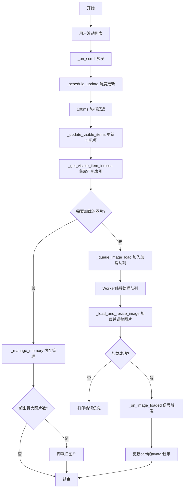

## 类结构

```
QObject (PySide6基类)
└── ImageLoadWorker (图片加载工作线程)

ListViewImageLoader (主加载器类)
```

## 全局变量及字段


### `ImageLoadWorker.load_queue`
    
图片加载队列，存储待加载的图片索引、路径和目标尺寸

类型：`list[tuple[int, str, QSize]]`
    


### `ImageLoadWorker.should_stop`
    
停止标志，用于控制工作线程是否停止处理

类型：`bool`
    


### `ImageLoadWorker.process_timer`
    
队列处理定时器，定期触发处理加载队列

类型：`QTimer`
    


### `ListViewImageLoader.list_widget`
    
目标列表控件，用于显示图片列表

类型：`QListWidget`
    


### `ListViewImageLoader.avatar_size`
    
头像尺寸，指定加载图片的目标大小

类型：`QSize`
    


### `ListViewImageLoader.loaded_images`
    
已加载图片缓存，存储索引到QPixmap的映射

类型：`dict[int, QPixmap]`
    


### `ListViewImageLoader.visible_items`
    
可见项索引集合，记录当前可视区域内的列表项索引

类型：`Set[int]`
    


### `ListViewImageLoader.file_paths`
    
图片文件路径列表，存储所有待加载图片的路径

类型：`list[str]`
    


### `ListViewImageLoader.cards`
    
卡片控件引用列表，存储与列表项对应的卡片widget引用

类型：`list`
    


### `ListViewImageLoader.worker_thread`
    
后台工作线程，用于异步加载图片

类型：`QThread`
    


### `ListViewImageLoader.worker`
    
图片加载工作者，负责具体的图片加载和处理逻辑

类型：`ImageLoadWorker`
    


### `ListViewImageLoader.update_timer`
    
更新定时器，用于防抖处理滚动事件

类型：`QTimer`
    


### `ListViewImageLoader.max_loaded_images`
    
最大缓存图片数，限制内存中最多保留的图片数量

类型：`int`
    


### `ListViewImageLoader.preload_buffer`
    
预加载缓冲项数，指定可视区域外预加载的项数

类型：`int`
    
    

## 全局函数及方法


### `ImageLoadWorker.__init__`

构造函数，用于初始化 ImageLoadWorker 对象，设置加载队列、停止标志位，并启动定时器用于周期性处理队列中的图像加载任务。

参数：

- 无显式参数（`self` 为隐式参数）

返回值：`None`，构造函数无返回值，仅完成对象初始化

#### 流程图

```mermaid
flowchart TD
    A[开始 __init__] --> B[调用 super().__init__ 初始化基类]
    B --> C[初始化 load_queue = []]
    C --> D[初始化 should_stop = False]
    D --> E[创建 QTimer 实例 process_timer]
    E --> F[将 timeout 信号连接到 process_queue 方法]
    F --> G[启动定时器，间隔 50ms]
    G --> H[结束 __init__]
```

#### 带注释源码

```python
def __init__(self):
    super().__init__()  # 调用 QObject 基类的构造函数，确保 Qt 对象正确初始化
    self.load_queue = []  # 初始化空列表，用于存储待加载图像的任务队列
    self.should_stop = False  # 初始化停止标志位，False 表示 worker 正在运行
    
    # Timer for processing queue
    self.process_timer = QTimer()  # 创建 QTimer 实例，用于定时触发队列处理
    self.process_timer.timeout.connect(self.process_queue)  # 将定时器的 timeout 信号连接到 process_queue 方法
    self.process_timer.start(50)  # 启动定时器，每 50ms 触发一次队列处理
```


### `ImageLoadWorker.add_to_queue`

将图像加载任务添加到待处理队列中，并自动去重以避免重复加载相同索引的图像。

参数：

- `index`：`int`，图像在列表中的索引位置，用于标识和关联加载后的图像
- `file_path`：`str`，图像文件的完整路径，指向待加载的图像资源
- `target_size`：`QSize`，图像的目标尺寸，加载后会被缩放至该尺寸

返回值：`None`，该方法无返回值，仅执行队列添加操作

#### 流程图

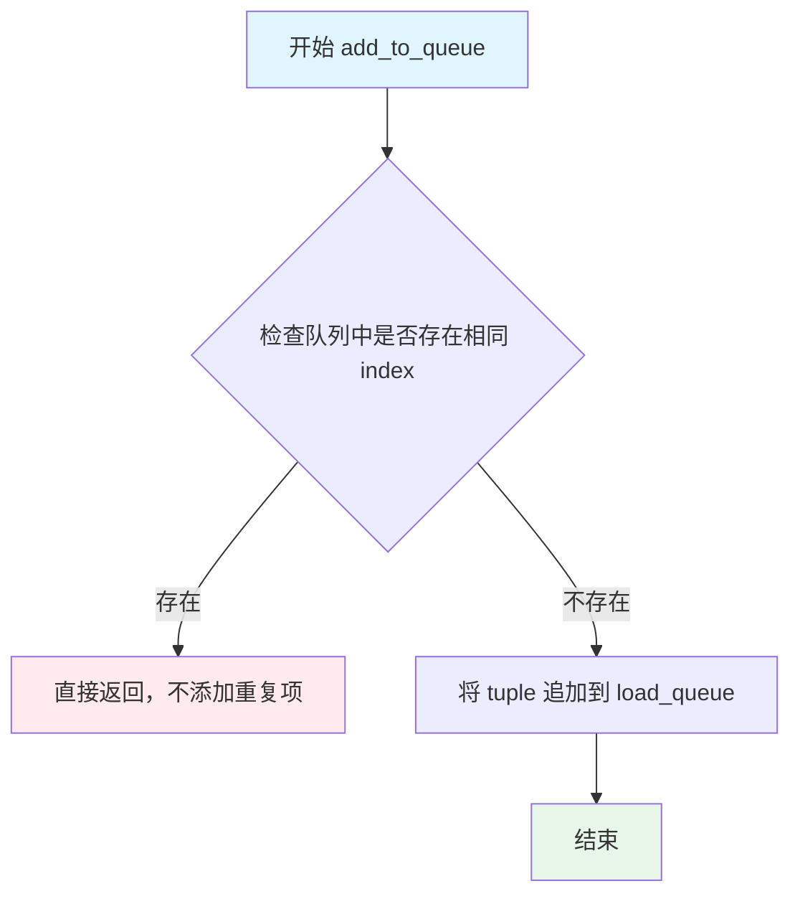

#### 带注释源码

```python
def add_to_queue(self, index: int, file_path: str, target_size: QSize):
    """Add an image to the loading queue."""
    
    # 遍历现有队列，检查是否已存在相同 index 的待加载项
    # 避免重复添加导致图像被多次加载，浪费资源
    for queued_index, _, _ in self.load_queue:
        if queued_index == index:
            return  # 找到重复项，直接返回，不进行任何操作
    
    # 未发现重复项，将新的加载任务添加到队列末尾
    # 队列项为三元组：(index, file_path, target_size)
    self.load_queue.append((index, file_path, target_size))
```


### `ImageLoadWorker.clear_queue`

清除图像加载队列中的所有待处理项。

参数：无

返回值：`None`，无返回值（该方法直接修改对象内部状态）

#### 流程图

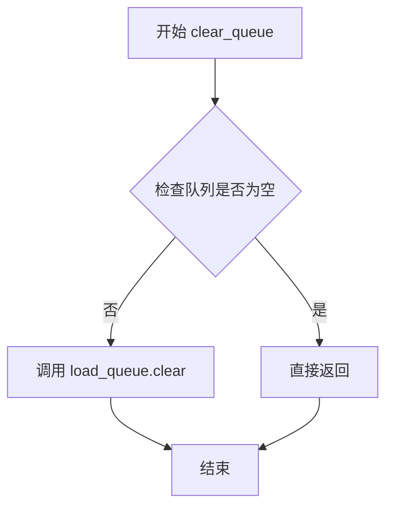

#### 带注释源码

```python
def clear_queue(self):
    """Clear the loading queue."""
    # 清除 load_queue 列表中的所有元素
    # 这是一个原地操作，不会创建新的列表对象
    # 执行后 load_queue 变为空列表 []
    self.load_queue.clear()
```


### `ImageLoadWorker.stop`

停止后台图像加载工作线程，停止队列处理计时器并标记为停止状态。

参数： None

返回值： `None`，无返回值

#### 流程图

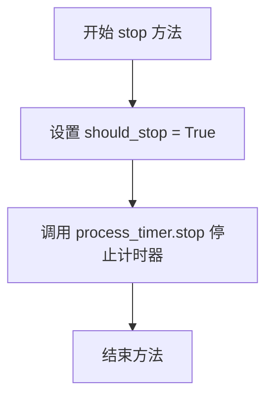

#### 带注释源码

```python
def stop(self):
    """Stop the worker."""
    # 设置停止标志，阻止后续图像加载处理
    self.should_stop = True
    # 停止定时器，不再触发队列处理
    self.process_timer.stop()
```


### `ImageLoadWorker.process_queue`

处理加载队列中的下一个图像任务，从队列中取出待处理的图像路径和目标尺寸，加载并调整图像大小，如果成功则发射加载完成的信号。

参数：

- 该方法无显式参数（仅使用实例属性 `self.load_queue`、`self.should_stop`）

返回值：`None`，无返回值

#### 流程图

```mermaid
flowchart TD
    A[开始 process_queue] --> B{检查队列是否为空<br/>或 should_stop 为真?}
    B -->|是| C[直接返回]
    B -->|否| D[从队列头部 pop 一个任务<br/>index, file_path, target_size]
    D --> E[调用 _load_and_resize_image<br/>加载并调整图像大小]
    E --> F{pixmap 存在且<br/>pixmap.isNull() 为假?}
    F -->|否| G[不发射信号, 结束]
    F -->|是| H[发射 image_loaded 信号<br/>传递 index 和 pixmap]
    H --> G
    C --> I[结束]
    G --> I
```

#### 带注释源码

```python
def process_queue(self):
    """Process the loading queue."""
    # 检查队列是否为空或 worker 已被标记为停止
    # 如果满足任一条件，直接返回，不进行任何处理
    if not self.load_queue or self.should_stop:
        return
        
    # 从队列头部取出最早加入的任务
    # 使用 pop(0) 实现先进先出（FIFO）调度策略
    index, file_path, target_size = self.load_queue.pop(0)
    
    # 调用内部方法加载图像并调整到目标尺寸
    # 该方法返回 QPixmap 对象，失败时返回空的 QPixmap
    pixmap = self._load_and_resize_image(file_path, target_size)
    
    # 只有当 pixmap 有效且不为空时才发射信号
    # 避免向主线程传递无效图像数据
    if pixmap and not pixmap.isNull():
        # 发射信号通知监听者图像已加载完成
        # 参数：index - 图像在列表中的索引位置
        #       pixmap - 已加载并调整大小的图像
        self.image_loaded.emit(index, pixmap)
```


### `ImageLoadWorker._load_and_resize_image`

该方法是后台图像加载工作线程的核心逻辑，负责从文件系统读取图像文件，按照目标尺寸保持宽高比进行缩放，并将其转换为Qt框架可用的`QPixmap`对象。整个过程包含图像读取、尺寸计算、缩放处理和格式转换四个关键步骤，同时通过异常处理确保加载失败时返回空像素图。

参数：

- `file_path`：`str`，要加载的图像文件的完整路径
- `target_size`：`QSize`，目标图像的尺寸（宽度和高度）

返回值：`QPixmap`，加载并缩放后的Qt图像对象，如果加载或处理失败则返回空的`QPixmap`

#### 流程图

```mermaid
flowchart TD
    A[开始 _load_and_resize_image] --> B{尝试读取图像}
    B -->|成功| C[获取图像高度和宽度]
    B -->|失败| Z[返回空 QPixmap]
    
    C --> D[获取目标尺寸]
    D --> E[计算X轴缩放比例: target_width / width]
    D --> F[计算Y轴缩放比例: target_height / height]
    E --> G[取最小缩放比例 scale = min(scale_x, scale_y)]
    F --> G
    
    G --> H[计算新宽度: int(width * scale)]
    G --> I[计算新高度: int(height * scale)]
    H --> J[调用 imk.resize 缩放图像]
    I --> J
    
    J --> K[获取缩放后图像的形状信息 h, w, ch]
    K --> L[计算每行字节数: bytes_per_line = ch * w]
    L --> M[创建 QImage 对象]
    M --> N[从 QImage 创建 QPixmap]
    N --> O[返回 QPixmap]
    
    Z --> O
```

#### 带注释源码

```python
def _load_and_resize_image(self, file_path: str, target_size: QSize) -> QPixmap:
    """Load and resize an image to the target size."""
    try:
        # 第一步：使用imkit读取图像文件
        # imk.read_image 是底层图像读取库，返回numpy数组格式的图像数据
        image = imk.read_image(file_path)
        
        # 如果图像读取失败（返回None），直接返回空的QPixmap
        if image is None:
            return QPixmap()
        
        # 第二步：获取原始图像尺寸
        # 图像数据为numpy数组，shape为(height, width, channels)
        height, width = image.shape[:2]
        
        # 从QSize对象中提取目标宽度和高度
        target_width, target_height = target_size.width(), target_size.height()
        
        # 第三步：计算缩放比例以保持宽高比
        # 计算X轴方向（宽度）的缩放因子
        scale_x = target_width / width
        # 计算Y轴方向（高度）的缩放因子
        scale_y = target_height / height
        # 取两个方向中的最小缩放比例，确保图像完全放入目标区域
        scale = min(scale_x, scale_y)
        
        # 计算缩放后的新尺寸（四舍五入取整）
        new_width = int(width * scale)
        new_height = int(height * scale)
        
        # 第四步：执行图像缩放操作
        # 使用LANCZOS重采样算法（高质量插值，适合图像缩放）
        # imk.resize 返回numpy数组格式的缩放后图像
        resized_image = imk.resize(image, (new_width, new_height), mode=Image.Resampling.LANCZOS)
        
        # 第五步：将numpy数组格式的图像数据转换为Qt的QPixmap
        # 获取缩放后图像的维度信息
        h, w, ch = resized_image.shape
        # 计算每行像素的字节数（用于QImage构造）
        bytes_per_line = ch * w
        # 构造QImage对象，假设图像格式为RGB888（3通道8位）
        # 注意：这里直接使用numpy数组的内存缓冲区，避免拷贝
        qt_image = QImage(resized_image.data, w, h, bytes_per_line, QImage.Format_RGB888)
        # 从QImage创建QPixmap（QPixmap用于Qt显示）
        return QPixmap.fromImage(qt_image)
        
    except Exception as e:
        # 异常处理：打印错误信息并返回空QPixmap
        # 避免因单张图像加载失败导致整个队列停止处理
        print(f"Error processing image {file_path}: {e}")
        return QPixmap()
```


### `ListViewImageLoader.__init__`

该方法是 `ListViewImageLoader` 类的构造函数，负责初始化懒加载所需的全部资源，包括QListWidget引用、工作线程、定时器、内存管理配置以及滚动事件连接。

参数：

-  `list_widget`：`QListWidget`，需要绑定头像懒加载功能的列表控件
-  `avatar_size`：`tuple`，头像缩略图的目标尺寸，默认为 (60, 80)

返回值：`None`，构造函数无返回值

#### 流程图

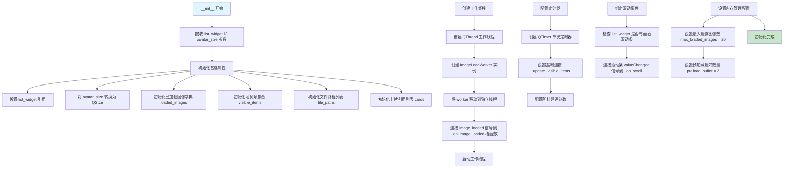

#### 带注释源码

```python
def __init__(self, list_widget: QListWidget, avatar_size: tuple = (60, 80)):
    # --- 1. 接收并保存主控件引用 ---
    self.list_widget = list_widget
    # 将元组尺寸转换为 Qt 尺寸对象，便于后续图像缩放计算
    self.avatar_size = QSize(avatar_size[0], avatar_size[1])
    
    # --- 2. 初始化图像加载状态追踪数据结构 ---
    # 已加载的图像缓存，键为列表索引，值为QPixmap对象
    self.loaded_images: dict[int, QPixmap] = {}
    # 当前可视区域内的列表项索引集合
    self.visible_items: Set[int] = set()
    # 所有图像文件的完整路径列表
    self.file_paths: list[str] = []
    # 与列表项对应的卡片小部件引用列表，用于设置头像
    self.cards = []  # Reference to the actual card widgets
    
    # --- 3. 创建后台工作线程用于异步加载图像 ---
    # 创建独立工作线程，避免阻塞主UI线程
    self.worker_thread = QThread()
    # 实例化图像加载工作者对象
    self.worker = ImageLoadWorker()
    # 将工作者移动到独立线程中运行
    self.worker.moveToThread(self.worker_thread)
    # 连接图像加载完成信号到主线程槽函数
    self.worker.image_loaded.connect(self._on_image_loaded)
    # 立即启动工作线程，开始事件循环
    self.worker_thread.start()  # Start thread immediately
    
    # --- 4. 配置防抖定时器 ---
    # 用于对滚动事件进行节流，避免频繁触发更新
    self.update_timer = QTimer()
    # 设置为单次触发模式，避免重复执行
    self.update_timer.setSingleShot(True)
    # 定时器超时时触发可见项更新
    self.update_timer.timeout.connect(self._update_visible_items)
    
    # --- 5. 连接滚动事件监听 ---
    # 检查列表控件是否有垂直滚动条
    if hasattr(self.list_widget, 'verticalScrollBar'):
        scrollbar = self.list_widget.verticalScrollBar()
        if scrollbar:
            # 滚动值变化时触发防抖更新
            scrollbar.valueChanged.connect(self._on_scroll)
    
    # --- 6. 内存管理配置参数 ---
    # 内存中最多缓存的图像数量，超出后LRU淘汰
    self.max_loaded_images = 20  # Maximum images to keep in memory
    # 可视区域外预加载的项数量，提升滚动流畅度
    self.preload_buffer = 2  # Number of items to preload outside visible area
```


### `ListViewImageLoader.set_file_paths`

设置文件路径和卡片引用以实现延迟加载。该方法接收文件路径列表和对应的卡片 widgets 列表，复制这些引用，清除现有状态，然后启动后台工作线程并调度初始更新。

参数：

- `file_paths`：`list[str]`，图像文件的路径列表，用于懒加载
- `cards`：`list`，与文件路径对应的卡片 widget 列表，用于显示图像

返回值：`None`，无返回值

#### 流程图

```mermaid
flowchart TD
    A[开始 set_file_paths] --> B{检查 cards 是否存在}
    B -->|是| C[cards_copy = cards.copy()]
    B -->|否| D[cards_copy = []]
    C --> E[调用 self.clear 清除现有状态]
    D --> E
    E --> F[self.file_paths = file_paths.copy]
    F --> G[self.cards = cards_copy]
    G --> H{检查 worker_thread 是否运行}
    H -->|否| I[self.worker_thread.start 启动工作线程]
    H -->|是| J[跳过启动]
    I --> K[调用 self._schedule_update 调度更新]
    J --> K
    K --> L[结束]
```

#### 带注释源码

```python
def set_file_paths(self, file_paths: list[str], cards: list):
    """Set the file paths and card references for lazy loading."""
    # 在清除之前复制 cards 引用，避免清除传入的列表
    cards_copy = cards.copy() if cards else []
    
    # 清除当前所有状态（已加载图像、可见项、文件路径、卡片引用）
    self.clear()
    
    # 复制文件路径列表到实例变量
    self.file_paths = file_paths.copy()
    # 使用副本而非原始引用，避免外部修改影响内部状态
    self.cards = cards_copy
    
    # 如果工作线程尚未运行，则启动工作线程
    if not self.worker_thread.isRunning():
        self.worker_thread.start()
        
    # 调度初始更新，触发可见项的加载
    self._schedule_update()
```


### `ListViewImageLoader.clear`

清除所有已加载的图像并重置加载器状态，包括清空已加载图像缓存、可见项集合、文件路径列表和卡片引用，同时清理工作线程的加载队列。

参数：

- `self`：`ListViewImageLoader`，隐含参数，表示当前 ListViewImageLoader 实例

返回值：`None`，无返回值描述（该方法仅执行状态清理操作）

#### 流程图

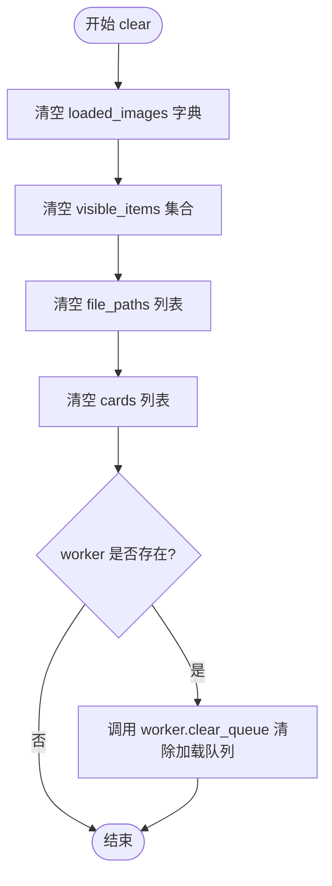

#### 带注释源码

```python
def clear(self):
    """Clear all loaded images and reset state."""
    # 清空已加载图像缓存字典，释放内存中的图像数据
    self.loaded_images.clear()
    
    # 清空可见项索引集合，重置可见区域跟踪状态
    self.visible_items.clear()
    
    # 清空文件路径列表
    self.file_paths.clear()
    
    # 清空卡片引用列表
    self.cards.clear()
    
    # 检查 worker 对象是否存在，如果存在则清理其加载队列
    # 防止在后台线程中继续加载已取消的图像任务
    if self.worker:
        self.worker.clear_queue()
```


### `ListViewImageLoader._on_scroll`

处理列表组件的滚动事件，通过防抖机制调度可见项的更新。

参数：
- 该方法没有显式参数（隐式参数 `self` 为 ListViewImageLoader 实例）

返回值：`None`，无返回值（该方法仅触发调度操作）

#### 流程图

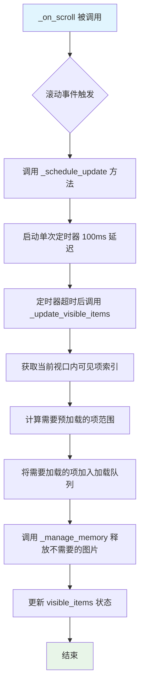

#### 带注释源码

```python
def _on_scroll(self):
    """
    Handle scroll events with debouncing.
    
    当用户滚动 QListWidget 时，此方法会被调用。
    它不直接处理可见项的更新，而是通过防抖机制延迟执行，
    以避免在快速滚动时产生大量的图片加载请求，提升性能。
    
    工作流程：
    1. 滚动条值改变时触发此方法
    2. 调用 _schedule_update() 启动一个单次定时器
    3. 100ms 后定时器触发，调用 _update_visible_items()
    4. _update_visible_items() 会计算新的可见范围并管理图片加载
    
    防抖效果：
    - 如果用户在 100ms 内多次滚动，只会触发一次更新
    - 这显著减少了不必要的图片加载操作
    """
    self._schedule_update()
```


### `ListViewImageLoader._schedule_update`

该方法用于安排更新可见项目，通过启动一个100毫秒的单次定时器实现防抖（debounce）机制。当用户滚动列表时，该方法会被频繁调用，但实际的 `_update_visible_items` 更新操作只会延迟100毫秒后执行一次，从而避免在快速滚动时产生过多的图像加载请求，提升性能。

参数：
- 无（仅使用 `self` 实例属性）

返回值：`None`，无返回值（void 方法）

#### 流程图

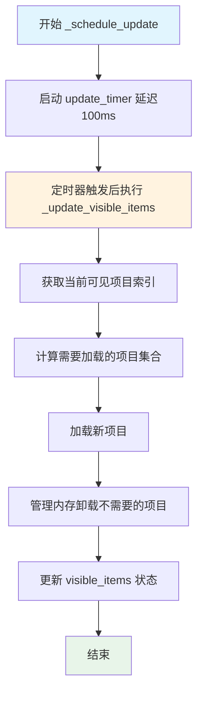

#### 带注释源码

```python
def _schedule_update(self):
    """Schedule an update of visible items."""
    # 启动单次定时器，延迟100毫秒后触发超时事件
    # 这是一个防抖（debounce）机制：
    # - 当用户快速滚动时，_on_scroll 会频繁调用此方法
    # - 但定时器每次被重新启动时，会重置100ms的倒计时
    # - 只有当滚动停止100ms后，才会真正执行 _update_visible_items
    # - 这样可以避免在滚动过程中频繁触发图像加载操作
    self.update_timer.start(100)  # 100ms debounce
```


### `ListViewImageLoader._update_visible_items`

该方法负责更新当前可见的列表项，并管理图像的懒加载与卸载。它通过获取可见项索引、计算需要预加载的缓冲区项、加载新图像、释放不再需要的图像来优化内存使用，确保只有可见区域及附近的图像被加载到内存中。

参数： 无（仅使用 `self` 实例属性）

返回值：`None`，该方法直接修改实例状态，不返回任何值

#### 流程图

```mermaid
flowchart TD
    A[开始 _update_visible_items] --> B{检查 list_widget 和 file_paths 是否有效}
    B -->|无效| C[直接返回]
    B -->|有效| D[调用 _get_visible_item_indices 获取当前可见项索引]
    D --> E[初始化空集合 items_to_load]
    F[遍历每个可见索引] --> E
    E --> G[计算预加载起始索引: max(0, index - preload_buffer)]
    G --> H[计算预加载结束索引: min(len(file_paths, index + preload_buffer + 1)]
    H --> I[将范围 [start_idx, end_idx) 加入 items_to_load]
    I --> J{遍历 items_to_load 中的每个索引}
    J --> K{检查该索引是否未加载且在有效范围内}
    K -->|是| L[调用 _queue_image_load 加载图像]
    K -->|否| J
    L --> J
    J --> M[调用 _manage_memory 管理内存]
    M --> N[更新 self.visible_items 为新的可见项集合]
    N --> O[结束]
```

#### 带注释源码

```python
def _update_visible_items(self):
    """更新可见项并管理图像的加载与卸载"""
    # 检查列表控件和文件路径是否存在，避免无效操作
    if not self.list_widget or not self.file_paths:
        return
    
    # 获取当前视口中可见的列表项索引集合
    new_visible_items = self._get_visible_item_indices()
    
    # 确定需要加载的项，包括可见项及其缓冲区范围内的项
    items_to_load = set()
    for index in new_visible_items:
        # 计算缓冲区起始位置，确保不小于0
        start_idx = max(0, index - self.preload_buffer)
        # 计算缓冲区结束位置，确保不超过列表长度
        end_idx = min(len(self.file_paths), index + self.preload_buffer + 1)
        # 将缓冲区范围内的所有索引添加到待加载集合
        items_to_load.update(range(start_idx, end_idx))
    
    # 遍历待加载项，将未加载的项加入加载队列
    for index in items_to_load:
        # 仅加载尚未加载且索引有效的项
        if index not in self.loaded_images and 0 <= index < len(self.file_paths):
            self._queue_image_load(index)
    
    # 调用内存管理方法，卸载不再需要的图像
    self._manage_memory(items_to_load)
    
    # 更新实例的可见项记录
    self.visible_items = new_visible_items
```


### `ListViewImageLoader._get_visible_item_indices`

获取当前在 QListWidget 视口中可见的项的索引集合，用于实现延迟加载的可见区域判断。

参数：

- 无显式参数（隐式参数 `self` 为 `ListViewImageLoader` 实例）

返回值：`Set[int]`，返回当前可见项的索引集合

#### 流程图

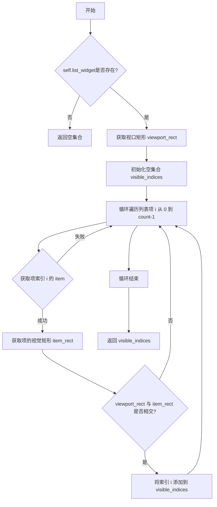

#### 带注释源码

```python
def _get_visible_item_indices(self) -> Set[int]:
    """Get indices of currently visible items."""
    # 初始化结果集合，用于存储可见项的索引
    visible_indices = set()
    
    # 检查 list_widget 是否存在，避免空指针异常
    if not self.list_widget:
        return visible_indices
        
    # 获取视口矩形区域，表示当前可见的视图区域
    viewport_rect = self.list_widget.viewport().rect()
    
    # 遍历列表中的所有项，检查其是否在视口内
    for i in range(self.list_widget.count()):
        # 获取当前索引位置的列表项
        item = self.list_widget.item(i)
        if item:
            # 获取该项在视图中的视觉矩形位置
            item_rect = self.list_widget.visualItemRect(item)
            # 判断项矩形是否与视口矩形相交（即是否可见）
            if viewport_rect.intersects(item_rect):
                # 相交则将该索引加入可见集合
                visible_indices.add(i)
                
    # 返回所有可见项的索引集合
    return visible_indices
```


### `ListViewImageLoader._queue_image_load`

将指定索引的图片添加到后台加载队列中，在工作线程中处理图片的加载和缩放。

参数：

- `index`：`int`，需要加载的图片在文件路径列表中的索引

返回值：`None`，无返回值，仅执行队列操作和线程状态管理

#### 流程图

```mermaid
flowchart TD
    A[开始 _queue_image_load] --> B{索引是否在有效范围内}
    B -->|否| C[直接返回, 不执行任何操作]
    B -->|是| D[获取 file_paths[index] 对应的文件路径]
    E{文件是否存在} -->|否| C
    E -->|是| F[调用 worker.add_to_queue 添加到加载队列]
    F --> G{工作线程是否正在运行}
    G -->|否| H[启动工作线程 worker_thread.start]
    G -->|是| I[跳过启动步骤]
    H --> J
    I --> J[使用 QTimer.singleShot 触发队列处理]
    J --> K[结束]
    
    style A fill:#e1f5fe
    style K fill:#e8f5e8
    style C fill:#ffebee
```

#### 带注释源码

```python
def _queue_image_load(self, index: int):
    """
    Queue an image for loading.
    
    将指定索引的图片添加到后台加载队列中。如果文件存在，
    则将其加入工作线程的处理队列，并确保工作线程处于运行状态。
    
    参数:
        index: 需要加载的图片在 file_paths 列表中的索引位置
    
    返回:
        None: 此方法不返回任何值，仅执行队列操作
    """
    # 检查索引是否在有效范围内（0 <= index < len(self.file_paths)）
    if 0 <= index < len(self.file_paths):
        # 根据索引获取对应的文件路径
        file_path = self.file_paths[index]
        
        # 验证文件是否存在，避免加载不存在的文件导致异常
        if os.path.exists(file_path):
            # 将加载任务添加到工作线程的队列中
            # 传递: 索引、文件路径、目标尺寸（avatar_size）
            self.worker.add_to_queue(index, file_path, self.avatar_size)
            
            # 检查工作线程是否已启动，未启动则立即启动
            # 确保后台加载线程处于运行状态
            if not self.worker_thread.isRunning():
                self.worker_thread.start()
            
            # 使用单次定时器立即触发队列处理
            # singleShot(0, ...) 表示在下一个事件循环迭代时执行
            # 这样可以确保在当前函数返回后立即处理队列
            QTimer.singleShot(0, self.worker.process_queue)
```


### `ListViewImageLoader._on_image_loaded`

当后台Worker线程完成图像加载并发出`image_loaded`信号时，此回调方法负责接收并处理加载完成的图像。它将图像存储到缓存中，并更新对应列表项的卡片组件以显示头像。

参数：

- `index`：`int`，已加载图像在列表中的索引位置，用于定位对应的列表项和卡片组件
- `pixmap`：`QPixmap`，从后台Worker加载完成的图像像素数据

返回值：`None`，该方法为事件回调，不返回任何值

#### 流程图

```mermaid
flowchart TD
    A[_on_image_loaded 被调用] --> B{检查索引有效性<br/>0 <= index < len(cards)}
    B -->|否| C[直接返回，不做任何处理]
    B -->|是| D[将 pixmap 存入 loaded_images 字典]
    D --> E[根据 index 获取对应卡片: cards[index]]
    E --> F{卡片存在且包含<br/>_avatar 属性}
    F -->|否| G[直接返回]
    F -->|是| H[调用 card._avatar.set_dayu_image 设置图像]
    H --> I[设置 card._avatar.setVisible(True) 显示头像]
    I --> J[获取列表项: list_widget.item(index)]
    J --> K{列表项存在}
    K -->|否| L[流程结束]
    K -->|是| M[调用 list_item.setSizeHint 更新尺寸提示]
    M --> L
```

#### 带注释源码

```python
def _on_image_loaded(self, index: int, pixmap: QPixmap):
    """Handle when an image has been loaded.
    
    This callback is invoked by the Worker thread's image_loaded signal.
    It stores the loaded pixmap in cache and updates the corresponding
    card widget's avatar display.
    
    Args:
        index: The index of the loaded image in the list
        pixmap: The loaded QPixmap image data
    """
    # Check if index is within valid bounds
    if 0 <= index < len(self.cards):
        # Store the loaded pixmap in the cache dictionary
        self.loaded_images[index] = pixmap
        
        # Update the card's avatar
        card = self.cards[index]
        if card and hasattr(card, '_avatar'):
            # Set the loaded image to the avatar widget
            card._avatar.set_dayu_image(pixmap)
            # Make the avatar visible since it now has content
            card._avatar.setVisible(True)
            
            # Update the list item size hint to ensure proper display
            # This forces the list widget to recalculate the item size
            # based on the card's sizeHint, ensuring the avatar is not cropped
            list_item = self.list_widget.item(index)
            if list_item:
                list_item.setSizeHint(card.sizeHint())
```


### `ListViewImageLoader._manage_memory`

该方法负责内存管理，当已加载图片数量超过 `max_loaded_images` 阈值时，自动卸载不在当前视野内的图片以释放内存资源。它通过对比 `needed_items` 集合与已加载图片的索引，找出需要卸载的图片，然后从内存中删除并隐藏对应卡片的头像组件。

参数：

- `needed_items`：`Set[int]`，当前需要的图片索引集合（可见区域及缓冲区域的索引），用于判断哪些图片应该保留在内存中

返回值：`None`，该方法无返回值，仅执行内存清理操作

#### 流程图

```mermaid
flowchart TD
    A[开始 _manage_memory] --> B{检查已加载图片数量}
    B --> C{loaded_images数量 <= max_loaded_images?}
    C -->|是| D[直接返回，不做任何处理]
    C -->|否| E[遍历所有已加载图片索引]
    E --> F{当前索引是否在needed_items中?}
    F -->|不在| G[将该索引加入items_to_unload列表]
    F -->|在| H[跳过，继续下一索引]
    G --> H
    H --> I{遍历完成?}
    I -->|否| E
    I -->|是| J[计算需要卸载的图片数量excess_count]
    J --> K[对items_to_unload排序]
    K --> L{遍历items_to_unload}
    L --> M{当前遍历索引 < excess_count?}
    M -->|是| N[从loaded_images删除该图片]
    M -->|否| O[结束方法]
    N --> P{索引在cards范围内?}
    P -->|是| Q{card有_avatar属性?}
    P -->|否| L
    Q -->|是| R[隐藏avatar: setVisible(False)]
    Q -->|否| L
    R --> L
    L --> O
```

#### 带注释源码

```python
def _manage_memory(self, needed_items: Set[int]):
    """
    管理内存，卸载不再需要的图片。
    
    当已加载图片数量超过max_loaded_images阈值时，
    该方法会找出不在needed_items集合中的图片并将其从内存中卸载。
    
    参数:
        needed_items: Set[int] - 当前需要的图片索引集合（可见区域及缓冲区域）
    
    返回:
        None - 该方法不返回任何值，仅执行内存清理操作
    """
    
    # 第一步：检查是否需要执行内存清理
    # 如果已加载图片数量未超过限制，直接返回，避免不必要的处理
    if len(self.loaded_images) <= self.max_loaded_images:
        return
        
    # 第二步：找出需要卸载的图片索引
    # 遍历所有已加载的图片索引，将不在needed_items中的索引记录下来
    items_to_unload = []
    for index in self.loaded_images.keys():
        # 如果当前索引不在需要保留的列表中，则标记为可卸载
        if index not in needed_items:
            items_to_unload.append(index)
            
    # 第三步：计算需要卸载的图片数量
    # excess_count = 当前已加载数量 - 最大允许数量
    excess_count = len(self.loaded_images) - self.max_loaded_images
    
    # 对需要卸载的图片索引进行排序
    # 按索引顺序卸载，确保卸载行为的一致性和可预测性
    items_to_unload.sort()  # Unload in order
    
    # 第四步：执行卸载操作
    # 遍历需要卸载的图片，按顺序删除
    for i, index in enumerate(items_to_unload):
        # 如果已达到需要卸载的数量，停止卸载
        if i >= excess_count:
            break
            
        # 从内存中删除该图片
        del self.loaded_images[index]
        
        # 隐藏对应卡片的头像组件
        # 检查索引是否在cards列表的有效范围内
        if 0 <= index < len(self.cards):
            card = self.cards[index]
            # 确保card存在且有_avatar属性
            if card and hasattr(card, '_avatar'):
                # 设置头像为不可见，释放UI资源
                card._avatar.setVisible(False)
```


### `ListViewImageLoader.force_load_image`

该方法用于强制立即加载指定索引的图片，主要用于当前选中项的即时显示需求。当图片未加载且索引有效时，通过内部队列机制触发后台加载流程。

参数：

- `index`：`int`，要强制加载的图片索引，对应 `file_paths` 列表中的位置

返回值：`None`，该方法无返回值，仅触发异步加载操作

#### 流程图

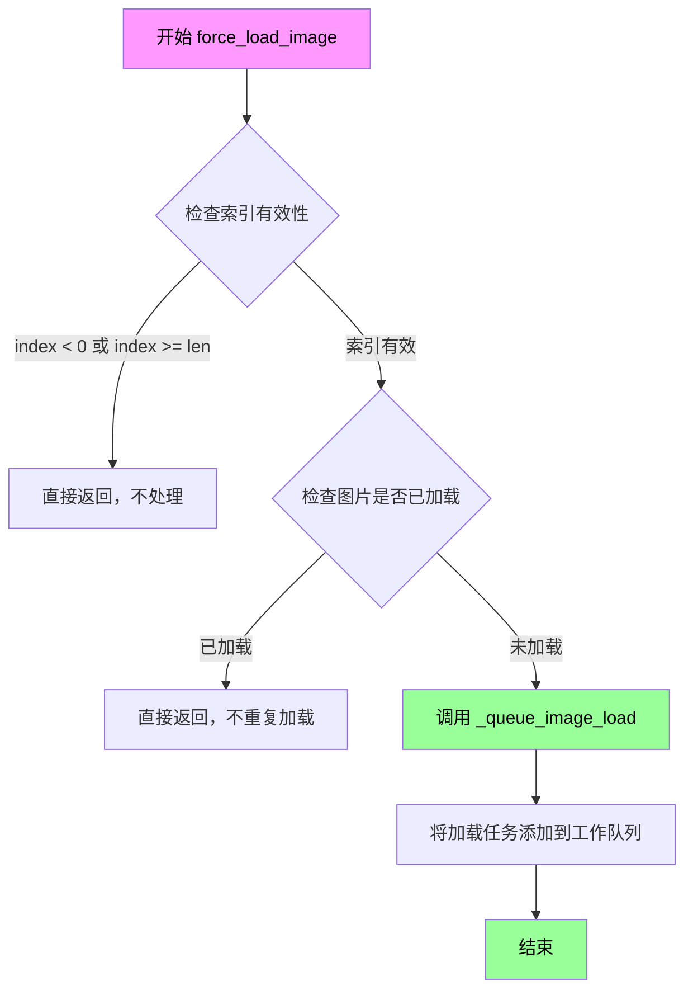

#### 带注释源码

```python
def force_load_image(self, index: int):
    """
    Force load an image immediately (for current selection).
    
    此方法提供一种主动触发图片加载的机制，主要用于：
    1. 用户选中某个列表项时立即显示图片
    2. 绕过懒加载机制的特殊加载需求
    
    注意事项：
    - 如果图片已经在内存中（loaded_images），则不会重复加载
    - 实际加载通过工作线程异步执行，不会阻塞主线程
    - 加载失败时不会有异常抛出，错误在 ImageLoadWorker 中处理
    
    参数:
        index: 要加载的图片在 file_paths 列表中的索引位置
        
    返回值:
        无返回值（None）
    """
    # 检查索引是否在有效范围内
    # 条件1: index >= 0 确保索引非负
    # 条件2: index < len(self.file_paths) 确保索引不超过列表长度
    if (0 <= index < len(self.file_paths) and 
        index not in self.loaded_images):
        # 只有当索引有效且图片未加载时才触发加载
        # 这避免了在图片已缓存时重复创建加载任务
        self._queue_image_load(index)
```


### `ListViewImageLoader.shutdown`

关闭图像加载器，停止后台工作线程，清理已加载的图像缓存和所有相关资源，释放内存。

参数： 无

返回值：`None`，无返回值，该方法执行清理操作后直接结束

#### 流程图

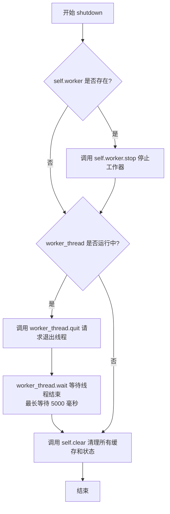

#### 带注释源码

```python
def shutdown(self):
    """Shutdown the loader and clean up resources."""
    
    # 检查 worker 对象是否存在，如果存在则调用 stop 方法停止工作器
    # stop 方法会设置 should_stop 标志并停止 process_timer
    if self.worker:
        self.worker.stop()
        
    # 检查工作线程是否仍在运行，如果是则安全地退出线程
    if self.worker_thread.isRunning():
        # quit() 请求线程退出事件循环
        self.worker_thread.quit()
        # wait() 阻塞等待线程真正结束，最长等待 5000 毫秒（5秒）
        # 这确保了在销毁对象前线程已经安全终止，避免悬挂线程
        self.worker_thread.wait(5000)  # Wait up to 5 seconds
        
    # 最后调用 clear 方法清理所有已加载的图像、可见项、文件路径和卡片引用
    # 同时清空 worker 的加载队列
    self.clear()
```

## 关键组件


### ImageLoadWorker

后台图像加载工作器，使用 QTimer 在独立线程中处理图像加载队列，实现非阻塞的图像加载与缩放。

### ListViewImageLoader

QListWidget 的惰性图像加载管理器，通过检测可见区域和预加载缓冲实现按需加载，包含内存管理和线程调度。

### 队列管理 (Queue Management)

使用 Python 列表作为加载队列，通过 `add_to_queue` 和 `process_queue` 方法管理待加载图像，支持去重和定时处理。

### 可见区域检测 (Visible Item Detection)

通过 `_get_visible_item_indices` 方法遍历列表项，使用 `viewport().rect()` 和 `visualItemRect()` 判断项是否在可视区域内。

### 内存管理 (Memory Management)

通过 `_manage_memory` 方法限制已加载图像数量（默认20张），自动卸载非可见区域的图像以释放内存。

### 图像缩放 (Image Resizing)

在 `_load_and_resize_image` 中实现保持纵横比的缩放计算，使用 `imk.resize` 和 LANCZOS 插值进行高质量缩放。

### 信号槽通信 (Signal-Slot Communication)

通过 `image_loaded` 信号在 worker 线程和主线程之间传递加载完成的图像，使用 QThread 实现后台处理。


## 问题及建议


### 已知问题

-   **线程安全问题**：`load_queue` 在主线程添加数据，在工作线程处理，但缺少线程锁保护，存在竞态条件风险；`loaded_images` 字典同样存在跨线程访问问题
-   **资源泄漏风险**：QTimer 的 parent 未设置，可能导致内存管理问题；process_timer 在 stop 后未正确清理；worker_thread 在异常情况下可能无法正确退出
-   **性能问题**：使用 `list.pop(0)` 操作队列是 O(n) 复杂度，应使用 `collections.deque`；`_get_visible_item_indices` 遍历所有列表项，大列表下性能差
-   **硬编码配置**：max_loaded_images=20 和 preload_buffer=2 是魔法数字，缺乏灵活配置；定时器间隔（50ms、100ms、5s）也是硬编码
-   **异常处理不足**：图片加载失败仅打印日志，无错误回调机制；`os.path.exists(file_path)` 检查后文件仍可能在读取时被删除
-   **潜在空指针风险**：访问 `self.list_widget.viewport()` 前未判空；访问 `card._avatar` 前假设属性一定存在
-   **API 设计缺陷**：`set_file_paths` 接收 cards 参数但不验证长度与 file_paths 是否一致；`force_load_image` 触发加载后立即返回，调用者无法获知加载结果

### 优化建议

-   使用 `QMutex` 或 `threading.Lock` 保护跨线程共享数据（load_queue、loaded_images）
-   将队列改为 `collections.deque` 提升 pop 性能；考虑使用 QAbstractItemView 的内置视图索引方法优化可见项检测
-   将硬编码配置提取为类属性或构造函数参数，提供 setter 方法动态调整
-   为 ImageLoadWorker 添加错误信号，在图片加载失败时通知上层；考虑添加重试机制
-   在所有 QWidget/QObject 访问处添加空值检查防御；使用 `hasattr` 动态检测属性存在性
-   规范化 worker 生命周期管理，确保 stop() 调用后所有资源正确释放
-   考虑将文件路径与卡片列表在设置时进行一致性校验并抛出明确错误
-   暴露加载状态回调或 Future/Promise 机制，使调用者能追踪强制加载的结果
-   添加类型注解和文档注释，提升代码可维护性和可测试性


## 其它


### 设计目标与约束

本模块的设计目标是实现一个高性能的懒加载图片加载器，用于QListWidget组件中图片的按需加载。主要约束包括：1) 仅加载可视区域及预缓冲区域的图片，减少内存占用；2) 图片加载必须在后台线程执行，避免阻塞主UI线程；3) 内存中最多缓存20张图片(可配置)，超出时自动卸载非可见区域图片；4) 滚动时使用100ms节流避免频繁触发加载；5) 图片按原始宽高比缩放，适应指定的avatar尺寸(默认60x80)。

### 错误处理与异常设计

代码采用多层错误处理机制：1) 文件级别使用`os.path.exists()`检查文件是否存在；2) 图像加载使用try-except捕获所有异常，返回空QPixmap；3) 索引访问时进行边界检查`(0 <= index < len(...))`防止越界；4) 空值检查`if card and hasattr(card, '_avatar')`确保对象有效；5) 使用`QTimer.singleShot(0, ...)`确保槽函数在主线程执行。当前异常处理采用静默失败模式，仅打印错误日志，适合用户界面场景。

### 数据流与状态机

数据流遵循以下路径：1) 用户调用`set_file_paths()`设置文件路径列表和卡片引用；2) 滚动时触发`_on_scroll()` -> `_schedule_update()` -> `_update_visible_items()`；3) `_update_visible_items()`计算当前可见项和预加载项，调用`_queue_image_load()`将任务加入队列；4) `ImageLoadWorker`通过50ms周期的定时器从队列取出任务，在后台线程加载并缩放图片；5) 加载完成后通过Signal通知主线程`_on_image_loaded()`更新UI。状态机包含三种状态：初始化态、运行态、停止态，通过`should_stop`标志和`worker_thread`生命周期管理。

### 外部依赖与接口契约

本模块依赖以下外部包：1) **imkit(imk)** - 自定义图像处理库，提供`read_image()`读取和`resize()`缩放功能；2) **PIL(Pillow)** - 图像采样，提供`Image.Resampling.LANCZOS`枚举；3) **PySide6** - Qt框架，提供QThread/QTimer/QObject信号槽机制和QPixmap/QImage图像处理；4) **os** - 文件系统检查。接口契约要求：传入的cards列表必须具有`_avatar`属性且包含`set_dayu_image()`、`setVisible()`、`sizeHint()`方法；list_widget必须支持`viewport()`、`visualItemRect()`、`verticalScrollBar()`等标准QListWidget API。

### 性能考虑与优化建议

当前实现已包含以下性能优化：后台线程加载(避免UI阻塞)、滚动节流(100ms debounce)、内存限制(max_loaded_images=20)、预缓冲机制(preload_buffer=2)。潜在优化方向：1) 可使用QCache替代手动dict管理缓存；2) 图片加载可考虑使用线程池而非单Worker；3) 队列处理间隔50ms可调整为自适应；4) 大量图片时可考虑QHash替代dict提升查找性能；5) 可添加图片格式缓存避免重复解码。

### 线程安全与并发模型

采用Qt内置的线程安全模型：1) 图像加载在独立QThread中执行(QObject.moveToThread)；2) 线程间通信通过Signal/Slot机制(类型为Qt.QueuedConnection)；3) 主线程UI更新在Slot中安全执行；4) 队列操作在worker线程中串行执行，无竞争条件。注意：loaded_images字典在主线程访问，worker仅写入不读取，故不存在线程冲突。worker_thread启动后永不停止直到shutdown被调用。

### 资源管理与生命周期

资源管理采用显式生命周期：1) 创建时：初始化worker thread并立即start；2) 运行时：worker持续处理队列，QTimer管理队列提取节奏；3) 清理时：调用shutdown()停止worker、quit线程、wait 5秒超时、clear所有状态。注意事项：必须在程序退出前调用shutdown()避免线程泄漏；worker_thread在set_file_paths时可能重复start需先检查isRunning()。

### 配置参数说明

| 参数名 | 默认值 | 说明 |
|--------|--------|------|
| avatar_size | (60, 80) | 图片缩放目标尺寸，QSize对象 |
| max_loaded_images | 20 | 内存中缓存图片的最大数量 |
| preload_buffer | 2 | 可视区域外预加载的项数 |
| process_timer周期 | 50ms | 后台队列处理间隔 |
| update_timer周期 | 100ms | 滚动事件debounce时间 |

### 使用示例

```python
# 初始化
loader = ListViewImageLoader(list_widget, avatar_size=(60, 80))

# 设置数据
file_paths = ["/path/to/image1.jpg", "/path/to/image2.jpg"]
loader.set_file_paths(file_paths, cards_list)

# 程序退出时清理
loader.shutdown()
```


    