# `comic-translate\app\ui\main_window.py` 详细设计文档

A comprehensive PySide6-based desktop GUI application that serves as the central hub for importing comic images (from various formats), managing source/target languages, editing text regions using drawing tools (boxes, brushes), and rendering translated text onto the comic pages.

## 整体流程

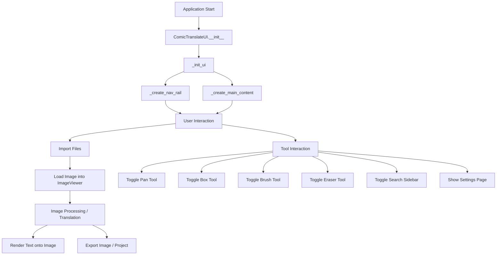

## 类结构

```
QtWidgets.QMainWindow (PySide6 Base)
└── ComicTranslateUI (Main Application Window)
    ├── ImageViewer (canvas/image_viewer.py)
    ├── SettingsPage (settings/settings_page.py)
    ├── PageListView (list_view.py)
    ├── SearchReplacePanel (search_replace_panel.py)
    └── MToolButtonGroup / MPushButtonGroup (UI Controls)
```

## 全局变量及字段


### `user_font_path`
    
用户特定的字体目录路径

类型：`str`
    


### `supported_source_languages`
    
支持的源语言字符串列表

类型：`list`
    


### `supported_target_languages`
    
支持的目标语言字符串列表

类型：`list`
    


### `ComicTranslateUI.image_viewer`
    
图像显示和编辑画布

类型：`ImageViewer`
    


### `ComicTranslateUI.settings_page`
    
应用程序设置管理

类型：`SettingsPage`
    


### `ComicTranslateUI.main_content_widget`
    
中央布局容器

类型：`QWidget`
    


### `ComicTranslateUI.tool_buttons`
    
存储工具按钮的字典（如平移、框选、画笔）

类型：`dict`
    


### `ComicTranslateUI.page_list`
    
左侧边栏的页面列表

类型：`PageListView`
    


### `ComicTranslateUI.webtoon_mode`
    
纵向漫画模式的状态标志

类型：`bool`
    


### `ComicTranslateUI.lang_mapping`
    
源语言UI字符串到代码的映射

类型：`dict`
    


### `ComicTranslateUI.reverse_lang_mapping`
    
代码到UI字符串的反向映射

类型：`dict`
    


### `ComicTranslateUI.button_to_alignment`
    
将索引映射到Qt对齐标志

类型：`dict`
    


### `ComicTranslateUI.s_combo`
    
源语言选择器

类型：`MComboBox`
    


### `ComicTranslateUI.t_combo`
    
目标语言选择器

类型：`MComboBox`
    


### `ComicTranslateUI.s_text_edit`
    
源文本输入

类型：`MTextEdit`
    


### `ComicTranslateUI.t_text_edit`
    
目标文本输入

类型：`MTextEdit`
    


### `ComicTranslateUI.font_dropdown`
    
字体家族选择器

类型：`MFontComboBox`
    


### `ComicTranslateUI.font_size_dropdown`
    
字体大小选择器

类型：`MComboBox`
    


### `ComicTranslateUI.progress_bar`
    
操作进度指示器

类型：`MProgressBar`
    


### `ComicTranslateUI.search_panel`
    
搜索和替换侧边栏

类型：`SearchReplacePanel`
    


### `ComicTranslateUI.central_stack`
    
用于切换视图的容器

类型：`QStackedWidget`
    


### `ComicTranslateUI._center_stack`
    
管理主内容与设置之间的切换

类型：`QStackedWidget`
    
    

## 全局函数及方法


### `ComicTranslateUI.__init__`

该方法是 `ComicTranslateUI` 类的构造函数，负责初始化主窗口、设置窗口几何尺寸、创建核心组件（图像查看器、设置页面、页面列表）、初始化语言映射、配置手势识别，并调用 `_init_ui()` 方法构建完整的用户界面。

参数：

- `parent`：`Optional[QWidget]`，父窗口组件，默认为 None

返回值：`None`，构造函数无返回值

#### 流程图

```mermaid
flowchart TD
    A[__init__ 开始] --> B[调用父类构造函数]
    B --> C[设置窗口标题 'Comic Translate[*]']
    C --> D[获取主屏幕几何信息]
    D --> E[计算并设置窗口几何位置和大小]
    E --> F[创建 ImageViewer 实例]
    F --> G[创建 SettingsPage 实例]
    G --> H[连接设置页面的主题和字体信号]
    H --> I[初始化 tool_buttons 字典]
    I --> J[创建 PageListView 实例]
    J --> K[设置 webtoon_mode 为 False]
    K --> L[注册手势识别: PanGesture 和 PinchGesture]
    L --> M[初始化 lang_mapping 字典]
    M --> N[创建 reverse_lang_mapping 字典]
    N --> O[初始化 button_to_alignment 字典]
    O --> P[调用 _init_ui 方法]
    P --> Q[__init__ 结束]
```

#### 带注释源码

```python
def __init__(self, parent=None):
    """
    构造函数，初始化窗口和 UI 组件
    
    参数:
        parent: 父窗口组件，默认为 None
    """
    # 调用父类 QMainWindow 的构造函数
    super(ComicTranslateUI, self).__init__(parent)
    
    # 设置窗口标题，[*] 表示有未保存更改时显示星号
    self.setWindowTitle("Comic Translate[*]")
    
    # 获取主屏幕几何信息用于设置窗口大小
    screen = QtWidgets.QApplication.primaryScreen()
    geo = screen.geometry()
    
    # 计算窗口尺寸: 屏幕宽高的 1/1.2 倍 (约 80%)
    width = float(geo.width())
    height = float(geo.height())
    x = 50  # 窗口左上角 x 坐标
    y = 50  # 窗口左上角 y 坐标
    w = int(width / 1.2)
    h = int(height / 1.2)
    
    # 设置窗口几何位置和大小
    self.setGeometry(x, y, w, h)

    # --- 创建核心组件 ---
    
    # 创建图像查看器组件
    self.image_viewer = ImageViewer(self)
    
    # 创建设置页面组件
    self.settings_page = SettingsPage(self)
    
    # 连接设置页面的主题变更信号到 apply_theme 方法
    self.settings_page.theme_changed.connect(self.apply_theme)
    # 连接设置页面的字体导入信号到 set_font 方法
    self.settings_page.font_imported.connect(self.set_font)
    
    # 主内容组件占位符
    self.main_content_widget = None
    
    # 工具按钮字典，用于存储互斥的工具名称和对应按钮
    self.tool_buttons = {}
    
    # 创建页面列表视图组件
    self.page_list = PageListView()
    
    # Webtoon 模式状态标志
    self.webtoon_mode = False

    # --- 注册手势识别 ---
    
    # 注册平移手势
    self.grabGesture(QtCore.Qt.GestureType.PanGesture)
    # 注册捏合手势
    self.grabGesture(QtCore.Qt.GestureType.PinchGesture)

    # --- 初始化语言映射 ---
    
    # 翻译文本到语言代码的映射字典
    self.lang_mapping = {
        self.tr("English"): "English",
        self.tr("Korean"): "Korean",
        self.tr("Japanese"): "Japanese",
        self.tr("French"): "French",
        self.tr("Simplified Chinese"): "Simplified Chinese",
        self.tr("Traditional Chinese"): "Traditional Chinese",
        self.tr("Chinese"): "Chinese",
        self.tr("Russian"): "Russian",
        self.tr("German"): "German",
        self.tr("Dutch"): "Dutch",
        self.tr("Spanish"): "Spanish",
        self.tr("Italian"): "Italian",
        self.tr("Turkish"): "Turkish",
        self.tr("Polish"): "Polish",
        self.tr("Portuguese"): "Portuguese",
        self.tr("Brazilian Portuguese"): "Brazilian Portuguese",
        self.tr("Thai"): "Thai",
        self.tr("Vietnamese"): "Vietnamese",
        self.tr("Indonesian"): "Indonesian",
        self.tr("Hungarian"): "Hungarian",
        self.tr("Finnish"): "Finnish",
        self.tr("Arabic"): "Arabic",
        self.tr("Czech"): "Czech",
        self.tr("Persian"): "Persian",
        self.tr("Romanian"): "Romanian",
        self.tr("Mongolian"): "Mongolian",
    }
    
    # 通过反转 lang_mapping 创建反向映射
    self.reverse_lang_mapping = {v: k for k, v in self.lang_mapping.items()}

    # --- 按钮对齐方式映射 ---
    
    # 按钮索引到对齐标志的映射字典
    self.button_to_alignment = {
        0: QtCore.Qt.AlignmentFlag.AlignLeft,
        1: QtCore.Qt.AlignmentFlag.AlignCenter,
        2: QtCore.Qt.AlignmentFlag.AlignRight,
    }

    # --- 调用 UI 初始化方法 ---
    
    # 调用私有方法构建完整 UI
    self._init_ui()
```


### `ComicTranslateUI._init_ui`

该方法负责初始化主窗口的UI布局结构，创建一个包含导航栏、主内容区域和设置页面的基本框架，使用 QStackedWidget 实现页面切换而不影响窗口大小。

参数：

- 无参数（仅使用 self 实例属性）

返回值：

- 无返回值（None），该方法仅进行 UI 初始化和属性设置操作

#### 流程图

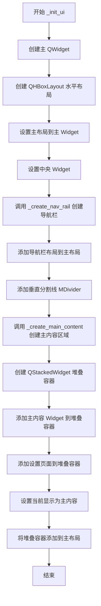

#### 带注释源码

```python
def _init_ui(self):
    """
    初始化主窗口的UI布局结构
    创建包含导航栏、主内容区和设置页面的基本框架
    """
    # 创建主 Widget 容器
    main_widget = QtWidgets.QWidget(self)
    
    # 创建水平布局作为主布局
    self.main_layout = QtWidgets.QHBoxLayout()
    
    # 将布局设置给主 Widget
    main_widget.setLayout(self.main_layout)
    
    # 设置为主窗口的中央 Widget
    self.setCentralWidget(main_widget)

    # ---------- 导航栏部分 ----------
    # 调用私有方法创建导航栏布局
    nav_rail_layout = self._create_nav_rail()
    
    # 将导航栏布局添加到主布局
    self.main_layout.addLayout(nav_rail_layout)
    
    # 添加垂直分割线
    self.main_layout.addWidget(MDivider(orientation=QtCore.Qt.Vertical))

    # ---------- 中央内容区域 ----------
    # 创建主内容 Widget（包含图片查看器、工具栏等）
    self.main_content_widget = self._create_main_content()
    
    # 创建堆叠容器，用于页面切换
    self._center_stack = QtWidgets.QStackedWidget()
    
    # 将主内容 Widget 添加到堆叠容器
    self._center_stack.addWidget(self.main_content_widget)
    
    # 将设置页面（已在 __init__ 中创建）添加到堆叠容器
    self._center_stack.addWidget(self.settings_page)
    
    # 默认显示主内容页面
    self._center_stack.setCurrentWidget(self.main_content_widget)
    
    # 将堆叠容器添加到主布局
    self.main_layout.addWidget(self._center_stack)
```


### `ComicTranslateUI._create_nav_rail`

创建左侧导航栏（Navigation Rail），其中包含用于文件操作（如新建项目、打开/导入文件、保存项目/图片）、侧边栏搜索以及页面切换（主页/设置）的工具按钮。

参数：

-  `self`：`ComicTranslateUI`，隐式参数，表示当前窗口实例。

返回值：`QtWidgets.QVBoxLayout`，返回构建完成的垂直导航栏布局对象。

#### 流程图

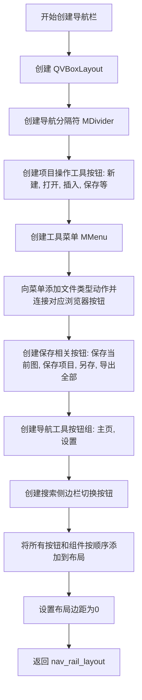

#### 带注释源码

```python
def _create_nav_rail(self):
    # 1. 创建垂直布局作为导航栏的容器
    nav_rail_layout = QtWidgets.QVBoxLayout()
    # 创建垂直分割线
    nav_divider = MDivider()
    nav_divider.setFixedWidth(30)

    # 2. 创建项目操作按钮
    # 新建项目按钮
    self.new_project_button = MToolButton()
    self.new_project_button.set_dayu_svg("file.svg")
    self.new_project_button.setToolTip(self.tr("New Project"))

    # 创建工具浏览器按钮（用于导入各种类型的文件）
    self.tool_browser = MToolButton()
    self.tool_browser.set_dayu_svg("folder-open.svg")
    self.tool_browser.setToolTip(
        self.tr(
            "Import Images, PDFs, Epubs or Comic Book Archive Files (cbr, cbz, etc). " \
            "This will Open a new project"
        )
    )
    # 点击时显示工具菜单
    self.tool_browser.clicked.connect(self.show_tool_menu)

    # 3. 创建各类文件浏览器按钮（通常隐藏在菜单或直接调用）
    # 图片浏览器
    self.image_browser_button = MClickBrowserFileToolButton(multiple=True)
    self.image_browser_button.set_dayu_filters([".png", ".jpg", ".jpeg", ".webp", ".bmp"])
    
    # 文档浏览器
    self.document_browser_button = MClickBrowserFileToolButton(multiple=True)
    self.document_browser_button.set_dayu_filters([".pdf", ".epub"])
    
    # 压缩包浏览器
    self.archive_browser_button = MClickBrowserFileToolButton(multiple=True)
    self.archive_browser_button.set_dayu_filters([".zip", ".rar", ".7z", ".tar"])
    
    # 漫画书浏览器
    self.comic_browser_button = MClickBrowserFileToolButton(multiple=True)
    self.comic_browser_button.set_dayu_filters([".cbz", ".cbr", ".cb7", ".cbt"])

    # 项目文件浏览器
    self.project_browser_button = MClickBrowserFileToolButton(multiple=False)
    self.project_browser_button.set_dayu_filters([".ctpr"])

    # 4. 创建工具菜单并绑定浏览器按钮
    self.tool_menu = MMenu(parent=self)
    
    # 添加菜单项并连接信号
    image_action = self.tool_menu.addAction(MIcon("ion--image-outline.svg"), self.tr("Images"))
    image_action.triggered.connect(self.image_browser_button.clicked)
    
    document_action = self.tool_menu.addAction(MIcon("mingcute--document-line.svg"), self.tr("Document"))
    document_action.triggered.connect(self.document_browser_button.clicked)
    
    archive_action = self.tool_menu.addAction(MIcon("flowbite--file-zip-outline.svg"), self.tr("Archive"))
    archive_action.triggered.connect(self.archive_browser_button.clicked)
    
    comic_action = self.tool_menu.addAction(MIcon("mdi--comic-thought-bubble-outline.svg"), self.tr("Comic Book Archive"))
    comic_action.triggered.connect(self.comic_browser_button.clicked)

    project_action = self.tool_menu.addAction(MIcon("ct-file-icon.svg"), self.tr("Project File"))
    project_action.triggered.connect(self.project_browser_button.clicked)

    # 5. 创建保存相关按钮
    # 保存当前图片
    self.save_browser = MClickSaveFileToolButton()
    save_file_types = [("Images", ["png", "jpg", "jpeg", "webp", "bmp"])]
    self.save_browser.set_file_types(save_file_types)
    self.save_browser.set_dayu_svg("save.svg")
    self.save_browser.setToolTip(self.tr("Save Currently Loaded Image"))

    # 保存项目
    self.save_project_button = MToolButton()
    self.save_project_button.set_dayu_svg("fluent--save-16-regular.svg")
    self.save_project_button.setToolTip(self.tr("Save Project"))

    # 另存项目
    self.save_as_project_button = MToolButton()
    self.save_as_project_button.set_dayu_svg("fluent--save-as-24-regular.svg")
    self.save_as_project_button.setToolTip(self.tr("Save as"))

    # 导出所有图片
    save_all_file_types = [
        ("ZIP files", "zip"),
        ("CBZ files", "cbz"),
        ("CB7 files", "cb7"),
        ("PDF files", "pdf"),
    ]
    self.save_all_browser = MClickSaveFileToolButton()
    self.save_all_browser.set_dayu_svg("tabler--file-export.svg")
    self.save_all_browser.set_file_types(save_all_file_types)
    self.save_all_browser.setToolTip(self.tr("Export all Images"))

    # 6. 创建顶部导航工具组（主页与设置）
    nav_tool_group = MToolButtonGroup(orientation=QtCore.Qt.Vertical, exclusive=True)
    nav_tools = [
        {"svg": "home_line.svg", "checkable": True, "tooltip": self.tr("Home"), "clicked": self.show_main_page},
        {"svg": "settings.svg", "checkable": True, "tooltip": self.tr("Settings"), "clicked": self.show_settings_page},
    ]
    nav_tool_group.set_button_list(nav_tools)
    # 默认选中第一个按钮（主页）
    nav_tool_group.get_button_group().buttons()[0].setChecked(True)

    # 7. 创建搜索/替换侧边栏开关
    self.search_sidebar_button = MToolButton()
    self.search_sidebar_button.set_dayu_svg("search_line.svg")
    self.search_sidebar_button.setToolTip(self.tr("Search / Replace (Ctrl+F)"))
    self.search_sidebar_button.setCheckable(True)
    self.search_sidebar_button.setFocusPolicy(QtCore.Qt.FocusPolicy.NoFocus)
    self.search_sidebar_button.toggled.connect(self._set_search_sidebar_visible)

    # 8. 创建插入文件按钮
    self.insert_button = MToolButton()
    self.insert_button.set_dayu_svg("file-plus.svg")
    self.insert_button.setToolTip(self.tr("Insert files into current project"))
    # 关联文件浏览器
    self.insert_browser_button = MClickBrowserFileToolButton(multiple=True)
    self.insert_browser_button.set_dayu_filters([".png", ".jpg", ".jpeg", ".webp", ".bmp",
                                                 ".zip", ".cbz", ".cbr", ".cb7", ".cbt",
                                                 ".pdf", ".epub"])
    # 点击按钮触发浏览器
    self.insert_button.clicked.connect(self.insert_browser_button.clicked)

    # 9. 将所有组件添加到布局
    nav_rail_layout.addWidget(self.new_project_button)
    nav_rail_layout.addWidget(self.tool_browser)
    nav_rail_layout.addWidget(self.insert_button)
    nav_rail_layout.addWidget(self.save_project_button)
    nav_rail_layout.addWidget(self.save_as_project_button)
    nav_rail_layout.addWidget(self.save_browser)
    nav_rail_layout.addWidget(self.save_all_browser)
    nav_rail_layout.addWidget(nav_divider)
    nav_rail_layout.addWidget(self.search_sidebar_button)
    nav_rail_layout.addWidget(nav_tool_group)
    # 添加Stretch使按钮靠上，布局更紧凑
    nav_rail_layout.addStretch()

    # 10. 设置布局边距
    nav_rail_layout.setContentsMargins(0, 0, 0, 0)

    return nav_rail_layout
```


### `ComicTranslateUI._create_main_content`

该方法负责构建漫画翻译工具的主工作区界面，集成顶部工具栏（撤销/重做、操作按钮、翻译控制）、左侧图片列表面板、中心图片查看器（支持拖拽导入和Webtoon模式）以及右侧文本编辑与渲染设置面板，通过分割器布局实现可调节的多栏界面。

#### 参数

- `self`：隐式参数，`ComicTranslateUI` 类实例本身

#### 返回值

- `QtWidgets.QWidget`：返回构建完成的主内容部件，包含完整的用户界面布局

#### 流程图

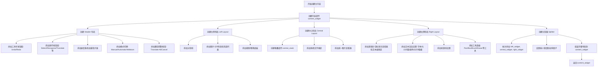

#### 带注释源码

```python
def _create_main_content(self):
    """
    构建主工作区界面，包含顶部工具栏、左侧图片列表、
    中心图片查看器和右侧文本编辑与渲染设置面板
    """
    # 1. 创建主内容部件
    content_widget = QtWidgets.QWidget()

    # ============================================================
    # 2. 创建 Header 布局 - 顶部工具栏区域
    # ============================================================
    header_layout = QtWidgets.QHBoxLayout()

    # 2.1 撤销/重做工具组
    self.undo_tool_group = MToolButtonGroup(orientation=QtCore.Qt.Horizontal, exclusive=True)
    undo_tools = [
        {"svg": "undo.svg", "checkable": False, "tooltip": self.tr("Undo")},
        {"svg": "redo.svg", "checkable": False, "tooltip": self.tr("Redo")},
    ]
    self.undo_tool_group.set_button_list(undo_tools)

    # 2.2 操作按钮组：检测文本、识别文本、翻译、分割、清理、渲染
    button_config_list = [
        {"text": self.tr("Detect Text"), "dayu_type": MPushButton.DefaultType, "enabled": False},
        {"text": self.tr("Recognize Text"), "dayu_type": MPushButton.DefaultType, "enabled": False},
        {"text": self.tr("Get Translations"), "dayu_type": MPushButton.DefaultType, "enabled": False},
        {"text": self.tr("Segment Text"), "dayu_type": MPushButton.DefaultType, "enabled": False},
        {"text": self.tr("Clean Image"), "dayu_type": MPushButton.DefaultType, "enabled": False},
        {"text": self.tr("Render"), "dayu_type": MPushButton.DefaultType, "enabled": False},
    ]

    self.hbutton_group = MPushButtonGroup()
    self.hbutton_group.set_dayu_size(dayu_theme.small)
    self.hbutton_group.set_button_list(button_config_list)
    self.hbutton_group.setFocusPolicy(QtCore.Qt.FocusPolicy.NoFocus)

    # 2.3 进度条和加载指示器
    self.progress_bar = MProgressBar().auto_color()
    self.progress_bar.setValue(0)
    self.progress_bar.setVisible(False)

    self.loading = MLoading().small()
    self.loading.setVisible(False)

    # 2.4 模式选择：手动/自动
    self.manual_radio = MRadioButton(self.tr("Manual"))
    self.manual_radio.setFocusPolicy(QtCore.Qt.FocusPolicy.NoFocus)

    self.automatic_radio = MRadioButton(self.tr("Automatic"))
    self.automatic_radio.setChecked(True)
    self.automatic_radio.setFocusPolicy(QtCore.Qt.FocusPolicy.NoFocus)

    # 2.5 Webtoon 模式切换按钮
    self.webtoon_toggle = MToolButton()
    self.webtoon_toggle.set_dayu_svg("webtoon-toggle.svg")
    self.webtoon_toggle.huge()
    self.webtoon_toggle.setCheckable(True)
    self.webtoon_toggle.setToolTip(self.tr("Toggle Webtoon Mode. For comics that are read in long vertical strips"))
    self.webtoon_toggle.setFocusPolicy(QtCore.Qt.FocusPolicy.NoFocus)

    # 2.6 翻译控制按钮
    self.translate_button = MPushButton(self.tr("Translate All"))
    self.translate_button.setEnabled(True)
    self.translate_button.setFocusPolicy(QtCore.Qt.FocusPolicy.NoFocus)
    self.cancel_button = MPushButton(self.tr("Cancel"))
    self.cancel_button.setEnabled(True)
    self.cancel_button.setFocusPolicy(QtCore.Qt.FocusPolicy.NoFocus)
    self.batch_report_button = MPushButton(self.tr("Batch Report"))
    self.batch_report_button.setEnabled(False)
    self.batch_report_button.setFocusPolicy(QtCore.Qt.FocusPolicy.NoFocus)

    # 2.7 将所有头部控件添加到 header_layout
    header_layout.addWidget(self.undo_tool_group)
    header_layout.addWidget(self.hbutton_group)
    header_layout.addWidget(self.loading)
    header_layout.addStretch()
    header_layout.addWidget(self.webtoon_toggle)
    header_layout.addWidget(self.manual_radio)
    header_layout.addWidget(self.automatic_radio)
    header_layout.addWidget(self.translate_button)
    header_layout.addWidget(self.cancel_button)
    header_layout.addWidget(self.batch_report_button)

    # ============================================================
    # 3. 创建搜索/替换面板 - 左侧边栏辅助功能
    # ============================================================
    self.search_panel = SearchReplacePanel(self)
    self.search_panel.setVisible(False)

    # ============================================================
    # 4. 创建左侧布局 - 图片选择列表
    # ============================================================
    left_layout = QtWidgets.QVBoxLayout()
    left_layout.addWidget(MDivider())

    self.image_card_layout = QtWidgets.QVBoxLayout()
    self.image_card_layout.addStretch(1)  # 添加伸展符保持卡片置顶

    self.page_list.setLayout(self.image_card_layout)
    left_layout.addWidget(self.page_list)
    left_layout.addWidget(self.search_panel)
    left_widget = QtWidgets.QWidget()
    left_widget.setLayout(left_layout)

    # ============================================================
    # 5. 创建中心布局 - 文件加载器/图片查看器
    # ============================================================
    self.central_stack = QtWidgets.QStackedWidget()

    # 5.1 拖拽文件按钮（初始页面）
    self.drag_browser = MDragFileButton(text=self.tr("Click or drag files here"), multiple=True)
    self.drag_browser.set_dayu_svg("attachment_line.svg")
    self.drag_browser.set_dayu_filters([".png", ".jpg", ".jpeg", ".webp", ".bmp",
                                        ".zip", ".cbz", ".cbr", ".cb7", ".cbt",
                                        ".pdf", ".epub", ".ctpr"])
    self.drag_browser.setToolTip(self.tr("Import Images, PDFs, Epubs or Comic Book Archive Files(cbr, cbz, etc)"))
    self.central_stack.addWidget(self.drag_browser)

    # 5.2 统一图片查看器（支持单图和Webtoon模式）
    self.central_stack.addWidget(self.image_viewer)

    central_widget = QtWidgets.QWidget()
    central_layout = QtWidgets.QVBoxLayout(central_widget)
    central_layout.addWidget(self.central_stack)
    central_layout.setContentsMargins(10, 10, 10, 10)

    # ============================================================
    # 6. 创建右侧布局 - 文本输入和渲染设置
    # ============================================================
    right_layout = QtWidgets.QVBoxLayout()
    right_layout.addWidget(MDivider())

    # 6.1 源语言和目标语言选择器及文本编辑区
    input_layout = QtWidgets.QHBoxLayout()

    # 源语言组合框和文本编辑区
    s_combo_text_layout = QtWidgets.QVBoxLayout()
    self.s_combo = MComboBox().medium()
    self.s_combo.addItems([self.tr(lang) for lang in supported_source_languages])
    self.s_combo.setToolTip(self.tr("Source Language"))
    s_combo_text_layout.addWidget(self.s_combo)
    self.s_text_edit = MTextEdit()
    self.s_text_edit.setFixedHeight(120)
    s_combo_text_layout.addWidget(self.s_text_edit)
    input_layout.addLayout(s_combo_text_layout)

    # 目标语言组合框和文本编辑区
    t_combo_text_layout = QtWidgets.QVBoxLayout()
    self.t_combo = MComboBox().medium()
    self.t_combo.addItems([self.tr(lang) for lang in supported_target_languages])
    self.t_combo.setToolTip(self.tr("Target Language"))
    t_combo_text_layout.addWidget(self.t_combo)
    self.t_text_edit = MTextEdit()
    self.t_text_edit.setFixedHeight(120)
    t_combo_text_layout.addWidget(self.t_text_edit)

    input_layout.addLayout(t_combo_text_layout)

    # ============================================================
    # 7. 文本渲染设置区域
    # ============================================================
    text_render_layout = QtWidgets.QVBoxLayout()
    font_settings_layout = QtWidgets.QHBoxLayout()

    # 字体下拉选择器
    self.font_dropdown = MFontComboBox().small()
    self.font_dropdown.setToolTip(self.tr("Font"))
    all_font_files = []
    # 从用户字体目录加载字体
    if os.path.exists(user_font_path):
        all_font_files.extend([os.path.join(user_font_path, f) for f in os.listdir(user_font_path)
            if f.lower().endswith((".ttf", ".ttc", ".otf", ".woff", ".woff2"))])

    for font in all_font_files:
        self.add_custom_font(font)

    # 字体大小、行距下拉选择器
    self.font_size_dropdown = MComboBox().small()
    self.font_size_dropdown.setToolTip(self.tr("Font Size"))
    self.font_size_dropdown.addItems(['4', '6', '8', '9', '10', '11', '12', '14', '16', '18',
                                      '20', '22', '24', '28', '32', '36', '48', '72'])
    self.font_size_dropdown.setCurrentText('12')
    self.font_size_dropdown.setFixedWidth(60)
    self.font_size_dropdown.set_editable(True)

    self.line_spacing_dropdown = MComboBox().small()
    self.line_spacing_dropdown.setToolTip(self.tr("Line Spacing"))
    self.line_spacing_dropdown.addItems(['1.0', '1.1', '1.2', '1.3', '1.4', '1.5'])
    self.line_spacing_dropdown.setFixedWidth(60)
    self.line_spacing_dropdown.set_editable(True)

    font_settings_layout.addWidget(self.font_dropdown)
    font_settings_layout.addWidget(self.font_size_dropdown)
    font_settings_layout.addWidget(self.line_spacing_dropdown)
    font_settings_layout.addStretch()

    # 文本主要设置：颜色、对齐、粗体、斜体、下划线
    main_text_settings_layout = QtWidgets.QHBoxLayout()

    settings = QSettings("ComicLabs", "ComicTranslate")
    settings.beginGroup('text_rendering')
    dflt_clr = settings.value('color', '#000000')
    dflt_outline_check = settings.value('outline', True, type=bool)
    settings.endGroup()

    # 字体颜色按钮
    self.block_font_color_button = QtWidgets.QPushButton()
    self.block_font_color_button.setToolTip(self.tr("Font Color"))
    self.block_font_color_button.setFixedSize(30, 30)
    self.block_font_color_button.setStyleSheet(
        f"background-color: {dflt_clr}; border: none; border-radius: 5px;"
    )
    self.block_font_color_button.setProperty('selected_color', dflt_clr)

    # 对齐工具组：左对齐、居中、右对齐
    self.alignment_tool_group = MToolButtonGroup(orientation=QtCore.Qt.Horizontal, exclusive=True)
    alignment_tools = [
        {"svg": "tabler--align-left.svg", "checkable": True, "tooltip": "Align Left"},
        {"svg": "tabler--align-center.svg", "checkable": True, "tooltip": "Align Center"},
        {"svg": "tabler--align-right.svg", "checkable": True, "tooltip": "Align Right"},
    ]
    self.alignment_tool_group.set_button_list(alignment_tools)
    self.alignment_tool_group.set_dayu_checked(1)

    # 样式按钮：粗体、斜体、下划线
    self.bold_button = self.create_tool_button(svg="bold.svg", checkable=True)
    self.bold_button.setToolTip(self.tr("Bold"))
    self.italic_button = self.create_tool_button(svg="italic.svg", checkable=True)
    self.italic_button.setToolTip(self.tr("Italic"))
    self.underline_button = self.create_tool_button(svg="underline.svg", checkable=True)
    self.underline_button.setToolTip(self.tr("Underline"))

    main_text_settings_layout.addWidget(self.block_font_color_button)
    main_text_settings_layout.addWidget(self.alignment_tool_group)
    main_text_settings_layout.addWidget(self.bold_button)
    main_text_settings_layout.addWidget(self.italic_button)
    main_text_settings_layout.addWidget(self.underline_button)
    main_text_settings_layout.addStretch()

    # 轮廓线设置
    outline_settings_layout = QtWidgets.QHBoxLayout()

    self.outline_checkbox = MCheckBox(self.tr("Outline"))
    self.outline_checkbox.setChecked(dflt_outline_check)

    self.outline_font_color_button = QtWidgets.QPushButton()
    self.outline_font_color_button.setToolTip(self.tr("Outline Color"))
    self.outline_font_color_button.setFixedSize(30, 30)
    self.outline_font_color_button.setStyleSheet(
        "background-color: white; border: none; border-radius: 5px;"
    )
    self.outline_font_color_button.setProperty('selected_color', "#ffffff")

    self.outline_width_dropdown = MComboBox().small()
    self.outline_width_dropdown.setFixedWidth(60)
    self.outline_width_dropdown.setToolTip(self.tr("Outline Width"))
    self.outline_width_dropdown.addItems(['1.0', '1.15', '1.3', '1.4', '1.5'])
    self.outline_width_dropdown.set_editable(True)

    outline_settings_layout.addWidget(self.outline_checkbox)
    outline_settings_layout.addWidget(self.outline_font_color_button)
    outline_settings_layout.addWidget(self.outline_width_dropdown)
    outline_settings_layout.addStretch()

    # 组合所有渲染设置
    rendering_divider_top = MDivider()
    rendering_divider_bottom = MDivider()
    text_render_layout.addWidget(rendering_divider_top)
    text_render_layout.addLayout(font_settings_layout)
    text_render_layout.addLayout(main_text_settings_layout)
    text_render_layout.addLayout(outline_settings_layout)
    text_render_layout.addWidget(rendering_divider_bottom)

    # ============================================================
    # 8. 工具面板 - 绘图和编辑工具
    # ============================================================
    tools_widget = QtWidgets.QWidget()
    tools_layout = QtWidgets.QVBoxLayout()

    misc_lay = QtWidgets.QHBoxLayout()

    # Pan 按钮 - 移动图片
    self.pan_button = self.create_tool_button(svg="pan_tool.svg", checkable=True)
    self.pan_button.setToolTip(self.tr("Pan Image"))
    self.pan_button.clicked.connect(self.toggle_pan_tool)
    self.tool_buttons['pan'] = self.pan_button

    # 设置源/目标语言按钮
    self.set_all_button = MPushButton(self.tr("Set for all"))
    self.set_all_button.setToolTip(self.tr("Sets the Source and Target Language on the current page for all pages"))

    misc_lay.addWidget(self.pan_button)
    misc_lay.addWidget(self.set_all_button)
    misc_lay.addStretch()

    # 文本框绘制工具
    box_tools_lay = QtWidgets.QHBoxLayout()

    self.box_button = self.create_tool_button(svg="select.svg", checkable=True)
    self.box_button.setToolTip(self.tr("Draw or Select Text Boxes"))
    self.box_button.clicked.connect(self.toggle_box_tool)
    self.tool_buttons['box'] = self.box_button

    self.delete_button = self.create_tool_button(svg="trash_line.svg", checkable=False)
    self.delete_button.setToolTip(self.tr("Delete Selected Box"))

    self.clear_rectangles_button = self.create_tool_button(svg="clear-outlined.svg")
    self.clear_rectangles_button.setToolTip(self.tr("Remove all the Boxes on the Image"))

    self.draw_blklist_blks = self.create_tool_button(svg="gridicons--create.svg")
    self.draw_blklist_blks.setToolTip(self.tr("Draws all the Text Blocks in the existing Text Block List back on the Image (for further editing)"))

    box_tools_lay.addWidget(self.box_button)
    box_tools_lay.addWidget(self.delete_button)
    box_tools_lay.addWidget(self.clear_rectangles_button)
    box_tools_lay.addWidget(self.draw_blklist_blks)

    # 调整所有文本框大小工具
    self.change_all_blocks_size_dec = self.create_tool_button(svg="minus_line.svg")
    self.change_all_blocks_size_dec.setToolTip(self.tr("Reduce the size of all blocks"))

    self.change_all_blocks_size_diff = MLineEdit()
    self.change_all_blocks_size_diff.setFixedWidth(30)
    self.change_all_blocks_size_diff.setText("3")

    int_validator = QIntValidator()
    self.change_all_blocks_size_diff.setValidator(int_validator)
    self.change_all_blocks_size_diff.setAlignment(QtCore.Qt.AlignCenter)

    self.change_all_blocks_size_inc = self.create_tool_button(svg="add_line.svg")
    self.change_all_blocks_size_inc.setToolTip(self.tr("Increase the size of all blocks"))

    box_tools_lay.addStretch()
    box_tools_lay.addWidget(self.change_all_blocks_size_dec)
    box_tools_lay.addWidget(self.change_all_blocks_size_diff)
    box_tools_lay.addWidget(self.change_all_blocks_size_inc)
    box_tools_lay.addStretch()

    # 图像修复工具（画笔/橡皮擦）
    inp_tools_lay = QtWidgets.QHBoxLayout()

    self.brush_button = self.create_tool_button(svg="brush-fill.svg", checkable=True)
    self.brush_button.setToolTip(self.tr("Draw Brush Strokes for Cleaning Image"))
    self.brush_button.clicked.connect(self.toggle_brush_tool)
    self.tool_buttons['brush'] = self.brush_button

    self.eraser_button = self.create_tool_button(svg="eraser_fill.svg", checkable=True)
    self.eraser_button.setToolTip(self.tr("Erase Brush Strokes"))
    self.eraser_button.clicked.connect(self.toggle_eraser_tool)
    self.tool_buttons['eraser'] = self.eraser_button

    self.clear_brush_strokes_button = self.create_tool_button(svg="clear-outlined.svg")
    self.clear_brush_strokes_button.setToolTip(self.tr("Remove all the brush strokes on the Image"))

    inp_tools_lay.addWidget(self.brush_button)
    inp_tools_lay.addWidget(self.eraser_button)
    inp_tools_lay.addWidget(self.clear_brush_strokes_button)
    inp_tools_lay.addStretch()

    # 画笔/橡皮擦大小滑块
    self.brush_eraser_slider = MSlider()
    self.brush_eraser_slider.setMinimum(1)
    self.brush_eraser_slider.setMaximum(100)
    self.brush_eraser_slider.setValue(10)
    self.brush_eraser_slider.setToolTip(self.tr("Brush/Eraser Size Slider"))
    self.brush_eraser_slider.valueChanged.connect(self.set_brush_eraser_size)

    # 组合工具布局
    tools_layout.addLayout(misc_lay)
    box_div = MDivider(self.tr('Box Drawing'))
    tools_layout.addWidget(box_div)
    tools_layout.addLayout(box_tools_lay)

    inp_div = MDivider(self.tr('Inpainting'))
    tools_layout.addWidget(inp_div)
    tools_layout.addLayout(inp_tools_lay)
    tools_layout.addWidget(self.brush_eraser_slider)
    tools_layout.addStretch()
    tools_widget.setLayout(tools_layout)

    # 工具面板滚动区域
    tools_scroll = QtWidgets.QScrollArea()
    tools_scroll.setWidgetResizable(True)
    tools_scroll.setWidget(tools_widget)
    tools_scroll.setHorizontalScrollBarPolicy(QtCore.Qt.ScrollBarPolicy.ScrollBarAlwaysOff)
    tools_scroll.setVerticalScrollBarPolicy(QtCore.Qt.ScrollBarPolicy.ScrollBarAsNeeded)
    tools_scroll.setFocusPolicy(QtCore.Qt.FocusPolicy.NoFocus)

    # 组合右侧布局
    right_layout.addLayout(input_layout)
    right_layout.addLayout(text_render_layout)
    right_layout.addWidget(tools_scroll, 1)

    right_widget = QtWidgets.QWidget()
    right_widget.setLayout(right_layout)

    # ============================================================
    # 9. 创建分割器 - 三栏可调节布局
    # ============================================================
    splitter = QtWidgets.QSplitter()
    splitter.addWidget(left_widget)
    splitter.addWidget(central_widget)
    splitter.addWidget(right_widget)

    right_widget.setMinimumWidth(240)

    splitter.setStretchFactor(0, 40)   # 左侧 40%
    splitter.setStretchFactor(1, 80)   # 中间 80%
    splitter.setStretchFactor(2, 10)   # 右侧 10%

    # ============================================================
    # 10. 组装完整内容布局
    # ============================================================
    content_layout = QtWidgets.QVBoxLayout()
    content_layout.addLayout(header_layout)
    content_layout.addWidget(self.progress_bar)
    content_layout.addWidget(splitter)

    content_layout.setStretchFactor(header_layout, 0)
    content_layout.setStretchFactor(splitter, 1)

    content_widget.setLayout(content_layout)

    # 返回构建完成的主内容部件
    return content_widget
```


### `ComicTranslateUI._set_search_sidebar_visible`

该方法用于切换主界面中“搜索/替换面板”（Search Panel）与“页面列表”（Page List）的显示状态。两者在同一侧区域互斥显示，当显示搜索面板时隐藏页面列表，反之亦然。如果切换为显示搜索面板，还会自动聚焦到搜索输入框并选中内容。

参数：

- `visible`：`bool`， 传入 `True` 以显示搜索面板并隐藏页面列表，传入 `False` 则显示页面列表并隐藏搜索面板。

返回值：`None`，该方法不返回任何值。

#### 流程图

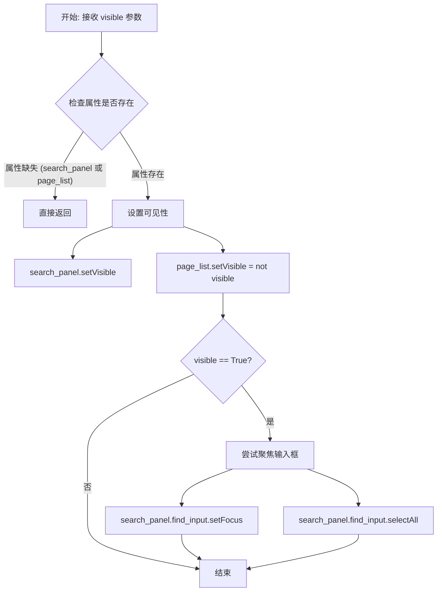

#### 带注释源码

```python
def _set_search_sidebar_visible(self, visible: bool):
    """
    切换搜索面板的可见性，并自动处理与页面列表的互斥显示逻辑。
    
    参数:
        visible (bool): 决定搜索面板是显示(True)还是隐藏(False)。
    """
    # 前置检查：确保 UI 组件已初始化，避免在程序早期调用时报错
    if not hasattr(self, "search_panel") or not hasattr(self, "page_list"):
        return
    
    try:
        # 核心逻辑：搜索面板与页面列表互斥显示
        # 当显示搜索面板时，页面列表隐藏；反之亦然。
        self.search_panel.setVisible(bool(visible))
        self.page_list.setVisible(not bool(visible))
    except Exception:
        # 静默处理异常，防止 UI 更新失败导致崩溃
        return

    # 如果是显示搜索面板（visible 为 True），则自动聚焦到搜索框
    if visible:
        try:
            # 聚焦到搜索输入框，方便用户直接输入
            self.search_panel.find_input.setFocus()
            # 选中已有文本，方便用户直接替换
            self.search_panel.find_input.selectAll()
        except Exception:
            pass
```


### `ComicTranslateUI.show_search_sidebar`

该方法用于以编程方式激活漫画翻译界面的搜索/替换侧边栏。它首先更新侧边栏开关按钮的选中状态，然后显示侧边栏，并根据传入的 `focus` 参数决定是将焦点放在查找输入框还是替换输入框上。

参数：

-  `focus`：`str`，默认为 `"find"`。指定激活侧边栏后需要聚焦的输入框标识符。值为 `"find"` 时聚焦查找框，值为 `"replace"` 时聚焦替换框。

返回值：`None`，该方法无返回值，仅执行界面状态修改操作。

#### 流程图

```mermaid
flowchart TD
    A([Start show_search_sidebar]) --> B[Get search_sidebar_button Attribute]
    B --> C{Button Exists?}
    C -->|No| D[Skip Button State Update]
    C -->|Yes| E[Use QSignalBlocker to Block Signals]
    E --> F[Set Button Checked (True)]
    F --> G[Handle Exceptions]
    D --> H[Call _set_search_sidebar_visible True]
    H --> I{Check focus Parameter}
    I -->|replace| J[Focus replace_input]
    I -->|find| K[End]
    J --> L[Select All Text in replace_input]
    L --> K
    G --> K
```

#### 带注释源码

```python
def show_search_sidebar(self, focus: str = "find"):
    """
    激活搜索侧边栏。
    
    参数:
        focus (str): 控制焦点位置。默认为 'find' (查找输入框)， 
                     如果为 'replace' 则聚焦替换输入框。
    """
    # 1. 获取侧边栏按钮对象，使用 getattr 防止属性不存在报错
    btn = getattr(self, "search_sidebar_button", None)
    
    if btn is not None:
        try:
            # 2. 使用信号阻塞器，防止设置Checked状态触发toggled信号，
            #    避免信号循环调用或不必要的逻辑触发
            with QtCore.QSignalBlocker(btn):
                btn.setChecked(True)
        except Exception:
            # 容错处理：确保即使信号阻塞失败也强制设置状态
            btn.setChecked(True)
            
    # 3. 调用内部方法显示侧边栏并默认聚焦查找框
    self._set_search_sidebar_visible(True)
    
    # 4. 根据 focus 参数处理焦点逻辑
    if focus == "replace":
        try:
            # 如果需要聚焦替换框，手动设置焦点并选中文本
            self.search_panel.replace_input.setFocus()
            self.search_panel.replace_input.selectAll()
        except Exception:
            pass
```


### `ComicTranslateUI.hide_search_sidebar`

该方法用于隐藏搜索侧边栏，通过将搜索侧边栏按钮设置为未选中状态，并调用内部方法关闭侧边栏的可见性。

参数：無

返回值：`None`，该方法没有返回值

#### 流程图

```mermaid
flowchart TD
    A[开始 hide_search_sidebar] --> B{获取 search_sidebar_button 按钮}
    B --> C{按钮是否存在?}
    C -->|是| D[创建 QSignalBlocker 阻止按钮信号]
    D --> E[将按钮设置为未选中状态 setChecked(False)]
    E --> F[调用 _set_search_sidebar_visible(False)]
    C -->|否| F
    F --> G[结束方法]
```

#### 带注释源码

```python
def hide_search_sidebar(self):
    """
    隐藏搜索侧边栏。
    1. 获取搜索侧边栏按钮对象
    2. 使用 SignalBlocker 阻止信号，将按钮设置为未选中状态
    3. 调用内部方法隐藏侧边栏
    """
    # 获取搜索侧边栏按钮，如果不存在则返回 None
    btn = getattr(self, "search_sidebar_button", None)
    
    # 检查按钮是否存在
    if btn is not None:
        try:
            # 使用 QSignalBlocker 阻止按钮的信号发射
            # 避免在设置按钮状态时触发 toggled 信号
            with QtCore.QSignalBlocker(btn):
                # 将按钮设置为未选中状态（关闭状态）
                btn.setChecked(False)
        except Exception:
            # 如果发生异常，仍然尝试设置按钮为未选中状态
            btn.setChecked(False)
    
    # 调用内部方法，将搜索侧边栏设置为不可见
    self._set_search_sidebar_visible(False)
```


### `ComicTranslateUI._confirm_start_new_project`

该方法用于在创建新项目之前检查当前项目是否存在未保存的更改。如果存在未保存的更改，会弹出一个确认对话框，询问用户是否要放弃当前更改并开始新项目。

参数：
-  `self`：`ComicTranslateUI`，调用该方法的 UI 主窗口实例。

返回值：`bool`，如果允许开始新项目（没有未保存更改或用户点击“Yes”），返回 `True`；否则返回 `False`。

#### 流程图

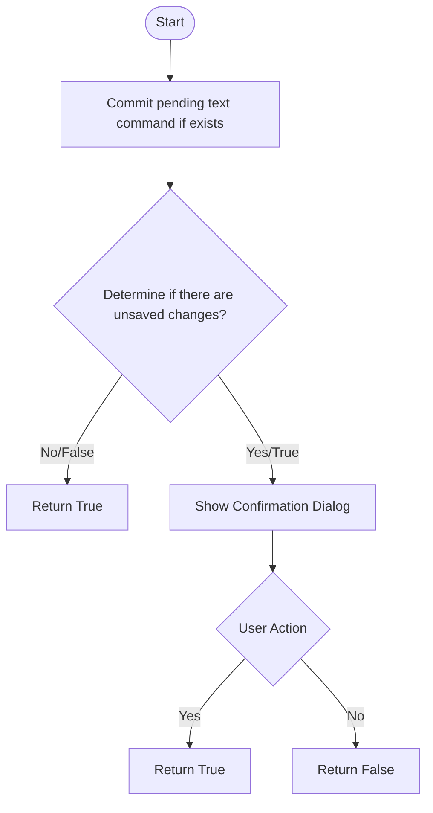

#### 带注释源码

```python
def _confirm_start_new_project(self) -> bool:
    """Ask for confirmation if there's unsaved work."""
    # 1. 尝试检测当前是否有未保存的更改
    try:
        # 如果存在文本控件，先提交待处理的文本命令
        if hasattr(self, 'text_ctrl'):
            self.text_ctrl._commit_pending_text_command()
        
        # 优先使用专门的has_unsaved_changes方法判断
        if hasattr(self, "has_unsaved_changes"):
            has_unsaved = bool(self.has_unsaved_changes())
        else:
            # 兜底逻辑：如果没有项目文件且有图片文件加载，则认为有未保存的工作
            has_unsaved = (getattr(self, 'project_file', None) is None) and bool(getattr(self, 'image_files', []))
    except Exception:
        # 异常发生时，假设没有未保存的更改以避免阻塞流程
        has_unsaved = False

    # 2. 如果检测到有未保存的更改，则弹窗确认
    if has_unsaved:
        # 创建消息框
        msg_box = QtWidgets.QMessageBox(self)
        msg_box.setIcon(QtWidgets.QMessageBox.Question)
        msg_box.setWindowTitle(self.tr("Start New Project"))
        msg_box.setText(self.tr("Your current project has unsaved changes. Start a new project?"))
        
        # 添加 Yes 和 No 按钮
        yes_btn = msg_box.addButton(self.tr("Yes"), QtWidgets.QMessageBox.ButtonRole.AcceptRole)
        no_btn = msg_box.addButton(self.tr("No"), QtWidgets.QMessageBox.ButtonRole.RejectRole)
        
        # 设置默认按钮为 No，防止误操作
        msg_box.setDefaultButton(no_btn)
        
        # 阻塞执行，等待用户点击
        msg_box.exec()
        
        # 判断用户点击的按钮是否是 Yes 按钮
        return msg_box.clickedButton() == yes_btn
    
    # 3. 如果没有未保存的更改，直接允许操作
    return True
```


### `ComicTranslateUI.show_tool_menu`

显示导入选项菜单，用于在工具栏按钮旁弹出文件导入菜单，允许用户导入图片、文档、压缩包、漫画档案或项目文件。

参数：
- 该方法无参数（仅包含 `self`）

返回值：`None`，无返回值

#### 流程图

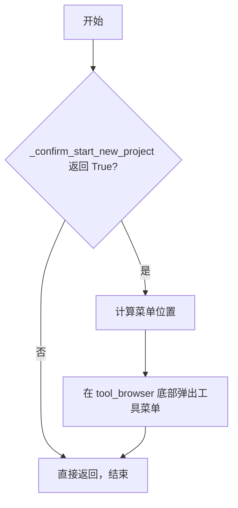

#### 带注释源码

```python
def show_tool_menu(self):
    # 确认是否开始新的导入会话
    # 调用 _confirm_start_new_project 方法检查是否有未保存的更改
    # 如果用户取消或选择不创建新项目，则直接返回
    if not self._confirm_start_new_project():
        return
    
    # 在适当的位置显示工具菜单
    # 使用 mapToGlobal 将 tool_browser 的局部坐标转换为全局屏幕坐标
    # rect().bottomLeft() 获取按钮左下角的位置
    self.tool_menu.exec_(self.tool_browser.mapToGlobal(self.tool_browser.rect().bottomLeft()))
```


### `ComicTranslateUI.create_push_button`

这是一个辅助方法，用于实例化一个符合项目 UI 风格（Dayu 主题、小尺寸、默认类型）的 `MPushButton` 按钮，并可选地绑定点击事件的回调函数。

参数：

- `text`：`str`，按钮上显示的文本标签。
- `clicked`：`callable | None`，默认为 `None`。指定按钮被点击时要触发的回调函数（槽函数）。

返回值：`MPushButton`，返回配置好样式且绑定了信号（如果提供了回调）的按钮对象。

#### 流程图

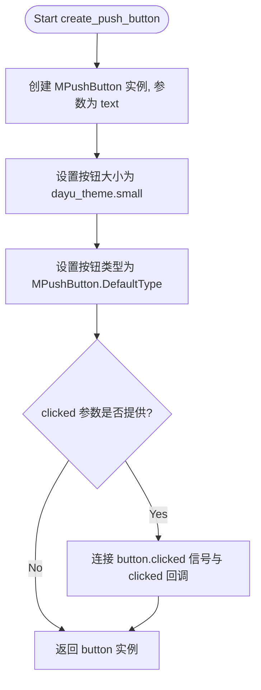

#### 带注释源码

```python
def create_push_button(self, text: str, clicked = None):
    """
    Helper to create styled buttons
    
    Args:
        text (str): Button label text.
        clicked (callable, optional): Callback function to connect to the clicked signal.
    
    Returns:
        MPushButton: A configured button instance.
    """
    # 1. 使用传入的文本标签实例化按钮
    button = MPushButton(text)
    
    # 2. 设置按钮的大小风格为小号 (small)
    #    dayu_theme 来自导入的 .dayu_widgets 包
    button.set_dayu_size(dayu_theme.small)
    
    # 3. 设置按钮的类型风格为默认 (DefaultType)
    button.set_dayu_type(MPushButton.DefaultType)

    # 4. 检查是否传入了点击回调函数
    if clicked:
        # 5. 如果传入了回调，则将按钮的 clicked 信号连接到该回调
        button.clicked.connect(clicked)

    # 6. 返回配置好的按钮实例，供调用者添加到布局中
    return button
```


### `ComicTranslateUI.create_tool_button`

该方法是 `ComicTranslateUI` 类的私有辅助方法，用于统一创建带有 SVG 图标和可选文本的工具按钮（`MToolButton`）。它封装了按钮的初始化、图标设置、文本显示模式以及可选的开关（checkable）状态配置，简化了 UI 构建代码。

参数：

- `text`：`str`，按钮上显示的文本标签。默认为空字符串。如果提供，按钮将显示文本和图标。
- `svg`：`str`，图标资源的路径或名称。用于设置按钮的图形。
- `checkable`：`bool`，布尔值，指定按钮是否为可选中（toggle）状态。默认为 `False`。

返回值：`MToolButton`，返回配置完成后的工具按钮实例。

#### 流程图

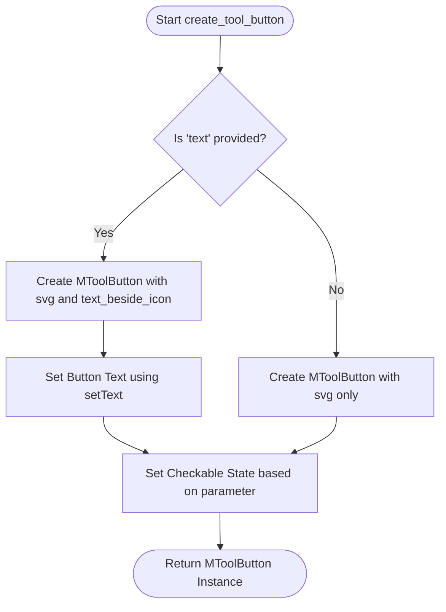

#### 带注释源码

```python
def create_tool_button(self, text: str = "", svg: str = "", checkable: bool = False):
    """
    Helper to create tool icons.
    
    Args:
        text: The text label for the button.
        svg: The SVG icon path/name.
        checkable: Whether the button is checkable.
        
    Returns:
        Configured MToolButton instance.
    """
    # 判断是否需要显示文本
    if text:
        # 如果有文本，创建一个带有 svg 图标且文本位于图标旁的按钮
        button = MToolButton().svg(svg).text_beside_icon()
        # 设置按钮显示的文本
        button.setText(text)
    else:
        # 如果没有文本，仅创建一个带有 svg 图标的按钮
        button = MToolButton().svg(svg)

    # 根据 checkable 参数设置按钮的可选中状态
    # 如果 checkable 为 True，则启用可选中状态；否则禁用
    if checkable:
        button.setCheckable(True)
    else:
        button.setCheckable(False)

    return button
```


### `ComicTranslateUI.show_settings_page`

该方法是 `ComicTranslateUI` 类（主窗口）的成员方法。它的主要功能是**切换视图到设置页面**。该方法首先检查 `settings_page` 属性是否已初始化；如果未初始化，则创建一个新的 `SettingsPage` 实例。随后，它通过操作内部的核心堆叠布局容器（`_center_stack`，一个 `QStackedWidget`）来显示设置页面。这种实现方式避免了反复添加/删除控件导致的窗口尺寸抖动。

参数：

- `self`：`ComicTranslateUI`，调用此方法的当前主窗口实例。

返回值：`None`，该方法不返回任何值，仅执行视图切换操作。

#### 流程图

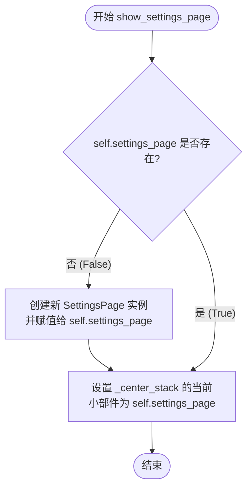

#### 带注释源码

```python
def show_settings_page(self):
    # 如果 settings_page 尚未创建（例如在初始化时未直接创建），则在此处创建它
    if not self.settings_page:
        self.settings_page = SettingsPage(self)
    
    # 切换到设置页面。使用 QStackedWidget (self._center_stack) 
    # 而不是直接添加/移除控件，可以避免切换页面时窗口大小发生改变。
    self._center_stack.setCurrentWidget(self.settings_page)
```


### `ComicTranslateUI.show_main_page`

该方法用于将应用视图从设置页面或其他页面切换回主工作区。通过操作 `QStackedWidget` 的当前窗口部件，实现无需重新创建窗口即可在不同视图间切换，保持窗口大小稳定。

参数：

- `self`：`ComicTranslateUI`，调用此方法的实例本身，代表主窗口对象

返回值：`None`，该方法不返回值，仅执行视图切换操作

#### 流程图

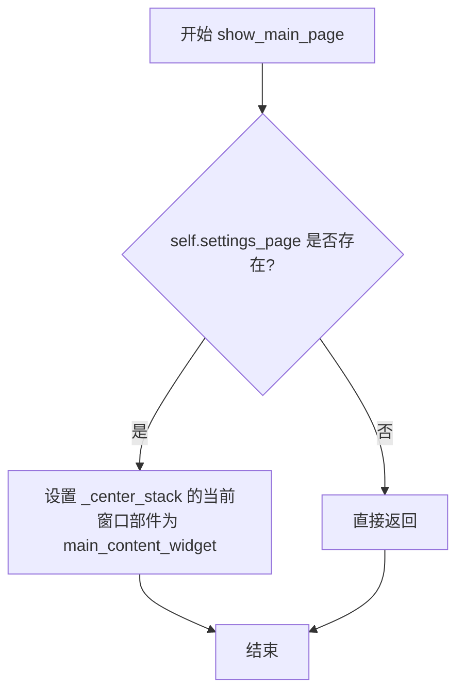

#### 带注释源码

```python
def show_main_page(self):
    """
    切换回主内容页面
    
    该方法将中央堆叠窗口部件（_center_stack）的当前显示窗口部件
    切换回主内容区域（main_content_widget），实现从设置页面或其他
    页面返回到主工作区的功能。
    """
    if self.settings_page:
        # 检查 settings_page 是否已初始化，避免对空引用的操作
        # 切换回主内容在中央堆叠窗口部件中
        # 使用 QStackedWidget.setCurrentWidget 切换视图
        # 这种方式比 add/remove widget 更好，可以保持窗口尺寸不变
        self._center_stack.setCurrentWidget(self.main_content_widget)
```


### `ComicTranslateUI.apply_theme`

该方法接收一个主题名称参数，根据参数值创建对应的 Light 或 Dark 主题对象，并将其应用到整个应用程序界面，最后通过 repaint() 刷新界面以确保主题变更立即生效。

参数：

- `theme`：`str`，主题名称，用于指定要切换的目标主题（如 "Light" 或 "Dark"）

返回值：`None`，该方法不返回任何值，仅执行主题切换操作

#### 流程图

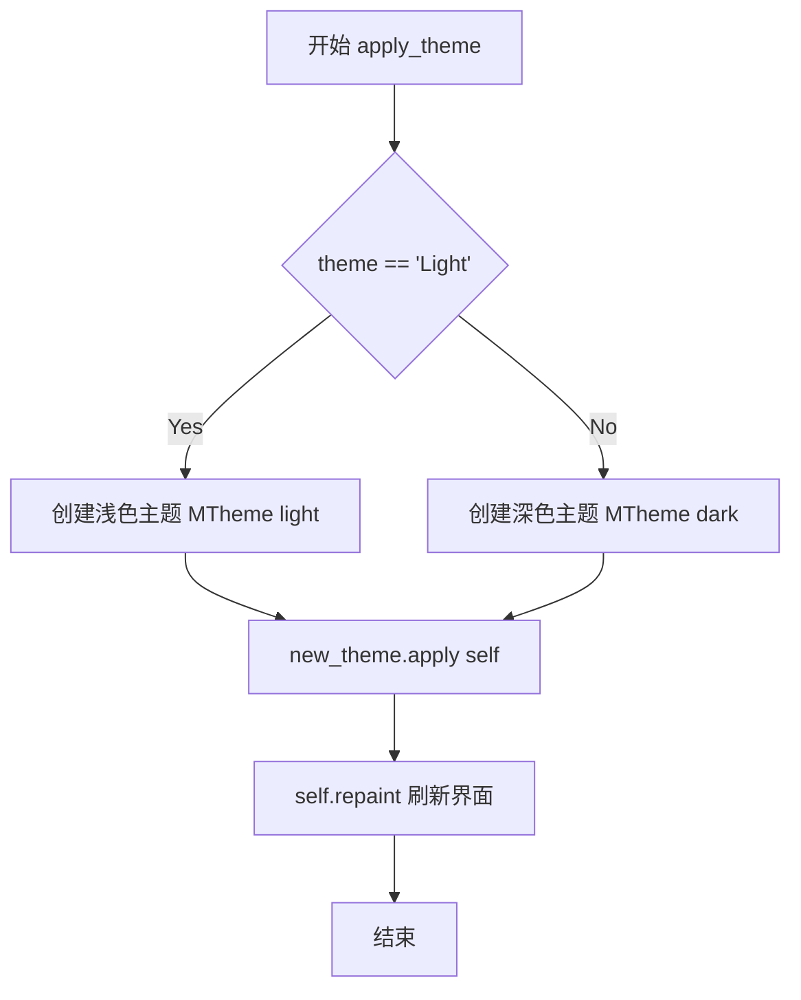

#### 带注释源码

```python
def apply_theme(self, theme: str):
    """
    应用 Light 或 Dark 主题到应用程序
    
    Args:
        theme: str, 主题名称，决定使用浅色还是深色主题
    """
    # 判断是否为浅色主题，通过翻译后的字符串比较
    if theme == self.settings_page.ui.tr("Light"):
        # 创建浅色主题，使用蓝色作为主色调
        new_theme = MTheme("light", primary_color=MTheme.blue)
    else:
        # 创建深色主题，使用黄色作为主色调
        new_theme = MTheme("dark", primary_color=MTheme.yellow)
    
    # 将新主题应用到当前窗口（ComicTranslateUI 继承自 QMainWindow）
    new_theme.apply(self)

    # 强制刷新 UI，确保主题变更立即在界面上体现
    # 这一步对于某些需要重绘的控件尤为重要
    self.repaint()
```


### `ComicTranslateUI.toggle_pan_tool`

该方法用于处理 Pan（平移）工具的切换状态。当用户点击平移按钮时，此方法会根据按钮的选中状态来激活或停用图像查看器的平移功能，确保同一时间只有一个工具处于活跃状态。

参数：无

返回值：`None`，无返回值

#### 流程图

```mermaid
flowchart TD
    A[开始 toggle_pan_tool] --> B{p pan_button 是否被选中?}
    B -->|是| C[调用 set_tool('pan')]
    B -->|否| D[调用 set_tool(None)]
    C --> E[结束]
    D --> E
```

#### 带注释源码

```python
def toggle_pan_tool(self):
    """
    处理 Pan 工具的切换状态。
    
    当用户点击平移工具按钮时，此方法会被调用。
    它检查按钮的选中状态（checked）：
    - 如果按钮被选中（isChecked() 返回 True），则激活 Pan 工具
    - 如果按钮被取消选中，则停用 Pan 工具
    
    该方法确保与其它工具（如 box, brush, eraser）的互斥性，
    因为 set_tool 方法会处理按钮状态的统一管理。
    """
    # 检查平移按钮是否处于选中状态
    if self.pan_button.isChecked():
        # 按钮被选中，激活 Pan 工具
        # 调用 set_tool 方法将当前工具设置为 'pan'
        self.set_tool('pan')
    else:
        # 按钮未选中，停用 Pan 工具
        # 传入 None 表示清除当前工具选择
        self.set_tool(None)
```


### `ComicTranslateUI.toggle_box_tool`

该方法用于处理用户点击“框选工具”（Box Selection Tool）按钮时的切换逻辑。当按钮被按下时，激活图像查看器的框选模式；当按钮被取消选中时，关闭该工具。

参数：

- `self`：`ComicTranslateUI`，主窗口类的实例，包含工具按钮和图像查看器等UI组件。

返回值：`None`，该方法不返回任何值，仅通过调用内部方法改变状态。

#### 流程图

```mermaid
flowchart TD
    A([Start toggle_box_tool]) --> B{self.box_button.isChecked()}
    B -->|True / 已选中| C[调用 set_tool('box')]
    B -->|False / 未选中| D[调用 set_tool(None)]
    C --> E([End])
    D --> E
```

#### 带注释源码

```python
def toggle_box_tool(self):
    """
    Handles the toggle state of the box selection tool button.
    """
    # 检查工具按钮是否处于被选中（按下）状态
    if self.box_button.isChecked():
        # 如果被选中，调用 set_tool 方法激活 'box' 工具
        self.set_tool('box')
    else:
        # 如果未被选中，调用 set_tool 方法并将工具设置为 None，即关闭工具
        self.set_tool(None)
```


### `ComicTranslateUI.toggle_brush_tool`

处理画笔绘图工具的切换状态。当用户点击画笔工具按钮时，激活画笔工具并将滑块大小同步为当前画笔大小；当用户取消选择时，禁用画笔工具。

参数：
- 该方法无参数（隐式参数 `self` 为类的实例）

返回值：`None`，无返回值

#### 流程图

```mermaid
flowchart TD
    A[开始 toggle_brush_tool] --> B{self.brush_button.isChecked?}
    B -->|True| C[调用 self.set_tool('brush')]
    C --> D[获取 self.image_viewer.brush_size]
    D --> E[调用 self.set_slider_size(size)]
    E --> F[结束]
    B -->|False| G[调用 self.set_tool(None)]
    G --> F
```

#### 带注释源码

```python
def toggle_brush_tool(self):
    """
    处理画笔绘图工具的切换状态。
    当用户点击画笔工具按钮时，激活画笔工具；
    当用户取消选择时，禁用画笔工具。
    """
    # 检查画笔按钮是否被选中（用户点击了该工具）
    if self.brush_button.isChecked():
        # 设置当前活动工具为画笔模式
        self.set_tool('brush')
        
        # 从图像查看器获取当前配置的画笔大小
        size = self.image_viewer.brush_size
        
        # 同步更新UI中的滑块控件以反映当前画笔大小
        self.set_slider_size(size)
    else:
        # 用户取消选中画笔工具，禁用所有工具
        self.set_tool(None)
```


### `ComicTranslateUI.toggle_eraser_tool`

处理橡皮擦工具的切换状态。当用户点击橡皮擦按钮时，切换橡皮擦工具的激活状态，并同步滑块大小。

参数：

- （无参数，仅使用隐含的 `self`）

返回值：`None`，无返回值，仅执行状态切换和UI同步操作

#### 流程图

```mermaid
flowchart TD
    A[开始 toggle_eraser_tool] --> B{eraser_button.isChecked?}
    B -- 是 --> C[调用 set_tool('eraser')]
    C --> D[获取 image_viewer.eraser_size]
    D --> E[调用 set_slider_size同步滑块]
    B -- 否 --> F[调用 set_tool(None)]
    E --> G[结束]
    F --> G
```

#### 带注释源码

```python
def toggle_eraser_tool(self):
    """
    处理橡皮擦工具的切换状态。
    当用户点击橡皮擦按钮时，激活或停用橡皮擦工具，
    并同步滑块大小与当前橡皮擦大小。
    """
    # 检查橡皮擦按钮是否被选中（处于激活状态）
    if self.eraser_button.isChecked():
        # 将当前工具设置为橡皮擦
        self.set_tool('eraser')
        
        # 获取当前橡皮擦的大小
        size = self.image_viewer.eraser_size
        
        # 同步更新滑块的值，使其与橡皮擦大小一致
        self.set_slider_size(size)
    else:
        # 如果按钮未被选中，则停用当前工具
        self.set_tool(None)
```


### `ComicTranslateUI.set_slider_size`

该方法用于将当前工具的画笔/橡皮擦大小同步到UI的滑块控件上，通过阻塞信号防止在更新滑块值时触发不必要的回调。

参数：

- `size`：`int`，要设置的滑块大小值，对应画笔或橡皮擦的像素大小

返回值：`None`，该方法无返回值

#### 流程图

```mermaid
flowchart TD
    A[开始: set_slider_size] --> B[阻塞滑块信号 blockSignals(True)]
    B --> C[设置滑块值 setValue]
    C --> D[解除滑块信号阻塞 blockSignals(False)]
    D --> E[结束]
    
    style B fill:#f9f,color:#000
    style C fill:#9f9,color:#000
    style D fill:#f9f,color:#000
```

#### 带注释源码

```python
def set_slider_size(self, size: int):
    """
    将画笔/橡皮擦工具的大小同步到UI滑块控件
    
    参数:
        size: int, 工具的大小值（像素）
    
    返回:
        None
    """
    # 阻塞滑块的值变化信号，防止在设置值时触发valueChanged信号
    # 这避免了因更新滑块而导致当前工具大小被意外修改的回调
    self.brush_eraser_slider.blockSignals(True)
    
    # 将滑块的值设置为传入的size参数
    self.brush_eraser_slider.setValue(size)
    
    # 解除信号阻塞，恢复滑块的正常信号发射功能
    self.brush_eraser_slider.blockSignals(False)
```


### `ComicTranslateUI.set_tool`

该方法作为 UI 层与图像查看器层之间的控制器，负责同步当前选中的工具。它接收工具名称，重置光标，将状态委托给底层的 `ImageViewer`，并更新工具栏按钮的选中状态（确保互斥）。如果传入空值或 `None`，则强制重置所有工具状态。

#### 参数

- `tool_name`：`str`，要激活的工具名称（例如 "pan", "box", "brush", "eraser"）。如果为 `None` 或空字符串，则表示停用所有工具。

#### 返回值

`None`，该方法通过副作用（修改 UI 组件状态）生效，不返回任何数据。

#### 流程图

```mermaid
flowchart TD
    A([Start set_tool]) --> B{Input: tool_name}
    B --> C[image_viewer.unsetCursor]
    C --> D[image_viewer.set_tool tool_name]
    D --> E{Iterate self.tool_buttons}
    E --> F{Tool Name Match?}
    F -->|Yes| G[Set Button Checked = True]
    F -->|No| H[Set Button Checked = False]
    G --> I{Next Button?}
    H --> I
    I -->|Loop End| J{Is tool_name falsy?}
    J -->|Yes| K[Uncheck All Buttons]
    K --> L[Set DragMode NoDrag]
    J -->|No| M([End])
    L --> M
```

#### 带注释源码

```python
def set_tool(self, tool_name: str):
    """
    设置当前激活的绘图/编辑工具。
    
    该方法会执行以下操作：
    1. 重置 ImageViewer 的光标。
    2. 将工具切换逻辑委托给 ImageViewer。
    3. 同步更新 UI 侧边栏按钮的选中状态（互斥逻辑）。
    4. 如果工具为空，则强制重置视图的拖拽模式。
    
    Args:
        tool_name (str): 工具名称字符串。如果为 None 或空字符串，则停用工具。
    """
    # 1. 首先重置查看器的光标
    self.image_viewer.unsetCursor()
    
    # 2. 委托给核心组件 ImageViewer 处理实际的工具逻辑（如画笔、橡皮擦绘制）
    self.image_viewer.set_tool(tool_name)
    
    # 3. 同步 UI 按钮状态
    # 遍历所有存储在字典中的工具按钮
    for name, button in self.tool_buttons.items():
        # 如果当前遍历的按钮名称与目标工具名不匹配，则取消勾选
        if name != tool_name:
            button.setChecked(False)
        # 如果匹配且工具名有效，则勾选该按钮
        elif tool_name is not None:
            button.setChecked(True)

    # 4. 处理工具停用逻辑
    # 如果 tool_name 为 None 或空字符串
    if not tool_name:
        # 确保所有按钮处于未选中状态
        for button in self.tool_buttons.values():
            button.setChecked(False)
        
        # 显式设置视图的拖拽模式为 NoDrag（禁止拖拽），
        # 除非 Pan 工具被激活（由 ImageViewer 内部逻辑处理）
        self.image_viewer.setDragMode(QtWidgets.QGraphicsView.DragMode.NoDrag)
```


### `ComicTranslateUI.set_brush_eraser_size`

该方法用于根据当前选中的工具（画笔或橡皮擦）更新 `ImageViewer` 中的画笔/橡皮擦尺寸，同时对图像尺寸进行缩放计算以更新光标大小。

参数：

-  `size`：`int`，表示用户通过滑块设置的画笔/橡皮擦基础尺寸（1-100）

返回值：`None`，该方法直接修改 `ImageViewer` 内部状态，不返回任何值

#### 流程图

```mermaid
flowchart TD
    A[set_brush_eraser_size 被调用] --> B{获取当前工具}
    B -->|成功| C{current_tool == 'brush'}
    B -->|异常| D[current_tool = None]
    
    C -->|Yes| E[更新 image_viewer.brush_size = size]
    C -->|No| F{current_tool == 'eraser'}
    
    F -->|Yes| G[更新 image_viewer.eraser_size = size]
    F -->|No| H[更新 both brush_size and eraser_size]
    
    E --> I{hasPhoto?}
    G --> I
    H --> I
    
    I -->|No| Z[结束]
    I -->|Yes| J[获取图像数组]
    
    J --> K{image is not None}
    K -->|No| Z
    K -->|Yes| L[计算 scaled_size = scale_size]
    
    L --> M{current_tool == 'brush'}
    M -->|Yes| N[调用 set_br_er_size]
    M -->|No| O{current_tool == 'eraser'}
    O -->|Yes| N
    O -->|No| P[调用 drawing_manager set_brush_size 和 set_eraser_size]
    
    N --> Z
    P --> Z
```

#### 带注释源码

```python
def set_brush_eraser_size(self, size: int):
    """
    Updates brush/eraser size in ImageViewer based on current tool and image dimensions.
    
    Args:
        size: The base size value (1-100) from the slider control
        
    Note:
        - Updates stored sizes for both brush and eraser regardless of current tool
        - Scales size relative to image dimensions for accurate cursor display
    """
    # Step 1: 获取当前激活的工具（可能是 brush, eraser 或 None）
    try:
        current_tool = self.image_viewer.current_tool
    except Exception:
        current_tool = None

    # Step 2: 根据当前工具更新基础尺寸值，以便下次切换工具时恢复
    if current_tool == 'brush':
        self.image_viewer.brush_size = size
    elif current_tool == 'eraser':
        self.image_viewer.eraser_size = size
    else:
        # If no tool is active, still update both stored sizes so users can
        # preconfigure a preferred size before switching.
        self.image_viewer.brush_size = size
        self.image_viewer.eraser_size = size

    # Step 3: 如果存在图像，计算缩放后的光标大小并立即更新
    # If an image exists, compute scaled cursor size and update the active
    # drawing manager cursor so the immediate cursor reflects the slider.
    if self.image_viewer.hasPhoto():
        image = self.image_viewer.get_image_array()
        if image is not None:
            h, w = image.shape[:2]
            # 计算与图像尺寸成比例的缩放大小
            scaled_size = self.scale_size(size, w, h)
            
            # 根据当前工具类型应用缩放后的大小
            if current_tool == 'brush':
                self.image_viewer.set_br_er_size(size, scaled_size)
            elif current_tool == 'eraser':
                self.image_viewer.set_br_er_size(size, scaled_size)
            else:
                # 未选择工具时同时更新两个绘图管理器的光标大小
                self.image_viewer.drawing_manager.set_brush_size(size, scaled_size)
                self.image_viewer.drawing_manager.set_eraser_size(size, scaled_size)
```


### ComicTranslateUI.scale_size

该方法根据图像分辨率动态计算工具大小的缩放值，通过计算图像对角线与参考对角线的比例来实现自适应缩放，确保绘图工具在不同尺寸图像上保持相对一致的比例。

参数：

- `base_size`：`int`，基础大小，表示未缩放时的工具尺寸（如画笔或橡皮擦的直径）
- `image_width`：`int`，图像宽度，目标图像的像素宽度
- `image_height`：`int`，图像高度，目标图像的像素高度

返回值：`int`，缩放后的工具大小，基于图像分辨率调整后的实际尺寸

#### 流程图

```mermaid
flowchart TD
    A[开始 scale_size] --> B[计算图像对角线<br/>image_diagonal = √(width² + height²)]
    --> C[定义参考对角线<br/>reference_diagonal = 1000]
    --> D[计算缩放因子<br/>scaling_factor = image_diagonal / reference_diagonal]
    --> E[计算缩放后大小<br/>scaled_size = base_size × scaling_factor]
    --> F[返回 scaled_size]
    
    B --> B1[使用勾股定理]
    D --> D1[图像越大，缩放因子越大]
    E --> E1[保持比例缩放]
```

#### 带注释源码

```python
def scale_size(self, base_size, image_width, image_height):
    """
    根据图像分辨率计算工具大小的缩放值
    
    参数:
        base_size: 基础大小（未缩放时的工具尺寸）
        image_width: 图像宽度（像素）
        image_height: 图像高度（像素）
    
    返回:
        缩放后的工具大小
    """
    # 计算图像对角线的长度（使用勾股定理）
    # 对角线是描述图像尺寸的综合指标，比单独使用宽或高更合理
    image_diagonal = (image_width**2 + image_height**2)**0.5
    
    # 使用参考对角线（1000像素）作为基准进行缩放
    # 这个参考值是一个经验值，代表一个标准的中等尺寸图像
    reference_diagonal = 1000
    
    # 计算缩放因子：图像对角线与参考对角线的比值
    # 图像越大，缩放因子越大，工具也会相应变大
    scaling_factor = image_diagonal / reference_diagonal
    
    # 将基础大小乘以缩放因子得到最终尺寸
    scaled_size = base_size * scaling_factor
    
    # 返回缩放后的结果
    # 注意：虽然函数签名声明返回int，但实际返回float，可能导致类型不一致
    return scaled_size
```

### 潜在技术债务与优化空间

1. **返回值类型不一致**：函数签名声明返回 `int`，但实际返回 `float` 类型，应明确返回类型并决定是否需要取整（建议使用 `round()` 或 `int()` 处理）

2. **缺少边界条件检查**：未处理 `image_width` 或 `image_height` 为 0 的情况，可能导致除零错误

3. **魔法数字**：参考对角线 `1000` 应提取为类常量或配置参数，提高可维护性

4. **缺少文档注释**：建议添加完整的 docstring 说明参数和返回值含义

5. **性能优化**：对于极小或极大的图像，缩放因子可能过大或过小，建议添加上下限约束


### `ComicTranslateUI.get_font_family`

该方法用于解析字体输入，如果是有效的字体文件路径则加载字体并返回字体家族名称，否则直接将输入作为字体家族名称返回。

参数：

- `font_input`：`str`，待解析的字体输入，可以是字体文件路径（如 .ttf、.ttc、.otf、.woff、.woff2）或字体家族名称

返回值：`str`，实际的字体家族名称（注意：原代码标注返回 `QFont` 类型，但实际返回的是 `str` 类型，这是代码中的一个类型标注错误）

#### 流程图

```mermaid
flowchart TD
    A[开始 get_font_family] --> B{font_input 是否为字体文件路径?}
    B -->|是| C[提取文件扩展名]
    C --> D{扩展名是否为 .ttf/.ttc/.otf/.woff/.woff2?}
    D -->|是| E[使用 QFontDatabase.addApplicationFont 加载字体]
    E --> F{加载是否成功?}
    F -->|成功| G[获取字体家族列表]
    G --> H{家族列表是否为空?}
    H -->|否| I[返回第一个字体家族名称]
    H -->|是| J[返回原始输入作为字体家族名称]
    F -->|失败| J
    D -->|否| J
    B -->|否| J
    I --> K[结束]
    J --> K
```

#### 带注释源码

```python
def get_font_family(self, font_input: str) -> QFont:
    # 使用 os.path.splitext 获取文件扩展名，并转换为小写进行比对
    # 判断输入是否为字体文件路径
    if os.path.splitext(font_input)[1].lower() in [".ttf", ".ttc", ".otf", ".woff", ".woff2"]:
        # 尝试将字体文件加载到应用程序中，返回字体ID
        font_id = QFontDatabase.addApplicationFont(font_input)
        # font_id 为 -1 表示加载失败，非 -1 表示成功
        if font_id != -1:
            # 获取已加载字体的所有家族名称列表
            font_families = QFontDatabase.applicationFontFamilies(font_id)
            # 如果家族列表非空，返回第一个家族名称
            if font_families:
                return font_families[0]
    
    # 如果不是文件路径或加载失败，直接将输入作为字体家族名称返回
    # 注意：此处返回的是 str 类型，而非方法签名标注的 QFont 类型
    return font_input
```

---

**技术债务/优化建议**：

1. **返回类型不一致**：方法签名标注返回 `QFont`，但实际返回 `str` 类型，这会导致类型检查工具警告或运行时类型错误。应将返回类型更正为 `str`。

2. **缺少错误处理**：如果 `QFontDatabase.addApplicationFont` 加载失败，方法直接返回输入字符串，没有日志记录或错误提示，不利于调试。

3. **未释放字体资源**：`QFontDatabase.addApplicationFont` 加载的字体在应用生命周期内持久存在，多次调用可能会累积字体资源。

4. **扩展名判断不全面**：只判断了几个常见字体格式，可能遗漏了其他有效字体格式（如 .fon）。


### `ComicTranslateUI.add_custom_font`

将自定义字体文件加载到应用程序中，使该字体可用于字体选择下拉框。

参数：

- `font_input`：`str`，字体文件的完整路径或字体家族名称

返回值：`int`，如果成功加载返回字体 ID（来自 `QFontDatabase.addApplicationFont`），失败返回 -1

#### 流程图

```mermaid
flowchart TD
    A[add_custom_font 被调用] --> B{判断 font_input 是否为字体文件路径}
    B -->|是| C[提取文件扩展名]
    C --> D{扩展名是否为 .ttf/.ttc/.otf/.woff/.woff2}
    D -->|是| E[调用 QFontDatabase.addApplicationFont 加载字体]
    D -->|否| F[不进行任何操作]
    E --> G[返回字体 ID 或 -1]
    B -->|否| F
    F --> H[方法结束]
    G --> H
```

#### 带注释源码

```python
def add_custom_font(self, font_input: str):
    """
    将自定义字体文件加载到应用程序中。
    
    参数:
        font_input: str, 字体文件的完整路径 (如 /path/to/font.ttf)
                   或字体家族名称
    """
    # 检查 font_input 是否为文件路径（通过检查文件扩展名）
    if os.path.splitext(font_input)[1].lower() in [".ttf", ".ttc", ".otf", ".woff", ".woff2"]:
        # 使用 Qt 的字体数据库添加应用程序字体
        # 返回字体 ID，-1 表示加载失败
        QFontDatabase.addApplicationFont(font_input)
```


### `ComicTranslateUI.get_color`

该方法是 `ComicTranslateUI` 类的成员方法，用于弹出系统颜色选择对话框，让用户从调色板中选择颜色，并返回用户所选的颜色值。

参数：

- 该方法没有显式参数，只包含隐式的 `self` 参数（指向类实例本身）

返回值：`QtGui.QColor`，用户通过颜色选择器选择的颜色对象；如果用户取消选择，则返回 `None`（隐式）

#### 流程图

```mermaid
flowchart TD
    A[开始: get_color 方法] --> B[创建默认颜色 #000000]
    B --> C[创建 QColorDialog 实例]
    C --> D[设置对话框当前颜色为默认颜色]
    D --> E[执行对话框 exec]
    E --> F{对话框Accepted?}
    F -->|是| G[获取 selectedColor]
    F -->|否| H[返回 None]
    G --> I[返回选中的颜色对象]
    H --> I
```

#### 带注释源码

```python
def get_color(self):
    """
    打开颜色选择对话框，供用户选择颜色。
    返回用户选择的 QColor 对象，若用户取消则返回 None。
    """
    # 步骤1：创建默认颜色对象（黑色 #000000）
    default_color = QtGui.QColor('#000000')
    
    # 步骤2：实例化颜色选择对话框
    color_dialog = QtWidgets.QColorDialog()
    
    # 步骤3：设置对话框当前默认选中的颜色
    color_dialog.setCurrentColor(default_color)
    
    # 步骤4：模态执行对话框（阻塞直到用户关闭）
    # 返回 QDialog.DialogCode.Accepted 或 Rejected
    if color_dialog.exec() == QtWidgets.QDialog.Accepted:
        # 用户点击了"确定"按钮，获取用户选中的颜色
        color = color_dialog.selectedColor()
        return color  # 返回 QColor 对象
    
    # 用户点击了"取消"按钮或关闭对话框，隐式返回 None
```


### `ComicTranslateUI.set_font`

该方法用于更新用户界面中字体下拉选择框（Font Dropdown）的当前选中项，将其设置为指定的字体家族。当用户在设置页面导入新字体后，会触发此方法以刷新或设置主界面的字体选择器。

参数：
- `font_family`：`str`，需要设置的字体家族名称（Font family name）。

返回值：`None`，此方法不返回值，仅通过副作用修改 UI 组件的状态。

#### 流程图

```mermaid
flowchart TD
    A([Start]) --> B[Input: font_family: str]
    B --> C[Call self.font_dropdown.setCurrentFont<br/>parameter: font_family]
    C --> D([End])
    
    style A fill:#f9f,stroke:#333,stroke-width:2px
    style D fill:#f9f,stroke:#333,stroke-width:2px
```

#### 带注释源码

```python
def set_font(self, font_family: str):
    """
    更新字体下拉框的选中项。

    参数:
        font_family (str): 要设置的字体家族名称。
    """
    # 调用 MFontComboBox 组件的 setCurrentFont 方法来更新UI显示的字体
    self.font_dropdown.setCurrentFont(font_family)
```

## 关键组件


### 语言映射与国际化系统

支持26种源语言和25种目标语言的翻译功能，包含双向语言映射字典（lang_mapping和reverse_lang_mapping），实现UI文本与内部语言代码的转换。

### 图像查看器组件 (ImageViewer)

集成在中心堆叠窗口中，负责显示单张图像和Webtoon模式下的长图，支持缩放、平移、绘制文本框、笔刷绘画和橡皮擦等交互功能。

### 页面列表视图 (PageListView)

左侧边栏的图像缩略图列表组件，支持多页面项目管理，与搜索面板共享同一布局区域，通过可见性切换实现功能切换。

### 搜索替换面板 (SearchReplacePanel)

MTPE（机器翻译后编辑）辅助工具，提供Ctrl+F快捷键调用，支持文本查找与替换功能，与页面列表互斥显示。

### 设置页面 (SettingsPage)

独立于主内容区的设置界面，通过QStackedWidget实现页面切换，包含主题切换和自定义字体导入功能，通过信号机制（theme_changed、font_imported）与主窗口通信。

### 导航工具栏

左侧垂直导航栏，包含新建项目、文件导入（支持Images/Document/Archive/Comic Book/Project多种类型）、保存、导出等操作按钮，通过MToolButtonGroup实现排他性选择。

### 文本渲染配置系统

完整的文本渲染设置面板，包含字体选择器（MFontComboBox）、字号行距下拉框、字体颜色按钮、对齐工具组（左/中/右）、粗体/斜体/下划线切换，以及轮廓线颜色和宽度配置。

### Webtoon模式切换

长条漫画阅读模式开关，通过self.webtoon_mode状态控制，配套Webtoon垂直滚动查看器，支持阅读连续纵向长图。

### 图像编辑工具集

包含框选工具（box）、删除框选、批量调整框大小、笔刷绘画（brush）、橡皮擦（eraser）及其尺寸滑块控制，实现图像原文字区域的标注和清理。

### 文件浏览器工具集

MClickBrowserFileToolButton系列按钮，分别支持.png/.jpg/.webp等图片格式、.pdf/.epub文档、.zip/.rar/.7z等压缩包、.cbz/.cbr/.cb7/.cbt漫画档案、.ctpr项目文件的多选或单选导入。

### 进度与加载指示器

MProgressBar和MLoading组件，用于显示翻译进度和处理状态，支持自动颜色模式和可见性控制。


## 问题及建议


### 已知问题

-   **`_create_main_content` 方法过于庞大**：该方法超过400行代码，创建了大量UI组件，违反单一职责原则，难以维护和测试
-   **信号链连接不当**：使用 `image_action.triggered.connect(self.image_browser_button.clicked)` 这种连接方式，让action触发另一个按钮的clicked信号，行为不够直观，可能导致意外行为
-   **全局字体路径处理**：在模块加载时执行 `os.makedirs(user_font_path, exist_ok=True)`，如果在导入时用户数据目录不可用或权限不足，可能导致导入失败
-   **硬编码的文件扩展名和配置**：多处硬编码文件扩展名（如 `.png`, `.jpg` 等），如果需要支持新格式需要修改多处代码
-   **异常处理过于宽泛**：多处使用 `except Exception: pass` 或 `except Exception: return`，会隐藏潜在的真实错误，使调试困难
-   **`_confirm_start_new_project` 方法中的属性检查**：使用大量 `hasattr` 和 `getattr` 检查属性是否存在，这种动态检查容易引入运行时错误且难以追踪
-   **QFontDatabase 字体管理不完整**：`add_custom_font` 方法添加字体后没有保存返回的 font ID，无法跟踪已加载的字体，可能导致重复加载相同字体
-   **窗口大小计算可能不够精确**：使用 `width / 1.2` 和 `height / 1.2` 这样的浮点数运算后转换为整数，可能导致不可预期的窗口尺寸
-   **`set_tool` 方法存在竞态条件风险**：在循环中依次调用 `button.setChecked(False)`，然后再设置当前按钮，这种操作不是原子性的
-   **缺少资源清理机制**：没有实现 `closeEvent` 或析构函数来清理加载的字体、断开信号连接等资源
-   **国际化支持不完整**：`supported_source_languages` 和 `supported_target_languages` 是英文列表，但 `self.tr()` 用于翻译这些语言名称，可能导致翻译不一致
-   **`QSettings` 分组未正确关闭**：在 `_create_main_content` 中使用 `settings.beginGroup('text_rendering')` 但没有对应检查 `endGroup()` 是否被正确调用

### 优化建议

-   **拆分大型方法**：将 `_create_main_content` 拆分为多个私有方法，如 `_create_header`, `_create_left_panel`, `_create_central_viewer`, `_create_right_panel`, `_create_text_settings` 等
-   **重构信号连接**：直接创建browser按钮并连接信号，或使用统一的处理方法，而不是让action触发另一个按钮的clicked信号
-   **提取配置常量**：将文件扩展名、SVG路径、默认配置等提取为类常量或单独的配置文件
-   **改进异常处理**：使用具体的异常类型而不是 `Exception`，并在捕获异常时至少记录日志而不是静默忽略
-   **完善字体管理**：保存 `addApplicationFont` 返回的 font ID，并在应用退出时使用 `removeApplicationFont` 清理
-   **添加资源清理**：实现 `closeEvent` 方法来保存设置、断开信号连接、清理资源
-   **统一语言配置**：从单一的翻译源读取语言列表，确保源语言和目标语言列表的一致性
-   **考虑可访问性**：重新评估 `NoFocus` 策略的使用，确保应用对键盘导航和屏幕阅读器友好
-   **添加类型提示**：为方法参数和返回值添加类型提示，提高代码可读性和可维护性


## 其它


### 设计目标与约束

**设计目标**：构建一个功能完整的漫画翻译桌面应用程序，支持多语言翻译流程（文本检测→OCR识别→翻译→渲染），提供直观的图形界面和流畅的用户体验。

**技术约束**：
- 基于PySide6框架开发，需兼容Qt6生态
- 支持Windows、macOS、Linux跨平台运行
- 必须加载用户自定义字体（TTF/TTC/OTF/WOFF格式）
- 支持主流图像格式和漫画档案格式

**性能约束**：
- 图像加载需在2秒内完成（100页以内项目）
- 翻译流程需支持异步操作，避免阻塞UI线程
- 内存占用需控制在500MB以内（单图模式）

### 错误处理与异常设计

**异常分类**：
- `FileNotFoundError`：文件不存在或路径无效时抛出，提示用户检查文件路径
- `UnsupportedFormatError`：不支持的文件格式，提示支持格式列表
- `TranslationAPIError`：翻译服务调用失败，提供重试机制
- `FontLoadError`：字体加载失败，使用系统默认字体降级

**错误处理策略**：
- 文件加载错误：显示错误对话框，记录日志并提供备选方案
- API调用错误：实现指数退避重试（最多3次），超时后提示用户检查网络
- 图像处理错误：记录错误详情到日志，跳过当前任务继续处理后续文件

**日志系统**：
- 使用Python标准logging模块
- DEBUG级别：详细操作流程
- INFO级别：重要状态变更
- ERROR级别：异常信息及堆栈跟踪

### 数据流与状态机

**核心状态机**：
```
IDLE → LOADING → READY → PROCESSING → COMPLETED
  ↑       ↓         ↓          ↓
  └──────ERROR──────┴──────────┘
```

**主要状态说明**：
- IDLE：初始状态，未加载任何项目
- LOADING：正在加载图像/项目文件
- READY：项目已加载，可进行编辑操作
- PROCESSING：执行翻译/渲染等耗时操作
- COMPLETED：处理完成，等待用户进一步操作

**数据流转**：
1. 项目加载 → 解析文件 → 生成页面列表
2. 用户选择页面 → 加载图像到ImageViewer
3. 文本检测 → 生成文本框列表
4. OCR识别 → 填充文本内容
5. 翻译请求 → 获取译文
6. 渲染设置 → 合成最终图像

### 外部依赖与接口契约

**核心依赖库**：
- `PySide6`：Qt6 Python绑定，UI框架核心
- `dayu_widgets`：沐视觉UI组件库
- `QSettings`：Qt持久化配置存储
- `QFontDatabase`：字体管理

**模块间接口**：
- `ImageViewer`：图像查看与编辑核心组件，提供图像数组获取、工具设置、绘制管理器访问
- `SettingsPage`：设置页面，发送`theme_changed`和`font_imported`信号
- `SearchReplacePanel`：搜索替换面板，提供文本批量替换功能
- `PageListView`：页面列表视图，管理项目中的所有页面

**信号槽机制**：
- `theme_changed(str)`：主题变更信号
- `font_imported(str)`：字体导入成功信号
- `clicked`：文件浏览按钮点击信号

### 用户交互流程

**主流程**：
1. 启动应用 → 显示主界面
2. 点击"新建项目"或拖拽文件 → 加载图像
3. 选择页面 → 在中央查看器显示
4. 文本框绘制 → 选择工具绘制区域
5. 执行翻译流程：检测→识别→翻译→渲染
6. 导出结果

**快捷键**：
- `Ctrl+F`：打开搜索/替换面板
- `Ctrl+N`：新建项目
- `Ctrl+S`：保存项目
- `Ctrl+Shift+S`：另存项目

### 配置文件格式

**项目文件(.ctpr)**：
- JSON格式存储
- 包含：项目路径、页面列表、翻译设置、渲染参数

**应用设置(QSettings)**：
- 路径：`~/ComicLabs/ComicTranslate/`
- 存储内容：窗口几何信息、主题偏好、字体配置、渲染默认值
- 格式：Qt原生二进制/JSON混合存储

**用户字体目录**：
- 路径：`~/ComicTranslateData/fonts/`
- 支持格式：TTF、TTC、OTF、WOFF、WOFF2

### 模块划分与职责

**核心模块**：
- `ComicTranslateUI`：主窗口，负责整体布局和状态管理
- `ImageViewer`：图像查看与编辑组件，处理图形视图交互
- `SettingsPage`：设置页面，管理应用配置
- `SearchReplacePanel`：搜索替换面板，批量文本处理

**工具类**：
- `MToolButtonGroup`：工具按钮组，管理互斥工具状态
- `MPushButtonGroup`：操作按钮组，管理批量操作按钮

**辅助模块**：
- `PageListView`：页面列表，管理项目中的图像列表
- `get_user_data_dir()`：获取用户数据目录路径

### 性能优化建议

**图像加载优化**：
- 实现图像懒加载，仅在视图可见时加载
- 大图像下采样显示，原图用于最终导出
- 使用QCache缓存已加载图像

**渲染优化**：
- 文本渲染使用QPainterPath批量绘制
- 画笔工具使用位图缓冲区，避免频繁重绘

**内存优化**：
- 及时释放不在视图中的图像资源
- 大型项目实现虚拟化列表，仅保留可见页面

### 安全性考虑

**文件安全**：
- 验证文件路径，防止路径遍历攻击
- 文件操作使用上下文管理器确保资源释放

**用户数据保护**：
- 项目文件路径不包含敏感信息
- 临时文件使用安全随机名

### 可访问性

**键盘导航**：
- 所有按钮和工具均支持键盘操作
- Tab键顺序符合逻辑流程

**视觉辅助**：
- 高对比度主题支持
- 工具按钮提供文字提示(ToolTip)

### 版本兼容性

**Qt版本**：
- 最低要求：Qt 6.5+
- 推荐版本：Qt 6.7+

**Python版本**：
- 最低要求：Python 3.9+
- 推荐版本：Python 3.11+


    