# `comic-translate\app\ui\messages.py` 详细设计文档

这是一个PySide6 Qt应用程序的消息工具类，提供统一的静态方法来显示成功、错误、警告等各类用户通知对话框，封装了dayu_widgets的MMessage和Qt标准QMessageBox组件。

## 整体流程

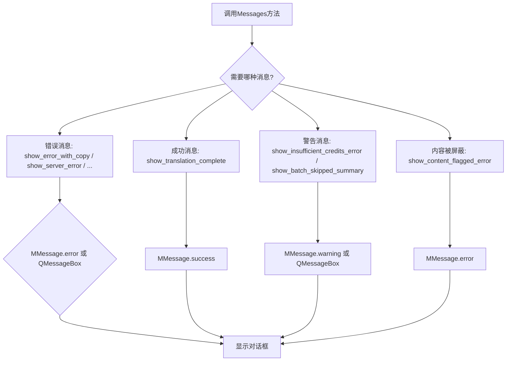

## 类结构

```
Messages (工具类)
└── 静态方法集合 (13个方法)
```

## 全局变量及字段


### `MMessage`
    
来自dayu_widgets的消息组件类，用于显示各种类型的消息提示

类型：`class`
    


### `QCoreApplication`
    
Qt核心应用程序类，提供翻译功能QCoreApplication.translate用于国际化文本

类型：`class`
    


### `Qt`
    
PySide6 Qt核心模块，包含文本交互标志等Qt常量

类型：`module`
    


### `QtWidgets`
    
PySide6 Qt小部件模块，提供QMessageBox、QApplication等UI组件

类型：`module`
    


    

## 全局函数及方法


### `Messages.show_translation_complete`

该方法用于在翻译操作完成后向用户显示一个成功的提示消息，使用 MMessage 组件展示 "Comic has been Translated!" 的国际化文本。

参数：

- `parent`：`QWidget | None`，父窗口部件，用于指定消息弹窗的所属窗口

返回值：`None`，该方法没有显式返回值

#### 流程图

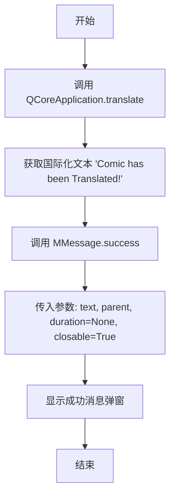

#### 带注释源码

```python
@staticmethod
def show_translation_complete(parent):
    """
    显示翻译完成时的成功提示消息。
    
    Args:
        parent: 父窗口部件，用于指定消息框的所属窗口
    """
    # 调用 MMessage.success 组件显示成功消息
    MMessage.success(
        # 使用 QCoreApplication.translate 进行国际化翻译
        # 从 'Messages' 上下文获取翻译后的文本
        text=QCoreApplication.translate(
            "Messages", 
            "Comic has been Translated!"
        ),
        # 指定父窗口部件，确保消息框模态显示在正确窗口上
        parent=parent,
        # duration=None 表示消息不会自动关闭，需用户手动关闭
        duration=None,
        # closable=True 允许用户关闭消息弹窗
        closable=True
    )
```


### `Messages.select_font_error`

该方法用于在用户未选择字体时显示错误提示消息，告知用户需要前往“设置 > 文本渲染 > 字体”页面选择或导入字体。

参数：

- `parent`：`QWidget | None`，父窗口部件，用于指定消息框的父级

返回值：`None`，无返回值（该方法直接调用 `MMessage.error` 而不返回结果）

#### 流程图

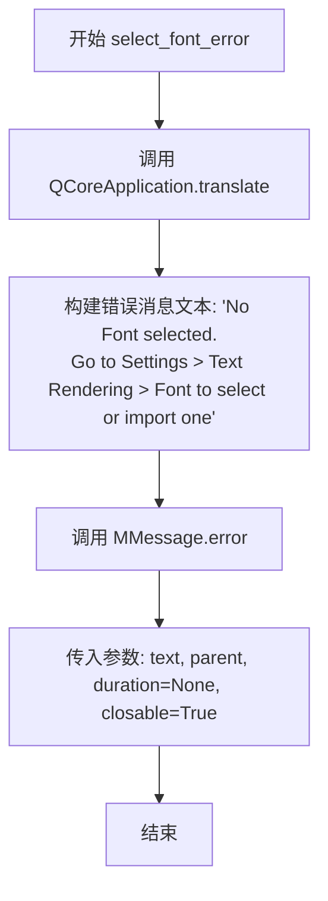

#### 带注释源码

```python
@staticmethod
def select_font_error(parent):
    """
    显示字体选择错误消息。
    当用户未选择字体时调用此方法，提示用户前往设置页面选择或导入字体。
    
    Args:
        parent: 父窗口部件，用于指定消息框的父级
    """
    # 调用 MMessage.error 显示错误类型的消息通知
    MMessage.error(
        # 使用 QCoreApplication.translate 进行国际化翻译
        # 消息内容：提示用户没有选择字体，并指引用户前往设置页面
        text=QCoreApplication.translate(
            "Messages", 
            "No Font selected.\nGo to Settings > Text Rendering > Font to select or import one "
        ),
        parent=parent,           # 父窗口部件
        duration=None,           # 消息持续时间，None 表示持久显示
        closable=True            # 是否显示关闭按钮
    )
```


### `Messages.show_not_logged_in_error`

显示一个错误提示消息，告知用户需要通过设置中的账户页面进行登录或注册才能继续操作。

参数：

- `parent`：`QWidget`（可选），父窗口组件，用于指定消息框的父级窗口

返回值：`None`，该方法直接通过副作用显示消息框，无返回值

#### 流程图

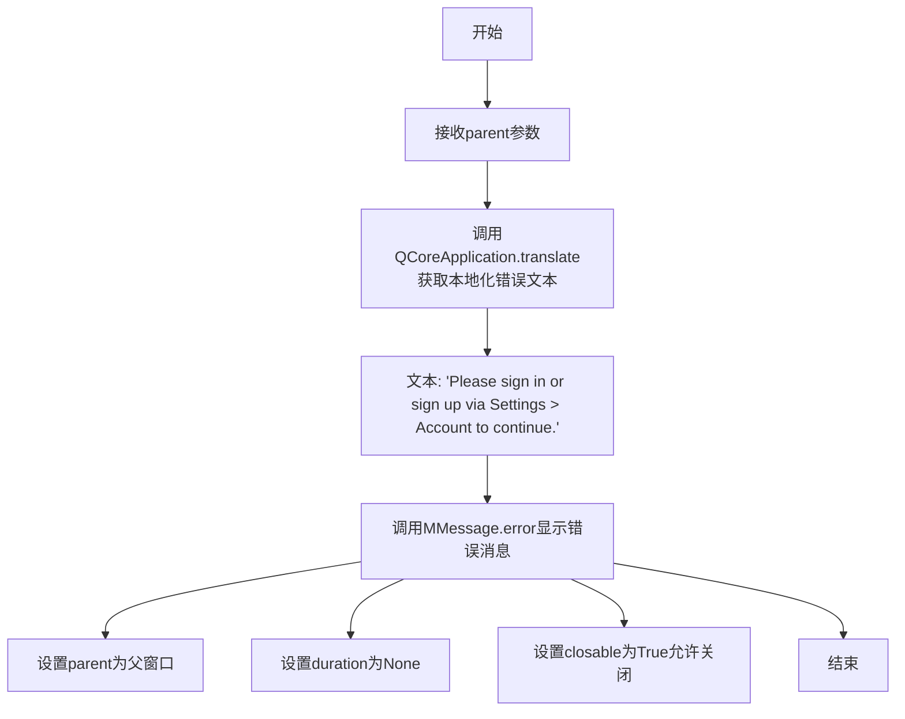

#### 带注释源码

```python
@staticmethod
def show_not_logged_in_error(parent):
    """
    显示用户未登录错误提示。
    当用户尝试需要账户权限的操作时调用此方法。
    
    Args:
        parent: 父窗口组件，用于确保消息框显示在正确的窗口层级中
    """
    # 调用MMessage.error组件显示错误类型的消息提示
    MMessage.error(
        # 使用QCoreApplication.translate获取国际化后的错误文本
        text=QCoreApplication.translate(
            "Messages",  # 翻译上下文标识
            # 错误提示内容，引导用户前往设置页面进行账户操作
            "Please sign in or sign up via Settings > Account to continue."
        ),
        parent=parent,  # 传递父窗口组件以确保模态窗口正确层级
        duration=None,  # 设置为None表示消息不会自动消失，需用户手动关闭
        closable=True   # 允许用户手动关闭消息提示
    )
```


### `Messages.show_translator_language_not_supported`

该方法用于显示一个错误提示消息，告知用户当前所选的翻译工具不支持目标语言，并建议用户选择其他语言或翻译工具。

参数：

- `parent`：widget 类型，父窗口组件，用于指定消息框的父级 Qt 控件

返回值：`None`，无返回值（该方法直接调用 `MMessage.error()` 显示消息，未显式返回值）

#### 流程图

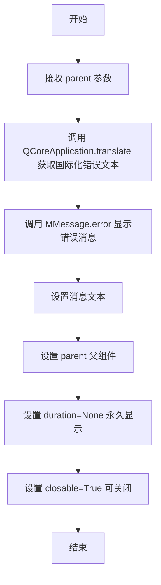

#### 带注释源码

```python
@staticmethod
def show_translator_language_not_supported(parent):
    """
    显示翻译器不支持目标语言的错误提示。
    
    当用户选择的翻译工具无法处理目标语言时调用此方法，
    引导用户更换翻译工具或选择其他语言。
    """
    # 调用 MMessage.error 生成错误类型的消息提示
    MMessage.error(
        # 使用 Qt 国际化机制翻译错误文本
        text=QCoreApplication.translate(
            "Messages",  # 翻译上下文
            "The translator does not support the selected target language. Please choose a different language or tool."  # 错误消息内容
        ),
        parent=parent,  # 设置父级窗口组件
        duration=None,  # None 表示消息永久显示，不会自动关闭
        closable=True   # 允许用户手动关闭消息
    )
```


### `Messages.show_missing_tool_error`

显示一个错误消息，提示用户未选择所需的工具，并引导用户前往设置页面进行工具选择。

参数：

- `parent`：`QWidget | None`，父窗口组件，用于显示消息的父级 widget
- `tool_name`：`str`，需要选择的工具名称（如 "OCR tool"、"Translator" 等）

返回值：`None`，该方法直接通过 MMessage 显示错误提示，无返回值

#### 流程图

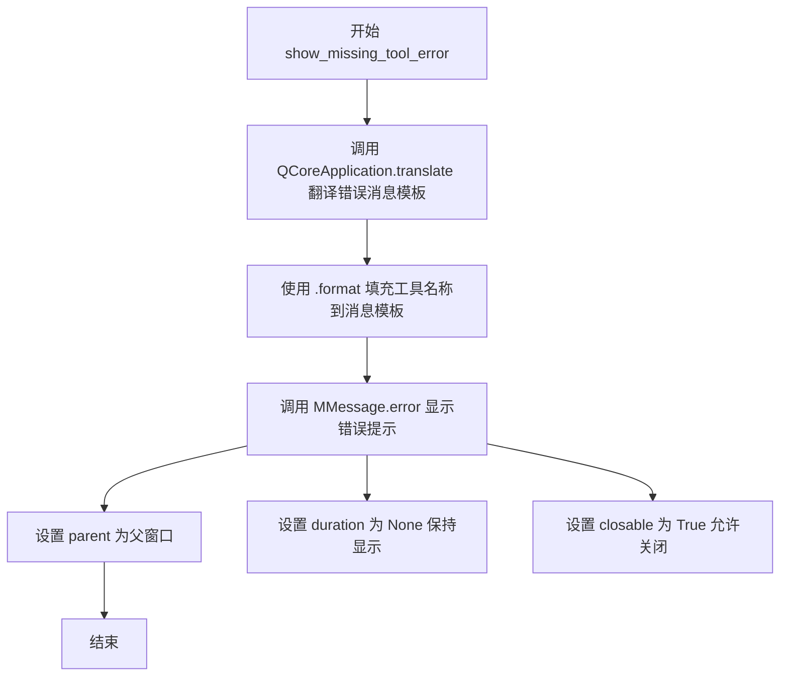

#### 带注释源码

```python
@staticmethod
def show_missing_tool_error(parent, tool_name):
    """
    显示缺少工具选择的错误提示
    
    Args:
        parent: 父窗口组件
        tool_name: 工具名称，将被插入到错误消息中
    """
    # 使用 MMessage.error 显示错误消息
    MMessage.error(
        # 翻译消息模板并格式化工具名称
        text=QCoreApplication.translate(
            "Messages",
            "No {} selected. Please select a {} in Settings > Tools."
        ).format(tool_name, tool_name),
        # 设置父窗口
        parent=parent,
        # duration=None 表示消息不会自动消失
        duration=None,
        # closable=True 允许用户手动关闭消息
        closable=True
    )
```


### `Messages.show_insufficient_credits_error`

显示一个错误对话框，提示用户积分不足无法执行操作，并提供可选的详细错误信息。用户点击"确定"按钮关闭对话框。

参数：

- `parent`：`QWidget`，父级窗口组件，用于指定对话框的父窗口
- `details`：`str | None`，可选的详细错误信息，来自后端服务

返回值：`None`，无返回值

#### 流程图

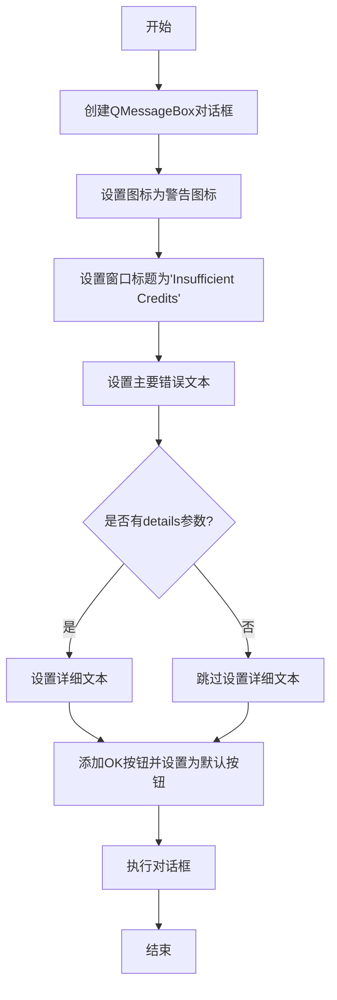

#### 带注释源码

```python
@staticmethod
def show_insufficient_credits_error(parent, details: str = None):
    """
    Show an error message when the user has insufficient credits.
    
    Args:
        parent: parent widget
        details: optional detailed message from backend
    """
    # 创建消息框实例，parent指定父窗口
    msg = QtWidgets.QMessageBox(parent)
    
    # 设置对话框图标为警告图标
    msg.setIcon(QtWidgets.QMessageBox.Warning)
    
    # 设置窗口标题，使用国际化翻译
    msg.setWindowTitle(QCoreApplication.translate("Messages", "Insufficient Credits"))
    
    # 设置对话框主要显示文本，提示用户积分不足及如何充值
    msg.setText(QCoreApplication.translate(
        "Messages", 
        "Insufficient credits to perform this action.\nGo to Settings > Account to buy more credits."
    ))
    
    # 如果提供了详细错误信息，则显示在详情折叠区域
    if details:
        msg.setDetailedText(details)
        
    # 添加"确定"按钮，设置按钮角色为接受角色
    ok_btn = msg.addButton(QCoreApplication.translate("Messages", "OK"), QtWidgets.QMessageBox.ButtonRole.AcceptRole)
    
    # 将确定按钮设置为默认按钮，按回车可直接触发
    msg.setDefaultButton(ok_btn)
    
    # 模态执行对话框，阻塞用户交互直到关闭
    msg.exec()
```


### `Messages.show_custom_not_configured_error`

这是一个静态方法，用于显示一个错误消息。当用户选择了"Custom"选项但没有正确配置高级API时触发此方法，提示大多数用户应该使用积分系统（Credits），并引导用户通过设置页面登录账户使用积分或配置自定义API设置。

参数：

- `parent`：`QtWidgets.QWidget`，父窗口组件，用于指定消息框的父级widget，决定消息框的显示位置和层级关系

返回值：`None`，无返回值。该方法直接调用 `MMessage.error` 显示错误提示，不返回任何值

#### 流程图

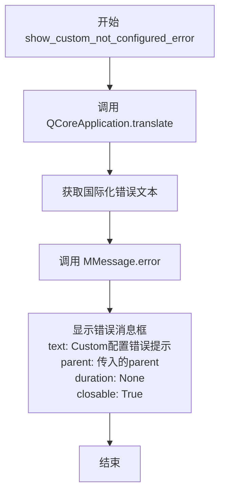

#### 带注释源码

```python
@staticmethod
def show_custom_not_configured_error(parent):
    """
    Show an error message when Custom is selected without proper configuration.
    Guides users to use the Credits system instead.
    
    当用户选择了Custom但没有正确配置时显示错误消息，
    引导大多数用户使用积分系统，或引导高级用户配置Custom API
    """
    # 调用MMessage.error组件显示错误提示
    MMessage.error(
        # 使用QCoreApplication.translate获取国际化错误文本
        # 提示用户Custom需要高级API配置，建议大多数用户使用积分系统
        text=QCoreApplication.translate(
            "Messages",
            "Custom requires advanced API configuration. Most users should use the Credits system instead.\n"
            "Please sign in via Settings > Account to use credits, or configure Custom API settings in Settings > Advanced."
        ),
        # parent参数指定消息框的父窗口，用于正确的窗口层级关系
        parent=parent,
        # duration为None表示消息框不会自动关闭，需要用户手动关闭
        duration=None,
        # closable为True显示关闭按钮，用户可以手动关闭消息
        closable=True
    )
```


### `Messages.show_error_with_copy`

显示一个关键错误对话框，主文本可选中，完整详情（traceback）放在 Details 窗格中，并提供一个 Copy 按钮将完整详情复制到剪贴板。

参数：

- `parent`：PySide6.QtWidgets.QWidget，父窗口组件
- `title`：str，对话框窗口标题
- `text`：str，主错误区域显示的简短错误文本
- `detailed_text`：str | None，可选的详细文本（通常是 traceback），显示在 Details 窗格中

返回值：`None`，无返回值

#### 流程图

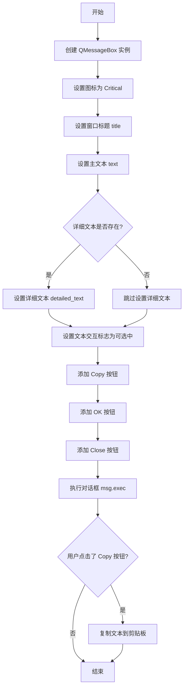

#### 带注释源码

```python
@staticmethod
def show_error_with_copy(parent, title: str, text: str, detailed_text: str | None = None):
    """
    Show a critical error dialog where the main text is selectable and the
    full details (traceback) are placed in the Details pane. A Copy button
    is provided to copy the full details to the clipboard.

    Args:
        parent: parent widget
        title: dialog window title
        text: short error text shown in the main area
        detailed_text: optional long text (traceback) shown in Details
    """
    # 1. 创建 QMessageBox 实例，传入父窗口
    msg = QtWidgets.QMessageBox(parent)
    
    # 2. 设置对话框图标为关键错误（红色叉号）
    msg.setIcon(QtWidgets.QMessageBox.Critical)
    
    # 3. 设置对话框窗口标题
    msg.setWindowTitle(title)
    
    # 4. 设置主显示文本
    msg.setText(text)
    
    # 5. 如果提供了详细文本，设置到 Details 展开区域
    if detailed_text:
        msg.setDetailedText(detailed_text)

    # 6. 允许用户选中主文本（鼠标和键盘）
    # 使用 try-except 防止某些 Qt 版本兼容性问题
    try:
        msg.setTextInteractionFlags(Qt.TextSelectableByMouse | Qt.TextSelectableByKeyboard)
    except Exception:
        pass

    # 7. 添加自定义按钮：Copy（动作按钮）、OK（接受）、Close（拒绝）
    copy_btn = msg.addButton(QCoreApplication.translate("Messages", "Copy"), QtWidgets.QMessageBox.ButtonRole.ActionRole)
    ok_btn = msg.addButton(QCoreApplication.translate("Messages", "OK"), QtWidgets.QMessageBox.ButtonRole.AcceptRole)
    msg.addButton(QCoreApplication.translate("Messages", "Close"), QtWidgets.QMessageBox.ButtonRole.RejectRole)
    
    # 8. 设置默认焦点按钮为 OK
    msg.setDefaultButton(ok_btn)
    
    # 9. 模态显示对话框并等待用户交互
    msg.exec()

    # 10. 检查用户是否点击了 Copy 按钮
    if msg.clickedButton() == copy_btn:
        try:
            # 11. 将详细文本（若不存在则用主文本）复制到系统剪贴板
            QtWidgets.QApplication.clipboard().setText(detailed_text or text)
        except Exception:
            # 12. 忽略剪贴板操作失败（如无权限等）
            pass
```


### `Messages.show_server_error`

显示5xx服务器错误的用户友好错误消息，根据HTTP状态码和上下文信息显示相应的错误提示。

参数：

-  `parent`：`QWidget`，父窗口部件
-  `status_code`：`int`，HTTP状态码，默认为500
-  `context`：`str | None`，可选上下文信息（'translation'、'ocr'或None表示通用）

返回值：`None`，无返回值

#### 流程图

```mermaid
flowchart TD
    A[开始] --> B{status_code == 501?}
    B -->|Yes| C{context == 'ocr'?}
    B -->|No| D{status_code in [500, 502, 503, 504]?}
    C -->|Yes| E[使用OCR错误消息]
    C -->|No| F{context == 'translation'?}
    F -->|Yes| G[使用翻译器错误消息]
    F -->|No| H[使用通用工具错误消息]
    D -->|Yes| I[从messages字典获取对应错误消息]
    D -->|No| J[使用500默认错误消息]
    E --> K[调用MMessage.error显示消息]
    G --> K
    H --> K
    I --> K
    J --> K
    K --> L[结束]
```

#### 带注释源码

```python
@staticmethod
def show_server_error(parent, status_code: int = 500, context: str = None):
    """
    Show a user-friendly error for 5xx server issues.
    
    Args:
        parent: parent widget
        status_code: HTTP status code
        context: optional context ('translation', 'ocr', or None for generic)
    """
    # 定义常见5xx状态码对应的错误消息字典
    messages = {
        500: QCoreApplication.translate("Messages", "We encountered an unexpected server error.\nPlease try again in a few moments."),
        502: QCoreApplication.translate("Messages", "The external service provider is having trouble.\nPlease try again later."),
        503: QCoreApplication.translate("Messages", "The server is currently busy or under maintenance.\nPlease try again shortly."),
        504: QCoreApplication.translate("Messages", "The server took too long to respond.\nPlease check your connection or try again later."),
    }
    
    # Context-aware 501 message
    # 根据context参数为501状态码提供上下文相关的错误消息
    if status_code == 501:
        if context == 'ocr':
            text = QCoreApplication.translate("Messages", "The selected text recognition tool is not supported.\nPlease select a different tool in Settings.")
        elif context == 'translation':
            text = QCoreApplication.translate("Messages", "The selected translator is not supported.\nPlease select a different tool in Settings.")
        else:
            text = QCoreApplication.translate("Messages", "The selected tool is not supported.\nPlease select a different tool in Settings.")
    else:
        # 对于其他状态码，从字典获取对应消息，不存在则使用500的默认消息
        text = messages.get(status_code, messages[500])
    
    # 调用MMessage.error显示错误消息
    # duration=None表示消息不会自动关闭
    # closable=True允许用户手动关闭消息
    MMessage.error(
        text=text,
        parent=parent,
        duration=None,
        closable=True
    )
```


### `Messages.show_network_error`

显示用户友好的网络连接错误提示，当应用程序无法连接到服务器时调用此方法向用户展示问题。

参数：

- `parent`：`QWidget`，父窗口部件，用于指定消息框的父级控件

返回值：`None`，无返回值

#### 流程图

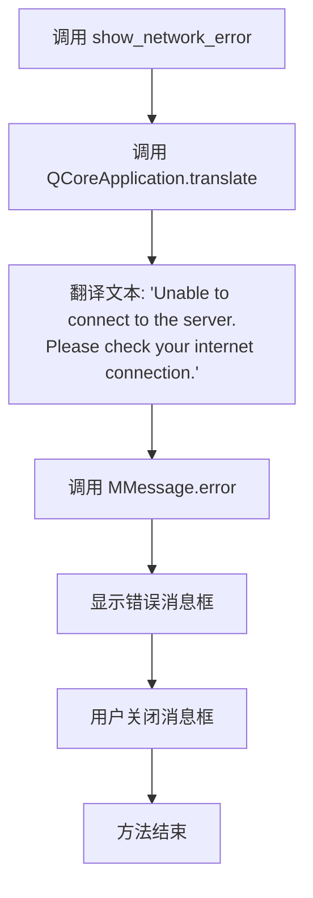

#### 带注释源码

```python
@staticmethod
def show_network_error(parent):
    """
    Show a user-friendly error for network/connectivity issues.
    显示用户友好的网络/连接问题错误消息
    """
    # 使用 MMessage.error 组件显示错误提示
    MMessage.error(
        # 调用 QCoreApplication.translate 进行国际化翻译
        # 文本内容：无法连接到服务器，请检查网络连接
        text=QCoreApplication.translate(
            "Messages", 
            "Unable to connect to the server.\nPlease check your internet connection."
        ),
        parent=parent,  # 父窗口部件
        duration=None,  # 消息持续显示（无超时）
        closable=True   # 允许用户关闭消息
    )
```

---

### 关联信息

**所属类**: `Messages`

**核心功能**: Messages 类封装了应用程序中各种用户提示消息的静态方法，包括成功提示、错误提示、警告提示等，统一使用 MMessage 或 QMessageBox 组件展示。

**外部依赖**:

- `MMessage`: 来自 `dayu_widgets.message` 的消息提示组件
- `QCoreApplication.translate`: Qt 国际化翻译函数
- `QtWidgets`: PySide6 窗口部件模块


### `Messages.get_content_flagged_text`

构建标准化的内容被AI安全过滤器拦截的错误文本，根据上下文（OCR、翻译或其他操作）返回对应的国际化提示信息。

参数：

- `details`：`str = None`，可选的详细错误信息（当前方法中未使用，保留用于扩展）
- `context`：`str = "Operation"`，操作上下文，用于区分不同场景（"OCR"、"Translator"、"Translation" 或其他通用操作）

返回值：`str`，根据上下文返回对应的国际化错误消息文本

#### 流程图

```mermaid
flowchart TD
    A[开始 get_content_flagged_text] --> B{context == 'OCR'?}
    B -->|Yes| C[返回OCR拦截消息]
    B -->|No| D{context in ('Translator', 'Translation')?}
    D -->|Yes| E[返回Translation拦截消息]
    D -->|No| F[返回通用Operation拦截消息]
    C --> G[结束 - 返回msg]
    E --> G
    F --> G
```

#### 带注释源码

```python
@staticmethod
def get_content_flagged_text(details: str = None, context: str = "Operation") -> str:
    """
    Build the standardized content-flagged error text.
    
    Args:
        details: optional detailed message from backend (currently unused, reserved for future)
        context: operation context - "OCR", "Translator", "Translation", or "Operation"
    
    Returns:
        str: localized error message based on context
    """
    # 如果上下文是OCR（光学字符识别），返回文本识别被拦截的消息
    if context == "OCR":
        msg = QCoreApplication.translate(
            "Messages",
            "Text Recognition blocked: The AI provider flagged this content.\nPlease try a different Text Recognition tool."
        )
    # 如果上下文是Translator或Translation，返回翻译被拦截的消息
    elif context in ("Translator", "Translation"):
        msg = QCoreApplication.translate(
            "Messages",
            "Translation blocked: The AI provider flagged this content.\nPlease try a different translator."
        )
    # 其他情况，返回通用的操作被拦截的消息
    else:
        msg = QCoreApplication.translate(
            "Messages",
            "Operation blocked: The AI provider flagged this content.\nPlease try a different tool."
        )
    
    # 返回构建好的国际化错误消息
    return msg
```


### `Messages.show_content_flagged_error`

显示内容被安全过滤器拦截的错误消息，根据不同的上下文（OCR、翻译或其他操作）展示对应的友好提示信息。

参数：

- `parent`：`QWidget`，父窗口组件，用于指定消息框的父级
- `details`：`str | None`，可选的详细错误信息（当前未使用，保留用于未来扩展）
- `context`：`str`，错误上下文，用于确定显示的错误消息文本，默认为 `"Operation"`，可选值包括 `"OCR"`、`"Translator"`/`"Translation"` 或其他
- `duration`：`int | None`，消息显示持续时间，`None` 表示持久显示
- `closable`：`bool`，是否显示关闭按钮，默认为 `True`

返回值：`Any`，返回 `MMessage.error()` 的返回值，通常为消息框对象

#### 流程图

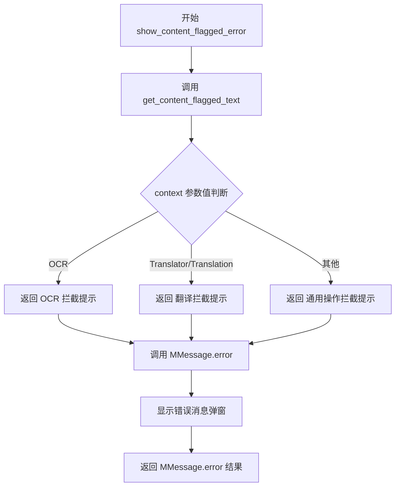

#### 带注释源码

```python
@staticmethod
def show_content_flagged_error(parent, details: str = None, context: str = "Operation", duration=None, closable=True):
    """
    Show a friendly error when content is blocked by safety filters.
    
    Args:
        parent: parent widget
        details: optional detailed message from backend (currently unused, reserved for future)
        context: error context to determine the appropriate message
        duration: how long to show the message, None for persistent
        closable: whether to show a close button
    """
    # 根据 context 获取对应的错误消息文本
    # context 可以是 "OCR", "Translator", "Translation", 或其他值
    msg_text = Messages.get_content_flagged_text(details=details, context=context)
    
    # 调用 MMessage.error 显示错误消息弹窗
    # 参数：
    #   - text: 要显示的错误消息文本
    #   - parent: 父窗口组件
    #   - duration: 显示持续时间，None 表示持久显示
    #   - closable: 是否可关闭
    return MMessage.error(
        text=msg_text,
        parent=parent,
        duration=duration,
        closable=closable
    )
```


### `Messages.show_batch_skipped_summary`

显示批量操作结束时因跳过的图片而产生的持久性摘要信息。该方法通过国际化翻译构建提示文本，并调用 MMessage.warning 显示一个不可关闭（duration=None）且可关闭（closable=True）的警告消息框，告知用户被跳过的图片数量以及如何查看详细的跳过的原因。

参数：

- `parent`：`QWidget`，父窗口部件，用于指定消息框的父级 Qt 控件
- `skipped_count`：`int`，在当前批量操作中被跳过的图片数量

返回值：`Any`，返回 `MMessage.warning()` 的返回值，通常是消息框控件实例

#### 流程图

```mermaid
flowchart TD
    A[开始 show_batch_skipped_summary] --> B[调用 QCoreApplication.translate 国际化翻译]
    B --> C[使用 .format 替换占位符 {0} 为 skipped_count]
    C --> D[调用 MMessage.warning 显示警告消息]
    D --> E[返回 MMessage.warning 的结果]
    
    B -->|翻译文本| B1["{0} image(s) were skipped in this batch.\nOpen Batch Report to see all skipped images and reasons."]
    C -->|格式化后| C1["{n} image(s) were skipped in this batch.\nOpen Batch Report to see all skipped images and reasons."]
```

#### 带注释源码

```python
@staticmethod
def show_batch_skipped_summary(parent, skipped_count: int):
    """
    Show a persistent summary when a batch finished with skipped images.
    
    Args:
        parent: parent widget
        skipped_count: number of images that were skipped in the batch
    """
    # 使用 Qt 国际化机制翻译提示文本，{0} 为占位符
    text = QCoreApplication.translate(
        "Messages",
        "{0} image(s) were skipped in this batch.\nOpen Batch Report to see all skipped images and reasons."
    ).format(skipped_count)  # 将占位符替换为实际的跳过数量
    
    # 调用 MMessage.warning 显示警告类型消息
    # duration=None 表示消息不会自动消失（持久显示）
    # closable=True 允许用户手动关闭消息
    return MMessage.warning(
        text=text,           # 消息正文内容
        parent=parent,       # 父窗口部件
        duration=None,       # 不自动关闭，保持持久
        closable=True        # 允许用户关闭
    )
```

## 关键组件


### 翻译完成消息组件

显示翻译成功提示，使用MMessage.success组件，包含国际化翻译文本"Comic has been Translated!"

### 字体选择错误组件

显示未选择字体的错误提示，引导用户前往Settings > Text Rendering > Font进行配置

### 登录状态错误组件

提示用户需要登录或注册账户，通过Settings > Account进行操作

### 翻译语言不支持错误组件

显示所选翻译工具不支持目标语言的错误信息

### 工具未选择错误组件

通用错误提示，显示指定工具未选择错误，支持动态工具名称参数

### 积分不足错误组件

使用QMessageBox显示积分不足警告，包含可选的详细后端信息，提供OK按钮确认

### 自定义API未配置错误组件

提示用户自定义API需要高级配置，建议大多数用户使用积分系统

### 可复制错误对话框组件

显示关键错误对话框，主文本可选中，详细文本（traceback）置于详情面板，提供复制按钮将详情复制到剪贴板

### 服务器错误处理组件

处理5xx HTTP服务器错误（500/502/503/504），根据状态码显示不同错误信息，支持上下文感知（ocr/translation）

### 网络连接错误组件

显示网络连接失败的友好错误提示

### 内容拦截错误组件

显示AI提供商内容拦截错误，根据上下文（OCR/翻译/通用）显示不同提示文本

### 批量跳过摘要组件

显示批量处理中跳过的图像数量摘要，使用MMessage.warning持久显示


## 问题及建议


### 已知问题

-   **重复的参数传递**：多个方法（show_translation_complete、select_font_error、show_not_logged_in_error等）在调用MMessage时重复传递相同的参数`duration=None, closable=True`，导致代码冗余。
-   **不一致的消息实现**：show_insufficient_credits_error使用QtWidgets.QMessageBox，而其他方法使用MMessage组件，两者混用可能导致UI风格不统一和维护困难。
-   **字典重复创建**：show_server_error方法中的messages字典在每次调用时都会重新创建，应提取为类常量以提高性能。
-   **异常处理过于宽泛**：show_error_with_copy和show_content_flagged_error中的try-except捕获所有异常后仅pass，掩盖了潜在的真实错误，不利于调试。
-   **字符串格式化方式不统一**：show_missing_tool_error使用.format()方法，而代码中其他位置可能使用f-string或translate的原生方式。
-   **未使用的参数**：get_content_flagged_text方法接收details参数但从未使用，造成API混乱。

### 优化建议

-   **提取公共参数**：创建一个私有方法或使用默认参数封装MMessage的调用，减少重复代码。
-   **统一消息组件**：考虑统一使用MMessage或创建一个抽象层，根据消息类型选择合适的实现。
-   **提取字典为常量**：将show_server_error中的messages字典定义为类级常量，避免重复创建。
-   **改进异常处理**：在异常处理中至少记录日志或提供更具体的异常类型捕获，而不是捕获所有Exception。
-   **统一字符串格式化**：统一使用f-string或参数化方式处理动态文本。
-   **清理未使用参数**：移除get_content_flagged_text中未使用的details参数，或在文档中说明其预留用途。

## 其它


### 设计目标与约束

**设计目标**：
- 提供统一的用户消息展示接口，封装MMessage和QMessageBox两种Qt消息组件的差异化使用
- 通过静态方法简化各类业务场景下的错误、警告、成功提示的调用方式
- 统一管理国际化翻译文本，确保多语言环境下的一致性

**设计约束**：
- 依赖PySide6 Qt框架和dayu_widgets库
- 所有方法均为静态方法，无需实例化
- parent参数必须传入，用于确保Modal对话框正确显示层级
- duration=None表示消息框常驻，不自动关闭

### 错误处理与异常设计

- **异常捕获策略**：在涉及剪贴板操作、文本交互标志设置等可能因Qt版本差异导致失败的代码段使用try-except捕获Exception，防止程序崩溃
- **可选参数容错**：details、detailed_text等可选参数使用None默认值，调用方无需强制处理空值情况
- **状态码映射容错**：show_server_error方法中使用messages.get(status_code, messages[500])处理未知HTTP状态码，默认为500错误信息

### 外部依赖与接口契约

- **MMessage**：来自dayu_widgets库，用于显示Toast类型的轻量级消息提示
- **QCoreApplication.translate**：Qt国际化接口，接收context和message参数进行多语言翻译
- **QtWidgets.QMessageBox**：Qt原生对话框，用于需要用户交互确认的复杂消息场景
- **QtWidgets.QApplication.clipboard()**：系统剪贴板接口，用于复制错误详情

### 数据流与状态机

- **消息触发流程**：业务层调用Messages类静态方法 → 传入parent widget和业务参数 → 方法内部组装翻译文本 → 调用MMessage或QMessageBox显示
- **无状态设计**：该类为工具类，不维护任何实例状态，所有方法均为无副作用的纯展示逻辑
- **状态独立**：各方法间无状态依赖，可并行调用

### 性能考虑

- **静态方法优势**：无实例化开销，类加载时即完成方法绑定
- **延迟实例化**：QMessageBox仅在需要时创建，非预加载
- **字符串模板**：使用.format()进行字符串拼接，避免重复构建多语言文本

### 线程安全性

- **UI线程约束**：所有方法均涉及Qt UI组件，必须在主线程调用
- **无共享状态**：类内无类变量或实例变量，无线程竞争风险
- **跨线程警告**：如在子线程调用，需使用QMetaObject.invokeMethod或信号槽机制转发到主线程

### 单元测试设计建议

- **Mock对象**：测试时需mock QCoreApplication.translate返回测试语言文本
- **parent参数**：可使用Qt测试框架的QTest.qWaitForWindowExposed确保widget正确显示
- **覆盖率目标**：建议覆盖所有静态方法的正常流程及可选参数为None的边界情况
- **异常分支**：重点测试剪贴板操作失败、TextSelectableByMouse标志设置异常等try-except捕获路径


    