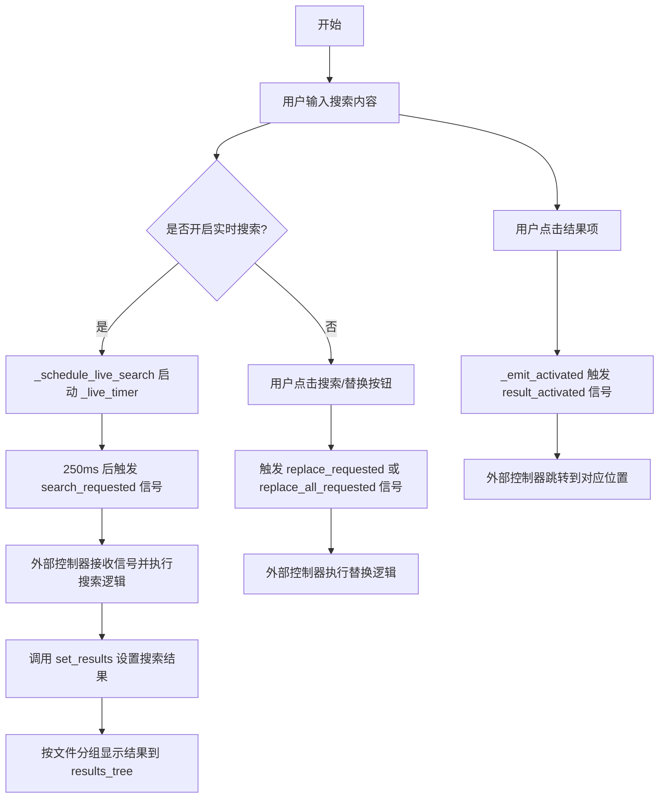
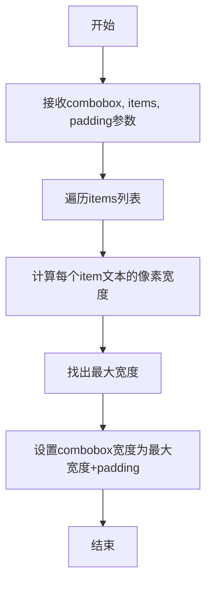
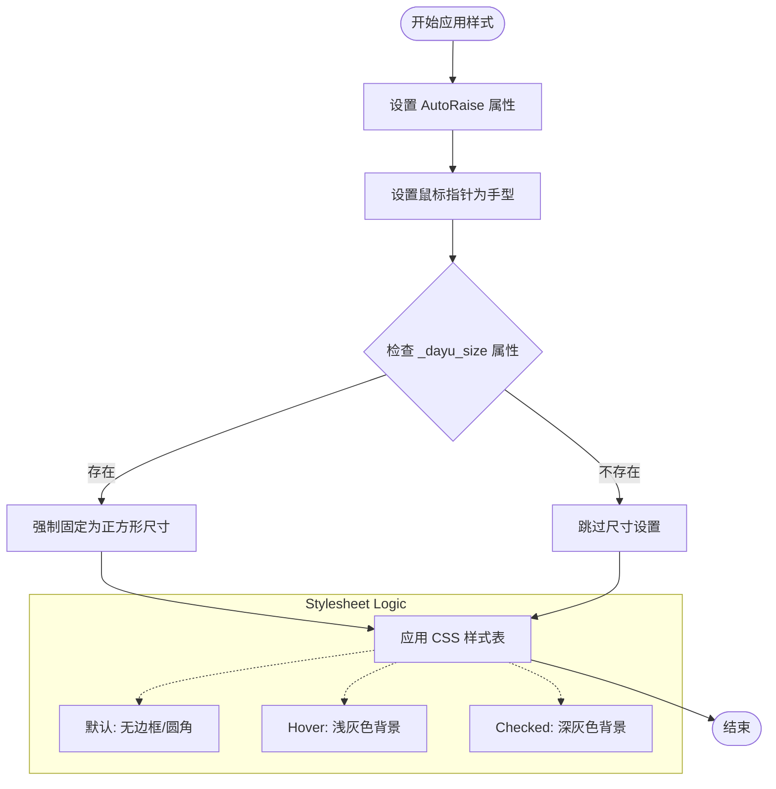
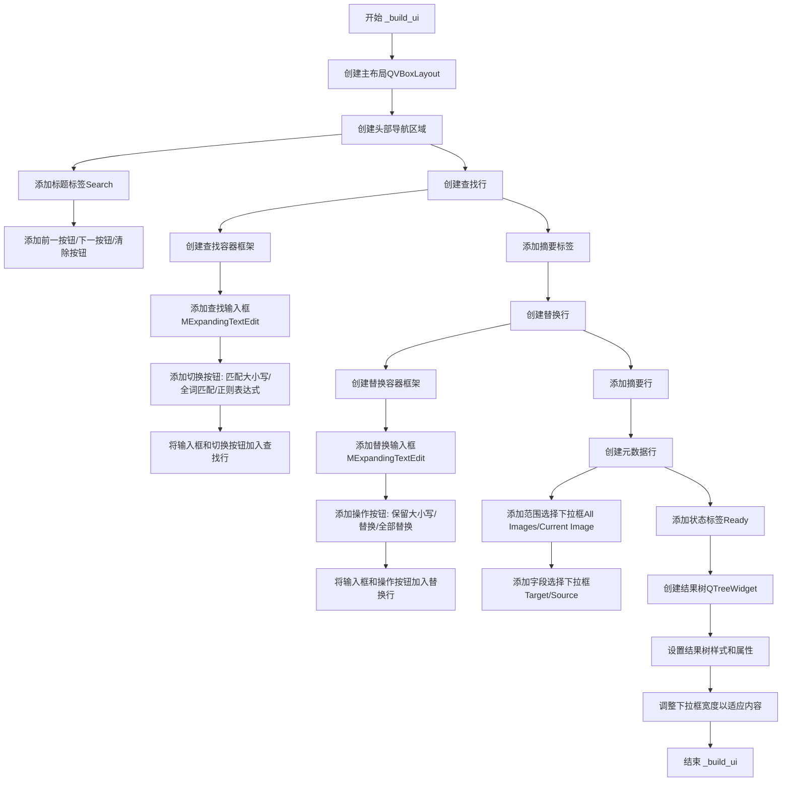
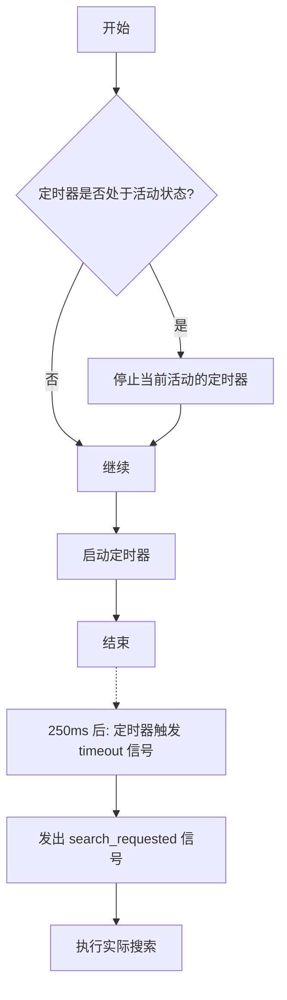
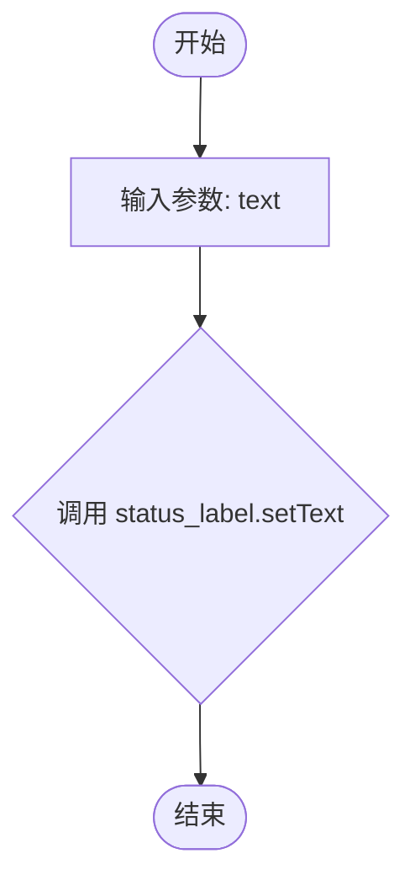
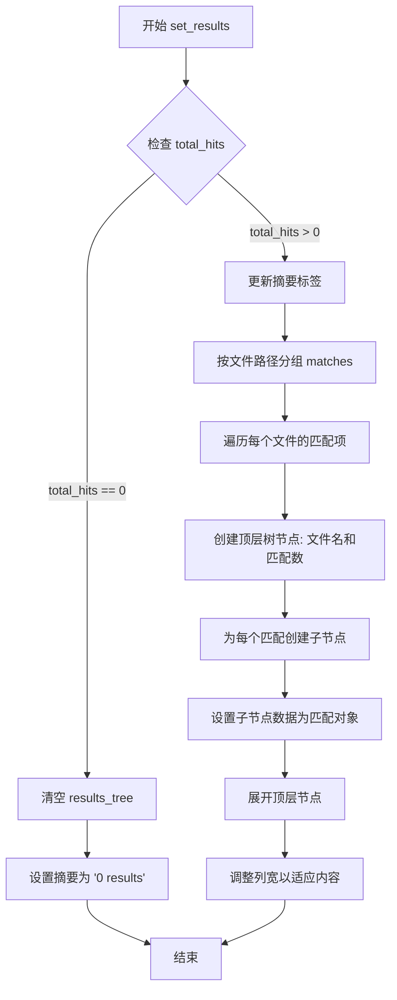
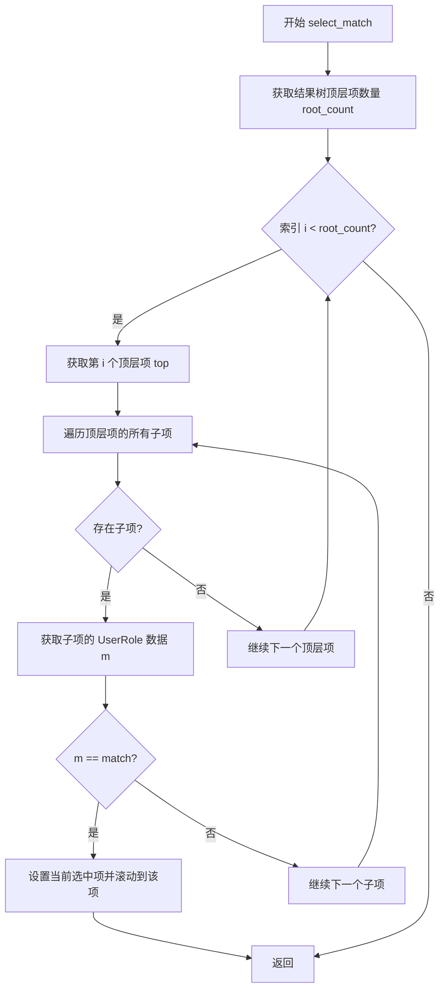
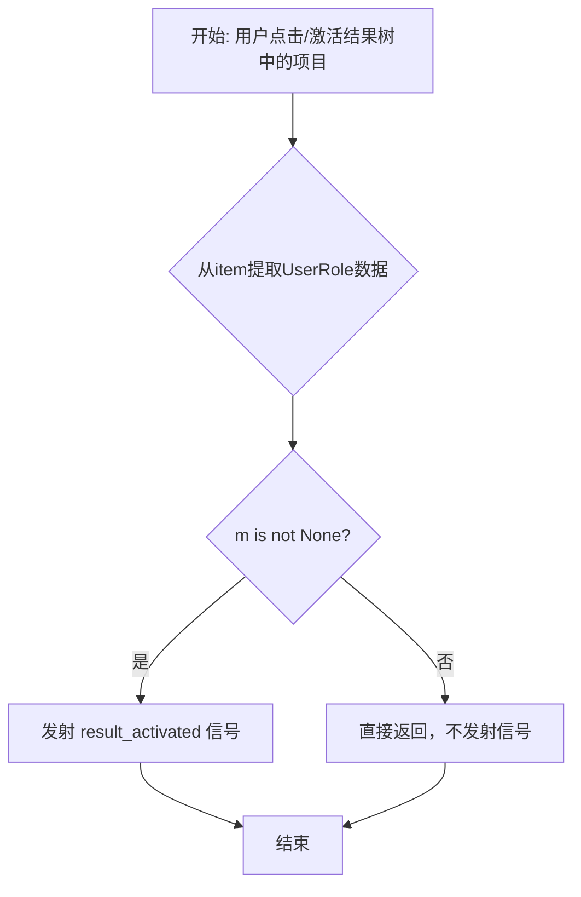

# `comic-translate\app\ui\search_replace_panel.py` 详细设计文档

一个基于 PySide6 实现的 VS Code 风格搜索/替换面板，用于 MTPE（机器翻译后编辑）场景，提供实时搜索、大小写匹配、全词匹配、正则表达式、范围选择、字段过滤、替换和全部替换功能，并通过树形结构展示搜索结果。

## 整体流程



## 类结构

```
QtWidgets.QWidget (PySide6 基类)
└── SearchReplacePanel (搜索替换面板)
```

## 全局变量及字段


### `SearchReplacePanel._live_timer`
    
A timer for debouncing live search requests to avoid excessive searches

类型：`QtCore.QTimer`
    


### `SearchReplacePanel.find_input`
    
Text input field for entering search query

类型：`MExpandingTextEdit`
    


### `SearchReplacePanel.replace_input`
    
Text input field for replacement text

类型：`MExpandingTextEdit`
    


### `SearchReplacePanel.match_case_btn`
    
Toggle button to enable case-sensitive search (Aa)

类型：`MToolButton`
    


### `SearchReplacePanel.whole_word_btn`
    
Toggle button to enable whole word matching (ab)

类型：`MToolButton`
    


### `SearchReplacePanel.regex_btn`
    
Toggle button to enable regular expression search (.*)

类型：`MToolButton`
    


### `SearchReplacePanel.preserve_case_btn`
    
Toggle button to preserve case when replacing text (AB)

类型：`MToolButton`
    


### `SearchReplacePanel.scope_combo`
    
Combo box to select search scope (All Images or Current Image)

类型：`MComboBox`
    


### `SearchReplacePanel.field_combo`
    
Combo box to select search field (Target or Source text)

类型：`MComboBox`
    


### `SearchReplacePanel.summary_label`
    
Label displaying summary of search results count

类型：`QtWidgets.QLabel`
    


### `SearchReplacePanel.status_label`
    
Label displaying current status message

类型：`QtWidgets.QLabel`
    


### `SearchReplacePanel.results_tree`
    
Tree widget to display search results grouped by file

类型：`QtWidgets.QTreeWidget`
    


### `SearchReplacePanel.prev_btn`
    
Button to navigate to previous match (up arrow)

类型：`MToolButton`
    


### `SearchReplacePanel.next_btn`
    
Button to navigate to next match (down arrow)

类型：`MToolButton`
    


### `SearchReplacePanel.clear_btn`
    
Button to clear search input and results (X)

类型：`MToolButton`
    


### `SearchReplacePanel.replace_btn`
    
Button to replace current match

类型：`MToolButton`
    


### `SearchReplacePanel.replace_all_btn`
    
Button to replace all matches

类型：`MToolButton`
    
    

## 全局函数及方法


### `set_combo_box_width`

根据提供的代码分析，`set_combo_box_width` 是从 `app.ui.settings.utils` 模块导入的全局函数。**该函数的实现源码并未包含在当前提供的代码片段中**，仅在 `_build_ui` 方法中被调用。

根据调用上下文，可以推断出该函数的签名如下：

参数：

- `combobox`：`QComboBox`（或 MComboBox），需要设置宽度的组合框对象
- `items`：`List[str]`，组合框中所有项目的文本列表，用于计算最大宽度
- `padding`：`int`，额外的内边距值（默认 40）

返回值：未知（未在当前代码片段中显示）

#### 流程图

由于没有函数定义源码，无法生成准确的流程图。以下为基于调用逻辑的推测：



#### 带注释源码

由于 `set_combo_box_width` 函数的实现未包含在提供的代码中，以下为调用处的代码片段：

```
# 在 _build_ui 方法中调用 set_combo_box_width
# Make combos wide enough for their longest entries.
set_combo_box_width(
    self.scope_combo, [self.scope_combo.itemText(i) for i in range(self.scope_combo.count())], padding=40
)
set_combo_box_width(
    self.field_combo, [self.field_combo.itemText(i) for i in range(self.field_combo.count())], padding=40
)
```

---

**注意**：要获取 `set_combo_box_width` 函数的完整实现源码，需要查看 `app/ui/settings/utils.py` 文件。


### `SearchReplacePanel.__init__`

该方法为 `SearchReplacePanel` 类的构造函数。它初始化面板的基类，设置用于实时搜索的延迟计时器（`_live_timer`），并调用内部方法 `_build_ui` 来构建整个搜索与替换的用户界面布局。

参数：

- `parent`：`PySide6.QtWidgets.QWidget | None`，父窗口部件，默认为 `None`。如果提供，则作为该widget的父对象。

返回值：`None`，无返回值（Python 构造函数隐式返回 `None`）。

#### 流程图

```mermaid
graph TD
    A([Start __init__]) --> B[调用父类构造函数<br>super().__init__(parent)]
    B --> C[创建 QTimer 实例<br>self._live_timer]
    C --> D[配置计时器属性<br>SingleShot: True, Interval: 250ms]
    D --> E[连接信号<br>timeout.connect(search_requested)]
    E --> F[调用 UI 构建方法<br>self._build_ui()]
    F --> G([End __init__])
```

#### 带注释源码

```python
def __init__(self, parent=None):
    # 调用父类 QWidget 的初始化方法，传入 parent 以建立 Qt 对象树
    super().__init__(parent)
    
    # 初始化实时搜索的定时器
    self._live_timer = QtCore.QTimer(self)
    # 设置为单次触发模式（只发射一次超时信号，而非重复发射）
    self._live_timer.setSingleShot(True)
    # 设置搜索延迟为 250 毫秒
    self._live_timer.setInterval(250)
    # 当定时器超时时，发射 search_requested 信号以触发搜索
    self._live_timer.timeout.connect(self.search_requested)
    
    # 构建用户界面组件
    self._build_ui()
```


### `SearchReplacePanel._apply_latching_toggle_style`

该方法是一个私有成员函数，负责为搜索面板中的工具按钮（Tool Button）应用一种特殊的视觉样式，使其模拟 VS Code 中的“闩锁”（Latched）切换效果。这种样式确保按钮在切换状态（勾选/未勾选）时具有持久的视觉反馈，并且无论按钮文字内容如何，都能保持整齐的方块形状。

参数：
- `btn`：`QtWidgets.QToolButton`，需要应用样式的目标按钮控件。

返回值：`None`，该方法直接修改传入按钮的内部状态，不返回任何值。

#### 流程图



#### 带注释源码

```python
def _apply_latching_toggle_style(self, btn: QtWidgets.QToolButton):
    # 确保按钮呈现"自动凸起"样式，这在工具栏中很常见，
    # 使得按钮在鼠标悬停时才有立体感，模拟 VS Code 的扁平化风格。
    btn.setAutoRaise(True)
    # 设置鼠标光标为手型，提示用户该元素是可交互的（Toggle）。
    btn.setCursor(Qt.CursorShape.PointingHandCursor)

    # 强制要求正方形宽高比，以确保无论按钮内是文本还是图标，
    # 都能保持整齐划一的视觉统一性，不受内容长短影响布局。
    if hasattr(btn, "_dayu_size"):
        btn.setFixedSize(btn._dayu_size, btn._dayu_size)

    # 应用 Qt 样式表 (QSS) 实现"闩锁"效果：
    # 1. padding: 0px 确保内容紧凑。
    # 2. border-radius: 3px 制造轻微圆角。
    # 3. checked 状态时背景变为深灰色，提供明确的"已激活"视觉反馈。
    btn.setStyleSheet(
        """
        QToolButton { 
            padding: 0px; 
            border-radius: 3px; 
            margin: 0px 1px;
            border: none;
        }
        QToolButton:hover { background-color: rgba(127, 127, 127, 0.18); }
        QToolButton:checked { background-color: rgba(127, 127, 127, 0.35); }
        """
    )
```

#### 关键组件信息

*   **MToolButton**：项目封装的工具按钮类，被传 入此方法进行样式定制。
*   **Qt StyleSheet (QSS)**：Qt 专用的 CSS 样式语言，用于实现跨平台的 UI 定制。

#### 潜在的技术债务或优化空间

1.  **脆弱的属性检查**：代码中使用 `hasattr(btn, "_dayu_size")` 来决定是否固定尺寸。这种magic string（魔字符串）依赖于外部类可能存在的特定属性，缺乏显式接口定义。如果 `_dayu_size` 属性被移除或改名，功能会静默失效。建议通过方法参数或配置对象显式传递尺寸需求。
2.  **样式硬编码**：CSS 样式表作为字符串直接内联在方法中。如果多个地方需要复用这套样式，需要重复代码。最佳实践是将样式定义在外部 `qss` 文件或 `QDarkStyleSheet` 类似的资源中，或将其提取为类的常量（`Class Var`）。
3.  **无返回值设计**：该方法没有返回成功/失败状态或验证结果，如果样式应用失败（如传入非 ToolButton），调用者难以感知。

#### 其它项目

*   **设计目标与约束**：
    *   **目标**：实现 VS Code 风格的“始终可见”切换按钮。普通的 Qt `toggle` 样式在失去焦点后通常不明显，此方法强制通过背景色区分状态。
    *   **约束**：必须继承自 `QToolButton` 或其子类，因为使用了特定于该控件的 `setAutoRaise` 和样式选择器。
*   **错误处理**：
    *   目前没有错误处理。如果传入的 `btn` 参数为 `None` 或类型不兼容，会导致运行时错误。应在入口处增加类型检查或 `isinstance` 验证。
*   **数据流与状态机**：
    *   此方法属于“视图（View）”层的样式更新逻辑。它不改变后端数据（Model），仅响应 Controller 或 Model 的指令（如 `toggled` 信号）来更新 UI 表现。


### `SearchReplacePanel._build_ui`

该方法负责构建搜索/替换面板的完整用户界面，包括头部导航区、查找输入区、替换输入区、选项下拉框、状态标签和结果树等所有UI组件，并配置样式、信号槽连接和布局约束。

参数：无（仅包含 `self` 实例参数）

返回值：`None`，该方法为构建方法，不返回任何值

#### 流程图



#### 带注释源码

```python
def _build_ui(self):
    """
    构建搜索/替换面板的完整用户界面。
    
    该方法创建以下UI组件：
    - 头部导航区：标题、前一/下一/清除按钮
    - 查找输入区：查找文本框、匹配选项切换按钮
    - 替换输入区：替换文本框、操作按钮
    - 元数据区：范围和字段选择下拉框
    - 结果展示区：状态标签、结果树形控件
    """
    # 创建主垂直布局，设置边距和间距为0/2像素
    layout = QtWidgets.QVBoxLayout(self)
    layout.setContentsMargins(0, 0, 0, 0)
    layout.setSpacing(2)

    # ─── HEADER ROW (Navigation) ────────────────────────────────────────
    # 创建头部容器，包含导航按钮
    header_container = QtWidgets.QWidget()
    header_row = QtWidgets.QHBoxLayout(header_container)
    header_row.setContentsMargins(6, 6, 6, 0)
    header_row.setSpacing(2)

    # 添加"Search"标题标签，设置为粗体和灰色
    title_lbl = QtWidgets.QLabel(self.tr("Search"))
    title_lbl.setStyleSheet("font-weight: bold; color: #BBBBBB;")
    header_row.addWidget(title_lbl)
    header_row.addStretch()  # 添加弹簧将按钮推到右侧

    # 创建前一按钮：上箭头图标，小尺寸，点击触发prev_requested信号
    self.prev_btn = MToolButton().icon_only().svg("up_fill.svg").small()
    self.prev_btn.setToolTip(self.tr("Previous match (Ctrl+Enter)"))
    self.prev_btn.clicked.connect(self.prev_requested)
    
    # 创建下一按钮：下箭头图标，小尺寸，点击触发next_requested信号
    self.next_btn = MToolButton().icon_only().svg("down_fill.svg").small()
    self.next_btn.setToolTip(self.tr("Next match (Enter)"))
    self.next_btn.clicked.connect(self.next_requested)

    # 创建清除按钮：关闭图标，小尺寸，点击触发_clear_find方法
    self.clear_btn = MToolButton().icon_only().svg("close_line.svg").small()
    self.clear_btn.setToolTip(self.tr("Clear (Esc)"))
    self.clear_btn.clicked.connect(self._clear_find)

    # 将导航按钮添加到头部行
    header_row.addWidget(self.prev_btn)
    header_row.addWidget(self.next_btn)
    header_row.addWidget(self.clear_btn)
    
    # 将头部容器添加到主布局
    layout.addWidget(header_container)

    # ─── FIND ROW ───────────────────────────────────────────────────────
    # 创建查找行水平布局
    find_row = QtWidgets.QHBoxLayout()
    find_row.setContentsMargins(6, 0, 6, 0)
    find_row.setSpacing(2)

    # 创建查找输入容器框架，带边框和圆角样式
    find_container = QtWidgets.QFrame()
    find_container.setObjectName("findContainer")
    find_container.setStyleSheet("""
        #findContainer {
            border: 1px solid rgba(127, 127, 127, 0.3);
            border-radius: 4px;
            background: transparent;
        }
    """)
    # 创建容器内的水平布局
    find_container_layout = QtWidgets.QHBoxLayout(find_container)
    find_container_layout.setContentsMargins(4, 2, 4, 2)
    find_container_layout.setSpacing(2)

    # 创建查找输入框，最多显示4行
    self.find_input = MExpandingTextEdit(max_lines=4)
    self.find_input.setPlaceholderText(self.tr("Find"))
    self.find_input.setStyleSheet("""
        QPlainTextEdit {
            border: none;
            background: transparent;
            padding: 0;
            margin: 0;
        }
    """)
    self.find_input.setFrameShape(QtWidgets.QFrame.Shape.NoFrame)
    # 文本改变时触发延迟搜索（防抖）
    self.find_input.textChanged.connect(self._schedule_live_search)
    
    # 导航按钮点击后重新聚焦到查找输入框
    self.prev_btn.clicked.connect(lambda: self.find_input.setFocus())
    self.next_btn.clicked.connect(lambda: self.find_input.setFocus())
    self.clear_btn.clicked.connect(lambda: self.find_input.setFocus())

    # 创建匹配大小写按钮："Aa"文本，可切换
    self.match_case_btn = MToolButton().text_only().small()
    self.match_case_btn.setText("Aa")
    self.match_case_btn.setCheckable(True)
    self.match_case_btn.setToolTip(self.tr("Match case"))
    self._apply_latching_toggle_style(self.match_case_btn)  # 应用锁定切换样式
    self.match_case_btn.toggled.connect(lambda _v: self._schedule_live_search())
    self.match_case_btn.toggled.connect(lambda _v: self.find_input.setFocus())

    # 创建全词匹配按钮："ab"文本，可切换
    self.whole_word_btn = MToolButton().text_only().small()
    self.whole_word_btn.setText("ab")
    self.whole_word_btn.setCheckable(True)
    self.whole_word_btn.setToolTip(self.tr("Match whole word"))
    self._apply_latching_toggle_style(self.whole_word_btn)
    self.whole_word_btn.toggled.connect(lambda _v: self._schedule_live_search())
    self.whole_word_btn.toggled.connect(lambda _v: self.find_input.setFocus())

    # 创建正则表达式按钮：".*"文本，可切换
    self.regex_btn = MToolButton().text_only().small()
    self.regex_btn.setText(".*")
    self.regex_btn.setCheckable(True)
    self.regex_btn.setToolTip(self.tr("Use regular expression"))
    self._apply_latching_toggle_style(self.regex_btn)
    self.regex_btn.toggled.connect(lambda _v: self._schedule_live_search())
    self.regex_btn.toggled.connect(lambda _v: self.find_input.setFocus())

    # 创建切换按钮容器，保持在输入框右侧顶部
    find_toggles = QtWidgets.QWidget()
    find_toggles.setStyleSheet("background: transparent;")
    find_toggles_lay = QtWidgets.QHBoxLayout(find_toggles)
    find_toggles_lay.setContentsMargins(0, 0, 0, 0)
    find_toggles_lay.setSpacing(1)
    find_toggles_lay.addWidget(self.match_case_btn)
    find_toggles_lay.addWidget(self.whole_word_btn)
    find_toggles_lay.addWidget(self.regex_btn)

    # 将查找输入框和切换按钮添加到容器布局
    find_container_layout.addWidget(self.find_input, 1)  # 拉伸系数为1
    find_container_layout.addWidget(find_toggles, 0, Qt.AlignmentFlag.AlignTop)

    # 将查找容器添加到查找行
    find_row.addWidget(find_container, 1)
    layout.addLayout(find_row)

    # 创建摘要标签，显示搜索结果数量
    self.summary_label = QtWidgets.QLabel(self.tr("0 results"))
    self.summary_label.setAlignment(Qt.AlignmentFlag.AlignLeft | Qt.AlignmentFlag.AlignVCenter)
    self.summary_label.setStyleSheet("color: #999999;")

    # ─── REPLACE ROW ────────────────────────────────────────────────────
    # 创建替换行水平布局
    replace_row = QtWidgets.QHBoxLayout()
    replace_row.setContentsMargins(6, 0, 6, 0)
    replace_row.setSpacing(2)

    # 创建替换输入容器框架
    replace_container = QtWidgets.QFrame()
    replace_container.setObjectName("replaceContainer")
    replace_container.setStyleSheet("""
        #replaceContainer {
            border: 1px solid rgba(127, 127, 127, 0.3);
            border-radius: 4px;
            background: transparent;
        }
    """)
    replace_container_layout = QtWidgets.QHBoxLayout(replace_container)
    replace_container_layout.setContentsMargins(4, 2, 4, 2)
    replace_container_layout.setSpacing(2)

    # 创建替换输入框，最多显示4行
    self.replace_input = MExpandingTextEdit(max_lines=4)
    self.replace_input.setPlaceholderText(self.tr("Replace"))
    self.replace_input.setStyleSheet("""
        QPlainTextEdit {
            border: none;
            background: transparent;
            padding: 0;
            margin: 0;
        }
    """)
    self.replace_input.setFrameShape(QtWidgets.QFrame.Shape.NoFrame)
    # 回车键触发替换请求信号
    self.replace_input.returnPressed.connect(self.replace_requested)

    # 创建保留大小写按钮："AB"文本，可切换
    self.preserve_case_btn = MToolButton().text_only().small()
    self.preserve_case_btn.setText("AB")
    self.preserve_case_btn.setCheckable(True)
    self.preserve_case_btn.setToolTip(self.tr("Preserve case (match original capitalization)"))
    self._apply_latching_toggle_style(self.preserve_case_btn)
    self.preserve_case_btn.toggled.connect(lambda _v: self.replace_input.setFocus())

    # 创建替换按钮：替换图标
    self.replace_btn = MToolButton().icon_only().svg("replace.svg").small()
    self.replace_btn.setToolTip(self.tr("Replace"))
    self._apply_latching_toggle_style(self.replace_btn)
    self.replace_btn.clicked.connect(self.replace_requested)
    self.replace_btn.clicked.connect(lambda: self.replace_input.setFocus())

    # 创建全部替换按钮：全部替换图标
    self.replace_all_btn = MToolButton().icon_only().svg("replace-all.svg").small()
    self.replace_all_btn.setToolTip(self.tr("Replace All"))
    self._apply_latching_toggle_style(self.replace_all_btn)
    self.replace_all_btn.clicked.connect(self.replace_all_requested)
    self.replace_all_btn.clicked.connect(lambda: self.replace_input.setFocus())

    # 创建操作按钮容器
    replace_actions = QtWidgets.QWidget()
    replace_actions.setStyleSheet("background: transparent;")
    replace_actions_lay = QtWidgets.QHBoxLayout(replace_actions)
    replace_actions_lay.setContentsMargins(0, 0, 0, 0)
    replace_actions_lay.setSpacing(2)
    replace_actions_lay.addWidget(self.preserve_case_btn)
    replace_actions_lay.addWidget(self.replace_btn)
    replace_actions_lay.addWidget(self.replace_all_btn)

    # 将替换输入框和操作按钮添加到容器布局
    replace_container_layout.addWidget(self.replace_input, 1)
    replace_container_layout.addWidget(replace_actions, 0, Qt.AlignmentFlag.AlignTop)

    # 将替换容器添加到替换行
    replace_row.addWidget(replace_container, 1)
    layout.addLayout(replace_row)

    # 创建摘要行（独立行避免被截断）
    summary_row = QtWidgets.QHBoxLayout()
    summary_row.setContentsMargins(6, 2, 6, 0)
    summary_row.addWidget(self.summary_label)
    summary_row.addStretch()
    layout.addLayout(summary_row)

    # 创建元数据行，包含范围和字段选择
    meta_row = QtWidgets.QHBoxLayout()
    meta_row.setContentsMargins(6, 0, 6, 0)

    # 创建范围下拉框：搜索所有图片或当前图片
    self.scope_combo = MComboBox().small()
    self.scope_combo.addItem(self.tr("All Images"), userData="all")
    self.scope_combo.addItem(self.tr("Current Image"), userData="current")
    self.scope_combo.setToolTip(self.tr("Search Scope"))
    # 切换范围时触发延迟搜索
    self.scope_combo.currentIndexChanged.connect(lambda _i: self._schedule_live_search())

    # 创建字段下拉框：搜索目标文本或源文本
    self.field_combo = MComboBox().small()
    self.field_combo.addItem(self.tr("Target"), userData="target")
    self.field_combo.addItem(self.tr("Source"), userData="source")
    self.field_combo.setToolTip(self.tr("Search in original source or translated target text"))
    # 切换字段时触发延迟搜索
    self.field_combo.currentIndexChanged.connect(lambda _i: self._schedule_live_search())

    # 将下拉框添加到元数据行
    meta_row.addWidget(self.scope_combo)
    meta_row.addWidget(self.field_combo)
    meta_row.addStretch(1)
    layout.addLayout(meta_row)

    # 创建状态标签，显示就绪状态
    self.status_label = QtWidgets.QLabel(self.tr("Ready"))
    self.status_label.setStyleSheet("color: #999999;")
    self.status_label.setContentsMargins(6, 0, 6, 0)
    layout.addWidget(self.status_label)

    # 创建结果树形控件，用于显示搜索结果
    self.results_tree = QtWidgets.QTreeWidget()
    self.results_tree.setSizePolicy(QtWidgets.QSizePolicy.Expanding, QtWidgets.QSizePolicy.Expanding)
    self.results_tree.setHeaderHidden(True)  # 隐藏表头
    self.results_tree.setRootIsDecorated(True)  # 显示展开/折叠装饰器
    self.results_tree.setUniformRowHeights(True)  # 统一行高
    self.results_tree.setSelectionMode(QtWidgets.QAbstractItemView.SelectionMode.SingleSelection)
    # 结果项被激活或点击时发出result_activated信号
    self.results_tree.itemActivated.connect(self._emit_activated)
    self.results_tree.itemClicked.connect(self._emit_activated)
    self.results_tree.setMinimumHeight(90)  # 设置最小高度
    # 设置树形控件样式：悬浮和选中效果
    self.results_tree.setStyleSheet("""
        QTreeWidget {
            outline: none;
        }
        QTreeWidget::item {
            border: none;
            outline: none;
        }
        QTreeWidget::item:hover:!selected {
            background-color: rgba(59, 130, 246, 0.2);
        }
        QTreeWidget::item:selected {
            background-color: rgba(59, 130, 246, 0.4);
        }
    """)
    # 将结果树添加到布局，拉伸系数为1使其填充剩余空间
    layout.addWidget(self.results_tree, 1)

    # 调整下拉框宽度以适应最长选项文本
    set_combo_box_width(
        self.scope_combo, [self.scope_combo.itemText(i) for i in range(self.scope_combo.count())], padding=40
    )
    set_combo_box_width(
        self.field_combo, [self.field_combo.itemText(i) for i in range(self.field_combo.count())], padding=40
    )
```


### `SearchReplacePanel._schedule_live_search`

用于安排一次延迟的实时搜索。通过重置内部延迟定时器（`_live_timer`）来防止在用户快速输入或频繁切换选项时立即触发搜索，实现搜索操作的“防抖”（debounce）效果，只有当用户停止操作一段时间（250毫秒）后才会真正触发搜索请求。

参数：

- `self`：`SearchReplacePanel`，SearchReplacePanel 类的实例，隐式参数
- `*_args`：`任意类型`，可变参数，用于接收信号传递的参数（此方法被多个信号连接，但不使用这些参数）

返回值：`None`，无返回值

#### 流程图



#### 带注释源码

```python
def _schedule_live_search(self, *_args):
    """
    安排一次延迟的实时搜索。
    
    该方法通过重置内部延迟定时器来实现搜索的防抖（debounce）效果。
    当用户输入文本或更改搜索选项时，会频繁调用此方法，但只有当用户
    停止操作一段时间后，定时器才会触发真正的搜索请求。
    
    参数:
        *_: 可变参数，用于接收连接到此方法的信号传递的参数，
            但此方法实际不使用这些参数。
    """
    # 检查延迟定时器是否已经处于活动状态
    if self._live_timer.isActive():
        # 如果定时器已激活，说明之前有搜索请求正在等待执行
        # 为了避免处理过时的搜索请求，需要停止当前定时器
        self._live_timer.stop()
    
    # 重新启动定时器，开始新的250毫秒倒计时
    # 如果在倒计时结束前再次调用此方法，定时器会被重新设置
    # 这样只有当用户停止操作250毫秒后，才会触发搜索
    self._live_timer.start()
```


### `SearchReplacePanel._clear_find`

该方法用于重置搜索面板的搜索状态，清空搜索输入框的内容、清除结果树的所有匹配项，并将状态标签恢复为默认的"Ready"状态，使面板恢复到初始就绪状态。

参数：

- 该方法没有显式参数（`self` 为隐式参数，表示类的实例本身）

返回值：`None`，无返回值，此方法仅执行副作用操作（修改 UI 状态）

#### 流程图

```mermaid
graph TD
    A[开始 _clear_find] --> B[调用 find_input.clear 清除搜索文本]
    B --> C[调用 set_results([], 0, 0) 清除结果树]
    C --> D[调用 set_status 设置状态为 Ready]
    D --> E[结束]
```

#### 带注释源码

```python
def _clear_find(self):
    """
    清除搜索条件并重置面板状态。
    
    此方法执行以下操作：
    1. 清空 find_input 文本输入框的内容
    2. 重置结果树为空状态（无匹配结果）
    3. 将状态标签文本恢复为 "Ready"
    """
    # 步骤1：清空搜索输入框的文本内容
    self.find_input.clear()
    
    # 步骤2：重置结果树，清除所有匹配项
    # 参数表示：空匹配列表、0张图片有匹配、0个总匹配数
    self.set_results([], 0, 0)
    
    # 步骤3：更新状态标签为默认就绪状态
    self.set_status(self.tr("Ready"))
```


### `SearchReplacePanel.set_status`

用于更新搜索替换面板底部状态栏（status_label）所显示的文本信息。

参数：

-  `text`：`str`，需要显示的状态文本内容。

返回值：`None`，无返回值。此方法主要用于产生副作用（更新UI），不返回任何数据。

#### 流程图



#### 带注释源码

```python
def set_status(self, text: str):
    """
    设置状态栏的显示文本。

    Args:
        text (str): 要显示的新文本。
    """
    # 直接调用Qt对象的setText方法更新界面文本
    self.status_label.setText(text)
```


### `SearchReplacePanel.set_results`

该方法负责将搜索匹配结果渲染到树形控件中，按文件分组显示匹配项，并更新摘要标签。

参数：

- `matches`：`list`，搜索匹配对象列表，每个元素包含文件路径、块索引和预览文本等信息
- `images_with_hits`：`int`，包含匹配项的图片/文件数量
- `total_hits`：`int`，所有文件中的总匹配项数量

返回值：`None`，该方法无返回值，仅更新UI组件状态

#### 流程图



#### 带注释源码

```python
def set_results(self, matches: list, images_with_hits: int, total_hits: int):
    """
    将搜索结果渲染到树形控件中。
    
    参数:
        matches: 搜索匹配对象列表，每个对象包含 file_path、block_index_hint、preview 等属性
        images_with_hits: 包含匹配项的图片/文件数量
        total_hits: 所有文件中的总匹配项数量
    """
    # 1. 清空现有树形控件内容
    self.results_tree.clear()
    
    # 2. 如果没有匹配结果，更新摘要并提前返回
    if total_hits == 0:
        self.summary_label.setText(self.tr("0 results"))
        return
    
    # 3. 更新摘要标签显示匹配统计信息
    self.summary_label.setText(self.tr("{0} results in {1} image(s)").format(total_hits, images_with_hits))

    # 4. 按文件路径对匹配结果进行分组
    #    by_file: dict[str, list] = {}
    by_file: dict[str, list] = {}
    for m in matches:
        # 使用 file_path 作为键，将匹配对象添加到对应文件的列表中
        by_file.setdefault(m.key.file_path, []).append(m)

    # 5. 遍历每个文件的匹配项，构建树形结构
    for file_path, file_matches in by_file.items():
        # 创建顶层节点：显示文件名和该文件的匹配数量
        # 使用 QFileInfo 提取纯文件名（不含路径）
        top = QtWidgets.QTreeWidgetItem([f"{QtCore.QFileInfo(file_path).fileName()} ({len(file_matches)})"])
        # 设置 UserRole 为 None，表示这是顶层分组节点而非具体匹配项
        top.setData(0, Qt.ItemDataRole.UserRole, None)
        self.results_tree.addTopLevelItem(top)

        # 为该文件的每个匹配项创建子节点
        for m in file_matches:
            # 子节点显示：块编号 + 匹配文本预览
            child = QtWidgets.QTreeWidgetItem([f"{self.tr('Block')} {m.block_index_hint + 1}: {m.preview}"])
            # 将完整的匹配对象存储在 UserRole 中，便于后续获取
            child.setData(0, Qt.ItemDataRole.UserRole, m)
            top.addChild(child)

        # 默认展开顶层节点，方便用户查看所有匹配
        top.setExpanded(True)

    # 6. 调整树形控件列宽，确保内容完整显示
    self.results_tree.resizeColumnToContents(0)
```


### `SearchReplacePanel.select_match`

该方法用于在搜索结果树（QTreeWidget）中定位并选中指定的搜索匹配项，同时自动滚动视图使该匹配项可见。

参数：

- `match`：`object`（SearchMatch类型），需要选中的搜索匹配对象，用于在结果树中查找对应的树节点

返回值：`None`，无返回值（方法执行完成后直接返回）

#### 流程图



#### 带注释源码

```
def select_match(self, match):
    """
    在搜索结果树中选中指定的匹配项并滚动到可见区域。
    
    参数:
        match: SearchMatch 对象，需要选中的搜索结果项
    """
    # 获取结果树中顶层项（文件级节点）的数量
    root_count = self.results_tree.topLevelItemCount()
    
    # 遍历每一顶层项（每个文件路径对应一个顶层项）
    for i in range(root_count):
        top = self.results_tree.topLevelItem(i)
        
        # 遍历该顶层项下的所有子项（每个匹配结果对应一个子项）
        for j in range(top.childCount()):
            child = top.child(j)
            
            # 从子项中获取存储的 SearchMatch 对象（通过 UserRole）
            m = child.data(0, Qt.ItemDataRole.UserRole)
            
            # 比较是否为目标匹配项
            if m == match:
                # 设置为当前选中项
                self.results_tree.setCurrentItem(child)
                # 自动滚动视图使该项可见
                self.results_tree.scrollToItem(child)
                # 找到后立即返回，避免不必要的遍历
                return
```


### `SearchReplacePanel._emit_activated`

当用户在结果树中点击或激活（双击/回车）某个搜索结果项时，该方法负责提取该项关联的 `SearchMatch` 数据对象，并通过 `result_activated` 信号将该匹配项发送给订阅者，以便控制器定位并导航到具体的文档位置。

参数：

- `self`：隐式参数，SearchReplacePanel 实例，当前类的成员方法
- `item`：`QtWidgets.QTreeWidgetItem`，用户交互的树形控件项目对象
- `*_args`：可变位置参数（tuple），PySide6 的 `itemActivated` 和 `itemClicked` 信号会额外传递列索引（int），但该方法不需要此参数

返回值：`None`，该方法通过 Qt 信号机制传递数据，不直接返回值

#### 流程图



#### 带注释源码

```python
def _emit_activated(self, item, *_args):
    """
    处理结果树中项目的激活事件（点击或双击）。

    当用户点击搜索结果树中的某个项目时，此方法被槽函数连接调用。
    它从被点击的项目中提取存储的 SearchMatch 对象，并通过信号机制
    将其传递给上层的控制器或业务逻辑。

    Args:
        item: QtWidgets.QTreeWidgetItem，被激活的树形控件项目。
              该项目在 set_results 方法中被填充，UserRole 中存储了 SearchMatch 对象。
        *_args: 可变参数，用于接收 PySide6 信号传递的额外参数（列索引）。
                使用 *args 吸收这些不需要的参数，确保方法签名兼容多种信号。
    """
    # 从树形项目的第0列提取存储的用户数据（SearchMatch对象）
    m = item.data(0, Qt.ItemDataRole.UserRole)
    
    # 只有当数据有效时才发射信号
    # 顶层节点（如文件名分组）的 UserRole 为 None，不需要发射
    if m is not None:
        # 发射自定义信号，通知控制器当前匹配项被激活
        # 接收方（通常为控制器）会接收 SearchMatch 对象并执行导航操作
        self.result_activated.emit(m)
```

## 关键组件


### SearchReplacePanel (搜索替换面板)

这是一个VS Code风格的搜索/替换侧边栏，用于MTPE（机器翻译后编辑）场景，提供实时搜索、替换、导航和结果树展示功能。

### 文件整体运行流程

1. 初始化时创建搜索输入框、替换输入框、各种选项按钮（大小写、全词、正则、保留大小写）
2. 配置搜索范围下拉框（全部图片/当前图片）和字段下拉框（目标/源文本）
3. 通过_live_timer实现惰性搜索（250ms延迟），避免每次按键都触发搜索
4. 用户输入文本或切换选项时触发_schedule_live_search，启动定时器
5. 定时器超时后发出search_requested信号，由外部控制器处理实际搜索
6. 搜索结果通过set_results方法以树形结构展示，按文件分组显示匹配项
7. 用户点击结果项时，_emit_activated发出result_activated信号传递SearchMatch对象
8. 替换操作通过replace_requested和replace_all_requested信号触发

### 类详细信息

**类名**: SearchReplacePanel

**父类**: QtWidgets.QWidget

**类字段**:
| 字段名 | 类型 | 描述 |
|--------|------|------|
| _live_timer | QtCore.QTimer | 延迟搜索定时器，250ms单次触发 |
| find_input | MExpandingTextEdit | 搜索输入框，最多4行 |
| replace_input | MExpandingTextEdit | 替换输入框，最多4行 |
| match_case_btn | MToolButton | 区分大小写选项按钮 |
| whole_word_btn | MToolButton | 全词匹配选项按钮 |
| regex_btn | MToolButton | 正则表达式选项按钮 |
| preserve_case_btn | MToolButton | 保留大小写选项按钮 |
| prev_btn | MToolButton | 上一条匹配按钮 |
| next_btn | MToolButton | 下一条匹配按钮 |
| clear_btn | MToolButton | 清除搜索按钮 |
| replace_btn | MToolButton | 替换按钮 |
| replace_all_btn | MToolButton | 全部替换按钮 |
| scope_combo | MComboBox | 搜索范围下拉框 |
| field_combo | MComboBox | 搜索字段下拉框 |
| summary_label | QtWidgets.QLabel | 结果数量摘要标签 |
| status_label | QtWidgets.QLabel | 状态标签 |
| results_tree | QtWidgets.QTreeWidget | 匹配结果树形控件 |

**类方法**:
| 方法名 | 参数 | 返回类型 | 描述 |
|--------|------|----------|------|
| __init__ | parent: QWidget | None | 初始化面板，创建定时器和构建UI |
| _apply_latching_toggle_style | btn: QToolButton | None | 应用类似VS Code的闩锁切换样式 |
| _build_ui | None | None | 构建完整UI布局 |
| _schedule_live_search | *_args | None | 调度延迟搜索，重置定时器 |
| _clear_find | None | None | 清除搜索内容并重置状态 |
| set_status | text: str | None | 设置状态栏文本 |
| set_results | matches: list, images_with_hits: int, total_hits: int | None | 设置搜索结果到树形控件 |
| select_match | match | None | 选中指定匹配项并滚动可见 |
| _emit_activated | item, *_args | None | 发射result_activated信号 |

### 关键组件信息

### 惰性搜索机制

使用QTimer实现250ms延迟的实时搜索，避免每次按键触发搜索，提升性能和用户体验

### 搜索选项按钮组

包含Match Case、Whole Word、Regex三种搜索模式的可切换按钮，应用统一的闩锁样式

### 结果树形显示

按文件路径分组显示匹配结果，每组显示块索引和预览文本，支持点击跳转

### 作用域与字段选择

通过MComboBox选择搜索范围（全部/当前图片）和搜索字段（目标/源文本）

### 替换功能

支持单次替换和全部替换，可选保留大小写选项

### 潜在技术债务与优化空间

1. **信号连接使用lambda**: 大量使用lambda进行信号连接，代码可读性较差，可抽取为独立槽函数
2. **硬编码样式**: 大量CSS样式硬编码在代码中，建议分离到QSS文件或使用Qt样式表主题
3. **魔法数字**: 定时器间隔250px、边距6px等数值分散，建议提取为类常量
4. **无分页/虚拟化**: 结果树无虚拟化，大量匹配时可能性能下降
5. **国际化局限**: 部分字符串未使用tr()，可能影响多语言支持
6. **UI状态持久化**: 搜索选项状态未持久化，程序重启后重置

### 其它项目

**设计目标**: 提供类似VS Code的搜索体验，支持MTPE场景下的多图片搜索

**约束**: 依赖PySide6、MExpandingTextEdit、MToolButton、MComboBox等自定义组件

**错误处理**: 通过status_label显示错误状态，结果树空时显示"0 results"

**外部依赖**: app.ui.dayu_widgets.combo_box, app.ui.dayu_widgets.expanding_text_edit, app.ui.dayu_widgets.tool_button, app.ui.settings.utils


## 问题及建议


### 已知问题

- **Lambda 函数重复创建**：多处使用 `lambda _v: self.find_input.setFocus()` 和 `lambda _i: self._schedule_live_search()`，每次信号触发都会创建新函数对象，增加内存开销。
- **Magic Numbers 硬编码**：定时器间隔 `250`、样式中的颜色值（`#BBBBBB`、`#999999`、rgba 值等）均为硬编码，缺乏配置管理。
- **代码重复**：`_apply_latching_toggle_style` 方法在多个按钮上重复调用；`find_container` 和 `replace_container` 的布局构建逻辑高度相似。
- **依赖外部属性**：`btn._dayu_size` 依赖于 `MToolButton` 的内部实现，耦合度高且缺乏类型安全保障。
- **类型提示不完整**：`parent=None` 未指定具体类型；`_schedule_live_search` 使用 `*_args` 捕获任意参数不够优雅。
- **资源管理不完善**：`_live_timer` 在类销毁时未显式停止，可能导致潜在的资源泄漏。
- **缺少快捷键支持**：未实现键盘快捷键（如 Ctrl+Enter 替换、Enter 跳转下一个匹配等）。
- **大数据性能风险**：`results_tree` 一次性加载所有匹配结果，缺乏分页或虚拟滚动机制，数据量大时可能卡顿。

### 优化建议

- 将重复的 lambda 逻辑提取为私有方法，如 `_on_option_toggled()`、`_restore_focus()`。
- 将 magic numbers、颜色值、字符串提取为类常量或配置文件，提升可维护性。
- 合并 `find_container` 和 `replace_container` 的构建逻辑为通用工厂方法。
- 移除对 `_dayu_size` 属性的依赖，改用显式参数或配置。
- 完善类型提示，使用 `typing.Optional[QtWidgets.QWidget]` 和明确的参数类型。
- 在 `__init__` 或析构函数中调用 `_live_timer.stop()` 停止定时器。
- 添加 QShortcut 或重写 keyPressEvent 实现键盘快捷键支持。
- 对大量搜索结果实现虚拟滚动或分页加载机制。

## 其它


### 设计目标与约束

本组件旨在为MTPE（机器翻译译后编辑）应用提供VS Code风格的搜索替换侧边栏，功能包括实时搜索、匹配选项（大小写、整词、正则表达式）、替换和全部替换、搜索范围和字段选择。设计约束包括依赖PySide6框架、保持与现有UI组件库（dayu_widgets）风格一致、支持键盘快捷操作、以及响应式布局以适应不同内容高度。

### 错误处理与异常设计

组件内部错误处理相对简单，主要通过Qt信号机制传递状态。当搜索操作失败或出现异常时，通过set_status方法显示错误信息。当前设计未实现重试机制，对于大型文档的搜索操作可能需要考虑异步处理以避免UI阻塞。信号参数使用object类型以支持多态，调用方需自行进行类型检查。

### 数据流与状态机

数据流主要包括：用户输入触发textChanged信号 → _schedule_live_search启动250ms防抖定时器 → 定时器超时发射search_requested信号 → 外部控制器处理搜索 → 调用set_results更新结果树。状态转换：Ready状态 → 搜索中（显示"Searching..."）→ 显示结果或"0 results"。替换操作通过replace_requested和replace_all_requested信号触发，preserve_case_btn控制是否保留大小写。

### 外部依赖与接口契约

核心依赖包括PySide6.QtCore和PySide6.QtWidgets，以及app.ui.dayu_widgets包下的MComboBox、MExpandingTextEdit、MToolButton组件和app.ui.settings.utils.set_combo_box_width工具函数。公开接口契约：信号search_requested、next_requested、prev_requested、replace_requested、replace_all_requested、result_activated；公共属性find_input、replace_input、match_case_btn、whole_word_btn、regex_btn、scope_combo、field_combo、summary_label、status_label、results_tree；公开方法set_status、set_results、select_match。

### 性能要求与优化

已实现250ms防抖搜索避免频繁触发，搜索结果按文件分组减少DOM复杂度，使用QTreeWidget而非自定义视图以利用Qt底层优化。潜在优化点：对于超大型匹配结果（数千条），应考虑虚拟滚动或分页加载；正则表达式搜索在高频调用时应缓存编译结果；当前results_tree可能存在内存占用问题，大型项目建议实现懒加载。

### 国际化与本地化

所有用户可见文本均使用self.tr()进行翻译标记，支持Qt的linguist工具链翻译。翻译字符串包括："Search"、"Find"、"Replace"、"Match case"、"Match whole word"、"Use regular expression"、"Preserve case (match original capitalization)"、"All Images"、"Current Image"、"Target"、"Source"、"Ready"、"0 results"、"{0} results in {1} image(s)"、"Block"等。需注意字符串格式化方式（format方法）可能对某些语言的语序支持不足。

### 键盘快捷键与交互模式

当前实现通过ToolTip提示快捷键（Previous match (Ctrl+Enter)、Next match (Enter)、Clear (Esc)），但实际键盘事件处理依赖父级窗口或外部控制器。find_input的returnPressed连接到replace_requested实现Enter替换。缺少完整的键盘事件过滤器实现，建议添加：Ctrl+F聚焦搜索框、Ctrl+H显示替换面板、Escape清除搜索或关闭面板、F3/Shift+F3上下跳转匹配等。

### 可访问性/无障碍设计

组件提供基础的无障碍支持：所有交互元素均设置ToolTip描述功能，match_case_btn、whole_word_btn、regex_btn等按钮有清晰的功能提示。results_tree使用itemClicked和itemActivated双事件确保屏幕阅读器可识别。当前不足：缺少ARIA类似属性、缺少键盘焦点视觉指示的精细控制、部分图标按钮缺少文本标签。

### 主题与样式设计

整体采用深色主题风格，遵循VS Code美学：标题使用#BBBBBB灰色加粗，结果计数使用#999999灰色，按钮hover使用rgba(127, 127, 127, 0.18)背景，checked状态使用rgba(127, 127, 127, 0.35)背景，选中项使用rgba(59, 130, 246, 0.4)蓝色背景。边框使用1px solid rgba(127, 127, 127, 0.3)，圆角4px。样式硬编码在setStyleSheet中，未来可考虑提取为可配置的主题资源。

### 配置与持久化

当前实现无内置配置持久化机制。搜索选项（match_case、whole_word、regex、preserve_case）和搜索范围（scope、field）的状态未保存。建议通过Qt的QSettings实现：保存用户偏好的搜索选项、记住上次搜索历史、记住scope和field的默认选择、记住窗口尺寸偏好。

### 安全性考虑

代码本身为UI层，安全性风险较低。潜在关注点：正则表达式搜索未设置超时，可能因恶意或错误正则导致程序挂起；搜索路径和文件名直接显示在结果树中，需确保对文件路径的显示进行适当的转义处理以防止注入攻击；replace_all操作无撤销机制，批量替换前应添加确认对话框。

### 测试策略建议

建议测试覆盖：空搜索结果显示、正常搜索结果渲染、超大结果集性能（>1000条匹配）、正则表达式各种模式匹配、preserve_case替换逻辑、scope和field组合过滤、结果树的select_match定位、键盘导航、主题样式渲染、多语言环境显示。

    