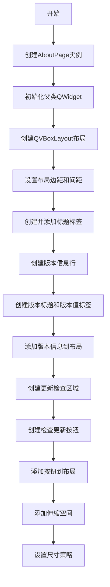

# `comic-translate\app\ui\settings\about_page.py` 详细设计文档

一个基于PySide6的Qt小部件，用于显示应用程序信息页面，包含版本号显示和检查更新按钮功能。

## 整体流程



## 类结构

```
QtWidgets.QWidget (基类)
└── AboutPage (应用关于页面小部件)
```

## 全局变量及字段


### `__version__`
    
从app.version模块导入的应用程序版本号字符串

类型：`str`
    


### `AboutPage.self.version_value`
    
用于显示当前应用程序版本号的标签控件

类型：`MLabel`
    


### `AboutPage.self.check_update_button`
    
用于触发检查更新功能的按钮控件

类型：`MPushButton`
    
    

## 全局函数及方法


### `AboutPage.__init__`

构造函数，初始化关于页面UI，包括设置主布局、标题标签、版本信息显示和更新检查按钮等UI组件。

参数：

- `self`：`AboutPage`，当前 AboutPage 实例对象
- `parent`：`QtWidgets.QWidget | None`，父窗口部件，默认为 None，用于指定该小部件的父对象

返回值：`None`，构造函数无返回值

#### 流程图

```mermaid
flowchart TD
    A[开始 __init__] --> B[调用父类构造函数 super().__init__ parent]
    B --> C[创建垂直布局 QVBoxLayout]
    C --> D[设置布局边距和间距 20px]
    D --> E[创建并添加标题标签 'App Information']
    E --> F[创建版本信息横向布局]
    F --> G[添加版本标题和版本值标签]
    G --> H[创建更新检查横向布局]
    H --> I[添加检查更新按钮]
    I --> J[添加伸缩占位符]
    J --> K[设置尺寸策略 Preferred Maximum]
    K --> L[结束]
```

#### 带注释源码

```python
def __init__(self, parent=None):
    # 调用父类 QtWidgets.QWidget 的构造函数，传递 parent 参数
    super().__init__(parent)

    # 创建垂直布局管理器，设置左右上下边距为 20 像素
    layout = QtWidgets.QVBoxLayout(self)
    layout.setContentsMargins(20, 20, 20, 20)
    # 设置垂直间距为 20 像素
    layout.setSpacing(20)

    # 创建标题标签，使用 h3 样式，显示"App Information"（支持多语言）
    title_label = MLabel(self.tr("App Information")).h3()
    # 将标题标签添加到布局顶部
    layout.addWidget(title_label)
    
    # ===== 版本信息部分 =====
    # 创建水平布局用于显示版本信息
    version_layout = QtWidgets.QHBoxLayout()
    # 创建版本标题标签，显示"Current Version:"
    version_title = MLabel(self.tr("Current Version:")).strong()
    # 创建版本值标签，显示实际版本号（从 app.version 导入）
    self.version_value = MLabel(__version__)
    # 将版本标题添加到布局
    version_layout.addWidget(version_title)
    # 将版本值添加到布局
    version_layout.addWidget(self.version_value)
    # 添加伸缩占位符，将版本信息左对齐
    version_layout.addStretch()
    
    # 将版本信息布局添加到主布局
    layout.addLayout(version_layout)
    
    # ===== 更新检查部分 =====
    # 创建水平布局用于放置更新检查按钮
    update_layout = QtWidgets.QHBoxLayout()
    # 创建检查更新按钮，显示"Check for Updates"（支持多语言）
    self.check_update_button = MPushButton(self.tr("Check for Updates"))
    # 设置按钮固定宽度为 150 像素
    self.check_update_button.setFixedWidth(150)
    # 将检查更新按钮添加到布局
    update_layout.addWidget(self.check_update_button)
    # 添加伸缩占位符，将按钮左对齐
    update_layout.addStretch()
    
    # 将更新检查布局添加到主布局
    layout.addLayout(update_layout)
    
    # 添加垂直方向伸缩占位符，使内容顶部对齐
    layout.addStretch()
    
    # 设置尺寸策略：水平方向首选扩展，垂直方向使用最大高度
    self.setSizePolicy(QtWidgets.QSizePolicy.Policy.Preferred, QtWidgets.QSizePolicy.Policy.Maximum)
```

## 关键组件


### AboutPage 主窗口类

QtWidgets.QWidget的子类，作为应用程序的"关于"页面，提供版本信息显示和检查更新功能。

### 布局管理系统

包含一个垂直布局(QVBoxLayout)管理整体结构，以及两个水平布局(QHBoxLayout)分别用于版本信息和更新按钮部分，实现内容的分层排列。

### 版本信息展示组件

由title_label（标题）、version_title（标签）和version_value（版本号值）组成，使用MLabel组件配合strong()方法突出显示当前应用程序版本。

### 检查更新功能组件

check_update_button是一个MPushButton实例，提供用户触发版本检查的交互入口，设置了固定宽度150像素。

### 大小策略控制

通过setSizePolicy()设置水平方向为Preferred、垂直方向为Maximum，限制页面垂直方向的最大高度，实现紧凑的布局效果。

### 国际化支持

使用self.tr()方法封装所有用户可见文本字符串，支持Qt的国际化翻译系统。


## 问题及建议


### 已知问题

- **硬编码的布局参数**：边距(20, 20, 20, 20)、间距(20)、按钮宽度(150)等数值直接写死在代码中，缺乏灵活性和可配置性
- **国际化不完整**：虽然使用了`self.tr()`，但仅对静态文本进行了翻译，未考虑不同语言环境下的布局适应性
- **缺失信号槽连接**：`check_update_button`按钮已创建但未连接到任何处理函数，点击后无任何响应
- **缺少文档注释**：类和方法均无文档字符串(docstring)，影响代码可维护性和团队协作
- **版本号直接导入**：`__version__`从`app.version`导入，若该模块不存在或未定义会导致导入错误，缺乏异常处理
- **对象名称未设置**：组件未设置`setObjectName`，在Qt Designer或调试时难以识别组件身份

### 优化建议

- **提取布局参数为常量或配置**：将边距、间距、宽度等数值定义为类常量或从配置文件读取，提升可维护性
- **添加版本检查功能**：实现`check_update_button`的点击信号槽，连接至版本检查逻辑；可考虑添加加载状态提示
- **完善国际化支持**：为所有用户可见文本添加翻译，并考虑使用`QLocale`动态调整布局
- **添加异常处理**：对`__version__`导入添加try-except处理，提供默认值或错误提示
- **补充文档注释**：为类添加类级别文档，为方法添加参数和返回值说明
- **设置对象名称**：为关键组件设置`setObjectName`，便于调试和自动化测试
- **考虑使用Qt Designer**：对于固定布局的页面，可考虑使用.ui文件定义布局，实现设计与代码分离

## 其它


### 设计目标与约束

该组件旨在为应用程序提供一个标准化的"关于"页面，展示应用基本信息和版本号，并提供检查更新的入口。设计约束包括：依赖dayu_widgets组件库、仅支持PySide6框架、使用Qt的信号槽机制处理用户交互。

### 错误处理与异常设计

当前代码未实现显式的错误处理机制。潜在的异常场景包括：版本号获取失败（app.version模块不存在）、UI组件初始化失败。由于是展示性组件，错误应降级为静默失败或显示默认占位符文本。建议添加try-except包装关键初始化逻辑，并使用Qt的QErrorMessage或QMessageBox进行用户提示。

### 外部依赖与接口契约

该组件依赖以下外部模块：PySide6.QtWidgets和QtCore（Qt框架）、dayu_widgets.MLabel和MPushButton（UI组件库）、app.version.__version__（版本信息）。外部接口契约包括：parent参数接受Qt QWidget或None、check_update_buttonClicked信号用于连接更新检查逻辑、版本号通过__version__模块动态获取。

### 国际化与本地化

代码已使用self.tr()进行字符串翻译封装，支持Qt的翻译机制。需要提供对应的.qm翻译文件支持多语言。默认语言为英语，支持中文等多种语言扩展。

### 可访问性

MLabel和MPushButton组件本身支持Qt的可访问性特性。建议为交互元素添加setAccessibleName和setAccessibleDescription，确保屏幕阅读器能正确识别功能。版本信息标签应标记为只读文本区域。

### 性能考虑

该组件为轻量级UI展示，无复杂计算或网络请求。setSizePolicy设置合理，避免不必要的布局重计算。版本号仅在初始化时读取一次，无运行时性能影响。

### 可测试性

组件可通过Qt的单元测试框架进行测试。建议测试点包括：初始化后子组件非空检查、版本号显示正确性、按钮点击信号触发、布局结构完整性。可使用QTest模拟点击事件进行自动化测试。

    