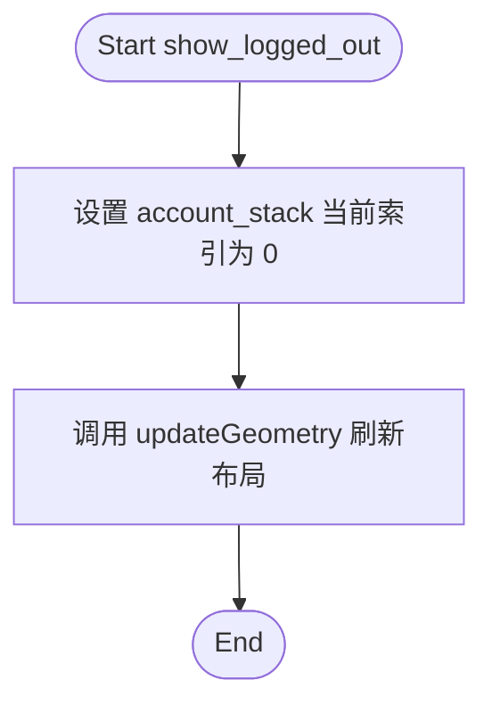
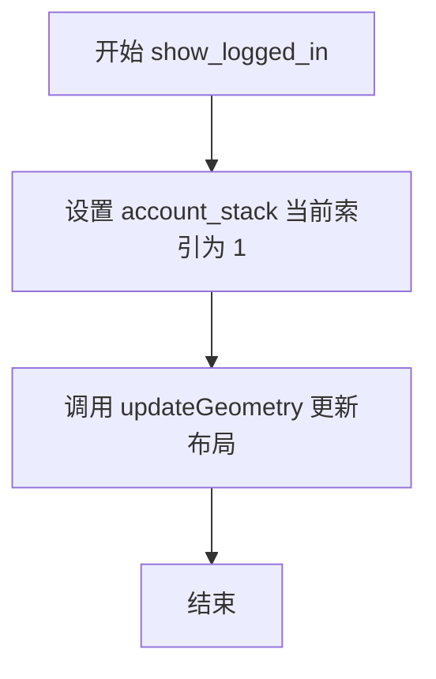

# `comic-translate\app\ui\settings\account_page.py` 详细设计文档

这是一个基于PySide6的Qt_widgets页面类，用于展示账户管理界面。它通过QStackedWidget在“已登录”和“未登录”两种状态之间切换UI，未登录时显示登录按钮和定价链接，已登录时显示用户邮箱、订阅等级、积分余额以及购买积分和登出按钮。

## 整体流程

```mermaid
graph TD
    A[初始化 AccountPage] --> B[创建主布局 QVBoxLayout]
    B --> C[创建 QStackedWidget 用于状态切换]
    C --> D[构建“未登录”视图]
    D --> D1[添加标题、描述、登录按钮、价格链接]
    C --> E[构建“已登录”视图]
    E --> E1[添加账户信息标签(邮箱、等级、积分)、购买按钮、登出按钮、价格链接]
    D1 --> F[将两个视图 widget 加入 QStackedWidget]
    E1 --> F
    F --> G[设置初始状态为“未登录” (Index 0)]
    G --> H[UI 渲染完成]
    H --> I{用户交互}
    I -->|点击 Sign In| J[调用 show_logged_in]
    I -->|点击 Sign Out| K[调用 show_logged_out]
    J --> L[setCurrentIndex(1) 显示已登录视图]
    K --> M[setCurrentIndex(0) 显示未登录视图]
```

## 类结构

```
QtWidgets.QWidget
└── AccountPage
```

## 全局变量及字段


### `FRONTEND_BASE_URL`
    
从 app.account.config 导入的前端基础URL，用于超链接

类型：`str`
    


### `QtWidgets`
    
PySide6 控件模块

类型：`module`
    


### `QtCore`
    
PySide6 核心模块，包含枚举等

类型：`module`
    


### `MLabel`
    
导入的自定义标签组件

类型：`class`
    


### `MPushButton`
    
导入的自定义按钮组件

类型：`class`
    


### `AccountPage.account_stack`
    
堆叠窗口容器，用于切换登录/未登录界面

类型：`QtWidgets.QStackedWidget`
    


### `AccountPage.logged_out_widget`
    
未登录状态的根容器

类型：`QtWidgets.QWidget`
    


### `AccountPage.logged_in_widget`
    
已登录状态的根容器

类型：`QtWidgets.QWidget`
    


### `AccountPage.sign_in_button`
    
登录按钮

类型：`MPushButton`
    


### `AccountPage.view_costs_link_out`
    
未登录状态下的'查看价格'超链接

类型：`MLabel`
    


### `AccountPage.email_value_label`
    
显示用户邮箱的标签

类型：`MLabel`
    


### `AccountPage.tier_value_label`
    
显示订阅等级的标签

类型：`MLabel`
    


### `AccountPage.credits_value_label`
    
显示剩余积分的标签

类型：`MLabel`
    


### `AccountPage.view_costs_link_in`
    
已登录状态下的'查看价格'超链接

类型：`MLabel`
    


### `AccountPage.buy_credits_button`
    
购买积分按钮

类型：`MPushButton`
    


### `AccountPage.sign_out_button`
    
登出按钮

类型：`MPushButton`
    
    

## 全局函数及方法


### `AccountPage.__init__`

构造函数，初始化UI布局、子控件和信号连接，创建一个账户页面，包含"已登录"和"未登录"两种状态的切换界面。

参数：

- `self`：实例本身，自动传入
- `parent`：`QtWidgets.QWidget` 或 `None`，父控件，默认为 `None`

返回值：`None`，无返回值（构造函数）

#### 流程图

```mermaid
flowchart TD
    A[开始 __init__] --> B[调用父类构造函数 super().__init__ parent]
    B --> C[创建主垂直布局 account_layout]
    C --> D[创建 QStackedWidget account_stack]
    D --> E[创建未登录状态界面 logged_out_widget]
    E --> E1[添加标题标签 title_label]
    E1 --> E2[添加描述标签 description_label]
    E2 --> E3[添加登录按钮 sign_in_button]
    E3 --> E4[添加查看费用链接 view_costs_link_out]
    E --> F[创建已登录状态界面 logged_in_widget]
    F --> F1[添加账户信息标签和三个信息行]
    F1 --> F2[添加查看费用链接 view_costs_link_in]
    F2 --> F3[添加购买积分按钮 buy_credits_button]
    F3 --> F4[添加登出按钮 sign_out_button]
    F --> G[将两个widget添加到account_stack]
    G --> H[设置初始状态为未登录 setCurrentIndex 0]
    H --> I[将account_stack添加到主布局]
    I --> J[设置大小策略 Preferred Maximum]
    J --> K[结束 __init__]
```

#### 带注释源码

```python
def __init__(self, parent=None):
    """
    构造函数，初始化账户页面UI
    
    参数:
        parent: 父控件，默认为None
    """
    # 调用父类QtWidgets.QWidget的构造函数，传入parent参数
    super().__init__(parent)

    # ============================================================
    # 1. 创建主布局 - 垂直布局，包含边距20px
    # ============================================================
    account_layout = QtWidgets.QVBoxLayout(self)
    account_layout.setContentsMargins(20, 20, 20, 20)

    # ============================================================
    # 2. 创建QStackedWidget - 用于在已登录/未登录状态间切换
    # ============================================================
    # Use a QStackedWidget to properly handle switching between logged in/out states
    self.account_stack = QtWidgets.QStackedWidget()

    # ============================================================
    # 3. 创建"未登录"状态的界面
    # ============================================================
    # Logged Out
    self.logged_out_widget = QtWidgets.QWidget()
    logged_out_layout = QtWidgets.QVBoxLayout(self.logged_out_widget)
    logged_out_layout.setContentsMargins(0, 0, 0, 0)
    logged_out_layout.setSpacing(15)

    # 标题标签：使用翻译文本 "Sign in to Comic Translate"，h3样式
    title_label = MLabel(self.tr("Sign in to Comic Translate")).h3()
    title_label.setAlignment(QtCore.Qt.AlignmentFlag.AlignCenter)

    # 描述文本：说明登录后可使用的功能
    description_text = self.tr(
        "Sign in to use Comic Translate, see your credits balance, "
        "and purchase additional credits."
    )
    description_label = MLabel(description_text)
    description_label.setWordWrap(True)
    description_label.setAlignment(QtCore.Qt.AlignmentFlag.AlignCenter)

    # 登录按钮：固定宽度150px
    self.sign_in_button = MPushButton(self.tr("Sign In"))
    self.sign_in_button.setFixedWidth(150)

    # 将控件添加到未登录布局
    logged_out_layout.addWidget(title_label, alignment=QtCore.Qt.AlignmentFlag.AlignCenter)
    logged_out_layout.addSpacing(10)
    logged_out_layout.addWidget(description_label)
    logged_out_layout.addSpacing(20)
    logged_out_layout.addWidget(self.sign_in_button, alignment=QtCore.Qt.AlignmentFlag.AlignCenter)
    
    # 查看费用链接（未登录状态）
    link_text = self.tr("See model credit costs")
    # 使用FRONTEND_BASE_URL动态构建链接
    self.view_costs_link_out = MLabel(f'<a href="{FRONTEND_BASE_URL}/pricing/credits/" style="color: #4da6ff; text-decoration: underline; font-size: 11px;">{link_text}</a>')
    self.view_costs_link_out.setOpenExternalLinks(True)  # 允许打开外部链接
    self.view_costs_link_out.setCursor(QtCore.Qt.CursorShape.PointingHandCursor)  # 鼠标悬停时显示手型
    self.view_costs_link_out.setAlignment(QtCore.Qt.AlignmentFlag.AlignCenter)
    self.view_costs_link_out.setToolTip(f"{FRONTEND_BASE_URL}/pricing/credits/")
    logged_out_layout.addSpacing(10)
    logged_out_layout.addWidget(self.view_costs_link_out)
    
    logged_out_layout.addStretch(1)  # 添加弹性空间

    # ============================================================
    # 4. 创建"已登录"状态的界面
    # ============================================================
    # Logged In
    self.logged_in_widget = QtWidgets.QWidget()
    logged_in_layout = QtWidgets.QVBoxLayout(self.logged_in_widget)
    logged_in_layout.setContentsMargins(0, 0, 0, 0)
    logged_in_layout.setSpacing(10)

    # 账户信息标题
    account_info_label = MLabel(self.tr("Account Information")).h4()

    # 邮箱信息行 - 水平布局
    email_layout = QtWidgets.QHBoxLayout()
    email_title_label = MLabel(self.tr("Email:")).strong()
    self.email_value_label = MLabel("...")  # 初始值为"..."，后续由外部更新
    email_layout.addWidget(email_title_label)
    email_layout.addWidget(self.email_value_label)
    email_layout.addStretch(1)

    # 订阅等级信息行 - 水平布局
    tier_layout = QtWidgets.QHBoxLayout()
    tier_title_label = MLabel(self.tr("Subscription Tier:")).strong()
    self.tier_value_label = MLabel("...")
    tier_layout.addWidget(tier_title_label)
    tier_layout.addWidget(self.tier_value_label)
    tier_layout.addStretch(1)

    # 积分余额信息行 - 水平布局
    credits_layout = QtWidgets.QHBoxLayout()
    credits_title_label = MLabel(self.tr("Credits:")).strong()
    self.credits_value_label = MLabel("...")
    credits_layout.addWidget(credits_title_label)
    credits_layout.addWidget(self.credits_value_label)
    credits_layout.addStretch(1)

    # 查看费用链接（已登录状态）
    link_text_in = self.tr("See model credit costs")
    self.view_costs_link_in = MLabel(f'<a href="{FRONTEND_BASE_URL}/pricing/credits/" style="color: #4da6ff; text-decoration: underline; font-size: 11px;">{link_text_in}</a>')
    self.view_costs_link_in.setOpenExternalLinks(True)
    self.view_costs_link_in.setCursor(QtCore.Qt.CursorShape.PointingHandCursor)
    self.view_costs_link_in.setAlignment(QtCore.Qt.AlignmentFlag.AlignLeft)
    self.view_costs_link_in.setToolTip(f"{FRONTEND_BASE_URL}/pricing/credits/")

    # 购买积分按钮
    self.buy_credits_button = MPushButton(self.tr("Buy Credits"))
    self.buy_credits_button.setFixedWidth(150)

    # 登出按钮
    self.sign_out_button = MPushButton(self.tr("Sign Out"))
    self.sign_out_button.setFixedWidth(150)

    # 将控件添加到已登录布局
    logged_in_layout.addWidget(account_info_label)
    logged_in_layout.addSpacing(15)
    logged_in_layout.addLayout(email_layout)
    logged_in_layout.addLayout(tier_layout)
    logged_in_layout.addLayout(credits_layout)
    logged_in_layout.addSpacing(5)
    logged_in_layout.addWidget(self.view_costs_link_in)
    logged_in_layout.addStretch(1)
    logged_in_layout.addWidget(self.buy_credits_button, alignment=QtCore.Qt.AlignmentFlag.AlignCenter)
    logged_in_layout.addWidget(self.sign_out_button, alignment=QtCore.Qt.AlignmentFlag.AlignCenter)
    logged_in_layout.addSpacing(20)

    # ============================================================
    # 5. 将两个widget添加到QStackedWidget
    # ============================================================
    # Add both widgets to the stacked widget
    self.account_stack.addWidget(self.logged_out_widget)  # Index 0
    self.account_stack.addWidget(self.logged_in_widget)   # Index 1
    
    # ============================================================
    # 6. 设置初始状态和主布局
    # ============================================================
    # Set initial state to logged out
    self.account_stack.setCurrentIndex(0)

    # Add the stack to the main layout
    account_layout.addWidget(self.account_stack)
    account_layout.addStretch()

    # Set size policy to match other pages
    # 设置大小策略：水平方向首选，垂直方向最大（保持与其他页面一致）
    self.setSizePolicy(QtWidgets.QSizePolicy.Policy.Preferred, QtWidgets.QSizePolicy.Policy.Maximum)
```


### `AccountPage.show_logged_out`

此方法用于将账户页面的视图切换至“未登录”状态。它通过操作 QStackedWidget，将当前索引设置为 0（对应初始化时添加的未登录组件），并调用布局更新以刷新界面显示。

参数：

- `self`：`AccountPage`，调用此方法的实例对象本身。

返回值：`None`，该方法不返回任何数据，仅执行界面状态切换的副作用操作。

#### 流程图



#### 带注释源码

```python
def show_logged_out(self):
    """Show the logged out state."""
    # 将 QStackedWidget 的当前页面切换到索引 0 (logged_out_widget)
    self.account_stack.setCurrentIndex(0)
    # 通知父布局重新计算子控件的几何形状，确保界面正确渲染
    self.updateGeometry()
```


### `AccountPage.show_logged_in`

公开方法，切换至已登录状态视图，通过切换 QStackedWidget 的当前索引显示已登录用户界面。

参数：

- `self`：`QtWidgets.QWidget`，隐式参数，表示当前 `AccountPage` 实例

返回值：`None`，无返回值，仅执行界面状态切换操作

#### 流程图



#### 带注释源码

```python
def show_logged_in(self):
    """Show the logged in state."""
    # 将 QStackedWidget 的当前页面切换到索引为 1 的已登录小部件
    self.account_stack.setCurrentIndex(1)
    # 强制更新当前小部件的几何信息，确保布局正确刷新
    self.updateGeometry()
```

## 关键组件


### AccountPage

主窗口类，继承自QtWidgets.QWidget，负责渲染用户账户管理页面。通过QStackedWidget在登录状态和未登录状态之间切换显示。

### QStackedWidget (account_stack)

用于管理登录/未登录两种视图状态的容器组件，实现页面切换。

### logged_out_widget

未登录状态显示的容器widget，包含登录引导信息和登录按钮。

### logged_in_widget

已登录状态显示的容器widget，包含用户账户信息（邮箱、订阅等级、积分余额）和操作按钮。

### MLabel (title_label)

页面主标题，使用MLabel.h3()方法创建，显示"Sign in to Comic Translate"。

### MLabel (description_label)

页面描述文本，说明登录后可使用的功能。

### MPushButton (sign_in_button)

登录按钮，触发用户登录流程。

### MLabel (view_costs_link_out)

未登录状态的积分价格查看链接，使用HTML格式渲染外部链接。

### MLabel (email_value_label)

显示用户邮箱地址的标签，初始值为"..."。

### MLabel (tier_value_label)

显示用户订阅等级的标签，初始值为"..."。

### MLabel (credits_value_label)

显示用户积分余额的标签，初始值为"..."。

### MPushButton (buy_credits_button)

购买积分按钮，触发积分购买流程。

### MPushButton (sign_out_button)

登出按钮，触发用户登出流程。

### show_logged_out 方法

公开方法，切换至未登录状态视图（索引0）。

### show_logged_in 方法

公开方法，切换至已登录状态视图（索引1）。

### FRONTEND_BASE_URL

外部依赖，从app.account.config模块导入的前端基础URL，用于构建外部链接。


## 问题及建议


### 已知问题

- **缺少信号槽连接**：登录、登出、购买积分等按钮均未连接任何槽函数，无法响应用户交互
- **硬编码URL重复**：FRONTEND_BASE_URL在两处HTML字符串中重复使用，URL变更需要修改多处
- **布局代码冗长**：所有UI构建逻辑堆叠在__init__方法中，未进行方法拆分，可读性和可维护性差
- **魔法数字与硬编码值**：setContentsMargins(20,20,20,20)、setFixedWidth(150)等硬编码值散落各处
- **账户数据未绑定**：email_value_label、tier_value_label、credits_value_label显示为硬编码的"..."，无实际数据更新机制
- **国际化不完整**：部分字符串使用了self.tr()，但链接文本等字符串未使用，不利于多语言支持
- **重复UI组件**：两个状态的"查看积分价格"链接创建逻辑几乎相同，违反DRY原则
- **冗余注释**：第93-94行存在重复注释"# Link to credits costs (logged in) - below info block"
- **QSizePolicy设置可能不当**：设置Policy.Maximum可能导致该页面在布局中无法正常伸展
- **无错误处理与异常设计**：缺少必要的异常捕获和错误提示机制

### 优化建议

- 添加信号槽或使用Signal/Slot模式连接按钮到业务逻辑层
- 将FRONTEND_BASE_URL提取为类常量或配置类，避免重复硬编码
- 将logged_out_widget和logged_in_widget的构建拆分到独立方法（如_build_logged_out_ui、_build_logged_in_ui）
- 将硬编码的数值提取为类级常量或配置属性
- 实现数据更新方法（如update_account_info(email, tier, credits)），提供数据绑定能力
- 对所有用户可见字符串统一使用self.tr()进行国际化处理
- 抽取_link_to_credits_costs方法，通过参数区分不同对齐方式，减少重复代码
- 移除冗余注释，保持代码整洁
- 根据实际布局需求调整QSizePolicy，改为Expanding或Preferred
- 添加try-except异常处理，并通过Qt的QMessageBox或QStatusBar提供错误反馈

## 其它


### 设计目标与约束

本页面旨在为用户提供账户管理功能，包括登录/登出账户、查看账户信息（邮箱、订阅层级、积分余额）以及购买积分的入口。设计上采用Qt的QStackedWidget实现已登录/未登录状态的平滑切换，确保用户体验的一致性。约束条件包括：依赖PySide6框架、依赖dayu_widgets组件库、依赖外部的FRONTEND_BASE_URL配置。

### 错误处理与异常设计

当前代码未包含显式的错误处理逻辑。主要潜在错误场景包括：外部URL（FRONTEND_BASE_URL）不可用时链接失效、账户信息加载失败时显示占位符"..."。建议改进：添加网络请求失败时的错误提示UI、为账户信息添加加载状态指示器、考虑超时处理机制。

### 数据流与状态机

页面包含两种核心状态：已登录状态（logged_in）和未登录状态（logged_out）。状态转换通过show_logged_out()和show_logged_in()方法触发，直接操作QStackedWidget的当前索引。账户信息数据流：外部系统（可能是API调用）提供email、tier、credits数据，通过QLabel的setText方法更新显示。按钮交互流程：sign_in_button点击后触发登录流程、sign_out_button点击后触发登出流程、buy_credits_button点击后触发购买流程、view_costs_link点击后调用系统浏览器打开外部链接。

### 外部依赖与接口契约

主要外部依赖包括：PySide6.QtWidgets和QtCore模块、dayu_widgets的MLabel和MPushButton组件、app.account.config模块中的FRONTEND_BASE_URL常量。接口契约：FRONTEND_BASE_URL应为有效的URL字符串、parent参数支持Qt对象层级关系、方法show_logged_out()和show_logged_in()应由外部调用者触发以更新UI状态。

### 性能考虑

当前实现性能良好，UI初始化时创建所有控件并通过索引切换显示。建议优化：大量账户数据时可考虑延迟加载、为复杂布局添加缓存机制。

### 安全性考虑

外部链接使用setOpenExternalLinks(True)允许打开系统浏览器，需注意防止恶意链接。账户敏感信息（邮箱等）应在展示时进行脱敏处理。代码中未发现明显的SQL注入或XSS风险，但建议对外部URL进行验证。

### 可访问性设计

当前缺少可访问性支持，建议添加：按钮和标签的accessibility名称、键盘导航支持、屏幕阅读器兼容的文本描述、足够的颜色对比度。

### 国际化/本地化

代码使用了self.tr()方法进行字符串翻译支持，支持多语言。翻译内容包括：界面文本（Sign in to Comic Translate、Sign In、Sign Out、Buy Credits等）、链接文本、价格页面相关文本。

### 主题和样式

依赖dayu_widgets的主题系统，按钮设置了固定宽度（150px）以保持一致性，链接使用内联样式设置颜色（#4da6ff）和下划线，标题使用h3()和h4()样式方法，标签使用strong()方法强调重要信息。

### 用户交互流程

未登录用户流程：查看登录引导信息 → 点击Sign In按钮 → 触发外部登录流程 → 登录成功后调用show_logged_in() → 显示账户信息。已登录用户流程：查看账户信息（邮箱、层级、积分） → 可选择Buy Credits或Sign Out。查看价格流程：点击See model credit costs链接 → 调用系统浏览器打开定价页面。

### 测试策略建议

建议添加单元测试：测试show_logged_out()和show_logged_in()方法正确切换索引、测试初始状态为未登录、测试按钮和链接对象正确创建。建议添加集成测试：测试与外部登录系统的集成、测试链接URL的正确性。

### 部署和配置

部署时需确保：PySide6和dayu_widgets依赖正确安装、FRONTEND_BASE_URL配置指向正确的服务器环境、Qt平台插件可用。建议将FRONTEND_BASE_URL放入配置文件或环境变量以支持多环境部署。

    