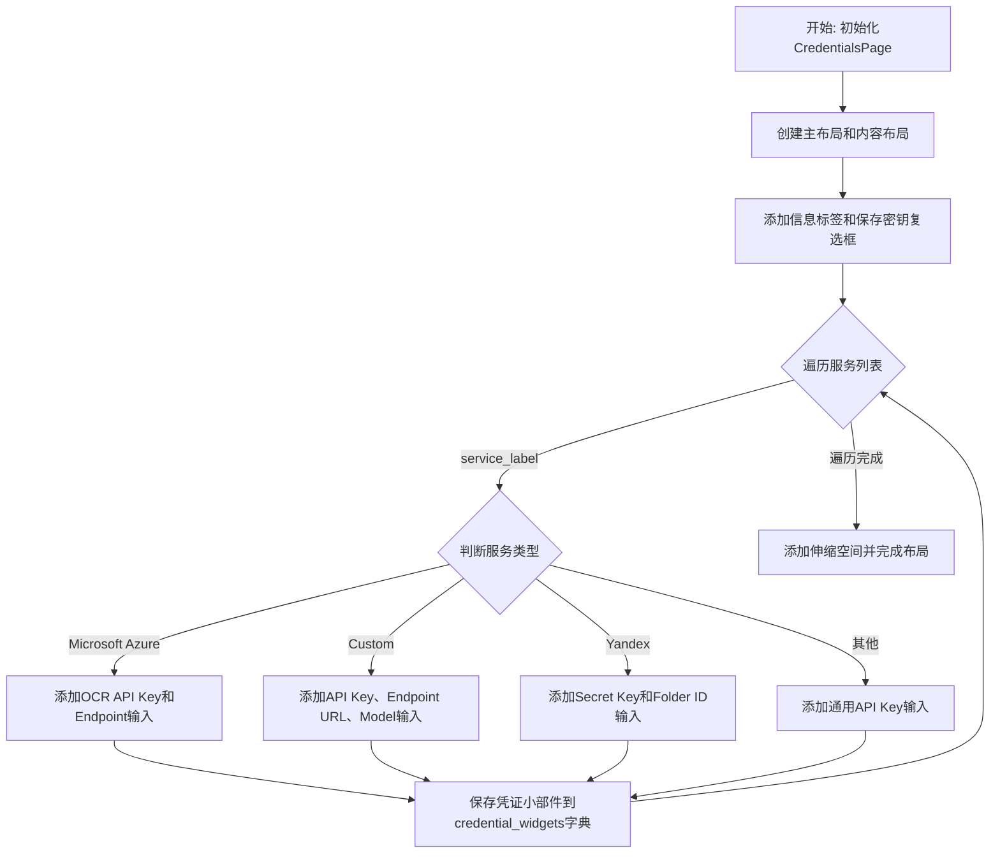
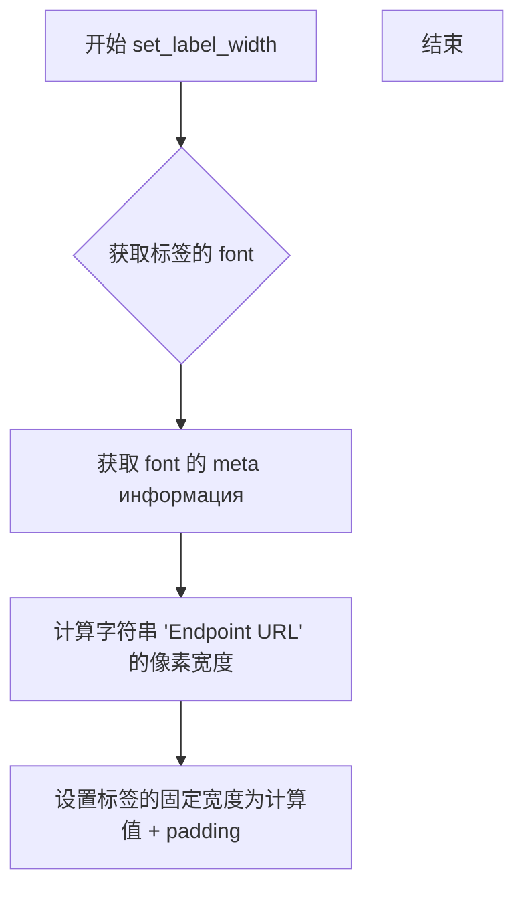
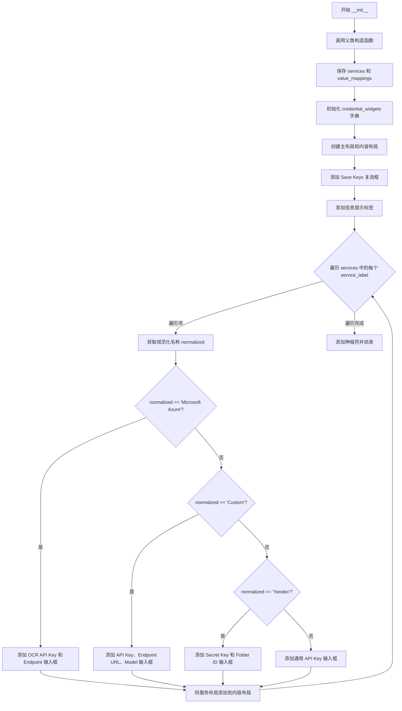

# `comic-translate\app\ui\settings\credentials_page.py` 详细设计文档

一个用于配置多种翻译/OCR服务API凭证的Qt设置页面GUI组件，支持Microsoft Azure、Custom、Yandex等服务的API密钥、端点URL、模型等凭证输入。

## 整体流程



## 类结构

```
QtWidgets.QWidget (Qt基类)
└── CredentialsPage (凭证配置页面)
```

## 全局变量及字段


### `CredentialsPage.services`
    
服务名称列表

类型：`list[str]`
    


### `CredentialsPage.value_mappings`
    
服务标签到规范名的映射

类型：`dict[str, str]`
    


### `CredentialsPage.credential_widgets`
    
存储所有凭证输入小部件的字典

类型：`dict[str, MLineEdit]`
    


### `CredentialsPage.save_keys_checkbox`
    
保存密钥的复选框

类型：`MCheckBox`
    
    

## 全局函数及方法


### `set_label_width`

设置标签（Label）的宽度，使其与关联的输入框对齐，通常用于带前缀的输入框（如 API Key、Endpoint URL 等）中标签的布局优化。

参数：

-  `label`：`MLabel`，需要设置宽度的标签对象（通常是调用了 `.border()` 方法后的 MLabel 实例）

返回值：`None`，该函数无返回值（修改对象属性直接生效）

#### 流程图



#### 带注释源码

```python
def set_label_width(label: MLabel) -> None:
    """
    设置标签的宽度，使其能够正确显示边框样式
    
    参数:
        label: MLabel 对象，通常是调用了 .border() 方法的标签
        
    返回值:
        无返回值，直接修改 label 的宽度属性
    """
    # 获取标签的字体信息
    font = label.font()
    
    # 获取字体的元信息（用于计算文本宽度）
    font_metrics = QtGui.QFontMetrics(font)
    
    # 获取标签的文本内容
    text = label.text()
    
    # 计算文本在当前字体下的像素宽度
    # 添加一定的内边距（通常为 10-20 像素）确保文本不紧贴边框
    text_width = font_metrics.horizontalAdvance(text)
    
    # 设置标签的固定宽度为文本宽度加上内边距
    label.setFixedWidth(text_width + 20)
```

#### 使用示例（从代码中提取）

```python
# 在 CredentialsPage 中的典型调用方式
endpoint_prefix = MLabel(self.tr("Endpoint URL")).border()  # 创建带边框的标签
set_label_width(endpoint_prefix)  # 设置宽度使其与输入框对齐
endpoint_prefix.setAlignment(QtCore.Qt.AlignmentFlag.AlignCenter)  # 文本居中
endpoint_input.set_prefix_widget(endpoint_prefix)  # 设置为输入框的前缀
service_layout.addWidget(endpoint_input)
```

#### 设计说明

| 项目 | 说明 |
|------|------|
| **设计目标** | 统一带前缀输入框的标签宽度，确保 UI 布局整洁一致 |
| **调用场景** | 在创建 API Key、Endpoint URL、Model 等输入框时，前缀标签需要固定宽度 |
| **技术实现** | 利用 QFontMetrics 计算文本像素宽度，动态设置标签宽度 |
| **潜在优化** | 可考虑将 padding 值作为参数暴露，提高灵活性 |

#### 注意事项

由于 `set_label_width` 函数定义在 `.utils` 模块中，但未在提供的代码中显示其完整实现，以上内容是基于该函数在代码中的使用方式进行的合理推断。实际实现可能略有差异。


### `CredentialsPage.__init__`

该方法是凭证设置页面的构造函数，负责根据传入的服务列表和值映射关系动态生成对应的API密钥、端点URL、模型等输入控件的UI布局，用于配置各类翻译或OCR服务的认证凭证。

参数：

- `services`：`list[str]`，服务标签列表，用于遍历生成对应的凭证输入控件
- `value_mappings`：`dict[str, str]`，服务标签到规范化名称（如"Microsoft Azure"、"Custom"、"Yandex"）的映射字典
- `parent`：`QtWidgets.QWidget`，父窗口部件，默认为`None`

返回值：`None`，该方法为构造函数，不返回任何值

#### 流程图



#### 带注释源码

```
def __init__(self, services: list[str], value_mappings: dict[str, str], parent=None):
    """
    初始化凭证页面
    
    参数:
        services: 服务标签列表，用于遍历生成对应的凭证输入控件
        value_mappings: 服务标签到规范化名称的映射字典
        parent: 父窗口部件
    """
    # 调用父类 QtWidgets.QWidget 的构造函数进行初始化
    super().__init__(parent)
    
    # 保存传入的服务标签列表
    self.services = services
    
    # 保存服务标签到规范化名称的映射关系
    self.value_mappings = value_mappings
    
    # 初始化凭证输入框字典，用于存储各服务的输入控件
    # 键格式: "{规范化名称}_{字段名}", 值: MLineEdit 控件对象
    self.credential_widgets: dict[str, MLineEdit] = {}

    # 创建主垂直布局（外部设置页面滚动区域处理滚动）
    main_layout = QtWidgets.QVBoxLayout(self)
    
    # 创建内容垂直布局
    content_layout = QtWidgets.QVBoxLayout()

    # 创建"保存密钥"复选框，用于控制是否保存API密钥
    self.save_keys_checkbox = MCheckBox(self.tr("Save Keys"))

    # 创建信息提示标签，说明该设置面向高级用户
    info_label = MLabel(self.tr(
        "These settings are for advanced users who wish to use their own Custom API endpoints (e.g. Local Language Models) for translation. "
        "For most users, no configuration is needed here."
    )).secondary()
    
    # 启用自动换行
    info_label.setWordWrap(True)
    
    # 将信息标签添加到内容布局
    content_layout.addWidget(info_label)
    
    # 添加间距
    content_layout.addSpacing(10)
    
    # 将保存密钥复选框添加到内容布局
    content_layout.addWidget(self.save_keys_checkbox)
    
    # 添加较大间距，分隔标题区域和服务配置区域
    content_layout.addSpacing(20)

    # 遍历每个服务标签，生成对应的输入控件
    for service_label in self.services:
        # 创建服务项的垂直布局
        service_layout = QtWidgets.QVBoxLayout()
        
        # 创建服务名称标签，使用粗体样式
        service_header = MLabel(service_label).strong()
        
        # 设置标签左对齐
        service_header.setAlignment(QtCore.Qt.AlignmentFlag.AlignLeft)
        
        # 将服务标题添加到服务布局
        service_layout.addWidget(service_header)

        # 从映射字典获取规范化名称，如果不存在则使用原始标签
        normalized = self.value_mappings.get(service_label, service_label)

        # 根据规范化名称判断服务类型，生成不同的输入控件
        if normalized == "Microsoft Azure":
            # ===== Microsoft Azure 服务 =====
            # 添加 OCR 标签
            ocr_label = MLabel(self.tr("OCR")).secondary()
            service_layout.addWidget(ocr_label)

            # 创建 OCR API Key 输入框（密码模式）
            ocr_api_key_input = MLineEdit()
            ocr_api_key_input.setEchoMode(QtWidgets.QLineEdit.Password)
            ocr_api_key_input.setFixedWidth(400)
            
            # 创建 API Key 前缀标签（带边框）
            ocr_api_key_prefix = MLabel(self.tr("API Key")).border()
            set_label_width(ocr_api_key_prefix)
            ocr_api_key_prefix.setAlignment(QtCore.Qt.AlignmentFlag.AlignCenter)
            ocr_api_key_input.set_prefix_widget(ocr_api_key_prefix)
            
            service_layout.addWidget(ocr_api_key_input)
            # 存储到凭证字典，键名为 "Microsoft Azure_api_key_ocr"
            self.credential_widgets["Microsoft Azure_api_key_ocr"] = ocr_api_key_input

            # 创建 Endpoint URL 输入框
            endpoint_input = MLineEdit()
            endpoint_input.setFixedWidth(400)
            endpoint_prefix = MLabel(self.tr("Endpoint URL")).border()
            set_label_width(endpoint_prefix)
            endpoint_prefix.setAlignment(QtCore.Qt.AlignmentFlag.AlignCenter)
            endpoint_input.set_prefix_widget(endpoint_prefix)
            service_layout.addWidget(endpoint_input)
            # 存储到凭证字典
            self.credential_widgets["Microsoft Azure_endpoint"] = endpoint_input

            # 注：Translator 部分被注释掉，暂不支持

        elif normalized == "Custom":
            # ===== Custom 自定义服务 =====
            # 创建 API Key 输入框
            api_key_input = MLineEdit()
            api_key_input.setEchoMode(QtWidgets.QLineEdit.Password)
            api_key_input.setFixedWidth(400)
            api_key_prefix = MLabel(self.tr("API Key")).border()
            set_label_width(api_key_prefix)
            api_key_prefix.setAlignment(QtCore.Qt.AlignmentFlag.AlignCenter)
            api_key_input.set_prefix_widget(api_key_prefix)
            service_layout.addWidget(api_key_input)
            self.credential_widgets[f"{normalized}_api_key"] = api_key_input

            # 创建 Endpoint URL 输入框
            endpoint_input = MLineEdit()
            endpoint_input.setFixedWidth(400)
            endpoint_prefix = MLabel(self.tr("Endpoint URL")).border()
            set_label_width(endpoint_prefix)
            endpoint_prefix.setAlignment(QtCore.Qt.AlignmentFlag.AlignCenter)
            endpoint_input.set_prefix_widget(endpoint_prefix)
            service_layout.addWidget(endpoint_input)
            self.credential_widgets[f"{normalized}_api_url"] = endpoint_input

            # 创建 Model 输入框
            model_input = MLineEdit()
            model_input.setFixedWidth(400)
            model_prefix = MLabel(self.tr("Model")).border()
            set_label_width(model_prefix)
            model_prefix.setAlignment(QtCore.Qt.AlignmentFlag.AlignCenter)
            model_input.set_prefix_widget(model_prefix)
            service_layout.addWidget(model_input)
            self.credential_widgets[f"{normalized}_model"] = model_input

        elif normalized == "Yandex":
            # ===== Yandex 服务 =====
            # 创建 Secret Key 输入框
            api_key_input = MLineEdit()
            api_key_input.setEchoMode(QtWidgets.QLineEdit.Password)
            api_key_input.setFixedWidth(400)
            api_key_prefix = MLabel(self.tr("Secret Key")).border()
            set_label_width(api_key_prefix)
            api_key_prefix.setAlignment(QtCore.Qt.AlignmentFlag.AlignCenter)
            api_key_input.set_prefix_widget(api_key_prefix)
            service_layout.addWidget(api_key_input)
            self.credential_widgets[f"{normalized}_api_key"] = api_key_input

            # 创建 Folder ID 输入框
            folder_id_input = MLineEdit()
            folder_id_input.setFixedWidth(400)
            folder_id_prefix = MLabel(self.tr("Folder ID")).border()
            set_label_width(folder_id_prefix)
            folder_id_prefix.setAlignment(QtCore.Qt.AlignmentFlag.AlignCenter)
            folder_id_input.set_prefix_widget(folder_id_prefix)
            service_layout.addWidget(folder_id_input)
            self.credential_widgets[f"{normalized}_folder_id"] = folder_id_input

        else:
            # ===== 其他通用服务 =====
            # 创建通用的 API Key 输入框
            api_key_input = MLineEdit()
            api_key_input.setEchoMode(QtWidgets.QLineEdit.Password)
            api_key_input.setFixedWidth(400)
            api_key_prefix = MLabel(self.tr("API Key")).border()
            set_label_width(api_key_prefix)
            api_key_prefix.setAlignment(QtCore.Qt.AlignmentFlag.AlignCenter)
            api_key_input.set_prefix_widget(api_key_prefix)
            service_layout.addWidget(api_key_input)
            self.credential_widgets[f"{normalized}_api_key"] = api_key_input

        # 将服务布局添加到内容布局
        content_layout.addLayout(service_layout)
        
        # 添加服务项之间的间距
        content_layout.addSpacing(20)

    # 添加伸缩符，使内容顶部对齐
    content_layout.addStretch(1)
    
    # 将内容布局添加到主布局
    main_layout.addLayout(content_layout)
```

## 关键组件


### CredentialsPage 类

Qt设置页面widget，用于管理和显示多种翻译/OCR服务的API凭据输入界面（支持Microsoft Azure OCR、Custom API、Yandex等服务的密钥、端点和模型配置）。

### 服务类型判断与动态UI生成

根据value_mappings中的normalized值，动态创建不同服务的专属输入字段（API Key、Endpoint URL、Folder ID、Model等），实现灵活的扩展性。

### Microsoft Azure 专用组件

针对Microsoft Azure服务生成的特殊UI组件，包含OCR API Key输入框和Endpoint URL输入框，用于配置Azure认知服务的访问凭证。

### Custom API 组件集合

为自定义API服务设计的输入组件集合，包含API Key、Endpoint URL和Model三个输入框，支持用户配置本地语言模型或自定义端点。

### Yandex 组件集合

为Yandex翻译服务设计的专用输入组件，包含Secret Key和Folder ID两个输入字段，用于Yandex Cloud API的身份验证。

### 通用凭据输入组件

为其他未特殊处理的服务（如Google、DeepL等）提供的通用API Key输入组件，采用统一的UI样式和布局。

### save_keys_checkbox 复选框

"Save Keys"复选框，用于控制是否将用户输入的API密钥保存到本地存储，提供便捷的用户体验。

### credential_widgets 字典

存储所有凭据输入widget的字典容器，键名为服务名加字段名的组合（如"Microsoft Azure_api_key_ocr"），用于后续凭据值的读取和保存。

### info_label 信息提示组件

显示在页面顶部的说明文字，告知用户这些是高级设置选项，大多数用户无需配置。


## 问题及建议


### 已知问题

- **代码重复严重**：创建 MLineEdit 输入框的逻辑（设置密码模式、固定宽度、添加前缀标签等）在多处重复出现，未封装为可复用方法
- **硬编码值过多**：`setFixedWidth(400)`、间距值 `10`、`20` 等视觉参数硬编码在不同位置，不利于主题适配和响应式布局
- **魔法字符串**：服务名称（如 "Microsoft Azure"、"Custom"、"Yandex"）作为字符串字面量散落在代码各处，缺乏统一常量定义
- **注释代码未清理**：存在大段被注释掉的 "Translator" 相关代码块（约20行），影响代码可读性和维护性
- **字典键命名不一致**：credential_widgets 的键命名不统一，如 "Microsoft Azure_api_key_ocr" 包含空格，而 "Custom_api_key" 使用下划线分隔
- **无输入验证机制**：缺少对 URL 格式、必填字段、API Key 格式等的校验逻辑
- **无状态管理方法**：未提供获取/设置凭据值的方法，也未定义信号以通知值的变化
- **缺乏文档注释**：类和方法均无 docstring，降低了代码的可维护性和可理解性

### 优化建议

- **提取工厂方法**：将创建 MLineEdit 输入框的通用逻辑封装为私有方法（如 `_create_input_field`），接收标签文本、是否为密码模式等参数
- **定义常量类**：创建服务类型常量或枚举，统一管理服务名称字符串，避免魔法字符串
- **统一键命名规范**：定义键的生成规则（如 `{service}_{field}` 格式），确保 credential_widgets 字典键的一致性
- **删除无用注释**：移除被注释的 Translator 代码块，如需保留应通过功能开关或配置控制
- **添加数据绑定方法**：实现 `get_credentials()` 和 `set_credentials(values)` 方法，或使用 Qt 的属性系统（Q_PROPERTY）实现数据绑定
- **引入验证框架**：为每个服务字段添加验证规则（如正则表达式校验 URL 格式），并在 UI 层展示验证错误
- **响应式布局**：使用布局管理器的拉伸和间距策略替代固定宽度，提升多分辨率适配能力
- **添加 Qt 属性**：使用 `@property` 或 Q_PROPERTY 暴露服务列表和凭据映射，便于数据驱动 UI 更新


## 其它


### 设计目标与约束

本模块旨在为翻译应用提供一个集中的凭证配置界面，允许高级用户自定义各类翻译服务的API端点和密钥。设计约束包括：仅处理UI展示和数据收集，不负责实际API调用；依赖外部Settings系统进行数据持久化；采用固定宽度(400px)的输入框确保布局一致性；支持动态服务列表配置而非硬编码。

### 错误处理与异常设计

本类未实现显式的错误处理机制。潜在的异常场景包括：value_mappings字典中缺少服务标签时的KeyError（虽由get()规避但逻辑依赖隐式约定）；MLineEdit或MCheckBox初始化失败时的Qt异常；set_prefix_widget()调用失败时的异常。当前设计采用"防御性获取"方式处理value_mappings，缺失键则回退使用原始service_label。对于无效的API Key格式、URL格式或模型名称，当前未进行客户端验证，建议在数据提交阶段增加格式校验。

### 数据流与状态机

数据流方向为：外部传入services列表和value_mappings字典 → __init__中初始化实例变量 → 动态构建UI控件并存储至credential_widgets字典 → 用户输入触发QLineEdit的textChanged信号 → 通过credential_widgets字典键访问各输入框的值 → 传递给外部的Settings系统进行保存。状态机方面，UI初始加载时为"未修改"状态，用户任何输入操作后转为"已修改"状态，保存操作后恢复"未修改"状态。

### 外部依赖与接口契约

核心依赖包括：PySide6.QtWidgets和QtCore（Qt框架核心）；dayu_widgets库的MLabel、MLineEdit、MCheckBox组件；同包下的utils.set_label_width辅助函数。公开接口契约：构造函数接收services: list[str]（服务显示名称列表）和value_mappings: dict[str, str]（服务标签到标准化名称的映射），返回None；无公开方法暴露，依赖外部通过self.credential_widgets字典自行获取输入值；parent参数遵循QtWidgets标准父对象生命周期管理。

### 安全性考虑

当前实现存在安全风险：API Key使用Password回显模式正确保护用户隐私，但所有凭证存储在内存的credential_widgets字典中，外部可自由访问；敏感信息未在内存中加密存储；无自动清除或销毁机制，建议在页面销毁时显式清空credential_widgets字典。传输层安全依赖于外部调用者实现HTTPS。

### 国际化/本地化

代码使用了self.tr()方法进行字符串翻译，支持Qt的翻译机制。涉及翻译的字符串包括："Save Keys"、"These settings are for advanced users..."、"OCR"、"API Key"、"Endpoint URL"、"Custom"、"Yandex"、"Secret Key"、"Folder ID"、"Model"。当前硬编码了部分UI文本，建议将所有用户可见文本提取至翻译文件。

### 性能考虑

初始化性能：循环构建UI控件的时间复杂度为O(n)，n为services数量，每个服务内部根据normalized类型构建2-4个输入框，总体控件数量线性增长。内存占用：credential_widgets字典存储所有MLineEdit引用，未实现懒加载或虚拟化，大服务列表时可能有内存压力。渲染性能：使用了setFixedWidth(400)和QVBoxLayout，布局计算开销较低。

### 可测试性

当前代码可测试性较低：直接继承QtWidgets.QWidget导致单元测试需要QApplication实例；credential_widgets作为实例属性暴露但无公开getter方法获取值；无信号机制通知数据变更；依赖外部的set_label_width函数。建议改进：增加get_credentials()方法返回当前输入的字典；增加信号如credentials_changed；将UI构建逻辑抽取为独立方法便于mock。

### 版本兼容性

代码使用PySide6，依赖Qt6底层；部分API如QtCore.Qt.AlignmentFlag为Qt6枚举风格（Qt5使用Qt.AlignLeft）；set_prefix_widget()为dayu_widgets特有API，需确认版本兼容性；QLineEdit.Password回显模式在Qt5/6保持兼容。

### 配置持久化

当前类不负责数据持久化，仅负责UI展示和数据收集。外部系统需要：监听用户输入变化；调用save功能时遍历credential_widgets字典获取所有值；根据key命名约定（如"Microsoft Azure_endpoint"）解析服务类型和字段名称。建议外部实现增量保存机制，避免每次输入都触发保存操作。

### 用户交互流程

页面加载流程：__init__接收参数 → 创建主布局和内容布局 → 添加说明标签 → 添加"Save Keys"复选框 → 遍历services列表为每个服务创建凭证输入区域 → 根据value_mappings映射决定服务类型 → 构建对应UI控件 → 存储至credential_widgets字典 → 添加至布局。用户输入流程：用户输入API Key/Endpoint/Model等 → 外部系统监听textChanged信号 → 实时或按需获取值 → 验证并持久化。

### 潜在改进建议

当前代码存在以下改进空间：credential_widgets的key命名不一致（Microsoft Azure用下划线连接且含服务名，其他服务仅用normalized名称）；注释掉的Translator部分代码未清理；缺少输入验证（如URL格式检查、必填项检查）；无服务删除或动态添加UI；未实现密码显示/隐藏切换功能；硬编码的固定宽度不符合响应式设计趋势；建议抽取_build_service_ui()方法减少__init__复杂度；增加单元测试覆盖。


    