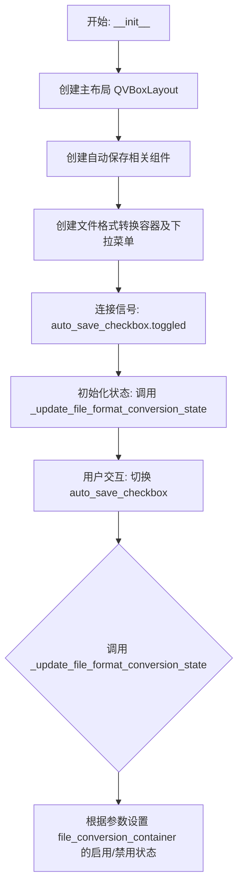
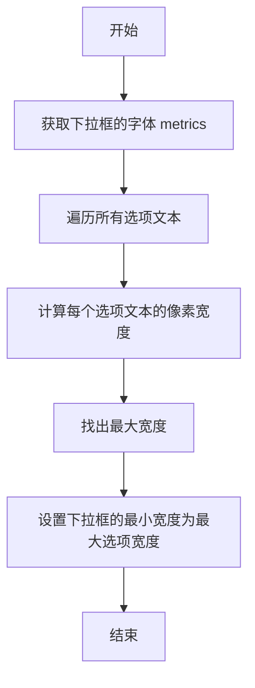
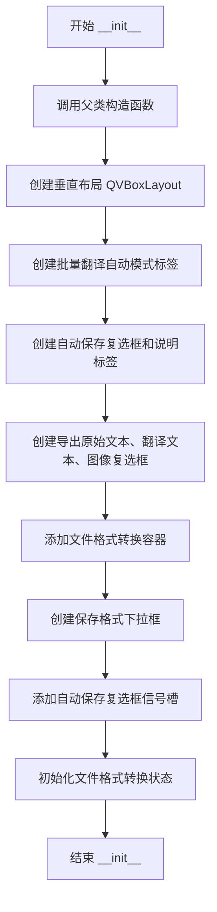

# `comic-translate\app\ui\settings\export_page.py` 详细设计文档

一个用于配置漫画导出选项的Qt图形界面页面，提供自动保存、导出内容选择（原始文本、翻译文本、修复图像）以及文件格式转换（PDF/CBZ等）的UI组件。

## 整体流程



## 类结构

```
ExportPage (QtWidgets.QWidget)
```

## 全局变量及字段


### `ExportPage.auto_save_checkbox`
    
A checkbox to enable automatic saving of batch translations to a timestamped folder.

类型：`MCheckBox`
    


### `ExportPage.auto_save_note`
    
A label displaying the note about auto‑save location and behavior.

类型：`MLabel`
    


### `ExportPage.raw_text_checkbox`
    
A checkbox for including raw text in the exported output.

类型：`MCheckBox`
    


### `ExportPage.translated_text_checkbox`
    
A checkbox for including translated text in the exported output.

类型：`MCheckBox`
    


### `ExportPage.inpainted_image_checkbox`
    
A checkbox for including inpainted images in the exported output.

类型：`MCheckBox`
    


### `ExportPage.file_conversion_container`
    
A container widget that holds file format conversion options, enabled only when auto‑save is active.

类型：`QtWidgets.QWidget`
    


### `ExportPage.archive_save_as_combo`
    
A combo box for selecting the output archive file format (pdf, cbz, cb7, zip).

类型：`MComboBox`
    
    

## 全局函数及方法


### `set_combo_box_width`

该函数用于根据下拉框（ComboBox）中选项的内容自动调整下拉框的宽度，确保所有选项文本能够完整显示，避免文本被截断。

参数：

- `combo_box`：`MComboBox`，需要调整宽度的下拉框对象
- `items`：`List[str]`，下拉框中的选项列表，用于计算合适的宽度

返回值：`None`，该函数直接修改传入的下拉框宽度，不返回任何值

#### 流程图



#### 带注释源码

```python
# 从 utils 模块导入的函数，定义未在当前文件中展示
# 基于函数名和调用的推断实现：

def set_combo_box_width(combo_box, items):
    """
    根据选项内容自动调整下拉框的宽度
    
    参数:
        combo_box: MComboBox - 需要调整宽度的下拉框控件
        items: List[str] - 下拉框中的选项文本列表
    
    返回:
        None - 直接修改控件属性，无返回值
    """
    # 1. 获取下拉框的字体度量对象
    font_metrics = combo_box.fontMetrics()
    
    # 2. 初始化最大宽度为默认值
    max_width = 0
    
    # 3. 遍历所有选项，计算每个文本的显示宽度
    for item in items:
        # 计算单个选项文本的像素宽度
        item_width = font_metrics.horizontalAdvance(item)
        # 更新最大宽度
        max_width = max(max_width, item_width)
    
    # 4. 设置下拉框的最小宽度（考虑padding等余量）
    # 通常添加一些额外的像素作为左右边距
    combo_box.setMinimumWidth(max_width + 20)  # 20为额外的边距
```

#### 备注

- **源码位置**：该函数定义在 `.utils` 模块中，当前代码文件未展示其完整实现
- **调用场景**：在 `ExportPage.__init__` 方法中，用于确保文件类型下拉框（pdf/cbz/cb7/zip）能完整显示所有选项
- **技术价值**：避免下拉框因文本过长导致用户体验不佳


### `ExportPage.__init__`

初始化导出页面（ExportPage）小部件，构建自动保存选项、导出格式复选框和文件格式转换配置的完整 UI 界面。

参数：

- `parent`：`Optional[QtWidgets.QWidget]`，父小部件，默认为 None

返回值：`None`，构造函数无返回值

#### 流程图



#### 带注释源码

```python
def __init__(self, parent=None):
    """
    初始化 ExportPage 小部件
    
    参数:
        parent: 父 QWidget 对象，默认为 None
    """
    # 调用父类 QtWidgets.QWidget 的构造函数
    super().__init__(parent)

    # 创建垂直布局管理器
    layout = QtWidgets.QVBoxLayout(self)

    # === 自动模式部分 ===
    # 创建"自动模式"标题标签 (H4 样式)
    batch_label = MLabel(self.tr("Automatic Mode")).h4()

    # 创建自动保存复选框
    self.auto_save_checkbox = MCheckBox(self.tr("Auto-Save Batch Translations"))
    
    # 创建自动保存说明标签（次要样式，纯文本格式，自动换行）
    self.auto_save_note = MLabel(
        self.tr("Saves to a new comic_translate_<timestamp> folder in the same directory as the input file/archive.")
    ).secondary()
    self.auto_save_note.setTextFormat(QtCore.Qt.PlainText)
    self.auto_save_note.setWordWrap(True)

    # === 导出选项复选框 ===
    self.raw_text_checkbox = MCheckBox(self.tr("Export Raw Text"))
    self.translated_text_checkbox = MCheckBox(self.tr("Export Translated text"))
    self.inpainted_image_checkbox = MCheckBox(self.tr("Export Inpainted Image"))

    # 将自动模式部件添加到布局
    layout.addWidget(batch_label)
    layout.addWidget(self.auto_save_note)
    layout.addWidget(self.auto_save_checkbox)
    layout.addWidget(self.raw_text_checkbox)
    layout.addWidget(self.translated_text_checkbox)
    layout.addWidget(self.inpainted_image_checkbox)

    # === 文件格式转换部分 ===
    layout.addSpacing(20)  # 添加间距
    
    # 创建文件格式转换容器小部件
    self.file_conversion_container = QtWidgets.QWidget(self)
    file_conversion_layout = QtWidgets.QVBoxLayout(self.file_conversion_container)
    file_conversion_layout.setContentsMargins(0, 0, 0, 0)  # 移除边距

    # 创建文件格式转换标题和说明
    file_conversion_label = MLabel(self.tr("File Format Conversion")).h4()
    file_conversion_note = MLabel(
        self.tr(
            "Applies only when auto-save is enabled and the input is an archive (PDF/CBZ/CBR/EPUB/etc).\n"
            "Translated archives are saved as <filename>_translated.<ext> next to the original."
        )
    ).secondary()
    file_conversion_note.setTextFormat(QtCore.Qt.PlainText)
    file_conversion_note.setWordWrap(True)

    file_conversion_layout.addWidget(file_conversion_label)
    file_conversion_layout.addWidget(file_conversion_note)

    # === 保存格式下拉框 ===
    save_layout = QtWidgets.QHBoxLayout()
    save_label = MLabel(self.tr("Save archives as:"))
    
    # 创建小型下拉框
    self.archive_save_as_combo = MComboBox().small()

    # 设置可用的文件类型选项
    available_file_types = ['pdf', 'cbz', 'cb7', 'zip']
    self.archive_save_as_combo.addItems(available_file_types)
    
    # 根据选项内容自适应下拉框宽度
    set_combo_box_width(self.archive_save_as_combo, available_file_types)
    self.archive_save_as_combo.setCurrentText('zip')  # 默认选择 zip

    save_layout.addWidget(save_label)
    save_layout.addWidget(self.archive_save_as_combo)
    save_layout.addStretch(1)  # 添加弹性空间

    file_conversion_layout.addLayout(save_layout)

    # 将文件格式转换容器添加到主布局
    layout.addWidget(self.file_conversion_container)
    layout.addStretch(1)  # 添加弹性空间

    # === 信号槽连接 ===
    # 连接自动保存复选框的切换信号
    self.auto_save_checkbox.toggled.connect(self._update_file_format_conversion_state)
    
    # 初始化文件格式转换容器的启用/禁用状态
    self._update_file_format_conversion_state(self.auto_save_checkbox.isChecked())
```


### `ExportPage._update_file_format_conversion_state`

该方法用于根据自动保存功能的是否启用，动态控制文件格式转换相关 UI 组件的可用状态，确保用户只能在开启自动保存时才能配置归档文件的输出格式。

参数：

- `auto_save_enabled`：`bool`，表示自动保存功能是否已启用

返回值：`None`，该方法仅执行 UI 状态的副作用操作，无返回值

#### 流程图

```mermaid
flowchart TD
    A[开始 _update_file_format_conversion_state] --> B[接收 auto_save_enabled 参数]
    B --> C{bool(auto_save_enabled) 为真?}
    C -->|是| D[设置 file_conversion_container 启用状态为 True]
    C -->|否| E[设置 file_conversion_container 启用状态为 False]
    D --> F[结束]
    E --> F
```

#### 带注释源码

```python
def _update_file_format_conversion_state(self, auto_save_enabled: bool):
    """
    根据自动保存功能的状态更新文件格式转换 UI 组件的启用/禁用状态。
    
    文件格式转换选项仅在以下条件满足时才有意义：
    1. 自动保存功能已启用
    2. 输入文件为归档格式（PDF/CBZ/CBR/EPUB 等）
    
    参数:
        auto_save_enabled: 布尔值，指示自动保存功能是否已开启
        
    返回:
        无返回值，仅修改 UI 组件状态
    """
    # Conversion options only apply when we actually write translated archives to disk.
    # 将布尔值转换为 Python bool 类型，确保即使传入 truthy/falsy 对象也能正确处理
    self.file_conversion_container.setEnabled(bool(auto_save_enabled))
```

## 关键组件


### ExportPage 类

导出配置页面小部件，提供漫画翻译结果的批量自动保存、导出内容选择（原始文本、翻译文本、修复图像）以及文件格式转换选项的UI界面。

### 核心组件

#### 自动保存与批量翻译模块
包含自动保存复选框和说明标签，用于配置是否自动保存翻译结果到以时间戳命名的文件夹中。

#### 导出内容选择器
三个复选框分别控制是否导出原始文本、翻译文本和修复后的图像，提供灵活的内容导出选项。

#### 文件格式转换器
支持将输入的归档文件（PDF/CBZ/CBR/EPUB等）转换为指定格式（pdf/cbz/cb7/zip）保存，仅在自动保存启用时可用。

### 类字段

#### self.auto_save_checkbox
类型: MCheckBox
描述: 自动保存批量翻译结果的复选框

#### self.auto_save_note
类型: MLabel
描述: 显示自动保存说明信息的次要标签

#### self.raw_text_checkbox
类型: MCheckBox
描述: 导出原始文本的复选框

#### self.translated_text_checkbox
类型: MCheckBox
描述: 导出翻译文本的复选框

#### self.inpainted_image_checkbox
类型: MCheckBox
描述: 导出修复图像的复选框

#### self.file_conversion_container
类型: QtWidgets.QWidget
描述: 文件格式转换选项的容器小组件

#### self.archive_save_as_combo
类型: MComboBox
描述: 选择归档文件保存格式的下拉选择框

### 类方法

#### __init__(self, parent=None)
参数:
- parent: QtWidgets.QWidget, 父小部件，默认为None
返回值: None
描述: 初始化导出页面，创建所有UI组件并设置布局，连接信号槽

#### _update_file_format_conversion_state(self, auto_save_enabled: bool)
参数:
- auto_save_enabled: bool, 自动保存是否启用
返回值: None
描述: 根据自动保存复选框状态启用或禁用文件格式转换容器

### 潜在技术债务与优化空间

1. **配置持久化缺失**: 当前设置未持久化到配置文件中，每次打开都需要重新设置
2. **硬编码的文件类型**: 可用文件类型列表 ['pdf', 'cbz', 'cb7', 'zip'] 硬编码在方法内
3. **国际化字符串分散**: 大量 tr() 调用分散在各处，可考虑统一管理
4. **布局嵌套较深**: 存在多层嵌套布局，可考虑拆分为更小的子组件
5. **缺少验证逻辑**: 导出选项之间没有互斥或依赖关系验证

### 其它项目

#### 设计目标
提供用户友好的图形界面来配置漫画翻译结果的导出选项，包括自动保存行为、导出内容类型和目标文件格式。

#### 约束条件
- 依赖 dayu_widgets 组件库
- 需要 PySide6 环境
- 文件格式转换仅在自动保存启用且输入为归档文件时适用

#### 错误处理
当前未实现显式错误处理，依赖 Qt 的内置信号槽机制和异常传播

#### 数据流
用户交互 → 信号触发 → 槽函数更新UI状态 → 配置传递给后端处理

#### 外部依赖
- PySide6.QtCore
- PySide6.QtWidgets
- ..dayu_widgets.label.MLabel
- ..dayu_widgets.check_box.MCheckBox
- ..dayu_widgets.combo_box.MComboBox
- .utils.set_combo_box_width


## 问题及建议


### 已知问题

- **缺少 getter 方法**：类中没有提供获取用户选择的导出选项的方法（如 `get_auto_save()`, `get_export_options()` 等），外部无法获取用户配置。
- **硬编码的文件类型**：`available_file_types = ['pdf', 'cbz', 'cb7', 'zip']` 硬编码在方法内，扩展性差，应提取为类常量或配置。
- **未使用的导入**：导入了 `set_combo_box_width` 但未在此文件中使用（可能由其他模块提供但未调用）。
- **信号未断开连接**：`auto_save_checkbox.toggled.connect(...)` 在初始化时连接信号，但未在组件销毁时断开，可能导致内存引用问题。
- **缺少国际化**：默认值 `'zip'` 和部分字符串未使用 `self.tr()` 包裹。
- **无输入验证**：缺少对导出选项的验证逻辑（如至少选择一个导出类型）。
- **无文档字符串**：类和方法均缺少 docstring，影响代码可维护性。

### 优化建议

- **添加 getter 方法**：提供如 `get_auto_save_enabled()`, `get_archive_format()` 等方法供外部获取用户配置。
- **提取配置常量**：将 `available_file_types` 定义为类常量或从配置文件加载。
- **使用 QGroupBox 分组**：用 `QtWidgets.QGroupBox` 将"Automatic Mode"和"File Format Conversion"分组，提升 UI 逻辑清晰度。
- **添加信号断开逻辑**：在类的 `hideEvent` 或析构时断开信号连接。
- **补充输入验证**：在获取配置时检查是否至少选择了一项导出选项，无效时给出提示。
- **完善国际化**：对所有用户可见字符串使用 `self.tr()`，包括默认值。
- **添加 docstring**：为类和关键方法添加文档说明。

## 其它


### 设计目标与约束

该模块旨在为漫画翻译工具提供一个直观的导出配置界面，允许用户配置自动保存选项、需要导出的内容类型（原始文本、翻译文本、修复图像）以及文件格式转换设置。设计约束包括：必须与PySide6框架兼容，使用项目自定义的UI组件（MLabel、MCheckBox、MComboBox），并遵循现有的UI布局规范。

### 错误处理与异常设计

当前代码主要涉及UI状态管理，错误处理主要集中在信号连接和状态更新逻辑中。若auto_save_checkbox的toggled信号传递非布尔值，_update_file_format_conversion_state方法中的bool()转换可防止类型错误。当archive_save_as_combo的当前文本与可用文件类型不匹配时，setCurrentText('zip')提供默认 fallback 机制。建议增加对set_combo_box_width函数调用失败的异常捕获。

### 数据流与状态机

数据流遵循单向绑定模式：用户交互触发auto_save_checkbox的toggled信号 → 调用_update_file_format_conversion_state方法 → 更新file_conversion_container的启用/禁用状态。状态机包含两个状态：Auto-Save Enabled（文件格式转换选项可用）和Auto-Save Disabled（文件格式转换选项禁用）。初始化时_update_file_format_conversion_state根据auto_save_checkbox的初始选中状态进行状态同步。

### 外部依赖与接口契约

该模块依赖以下外部组件：PySide6.QtCore和QtWidgets提供基础Qt功能；自定义组件MLabel（标签）、MCheckBox（复选框）、MComboBox（下拉框）来自dayu_widgets包；set_combo_box_width工具函数来自utils模块。接口契约要求父类构造函数接受parent参数，返回值为None（构造函数），archive_save_as_combo需支持addItems、setCurrentText和currentText方法。

### UI/UX设计考量

布局采用垂直箱式布局（QVBoxLayout），元素按逻辑分组：自动保存模式组（标题+说明+复选框）和文件格式转换组（标题+说明+下拉选择）。说明文字使用secondary()样式并设置PlainText格式和自动换行，确保长文本可读性。复选框和下拉框提供直观的状态反馈，file_conversion_container的启用/禁用状态通过视觉变化提示用户功能依赖关系。

### 性能考虑

当前实现性能开销较小，布局在初始化时一次性创建完成。_update_file_format_conversion_state方法仅更新单个容器控件的启用状态，触发最小的重绘操作。若导出配置选项数量大幅增加，建议考虑延迟加载非可视区域的控件。

### 安全性考虑

代码不涉及敏感数据处理或用户输入验证。file_conversion_container.setEnabled()仅控制UI状态，不涉及实际文件操作权限验证。下拉框的可用文件类型（pdf、cbz、cb7、zip）为硬编码列表，需确保后续文件保存逻辑对文件类型进行安全验证。

### 可测试性

类结构清晰，适合单元测试。可测试场景包括：初始化后各控件的默认状态验证、auto_save_checkbox状态变化时file_conversion_container的启用/禁用状态验证、archive_save_as_combo的默认选中值验证、_update_file_format_conversion_state方法对不同布尔输入的响应。建议使用Qt测试框架或Mock对象模拟父类进行隔离测试。

### 国际化/本地化

所有用户可见文本使用self.tr()进行标记，支持Qt的翻译机制。包含的待翻译字符串包括："Automatic Mode"、"Auto-Save Batch Translations"、"Saves to a new comic_translate_<timestamp> folder in the same directory as the input file/archive."、"Export Raw Text"、"Export Translated text"、"Export Inpainted Image"、"File Format Conversion"、"Applies only when auto-save is enabled and the input is an archive (PDF/CBZ/CBR/EPUB/etc). Translated archives are saved as <filename>_translated.<ext> next to the original."、"Save archives as:"。注意部分文本包含占位符（如<timestamp>、<filename>、<ext>），需确保翻译时保持占位符位置。

### 版本兼容性

代码使用PySide6框架，需确保Qt版本与PySide6版本兼容。self.tr()方法在PySide6中正常工作，但需注意在某些Qt版本中可能需要显式安装翻译文件。当前代码未使用PySide6的最新特性，保持了较好的向后兼容性。file_conversion_container.setEnabled()方法在Qt5和Qt6中均可用。

### 配置持久化机制

当前代码未实现配置的持久化存储。建议在后续迭代中添加：将auto_save_checkbox、raw_text_checkbox、translated_text_checkbox、inpainted_image_checkbox的状态以及archive_save_as_combo的选中值保存至配置文件（如JSON、QSettings），并在__init__中加载这些配置以恢复用户上次使用的设置。

### 潜在功能扩展

可考虑的扩展方向包括：1）为每个导出选项添加详细的子配置（如导出路径自定义、文件名模板）；2）支持更多的文件格式转换类型；3）添加导出预览功能；4）实现批量导出预设管理；5）添加导出进度显示和取消机制。当前的基础架构支持这些扩展，只需在现有布局中添加相应的控件和状态管理逻辑。

    