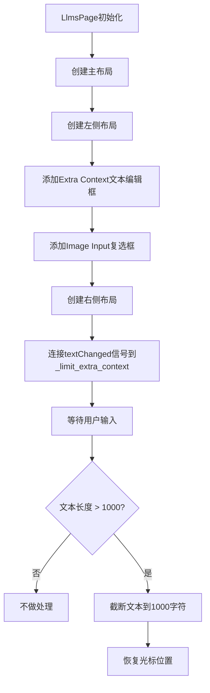

# `comic-translate\app\ui\settings\llms_page.py` 详细设计文档

一个基于PySide6的LLM配置页面，提供额外上下文输入和图像输入选项的UI组件，包含文本长度限制功能

## 整体流程



## 类结构

```
QtWidgets.QWidget
└── LlmsPage (自定义页面组件)
```

## 全局变量及字段


### `parent`
    
Parent widget for this LlmsPage instance

类型：`QtWidgets.QWidget or None`
    


### `LlmsPage.image_checkbox`
    
图像输入选项复选框

类型：`MCheckBox`
    


### `LlmsPage.extra_context`
    
额外上下文输入文本框

类型：`MTextEdit`
    
    

## 全局函数及方法


### `LlmsPage.__init__`

初始化 LlmsPage 类的实例，设置主 UI 布局和组件，包括左侧的额外上下文输入框和图像输入选项复选框，以及右侧的高级设置占位区域。

参数：

- `self`：隐式参数，表示当前 LlmsPage 实例本身
- `parent`：`QtWidgets.QWidget | None`，父窗口部件，传递给父类 QWidget 的构造函数，默认为 None

返回值：`None`，该方法为构造函数，不返回任何值

#### 流程图

```mermaid
flowchart TD
    A[开始 __init__] --> B[调用父类构造函数 super().__init__parent]
    B --> C[创建主垂直布局 v = QVBoxLayoutself]
    D[创建主水平布局 main_layout = QHBoxLayout]
    C --> D
    D --> E[创建图像输入复选框 image_checkbox]
    E --> F[设置复选框为未选中状态 setCheckedFalse]
    F --> G[创建左侧垂直布局 left_layout]
    G --> H[创建提示标签 prompt_label]
    H --> I[创建额外上下文文本编辑器 extra_context]
    I --> J[设置文本编辑器最小高度为200]
    J --> K[将组件添加到左侧布局]
    K --> L[创建右侧垂直布局 right_layout]
    L --> M[添加间距和拉伸因子]
    M --> N[将左右布局添加到主布局]
    N --> O[将主布局添加到垂直布局]
    O --> P[连接 textChanged 信号到 _limit_extra_context]
    P --> Q[结束 __init__]
```

#### 带注释源码

```python
def __init__(self, parent=None):
    # 调用父类 QtWidgets.QWidget 的构造函数，传递 parent 参数
    super().__init__(parent)

    # 创建主垂直布局，用于整体页面结构
    v = QtWidgets.QVBoxLayout(self)
    # 创建主水平布局，用于左右分栏
    main_layout = QtWidgets.QHBoxLayout()

    # 创建图像输入复选框，支持国际化翻译
    self.image_checkbox = MCheckBox(self.tr("Provide Image as Input to AI"))
    # 默认设置为未选中状态
    self.image_checkbox.setChecked(False)

    # ===== 左侧布局 =====
    # 创建左侧垂直布局容器
    left_layout = QtWidgets.QVBoxLayout()
    # 创建"额外上下文"提示标签，支持国际化
    prompt_label = MLabel(self.tr("Extra Context:"))
    # 创建多行文本编辑器用于输入额外上下文
    self.extra_context = MTextEdit()
    # 设置文本编辑器的最小高度为200像素
    self.extra_context.setMinimumHeight(200)
    # 将提示标签添加到左侧布局
    left_layout.addWidget(prompt_label)
    # 将文本编辑器添加到左侧布局
    left_layout.addWidget(self.extra_context)
    # 将图像复选框添加到左侧布局
    left_layout.addWidget(self.image_checkbox)
    # 添加可伸缩空间，将内容顶部对齐
    left_layout.addStretch(1)

    # ===== 右侧布局 =====
    # 创建右侧垂直布局容器
    right_layout = QtWidgets.QVBoxLayout()

    # 高级设置区域（当前为占位状态）
    # 在右侧布局顶部添加10像素间距
    right_layout.addSpacing(10)
    # 添加可伸缩空间
    right_layout.addStretch(1)

    # 将左侧布局添加到主布局，比例为3（占3/4空间）
    main_layout.addLayout(left_layout, 3)
    # 将右侧布局添加到主布局，比例为1（占1/4空间）
    main_layout.addLayout(right_layout, 1)

    # 将主水平布局添加到垂直布局
    v.addLayout(main_layout)
    # 添加可伸缩空间
    v.addStretch(1)

    # 连接文本编辑器的 textChanged 信号到限制字符数的槽函数
    self.extra_context.textChanged.connect(self._limit_extra_context)
```


### `LlmsPage._limit_extra_context`

该方法是一个私有槽函数，通过连接到 `MTextEdit` 的 `textChanged` 信号来实现对额外上下文文本的长度限制。当文本超过1000字符时，它会截断超长部分并尝试将光标位置恢复到合理位置，以保持用户的编辑位置。

参数：

- `self`：`LlmsPage`，隐式参数，表示当前类的实例

返回值：`None`，无返回值

#### 流程图

```mermaid
flowchart TD
    A[textChanged 信号触发<br/>调用 _limit_extra_context] --> B[设置 max_length = 1000]
    B --> C[获取当前文本: text = self.extra_context.toPlainText()]
    C --> D{len(text) > max_length?}
    D -->|否| E[直接返回，不做任何处理]
    D -->|是| F[保存当前光标位置: position = cursor.position]
    F --> G[截断文本: setPlainText(text[:max_length])]
    G --> H[计算新光标位置: new_position = min(position, max_length)]
    H --> I[恢复光标: setTextCursor(cursor)]
    E --> J[方法结束]
    I --> J
```

#### 带注释源码

```python
def _limit_extra_context(self):
    """
    限制 extra_context 文本编辑框的字符数，并尽量保持光标位置。
    当文本超过最大长度时自动截断，同时尝试恢复用户的光标位置。
    """
    max_length = 1000  # 定义最大字符数限制
    text = self.extra_context.toPlainText()  # 获取当前文本内容
    
    # 检查文本长度是否超过限制
    if len(text) > max_length:
        # ---------- 保存光标位置 ----------
        cursor = self.extra_context.textCursor()  # 获取文本光标对象
        position = cursor.position()               # 记录触发截断前的光标位置
        
        # ---------- 执行截断 ----------
        # 将文本截断至最大长度，丢弃超出部分
        self.extra_context.setPlainText(text[:max_length])
        
        # ---------- 恢复光标位置 ----------
        # 计算新的光标位置：取原位置与最大长度中的较小值
        # 这样可以防止光标超出新文本的范围
        new_position = min(position, max_length)
        
        # 设置光标新位置
        cursor.setPosition(new_position)
        
        # 应用光标更改到文本编辑框
        self.extra_context.setTextCursor(cursor)
```

## 关键组件


### LlmsPage

主页面组件，继承自QtWidgets.QWidget，提供LLM配置的UI界面，包含额外上下文输入和图像输入选项。

### extra_context

MTextEdit类型的文本编辑组件，用于用户输入额外的上下文内容，具备最大1000字符的长度限制功能。

### image_checkbox

MCheckBox类型的复选框组件，用于控制是否向AI提供图像作为输入。

### _limit_extra_context

文本长度限制方法，当输入文本超过1000字符时自动截断并保留光标位置，确保用户体验。


## 问题及建议


### 已知问题

-   **未使用的导入**：`MCollapse` 被导入但未在代码中使用，造成冗余导入
-   **右侧布局空置**：`right_layout` 仅添加了 `addSpacing(10)` 和 `addStretch(1)`，高级设置区域完全为空，是一个明显的功能占位符或未完成功能
-   **硬编码魔数**：`max_length = 1000` 硬编码在 `_limit_extra_context` 方法中，缺乏可配置性
-   **潜在的无限递归风险**：当文本长度超过限制时，`setPlainText()` 会触发 `textChanged` 信号，可能导致信号循环调用，尽管当前实现通过位置校准有所缓解
-   **布局权重使用整数**：`main_layout.addLayout(left_layout, 3)` 和 `main_layout.addLayout(right_layout, 1)` 使用整数权重而非更清晰的 `QtWidgets.QSizePolicy.Expanding` 或固定比例
-   **初始化时未验证文本长度**：如果 `extra_context` 的初始文本超过 1000 字符，初始化时不会自动截断
-   **缺少信号连接**：`image_checkbox` 的 `stateChanged` 信号未连接任何处理函数，功能不完整

### 优化建议

-   移除未使用的 `MCollapse` 导入以减少依赖
-   将 `max_length` 提取为类常量 `MAX_EXTRA_CONTEXT_LENGTH = 1000` 或配置属性
-   在 `__init__` 方法末尾添加对初始文本的截断检查，确保初始化时文本长度符合限制
-   考虑使用 `QSplitter` 替代固定比例的布局，提供更好的用户体验和响应式设计
-   为 `image_checkbox` 添加信号连接，例如：`self.image_checkbox.stateChanged.connect(self._on_image_checkbox_changed)`
-   添加类和方法文档字符串以提高代码可维护性
-   考虑将布局逻辑拆分为独立的 `_setup_ui` 私有方法，提高 `__init__` 的可读性


## 其它


### 设计目标与约束

本模块旨在为LLM聊天界面提供一个配置输入页面，允许用户输入额外的上下文信息并可选地提供图像作为AI输入。约束条件包括：extra_context文本输入限制在1000字符以内，使用PySide6作为UI框架，遵循项目既定的布局规范（左3右1的比例）。

### 错误处理与异常设计

代码本身较为简单，主要错误处理体现在_limit_extra_context方法中：当用户输入超过1000字符时自动截断并尝试恢复光标位置。若setPlainText或setTextCursor抛出异常，应在Qt的异常处理机制中捕获并静默处理，避免影响用户体验。

### 数据流与状态机

数据流：用户输入extra_context文本 → 触发textChanged信号 → 调用_limit_extra_context方法 → 检查长度是否超限 → 超限则截断文本并恢复光标位置 → 状态更新完成。状态机较为简单，主要状态为：正常输入状态、达到上限截断状态。

### 外部依赖与接口契约

依赖：PySide6.QtWidgets、PySide6.QtCore、dayu_widgets组件（MLabel、MTextEdit、MCheckBox、MCollapse）。接口契约：LLmsPage继承QtWidgets.QWidget，对外提供extra_context文本获取接口（通过self.extra_context对象）和图像checkbox状态获取接口（通过self.image_checkbox对象）。

### 安全性考虑

_limit_extra_context方法对文本长度进行限制，防止内存溢出或UI卡顿。使用self.tr()进行国际化字符串包裹，防止字符串硬编码。

### 国际化/本地化

使用self.tr()方法包裹所有用户可见字符串（"Provide Image as Input to AI"、"Extra Context:"），支持Qt的国际化机制。

### 可访问性

MTextEdit和MCheckBox等组件本身支持Qt的可访问性框架，但缺少明确的accessibleName或accessibleDescription设置，建议为关键组件添加可访问性描述。

### 性能考虑

_limit_extra_context在每次文本变化时调用，文本较短时性能可忽略。但建议添加防抖（debounce）机制，避免频繁截断操作影响输入体验。setPlainText会导致整个文本重新渲染，频繁调用可能影响性能。

### 测试策略

建议单元测试：测试_limit_extra_context方法的截断逻辑（输入超过1000字符、输入不足1000字符、光标位置恢复）。集成测试：测试textChanged信号连接、布局渲染、checkbox状态切换。

### 版本兼容性

代码使用PySide6，需确保Qt版本兼容。项目应声明PySide6的最低版本要求。

### 配置文件/持久化

代码中未包含配置持久化逻辑，建议后续添加：extra_context文本和image_checkbox状态的保存与恢复功能，可使用QSettings或项目既定的配置系统。

### 布局响应式设计

采用QHBoxLayout（左3右1比例）和QVBoxLayout，未实现响应式布局。当窗口尺寸变化时，left_layout和right_layout按比例缩放，但MTextEdit.setMinimumHeight(200)是固定值，可能在极小窗口下导致布局问题。

### 事件处理

主要事件处理：textChanged信号 → _limit_extra_context槽函数。预留了扩展空间，可添加其他事件监听（如焦点事件、键盘快捷键等）。

    