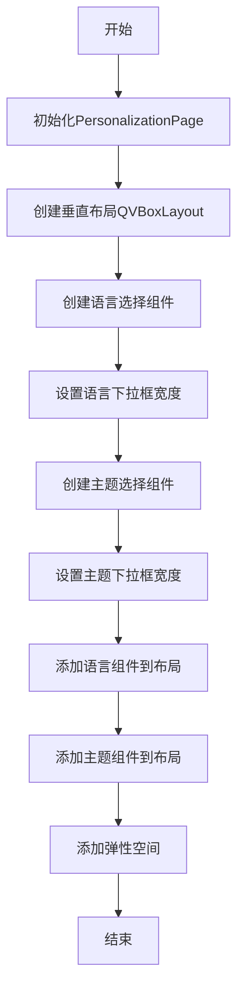
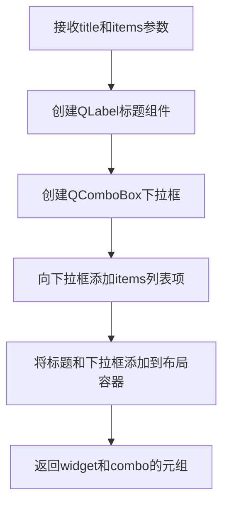
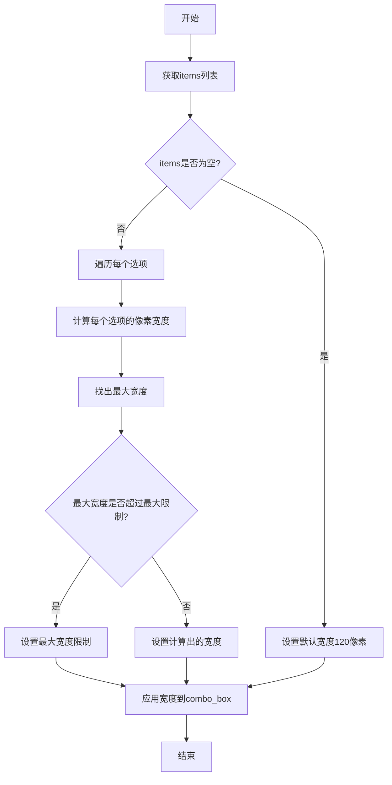

# `comic-translate\app\ui\settings\personalization_page.py` 详细设计文档

一个PySide6 Qt小部件，用于创建个性化设置页面，提供语言和主题选择的下拉菜单功能。

## 整体流程



## 类结构

```
QObject
└── QWidget
    └── PersonalizationPage
```

## 全局变量及字段


### `PersonalizationPage.languages`
    
语言选项列表

类型：`list[str]`
    


### `PersonalizationPage.themes`
    
主题选项列表

类型：`list[str]`
    


### `PersonalizationPage.lang_combo`
    
语言选择下拉框

类型：`QComboBox`
    


### `PersonalizationPage.theme_combo`
    
主题选择下拉框

类型：`QComboBox`
    
    

## 全局函数及方法


### `create_title_and_combo`

从 utils 模块导入的函数，用于创建包含标题标签和下拉选择框的组合组件，返回一个元组包含（标题组件，下拉框组件）。

参数：

- `title`：`str`，要显示的标题文本
- `items`：`list[str]`，下拉框中可选项的列表

返回值：`tuple[QtWidgets.QWidget, QtWidgets.QComboBox]`，返回包含标题标签组件和下拉选择框组件的元组

#### 流程图



#### 带注释源码

```python
# 注意：实际实现位于 utils 模块，此处基于调用方式的推断
def create_title_and_combo(title: str, items: list[str]):
    """
    创建标题和下拉框组合组件
    
    Args:
        title: 标题文本
        items: 下拉框选项列表
    
    Returns:
        包含(容器widget, 下拉框)的元组
    """
    # 创建水平布局容器
    container = QtWidgets.QWidget()
    layout = QtWidgets.QHBoxLayout(container)
    
    # 创建标题标签
    label = QtWidgets.QLabel(title)
    label.setMinimumWidth(80)  # 设置最小宽度保证对齐
    layout.addWidget(label)
    
    # 创建下拉选择框
    combo = QtWidgets.QComboBox()
    combo.addItems(items)  # 添加所有选项
    layout.addWidget(combo)
    
    layout.addStretch()  # 添加伸缩使标签左对齐
    
    return container, combo
```

---

> **说明**：由于 `create_title_and_combo` 函数的实际源码位于 `.utils` 模块中，未在当前代码片段中提供。上述源码为基于调用方式的合理推断。实际实现可能有所不同，建议查看 `utils.py` 文件获取准确的函数实现。


### `set_combo_box_width`

该函数用于根据下拉框中的选项内容自动计算并设置下拉框的宽度，确保选项文本能够完整显示而不会因宽度不足而被截断。

参数：

- `combo_box`：`QComboBox`，需要设置宽度的下拉框控件对象
- `items`：`list[str]`，下拉框中的选项列表，用于计算合适的宽度

返回值：`None`，该函数直接修改下拉框的宽度属性，不返回任何值

#### 流程图



#### 带注释源码

```python
def set_combo_box_width(combo_box, items):
    """
    设置下拉框的宽度以适应最长的选项文本
    
    参数:
        combo_box: QComboBox - 需要设置宽度的下拉框控件
        items: list[str] - 下拉框中的选项列表
    
    返回:
        None - 直接修改combo_box的宽度，不返回值
    """
    # 如果选项列表为空，设置一个合理的默认宽度
    if not items:
        combo_box.setMinimumWidth(120)
        return
    
    # 获取QFontMetrics用于计算文本像素宽度
    font_metrics = combo_box.fontMetrics()
    
    # 遍历所有选项，找出最长文本的像素宽度
    max_width = 0
    for item in items:
        # 计算当前选项文本的像素宽度
        item_width = font_metrics.horizontalAdvance(item)
        # 更新最大宽度
        max_width = max(max_width, item_width)
    
    # 添加一定的边距padding，使文本不贴边
    padding = 20
    final_width = max_width + padding
    
    # 设置最大宽度限制为400像素，避免过宽影响布局
    max_allowed_width = 400
    final_width = min(final_width, max_allowed_width)
    
    # 应用计算出的宽度到下拉框
    combo_box.setMinimumWidth(final_width)
    combo_box.setMaximumWidth(final_width)
```

#### 设计说明

该函数的设计目标是在保证可读性的前提下，自动调整下拉框宽度使其适配最长的选项文本。实现采用了以下策略：

1. **健壮性处理**：对空列表进行特殊处理，设置合理的默认宽度
2. **文本测量**：使用`QFontMetrics.horizontalAdvance()`精确计算每个字符的像素宽度
3. **边距留白**：额外添加20像素的padding，避免文本紧贴边框
4. **宽度限制**：设置400像素的上限，防止个别超长选项导致下拉框过宽影响界面布局
5. **同时设置最小和最大宽度**：确保下拉框宽度固定，不会随内容动态变化


### `PersonalizationPage.__init__`

构造函数，初始化个性化设置页面。该方法接收语言和主题列表作为配置参数，创建包含语言选择和主题选择的下拉框组合的UI界面，并设置布局。

参数：

- `languages`：`list[str]`，可用语言列表，用于填充语言选择下拉框
- `themes`：`list[str]`，可用主题列表，用于填充主题选择下拉框
- `parent`：`QtWidgets.QWidget | None`，父小部件对象，传递给父类QtWidgets.QWidget的构造函数，默认为None

返回值：`None`，构造函数不返回任何值

#### 流程图

```mermaid
flowchart TD
    A[开始 __init__] --> B[调用 super().__init__parent]
    B --> C[保存 languages 到 self.languages]
    C --> D[保存 themes 到 self.themes]
    D --> E[创建 QVBoxLayout 垂直布局]
    E --> F[调用 create_title_and_combo 创建语言选择器]
    F --> G[调用 set_combo_box_width 设置语言下拉框宽度]
    G --> H[调用 create_title_and_combo 创建主题选择器]
    H --> I[调用 set_combo_box_width 设置主题下拉框宽度]
    I --> J[将语言选择器添加到布局]
    J --> K[将主题选择器添加到布局]
    K --> L[添加弹性空间 layout.addStretch]
    L --> M[结束 __init__]
```

#### 带注释源码

```python
def __init__(self, languages: list[str], themes: list[str], parent=None):
    """
    构造函数，初始化个性化设置页面
    
    参数:
        languages: 可用的语言选项列表
        themes: 可用的主题选项列表
        parent: 父级QWidget对象，可选
    """
    # 调用父类QtWidgets.QWidget的构造函数
    # parent参数传递给父类，用于建立Qt对象层级关系
    super().__init__(parent)
    
    # 将传入的语言和主题列表保存为实例属性
    # 供后续方法（如信号槽）访问当前配置
    self.languages = languages
    self.themes = themes

    # 创建垂直布局管理器
    # 参数self使布局设置到当前widget上
    layout = QtWidgets.QVBoxLayout(self)

    # 创建语言选择器：包含标题标签和下拉组合框
    # create_title_and_combo返回(widget, combo)元组
    # self.tr()支持Qt的国际化翻译机制
    language_widget, self.lang_combo = create_title_and_combo(self.tr("Language"), self.languages)
    
    # 根据语言列表内容设置下拉框的显示宽度
    # 确保较长的语言名称能够完整显示
    set_combo_box_width(self.lang_combo, self.languages)
    
    # 创建主题选择器
    theme_widget, self.theme_combo = create_title_and_combo(self.tr("Theme"), self.themes)
    
    # 设置主题下拉框宽度
    set_combo_box_width(self.theme_combo, self.themes)

    # 将语言和主题选择器widget添加到垂直布局
    layout.addWidget(language_widget)
    layout.addWidget(theme_widget)
    
    # 添加弹性空间(Stretch)
    # 将已添加的widget靠上排列，底部留空
    layout.addStretch()
```


## 关键组件


### PersonalizationPage 类

个人化设置页面组件，提供语言和主题选择功能，包含两个下拉组合框用于用户交互选择。

### QtWidgets.QWidget 继承

继承自Qt基类Widget，提供了Qt窗口部件的所有基础功能。

### languages 字段

类型：list[str]，存储可用语言选项列表。

### themes 字段

类型：list[str]，存储可用主题选项列表。

### lang_combo 字段

类型：QtWidgets.QComboBox，语言选择下拉框控件。

### theme_combo 字段

类型：QtWidgets.QComboBox，主题选择下拉框控件。

### __init__ 方法

构造函数，初始化个人化页面，创建语言和主题选择器。

参数：
- languages: list[str]，可用语言列表
- themes: list[str]，可用主题列表
- parent: QWidget，可选父部件

返回值：无

### create_title_and_combo 依赖

外部工具函数，用于创建带标题的组合框。

### set_combo_box_width 依赖

外部工具函数，用于设置组合框宽度。


## 问题及建议


### 已知问题

-   **信号连接缺失**：组合框的选择变化（currentTextChanged 或 currentIndexChanged 信号）未与任何槽函数连接，功能不完整，用户选择语言或主题后无任何响应
-   **语言切换逻辑缺失**：虽然接收了 `languages` 参数并创建了语言组合框，但缺少实际切换应用语言的逻辑代码
-   **主题切换逻辑缺失**：虽然接收了 `themes` 参数并创建了主题组合框，但缺少实际应用主题的代码
-   **未使用的实例变量**：`self.languages` 和 `self.themes` 被存储但后续未在任何地方使用，造成资源浪费
-   **空列表未做校验**：传入空的 `languages` 或 `themes` 列表时，组合框将为空，缺少边界条件处理
-   **缺少文档字符串**：类和方法缺少 docstring，代码可维护性和可读性较差
-   **硬编码 UI 文本**："Language" 和 "Theme" 字符串直接写在代码中，应提取为类属性或配置常量以支持国际化

### 优化建议

-   添加信号连接：为 `lang_combo` 和 `theme_combo` 的 `currentTextChanged` 信号连接对应的处理槽函数
-   实现切换逻辑：在槽函数中调用主题切换 API 和语言切换 API，或发射自定义信号供外部处理
-   移除未使用变量：如 `self.languages` 和 `self.themes` 确实无需保存，应移除以减少内存占用
-   添加参数校验：在 `__init__` 中检查 `languages` 和 `themes` 列表是否为空，必要时抛出 `ValueError` 或提供默认选项
-   添加文档字符串：为类和 `__init__` 方法添加规范的 docstring 说明
-   提取 UI 字符串：将 "Language" 和 "Theme" 定义为类常量或通过参数传入
-   改进布局设置：添加 `setSpacing()` 和 `setContentsMargins()` 以优化视觉效果
-   考虑添加刷新方法：提供 `refresh()` 方法以便外部在语言/主题配置变更后重新加载 UI


## 其它


### 设计目标与约束

**设计目标**：
- 为应用程序提供一个可复用的个性化设置页面
- 支持动态配置语言和主题选项
- 实现灵活的UI布局和用户体验

**设计约束**：
- 必须继承自QtWidgets.QWidget
- 依赖PySide6框架
- 必须使用utils模块提供的工具函数创建UI组件

### 错误处理与异常设计

**参数校验**：
- `languages`和`themes`参数应为list类型，若为空列表可能导致UI显示异常
- 未对None值进行防御性检查，可能引发AttributeError

**异常传播**：
- 构造函数中的异常会直接向上抛出，由调用方处理
- UI组件创建失败时可能导致部分界面无法正常显示

**建议改进**：
- 添加参数类型检查和默认值处理
- 对空列表情况提供友好的降级处理

### 数据流与状态机

**数据输入流**：
```
languages: list[str] → 存储到self.languages → 传递给lang_combo
themes: list[str] → 存储到self.themes → 传递给theme_combo
```

**UI渲染流程**：
```
__init__ → 创建布局 → 创建语言选择组件 → 创建主题选择组件 → 添加到布局 → 添加弹性空间
```

**状态说明**：
- 该组件为静态展示组件，无复杂状态机逻辑
- 主要状态为用户交互选择（通过combobox的currentIndexChanged信号）

### 外部依赖与接口契约

**直接依赖**：
- `PySide6.QtWidgets`：UI框架核心库
- `utils.create_title_and_combo`：创建标题和下拉框组合的工厂函数
- `utils.set_combo_box_width`：设置下拉框宽度的工具函数

**接口契约**：
- 构造函数：languages(list[str])和themes(list[str])为必选参数
- 公开属性：self.lang_combo和self.theme_combo可供外部访问和信号连接
- 信号约定：combobox的currentIndexChanged信号由调用方负责处理

### 配置持久化设计

**缺失项**：
- 当前实现未包含配置保存和加载机制
- 用户选择后无持久化能力，重启应用后配置丢失

**建议**：
- 应集成QSettings或类似的持久化方案
- 可添加valueChanged信号，在值变化时触发保存逻辑

### 可访问性与国际化

**当前实现**：
- 使用self.tr()进行界面文本翻译，支持Qt内置的翻译机制
- 标题文本"Language"和"Theme"可通过Qt Linguist工具进行国际化

**注意事项**：
- 需确保languages列表中的项也已正确国际化处理

    