# `comic-translate\app\ui\settings\settings_page.py` 详细设计文档

这是应用程序的核心设置管理模块，继承自 PySide6 的 QWidget。它集成了用户界面配置（主题、语言、工具选择）、第三方认证与积分管理（AuthClient）、以及软件自动更新（UpdateChecker）功能，并通过 QSettings 将所有配置持久化到本地。

## 整体流程

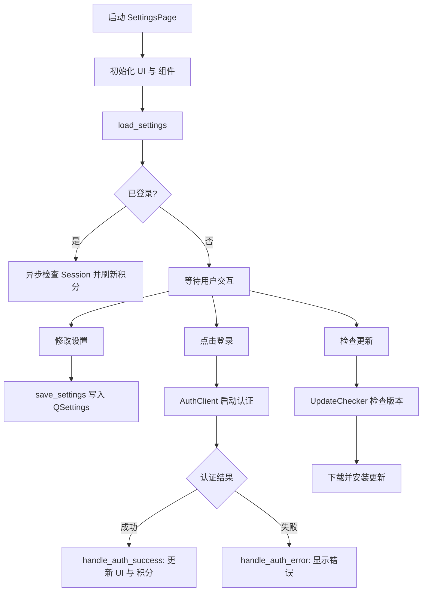

## 类结构

```
QtWidgets.QWidget (Qt 基础类)
└── SettingsPage (核心设置页面控制器)
    ├── 依赖: SettingsPageUI (UI 布局定义)
    ├── 依赖: AuthClient (账户认证服务)
    ├── 依赖: UpdateChecker (更新检查服务)
    └── 依赖: QSettings (持久化存储)
```

## 全局变量及字段


### `logger`
    
模块级日志记录器，用于记录应用运行日志

类型：`logging.Logger`
    


### `API_BASE_URL`
    
后端 API 地址

类型：`str`
    


### `FRONTEND_BASE_URL`
    
前端 Web 地址

类型：`str`
    


### `USER_INFO_GROUP`
    
QSettings 用户信息分组键

类型：`str`
    


### `EMAIL_KEY`
    
用户信息键，用于存储用户邮箱

类型：`str`
    


### `TIER_KEY`
    
用户信息键，用于存储用户等级

类型：`str`
    


### `CREDITS_KEY`
    
用户信息键，用于存储用户积分

类型：`str`
    


### `MONTHLY_CREDITS_KEY`
    
用户信息键，用于存储用户每月积分

类型：`str`
    


### `SettingsPage.ui`
    
UI 实例，负责设置页面的界面展示

类型：`SettingsPageUI`
    


### `SettingsPage.auth_client`
    
认证客户端实例，处理用户登录、登出及会话管理

类型：`AuthClient`
    


### `SettingsPage.update_checker`
    
更新检查器实例，用于检查应用更新并处理下载流程

类型：`UpdateChecker`
    


### `SettingsPage.user_email`
    
用户邮箱，存储当前登录用户的邮箱地址

类型：`Optional[str]`
    


### `SettingsPage.user_tier`
    
用户等级，标识当前用户的订阅等级

类型：`Optional[str]`
    


### `SettingsPage.user_credits`
    
用户积分，存储用户的积分余额信息

类型：`Optional[Any]`
    


### `SettingsPage._loading_settings`
    
加载状态标志，用于防止在加载设置时触发变更信号

类型：`bool`
    


### `SettingsPage._pricing_refresh_timer`
    
积分刷新定时器，在购买积分后轮询以刷新余额

类型：`Optional[QTimer]`
    
    

## 全局函数及方法


### `modules.utils.device.is_gpu_available`

该全局函数用于检测当前系统环境是否支持并启用了 GPU 加速。在 `SettingsPage` 类中，该函数被用于在应用启动或设置加载时，判断是否应该启用或勾选 "Use GPU" 复选框。如果函数返回 `False`，则强制禁用 GPU 选项。

参数：
- (无)

返回值：`bool`，`True` 表示系统检测到可用 GPU，`False` 表示未检测到 GPU 或加速不可用。

#### 流程图


#### 带注释源码

*注：由于源代码中仅包含 `from modules.utils.device import is_gpu_available` 的导入语句，未直接提供 `modules/utils/device.py` 的实现代码。以下源码为基于其调用上下文（用于判断 PyTorch/CUDA 可用性）及 Python 常见工具函数模式的合理推测实现。*

```python
import logging

logger = logging.getLogger(__name__)

def is_gpu_available() -> bool:
    """
    检查系统中是否存在可用的 GPU 设备。
    
    通常的实现会尝试调用底层深度学习库的接口（如 PyTorch 的 cuda.is_available()）
    来判断 GPU 是否可以被程序使用。

    Returns:
        bool: 如果 GPU 可用则返回 True，否则返回 False。
    """
    try:
        # 常见的检测方式：导入 torch 并检查 cuda
        import torch
        return torch.cuda.is_available()
    except ImportError:
        # 如果环境未安装 PyTorch 等依赖，默认认为不可用
        logger.debug("PyTorch not found, assuming GPU not available.")
        return False
    except Exception as e:
        # 捕获检测过程中的其他异常
        logger.warning(f"Error checking GPU availability: {e}")
        return False
```


### `get_user_data_dir`

该函数在提供的代码文本中未被直接定义，而是通过 `from modules.utils.paths import get_user_data_dir` 导入。根据其在 `SettingsPage.import_font` 方法中的使用方式（`os.path.join(get_user_data_dir(), "fonts")`），可以确定其核心功能是获取应用程序存储用户个人数据（如配置、缓存、自定义资源）的根目录路径。

参数：
- 无

返回值：`str`，返回用户数据目录的绝对路径。

#### 流程图

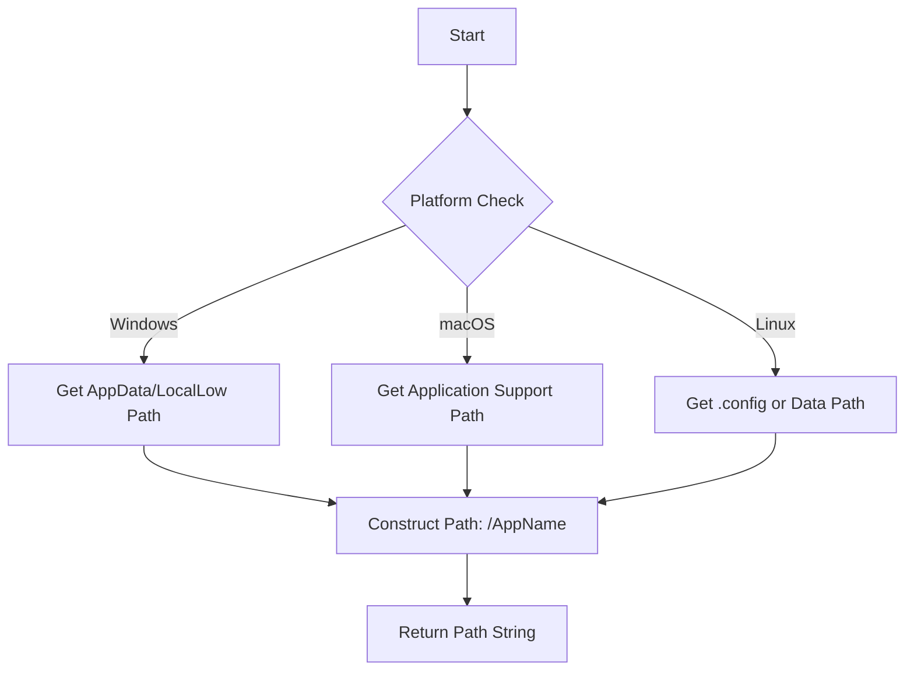

#### 带注释源码

由于源代码中未提供 `modules.utils.paths` 的实现，以下为根据其调用上下文推测的标准架构实现（通常基于 `platformdirs` 或 `QStandardPaths`）：

```python
import os
import sys

def get_user_data_dir() -> str:
    """
    获取应用程序存储用户数据的根目录。
    在此处模拟了跨平台路径获取逻辑。
    
    Returns:
        str: 用户数据目录的绝对路径。
    """
    # 常见的实现通常会结合平台和应用名称
    # 假设应用名称为 "ComicTranslate" 或从元数据获取
    
    if sys.platform == "win32":
        # Windows: 通常使用 AppData/LocalLow
        base = os.getenv('APPDATA') or os.path.expanduser("~/AppData/Roaming")
        return os.path.join(base, "ComicTranslate")
        
    elif sys.platform == "darwin":
        # macOS: ~/Library/Application Support
        base = os.path.expanduser("~/Library/Application Support")
        return os.path.join(base, "ComicTranslate")
        
    else:
        # Linux: ~/.local/share 或遵循 XDG 标准
        base = os.getenv('XDG_DATA_HOME') or os.path.expanduser("~/.local/share")
        return os.path.join(base, "comictranslate")
```


### `restart_application` (位于 `modules.utils.common_utils`)

该函数是一个全局工具函数，用于重新启动当前正在运行的应用程序。它通常通过 `subprocess` 或 `sys` 模块实现进程重启。在提供的 `settings_page.py` 代码中，它被导入并用于在用户更改应用语言设置后立即生效。

#### 参数

- 无参数。

#### 返回值

- `None` 或 `NoReturn`。
- 描述：该函数通常不返回，而是通过终止当前进程并启动新进程来实现重启。

#### 流程图

该流程图展示了 `restart_application` 被调用的上下文以及其典型的内部执行逻辑（基于功能推测）。

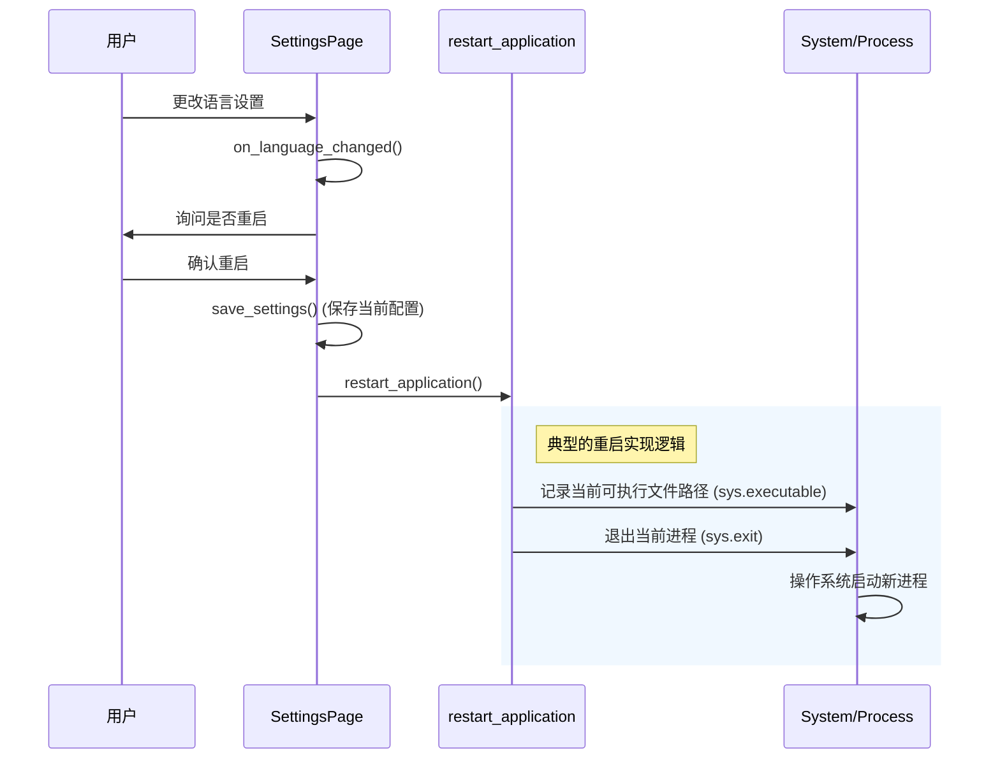

#### 带注释源码

由于 `restart_application` 定义在外部模块 `modules.utils.common_utils` 中，未在当前代码文件内直接定义。以下源码展示了它在 `SettingsPage` 中的调用逻辑 (`show_restart_dialog` 方法)。

```python
def show_restart_dialog(self, new_language):
    """显示重启对话框并在用户确认后重启应用。"""
    from modules.utils.common_utils import restart_application  # 从外部模块导入
    
    # 1. 询问用户是否重启
    response = self._ask_yes_no(
        self.tr("Restart Required"),
        self.tr("The application needs to restart for the language changes to take effect.\nRestart now?"),
        default_yes=True
    )
    
    if response:
        # 2. 在重启前保存用户的设置
        self.save_settings()
        
        # 3. 更新当前语言追踪状态
        self._current_language = new_language
        
        # 4. 调用外部函数重启应用
        # 该函数通常会执行 sys.exit 并重新运行 sys.executable
        restart_application()
    else:
        # 用户拒绝重启，回滚UI上的语言选择
        self._loading_settings = True  # 防止循环触发
        self.ui.lang_combo.setCurrentText(self._current_language)
        self._loading_settings = False
```


### `is_dataclass`

全局函数，用于检查给定的对象是否为 Python dataclass（数据类）实例。在 `SettingsPage.save_settings` 方法的 `process_group` 辅助函数中，用于判断配置组值是否需要进一步处理。

参数：
- `obj`：`Any`，待检查的对象。在代码中传入的是 `group_value`。

返回值：`bool`，如果对象是 dataclass 实例则返回 `True`，否则返回 `False`。

#### 流程图

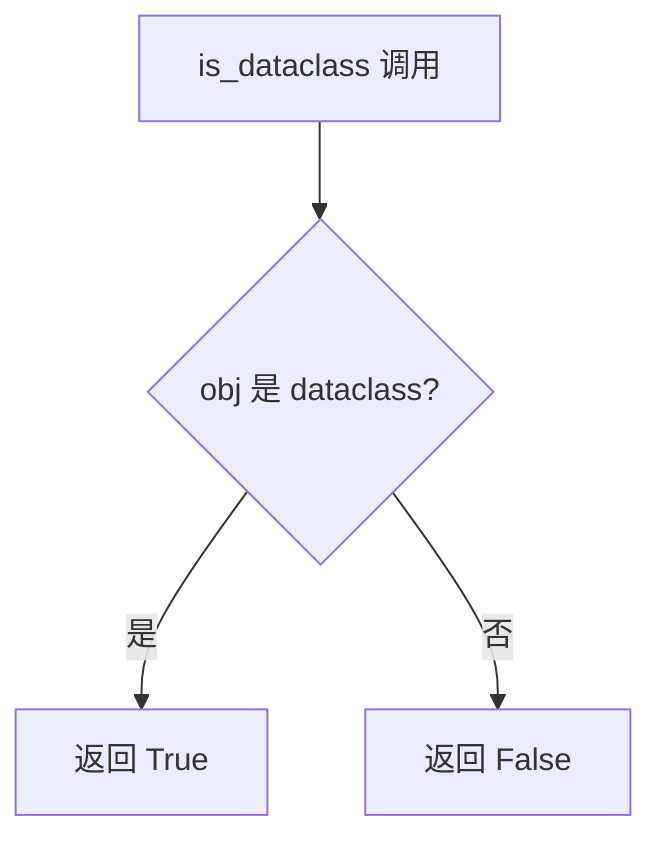

#### 带注释源码

```python
# SettingsPage.save_settings 方法中的 process_group 嵌套函数
def process_group(group_key, group_value, settings_obj: QSettings):
    """Helper function to process a group and its nested values."""
    # 检查 group_value 是否为 dataclass 实例
    if is_dataclass(group_value):
        # 如果是，则将其转换为字典以便 QSettings 处理
        group_value = asdict(group_value)
    # ... 其余处理逻辑
```

---

### `asdict`

全局函数，用于将 Python dataclass（数据类）实例递归转换为字典。在 `SettingsPage.save_settings` 方法的 `process_group` 辅助函数中，用于将配置对象序列化为字典，以便存储到 QSettings。

参数：
- `obj`：`dataclass`，要转换的 dataclass 实例。在代码中传入的是 `group_value`。

返回值：`dict`，包含 dataclass 所有字段及其值的字典，值也会被递归转换为字典（如果是嵌套 dataclass）。

#### 流程图

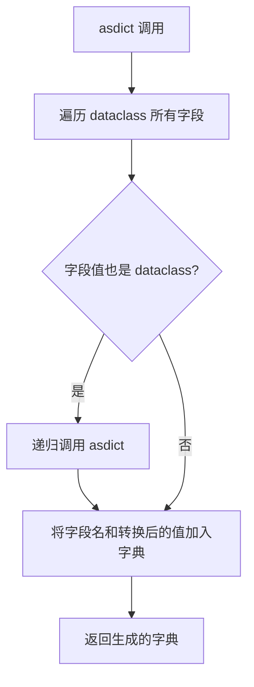

#### 带注释源码

```python
# SettingsPage.save_settings 方法中的 process_group 嵌套函数
def process_group(group_key, group_value, settings_obj: QSettings):
    """Helper function to process a group and its nested values."""
    # 先检查是否为 dataclass
    if is_dataclass(group_value):
        # 使用 asdict 将 dataclass 实例转换为字典
        # 这允许 QSettings 将复杂的配置对象存储为键值对
        group_value = asdict(group_value)
    
    # 接下来，如果 group_value 是字典，则递归处理其子项
    if isinstance(group_value, dict):
        settings_obj.beginGroup(group_key)
        for sub_key, sub_value in group_value.items():
            process_group(sub_key, sub_value, settings_obj)
        settings_obj.endGroup()
    else:
        # ... 直接存储非字典值
```


以下是从给定代码中提取的 Qt 核心组件（Signal, QSettings, QTimer, QUrl）的详细设计文档。这些组件在 `SettingsPage` 类及其相关功能中承担着关键角色。

---

### `Signal` (PySide6 QtCore)

**描述**：在 Qt 框架中，`Signal`（信号）用于在事件发生时通知其他组件。在 `SettingsPage` 类中，信号被定义为类属性，用于在内部状态改变（如主题变更、字体导入、登录状态改变）时向外部发射事件。

**参数**：
- `*args`: 可变参数，定义信号携带的参数类型（例如 `Signal(str)` 表示携带一个字符串参数）。

**返回值**：`Signal` 对象，该对象可调用 `emit` 方法发射信号。

#### 流程图

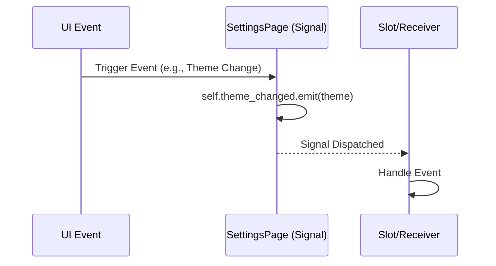

#### 带注释源码

```python
# 在类定义中声明信号
class SettingsPage(QtWidgets.QWidget):
    # 定义三个信号：主题改变、字体导入、登录状态改变
    theme_changed = Signal(str)
    font_imported = Signal(str)
    login_state_changed = Signal(bool)

    def on_theme_changed(self, theme: str):
        # 发射信号，通知监听者主题已更改
        self.theme_changed.emit(theme)
```

---

### `QSettings` (PySide6 QtCore)

**描述**：用于持久化存储应用程序的设置和用户偏好。它将数据存储在系统注册表（Windows）或配置文件中（Linux/macOS）。在代码中，`QSettings` 主要用于在 `save_settings` 和 `load_settings` 方法中读写应用配置和用户凭证。

**参数**：
- `organization`: `str`，公司或组织名称（代码中传入 `"ComicLabs"`）。
- `application`: `str`，应用程序名称（代码中传入 `"ComicTranslate"`）。

**返回值**：`QSettings` 实例，用于后续的 `setValue`, `value`, `beginGroup` 等操作。

#### 流程图

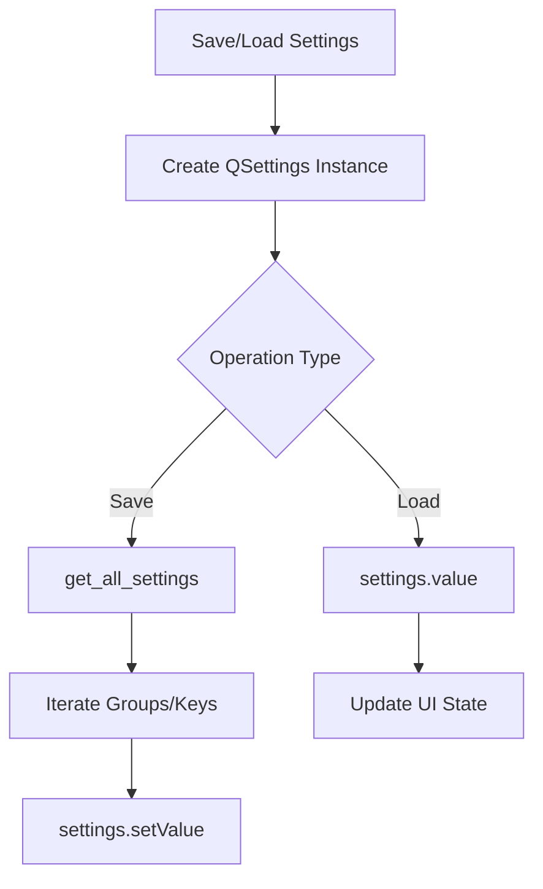

#### 带注释源码

```python
def save_settings(self):
    # 初始化 QSettings，指定组织名和应用名
    settings = QSettings("ComicLabs", "ComicTranslate")
    all_settings = self.get_all_settings()

    def process_group(group_key, group_value, settings_obj: QSettings):
        # 使用 beginGroup 和 endGroup 进行分层存储
        if isinstance(group_value, dict):
            settings_obj.beginGroup(group_key)
            for sub_key, sub_value in group_value.items():
                process_group(sub_key, sub_value, settings_obj)
            settings_obj.endGroup()
        else:
            # 写入键值对
            settings_obj.setValue(group_key, group_value)

    for key, value in all_settings.items():
        process_group(key, value, settings)
```

---

### `QTimer` (PySide6 QtCore)

**描述**：提供定时器功能，用于在指定的时间间隔后触发事件。在代码中，`_pricing_refresh_timer` 被用于在用户打开外部定价页面后，轮询后端以检查用户积分是否已更新。

**参数**：
- `parent`: `QObject`，父对象（通常为 `self`，即 `SettingsPage` 实例），用于管理定时器的生命周期。

**返回值**：`QTimer` 实例。

#### 流程图

```mermaid
flowchart TD
    A[Open Pricing Page] --> B[Start Pricing Refresh Timer]
    B --> C[Wait Interval (15s)]
    C --> D[timeout signal]
    D --> E[Poll Session/Credits]
    E --> F{Attempts < 20?}
    F -->|Yes| C
    F -->|No| G[Stop Timer]
```

#### 带注释源码

```python
def _start_pricing_refresh_watch(self):
    """Poll for updated credits after launching external checkout."""
    # 创建定时器实例，父对象为 self
    if self._pricing_refresh_timer is None:
        self._pricing_refresh_timer = QTimer(self)
        # 设置间隔为 15000 毫秒 (15秒)
        self._pricing_refresh_timer.setInterval(15000)
        # 连接 timeout 信号到轮询函数
        self._pricing_refresh_timer.timeout.connect(self._poll_pricing_refresh)

    self._pricing_refresh_attempts = 0
    self._pricing_refresh_baseline = self.user_credits
    # 启动定时器
    self._pricing_refresh_timer.start()
```

---

### `QUrl` (PySide6 QtCore)

**描述**：用于处理统一资源定位符（URL）。它提供了比普通字符串更安全的 URL 解析和操作功能。在代码中，`QUrl` 主要与 `QDesktopServices` 结合使用，以在系统默认浏览器中打开登录页面或定价页面。

**参数**：
- `url`: `str`，需要转换为 URL 对象的字符串。

**返回值**：`QUrl` 实例。

#### 流程图

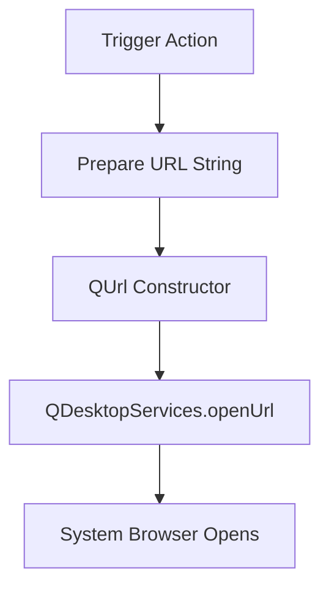

#### 带注释源码

```python
def show_login_view(self, url: str):
    """Opens the login URL in the system browser."""
    logger.info(f"Opening login URL in system browser: {url}")
    # 将字符串 URL 转换为 QUrl 对象
    QDesktopServices.openUrl(QUrl(url))

def open_pricing_page(self):
    # ...
    pricing_url = f"{FRONTEND_BASE_URL}/pricing/?source=desktop"
    # 使用 QUrl 打开外部链接
    if QtGui.QDesktopServices.openUrl(QUrl(pricing_url)):
        self._start_pricing_refresh_watch()
```


### `SettingsPage.__init__`

这是 `SettingsPage` 类的构造函数。它负责初始化设置页面的用户界面（UI）、核心业务逻辑组件（如认证客户端和更新检查器），并建立信号与槽的连接关系，同时设置布局和启动时的数据刷新逻辑。

参数：

-  `parent`：`Optional[QtWidgets.QWidget]`（可选），父级 widget 对象，默认为 None，用于建立 Qt 对象层级关系。

返回值：`None`，构造函数不返回值。

#### 流程图

```mermaid
graph TD
    A([Start __init__]) --> B[调用父类构造函数 super().__init__]
    B --> C[实例化 UI: self.ui = SettingsPageUI]
    C --> D[调用内部方法: _setup_connections]
    D --> E[初始化状态标志: _loading_settings, _is_background_check, _current_language]
    E --> F[初始化积分刷新定时器相关变量]
    F --> G[实例化认证客户端: AuthClient]
    G --> H[连接 AuthClient 的所有信号 (auth_success, auth_error 等)]
    H --> I[实例化更新检查器: UpdateChecker]
    I --> J[连接 UpdateChecker 的所有信号 (update_available, up_to_date 等)]
    J --> K[初始化用户信息变量: user_email, user_tier 等]
    K --> L[设置主布局: QVBoxLayout]
    L --> M[调用启动刷新积分方法: _refresh_credits_on_startup]
    M --> N([End __init__])
```

#### 带注释源码

```python
def __init__(self, parent=None):
    # 调用父类 QtWidgets.QWidget 的初始化方法
    super(SettingsPage, self).__init__(parent)

    # 1. 初始化用户界面 (UI)
    self.ui = SettingsPageUI(self)
    
    # 2. 连接 UI 控件的信号与页面的槽函数
    self._setup_connections()
    
    # 3. 初始化内部状态标志位
    self._loading_settings = False  # 标记当前是否正在加载设置（避免触发change事件）
    self._is_background_check = False  # 标记当前更新检查是否为后台模式
    self._current_language = None  # 记录当前语言以便回滚

    # 4. 初始化定价/积分刷新相关变量
    self._pricing_refresh_timer: Optional[QTimer] = None
    self._pricing_refresh_attempts: int = 0
    self._pricing_refresh_baseline: Optional[Any] = None
    
    # 5. 初始化认证客户端 (AuthClient) 并连接信号
    self.auth_client = AuthClient(API_BASE_URL, FRONTEND_BASE_URL)
    self.auth_client.auth_success.connect(self.handle_auth_success)
    self.auth_client.auth_error.connect(self.handle_auth_error)
    self.auth_client.auth_cancelled.connect(self.handle_auth_cancelled)
    self.auth_client.request_login_view.connect(self.show_login_view)
    self.auth_client.logout_success.connect(self.handle_logout_success)
    self.auth_client.session_check_finished.connect(self.handle_session_check_finished)

    # 6. 初始化更新检查器 (UpdateChecker) 并连接信号
    self.update_checker = UpdateChecker()
    self.update_checker.update_available.connect(self.on_update_available)
    self.update_checker.up_to_date.connect(self.on_up_to_date)
    self.update_checker.error_occurred.connect(self.on_update_error)
    self.update_checker.download_progress.connect(self.on_download_progress)
    self.update_checker.download_finished.connect(self.on_download_finished)
    
    # 初始化对话框引用
    self.update_dialog = None
    self.login_dialog = None

    # 7. 初始化用户数据存储变量
    self.user_email: Optional[str] = None
    self.user_tier: Optional[str] = None
    self.user_credits: Optional[Any] = None
    self.user_monthly_credits: Optional[int] = None

    # 8. 设置主布局
    # 使用 Settings UI；内部内容在右侧可滚动 (见 settings_ui.py)。
    # 这样可以保持左侧导航栏固定。
    layout = QtWidgets.QVBoxLayout()
    layout.addWidget(self.ui)
    layout.setContentsMargins(0, 0, 0, 0)
    self.setLayout(layout)
    
    # 9. 启动时尝试刷新积分
    self._refresh_credits_on_startup()
```


### `SettingsPage.load_settings`

该方法负责从系统持久化存储（QSettings）中读取应用程序的全局配置数据。它通过反向映射（`reverse_mappings`）将存储的英文配置值转换为本 UI 语言，并同步更新 SettingsPageUI 上所有相关的输入控件（如语言箱、主题箱、工具选择、导出选项、凭证等），同时初始化用户登录状态与会话检查。

参数：

- 该方法无显式输入参数。（隐含参数 `self` 为类实例本身）

返回值：

- `None`（无返回值）。该方法通过副作用（Side Effect）直接修改 UI 组件状态和内部变量。

#### 流程图

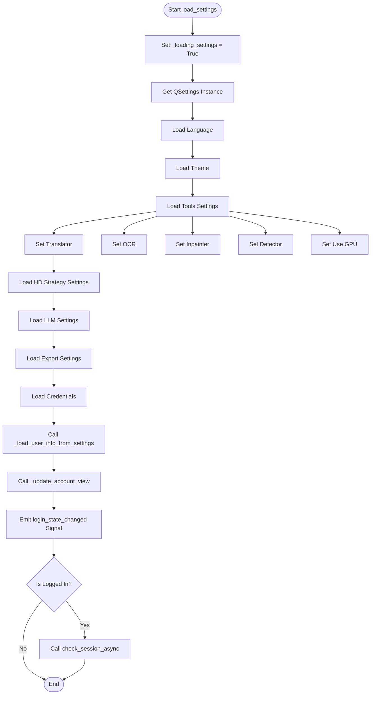

#### 带注释源码

```python
def load_settings(self):
    """
    从 QSettings 加载所有配置并更新 UI 控件状态。
    """
    # 1. 设置加载标志，防止在加载过程中 UI 变化触发自动保存或循环事件
    self._loading_settings = True
    settings = QSettings("ComicLabs", "ComicTranslate")

    # --- 2. 加载语言设置 ---
    # 读取存储的英文键 'English'，并反向映射为当前UI语言
    language = settings.value('language', 'English')
    translated_language = self.ui.reverse_mappings.get(language, language)
    self.ui.lang_combo.setCurrentText(translated_language)

    # --- 3. 加载主题设置 ---
    theme = settings.value('theme', 'Dark')
    translated_theme = self.ui.reverse_mappings.get(theme, theme)
    self.ui.theme_combo.setCurrentText(translated_theme)
    self.theme_changed.emit(translated_theme)

    # --- 4. 加载工具(Tools)设置 ---
    settings.beginGroup('tools')
    
    # 加载 Translator
    translator = settings.value('translator', 'Gemini-3.0-Flash')
    translated_translator = self.ui.reverse_mappings.get(translator, translator)
    if self.ui.translator_combo.findText(translated_translator) != -1:
        self.ui.translator_combo.setCurrentText(translated_translator)
    else:
        self.ui.translator_combo.setCurrentIndex(-1)

    # 加载 OCR
    ocr = settings.value('ocr', 'Default')
    translated_ocr = self.ui.reverse_mappings.get(ocr, ocr)
    if self.ui.ocr_combo.findText(translated_ocr) != -1:
        self.ui.ocr_combo.setCurrentText(translated_ocr)
    else:
        self.ui.ocr_combo.setCurrentIndex(-1)

    # 加载 Inpainter
    inpainter = settings.value('inpainter', 'AOT')
    translated_inpainter = self.ui.reverse_mappings.get(inpainter, inpainter)
    if self.ui.inpainter_combo.findText(translated_inpainter) != -1:
        self.ui.inpainter_combo.setCurrentText(translated_inpainter)
    else:
        self.ui.inpainter_combo.setCurrentIndex(-1)

    # 加载 Detector
    detector = settings.value('detector', 'RT-DETR-v2')
    translated_detector = self.ui.reverse_mappings.get(detector, detector)
    if self.ui.detector_combo.findText(translated_detector) != -1:
        self.ui.detector_combo.setCurrentText(translated_detector)
    else:
        self.ui.detector_combo.setCurrentIndex(-1)

    # 加载 GPU 设置 (需检查硬件是否支持)
    if is_gpu_available():
        self.ui.use_gpu_checkbox.setChecked(settings.value('use_gpu', False, type=bool))
    else:
         self.ui.use_gpu_checkbox.setChecked(False)

    # --- 5. 加载 HD Strategy 设置 ---
    settings.beginGroup('hd_strategy')
    strategy = settings.value('strategy', 'Resize')
    translated_strategy = self.ui.reverse_mappings.get(strategy, strategy)
    if self.ui.inpaint_strategy_combo.findText(translated_strategy) != -1:
        self.ui.inpaint_strategy_combo.setCurrentText(translated_strategy)
    else:
        self.ui.inpaint_strategy_combo.setCurrentIndex(0)

    # 根据策略类型加载对应的参数
    if strategy == 'Resize':
        self.ui.resize_spinbox.setValue(settings.value('resize_limit', 960, type=int))
    elif strategy == 'Crop':
        self.ui.crop_margin_spinbox.setValue(settings.value('crop_margin', 512, type=int))
        self.ui.crop_trigger_spinbox.setValue(settings.value('crop_trigger_size', 512, type=int))
    settings.endGroup() # hd_strategy
    settings.endGroup() # tools

    # --- 6. 加载 LLM 设置 ---
    settings.beginGroup('llm')
    self.ui.extra_context.setPlainText(settings.value('extra_context', ''))
    self.ui.image_checkbox.setChecked(settings.value('image_input_enabled', False, type=bool))
    settings.endGroup()

    # --- 7. 加载导出(Export)设置 ---
    settings.beginGroup('export')
    self.ui.auto_save_checkbox.setChecked(settings.value('auto_save', False, type=bool))
    self.ui.raw_text_checkbox.setChecked(settings.value('export_raw_text', False, type=bool))
    self.ui.translated_text_checkbox.setChecked(settings.value('export_translated_text', False, type=bool))
    self.ui.inpainted_image_checkbox.setChecked(settings.value('export_inpainted_image', False, type=bool))

    # 加载全局归档格式
    archive_save_as = settings.value('archive_save_as', 'zip')
    self.ui.archive_save_as_combo.setCurrentText(str(archive_save_as))
    settings.endGroup() # export

    # --- 8. 加载凭证(Credentials) ---
    settings.beginGroup('credentials')
    save_keys = settings.value('save_keys', False, type=bool)
    self.ui.save_keys_checkbox.setChecked(save_keys)
    if save_keys:
        for service in self.ui.credential_services:
            translated_service = self.ui.value_mappings.get(service, service)
            
            if translated_service == "Custom":
                # 加载自定义服务的 API Key, URL, Model
                self.ui.credential_widgets[f"{translated_service}_api_key"].setText(settings.value(f"{translated_service}_api_key", ''))
                self.ui.credential_widgets[f"{translated_service}_api_url"].setText(settings.value(f"{translated_service}_api_url", ''))
                self.ui.credential_widgets[f"{translated_service}_model"].setText(settings.value(f"{translated_service}_model", ''))
    settings.endGroup()

    # --- 9. 加载用户信息与账户视图 ---
    self._load_user_info_from_settings()
    self._update_account_view()
    
    # 发出初始登录状态信号
    self.login_state_changed.emit(self.is_logged_in())

    # 如果已登录，检查会话有效性
    if self.is_logged_in():
        self.auth_client.check_session_async()

    # --- 10. 初始化语言追踪与结束 ---
    # 记录当前语言以便切换语言时进行回滚比较
    self._current_language = self.ui.lang_combo.currentText()
    self._loading_settings = False
```


### `SettingsPage.save_settings`

**描述**：该方法负责将当前UI界面上的所有配置项（包括主题、语言、工具选择、导出设置等）收集起来，**利用语言映射表（value_mappings）将UI显示的本地化文本转换为英文键值进行存储**，以确保配置文件的兼容性。同时，该方法还处理用户凭据（API Keys）的加密或明文保存逻辑。

参数：
-  无（该方法仅操作类实例属性 `self`）

返回值：
-  `None` (无返回值)

#### 流程图

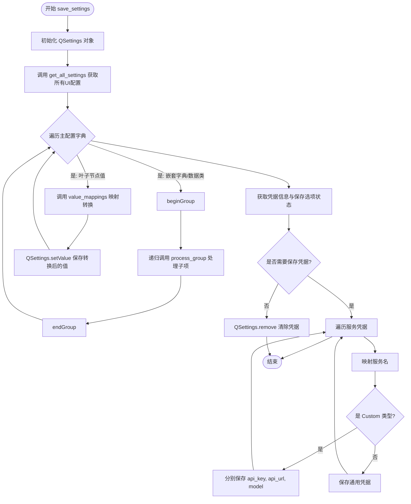

#### 带注释源码

```python
def save_settings(self):
    # 1. 初始化 QSettings，设置组织名为 "ComicLabs"，应用名为 "ComicTranslate"
    # 这将创建或打开系统注册表/配置文件
    settings = QSettings("ComicLabs", "ComicTranslate")
    
    # 2. 获取当前所有的UI设置（字典形式）
    all_settings = self.get_all_settings()

    def process_group(group_key, group_value, settings_obj: QSettings):
        """
        辅助递归函数：处理设置组。
        核心逻辑：如果值是字典（组），则递归进入；如果是叶子值，则进行语言映射转换。
        """
        # 如果是 Dataclass (数据类)，先转换为字典
        if is_dataclass(group_value):
            group_value = asdict(group_value)
            
        # 判断是否为字典（嵌套组）
        if isinstance(group_value, dict):
            settings_obj.beginGroup(group_key) # 开始写入组，如 [tools]
            for sub_key, sub_value in group_value.items():
                # 递归处理子项
                process_group(sub_key, sub_value, settings_obj)
            settings_obj.endGroup() # 结束当前组
        else:
            # --- 关键步骤：语言映射转换 ---
            # UI 上显示的可能是中文或英文，这里使用映射表将其转换为
            # 标准的英文键值进行存储，以便下次无论切换什么语言都能正确加载
            mapped_value = self.ui.value_mappings.get(group_value, group_value)
            settings_obj.setValue(group_key, mapped_value)

    # 3. 遍历并保存主配置项 (language, theme, tools, llm, etc.)
    for key, value in all_settings.items():
        process_group(key, value, settings)

    # 4. 单独处理凭据 (Credentials)
    # 获取所有服务的凭据信息
    credentials = self.get_credentials()
    # 获取用户是否勾选了"保存密匙"
    save_keys = self.ui.save_keys_checkbox.isChecked()
    
    # 进入凭据组 [credentials]
    settings.beginGroup('credentials')
    settings.setValue('save_keys', save_keys) # 先保存用户的选择
    
    if save_keys:
        # 如果用户选择保存凭据
        for service, cred in credentials.items():
            # 将服务显示名映射回英文标识符（如 'Google Translate' -> 'Google'）
            translated_service = self.ui.value_mappings.get(service, service)
            
            if translated_service == "Custom":
                # 针对自定义API类型的特殊处理，保存多个字段
                settings.setValue(f"{translated_service}_api_key", cred['api_key'])
                settings.setValue(f"{translated_service}_api_url", cred['api_url'])
                settings.setValue(f"{translated_service}_model", cred['model'])
            else:
                # 保存其他服务的标准凭据
                # (此处代码略，通常只保存 api_key)
                pass
    else:
        # 如果用户未选择保存，清除所有旧的凭据以保证安全
        settings.remove('credentials') 
    
    settings.endGroup() # 结束凭据组
```


### `SettingsPage.get_all_settings`

该方法作为配置数据的聚合中心，一次性收集并组装应用的所有运行时设置，包括语言、主题、工具选择、LLM 参数、导出偏好、凭据信息以及当前用户的状态信息，并返回一个结构化的字典对象供保存或传递使用。

参数： 无

返回值： `dict`，返回一个包含应用所有配置项的字典，键名包括 `language`, `theme`, `tools`, `llm`, `export`, `credentials`, `save_keys`, `user_info`。

#### 流程图

```mermaid
flowchart TD
    Start([开始获取所有配置]) --> Language[获取语言设置<br>self.get_language()]
    Start --> Theme[获取主题设置<br>self.get_theme()]
    Start --> Tools[获取工具与设备设置]
    
    subgraph Tools [Tools 子集]
        Translator[获取翻译器选择<br>get_tool_selection]
        Ocr[获取 OCR 引擎选择]
        Detector[获取检测器选择]
        Inpainter[获取修复器选择]
        Gpu[检查 GPU 是否启用<br>is_gpu_enabled]
        HdStrat[获取 HD 策略设置]
    end
    
    Start --> Llm[获取 LLM 设置<br>get_llm_settings]
    Start --> Export[获取导出设置<br>get_export_settings]
    Start --> Creds[获取凭据信息<br>get_credentials]
    Start --> SaveKeys[获取保存密钥复选框状态]
    Start --> UserInfo[获取用户信息<br>get_user_info]
    
    Language --> Combine[组装配置字典]
    Theme --> Combine
    Tools --> Combine
    Llm --> Combine
    Export --> Combine
    Creds --> Combine
    SaveKeys --> Combine
    UserInfo --> Combine
    
    Combine --> End([返回配置字典])
```

#### 带注释源码

```python
def get_all_settings(self):
    """
    收集并返回当前应用程序的所有配置设置。
    这是一个核心的数据聚合方法，将分散在各个UI组件和子方法中的配置
    整合成一个统一的字典结构。

    返回:
        dict: 包含所有配置信息的字典。
    """
    return {
        # 1. 获取基础 UI 设置
        'language': self.get_language(),    # 调用方法获取当前选择的语言
        'theme': self.get_theme(),          # 调用方法获取当前选择的主题

        # 2. 获取工具相关的复杂配置
        'tools': {
            'translator': self.get_tool_selection('translator'), # 翻译工具
            'ocr': self.get_tool_selection('ocr'),                 # OCR 工具
            'detector': self.get_tool_selection('detector'),       # 检测工具
            'inpainter': self.get_tool_selection('inpainter'),     # 修复工具
            'use_gpu': self.is_gpu_enabled(),                      # GPU 加速状态
            'hd_strategy': self.get_hd_strategy_settings()         # 高清策略参数
        },

        # 3. 获取 LLM (大语言模型) 相关设置
        'llm': self.get_llm_settings(),

        # 4. 获取导出设置
        'export': self.get_export_settings(),

        # 5. 获取服务凭据 (可能包含敏感信息)
        'credentials': self.get_credentials(),

        # 6. 获取全局保存选项
        'save_keys': self.ui.save_keys_checkbox.isChecked(), # 检查"保存密钥"复选框状态

        # 7. 获取当前用户状态信息
        'user_info': self.get_user_info()
    }
```


### `SettingsPage.import_font`

该函数负责将用户选择的字体文件导入到应用程序中。它首先过滤出合法的字体文件类型，然后确保用户字体目录存在，接着复制文件到该目录，重新扫描目录中的所有字体将其注册到 Qt 字体数据库，并最终通过信号通知界面更新。

参数：

- `file_paths`：`list[str]`，需要导入的字体文件路径列表（通常来自文件选择对话框）。

返回值：`None`，无返回值。主要通过副作用（文件写入）和信号 `font_imported` 通知界面已完成导入。

#### 流程图

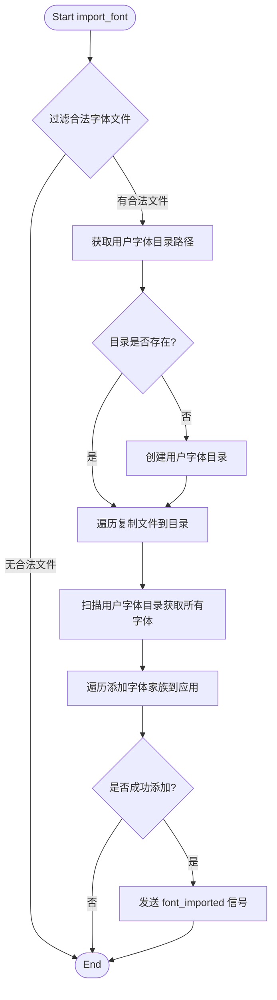

#### 带注释源码

```python
def import_font(self, file_paths: list[str]):
    # 1. 过滤传入的路径列表，只保留支持的字体格式 (TTF, TTC, OTF, WOFF, WOFF2)
    file_paths = [f for f in file_paths 
                  if f.lower().endswith((".ttf", ".ttc", ".otf", ".woff", ".woff2"))]
    
    # 2. 确定用户字体存放目录 (通常在用户数据目录下)
    user_font_dir = os.path.join(get_user_data_dir(), "fonts")

    # 3. 如果目录不存在，则创建它
    if not os.path.exists(user_font_dir):
        os.makedirs(user_font_dir, exist_ok=True)

    # 4. 如果有合法的文件需要导入
    if file_paths:
        # 遍历所有合法文件路径
        for file in file_paths:
            # 将文件复制到用户字体目录
            shutil.copy(file, user_font_dir)
            
        # 5. 重新加载字体：扫描整个用户字体目录 (注意：此处逻辑会重新加载目录中所有文件，不仅是新增的)
        font_files = [os.path.join(user_font_dir, f) for f in os.listdir(user_font_dir) 
                      if f.lower().endswith((".ttf", ".ttc", ".otf", ".woff", ".woff2"))]
        
        font_families = []
        # 遍历目录中的每一个字体文件并注册到 Qt 应用
        for font in font_files:
            font_family = self.add_font_family(font)
            font_families.append(font_family)
        
        # 6. 如果成功导入了字体，发送信号通知 UI
        # 注意：这里发射的是第一个导入的字体家族名称
        if font_families:
            self.font_imported.emit(font_families[0])
```


### `SettingsPage.get_credentials`

该方法负责从UI界面中提取用户的API凭证信息。它支持两种调用模式：1. **指定服务模式**：根据传入的服务名称（`service`），获取该特定服务的凭证（如API Key、URL、模型等）。2. **全量获取模式**：当未指定服务时，递归遍历所有已注册的服务，获取完整的凭证映射表。

#### 参数

- `service`：`str`，可选。要获取凭证的服务标识符（如 "Google", "OpenAI", "Custom"）。如果为空字符串，则表示获取所有服务的凭证。

#### 返回值

- `dict`：包含凭证信息的字典。
    - **单服务模式**：返回 `{'save_key': bool, 'api_key': str|None, 'api_url': str|None, 'model': str|None}`。其中 `api_key` 等字段仅在服务类型为 "Custom" 时存在。
    - **全量模式**：返回 `{'服务A': {...}, '服务B': {...}}` 的嵌套字典结构。

#### 流程图

```mermaid
flowchart TD
    A([开始 get_credentials]) --> B[获取全局 save_keys 状态]
    B --> C{service 参数是否为空?}
    
    C -- 是 (获取所有服务) --> D[遍历 credential_services 列表]
    D --> E[递归调用 self.get_credentials(service)]
    E --> F[构建结果字典]
    F --> G([返回 {service: creds}])
    
    C -- 否 (指定服务) --> H[标准化服务名称]
    H --> I[构建基础 creds 字典]
    I --> J{服务是否为 'Custom'?}
    
    J -- 是 --> K[循环获取 api_key, api_url, model]
    K --> L([返回单服务凭证字典])
    
    J -- 否 --> L
```

#### 带注释源码

```python
def get_credentials(self, service: str = ""):
    """
    获取指定服务或所有服务的凭证。
    
    Args:
        service (str): 服务名称。如果为空，则返回所有服务的凭证。
    
    Returns:
        dict: 凭证字典。
    """
    # 1. 获取全局的 "Save Keys" 复选框状态
    save_keys = self.ui.save_keys_checkbox.isChecked()

    # 定义内部辅助函数：安全获取 UI 控件文本
    def _text_or_none(widget_key):
        # 从 UI 的控件字典中获取控件对象
        w = self.ui.credential_widgets.get(widget_key)
        # 如果控件存在则返回文本，否则返回 None
        return w.text() if w is not None else None

    # 2. 判断调用模式：单服务查询 vs 全量查询
    if service:
        # --- [单服务模式] ---
        
        # 标准化服务名称（例如将显示名映射回内部键）
        normalized = self.ui.value_mappings.get(service, service)
        
        # 初始化结果，包含全局的 save_keys 状态
        creds = {'save_key': save_keys}
        
        # 针对自定义服务 (Custom) 进行特殊处理
        if normalized == "Custom":
            # 遍历自定义所需的字段：api_key, api_url, model
            for field in ("api_key", "api_url", "model"):
                # 从 UI 控件中读取对应的值 (Key 格式: "Custom_api_key")
                creds[field] = _text_or_none(f"Custom_{field}")

        return creds

    else:
        # --- [全量模式] ---
        
        # 如果没有指定服务，则递归调用自身，遍历所有已知服务
        # self.ui.credential_services 应为包含所有服务名的列表
        return {s: self.get_credentials(s) for s in self.ui.credential_services}
```

#### 潜在优化或设计细节

1.  **递归调用开销**：在获取所有凭证时（`service`为空），该方法使用了字典推导式对 `credential_services` 中的每一项进行了递归调用。虽然逻辑清晰，但如果服务数量非常多，可能会产生多次 UI 查询。建议在保存设置（`save_settings`）的上下文中直接构建全量字典，而不是依赖递归，以减少函数调用栈深度。
2.  **UI 耦合度**：该方法强依赖于 `self.ui` 对象及其内部数据结构（`credential_widgets`, `value_mappings`），导致 `SettingsPage` 类与 UI 耦合紧密。如果未来 UI 结构变化，此方法需要大幅修改。建议考虑将凭证的读取逻辑抽象到 UI 层或数据转换层（类似于 Data Mapper 模式）。


### `SettingsPage.start_sign_in`

描述：这是认证流程的入口方法。当用户点击界面上的“登录（Sign In）”按钮时触发。该方法负责将界面上的登录按钮切换为“取消（Cancel）”模式，连接新的点击事件到取消方法，并尝试启动认证客户端的认证流程。如果启动过程中发生异常，则捕获异常并调用错误处理逻辑，同时重置界面状态。

参数：
-  `{参数名称}`：`{参数类型}`，{参数描述}
-  (无参数，仅包含隐含的 `self`)

返回值：`None`，无返回值（该方法执行副作用，不返回数据）

#### 流程图

```mermaid
flowchart TD
    A[用户点击 Sign In 按钮] --> B[记录日志: Sign In button clicked]
    B --> C[修改按钮文本为 'Cancel']
    C --> D[断开 start_sign_in 连接]
    D --> E[连接 cancel_sign_in 到按钮点击事件]
    E --> F{尝试启动认证流程}
    F -->|成功| G[等待认证结果 (信号/槽)]
    F -->|异常| H[捕获异常]
    H --> I[调用 handle_auth_error]
    I --> J[重置按钮状态]
```

#### 带注释源码

```python
def start_sign_in(self):
    """Initiates the authentication flow."""
    # 记录用户点击登录按钮的操作
    logger.info("Sign In button clicked.")
    
    # 1. UI 交互：将按钮文本改为 "Cancel"，提示用户可以取消操作
    self.ui.sign_in_button.setText(self.tr("Cancel"))
    
    # 2. 解除当前按钮与 start_sign_in 的连接，避免重复触发
    self.ui.sign_in_button.clicked.disconnect()
    
    # 3. 重新连接按钮事件到 cancel_sign_in 方法
    self.ui.sign_in_button.clicked.connect(self.cancel_sign_in)
    
    try:
        # 4. 调用认证客户端开始认证流程
        self.auth_client.start_auth_flow()
    except Exception as e:
        # 5. 异常处理：如果启动失败，记录错误并处理错误
        logger.error(f"Error starting auth flow: {e}", exc_info=True)
        self.handle_auth_error(self.tr("Failed to initiate sign-in process."))
        # handle_auth_error 内部会调用 _on_auth_flow_ended() 重置按钮
```

---

### `SettingsPage.cancel_sign_in`

描述：用于取消正在进行的认证流程。当用户点击“取消（Cancel）”按钮时触发。该方法通知认证客户端中止当前的认证请求。值得注意的是，界面的重置操作（例如将按钮文字改回“Sign In”）并非在此方法中直接完成，而是通过监听认证客户端发出的 `auth_cancelled` 信号，由 `handle_auth_cancelled` -> `_on_auth_flow_ended` 链路异步完成。

参数：
-  `{参数名称}`：`{参数类型}`，{参数描述}
-  (无参数，仅包含隐含的 `self`)

返回值：`None`，无返回值

#### 流程图

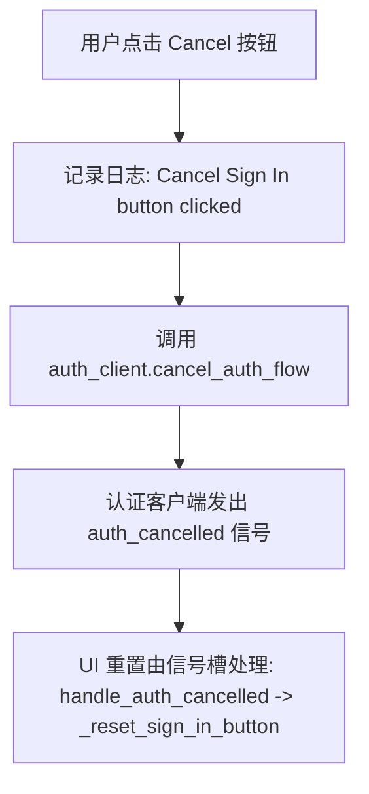

#### 带注释源码

```python
def cancel_sign_in(self):
    """Cancels the active authentication flow."""
    # 记录用户取消操作
    logger.info("Cancel Sign In button clicked.")
    
    # 通知 AuthClient 取消流程
    self.auth_client.cancel_auth_flow()
    
    # 注意：按钮的文本重置和信号重连不是在这里同步进行的。
    # 而是依赖于 AuthClient 发出 auth_cancelled 信号，
    # 最终调用 handle_auth_cancelled() -> _on_auth_flow_ended() 来清理 UI 状态。
```


### `SettingsPage.handle_auth_success`

处理认证流程成功的槽函数。当用户成功通过身份验证后，此方法负责提取用户数据，更新本地状态，持久化用户信息到本地设置，并通知UI刷新登录状态。

参数：

- `user_info`：`dict`，包含用户身份验证成功后的返回数据，通常包含 email（邮箱）、tier（等级）、credits（积分）、monthly_credits（每月积分）等键值对。

返回值：`None`，无返回值（此类槽函数通常用于执行副作用，不返回数据）。

#### 流程图

```mermaid
graph TD
    A([Start: handle_auth_success]) --> B[调用 _on_auth_flow_ended]
    B --> C[从 user_info 提取数据]
    C --> D[更新内部状态: user_email, user_tier, user_credits]
    D --> E{是否在监控定价刷新?}
    E -->|是| F{积分是否变化?}
    F -->|是| G[停止定价刷新计时器]
    F -->|否| H[保存用户信息到 QSettings]
    E -->|否| H
    G --> H
    H --> I[调用 _update_account_view]
    I --> J[发射信号: login_state_changed.emit(True)]
    J --> K([End])
```

#### 带注释源码

```python
def handle_auth_success(self, user_info: dict):
    """处理成功的 authentication。"""
    # logger.info(f"Authentication successful. User info received: {user_info}")
    
    # 1. 清理认证流程结束后的UI状态（如重置登录按钮）
    self._on_auth_flow_ended()
    
    logger.debug("Auth success: Flow completed.")

    # 2. 存储用户信息到本地变量
    self.user_email = user_info.get('email')
    self.user_tier = user_info.get('tier')
    self.user_credits = user_info.get('credits')
    self.user_monthly_credits = user_info.get('monthly_credits')
    
    # 3. 如果正在监听定价页刷新（即刚购买完积分），检查积分是否已更新，若已更新则停止轮询
    if self._pricing_refresh_baseline is not None and self.user_credits != self._pricing_refresh_baseline:
        self._stop_pricing_refresh_watch()
        self._pricing_refresh_baseline = None

    # 4. 持久化保存用户信息到 QSettings
    self._save_user_info_to_settings()

    # 5. 更新账户页面的UI显示（显示用户邮箱、积分等）
    self._update_account_view()

    # 6. 发射登录状态变更信号，通知其他组件（如主窗口）
    self.login_state_changed.emit(True)

    # 可选：显示成功消息（代码中已注释）
    # if self.user_email: self._show_message_box(...)
```

---

### `SettingsPage.handle_auth_error`

处理认证过程中发生错误的槽函数。当认证失败（如网络错误、服务端拒绝）时，此方法记录错误日志，重置UI组件，并根据错误类型决定是否向用户显示错误提示。

参数：

- `error_message`：`str`，描述认证失败的具体原因的错误信息字符串。

返回值：`None`，无返回值。

#### 流程图

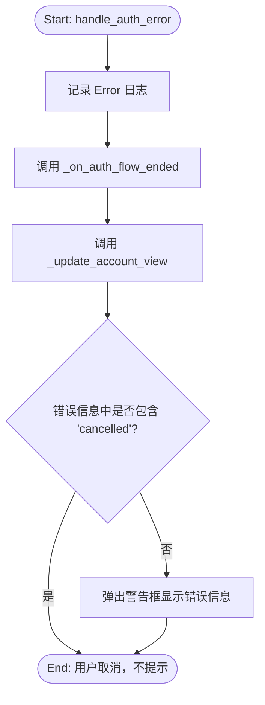

#### 带注释源码

```python
def handle_auth_error(self, error_message: str):
    """处理 authentication 错误。"""
    # REMOVED: if "cancelled by user" not in error_message:
    # 现在总是记录为错误
    logger.error(f"Authentication error: {error_message}")

    # 1. 执行通用的认证流程结束清理工作
    self._on_auth_flow_ended()

    # 2. 更新账户视图，处理显示/隐藏逻辑和按钮重置
    self._update_account_view()

    # 3. 向用户显示错误消息（除非是用户主动取消）
    if "cancelled" not in error_message.lower():
        self._show_message_box(
            QtWidgets.QMessageBox.Warning,
            self.tr("Sign In Error"),
            self.tr("Authentication failed: {error}").format(error=error_message)
        )
```

---

### `SettingsPage.handle_auth_cancelled`

处理认证流程被用户主动取消的槽函数。当用户在登录过程中关闭浏览器或登录窗口时，AuthClient 会发射此信号。该方法主要负责清理界面状态和记录日志。

参数：无显式参数（信号本身不携带负载数据，仅作为状态通知）。

返回值：`None`，无返回值。

#### 流程图

```mermaid
graph TD
    A([Start: handle_auth_cancelled]) --> B[记录 Info 日志: 用户取消]
    B --> C[调用 _on_auth_flow_ended]
    C --> D[调用 _update_account_view]
    D --> E([End])
```

#### 带注释源码

```python
def handle_auth_cancelled(self):
    """处理 auth flow 被用户取消的信号。"""
    logger.info("Authentication flow cancelled by user.")
    
    # 1. 重置登录按钮等UI状态
    self._on_auth_flow_ended()
    
    # 2. 刷新UI视图，确保显示未登录状态
    self._update_account_view()
```


### `SettingsPage.handle_logout_success`

该方法用于处理用户成功登出后的后续操作。当 `AuthClient` 发出登出成功信号时，此方法被调用，主要负责清理本地用户会话状态、停止后台的积分刷新轮询、更新账户页面的 UI 显示，并向应用其他部分广播登录状态已变更。

参数：
- `self`：`SettingsPage`，表示该方法属于 SettingsPage 类的实例。

返回值：`None`，该方法没有返回值（通常对应 Python 的 `None` 或 `void`）。

#### 流程图

```mermaid
flowchart TD
    A([Start: handle_logout_success]) --> B[Log: 'Logout successful']
    B --> C{_pricing_refresh_timer is active?}
    C -->|Yes| D[Stop Pricing Refresh Timer]
    C -->|No| E[Continue]
    D --> E
    E --> F[Reset _pricing_refresh_baseline to None]
    F --> G[Clear User Data: email, tier, credits, monthly_credits]
    G --> H[Call _update_account_view]
    H --> I[Reset UI: Sign Out Button (Enable + Text)]
    I --> J[Emit Signal: login_state_changed(False)]
    J --> K([End])
```

#### 带注释源码

```python
def handle_logout_success(self):
    """Handles successful logout completion from AuthClient."""
    # 1. 记录日志，表示后端确认登出成功
    logger.info("Logout successful.")
    
    # 2. 停止因打开定价页面而启动的积分刷新监视器（如果还在运行）
    self._stop_pricing_refresh_watch()
    
    # 3. 重置刷新基线数据
    self._pricing_refresh_baseline = None
    
    # 4. 清理本地存储的用户状态变量
    # Clear local state variables
    self.user_email = None
    self.user_tier = None
    self.user_credits = None
    self.user_monthly_credits = None

    # 5. 更新账户页面 UI，将其切换为“已登出”状态（显示登录按钮等）
    # Update the Account page UI
    self._update_account_view()

    # 6. 确保登出按钮状态被重置（虽然在 _update_account_view 中可能会隐藏，但为保险起见重置状态）
    # Re-enable sign out button (it will be hidden by _update_account_view,
    # but good practice to reset state)
    self.ui.sign_out_button.setEnabled(True)
    self.ui.sign_out_button.setText(self.tr("Sign Out"))

    # 7. 发射登录状态变更信号，通知其他组件（如主窗口）用户已登出
    # Emit state change signal
    self.login_state_changed.emit(False)

    # 8. （可选）显示消息提示用户已成功退出
    # Optionally show message
    # QtWidgets.QMessageBox.information(self, self.tr("Signed Out"), self.tr("You have been signed out."))
```


### `SettingsPage.handle_session_check_finished`

该方法用于处理 `AuthClient` 发起的后台会话（Session）有效期检查的返回结果。当检查发现 Token 无效或刷新失败时，会提示用户并执行自动登出操作；若检查通过则仅记录日志。

参数：
- `is_valid`：`bool`，标识会话检查是否通过。`True` 表示会话有效，`False` 表示会话无效或已过期。

返回值：`None`，无返回值。

#### 流程图

```mermaid
graph TD
    A[开始: handle_session_check_finished] --> B{is_valid?}
    B -- True --> C[记录日志: Session check passed]
    C --> D[结束]
    B -- False --> E[记录警告: Session check failed]
    E --> F[弹出消息框: Session Expired]
    F --> G[调用 auth_client.logout]
    G --> D
```

#### 带注释源码

```python
def handle_session_check_finished(self, is_valid: bool):
    """Handles the result of the background session check."""
    if not is_valid:
        logger.warning("Session check failed (invalid token or refresh failed). Signing out.")
        
        # Alert the user about the expiration
        self._show_message_box(
            QtWidgets.QMessageBox.Icon.Warning,
            self.tr("Session Expired"),
            self.tr("Your session has expired. Please sign in again.")
        )

        # We can call logout directly. AuthClient.logout() emits logout_success,
        # which updates the UI via handle_logout_success.
        self.auth_client.logout()
    else:
        logger.info("Session check passed.")
```


### `SettingsPage.open_pricing_page`

此方法负责在用户点击“购买积分”（Buy Credits）按钮时触发。它首先检查用户是否已登录：如果未登录，则弹出提示框要求登录；如果已登录，则尝试使用系统默认浏览器打开定价页面，并在成功后启动后台轮询以监控积分更新。

参数：
-  `self`：隐式参数，`SettingsPage` 类的实例方法。

返回值：`None`，无返回值（Python 中的 `void`）。

#### 流程图

```mermaid
flowchart TD
    A([Start open_pricing_page]) --> B{Is User Logged In?}
    B -- No --> C[Show Info Message Box: Sign In Required]
    C --> D([End])
    B -- Yes --> E[Construct Pricing URL: {FRONTEND_BASE_URL}/pricing/?source=desktop]
    E --> F{Open URL via QDesktopServices}
    F -- Success --> G[Start _start_pricing_refresh_watch]
    G --> D
    F -- Fail --> H[Show Warning Message Box: Unable to Open Browser]
    H --> D
```

#### 带注释源码

```python
def open_pricing_page(self):
    """Open the pricing page in the system browser."""
    # 检查用户是否已登录
    if not self.is_logged_in():
        # 如果未登录，显示信息提示框，要求用户登录
        self._show_message_box(
            QtWidgets.QMessageBox.Information,
            self.tr("Sign In Required"),
            self.tr("Please sign in to purchase or manage credits.")
        )
        return
    
    # 构建定价页面 URL，添加 source 参数用于追踪
    pricing_url = f"{FRONTEND_BASE_URL}/pricing/?source=desktop"
    
    # 尝试在系统默认浏览器中打开 URL
    if QtGui.QDesktopServices.openUrl(QUrl(pricing_url)):
        # 如果成功打开，启动定价刷新监视器（用于轮询更新积分）
        self._start_pricing_refresh_watch()
    else:
        # 如果打开失败（例如没有默认浏览器），显示警告框并提供直接链接
        self._show_message_box(
            QtWidgets.QMessageBox.Warning,
            self.tr("Unable to Open Browser"),
            self.tr("Please open the pricing page in your browser: {url}").format(url=pricing_url)
        )
```


### `SettingsPage.check_for_updates`

该方法用于触发应用程序的更新检查逻辑。它根据传入的 `is_background` 参数区分是用户手动触发的检查还是程序后台自动触发的检查，并相应地更新界面状态（如禁用按钮、显示文本），随后调用 `UpdateChecker` 组件执行真正的版本比对操作。

参数：

- `is_background`：`bool`，默认为 `False`。标识当前检查的类型。如果为 `True`（后台检查），则不会修改 UI 元素；如果为 `False`（用户点击），则会禁用按钮并显示加载文本。

返回值：`None`，该方法无返回值，主要通过信号槽机制处理后续结果。

#### 流程图

```mermaid
flowchart TD
    A([开始 check_for_updates]) --> B{is_background?}
    B -- False (用户触发) --> C[更新UI: 禁用按钮, 显示 'Checking...']
    B -- True (后台触发) --> D[不更新UI, 保持静默]
    C --> E[调用 update_checker.check_for_updates]
    D --> E
    E --> F([等待信号: on_update_available / on_up_to_date / on_update_error])
```

#### 带注释源码

```python
def check_for_updates(self, is_background=False):
    """
    触发更新检查。
    
    参数:
        is_background (bool): 标识是否为后台自动检查。
                             如果为 False，则视为用户手动操作，需更新 UI 状态。
                             如果为 True，通常为应用启动时的静默检查。
    """
    # 1. 保存当前检查的上下文状态，供后续的信号处理函数（如 on_update_available）使用
    #    以决定是否弹出提示框或静默处理。
    self._is_background_check = is_background
    
    # 2. 如果不是后台检查（即用户主动点击），则更新界面以提供反馈
    if not is_background:
        # 禁用按钮，防止用户重复点击
        self.ui.check_update_button.setEnabled(False)
        # 修改按钮文本，提示用户正在检查
        self.ui.check_update_button.setText(self.tr("Checking..."))
        
    # 3. 委托给 UpdateChecker 实例执行实际的版本检查逻辑
    #    该操作是异步的，结果将通过信号传递回来 (update_available, up_to_date, error_occurred)
    self.update_checker.check_for_updates()
```


以下是针对代码中 `SettingsPage` 类的三个更新相关回调方法的详细设计文档。

### `SettingsPage.on_update_available`

**描述**：当 `UpdateChecker` 检测到有新版本可用时调用此方法。该方法负责显示一个对话框，告知用户新版本信息，并提供下载、忽略或稍后提醒的选项。

参数：

-  `version`：`str`，可用的新版本号（例如 "v1.2.0"）。
-  `release_url`：`str`，发布说明页面的 URL 地址。
-  `download_url`：`str`，安装包下载链接的 URL 地址。

返回值：`None`（无返回值，表示该方法执行副作用操作）。

#### 流程图

```mermaid
flowchart TD
    A[开始: 收到 update_available 信号] --> B{是否是后台检查?}
    B -- 是 --> C{版本是否已忽略?}
    C -- 是 --> D[结束]
    C -- 否 --> E[显示更新对话框]
    B -- 否 --> E
    E --> F{用户点击按钮?}
    F -- Download --> G[调用 start_download]
    G --> H[结束]
    F -- Skip This Version --> I[保存忽略版本设置]
    I --> H
    F -- No/Cancel --> H
```

#### 带注释源码

```python
def on_update_available(self, version, release_url, download_url):
    # 如果不是后台检查，恢复界面按钮状态
    if not self._is_background_check:
        self.ui.check_update_button.setEnabled(True)
        self.ui.check_update_button.setText(self.tr("Checking...")) # 实际上是重置为初始文本

    # 检查忽略的版本号（仅针对后台自动检查）
    settings = QSettings("ComicLabs", "ComicTranslate")
    ignored_version = settings.value("updates/ignored_version", "")
    
    # 如果是后台检查且版本被忽略，则直接跳过提示
    if self._is_background_check and version == ignored_version:
        return

    # 创建消息框
    msg_box = QtWidgets.QMessageBox(self)
    msg_box.setWindowTitle(self.tr("Update Available"))
    msg_box.setTextFormat(Qt.RichText)
    msg_box.setTextInteractionFlags(Qt.TextBrowserInteraction)
    # 显示版本号
    msg_box.setText(self.tr("A new version {version} is available.").format(version=version))
    
    # 添加发布说明的链接
    link_text = self.tr("Release Notes")
    msg_box.setInformativeText(f'<a href="{release_url}" style="color: #4da6ff;">{link_text}</a>')
    
    # 添加按钮：Yes (下载), No (拒绝)
    download_btn = msg_box.addButton(self.tr("Yes"), QtWidgets.QMessageBox.ButtonRole.AcceptRole)
    cancel_btn = msg_box.addButton(self.tr("No"), QtWidgets.QMessageBox.ButtonRole.RejectRole)
    
    dotted_ask_btn = None
    # 如果是后台检查，额外提供“跳过此版本”选项
    if self._is_background_check:
        dotted_ask_btn = msg_box.addButton(self.tr("Skip This Version"), QtWidgets.QMessageBox.ButtonRole.ApplyRole)
    
    msg_box.setDefaultButton(download_btn)
    msg_box.exec()

    # 处理用户点击结果
    if msg_box.clickedButton() == download_btn:
        # 用户选择下载，启动下载流程
        self.start_download(download_url)
    elif dotted_ask_btn and msg_box.clickedButton() == dotted_ask_btn:
        # 用户选择忽略此版本，保存到设置中
        settings.setValue("updates/ignored_version", version)
```

---

### `SettingsPage.on_up_to_date`

**描述**：当 `UpdateChecker` 检测到当前版本已是最新时调用。此方法主要用于向用户展示一个非阻塞的提示信息，告知无需更新。

参数：无

返回值：`None`（无返回值）。

#### 流程图

```mermaid
flowchart TD
    A[开始: 收到 up_to_date 信号] --> B{是否是后台检查?}
    B -- 是 --> C[结束: 静默处理]
    B -- 否 --> D[恢复按钮状态]
    D --> E[显示信息框: "已是最新版本"]
    E --> F[结束]
```

#### 带注释源码

```python
def on_up_to_date(self):
    # 如果是后台检查触发的（例如开机检查），则不打扰用户，直接返回
    if self._is_background_check:
        return

    # 恢复 UI 按钮状态
    self.ui.check_update_button.setEnabled(True)
    self.ui.check_update_button.setText(self.tr("Check for Updates"))
    
    # 弹窗提示用户
    self._show_message_box(
        QtWidgets.QMessageBox.Icon.Information,
        self.tr("Up to Date"),
        self.tr("You are using the latest version.")
    )
```

---

### `SettingsPage.on_update_error`

**描述**：当 `UpdateChecker` 在检查或下载过程中发生错误时调用。该方法处理错误展示，如果是后台检查则仅记录日志，否则向用户显示警告对话框。

参数：

-  `message`：`str`，错误发生的具体原因或消息文本。

返回值：`None`（无返回值）。

#### 流程图

```mermaid
flowchart TD
    A[开始: 收到 error_occurred 信号] --> B{是否是后台检查?}
    B -- 是 --> C[记录错误日志]
    C --> D[结束]
    B -- 否 --> E[恢复按钮状态]
    E --> F{更新对话框是否打开?}
    F -- 是 --> G[关闭更新进度对话框]
    F -- 否 --> H[显示警告框]
    G --> H
    H --> I[结束]
```

#### 带注释源码

```python
def on_update_error(self, message):
    # 后台检查失败只记日志，不弹窗打扰用户
    if self._is_background_check:
        logger.error(f"Background update check failed: {message}")
        return

    # 恢复 UI 按钮状态
    self.ui.check_update_button.setEnabled(True)
    self.ui.check_update_button.setText(self.tr("Check for Updates"))
    
    # 如果有正在显示的下载进度条，关闭它
    if self.update_dialog:
         self.update_dialog.close()
    
    # 向用户展示具体的错误信息
    self._show_message_box(
        QtWidgets.QMessageBox.Icon.Warning,
        self.tr("Update Error"),
        message
    )
```


### `SettingsPage.shutdown`

这是一个资源清理方法，用于在应用程序退出或设置页面关闭时执行必要的清理操作。它确保后台任务（如定价刷新计时器、更新检查器、身份验证客户端）被正确停止，并关闭可能打开的登录对话框，从而防止资源泄漏或孤立进程。

参数：

-  `self`：`SettingsPage`，调用此方法的类实例本身。

返回值：`None`，此方法不返回任何值，仅执行副作用操作。

#### 流程图

```mermaid
flowchart TD
    A([开始 shutdown]) --> B{是否正在关闭?}
    B -- 是 --> C([直接返回])
    B -- 否 --> D[设置 _is_shutting_down 标志为 True]
    D --> E[停止定价刷新计时器 _stop_pricing_refresh_watch]
    E --> F[尝试关闭 update_checker]
    F --> G{是否成功关闭 update_checker?}
    G -- 失败 --> H[捕获异常并忽略]
    G -- 成功 --> I
    H --> I
    I[尝试关闭 auth_client]
    I --> J{是否有 auth_client?}
    J -- 是 --> K[调用 auth_client.shutdown]
    K --> L[捕获异常并忽略]
    J -- 否 --> M
    L --> M
    M{是否有 login_dialog?}
    M -- 是 --> N[尝试关闭 login_dialog]
    N --> O[捕获异常并忽略]
    M -- 否 --> P([结束])
    O --> P
    C --> P
```

#### 带注释源码

```python
def shutdown(self):
    """Cleanup resources before app exit."""
    # 检查是否已经处于关闭状态，防止重复执行清理逻辑
    if getattr(self, "_is_shutting_down", False):
        return
    # 设置标志位，标记清理流程已开始
    self._is_shutting_down = True

    # 1. 停止可能正在运行的定价刷新定时器
    self._stop_pricing_refresh_watch()

    # 2. 关闭更新检查器，停止任何正在进行的下载或检查线程
    try:
        self.update_checker.shutdown()
    except Exception:
        # 忽略关闭过程中的异常，确保清理流程继续
        pass

    # 3. 关闭认证客户端，断开网络连接并清理会话
    try:
        if self.auth_client:
            self.auth_client.shutdown()
    except Exception:
        pass

    # 4. 关闭可能存在的登录对话框，防止窗口关闭后残留
    dialog = getattr(self, "login_dialog", None)
    if dialog:
        try:
            dialog.close()
        except Exception:
            pass
```

## 关键组件


### 认证与会话管理 (Authentication & Session Management)

负责处理用户的登录、登出和会话验证流程。集成了 `AuthClient` 类来管理身份验证令牌、获取用户信息（邮箱、等级、积分），并在状态变更时发出信号更新 UI。

### 设置持久化与国际化 (Settings Persistence & I18n)

负责将应用程序的配置保存到本地系统（使用 `QSettings`）并从中加载。实现了值映射（Mapping）机制，以便在配置文件中保存英文键值（用于后端），而在 UI 上显示用户选择的语言，实现配置与界面的国际化分离。

### 工具与后端配置管理 (Tool & Backend Configuration)

聚合并管理各类后端服务的配置接口，包括翻译器 (Translator)、OCR、图像修复 (Inpainter)、目标检测 (Detector) 的选择，以及 GPU 加速、HD 策略和 LLM 上下文等高级选项的设置。

### 应用程序更新系统 (Application Update System)

集成了 `UpdateChecker` 组件，实现完整的软件更新生命周期。包括检查最新版本、显示更新提示、下载安装包、运行安装程序以及忽略特定版本的功能。

### 自定义字体导入系统 (Custom Font Import System)

处理用户导入的自定义字体文件。包含将字体文件复制到用户数据目录、验证字体格式以及使用 Qt 的 `QFontDatabase` 将新字体注册到应用程序中的逻辑。

### 积分与订阅监控 (Credit & Subscription Monitor)

管理外部购买流程。实现打开外部定价页面，并在用户购买后通过定时轮询 (Polling) 机制自动检查并刷新用户账户的积分余额。

### 账户视图 UI 状态管理 (Account View UI State Manager)

根据用户的登录状态动态控制账户页面的 UI 展示。在“已登录”状态下显示用户邮箱、等级和余额；在“未登录”状态下显示登录和注册按钮，并维护 UI 元素的一致性。

### 网络连通性检测 (Network Connectivity Check)

提供网络状态检测功能 (`_is_online`)，用于在启动时判断是否需要从服务器刷新用户积分或执行其他网络请求，避免在离线模式下产生无效的网络调用。


## 问题及建议


### 已知问题

-   **职责过重（God Class）**: `SettingsPage` 类（约650行）承担了过多的职责，包括UI交互、设置持久化、用户认证、版本检查、字体管理和外部链接处理。这违反了单一职责原则（SRP），导致代码难以维护和测试，任何UI或后端逻辑的变动都会涉及这个类。
-   **重复代码与高耦合**: `save_settings` 和 `load_settings` 方法中充满了重复的逻辑（如处理 `value_mappings`、处理嵌套的设置组）。新增或修改一个设置项需要在 `get_all_settings`、`save_settings` 和 `load_settings` 三处同时修改，极易引入bug。
-   **硬编码的配置键**: `QSettings` 的组织名（"ComicLabs"）和应用名（"ComicTranslate"）被硬编码在 `save_settings`、`load_settings` 以及 `_load_user_info_from_settings` 等多个方法中，缺乏统一管理。
-   **同步阻塞风险**: `_is_online` 方法使用同步 `socket` 连接（8.8.8.8）来检测网络，这可能会在应用启动时短暂阻塞UI线程，影响用户体验。
-   **死代码与逻辑不一致**: `self.login_dialog` 初始化为 `None` 并在 `closeEvent` 和 `shutdown` 中被引用（尝试关闭），但在 `__init__` 之后的流程中从未被真正实例化，看起来像是未完成的遗留代码。同时，`is_gpu_available()` 在 `is_gpu_enabled()` 和 `load_settings` 中被重复调用，可能造成不必要的性能开销（取决于其底层实现）。
-   **复杂的凭证逻辑**: `get_credentials` 方法使用了递归和复杂的嵌套逻辑来处理不同服务的凭证，虽然功能强大，但可读性较差，且 `save_settings` 中对凭证的保存逻辑与之对应，同样复杂难懂。

### 优化建议

-   **拆分重构**: 建议将 `SettingsPage` 拆分为更小的单元。例如，将“认证逻辑”提取到 `AuthManager`，将“设置加载/保存”逻辑提取到 `SettingsManager` 或使用配置类（Schema）进行声明式管理。`SettingsPage` 应仅专注于UI事件的转发。
-   **实现通用设置引擎**: 引入数据类（Dataclass）或 Pydantic 模型来定义所有设置项的结构。编写通用的序列化/反序列化逻辑，让 `save` 和 `load` 方法自动遍历这些模型，而不是手动编写映射代码，从根本上消除重复。
-   **统一配置常量**: 定义一个配置常量类或配置文件，集中管理 `QSettings` 的 Group 名称、 Organization 和 Application 名称，减少散落在各处的硬编码字符串。
-   **异步化与缓存**: 
    -   将 `_is_online` 的检查或 `_refresh_credits_on_startup` 的逻辑放入后台线程（QThread）或使用异步请求，避免阻塞主UI线程。
    -   对 `is_gpu_available()` 的结果进行缓存（Module-level caching），避免每次调用都重新检测硬件。
-   **清理与简化**: 
    -   移除未使用的 `self.login_dialog` 相关代码，或明确其用途并加以实现。
    -   简化 `get_credentials` 的逻辑，考虑使用更直接的配置映射表来替代复杂的递归查找。


## 其它


### 设计目标与约束

本模块旨在为桌面翻译应用提供集中化的配置管理界面，支持用户自定义主题、语言、各类工具（翻译、OCR、修复、检测）的选择，以及LLM和导出参数的配置。核心约束包括：UI必须在主线程响应所有操作，网络请求需异步执行以避免阻塞；凭证存储遵循最小权限原则，仅在用户明确授权时持久化敏感信息；支持多语言界面切换需重启生效。设计遵循Qt信号槽机制解耦业务逻辑，配置持久化采用QSettings确保跨平台兼容性。

### 错误处理与异常设计

网络相关异常通过AuthClient和UpdateChecker的信号机制传递，在SettingsPage中统一通过`_show_message_box`向用户展示。`handle_auth_error`捕获认证失败并记录日志，`on_update_error`处理更新检查异常，`_is_online`方法通过Socket连接测试网络可用性。关键方法如`save_settings`和`load_settings`使用try-except保护JSON序列化操作，字体加载失败时优雅降级为字体名称直接使用。所有外部调用均捕获Exception防止程序崩溃，登录状态变更通过信号机制通知订阅者。

### 数据流与状态机

本模块涉及三个主要状态机：**认证状态机**（未登录→认证中→已登录/认证失败/已取消），通过AuthClient的四个信号（auth_success/auth_error/auth_cancelled/logout_success）驱动；**设置加载状态机**（初始→加载中→就绪），通过`_loading_settings`标志阻止语言变更触发重启对话框；**更新检查状态机**（空闲→检查中→下载中→完成），通过`_is_background_check`区分前台/后台操作。数据流方向：用户输入→UI控件→get_*方法聚合→save_settings写入QSettings→重启生效；反向流程：load_settings从QSettings读取→反向映射（英文键值转UI语言）→UI控件更新。

### 外部依赖与接口契约

核心依赖包括：PySide6.QtWidgets/QtCore/QtGui提供UI和信号系统；AuthClient封装OAuth2认证流程，需实现start_auth_flow()、check_session_async()、logout()等方法；UpdateChecker提供update_available/up_to_date/error_occurred/download_progress/download_finished五个信号；QSettings("ComicLabs", "ComicTranslate")为配置持久化存储。外部系统依赖：FRONTEND_BASE_URL和API_BASE_URL定义的后端服务；8.8.8.8的53端口用于网络连通性检测；系统浏览器通过QDesktopServices.openUrl打开认证和定价页面。

### 安全性考虑

API密钥和凭证通过QSettings加密存储（平台依赖），仅在用户勾选"保存密钥"时持久化，注销时主动清除。认证令牌由AuthClient管理，session过期时自动触发登出流程。字体文件导入限制为TTF/TTC/OTF/WOFF/WOFF2格式，防止恶意代码注入。外部URL打开使用QDesktopServices而非直接调用系统命令，防止命令注入。敏感操作（注销、删除凭证）前需用户确认。

### 性能考虑

网络请求（认证、会话检查、更新检查）全部异步执行，不阻塞UI线程。字体导入使用后台复制和大文件分批处理，字体数据库仅在需要时加载。定价页面刷新轮询采用15秒间隔、最多20次尝试的限制。配置保存采用延迟写入策略，仅在用户明确操作时触发。UI更新使用Qt信号机制批量触发，避免频繁重绘。

### 国际化与本地化

所有用户可见字符串使用self.tr()包装，支持Qt Linguist动态翻译。语言变更通过重启应用生效，重启前保存当前设置到新语言环境。reverse_mappings和value_mappings双向映射表实现英文存储值与本地化显示值的转换。数字格式化（credits显示）支持千位分隔符和多语言复数形式。

### 配置持久化机制

采用QSettings分层存储策略：根级存储language/theme；tools组存储翻译器/OCR/检测器等选项；hd_strategy组存储修复策略及其参数；llm组存储额外上下文和图像输入开关；export组存储导出选项；credentials组在加密前提下存储API密钥。credentials采用单独分组以支持选择性清除。

### 用户交互流程

主要交互路径包括：主题/语言变更→触发对应信号→emit给主窗口应用样式；工具选择变更→实时保存到QSettings；登录流程：点击登录→按钮变取消→打开浏览器→用户授权→回调保存token→更新账户视图；购买credits：验证登录→打开定价页面→启动15秒轮询检测credits变更；更新检查：触发检查→显示进度对话框→下载完成后提示安装。

### 并发与线程模型

所有网络I/O由AuthClient和UpdateChecker在独立线程执行，通过Qt信号跨线程传递结果到主线程。QTimer轮询定价更新在主线程执行但设置15秒间隔避免过度消耗。UI更新操作必须在主线程执行，信号自动处理线程切换。字体文件复制操作在主线程执行（文件I/O较小），未来大文件可考虑移至后台线程。

### 配置版本迁移

当前版本配置结构包含version字段隐式管理（通过字段存在性判断）。未来架构设计应考虑在QSettings中增加schema_version字段，支持多版本间配置自动升级。load_settings方法需兼容旧版本缺失字段，设置默认值保证向后兼容。

    