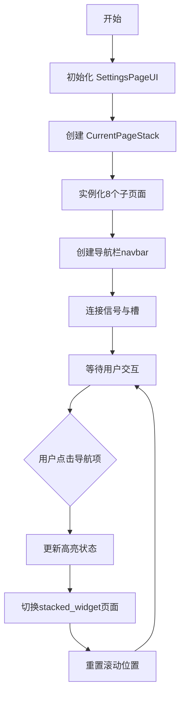
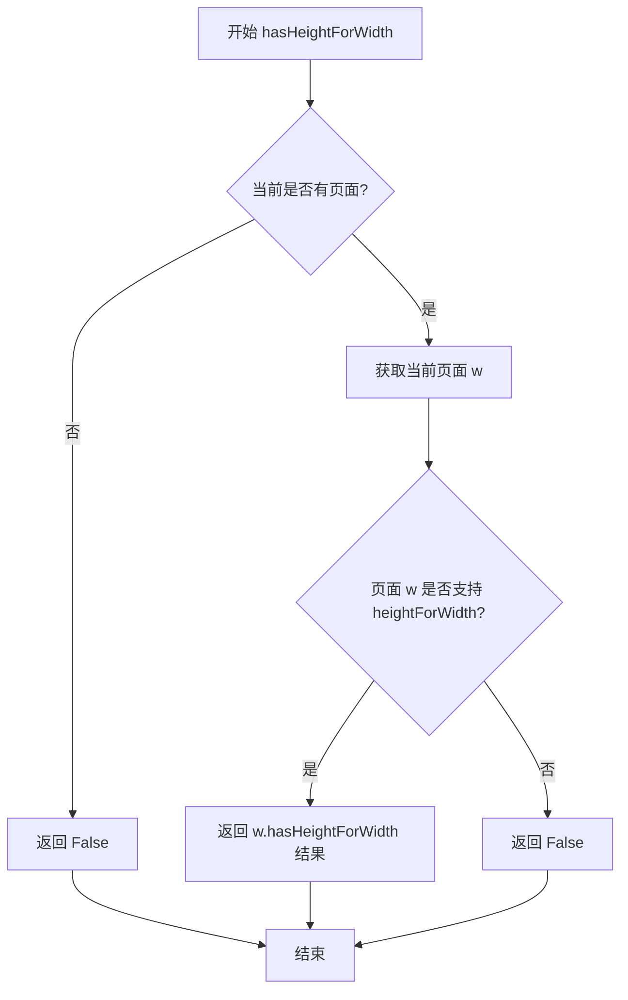
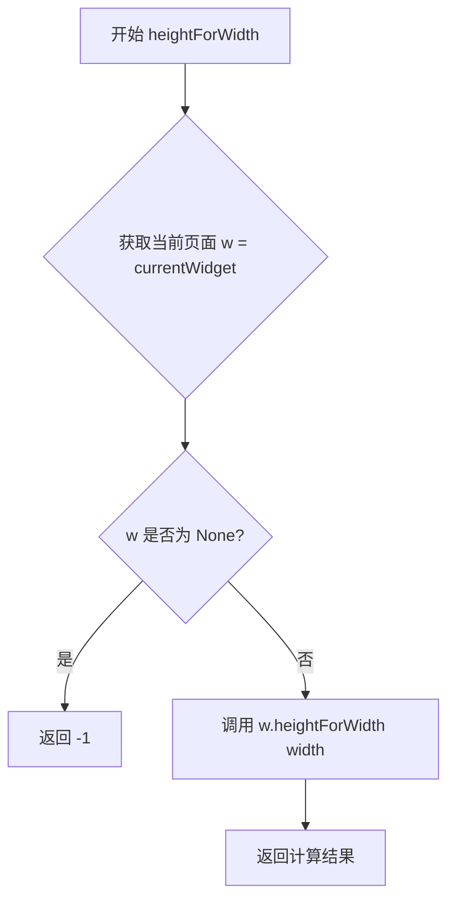
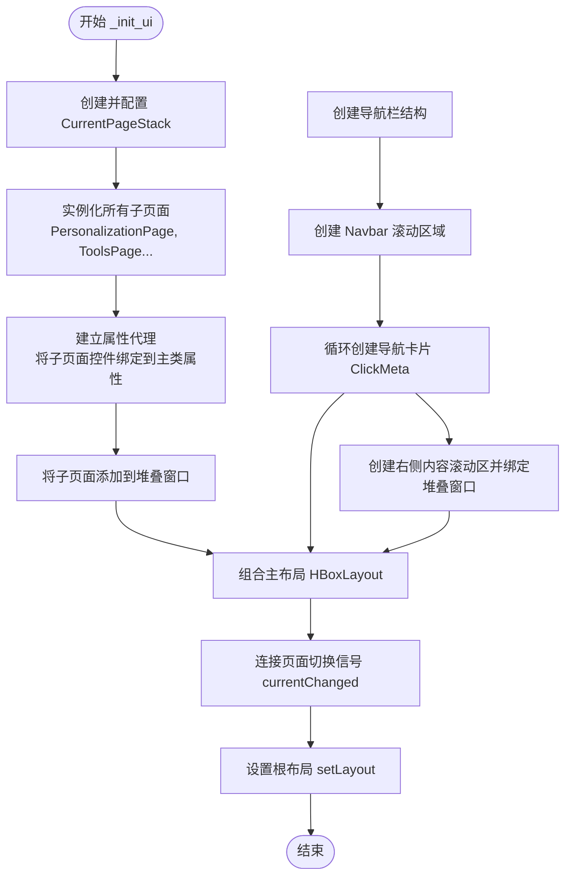
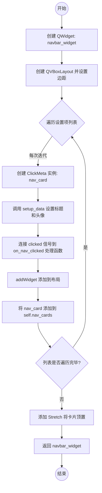
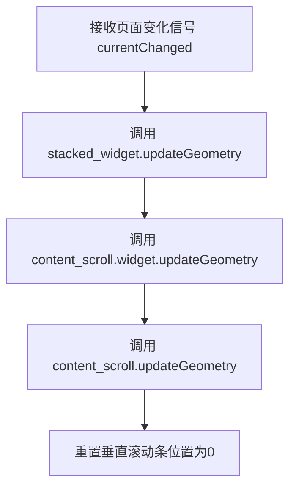

# `comic-translate\app\ui\settings\settings_ui.py` 详细设计文档

这是一个基于 PySide6 的设置页面管理模块，通过 QStackedWidget 实现多页面切换，集成个人化、工具、凭据、LLMs、文本渲染、导出、账户和关于等设置功能，并提供自定义的 CurrentPageStack 优化滚动区域的大小计算。

## 整体流程



## 类结构

```
QtWidgets.QWidget
├── CurrentPageStack (自定义QStackedWidget)
└── SettingsPageUI (主设置页面)
    ├── PersonalizationPage (个人化)
    ├── ToolsPage (工具)
    ├── CredentialsPage (凭据)
    ├── LlmsPage (LLMs)
    ├── TextRenderingPage (文本渲染)
    ├── ExportPage (导出)
    ├── AccountPage (账户)
    └── AboutPage (关于)
```

## 全局变量及字段


### `SettingsPageUI.credential_widgets`
    
Dictionary storing credential input widgets keyed by service name

类型：`dict`
    


### `SettingsPageUI.inpainters`
    
List of available inpainting model names (e.g., LaMa, AOT)

类型：`list`
    


### `SettingsPageUI.detectors`
    
List of available object detection model names (e.g., RT-DETR-v2)

类型：`list`
    


### `SettingsPageUI.ocr_engines`
    
List of available OCR engine options for text recognition

类型：`list`
    


### `SettingsPageUI.inpaint_strategy`
    
List of inpainting strategy options (Resize, Original, Crop)

类型：`list`
    


### `SettingsPageUI.themes`
    
List of available UI theme options (Dark, Light)

类型：`list`
    


### `SettingsPageUI.alignment`
    
List of text alignment options (Left, Center, Right)

类型：`list`
    


### `SettingsPageUI.credential_services`
    
List of credential service providers for API authentication

类型：`list`
    


### `SettingsPageUI.supported_translators`
    
List of supported translation service providers

类型：`list`
    


### `SettingsPageUI.languages`
    
List of supported interface languages

类型：`list`
    


### `SettingsPageUI.nav_cards`
    
List storing navigation card widgets for the settings sidebar

类型：`list`
    


### `SettingsPageUI.current_highlighted_nav`
    
Reference to currently highlighted navigation card

类型：`ClickMeta`
    


### `SettingsPageUI.value_mappings`
    
Dictionary mapping translated display names to internal configuration values

类型：`dict`
    


### `SettingsPageUI.reverse_mappings`
    
Dictionary mapping internal values back to display names for loading settings

类型：`dict`
    


### `SettingsPageUI.personalization_page`
    
Instance of the personalization settings page widget

类型：`PersonalizationPage`
    


### `SettingsPageUI.tools_page`
    
Instance of the tools configuration page widget

类型：`ToolsPage`
    


### `SettingsPageUI.credentials_page`
    
Instance of the credentials management page widget

类型：`CredentialsPage`
    


### `SettingsPageUI.llms_page`
    
Instance of the LLM settings page widget

类型：`LlmsPage`
    


### `SettingsPageUI.text_rendering_page`
    
Instance of the text rendering settings page widget

类型：`TextRenderingPage`
    


### `SettingsPageUI.export_page`
    
Instance of the export configuration page widget

类型：`ExportPage`
    


### `SettingsPageUI.account_page`
    
Instance of the account management page widget

类型：`AccountPage`
    


### `SettingsPageUI.about_page`
    
Instance of the about/application info page widget

类型：`AboutPage`
    


### `SettingsPageUI.lang_combo`
    
Language selection combo box (proxy to personalization_page)

类型：`QComboBox`
    


### `SettingsPageUI.theme_combo`
    
Theme selection combo box (proxy to personalization_page)

类型：`QComboBox`
    


### `SettingsPageUI.translator_combo`
    
Translation service selection combo box (proxy to tools_page)

类型：`QComboBox`
    


### `SettingsPageUI.ocr_combo`
    
OCR engine selection combo box (proxy to tools_page)

类型：`QComboBox`
    


### `SettingsPageUI.detector_combo`
    
Object detector selection combo box (proxy to tools_page)

类型：`QComboBox`
    


### `SettingsPageUI.inpainter_combo`
    
Inpainting model selection combo box (proxy to tools_page)

类型：`QComboBox`
    


### `SettingsPageUI.inpaint_strategy_combo`
    
Inpainting strategy selection combo box (proxy to tools_page)

类型：`QComboBox`
    


### `SettingsPageUI.resize_spinbox`
    
Image resize percentage spin box (proxy to tools_page)

类型：`QSpinBox`
    


### `SettingsPageUI.crop_margin_spinbox`
    
Crop margin setting spin box (proxy to tools_page)

类型：`QSpinBox`
    


### `SettingsPageUI.crop_trigger_spinbox`
    
Crop trigger threshold spin box (proxy to tools_page)

类型：`QSpinBox`
    


### `SettingsPageUI.use_gpu_checkbox`
    
GPU acceleration enable checkbox (proxy to tools_page)

类型：`QCheckBox`
    


### `SettingsPageUI.save_keys_checkbox`
    
Save API keys checkbox (proxy to credentials_page)

类型：`QCheckBox`
    


### `SettingsPageUI.image_checkbox`
    
Include images in LLM context checkbox (proxy to llms_page)

类型：`QCheckBox`
    


### `SettingsPageUI.extra_context`
    
Extra context text area for LLM prompts (proxy to llms_page)

类型：`QTextEdit`
    


### `SettingsPageUI.min_font_spinbox`
    
Minimum font size spin box (proxy to text_rendering_page)

类型：`QSpinBox`
    


### `SettingsPageUI.max_font_spinbox`
    
Maximum font size spin box (proxy to text_rendering_page)

类型：`QSpinBox`
    


### `SettingsPageUI.font_browser`
    
Font family selection combo box (proxy to text_rendering_page)

类型：`QFontComboBox`
    


### `SettingsPageUI.uppercase_checkbox`
    
Force uppercase text checkbox (proxy to text_rendering_page)

类型：`QCheckBox`
    


### `SettingsPageUI.auto_save_checkbox`
    
Enable auto-save checkbox (proxy to export_page)

类型：`QCheckBox`
    


### `SettingsPageUI.raw_text_checkbox`
    
Export raw text checkbox (proxy to export_page)

类型：`QCheckBox`
    


### `SettingsPageUI.translated_text_checkbox`
    
Export translated text checkbox (proxy to export_page)

类型：`QCheckBox`
    


### `SettingsPageUI.inpainted_image_checkbox`
    
Export inpainted images checkbox (proxy to export_page)

类型：`QCheckBox`
    


### `SettingsPageUI.archive_save_as_combo`
    
Archive save format combo box (proxy to export_page)

类型：`QComboBox`
    


### `SettingsPageUI.sign_in_button`
    
Sign in button (proxy to account_page)

类型：`QPushButton`
    


### `SettingsPageUI.sign_out_button`
    
Sign out button (proxy to account_page)

类型：`QPushButton`
    


### `SettingsPageUI.buy_credits_button`
    
Buy credits button (proxy to account_page)

类型：`QPushButton`
    


### `SettingsPageUI.email_value_label`
    
Display label for user email (proxy to account_page)

类型：`QLabel`
    


### `SettingsPageUI.tier_value_label`
    
Display label for account tier (proxy to account_page)

类型：`QLabel`
    


### `SettingsPageUI.credits_value_label`
    
Display label for remaining credits (proxy to account_page)

类型：`QLabel`
    


### `SettingsPageUI.logged_out_widget`
    
Widget shown when user is logged out (proxy to account_page)

类型：`QWidget`
    


### `SettingsPageUI.logged_in_widget`
    
Widget shown when user is logged in (proxy to account_page)

类型：`QWidget`
    


### `SettingsPageUI.check_update_button`
    
Check for updates button (proxy to about_page)

类型：`QPushButton`
    


### `SettingsPageUI.stacked_widget`
    
Stacked widget container for all settings pages

类型：`CurrentPageStack`
    


### `SettingsPageUI.content_scroll`
    
Scroll area containing the stacked settings pages

类型：`QScrollArea`
    
    

## 全局函数及方法


### `CurrentPageStack.sizeHint`

该方法重写了 `QStackedWidget` 的 `sizeHint`，用于根据当前显示的页面返回尺寸建议。当栈中有页面显示时，返回当前活动页面的尺寸提示；当没有页面时，回退到父类的默认实现。这确保了滚动区域仅根据当前可见页面计算大小，避免了因隐藏页面尺寸过大而在滚动视图中产生空白区域的问题。

参数： (无显式参数，`self` 为类实例本身)

返回值：`QtCore.QSize`，返回当前页面的尺寸提示对象，若无当前页面则返回父类默认尺寸提示。

#### 流程图

```mermaid
flowchart TD
    A([Start]) --> B{currentWidget is not None?}
    B -- Yes --> C[Return w.sizeHint]
    B -- No --> D[Return super().sizeHint]
    C --> E([End])
    D --> E
```

#### 带注释源码

```python
def sizeHint(self):
    """返回当前页面的尺寸建议。
    
    重写 QStackedWidget 的 sizeHint 方法，确保滚动区域
    仅使用当前活动页面的尺寸，而不是所有页面中最大的尺寸，
    从而避免出现多余的空白滚动区域。
    """
    # 获取当前正在显示的页面部件
    w = self.currentWidget()
    
    # 如果存在当前页面
    if w is not None:
        # 使用当前页面的尺寸提示，而不强制调整大小，
        # 以避免限制水平方向的扩展。
        return w.sizeHint()
    
    # 如果没有页面（例如栈为空），则调用父类的默认实现
    return super().sizeHint()
```


### `CurrentPageStack.minimumSizeHint`

该方法重写了 `QStackedWidget` 的默认尺寸提示逻辑。它获取当前显示的页面组件，并返回该页面组件的 `minimumSizeHint`。这确保了外层容器（如 Scroll Area）只会根据当前活跃页面的最小高度进行布局，从而避免因存在尺寸较大的隐藏页面而导致当前页面出现大量空白滚动区域的问题。

参数：

- `self`：`CurrentPageStack`，调用此方法的实例本身。

返回值：`QtCore.QSize`，返回当前页面的最小尺寸建议（QSize对象）。如果没有当前页面（堆叠窗口为空），则返回父类 `QStackedWidget` 的默认最小尺寸建议。

#### 流程图

```mermaid
flowchart TD
    A([开始执行 minimumSizeHint]) --> B[获取当前活动页面: w = self.currentWidget()]
    B --> C{判断 w 是否存在}
    C -- 是 (w is not None) --> D[返回当前页面的大小提示: return w.minimumSizeHint()]
    C -- 否 (w is None) --> E[返回父类默认实现: return super().minimumSizeHint()]
    D --> F([结束])
    E --> F
```

#### 带注释源码

```python
def minimumSizeHint(self):
    """
    返回当前页面的最小尺寸建议。
    
    逻辑：
    1. 获取当前正在显示的子控件（页面）。
    2. 如果存在该子控件，则委托其自身的 minimumSizeHint() 方法，
       使得外层布局仅根据当前页面的需求来调整大小。
    3. 如果没有子控件（例如空堆叠），则回退到 Qt 基础类的默认行为。
    """
    # 获取当前索引对应的活动 widget
    w = self.currentWidget()
    
    # 如果当前有活动的页面
    if w is not None:
        # 关键点：直接返回当前页面组件自己的最小尺寸提示，
        # 而不是 self (CurrentPageStack) 的提示，从而实现动态适配。
        return w.minimumSizeHint()
    
    # 如果没有页面（例如初始化阶段或所有页面已移除），调用父类默认逻辑
    return super().minimumSizeHint()
```


### `CurrentPageStack.hasHeightForWidth`

该方法重写了 QWidget 的 `hasHeightForWidth`，用于告诉布局管理器当前页面是否支持高度随宽度变化。如果当前没有页面，则返回 False。

参数：

- （无显式参数，隐含参数 `self` 表示类实例）

返回值：`bool`，返回当前页面是否具有高度依赖宽度的特性

#### 流程图



#### 带注释源码

```python
def hasHeightForWidth(self):
    """
    重写 QWidget 的 hasHeightForWidth 方法。
    用于告诉布局管理器当前页面是否支持高度随宽度变化。
    
    Returns:
        bool: 如果当前页面存在且支持 heightForWidth 则返回 True，否则返回 False
    """
    # 获取当前显示的页面 widget
    w = self.currentWidget()
    # 如果存在当前页面，则委托给页面本身判断；否则返回 False
    return w.hasHeightForWidth() if w is not None else False
```


### `CurrentPageStack.heightForWidth`

该方法是 `CurrentPageStack` 类的一个重写方法，用于根据给定的宽度值计算并返回当前页面（当前显示的 widget）所需的高度。它确保当使用 `QStackedWidget` 时，布局系统能够获取正确的 `heightForWidth` 信息，从而避免因隐藏页面尺寸过大导致滚动区域出现空白空间。

参数：

- `width`：`int`，要计算高度的宽度值

返回值：`int`，返回当前页面根据给定宽度计算出的高度；如果当前没有页面（`currentWidget()` 返回 `None`），则返回 `-1`

#### 流程图



#### 带注释源码

```python
def heightForWidth(self, width):
    """Calculate the preferred height for the given width.
    
    This method overrides QWidget.heightForWidth to delegate the calculation
    to the currently visible page widget. If no page is currently displayed,
    returns -1 to indicate that the height is not dependent on width.
    
    Args:
        width (int): The width for which to calculate the preferred height.
        
    Returns:
        int: The preferred height for the given width, or -1 if no page is active.
    """
    w = self.currentWidget()  # 获取当前显示的页面 widget
    return w.heightForWidth(width) if w is not None else -1
```


### `SettingsPageUI.__init__`

该方法是 `SettingsPageUI` 类的构造函数，负责初始化设置界面的核心数据结构和布局。它首先调用父类构造函数，然后定义应用支持的各种配置选项（如语言、主题、工具等）及其国际化映射，最后通过调用 `_init_ui` 方法构建包含导航栏和内容堆栈的完整用户界面。

参数：

- `parent`：`QtWidgets.QWidget | None`，可选的父 widget，用于确立 Qt 对象层级关系。

返回值：`None`。`__init__` 方法不返回值，通常返回 `None`。

#### 流程图

```mermaid
flowchart TD
    A([Start]) --> B[调用 super().__init__ parent]
    B --> C[初始化 credential_widgets 字典]
    C --> D[定义 UI 选项列表<br>如: inpainters, detectors, themes]
    D --> E[定义 value_mappings<br>UI文本映射到内部键值]
    E --> F[创建 reverse_mappings<br>用于反向查找]
    F --> G[调用 _init_ui 构建界面]
    G --> H[属性代理绑定<br>将子页面控件绑定到主类]
    H --> I([End])
    
    style G fill:#f9f,stroke:#333,stroke-width:2px
    style H fill:#bbf,stroke:#333,stroke-width:2px
```

#### 带注释源码

```python
def __init__(self, parent=None):
    # 1. 调用父类 QWidget 的构造函数，初始化 Qt 基础组件
    super(SettingsPageUI, self).__init__(parent)

    # 2. 初始化凭证相关的小部件字典，用于存储动态生成的 API Key 输入框等
    self.credential_widgets = {}

    # 3. 定义工具类选项列表（硬编码，可考虑配置化）
    self.inpainters = ['LaMa', 'AOT']
    self.detectors = ['RT-DETR-v2']
    self.ocr_engines = [
        self.tr("Default"), 
        self.tr('Microsoft OCR'), 
        self.tr('Gemini-2.0-Flash'), 
    ]
    self.inpaint_strategy = [self.tr('Resize'), self.tr('Original'), self.tr('Crop')]
    self.themes = [self.tr('Dark'), self.tr('Light')]
    self.alignment = [self.tr("Left"), self.tr("Center"), self.tr("Right")]

    # 4. 定义凭证服务列表
    self.credential_services = [
        self.tr("Custom"), 
    ]
    
    # 5. 定义支持的翻译服务列表
    self.supported_translators = [
        self.tr("Gemini-3.0-Flash"),
        self.tr("GPT-4.1"),
        self.tr("GPT-4.1-mini"),
        self.tr("Claude-4.5-Sonnet"),
        self.tr("Claude-4.5-Haiku"),
        self.tr("Deepseek-v3"),
        self.tr("Custom"),
    ]
    
    # 6. 定义支持的语言列表
    self.languages = [
        'English', 
        '한국어', 
        'Français', 
        '简体中文', 
        'русский', 
        'Deutsch', 
        'Español', 
        'Italiano', 
    ]
    
    # 7. 初始化导航栏相关状态
    self.nav_cards = []  
    self.current_highlighted_nav = None

    # 8. 构建值映射字典 (Localization Mapping)
    # 将 UI 上显示的翻译文本映射回内部的标准化字符串或键值
    self.value_mappings = {
        # Language mappings
        "English": "English",
        # ... (省略部分映射以提高可读性)
        # Theme mappings
        self.tr("Dark"): "Dark",
        self.tr("Light"): "Light",
        # ... 更多映射
    }

    # 9. 构建反向映射，用于从内部值反查 UI 显示文本
    self.reverse_mappings = {v: k for k, v in self.value_mappings.items()}

    # 10. 核心 UI 初始化流程
    self._init_ui()
```


### `SettingsPageUI._init_ui`

该方法负责初始化并构建设置页面的整体用户界面（UI）结构。它创建了一个水平布局容器，左侧集成一个可滚动的导航栏用于切换不同的设置分类（如个性化、工具、凭证等），右侧则通过一个堆叠窗口（`CurrentPageStack`）来动态显示当前选中的设置子页面，同时处理了各子页面控件的属性代理以保持向后兼容性。

参数：
- `self`：`SettingsPageUI`，隐式参数，代表当前类的实例对象。

返回值：`None`，该方法为void类型，不返回任何值，主要用于执行UI的构建和布局设置。

#### 流程图



#### 带注释源码

```python
def _init_ui(self):
    # 1. 初始化堆叠窗口组件，用于切换不同的设置页面
    self.stacked_widget = CurrentPageStack()
    # 设置尺寸策略，确保右侧内容可以水平扩展
    self.stacked_widget.setSizePolicy(
        QtWidgets.QSizePolicy.Policy.Expanding,
        QtWidgets.QSizePolicy.Policy.Preferred,
    )

    # 2. 实例化各个设置子页面，并传入必要的配置数据（如语言列表、主题列表等）
    self.personalization_page = PersonalizationPage(
        languages=self.languages,
        themes=self.themes,
        parent=self,
    )
    self.tools_page = ToolsPage(
        translators=self.supported_translators,
        ocr_engines=self.ocr_engines,
        detectors=self.detectors,
        inpainters=self.inpainters,
        inpaint_strategy=self.inpaint_strategy,
        parent=self,
    )
    self.credentials_page = CredentialsPage(
        services=self.credential_services,
        value_mappings=self.value_mappings,
        parent=self,
    )
    self.llms_page = LlmsPage(parent=self)
    self.text_rendering_page = TextRenderingPage(parent=self)
    self.export_page = ExportPage(parent=self)
    self.account_page = AccountPage(parent=self)
    self.about_page = AboutPage(parent=self)

    # 3. 建立属性代理（兼容性处理）
    # 将子页面的控件直接挂载到 SettingsPageUI 实例上，以便外部或旧代码通过 self.lang_combo 访问
    # Personalization
    self.lang_combo = self.personalization_page.lang_combo
    self.theme_combo = self.personalization_page.theme_combo

    # Tools
    self.translator_combo = self.tools_page.translator_combo
    self.ocr_combo = self.tools_page.ocr_combo
    self.detector_combo = self.tools_page.detector_combo
    self.inpainter_combo = self.tools_page.inpainter_combo
    self.inpaint_strategy_combo = self.tools_page.inpaint_strategy_combo
    self.resize_spinbox = self.tools_page.resize_spinbox
    self.crop_margin_spinbox = self.tools_page.crop_margin_spinbox
    self.crop_trigger_spinbox = self.tools_page.crop_trigger_spinbox
    self.use_gpu_checkbox = self.tools_page.use_gpu_checkbox

    # Credentials
    self.save_keys_checkbox = self.credentials_page.save_keys_checkbox
    self.credential_widgets = self.credentials_page.credential_widgets

    # LLMs
    self.image_checkbox = self.llms_page.image_checkbox
    self.extra_context = self.llms_page.extra_context

    # Text rendering
    self.min_font_spinbox = self.text_rendering_page.min_font_spinbox
    self.max_font_spinbox = self.text_rendering_page.max_font_spinbox
    self.font_browser = self.text_rendering_page.font_browser
    self.uppercase_checkbox = self.text_rendering_page.uppercase_checkbox

    # Export
    self.auto_save_checkbox = self.export_page.auto_save_checkbox
    self.raw_text_checkbox = self.export_page.raw_text_checkbox
    self.translated_text_checkbox = self.export_page.translated_text_checkbox
    self.inpainted_image_checkbox = self.export_page.inpainted_image_checkbox
    self.archive_save_as_combo = self.export_page.archive_save_as_combo

    # Account
    self.sign_in_button = self.account_page.sign_in_button
    self.sign_out_button = self.account_page.sign_out_button
    self.buy_credits_button = self.account_page.buy_credits_button
    self.email_value_label = self.account_page.email_value_label
    self.tier_value_label = self.account_page.tier_value_label
    self.credits_value_label = self.account_page.credits_value_label
    self.logged_out_widget = self.account_page.logged_out_widget
    self.logged_in_widget = self.account_page.logged_in_widget
    
    # System
    self.check_update_button = self.about_page.check_update_button

    # 4. 将页面添加到堆叠控件（顺序需与导航栏一致）
    self.stacked_widget.addWidget(self.personalization_page)
    self.stacked_widget.addWidget(self.account_page)
    self.stacked_widget.addWidget(self.tools_page)
    self.stacked_widget.addWidget(self.llms_page)
    self.stacked_widget.addWidget(self.text_rendering_page)
    self.stacked_widget.addWidget(self.export_page)
    self.stacked_widget.addWidget(self.credentials_page)
    self.stacked_widget.addWidget(self.about_page)

    # 5. 创建主水平布局
    settings_layout = QtWidgets.QHBoxLayout()
    
    # 6. 创建左侧导航栏区域
    navbar_scroll = QtWidgets.QScrollArea()
    navbar_scroll.setWidget(self._create_navbar_widget())
    navbar_scroll.setWidgetResizable(True)
    navbar_scroll.setFrameShape(QtWidgets.QFrame.NoFrame)
    navbar_scroll.setHorizontalScrollBarPolicy(QtCore.Qt.ScrollBarPolicy.ScrollBarAlwaysOff)
    navbar_scroll.setVerticalScrollBarPolicy(QtCore.Qt.ScrollBarPolicy.ScrollBarAsNeeded)
    # 限制导航栏宽度
    navbar_scroll.setMinimumWidth(200)
    navbar_scroll.setMaximumWidth(260)
    
    # 7. 将导航栏添加到主布局
    settings_layout.addWidget(navbar_scroll)
    # 添加垂直分割线
    settings_layout.addWidget(MDivider(orientation=QtCore.Qt.Orientation.Vertical))

    # 8. 创建右侧内容滚动区域
    # 这里的content_scroll包含stacked_widget，实现左右布局
    self.content_scroll = QtWidgets.QScrollArea()
    self.content_scroll.setWidget(self.stacked_widget)
    self.content_scroll.setWidgetResizable(True)
    self.content_scroll.setFrameShape(QtWidgets.QFrame.NoFrame)
    self.content_scroll.setHorizontalScrollBarPolicy(QtCore.Qt.ScrollBarPolicy.ScrollBarAlwaysOff)
    self.content_scroll.setVerticalScrollBarPolicy(QtCore.Qt.ScrollBarPolicy.ScrollBarAsNeeded)
    self.content_scroll.setSizePolicy(
        QtWidgets.QSizePolicy.Policy.Expanding,
        QtWidgets.QSizePolicy.Policy.Expanding,
    )
    # 将内容区添加到主布局，stretch为1使其占据剩余空间
    settings_layout.addWidget(self.content_scroll, 1)
    settings_layout.setContentsMargins(3, 3, 3, 3)

    # 9. 连接信号：当堆叠页面改变时，触发滚动条重置等UI更新
    self.stacked_widget.currentChanged.connect(self._on_page_changed)

    # 10. 最终应用布局
    self.setLayout(settings_layout)
```


### `SettingsPageUI._create_navbar_widget`

创建导航栏侧边栏组件。该方法生成一个包含垂直排列导航卡片的 QWidget，每个卡片对应一个设置页面（如个性化、账户、工具等），并处理点击事件以切换显示的页面。

参数：

- `self`：`SettingsPageUI`，调用此方法的类实例本身。

返回值：`QtWidgets.QWidget`，返回一个包含所有导航卡片及布局的 QWidget 对象，该对象将作为左侧导航滚动区域的内容。

#### 流程图



#### 带注释源码

```python
def _create_navbar_widget(self):
    """Create the navbar as a widget that can be scrolled."""
    # 1. 创建导航栏的主容器 Widget
    navbar_widget = QtWidgets.QWidget()
    # 2. 创建垂直布局管理器
    navbar_layout = QtWidgets.QVBoxLayout(navbar_widget)
    # 3. 设置布局的内边距 (左, 上, 右, 下)
    navbar_layout.setContentsMargins(5, 5, 5, 5)

    # 4. 遍历定义好的设置项列表，动态创建导航卡片
    for index, setting in enumerate([
        {"title": self.tr("Personalization"), "avatar": MPixmap(".svg")},
        {"title": self.tr("Account"), "avatar": MPixmap(".svg")},
        {"title": self.tr("Tools"), "avatar": MPixmap(".svg")},
        {"title": self.tr("LLMs"), "avatar": MPixmap(".svg")},
        {"title": self.tr("Text Rendering"), "avatar": MPixmap(".svg")},
        {"title": self.tr("Export"), "avatar": MPixmap(".svg")},
        {"title": self.tr("Advanced"), "avatar": MPixmap(".svg")},
        {"title": self.tr("About"), "avatar": MPixmap(".svg")},
    ]):
        # 5. 实例化可点击的卡片组件
        nav_card = ClickMeta(extra=False)
        # 6. 向卡片组件填充数据（标题和图标）
        nav_card.setup_data(setting)
        # 7. 绑定点击信号，传递当前索引和卡片引用
        # 使用默认参数捕获循环变量，避免闭包陷阱
        nav_card.clicked.connect(lambda i=index, c=nav_card: self.on_nav_clicked(i, c))
        # 8. 将卡片添加到垂直布局中
        navbar_layout.addWidget(nav_card)
        # 9. 保存卡片引用，以便后续可能的高亮操作
        self.nav_cards.append(nav_card)

    # 10. 添加一个 Stretch (伸缩量)，将所有卡片顶到布局顶部，
    #    这样当导航栏高度超过可视区域时，底部不会留空
    navbar_layout.addStretch(1)
    
    # 11. 返回构建好的导航栏 Widget
    return navbar_widget
```


### `SettingsPageUI.on_nav_clicked`

处理导航栏点击事件，切换当前显示的设置页面，并更新导航项的选中高亮状态，同时重置内容区域的滚动位置以优化用户体验。

参数：

-  `index`：`int`，目标页面在 `QStackedWidget` 中的索引序号，用于定位需要切换到的具体设置页面（如个人化、工具、账户等）。
-  `clicked_nav`：`ClickMeta`，被点击的导航卡片组件，用于获取其高亮状态控制权。

返回值：`None`，该方法直接操作界面控件，不返回任何数据。

#### 流程图

```mermaid
graph TD
    A[用户点击导航卡片] --> B{是否存在已高亮的导航项?}
    B -- 是 --> C[调用 set_highlight(False) 取消旧导航高亮]
    B -- 否 --> D[直接执行下一步]
    C --> D
    D --> E[调用 clicked_nav.set_highlight(True) 高亮当前点击项]
    E --> F[更新 current_highlighted_nav 为当前点击项]
    F --> G[调用 stacked_widget.setCurrentIndex(index) 切换页面]
    G --> H[调用 stacked_widget.updateGeometry 更新布局]
    H --> I[调用 content_scroll.verticalScrollBar().setValue(0) 滚动到顶部]
    I --> J[结束]
```

#### 带注释源码

```python
def on_nav_clicked(self, index: int, clicked_nav: ClickMeta):
    # 1. 移除之前高亮导航项的状态
    # 如果当前有被高亮的导航项（current_highlighted_nav 不为 None），
    # 调用其 set_highlight(False) 方法取消高亮显示。
    if self.current_highlighted_nav:
        self.current_highlighted_nav.set_highlight(False)

    # 2. 高亮当前点击的导航项
    # 调用被点击导航卡片的高亮方法，设置为 True，显示选中状态。
    clicked_nav.set_highlight(True)
    
    # 3. 更新当前高亮导航项的引用
    # 将类成员变量 current_highlighted_nav 更新为刚刚点击的这个对象，
    # 以便下次点击时能够找到上一个高亮项。
    self.current_highlighted_nav = clicked_nav

    # 4. 切换堆叠窗口的页面
    # 根据传入的 index 参数，设置 stacked_widget 的当前索引，
    # 从而在右侧内容区域显示对应的设置页面。
    self.stacked_widget.setCurrentIndex(index)
    
    # 5. 触发布局更新
    # 强制更新 stacked_widget 的几何信息，确保切换页面后
    # 滚动区域能够重新计算滚动条的范围。
    self.stacked_widget.updateGeometry()
    
    # 6. 重置滚动位置
    # 将右侧内容滚动区域的垂直滚动条值设为 0，
    # 确保每次切换页面时，用户看到的是页面的顶部内容。
    self.content_scroll.verticalScrollBar().setValue(0)
```


### `SettingsPageUI._on_page_changed`

处理页面切换事件，确保滚动区域正确重新计算几何信息并重置滚动位置。

参数：

- `index`：`int`，当前切换到的页面索引

返回值：`None`，无返回值描述

#### 流程图



#### 带注释源码

```python
def _on_page_changed(self, index):
    """Handle page changes to ensure scroll area recalculates properly.
    
    当设置页面栈的当前页面发生变化时，此方法被调用。
    目的：
    1. 强制更新堆叠窗口的尺寸提示
    2. 强制滚动区域重新计算布局
    3. 重置滚动位置到顶部，提供更好的用户体验
    
    Args:
        index: int，新激活页面的索引
    """
    # 强制堆叠窗口更新其几何信息，使其尺寸提示基于当前活动页面
    self.stacked_widget.updateGeometry()
    
    # 强制内容滚动区域的内部 widget 更新几何信息
    # 这确保滚动区域能够正确计算滚动范围
    self.content_scroll.widget().updateGeometry()
    
    # 强制内容滚动区域本身更新几何信息
    self.content_scroll.updateGeometry()
    
    # 重置垂直滚动条位置到顶部
    # 这样当切换页面时，用户总是从页面顶部开始查看
    self.content_scroll.verticalScrollBar().setValue(0)
```

## 关键组件


### CurrentPageStack

一个自定义的 QStackedWidget 子类，实现基于当前页面的大小提示报告机制。通过重写 sizeHint、minimumSizeHint、hasHeightForWidth 和 heightForWidth 方法，确保滚动区域仅使用当前活动页面的尺寸，避免因其他较大页面导致的空白滚动空间问题，实现页面的情性加载和按需渲染。

### SettingsPageUI

主设置页面 UI 类，管理整个设置界面的布局和逻辑。包含配置选项（语言、主题、翻译器、OCR 引擎、检测器、修复策略等）、值映射字典（用于 UI 显示值与内部存储值之间的转换）、导航栏状态管理，以及八个功能子页面的实例化和集成。

### 值映射系统 (value_mappings / reverse_mappings)

双向映射字典，用于 UI 国际化显示值与内部配置值的转换。value_mappings 将 UI 显示文本映射到内部键值，reverse_mappings 则反向转换，支持配置的持久化和界面显示的解耦。

### 导航栏系统

由 ClickMeta 组件构成的左侧导航栏，包含个人化、账户、工具、LLMs、文本渲染、导出、高级、关于等八个功能入口。支持点击切换、高亮状态管理，通过 current_highlighted_nav 跟踪当前选中项，实现页面切换时自动重置滚动位置。

### 页面切换与滚动管理

通过 on_nav_clicked 和 _on_page_changed 方法实现页面切换逻辑。切换时更新 stacked_widget 的当前索引、重置垂直滚动位置、强制更新几何信息以触发滚动区域重新计算，确保新页面内容正确显示。


## 问题及建议


### 已知问题

-   **数据不一致 (UI选项 vs 映射配置):** 存在明显的逻辑错误。`value_mappings` 字典包含了众多服务商的映射（如 "DeepL", "Yandex", "Google Cloud Vision", "Deepseek", "Open AI GPT" 等），但用于填充下拉菜单的列表（如 `ocr_engines`, `supported_translators`, `credential_services`）却缺少这些项。这导致用户界面无法选择这些已配置的服务，或者配置逻辑虽然支持但UI层将其阻塞。
-   **硬编码的图片资源路径:** `_create_navbar_widget` 方法中使用了 `MPixmap(".svg")`。这是一个无效的占位符路径，会导致图片加载失败或显示空白图标。
-   **未使用或定义但未传递的变量:**
    -   `self.reverse_mappings` 被创建但在当前类中未被任何方法使用（可能意图用于反向转换，但在UI初始化中未体现）。
    -   `self.alignment` 列表（对齐方式）在类中被定义，但未传递给 `TextRenderingPage`，导致文本对齐功能可能在UI上不可用或该变量为冗余代码。
-   **国际化 (i18n) 不一致:**
    -   `self.languages` 列表直接使用了原始字符串（如 `'English'`, `'简体中文'`），未使用 `self.tr()` 包装。
    -   而 `self.themes` 和 `self.alignment` 却使用了 `self.tr()`。这会导致UI语言切换时，语言列表本身不会随界面语言变化，而主题选项会，造成体验割裂。
-   **紧耦合的代理属性:** 代码通过 `self.lang_combo = self.personalization_page.lang_combo` 等方式，直接暴露并复制了子页面的属性。这种“代理”模式造成了高度紧耦合，一旦子页面重构属性名，上层逻辑将全部报错，且维护成本极高。

### 优化建议

-   **统一配置源:** 建议将 `languages`, `themes`, `supported_translators`, `ocr_engines`, `credential_services` 等列表数据提取到外部配置文件（如 JSON）或统一的配置类中，并根据 `value_mappings` 补全 UI 列表中缺失的项，确保数据一致性。
-   **清理冗余代码:** 移除未使用的 `reverse_mappings` 或实现其应有功能；确认 `alignment` 变量的必要性，如需使用则应传递给对应页面。
-   **修复资源路径:** 将 `.svg` 替换为有效的图标路径或使用默认占位符。
-   **解耦 UI 逻辑:**
    -   统一对 `languages` 等列表进行 `self.tr()` 处理，或者根据是否为“语言名称”决定是否需要翻译。
    -   考虑使用 Qt 的信号与槽机制或定义明确的接口类，而不是直接持有子页面属性的引用（例如直接访问 `self.personalization_page.lang_combo` 而不是代理属性），以降低模块间的耦合度。
-   **代码审查:** 对 `value_mappings` 进行全面审查，确保映射的键（UI显示文本）与实际下拉菜单中提供的选项一一对应。

## 其它


### 设计目标与约束

本模块的设计目标是为应用程序提供一个集中化的设置管理界面，通过左侧导航栏与右侧内容区域的分离设计，实现设置项的分类展示和切换。主要约束包括：1) 依赖PySide6框架，需遵循Qt的信号槽机制；2) 支持多语言国际化，文本需通过tr()方法处理；3) 页面布局需支持响应式扩展，水平方向可自由扩展；4) 导航栏保持固定，内容区域独立滚动。

### 错误处理与异常设计

本模块主要涉及UI层面的错误处理，未见明显的业务逻辑异常处理。主要风险点包括：1) 子页面组件初始化失败时可能导致属性访问错误（如self.lang_combo等代理属性依赖子页面正确初始化）；2) value_mappings字典中存在重复键值（如DeepL出现两次），可能导致映射不一致；3) 导航卡片点击时若index越界，setCurrentIndex会静默失败。建议增加：页面初始化时的完整性检查、value_mappings的去重验证、导航索引越界保护。

### 数据流与状态机

数据流主要沿着“用户交互→信号触发→页面切换→UI更新”的路径流动。状态机可简化为：1) 初始状态-显示第一个页面（Personalization）；2) 导航点击状态-切换到目标页面并高亮导航项；3) 页面变更状态-触发currentChanged信号，重置滚动位置并更新几何信息。导航高亮状态由current_highlighted_nav变量维护，采用显式的set_highlight(True/False)切换机制。

### 外部依赖与接口契约

本模块的直接外部依赖包括：1) PySide6.QtWidgets和QtCore - Qt框架核心组件；2) dayu_widgets包下的ClickMeta、MDivider、MPixmap - 自定义UI组件；3) 八个导入的子页面类（PersonalizationPage、ToolsPage等）- 功能模块页面。接口契约方面：1) 子页面需提供特定的UI组件属性供SettingsPageUI代理访问（如lang_combo、theme_combo等）；2) 子页面构造函数接受特定参数（languages、themes、translators等配置列表）；3) ClickMeta组件需提供setup_data()、set_highlight()方法和clicked信号。

### 版本兼容性考虑

代码中使用的Qt枚举方式存在新旧API混用：部分使用QtWidgets.QSizePolicy.Policy.Expanding（Qt6风格），部分使用QtCore.Qt.ScrollBarPolicy.ScrollBarAlwaysOff（Qt5/6兼容写法）。需确保目标Qt版本一致性，建议统一使用Qt6风格或明确兼容层配置。MPixmap(".svg")使用空SVG路径，可能导致图标加载失败。

    