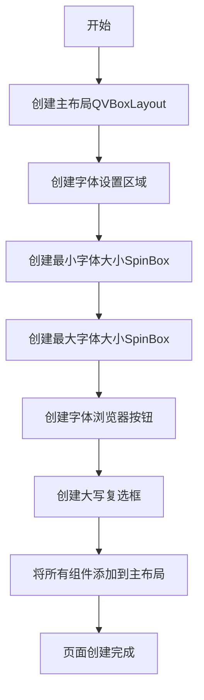

# `comic-translate\app\ui\settings\text_rendering_page.py` 详细设计文档

这是一个使用PySide6创建的文本渲染配置页面，允许用户设置最小和最大字体大小、导入字体文件(.ttf/.ttc/.otf/.woff/.woff2)以及选择是否将渲染的文本转换为大写。

## 整体流程



## 类结构

```
QtWidgets.QWidget (Qt基类)
└── TextRenderingPage (文本渲染配置页面)
```

## 全局变量及字段


### `TextRenderingPage.min_font_spinbox`
    
最小字体大小选择器

类型：`MSpinBox`
    


### `TextRenderingPage.max_font_spinbox`
    
最大字体大小选择器

类型：`MSpinBox`
    


### `TextRenderingPage.font_browser`
    
字体文件浏览器按钮

类型：`MClickBrowserFileToolButton`
    


### `TextRenderingPage.uppercase_checkbox`
    
大写文本渲染复选框

类型：`MCheckBox`
    
    

## 全局函数及方法


### TextRenderingPage.__init__

该方法初始化文本渲染配置页面，创建并布局字体大小设置（最小/最大字体）、字体文件导入及大小写转换等UI组件，用于配置图像文本渲染参数。

参数：

- `self`：实例本身，PySide6.QWidget，当前类的实例对象
- `parent`：PySide6.QWidget（可选），父窗口部件，传递给父类QWidget的构造参数，默认为None

返回值：`None`，无返回值（`__init__`方法）

#### 流程图

```mermaid
flowchart TD
    A[开始 __init__] --> B[调用父类构造 super().__init__parent]
    B --> C[创建主垂直布局 QVBoxLayout]
    C --> D[创建字体设置区域]
    D --> E[创建最小字体标签和MSpinBox]
    E --> F[设置最小字体spinbox属性: small, 宽度60, 最大值100, 默认值9]
    F --> G[创建最大字体标签和MSpinBox]
    G --> H[设置最大字体spinbox属性: small, 宽度60, 最大值100, 默认值40]
    H --> I[创建字体导入区域]
    I --> J[创建MClickBrowserFileToolButton字体浏览器]
    J --> K[设置字体浏览器过滤器: .ttf .ttc .otf .woff .woff2]
    K --> L[创建大写转换复选框 MCheckBox]
    L --> M[将所有组件添加到主布局]
    M --> N[结束]
    
    style A fill:#e1f5fe
    style N fill:#e8f5e8
```

#### 带注释源码

```python
def __init__(self, parent=None):
    """
    初始化文本渲染页面
    
    参数:
        parent: 父窗口部件，传递给QtWidgets.QWidget
    """
    # 调用父类的构造方法，将parent参数传递给QWidget
    super().__init__(parent)

    # 创建主垂直布局管理器，用于垂直排列所有UI组件
    layout = QtWidgets.QVBoxLayout(self)

    # ===== 字体设置区域 =====
    # 创建字体相关组件的嵌套布局
    font_layout = QtWidgets.QVBoxLayout()
    min_font_layout = QtWidgets.QHBoxLayout()  # 最小字体行的水平布局
    max_font_layout = QtWidgets.QHBoxLayout()  # 最大字体行的水平布局

    # 创建最小和最大字体标签
    min_font_label = MLabel(self.tr("Minimum Font Size:"))
    max_font_label = MLabel(self.tr("Maximum Font Size:"))

    # 创建最小字体spinbox（数字选择器），使用.small()样式
    self.min_font_spinbox = MSpinBox().small()
    self.min_font_spinbox.setFixedWidth(60)      # 设置固定宽度60像素
    self.min_font_spinbox.setMaximum(100)        # 设置最大值为100
    self.min_font_spinbox.setValue(9)            # 设置默认值为9

    # 创建最大字体spinbox，使用.small()样式
    self.max_font_spinbox = MSpinBox().small()
    self.max_font_spinbox.setFixedWidth(60)      # 设置固定宽度60像素
    self.max_font_spinbox.setMaximum(100)        # 设置最大值为100
    self.max_font_spinbox.setValue(40)           # 设置默认值为40

    # 将最小字体标签和spinbox添加到水平布局，并在末尾添加弹性空间
    min_font_layout.addWidget(min_font_label)
    min_font_layout.addWidget(self.min_font_spinbox)
    min_font_layout.addStretch()

    # 将最大字体标签和spinbox添加到水平布局，并在末尾添加弹性空间
    max_font_layout.addWidget(max_font_label)
    max_font_layout.addWidget(self.max_font_spinbox)
    max_font_layout.addStretch()

    # 创建字体标题标签，使用h4样式
    font_label = MLabel(self.tr("Font:")).h4()

    # ===== 字体导入区域 =====
    font_browser_layout = QtWidgets.QHBoxLayout()
    import_font_label = MLabel(self.tr("Import Font:"))
    
    # 创建字体文件浏览器按钮，支持多文件选择
    self.font_browser = MClickBrowserFileToolButton(multiple=True)
    # 设置允许导入的字体文件格式过滤器
    self.font_browser.set_dayu_filters([".ttf", ".ttc", ".otf", ".woff", ".woff2"])
    # 设置鼠标悬停提示信息
    self.font_browser.setToolTip(self.tr("Import the Font to use for Rendering Text on Images"))

    # 将导入标签和浏览器添加到水平布局
    font_browser_layout.addWidget(import_font_label)
    font_browser_layout.addWidget(self.font_browser)
    font_browser_layout.addStretch()

    # ===== 组装字体布局 =====
    # 按顺序添加标题、导入区域、最小/最大字体设置到字体布局
    font_layout.addWidget(font_label)
    font_layout.addLayout(font_browser_layout)
    font_layout.addLayout(min_font_layout)
    font_layout.addLayout(max_font_layout)

    # ===== 大写转换选项 =====
    # 创建大写渲染复选框
    self.uppercase_checkbox = MCheckBox(self.tr("Render Text in UpperCase"))

    # ===== 添加到主布局 =====
    # 按顺序将大写选项和字体布局添加到主垂直布局
    layout.addWidget(self.uppercase_checkbox)
    layout.addSpacing(10)         # 添加10像素间距
    layout.addLayout(font_layout) # 添加字体设置区域
    layout.addSpacing(10)         # 添加10像素间距
    layout.addStretch(1)          # 在末尾添加弹性空间，推高所有组件
```

## 关键组件


### 最小字体大小配置组件

用于设置文本渲染的最小字体大小，包含标签和微调框，默认值为9，最大值为100

### 最大字体大小配置组件

用于设置文本渲染的最大字体大小，包含标签和微调框，默认值为40，最大值为100

### 字体文件导入组件

支持导入多种字体格式（.ttf、.ttc、.otf、.woff、.woff2），允许选择多个字体文件，用于指定图像文本渲染所使用的字体

### 大小写转换选项

提供将渲染文本转换为大写的选项，通过复选框控制

### 垂直布局管理器

使用QVBoxLayout组织整个页面的垂直布局，包含间距和拉伸因子控制组件间距


## 问题及建议


### 已知问题

-   **缺少用户输入验证**：最小字体和最大字体没有联动验证，用户可以设置最小值大于最大值，导致逻辑错误
-   **缺少信号连接**：所有交互控件（字体浏览器、复选框、SpinBox）的信号均未连接到处理函数，控件状态变化无法触发业务逻辑
-   **缺少数据获取接口**：类中没有提供获取用户配置的公共方法（getter方法），外部无法获取用户设置的字体参数
-   **硬编码值过多**：字体大小范围（9-40）、宽度（60）、最大值（100）等均为硬编码，缺乏可配置性
-   **无文档字符串**：类和方法缺少docstring，不利于后续维护和代码理解
-   **布局嵌套过深**：多层级嵌套的布局增加了代码复杂度和维护成本
-   **重复代码**：min_font_spinbox和max_font_spinbox的配置逻辑大量重复，未提取为复用方法

### 优化建议

-   添加spinbox值变化信号连接，实现最小/最大值的动态验证，确保min ≤ max
-   为所有交互控件添加信号槽连接，或提供统一的信号接口供外部调用
-   封装get_config()或类似方法，返回包含字体路径、最小/最大字号、大小写设置等信息的字典或数据对象
-   将硬编码值提取为类常量或配置文件，如DEFAULT_MIN_FONT、DEFAULT_MAX_FONT、SPINBOX_WIDTH等
-   为类添加docstring，描述页面功能和用途
-   考虑使用Qt的FormLayout或GridLayout简化嵌套布局结构
-   提取SpinBox初始化逻辑为私有方法如_setup_spinbox()，接收参数以减少重复代码
-   考虑添加字体文件有效性验证逻辑，确保用户导入的字体文件可用


## 其它


### 设计目标与约束

本页面旨在为文本渲染功能提供用户配置界面，允许用户设置字体大小范围、导入自定义字体文件以及选择是否将文本转换为大写。约束条件包括：字体大小限制在0-100范围内，支持的字体文件格式为.ttf、.ttc、.otf、.woff、.woff2，字体浏览器支持多文件选择。

### 错误处理与异常设计

代码本身未包含显式的错误处理逻辑。潜在异常场景包括：字体文件路径无效或格式不支持、字体文件加载失败、spinbox值超出有效范围。建议添加文件类型验证、字体加载状态反馈机制，以及数值范围校验的边界处理。

### 数据流与状态机

数据流方向为：用户交互（输入数值/选择文件）→ Qt控件状态变更 → 控件信号触发（可供外部连接）→ 应用层处理。状态机包含：初始状态（默认值：最小字体9，最大字体40，无自定义字体，小写显示）、用户修改状态（用户调整参数）、提交状态（参数传递给渲染模块）。

### 外部依赖与接口契约

依赖项包括：PySide6.QtWidgets、dayu_widgets库的MLabel、MSpinBox、MClickBrowserFileToolButton、MCheckBox。对外接口契约：可通过访问self.min_font_spinbox、self.max_font_spinbox、self.font_browser、self.uppercase_checkbox获取各控件实例以读取用户配置；font_browser的set_dayu_filters方法用于设置文件过滤器。

### 用户交互流程

用户进入页面后，可通过两个spinbox设置最小和最大字体大小，通过font_browser按钮导入自定义字体文件，通过checkbox开关决定是否将文本渲染为大写。布局顺序为：复选框 → 字体区域（标题 → 导入按钮 → 最小字体 → 最大字体）。

### 信号与槽机制

页面未定义自定义信号。相关控件的信号包括：min_font_spinbox的valueChanged信号（值变化）、max_font_spinbox的valueChanged信号（值变化）、font_browser的信号（文件选择变化）、uppercase_checkbox的stateChanged信号（复选状态变化）。外部可通过连接这些信号获取用户配置变更。

### 国际化/本地化设计

代码使用了Qt的tr()方法进行字符串翻译支持，包括："Minimum Font Size:"、"Maximum Font Size:"、"Font:"、"Import Font:"、"Import the Font to use for Rendering Text on Images"、"Render Text in UpperCase"。所有用户可见文本均已国际化处理，便于多语言支持。

### 布局结构分析

主布局为QVBoxLayout，包含：uppercase_checkbox（带10像素间距）、font_layout（QVBoxLayout，内部包含：font_label、font_browser_layout、min_font_layout、max_font_layout）、最后添加stretch(1)将内容顶部对齐。font_browser_layout和min/max_font_layout均使用QHBoxLayout并在末尾添加stretch实现右对齐效果。

### 性能考量

页面在初始化时一次性创建所有控件，无动态加载需求。font_browser设置multiple=True支持多选但可能影响内存占用。spinbox固定宽度为60像素，建议根据实际字体大小需求调整或改为自适应宽度。

### 可扩展性设计

当前类继承自QtWidgets.QWidget，可方便地转换为QDialog或嵌入到其他容器中。建议将字体配置封装为独立的数据类（FontConfig），便于配置传递和持久化。font_browser的过滤器可通过set_dayu_filters动态调整，支持扩展其他字体格式。


    